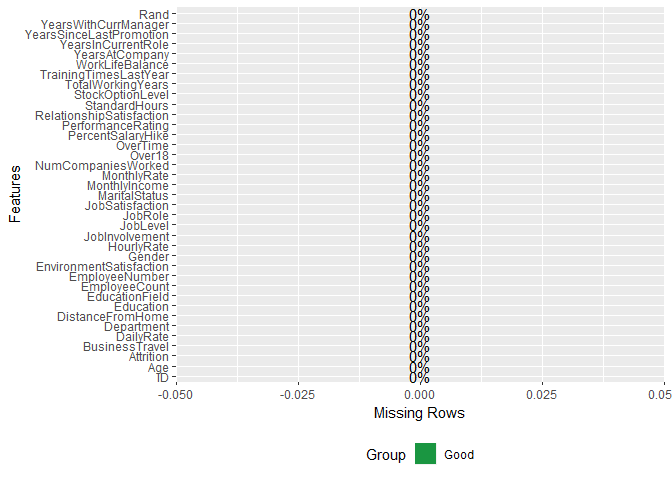
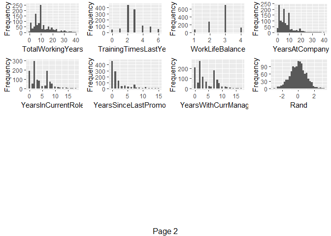
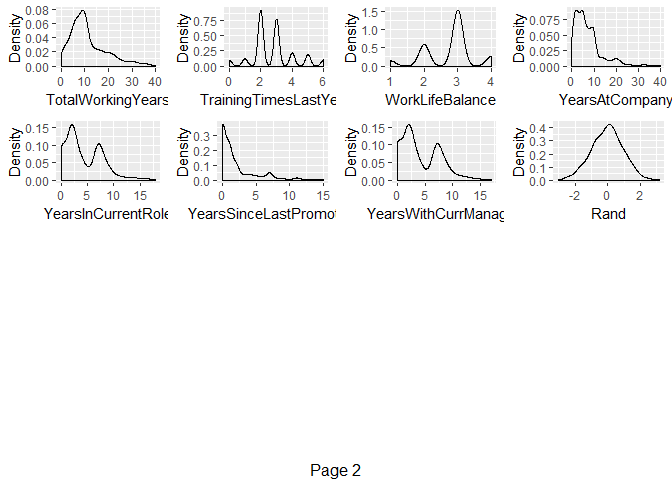
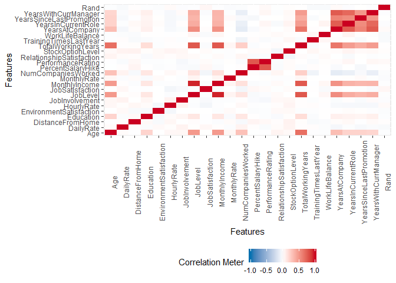

    MSDS 6306: Doing Data Science
    Case Study 02
    Due: Sunday, December 9th at 11:59pm. 

#### Description:
DDSAnalytics is an analytics company that specializes in talent management solutions for Fortune 1000 companies. Talent management is defined as the iterative process of developing and retaining employees. It may include workforce planning, employee training programs, identifying high-potential employees and reducing/preventing voluntary employee turnover (attrition). To gain a competitive edge over its competition, DDSAnalytics is planning to leverage data science for talent management. The executive leadership has identified predicting employee turnover as its first application of data science for talent management. Before the business green lights the project, they have tasked your data science team to conduct an analysis of existing employee data.


```r
#read in data
training_attrition <- read.csv("CaseStudy2-data.csv", header=T,na.strings=c(""))

#data prep and cleaning
#check for NAs
sapply(training_attrition,function(x) sum(is.na(x)))
```

```
##                       ID                      Age                Attrition 
##                        0                        0                        0 
##           BusinessTravel                DailyRate               Department 
##                        0                        0                        0 
##         DistanceFromHome                Education           EducationField 
##                        0                        0                        0 
##            EmployeeCount           EmployeeNumber  EnvironmentSatisfaction 
##                        0                        0                        0 
##                   Gender               HourlyRate           JobInvolvement 
##                        0                        0                        0 
##                 JobLevel                  JobRole          JobSatisfaction 
##                        0                        0                        0 
##            MaritalStatus            MonthlyIncome              MonthlyRate 
##                        0                        0                        0 
##       NumCompaniesWorked                   Over18                 OverTime 
##                        0                        0                        0 
##        PercentSalaryHike        PerformanceRating RelationshipSatisfaction 
##                        0                        0                        0 
##            StandardHours         StockOptionLevel        TotalWorkingYears 
##                        0                        0                        0 
##    TrainingTimesLastYear          WorkLifeBalance           YearsAtCompany 
##                        0                        0                        0 
##       YearsInCurrentRole  YearsSinceLastPromotion     YearsWithCurrManager 
##                        0                        0                        0 
##                     Rand 
##                        0
```

```r
#Graph of missing data
plot_missing(training_attrition)
```

<!-- -->

```r
#we can drop ID, EmployeeCount, EmployeeNumber, Over18, StandardHours
training_attrition <- subset(training_attrition,select=c(2,3,4,5,6,7,8,9,12,13,14,15,16,17,18,19,20,21,22,24,25,26,27,29,30,31,32,33,34,35,36,37))
```

#### Goal:
Conduct exploratory data analysis (EDA) to determine factors that lead to attrition.


```r
#Variables
plot_str(training_attrition)

#Continuous Variables
plot_histogram(training_attrition)
```

<!-- --><!-- -->

```r
plot_density(training_attrition)
```

<!-- --><!-- -->

```r
#bivariate/multivariate analysis

#Correlation analysis
plot_correlation(training_attrition, type = 'continuous','Attrition')
```

<!-- -->

```r
#Categorical Variables-Barplots
plot_bar(training_attrition)
```

<!-- -->

Looking at the first full model.

```r
#checking out the first model
model <- glm(Attrition ~.,family=binomial(link='logit'),data=training_attrition)
#print out the model
summary(model)
```

```
## 
## Call:
## glm(formula = Attrition ~ ., family = binomial(link = "logit"), 
##     data = training_attrition)
## 
## Deviance Residuals: 
##     Min       1Q   Median       3Q      Max  
## -1.6056  -0.4969  -0.2369  -0.0820   3.2272  
## 
## Coefficients:
##                                    Estimate Std. Error z value Pr(>|z|)
## (Intercept)                      -1.246e+01  6.925e+02  -0.018 0.985651
## Age                              -1.920e-02  1.512e-02  -1.270 0.203996
## BusinessTravelTravel_Frequently   1.858e+00  4.656e-01   3.990 6.61e-05
## BusinessTravelTravel_Rarely       9.570e-01  4.285e-01   2.233 0.025536
## DailyRate                        -3.838e-04  2.500e-04  -1.535 0.124673
## DepartmentResearch & Development  1.390e+01  6.925e+02   0.020 0.983990
## DepartmentSales                   1.261e+01  6.925e+02   0.018 0.985474
## DistanceFromHome                  4.375e-02  1.212e-02   3.609 0.000307
## Education                         2.224e-02  1.005e-01   0.221 0.824957
## EducationFieldLife Sciences      -6.970e-02  1.149e+00  -0.061 0.951620
## EducationFieldMarketing           2.023e-01  1.199e+00   0.169 0.866048
## EducationFieldMedical            -1.667e-01  1.152e+00  -0.145 0.884950
## EducationFieldOther              -5.034e-01  1.210e+00  -0.416 0.677380
## EducationFieldTechnical Degree    8.051e-01  1.160e+00   0.694 0.487554
## EnvironmentSatisfaction          -4.729e-01  9.519e-02  -4.967 6.79e-07
## GenderMale                        3.885e-01  2.096e-01   1.854 0.063730
## HourlyRate                        5.817e-03  5.039e-03   1.154 0.248351
## JobInvolvement                   -6.306e-01  1.390e-01  -4.536 5.75e-06
## JobLevel                         -3.189e-01  3.453e-01  -0.924 0.355737
## JobRoleHuman Resources            1.483e+01  6.925e+02   0.021 0.982919
## JobRoleLaboratory Technician      1.282e+00  5.148e-01   2.489 0.012794
## JobRoleManager                    1.451e-01  9.197e-01   0.158 0.874625
## JobRoleManufacturing Director    -6.612e-02  5.715e-01  -0.116 0.907900
## JobRoleResearch Director         -2.802e+00  1.337e+00  -2.095 0.036142
## JobRoleResearch Scientist         1.085e-01  5.312e-01   0.204 0.838080
## JobRoleSales Executive            2.029e+00  1.378e+00   1.472 0.140926
## JobRoleSales Representative       3.083e+00  1.429e+00   2.157 0.031018
## JobSatisfaction                  -3.930e-01  9.168e-02  -4.287 1.81e-05
## MaritalStatusMarried              5.914e-01  3.151e-01   1.877 0.060544
## MaritalStatusSingle               1.315e+00  3.991e-01   3.295 0.000986
## MonthlyIncome                     1.102e-04  8.962e-05   1.230 0.218785
## MonthlyRate                      -1.113e-05  1.419e-05  -0.785 0.432697
## NumCompaniesWorked                2.009e-01  4.389e-02   4.579 4.67e-06
## OverTimeYes                       1.960e+00  2.216e-01   8.846  < 2e-16
## PercentSalaryHike                -1.966e-02  4.497e-02  -0.437 0.661916
## PerformanceRating                 1.415e-01  4.583e-01   0.309 0.757582
## RelationshipSatisfaction         -1.933e-01  9.261e-02  -2.087 0.036845
## StockOptionLevel                 -2.066e-01  1.740e-01  -1.187 0.235221
## TotalWorkingYears                -8.197e-02  3.342e-02  -2.453 0.014183
## TrainingTimesLastYear            -1.715e-01  8.309e-02  -2.064 0.039021
## WorkLifeBalance                  -4.801e-01  1.400e-01  -3.429 0.000606
## YearsAtCompany                    1.087e-01  4.331e-02   2.509 0.012099
## YearsInCurrentRole               -1.472e-01  5.044e-02  -2.919 0.003513
## YearsSinceLastPromotion           1.856e-01  4.751e-02   3.906 9.37e-05
## YearsWithCurrManager             -1.218e-01  4.996e-02  -2.438 0.014779
## Rand                              6.996e-02  1.055e-01   0.663 0.507388
##                                     
## (Intercept)                         
## Age                                 
## BusinessTravelTravel_Frequently  ***
## BusinessTravelTravel_Rarely      *  
## DailyRate                           
## DepartmentResearch & Development    
## DepartmentSales                     
## DistanceFromHome                 ***
## Education                           
## EducationFieldLife Sciences         
## EducationFieldMarketing             
## EducationFieldMedical               
## EducationFieldOther                 
## EducationFieldTechnical Degree      
## EnvironmentSatisfaction          ***
## GenderMale                       .  
## HourlyRate                          
## JobInvolvement                   ***
## JobLevel                            
## JobRoleHuman Resources              
## JobRoleLaboratory Technician     *  
## JobRoleManager                      
## JobRoleManufacturing Director       
## JobRoleResearch Director         *  
## JobRoleResearch Scientist           
## JobRoleSales Executive              
## JobRoleSales Representative      *  
## JobSatisfaction                  ***
## MaritalStatusMarried             .  
## MaritalStatusSingle              ***
## MonthlyIncome                       
## MonthlyRate                         
## NumCompaniesWorked               ***
## OverTimeYes                      ***
## PercentSalaryHike                   
## PerformanceRating                   
## RelationshipSatisfaction         *  
## StockOptionLevel                    
## TotalWorkingYears                *  
## TrainingTimesLastYear            *  
## WorkLifeBalance                  ***
## YearsAtCompany                   *  
## YearsInCurrentRole               ** 
## YearsSinceLastPromotion          ***
## YearsWithCurrManager             *  
## Rand                                
## ---
## Signif. codes:  0 '***' 0.001 '**' 0.01 '*' 0.05 '.' 0.1 ' ' 1
## 
## (Dispersion parameter for binomial family taken to be 1)
## 
##     Null deviance: 1031.48  on 1169  degrees of freedom
## Residual deviance:  673.92  on 1124  degrees of freedom
## AIC: 765.92
## 
## Number of Fisher Scoring iterations: 15
```


Create a full EDA report


```
## 
## 
## processing file: report.rmd
```

```
## 
  |                                                                       
  |                                                                 |   0%
  |                                                                       
  |..                                                               |   2%
##   ordinary text without R code
## 
## 
  |                                                                       
  |...                                                              |   5%
## label: global_options (with options) 
## List of 1
##  $ include: logi FALSE
## 
## 
  |                                                                       
  |.....                                                            |   7%
##   ordinary text without R code
## 
## 
  |                                                                       
  |......                                                           |  10%
## label: introduce
## 
  |                                                                       
  |........                                                         |  12%
##   ordinary text without R code
## 
## 
  |                                                                       
  |.........                                                        |  14%
## label: plot_intro
```

```
## 
  |                                                                       
  |...........                                                      |  17%
##   ordinary text without R code
## 
## 
  |                                                                       
  |............                                                     |  19%
## label: data_structure
## 
  |                                                                       
  |..............                                                   |  21%
##   ordinary text without R code
## 
## 
  |                                                                       
  |...............                                                  |  24%
## label: missing_profile
```

```
## 
  |                                                                       
  |.................                                                |  26%
##   ordinary text without R code
## 
## 
  |                                                                       
  |...................                                              |  29%
## label: univariate_distribution_header
## 
  |                                                                       
  |....................                                             |  31%
##   ordinary text without R code
## 
## 
  |                                                                       
  |......................                                           |  33%
## label: plot_histogram
```

```
## 
  |                                                                       
  |.......................                                          |  36%
##   ordinary text without R code
## 
## 
  |                                                                       
  |.........................                                        |  38%
## label: plot_density
## 
  |                                                                       
  |..........................                                       |  40%
##   ordinary text without R code
## 
## 
  |                                                                       
  |............................                                     |  43%
## label: plot_frequency_bar
```

```
## 
  |                                                                       
  |.............................                                    |  45%
##   ordinary text without R code
## 
## 
  |                                                                       
  |...............................                                  |  48%
## label: plot_response_bar
## 
  |                                                                       
  |................................                                 |  50%
##   ordinary text without R code
## 
## 
  |                                                                       
  |..................................                               |  52%
## label: plot_with_bar
## 
  |                                                                       
  |....................................                             |  55%
##   ordinary text without R code
## 
## 
  |                                                                       
  |.....................................                            |  57%
## label: plot_normal_qq
```

```
## 
  |                                                                       
  |.......................................                          |  60%
##   ordinary text without R code
## 
## 
  |                                                                       
  |........................................                         |  62%
## label: plot_response_qq
```

```
## 
  |                                                                       
  |..........................................                       |  64%
##   ordinary text without R code
## 
## 
  |                                                                       
  |...........................................                      |  67%
## label: plot_by_qq
## 
  |                                                                       
  |.............................................                    |  69%
##   ordinary text without R code
## 
## 
  |                                                                       
  |..............................................                   |  71%
## label: correlation_analysis
```

```
## 
  |                                                                       
  |................................................                 |  74%
##   ordinary text without R code
## 
## 
  |                                                                       
  |..................................................               |  76%
## label: principle_component_analysis
```

```
## 
  |                                                                       
  |...................................................              |  79%
##   ordinary text without R code
## 
## 
  |                                                                       
  |.....................................................            |  81%
## label: bivariate_distribution_header
## 
  |                                                                       
  |......................................................           |  83%
##   ordinary text without R code
## 
## 
  |                                                                       
  |........................................................         |  86%
## label: plot_response_boxplot
```

```
## 
  |                                                                       
  |.........................................................        |  88%
##   ordinary text without R code
## 
## 
  |                                                                       
  |...........................................................      |  90%
## label: plot_by_boxplot
## 
  |                                                                       
  |............................................................     |  93%
##   ordinary text without R code
## 
## 
  |                                                                       
  |..............................................................   |  95%
## label: plot_response_scatterplot
```

```
## 
  |                                                                       
  |...............................................................  |  98%
##   ordinary text without R code
## 
## 
  |                                                                       
  |.................................................................| 100%
## label: plot_by_scatterplot
```

```
## output file: C:/Users/04616598/Box Sync/Documents/Data Sciance/GitHub/MSDS6306/MSDS6306/Case Study 2/report.knit.md
```

```
## "C:/Program Files/RStudio/bin/pandoc/pandoc" +RTS -K512m -RTS "C:/Users/04616598/Box Sync/Documents/Data Sciance/GitHub/MSDS6306/MSDS6306/Case Study 2/report.utf8.md" --to html4 --from markdown+autolink_bare_uris+ascii_identifiers+tex_math_single_backslash --output pandoc59882244e96.html --smart --email-obfuscation none --self-contained --standalone --section-divs --table-of-contents --toc-depth 6 --template "C:\R-3.5.1\library\rmarkdown\rmd\h\default.html" --no-highlight --variable highlightjs=1 --variable "theme:cerulean" --include-in-header "C:\Users\04616598\AppData\Local\Temp\Rtmp4UHt8Q\rmarkdown-str598839b223f8.html" --mathjax --variable "mathjax-url:https://mathjax.rstudio.com/latest/MathJax.js?config=TeX-AMS-MML_HTMLorMML"
```

```
## 
## Output created: Case Study 2 EDA.html
```

```
## 
## 
## Report is generated at "C:/Users/04616598/Box Sync/Documents/Data Sciance/GitHub/MSDS6306/MSDS6306/Case Study 2/Case Study 2 EDA.html".
```
