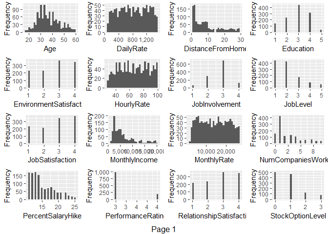
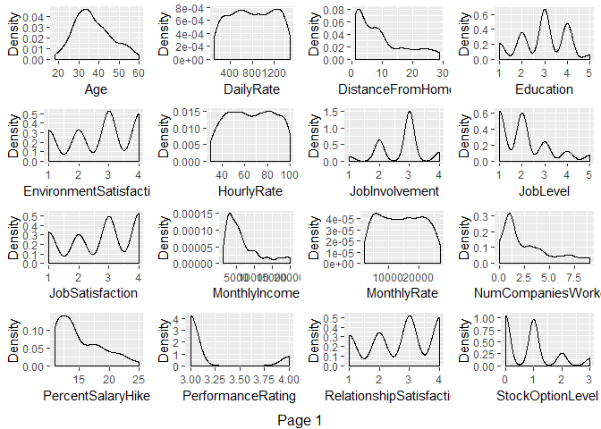
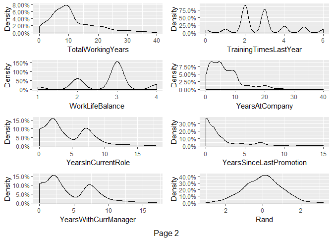
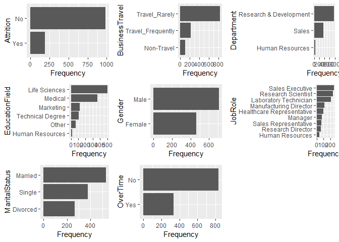
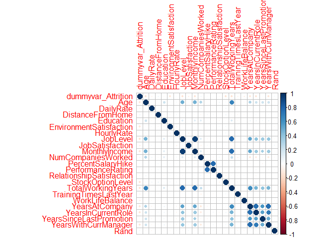
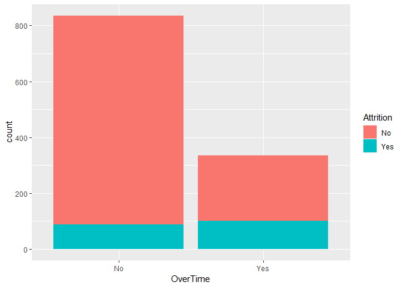
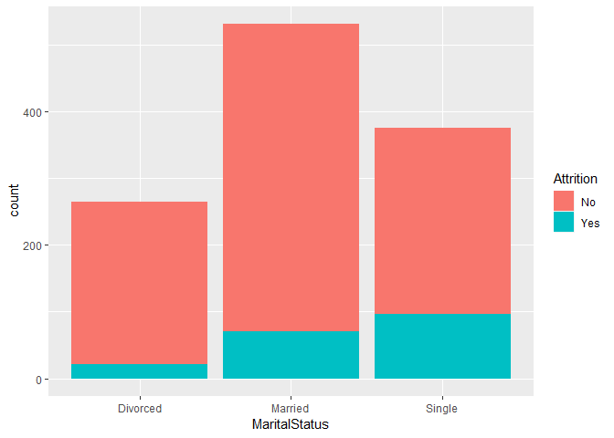
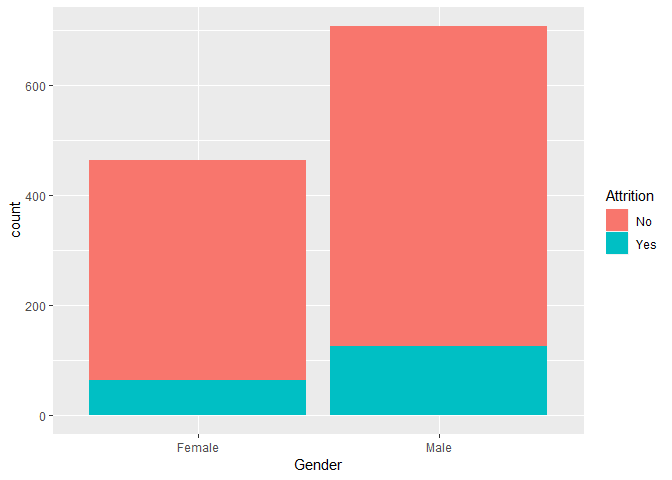
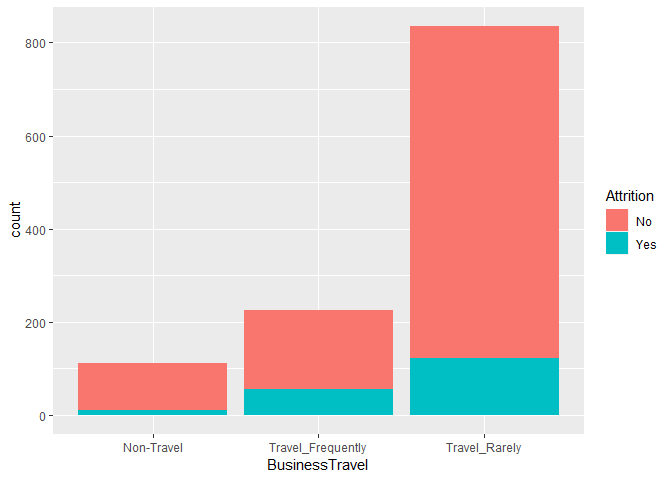
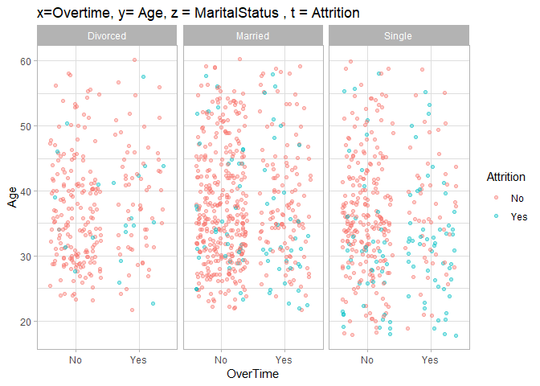

    MSDS 6306: Doing Data Science
    Case Study 02
    Due: Sunday, December 9th at 11:59pm. 

#### Description:
DDSAnalytics is an analytics company that specializes in talent management solutions for Fortune 1000 companies. Talent management is defined as the iterative process of developing and retaining employees. It may include workforce planning, employee training programs, identifying high-potential employees and reducing/preventing voluntary employee turnover (attrition). To gain a competitive edge over its competition, DDSAnalytics is planning to leverage data science for talent management. The executive leadership has identified predicting employee turnover as its first application of data science for talent management. Before the business green lights the project, they have tasked your data science team to conduct an analysis of existing employee data.


```r
#read in data

#setwd("/Users/jackson/Desktop/CaseStudy2/")
#setwd("/Box Sync/Documents/Data Sciance/GitHub/MSDS6306/MSDS6306/Case Study 2")

training_attrition <- read.csv("CaseStudy2-data.csv", header=T,na.strings=c(""))
validation_attrition <- read.csv("CaseStudy2Validation.csv", header=T,na.strings=c(""))

#data prep and cleaning
#check training_attrition for NAs
sapply(training_attrition,function(x) sum(is.na(x)))
```

```
##                       ID                      Age                Attrition 
##                        0                        0                        0 
##           BusinessTravel                DailyRate               Department 
##                        0                        0                        0 
##         DistanceFromHome                Education           EducationField 
##                        0                        0                        0 
##            EmployeeCount           EmployeeNumber  EnvironmentSatisfaction 
##                        0                        0                        0 
##                   Gender               HourlyRate           JobInvolvement 
##                        0                        0                        0 
##                 JobLevel                  JobRole          JobSatisfaction 
##                        0                        0                        0 
##            MaritalStatus            MonthlyIncome              MonthlyRate 
##                        0                        0                        0 
##       NumCompaniesWorked                   Over18                 OverTime 
##                        0                        0                        0 
##        PercentSalaryHike        PerformanceRating RelationshipSatisfaction 
##                        0                        0                        0 
##            StandardHours         StockOptionLevel        TotalWorkingYears 
##                        0                        0                        0 
##    TrainingTimesLastYear          WorkLifeBalance           YearsAtCompany 
##                        0                        0                        0 
##       YearsInCurrentRole  YearsSinceLastPromotion     YearsWithCurrManager 
##                        0                        0                        0 
##                     Rand 
##                        0
```

```r
#check validation_attrition for NAs
sapply(validation_attrition,function(x) sum(is.na(x)))
```

```
##                       ID                      Age                Attrition 
##                        0                        0                        0 
##           BusinessTravel                DailyRate               Department 
##                        0                        0                        0 
##         DistanceFromHome                Education           EducationField 
##                        0                        0                        0 
##            EmployeeCount           EmployeeNumber  EnvironmentSatisfaction 
##                        0                        0                        0 
##                   Gender               HourlyRate           JobInvolvement 
##                        0                        0                        0 
##                 JobLevel                  JobRole          JobSatisfaction 
##                        0                        0                        0 
##            MaritalStatus            MonthlyIncome              MonthlyRate 
##                        0                        0                        0 
##       NumCompaniesWorked                   Over18                 OverTime 
##                        0                        0                        0 
##        PercentSalaryHike        PerformanceRating RelationshipSatisfaction 
##                        0                        0                        0 
##            StandardHours         StockOptionLevel        TotalWorkingYears 
##                        0                        0                        0 
##    TrainingTimesLastYear          WorkLifeBalance           YearsAtCompany 
##                        0                        0                        0 
##       YearsInCurrentRole  YearsSinceLastPromotion     YearsWithCurrManager 
##                        0                        0                        0 
##                     Rand 
##                        0
```

```r
#we can drop ID, EmployeeCount, EmployeeNumber, Over18, StandardHours as they don't seem to important explanatory variables
training_attrition <- subset(training_attrition,select=c(2,3,4,5,6,7,8,9,12,13,14,15,16,17,18,19,20,21,22,24,25,26,27,29,30,31,32,33,34,35,36,37))
#dropping the same from the validation set as well
validation_attrition <- subset(validation_attrition,select=c(2,3,4,5,6,7,8,9,12,13,14,15,16,17,18,19,20,21,22,24,25,26,27,29,30,31,32,33,34,35,36,37))
```

#### Goal:
Conduct exploratory data analysis (EDA) to determine factors that lead to attrition.


```r
#Variables
#looking at the structure of the data
str(training_attrition)
```

```
## 'data.frame':	1170 obs. of  32 variables:
##  $ Age                     : int  31 51 27 24 45 32 42 47 20 31 ...
##  $ Attrition               : Factor w/ 2 levels "No","Yes": 2 1 1 1 1 2 1 1 2 1 ...
##  $ BusinessTravel          : Factor w/ 3 levels "Non-Travel","Travel_Frequently",..: 3 3 1 1 3 3 2 2 2 2 ...
##  $ DailyRate               : int  359 1405 443 1269 193 1045 1271 1309 769 798 ...
##  $ Department              : Factor w/ 3 levels "Human Resources",..: 1 2 2 2 2 3 2 3 3 2 ...
##  $ DistanceFromHome        : int  18 11 3 4 6 4 2 4 9 7 ...
##  $ Education               : int  5 2 3 1 4 4 1 1 3 2 ...
##  $ EducationField          : Factor w/ 6 levels "Human Resources",..: 1 6 4 2 5 4 4 4 3 2 ...
##  $ EnvironmentSatisfaction : int  4 4 4 1 4 4 2 2 4 3 ...
##  $ Gender                  : Factor w/ 2 levels "Female","Male": 2 1 2 2 2 2 2 2 1 1 ...
##  $ HourlyRate              : int  89 82 50 46 52 32 35 99 54 48 ...
##  $ JobInvolvement          : int  4 2 3 2 3 1 3 3 3 2 ...
##  $ JobLevel                : int  1 4 1 1 3 3 1 2 1 3 ...
##  $ JobRole                 : Factor w/ 9 levels "Healthcare Representative",..: 2 5 7 3 6 8 7 9 9 5 ...
##  $ JobSatisfaction         : int  1 2 4 4 1 4 4 3 4 3 ...
##  $ MaritalStatus           : Factor w/ 3 levels "Divorced","Married",..: 2 3 2 2 2 2 3 3 3 2 ...
##  $ MonthlyIncome           : int  2956 13142 1706 3162 13245 10400 2515 2976 2323 8943 ...
##  $ MonthlyRate             : int  21495 24439 16571 10778 15067 25812 9068 25751 17205 14034 ...
##  $ NumCompaniesWorked      : int  0 3 1 0 4 1 5 3 1 1 ...
##  $ OverTime                : Factor w/ 2 levels "No","Yes": 1 1 1 1 2 1 2 1 2 1 ...
##  $ PercentSalaryHike       : int  17 16 11 17 14 11 14 19 14 24 ...
##  $ PerformanceRating       : int  3 3 3 3 3 3 3 3 3 4 ...
##  $ RelationshipSatisfaction: int  3 2 3 4 2 3 4 1 2 1 ...
##  $ StockOptionLevel        : int  0 0 3 0 0 0 0 0 0 1 ...
##  $ TotalWorkingYears       : int  2 29 0 6 17 14 8 5 2 10 ...
##  $ TrainingTimesLastYear   : int  4 1 6 2 3 2 2 3 3 2 ...
##  $ WorkLifeBalance         : int  3 2 2 2 4 2 3 3 3 3 ...
##  $ YearsAtCompany          : int  1 5 0 5 0 14 2 0 2 10 ...
##  $ YearsInCurrentRole      : int  0 2 0 2 0 8 1 0 2 9 ...
##  $ YearsSinceLastPromotion : int  0 0 0 3 0 9 2 0 0 8 ...
##  $ YearsWithCurrManager    : int  0 3 0 4 0 8 2 0 2 9 ...
##  $ Rand                    : num  -0.773 0.355 1.67 -0.661 -0.215 ...
```

```r
#the dimensions of the data
dim(training_attrition)
```

```
## [1] 1170   32
```

```r
#looking at the distribution of the data
#high-level view of continuous variables
plot_histogram(training_attrition)
```

<!-- --><!-- -->

```r
plot_density(training_attrition)
```

<!-- --><!-- -->

```r
#high-level view of categorical variables
#Categorical Variables-Barplots
plot_bar(training_attrition)
```

<!-- -->

#### We will now start looking for the correlations in the data between variables. Note: We're including a dummy variable for 'Attrition' to see if any of the variables are highly correlated with 'Attrition' itself!

```r
#setting up the data for the correlations graph
dummyvar_training_attrition <- training_attrition[,c(1,4,6,7,9,11,13,15,17,19,21:32)]
dummyvar_Attrition = as.numeric(training_attrition$Attrition)- 1
dummyvar_training_attrition = cbind(dummyvar_Attrition, dummyvar_training_attrition)
#looking at the structure of the data
str(dummyvar_training_attrition)
```

```
## 'data.frame':	1170 obs. of  23 variables:
##  $ dummyvar_Attrition      : num  1 0 0 0 0 1 0 0 1 0 ...
##  $ Age                     : int  31 51 27 24 45 32 42 47 20 31 ...
##  $ DailyRate               : int  359 1405 443 1269 193 1045 1271 1309 769 798 ...
##  $ DistanceFromHome        : int  18 11 3 4 6 4 2 4 9 7 ...
##  $ Education               : int  5 2 3 1 4 4 1 1 3 2 ...
##  $ EnvironmentSatisfaction : int  4 4 4 1 4 4 2 2 4 3 ...
##  $ HourlyRate              : int  89 82 50 46 52 32 35 99 54 48 ...
##  $ JobLevel                : int  1 4 1 1 3 3 1 2 1 3 ...
##  $ JobSatisfaction         : int  1 2 4 4 1 4 4 3 4 3 ...
##  $ MonthlyIncome           : int  2956 13142 1706 3162 13245 10400 2515 2976 2323 8943 ...
##  $ NumCompaniesWorked      : int  0 3 1 0 4 1 5 3 1 1 ...
##  $ PercentSalaryHike       : int  17 16 11 17 14 11 14 19 14 24 ...
##  $ PerformanceRating       : int  3 3 3 3 3 3 3 3 3 4 ...
##  $ RelationshipSatisfaction: int  3 2 3 4 2 3 4 1 2 1 ...
##  $ StockOptionLevel        : int  0 0 3 0 0 0 0 0 0 1 ...
##  $ TotalWorkingYears       : int  2 29 0 6 17 14 8 5 2 10 ...
##  $ TrainingTimesLastYear   : int  4 1 6 2 3 2 2 3 3 2 ...
##  $ WorkLifeBalance         : int  3 2 2 2 4 2 3 3 3 3 ...
##  $ YearsAtCompany          : int  1 5 0 5 0 14 2 0 2 10 ...
##  $ YearsInCurrentRole      : int  0 2 0 2 0 8 1 0 2 9 ...
##  $ YearsSinceLastPromotion : int  0 0 0 3 0 9 2 0 0 8 ...
##  $ YearsWithCurrManager    : int  0 3 0 4 0 8 2 0 2 9 ...
##  $ Rand                    : num  -0.773 0.355 1.67 -0.661 -0.215 ...
```

```r
#looking at the correlations in the data
library(corrplot)
```

```
## corrplot 0.84 loaded
```

```r
corr_matrix <- cor(dummyvar_training_attrition)
corrplot(corr_matrix, method="circle")
```

<!-- -->

#### Next we will find out how many correlations are bigger than 0.7 as this typically signals high correlation.

```r
#this func will give me correlations bigger than 0.70
val = 0
for(i in 1:23){
  for(r in 1:23){
    if(corr_matrix[i,r]> 0.70 & i != r){
      val= val + 1
    }
  }  }
  print(val/2)
```

```
## [1] 7
```

##### There are 7 explanatory variables that are over 0.7 in terms of Pearson's R coefficient!  We will make some observations about each explanatory variables and their subjectivity to attrition.

```r
#looking at the top 7 over 0.70
# Overtime vs Attiriton
ot <- ggplot(training_attrition, aes(OverTime,fill = Attrition))
ot <- ot + geom_histogram(stat="count")
```

```
## Warning: Ignoring unknown parameters: binwidth, bins, pad
```

```r
print(ot)
```

<!-- -->

```r
tapply(as.numeric(training_attrition$Attrition) - 1 ,training_attrition$OverTime,mean)
```

```
##        No       Yes 
## 0.1053892 0.2985075
```
This chart shows that people who work overtime have more attrition.


```r
### MaritalStatus vs Attiriton
ms <- ggplot(training_attrition, aes(MaritalStatus,fill = Attrition))
ms <- ms + geom_histogram(stat="count")
```

```
## Warning: Ignoring unknown parameters: binwidth, bins, pad
```

```r
print(ms)
```

<!-- -->

```r
tapply(as.numeric(training_attrition$Attrition) - 1 ,training_attrition$MaritalStatus,mean)
```

```
##   Divorced    Married     Single 
## 0.07954545 0.13370998 0.25600000
```
Single people have more tendency to be subject to attrition.


```r
###JobRole vs Attrition
jr <- ggplot(training_attrition, aes(JobRole,fill = Attrition))
jr <- jr + geom_histogram(stat="count") +
  theme(axis.text.x=element_text(angle=45,hjust=1))
```

```
## Warning: Ignoring unknown parameters: binwidth, bins, pad
```

```r
print(jr)
```

<!-- -->

```r
tapply(as.numeric(training_attrition$Attrition) - 1 ,training_attrition$JobRole,mean)
```

```
## Healthcare Representative           Human Resources 
##                0.08910891                0.16216216 
##     Laboratory Technician                   Manager 
##                0.24413146                0.05128205 
##    Manufacturing Director         Research Director 
##                0.06896552                0.01562500 
##        Research Scientist           Sales Executive 
##                0.14705882                0.18217054 
##      Sales Representative 
##                0.40000000
```

```r
mean(as.numeric(training_attrition$Attrition) - 1)
```

```
## [1] 0.1606838
```
Here we can see that sales representative roles, human resources workers, laboratory technicians and sales executive have more attrition than other roles given in the data set.


```r
###Gender vs Attrition
g <- ggplot(training_attrition, aes(Gender,fill = Attrition))
g <- g + geom_histogram(stat="count")
```

```
## Warning: Ignoring unknown parameters: binwidth, bins, pad
```

```r
print(g)
```

<!-- -->

```r
tapply(as.numeric(training_attrition$Attrition) - 1 ,training_attrition$Gender,mean)
```

```
##    Female      Male 
## 0.1360691 0.1768034
```
Gender doesn't seem to play much of a role in attrition.


```r
###EducationField vs Attrition
ef <- ggplot(training_attrition, aes(EducationField,fill = Attrition))
ef <- ef + geom_histogram(stat="count") +
  theme(axis.text.x=element_text(angle=45,hjust=1))
```

```
## Warning: Ignoring unknown parameters: binwidth, bins, pad
```

```r
print(ef)
```

<!-- -->

```r
tapply(as.numeric(training_attrition$Attrition) - 1 ,training_attrition$EducationField,mean)
```

```
##  Human Resources    Life Sciences        Marketing          Medical 
##        0.1250000        0.1543086        0.2148760        0.1366120 
##            Other Technical Degree 
##        0.1111111        0.2476190
```
Workers holding technical and marketing degrees are outstanding with a high attrition ratio.


```r
###Department vs Attrition
dpt <- ggplot(training_attrition, aes(Department,fill = Attrition))
dpt <- dpt + geom_histogram(stat="count")
```

```
## Warning: Ignoring unknown parameters: binwidth, bins, pad
```

```r
print(dpt)
```

<!-- -->

```r
tapply(as.numeric(training_attrition$Attrition) - 1 ,training_attrition$Department,mean)
```

```
##        Human Resources Research & Development                  Sales 
##              0.1304348              0.1397154              0.2108262
```
Results in this area are showing that the Sales Department has the highest rate of attrition.


```r
###BusinessTravel vs Attrition
bt <- ggplot(training_attrition, aes(BusinessTravel,fill = Attrition))
bt <- bt + geom_histogram(stat="count")
```

```
## Warning: Ignoring unknown parameters: binwidth, bins, pad
```

```r
print(bt)
```

<!-- -->

```r
tapply(as.numeric(training_attrition$Attrition) - 1 ,training_attrition$BusinessTravel,mean)
```

```
##        Non-Travel Travel_Frequently     Travel_Rarely 
##        0.09090909        0.24888889        0.14610778
```
Looking at travel versus non travel, we see that those who travel more frequently have a higher probability of attrition.


```r
### x=Overtime, y= Age, z = MaritalStatus , t = Attrition
ggplot(training_attrition, aes(OverTime, Age)) +  
  facet_grid(.~MaritalStatus) +
  geom_jitter(aes(color = Attrition),alpha = 0.4) +  
  ggtitle("x=Overtime, y= Age, z = MaritalStatus , t = Attrition") +  
  theme_light()
```

<!-- -->

This graph shows that single people around (~) the age of 35, working overtime are subject to attrition.

#### To summarize, here were the correlations above 0.7:
1. The most outstanding result is between Job Level and Monthly income, whose correlation is 0.95.
2. A higher performance rating shows a more Percent salary hike, whose correlation is 0.772.
3. The more years working for the company, the higher Job Levels, whose correlation is 0.77.
4. The more total years working for the company, the higher their monthly income, whose correlation is 0.77.
5. The more years with their current manager, the more years they were at the company, whose correlation is 0.763.
6. The last two show more logical trends. The more years at the company, the more years they are in their current role, whose correlation is 0.753.
7. Lastly, the more years with their current manager, the more years in their current role, whose correlation is 0.71.

### Predictions with logistic regression

```r
#loading the needed liraries
library(caTools)
library(e1071)
library(glmnet)
```

```
## Loading required package: Matrix
```

```
## Loading required package: foreach
```

```
## Loaded glmnet 2.0-16
```

```r
#setting up both the training and validation data for our first model (because we want to improve later!)
training_attrition_model1 = training_attrition[,-c(4,8,10,14,17,26)] 
#taking out dailyrate + monthlyincome because it's similar to monthlyrate
#taking out Education + JobRole fields as they could be covered in the Department field. Taking out Gender as the EDA showed an insignificant difference between male and female.
#training seems irrelevant
validation_attrition_model1 = validation_attrition[,-c(4,8,10,14,17,26)]

str(training_attrition)
```

```
## 'data.frame':	1170 obs. of  32 variables:
##  $ Age                     : int  31 51 27 24 45 32 42 47 20 31 ...
##  $ Attrition               : Factor w/ 2 levels "No","Yes": 2 1 1 1 1 2 1 1 2 1 ...
##  $ BusinessTravel          : Factor w/ 3 levels "Non-Travel","Travel_Frequently",..: 3 3 1 1 3 3 2 2 2 2 ...
##  $ DailyRate               : int  359 1405 443 1269 193 1045 1271 1309 769 798 ...
##  $ Department              : Factor w/ 3 levels "Human Resources",..: 1 2 2 2 2 3 2 3 3 2 ...
##  $ DistanceFromHome        : int  18 11 3 4 6 4 2 4 9 7 ...
##  $ Education               : int  5 2 3 1 4 4 1 1 3 2 ...
##  $ EducationField          : Factor w/ 6 levels "Human Resources",..: 1 6 4 2 5 4 4 4 3 2 ...
##  $ EnvironmentSatisfaction : int  4 4 4 1 4 4 2 2 4 3 ...
##  $ Gender                  : Factor w/ 2 levels "Female","Male": 2 1 2 2 2 2 2 2 1 1 ...
##  $ HourlyRate              : int  89 82 50 46 52 32 35 99 54 48 ...
##  $ JobInvolvement          : int  4 2 3 2 3 1 3 3 3 2 ...
##  $ JobLevel                : int  1 4 1 1 3 3 1 2 1 3 ...
##  $ JobRole                 : Factor w/ 9 levels "Healthcare Representative",..: 2 5 7 3 6 8 7 9 9 5 ...
##  $ JobSatisfaction         : int  1 2 4 4 1 4 4 3 4 3 ...
##  $ MaritalStatus           : Factor w/ 3 levels "Divorced","Married",..: 2 3 2 2 2 2 3 3 3 2 ...
##  $ MonthlyIncome           : int  2956 13142 1706 3162 13245 10400 2515 2976 2323 8943 ...
##  $ MonthlyRate             : int  21495 24439 16571 10778 15067 25812 9068 25751 17205 14034 ...
##  $ NumCompaniesWorked      : int  0 3 1 0 4 1 5 3 1 1 ...
##  $ OverTime                : Factor w/ 2 levels "No","Yes": 1 1 1 1 2 1 2 1 2 1 ...
##  $ PercentSalaryHike       : int  17 16 11 17 14 11 14 19 14 24 ...
##  $ PerformanceRating       : int  3 3 3 3 3 3 3 3 3 4 ...
##  $ RelationshipSatisfaction: int  3 2 3 4 2 3 4 1 2 1 ...
##  $ StockOptionLevel        : int  0 0 3 0 0 0 0 0 0 1 ...
##  $ TotalWorkingYears       : int  2 29 0 6 17 14 8 5 2 10 ...
##  $ TrainingTimesLastYear   : int  4 1 6 2 3 2 2 3 3 2 ...
##  $ WorkLifeBalance         : int  3 2 2 2 4 2 3 3 3 3 ...
##  $ YearsAtCompany          : int  1 5 0 5 0 14 2 0 2 10 ...
##  $ YearsInCurrentRole      : int  0 2 0 2 0 8 1 0 2 9 ...
##  $ YearsSinceLastPromotion : int  0 0 0 3 0 9 2 0 0 8 ...
##  $ YearsWithCurrManager    : int  0 3 0 4 0 8 2 0 2 9 ...
##  $ Rand                    : num  -0.773 0.355 1.67 -0.661 -0.215 ...
```

```r
#looking at the structure of both data sets
str(training_attrition_model1)
```

```
## 'data.frame':	1170 obs. of  26 variables:
##  $ Age                     : int  31 51 27 24 45 32 42 47 20 31 ...
##  $ Attrition               : Factor w/ 2 levels "No","Yes": 2 1 1 1 1 2 1 1 2 1 ...
##  $ BusinessTravel          : Factor w/ 3 levels "Non-Travel","Travel_Frequently",..: 3 3 1 1 3 3 2 2 2 2 ...
##  $ Department              : Factor w/ 3 levels "Human Resources",..: 1 2 2 2 2 3 2 3 3 2 ...
##  $ DistanceFromHome        : int  18 11 3 4 6 4 2 4 9 7 ...
##  $ Education               : int  5 2 3 1 4 4 1 1 3 2 ...
##  $ EnvironmentSatisfaction : int  4 4 4 1 4 4 2 2 4 3 ...
##  $ HourlyRate              : int  89 82 50 46 52 32 35 99 54 48 ...
##  $ JobInvolvement          : int  4 2 3 2 3 1 3 3 3 2 ...
##  $ JobLevel                : int  1 4 1 1 3 3 1 2 1 3 ...
##  $ JobSatisfaction         : int  1 2 4 4 1 4 4 3 4 3 ...
##  $ MaritalStatus           : Factor w/ 3 levels "Divorced","Married",..: 2 3 2 2 2 2 3 3 3 2 ...
##  $ MonthlyRate             : int  21495 24439 16571 10778 15067 25812 9068 25751 17205 14034 ...
##  $ NumCompaniesWorked      : int  0 3 1 0 4 1 5 3 1 1 ...
##  $ OverTime                : Factor w/ 2 levels "No","Yes": 1 1 1 1 2 1 2 1 2 1 ...
##  $ PercentSalaryHike       : int  17 16 11 17 14 11 14 19 14 24 ...
##  $ PerformanceRating       : int  3 3 3 3 3 3 3 3 3 4 ...
##  $ RelationshipSatisfaction: int  3 2 3 4 2 3 4 1 2 1 ...
##  $ StockOptionLevel        : int  0 0 3 0 0 0 0 0 0 1 ...
##  $ TotalWorkingYears       : int  2 29 0 6 17 14 8 5 2 10 ...
##  $ WorkLifeBalance         : int  3 2 2 2 4 2 3 3 3 3 ...
##  $ YearsAtCompany          : int  1 5 0 5 0 14 2 0 2 10 ...
##  $ YearsInCurrentRole      : int  0 2 0 2 0 8 1 0 2 9 ...
##  $ YearsSinceLastPromotion : int  0 0 0 3 0 9 2 0 0 8 ...
##  $ YearsWithCurrManager    : int  0 3 0 4 0 8 2 0 2 9 ...
##  $ Rand                    : num  -0.773 0.355 1.67 -0.661 -0.215 ...
```

```r
str(validation_attrition_model1)
```

```
## 'data.frame':	300 obs. of  26 variables:
##  $ Age                     : int  43 35 55 48 37 44 36 27 39 20 ...
##  $ Attrition               : Factor w/ 2 levels "No","Yes": 1 1 1 1 1 1 1 1 1 2 ...
##  $ BusinessTravel          : Factor w/ 3 levels "Non-Travel","Travel_Frequently",..: 3 3 2 3 2 2 3 3 2 3 ...
##  $ Department              : Factor w/ 3 levels "Human Resources",..: 2 3 2 3 3 3 2 2 2 2 ...
##  $ DistanceFromHome        : int  7 1 2 29 21 1 1 5 22 10 ...
##  $ Education               : int  3 3 1 1 2 5 3 1 3 1 ...
##  $ EnvironmentSatisfaction : int  3 2 4 1 3 1 3 3 4 4 ...
##  $ HourlyRate              : int  43 85 65 91 54 79 35 42 82 32 ...
##  $ JobInvolvement          : int  3 3 3 3 3 3 3 2 3 3 ...
##  $ JobLevel                : int  3 2 3 3 1 2 2 3 3 1 ...
##  $ JobSatisfaction         : int  1 3 2 3 4 3 2 4 1 3 ...
##  $ MaritalStatus           : Factor w/ 3 levels "Divorced","Married",..: 2 2 2 2 2 2 2 1 3 3 ...
##  $ MonthlyRate             : int  9262 18659 15813 23978 21222 9282 23361 8842 5083 26999 ...
##  $ NumCompaniesWorked      : int  8 9 3 3 5 7 0 1 1 1 ...
##  $ OverTime                : Factor w/ 2 levels "No","Yes": 1 1 1 1 1 1 1 2 2 2 ...
##  $ PercentSalaryHike       : int  16 11 18 21 15 12 15 16 13 11 ...
##  $ PerformanceRating       : int  3 3 3 4 3 3 3 3 3 3 ...
##  $ RelationshipSatisfaction: int  1 3 2 2 2 3 1 2 3 4 ...
##  $ StockOptionLevel        : int  1 0 1 1 1 1 1 1 0 0 ...
##  $ TotalWorkingYears       : int  10 15 23 15 10 11 10 9 21 1 ...
##  $ WorkLifeBalance         : int  2 3 3 1 3 2 3 3 3 3 ...
##  $ YearsAtCompany          : int  1 11 3 0 5 1 9 9 21 1 ...
##  $ YearsInCurrentRole      : int  0 9 2 0 4 0 7 8 6 0 ...
##  $ YearsSinceLastPromotion : int  0 6 1 0 0 0 0 0 2 1 ...
##  $ YearsWithCurrManager    : int  0 9 2 0 0 0 5 8 8 1 ...
##  $ Rand                    : num  -0.0245 -0.3341 0.0462 1.831 1.2296 ...
```

```r
#simplifining the names
train_m1 <- training_attrition_model1
test_m1 <- validation_attrition_model1
#using glm to train the full model with a binomial setting
model1_glm_binomial <- glm(Attrition ~ ., data = train_m1, family='binomial')
#running the test data through the model
predicted_glm_binomial <- predict(model1_glm_binomial, test_m1, type='response')
predicted_glm_binomial <- ifelse(predicted_glm_binomial > 0.5,1,0)
summary(model1_glm_binomial)
```

```
## 
## Call:
## glm(formula = Attrition ~ ., family = "binomial", data = train_m1)
## 
## Deviance Residuals: 
##     Min       1Q   Median       3Q      Max  
## -1.7907  -0.5146  -0.2823  -0.1087   3.3248  
## 
## Coefficients:
##                                    Estimate Std. Error z value Pr(>|z|)
## (Intercept)                       2.543e+00  1.471e+00   1.728 0.083919
## Age                              -2.069e-02  1.441e-02  -1.436 0.150928
## BusinessTravelTravel_Frequently   1.822e+00  4.586e-01   3.974 7.06e-05
## BusinessTravelTravel_Rarely       9.544e-01  4.274e-01   2.233 0.025561
## DepartmentResearch & Development -5.410e-01  5.067e-01  -1.068 0.285654
## DepartmentSales                   2.661e-01  5.171e-01   0.515 0.606836
## DistanceFromHome                  4.006e-02  1.150e-02   3.485 0.000493
## Education                        -1.890e-02  9.439e-02  -0.200 0.841261
## EnvironmentSatisfaction          -4.307e-01  9.048e-02  -4.760 1.94e-06
## HourlyRate                        3.877e-03  4.782e-03   0.811 0.417526
## JobInvolvement                   -6.237e-01  1.342e-01  -4.648 3.35e-06
## JobLevel                         -4.274e-01  1.697e-01  -2.519 0.011781
## JobSatisfaction                  -4.057e-01  8.765e-02  -4.629 3.68e-06
## MaritalStatusMarried              5.424e-01  3.058e-01   1.774 0.076110
## MaritalStatusSingle               1.287e+00  3.791e-01   3.395 0.000687
## MonthlyRate                      -1.137e-05  1.359e-05  -0.837 0.402605
## NumCompaniesWorked                1.894e-01  4.114e-02   4.603 4.16e-06
## OverTimeYes                       1.739e+00  2.044e-01   8.506  < 2e-16
## PercentSalaryHike                -2.355e-02  4.241e-02  -0.555 0.578654
## PerformanceRating                 2.134e-01  4.327e-01   0.493 0.621853
## RelationshipSatisfaction         -1.753e-01  8.866e-02  -1.978 0.047969
## StockOptionLevel                 -1.728e-01  1.615e-01  -1.070 0.284717
## TotalWorkingYears                -7.095e-02  3.161e-02  -2.244 0.024807
## WorkLifeBalance                  -4.214e-01  1.319e-01  -3.195 0.001397
## YearsAtCompany                    9.473e-02  4.194e-02   2.258 0.023917
## YearsInCurrentRole               -1.481e-01  4.826e-02  -3.069 0.002150
## YearsSinceLastPromotion           2.011e-01  4.619e-02   4.354 1.34e-05
## YearsWithCurrManager             -1.142e-01  4.964e-02  -2.301 0.021403
## Rand                              1.200e-01  1.012e-01   1.185 0.235995
##                                     
## (Intercept)                      .  
## Age                                 
## BusinessTravelTravel_Frequently  ***
## BusinessTravelTravel_Rarely      *  
## DepartmentResearch & Development    
## DepartmentSales                     
## DistanceFromHome                 ***
## Education                           
## EnvironmentSatisfaction          ***
## HourlyRate                          
## JobInvolvement                   ***
## JobLevel                         *  
## JobSatisfaction                  ***
## MaritalStatusMarried             .  
## MaritalStatusSingle              ***
## MonthlyRate                         
## NumCompaniesWorked               ***
## OverTimeYes                      ***
## PercentSalaryHike                   
## PerformanceRating                   
## RelationshipSatisfaction         *  
## StockOptionLevel                    
## TotalWorkingYears                *  
## WorkLifeBalance                  ** 
## YearsAtCompany                   *  
## YearsInCurrentRole               ** 
## YearsSinceLastPromotion          ***
## YearsWithCurrManager             *  
## Rand                                
## ---
## Signif. codes:  0 '***' 0.001 '**' 0.01 '*' 0.05 '.' 0.1 ' ' 1
## 
## (Dispersion parameter for binomial family taken to be 1)
## 
##     Null deviance: 1031.5  on 1169  degrees of freedom
## Residual deviance:  721.9  on 1141  degrees of freedom
## AIC: 779.9
## 
## Number of Fisher Scoring iterations: 6
```

```r
#using glm to train the full model with a logit setting
model1_glm_logit <- glm(Attrition ~.,family=binomial(link='logit'),data=train_m1)
#running the test data through the model
predicted_glm_logit <- predict(model1_glm_logit, test_m1, type='response')
predicted_glm_logit <- ifelse(predicted_glm_logit > 0.5,1,0)
summary(model1_glm_logit)
```

```
## 
## Call:
## glm(formula = Attrition ~ ., family = binomial(link = "logit"), 
##     data = train_m1)
## 
## Deviance Residuals: 
##     Min       1Q   Median       3Q      Max  
## -1.7907  -0.5146  -0.2823  -0.1087   3.3248  
## 
## Coefficients:
##                                    Estimate Std. Error z value Pr(>|z|)
## (Intercept)                       2.543e+00  1.471e+00   1.728 0.083919
## Age                              -2.069e-02  1.441e-02  -1.436 0.150928
## BusinessTravelTravel_Frequently   1.822e+00  4.586e-01   3.974 7.06e-05
## BusinessTravelTravel_Rarely       9.544e-01  4.274e-01   2.233 0.025561
## DepartmentResearch & Development -5.410e-01  5.067e-01  -1.068 0.285654
## DepartmentSales                   2.661e-01  5.171e-01   0.515 0.606836
## DistanceFromHome                  4.006e-02  1.150e-02   3.485 0.000493
## Education                        -1.890e-02  9.439e-02  -0.200 0.841261
## EnvironmentSatisfaction          -4.307e-01  9.048e-02  -4.760 1.94e-06
## HourlyRate                        3.877e-03  4.782e-03   0.811 0.417526
## JobInvolvement                   -6.237e-01  1.342e-01  -4.648 3.35e-06
## JobLevel                         -4.274e-01  1.697e-01  -2.519 0.011781
## JobSatisfaction                  -4.057e-01  8.765e-02  -4.629 3.68e-06
## MaritalStatusMarried              5.424e-01  3.058e-01   1.774 0.076110
## MaritalStatusSingle               1.287e+00  3.791e-01   3.395 0.000687
## MonthlyRate                      -1.137e-05  1.359e-05  -0.837 0.402605
## NumCompaniesWorked                1.894e-01  4.114e-02   4.603 4.16e-06
## OverTimeYes                       1.739e+00  2.044e-01   8.506  < 2e-16
## PercentSalaryHike                -2.355e-02  4.241e-02  -0.555 0.578654
## PerformanceRating                 2.134e-01  4.327e-01   0.493 0.621853
## RelationshipSatisfaction         -1.753e-01  8.866e-02  -1.978 0.047969
## StockOptionLevel                 -1.728e-01  1.615e-01  -1.070 0.284717
## TotalWorkingYears                -7.095e-02  3.161e-02  -2.244 0.024807
## WorkLifeBalance                  -4.214e-01  1.319e-01  -3.195 0.001397
## YearsAtCompany                    9.473e-02  4.194e-02   2.258 0.023917
## YearsInCurrentRole               -1.481e-01  4.826e-02  -3.069 0.002150
## YearsSinceLastPromotion           2.011e-01  4.619e-02   4.354 1.34e-05
## YearsWithCurrManager             -1.142e-01  4.964e-02  -2.301 0.021403
## Rand                              1.200e-01  1.012e-01   1.185 0.235995
##                                     
## (Intercept)                      .  
## Age                                 
## BusinessTravelTravel_Frequently  ***
## BusinessTravelTravel_Rarely      *  
## DepartmentResearch & Development    
## DepartmentSales                     
## DistanceFromHome                 ***
## Education                           
## EnvironmentSatisfaction          ***
## HourlyRate                          
## JobInvolvement                   ***
## JobLevel                         *  
## JobSatisfaction                  ***
## MaritalStatusMarried             .  
## MaritalStatusSingle              ***
## MonthlyRate                         
## NumCompaniesWorked               ***
## OverTimeYes                      ***
## PercentSalaryHike                   
## PerformanceRating                   
## RelationshipSatisfaction         *  
## StockOptionLevel                    
## TotalWorkingYears                *  
## WorkLifeBalance                  ** 
## YearsAtCompany                   *  
## YearsInCurrentRole               ** 
## YearsSinceLastPromotion          ***
## YearsWithCurrManager             *  
## Rand                                
## ---
## Signif. codes:  0 '***' 0.001 '**' 0.01 '*' 0.05 '.' 0.1 ' ' 1
## 
## (Dispersion parameter for binomial family taken to be 1)
## 
##     Null deviance: 1031.5  on 1169  degrees of freedom
## Residual deviance:  721.9  on 1141  degrees of freedom
## AIC: 779.9
## 
## Number of Fisher Scoring iterations: 6
```

```r
table(test_m1$Attrition, predicted_glm_binomial)
```

```
##      predicted_glm_binomial
##         0   1
##   No  244   7
##   Yes  34  15
```

```r
#Checking the prediction accuracy for m1 (glm_binomial)
print((244+15)/300)
```

```
## [1] 0.8633333
```

```r
table(test_m1$Attrition, predicted_glm_logit)
```

```
##      predicted_glm_logit
##         0   1
##   No  244   7
##   Yes  34  15
```

```r
#Checking the prediction accuracy for m1 (glm_logit)
print((244+15)/300) 
```

```
## [1] 0.8633333
```

```r
# Let's try another model using only the statistically significant variables (only *** variables) from the glm call
training_attrition_model2 = training_attrition[,c(2,3,6,9,12,15,16,18,19,30)] 
validation_attrition_model2 = validation_attrition[,c(2,3,6,9,12,15,16,18,19,30)]

#simplifining the names
train_m2 <- training_attrition_model2
test_m2 <- validation_attrition_model2
#using glm to train the full model with a binomial setting
model2_glm_binomial <- glm(Attrition ~ ., data = train_m2, family='binomial')
#running the test data through the model
predicted_glm_binomial <- predict(model2_glm_binomial, test_m2, type='response')
predicted_glm_binomial <- ifelse(predicted_glm_binomial > 0.5,1,0)
summary(model2_glm_binomial)
```

```
## 
## Call:
## glm(formula = Attrition ~ ., family = "binomial", data = train_m2)
## 
## Deviance Residuals: 
##     Min       1Q   Median       3Q      Max  
## -1.5187  -0.6115  -0.4406  -0.2786   2.6720  
## 
## Coefficients:
##                                   Estimate Std. Error z value Pr(>|z|)    
## (Intercept)                     -5.473e-01  6.135e-01  -0.892 0.372371    
## BusinessTravelTravel_Frequently  1.493e+00  3.934e-01   3.796 0.000147 ***
## BusinessTravelTravel_Rarely      7.518e-01  3.690e-01   2.038 0.041590 *  
## DistanceFromHome                 2.503e-02  9.907e-03   2.526 0.011527 *  
## EnvironmentSatisfaction         -3.189e-01  7.694e-02  -4.144 3.41e-05 ***
## JobInvolvement                  -6.033e-01  1.163e-01  -5.187 2.13e-07 ***
## JobSatisfaction                 -2.731e-01  7.604e-02  -3.591 0.000329 ***
## MaritalStatusMarried             5.695e-01  2.692e-01   2.116 0.034365 *  
## MaritalStatusSingle              1.388e+00  2.663e-01   5.213 1.86e-07 ***
## MonthlyRate                     -5.465e-06  1.197e-05  -0.456 0.648060    
## NumCompaniesWorked               7.496e-02  3.251e-02   2.305 0.021141 *  
## YearsSinceLastPromotion          1.017e-03  2.749e-02   0.037 0.970473    
## ---
## Signif. codes:  0 '***' 0.001 '**' 0.01 '*' 0.05 '.' 0.1 ' ' 1
## 
## (Dispersion parameter for binomial family taken to be 1)
## 
##     Null deviance: 1031.48  on 1169  degrees of freedom
## Residual deviance:  907.12  on 1158  degrees of freedom
## AIC: 931.12
## 
## Number of Fisher Scoring iterations: 5
```

```r
#using glm to train the full model with a logit setting
model2_glm_logit <- glm(Attrition ~.,family=binomial(link='logit'),data=train_m2)
#running the test data through the model
predicted_glm_logit <- predict(model2_glm_logit, test_m2, type='response')
predicted_glm_logit <- ifelse(predicted_glm_logit > 0.5,1,0)
summary(model2_glm_logit)
```

```
## 
## Call:
## glm(formula = Attrition ~ ., family = binomial(link = "logit"), 
##     data = train_m2)
## 
## Deviance Residuals: 
##     Min       1Q   Median       3Q      Max  
## -1.5187  -0.6115  -0.4406  -0.2786   2.6720  
## 
## Coefficients:
##                                   Estimate Std. Error z value Pr(>|z|)    
## (Intercept)                     -5.473e-01  6.135e-01  -0.892 0.372371    
## BusinessTravelTravel_Frequently  1.493e+00  3.934e-01   3.796 0.000147 ***
## BusinessTravelTravel_Rarely      7.518e-01  3.690e-01   2.038 0.041590 *  
## DistanceFromHome                 2.503e-02  9.907e-03   2.526 0.011527 *  
## EnvironmentSatisfaction         -3.189e-01  7.694e-02  -4.144 3.41e-05 ***
## JobInvolvement                  -6.033e-01  1.163e-01  -5.187 2.13e-07 ***
## JobSatisfaction                 -2.731e-01  7.604e-02  -3.591 0.000329 ***
## MaritalStatusMarried             5.695e-01  2.692e-01   2.116 0.034365 *  
## MaritalStatusSingle              1.388e+00  2.663e-01   5.213 1.86e-07 ***
## MonthlyRate                     -5.465e-06  1.197e-05  -0.456 0.648060    
## NumCompaniesWorked               7.496e-02  3.251e-02   2.305 0.021141 *  
## YearsSinceLastPromotion          1.017e-03  2.749e-02   0.037 0.970473    
## ---
## Signif. codes:  0 '***' 0.001 '**' 0.01 '*' 0.05 '.' 0.1 ' ' 1
## 
## (Dispersion parameter for binomial family taken to be 1)
## 
##     Null deviance: 1031.48  on 1169  degrees of freedom
## Residual deviance:  907.12  on 1158  degrees of freedom
## AIC: 931.12
## 
## Number of Fisher Scoring iterations: 5
```

```r
table(test_m2$Attrition, predicted_glm_binomial)
```

```
##      predicted_glm_binomial
##         0   1
##   No  250   1
##   Yes  45   4
```

```r
#Checking the prediction accuracy for m2 (glm_binomial)
print((250+4)/300)
```

```
## [1] 0.8466667
```

```r
table(test_m2$Attrition, predicted_glm_logit)
```

```
##      predicted_glm_logit
##         0   1
##   No  250   1
##   Yes  45   4
```

```r
#Checking the prediction accuracy for m2 (glm_logit)
print((250+4)/300)
```

```
## [1] 0.8466667
```

```r
##***Interesting to see that the statistically significant-only variables did "worse"


## Let's do another one since you want the bonus 5 points! *** represented a significance of <0.001, which is quite harsh. Let's try to do it with variables 0.05 and under
training_attrition_model3 = training_attrition[,c(2,3,6,9,12,14,15,16,19,20,23,25:31)]  #numcowork is #19
validation_attrition_model3 = validation_attrition[,c(2,3,6,9,12,14,15,16,19,20,23,25:31)]

str(training_attrition_model3)
```

```
## 'data.frame':	1170 obs. of  18 variables:
##  $ Attrition               : Factor w/ 2 levels "No","Yes": 2 1 1 1 1 2 1 1 2 1 ...
##  $ BusinessTravel          : Factor w/ 3 levels "Non-Travel","Travel_Frequently",..: 3 3 1 1 3 3 2 2 2 2 ...
##  $ DistanceFromHome        : int  18 11 3 4 6 4 2 4 9 7 ...
##  $ EnvironmentSatisfaction : int  4 4 4 1 4 4 2 2 4 3 ...
##  $ JobInvolvement          : int  4 2 3 2 3 1 3 3 3 2 ...
##  $ JobRole                 : Factor w/ 9 levels "Healthcare Representative",..: 2 5 7 3 6 8 7 9 9 5 ...
##  $ JobSatisfaction         : int  1 2 4 4 1 4 4 3 4 3 ...
##  $ MaritalStatus           : Factor w/ 3 levels "Divorced","Married",..: 2 3 2 2 2 2 3 3 3 2 ...
##  $ NumCompaniesWorked      : int  0 3 1 0 4 1 5 3 1 1 ...
##  $ OverTime                : Factor w/ 2 levels "No","Yes": 1 1 1 1 2 1 2 1 2 1 ...
##  $ RelationshipSatisfaction: int  3 2 3 4 2 3 4 1 2 1 ...
##  $ TotalWorkingYears       : int  2 29 0 6 17 14 8 5 2 10 ...
##  $ TrainingTimesLastYear   : int  4 1 6 2 3 2 2 3 3 2 ...
##  $ WorkLifeBalance         : int  3 2 2 2 4 2 3 3 3 3 ...
##  $ YearsAtCompany          : int  1 5 0 5 0 14 2 0 2 10 ...
##  $ YearsInCurrentRole      : int  0 2 0 2 0 8 1 0 2 9 ...
##  $ YearsSinceLastPromotion : int  0 0 0 3 0 9 2 0 0 8 ...
##  $ YearsWithCurrManager    : int  0 3 0 4 0 8 2 0 2 9 ...
```

```r
#simplifining the names
train_m3 <- training_attrition_model3
test_m3 <- validation_attrition_model3
#using glm to train the full model with a binomial setting
model3_glm_binomial <- glm(Attrition ~ ., data = train_m3, family='binomial')
#running the test data through the model
predicted_glm_binomial <- predict(model3_glm_binomial, test_m3, type='response')
predicted_glm_binomial <- ifelse(predicted_glm_binomial > 0.5,1,0)
summary(model3_glm_binomial)
```

```
## 
## Call:
## glm(formula = Attrition ~ ., family = "binomial", data = train_m3)
## 
## Deviance Residuals: 
##     Min       1Q   Median       3Q      Max  
## -1.5777  -0.5040  -0.2625  -0.0935   3.3695  
## 
## Coefficients:
##                                 Estimate Std. Error z value Pr(>|z|)    
## (Intercept)                      1.13509    0.92503   1.227 0.219792    
## BusinessTravelTravel_Frequently  1.82635    0.45213   4.039 5.36e-05 ***
## BusinessTravelTravel_Rarely      0.95908    0.41722   2.299 0.021519 *  
## DistanceFromHome                 0.03971    0.01168   3.399 0.000676 ***
## EnvironmentSatisfaction         -0.47740    0.09193  -5.193 2.07e-07 ***
## JobInvolvement                  -0.62604    0.13513  -4.633 3.61e-06 ***
## JobRoleHuman Resources           0.95223    0.64722   1.471 0.141219    
## JobRoleLaboratory Technician     1.17672    0.44700   2.632 0.008477 ** 
## JobRoleManager                   0.12440    0.70023   0.178 0.858997    
## JobRoleManufacturing Director   -0.02883    0.56127  -0.051 0.959029    
## JobRoleResearch Director        -2.36824    1.27248  -1.861 0.062728 .  
## JobRoleResearch Scientist        0.08767    0.46097   0.190 0.849167    
## JobRoleSales Executive           0.82497    0.44097   1.871 0.061370 .  
## JobRoleSales Representative      1.80974    0.51576   3.509 0.000450 ***
## JobSatisfaction                 -0.42099    0.08921  -4.719 2.37e-06 ***
## MaritalStatusMarried             0.65123    0.30222   2.155 0.031175 *  
## MaritalStatusSingle              1.59989    0.30587   5.231 1.69e-07 ***
## NumCompaniesWorked               0.18950    0.04202   4.510 6.48e-06 ***
## OverTimeYes                      1.84498    0.21273   8.673  < 2e-16 ***
## RelationshipSatisfaction        -0.18285    0.08921  -2.050 0.040403 *  
## TotalWorkingYears               -0.10246    0.02678  -3.826 0.000130 ***
## TrainingTimesLastYear           -0.18115    0.08152  -2.222 0.026275 *  
## WorkLifeBalance                 -0.44860    0.13581  -3.303 0.000956 ***
## YearsAtCompany                   0.11305    0.04193   2.696 0.007010 ** 
## YearsInCurrentRole              -0.14396    0.04893  -2.942 0.003258 ** 
## YearsSinceLastPromotion          0.19162    0.04566   4.197 2.70e-05 ***
## YearsWithCurrManager            -0.12173    0.04874  -2.498 0.012498 *  
## ---
## Signif. codes:  0 '***' 0.001 '**' 0.01 '*' 0.05 '.' 0.1 ' ' 1
## 
## (Dispersion parameter for binomial family taken to be 1)
## 
##     Null deviance: 1031.48  on 1169  degrees of freedom
## Residual deviance:  697.82  on 1143  degrees of freedom
## AIC: 751.82
## 
## Number of Fisher Scoring iterations: 7
```

```r
#using glm to train the full model with a logit setting
model3_glm_logit <- glm(Attrition ~.,family=binomial(link='logit'),data=train_m3)
#running the test data through the model
predicted_glm_logit <- predict(model3_glm_logit, test_m3, type='response')
predicted_glm_logit <- ifelse(predicted_glm_logit > 0.5,1,0)
summary(model3_glm_logit)
```

```
## 
## Call:
## glm(formula = Attrition ~ ., family = binomial(link = "logit"), 
##     data = train_m3)
## 
## Deviance Residuals: 
##     Min       1Q   Median       3Q      Max  
## -1.5777  -0.5040  -0.2625  -0.0935   3.3695  
## 
## Coefficients:
##                                 Estimate Std. Error z value Pr(>|z|)    
## (Intercept)                      1.13509    0.92503   1.227 0.219792    
## BusinessTravelTravel_Frequently  1.82635    0.45213   4.039 5.36e-05 ***
## BusinessTravelTravel_Rarely      0.95908    0.41722   2.299 0.021519 *  
## DistanceFromHome                 0.03971    0.01168   3.399 0.000676 ***
## EnvironmentSatisfaction         -0.47740    0.09193  -5.193 2.07e-07 ***
## JobInvolvement                  -0.62604    0.13513  -4.633 3.61e-06 ***
## JobRoleHuman Resources           0.95223    0.64722   1.471 0.141219    
## JobRoleLaboratory Technician     1.17672    0.44700   2.632 0.008477 ** 
## JobRoleManager                   0.12440    0.70023   0.178 0.858997    
## JobRoleManufacturing Director   -0.02883    0.56127  -0.051 0.959029    
## JobRoleResearch Director        -2.36824    1.27248  -1.861 0.062728 .  
## JobRoleResearch Scientist        0.08767    0.46097   0.190 0.849167    
## JobRoleSales Executive           0.82497    0.44097   1.871 0.061370 .  
## JobRoleSales Representative      1.80974    0.51576   3.509 0.000450 ***
## JobSatisfaction                 -0.42099    0.08921  -4.719 2.37e-06 ***
## MaritalStatusMarried             0.65123    0.30222   2.155 0.031175 *  
## MaritalStatusSingle              1.59989    0.30587   5.231 1.69e-07 ***
## NumCompaniesWorked               0.18950    0.04202   4.510 6.48e-06 ***
## OverTimeYes                      1.84498    0.21273   8.673  < 2e-16 ***
## RelationshipSatisfaction        -0.18285    0.08921  -2.050 0.040403 *  
## TotalWorkingYears               -0.10246    0.02678  -3.826 0.000130 ***
## TrainingTimesLastYear           -0.18115    0.08152  -2.222 0.026275 *  
## WorkLifeBalance                 -0.44860    0.13581  -3.303 0.000956 ***
## YearsAtCompany                   0.11305    0.04193   2.696 0.007010 ** 
## YearsInCurrentRole              -0.14396    0.04893  -2.942 0.003258 ** 
## YearsSinceLastPromotion          0.19162    0.04566   4.197 2.70e-05 ***
## YearsWithCurrManager            -0.12173    0.04874  -2.498 0.012498 *  
## ---
## Signif. codes:  0 '***' 0.001 '**' 0.01 '*' 0.05 '.' 0.1 ' ' 1
## 
## (Dispersion parameter for binomial family taken to be 1)
## 
##     Null deviance: 1031.48  on 1169  degrees of freedom
## Residual deviance:  697.82  on 1143  degrees of freedom
## AIC: 751.82
## 
## Number of Fisher Scoring iterations: 7
```

```r
table(test_m3$Attrition, predicted_glm_binomial)
```

```
##      predicted_glm_binomial
##         0   1
##   No  246   5
##   Yes  32  17
```

```r
#Checking the prediction accuracy for m3 (glm_binomial)
print((246+17)/300)
```

```
## [1] 0.8766667
```

```r
table(test_m3$Attrition, predicted_glm_logit)
```

```
##      predicted_glm_logit
##         0   1
##   No  246   5
##   Yes  32  17
```

```r
#Checking the prediction accuracy for m3 (glm_logit)
print((246+17)/300)
```

```
## [1] 0.8766667
```

```r
#Model4
training_attrition_model4 = training_attrition[,c(2,3,6,9,14,15,16,20,23,25,27,30,31)]  #numcowork is #19
validation_attrition_model4 = validation_attrition[,c(2,3,6,9,14,15,16,20,23,25,27,30,31)]

str(training_attrition_model4)
```

```
## 'data.frame':	1170 obs. of  13 variables:
##  $ Attrition               : Factor w/ 2 levels "No","Yes": 2 1 1 1 1 2 1 1 2 1 ...
##  $ BusinessTravel          : Factor w/ 3 levels "Non-Travel","Travel_Frequently",..: 3 3 1 1 3 3 2 2 2 2 ...
##  $ DistanceFromHome        : int  18 11 3 4 6 4 2 4 9 7 ...
##  $ EnvironmentSatisfaction : int  4 4 4 1 4 4 2 2 4 3 ...
##  $ JobRole                 : Factor w/ 9 levels "Healthcare Representative",..: 2 5 7 3 6 8 7 9 9 5 ...
##  $ JobSatisfaction         : int  1 2 4 4 1 4 4 3 4 3 ...
##  $ MaritalStatus           : Factor w/ 3 levels "Divorced","Married",..: 2 3 2 2 2 2 3 3 3 2 ...
##  $ OverTime                : Factor w/ 2 levels "No","Yes": 1 1 1 1 2 1 2 1 2 1 ...
##  $ RelationshipSatisfaction: int  3 2 3 4 2 3 4 1 2 1 ...
##  $ TotalWorkingYears       : int  2 29 0 6 17 14 8 5 2 10 ...
##  $ WorkLifeBalance         : int  3 2 2 2 4 2 3 3 3 3 ...
##  $ YearsSinceLastPromotion : int  0 0 0 3 0 9 2 0 0 8 ...
##  $ YearsWithCurrManager    : int  0 3 0 4 0 8 2 0 2 9 ...
```

```r
#simplifining the names
train_m4 <- training_attrition_model4
test_m4 <- validation_attrition_model4
#using glm to train the full model with a binomial setting
model4_glm_binomial <- glm(Attrition ~ ., data = train_m4, family='binomial')
#running the test data through the model
predicted_glm_binomial <- predict(model4_glm_binomial, test_m4, type='response')
predicted_glm_binomial <- ifelse(predicted_glm_binomial > 0.5,1,0)
summary(model4_glm_binomial)
```

```
## 
## Call:
## glm(formula = Attrition ~ ., family = "binomial", data = train_m4)
## 
## Deviance Residuals: 
##     Min       1Q   Median       3Q      Max  
## -1.7403  -0.5290  -0.3126  -0.1266   3.5960  
## 
## Coefficients:
##                                 Estimate Std. Error z value Pr(>|z|)    
## (Intercept)                     -0.52679    0.80577  -0.654 0.513257    
## BusinessTravelTravel_Frequently  1.42196    0.42746   3.327 0.000879 ***
## BusinessTravelTravel_Rarely      0.61797    0.39669   1.558 0.119280    
## DistanceFromHome                 0.03090    0.01106   2.794 0.005206 ** 
## EnvironmentSatisfaction         -0.46491    0.08895  -5.227 1.73e-07 ***
## JobRoleHuman Resources           1.15563    0.63963   1.807 0.070808 .  
## JobRoleLaboratory Technician     1.29996    0.44095   2.948 0.003198 ** 
## JobRoleManager                   0.08847    0.68991   0.128 0.897962    
## JobRoleManufacturing Director    0.06144    0.55284   0.111 0.911516    
## JobRoleResearch Director        -1.79080    1.12546  -1.591 0.111570    
## JobRoleResearch Scientist        0.28307    0.45073   0.628 0.529986    
## JobRoleSales Executive           0.98736    0.43328   2.279 0.022679 *  
## JobRoleSales Representative      1.75033    0.50448   3.470 0.000521 ***
## JobSatisfaction                 -0.37132    0.08463  -4.388 1.15e-05 ***
## MaritalStatusMarried             0.52407    0.28793   1.820 0.068739 .  
## MaritalStatusSingle              1.50684    0.29060   5.185 2.16e-07 ***
## OverTimeYes                      1.71100    0.19984   8.562  < 2e-16 ***
## RelationshipSatisfaction        -0.15622    0.08497  -1.839 0.065977 .  
## TotalWorkingYears               -0.04506    0.01989  -2.265 0.023493 *  
## WorkLifeBalance                 -0.45320    0.13120  -3.454 0.000552 ***
## YearsSinceLastPromotion          0.18157    0.03959   4.586 4.51e-06 ***
## YearsWithCurrManager            -0.14443    0.03873  -3.729 0.000192 ***
## ---
## Signif. codes:  0 '***' 0.001 '**' 0.01 '*' 0.05 '.' 0.1 ' ' 1
## 
## (Dispersion parameter for binomial family taken to be 1)
## 
##     Null deviance: 1031.48  on 1169  degrees of freedom
## Residual deviance:  754.65  on 1148  degrees of freedom
## AIC: 798.65
## 
## Number of Fisher Scoring iterations: 7
```

```r
#using glm to train the full model with a logit setting
model4_glm_logit <- glm(Attrition ~.,family=binomial(link='logit'),data=train_m4)
#running the test data through the model
predicted_glm_logit <- predict(model4_glm_logit, test_m4, type='response')
predicted_glm_logit <- ifelse(predicted_glm_logit > 0.5,1,0)
summary(model4_glm_logit)
```

```
## 
## Call:
## glm(formula = Attrition ~ ., family = binomial(link = "logit"), 
##     data = train_m4)
## 
## Deviance Residuals: 
##     Min       1Q   Median       3Q      Max  
## -1.7403  -0.5290  -0.3126  -0.1266   3.5960  
## 
## Coefficients:
##                                 Estimate Std. Error z value Pr(>|z|)    
## (Intercept)                     -0.52679    0.80577  -0.654 0.513257    
## BusinessTravelTravel_Frequently  1.42196    0.42746   3.327 0.000879 ***
## BusinessTravelTravel_Rarely      0.61797    0.39669   1.558 0.119280    
## DistanceFromHome                 0.03090    0.01106   2.794 0.005206 ** 
## EnvironmentSatisfaction         -0.46491    0.08895  -5.227 1.73e-07 ***
## JobRoleHuman Resources           1.15563    0.63963   1.807 0.070808 .  
## JobRoleLaboratory Technician     1.29996    0.44095   2.948 0.003198 ** 
## JobRoleManager                   0.08847    0.68991   0.128 0.897962    
## JobRoleManufacturing Director    0.06144    0.55284   0.111 0.911516    
## JobRoleResearch Director        -1.79080    1.12546  -1.591 0.111570    
## JobRoleResearch Scientist        0.28307    0.45073   0.628 0.529986    
## JobRoleSales Executive           0.98736    0.43328   2.279 0.022679 *  
## JobRoleSales Representative      1.75033    0.50448   3.470 0.000521 ***
## JobSatisfaction                 -0.37132    0.08463  -4.388 1.15e-05 ***
## MaritalStatusMarried             0.52407    0.28793   1.820 0.068739 .  
## MaritalStatusSingle              1.50684    0.29060   5.185 2.16e-07 ***
## OverTimeYes                      1.71100    0.19984   8.562  < 2e-16 ***
## RelationshipSatisfaction        -0.15622    0.08497  -1.839 0.065977 .  
## TotalWorkingYears               -0.04506    0.01989  -2.265 0.023493 *  
## WorkLifeBalance                 -0.45320    0.13120  -3.454 0.000552 ***
## YearsSinceLastPromotion          0.18157    0.03959   4.586 4.51e-06 ***
## YearsWithCurrManager            -0.14443    0.03873  -3.729 0.000192 ***
## ---
## Signif. codes:  0 '***' 0.001 '**' 0.01 '*' 0.05 '.' 0.1 ' ' 1
## 
## (Dispersion parameter for binomial family taken to be 1)
## 
##     Null deviance: 1031.48  on 1169  degrees of freedom
## Residual deviance:  754.65  on 1148  degrees of freedom
## AIC: 798.65
## 
## Number of Fisher Scoring iterations: 7
```

```r
table(test_m4$Attrition, predicted_glm_binomial)
```

```
##      predicted_glm_binomial
##         0   1
##   No  247   4
##   Yes  36  13
```

```r
#Checking the prediction accuracy for m4 (glm_binomial)
print((247+13)/300)
```

```
## [1] 0.8666667
```

```r
table(test_m4$Attrition, predicted_glm_logit)
```

```
##      predicted_glm_logit
##         0   1
##   No  247   4
##   Yes  36  13
```

```r
#Checking the prediction accuracy for m4 (glm_logit)
print((247+13)/300)
```

```
## [1] 0.8666667
```

```r
### we can leave this last part for last

#adding the predictions back into the data
validation_attrition$PredictedAttrition_binomial <- predicted_glm_binomial
validation_attrition$PredictedAttrition_logit <- predicted_glm_logit
#check out the predicted data
validation_attrition_compare <- validation_attrition[,c(2,33:34)]
```
Model1: Removing variables that may not make sense (or were redundant) yielded a prediction accuracy of 86.3%.

Model2: Using statistically significant variables (p-value < 0.001) yielded a prediction accuracy of 84.7%.

Model3: Using statistically significant variable (p-value <0.05) yielded a prediction accuracy of 87.7%.

Model4: Using statistically significant variables (p-value <0.05) and also removing possibly redundant variables yielded a prediction accuracy of: 86.67%.
