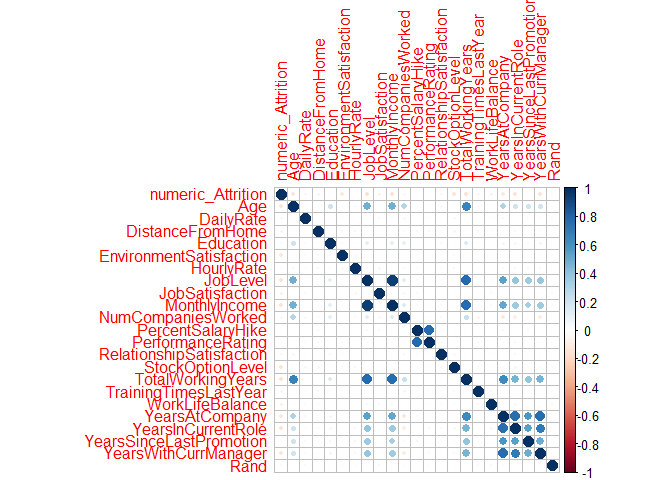
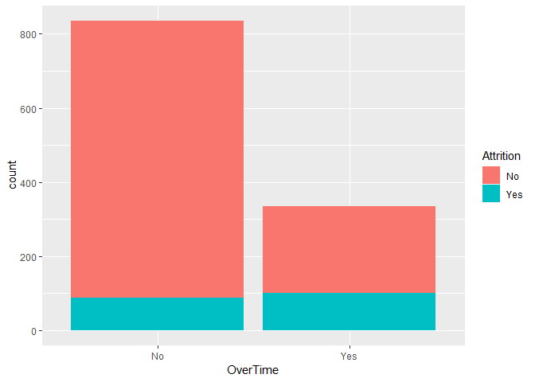
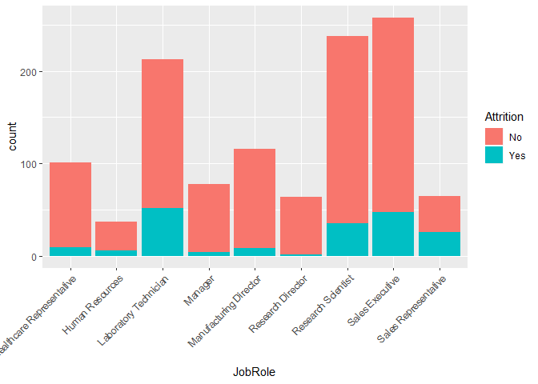
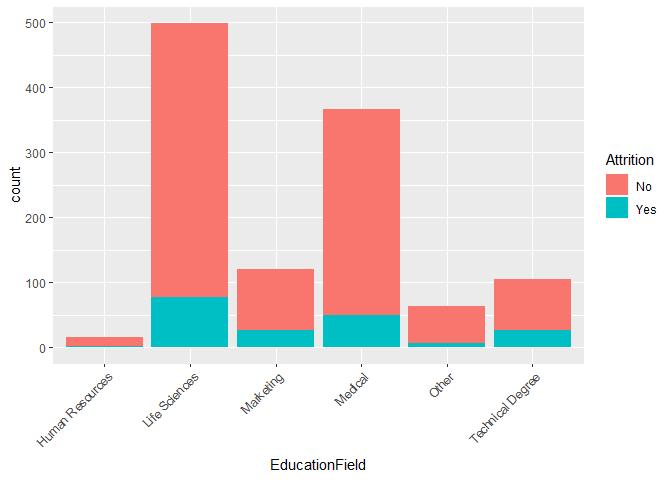
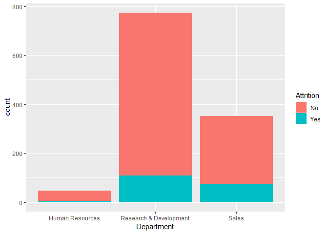
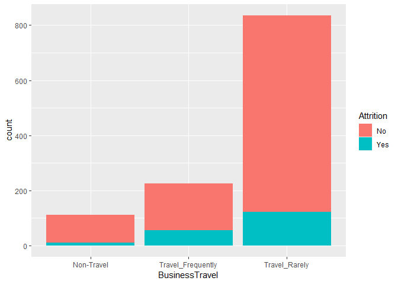
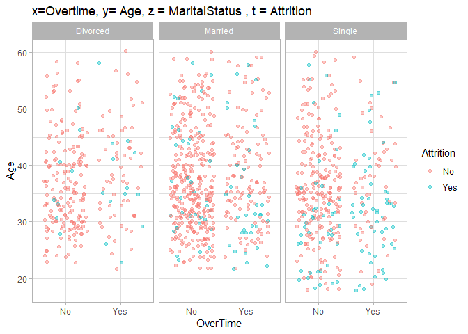
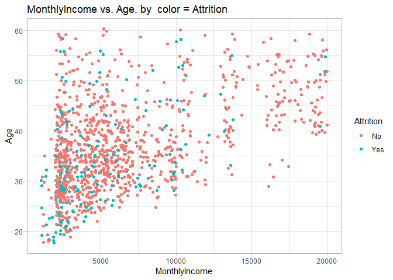

    MSDS 6306: Doing Data Science
    Case Study 02
    Due: Sunday, December 9th at 11:59pm. 

#### Description:
DDSAnalytics is an analytics company that specializes in talent management solutions for Fortune 1000 companies. Talent management is defined as the iterative process of developing and retaining employees. It may include workforce planning, employee training programs, identifying high-potential employees and reducing/preventing voluntary employee turnover (attrition). To gain a competitive edge over its competition, DDSAnalytics is planning to leverage data science for talent management. The executive leadership has identified predicting employee turnover as its first application of data science for talent management. Before the business green lights the project, they have tasked your data science team to conduct an analysis of existing employee data.


```r
#read in data
training_attrition <- read.csv("CaseStudy2-data.csv", header=T,na.strings=c(""))
validation_attrition <- read.csv("CaseStudy2Validation.csv", header=T,na.strings=c(""))

#data prep and cleaning
#check training_attrition for NAs
sapply(training_attrition,function(x) sum(is.na(x)))
```

```
##                       ID                      Age                Attrition 
##                        0                        0                        0 
##           BusinessTravel                DailyRate               Department 
##                        0                        0                        0 
##         DistanceFromHome                Education           EducationField 
##                        0                        0                        0 
##            EmployeeCount           EmployeeNumber  EnvironmentSatisfaction 
##                        0                        0                        0 
##                   Gender               HourlyRate           JobInvolvement 
##                        0                        0                        0 
##                 JobLevel                  JobRole          JobSatisfaction 
##                        0                        0                        0 
##            MaritalStatus            MonthlyIncome              MonthlyRate 
##                        0                        0                        0 
##       NumCompaniesWorked                   Over18                 OverTime 
##                        0                        0                        0 
##        PercentSalaryHike        PerformanceRating RelationshipSatisfaction 
##                        0                        0                        0 
##            StandardHours         StockOptionLevel        TotalWorkingYears 
##                        0                        0                        0 
##    TrainingTimesLastYear          WorkLifeBalance           YearsAtCompany 
##                        0                        0                        0 
##       YearsInCurrentRole  YearsSinceLastPromotion     YearsWithCurrManager 
##                        0                        0                        0 
##                     Rand 
##                        0
```

```r
#check validation_attrition for NAs
sapply(validation_attrition,function(x) sum(is.na(x)))
```

```
##                       ID                      Age                Attrition 
##                        0                        0                        0 
##           BusinessTravel                DailyRate               Department 
##                        0                        0                        0 
##         DistanceFromHome                Education           EducationField 
##                        0                        0                        0 
##            EmployeeCount           EmployeeNumber  EnvironmentSatisfaction 
##                        0                        0                        0 
##                   Gender               HourlyRate           JobInvolvement 
##                        0                        0                        0 
##                 JobLevel                  JobRole          JobSatisfaction 
##                        0                        0                        0 
##            MaritalStatus            MonthlyIncome              MonthlyRate 
##                        0                        0                        0 
##       NumCompaniesWorked                   Over18                 OverTime 
##                        0                        0                        0 
##        PercentSalaryHike        PerformanceRating RelationshipSatisfaction 
##                        0                        0                        0 
##            StandardHours         StockOptionLevel        TotalWorkingYears 
##                        0                        0                        0 
##    TrainingTimesLastYear          WorkLifeBalance           YearsAtCompany 
##                        0                        0                        0 
##       YearsInCurrentRole  YearsSinceLastPromotion     YearsWithCurrManager 
##                        0                        0                        0 
##                     Rand 
##                        0
```

```r
#we can drop ID, EmployeeCount, EmployeeNumber, Over18, StandardHours
training_attrition <- subset(training_attrition,select=c(2,3,4,5,6,7,8,9,12,13,14,15,16,17,18,19,20,21,22,24,25,26,27,29,30,31,32,33,34,35,36,37))
#droping the same from the validation set as well
validation_attrition <- subset(validation_attrition,select=c(2,3,4,5,6,7,8,9,12,13,14,15,16,17,18,19,20,21,22,24,25,26,27,29,30,31,32,33,34,35,36,37))
```

#### Goal:
Conduct exploratory data analysis (EDA) to determine factors that lead to attrition.


```r
#Variables
#looking at the structure of the data
str(training_attrition)
```

```
## 'data.frame':	1170 obs. of  32 variables:
##  $ Age                     : int  31 51 27 24 45 32 42 47 20 31 ...
##  $ Attrition               : Factor w/ 2 levels "No","Yes": 2 1 1 1 1 2 1 1 2 1 ...
##  $ BusinessTravel          : Factor w/ 3 levels "Non-Travel","Travel_Frequently",..: 3 3 1 1 3 3 2 2 2 2 ...
##  $ DailyRate               : int  359 1405 443 1269 193 1045 1271 1309 769 798 ...
##  $ Department              : Factor w/ 3 levels "Human Resources",..: 1 2 2 2 2 3 2 3 3 2 ...
##  $ DistanceFromHome        : int  18 11 3 4 6 4 2 4 9 7 ...
##  $ Education               : int  5 2 3 1 4 4 1 1 3 2 ...
##  $ EducationField          : Factor w/ 6 levels "Human Resources",..: 1 6 4 2 5 4 4 4 3 2 ...
##  $ EnvironmentSatisfaction : int  4 4 4 1 4 4 2 2 4 3 ...
##  $ Gender                  : Factor w/ 2 levels "Female","Male": 2 1 2 2 2 2 2 2 1 1 ...
##  $ HourlyRate              : int  89 82 50 46 52 32 35 99 54 48 ...
##  $ JobInvolvement          : int  4 2 3 2 3 1 3 3 3 2 ...
##  $ JobLevel                : int  1 4 1 1 3 3 1 2 1 3 ...
##  $ JobRole                 : Factor w/ 9 levels "Healthcare Representative",..: 2 5 7 3 6 8 7 9 9 5 ...
##  $ JobSatisfaction         : int  1 2 4 4 1 4 4 3 4 3 ...
##  $ MaritalStatus           : Factor w/ 3 levels "Divorced","Married",..: 2 3 2 2 2 2 3 3 3 2 ...
##  $ MonthlyIncome           : int  2956 13142 1706 3162 13245 10400 2515 2976 2323 8943 ...
##  $ MonthlyRate             : int  21495 24439 16571 10778 15067 25812 9068 25751 17205 14034 ...
##  $ NumCompaniesWorked      : int  0 3 1 0 4 1 5 3 1 1 ...
##  $ OverTime                : Factor w/ 2 levels "No","Yes": 1 1 1 1 2 1 2 1 2 1 ...
##  $ PercentSalaryHike       : int  17 16 11 17 14 11 14 19 14 24 ...
##  $ PerformanceRating       : int  3 3 3 3 3 3 3 3 3 4 ...
##  $ RelationshipSatisfaction: int  3 2 3 4 2 3 4 1 2 1 ...
##  $ StockOptionLevel        : int  0 0 3 0 0 0 0 0 0 1 ...
##  $ TotalWorkingYears       : int  2 29 0 6 17 14 8 5 2 10 ...
##  $ TrainingTimesLastYear   : int  4 1 6 2 3 2 2 3 3 2 ...
##  $ WorkLifeBalance         : int  3 2 2 2 4 2 3 3 3 3 ...
##  $ YearsAtCompany          : int  1 5 0 5 0 14 2 0 2 10 ...
##  $ YearsInCurrentRole      : int  0 2 0 2 0 8 1 0 2 9 ...
##  $ YearsSinceLastPromotion : int  0 0 0 3 0 9 2 0 0 8 ...
##  $ YearsWithCurrManager    : int  0 3 0 4 0 8 2 0 2 9 ...
##  $ Rand                    : num  -0.773 0.355 1.67 -0.661 -0.215 ...
```

```r
#the dimensions of the data
dim(training_attrition)
```

```
## [1] 1170   32
```

```r
#looking at the distrubation of the data
#Continuous Variables
plot_histogram(training_attrition)
```

<!-- --><!-- -->

```r
plot_density(training_attrition)
```

<!-- --><!-- -->

```r
#Looking at the Categorical Variables
#Categorical Variables-Barplots
plot_bar(training_attrition)
```

<!-- -->

####We will now start looking for the correlations in the data.

```r
#setting up the data for the correlations graph
numeric_training_attrition <- training_attrition[,c(1,4,6,7,9,11,13,15,17,19,21:32)]
numeric_Attrition = as.numeric(training_attrition$Attrition)- 1
numeric_training_attrition = cbind(numeric_Attrition, numeric_training_attrition)

#looking at the structure of the data
str(numeric_training_attrition)
```

```
## 'data.frame':	1170 obs. of  23 variables:
##  $ numeric_Attrition       : num  1 0 0 0 0 1 0 0 1 0 ...
##  $ Age                     : int  31 51 27 24 45 32 42 47 20 31 ...
##  $ DailyRate               : int  359 1405 443 1269 193 1045 1271 1309 769 798 ...
##  $ DistanceFromHome        : int  18 11 3 4 6 4 2 4 9 7 ...
##  $ Education               : int  5 2 3 1 4 4 1 1 3 2 ...
##  $ EnvironmentSatisfaction : int  4 4 4 1 4 4 2 2 4 3 ...
##  $ HourlyRate              : int  89 82 50 46 52 32 35 99 54 48 ...
##  $ JobLevel                : int  1 4 1 1 3 3 1 2 1 3 ...
##  $ JobSatisfaction         : int  1 2 4 4 1 4 4 3 4 3 ...
##  $ MonthlyIncome           : int  2956 13142 1706 3162 13245 10400 2515 2976 2323 8943 ...
##  $ NumCompaniesWorked      : int  0 3 1 0 4 1 5 3 1 1 ...
##  $ PercentSalaryHike       : int  17 16 11 17 14 11 14 19 14 24 ...
##  $ PerformanceRating       : int  3 3 3 3 3 3 3 3 3 4 ...
##  $ RelationshipSatisfaction: int  3 2 3 4 2 3 4 1 2 1 ...
##  $ StockOptionLevel        : int  0 0 3 0 0 0 0 0 0 1 ...
##  $ TotalWorkingYears       : int  2 29 0 6 17 14 8 5 2 10 ...
##  $ TrainingTimesLastYear   : int  4 1 6 2 3 2 2 3 3 2 ...
##  $ WorkLifeBalance         : int  3 2 2 2 4 2 3 3 3 3 ...
##  $ YearsAtCompany          : int  1 5 0 5 0 14 2 0 2 10 ...
##  $ YearsInCurrentRole      : int  0 2 0 2 0 8 1 0 2 9 ...
##  $ YearsSinceLastPromotion : int  0 0 0 3 0 9 2 0 0 8 ...
##  $ YearsWithCurrManager    : int  0 3 0 4 0 8 2 0 2 9 ...
##  $ Rand                    : num  -0.773 0.355 1.67 -0.661 -0.215 ...
```

```r
#looking at the correlations in the data
library(corrplot)
```

```
## corrplot 0.84 loaded
```

```r
M <- cor(numeric_training_attrition)
corrplot(M, method="circle")
```

<!-- -->
####Next we will find out how many correlations are bigger than 0.70.


```r
#Finding how many correlations are bigger than 0.70
k = 0
for(i in 1:23){
for(r in 1:23){
  if(M[i,r]> 0.70 & i != r){
    k= k + 1
  }
}  }
print(k/2)
```

```
## [1] 7
```

#####Lets break down those top 7.

```r
#looking at the top 7 over 0.70

# Overtime vs Attiriton
l <- ggplot(training_attrition, aes(OverTime,fill = Attrition))
l <- l + geom_histogram(stat="count")
```

```
## Warning: Ignoring unknown parameters: binwidth, bins, pad
```

```r
print(l)
```

<!-- -->

```r
tapply(as.numeric(training_attrition$Attrition) - 1 ,training_attrition$OverTime,mean)
```

```
##        No       Yes 
## 0.1053892 0.2985075
```
This chart shows that people who work over time have more Attrition.


```r
### MaritalStatus vs Attiriton
l <- ggplot(training_attrition, aes(MaritalStatus,fill = Attrition))
l <- l + geom_histogram(stat="count")
```

```
## Warning: Ignoring unknown parameters: binwidth, bins, pad
```

```r
print(l)
```

<!-- -->

```r
tapply(as.numeric(training_attrition$Attrition) - 1 ,training_attrition$MaritalStatus,mean)
```

```
##   Divorced    Married     Single 
## 0.07954545 0.13370998 0.25600000
```
Single people have more tendency to be subject to attrition.


```r
###JobRole vs Attrition
l <- ggplot(training_attrition, aes(JobRole,fill = Attrition))
l <- l + geom_histogram(stat="count") +
  theme(axis.text.x=element_text(angle=45,hjust=1))
```

```
## Warning: Ignoring unknown parameters: binwidth, bins, pad
```

```r
print(l)
```

<!-- -->

```r
tapply(as.numeric(training_attrition$Attrition) - 1 ,training_attrition$JobRole,mean)
```

```
## Healthcare Representative           Human Resources 
##                0.08910891                0.16216216 
##     Laboratory Technician                   Manager 
##                0.24413146                0.05128205 
##    Manufacturing Director         Research Director 
##                0.06896552                0.01562500 
##        Research Scientist           Sales Executive 
##                0.14705882                0.18217054 
##      Sales Representative 
##                0.40000000
```

```r
mean(as.numeric(training_attrition$Attrition) - 1)
```

```
## [1] 0.1606838
```
Here we can see that laboratory technician, human resource workers and sales representative roles have more attrition.


```r
###Gender vs Attrition
l <- ggplot(training_attrition, aes(Gender,fill = Attrition))
l <- l + geom_histogram(stat="count")
```

```
## Warning: Ignoring unknown parameters: binwidth, bins, pad
```

```r
print(l)
```

<!-- -->

```r
tapply(as.numeric(training_attrition$Attrition) - 1 ,training_attrition$Gender,mean)
```

```
##    Female      Male 
## 0.1360691 0.1768034
```
Gender doesn't seem to play much of a role in attrition.


```r
###EducationField vs Attrition
l <- ggplot(training_attrition, aes(EducationField,fill = Attrition))
l <- l + geom_histogram(stat="count") +
  theme(axis.text.x=element_text(angle=45,hjust=1))
```

```
## Warning: Ignoring unknown parameters: binwidth, bins, pad
```

```r
print(l)
```

<!-- -->

```r
tapply(as.numeric(training_attrition$Attrition) - 1 ,training_attrition$EducationField,mean)
```

```
##  Human Resources    Life Sciences        Marketing          Medical 
##        0.1250000        0.1543086        0.2148760        0.1366120 
##            Other Technical Degree 
##        0.1111111        0.2476190
```
Workers holding degrees in Technological and Human Resources are outstanding with a high attrition ratio.


```r
###Department vs Attrition
l <- ggplot(training_attrition, aes(Department,fill = Attrition))
l <- l + geom_histogram(stat="count")
```

```
## Warning: Ignoring unknown parameters: binwidth, bins, pad
```

```r
print(l)
```

<!-- -->

```r
tapply(as.numeric(training_attrition$Attrition) - 1 ,training_attrition$Department,mean)
```

```
##        Human Resources Research & Development                  Sales 
##              0.1304348              0.1397154              0.2108262
```
Department results are showing that Research & Development have a slightley higher probability of attrition.


```r
###BusinessTravel vs Attrition
l <- ggplot(training_attrition, aes(BusinessTravel,fill = Attrition))
l <- l + geom_histogram(stat="count")
```

```
## Warning: Ignoring unknown parameters: binwidth, bins, pad
```

```r
print(l)
```

<!-- -->

```r
tapply(as.numeric(training_attrition$Attrition) - 1 ,training_attrition$BusinessTravel,mean)
```

```
##        Non-Travel Travel_Frequently     Travel_Rarely 
##        0.09090909        0.24888889        0.14610778
```
Looking at travel verses non travel we see that persons traveling more frequently have a higher probability of attrition.


```r
### x=Overtime, y= Age, z = MaritalStatus , t = Attrition
ggplot(training_attrition, aes(OverTime, Age)) +  
  facet_grid(.~MaritalStatus) +
  geom_jitter(aes(color = Attrition),alpha = 0.4) +  
  ggtitle("x=Overtime, y= Age, z = MaritalStatus , t = Attrition") +  
  theme_light()
```

<!-- -->
This graph shows that single people under 35, working overtime are subject to attrition.


```r
### MonthlyIncome vs. Age, by  color = Attrition
ggplot(training_attrition, aes(MonthlyIncome, Age, color = Attrition)) + 
  geom_jitter() +
  ggtitle("MonthlyIncome vs. Age, by  color = Attrition ") +
  theme_light()
```

<!-- -->
This last graph shows a bit of logical information. As Age increases, Monthly Income tends to increase as well.

####There are a few other things in the data:
1. The most outstanding result is between Job Level and Monthly income, whose correlation is 0.95.
2. A higher performance rating shows a more Percent salary hike, whose correlation is 0.772.
3. The more years wotking for the company, the higher Job Levels, whose correlation is 0.77.
4. The more total years working for the company, the higher their monthly income, whose correlation is 0.77.
5. The more years with their current manager, the more years they were at the company, whose correlation is 0.763.
6. The last two show more logical triends. The more years at company, the more years they are in their current role, whose correlation is 0.753.
7. Last, the more years with current manager, the more years in their current role, whose correlation is 0.71.

###Predictions with logistic regression

```r
#loading the needed liraries
library(caTools)
library(e1071)
library(glmnet)
```

```
## Loading required package: Matrix
```

```
## Loading required package: foreach
```

```
## Loaded glmnet 2.0-16
```

```r
#setting up both the training and validation data
training_attrition_mydatanew = training_attrition[,-c(6,9,22)]
validation_attrition_mydatanew = validation_attrition[,-c(6,9,22)]

#looking at the structure of both data sets
str(training_attrition_mydatanew)
```

```
## 'data.frame':	1170 obs. of  29 variables:
##  $ Age                     : int  31 51 27 24 45 32 42 47 20 31 ...
##  $ Attrition               : Factor w/ 2 levels "No","Yes": 2 1 1 1 1 2 1 1 2 1 ...
##  $ BusinessTravel          : Factor w/ 3 levels "Non-Travel","Travel_Frequently",..: 3 3 1 1 3 3 2 2 2 2 ...
##  $ DailyRate               : int  359 1405 443 1269 193 1045 1271 1309 769 798 ...
##  $ Department              : Factor w/ 3 levels "Human Resources",..: 1 2 2 2 2 3 2 3 3 2 ...
##  $ Education               : int  5 2 3 1 4 4 1 1 3 2 ...
##  $ EducationField          : Factor w/ 6 levels "Human Resources",..: 1 6 4 2 5 4 4 4 3 2 ...
##  $ Gender                  : Factor w/ 2 levels "Female","Male": 2 1 2 2 2 2 2 2 1 1 ...
##  $ HourlyRate              : int  89 82 50 46 52 32 35 99 54 48 ...
##  $ JobInvolvement          : int  4 2 3 2 3 1 3 3 3 2 ...
##  $ JobLevel                : int  1 4 1 1 3 3 1 2 1 3 ...
##  $ JobRole                 : Factor w/ 9 levels "Healthcare Representative",..: 2 5 7 3 6 8 7 9 9 5 ...
##  $ JobSatisfaction         : int  1 2 4 4 1 4 4 3 4 3 ...
##  $ MaritalStatus           : Factor w/ 3 levels "Divorced","Married",..: 2 3 2 2 2 2 3 3 3 2 ...
##  $ MonthlyIncome           : int  2956 13142 1706 3162 13245 10400 2515 2976 2323 8943 ...
##  $ MonthlyRate             : int  21495 24439 16571 10778 15067 25812 9068 25751 17205 14034 ...
##  $ NumCompaniesWorked      : int  0 3 1 0 4 1 5 3 1 1 ...
##  $ OverTime                : Factor w/ 2 levels "No","Yes": 1 1 1 1 2 1 2 1 2 1 ...
##  $ PercentSalaryHike       : int  17 16 11 17 14 11 14 19 14 24 ...
##  $ RelationshipSatisfaction: int  3 2 3 4 2 3 4 1 2 1 ...
##  $ StockOptionLevel        : int  0 0 3 0 0 0 0 0 0 1 ...
##  $ TotalWorkingYears       : int  2 29 0 6 17 14 8 5 2 10 ...
##  $ TrainingTimesLastYear   : int  4 1 6 2 3 2 2 3 3 2 ...
##  $ WorkLifeBalance         : int  3 2 2 2 4 2 3 3 3 3 ...
##  $ YearsAtCompany          : int  1 5 0 5 0 14 2 0 2 10 ...
##  $ YearsInCurrentRole      : int  0 2 0 2 0 8 1 0 2 9 ...
##  $ YearsSinceLastPromotion : int  0 0 0 3 0 9 2 0 0 8 ...
##  $ YearsWithCurrManager    : int  0 3 0 4 0 8 2 0 2 9 ...
##  $ Rand                    : num  -0.773 0.355 1.67 -0.661 -0.215 ...
```

```r
str(validation_attrition_mydatanew)
```

```
## 'data.frame':	300 obs. of  29 variables:
##  $ Age                     : int  43 35 55 48 37 44 36 27 39 20 ...
##  $ Attrition               : Factor w/ 2 levels "No","Yes": 1 1 1 1 1 1 1 1 1 2 ...
##  $ BusinessTravel          : Factor w/ 3 levels "Non-Travel","Travel_Frequently",..: 3 3 2 3 2 2 3 3 2 3 ...
##  $ DailyRate               : int  1001 619 1091 530 1231 383 676 269 945 1362 ...
##  $ Department              : Factor w/ 3 levels "Human Resources",..: 2 3 2 3 3 3 2 2 2 2 ...
##  $ Education               : int  3 3 1 1 2 5 3 1 3 1 ...
##  $ EducationField          : Factor w/ 6 levels "Human Resources",..: 2 3 2 4 4 3 5 6 4 4 ...
##  $ Gender                  : Factor w/ 2 levels "Female","Male": 1 2 2 1 1 1 1 2 1 2 ...
##  $ HourlyRate              : int  43 85 65 91 54 79 35 42 82 32 ...
##  $ JobInvolvement          : int  3 3 3 3 3 3 3 2 3 3 ...
##  $ JobLevel                : int  3 2 3 3 1 2 2 3 3 1 ...
##  $ JobRole                 : Factor w/ 9 levels "Healthcare Representative",..: 1 8 5 4 9 8 5 6 5 7 ...
##  $ JobSatisfaction         : int  1 3 2 3 4 3 2 4 1 3 ...
##  $ MaritalStatus           : Factor w/ 3 levels "Divorced","Married",..: 2 2 2 2 2 2 2 1 3 3 ...
##  $ MonthlyIncome           : int  9985 4717 10976 12504 2973 4768 5228 12808 10880 1009 ...
##  $ MonthlyRate             : int  9262 18659 15813 23978 21222 9282 23361 8842 5083 26999 ...
##  $ NumCompaniesWorked      : int  8 9 3 3 5 7 0 1 1 1 ...
##  $ OverTime                : Factor w/ 2 levels "No","Yes": 1 1 1 1 1 1 1 2 2 2 ...
##  $ PercentSalaryHike       : int  16 11 18 21 15 12 15 16 13 11 ...
##  $ RelationshipSatisfaction: int  1 3 2 2 2 3 1 2 3 4 ...
##  $ StockOptionLevel        : int  1 0 1 1 1 1 1 1 0 0 ...
##  $ TotalWorkingYears       : int  10 15 23 15 10 11 10 9 21 1 ...
##  $ TrainingTimesLastYear   : int  1 2 4 3 3 4 2 3 2 5 ...
##  $ WorkLifeBalance         : int  2 3 3 1 3 2 3 3 3 3 ...
##  $ YearsAtCompany          : int  1 11 3 0 5 1 9 9 21 1 ...
##  $ YearsInCurrentRole      : int  0 9 2 0 4 0 7 8 6 0 ...
##  $ YearsSinceLastPromotion : int  0 6 1 0 0 0 0 0 2 1 ...
##  $ YearsWithCurrManager    : int  0 9 2 0 0 0 5 8 8 1 ...
##  $ Rand                    : num  -0.0245 -0.3341 0.0462 1.831 1.2296 ...
```

```r
#simplifining the names
train <- training_attrition_mydatanew
test <- validation_attrition_mydatanew

#using glm to train the full model with a binomial setting
model_glm_binomial <- glm(Attrition ~ ., data = train, family='binomial')
#running the test data through the model
predicted_glm_binomial <- predict(model_glm_binomial, test, type='response')
predicted_glm_binomial <- ifelse(predicted_glm_binomial > 0.5,1,0)
summary(model_glm_binomial)
```

```
## 
## Call:
## glm(formula = Attrition ~ ., family = "binomial", data = train)
## 
## Deviance Residuals: 
##     Min       1Q   Median       3Q      Max  
## -1.7247  -0.5070  -0.2672  -0.1027   3.4055  
## 
## Coefficients:
##                                    Estimate Std. Error z value Pr(>|z|)
## (Intercept)                      -1.231e+01  4.380e+02  -0.028 0.977577
## Age                              -2.365e-02  1.477e-02  -1.601 0.109333
## BusinessTravelTravel_Frequently   1.486e+00  4.325e-01   3.436 0.000591
## BusinessTravelTravel_Rarely       6.482e-01  3.991e-01   1.624 0.104386
## DailyRate                        -3.726e-04  2.431e-04  -1.533 0.125371
## DepartmentResearch & Development  1.302e+01  4.380e+02   0.030 0.976289
## DepartmentSales                   1.139e+01  4.380e+02   0.026 0.979253
## Education                         7.492e-02  9.771e-02   0.767 0.443255
## EducationFieldLife Sciences       1.150e-01  1.048e+00   0.110 0.912664
## EducationFieldMarketing           3.539e-01  1.099e+00   0.322 0.747424
## EducationFieldMedical             7.241e-03  1.052e+00   0.007 0.994510
## EducationFieldOther              -6.620e-01  1.116e+00  -0.593 0.553189
## EducationFieldTechnical Degree    8.086e-01  1.063e+00   0.761 0.446753
## GenderMale                        3.997e-01  2.033e-01   1.966 0.049249
## HourlyRate                        6.843e-03  4.911e-03   1.393 0.163540
## JobInvolvement                   -6.350e-01  1.343e-01  -4.729 2.26e-06
## JobLevel                         -2.140e-01  3.354e-01  -0.638 0.523493
## JobRoleHuman Resources            1.405e+01  4.380e+02   0.032 0.974412
## JobRoleLaboratory Technician      1.215e+00  5.016e-01   2.422 0.015421
## JobRoleManager                    3.125e-01  8.908e-01   0.351 0.725727
## JobRoleManufacturing Director    -1.583e-01  5.618e-01  -0.282 0.778054
## JobRoleResearch Director         -2.298e+00  1.296e+00  -1.773 0.076265
## JobRoleResearch Scientist         1.290e-01  5.187e-01   0.249 0.803553
## JobRoleSales Executive            2.401e+00  1.354e+00   1.774 0.076120
## JobRoleSales Representative       3.265e+00  1.398e+00   2.335 0.019531
## JobSatisfaction                  -3.710e-01  8.894e-02  -4.171 3.03e-05
## MaritalStatusMarried              6.447e-01  3.060e-01   2.107 0.035149
## MaritalStatusSingle               1.262e+00  3.867e-01   3.263 0.001103
## MonthlyIncome                     7.297e-05  8.674e-05   0.841 0.400167
## MonthlyRate                      -1.104e-05  1.379e-05  -0.801 0.423165
## NumCompaniesWorked                1.813e-01  4.183e-02   4.334 1.47e-05
## OverTimeYes                       1.845e+00  2.119e-01   8.707  < 2e-16
## PercentSalaryHike                -2.207e-03  2.684e-02  -0.082 0.934469
## RelationshipSatisfaction         -1.972e-01  9.041e-02  -2.182 0.029131
## StockOptionLevel                 -2.093e-01  1.709e-01  -1.225 0.220652
## TotalWorkingYears                -5.905e-02  3.173e-02  -1.861 0.062711
## TrainingTimesLastYear            -1.645e-01  8.101e-02  -2.030 0.042317
## WorkLifeBalance                  -4.250e-01  1.351e-01  -3.147 0.001651
## YearsAtCompany                    8.481e-02  4.111e-02   2.063 0.039086
## YearsInCurrentRole               -1.372e-01  4.909e-02  -2.796 0.005178
## YearsSinceLastPromotion           1.680e-01  4.528e-02   3.710 0.000207
## YearsWithCurrManager             -1.047e-01  4.865e-02  -2.153 0.031314
## Rand                              6.342e-02  9.912e-02   0.640 0.522263
##                                     
## (Intercept)                         
## Age                                 
## BusinessTravelTravel_Frequently  ***
## BusinessTravelTravel_Rarely         
## DailyRate                           
## DepartmentResearch & Development    
## DepartmentSales                     
## Education                           
## EducationFieldLife Sciences         
## EducationFieldMarketing             
## EducationFieldMedical               
## EducationFieldOther                 
## EducationFieldTechnical Degree      
## GenderMale                       *  
## HourlyRate                          
## JobInvolvement                   ***
## JobLevel                            
## JobRoleHuman Resources              
## JobRoleLaboratory Technician     *  
## JobRoleManager                      
## JobRoleManufacturing Director       
## JobRoleResearch Director         .  
## JobRoleResearch Scientist           
## JobRoleSales Executive           .  
## JobRoleSales Representative      *  
## JobSatisfaction                  ***
## MaritalStatusMarried             *  
## MaritalStatusSingle              ** 
## MonthlyIncome                       
## MonthlyRate                         
## NumCompaniesWorked               ***
## OverTimeYes                      ***
## PercentSalaryHike                   
## RelationshipSatisfaction         *  
## StockOptionLevel                    
## TotalWorkingYears                .  
## TrainingTimesLastYear            *  
## WorkLifeBalance                  ** 
## YearsAtCompany                   *  
## YearsInCurrentRole               ** 
## YearsSinceLastPromotion          ***
## YearsWithCurrManager             *  
## Rand                                
## ---
## Signif. codes:  0 '***' 0.001 '**' 0.01 '*' 0.05 '.' 0.1 ' ' 1
## 
## (Dispersion parameter for binomial family taken to be 1)
## 
##     Null deviance: 1031.48  on 1169  degrees of freedom
## Residual deviance:  712.78  on 1127  degrees of freedom
## AIC: 798.78
## 
## Number of Fisher Scoring iterations: 14
```

```r
#using glm to train the full model with a logit setting
model_glm_logit <- glm(Attrition ~.,family=binomial(link='logit'),data=train)
#running the test data through the model
predicted_glm_logit <- predict(model_glm_logit, test, type='response')
predicted_glm_logit <- ifelse(predicted_glm_logit > 0.5,1,0)
summary(model_glm_logit)
```

```
## 
## Call:
## glm(formula = Attrition ~ ., family = binomial(link = "logit"), 
##     data = train)
## 
## Deviance Residuals: 
##     Min       1Q   Median       3Q      Max  
## -1.7247  -0.5070  -0.2672  -0.1027   3.4055  
## 
## Coefficients:
##                                    Estimate Std. Error z value Pr(>|z|)
## (Intercept)                      -1.231e+01  4.380e+02  -0.028 0.977577
## Age                              -2.365e-02  1.477e-02  -1.601 0.109333
## BusinessTravelTravel_Frequently   1.486e+00  4.325e-01   3.436 0.000591
## BusinessTravelTravel_Rarely       6.482e-01  3.991e-01   1.624 0.104386
## DailyRate                        -3.726e-04  2.431e-04  -1.533 0.125371
## DepartmentResearch & Development  1.302e+01  4.380e+02   0.030 0.976289
## DepartmentSales                   1.139e+01  4.380e+02   0.026 0.979253
## Education                         7.492e-02  9.771e-02   0.767 0.443255
## EducationFieldLife Sciences       1.150e-01  1.048e+00   0.110 0.912664
## EducationFieldMarketing           3.539e-01  1.099e+00   0.322 0.747424
## EducationFieldMedical             7.241e-03  1.052e+00   0.007 0.994510
## EducationFieldOther              -6.620e-01  1.116e+00  -0.593 0.553189
## EducationFieldTechnical Degree    8.086e-01  1.063e+00   0.761 0.446753
## GenderMale                        3.997e-01  2.033e-01   1.966 0.049249
## HourlyRate                        6.843e-03  4.911e-03   1.393 0.163540
## JobInvolvement                   -6.350e-01  1.343e-01  -4.729 2.26e-06
## JobLevel                         -2.140e-01  3.354e-01  -0.638 0.523493
## JobRoleHuman Resources            1.405e+01  4.380e+02   0.032 0.974412
## JobRoleLaboratory Technician      1.215e+00  5.016e-01   2.422 0.015421
## JobRoleManager                    3.125e-01  8.908e-01   0.351 0.725727
## JobRoleManufacturing Director    -1.583e-01  5.618e-01  -0.282 0.778054
## JobRoleResearch Director         -2.298e+00  1.296e+00  -1.773 0.076265
## JobRoleResearch Scientist         1.290e-01  5.187e-01   0.249 0.803553
## JobRoleSales Executive            2.401e+00  1.354e+00   1.774 0.076120
## JobRoleSales Representative       3.265e+00  1.398e+00   2.335 0.019531
## JobSatisfaction                  -3.710e-01  8.894e-02  -4.171 3.03e-05
## MaritalStatusMarried              6.447e-01  3.060e-01   2.107 0.035149
## MaritalStatusSingle               1.262e+00  3.867e-01   3.263 0.001103
## MonthlyIncome                     7.297e-05  8.674e-05   0.841 0.400167
## MonthlyRate                      -1.104e-05  1.379e-05  -0.801 0.423165
## NumCompaniesWorked                1.813e-01  4.183e-02   4.334 1.47e-05
## OverTimeYes                       1.845e+00  2.119e-01   8.707  < 2e-16
## PercentSalaryHike                -2.207e-03  2.684e-02  -0.082 0.934469
## RelationshipSatisfaction         -1.972e-01  9.041e-02  -2.182 0.029131
## StockOptionLevel                 -2.093e-01  1.709e-01  -1.225 0.220652
## TotalWorkingYears                -5.905e-02  3.173e-02  -1.861 0.062711
## TrainingTimesLastYear            -1.645e-01  8.101e-02  -2.030 0.042317
## WorkLifeBalance                  -4.250e-01  1.351e-01  -3.147 0.001651
## YearsAtCompany                    8.481e-02  4.111e-02   2.063 0.039086
## YearsInCurrentRole               -1.372e-01  4.909e-02  -2.796 0.005178
## YearsSinceLastPromotion           1.680e-01  4.528e-02   3.710 0.000207
## YearsWithCurrManager             -1.047e-01  4.865e-02  -2.153 0.031314
## Rand                              6.342e-02  9.912e-02   0.640 0.522263
##                                     
## (Intercept)                         
## Age                                 
## BusinessTravelTravel_Frequently  ***
## BusinessTravelTravel_Rarely         
## DailyRate                           
## DepartmentResearch & Development    
## DepartmentSales                     
## Education                           
## EducationFieldLife Sciences         
## EducationFieldMarketing             
## EducationFieldMedical               
## EducationFieldOther                 
## EducationFieldTechnical Degree      
## GenderMale                       *  
## HourlyRate                          
## JobInvolvement                   ***
## JobLevel                            
## JobRoleHuman Resources              
## JobRoleLaboratory Technician     *  
## JobRoleManager                      
## JobRoleManufacturing Director       
## JobRoleResearch Director         .  
## JobRoleResearch Scientist           
## JobRoleSales Executive           .  
## JobRoleSales Representative      *  
## JobSatisfaction                  ***
## MaritalStatusMarried             *  
## MaritalStatusSingle              ** 
## MonthlyIncome                       
## MonthlyRate                         
## NumCompaniesWorked               ***
## OverTimeYes                      ***
## PercentSalaryHike                   
## RelationshipSatisfaction         *  
## StockOptionLevel                    
## TotalWorkingYears                .  
## TrainingTimesLastYear            *  
## WorkLifeBalance                  ** 
## YearsAtCompany                   *  
## YearsInCurrentRole               ** 
## YearsSinceLastPromotion          ***
## YearsWithCurrManager             *  
## Rand                                
## ---
## Signif. codes:  0 '***' 0.001 '**' 0.01 '*' 0.05 '.' 0.1 ' ' 1
## 
## (Dispersion parameter for binomial family taken to be 1)
## 
##     Null deviance: 1031.48  on 1169  degrees of freedom
## Residual deviance:  712.78  on 1127  degrees of freedom
## AIC: 798.78
## 
## Number of Fisher Scoring iterations: 14
```

```r
table(test$Attrition, predicted_glm_binomial)
```

```
##      predicted_glm_binomial
##         0   1
##   No  242   9
##   Yes  36  13
```

```r
#Checking the prediction accuracy
print((240+13)/300)
```

```
## [1] 0.8433333
```

```r
table(test$Attrition, predicted_glm_logit)
```

```
##      predicted_glm_logit
##         0   1
##   No  242   9
##   Yes  36  13
```

```r
#Checking the prediction accuracy
print((240+13)/300)
```

```
## [1] 0.8433333
```

```r
#adding the predictions back into the data
validation_attrition$PredictedAttrition_binomial <- predicted_glm_binomial
validation_attrition$PredictedAttrition_logit <- predicted_glm_logit

#check out the predicted data
validation_attrition_compair <- validation_attrition[,c(2,33:34)]
```
The prediction accuracy of logistic regression using binomial is about 0.84.
The prediction accuracy of logistic regression using logit is about 0.84.
