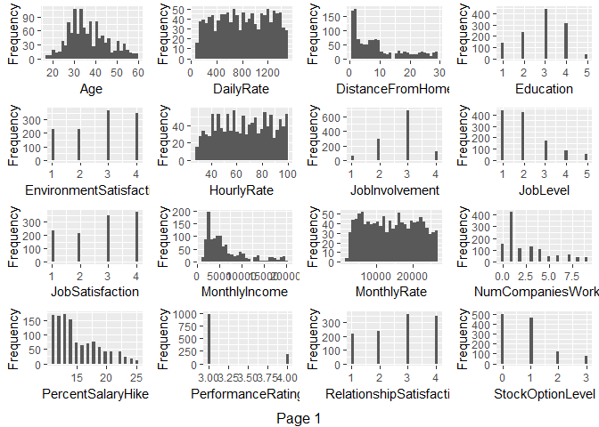
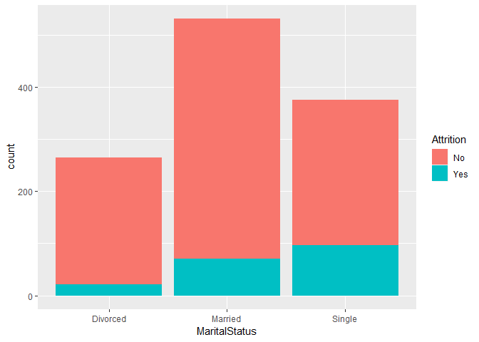
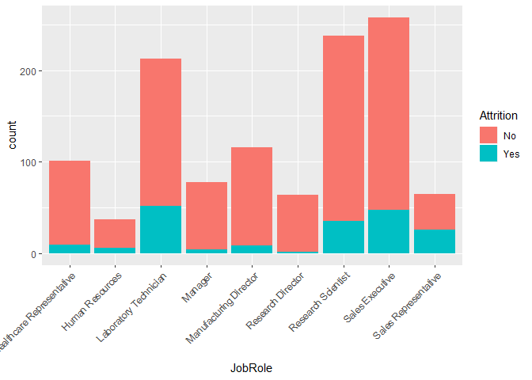
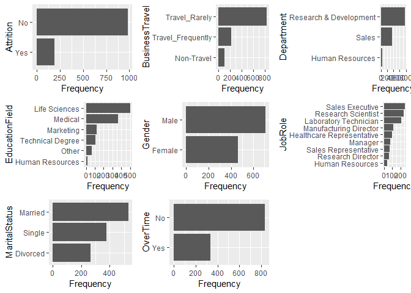
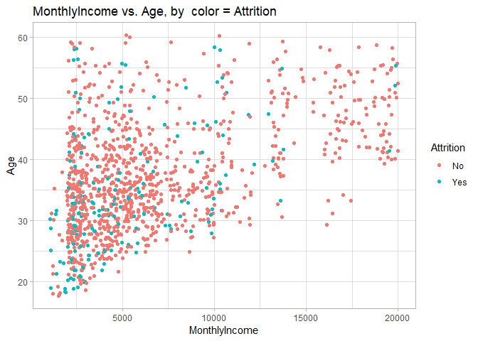
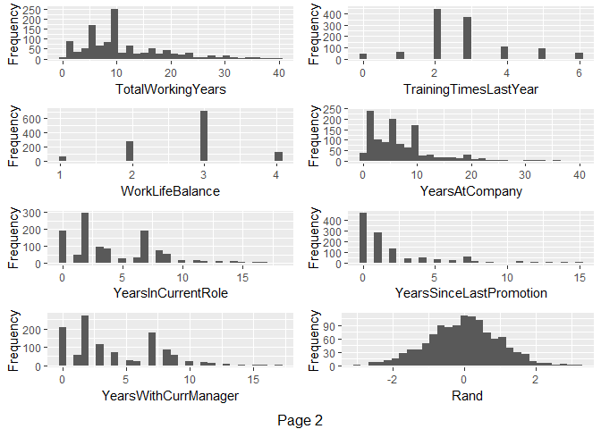
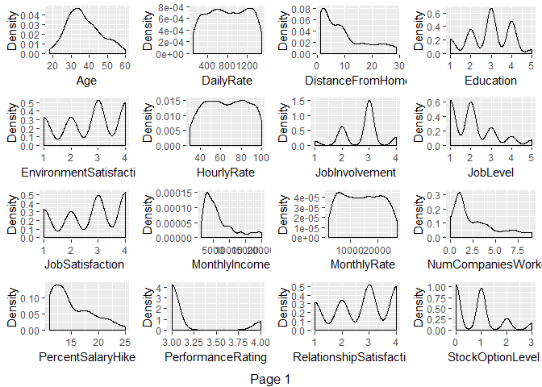
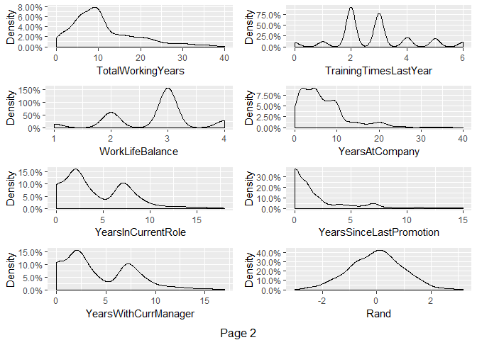
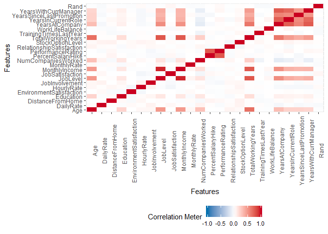

    MSDS 6306: Doing Data Science
    Case Study 02
    Due: Sunday, December 9th at 11:59pm. 

#### Description:
DDSAnalytics is an analytics company that specializes in talent management solutions for Fortune 1000 companies. Talent management is defined as the iterative process of developing and retaining employees. It may include workforce planning, employee training programs, identifying high-potential employees and reducing/preventing voluntary employee turnover (attrition). To gain a competitive edge over its competition, DDSAnalytics is planning to leverage data science for talent management. The executive leadership has identified predicting employee turnover as its first application of data science for talent management. Before the business green lights the project, they have tasked your data science team to conduct an analysis of existing employee data.


```r
#read in data
training_attrition <- read.csv("CaseStudy2-data.csv", header=T,na.strings=c(""))
validation_attrition <- read.csv("CaseStudy2Validation.csv", header=T,na.strings=c(""))

#data prep and cleaning
#check for training_attrition for NAs
sapply(training_attrition,function(x) sum(is.na(x)))
```

```
##                       ID                      Age                Attrition 
##                        0                        0                        0 
##           BusinessTravel                DailyRate               Department 
##                        0                        0                        0 
##         DistanceFromHome                Education           EducationField 
##                        0                        0                        0 
##            EmployeeCount           EmployeeNumber  EnvironmentSatisfaction 
##                        0                        0                        0 
##                   Gender               HourlyRate           JobInvolvement 
##                        0                        0                        0 
##                 JobLevel                  JobRole          JobSatisfaction 
##                        0                        0                        0 
##            MaritalStatus            MonthlyIncome              MonthlyRate 
##                        0                        0                        0 
##       NumCompaniesWorked                   Over18                 OverTime 
##                        0                        0                        0 
##        PercentSalaryHike        PerformanceRating RelationshipSatisfaction 
##                        0                        0                        0 
##            StandardHours         StockOptionLevel        TotalWorkingYears 
##                        0                        0                        0 
##    TrainingTimesLastYear          WorkLifeBalance           YearsAtCompany 
##                        0                        0                        0 
##       YearsInCurrentRole  YearsSinceLastPromotion     YearsWithCurrManager 
##                        0                        0                        0 
##                     Rand 
##                        0
```

```r
#check for training_attrition for NAs
sapply(validation_attrition,function(x) sum(is.na(x)))
```

```
##                       ID                      Age                Attrition 
##                        0                        0                        0 
##           BusinessTravel                DailyRate               Department 
##                        0                        0                        0 
##         DistanceFromHome                Education           EducationField 
##                        0                        0                        0 
##            EmployeeCount           EmployeeNumber  EnvironmentSatisfaction 
##                        0                        0                        0 
##                   Gender               HourlyRate           JobInvolvement 
##                        0                        0                        0 
##                 JobLevel                  JobRole          JobSatisfaction 
##                        0                        0                        0 
##            MaritalStatus            MonthlyIncome              MonthlyRate 
##                        0                        0                        0 
##       NumCompaniesWorked                   Over18                 OverTime 
##                        0                        0                        0 
##        PercentSalaryHike        PerformanceRating RelationshipSatisfaction 
##                        0                        0                        0 
##            StandardHours         StockOptionLevel        TotalWorkingYears 
##                        0                        0                        0 
##    TrainingTimesLastYear          WorkLifeBalance           YearsAtCompany 
##                        0                        0                        0 
##       YearsInCurrentRole  YearsSinceLastPromotion     YearsWithCurrManager 
##                        0                        0                        0 
##                     Rand 
##                        0
```

```r
#we can drop ID, EmployeeCount, EmployeeNumber, Over18, StandardHours
training_attrition <- subset(training_attrition,select=c(2,3,4,5,6,7,8,9,12,13,14,15,16,17,18,19,20,21,22,24,25,26,27,29,30,31,32,33,34,35,36,37))
#we can drop ID, EmployeeCount, EmployeeNumber, Over18, StandardHours for the test set
validation_attrition <- subset(validation_attrition,select=c(2,3,4,5,6,7,8,9,12,13,14,15,16,17,18,19,20,21,22,24,25,26,27,29,30,31,32,33,34,35,36,37))
```

#### Goal:
Conduct exploratory data analysis (EDA) to determine factors that lead to attrition.


```r
#Variables
#looking at the structure of the data
str(training_attrition)
```

```
## 'data.frame':	1170 obs. of  32 variables:
##  $ Age                     : int  31 51 27 24 45 32 42 47 20 31 ...
##  $ Attrition               : Factor w/ 2 levels "No","Yes": 2 1 1 1 1 2 1 1 2 1 ...
##  $ BusinessTravel          : Factor w/ 3 levels "Non-Travel","Travel_Frequently",..: 3 3 1 1 3 3 2 2 2 2 ...
##  $ DailyRate               : int  359 1405 443 1269 193 1045 1271 1309 769 798 ...
##  $ Department              : Factor w/ 3 levels "Human Resources",..: 1 2 2 2 2 3 2 3 3 2 ...
##  $ DistanceFromHome        : int  18 11 3 4 6 4 2 4 9 7 ...
##  $ Education               : int  5 2 3 1 4 4 1 1 3 2 ...
##  $ EducationField          : Factor w/ 6 levels "Human Resources",..: 1 6 4 2 5 4 4 4 3 2 ...
##  $ EnvironmentSatisfaction : int  4 4 4 1 4 4 2 2 4 3 ...
##  $ Gender                  : Factor w/ 2 levels "Female","Male": 2 1 2 2 2 2 2 2 1 1 ...
##  $ HourlyRate              : int  89 82 50 46 52 32 35 99 54 48 ...
##  $ JobInvolvement          : int  4 2 3 2 3 1 3 3 3 2 ...
##  $ JobLevel                : int  1 4 1 1 3 3 1 2 1 3 ...
##  $ JobRole                 : Factor w/ 9 levels "Healthcare Representative",..: 2 5 7 3 6 8 7 9 9 5 ...
##  $ JobSatisfaction         : int  1 2 4 4 1 4 4 3 4 3 ...
##  $ MaritalStatus           : Factor w/ 3 levels "Divorced","Married",..: 2 3 2 2 2 2 3 3 3 2 ...
##  $ MonthlyIncome           : int  2956 13142 1706 3162 13245 10400 2515 2976 2323 8943 ...
##  $ MonthlyRate             : int  21495 24439 16571 10778 15067 25812 9068 25751 17205 14034 ...
##  $ NumCompaniesWorked      : int  0 3 1 0 4 1 5 3 1 1 ...
##  $ OverTime                : Factor w/ 2 levels "No","Yes": 1 1 1 1 2 1 2 1 2 1 ...
##  $ PercentSalaryHike       : int  17 16 11 17 14 11 14 19 14 24 ...
##  $ PerformanceRating       : int  3 3 3 3 3 3 3 3 3 4 ...
##  $ RelationshipSatisfaction: int  3 2 3 4 2 3 4 1 2 1 ...
##  $ StockOptionLevel        : int  0 0 3 0 0 0 0 0 0 1 ...
##  $ TotalWorkingYears       : int  2 29 0 6 17 14 8 5 2 10 ...
##  $ TrainingTimesLastYear   : int  4 1 6 2 3 2 2 3 3 2 ...
##  $ WorkLifeBalance         : int  3 2 2 2 4 2 3 3 3 3 ...
##  $ YearsAtCompany          : int  1 5 0 5 0 14 2 0 2 10 ...
##  $ YearsInCurrentRole      : int  0 2 0 2 0 8 1 0 2 9 ...
##  $ YearsSinceLastPromotion : int  0 0 0 3 0 9 2 0 0 8 ...
##  $ YearsWithCurrManager    : int  0 3 0 4 0 8 2 0 2 9 ...
##  $ Rand                    : num  -0.773 0.355 1.67 -0.661 -0.215 ...
```

```r
#the dimensions of the data
dim(training_attrition)
```

```
## [1] 1170   32
```

```r
numeric_training_attrition <- training_attrition[,c(1,4,6,7,9,11,13,15,17,19,21:32)]
numeric_Attrition = as.numeric(training_attrition$Attrition)- 1
numeric_training_attrition = cbind(numeric_Attrition, numeric_training_attrition)
str(numeric_training_attrition)
```

```
## 'data.frame':	1170 obs. of  23 variables:
##  $ numeric_Attrition       : num  1 0 0 0 0 1 0 0 1 0 ...
##  $ Age                     : int  31 51 27 24 45 32 42 47 20 31 ...
##  $ DailyRate               : int  359 1405 443 1269 193 1045 1271 1309 769 798 ...
##  $ DistanceFromHome        : int  18 11 3 4 6 4 2 4 9 7 ...
##  $ Education               : int  5 2 3 1 4 4 1 1 3 2 ...
##  $ EnvironmentSatisfaction : int  4 4 4 1 4 4 2 2 4 3 ...
##  $ HourlyRate              : int  89 82 50 46 52 32 35 99 54 48 ...
##  $ JobLevel                : int  1 4 1 1 3 3 1 2 1 3 ...
##  $ JobSatisfaction         : int  1 2 4 4 1 4 4 3 4 3 ...
##  $ MonthlyIncome           : int  2956 13142 1706 3162 13245 10400 2515 2976 2323 8943 ...
##  $ NumCompaniesWorked      : int  0 3 1 0 4 1 5 3 1 1 ...
##  $ PercentSalaryHike       : int  17 16 11 17 14 11 14 19 14 24 ...
##  $ PerformanceRating       : int  3 3 3 3 3 3 3 3 3 4 ...
##  $ RelationshipSatisfaction: int  3 2 3 4 2 3 4 1 2 1 ...
##  $ StockOptionLevel        : int  0 0 3 0 0 0 0 0 0 1 ...
##  $ TotalWorkingYears       : int  2 29 0 6 17 14 8 5 2 10 ...
##  $ TrainingTimesLastYear   : int  4 1 6 2 3 2 2 3 3 2 ...
##  $ WorkLifeBalance         : int  3 2 2 2 4 2 3 3 3 3 ...
##  $ YearsAtCompany          : int  1 5 0 5 0 14 2 0 2 10 ...
##  $ YearsInCurrentRole      : int  0 2 0 2 0 8 1 0 2 9 ...
##  $ YearsSinceLastPromotion : int  0 0 0 3 0 9 2 0 0 8 ...
##  $ YearsWithCurrManager    : int  0 3 0 4 0 8 2 0 2 9 ...
##  $ Rand                    : num  -0.773 0.355 1.67 -0.661 -0.215 ...
```

```r
library(corrplot)
```

```
## corrplot 0.84 loaded
```

```r
M <- cor(numeric_training_attrition)
corrplot(M, method="circle")
```

<!-- -->

```r
#Finding how many correlations are bigger than 0.70
k = 0
for(i in 1:23){
for(r in 1:23){
  if(M[i,r]> 0.70 & i != r){
    k= k + 1
  }
}  }
print(k/2)
```

```
## [1] 7
```

```r
### Overtime vs Attiriton
l <- ggplot(training_attrition, aes(OverTime,fill = Attrition))
l <- l + geom_histogram(stat="count")
```

```
## Warning: Ignoring unknown parameters: binwidth, bins, pad
```

```r
print(l)
```

<!-- -->

```r
tapply(as.numeric(training_attrition$Attrition) - 1 ,training_attrition$OverTime,mean)
```

```
##        No       Yes 
## 0.1053892 0.2985075
```

```r
## As seen in the plot, personnels who work over time have more Attrition

### MaritalStatus vs Attiriton
l <- ggplot(training_attrition, aes(MaritalStatus,fill = Attrition))
l <- l + geom_histogram(stat="count")
```

```
## Warning: Ignoring unknown parameters: binwidth, bins, pad
```

```r
print(l)
```

<!-- -->

```r
tapply(as.numeric(training_attrition$Attrition) - 1 ,training_attrition$MaritalStatus,mean)
```

```
##   Divorced    Married     Single 
## 0.07954545 0.13370998 0.25600000
```

```r
## single personnels have more tendency to be subject to attrition

###JobRole vs Attrition
l <- ggplot(training_attrition, aes(JobRole,fill = Attrition))
l <- l + geom_histogram(stat="count") +
  theme(axis.text.x=element_text(angle=45,hjust=1))
```

```
## Warning: Ignoring unknown parameters: binwidth, bins, pad
```

```r
print(l)
```

<!-- -->

```r
tapply(as.numeric(training_attrition$Attrition) - 1 ,training_attrition$JobRole,mean)
```

```
## Healthcare Representative           Human Resources 
##                0.08910891                0.16216216 
##     Laboratory Technician                   Manager 
##                0.24413146                0.05128205 
##    Manufacturing Director         Research Director 
##                0.06896552                0.01562500 
##        Research Scientist           Sales Executive 
##                0.14705882                0.18217054 
##      Sales Representative 
##                0.40000000
```

```r
mean(as.numeric(training_attrition$Attrition) - 1)
```

```
## [1] 0.1606838
```

```r
## we see that labaratory technican, human resources and sales representative roles have more attrition.

###Gender vs Attrition
l <- ggplot(training_attrition, aes(Gender,fill = Attrition))
l <- l + geom_histogram(stat="count")
```

```
## Warning: Ignoring unknown parameters: binwidth, bins, pad
```

```r
print(l)
```

<!-- -->

```r
tapply(as.numeric(training_attrition$Attrition) - 1 ,training_attrition$Gender,mean)
```

```
##    Female      Male 
## 0.1360691 0.1768034
```

```r
## gender characteristic doesn't have so much significance

###EducationField vs Attrition
l <- ggplot(training_attrition, aes(EducationField,fill = Attrition))
l <- l + geom_histogram(stat="count") +
  theme(axis.text.x=element_text(angle=45,hjust=1))
```

```
## Warning: Ignoring unknown parameters: binwidth, bins, pad
```

```r
print(l)
```

<!-- -->

```r
tapply(as.numeric(training_attrition$Attrition) - 1 ,training_attrition$EducationField,mean)
```

```
##  Human Resources    Life Sciences        Marketing          Medical 
##        0.1250000        0.1543086        0.2148760        0.1366120 
##            Other Technical Degree 
##        0.1111111        0.2476190
```

```r
## Technical Degree and Human Resources are outstanding with high attrition ratio.

###Department vs Attrition
l <- ggplot(training_attrition, aes(Department,fill = Attrition))
l <- l + geom_histogram(stat="count")
```

```
## Warning: Ignoring unknown parameters: binwidth, bins, pad
```

```r
print(l)
```

<!-- -->

```r
tapply(as.numeric(training_attrition$Attrition) - 1 ,training_attrition$Department,mean)
```

```
##        Human Resources Research & Development                  Sales 
##              0.1304348              0.1397154              0.2108262
```

```r
## department results aren't saying anything so important

###BusinessTravel vs Attrition
l <- ggplot(training_attrition, aes(BusinessTravel,fill = Attrition))
l <- l + geom_histogram(stat="count")
```

```
## Warning: Ignoring unknown parameters: binwidth, bins, pad
```

```r
print(l)
```

<!-- -->

```r
tapply(as.numeric(training_attrition$Attrition) - 1 ,training_attrition$BusinessTravel,mean)
```

```
##        Non-Travel Travel_Frequently     Travel_Rarely 
##        0.09090909        0.24888889        0.14610778
```

```r
## if businesstravel = non-travel, so little probability to have attrition
## if businesstravel = travel_frequently , more probability to have attrition.

### x=Overtime, y= Age, z = MaritalStatus , t = Attrition
ggplot(training_attrition, aes(OverTime, Age)) +  
  facet_grid(.~MaritalStatus) +
  geom_jitter(aes(color = Attrition),alpha = 0.4) +  
  ggtitle("x=Overtime, y= Age, z = MaritalStatus , t = Attrition") +  
  theme_light()
```

<!-- -->

```r
## we can say that attrition is cumulating in which OverTime =Yes & Marial_Status=Single & Age< 35

### MonthlyIncome vs. Age, by  color = Attrition
ggplot(training_attrition, aes(MonthlyIncome, Age, color = Attrition)) + 
  geom_jitter() +
  ggtitle("MonthlyIncome vs. Age, by  color = Attrition ") +
  theme_light()
```

<!-- -->

```r
#As Age increases, MonthlyIncome tends to increase

#Prediction with logistic regression :

library(caTools)
library(e1071)
library(glmnet)
```

```
## Loading required package: Matrix
```

```
## Loading required package: foreach
```

```
## Loaded glmnet 2.0-16
```

```r
training_attrition_mydatanew = training_attrition[,-c(6,9,22)]
validation_attrition_mydatanew = validation_attrition[,-c(6,9,22)]

str(training_attrition_mydatanew)
```

```
## 'data.frame':	1170 obs. of  29 variables:
##  $ Age                     : int  31 51 27 24 45 32 42 47 20 31 ...
##  $ Attrition               : Factor w/ 2 levels "No","Yes": 2 1 1 1 1 2 1 1 2 1 ...
##  $ BusinessTravel          : Factor w/ 3 levels "Non-Travel","Travel_Frequently",..: 3 3 1 1 3 3 2 2 2 2 ...
##  $ DailyRate               : int  359 1405 443 1269 193 1045 1271 1309 769 798 ...
##  $ Department              : Factor w/ 3 levels "Human Resources",..: 1 2 2 2 2 3 2 3 3 2 ...
##  $ Education               : int  5 2 3 1 4 4 1 1 3 2 ...
##  $ EducationField          : Factor w/ 6 levels "Human Resources",..: 1 6 4 2 5 4 4 4 3 2 ...
##  $ Gender                  : Factor w/ 2 levels "Female","Male": 2 1 2 2 2 2 2 2 1 1 ...
##  $ HourlyRate              : int  89 82 50 46 52 32 35 99 54 48 ...
##  $ JobInvolvement          : int  4 2 3 2 3 1 3 3 3 2 ...
##  $ JobLevel                : int  1 4 1 1 3 3 1 2 1 3 ...
##  $ JobRole                 : Factor w/ 9 levels "Healthcare Representative",..: 2 5 7 3 6 8 7 9 9 5 ...
##  $ JobSatisfaction         : int  1 2 4 4 1 4 4 3 4 3 ...
##  $ MaritalStatus           : Factor w/ 3 levels "Divorced","Married",..: 2 3 2 2 2 2 3 3 3 2 ...
##  $ MonthlyIncome           : int  2956 13142 1706 3162 13245 10400 2515 2976 2323 8943 ...
##  $ MonthlyRate             : int  21495 24439 16571 10778 15067 25812 9068 25751 17205 14034 ...
##  $ NumCompaniesWorked      : int  0 3 1 0 4 1 5 3 1 1 ...
##  $ OverTime                : Factor w/ 2 levels "No","Yes": 1 1 1 1 2 1 2 1 2 1 ...
##  $ PercentSalaryHike       : int  17 16 11 17 14 11 14 19 14 24 ...
##  $ RelationshipSatisfaction: int  3 2 3 4 2 3 4 1 2 1 ...
##  $ StockOptionLevel        : int  0 0 3 0 0 0 0 0 0 1 ...
##  $ TotalWorkingYears       : int  2 29 0 6 17 14 8 5 2 10 ...
##  $ TrainingTimesLastYear   : int  4 1 6 2 3 2 2 3 3 2 ...
##  $ WorkLifeBalance         : int  3 2 2 2 4 2 3 3 3 3 ...
##  $ YearsAtCompany          : int  1 5 0 5 0 14 2 0 2 10 ...
##  $ YearsInCurrentRole      : int  0 2 0 2 0 8 1 0 2 9 ...
##  $ YearsSinceLastPromotion : int  0 0 0 3 0 9 2 0 0 8 ...
##  $ YearsWithCurrManager    : int  0 3 0 4 0 8 2 0 2 9 ...
##  $ Rand                    : num  -0.773 0.355 1.67 -0.661 -0.215 ...
```

```r
str(validation_attrition_mydatanew)
```

```
## 'data.frame':	300 obs. of  29 variables:
##  $ Age                     : int  43 35 55 48 37 44 36 27 39 20 ...
##  $ Attrition               : Factor w/ 2 levels "No","Yes": 1 1 1 1 1 1 1 1 1 2 ...
##  $ BusinessTravel          : Factor w/ 3 levels "Non-Travel","Travel_Frequently",..: 3 3 2 3 2 2 3 3 2 3 ...
##  $ DailyRate               : int  1001 619 1091 530 1231 383 676 269 945 1362 ...
##  $ Department              : Factor w/ 3 levels "Human Resources",..: 2 3 2 3 3 3 2 2 2 2 ...
##  $ Education               : int  3 3 1 1 2 5 3 1 3 1 ...
##  $ EducationField          : Factor w/ 6 levels "Human Resources",..: 2 3 2 4 4 3 5 6 4 4 ...
##  $ Gender                  : Factor w/ 2 levels "Female","Male": 1 2 2 1 1 1 1 2 1 2 ...
##  $ HourlyRate              : int  43 85 65 91 54 79 35 42 82 32 ...
##  $ JobInvolvement          : int  3 3 3 3 3 3 3 2 3 3 ...
##  $ JobLevel                : int  3 2 3 3 1 2 2 3 3 1 ...
##  $ JobRole                 : Factor w/ 9 levels "Healthcare Representative",..: 1 8 5 4 9 8 5 6 5 7 ...
##  $ JobSatisfaction         : int  1 3 2 3 4 3 2 4 1 3 ...
##  $ MaritalStatus           : Factor w/ 3 levels "Divorced","Married",..: 2 2 2 2 2 2 2 1 3 3 ...
##  $ MonthlyIncome           : int  9985 4717 10976 12504 2973 4768 5228 12808 10880 1009 ...
##  $ MonthlyRate             : int  9262 18659 15813 23978 21222 9282 23361 8842 5083 26999 ...
##  $ NumCompaniesWorked      : int  8 9 3 3 5 7 0 1 1 1 ...
##  $ OverTime                : Factor w/ 2 levels "No","Yes": 1 1 1 1 1 1 1 2 2 2 ...
##  $ PercentSalaryHike       : int  16 11 18 21 15 12 15 16 13 11 ...
##  $ RelationshipSatisfaction: int  1 3 2 2 2 3 1 2 3 4 ...
##  $ StockOptionLevel        : int  1 0 1 1 1 1 1 1 0 0 ...
##  $ TotalWorkingYears       : int  10 15 23 15 10 11 10 9 21 1 ...
##  $ TrainingTimesLastYear   : int  1 2 4 3 3 4 2 3 2 5 ...
##  $ WorkLifeBalance         : int  2 3 3 1 3 2 3 3 3 3 ...
##  $ YearsAtCompany          : int  1 11 3 0 5 1 9 9 21 1 ...
##  $ YearsInCurrentRole      : int  0 9 2 0 4 0 7 8 6 0 ...
##  $ YearsSinceLastPromotion : int  0 6 1 0 0 0 0 0 2 1 ...
##  $ YearsWithCurrManager    : int  0 9 2 0 0 0 5 8 8 1 ...
##  $ Rand                    : num  -0.0245 -0.3341 0.0462 1.831 1.2296 ...
```

```r
train <- training_attrition_mydatanew
test <- validation_attrition_mydatanew

model_glm_binomial <- glm(Attrition ~ ., data = train, family='binomial')
predicted_glm_binomial <- predict(model_glm_binomial, test, type='response')
predicted_glm_binomial <- ifelse(predicted_glm_binomial > 0.5,1,0)

#checking out the first model
model_glm_logit <- glm(Attrition ~.,family=binomial(link='logit'),data=train)
predicted_glm_logit <- predict(model_glm_logit, test, type='response')
predicted_glm_logit <- ifelse(predicted_glm_logit > 0.5,1,0)
#print out the model
summary(predicted_glm_binomial)
```

```
##    Min. 1st Qu.  Median    Mean 3rd Qu.    Max. 
## 0.00000 0.00000 0.00000 0.07333 0.00000 1.00000
```

```r
summary(predicted_glm_logit)
```

```
##    Min. 1st Qu.  Median    Mean 3rd Qu.    Max. 
## 0.00000 0.00000 0.00000 0.07333 0.00000 1.00000
```

```r
table(test$Attrition, predicted_glm_binomial)
```

```
##      predicted_glm_binomial
##         0   1
##   No  242   9
##   Yes  36  13
```

```r
#Checking the prediction accuracy
print((240+13)/300)
```

```
## [1] 0.8433333
```

```r
table(test$Attrition, predicted_glm_logit)
```

```
##      predicted_glm_logit
##         0   1
##   No  242   9
##   Yes  36  13
```

```r
#Checking the prediction accuracy
print((240+13)/300)
```

```
## [1] 0.8433333
```

```r
# The prediction accuracy of logistic regression is about 0.84

validation_attrition$PredictedAttrition_binomial <- predicted_glm_binomial
validation_attrition$PredictedAttrition_logit <- predicted_glm_logit

#check out the predicted data
validation_attrition_compair <- validation_attrition[,c(2,33:34)]


# The prediction accuracy of logistic regression is about 0.84

#Continuous Variables
plot_histogram(training_attrition)
```

<!-- --><!-- -->

```r
plot_density(training_attrition)
```

<!-- --><!-- -->

```r
#bivariate/multivariate analysis

#Correlation analysis
plot_correlation(training_attrition, type = 'continuous','Attrition')
```

<!-- -->

```r
#Categorical Variables-Barplots
plot_bar(training_attrition)
```

<!-- -->

Looking at the data we can see:
the most outstanding result is between JobLevel and Monthly income, whose correlation is 0.95.
the more performance rating, the more Percent salary hike, whose correlation is 0.772
the more total working Years, the more Job Level, whose correlation is 0.77
the more total working Years, the more monthlyIncome, whose correlation is 0.77
the more yearswithcurrmanager, the more yearsatcompany , whose correlation is 0.763
the more yearsatcompany, the more yearsInCurrentRole , whose correlation is 0.753.
the more yearswithcurrmanager, the more yearsincurrentrole, whose correlation is 0.71

The prediction accuracy of logistic regression is about 'print((240+13)/300)'.

Looking at the first full model.
