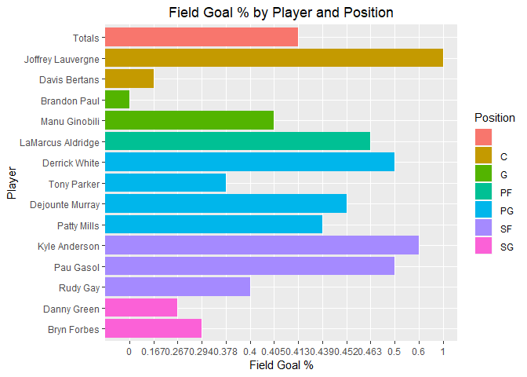

## Submission 
ALL MATERIAL MUST BE KNITTED INTO A SINGLE, LEGIBLE, AND DOCUMENTED HTML DOCUMENT. Use RMarkdown to create this file. Formatting can be basic, but it should be easily human-readable. Unless otherwise stated, please enable {r, echo=TRUE} so your code is visible. 

TIPS: If you are having problems with scraping, go to the website to check if it is online. If it is, then take a look at the actual website to verify how it is structured. Feel free to use View Source to narrow down good nodes to use. You are welcome to use any R libraries for this assignment. Off the top of my head, good ones to use might be rvest, dplyr, tidyr, ggplot2, reshape2, or stringr. You don’t need to include install.packages for your final code, but you need library() for each.


```r
# Load libraries
library(dplyr)
```

```
## Warning: package 'dplyr' was built under R version 3.4.4
```

```
## 
## Attaching package: 'dplyr'
```

```
## The following objects are masked from 'package:stats':
## 
##     filter, lag
```

```
## The following objects are masked from 'package:base':
## 
##     intersect, setdiff, setequal, union
```

```r
library(ggplot2)
```

```
## Warning: package 'ggplot2' was built under R version 3.4.4
```

```r
library(rvest)
```

```
## Warning: package 'rvest' was built under R version 3.4.4
```

```
## Loading required package: xml2
```

```
## Warning: package 'xml2' was built under R version 3.4.4
```

```r
library(stringr)
```

```
## Warning: package 'stringr' was built under R version 3.4.4
```

```r
library(tidyr)
```

```
## Warning: package 'tidyr' was built under R version 3.4.4
```

```r
library(data.table)
```

```
## Warning: package 'data.table' was built under R version 3.4.4
```

```
## 
## Attaching package: 'data.table'
```

```
## The following objects are masked from 'package:dplyr':
## 
##     between, first, last
```

```r
library(reshape2)
```

```
## Warning: package 'reshape2' was built under R version 3.4.4
```

```
## 
## Attaching package: 'reshape2'
```

```
## The following objects are masked from 'package:data.table':
## 
##     dcast, melt
```

```
## The following object is masked from 'package:tidyr':
## 
##     smiths
```

## Questions
###1. Harry Potter Cast (50%)
   a. In the IMDB, there are listings of full cast members for movies. Navigate to http://www.imdb.com/title/tt1201607/fullcredits?ref_=tt_ql_1. Feel free to View Source to get a good idea of what the page looks like in code.

```r
#Read the information from IMDB
HPCast <- read_html("http://www.imdb.com/title/tt1201607/fullcredits?ref_=tt_ql_1")
```
   
   b. Scrape the page with any R package that makes things easy for you. Of particular interest is the table of the Cast in order of crediting. Please scrape this table (you might have to fish it out of several of the tables from the page) and make it a data.frame() of the Cast in your R environment

```r
# Use SelectorGadget to find the correct keywords: .cast_list td:nth-child(2) and .character
# Scrap the actor data
actor_data_html <- html_nodes(HPCast,'.cast_list td:nth-child(2)')
# Convert actor data to text
actor_data <- html_text(actor_data_html)
# Scrap character data
character_data_html <- html_nodes(HPCast,'.character')
#Convert character data to text
character_data <- html_text(character_data_html)
```
   
   c. Clean up the table:
      1. It should not have blank observations or rows, a row that should be column names, or just ‘…’

```r
# Remove the \n in character_data
character_data <- gsub("\n","",character_data)
# Remove extra space
character_data <- str_squish(character_data)
# create two data frames
actor_data = data.frame(actor_data)
character_data = data.frame(character_data)
# change actor and character class to character
actor_data[] <- lapply(actor_data, as.character)
character_data[] <- lapply(character_data, as.character)
```
      2. It should have intuitive column names (ideally 2 to start – Actor and Character)

```r
# add names
names(actor_data) = c("ActorName")
names(character_data) = c("Character")
```
      3. In the film, Mr. Warwick plays two characters, which makes his row look a little weird. Please replace his character column with just “Griphook / Professor Filius Flitwick” to make it look better.
      4. One row might result in “Rest of cast listed alphabetically” – remove this observation.

```r
# create two data frames
actor_data = data.frame(actor_data)
character_data = data.frame(character_data)
# change actor and character class to character
actor_data[] <- lapply(actor_data, as.character)
character_data[] <- lapply(character_data, as.character)
# add names
names(actor_data) = c("ActorName")
names(character_data) = c("Character")
```
   d. Split the Actor’s name into two columns: FirstName and Surname. Keep in mind that some actors/actresses have middle names as well. Please make sure that the middle names are in the FirstName column, in addition to the first name (example: given the Actor Frank Jeffrey Stevenson, the FirstName column would say “Frank Jeffrey.”)

```r
#Split Actor’s name into two columns: FirstName and Surname
actor_names <- extract(actor_data, ActorName, c("FirstName", "Surname"), "(.+) (.+)")
```
   
   e. Present the first 10 rows of the data.frame() – It should have only FirstName, Surname, and Character columns.

```r
# Combine the two data frames
HarryPotterCast <- cbind(actor_names,character_data)
#Present the first 10 rows of the data frame
head(HarryPotterCast, 10)
```

```
##    FirstName   Surname                            Character
## 1      Ralph   Fiennes                       Lord Voldemort
## 2    Michael    Gambon           Professor Albus Dumbledore
## 3       Alan   Rickman              Professor Severus Snape
## 4     Daniel Radcliffe                         Harry Potter
## 5     Rupert     Grint                          Ron Weasley
## 6       Emma    Watson                     Hermione Granger
## 7     Evanna     Lynch                        Luna Lovegood
## 8   Domhnall   Gleeson                         Bill Weasley
## 9   Clémence     Poésy                       Fleur Delacour
## 10   Warwick     Davis Griphook / Professor Filius Flitwick
```
   
###2. SportsBall (50%)
   a. On the ESPN website, there are statistics of each NBA player. Navigate to the San Antonio Spurs current statistics (likely http://www.espn.com/nba/team/stats/_/name/sa/san-antonio-spurs). You are interested in the Shooting Statistics table.

```r
#Read data in from web page
spurs_page <- read_html('http://www.espn.com/nba/team/stats/_/name/sa/san-antonio-spurs')
```
   b. Scrape the page with any R package that makes things easy for you. There are a few tables on the page, so make sure you are targeting specifically the Shooting Statistics table.

```r
#pull table from the web data
spurs_tables <- html_nodes(spurs_page, 'table')
```
   
   c. Clean up the table (You might get some warnings if you’re working with tibbles) 
      • You’ll want to create an R data.frame() with one observation for each player. Make sure that you do not accidentally include blank rows, a row of column names, or the Totals row in the table as observations.

```r
# Scrape data from the second table on the page and output it in a data frame
spurs_stats <- html_table(spurs_tables, fill = TRUE)[[2]]
# pull off the header information
spurs_stat_header <- dplyr::slice(spurs_stats,2)
# take out the first 2 header rows and totals row
spurs_stats <- spurs_stats[-c(1, 2, 20), ]
# change row.names column to first, rename to rn 
spurs_stats <- setDT(spurs_stats, keep.rownames = TRUE)[]
# take out the rn column
spurs_stats$rn = NULL
# Add header names to data frame
names(spurs_stats) = as.character(spurs_stat_header)
```
      • The column PLAYER has two variables of interest in it: the player’s name and their position, denoted by 1-2 letters after their name. Split the cells into two columns, one with Name and the other Position.

```r
#Split the cells into two columns: Name and Position, using the ","
spurs_player_pos <- colsplit(spurs_stats$PLAYER, ",", c("Name", "Position"))
#Remove the original PLAYER coumn
spurs_stats$PLAYER = NULL
#combines the new colum into the data frame
spurs_stats <- cbind(spurs_player_pos,spurs_stats)
```
      • Check the data type of all columns. Convert relevant columns to numeric. Check the data type of all columns again to confirm that they have changed!

```r
#Check the data type of all columns
str(spurs_stats)
```

```
## 'data.frame':	15 obs. of  16 variables:
##  $ Name    : chr  "LaMarcus Aldridge" "Patty Mills" "Rudy Gay" "Manu Ginobili" ...
##  $ Position: chr  " PF" " PG" " SF" " G" ...
##  $ FGM     : chr  "7.4" "5.0" "5.2" "3.0" ...
##  $ FGA     : chr  "16.0" "11.4" "13.0" "7.4" ...
##  $ FG%     : chr  ".463" ".439" ".400" ".405" ...
##  $ 3PM     : chr  "0.6" "2.6" "0.8" "1.2" ...
##  $ 3PA     : chr  "1.0" "7.0" "3.6" "3.6" ...
##  $ 3P%     : chr  ".600" ".371" ".222" ".333" ...
##  $ FTM     : chr  "8.2" "0.8" "1.0" "1.8" ...
##  $ FTA     : chr  "8.4" "1.0" "1.8" "2.2" ...
##  $ FT%     : chr  "0.98" "0.80" "0.56" "0.82" ...
##  $ 2PM     : chr  "6.8" "2.4" "4.4" "1.8" ...
##  $ 2PA     : chr  "15.0" "4.4" "9.4" "3.8" ...
##  $ 2P%     : chr  ".453" ".545" ".468" ".474" ...
##  $ PPS     : chr  "1.475" "1.175" ".938" "1.216" ...
##  $ AFG%    : chr  "0.48" "0.55" "0.43" "0.49" ...
```

```r
#Convert relevant columns to numeric
spurs_stats[,3:16] <- lapply(spurs_stats[,3:16], as.numeric)
#Check the data type of all columns again to confirm that they have changed
str(spurs_stats)
```

```
## 'data.frame':	15 obs. of  16 variables:
##  $ Name    : chr  "LaMarcus Aldridge" "Patty Mills" "Rudy Gay" "Manu Ginobili" ...
##  $ Position: chr  " PF" " PG" " SF" " G" ...
##  $ FGM     : num  7.4 5 5.2 3 2.8 2.8 2 2.4 1.3 1.6 ...
##  $ FGA     : num  16 11.4 13 7.4 6.2 7.4 4 4 4.3 6 ...
##  $ FG%     : num  0.463 0.439 0.4 0.405 0.452 0.378 0.5 0.6 0.294 0.267 ...
##  $ 3PM     : num  0.6 2.6 0.8 1.2 0.8 0 0.2 0 0.5 1 ...
##  $ 3PA     : num  1 7 3.6 3.6 1.2 1 0.6 0.8 2.3 4 ...
##  $ 3P%     : num  0.6 0.371 0.222 0.333 0.667 0 0.333 0 0.222 0.25 ...
##  $ FTM     : num  8.2 0.8 1 1.8 1.4 1 1.8 0.6 1.3 0 ...
##  $ FTA     : num  8.4 1 1.8 2.2 1.8 1.4 2 0.8 1.8 0 ...
##  $ FT%     : num  0.98 0.8 0.56 0.82 0.78 0.71 0.9 0.75 0.71 0 ...
##  $ 2PM     : num  6.8 2.4 4.4 1.8 2 2.8 1.8 2.4 0.8 0.6 ...
##  $ 2PA     : num  15 4.4 9.4 3.8 5 6.4 3.4 3.2 2 2 ...
##  $ 2P%     : num  0.453 0.545 0.468 0.474 0.4 0.438 0.529 0.75 0.375 0.3 ...
##  $ PPS     : num  1.475 1.175 0.938 1.216 1.258 ...
##  $ AFG%    : num  0.48 0.55 0.43 0.49 0.52 0.38 0.53 0.6 0.35 0.35 ...
```
      
  d. Create a colorful bar chart that shows the Field Goals Percentage Per Game for each person. It will be graded on the following criteria.

```r
#Get the Field Goals Percentage Per Game for each person
spurs_fgpct <- select(spurs_stats, contains("Name"),("Position"),("FG%"))
#convert FG to a factor for the graph
spurs_fgpct$`FG%` <- as.factor(spurs_fgpct$`FG%`)
#group graph into Position
spurs_fgpct <- dplyr::arrange(spurs_fgpct, desc(Position))
```

```
## Warning: package 'bindrcpp' was built under R version 3.4.4
```
      • Informative Title, centered

```r
#updates ggplot theme to center the title
theme_update(plot.title = element_text(hjust = 0.5))
```
      • Relevant x and y axis labels (not simply variables names!)
      • Human-readable axes with no overlap (you might have to flip x and y to fix that). Note: You do not have to convert the decimal to a percentage.
      • Color the columns by the team member’s position (so, all PF’s should have the same color, etc.)
      

```r
#creates second name coloum as a factor
spurs_fgpct$Name2 <- factor(spurs_fgpct$Name, as.character(spurs_fgpct$Name))

#create the plot using the updated theme to center the title
spurs_FG_player <- ggplot(spurs_fgpct, aes(x=Name2, y=`FG%`, fill=Position)) +  geom_bar(stat="identity") + theme_update() + coord_flip() +
  labs(title ="Field Goal % by Player and Position", x = "Player", y = "Field Goal %")
#prints the plot
spurs_FG_player
```

<!-- -->

###Reminder
   To complete this assignment, please submit one RMarkdown and matching HTML file.  Please submit all files at the same time; only one submission is granted. 
Good luck!
