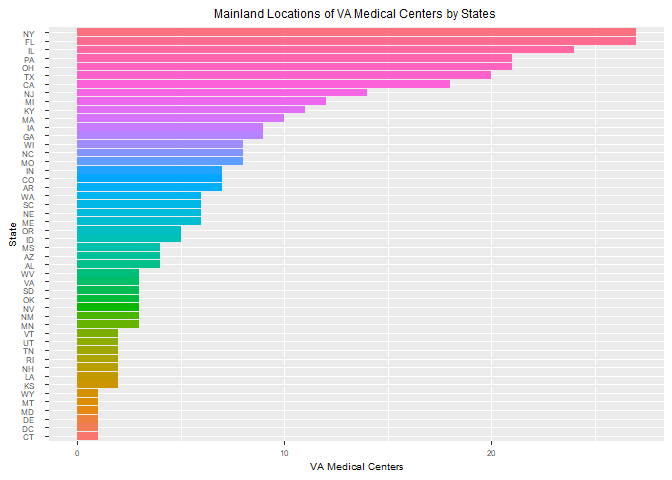
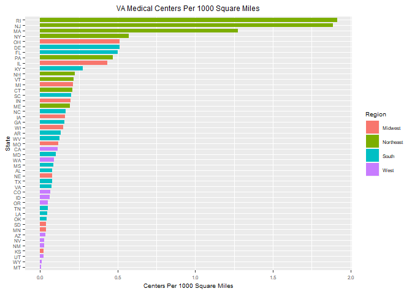

####Questions

Background: Your organization is responsible for building new VA hospitals in the mainland of the United States. You are a little overwhelmed by the prospect, not sure which places need the most help. You decide to begin by exploring healthcare facility data recorded by the U.S. Government. 

Disclaimer: While these are real data, the assignment is not an endorsement for any particular position on medical affairs or building hospitals. It is for instructional use only.


####1. Mental Health Clinics (40%):
   
   Utilize yob2016.txt for this question. This file is a series of popular children’s names born in the year 2016 in the United States.  It consists of three columns with a first name, a gender, and the amount of children given that name.  However, the data is raw and will need cleaning to make it tidy and usable.

   a. This data set is a survey of every known healthcare facility that offers mental health services in the United States in 2015. Navigate to https://datafiles.samhsa.gov/study-dataset/national-mental-health-services-survey-2015-n-mhss-2015-ds0001-nid17098 and select the R download. Look through the codebook PDF for an explanation on certain variables. Upon opening the RDA file, the data set should be inserted into your global environment, which you can then reference.

```r
# Load mh2015_puf data

load("N-MHSS-2015-DS0001-data-r.rda")
```

   b. Please create code which lists the State abbreviations without their counts, one abbreviation per State value. It does not have to be in data frame format. A vector is fine.

```r
#create a list of State abbreviations
stateabb <- dplyr::select(mh2015_puf, LST)
#remove counts
stateabb <- stateabb[-1, ]
```
   
   c. Filter the data.frame from 1A. We are only interested in the Veterans Administration (VA) medical centers in the mainland United States—create a listing of counts of these centers by state, including only mainland locations. Alaska, Hawaii, and U.S. territories should be omitted. DC, while not a state, is in the mainland, so it should remain included. Convert this to data.frame()


```r
#using FACILITYTYPE to filter out all but VAMC
VMAC <- data.frame(dplyr::filter(mh2015_puf,FACILITYTYPE == "Veterans Administration medical center (VAMC) or other VA health care facility"))
#data frame only has states and medical centers now
VMAC <- data.frame(dplyr::select(VMAC, LST, FACILITYTYPE))
#sort by states
VMAC <- data.frame(dplyr::arrange(VMAC, LST))

#Remove states Hawaii, Alaska and the U.S. territories (Puerto Rico)
VMAC <- VMAC[-grep("HI", VMAC$LST),]
VMAC <- VMAC[-grep("AK", VMAC$LST),]
VMAC <- VMAC[-grep("PR", VMAC$LST),]
```

   d. Create a ggplot barchart of this filtered data set. Vary the bar’s colors by what State it has listed. Give it an appropriately professional title that is centered. Make sure you have informative axis labels. The State axis should be readable, not layered over each other. You’re welcome to have a legend or not.

```r
#state listing with count
VMAC <- VMAC %>% group_by(FACILITYTYPE, LST) %>% tally()

#order by number in state
VMAC$LST <- factor(VMAC$LST, levels = VMAC$LST[order(VMAC$n)])

#plot data but state names overlap
VMACbar <- ggplot(VMAC, aes(x=as.factor(LST), y=n, fill=as.factor(LST), with=.5)) + geom_bar(stat = "identity")
#fix naming and add names to X an Y
VMACbar <- VMACbar + coord_flip() + guides(fill=FALSE) + xlab("State") + ylab("VA Medical Centers")
#Add a title and center it also adjusted font size to not cause over run
VMACbar <- VMACbar + ggtitle("Mainland Locations of VA Medical Centers by States ") + theme(plot.title = element_text(hjust=0.5), text = element_text(size=7.5))
VMACbar
```

<!-- -->

####2. Cleaning and Bringing in New Features (60%):
   
   a. This graph (1D) might be somewhat misleading, as bigger states may have more hospitals, but could be more sparsely located. Read statesize.csv into your R environment. This contains essentially a vector of square miles for each state. In trying to merge it with your data.frame() from 1C, you find that they don’t match. Use paste() on your LST column in 1C to see what the matter is, and write what you observe in a comment.

```r
#Read statesize.csv into your R environment 
statesize <- read.csv(file="statesize.csv", header=TRUE, sep=",")

#convert both to the same type
statesize$Abbrev <- as.character(statesize$Abbrev)
VMAC$LST <- as.character(VMAC$LST)
as.data.frame(statesize)
```

```
##         StateName SqMiles Abbrev    Region
## 1         Alabama   50750     AL     South
## 2          Alaska  570374     AK      West
## 3         Arizona  113642     AZ      West
## 4        Arkansas   52075     AR     South
## 5      California  155973     CA      West
## 6        Colorado  103730     CO      West
## 7     Connecticut    4845     CT Northeast
## 8        Delaware    1955     DE     South
## 9         Florida   53997     FL     South
## 10        Georgia   57919     GA     South
## 11         Hawaii    6423     HI      West
## 12          Idaho   82751     ID      West
## 13       Illinois   55593     IL   Midwest
## 14        Indiana   35870     IN   Midwest
## 15           Iowa   55875     IA   Midwest
## 16         Kansas   81823     KS   Midwest
## 17       Kentucky   39732     KY     South
## 18      Louisiana   43566     LA     South
## 19          Maine   30865     ME Northeast
## 20       Maryland    9775     MD     South
## 21  Massachusetts    7838     MA Northeast
## 22       Michigan   56539     MI   Midwest
## 23      Minnesota   79617     MN   Midwest
## 24    Mississippi   46914     MS     South
## 25       Missouri   68898     MO   Midwest
## 26        Montana  145556     MT      West
## 27       Nebraska   76878     NE   Midwest
## 28         Nevada  109806     NV      West
## 29  New Hampshire    8969     NH Northeast
## 30     New Jersey    7419     NJ Northeast
## 31     New Mexico  121365     NM      West
## 32       New York   47224     NY Northeast
## 33 North Carolina   48718     NC     South
## 34   North Dakota   68994     ND   Midwest
## 35           Ohio   40953     OH   Midwest
## 36       Oklahoma   68679     OK     South
## 37         Oregon   96003     OR      West
## 38   Pennsylvania   44820     PA Northeast
## 39   Rhode Island    1045     RI Northeast
## 40 South Carolina   30111     SC     South
## 41   South Dakota   75898     SD   Midwest
## 42      Tennessee   41220     TN     South
## 43          Texas  261914     TX     South
## 44           Utah   82168     UT      West
## 45        Vermont    9249     VT Northeast
## 46       Virginia   39598     VA     South
## 47     Washington   66582     WA      West
## 48  West Virginia   24087     WV     South
## 49      Wisconsin   54314     WI   Midwest
## 50        Wyoming   97105     WY      West
```

```r
as.data.frame(VMAC)
```

```
##                                                                      FACILITYTYPE
## 1  Veterans Administration medical center (VAMC) or other VA health care facility
## 2  Veterans Administration medical center (VAMC) or other VA health care facility
## 3  Veterans Administration medical center (VAMC) or other VA health care facility
## 4  Veterans Administration medical center (VAMC) or other VA health care facility
## 5  Veterans Administration medical center (VAMC) or other VA health care facility
## 6  Veterans Administration medical center (VAMC) or other VA health care facility
## 7  Veterans Administration medical center (VAMC) or other VA health care facility
## 8  Veterans Administration medical center (VAMC) or other VA health care facility
## 9  Veterans Administration medical center (VAMC) or other VA health care facility
## 10 Veterans Administration medical center (VAMC) or other VA health care facility
## 11 Veterans Administration medical center (VAMC) or other VA health care facility
## 12 Veterans Administration medical center (VAMC) or other VA health care facility
## 13 Veterans Administration medical center (VAMC) or other VA health care facility
## 14 Veterans Administration medical center (VAMC) or other VA health care facility
## 15 Veterans Administration medical center (VAMC) or other VA health care facility
## 16 Veterans Administration medical center (VAMC) or other VA health care facility
## 17 Veterans Administration medical center (VAMC) or other VA health care facility
## 18 Veterans Administration medical center (VAMC) or other VA health care facility
## 19 Veterans Administration medical center (VAMC) or other VA health care facility
## 20 Veterans Administration medical center (VAMC) or other VA health care facility
## 21 Veterans Administration medical center (VAMC) or other VA health care facility
## 22 Veterans Administration medical center (VAMC) or other VA health care facility
## 23 Veterans Administration medical center (VAMC) or other VA health care facility
## 24 Veterans Administration medical center (VAMC) or other VA health care facility
## 25 Veterans Administration medical center (VAMC) or other VA health care facility
## 26 Veterans Administration medical center (VAMC) or other VA health care facility
## 27 Veterans Administration medical center (VAMC) or other VA health care facility
## 28 Veterans Administration medical center (VAMC) or other VA health care facility
## 29 Veterans Administration medical center (VAMC) or other VA health care facility
## 30 Veterans Administration medical center (VAMC) or other VA health care facility
## 31 Veterans Administration medical center (VAMC) or other VA health care facility
## 32 Veterans Administration medical center (VAMC) or other VA health care facility
## 33 Veterans Administration medical center (VAMC) or other VA health care facility
## 34 Veterans Administration medical center (VAMC) or other VA health care facility
## 35 Veterans Administration medical center (VAMC) or other VA health care facility
## 36 Veterans Administration medical center (VAMC) or other VA health care facility
## 37 Veterans Administration medical center (VAMC) or other VA health care facility
## 38 Veterans Administration medical center (VAMC) or other VA health care facility
## 39 Veterans Administration medical center (VAMC) or other VA health care facility
## 40 Veterans Administration medical center (VAMC) or other VA health care facility
## 41 Veterans Administration medical center (VAMC) or other VA health care facility
## 42 Veterans Administration medical center (VAMC) or other VA health care facility
## 43 Veterans Administration medical center (VAMC) or other VA health care facility
## 44 Veterans Administration medical center (VAMC) or other VA health care facility
## 45 Veterans Administration medical center (VAMC) or other VA health care facility
## 46 Veterans Administration medical center (VAMC) or other VA health care facility
## 47 Veterans Administration medical center (VAMC) or other VA health care facility
## 48 Veterans Administration medical center (VAMC) or other VA health care facility
##       LST  n
## 1  AL      4
## 2  AR      7
## 3  AZ      4
## 4  CA     18
## 5  CO      7
## 6  CT      1
## 7  DC      1
## 8  DE      1
## 9  FL     27
## 10 GA      9
## 11 IA      9
## 12 ID      5
## 13 IL     24
## 14 IN      7
## 15 KS      2
## 16 KY     11
## 17 LA      2
## 18 MA     10
## 19 MD      1
## 20 ME      6
## 21 MI     12
## 22 MN      3
## 23 MO      8
## 24 MS      4
## 25 MT      1
## 26 NC      8
## 27 NE      6
## 28 NH      2
## 29 NJ     14
## 30 NM      3
## 31 NV      3
## 32 NY     27
## 33 OH     21
## 34 OK      3
## 35 OR      5
## 36 PA     21
## 37 RI      2
## 38 SC      6
## 39 SD      3
## 40 TN      2
## 41 TX     20
## 42 UT      2
## 43 VA      3
## 44 VT      2
## 45 WA      6
## 46 WI      8
## 47 WV      3
## 48 WY      1
```

```r
#remove FACILITYTYPE to clean up data
VMAC$FACILITYTYPE = NULL

#renamed Abbrev to LST so that the two can merge
statesize <- dplyr::rename(statesize, LST = Abbrev)

#remove the same states as above so that the list will match
statesize <- statesize[-grep("AK", statesize$LST),]
statesize <- statesize[-grep("HI", statesize$LST),]

#merge statesize and VMAC
newStateSize <- merge(VMAC, statesize)

#Use paste() on your LST column in 1C to see what the matter is
paste(VMAC$LST)
```

```
##  [1] "AL    " "AR    " "AZ    " "CA    " "CO    " "CT    " "DC    "
##  [8] "DE    " "FL    " "GA    " "IA    " "ID    " "IL    " "IN    "
## [15] "KS    " "KY    " "LA    " "MA    " "MD    " "ME    " "MI    "
## [22] "MN    " "MO    " "MS    " "MT    " "NC    " "NE    " "NH    "
## [29] "NJ    " "NM    " "NV    " "NY    " "OH    " "OK    " "OR    "
## [36] "PA    " "RI    " "SC    " "SD    " "TN    " "TX    " "UT    "
## [43] "VA    " "VT    " "WA    " "WI    " "WV    " "WY    "
```

```r
paste(statesize$LST)
```

```
##  [1] "AL" "AZ" "AR" "CA" "CO" "CT" "DE" "FL" "GA" "ID" "IL" "IN" "IA" "KS"
## [15] "KY" "LA" "ME" "MD" "MA" "MI" "MN" "MS" "MO" "MT" "NE" "NV" "NH" "NJ"
## [29] "NM" "NY" "NC" "ND" "OH" "OK" "OR" "PA" "RI" "SC" "SD" "TN" "TX" "UT"
## [43] "VT" "VA" "WA" "WV" "WI" "WY"
```

```r
#There are extra spaces in the VMAC data frame that do not exist in the statesize LST
```

   b. Correct the problem with the LST column using any method in R that is programmatic and easily understandable.

```r
#remove extra spaces so data frames will merge
VMAC$LST <- str_trim(VMAC$LST)
```

   Once you have made these state abbreviations identical to statesize.csv’s Abbrev column, merge the data.frame() from 1C and statesize.csv in order to add size information.

```r
#merge statesize into VMAC to add size information
VMAC <- dplyr::inner_join(statesize, VMAC, by = "LST", copy = TRUE)
```

   c. Calculate a new variable in your combined data.frame() which indicates the VA hospitals per thousand square miles.

```r
#Break down SqMiles into thousands
VMAC$ThoSqMiles <- VMAC$SqMiles/1000
#new variable for VA hospitals per thousand square miles
VMAC$VaPrThouSqMiles <- VMAC$n/VMAC$ThoSqMiles
```

   d. Create another ggplot which considers the VAs per square thousand miles, rather than just frequency.

```r
#order by VaPrThouSqMiles
VMAC$LST <- factor(VMAC$LST, levels = VMAC$LST[order(VMAC$VaPrThouSqMiles)])
```


```r
#create a ggplot looking at Region
VaPrThouSqMilesBar <- ggplot(VMAC, aes(x=as.factor(LST), y=VaPrThouSqMiles, fill=as.factor(Region), width=0.75)) + geom_bar(stat = "identity")
#add main title and adjust font size
VaPrThouSqMilesBar <- VaPrThouSqMilesBar + ggtitle("VA Medical Centers Per 1000 Square Miles") + theme(plot.title = element_text(hjust=0.5), text = element_text(size=7.5))
VaPrThouSqMilesBar <- VaPrThouSqMilesBar + guides(fill=guide_legend(title="Region"))
```
      • Make sure the State axis is readable, like before. Change the title and axes as appropriate.

```r
#turn graph and add titles
VaPrThouSqMilesBar <- VaPrThouSqMilesBar + coord_flip() + xlab("State") + ylab("Centers Per 1000 Square Miles")
VaPrThouSqMilesBar
```

<!-- -->
      • Modify the ggplot syntax to make your bars in descending order (there are StackOverflow topics for this, and I have demonstrated how in Live Coding in prior classes).
      • Color-code the bars based on Region (see the merged data.frame)—however, change the color scheme from the default. Any set of colors is fine, so long as it is readable.
      • Keep the legend—you should have four regions and therefore four colors. 
	
   e. What patterns do you see? By this metric, is there any region that seems relatively high for VA medical centers per thousand square miles? How about low? Given these data, what advice might you give your boss before you start modeling (and why)?

#####The Northeast has a considerable amount of VA Medical Centers while the South and West regions have less. Looking at the graph it looks like placement has been based on population density. I would suggest we look at population and the placement of facilities before moving forward. The Northeast has the most densely populated cities.
