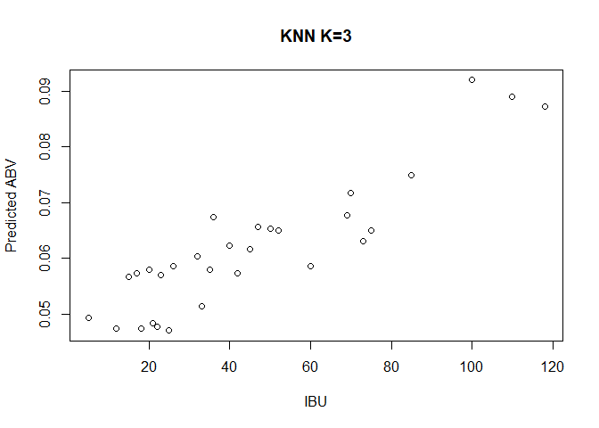
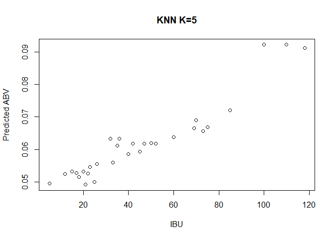
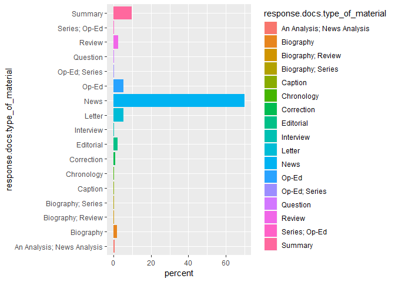

#### MSDS 6306: Doing Data Science

#### Live session Unit 10/11 assignment

#### Monday November 12th at 11:59pm

## Submission

ALL MATERIAL MUST BE KNITTED INTO A SINGLE, LEGIBLE, AND DOCUMENTED HTML DOCUMENT. Use RMarkdown to create this file. Formatting can be basic, but it should be easily human-readable. Unless otherwise stated, please enable {r, echo=TRUE} so your code is visible. 

## Questions

**Background:** Brewmeisters in Colorado and Texas have teamed up to analyze the relationship between ABV and IBU in each of their states.  Use the data sets from the project to help them in their analysis.  There three main questions of interest are 1) Is there a significant linear relationship between ABV (response) and IBU (explanatory), 2) Is this relationship different between beers in Colorado and Texas and 3) Is there a significant quadratic component in this relationship for either Colorado or Texas or both?


```r
#R libraries used in the report
library(plyr)
library(dplyr)
library(caret)
library(ggplot2)
library(pastecs)
library(reshape2)
library(ggpubr)
library(kableExtra)
library(MLmetrics)
library(mnormt)
library(mlr)
library(FNN)
library(magrittr)
library(Metrics)
library(tidyr)
library(RTextTools)
library(jsonlite)
library(caTools)
require(quanteda)
require(RColorBrewer)
```

### I. KNN Regression versus Linear Regression
## A. Clean an prepare the data:

    1. Create column for brewery ID that is common to both datasets similar to what you did in the project. So we can merge!


```r
#function to trim white space
trim <- function (x) gsub("^\\s+|\\s+$", "", x)
```


```r
#read in the two datasets
breweries <- read.csv("Data/Breweries.csv")
#States has a leading space, removing it
breweries$State <- trim(breweries$State)
beers <- read.csv("Data/Beers.csv")
```

    2. Merge the beer and brewery data into a single dataframe.


```r
#rename Brew_ID to Brewery_id to merge data
colnames(breweries)[1] <- "Brewery_id"
#both have a "Name" two for different groups
#rename Name to Brewery_Name
colnames(breweries)[2] <- "Brewery_Name"
#rename Name to Beer_Name
colnames(beers)[1] <- "Beer_Name"
#merge both data sets
brew_beer <- merge.data.frame(beers, breweries, by = "Brewery_id")
```

    3. Clean the State Column … get rid of extraneous white space.
    
**This is handled with the trim fubction above.**

    4. Create One Dataset that has only Colorado and Texas beers and no IBU NAs … name it “beerCOTX”


```r
#create beerCOTX with only TX and CO, removing NAs from IBU
beerCOTX <- filter(brew_beer,!is.na(IBU), State == "CO" | State == "TX")
```

    5. Order beerCOTX by IBU (ascending) ... this will be important later in graphing
    

```r
beerCOTX <- beerCOTX[order(beerCOTX$IBU),]
```

## C. Compare two competing models: External Cross Validation

    8. For this assignment we will concentrate only on the Texas data! Create a training and test set from the data (60%/40% split respectively). Print a summary of each new data frame… there should be two: TrainingTX, TestTX.
    

```r
#create the beerTX data set
beerTX <- filter(beerCOTX, State == "TX")
# Splitting the beerTX dataset into the Training set and Test set
# install.packages('caTools')
set.seed(7) # Set Seed so that same sample can be reproduced in the future
split = sample.split(beerTX$ABV, SplitRatio = .6)
TrainingTX = subset(beerTX, split == TRUE)
TestTX = subset(beerTX, split == FALSE)
#A summary of the TrainingTX data
summary(TrainingTX)
```

```
##    Brewery_id                    Beer_Name     Beer_ID    
##  Min.   : 30.0   1836                 : 1   Min.   :  44  
##  1st Qu.:126.0   18th Anniversary Gose: 1   1st Qu.:1300  
##  Median :129.0   Barn Burner Saison   : 1   Median :2040  
##  Mean   :162.3   Bat Outta Helles     : 1   Mean   :1762  
##  3rd Qu.:215.2   Battle LIne          : 1   3rd Qu.:2216  
##  Max.   :427.0   BLAKKR               : 1   Max.   :2588  
##                  (Other)              :50                 
##       ABV               IBU                                    Style   
##  Min.   :0.04000   Min.   :  5.00   American Blonde Ale           : 7  
##  1st Qu.:0.05075   1st Qu.: 21.00   American IPA                  : 6  
##  Median :0.05550   Median : 32.50   American Double / Imperial IPA: 5  
##  Mean   :0.06075   Mean   : 41.25   American Pale Ale (APA)       : 4  
##  3rd Qu.:0.06925   3rd Qu.: 50.50   Saison / Farmhouse Ale        : 4  
##  Max.   :0.09900   Max.   :118.00   American Amber / Red Ale      : 2  
##                                     (Other)                       :28  
##      Ounces                             Brewery_Name       City   
##  Min.   :12.00   Real Ale Brewing Company     : 7    Blanco  : 7  
##  1st Qu.:12.00   Southern Star Brewing Company: 7    Conroe  : 7  
##  Median :12.00   Karbach Brewing Company      : 5    Dallas  : 7  
##  Mean   :12.86   Deep Ellum Brewing Company   : 4    Houston : 7  
##  3rd Qu.:12.00   Texian Brewing Co.           : 4    Austin  : 6  
##  Max.   :16.00   Cedar Creek Brewery          : 3    Richmond: 4  
##                  (Other)                      :26    (Other) :18  
##     State          
##  Length:56         
##  Class :character  
##  Mode  :character  
##                    
##                    
##                    
## 
```

```r
#A summary of the TestTX data
summary(TestTX)
```

```
##    Brewery_id               Beer_Name     Beer_ID          ABV         
##  Min.   : 30.0   Alteration      : 1   Min.   :  45   Min.   :0.04200  
##  1st Qu.:119.0   Bombshell Blonde: 1   1st Qu.:1011   1st Qu.:0.05000  
##  Median :126.0   Chupahopra      : 1   Median :2042   Median :0.05500  
##  Mean   :155.2   Deep Ellum IPA  : 1   Mean   :1685   Mean   :0.05961  
##  3rd Qu.:185.0   Evil Owl        : 1   3rd Qu.:2212   3rd Qu.:0.06500  
##  Max.   :427.0   Gone A-Rye      : 1   Max.   :2600   Max.   :0.09900  
##                  (Other)         :27                                   
##       IBU                                    Style        Ounces     
##  Min.   :  5.00   American Pale Ale (APA)       : 5   Min.   :12.00  
##  1st Qu.: 20.00   American Double / Imperial IPA: 3   1st Qu.:12.00  
##  Median : 35.00   American IPA                  : 3   Median :12.00  
##  Mean   : 38.94   Witbier                       : 3   Mean   :12.73  
##  3rd Qu.: 45.00   American Amber / Red Ale      : 2   3rd Qu.:12.00  
##  Max.   :110.00   American Blonde Ale           : 2   Max.   :16.00  
##                   (Other)                       :15                  
##                         Brewery_Name               City  
##  Karbach Brewing Company      : 5    Austin          :7  
##  Southern Star Brewing Company: 5    Houston         :6  
##  Freetail Brewing Company     : 4    Conroe          :5  
##  Oasis Texas Brewing Company  : 3    San Antonio     :5  
##  Cedar Creek Brewery          : 2    Dripping Springs:2  
##  Hops & Grain Brewery         : 2    Fort Worth      :2  
##  (Other)                      :12    (Other)         :6  
##     State          
##  Length:33         
##  Class :character  
##  Mode  :character  
##                    
##                    
##                    
## 
```

    9. Using the training data, fit a KNN regression model to predict ABV from IBU. You should use the knnreg function in the caret package. Fit two separate models: one with k = 3 and one with k = 5. (This is 2 models total.)
    

```r
#fit a KNN regression model using knn.reg to predict ABV from IBU, k = 3
Train3TX.knn<- FNN::knn.reg(TrainingTX$IBU, y=TrainingTX$ABV, k=3)
plot(TrainingTX$IBU, Train3TX.knn$pred, xlab="IBU", ylab="Predicted ABV", main = "KNN K=3")
```

<!-- -->

```r
#print fit a KNN regression model to predict ABV from IBU, k = 3
Train3TX.knn
```

```
## PRESS =  0.006254556 
## R2-Predict =  0.4543463
```


```r
#fit a KNN regression model to predict ABV from IBU, k = 5
Train5TX.knn<- knn.reg(TrainingTX$IBU, y=TrainingTX$ABV, k=5)
plot(TrainingTX$IBU, Train5TX.knn$pred, xlab="IBU", ylab="Predicted ABV", main = "KNN K=5")
```

<!-- -->

```r
#Print fit a KNN regression model to predict ABV from IBU, k = 5
Train5TX.knn
```

```
## PRESS =  0.00576672 
## R2-Predict =  0.4969056
```

    10. Use the ASE loss function and external cross validation to provide evidence as to which model (k = 3 or k = 5) is more appropriate. Remember your answer should be supported with why you feel a certain model is appropriate. Your analysis should include the average squared error (ASE) for each model from the test set. Your analysis should also include a clear discussion, using the ASEs, as to which model you feel is more appropriate.
    

```r
# Fit the model on the training set and test out k at 3, 5 and 7
set.seed(123)
TXmodel <- caret::train(
  ABV ~ IBU, data = TrainingTX, method = "knn",
  trControl = trainControl("cv", number = 10),
  preProcess = c("center","scale"),
  tuneGrid = expand.grid(k = c(3, 5, 7, 9)
  ))
# Plot model error RMSE vs different values of k
plot(TXmodel)
```

<!-- -->

```r
# Best tuning parameter k that minimize the RMSE
TXmodel$bestTune
```

```
##   k
## 3 7
```

```r
# Make predictions on the test data
predictions <- TXmodel %>% predict(TestTX)
head(predictions)
```

```
## [1] 0.05171429 0.05171429 0.05291667 0.05462500 0.05110000 0.05110000
```

```r
# Compute the prediction error RMSE
RMSE(predictions, TestTX$ABV)
```

```
## [1] 0.008617931
```

```r
#Lets add the predictions to the test data
TestTX$ABVPredistions <- predictions
head(TestTX)
```

```
##    Brewery_id                          Beer_Name Beer_ID   ABV IBU
## 1          67                 Yo Soy Un Berliner    2520 0.044   5
## 3          67                            Rye Wit    2522 0.042  10
## 7         126                Weisse Versa (2012)    2374 0.052  16
## 11         39                          Twisted X    2212 0.051  19
## 13        119                   Bombshell Blonde     856 0.050  20
## 15        126 Love Street Summer Seasonal (2014)    1235 0.047  20
##                     Style Ounces                  Brewery_Name
## 1      Berliner Weissbier     12      Freetail Brewing Company
## 3                 Witbier     12      Freetail Brewing Company
## 7              Hefeweizen     12       Karbach Brewing Company
## 11 American Adjunct Lager     12     Twisted X Brewing Company
## 13    American Blonde Ale     16 Southern Star Brewing Company
## 15                Kölsch     12       Karbach Brewing Company
##                City State ABVPredistions
## 1       San Antonio    TX     0.05171429
## 3       San Antonio    TX     0.05171429
## 7           Houston    TX     0.05291667
## 11 Dripping Springs    TX     0.05462500
## 13           Conroe    TX     0.05110000
## 15          Houston    TX     0.05110000
```

```r
TXmodel
```

```
## k-Nearest Neighbors 
## 
## 56 samples
##  1 predictor
## 
## Pre-processing: centered (1), scaled (1) 
## Resampling: Cross-Validated (10 fold) 
## Summary of sample sizes: 50, 50, 49, 51, 51, 50, ... 
## Resampling results across tuning parameters:
## 
##   k  RMSE        Rsquared   MAE        
##   3  0.01064881  0.5316810  0.008590341
##   5  0.01057158  0.5494185  0.008281026
##   7  0.01028120  0.5530533  0.008005807
##   9  0.01031716  0.5539453  0.008036008
## 
## RMSE was used to select the optimal model using the smallest value.
## The final value used for the model was k = 7.
```
**I ran the test on a K of 3 and a K of 5. Out of those numbers the 5 scored slightly better. When I trained the TXmodel I wanted to see if there were any better values for K so I added 7 and 9 and plotted the results. Looking at the graph and the bestTune data we can now see that a K of 7 is the best number.
    
ASE=  (∑▒(y ̃_i-y_i )^2 )/n  

Here y ̃_i is the predicted ABV for the ith beer, y_iis the actual ABV of the ith beer and n is the sample size.

    11. Now use the ASE loss function and external cross validation to provide evidence as to which model (the linear regression model from last week or the “best” KNN regression model from this week (from question 10)) is more appropriate.
    
**Looking at the numbers from last week, the best I could do was an RMSE of 0.009727404 with just the IBU data and 0.009718517 with the IBU squared.**
   
    12. Use your “best” KNN regression model to predict the ABV for an IBU of 150, 170 and 190.  What issue do you see with using KNN to extrapolate?
**This is an observation so you should always be careful when you extrapolate.**


```r
TXmodel
```

```
## k-Nearest Neighbors 
## 
## 56 samples
##  1 predictor
## 
## Pre-processing: centered (1), scaled (1) 
## Resampling: Cross-Validated (10 fold) 
## Summary of sample sizes: 50, 50, 49, 51, 51, 50, ... 
## Resampling results across tuning parameters:
## 
##   k  RMSE        Rsquared   MAE        
##   3  0.01064881  0.5316810  0.008590341
##   5  0.01057158  0.5494185  0.008281026
##   7  0.01028120  0.5530533  0.008005807
##   9  0.01031716  0.5539453  0.008036008
## 
## RMSE was used to select the optimal model using the smallest value.
## The final value used for the model was k = 7.
```

### II. KNN Classification

We would like to be able to use ABV and IBU to classify beers between 2 styles: American IPA and American Pale Ale.
   
    13. Filter the beerCOTX dataframe for only beers that are from Texas and are American IPA and American Pale Ale.
    

```r
#create beerTX_AIPA_APA with only TX American IPA and American Pale Ale (APA), removing NAs from IBU
beerTX_AIPA_APA <- filter(beerTX, Style == "American IPA" | Style == "American Pale Ale (APA)")
head(beerTX_AIPA_APA)
```

```
##   Brewery_id                      Beer_Name Beer_ID   ABV IBU
## 1        185                      Slow Ride    2069 0.048  35
## 2        214          Lakefire Rye Pale Ale    2126 0.055  35
## 3         30 Elliott's Phoned Home Pale Ale    1182 0.051  36
## 4        126       Weekend Warrior Pale Ale    1557 0.055  40
## 5        258           Texas Pale Ale (TPA)    1971 0.055  40
## 6        141                  Power & Light    2301 0.055  42
##                     Style Ounces                 Brewery_Name
## 1 American Pale Ale (APA)     12  Oasis Texas Brewing Company
## 2 American Pale Ale (APA)     12      Grapevine Craft Brewery
## 3 American Pale Ale (APA)     16          Cedar Creek Brewery
## 4 American Pale Ale (APA)     12      Karbach Brewing Company
## 5            American IPA     16         South Austin Brewery
## 6 American Pale Ale (APA)     12 Independence Brewing Company
##             City State
## 1         Austin    TX
## 2 Farmers Branch    TX
## 3   Seven Points    TX
## 4        Houston    TX
## 5   South Austin    TX
## 6         Austin    TX
```
    
    14. Divide this filtered data set into a training and test set (60/40, training / test split).
    

```r
set.seed(7) # Set Seed so that same sample can be reproduced in future also
split = sample.split(beerTX_AIPA_APA$ABV, SplitRatio = .6)
TrainingTXIPA = subset(beerTX_AIPA_APA, split == TRUE)
TestTXIPA = subset(beerTX_AIPA_APA, split == FALSE)
#A summary of the TrainingTX data
summary(TrainingTXIPA)
```

```
##    Brewery_id                             Beer_Name    Beer_ID    
##  Min.   : 30.0   Chupahopra                    :1   Min.   : 463  
##  1st Qu.: 59.0   Dankosaurus                   :1   1st Qu.:1276  
##  Median :126.0   El Chingon IPA                :1   Median :1922  
##  Mean   :165.5   Elliott's Phoned Home Pale Ale:1   Mean   :1648  
##  3rd Qu.:254.2   Hopadillo India Pale Ale      :1   3rd Qu.:2048  
##  Max.   :396.0   Infamous IPA                  :1   Max.   :2458  
##                  (Other)                       :4                 
##       ABV               IBU                            Style  
##  Min.   :0.05100   Min.   :36.00   American IPA           :6  
##  1st Qu.:0.05625   1st Qu.:41.25   American Pale Ale (APA):4  
##  Median :0.06550   Median :56.50                          :0  
##  Mean   :0.06410   Mean   :56.20   Abbey Single Ale       :0  
##  3rd Qu.:0.06950   3rd Qu.:70.00   Altbier                :0  
##  Max.   :0.07600   Max.   :75.00   American Adjunct Lager :0  
##                                    (Other)                :0  
##      Ounces                           Brewery_Name               City  
##  Min.   :12.0   Cedar Creek Brewery         :2     Austin          :2  
##  1st Qu.:12.0   Karbach Brewing Company     :2     Houston         :2  
##  Median :12.0   Four Corners Brewing Company:1     Seven Points    :2  
##  Mean   :13.2   Hops & Grain Brewery        :1     Conroe          :1  
##  3rd Qu.:15.0   Infamous Brewing Company    :1     Dallas          :1  
##  Max.   :16.0   South Austin Brewery        :1     Dripping Springs:1  
##                 (Other)                     :2     (Other)         :1  
##     State          
##  Length:10         
##  Class :character  
##  Mode  :character  
##                    
##                    
##                    
## 
```

```r
#A summary of the TestTX data
summary(TestTXIPA)
```

```
##    Brewery_id                      Beer_Name    Beer_ID    
##  Min.   : 67.0   Deep Ellum IPA         :1   Min.   :  45  
##  1st Qu.:125.0   Lakefire Rye Pale Ale  :1   1st Qu.:1788  
##  Median :134.5   Pine Belt Pale Ale     :1   Median :2178  
##  Mean   :144.8   Power & Light          :1   Mean   :1826  
##  3rd Qu.:179.0   Pride of Texas Pale Ale:1   3rd Qu.:2319  
##  Max.   :214.0   Slow Ride              :1   Max.   :2521  
##                  (Other)                :2                 
##       ABV               IBU                            Style  
##  Min.   :0.04800   Min.   :35.00   American Pale Ale (APA):5  
##  1st Qu.:0.05500   1st Qu.:40.25   American IPA           :3  
##  Median :0.05850   Median :52.50                          :0  
##  Mean   :0.05875   Mean   :54.00   Abbey Single Ale       :0  
##  3rd Qu.:0.06125   3rd Qu.:70.00   Altbier                :0  
##  Max.   :0.07000   Max.   :75.00   American Adjunct Lager :0  
##                                    (Other)                :0  
##      Ounces                         Brewery_Name             City  
##  Min.   :12   Deep Ellum Brewing Company  :1     Austin        :3  
##  1st Qu.:12   Freetail Brewing Company    :1     Conroe        :1  
##  Median :12   Grapevine Craft Brewery     :1     Dallas        :1  
##  Mean   :13   Independence Brewing Company:1     Farmers Branch:1  
##  3rd Qu.:13   Oasis Texas Brewing Company :1     Fort Worth    :1  
##  Max.   :16   Rahr & Sons Brewing Company :1     San Antonio   :1  
##               (Other)                     :2     (Other)       :0  
##     State          
##  Length:8          
##  Class :character  
##  Mode  :character  
##                    
##                    
##                    
## 
```

    15. Use the class packages knn function to build an KNN classifier with k = 3 that will use ABV and IBU as features (explanatory variables) to classify Texas beers as American IPA or American Pale Ale using the Training data.  Use your test set to create a confusion table to estimate the accuracy, sensitivity and specificity of the model.
    

```r
# Classification using Kmeans clustering and KNN
resultsTXIPA3 = class::knn(TrainingTXIPA[,c(4:5)],TestTXIPA[,c(4:5)],TrainingTXIPA[,6], k = 3)
TestTXIPA$StylePred = resultsTXIPA3
TestTXIPA
```

```
##    Brewery_id               Beer_Name Beer_ID   ABV IBU
## 1         185               Slow Ride    2069 0.048  35
## 2         214   Lakefire Rye Pale Ale    2126 0.055  35
## 6         141           Power & Light    2301 0.055  42
## 8         119      Pine Belt Pale Ale      45 0.065  45
## 10        177 Pride of Texas Pale Ale    2229 0.058  60
## 13         67              Soul Doubt    2521 0.059  70
## 15        128          Deep Ellum IPA     943 0.070  70
## 17        127          The Green Room    2372 0.060  75
##                      Style Ounces                        Brewery_Name
## 1  American Pale Ale (APA)     12         Oasis Texas Brewing Company
## 2  American Pale Ale (APA)     12             Grapevine Craft Brewery
## 6  American Pale Ale (APA)     12        Independence Brewing Company
## 8  American Pale Ale (APA)     16       Southern Star Brewing Company
## 10 American Pale Ale (APA)     12         Rahr & Sons Brewing Company
## 13            American IPA     12            Freetail Brewing Company
## 15            American IPA     12          Deep Ellum Brewing Company
## 17            American IPA     16 Uncle Billy's Brewery and Smokeh...
##              City State               StylePred
## 1          Austin    TX American Pale Ale (APA)
## 2  Farmers Branch    TX American Pale Ale (APA)
## 6          Austin    TX American Pale Ale (APA)
## 8          Conroe    TX American Pale Ale (APA)
## 10     Fort Worth    TX            American IPA
## 13    San Antonio    TX            American IPA
## 15         Dallas    TX            American IPA
## 17         Austin    TX            American IPA
```
    
   
    16. Using the same process as in the last question, find the accuracy, sensitivity and specificity of a KNN model with k = 5.  Which is better?  Why?
    
**The model with k = 5 out performs the other. The ability to have a larger number to group with caused this model to do better.** 
    

```r
resultsTXIPA5 = class::knn(TrainingTXIPA[,c(4:5)],TestTXIPA[,c(4:5)],TrainingTXIPA[,6], k = 5)
TestTXIPA$StylePred5 = resultsTXIPA5
TestTXIPA
```

```
##    Brewery_id               Beer_Name Beer_ID   ABV IBU
## 1         185               Slow Ride    2069 0.048  35
## 2         214   Lakefire Rye Pale Ale    2126 0.055  35
## 6         141           Power & Light    2301 0.055  42
## 8         119      Pine Belt Pale Ale      45 0.065  45
## 10        177 Pride of Texas Pale Ale    2229 0.058  60
## 13         67              Soul Doubt    2521 0.059  70
## 15        128          Deep Ellum IPA     943 0.070  70
## 17        127          The Green Room    2372 0.060  75
##                      Style Ounces                        Brewery_Name
## 1  American Pale Ale (APA)     12         Oasis Texas Brewing Company
## 2  American Pale Ale (APA)     12             Grapevine Craft Brewery
## 6  American Pale Ale (APA)     12        Independence Brewing Company
## 8  American Pale Ale (APA)     16       Southern Star Brewing Company
## 10 American Pale Ale (APA)     12         Rahr & Sons Brewing Company
## 13            American IPA     12            Freetail Brewing Company
## 15            American IPA     12          Deep Ellum Brewing Company
## 17            American IPA     16 Uncle Billy's Brewery and Smokeh...
##              City State               StylePred              StylePred5
## 1          Austin    TX American Pale Ale (APA) American Pale Ale (APA)
## 2  Farmers Branch    TX American Pale Ale (APA) American Pale Ale (APA)
## 6          Austin    TX American Pale Ale (APA) American Pale Ale (APA)
## 8          Conroe    TX American Pale Ale (APA) American Pale Ale (APA)
## 10     Fort Worth    TX            American IPA            American IPA
## 13    San Antonio    TX            American IPA            American IPA
## 15         Dallas    TX            American IPA            American IPA
## 17         Austin    TX            American IPA            American IPA
```

###Unit 11 Questions


```r
#Trying different keys because of errors in pulling down data
#NYTIMES_KEY = "c90e2b1446ad4684b1d803b597c5cfea"
#NYTIMES_KEY = "2f797325c5fc4d00aee61d2ae3e615d1"
#NYTIMES_KEY = "1dd4756fa8394d538b5db5ecb658cf0b"
NYTIMES_KEY = "151b9472131546bfb1df16cd969daad4"
```

    1. Use the most updated code that is zipped with this. It fixes the grep problem by pasting a string with bracketed regular expression. I think someone mentioned this in class. Good call!
    
**In the code below I set the search to look at January 1, 1989 to January 1, 1999**
    

```r
# Let's set some parameters
term <- "central+park+jogger" # Need to use + to string together separate words
begin_date <- "19890101"
end_date <- "19960101"

baseurl <- paste0("http://api.nytimes.com/svc/search/v2/articlesearch.json?q=",term,
                  "&begin_date=",begin_date,"&end_date=",end_date,
                  "&facet_filter=true&api-key=",NYTIMES_KEY, sep="")

initialQuery <- jsonlite::fromJSON(baseurl)
```
    
    2. Use the snippet instead of the headline.
    

```r
#create the number of pages to search through
maxPages <- round((initialQuery$response$meta$hits[1] / 10)-1)

#used to slow down the search to avod errors in the Times
for(i in 1:100000000)
{  
  j = (i + 1 -1 )/i 
}

#pulls down all the data from the above settings. Uses maxPages to know when to stop
pages <- list()
for(i in 0:maxPages){
  nytSearch <- jsonlite::fromJSON(paste0(baseurl, "&page=", i), flatten = TRUE) %>% data.frame() 
  message("Retrieving page ", i)
  pages[[i+1]] <- nytSearch 
  Sys.sleep(1)
}
```

```
## Retrieving page 0
```

```
## Retrieving page 1
```

```
## Retrieving page 2
```

```
## Retrieving page 3
```

```
## Retrieving page 4
```

```
## Retrieving page 5
```

```
## Retrieving page 6
```

```
## Retrieving page 7
```

```
## Retrieving page 8
```

```
## Retrieving page 9
```

```
## Retrieving page 10
```

```
## Retrieving page 11
```

```
## Retrieving page 12
```

```
## Retrieving page 13
```

```
## Retrieving page 14
```

```
## Retrieving page 15
```

```
## Retrieving page 16
```

```
## Retrieving page 17
```

```
## Retrieving page 18
```

```
## Retrieving page 19
```

```
## Retrieving page 20
```

```
## Retrieving page 21
```

```
## Retrieving page 22
```

```
## Retrieving page 23
```

```
## Retrieving page 24
```

```
## Retrieving page 25
```

```
## Retrieving page 26
```

```
## Retrieving page 27
```

```
## Retrieving page 28
```

```
## Retrieving page 29
```

```
## Retrieving page 30
```

```
## Retrieving page 31
```

```
## Retrieving page 32
```

```
## Retrieving page 33
```

```
## Retrieving page 34
```

```
## Retrieving page 35
```

```
## Retrieving page 36
```

```
## Retrieving page 37
```

```
## Retrieving page 38
```

```
## Retrieving page 39
```

```
## Retrieving page 40
```

```
## Retrieving page 41
```

```
## Retrieving page 42
```

```
## Retrieving page 43
```

```
## Retrieving page 44
```

```
## Retrieving page 45
```

```
## Retrieving page 46
```

```
## Retrieving page 47
```

```
## Retrieving page 48
```

```
## Retrieving page 49
```

```
## Retrieving page 50
```

```
## Retrieving page 51
```

```
## Retrieving page 52
```

```
## Retrieving page 53
```

```
## Retrieving page 54
```

```
## Retrieving page 55
```

```
## Retrieving page 56
```

```r
allNYTSearch <- rbind_pages(pages)

# Visualize coverage by section
allNYTSearch %>% 
  group_by(response.docs.type_of_material) %>%
  dplyr::summarize(count=n()) %>%
  mutate(percent = (count / sum(count))*100) %>%
  ggplot() +
  geom_bar(aes(y=percent, x=response.docs.type_of_material, fill=response.docs.type_of_material), stat = "identity") + coord_flip()
```

<!-- -->

```r
#Make another column of News versus Other ... The labels
allNYTSearch$NewsOrOther = ifelse(allNYTSearch$response.docs.type_of_material == "News","News","Other")

#This function returns P(News | Keyword) 
#P(News|KW) = P(KW|News)* P(News) / P(KW)
Pnews_word = function(key_word = "jogging", trainingSet)
{
  print(key_word)
  NewsGroup = trainingSet[trainingSet$NewsOrOther == "News",]
  OtherGroup = trainingSet[trainingSet$NewsOrOther == "Other",]
  
  pNews = dim(NewsGroup)[1] / (dim(NewsGroup)[1] + dim(OtherGroup)[1])
  pOther = 1 - pNews
  
  pKWGivenNews = length(grep(paste("\\b",key_word,"\\b",sep=""),NewsGroup$response.docs.snippet,ignore.case = TRUE))/dim(NewsGroup)[1]
  pKWGivenOther = length(grep(paste("\\b",key_word,"\\b",sep=""),OtherGroup$response.docs.snippet,ignore.case = TRUE))/dim(OtherGroup)[1]
  
  pKW = length(grep(paste("\\b",key_word,"\\b",sep=""),trainingSet$response.docs.snippet,ignore.case = TRUE))/dim(trainingSet)[1]
  
  pNewsGivenKW = pKWGivenNews*pNews/pKW
  pOtherGivenKW = pKWGivenOther*pOther/pKW
  
  return(pNewsGivenKW)
}

theScoreHolderNews = c()
theScoreHolderOthers = c()
articleScoreNews = 0;
articleScoreOther = 0;


for (i in 1 : dim(allNYTSearch)[1])  #This loop iterates over the articles
{
  
  articleScoreNews = 0; 
  articleScoreOther = 0;
  #strsplit(gsub("[^[:alnum:] ]", "", str), " +")
  #strsplit(allNYTSearch$response.docs.snippet[i],split = " ")
   theText = unlist(strsplit(gsub("[^[:alnum:] ]", "", allNYTSearch$response.docs.snippet[i]), " +"))
  for(j in 1 : length(theText))  #This loop iterates over the headline (each word)
  {
    articleScoreNews = articleScoreNews + Pnews_word(theText[j],allNYTSearch)
    articleScoreOther = articleScoreOther + (1 - Pnews_word(theText[j],allNYTSearch))
  }
  theScoreHolderNews[i] = articleScoreNews
  theScoreHolderOthers[i] = articleScoreOther
}
```

```
## [1] "More"
## [1] "More"
## [1] "than"
## [1] "than"
## [1] "a"
## [1] "a"
## [1] "month"
## [1] "month"
## [1] "after"
## [1] "after"
## [1] "a"
## [1] "a"
## [1] "jogger"
## [1] "jogger"
## [1] "from"
## [1] "from"
## [1] "Brazil"
## [1] "Brazil"
## [1] "was"
## [1] "was"
## [1] "slain"
## [1] "slain"
## [1] "in"
## [1] "in"
## [1] "Central"
## [1] "Central"
## [1] "Park"
## [1] "Park"
## [1] "detectives"
## [1] "detectives"
## [1] "on"
## [1] "on"
## [1] "the"
## [1] "the"
## [1] "case"
## [1] "case"
## [1] "are"
## [1] "are"
## [1] "left"
## [1] "left"
## [1] "clinging"
## [1] "clinging"
## [1] "to"
## [1] "to"
## [1] "that"
## [1] "that"
## [1] "most"
## [1] "most"
## [1] "primitive"
## [1] "primitive"
## [1] "investigative"
## [1] "investigative"
## [1] "technique"
## [1] "technique"
## [1] "hoping"
## [1] "hoping"
## [1] "for"
## [1] "for"
## [1] "a"
## [1] "a"
## [1] "lucky"
## [1] "lucky"
## [1] "break"
## [1] "break"
## [1] "For"
## [1] "For"
## [1] "35"
## [1] "35"
## [1] "days"
## [1] "days"
## [1] "the"
## [1] "the"
## [1] "police"
## [1] "police"
## [1] "have"
## [1] "have"
## [1] "conducted"
## [1] "conducted"
## [1] "an"
## [1] "an"
## [1] "exhausti"
## [1] "exhausti"
## [1] "To"
## [1] "To"
## [1] "the"
## [1] "the"
## [1] "Editor"
## [1] "Editor"
## [1] "An"
## [1] "An"
## [1] "arrest"
## [1] "arrest"
## [1] "has"
## [1] "has"
## [1] "been"
## [1] "been"
## [1] "made"
## [1] "made"
## [1] "in"
## [1] "in"
## [1] "the"
## [1] "the"
## [1] "rape"
## [1] "rape"
## [1] "of"
## [1] "of"
## [1] "a"
## [1] "a"
## [1] "woman"
## [1] "woman"
## [1] "jogger"
## [1] "jogger"
## [1] "two"
## [1] "two"
## [1] "weeks"
## [1] "weeks"
## [1] "ago"
## [1] "ago"
## [1] "in"
## [1] "in"
## [1] "Central"
## [1] "Central"
## [1] "Park"
## [1] "Park"
## [1] "news"
## [1] "news"
## [1] "article"
## [1] "article"
## [1] "Oct"
## [1] "Oct"
## [1] "28"
## [1] "28"
## [1] "but"
## [1] "but"
## [1] "the"
## [1] "the"
## [1] "question"
## [1] "question"
## [1] "of"
## [1] "of"
## [1] "lighting"
## [1] "lighting"
## [1] "in"
## [1] "in"
## [1] "the"
## [1] "the"
## [1] "park"
## [1] "park"
## [1] "remains"
## [1] "remains"
## [1] "The"
## [1] "The"
## [1] "assault"
## [1] "assault"
## [1] "occurred"
## [1] "occurred"
## [1] "at"
## [1] "at"
## [1] "the"
## [1] "the"
## [1] "Reservoir"
## [1] "Reservoir"
## [1] "where"
## [1] "where"
## [1] "hundreds"
## [1] "hundreds"
## [1] "of"
## [1] "of"
## [1] "people"
## [1] "people"
## [1] "run"
## [1] "run"
## [1] "eve"
## [1] "eve"
## [1] "A"
## [1] "A"
## [1] "woman"
## [1] "woman"
## [1] "who"
## [1] "who"
## [1] "apparently"
## [1] "apparently"
## [1] "went"
## [1] "went"
## [1] "for"
## [1] "for"
## [1] "a"
## [1] "a"
## [1] "twilight"
## [1] "twilight"
## [1] "run"
## [1] "run"
## [1] "Saturday"
## [1] "Saturday"
## [1] "in"
## [1] "in"
## [1] "Central"
## [1] "Central"
## [1] "Park"
## [1] "Park"
## [1] "was"
## [1] "was"
## [1] "found"
## [1] "found"
## [1] "dead"
## [1] "dead"
## [1] "yesterday"
## [1] "yesterday"
## [1] "in"
## [1] "in"
## [1] "the"
## [1] "the"
## [1] "northeast"
## [1] "northeast"
## [1] "corner"
## [1] "corner"
## [1] "of"
## [1] "of"
## [1] "the"
## [1] "the"
## [1] "park"
## [1] "park"
## [1] "after"
## [1] "after"
## [1] "having"
## [1] "having"
## [1] "been"
## [1] "been"
## [1] "savagely"
## [1] "savagely"
## [1] "beaten"
## [1] "beaten"
## [1] "and"
## [1] "and"
## [1] "the"
## [1] "the"
## [1] "police"
## [1] "police"
## [1] "were"
## [1] "were"
## [1] "trying"
## [1] "trying"
## [1] "to"
## [1] "to"
## [1] "determine"
## [1] "determine"
## [1] "if"
## [1] "if"
## [1] "she"
## [1] "she"
## [1] "had"
## [1] "had"
## [1] "been"
## [1] "been"
## [1] "raped"
## [1] "raped"
## [1] "The"
## [1] "The"
## [1] "woman"
## [1] "woman"
## [1] "who"
## [1] "who"
## [1] "A"
## [1] "A"
## [1] "jogger"
## [1] "jogger"
## [1] "who"
## [1] "who"
## [1] "was"
## [1] "was"
## [1] "beaten"
## [1] "beaten"
## [1] "to"
## [1] "to"
## [1] "death"
## [1] "death"
## [1] "over"
## [1] "over"
## [1] "the"
## [1] "the"
## [1] "weekend"
## [1] "weekend"
## [1] "in"
## [1] "in"
## [1] "Central"
## [1] "Central"
## [1] "Park"
## [1] "Park"
## [1] "was"
## [1] "was"
## [1] "identified"
## [1] "identified"
## [1] "yesterday"
## [1] "yesterday"
## [1] "as"
## [1] "as"
## [1] "a"
## [1] "a"
## [1] "44yearold"
## [1] "44yearold"
## [1] "woman"
## [1] "woman"
## [1] "from"
## [1] "from"
## [1] "Brazil"
## [1] "Brazil"
## [1] "who"
## [1] "who"
## [1] "lived"
## [1] "lived"
## [1] "near"
## [1] "near"
## [1] "Columbus"
## [1] "Columbus"
## [1] "Circle"
## [1] "Circle"
## [1] "in"
## [1] "in"
## [1] "Manhattan"
## [1] "Manhattan"
## [1] "and"
## [1] "and"
## [1] "worked"
## [1] "worked"
## [1] "in"
## [1] "in"
## [1] "a"
## [1] "a"
## [1] "Madison"
## [1] "Madison"
## [1] "Avenue"
## [1] "Avenue"
## [1] "shoe"
## [1] "shoe"
## [1] "store"
## [1] "store"
## [1] "But"
## [1] "But"
## [1] "Police"
## [1] "Police"
## [1] "Commissioner"
## [1] "Commissioner"
## [1] "William"
## [1] "William"
## [1] "A"
## [1] "A"
## [1] "Manhattan"
## [1] "Manhattan"
## [1] "woman"
## [1] "woman"
## [1] "was"
## [1] "was"
## [1] "raped"
## [1] "raped"
## [1] "and"
## [1] "and"
## [1] "beaten"
## [1] "beaten"
## [1] "unconscious"
## [1] "unconscious"
## [1] "in"
## [1] "in"
## [1] "Central"
## [1] "Central"
## [1] "Park"
## [1] "Park"
## [1] "yesterday"
## [1] "yesterday"
## [1] "by"
## [1] "by"
## [1] "a"
## [1] "a"
## [1] "man"
## [1] "man"
## [1] "who"
## [1] "who"
## [1] "accosted"
## [1] "accosted"
## [1] "her"
## [1] "her"
## [1] "on"
## [1] "on"
## [1] "a"
## [1] "a"
## [1] "subway"
## [1] "subway"
## [1] "car"
## [1] "car"
## [1] "then"
## [1] "then"
## [1] "followed"
## [1] "followed"
## [1] "her"
## [1] "her"
## [1] "out"
## [1] "out"
## [1] "of"
## [1] "of"
## [1] "the"
## [1] "the"
## [1] "station"
## [1] "station"
## [1] "the"
## [1] "the"
## [1] "police"
## [1] "police"
## [1] "said"
## [1] "said"
## [1] "The"
## [1] "The"
## [1] "woman"
## [1] "woman"
## [1] "31"
## [1] "31"
## [1] "was"
## [1] "was"
## [1] "reading"
## [1] "reading"
## [1] "a"
## [1] "a"
## [1] "book"
## [1] "book"
## [1] "aboard"
## [1] "aboard"
## [1] "an"
## [1] "an"
## [1] "A"
## [1] "A"
## [1] "train"
## [1] "train"
## [1] "in"
## [1] "in"
## [1] "Brooklyn"
## [1] "Brooklyn"
## [1] "about"
## [1] "about"
## [1] "A"
## [1] "A"
## [1] "week"
## [1] "week"
## [1] "after"
## [1] "after"
## [1] "the"
## [1] "the"
## [1] "slaying"
## [1] "slaying"
## [1] "of"
## [1] "of"
## [1] "a"
## [1] "a"
## [1] "female"
## [1] "female"
## [1] "jogger"
## [1] "jogger"
## [1] "in"
## [1] "in"
## [1] "Central"
## [1] "Central"
## [1] "Park"
## [1] "Park"
## [1] "and"
## [1] "and"
## [1] "with"
## [1] "with"
## [1] "apparently"
## [1] "apparently"
## [1] "few"
## [1] "few"
## [1] "leads"
## [1] "leads"
## [1] "to"
## [1] "to"
## [1] "a"
## [1] "a"
## [1] "killer"
## [1] "killer"
## [1] "dozens"
## [1] "dozens"
## [1] "of"
## [1] "of"
## [1] "police"
## [1] "police"
## [1] "officers"
## [1] "officers"
## [1] "set"
## [1] "set"
## [1] "out"
## [1] "out"
## [1] "yesterday"
## [1] "yesterday"
## [1] "to"
## [1] "to"
## [1] "retrace"
## [1] "retrace"
## [1] "the"
## [1] "the"
## [1] "joggers"
## [1] "joggers"
## [1] "last"
## [1] "last"
## [1] "steps"
## [1] "steps"
## [1] "in"
## [1] "in"
## [1] "hopes"
## [1] "hopes"
## [1] "it"
## [1] "it"
## [1] "would"
## [1] "would"
## [1] "lead"
## [1] "lead"
## [1] "them"
## [1] "them"
## [1] "to"
## [1] "to"
## [1] "new"
## [1] "new"
## [1] "witnesses"
## [1] "witnesses"
## [1] "and"
## [1] "and"
## [1] "clues"
## [1] "clues"
## [1] "investig"
## [1] "investig"
## [1] "IT"
## [1] "IT"
## [1] "says"
## [1] "says"
## [1] "on"
## [1] "on"
## [1] "the"
## [1] "the"
## [1] "calendar"
## [1] "calendar"
## [1] "for"
## [1] "for"
## [1] "this"
## [1] "this"
## [1] "week"
## [1] "week"
## [1] "that"
## [1] "that"
## [1] "Columbus"
## [1] "Columbus"
## [1] "discovered"
## [1] "discovered"
## [1] "America"
## [1] "America"
## [1] "in"
## [1] "in"
## [1] "1492"
## [1] "1492"
## [1] "It"
## [1] "It"
## [1] "took"
## [1] "took"
## [1] "Maria"
## [1] "Maria"
## [1] "Isabel"
## [1] "Isabel"
## [1] "Pinto"
## [1] "Pinto"
## [1] "Monteiro"
## [1] "Monteiro"
## [1] "Alves"
## [1] "Alves"
## [1] "until"
## [1] "until"
## [1] "the"
## [1] "the"
## [1] "1970s"
## [1] "1970s"
## [1] "to"
## [1] "to"
## [1] "discover"
## [1] "discover"
## [1] "this"
## [1] "this"
## [1] "part"
## [1] "part"
## [1] "of"
## [1] "of"
## [1] "America"
## [1] "America"
## [1] "which"
## [1] "which"
## [1] "in"
## [1] "in"
## [1] "the"
## [1] "the"
## [1] "end"
## [1] "end"
## [1] "killed"
## [1] "killed"
## [1] "her"
## [1] "her"
## [1] "Bitter"
## [1] "Bitter"
## [1] "logic"
## [1] "logic"
## [1] "dictates"
## [1] "dictates"
## [1] "that"
## [1] "that"
## [1] "most"
## [1] "most"
## [1] "New"
## [1] "New"
## [1] "I"
## [1] "I"
## [1] "fit"
## [1] "fit"
## [1] "the"
## [1] "the"
## [1] "victims"
## [1] "victims"
## [1] "description"
## [1] "description"
## [1] "almost"
## [1] "almost"
## [1] "exactly"
## [1] "exactly"
## [1] "The"
## [1] "The"
## [1] "early"
## [1] "early"
## [1] "reports"
## [1] "reports"
## [1] "said"
## [1] "said"
## [1] "that"
## [1] "that"
## [1] "she"
## [1] "she"
## [1] "was"
## [1] "was"
## [1] "in"
## [1] "in"
## [1] "her"
## [1] "her"
## [1] "30s"
## [1] "30s"
## [1] "it"
## [1] "it"
## [1] "turned"
## [1] "turned"
## [1] "out"
## [1] "out"
## [1] "she"
## [1] "she"
## [1] "was"
## [1] "was"
## [1] "44"
## [1] "44"
## [1] "average"
## [1] "average"
## [1] "height"
## [1] "height"
## [1] "average"
## [1] "average"
## [1] "build"
## [1] "build"
## [1] "Hispanic"
## [1] "Hispanic"
## [1] "She"
## [1] "She"
## [1] "was"
## [1] "was"
## [1] "dragged"
## [1] "dragged"
## [1] "from"
## [1] "from"
## [1] "the"
## [1] "the"
## [1] "same"
## [1] "same"
## [1] "bend"
## [1] "bend"
## [1] "in"
## [1] "in"
## [1] "the"
## [1] "the"
## [1] "road"
## [1] "road"
## [1] "that"
## [1] "that"
## [1] "I"
## [1] "I"
## [1] "had"
## [1] "had"
## [1] "glided"
## [1] "glided"
## [1] "down"
## [1] "down"
## [1] "hundreds"
## [1] "hundreds"
## [1] "of"
## [1] "of"
## [1] "t"
## [1] "t"
## [1] "The"
## [1] "The"
## [1] "sky"
## [1] "sky"
## [1] "was"
## [1] "was"
## [1] "clear"
## [1] "clear"
## [1] "at"
## [1] "at"
## [1] "dusk"
## [1] "dusk"
## [1] "and"
## [1] "and"
## [1] "the"
## [1] "the"
## [1] "temperature"
## [1] "temperature"
## [1] "was"
## [1] "was"
## [1] "67"
## [1] "67"
## [1] "degrees"
## [1] "degrees"
## [1] "It"
## [1] "It"
## [1] "was"
## [1] "was"
## [1] "a"
## [1] "a"
## [1] "perfect"
## [1] "perfect"
## [1] "night"
## [1] "night"
## [1] "for"
## [1] "for"
## [1] "jogging"
## [1] "jogging"
## [1] "in"
## [1] "in"
## [1] "Central"
## [1] "Central"
## [1] "Park"
## [1] "Park"
## [1] "or"
## [1] "or"
## [1] "it"
## [1] "it"
## [1] "should"
## [1] "should"
## [1] "have"
## [1] "have"
## [1] "been"
## [1] "been"
## [1] "But"
## [1] "But"
## [1] "while"
## [1] "while"
## [1] "the"
## [1] "the"
## [1] "runners"
## [1] "runners"
## [1] "were"
## [1] "were"
## [1] "out"
## [1] "out"
## [1] "as"
## [1] "as"
## [1] "usual"
## [1] "usual"
## [1] "last"
## [1] "last"
## [1] "night"
## [1] "night"
## [1] "giving"
## [1] "giving"
## [1] "legs"
## [1] "legs"
## [1] "and"
## [1] "and"
## [1] "lungs"
## [1] "lungs"
## [1] "a"
## [1] "a"
## [1] "workout"
## [1] "workout"
## [1] "and"
## [1] "and"
## [1] "burning"
## [1] "burning"
## [1] "off"
## [1] "off"
## [1] "calori"
## [1] "calori"
## [1] "A"
## [1] "A"
## [1] "woman"
## [1] "woman"
## [1] "clad"
## [1] "clad"
## [1] "in"
## [1] "in"
## [1] "an"
## [1] "an"
## [1] "aqua"
## [1] "aqua"
## [1] "blue"
## [1] "blue"
## [1] "jogging"
## [1] "jogging"
## [1] "suit"
## [1] "suit"
## [1] "on"
## [1] "on"
## [1] "inline"
## [1] "inline"
## [1] "skates"
## [1] "skates"
## [1] "zoomed"
## [1] "zoomed"
## [1] "around"
## [1] "around"
## [1] "the"
## [1] "the"
## [1] "bend"
## [1] "bend"
## [1] "where"
## [1] "where"
## [1] "a"
## [1] "a"
## [1] "mobile"
## [1] "mobile"
## [1] "police"
## [1] "police"
## [1] "trailer"
## [1] "trailer"
## [1] "sat"
## [1] "sat"
## [1] "yesterday"
## [1] "yesterday"
## [1] "in"
## [1] "in"
## [1] "Central"
## [1] "Central"
## [1] "Park"
## [1] "Park"
## [1] "a"
## [1] "a"
## [1] "stones"
## [1] "stones"
## [1] "throw"
## [1] "throw"
## [1] "away"
## [1] "away"
## [1] "from"
## [1] "from"
## [1] "where"
## [1] "where"
## [1] "a"
## [1] "a"
## [1] "jogger"
## [1] "jogger"
## [1] "was"
## [1] "was"
## [1] "found"
## [1] "found"
## [1] "beaten"
## [1] "beaten"
## [1] "to"
## [1] "to"
## [1] "death"
## [1] "death"
## [1] "Sunday"
## [1] "Sunday"
## [1] "morning"
## [1] "morning"
## [1] "Any"
## [1] "Any"
## [1] "new"
## [1] "new"
## [1] "leads"
## [1] "leads"
## [1] "s"
## [1] "s"
## [1] ""
## [1] ""
## [1] "An"
## [1] "An"
## [1] "article"
## [1] "article"
## [1] "on"
## [1] "on"
## [1] "Monday"
## [1] "Monday"
## [1] "about"
## [1] "about"
## [1] "the"
## [1] "the"
## [1] "jogger"
## [1] "jogger"
## [1] "found"
## [1] "found"
## [1] "dead"
## [1] "dead"
## [1] "in"
## [1] "in"
## [1] "Central"
## [1] "Central"
## [1] "Park"
## [1] "Park"
## [1] "rendered"
## [1] "rendered"
## [1] "her"
## [1] "her"
## [1] "name"
## [1] "name"
## [1] "incorrectly"
## [1] "incorrectly"
## [1] "and"
## [1] "and"
## [1] "a"
## [1] "a"
## [1] "correction"
## [1] "correction"
## [1] "in"
## [1] "in"
## [1] "this"
## [1] "this"
## [1] "space"
## [1] "space"
## [1] "yesterday"
## [1] "yesterday"
## [1] "also"
## [1] "also"
## [1] "erred"
## [1] "erred"
## [1] "in"
## [1] "in"
## [1] "some"
## [1] "some"
## [1] "copies"
## [1] "copies"
## [1] "The"
## [1] "The"
## [1] "jogger"
## [1] "jogger"
## [1] "was"
## [1] "was"
## [1] "Maria"
## [1] "Maria"
## [1] "Isabel"
## [1] "Isabel"
## [1] "Pinto"
## [1] "Pinto"
## [1] "Monteiro"
## [1] "Monteiro"
## [1] "Alves"
## [1] "Alves"
## [1] "An"
## [1] "An"
## [1] "article"
## [1] "article"
## [1] "yesterday"
## [1] "yesterday"
## [1] "about"
## [1] "about"
## [1] "a"
## [1] "a"
## [1] "jogger"
## [1] "jogger"
## [1] "who"
## [1] "who"
## [1] "was"
## [1] "was"
## [1] "beaten"
## [1] "beaten"
## [1] "to"
## [1] "to"
## [1] "death"
## [1] "death"
## [1] "in"
## [1] "in"
## [1] "Central"
## [1] "Central"
## [1] "Park"
## [1] "Park"
## [1] "gave"
## [1] "gave"
## [1] "an"
## [1] "an"
## [1] "incorrect"
## [1] "incorrect"
## [1] "surname"
## [1] "surname"
## [1] "and"
## [1] "and"
## [1] "in"
## [1] "in"
## [1] "some"
## [1] "some"
## [1] "copies"
## [1] "copies"
## [1] "misidentified"
## [1] "misidentified"
## [1] "her"
## [1] "her"
## [1] "home"
## [1] "home"
## [1] "country"
## [1] "country"
## [1] "The"
## [1] "The"
## [1] "jogger"
## [1] "jogger"
## [1] "was"
## [1] "was"
## [1] "Maria"
## [1] "Maria"
## [1] "Alves"
## [1] "Alves"
## [1] "not"
## [1] "not"
## [1] "Maria"
## [1] "Maria"
## [1] "Isabel"
## [1] "Isabel"
## [1] "Montero"
## [1] "Montero"
## [1] "she"
## [1] "she"
## [1] "was"
## [1] "was"
## [1] "from"
## [1] "from"
## [1] "Rio"
## [1] "Rio"
## [1] "de"
## [1] "de"
## [1] "Janeiro"
## [1] "Janeiro"
## [1] "Brazil"
## [1] "Brazil"
## [1] "n"
## [1] "n"
## [1] "The"
## [1] "The"
## [1] "jogger"
## [1] "jogger"
## [1] "found"
## [1] "found"
## [1] "dead"
## [1] "dead"
## [1] "in"
## [1] "in"
## [1] "Central"
## [1] "Central"
## [1] "Park"
## [1] "Park"
## [1] "on"
## [1] "on"
## [1] "Sunday"
## [1] "Sunday"
## [1] "morning"
## [1] "morning"
## [1] "loved"
## [1] "loved"
## [1] "samba"
## [1] "samba"
## [1] "and"
## [1] "and"
## [1] "shiatsu"
## [1] "shiatsu"
## [1] "massage"
## [1] "massage"
## [1] "landscapes"
## [1] "landscapes"
## [1] "and"
## [1] "and"
## [1] "the"
## [1] "the"
## [1] "sand"
## [1] "sand"
## [1] "between"
## [1] "between"
## [1] "her"
## [1] "her"
## [1] "toes"
## [1] "toes"
## [1] "As"
## [1] "As"
## [1] "a"
## [1] "a"
## [1] "girl"
## [1] "girl"
## [1] "she"
## [1] "she"
## [1] "wore"
## [1] "wore"
## [1] "her"
## [1] "her"
## [1] "hair"
## [1] "hair"
## [1] "down"
## [1] "down"
## [1] "to"
## [1] "to"
## [1] "her"
## [1] "her"
## [1] "hips"
## [1] "hips"
## [1] "and"
## [1] "and"
## [1] "her"
## [1] "her"
## [1] "smile"
## [1] "smile"
## [1] "in"
## [1] "in"
## [1] "family"
## [1] "family"
## [1] "photos"
## [1] "photos"
## [1] "was"
## [1] "was"
## [1] "the"
## [1] "the"
## [1] "kind"
## [1] "kind"
## [1] "to"
## [1] "to"
## [1] "make"
## [1] "make"
## [1] "you"
## [1] "you"
## [1] "wonder"
## [1] "wonder"
## [1] "how"
## [1] "how"
## [1] "Questioning"
## [1] "Questioning"
## [1] "in"
## [1] "in"
## [1] "Jogger"
## [1] "Jogger"
## [1] "Case"
## [1] "Case"
## [1] "Investigators"
## [1] "Investigators"
## [1] "combed"
## [1] "combed"
## [1] "through"
## [1] "through"
## [1] "the"
## [1] "the"
## [1] "hotel"
## [1] "hotel"
## [1] "room"
## [1] "room"
## [1] "of"
## [1] "of"
## [1] "a"
## [1] "a"
## [1] "man"
## [1] "man"
## [1] "being"
## [1] "being"
## [1] "questioned"
## [1] "questioned"
## [1] "in"
## [1] "in"
## [1] "connection"
## [1] "connection"
## [1] "with"
## [1] "with"
## [1] "the"
## [1] "the"
## [1] "killing"
## [1] "killing"
## [1] "of"
## [1] "of"
## [1] "a"
## [1] "a"
## [1] "jogger"
## [1] "jogger"
## [1] "in"
## [1] "in"
## [1] "Central"
## [1] "Central"
## [1] "Park"
## [1] "Park"
## [1] "Page"
## [1] "Page"
## [1] "B1"
## [1] "B1"
## [1] "Chess"
## [1] "Chess"
## [1] "Drought"
## [1] "Drought"
## [1] "Ends"
## [1] "Ends"
## [1] "After"
## [1] "After"
## [1] "eight"
## [1] "eight"
## [1] "draws"
## [1] "draws"
## [1] "a"
## [1] "a"
## [1] "game"
## [1] "game"
## [1] "was"
## [1] "was"
## [1] "won"
## [1] "won"
## [1] "in"
## [1] "in"
## [1] "the"
## [1] "the"
## [1] "World"
## [1] "World"
## [1] "Chess"
## [1] "Chess"
## [1] "Cham"
## [1] "Cham"
## [1] "Investigators"
## [1] "Investigators"
## [1] "said"
## [1] "said"
## [1] "yesterday"
## [1] "yesterday"
## [1] "that"
## [1] "that"
## [1] "they"
## [1] "they"
## [1] "believed"
## [1] "believed"
## [1] "that"
## [1] "that"
## [1] "the"
## [1] "the"
## [1] "jogger"
## [1] "jogger"
## [1] "found"
## [1] "found"
## [1] "beaten"
## [1] "beaten"
## [1] "to"
## [1] "to"
## [1] "death"
## [1] "death"
## [1] "in"
## [1] "in"
## [1] "Central"
## [1] "Central"
## [1] "Park"
## [1] "Park"
## [1] "on"
## [1] "on"
## [1] "Sunday"
## [1] "Sunday"
## [1] "had"
## [1] "had"
## [1] "been"
## [1] "been"
## [1] "sexually"
## [1] "sexually"
## [1] "attacked"
## [1] "attacked"
## [1] "and"
## [1] "and"
## [1] "that"
## [1] "that"
## [1] "a"
## [1] "a"
## [1] "stranger"
## [1] "stranger"
## [1] "probably"
## [1] "probably"
## [1] "carried"
## [1] "carried"
## [1] "out"
## [1] "out"
## [1] "the"
## [1] "the"
## [1] "assault"
## [1] "assault"
## [1] "But"
## [1] "But"
## [1] "the"
## [1] "the"
## [1] "investigators"
## [1] "investigators"
## [1] "said"
## [1] "said"
## [1] "they"
## [1] "they"
## [1] "doubted"
## [1] "doubted"
## [1] "that"
## [1] "that"
## [1] "they"
## [1] "they"
## [1] "woul"
## [1] "woul"
## [1] ""
## [1] ""
## [1] "To"
## [1] "To"
## [1] "the"
## [1] "the"
## [1] "Editor"
## [1] "Editor"
## [1] "In"
## [1] "In"
## [1] "several"
## [1] "several"
## [1] "years"
## [1] "years"
## [1] "of"
## [1] "of"
## [1] "watching"
## [1] "watching"
## [1] "and"
## [1] "and"
## [1] "waiting"
## [1] "waiting"
## [1] "for"
## [1] "for"
## [1] "spring"
## [1] "spring"
## [1] "in"
## [1] "in"
## [1] "Central"
## [1] "Central"
## [1] "Park"
## [1] "Park"
## [1] "I"
## [1] "I"
## [1] "have"
## [1] "have"
## [1] "never"
## [1] "never"
## [1] "known"
## [1] "known"
## [1] "one"
## [1] "one"
## [1] "more"
## [1] "more"
## [1] "spectacular"
## [1] "spectacular"
## [1] "than"
## [1] "than"
## [1] "the"
## [1] "the"
## [1] "present"
## [1] "present"
## [1] "Investigators"
## [1] "Investigators"
## [1] "combed"
## [1] "combed"
## [1] "through"
## [1] "through"
## [1] "the"
## [1] "the"
## [1] "hotel"
## [1] "hotel"
## [1] "room"
## [1] "room"
## [1] "yesterday"
## [1] "yesterday"
## [1] "of"
## [1] "of"
## [1] "a"
## [1] "a"
## [1] "Harlem"
## [1] "Harlem"
## [1] "man"
## [1] "man"
## [1] "who"
## [1] "who"
## [1] "was"
## [1] "was"
## [1] "being"
## [1] "being"
## [1] "questioned"
## [1] "questioned"
## [1] "in"
## [1] "in"
## [1] "the"
## [1] "the"
## [1] "killing"
## [1] "killing"
## [1] "of"
## [1] "of"
## [1] "Maria"
## [1] "Maria"
## [1] "Isabel"
## [1] "Isabel"
## [1] "Pinto"
## [1] "Pinto"
## [1] "Monteiro"
## [1] "Monteiro"
## [1] "Alves"
## [1] "Alves"
## [1] "the"
## [1] "the"
## [1] "jogger"
## [1] "jogger"
## [1] "who"
## [1] "who"
## [1] "was"
## [1] "was"
## [1] "found"
## [1] "found"
## [1] "beaten"
## [1] "beaten"
## [1] "to"
## [1] "to"
## [1] "death"
## [1] "death"
## [1] "in"
## [1] "in"
## [1] "Central"
## [1] "Central"
## [1] "Park"
## [1] "Park"
## [1] "last"
## [1] "last"
## [1] "week"
## [1] "week"
## [1] "a"
## [1] "a"
## [1] "senior"
## [1] "senior"
## [1] "police"
## [1] "police"
## [1] "official"
## [1] "official"
## [1] "said"
## [1] "said"
## [1] "In"
## [1] "In"
## [1] "the"
## [1] "the"
## [1] "nine"
## [1] "nine"
## [1] "days"
## [1] "days"
## [1] "since"
## [1] "since"
## [1] "the"
## [1] "the"
## [1] "body"
## [1] "body"
## [1] "of"
## [1] "of"
## [1] "Maria"
## [1] "Maria"
## [1] "Isabel"
## [1] "Isabel"
## [1] "Pinto"
## [1] "Pinto"
## [1] "Monteiro"
## [1] "Monteiro"
## [1] "Alves"
## [1] "Alves"
## [1] "was"
## [1] "was"
## [1] "found"
## [1] "found"
## [1] "in"
## [1] "in"
## [1] "a"
## [1] "a"
## [1] "stream"
## [1] "stream"
## [1] "in"
## [1] "in"
## [1] "the"
## [1] "the"
## [1] "northeast"
## [1] "northeast"
## [1] "corner"
## [1] "corner"
## [1] "of"
## [1] "of"
## [1] "Central"
## [1] "Central"
## [1] "Park"
## [1] "Park"
## [1] "at"
## [1] "at"
## [1] "least"
## [1] "least"
## [1] "six"
## [1] "six"
## [1] "men"
## [1] "men"
## [1] "have"
## [1] "have"
## [1] "been"
## [1] "been"
## [1] "brought"
## [1] "brought"
## [1] "in"
## [1] "in"
## [1] "for"
## [1] "for"
## [1] "questioning"
## [1] "questioning"
## [1] "in"
## [1] "in"
## [1] "the"
## [1] "the"
## [1] "case"
## [1] "case"
## [1] "Five"
## [1] "Five"
## [1] "were"
## [1] "were"
## [1] "homeless"
## [1] "homeless"
## [1] "The"
## [1] "The"
## [1] "sixth"
## [1] "sixth"
## [1] "held"
## [1] "held"
## [1] "for"
## [1] "for"
## [1] "two"
## [1] "two"
## [1] "days"
## [1] "days"
## [1] "In"
## [1] "In"
## [1] "a"
## [1] "a"
## [1] "tantalizing"
## [1] "tantalizing"
## [1] "development"
## [1] "development"
## [1] "after"
## [1] "after"
## [1] "days"
## [1] "days"
## [1] "of"
## [1] "of"
## [1] "frustratingly"
## [1] "frustratingly"
## [1] "little"
## [1] "little"
## [1] "progress"
## [1] "progress"
## [1] "investigators"
## [1] "investigators"
## [1] "appealed"
## [1] "appealed"
## [1] "for"
## [1] "for"
## [1] "help"
## [1] "help"
## [1] "last"
## [1] "last"
## [1] "night"
## [1] "night"
## [1] "in"
## [1] "in"
## [1] "finding"
## [1] "finding"
## [1] "a"
## [1] "a"
## [1] "man"
## [1] "man"
## [1] "who"
## [1] "who"
## [1] "told"
## [1] "told"
## [1] "three"
## [1] "three"
## [1] "people"
## [1] "people"
## [1] "that"
## [1] "that"
## [1] "he"
## [1] "he"
## [1] "had"
## [1] "had"
## [1] "overheard"
## [1] "overheard"
## [1] "someone"
## [1] "someone"
## [1] "boasting"
## [1] "boasting"
## [1] "about"
## [1] "about"
## [1] "having"
## [1] "having"
## [1] "killed"
## [1] "killed"
## [1] "a"
## [1] "a"
## [1] "woman"
## [1] "woman"
## [1] "in"
## [1] "in"
## [1] "Central"
## [1] "Central"
## [1] "Park"
## [1] "Park"
## [1] "Commi"
## [1] "Commi"
## [1] "Beautiful"
## [1] "Beautiful"
## [1] "people"
## [1] "people"
## [1] "dropdead"
## [1] "dropdead"
## [1] "wardrobes"
## [1] "wardrobes"
## [1] "witless"
## [1] "witless"
## [1] "motivations"
## [1] "motivations"
## [1] "So"
## [1] "So"
## [1] "what"
## [1] "what"
## [1] "else"
## [1] "else"
## [1] "is"
## [1] "is"
## [1] "new"
## [1] "new"
## [1] "in"
## [1] "in"
## [1] "the"
## [1] "the"
## [1] "television"
## [1] "television"
## [1] "universe"
## [1] "universe"
## [1] "of"
## [1] "of"
## [1] "the"
## [1] "the"
## [1] "producer"
## [1] "producer"
## [1] "Darren"
## [1] "Darren"
## [1] "Star"
## [1] "Star"
## [1] "a"
## [1] "a"
## [1] "name"
## [1] "name"
## [1] "associated"
## [1] "associated"
## [1] "with"
## [1] "with"
## [1] "such"
## [1] "such"
## [1] "trailblazing"
## [1] "trailblazing"
## [1] "concoctions"
## [1] "concoctions"
## [1] "as"
## [1] "as"
## [1] "Beverly"
## [1] "Beverly"
## [1] "Hills"
## [1] "Hills"
## [1] "90210"
## [1] "90210"
## [1] "and"
## [1] "and"
## [1] "Melrose"
## [1] "Melrose"
## [1] "Place"
## [1] "Place"
## [1] "Nothing"
## [1] "Nothing"
## [1] "much"
## [1] "much"
## [1] "At"
## [1] "At"
## [1] "times"
## [1] "times"
## [1] "it"
## [1] "it"
## [1] "seemed"
## [1] "seemed"
## [1] "as"
## [1] "as"
## [1] "if"
## [1] "if"
## [1] "Manhattan"
## [1] "Manhattan"
## [1] "in"
## [1] "in"
## [1] "1995"
## [1] "1995"
## [1] "was"
## [1] "was"
## [1] "an"
## [1] "an"
## [1] "isle"
## [1] "isle"
## [1] "of"
## [1] "of"
## [1] "jousting"
## [1] "jousting"
## [1] "not"
## [1] "not"
## [1] "joy"
## [1] "joy"
## [1] "Though"
## [1] "Though"
## [1] "crime"
## [1] "crime"
## [1] "fell"
## [1] "fell"
## [1] "throughout"
## [1] "throughout"
## [1] "the"
## [1] "the"
## [1] "city"
## [1] "city"
## [1] "some"
## [1] "some"
## [1] "neighborhoods"
## [1] "neighborhoods"
## [1] "pressed"
## [1] "pressed"
## [1] "for"
## [1] "for"
## [1] "more"
## [1] "more"
## [1] "police"
## [1] "police"
## [1] "officers"
## [1] "officers"
## [1] "others"
## [1] "others"
## [1] "sought"
## [1] "sought"
## [1] "fewer"
## [1] "fewer"
## [1] "sidewalk"
## [1] "sidewalk"
## [1] "cafes"
## [1] "cafes"
## [1] "Street"
## [1] "Street"
## [1] "repairs"
## [1] "repairs"
## [1] "seared"
## [1] "seared"
## [1] "tempers"
## [1] "tempers"
## [1] "especially"
## [1] "especially"
## [1] "Shakespeare"
## [1] "Shakespeare"
## [1] "in"
## [1] "in"
## [1] "the"
## [1] "the"
## [1] "Park"
## [1] "Park"
## [1] "is"
## [1] "is"
## [1] "a"
## [1] "a"
## [1] "summer"
## [1] "summer"
## [1] "ritual"
## [1] "ritual"
## [1] "in"
## [1] "in"
## [1] "New"
## [1] "New"
## [1] "York"
## [1] "York"
## [1] "like"
## [1] "like"
## [1] "the"
## [1] "the"
## [1] "annual"
## [1] "annual"
## [1] "visit"
## [1] "visit"
## [1] "of"
## [1] "of"
## [1] "the"
## [1] "the"
## [1] "season"
## [1] "season"
## [1] "itself"
## [1] "itself"
## [1] "This"
## [1] "This"
## [1] "year"
## [1] "year"
## [1] "audiences"
## [1] "audiences"
## [1] "at"
## [1] "at"
## [1] "the"
## [1] "the"
## [1] "Delacorte"
## [1] "Delacorte"
## [1] "Theater"
## [1] "Theater"
## [1] "have"
## [1] "have"
## [1] "seen"
## [1] "seen"
## [1] "The"
## [1] "The"
## [1] "Tempest"
## [1] "Tempest"
## [1] "directed"
## [1] "directed"
## [1] "by"
## [1] "by"
## [1] "George"
## [1] "George"
## [1] "C"
## [1] "C"
## [1] "Wolfe"
## [1] "Wolfe"
## [1] "the"
## [1] "the"
## [1] "producer"
## [1] "producer"
## [1] "of"
## [1] "of"
## [1] "the"
## [1] "the"
## [1] "New"
## [1] "New"
## [1] "York"
## [1] "York"
## [1] "Shakespeare"
## [1] "Shakespeare"
## [1] "Festiva"
## [1] "Festiva"
## [1] "In"
## [1] "In"
## [1] "the"
## [1] "the"
## [1] "VIP"
## [1] "VIP"
## [1] "lounge"
## [1] "lounge"
## [1] "at"
## [1] "at"
## [1] "Rio"
## [1] "Rio"
## [1] "de"
## [1] "de"
## [1] "Janeiros"
## [1] "Janeiros"
## [1] "international"
## [1] "international"
## [1] "airport"
## [1] "airport"
## [1] "Lidia"
## [1] "Lidia"
## [1] "Pinto"
## [1] "Pinto"
## [1] "Machado"
## [1] "Machado"
## [1] "seemed"
## [1] "seemed"
## [1] "calm"
## [1] "calm"
## [1] "and"
## [1] "and"
## [1] "determined"
## [1] "determined"
## [1] "far"
## [1] "far"
## [1] "younger"
## [1] "younger"
## [1] "than"
## [1] "than"
## [1] "her"
## [1] "her"
## [1] "65"
## [1] "65"
## [1] "years"
## [1] "years"
## [1] "As"
## [1] "As"
## [1] "the"
## [1] "the"
## [1] "plane"
## [1] "plane"
## [1] "rose"
## [1] "rose"
## [1] "for"
## [1] "for"
## [1] "the"
## [1] "the"
## [1] "11hour"
## [1] "11hour"
## [1] "flight"
## [1] "flight"
## [1] "to"
## [1] "to"
## [1] "New"
## [1] "New"
## [1] "York"
## [1] "York"
## [1] "where"
## [1] "where"
## [1] "she"
## [1] "she"
## [1] "would"
## [1] "would"
## [1] "claim"
## [1] "claim"
## [1] "her"
## [1] "her"
## [1] "daughters"
## [1] "daughters"
## [1] "body"
## [1] "body"
## [1] "confr"
## [1] "confr"
## [1] "NEW"
## [1] "NEW"
## [1] "YORK"
## [1] "YORK"
## [1] "CITY"
## [1] "CITY"
## [1] "POLICE"
## [1] "POLICE"
## [1] "FACE"
## [1] "FACE"
## [1] "SKEPTICAL"
## [1] "SKEPTICAL"
## [1] "JURORS"
## [1] "JURORS"
## [1] "Maurice"
## [1] "Maurice"
## [1] "Eason"
## [1] "Eason"
## [1] "a"
## [1] "a"
## [1] "19yearold"
## [1] "19yearold"
## [1] "from"
## [1] "from"
## [1] "the"
## [1] "the"
## [1] "housing"
## [1] "housing"
## [1] "projects"
## [1] "projects"
## [1] "of"
## [1] "of"
## [1] "East"
## [1] "East"
## [1] "New"
## [1] "New"
## [1] "York"
## [1] "York"
## [1] "walked"
## [1] "walked"
## [1] "into"
## [1] "into"
## [1] "the"
## [1] "the"
## [1] "central"
## [1] "central"
## [1] "jury"
## [1] "jury"
## [1] "room"
## [1] "room"
## [1] "at"
## [1] "at"
## [1] "State"
## [1] "State"
## [1] "Supreme"
## [1] "Supreme"
## [1] "Court"
## [1] "Court"
## [1] "in"
## [1] "in"
## [1] "Brooklyn"
## [1] "Brooklyn"
## [1] "slightly"
## [1] "slightly"
## [1] "after"
## [1] "after"
## [1] "9"
## [1] "9"
## [1] "AM"
## [1] "AM"
## [1] "It"
## [1] "It"
## [1] "was"
## [1] "was"
## [1] "his"
## [1] "his"
## [1] "first"
## [1] "first"
## [1] "experience"
## [1] "experience"
## [1] "as"
## [1] "as"
## [1] "a"
## [1] "a"
## [1] "prosp"
## [1] "prosp"
## [1] "In"
## [1] "In"
## [1] "what"
## [1] "what"
## [1] "was"
## [1] "was"
## [1] "first"
## [1] "first"
## [1] "considered"
## [1] "considered"
## [1] "a"
## [1] "a"
## [1] "potential"
## [1] "potential"
## [1] "lead"
## [1] "lead"
## [1] "in"
## [1] "in"
## [1] "the"
## [1] "the"
## [1] "search"
## [1] "search"
## [1] "for"
## [1] "for"
## [1] "the"
## [1] "the"
## [1] "killer"
## [1] "killer"
## [1] "of"
## [1] "of"
## [1] "a"
## [1] "a"
## [1] "female"
## [1] "female"
## [1] "jogger"
## [1] "jogger"
## [1] "in"
## [1] "in"
## [1] "Central"
## [1] "Central"
## [1] "Park"
## [1] "Park"
## [1] "the"
## [1] "the"
## [1] "police"
## [1] "police"
## [1] "tracked"
## [1] "tracked"
## [1] "down"
## [1] "down"
## [1] "a"
## [1] "a"
## [1] "man"
## [1] "man"
## [1] "yesterday"
## [1] "yesterday"
## [1] "who"
## [1] "who"
## [1] "gave"
## [1] "gave"
## [1] "a"
## [1] "a"
## [1] "detailed"
## [1] "detailed"
## [1] "account"
## [1] "account"
## [1] "of"
## [1] "of"
## [1] "overhearing"
## [1] "overhearing"
## [1] "a"
## [1] "a"
## [1] "homeless"
## [1] "homeless"
## [1] "man"
## [1] "man"
## [1] "pushing"
## [1] "pushing"
## [1] "a"
## [1] "a"
## [1] "cart"
## [1] "cart"
## [1] "down"
## [1] "down"
## [1] "Fifth"
## [1] "Fifth"
## [1] "Avenue"
## [1] "Avenue"
## [1] "mumbl"
## [1] "mumbl"
## [1] "Are"
## [1] "Are"
## [1] "inline"
## [1] "inline"
## [1] "skates"
## [1] "skates"
## [1] "about"
## [1] "about"
## [1] "to"
## [1] "to"
## [1] "become"
## [1] "become"
## [1] "as"
## [1] "as"
## [1] "ubiquitous"
## [1] "ubiquitous"
## [1] "as"
## [1] "as"
## [1] "sneakers"
## [1] "sneakers"
## [1] "Last"
## [1] "Last"
## [1] "summer"
## [1] "summer"
## [1] "a"
## [1] "a"
## [1] "trickle"
## [1] "trickle"
## [1] "of"
## [1] "of"
## [1] "skaters"
## [1] "skaters"
## [1] "moved"
## [1] "moved"
## [1] "from"
## [1] "from"
## [1] "the"
## [1] "the"
## [1] "parks"
## [1] "parks"
## [1] "onto"
## [1] "onto"
## [1] "the"
## [1] "the"
## [1] "city"
## [1] "city"
## [1] "streets"
## [1] "streets"
## [1] "and"
## [1] "and"
## [1] "sidewalks"
## [1] "sidewalks"
## [1] "Now"
## [1] "Now"
## [1] "an"
## [1] "an"
## [1] "army"
## [1] "army"
## [1] "of"
## [1] "of"
## [1] "young"
## [1] "young"
## [1] "people"
## [1] "people"
## [1] "skate"
## [1] "skate"
## [1] "to"
## [1] "to"
## [1] "work"
## [1] "work"
## [1] "to"
## [1] "to"
## [1] "shop"
## [1] "shop"
## [1] "to"
## [1] "to"
## [1] "do"
## [1] "do"
## [1] "errands"
## [1] "errands"
## [1] "There"
## [1] "There"
## [1] "was"
## [1] "was"
## [1] "even"
## [1] "even"
## [1] "a"
## [1] "a"
## [1] "man"
## [1] "man"
## [1] "who"
## [1] "who"
## [1] "A"
## [1] "A"
## [1] "woman"
## [1] "woman"
## [1] "running"
## [1] "running"
## [1] "laps"
## [1] "laps"
## [1] "around"
## [1] "around"
## [1] "the"
## [1] "the"
## [1] "reservoir"
## [1] "reservoir"
## [1] "in"
## [1] "in"
## [1] "Central"
## [1] "Central"
## [1] "Park"
## [1] "Park"
## [1] "Saturday"
## [1] "Saturday"
## [1] "night"
## [1] "night"
## [1] "was"
## [1] "was"
## [1] "seized"
## [1] "seized"
## [1] "from"
## [1] "from"
## [1] "behind"
## [1] "behind"
## [1] "and"
## [1] "and"
## [1] "raped"
## [1] "raped"
## [1] "by"
## [1] "by"
## [1] "a"
## [1] "a"
## [1] "man"
## [1] "man"
## [1] "wielding"
## [1] "wielding"
## [1] "a"
## [1] "a"
## [1] "knife"
## [1] "knife"
## [1] "a"
## [1] "a"
## [1] "few"
## [1] "few"
## [1] "blocks"
## [1] "blocks"
## [1] "from"
## [1] "from"
## [1] "where"
## [1] "where"
## [1] "another"
## [1] "another"
## [1] "jogger"
## [1] "jogger"
## [1] "was"
## [1] "was"
## [1] "beaten"
## [1] "beaten"
## [1] "and"
## [1] "and"
## [1] "raped"
## [1] "raped"
## [1] "by"
## [1] "by"
## [1] "a"
## [1] "a"
## [1] "gang"
## [1] "gang"
## [1] "of"
## [1] "of"
## [1] "youths"
## [1] "youths"
## [1] "in"
## [1] "in"
## [1] "1989"
## [1] "1989"
## [1] "the"
## [1] "the"
## [1] "police"
## [1] "police"
## [1] "said"
## [1] "said"
## [1] "Saturd"
## [1] "Saturd"
## [1] "To"
## [1] "To"
## [1] "Joao"
## [1] "Joao"
## [1] "De"
## [1] "De"
## [1] "Matos"
## [1] "Matos"
## [1] "a"
## [1] "a"
## [1] "newspaper"
## [1] "newspaper"
## [1] "publisher"
## [1] "publisher"
## [1] "and"
## [1] "and"
## [1] "president"
## [1] "president"
## [1] "of"
## [1] "of"
## [1] "a"
## [1] "a"
## [1] "travel"
## [1] "travel"
## [1] "agency"
## [1] "agency"
## [1] "the"
## [1] "the"
## [1] "police"
## [1] "police"
## [1] "sketch"
## [1] "sketch"
## [1] "of"
## [1] "of"
## [1] "the"
## [1] "the"
## [1] "jogger"
## [1] "jogger"
## [1] "who"
## [1] "who"
## [1] "was"
## [1] "was"
## [1] "slain"
## [1] "slain"
## [1] "over"
## [1] "over"
## [1] "the"
## [1] "the"
## [1] "weekend"
## [1] "weekend"
## [1] "in"
## [1] "in"
## [1] "Central"
## [1] "Central"
## [1] "Park"
## [1] "Park"
## [1] "was"
## [1] "was"
## [1] "hauntingly"
## [1] "hauntingly"
## [1] "familiar"
## [1] "familiar"
## [1] "After"
## [1] "After"
## [1] "learning"
## [1] "learning"
## [1] "her"
## [1] "her"
## [1] "name"
## [1] "name"
## [1] "Maria"
## [1] "Maria"
## [1] "Isabel"
## [1] "Isabel"
## [1] "Pinto"
## [1] "Pinto"
## [1] "Monteiro"
## [1] "Monteiro"
## [1] "Alves"
## [1] "Alves"
## [1] "Mr"
## [1] "Mr"
## [1] "De"
## [1] "De"
## [1] "Ma"
## [1] "Ma"
## [1] "As"
## [1] "As"
## [1] "the"
## [1] "the"
## [1] "clock"
## [1] "clock"
## [1] "tolled"
## [1] "tolled"
## [1] "midnight"
## [1] "midnight"
## [1] "on"
## [1] "on"
## [1] "Sept"
## [1] "Sept"
## [1] "1"
## [1] "1"
## [1] "ushering"
## [1] "ushering"
## [1] "in"
## [1] "in"
## [1] "New"
## [1] "New"
## [1] "Yorks"
## [1] "Yorks"
## [1] "death"
## [1] "death"
## [1] "penalty"
## [1] "penalty"
## [1] "law"
## [1] "law"
## [1] "prosecutors"
## [1] "prosecutors"
## [1] "and"
## [1] "and"
## [1] "defense"
## [1] "defense"
## [1] "lawyers"
## [1] "lawyers"
## [1] "began"
## [1] "began"
## [1] "holding"
## [1] "holding"
## [1] "their"
## [1] "their"
## [1] "breaths"
## [1] "breaths"
## [1] "expecting"
## [1] "expecting"
## [1] "that"
## [1] "that"
## [1] "a"
## [1] "a"
## [1] "murder"
## [1] "murder"
## [1] "resulting"
## [1] "resulting"
## [1] "in"
## [1] "in"
## [1] "the"
## [1] "the"
## [1] "first"
## [1] "first"
## [1] "capital"
## [1] "capital"
## [1] "case"
## [1] "case"
## [1] "would"
## [1] "would"
## [1] "be"
## [1] "be"
## [1] "hours"
## [1] "hours"
## [1] "or"
## [1] "or"
## [1] "at"
## [1] "at"
## [1] "most"
## [1] "most"
## [1] "days"
## [1] "days"
## [1] "away"
## [1] "away"
## [1] "Mo"
## [1] "Mo"
## [1] "Two"
## [1] "Two"
## [1] "Manhattan"
## [1] "Manhattan"
## [1] "men"
## [1] "men"
## [1] "became"
## [1] "became"
## [1] "the"
## [1] "the"
## [1] "first"
## [1] "first"
## [1] "criminal"
## [1] "criminal"
## [1] "suspects"
## [1] "suspects"
## [1] "formally"
## [1] "formally"
## [1] "charged"
## [1] "charged"
## [1] "with"
## [1] "with"
## [1] "a"
## [1] "a"
## [1] "capital"
## [1] "capital"
## [1] "crime"
## [1] "crime"
## [1] "under"
## [1] "under"
## [1] "the"
## [1] "the"
## [1] "states"
## [1] "states"
## [1] "new"
## [1] "new"
## [1] "death"
## [1] "death"
## [1] "penalty"
## [1] "penalty"
## [1] "law"
## [1] "law"
## [1] "when"
## [1] "when"
## [1] "they"
## [1] "they"
## [1] "were"
## [1] "were"
## [1] "arraigned"
## [1] "arraigned"
## [1] "yesterday"
## [1] "yesterday"
## [1] "in"
## [1] "in"
## [1] "the"
## [1] "the"
## [1] "executionstyle"
## [1] "executionstyle"
## [1] "slaying"
## [1] "slaying"
## [1] "of"
## [1] "of"
## [1] "three"
## [1] "three"
## [1] "members"
## [1] "members"
## [1] "of"
## [1] "of"
## [1] "a"
## [1] "a"
## [1] "Harlem"
## [1] "Harlem"
## [1] "family"
## [1] "family"
## [1] "Lamar"
## [1] "Lamar"
## [1] "Sanc"
## [1] "Sanc"
## [1] "A"
## [1] "A"
## [1] "homeless"
## [1] "homeless"
## [1] "immigrant"
## [1] "immigrant"
## [1] "was"
## [1] "was"
## [1] "arrested"
## [1] "arrested"
## [1] "yesterday"
## [1] "yesterday"
## [1] "in"
## [1] "in"
## [1] "the"
## [1] "the"
## [1] "rape"
## [1] "rape"
## [1] "at"
## [1] "at"
## [1] "knifepoint"
## [1] "knifepoint"
## [1] "earlier"
## [1] "earlier"
## [1] "this"
## [1] "this"
## [1] "month"
## [1] "month"
## [1] "of"
## [1] "of"
## [1] "a"
## [1] "a"
## [1] "woman"
## [1] "woman"
## [1] "who"
## [1] "who"
## [1] "was"
## [1] "was"
## [1] "jogging"
## [1] "jogging"
## [1] "in"
## [1] "in"
## [1] "Central"
## [1] "Central"
## [1] "Park"
## [1] "Park"
## [1] "late"
## [1] "late"
## [1] "at"
## [1] "at"
## [1] "night"
## [1] "night"
## [1] "the"
## [1] "the"
## [1] "police"
## [1] "police"
## [1] "said"
## [1] "said"
## [1] "yesterday"
## [1] "yesterday"
## [1] "The"
## [1] "The"
## [1] "police"
## [1] "police"
## [1] "said"
## [1] "said"
## [1] "the"
## [1] "the"
## [1] "suspect"
## [1] "suspect"
## [1] "Salif"
## [1] "Salif"
## [1] "Diop"
## [1] "Diop"
## [1] "an"
## [1] "an"
## [1] "immigrant"
## [1] "immigrant"
## [1] "from"
## [1] "from"
## [1] "Senegal"
## [1] "Senegal"
## [1] "in"
## [1] "in"
## [1] "h"
## [1] "h"
## [1] "This"
## [1] "This"
## [1] "wasnt"
## [1] "wasnt"
## [1] "exactly"
## [1] "exactly"
## [1] "LAX"
## [1] "LAX"
## [1] "being"
## [1] "being"
## [1] "shut"
## [1] "shut"
## [1] "down"
## [1] "down"
## [1] "for"
## [1] "for"
## [1] "the"
## [1] "the"
## [1] "Presidential"
## [1] "Presidential"
## [1] "coif"
## [1] "coif"
## [1] "aboard"
## [1] "aboard"
## [1] "Air"
## [1] "Air"
## [1] "Force"
## [1] "Force"
## [1] "One"
## [1] "One"
## [1] "but"
## [1] "but"
## [1] "some"
## [1] "some"
## [1] "residents"
## [1] "residents"
## [1] "of"
## [1] "of"
## [1] "the"
## [1] "the"
## [1] "Upper"
## [1] "Upper"
## [1] "West"
## [1] "West"
## [1] "Side"
## [1] "Side"
## [1] "awoke"
## [1] "awoke"
## [1] "yesterday"
## [1] "yesterday"
## [1] "morning"
## [1] "morning"
## [1] "to"
## [1] "to"
## [1] "feel"
## [1] "feel"
## [1] "the"
## [1] "the"
## [1] "aftereffects"
## [1] "aftereffects"
## [1] "of"
## [1] "of"
## [1] "President"
## [1] "President"
## [1] "Clintons"
## [1] "Clintons"
## [1] "dinner"
## [1] "dinner"
## [1] "on"
## [1] "on"
## [1] "Monday"
## [1] "Monday"
## [1] "night"
## [1] "night"
## [1] "To"
## [1] "To"
## [1] "make"
## [1] "make"
## [1] "the"
## [1] "the"
## [1] "HOPE"
## [1] "HOPE"
## [1] "AND"
## [1] "AND"
## [1] "DISAPPOINTMENT"
## [1] "DISAPPOINTMENT"
## [1] "MINGLE"
## [1] "MINGLE"
## [1] "AT"
## [1] "AT"
## [1] "UN"
## [1] "UN"
## [1] "Under"
## [1] "Under"
## [1] "sunny"
## [1] "sunny"
## [1] "skies"
## [1] "skies"
## [1] "but"
## [1] "but"
## [1] "with"
## [1] "with"
## [1] "minimal"
## [1] "minimal"
## [1] "fanfare"
## [1] "fanfare"
## [1] "presidents"
## [1] "presidents"
## [1] "kings"
## [1] "kings"
## [1] "and"
## [1] "and"
## [1] "ministers"
## [1] "ministers"
## [1] "from"
## [1] "from"
## [1] "every"
## [1] "every"
## [1] "continent"
## [1] "continent"
## [1] "gathered"
## [1] "gathered"
## [1] "to"
## [1] "to"
## [1] "salute"
## [1] "salute"
## [1] "the"
## [1] "the"
## [1] "United"
## [1] "United"
## [1] "Nations"
## [1] "Nations"
## [1] "on"
## [1] "on"
## [1] "its"
## [1] "its"
## [1] "50th"
## [1] "50th"
## [1] "birthday"
## [1] "birthday"
## [1] "in"
## [1] "in"
## [1] "an"
## [1] "an"
## [1] "atmosphere"
## [1] "atmosphere"
## [1] "mingling"
## [1] "mingling"
## [1] "disappointment"
## [1] "disappointment"
## [1] "and"
## [1] "and"
## [1] "hope"
## [1] "hope"
## [1] "HOPE"
## [1] "HOPE"
## [1] "AND"
## [1] "AND"
## [1] "DISAPPOINTMENT"
## [1] "DISAPPOINTMENT"
## [1] "MINGLE"
## [1] "MINGLE"
## [1] "AT"
## [1] "AT"
## [1] "UN"
## [1] "UN"
## [1] "Under"
## [1] "Under"
## [1] "sunny"
## [1] "sunny"
## [1] "skies"
## [1] "skies"
## [1] "but"
## [1] "but"
## [1] "with"
## [1] "with"
## [1] "minimal"
## [1] "minimal"
## [1] "fanfare"
## [1] "fanfare"
## [1] "presidents"
## [1] "presidents"
## [1] "kings"
## [1] "kings"
## [1] "and"
## [1] "and"
## [1] "ministers"
## [1] "ministers"
## [1] "from"
## [1] "from"
## [1] "every"
## [1] "every"
## [1] "continent"
## [1] "continent"
## [1] "gathered"
## [1] "gathered"
## [1] "to"
## [1] "to"
## [1] "salute"
## [1] "salute"
## [1] "the"
## [1] "the"
## [1] "United"
## [1] "United"
## [1] "Nations"
## [1] "Nations"
## [1] "on"
## [1] "on"
## [1] "its"
## [1] "its"
## [1] "50th"
## [1] "50th"
## [1] "birthday"
## [1] "birthday"
## [1] "in"
## [1] "in"
## [1] "an"
## [1] "an"
## [1] "atmosphere"
## [1] "atmosphere"
## [1] "mingling"
## [1] "mingling"
## [1] "disappointment"
## [1] "disappointment"
## [1] "an"
## [1] "an"
## [1] "Moored"
## [1] "Moored"
## [1] "on"
## [1] "on"
## [1] "High"
## [1] "High"
## [1] "Q"
## [1] "Q"
## [1] "I"
## [1] "I"
## [1] "heard"
## [1] "heard"
## [1] "that"
## [1] "that"
## [1] "blimps"
## [1] "blimps"
## [1] "once"
## [1] "once"
## [1] "docked"
## [1] "docked"
## [1] "at"
## [1] "at"
## [1] "the"
## [1] "the"
## [1] "top"
## [1] "top"
## [1] "of"
## [1] "of"
## [1] "the"
## [1] "the"
## [1] "Empire"
## [1] "Empire"
## [1] "State"
## [1] "State"
## [1] "Building"
## [1] "Building"
## [1] "Is"
## [1] "Is"
## [1] "this"
## [1] "this"
## [1] "true"
## [1] "true"
## [1] "A"
## [1] "A"
## [1] "Make"
## [1] "Make"
## [1] "that"
## [1] "that"
## [1] "blimp"
## [1] "blimp"
## [1] "singular"
## [1] "singular"
## [1] "When"
## [1] "When"
## [1] "the"
## [1] "the"
## [1] "landmark"
## [1] "landmark"
## [1] "skyscraper"
## [1] "skyscraper"
## [1] "was"
## [1] "was"
## [1] "built"
## [1] "built"
## [1] "in"
## [1] "in"
## [1] "1931"
## [1] "1931"
## [1] "it"
## [1] "it"
## [1] "was"
## [1] "was"
## [1] "indeed"
## [1] "indeed"
## [1] "designed"
## [1] "designed"
## [1] "as"
## [1] "as"
## [1] "a"
## [1] "a"
## [1] "blimp"
## [1] "blimp"
## [1] "terminal"
## [1] "terminal"
## [1] "The"
## [1] "The"
## [1] "balconies"
## [1] "balconies"
## [1] "sur"
## [1] "sur"
## [1] "Moored"
## [1] "Moored"
## [1] "on"
## [1] "on"
## [1] "High"
## [1] "High"
## [1] "Q"
## [1] "Q"
## [1] "I"
## [1] "I"
## [1] "heard"
## [1] "heard"
## [1] "that"
## [1] "that"
## [1] "blimps"
## [1] "blimps"
## [1] "once"
## [1] "once"
## [1] "docked"
## [1] "docked"
## [1] "at"
## [1] "at"
## [1] "the"
## [1] "the"
## [1] "top"
## [1] "top"
## [1] "of"
## [1] "of"
## [1] "the"
## [1] "the"
## [1] "Empire"
## [1] "Empire"
## [1] "State"
## [1] "State"
## [1] "Building"
## [1] "Building"
## [1] "Is"
## [1] "Is"
## [1] "this"
## [1] "this"
## [1] "true"
## [1] "true"
## [1] "A"
## [1] "A"
## [1] "Make"
## [1] "Make"
## [1] "that"
## [1] "that"
## [1] "blimp"
## [1] "blimp"
## [1] "singular"
## [1] "singular"
## [1] "When"
## [1] "When"
## [1] "the"
## [1] "the"
## [1] "landmark"
## [1] "landmark"
## [1] "skyscraper"
## [1] "skyscraper"
## [1] "was"
## [1] "was"
## [1] "built"
## [1] "built"
## [1] "in"
## [1] "in"
## [1] "1931"
## [1] "1931"
## [1] "it"
## [1] "it"
## [1] "was"
## [1] "was"
## [1] "indeed"
## [1] "indeed"
## [1] "designed"
## [1] "designed"
## [1] "as"
## [1] "as"
## [1] "a"
## [1] "a"
## [1] "blimp"
## [1] "blimp"
## [1] "terminal"
## [1] "terminal"
## [1] "The"
## [1] "The"
## [1] "balconies"
## [1] "balconies"
## [1] "sur"
## [1] "sur"
## [1] "AFTER"
## [1] "AFTER"
## [1] "work"
## [1] "work"
## [1] "three"
## [1] "three"
## [1] "times"
## [1] "times"
## [1] "a"
## [1] "a"
## [1] "week"
## [1] "week"
## [1] "Patrice"
## [1] "Patrice"
## [1] "Pollard"
## [1] "Pollard"
## [1] "a"
## [1] "a"
## [1] "39yearold"
## [1] "39yearold"
## [1] "training"
## [1] "training"
## [1] "coordinator"
## [1] "coordinator"
## [1] "takes"
## [1] "takes"
## [1] "her"
## [1] "her"
## [1] "11yearold"
## [1] "11yearold"
## [1] "son"
## [1] "son"
## [1] "Mallury"
## [1] "Mallury"
## [1] "to"
## [1] "to"
## [1] "Cove"
## [1] "Cove"
## [1] "Island"
## [1] "Island"
## [1] "Park"
## [1] "Park"
## [1] "in"
## [1] "in"
## [1] "Stamford"
## [1] "Stamford"
## [1] "Conn"
## [1] "Conn"
## [1] "and"
## [1] "and"
## [1] "with"
## [1] "with"
## [1] "the"
## [1] "the"
## [1] "waves"
## [1] "waves"
## [1] "of"
## [1] "of"
## [1] "Long"
## [1] "Long"
## [1] "Island"
## [1] "Island"
## [1] "Sound"
## [1] "Sound"
## [1] "and"
## [1] "and"
## [1] "the"
## [1] "the"
## [1] "humming"
## [1] "humming"
## [1] "of"
## [1] "of"
## [1] "the"
## [1] "the"
## [1] "redandwhite"
## [1] "redandwhite"
## [1] "park"
## [1] "park"
## [1] "tram"
## [1] "tram"
## [1] "New"
## [1] "New"
## [1] "Yorkers"
## [1] "Yorkers"
## [1] "seemed"
## [1] "seemed"
## [1] "to"
## [1] "to"
## [1] "be"
## [1] "be"
## [1] "getting"
## [1] "getting"
## [1] "really"
## [1] "really"
## [1] "edgy"
## [1] "edgy"
## [1] "yesterday"
## [1] "yesterday"
## [1] "Central"
## [1] "Central"
## [1] "Park"
## [1] "Park"
## [1] "temperatures"
## [1] "temperatures"
## [1] "exceeded"
## [1] "exceeded"
## [1] "90"
## [1] "90"
## [1] "degrees"
## [1] "degrees"
## [1] "for"
## [1] "for"
## [1] "the"
## [1] "the"
## [1] "seventh"
## [1] "seventh"
## [1] "consecutive"
## [1] "consecutive"
## [1] "day"
## [1] "day"
## [1] "bringing"
## [1] "bringing"
## [1] "the"
## [1] "the"
## [1] "number"
## [1] "number"
## [1] "of"
## [1] "of"
## [1] "such"
## [1] "such"
## [1] "scorchers"
## [1] "scorchers"
## [1] "so"
## [1] "so"
## [1] "far"
## [1] "far"
## [1] "this"
## [1] "this"
## [1] "year"
## [1] "year"
## [1] "to"
## [1] "to"
## [1] "18"
## [1] "18"
## [1] "one"
## [1] "one"
## [1] "day"
## [1] "day"
## [1] "more"
## [1] "more"
## [1] "than"
## [1] "than"
## [1] "the"
## [1] "the"
## [1] "annual"
## [1] "annual"
## [1] "average"
## [1] "average"
## [1] "From"
## [1] "From"
## [1] "the"
## [1] "the"
## [1] "b"
## [1] "b"
## [1] "HEAVY"
## [1] "HEAVY"
## [1] "morning"
## [1] "morning"
## [1] "rains"
## [1] "rains"
## [1] "didnt"
## [1] "didnt"
## [1] "dampen"
## [1] "dampen"
## [1] "the"
## [1] "the"
## [1] "pace"
## [1] "pace"
## [1] "around"
## [1] "around"
## [1] "161st"
## [1] "161st"
## [1] "Street"
## [1] "Street"
## [1] "and"
## [1] "and"
## [1] "River"
## [1] "River"
## [1] "Avenue"
## [1] "Avenue"
## [1] "A"
## [1] "A"
## [1] "handful"
## [1] "handful"
## [1] "of"
## [1] "of"
## [1] "joggers"
## [1] "joggers"
## [1] "ran"
## [1] "ran"
## [1] "in"
## [1] "in"
## [1] "Joe"
## [1] "Joe"
## [1] "Yancey"
## [1] "Yancey"
## [1] "Park"
## [1] "Park"
## [1] "as"
## [1] "as"
## [1] "the"
## [1] "the"
## [1] "owners"
## [1] "owners"
## [1] "of"
## [1] "of"
## [1] "tiny"
## [1] "tiny"
## [1] "tobacco"
## [1] "tobacco"
## [1] "stores"
## [1] "stores"
## [1] "and"
## [1] "and"
## [1] "variety"
## [1] "variety"
## [1] "shops"
## [1] "shops"
## [1] "lifted"
## [1] "lifted"
## [1] "rickety"
## [1] "rickety"
## [1] "security"
## [1] "security"
## [1] "gates"
## [1] "gates"
## [1] "and"
## [1] "and"
## [1] "elevated"
## [1] "elevated"
## [1] "trains"
## [1] "trains"
## [1] "rumbled"
## [1] "rumbled"
## [1] "overhead"
## [1] "overhead"
## [1] "Diane"
## [1] "Diane"
## [1] "Bishop"
## [1] "Bishop"
## [1] "celebrated"
## [1] "celebrated"
## [1] "yesterday"
## [1] "yesterday"
## [1] "by"
## [1] "by"
## [1] "doing"
## [1] "doing"
## [1] "her"
## [1] "her"
## [1] "laundry"
## [1] "laundry"
## [1] "and"
## [1] "and"
## [1] "cooking"
## [1] "cooking"
## [1] "For"
## [1] "For"
## [1] "the"
## [1] "the"
## [1] "first"
## [1] "first"
## [1] "time"
## [1] "time"
## [1] "in"
## [1] "in"
## [1] "many"
## [1] "many"
## [1] "days"
## [1] "days"
## [1] "she"
## [1] "she"
## [1] "had"
## [1] "had"
## [1] "the"
## [1] "the"
## [1] "desire"
## [1] "desire"
## [1] "to"
## [1] "to"
## [1] "eat"
## [1] "eat"
## [1] "something"
## [1] "something"
## [1] "besides"
## [1] "besides"
## [1] "sandwiches"
## [1] "sandwiches"
## [1] "and"
## [1] "and"
## [1] "ice"
## [1] "ice"
## [1] "pops"
## [1] "pops"
## [1] "and"
## [1] "and"
## [1] "she"
## [1] "she"
## [1] "fairly"
## [1] "fairly"
## [1] "exulted"
## [1] "exulted"
## [1] "in"
## [1] "in"
## [1] "the"
## [1] "the"
## [1] "absence"
## [1] "absence"
## [1] "of"
## [1] "of"
## [1] "cockroaches"
## [1] "cockroaches"
## [1] "clinging"
## [1] "clinging"
## [1] "lethargically"
## [1] "lethargically"
## [1] "t"
## [1] "t"
## [1] "What"
## [1] "What"
## [1] "do"
## [1] "do"
## [1] "William"
## [1] "William"
## [1] "Kennedy"
## [1] "Kennedy"
## [1] "Smith"
## [1] "Smith"
## [1] "and"
## [1] "and"
## [1] "Colin"
## [1] "Colin"
## [1] "Ferguson"
## [1] "Ferguson"
## [1] "Joel"
## [1] "Joel"
## [1] "Steinberg"
## [1] "Steinberg"
## [1] "and"
## [1] "and"
## [1] "Hedda"
## [1] "Hedda"
## [1] "Nussbaum"
## [1] "Nussbaum"
## [1] "the"
## [1] "the"
## [1] "Bobbittsthe"
## [1] "Bobbittsthe"
## [1] "Menendez"
## [1] "Menendez"
## [1] "boys"
## [1] "boys"
## [1] "and"
## [1] "and"
## [1] "O"
## [1] "O"
## [1] "J"
## [1] "J"
## [1] "Simpson"
## [1] "Simpson"
## [1] "have"
## [1] "have"
## [1] "in"
## [1] "in"
## [1] "common"
## [1] "common"
## [1] "Right"
## [1] "Right"
## [1] "All"
## [1] "All"
## [1] "have"
## [1] "have"
## [1] "starred"
## [1] "starred"
## [1] "in"
## [1] "in"
## [1] "hit"
## [1] "hit"
## [1] "televised"
## [1] "televised"
## [1] "trials"
## [1] "trials"
## [1] "and"
## [1] "and"
## [1] "you"
## [1] "you"
## [1] "can"
## [1] "can"
## [1] "catch"
## [1] "catch"
## [1] "highlights"
## [1] "highlights"
## [1] "of"
## [1] "of"
## [1] "their"
## [1] "their"
## [1] "performanc"
## [1] "performanc"
## [1] "New"
## [1] "New"
## [1] "York"
## [1] "York"
## [1] "City"
## [1] "City"
## [1] "plans"
## [1] "plans"
## [1] "to"
## [1] "to"
## [1] "rename"
## [1] "rename"
## [1] "the"
## [1] "the"
## [1] "Central"
## [1] "Central"
## [1] "Park"
## [1] "Park"
## [1] "Reservoir"
## [1] "Reservoir"
## [1] "in"
## [1] "in"
## [1] "honor"
## [1] "honor"
## [1] "of"
## [1] "of"
## [1] "Jacqueline"
## [1] "Jacqueline"
## [1] "Kennedy"
## [1] "Kennedy"
## [1] "Onassis"
## [1] "Onassis"
## [1] "a"
## [1] "a"
## [1] "tribute"
## [1] "tribute"
## [1] "that"
## [1] "that"
## [1] "was"
## [1] "was"
## [1] "applauded"
## [1] "applauded"
## [1] "yesterday"
## [1] "yesterday"
## [1] "by"
## [1] "by"
## [1] "the"
## [1] "the"
## [1] "joggers"
## [1] "joggers"
## [1] "walkers"
## [1] "walkers"
## [1] "and"
## [1] "and"
## [1] "hangersout"
## [1] "hangersout"
## [1] "on"
## [1] "on"
## [1] "the"
## [1] "the"
## [1] "banks"
## [1] "banks"
## [1] "of"
## [1] "of"
## [1] "the"
## [1] "the"
## [1] "sparkling"
## [1] "sparkling"
## [1] "lake"
## [1] "lake"
## [1] "in"
## [1] "in"
## [1] "the"
## [1] "the"
## [1] "middle"
## [1] "middle"
## [1] "of"
## [1] "of"
## [1] "the"
## [1] "the"
## [1] "city"
## [1] "city"
## [1] "Centr"
## [1] "Centr"
## [1] "A"
## [1] "A"
## [1] "35yearold"
## [1] "35yearold"
## [1] "jogger"
## [1] "jogger"
## [1] "was"
## [1] "was"
## [1] "assaulted"
## [1] "assaulted"
## [1] "yesterday"
## [1] "yesterday"
## [1] "morning"
## [1] "morning"
## [1] "in"
## [1] "in"
## [1] "Central"
## [1] "Central"
## [1] "Park"
## [1] "Park"
## [1] "by"
## [1] "by"
## [1] "a"
## [1] "a"
## [1] "man"
## [1] "man"
## [1] "who"
## [1] "who"
## [1] "attempted"
## [1] "attempted"
## [1] "to"
## [1] "to"
## [1] "rape"
## [1] "rape"
## [1] "her"
## [1] "her"
## [1] "the"
## [1] "the"
## [1] "police"
## [1] "police"
## [1] "said"
## [1] "said"
## [1] "but"
## [1] "but"
## [1] "she"
## [1] "she"
## [1] "was"
## [1] "was"
## [1] "saved"
## [1] "saved"
## [1] "by"
## [1] "by"
## [1] "a"
## [1] "a"
## [1] "male"
## [1] "male"
## [1] "jogger"
## [1] "jogger"
## [1] "who"
## [1] "who"
## [1] "scared"
## [1] "scared"
## [1] "the"
## [1] "the"
## [1] "suspect"
## [1] "suspect"
## [1] "off"
## [1] "off"
## [1] "chased"
## [1] "chased"
## [1] "him"
## [1] "him"
## [1] "and"
## [1] "and"
## [1] "then"
## [1] "then"
## [1] "subdued"
## [1] "subdued"
## [1] "him"
## [1] "him"
## [1] "until"
## [1] "until"
## [1] "officers"
## [1] "officers"
## [1] "arrived"
## [1] "arrived"
## [1] "The"
## [1] "The"
## [1] "From"
## [1] "From"
## [1] "Interstate"
## [1] "Interstate"
## [1] "280"
## [1] "280"
## [1] "and"
## [1] "and"
## [1] "the"
## [1] "the"
## [1] "New"
## [1] "New"
## [1] "Jersey"
## [1] "Jersey"
## [1] "Turnpike"
## [1] "Turnpike"
## [1] "in"
## [1] "in"
## [1] "Newark"
## [1] "Newark"
## [1] "which"
## [1] "which"
## [1] "will"
## [1] "will"
## [1] "be"
## [1] "be"
## [1] "closed"
## [1] "closed"
## [1] "while"
## [1] "while"
## [1] "his"
## [1] "his"
## [1] "motorcade"
## [1] "motorcade"
## [1] "whizzes"
## [1] "whizzes"
## [1] "by"
## [1] "by"
## [1] "to"
## [1] "to"
## [1] "a"
## [1] "a"
## [1] "town"
## [1] "town"
## [1] "house"
## [1] "house"
## [1] "on"
## [1] "on"
## [1] "East"
## [1] "East"
## [1] "72d"
## [1] "72d"
## [1] "Street"
## [1] "Street"
## [1] "in"
## [1] "in"
## [1] "Manhattan"
## [1] "Manhattan"
## [1] "where"
## [1] "where"
## [1] "he"
## [1] "he"
## [1] "will"
## [1] "will"
## [1] "spend"
## [1] "spend"
## [1] "the"
## [1] "the"
## [1] "next"
## [1] "next"
## [1] "four"
## [1] "four"
## [1] "nights"
## [1] "nights"
## [1] "the"
## [1] "the"
## [1] "preparations"
## [1] "preparations"
## [1] "drew"
## [1] "drew"
## [1] "to"
## [1] "to"
## [1] "a"
## [1] "a"
## [1] "wellorganized"
## [1] "wellorganized"
## [1] "c"
## [1] "c"
## [1] "The"
## [1] "The"
## [1] "man"
## [1] "man"
## [1] "who"
## [1] "who"
## [1] "rescued"
## [1] "rescued"
## [1] "a"
## [1] "a"
## [1] "woman"
## [1] "woman"
## [1] "from"
## [1] "from"
## [1] "an"
## [1] "an"
## [1] "attempted"
## [1] "attempted"
## [1] "rape"
## [1] "rape"
## [1] "in"
## [1] "in"
## [1] "Central"
## [1] "Central"
## [1] "Park"
## [1] "Park"
## [1] "on"
## [1] "on"
## [1] "Sunday"
## [1] "Sunday"
## [1] "morning"
## [1] "morning"
## [1] "and"
## [1] "and"
## [1] "then"
## [1] "then"
## [1] "chased"
## [1] "chased"
## [1] "and"
## [1] "and"
## [1] "captured"
## [1] "captured"
## [1] "her"
## [1] "her"
## [1] "suspected"
## [1] "suspected"
## [1] "attacker"
## [1] "attacker"
## [1] "found"
## [1] "found"
## [1] "himself"
## [1] "himself"
## [1] "in"
## [1] "in"
## [1] "a"
## [1] "a"
## [1] "new"
## [1] "new"
## [1] "role"
## [1] "role"
## [1] "yesterday"
## [1] "yesterday"
## [1] "at"
## [1] "at"
## [1] "a"
## [1] "a"
## [1] "City"
## [1] "City"
## [1] "Hall"
## [1] "Hall"
## [1] "news"
## [1] "news"
## [1] "conference"
## [1] "conference"
## [1] "that"
## [1] "that"
## [1] "of"
## [1] "of"
## [1] "the"
## [1] "the"
## [1] "reticent"
## [1] "reticent"
## [1] "hero"
## [1] "hero"
## [1] "The"
## [1] "The"
## [1] "man"
## [1] "man"
## [1] "I"
## [1] "I"
## [1] "HAD"
## [1] "HAD"
## [1] "done"
## [1] "done"
## [1] "this"
## [1] "this"
## [1] "before"
## [1] "before"
## [1] "I"
## [1] "I"
## [1] "thought"
## [1] "thought"
## [1] "driven"
## [1] "driven"
## [1] "a"
## [1] "a"
## [1] "car"
## [1] "car"
## [1] "to"
## [1] "to"
## [1] "the"
## [1] "the"
## [1] "oohoohs"
## [1] "oohoohs"
## [1] "of"
## [1] "of"
## [1] "the"
## [1] "the"
## [1] "crowd"
## [1] "crowd"
## [1] "I"
## [1] "I"
## [1] "had"
## [1] "had"
## [1] "preened"
## [1] "preened"
## [1] "at"
## [1] "at"
## [1] "the"
## [1] "the"
## [1] "wheel"
## [1] "wheel"
## [1] "in"
## [1] "in"
## [1] "parades"
## [1] "parades"
## [1] "and"
## [1] "and"
## [1] "I"
## [1] "I"
## [1] "had"
## [1] "had"
## [1] "driven"
## [1] "driven"
## [1] "in"
## [1] "in"
## [1] "races"
## [1] "races"
## [1] "although"
## [1] "although"
## [1] "the"
## [1] "the"
## [1] "ahhs"
## [1] "ahhs"
## [1] "then"
## [1] "then"
## [1] "were"
## [1] "were"
## [1] "more"
## [1] "more"
## [1] "like"
## [1] "like"
## [1] "gasps"
## [1] "gasps"
## [1] "as"
## [1] "as"
## [1] "I"
## [1] "I"
## [1] "demonstrated"
## [1] "demonstrated"
## [1] "true"
## [1] "true"
## [1] "ineptitude"
## [1] "ineptitude"
## [1] "in"
## [1] "in"
## [1] "the"
## [1] "the"
## [1] "turns"
## [1] "turns"
## [1] "But"
## [1] "But"
## [1] "th"
## [1] "th"
## [1] "There"
## [1] "There"
## [1] "must"
## [1] "must"
## [1] "be"
## [1] "be"
## [1] "a"
## [1] "a"
## [1] "reason"
## [1] "reason"
## [1] "three"
## [1] "three"
## [1] "guys"
## [1] "guys"
## [1] "from"
## [1] "from"
## [1] "New"
## [1] "New"
## [1] "Jersey"
## [1] "Jersey"
## [1] "would"
## [1] "would"
## [1] "pick"
## [1] "pick"
## [1] "one"
## [1] "one"
## [1] "of"
## [1] "of"
## [1] "the"
## [1] "the"
## [1] "coldest"
## [1] "coldest"
## [1] "days"
## [1] "days"
## [1] "of"
## [1] "of"
## [1] "the"
## [1] "the"
## [1] "year"
## [1] "year"
## [1] "to"
## [1] "to"
## [1] "hop"
## [1] "hop"
## [1] "a"
## [1] "a"
## [1] "bus"
## [1] "bus"
## [1] "to"
## [1] "to"
## [1] "Manhattan"
## [1] "Manhattan"
## [1] "head"
## [1] "head"
## [1] "to"
## [1] "to"
## [1] "Central"
## [1] "Central"
## [1] "Park"
## [1] "Park"
## [1] "and"
## [1] "and"
## [1] "play"
## [1] "play"
## [1] "touch"
## [1] "touch"
## [1] "football"
## [1] "football"
## [1] "in"
## [1] "in"
## [1] "a"
## [1] "a"
## [1] "field"
## [1] "field"
## [1] "packed"
## [1] "packed"
## [1] "solid"
## [1] "solid"
## [1] "with"
## [1] "with"
## [1] "ice"
## [1] "ice"
## [1] "Its"
## [1] "Its"
## [1] "what"
## [1] "what"
## [1] "you"
## [1] "you"
## [1] "call"
## [1] "call"
## [1] "poor"
## [1] "poor"
## [1] "planning"
## [1] "planning"
## [1] "Jose"
## [1] "Jose"
## [1] "R"
## [1] "R"
## [1] "To"
## [1] "To"
## [1] "the"
## [1] "the"
## [1] "Editor"
## [1] "Editor"
## [1] "As"
## [1] "As"
## [1] "I"
## [1] "I"
## [1] "walked"
## [1] "walked"
## [1] "around"
## [1] "around"
## [1] "the"
## [1] "the"
## [1] "Central"
## [1] "Central"
## [1] "Park"
## [1] "Park"
## [1] "Reservoir"
## [1] "Reservoir"
## [1] "one"
## [1] "one"
## [1] "sparkling"
## [1] "sparkling"
## [1] "autumn"
## [1] "autumn"
## [1] "day"
## [1] "day"
## [1] "recently"
## [1] "recently"
## [1] "I"
## [1] "I"
## [1] "was"
## [1] "was"
## [1] "struck"
## [1] "struck"
## [1] "by"
## [1] "by"
## [1] "how"
## [1] "how"
## [1] "beautiful"
## [1] "beautiful"
## [1] "and"
## [1] "and"
## [1] "peaceful"
## [1] "peaceful"
## [1] "this"
## [1] "this"
## [1] "part"
## [1] "part"
## [1] "of"
## [1] "of"
## [1] "the"
## [1] "the"
## [1] "park"
## [1] "park"
## [1] "is"
## [1] "is"
## [1] "especially"
## [1] "especially"
## [1] "on"
## [1] "on"
## [1] "a"
## [1] "a"
## [1] "quiet"
## [1] "quiet"
## [1] "afternoon"
## [1] "afternoon"
## [1] "when"
## [1] "when"
## [1] "a"
## [1] "a"
## [1] "stroller"
## [1] "stroller"
## [1] "is"
## [1] "is"
## [1] "not"
## [1] "not"
## [1] "likely"
## [1] "likely"
## [1] "to"
## [1] "to"
## [1] "be"
## [1] "be"
## [1] "trampled"
## [1] "trampled"
## [1] "b"
## [1] "b"
## [1] "To"
## [1] "To"
## [1] "the"
## [1] "the"
## [1] "Editor"
## [1] "Editor"
## [1] "As"
## [1] "As"
## [1] "I"
## [1] "I"
## [1] "walked"
## [1] "walked"
## [1] "around"
## [1] "around"
## [1] "the"
## [1] "the"
## [1] "Central"
## [1] "Central"
## [1] "Park"
## [1] "Park"
## [1] "Reservoir"
## [1] "Reservoir"
## [1] "one"
## [1] "one"
## [1] "sparkling"
## [1] "sparkling"
## [1] "autumn"
## [1] "autumn"
## [1] "day"
## [1] "day"
## [1] "recently"
## [1] "recently"
## [1] "I"
## [1] "I"
## [1] "was"
## [1] "was"
## [1] "struck"
## [1] "struck"
## [1] "by"
## [1] "by"
## [1] "how"
## [1] "how"
## [1] "beautiful"
## [1] "beautiful"
## [1] "and"
## [1] "and"
## [1] "peaceful"
## [1] "peaceful"
## [1] "this"
## [1] "this"
## [1] "part"
## [1] "part"
## [1] "of"
## [1] "of"
## [1] "the"
## [1] "the"
## [1] "park"
## [1] "park"
## [1] "is"
## [1] "is"
## [1] "especially"
## [1] "especially"
## [1] "on"
## [1] "on"
## [1] "a"
## [1] "a"
## [1] "quiet"
## [1] "quiet"
## [1] "afternoon"
## [1] "afternoon"
## [1] "when"
## [1] "when"
## [1] "a"
## [1] "a"
## [1] "stroller"
## [1] "stroller"
## [1] "is"
## [1] "is"
## [1] "not"
## [1] "not"
## [1] "likely"
## [1] "likely"
## [1] "to"
## [1] "to"
## [1] "be"
## [1] "be"
## [1] "trampled"
## [1] "trampled"
## [1] "b"
## [1] "b"
## [1] "It"
## [1] "It"
## [1] "is"
## [1] "is"
## [1] "an"
## [1] "an"
## [1] "all"
## [1] "all"
## [1] "too"
## [1] "too"
## [1] "common"
## [1] "common"
## [1] "cry"
## [1] "cry"
## [1] "from"
## [1] "from"
## [1] "runaway"
## [1] "runaway"
## [1] "skaters"
## [1] "skaters"
## [1] "in"
## [1] "in"
## [1] "Central"
## [1] "Central"
## [1] "Park"
## [1] "Park"
## [1] "Help"
## [1] "Help"
## [1] "I"
## [1] "I"
## [1] "cant"
## [1] "cant"
## [1] "stop"
## [1] "stop"
## [1] "But"
## [1] "But"
## [1] "assistance"
## [1] "assistance"
## [1] "is"
## [1] "is"
## [1] "only"
## [1] "only"
## [1] "a"
## [1] "a"
## [1] "scream"
## [1] "scream"
## [1] "away"
## [1] "away"
## [1] "thanks"
## [1] "thanks"
## [1] "to"
## [1] "to"
## [1] "the"
## [1] "the"
## [1] "Central"
## [1] "Central"
## [1] "Park"
## [1] "Park"
## [1] "Skate"
## [1] "Skate"
## [1] "Patrol"
## [1] "Patrol"
## [1] "The"
## [1] "The"
## [1] "nonprofit"
## [1] "nonprofit"
## [1] "volunteer"
## [1] "volunteer"
## [1] "group"
## [1] "group"
## [1] "which"
## [1] "which"
## [1] "is"
## [1] "is"
## [1] "sponsored"
## [1] "sponsored"
## [1] "by"
## [1] "by"
## [1] "the"
## [1] "the"
## [1] "International"
## [1] "International"
## [1] "InLine"
## [1] "InLine"
## [1] "C"
## [1] "C"
## [1] "Vernon"
## [1] "Vernon"
## [1] "Mason"
## [1] "Mason"
## [1] "a"
## [1] "a"
## [1] "controversial"
## [1] "controversial"
## [1] "and"
## [1] "and"
## [1] "outspoken"
## [1] "outspoken"
## [1] "lawyer"
## [1] "lawyer"
## [1] "and"
## [1] "and"
## [1] "civil"
## [1] "civil"
## [1] "rights"
## [1] "rights"
## [1] "advocate"
## [1] "advocate"
## [1] "was"
## [1] "was"
## [1] "disbarred"
## [1] "disbarred"
## [1] "yesterday"
## [1] "yesterday"
## [1] "by"
## [1] "by"
## [1] "a"
## [1] "a"
## [1] "state"
## [1] "state"
## [1] "appellate"
## [1] "appellate"
## [1] "court"
## [1] "court"
## [1] "which"
## [1] "which"
## [1] "cited"
## [1] "cited"
## [1] "him"
## [1] "him"
## [1] "for"
## [1] "for"
## [1] "a"
## [1] "a"
## [1] "pattern"
## [1] "pattern"
## [1] "of"
## [1] "of"
## [1] "professional"
## [1] "professional"
## [1] "misconduct"
## [1] "misconduct"
## [1] "spanning"
## [1] "spanning"
## [1] "at"
## [1] "at"
## [1] "least"
## [1] "least"
## [1] "six"
## [1] "six"
## [1] "years"
## [1] "years"
## [1] "That"
## [1] "That"
## [1] "misconduct"
## [1] "misconduct"
## [1] "accordi"
## [1] "accordi"
## [1] "One"
## [1] "One"
## [1] "of"
## [1] "of"
## [1] "New"
## [1] "New"
## [1] "Yorks"
## [1] "Yorks"
## [1] "great"
## [1] "great"
## [1] "success"
## [1] "success"
## [1] "stories"
## [1] "stories"
## [1] "the"
## [1] "the"
## [1] "rescue"
## [1] "rescue"
## [1] "of"
## [1] "of"
## [1] "Central"
## [1] "Central"
## [1] "Park"
## [1] "Park"
## [1] "is"
## [1] "is"
## [1] "almost"
## [1] "almost"
## [1] "complete"
## [1] "complete"
## [1] "Since"
## [1] "Since"
## [1] "1980"
## [1] "1980"
## [1] "much"
## [1] "much"
## [1] "of"
## [1] "of"
## [1] "the"
## [1] "the"
## [1] "park"
## [1] "park"
## [1] "has"
## [1] "has"
## [1] "been"
## [1] "been"
## [1] "rebuilt"
## [1] "rebuilt"
## [1] "and"
## [1] "and"
## [1] "replanted"
## [1] "replanted"
## [1] "and"
## [1] "and"
## [1] "two"
## [1] "two"
## [1] "and"
## [1] "and"
## [1] "a"
## [1] "a"
## [1] "half"
## [1] "half"
## [1] "weeks"
## [1] "weeks"
## [1] "ago"
## [1] "ago"
## [1] "civic"
## [1] "civic"
## [1] "leaders"
## [1] "leaders"
## [1] "proudly"
## [1] "proudly"
## [1] "began"
## [1] "began"
## [1] "the"
## [1] "the"
## [1] "final"
## [1] "final"
## [1] "phase"
## [1] "phase"
## [1] "of"
## [1] "of"
## [1] "the"
## [1] "the"
## [1] "restoration"
## [1] "restoration"
## [1] "proje"
## [1] "proje"
## [1] "THE"
## [1] "THE"
## [1] "LITTLE"
## [1] "LITTLE"
## [1] "BOOKLET"
## [1] "BOOKLET"
## [1] "THAT"
## [1] "THAT"
## [1] "accompanies"
## [1] "accompanies"
## [1] "the"
## [1] "the"
## [1] "Whitney"
## [1] "Whitney"
## [1] "Museums"
## [1] "Museums"
## [1] "current"
## [1] "current"
## [1] "exhibition"
## [1] "exhibition"
## [1] "Black"
## [1] "Black"
## [1] "Male"
## [1] "Male"
## [1] "Representations"
## [1] "Representations"
## [1] "of"
## [1] "of"
## [1] "Masculinity"
## [1] "Masculinity"
## [1] "in"
## [1] "in"
## [1] "Contemporary"
## [1] "Contemporary"
## [1] "American"
## [1] "American"
## [1] "Art"
## [1] "Art"
## [1] "comes"
## [1] "comes"
## [1] "down"
## [1] "down"
## [1] "hard"
## [1] "hard"
## [1] "on"
## [1] "on"
## [1] "popular"
## [1] "popular"
## [1] "culture"
## [1] "culture"
## [1] "which"
## [1] "which"
## [1] "these"
## [1] "these"
## [1] "days"
## [1] "days"
## [1] "means"
## [1] "means"
## [1] "mainly"
## [1] "mainly"
## [1] "television"
## [1] "television"
## [1] "for"
## [1] "for"
## [1] "its"
## [1] "its"
## [1] "stereotyp"
## [1] "stereotyp"
## [1] "SHIRLEY"
## [1] "SHIRLEY"
## [1] "GOLDSTEIN"
## [1] "GOLDSTEIN"
## [1] "who"
## [1] "who"
## [1] "laughingly"
## [1] "laughingly"
## [1] "calls"
## [1] "calls"
## [1] "herself"
## [1] "herself"
## [1] "a"
## [1] "a"
## [1] "very"
## [1] "very"
## [1] "senior"
## [1] "senior"
## [1] "citizen"
## [1] "citizen"
## [1] "had"
## [1] "had"
## [1] "lived"
## [1] "lived"
## [1] "all"
## [1] "all"
## [1] "her"
## [1] "her"
## [1] "life"
## [1] "life"
## [1] "in"
## [1] "in"
## [1] "the"
## [1] "the"
## [1] "Manhattan"
## [1] "Manhattan"
## [1] "Beach"
## [1] "Beach"
## [1] "section"
## [1] "section"
## [1] "of"
## [1] "of"
## [1] "Brooklyn"
## [1] "Brooklyn"
## [1] "an"
## [1] "an"
## [1] "unmarried"
## [1] "unmarried"
## [1] "firstgrade"
## [1] "firstgrade"
## [1] "teacher"
## [1] "teacher"
## [1] "she"
## [1] "she"
## [1] "had"
## [1] "had"
## [1] "lived"
## [1] "lived"
## [1] "first"
## [1] "first"
## [1] "with"
## [1] "with"
## [1] "her"
## [1] "her"
## [1] "parents"
## [1] "parents"
## [1] "then"
## [1] "then"
## [1] "with"
## [1] "with"
## [1] "her"
## [1] "her"
## [1] "sister"
## [1] "sister"
## [1] "and"
## [1] "and"
## [1] "her"
## [1] "her"
## [1] "sister"
## [1] "sister"
## [1] "The"
## [1] "The"
## [1] "victory"
## [1] "victory"
## [1] "of"
## [1] "of"
## [1] "Team"
## [1] "Team"
## [1] "New"
## [1] "New"
## [1] "Zealand"
## [1] "Zealand"
## [1] "in"
## [1] "in"
## [1] "the"
## [1] "the"
## [1] "Americas"
## [1] "Americas"
## [1] "Cup"
## [1] "Cup"
## [1] "yachting"
## [1] "yachting"
## [1] "competition"
## [1] "competition"
## [1] "last"
## [1] "last"
## [1] "May"
## [1] "May"
## [1] "set"
## [1] "set"
## [1] "off"
## [1] "off"
## [1] "waves"
## [1] "waves"
## [1] "of"
## [1] "of"
## [1] "euphoria"
## [1] "euphoria"
## [1] "that"
## [1] "that"
## [1] "are"
## [1] "are"
## [1] "still"
## [1] "still"
## [1] "rippling"
## [1] "rippling"
## [1] "across"
## [1] "across"
## [1] "sailingmad"
## [1] "sailingmad"
## [1] "Auckland"
## [1] "Auckland"
## [1] "New"
## [1] "New"
## [1] "Zealands"
## [1] "Zealands"
## [1] "largest"
## [1] "largest"
## [1] "city"
## [1] "city"
## [1] "and"
## [1] "and"
## [1] "commercial"
## [1] "commercial"
## [1] "center"
## [1] "center"
## [1] "As"
## [1] "As"
## [1] "the"
## [1] "the"
## [1] "cups"
## [1] "cups"
## [1] "new"
## [1] "new"
## [1] "owner"
## [1] "owner"
## [1] "the"
## [1] "the"
## [1] "To"
## [1] "To"
## [1] "the"
## [1] "the"
## [1] "Editor"
## [1] "Editor"
## [1] "How"
## [1] "How"
## [1] "can"
## [1] "can"
## [1] "a"
## [1] "a"
## [1] "fellow"
## [1] "fellow"
## [1] "who"
## [1] "who"
## [1] "writes"
## [1] "writes"
## [1] "so"
## [1] "so"
## [1] "many"
## [1] "many"
## [1] "big"
## [1] "big"
## [1] "thick"
## [1] "thick"
## [1] "books"
## [1] "books"
## [1] "and"
## [1] "and"
## [1] "who"
## [1] "who"
## [1] "is"
## [1] "is"
## [1] "a"
## [1] "a"
## [1] "professor"
## [1] "professor"
## [1] "emeritus"
## [1] "emeritus"
## [1] "of"
## [1] "of"
## [1] "history"
## [1] "history"
## [1] "to"
## [1] "to"
## [1] "boot"
## [1] "boot"
## [1] "like"
## [1] "like"
## [1] "William"
## [1] "William"
## [1] "Manchester"
## [1] "Manchester"
## [1] "indulge"
## [1] "indulge"
## [1] "in"
## [1] "in"
## [1] "such"
## [1] "such"
## [1] "crude"
## [1] "crude"
## [1] "rhetoric"
## [1] "rhetoric"
## [1] "and"
## [1] "and"
## [1] "fuzzy"
## [1] "fuzzy"
## [1] "logic"
## [1] "logic"
## [1] "as"
## [1] "as"
## [1] "he"
## [1] "he"
## [1] "does"
## [1] "does"
## [1] "in"
## [1] "in"
## [1] "his"
## [1] "his"
## [1] "Dec"
## [1] "Dec"
## [1] "20"
## [1] "20"
## [1] "letter"
## [1] "letter"
## [1] "identifying"
## [1] "identifying"
## [1] "the"
## [1] "the"
## [1] "true"
## [1] "true"
## [1] "a"
## [1] "a"
## [1] "Charles"
## [1] "Charles"
## [1] "Francis"
## [1] "Francis"
## [1] "Kennedy"
## [1] "Kennedy"
## [1] "was"
## [1] "was"
## [1] "the"
## [1] "the"
## [1] "first"
## [1] "first"
## [1] "one"
## [1] "one"
## [1] "to"
## [1] "to"
## [1] "spot"
## [1] "spot"
## [1] "the"
## [1] "the"
## [1] "two"
## [1] "two"
## [1] "green"
## [1] "green"
## [1] "herons"
## [1] "herons"
## [1] "coming"
## [1] "coming"
## [1] "and"
## [1] "and"
## [1] "going"
## [1] "going"
## [1] "on"
## [1] "on"
## [1] "their"
## [1] "their"
## [1] "elegant"
## [1] "elegant"
## [1] "bowed"
## [1] "bowed"
## [1] "wings"
## [1] "wings"
## [1] "from"
## [1] "from"
## [1] "a"
## [1] "a"
## [1] "pin"
## [1] "pin"
## [1] "oak"
## [1] "oak"
## [1] "near"
## [1] "near"
## [1] "the"
## [1] "the"
## [1] "Lake"
## [1] "Lake"
## [1] "in"
## [1] "in"
## [1] "Central"
## [1] "Central"
## [1] "Park"
## [1] "Park"
## [1] "He"
## [1] "He"
## [1] "crept"
## [1] "crept"
## [1] "up"
## [1] "up"
## [1] "through"
## [1] "through"
## [1] "the"
## [1] "the"
## [1] "trashstrewn"
## [1] "trashstrewn"
## [1] "underbrush"
## [1] "underbrush"
## [1] "to"
## [1] "to"
## [1] "get"
## [1] "get"
## [1] "a"
## [1] "a"
## [1] "closer"
## [1] "closer"
## [1] "look"
## [1] "look"
## [1] "through"
## [1] "through"
## [1] "his"
## [1] "his"
## [1] "bin"
## [1] "bin"
## [1] "POLICE"
## [1] "POLICE"
## [1] "REORGANIZATION"
## [1] "REORGANIZATION"
## [1] "RECOMMENDED"
## [1] "RECOMMENDED"
## [1] "A"
## [1] "A"
## [1] "Police"
## [1] "Police"
## [1] "Department"
## [1] "Department"
## [1] "task"
## [1] "task"
## [1] "force"
## [1] "force"
## [1] "has"
## [1] "has"
## [1] "recommended"
## [1] "recommended"
## [1] "a"
## [1] "a"
## [1] "sweeping"
## [1] "sweeping"
## [1] "reorganization"
## [1] "reorganization"
## [1] "that"
## [1] "that"
## [1] "would"
## [1] "would"
## [1] "raise"
## [1] "raise"
## [1] "standards"
## [1] "standards"
## [1] "for"
## [1] "for"
## [1] "recruitment"
## [1] "recruitment"
## [1] "and"
## [1] "and"
## [1] "graduation"
## [1] "graduation"
## [1] "from"
## [1] "from"
## [1] "the"
## [1] "the"
## [1] "police"
## [1] "police"
## [1] "academy"
## [1] "academy"
## [1] "and"
## [1] "and"
## [1] "require"
## [1] "require"
## [1] "monthly"
## [1] "monthly"
## [1] "performance"
## [1] "performance"
## [1] "evaluations"
## [1] "evaluations"
## [1] "of"
## [1] "of"
## [1] "officers"
## [1] "officers"
## [1] "NEGOTIATION"
## [1] "NEGOTIATION"
## [1] "IS"
## [1] "IS"
## [1] "KEY"
## [1] "KEY"
## [1] "TO"
## [1] "TO"
## [1] "GIULIANI"
## [1] "GIULIANI"
## [1] "SUCCESS"
## [1] "SUCCESS"
## [1] "Mayor"
## [1] "Mayor"
## [1] "Giuliani"
## [1] "Giuliani"
## [1] "strode"
## [1] "strode"
## [1] "into"
## [1] "into"
## [1] "office"
## [1] "office"
## [1] "talking"
## [1] "talking"
## [1] "tough"
## [1] "tough"
## [1] "to"
## [1] "to"
## [1] "labor"
## [1] "labor"
## [1] "He"
## [1] "He"
## [1] "vowed"
## [1] "vowed"
## [1] "to"
## [1] "to"
## [1] "scale"
## [1] "scale"
## [1] "back"
## [1] "back"
## [1] "New"
## [1] "New"
## [1] "York"
## [1] "York"
## [1] "Citys"
## [1] "Citys"
## [1] "municipal"
## [1] "municipal"
## [1] "payroll"
## [1] "payroll"
## [1] "and"
## [1] "and"
## [1] "put"
## [1] "put"
## [1] "an"
## [1] "an"
## [1] "end"
## [1] "end"
## [1] "to"
## [1] "to"
## [1] "work"
## [1] "work"
## [1] "rules"
## [1] "rules"
## [1] "he"
## [1] "he"
## [1] "derided"
## [1] "derided"
## [1] "as"
## [1] "as"
## [1] "archaic"
## [1] "archaic"
## [1] "Now"
## [1] "Now"
## [1] "after"
## [1] "after"
## [1] "nine"
## [1] "nine"
## [1] "months"
## [1] "months"
## [1] "as"
## [1] "as"
## [1] "Mayor"
## [1] "Mayor"
## [1] "Mr"
## [1] "Mr"
## [1] "Gi"
## [1] "Gi"
## [1] "The"
## [1] "The"
## [1] "golf"
## [1] "golf"
## [1] "driving"
## [1] "driving"
## [1] "range"
## [1] "range"
## [1] "that"
## [1] "that"
## [1] "Shinya"
## [1] "Shinya"
## [1] "Muto"
## [1] "Muto"
## [1] "built"
## [1] "built"
## [1] "just"
## [1] "just"
## [1] "outside"
## [1] "outside"
## [1] "Kobe"
## [1] "Kobe"
## [1] "Japan"
## [1] "Japan"
## [1] "was"
## [1] "was"
## [1] "still"
## [1] "still"
## [1] "standing"
## [1] "standing"
## [1] "after"
## [1] "after"
## [1] "an"
## [1] "an"
## [1] "earthquake"
## [1] "earthquake"
## [1] "leveled"
## [1] "leveled"
## [1] "the"
## [1] "the"
## [1] "city"
## [1] "city"
## [1] "last"
## [1] "last"
## [1] "January"
## [1] "January"
## [1] "So"
## [1] "So"
## [1] "theres"
## [1] "theres"
## [1] "no"
## [1] "no"
## [1] "reason"
## [1] "reason"
## [1] "to"
## [1] "to"
## [1] "be"
## [1] "be"
## [1] "concerned"
## [1] "concerned"
## [1] "Mr"
## [1] "Mr"
## [1] "Muto"
## [1] "Muto"
## [1] "said"
## [1] "said"
## [1] "through"
## [1] "through"
## [1] "an"
## [1] "an"
## [1] "interpreter"
## [1] "interpreter"
## [1] "last"
## [1] "last"
## [1] "week"
## [1] "week"
## [1] "about"
## [1] "about"
## [1] "the"
## [1] "the"
## [1] "one"
## [1] "one"
## [1] "now"
## [1] "now"
## [1] "b"
## [1] "b"
## [1] "TENNIS"
## [1] "TENNIS"
## [1] "balls"
## [1] "balls"
## [1] "pins"
## [1] "pins"
## [1] "beanbags"
## [1] "beanbags"
## [1] "blocks"
## [1] "blocks"
## [1] "and"
## [1] "and"
## [1] "hats"
## [1] "hats"
## [1] "are"
## [1] "are"
## [1] "flying"
## [1] "flying"
## [1] "like"
## [1] "like"
## [1] "Jiffy"
## [1] "Jiffy"
## [1] "Pop"
## [1] "Pop"
## [1] "all"
## [1] "all"
## [1] "over"
## [1] "over"
## [1] "the"
## [1] "the"
## [1] "gym"
## [1] "gym"
## [1] "but"
## [1] "but"
## [1] "the"
## [1] "the"
## [1] "sweatdrenched"
## [1] "sweatdrenched"
## [1] "exercise"
## [1] "exercise"
## [1] "bikers"
## [1] "bikers"
## [1] "keep"
## [1] "keep"
## [1] "their"
## [1] "their"
## [1] "eyes"
## [1] "eyes"
## [1] "on"
## [1] "on"
## [1] "their"
## [1] "their"
## [1] "newspapers"
## [1] "newspapers"
## [1] "and"
## [1] "and"
## [1] "overhead"
## [1] "overhead"
## [1] "on"
## [1] "on"
## [1] "the"
## [1] "the"
## [1] "balcony"
## [1] "balcony"
## [1] "track"
## [1] "track"
## [1] "the"
## [1] "the"
## [1] "joggers"
## [1] "joggers"
## [1] "are"
## [1] "are"
## [1] "oblivious"
## [1] "oblivious"
## [1] "After"
## [1] "After"
## [1] "10"
## [1] "10"
## [1] "years"
## [1] "years"
## [1] "th"
## [1] "th"
## [1] "EVERY"
## [1] "EVERY"
## [1] "morning"
## [1] "morning"
## [1] "when"
## [1] "when"
## [1] "he"
## [1] "he"
## [1] "walks"
## [1] "walks"
## [1] "from"
## [1] "from"
## [1] "his"
## [1] "his"
## [1] "home"
## [1] "home"
## [1] "to"
## [1] "to"
## [1] "the"
## [1] "the"
## [1] "train"
## [1] "train"
## [1] "station"
## [1] "station"
## [1] "Tom"
## [1] "Tom"
## [1] "Quinn"
## [1] "Quinn"
## [1] "is"
## [1] "is"
## [1] "reminded"
## [1] "reminded"
## [1] "of"
## [1] "of"
## [1] "why"
## [1] "why"
## [1] "he"
## [1] "he"
## [1] "moved"
## [1] "moved"
## [1] "to"
## [1] "to"
## [1] "HastingsonHudson"
## [1] "HastingsonHudson"
## [1] "First"
## [1] "First"
## [1] "of"
## [1] "of"
## [1] "all"
## [1] "all"
## [1] "I"
## [1] "I"
## [1] "walk"
## [1] "walk"
## [1] "through"
## [1] "through"
## [1] "the"
## [1] "the"
## [1] "heart"
## [1] "heart"
## [1] "of"
## [1] "of"
## [1] "the"
## [1] "the"
## [1] "downtown"
## [1] "downtown"
## [1] "Mr"
## [1] "Mr"
## [1] "Quinn"
## [1] "Quinn"
## [1] "said"
## [1] "said"
## [1] "This"
## [1] "This"
## [1] "isnt"
## [1] "isnt"
## [1] "some"
## [1] "some"
## [1] "nightmare"
## [1] "nightmare"
## [1] "subdivision"
## [1] "subdivision"
## [1] "with"
## [1] "with"
## [1] "no"
## [1] "no"
## [1] "When"
## [1] "When"
## [1] "the"
## [1] "the"
## [1] "Rev"
## [1] "Rev"
## [1] "Lloyd"
## [1] "Lloyd"
## [1] "Henry"
## [1] "Henry"
## [1] "was"
## [1] "was"
## [1] "elected"
## [1] "elected"
## [1] "to"
## [1] "to"
## [1] "the"
## [1] "the"
## [1] "City"
## [1] "City"
## [1] "Council"
## [1] "Council"
## [1] "17"
## [1] "17"
## [1] "months"
## [1] "months"
## [1] "ago"
## [1] "ago"
## [1] "Democratic"
## [1] "Democratic"
## [1] "Party"
## [1] "Party"
## [1] "officials"
## [1] "officials"
## [1] "from"
## [1] "from"
## [1] "throughout"
## [1] "throughout"
## [1] "New"
## [1] "New"
## [1] "York"
## [1] "York"
## [1] "City"
## [1] "City"
## [1] "heralded"
## [1] "heralded"
## [1] "the"
## [1] "the"
## [1] "quiet"
## [1] "quiet"
## [1] "friendly"
## [1] "friendly"
## [1] "Episcopal"
## [1] "Episcopal"
## [1] "minister"
## [1] "minister"
## [1] "as"
## [1] "as"
## [1] "their"
## [1] "their"
## [1] "best"
## [1] "best"
## [1] "hope"
## [1] "hope"
## [1] "of"
## [1] "of"
## [1] "bringing"
## [1] "bringing"
## [1] "together"
## [1] "together"
## [1] "the"
## [1] "the"
## [1] "Caribbean"
## [1] "Caribbean"
## [1] "and"
## [1] "and"
## [1] "Jewish"
## [1] "Jewish"
## [1] "cons"
## [1] "cons"
## [1] "If"
## [1] "If"
## [1] "all"
## [1] "all"
## [1] "went"
## [1] "went"
## [1] "well"
## [1] "well"
## [1] "a"
## [1] "a"
## [1] "shortwave"
## [1] "shortwave"
## [1] "radio"
## [1] "radio"
## [1] "signal"
## [1] "signal"
## [1] "from"
## [1] "from"
## [1] "Fort"
## [1] "Fort"
## [1] "Collins"
## [1] "Collins"
## [1] "Colo"
## [1] "Colo"
## [1] "reached"
## [1] "reached"
## [1] "an"
## [1] "an"
## [1] "antenna"
## [1] "antenna"
## [1] "on"
## [1] "on"
## [1] "the"
## [1] "the"
## [1] "roof"
## [1] "roof"
## [1] "of"
## [1] "of"
## [1] "Grand"
## [1] "Grand"
## [1] "Central"
## [1] "Central"
## [1] "Terminal"
## [1] "Terminal"
## [1] "early"
## [1] "early"
## [1] "this"
## [1] "this"
## [1] "morning"
## [1] "morning"
## [1] "and"
## [1] "and"
## [1] "sent"
## [1] "sent"
## [1] "all"
## [1] "all"
## [1] "80"
## [1] "80"
## [1] "clocks"
## [1] "clocks"
## [1] "in"
## [1] "in"
## [1] "the"
## [1] "the"
## [1] "station"
## [1] "station"
## [1] "spinning"
## [1] "spinning"
## [1] "and"
## [1] "and"
## [1] "whirring"
## [1] "whirring"
## [1] "forward"
## [1] "forward"
## [1] "one"
## [1] "one"
## [1] "hour"
## [1] "hour"
## [1] "If"
## [1] "If"
## [1] "all"
## [1] "all"
## [1] "went"
## [1] "went"
## [1] "well"
## [1] "well"
## [1] "the"
## [1] "the"
## [1] "The"
## [1] "The"
## [1] "City"
## [1] "City"
## [1] "of"
## [1] "of"
## [1] "New"
## [1] "New"
## [1] "York"
## [1] "York"
## [1] "warms"
## [1] "warms"
## [1] "up"
## [1] "up"
## [1] "on"
## [1] "on"
## [1] "a"
## [1] "a"
## [1] "Sunday"
## [1] "Sunday"
## [1] "in"
## [1] "in"
## [1] "early"
## [1] "early"
## [1] "November"
## [1] "November"
## [1] "like"
## [1] "like"
## [1] "no"
## [1] "no"
## [1] "other"
## [1] "other"
## [1] "day"
## [1] "day"
## [1] "of"
## [1] "of"
## [1] "the"
## [1] "the"
## [1] "year"
## [1] "year"
## [1] "The"
## [1] "The"
## [1] "weather"
## [1] "weather"
## [1] "may"
## [1] "may"
## [1] "be"
## [1] "be"
## [1] "hot"
## [1] "hot"
## [1] "or"
## [1] "or"
## [1] "cold"
## [1] "cold"
## [1] "but"
## [1] "but"
## [1] "the"
## [1] "the"
## [1] "day"
## [1] "day"
## [1] "belongs"
## [1] "belongs"
## [1] "to"
## [1] "to"
## [1] "the"
## [1] "the"
## [1] "New"
## [1] "New"
## [1] "York"
## [1] "York"
## [1] "City"
## [1] "City"
## [1] "Marathon"
## [1] "Marathon"
## [1] "a"
## [1] "a"
## [1] "262mile"
## [1] "262mile"
## [1] "exhilaration"
## [1] "exhilaration"
## [1] "The"
## [1] "The"
## [1] "riveting"
## [1] "riveting"
## [1] "event"
## [1] "event"
## [1] "is"
## [1] "is"
## [1] "a"
## [1] "a"
## [1] "grueling"
## [1] "grueling"
## [1] "exertion"
## [1] "exertion"
## [1] "by"
## [1] "by"
## [1] "Stressed"
## [1] "Stressed"
## [1] "out"
## [1] "out"
## [1] "City"
## [1] "City"
## [1] "life"
## [1] "life"
## [1] "got"
## [1] "got"
## [1] "you"
## [1] "you"
## [1] "down"
## [1] "down"
## [1] "Some"
## [1] "Some"
## [1] "folks"
## [1] "folks"
## [1] "reach"
## [1] "reach"
## [1] "for"
## [1] "for"
## [1] "a"
## [1] "a"
## [1] "drink"
## [1] "drink"
## [1] "Others"
## [1] "Others"
## [1] "jog"
## [1] "jog"
## [1] "Gus"
## [1] "Gus"
## [1] "swims"
## [1] "swims"
## [1] "Gus"
## [1] "Gus"
## [1] "is"
## [1] "is"
## [1] "the"
## [1] "the"
## [1] "700pound"
## [1] "700pound"
## [1] "polar"
## [1] "polar"
## [1] "bear"
## [1] "bear"
## [1] "who"
## [1] "who"
## [1] "lives"
## [1] "lives"
## [1] "with"
## [1] "with"
## [1] "his"
## [1] "his"
## [1] "two"
## [1] "two"
## [1] "wives"
## [1] "wives"
## [1] "Ida"
## [1] "Ida"
## [1] "and"
## [1] "and"
## [1] "Lily"
## [1] "Lily"
## [1] "in"
## [1] "in"
## [1] "a"
## [1] "a"
## [1] "sparsely"
## [1] "sparsely"
## [1] "furnished"
## [1] "furnished"
## [1] "fourbedroom"
## [1] "fourbedroom"
## [1] "suite"
## [1] "suite"
## [1] "at"
## [1] "at"
## [1] "the"
## [1] "the"
## [1] "Central"
## [1] "Central"
## [1] "Park"
## [1] "Park"
## [1] "Zoo"
## [1] "Zoo"
## [1] "Hes"
## [1] "Hes"
## [1] "been"
## [1] "been"
## [1] "CUOMO"
## [1] "CUOMO"
## [1] "ON"
## [1] "ON"
## [1] "THE"
## [1] "THE"
## [1] "ATTACK"
## [1] "ATTACK"
## [1] "ASSESSING"
## [1] "ASSESSING"
## [1] "RISKS"
## [1] "RISKS"
## [1] "As"
## [1] "As"
## [1] "New"
## [1] "New"
## [1] "Yorks"
## [1] "Yorks"
## [1] "gubernatorial"
## [1] "gubernatorial"
## [1] "campaign"
## [1] "campaign"
## [1] "enters"
## [1] "enters"
## [1] "its"
## [1] "its"
## [1] "final"
## [1] "final"
## [1] "phase"
## [1] "phase"
## [1] "officials"
## [1] "officials"
## [1] "in"
## [1] "in"
## [1] "both"
## [1] "both"
## [1] "campaigns"
## [1] "campaigns"
## [1] "say"
## [1] "say"
## [1] "a"
## [1] "a"
## [1] "key"
## [1] "key"
## [1] "strategic"
## [1] "strategic"
## [1] "question"
## [1] "question"
## [1] "is"
## [1] "is"
## [1] "whether"
## [1] "whether"
## [1] "Gov"
## [1] "Gov"
## [1] "Mario"
## [1] "Mario"
## [1] "M"
## [1] "M"
## [1] "Cuomo"
## [1] "Cuomo"
## [1] "can"
## [1] "can"
## [1] "succeed"
## [1] "succeed"
## [1] "in"
## [1] "in"
## [1] "discrediting"
## [1] "discrediting"
## [1] "State"
## [1] "State"
## [1] "Senator"
## [1] "Senator"
## [1] "George"
## [1] "George"
## [1] "E"
## [1] "E"
## [1] "Pataki"
## [1] "Pataki"
## [1] "EACH"
## [1] "EACH"
## [1] "weekday"
## [1] "weekday"
## [1] "morning"
## [1] "morning"
## [1] "I"
## [1] "I"
## [1] "ride"
## [1] "ride"
## [1] "my"
## [1] "my"
## [1] "bicycle"
## [1] "bicycle"
## [1] "from"
## [1] "from"
## [1] "my"
## [1] "my"
## [1] "home"
## [1] "home"
## [1] "on"
## [1] "on"
## [1] "the"
## [1] "the"
## [1] "Upper"
## [1] "Upper"
## [1] "West"
## [1] "West"
## [1] "Side"
## [1] "Side"
## [1] "to"
## [1] "to"
## [1] "my"
## [1] "my"
## [1] "work"
## [1] "work"
## [1] "near"
## [1] "near"
## [1] "Columbus"
## [1] "Columbus"
## [1] "Circle"
## [1] "Circle"
## [1] "Most"
## [1] "Most"
## [1] "of"
## [1] "of"
## [1] "my"
## [1] "my"
## [1] "travel"
## [1] "travel"
## [1] "is"
## [1] "is"
## [1] "on"
## [1] "on"
## [1] "Central"
## [1] "Central"
## [1] "Parks"
## [1] "Parks"
## [1] "circular"
## [1] "circular"
## [1] "drive"
## [1] "drive"
## [1] "It"
## [1] "It"
## [1] "should"
## [1] "should"
## [1] "be"
## [1] "be"
## [1] "an"
## [1] "an"
## [1] "idyllic"
## [1] "idyllic"
## [1] "way"
## [1] "way"
## [1] "to"
## [1] "to"
## [1] "commute"
## [1] "commute"
## [1] "offering"
## [1] "offering"
## [1] "a"
## [1] "a"
## [1] "tranquil"
## [1] "tranquil"
## [1] "interlude"
## [1] "interlude"
## [1] "before"
## [1] "before"
## [1] "joining"
## [1] "joining"
## [1] "It"
## [1] "It"
## [1] "was"
## [1] "was"
## [1] "raining"
## [1] "raining"
## [1] "before"
## [1] "before"
## [1] "dawn"
## [1] "dawn"
## [1] "Wednesday"
## [1] "Wednesday"
## [1] "not"
## [1] "not"
## [1] "a"
## [1] "a"
## [1] "perfect"
## [1] "perfect"
## [1] "time"
## [1] "time"
## [1] "for"
## [1] "for"
## [1] "a"
## [1] "a"
## [1] "bike"
## [1] "bike"
## [1] "ride"
## [1] "ride"
## [1] "when"
## [1] "when"
## [1] "Hart"
## [1] "Hart"
## [1] "Moss"
## [1] "Moss"
## [1] "13"
## [1] "13"
## [1] "and"
## [1] "and"
## [1] "his"
## [1] "his"
## [1] "brother"
## [1] "brother"
## [1] "Starr"
## [1] "Starr"
## [1] "8"
## [1] "8"
## [1] "from"
## [1] "from"
## [1] "Whitefish"
## [1] "Whitefish"
## [1] "Bay"
## [1] "Bay"
## [1] "Wis"
## [1] "Wis"
## [1] "pedaled"
## [1] "pedaled"
## [1] "away"
## [1] "away"
## [1] "from"
## [1] "from"
## [1] "the"
## [1] "the"
## [1] "southeast"
## [1] "southeast"
## [1] "corner"
## [1] "corner"
## [1] "of"
## [1] "of"
## [1] "Central"
## [1] "Central"
## [1] "Park"
## [1] "Park"
## [1] "joining"
## [1] "joining"
## [1] "the"
## [1] "the"
## [1] "already"
## [1] "already"
## [1] "gathering"
## [1] "gathering"
## [1] "morning"
## [1] "morning"
## [1] "traffi"
## [1] "traffi"
## [1] "Inline"
## [1] "Inline"
## [1] "skating"
## [1] "skating"
## [1] "is"
## [1] "is"
## [1] "fun"
## [1] "fun"
## [1] "hip"
## [1] "hip"
## [1] "social"
## [1] "social"
## [1] "and"
## [1] "and"
## [1] "nondiscriminatory"
## [1] "nondiscriminatory"
## [1] "Just"
## [1] "Just"
## [1] "about"
## [1] "about"
## [1] "anyone"
## [1] "anyone"
## [1] "can"
## [1] "can"
## [1] "do"
## [1] "do"
## [1] "it"
## [1] "it"
## [1] "But"
## [1] "But"
## [1] "is"
## [1] "is"
## [1] "it"
## [1] "it"
## [1] "safe"
## [1] "safe"
## [1] "Earlier"
## [1] "Earlier"
## [1] "this"
## [1] "this"
## [1] "month"
## [1] "month"
## [1] "the"
## [1] "the"
## [1] "Consumer"
## [1] "Consumer"
## [1] "Product"
## [1] "Product"
## [1] "Safety"
## [1] "Safety"
## [1] "Commission"
## [1] "Commission"
## [1] "said"
## [1] "said"
## [1] "maybe"
## [1] "maybe"
## [1] "not"
## [1] "not"
## [1] "The"
## [1] "The"
## [1] "commission"
## [1] "commission"
## [1] "also"
## [1] "also"
## [1] "said"
## [1] "said"
## [1] "it"
## [1] "it"
## [1] "was"
## [1] "was"
## [1] "not"
## [1] "not"
## [1] "the"
## [1] "the"
## [1] "skates"
## [1] "skates"
## [1] "but"
## [1] "but"
## [1] "carelessness"
## [1] "carelessness"
## [1] "that"
## [1] "that"
## [1] "Saturday"
## [1] "Saturday"
## [1] "Yesterday"
## [1] "Yesterday"
## [1] "I"
## [1] "I"
## [1] "was"
## [1] "was"
## [1] "an"
## [1] "an"
## [1] "Aquarius"
## [1] "Aquarius"
## [1] "Today"
## [1] "Today"
## [1] "Im"
## [1] "Im"
## [1] "lost"
## [1] "lost"
## [1] "A"
## [1] "A"
## [1] "friend"
## [1] "friend"
## [1] "called"
## [1] "called"
## [1] "to"
## [1] "to"
## [1] "tell"
## [1] "tell"
## [1] "me"
## [1] "me"
## [1] "that"
## [1] "that"
## [1] "Jacqueline"
## [1] "Jacqueline"
## [1] "Mitton"
## [1] "Mitton"
## [1] "of"
## [1] "of"
## [1] "the"
## [1] "the"
## [1] "Royal"
## [1] "Royal"
## [1] "Astronomical"
## [1] "Astronomical"
## [1] "Society"
## [1] "Society"
## [1] "has"
## [1] "has"
## [1] "announced"
## [1] "announced"
## [1] "the"
## [1] "the"
## [1] "existence"
## [1] "existence"
## [1] "of"
## [1] "of"
## [1] "a"
## [1] "a"
## [1] "13th"
## [1] "13th"
## [1] "astrological"
## [1] "astrological"
## [1] "sign"
## [1] "sign"
## [1] "and"
## [1] "and"
## [1] "the"
## [1] "the"
## [1] "year"
## [1] "year"
## [1] "has"
## [1] "has"
## [1] "to"
## [1] "to"
## [1] "be"
## [1] "be"
## [1] "divided"
## [1] "divided"
## [1] "up"
## [1] "up"
## [1] "differently"
## [1] "differently"
## [1] "and"
## [1] "and"
## [1] "AS"
## [1] "AS"
## [1] "the"
## [1] "the"
## [1] "heat"
## [1] "heat"
## [1] "of"
## [1] "of"
## [1] "the"
## [1] "the"
## [1] "day"
## [1] "day"
## [1] "turns"
## [1] "turns"
## [1] "to"
## [1] "to"
## [1] "cool"
## [1] "cool"
## [1] "dusk"
## [1] "dusk"
## [1] "in"
## [1] "in"
## [1] "Jerusalem"
## [1] "Jerusalem"
## [1] "families"
## [1] "families"
## [1] "and"
## [1] "and"
## [1] "friends"
## [1] "friends"
## [1] "emerge"
## [1] "emerge"
## [1] "for"
## [1] "for"
## [1] "an"
## [1] "an"
## [1] "evenings"
## [1] "evenings"
## [1] "stroll"
## [1] "stroll"
## [1] "in"
## [1] "in"
## [1] "one"
## [1] "one"
## [1] "of"
## [1] "of"
## [1] "the"
## [1] "the"
## [1] "thousand"
## [1] "thousand"
## [1] "or"
## [1] "or"
## [1] "more"
## [1] "more"
## [1] "parks"
## [1] "parks"
## [1] "gardens"
## [1] "gardens"
## [1] "and"
## [1] "and"
## [1] "green"
## [1] "green"
## [1] "spaces"
## [1] "spaces"
## [1] "of"
## [1] "of"
## [1] "every"
## [1] "every"
## [1] "size"
## [1] "size"
## [1] "throughout"
## [1] "throughout"
## [1] "the"
## [1] "the"
## [1] "city"
## [1] "city"
## [1] "Yet"
## [1] "Yet"
## [1] "when"
## [1] "when"
## [1] "Teddy"
## [1] "Teddy"
## [1] "Kollek"
## [1] "Kollek"
## [1] "was"
## [1] "was"
## [1] "elected"
## [1] "elected"
## [1] "mayor"
## [1] "mayor"
## [1] "o"
## [1] "o"
## [1] "By"
## [1] "By"
## [1] "7"
## [1] "7"
## [1] "AM"
## [1] "AM"
## [1] "the"
## [1] "the"
## [1] "scruffy"
## [1] "scruffy"
## [1] "boulevard"
## [1] "boulevard"
## [1] "outside"
## [1] "outside"
## [1] "his"
## [1] "his"
## [1] "house"
## [1] "house"
## [1] "was"
## [1] "was"
## [1] "crowded"
## [1] "crowded"
## [1] "with"
## [1] "with"
## [1] "joggers"
## [1] "joggers"
## [1] "in"
## [1] "in"
## [1] "the"
## [1] "the"
## [1] "autumn"
## [1] "autumn"
## [1] "chill"
## [1] "chill"
## [1] "German"
## [1] "German"
## [1] "Silva"
## [1] "Silva"
## [1] "grew"
## [1] "grew"
## [1] "impatient"
## [1] "impatient"
## [1] "Only"
## [1] "Only"
## [1] "weeks"
## [1] "weeks"
## [1] "remained"
## [1] "remained"
## [1] "until"
## [1] "until"
## [1] "he"
## [1] "he"
## [1] "would"
## [1] "would"
## [1] "defend"
## [1] "defend"
## [1] "his"
## [1] "his"
## [1] "title"
## [1] "title"
## [1] "on"
## [1] "on"
## [1] "Nov"
## [1] "Nov"
## [1] "12"
## [1] "12"
## [1] "in"
## [1] "in"
## [1] "the"
## [1] "the"
## [1] "New"
## [1] "New"
## [1] "York"
## [1] "York"
## [1] "City"
## [1] "City"
## [1] "Marathon"
## [1] "Marathon"
## [1] "A"
## [1] "A"
## [1] "critical"
## [1] "critical"
## [1] "period"
## [1] "period"
## [1] "of"
## [1] "of"
## [1] "altitu"
## [1] "altitu"
## [1] "The"
## [1] "The"
## [1] "idea"
## [1] "idea"
## [1] "to"
## [1] "to"
## [1] "rob"
## [1] "rob"
## [1] "someone"
## [1] "someone"
## [1] "was"
## [1] "was"
## [1] "spontaneous"
## [1] "spontaneous"
## [1] "Lamont"
## [1] "Lamont"
## [1] "Cherry"
## [1] "Cherry"
## [1] "said"
## [1] "said"
## [1] "the"
## [1] "the"
## [1] "selection"
## [1] "selection"
## [1] "of"
## [1] "of"
## [1] "a"
## [1] "a"
## [1] "victim"
## [1] "victim"
## [1] "completely"
## [1] "completely"
## [1] "arbitrary"
## [1] "arbitrary"
## [1] "He"
## [1] "He"
## [1] "said"
## [1] "said"
## [1] "the"
## [1] "the"
## [1] "escalation"
## [1] "escalation"
## [1] "of"
## [1] "of"
## [1] "the"
## [1] "the"
## [1] "crime"
## [1] "crime"
## [1] "from"
## [1] "from"
## [1] "a"
## [1] "a"
## [1] "theft"
## [1] "theft"
## [1] "to"
## [1] "to"
## [1] "a"
## [1] "a"
## [1] "rape"
## [1] "rape"
## [1] "and"
## [1] "and"
## [1] "brutal"
## [1] "brutal"
## [1] "beating"
## [1] "beating"
## [1] "was"
## [1] "was"
## [1] "instant"
## [1] "instant"
## [1] "and"
## [1] "and"
## [1] "insane"
## [1] "insane"
## [1] "Lamont"
## [1] "Lamont"
## [1] "Cherry"
## [1] "Cherry"
## [1] "who"
## [1] "who"
## [1] "was"
## [1] "was"
## [1] "15"
## [1] "15"
## [1] "years"
## [1] "years"
## [1] "ol"
## [1] "ol"
## [1] "TWIN"
## [1] "TWIN"
## [1] "lanes"
## [1] "lanes"
## [1] "of"
## [1] "of"
## [1] "cars"
## [1] "cars"
## [1] "pass"
## [1] "pass"
## [1] "along"
## [1] "along"
## [1] "the"
## [1] "the"
## [1] "Franklin"
## [1] "Franklin"
## [1] "D"
## [1] "D"
## [1] "Roosevelt"
## [1] "Roosevelt"
## [1] "Drive"
## [1] "Drive"
## [1] "and"
## [1] "and"
## [1] "disappear"
## [1] "disappear"
## [1] "beneath"
## [1] "beneath"
## [1] "the"
## [1] "the"
## [1] "wedge"
## [1] "wedge"
## [1] "of"
## [1] "of"
## [1] "the"
## [1] "the"
## [1] "elevated"
## [1] "elevated"
## [1] "John"
## [1] "John"
## [1] "H"
## [1] "H"
## [1] "Finley"
## [1] "Finley"
## [1] "Walk"
## [1] "Walk"
## [1] "that"
## [1] "that"
## [1] "curves"
## [1] "curves"
## [1] "close"
## [1] "close"
## [1] "to"
## [1] "to"
## [1] "East"
## [1] "East"
## [1] "End"
## [1] "End"
## [1] "Avenue"
## [1] "Avenue"
## [1] "John"
## [1] "John"
## [1] "Marshalls"
## [1] "Marshalls"
## [1] "seventhfloor"
## [1] "seventhfloor"
## [1] "window"
## [1] "window"
## [1] "looks"
## [1] "looks"
## [1] "out"
## [1] "out"
## [1] "toward"
## [1] "toward"
## [1] "Astorias"
## [1] "Astorias"
## [1] "lowlevel"
## [1] "lowlevel"
## [1] "terra"
## [1] "terra"
## [1] "Though"
## [1] "Though"
## [1] "Sydney"
## [1] "Sydney"
## [1] "is"
## [1] "is"
## [1] "a"
## [1] "a"
## [1] "city"
## [1] "city"
## [1] "celebrated"
## [1] "celebrated"
## [1] "for"
## [1] "for"
## [1] "its"
## [1] "its"
## [1] "architecture"
## [1] "architecture"
## [1] "epitomized"
## [1] "epitomized"
## [1] "by"
## [1] "by"
## [1] "the"
## [1] "the"
## [1] "soaring"
## [1] "soaring"
## [1] "opera"
## [1] "opera"
## [1] "house"
## [1] "house"
## [1] "its"
## [1] "its"
## [1] "enduring"
## [1] "enduring"
## [1] "appeal"
## [1] "appeal"
## [1] "is"
## [1] "is"
## [1] "its"
## [1] "its"
## [1] "natural"
## [1] "natural"
## [1] "setting"
## [1] "setting"
## [1] "Fine"
## [1] "Fine"
## [1] "dining"
## [1] "dining"
## [1] "is"
## [1] "is"
## [1] "often"
## [1] "often"
## [1] "accompanied"
## [1] "accompanied"
## [1] "by"
## [1] "by"
## [1] "a"
## [1] "a"
## [1] "harbor"
## [1] "harbor"
## [1] "view"
## [1] "view"
## [1] "and"
## [1] "and"
## [1] "visitors"
## [1] "visitors"
## [1] "can"
## [1] "can"
## [1] "go"
## [1] "go"
## [1] "bushwalking"
## [1] "bushwalking"
## [1] "without"
## [1] "without"
## [1] "leaving"
## [1] "leaving"
## [1] "the"
## [1] "the"
## [1] "metr"
## [1] "metr"
## [1] "TAKEOVER"
## [1] "TAKEOVER"
## [1] "OF"
## [1] "OF"
## [1] "NEWARK"
## [1] "NEWARK"
## [1] "SCHOOLS"
## [1] "SCHOOLS"
## [1] "READIED"
## [1] "READIED"
## [1] "The"
## [1] "The"
## [1] "New"
## [1] "New"
## [1] "Jersey"
## [1] "Jersey"
## [1] "Education"
## [1] "Education"
## [1] "Department"
## [1] "Department"
## [1] "said"
## [1] "said"
## [1] "that"
## [1] "that"
## [1] "it"
## [1] "it"
## [1] "was"
## [1] "was"
## [1] "prepared"
## [1] "prepared"
## [1] "to"
## [1] "to"
## [1] "take"
## [1] "take"
## [1] "control"
## [1] "control"
## [1] "of"
## [1] "of"
## [1] "Newarks"
## [1] "Newarks"
## [1] "troubled"
## [1] "troubled"
## [1] "schools"
## [1] "schools"
## [1] "It"
## [1] "It"
## [1] "issued"
## [1] "issued"
## [1] "a"
## [1] "a"
## [1] "damning"
## [1] "damning"
## [1] "report"
## [1] "report"
## [1] "that"
## [1] "that"
## [1] "portrayed"
## [1] "portrayed"
## [1] "a"
## [1] "a"
## [1] "district"
## [1] "district"
## [1] "where"
## [1] "where"
## [1] "officials"
## [1] "officials"
## [1] "sit"
## [1] "sit"
## [1] "aloof"
## [1] "aloof"
## [1] "in"
## [1] "in"
## [1] "comfortable"
## [1] "comfortable"
## [1] "offices"
## [1] "offices"
## [1] "TURNCOAT"
## [1] "TURNCOAT"
## [1] "MOB"
## [1] "MOB"
## [1] "UNDERBOSS"
## [1] "UNDERBOSS"
## [1] "IS"
## [1] "IS"
## [1] "REWARDED"
## [1] "REWARDED"
## [1] "Citing"
## [1] "Citing"
## [1] "his"
## [1] "his"
## [1] "invaluable"
## [1] "invaluable"
## [1] "aid"
## [1] "aid"
## [1] "in"
## [1] "in"
## [1] "the"
## [1] "the"
## [1] "war"
## [1] "war"
## [1] "against"
## [1] "against"
## [1] "the"
## [1] "the"
## [1] "Mafia"
## [1] "Mafia"
## [1] "a"
## [1] "a"
## [1] "Federal"
## [1] "Federal"
## [1] "judge"
## [1] "judge"
## [1] "rewarded"
## [1] "rewarded"
## [1] "a"
## [1] "a"
## [1] "oncepowerful"
## [1] "oncepowerful"
## [1] "mob"
## [1] "mob"
## [1] "figure"
## [1] "figure"
## [1] "who"
## [1] "who"
## [1] "became"
## [1] "became"
## [1] "a"
## [1] "a"
## [1] "major"
## [1] "major"
## [1] "Government"
## [1] "Government"
## [1] "informer"
## [1] "informer"
## [1] "by"
## [1] "by"
## [1] "sentencing"
## [1] "sentencing"
## [1] "him"
## [1] "him"
## [1] "to"
## [1] "to"
## [1] "just"
## [1] "just"
## [1] "five"
## [1] "five"
## [1] "years"
## [1] "years"
## [1] "in"
## [1] "in"
## [1] "prison"
## [1] "prison"
## [1] "despite"
## [1] "despite"
## [1] "his"
## [1] "his"
## [1] "a"
## [1] "a"
## [1] "NOTHING"
## [1] "NOTHING"
## [1] "unusual"
## [1] "unusual"
## [1] "here"
## [1] "here"
## [1] "a"
## [1] "a"
## [1] "young"
## [1] "young"
## [1] "mother"
## [1] "mother"
## [1] "with"
## [1] "with"
## [1] "a"
## [1] "a"
## [1] "child"
## [1] "child"
## [1] "in"
## [1] "in"
## [1] "one"
## [1] "one"
## [1] "arm"
## [1] "arm"
## [1] "and"
## [1] "and"
## [1] "a"
## [1] "a"
## [1] "collapsed"
## [1] "collapsed"
## [1] "stroller"
## [1] "stroller"
## [1] "in"
## [1] "in"
## [1] "the"
## [1] "the"
## [1] "other"
## [1] "other"
## [1] "descending"
## [1] "descending"
## [1] "the"
## [1] "the"
## [1] "stairs"
## [1] "stairs"
## [1] "of"
## [1] "of"
## [1] "an"
## [1] "an"
## [1] "Upper"
## [1] "Upper"
## [1] "East"
## [1] "East"
## [1] "Side"
## [1] "Side"
## [1] "town"
## [1] "town"
## [1] "house"
## [1] "house"
## [1] "But"
## [1] "But"
## [1] "Deborah"
## [1] "Deborah"
## [1] "Ann"
## [1] "Ann"
## [1] "Mitchell"
## [1] "Mitchell"
## [1] "passing"
## [1] "passing"
## [1] "by"
## [1] "by"
## [1] "stopped"
## [1] "stopped"
## [1] "in"
## [1] "in"
## [1] "her"
## [1] "her"
## [1] "tracks"
## [1] "tracks"
## [1] "when"
## [1] "when"
## [1] "the"
## [1] "the"
## [1] "mother"
## [1] "mother"
## [1] "and"
## [1] "and"
## [1] "child"
## [1] "child"
## [1] "reac"
## [1] "reac"
## [1] "The"
## [1] "The"
## [1] "night"
## [1] "night"
## [1] "was"
## [1] "was"
## [1] "windy"
## [1] "windy"
## [1] "and"
## [1] "and"
## [1] "brittle"
## [1] "brittle"
## [1] "On"
## [1] "On"
## [1] "Central"
## [1] "Central"
## [1] "Park"
## [1] "Park"
## [1] "West"
## [1] "West"
## [1] "near"
## [1] "near"
## [1] "68th"
## [1] "68th"
## [1] "Street"
## [1] "Street"
## [1] "the"
## [1] "the"
## [1] "police"
## [1] "police"
## [1] "officers"
## [1] "officers"
## [1] "spotted"
## [1] "spotted"
## [1] "a"
## [1] "a"
## [1] "grizzled"
## [1] "grizzled"
## [1] "man"
## [1] "man"
## [1] "with"
## [1] "with"
## [1] "tufted"
## [1] "tufted"
## [1] "eyebrows"
## [1] "eyebrows"
## [1] "hunched"
## [1] "hunched"
## [1] "alongside"
## [1] "alongside"
## [1] "a"
## [1] "a"
## [1] "bench"
## [1] "bench"
## [1] "under"
## [1] "under"
## [1] "a"
## [1] "a"
## [1] "street"
## [1] "street"
## [1] "lamp"
## [1] "lamp"
## [1] "In"
## [1] "In"
## [1] "the"
## [1] "the"
## [1] "stiff"
## [1] "stiff"
## [1] "breeze"
## [1] "breeze"
## [1] "his"
## [1] "his"
## [1] "windbreaker"
## [1] "windbreaker"
## [1] "made"
## [1] "made"
## [1] "an"
## [1] "an"
## [1] "empty"
## [1] "empty"
## [1] "rustle"
## [1] "rustle"
## [1] "The"
## [1] "The"
## [1] "t"
## [1] "t"
## [1] "Inline"
## [1] "Inline"
## [1] "skaters"
## [1] "skaters"
## [1] "do"
## [1] "do"
## [1] "seem"
## [1] "seem"
## [1] "to"
## [1] "to"
## [1] "be"
## [1] "be"
## [1] "everywhere"
## [1] "everywhere"
## [1] "these"
## [1] "these"
## [1] "days"
## [1] "days"
## [1] "on"
## [1] "on"
## [1] "the"
## [1] "the"
## [1] "sidewalks"
## [1] "sidewalks"
## [1] "in"
## [1] "in"
## [1] "the"
## [1] "the"
## [1] "crosswalks"
## [1] "crosswalks"
## [1] "in"
## [1] "in"
## [1] "the"
## [1] "the"
## [1] "passing"
## [1] "passing"
## [1] "lanes"
## [1] "lanes"
## [1] "in"
## [1] "in"
## [1] "the"
## [1] "the"
## [1] "supermarkets"
## [1] "supermarkets"
## [1] "bars"
## [1] "bars"
## [1] "and"
## [1] "and"
## [1] "bookstores"
## [1] "bookstores"
## [1] "And"
## [1] "And"
## [1] "with"
## [1] "with"
## [1] "their"
## [1] "their"
## [1] "ubiquity"
## [1] "ubiquity"
## [1] "have"
## [1] "have"
## [1] "come"
## [1] "come"
## [1] "concerns"
## [1] "concerns"
## [1] "about"
## [1] "about"
## [1] "safety"
## [1] "safety"
## [1] "It"
## [1] "It"
## [1] "clearly"
## [1] "clearly"
## [1] "has"
## [1] "has"
## [1] "come"
## [1] "come"
## [1] "up"
## [1] "up"
## [1] "as"
## [1] "as"
## [1] "an"
## [1] "an"
## [1] "is"
## [1] "is"
## [1] "Three"
## [1] "Three"
## [1] "more"
## [1] "more"
## [1] "political"
## [1] "political"
## [1] "groups"
## [1] "groups"
## [1] "including"
## [1] "including"
## [1] "the"
## [1] "the"
## [1] "Libertarians"
## [1] "Libertarians"
## [1] "without"
## [1] "without"
## [1] "Howard"
## [1] "Howard"
## [1] "Stern"
## [1] "Stern"
## [1] "and"
## [1] "and"
## [1] "a"
## [1] "a"
## [1] "new"
## [1] "new"
## [1] "party"
## [1] "party"
## [1] "formed"
## [1] "formed"
## [1] "by"
## [1] "by"
## [1] "the"
## [1] "the"
## [1] "Rev"
## [1] "Rev"
## [1] "Al"
## [1] "Al"
## [1] "Sharpton"
## [1] "Sharpton"
## [1] "have"
## [1] "have"
## [1] "submitted"
## [1] "submitted"
## [1] "petitions"
## [1] "petitions"
## [1] "for"
## [1] "for"
## [1] "a"
## [1] "a"
## [1] "spot"
## [1] "spot"
## [1] "on"
## [1] "on"
## [1] "the"
## [1] "the"
## [1] "general"
## [1] "general"
## [1] "election"
## [1] "election"
## [1] "ballot"
## [1] "ballot"
## [1] "in"
## [1] "in"
## [1] "November"
## [1] "November"
## [1] "But"
## [1] "But"
## [1] "all"
## [1] "all"
## [1] "three"
## [1] "three"
## [1] "groups"
## [1] "groups"
## [1] "appeared"
## [1] "appeared"
## [1] "vulnerabl"
## [1] "vulnerabl"
## [1] "At"
## [1] "At"
## [1] "the"
## [1] "the"
## [1] "heart"
## [1] "heart"
## [1] "of"
## [1] "of"
## [1] "the"
## [1] "the"
## [1] "criminaljustice"
## [1] "criminaljustice"
## [1] "system"
## [1] "system"
## [1] "in"
## [1] "in"
## [1] "New"
## [1] "New"
## [1] "York"
## [1] "York"
## [1] "City"
## [1] "City"
## [1] "sits"
## [1] "sits"
## [1] "a"
## [1] "a"
## [1] "group"
## [1] "group"
## [1] "of"
## [1] "of"
## [1] "judges"
## [1] "judges"
## [1] "who"
## [1] "who"
## [1] "got"
## [1] "got"
## [1] "their"
## [1] "their"
## [1] "jobs"
## [1] "jobs"
## [1] "through"
## [1] "through"
## [1] "a"
## [1] "a"
## [1] "kind"
## [1] "kind"
## [1] "of"
## [1] "of"
## [1] "political"
## [1] "political"
## [1] "sleight"
## [1] "sleight"
## [1] "of"
## [1] "of"
## [1] "hand"
## [1] "hand"
## [1] "a"
## [1] "a"
## [1] "mechanism"
## [1] "mechanism"
## [1] "intended"
## [1] "intended"
## [1] "to"
## [1] "to"
## [1] "create"
## [1] "create"
## [1] "enough"
## [1] "enough"
## [1] "judges"
## [1] "judges"
## [1] "to"
## [1] "to"
## [1] "handle"
## [1] "handle"
## [1] "the"
## [1] "the"
## [1] "expanding"
## [1] "expanding"
## [1] "caseload"
## [1] "caseload"
## [1] "without"
## [1] "without"
## [1] "having"
## [1] "having"
## [1] "to"
## [1] "to"
## [1] "a"
## [1] "a"
## [1] "I"
## [1] "I"
## [1] "MOVED"
## [1] "MOVED"
## [1] "TO"
## [1] "TO"
## [1] "NEW"
## [1] "NEW"
## [1] "YORK"
## [1] "YORK"
## [1] "from"
## [1] "from"
## [1] "California"
## [1] "California"
## [1] "several"
## [1] "several"
## [1] "years"
## [1] "years"
## [1] "ago"
## [1] "ago"
## [1] "to"
## [1] "to"
## [1] "be"
## [1] "be"
## [1] "a"
## [1] "a"
## [1] "writer"
## [1] "writer"
## [1] "and"
## [1] "and"
## [1] "have"
## [1] "have"
## [1] "been"
## [1] "been"
## [1] "almost"
## [1] "almost"
## [1] "impossible"
## [1] "impossible"
## [1] "to"
## [1] "to"
## [1] "reach"
## [1] "reach"
## [1] "ever"
## [1] "ever"
## [1] "since"
## [1] "since"
## [1] "Like"
## [1] "Like"
## [1] "lots"
## [1] "lots"
## [1] "of"
## [1] "of"
## [1] "freelancers"
## [1] "freelancers"
## [1] "I"
## [1] "I"
## [1] "shuttle"
## [1] "shuttle"
## [1] "from"
## [1] "from"
## [1] "sublet"
## [1] "sublet"
## [1] "to"
## [1] "to"
## [1] "sublet"
## [1] "sublet"
## [1] "or"
## [1] "or"
## [1] "stay"
## [1] "stay"
## [1] "with"
## [1] "with"
## [1] "friends"
## [1] "friends"
## [1] "Im"
## [1] "Im"
## [1] "often"
## [1] "often"
## [1] "between"
## [1] "between"
## [1] "jobs"
## [1] "jobs"
## [1] "and"
## [1] "and"
## [1] "unable"
## [1] "unable"
## [1] "to"
## [1] "to"
## [1] "pay"
## [1] "pay"
## [1] "m"
## [1] "m"
## [1] "DEAR"
## [1] "DEAR"
## [1] "DIARY"
## [1] "DIARY"
## [1] "After"
## [1] "After"
## [1] "many"
## [1] "many"
## [1] "years"
## [1] "years"
## [1] "in"
## [1] "in"
## [1] "Manhattan"
## [1] "Manhattan"
## [1] "we"
## [1] "we"
## [1] "moved"
## [1] "moved"
## [1] "to"
## [1] "to"
## [1] "Park"
## [1] "Park"
## [1] "Slope"
## [1] "Slope"
## [1] "With"
## [1] "With"
## [1] "a"
## [1] "a"
## [1] "garden"
## [1] "garden"
## [1] "in"
## [1] "in"
## [1] "back"
## [1] "back"
## [1] "Prospect"
## [1] "Prospect"
## [1] "Park"
## [1] "Park"
## [1] "half"
## [1] "half"
## [1] "a"
## [1] "a"
## [1] "block"
## [1] "block"
## [1] "away"
## [1] "away"
## [1] "and"
## [1] "and"
## [1] "the"
## [1] "the"
## [1] "quiet"
## [1] "quiet"
## [1] "treelined"
## [1] "treelined"
## [1] "streets"
## [1] "streets"
## [1] "we"
## [1] "we"
## [1] "feel"
## [1] "feel"
## [1] "more"
## [1] "more"
## [1] "in"
## [1] "in"
## [1] "harmony"
## [1] "harmony"
## [1] "with"
## [1] "with"
## [1] "nature"
## [1] "nature"
## [1] "than"
## [1] "than"
## [1] "we"
## [1] "we"
## [1] "ever"
## [1] "ever"
## [1] "did"
## [1] "did"
## [1] "in"
## [1] "in"
## [1] "the"
## [1] "the"
## [1] "city"
## [1] "city"
## [1] "Except"
## [1] "Except"
## [1] "that"
## [1] "that"
## [1] "is"
## [1] "is"
## [1] "fo"
## [1] "fo"
## [1] "On"
## [1] "On"
## [1] "a"
## [1] "a"
## [1] "weekend"
## [1] "weekend"
## [1] "of"
## [1] "of"
## [1] "nationwide"
## [1] "nationwide"
## [1] "mourning"
## [1] "mourning"
## [1] "and"
## [1] "and"
## [1] "tributes"
## [1] "tributes"
## [1] "from"
## [1] "from"
## [1] "around"
## [1] "around"
## [1] "the"
## [1] "the"
## [1] "world"
## [1] "world"
## [1] "Jacqueline"
## [1] "Jacqueline"
## [1] "Kennedy"
## [1] "Kennedy"
## [1] "Onassis"
## [1] "Onassis"
## [1] "was"
## [1] "was"
## [1] "remembered"
## [1] "remembered"
## [1] "by"
## [1] "by"
## [1] "her"
## [1] "her"
## [1] "colleagues"
## [1] "colleagues"
## [1] "and"
## [1] "and"
## [1] "friends"
## [1] "friends"
## [1] "closer"
## [1] "closer"
## [1] "to"
## [1] "to"
## [1] "home"
## [1] "home"
## [1] "yesterday"
## [1] "yesterday"
## [1] "as"
## [1] "as"
## [1] "after"
## [1] "after"
## [1] "all"
## [1] "all"
## [1] "a"
## [1] "a"
## [1] "New"
## [1] "New"
## [1] "Yorker"
## [1] "Yorker"
## [1] "who"
## [1] "who"
## [1] "loved"
## [1] "loved"
## [1] "and"
## [1] "and"
## [1] "enjoyed"
## [1] "enjoyed"
## [1] "and"
## [1] "and"
## [1] "fought"
## [1] "fought"
## [1] "for"
## [1] "for"
## [1] "her"
## [1] "her"
## [1] "glitterin"
## [1] "glitterin"
## [1] "In"
## [1] "In"
## [1] "the"
## [1] "the"
## [1] "end"
## [1] "end"
## [1] "it"
## [1] "it"
## [1] "was"
## [1] "was"
## [1] "an"
## [1] "an"
## [1] "application"
## [1] "application"
## [1] "for"
## [1] "for"
## [1] "a"
## [1] "a"
## [1] "security"
## [1] "security"
## [1] "guards"
## [1] "guards"
## [1] "license"
## [1] "license"
## [1] "that"
## [1] "that"
## [1] "solved"
## [1] "solved"
## [1] "the"
## [1] "the"
## [1] "mystery"
## [1] "mystery"
## [1] "putting"
## [1] "putting"
## [1] "a"
## [1] "a"
## [1] "name"
## [1] "name"
## [1] "to"
## [1] "to"
## [1] "the"
## [1] "the"
## [1] "disheveled"
## [1] "disheveled"
## [1] "woman"
## [1] "woman"
## [1] "in"
## [1] "in"
## [1] "the"
## [1] "the"
## [1] "rumpled"
## [1] "rumpled"
## [1] "jogging"
## [1] "jogging"
## [1] "suit"
## [1] "suit"
## [1] "It"
## [1] "It"
## [1] "was"
## [1] "was"
## [1] "Carol"
## [1] "Carol"
## [1] "Ann"
## [1] "Ann"
## [1] "Artutis"
## [1] "Artutis"
## [1] "the"
## [1] "the"
## [1] "police"
## [1] "police"
## [1] "said"
## [1] "said"
## [1] "yesterday"
## [1] "yesterday"
## [1] "a"
## [1] "a"
## [1] "23yearold"
## [1] "23yearold"
## [1] "woman"
## [1] "woman"
## [1] "from"
## [1] "from"
## [1] "New"
## [1] "New"
## [1] "Jerse"
## [1] "Jerse"
## [1] "On"
## [1] "On"
## [1] "the"
## [1] "the"
## [1] "Barnard"
## [1] "Barnard"
## [1] "College"
## [1] "College"
## [1] "campus"
## [1] "campus"
## [1] "yesterday"
## [1] "yesterday"
## [1] "little"
## [1] "little"
## [1] "more"
## [1] "more"
## [1] "than"
## [1] "than"
## [1] "a"
## [1] "a"
## [1] "mile"
## [1] "mile"
## [1] "from"
## [1] "from"
## [1] "where"
## [1] "where"
## [1] "a"
## [1] "a"
## [1] "57yearold"
## [1] "57yearold"
## [1] "woman"
## [1] "woman"
## [1] "used"
## [1] "used"
## [1] "an"
## [1] "an"
## [1] "ice"
## [1] "ice"
## [1] "pick"
## [1] "pick"
## [1] "to"
## [1] "to"
## [1] "stab"
## [1] "stab"
## [1] "a"
## [1] "a"
## [1] "man"
## [1] "man"
## [1] "trying"
## [1] "trying"
## [1] "to"
## [1] "to"
## [1] "rape"
## [1] "rape"
## [1] "her"
## [1] "her"
## [1] "Julia"
## [1] "Julia"
## [1] "Johannsen"
## [1] "Johannsen"
## [1] "had"
## [1] "had"
## [1] "six"
## [1] "six"
## [1] "words"
## [1] "words"
## [1] "to"
## [1] "to"
## [1] "describe"
## [1] "describe"
## [1] "the"
## [1] "the"
## [1] "victim"
## [1] "victim"
## [1] "who"
## [1] "who"
## [1] "turned"
## [1] "turned"
## [1] "on"
## [1] "on"
## [1] "her"
## [1] "her"
## [1] "attacker"
## [1] "attacker"
## [1] "A"
## [1] "A"
## [1] "hero"
## [1] "hero"
## [1] "for"
## [1] "for"
## [1] "all"
## [1] "all"
## [1] "of"
## [1] "of"
## [1] "A"
## [1] "A"
## [1] "27yearold"
## [1] "27yearold"
## [1] "Brooklyn"
## [1] "Brooklyn"
## [1] "woman"
## [1] "woman"
## [1] "walking"
## [1] "walking"
## [1] "on"
## [1] "on"
## [1] "a"
## [1] "a"
## [1] "path"
## [1] "path"
## [1] "in"
## [1] "in"
## [1] "a"
## [1] "a"
## [1] "wooded"
## [1] "wooded"
## [1] "area"
## [1] "area"
## [1] "of"
## [1] "of"
## [1] "Prospect"
## [1] "Prospect"
## [1] "Park"
## [1] "Park"
## [1] "was"
## [1] "was"
## [1] "grabbed"
## [1] "grabbed"
## [1] "from"
## [1] "from"
## [1] "behind"
## [1] "behind"
## [1] "and"
## [1] "and"
## [1] "raped"
## [1] "raped"
## [1] "yesterday"
## [1] "yesterday"
## [1] "afternoon"
## [1] "afternoon"
## [1] "unnoticed"
## [1] "unnoticed"
## [1] "by"
## [1] "by"
## [1] "bicyclists"
## [1] "bicyclists"
## [1] "joggers"
## [1] "joggers"
## [1] "and"
## [1] "and"
## [1] "motorists"
## [1] "motorists"
## [1] "passing"
## [1] "passing"
## [1] "nearby"
## [1] "nearby"
## [1] "park"
## [1] "park"
## [1] "and"
## [1] "and"
## [1] "police"
## [1] "police"
## [1] "officials"
## [1] "officials"
## [1] "said"
## [1] "said"
## [1] "The"
## [1] "The"
## [1] "incident"
## [1] "incident"
## [1] "c"
## [1] "c"
## [1] "ITS"
## [1] "ITS"
## [1] "not"
## [1] "not"
## [1] "enough"
## [1] "enough"
## [1] "for"
## [1] "for"
## [1] "a"
## [1] "a"
## [1] "native"
## [1] "native"
## [1] "with"
## [1] "with"
## [1] "leisure"
## [1] "leisure"
## [1] "time"
## [1] "time"
## [1] "to"
## [1] "to"
## [1] "kill"
## [1] "kill"
## [1] "in"
## [1] "in"
## [1] "his"
## [1] "his"
## [1] "city"
## [1] "city"
## [1] "simply"
## [1] "simply"
## [1] "to"
## [1] "to"
## [1] "sit"
## [1] "sit"
## [1] "at"
## [1] "at"
## [1] "home"
## [1] "home"
## [1] "idly"
## [1] "idly"
## [1] "leafing"
## [1] "leafing"
## [1] "through"
## [1] "through"
## [1] "back"
## [1] "back"
## [1] "issues"
## [1] "issues"
## [1] "of"
## [1] "of"
## [1] "the"
## [1] "the"
## [1] "renovated"
## [1] "renovated"
## [1] "New"
## [1] "New"
## [1] "Yorker"
## [1] "Yorker"
## [1] "magazine"
## [1] "magazine"
## [1] "in"
## [1] "in"
## [1] "search"
## [1] "search"
## [1] "of"
## [1] "of"
## [1] "Talk"
## [1] "Talk"
## [1] "of"
## [1] "of"
## [1] "the"
## [1] "the"
## [1] "Town"
## [1] "Town"
## [1] "items"
## [1] "items"
## [1] "about"
## [1] "about"
## [1] "the"
## [1] "the"
## [1] "fire"
## [1] "fire"
## [1] "at"
## [1] "at"
## [1] "Windsor"
## [1] "Windsor"
## [1] "Castle"
## [1] "Castle"
## [1] "Aintrees"
## [1] "Aintrees"
## [1] "Grand"
## [1] "Grand"
## [1] "N"
## [1] "N"
## [1] "The"
## [1] "The"
## [1] "three"
## [1] "three"
## [1] "men"
## [1] "men"
## [1] "made"
## [1] "made"
## [1] "no"
## [1] "no"
## [1] "effort"
## [1] "effort"
## [1] "to"
## [1] "to"
## [1] "disguise"
## [1] "disguise"
## [1] "their"
## [1] "their"
## [1] "faces"
## [1] "faces"
## [1] "showed"
## [1] "showed"
## [1] "little"
## [1] "little"
## [1] "concern"
## [1] "concern"
## [1] "that"
## [1] "that"
## [1] "the"
## [1] "the"
## [1] "womans"
## [1] "womans"
## [1] "cries"
## [1] "cries"
## [1] "for"
## [1] "for"
## [1] "help"
## [1] "help"
## [1] "might"
## [1] "might"
## [1] "be"
## [1] "be"
## [1] "heard"
## [1] "heard"
## [1] "by"
## [1] "by"
## [1] "passersby"
## [1] "passersby"
## [1] "and"
## [1] "and"
## [1] "raped"
## [1] "raped"
## [1] "her"
## [1] "her"
## [1] "only"
## [1] "only"
## [1] "200"
## [1] "200"
## [1] "yards"
## [1] "yards"
## [1] "from"
## [1] "from"
## [1] "a"
## [1] "a"
## [1] "police"
## [1] "police"
## [1] "station"
## [1] "station"
## [1] "near"
## [1] "near"
## [1] "Prospect"
## [1] "Prospect"
## [1] "Park"
## [1] "Park"
## [1] "in"
## [1] "in"
## [1] "Brooklyn"
## [1] "Brooklyn"
## [1] "last"
## [1] "last"
## [1] "May"
## [1] "May"
## [1] "But"
## [1] "But"
## [1] "the"
## [1] "the"
## [1] "rapis"
## [1] "rapis"
## [1] "ELIZABETH"
## [1] "ELIZABETH"
## [1] "BARLOW"
## [1] "BARLOW"
## [1] "ROGERS"
## [1] "ROGERS"
## [1] "is"
## [1] "is"
## [1] "in"
## [1] "in"
## [1] "her"
## [1] "her"
## [1] "yard"
## [1] "yard"
## [1] "well"
## [1] "well"
## [1] "not"
## [1] "not"
## [1] "exactly"
## [1] "exactly"
## [1] "her"
## [1] "her"
## [1] "yard"
## [1] "yard"
## [1] "but"
## [1] "but"
## [1] "hers"
## [1] "hers"
## [1] "more"
## [1] "more"
## [1] "than"
## [1] "than"
## [1] "most"
## [1] "most"
## [1] "Shes"
## [1] "Shes"
## [1] "tooling"
## [1] "tooling"
## [1] "along"
## [1] "along"
## [1] "in"
## [1] "in"
## [1] "a"
## [1] "a"
## [1] "Jimmy"
## [1] "Jimmy"
## [1] "a"
## [1] "a"
## [1] "utilitarian"
## [1] "utilitarian"
## [1] "green"
## [1] "green"
## [1] "vehicle"
## [1] "vehicle"
## [1] "putting"
## [1] "putting"
## [1] "out"
## [1] "out"
## [1] "a"
## [1] "a"
## [1] "hand"
## [1] "hand"
## [1] "now"
## [1] "now"
## [1] "and"
## [1] "and"
## [1] "then"
## [1] "then"
## [1] "to"
## [1] "to"
## [1] "give"
## [1] "give"
## [1] "a"
## [1] "a"
## [1] "halfwave"
## [1] "halfwave"
## [1] "to"
## [1] "to"
## [1] "the"
## [1] "the"
## [1] "men"
## [1] "men"
## [1] "and"
## [1] "and"
## [1] "women"
## [1] "women"
## [1] "who"
## [1] "who"
## [1] "are"
## [1] "are"
## [1] "planting"
## [1] "planting"
## [1] "New"
## [1] "New"
## [1] "York"
## [1] "York"
## [1] "States"
## [1] "States"
## [1] "highest"
## [1] "highest"
## [1] "court"
## [1] "court"
## [1] "today"
## [1] "today"
## [1] "agreed"
## [1] "agreed"
## [1] "to"
## [1] "to"
## [1] "hear"
## [1] "hear"
## [1] "the"
## [1] "the"
## [1] "appeal"
## [1] "appeal"
## [1] "of"
## [1] "of"
## [1] "a"
## [1] "a"
## [1] "teenager"
## [1] "teenager"
## [1] "convicted"
## [1] "convicted"
## [1] "in"
## [1] "in"
## [1] "the"
## [1] "the"
## [1] "Central"
## [1] "Central"
## [1] "Park"
## [1] "Park"
## [1] "jogger"
## [1] "jogger"
## [1] "case"
## [1] "case"
## [1] "who"
## [1] "who"
## [1] "has"
## [1] "has"
## [1] "argued"
## [1] "argued"
## [1] "that"
## [1] "that"
## [1] "his"
## [1] "his"
## [1] "rights"
## [1] "rights"
## [1] "were"
## [1] "were"
## [1] "violated"
## [1] "violated"
## [1] "during"
## [1] "during"
## [1] "a"
## [1] "a"
## [1] "police"
## [1] "police"
## [1] "interview"
## [1] "interview"
## [1] "the"
## [1] "the"
## [1] "day"
## [1] "day"
## [1] "after"
## [1] "after"
## [1] "the"
## [1] "the"
## [1] "attack"
## [1] "attack"
## [1] "The"
## [1] "The"
## [1] "teenager"
## [1] "teenager"
## [1] "Yusef"
## [1] "Yusef"
## [1] "Salaam"
## [1] "Salaam"
## [1] "TURMOIL"
## [1] "TURMOIL"
## [1] "IN"
## [1] "IN"
## [1] "THE"
## [1] "THE"
## [1] "SCHOOLS"
## [1] "SCHOOLS"
## [1] "NEGOTIATING"
## [1] "NEGOTIATING"
## [1] "THE"
## [1] "THE"
## [1] "CHANCELLORS"
## [1] "CHANCELLORS"
## [1] "RETURN"
## [1] "RETURN"
## [1] "Schools"
## [1] "Schools"
## [1] "Chancellor"
## [1] "Chancellor"
## [1] "Ramon"
## [1] "Ramon"
## [1] "C"
## [1] "C"
## [1] "Cortines"
## [1] "Cortines"
## [1] "agreed"
## [1] "agreed"
## [1] "to"
## [1] "to"
## [1] "continue"
## [1] "continue"
## [1] "in"
## [1] "in"
## [1] "his"
## [1] "his"
## [1] "post"
## [1] "post"
## [1] "shaking"
## [1] "shaking"
## [1] "hands"
## [1] "hands"
## [1] "with"
## [1] "with"
## [1] "Mayor"
## [1] "Mayor"
## [1] "Rudolph"
## [1] "Rudolph"
## [1] "W"
## [1] "W"
## [1] "Giuliani"
## [1] "Giuliani"
## [1] "after"
## [1] "after"
## [1] "the"
## [1] "the"
## [1] "two"
## [1] "two"
## [1] "men"
## [1] "men"
## [1] "announced"
## [1] "announced"
## [1] "a"
## [1] "a"
## [1] "settlement"
## [1] "settlement"
## [1] "that"
## [1] "that"
## [1] "put"
## [1] "put"
## [1] "an"
## [1] "an"
## [1] "end"
## [1] "end"
## [1] "to"
## [1] "to"
## [1] "their"
## [1] "their"
## [1] "confr"
## [1] "confr"
## [1] "An"
## [1] "An"
## [1] "article"
## [1] "article"
## [1] "last"
## [1] "last"
## [1] "Tuesday"
## [1] "Tuesday"
## [1] "about"
## [1] "about"
## [1] "Justice"
## [1] "Justice"
## [1] "Edwin"
## [1] "Edwin"
## [1] "Torres"
## [1] "Torres"
## [1] "of"
## [1] "of"
## [1] "State"
## [1] "State"
## [1] "Supreme"
## [1] "Supreme"
## [1] "Court"
## [1] "Court"
## [1] "in"
## [1] "in"
## [1] "Manhattan"
## [1] "Manhattan"
## [1] "and"
## [1] "and"
## [1] "the"
## [1] "the"
## [1] "film"
## [1] "film"
## [1] "Carlitos"
## [1] "Carlitos"
## [1] "Way"
## [1] "Way"
## [1] "which"
## [1] "which"
## [1] "is"
## [1] "is"
## [1] "based"
## [1] "based"
## [1] "on"
## [1] "on"
## [1] "his"
## [1] "his"
## [1] "novels"
## [1] "novels"
## [1] "misstated"
## [1] "misstated"
## [1] "his"
## [1] "his"
## [1] "role"
## [1] "role"
## [1] "in"
## [1] "in"
## [1] "the"
## [1] "the"
## [1] "trial"
## [1] "trial"
## [1] "of"
## [1] "of"
## [1] "six"
## [1] "six"
## [1] "youths"
## [1] "youths"
## [1] "accused"
## [1] "accused"
## [1] "of"
## [1] "of"
## [1] "raping"
## [1] "raping"
## [1] "and"
## [1] "and"
## [1] "beating"
## [1] "beating"
## [1] "a"
## [1] "a"
## [1] "jogger"
## [1] "jogger"
## [1] "in"
## [1] "in"
## [1] "Central"
## [1] "Central"
## [1] "Park"
## [1] "Park"
## [1] "UN"
## [1] "UN"
## [1] "AND"
## [1] "AND"
## [1] "INTERVENTION"
## [1] "INTERVENTION"
## [1] "Dr"
## [1] "Dr"
## [1] "Juergen"
## [1] "Juergen"
## [1] "Dedring"
## [1] "Dedring"
## [1] "an"
## [1] "an"
## [1] "expert"
## [1] "expert"
## [1] "in"
## [1] "in"
## [1] "the"
## [1] "the"
## [1] "United"
## [1] "United"
## [1] "Nations"
## [1] "Nations"
## [1] "department"
## [1] "department"
## [1] "of"
## [1] "of"
## [1] "humanitarian"
## [1] "humanitarian"
## [1] "affairs"
## [1] "affairs"
## [1] "will"
## [1] "will"
## [1] "speak"
## [1] "speak"
## [1] "on"
## [1] "on"
## [1] "The"
## [1] "The"
## [1] "Future"
## [1] "Future"
## [1] "of"
## [1] "of"
## [1] "Humanitarian"
## [1] "Humanitarian"
## [1] "Intervention"
## [1] "Intervention"
## [1] "After"
## [1] "After"
## [1] "Yugoslavia"
## [1] "Yugoslavia"
## [1] "and"
## [1] "and"
## [1] "Somalia"
## [1] "Somalia"
## [1] "at"
## [1] "at"
## [1] "a"
## [1] "a"
## [1] "public"
## [1] "public"
## [1] "meeting"
## [1] "meeting"
## [1] "of"
## [1] "of"
## [1] "the"
## [1] "the"
## [1] "Westchester"
## [1] "Westchester"
## [1] "chapter"
## [1] "chapter"
## [1] "o"
## [1] "o"
## [1] "Remember"
## [1] "Remember"
## [1] "Willie"
## [1] "Willie"
## [1] "Horton"
## [1] "Horton"
## [1] "His"
## [1] "His"
## [1] "ghost"
## [1] "ghost"
## [1] "haunted"
## [1] "haunted"
## [1] "American"
## [1] "American"
## [1] "politics"
## [1] "politics"
## [1] "this"
## [1] "this"
## [1] "election"
## [1] "election"
## [1] "year"
## [1] "year"
## [1] "as"
## [1] "as"
## [1] "Republican"
## [1] "Republican"
## [1] "candidates"
## [1] "candidates"
## [1] "sought"
## [1] "sought"
## [1] "to"
## [1] "to"
## [1] "make"
## [1] "make"
## [1] "Democratic"
## [1] "Democratic"
## [1] "opponents"
## [1] "opponents"
## [1] "look"
## [1] "look"
## [1] "soft"
## [1] "soft"
## [1] "on"
## [1] "on"
## [1] "crime"
## [1] "crime"
## [1] "In"
## [1] "In"
## [1] "New"
## [1] "New"
## [1] "Yorks"
## [1] "Yorks"
## [1] "gubernatorial"
## [1] "gubernatorial"
## [1] "campaign"
## [1] "campaign"
## [1] "George"
## [1] "George"
## [1] "Pataki"
## [1] "Pataki"
## [1] "ran"
## [1] "ran"
## [1] "ads"
## [1] "ads"
## [1] "attacking"
## [1] "attacking"
## [1] "the"
## [1] "the"
## [1] "incumbent"
## [1] "incumbent"
## [1] "M"
## [1] "M"
## [1] "THE"
## [1] "THE"
## [1] "closest"
## [1] "closest"
## [1] "thing"
## [1] "thing"
## [1] "to"
## [1] "to"
## [1] "an"
## [1] "an"
## [1] "urban"
## [1] "urban"
## [1] "jungle"
## [1] "jungle"
## [1] "in"
## [1] "in"
## [1] "the"
## [1] "the"
## [1] "Pacific"
## [1] "Pacific"
## [1] "Northwest"
## [1] "Northwest"
## [1] "is"
## [1] "is"
## [1] "Forest"
## [1] "Forest"
## [1] "Park"
## [1] "Park"
## [1] "a"
## [1] "a"
## [1] "5000acre"
## [1] "5000acre"
## [1] "expanse"
## [1] "expanse"
## [1] "of"
## [1] "of"
## [1] "towering"
## [1] "towering"
## [1] "firs"
## [1] "firs"
## [1] "alders"
## [1] "alders"
## [1] "and"
## [1] "and"
## [1] "maples"
## [1] "maples"
## [1] "a"
## [1] "a"
## [1] "boggling"
## [1] "boggling"
## [1] "abundance"
## [1] "abundance"
## [1] "of"
## [1] "of"
## [1] "wood"
## [1] "wood"
## [1] "and"
## [1] "and"
## [1] "wildlife"
## [1] "wildlife"
## [1] "all"
## [1] "all"
## [1] "within"
## [1] "within"
## [1] "the"
## [1] "the"
## [1] "municipal"
## [1] "municipal"
## [1] "limits"
## [1] "limits"
## [1] "of"
## [1] "of"
## [1] "Portland"
## [1] "Portland"
## [1] "Ore"
## [1] "Ore"
## [1] "On"
## [1] "On"
## [1] "the"
## [1] "the"
## [1] "northeast"
## [1] "northeast"
## [1] "The"
## [1] "The"
## [1] "day"
## [1] "day"
## [1] "was"
## [1] "was"
## [1] "nothing"
## [1] "nothing"
## [1] "special"
## [1] "special"
## [1] "Detective"
## [1] "Detective"
## [1] "Humberto"
## [1] "Humberto"
## [1] "Arroyo"
## [1] "Arroyo"
## [1] "recalled"
## [1] "recalled"
## [1] "just"
## [1] "just"
## [1] "another"
## [1] "another"
## [1] "routinely"
## [1] "routinely"
## [1] "frenetic"
## [1] "frenetic"
## [1] "Friday"
## [1] "Friday"
## [1] "in"
## [1] "in"
## [1] "the"
## [1] "the"
## [1] "homicide"
## [1] "homicide"
## [1] "squad"
## [1] "squad"
## [1] "of"
## [1] "of"
## [1] "Manhattans"
## [1] "Manhattans"
## [1] "drugridden"
## [1] "drugridden"
## [1] "34th"
## [1] "34th"
## [1] "Precinct"
## [1] "Precinct"
## [1] "He"
## [1] "He"
## [1] "had"
## [1] "had"
## [1] "arranged"
## [1] "arranged"
## [1] "long"
## [1] "long"
## [1] "ago"
## [1] "ago"
## [1] "to"
## [1] "to"
## [1] "spend"
## [1] "spend"
## [1] "the"
## [1] "the"
## [1] "weekend"
## [1] "weekend"
## [1] "in"
## [1] "in"
## [1] "Atlantic"
## [1] "Atlantic"
## [1] "City"
## [1] "City"
## [1] "with"
## [1] "with"
## [1] "his"
## [1] "his"
## [1] "fiancee"
## [1] "fiancee"
## [1] "ANYONE"
## [1] "ANYONE"
## [1] "who"
## [1] "who"
## [1] "has"
## [1] "has"
## [1] "ever"
## [1] "ever"
## [1] "jogged"
## [1] "jogged"
## [1] "through"
## [1] "through"
## [1] "the"
## [1] "the"
## [1] "streets"
## [1] "streets"
## [1] "of"
## [1] "of"
## [1] "the"
## [1] "the"
## [1] "city"
## [1] "city"
## [1] "without"
## [1] "without"
## [1] "a"
## [1] "a"
## [1] "police"
## [1] "police"
## [1] "escort"
## [1] "escort"
## [1] "is"
## [1] "is"
## [1] "permitted"
## [1] "permitted"
## [1] "mixed"
## [1] "mixed"
## [1] "feelings"
## [1] "feelings"
## [1] "about"
## [1] "about"
## [1] "next"
## [1] "next"
## [1] "weeks"
## [1] "weeks"
## [1] "New"
## [1] "New"
## [1] "York"
## [1] "York"
## [1] "Marathon"
## [1] "Marathon"
## [1] "Have"
## [1] "Have"
## [1] "a"
## [1] "a"
## [1] "partly"
## [1] "partly"
## [1] "sunny"
## [1] "sunny"
## [1] "day"
## [1] "day"
## [1] "The"
## [1] "The"
## [1] "marathon"
## [1] "marathon"
## [1] "written"
## [1] "written"
## [1] "in"
## [1] "in"
## [1] "ancient"
## [1] "ancient"
## [1] "Greece"
## [1] "Greece"
## [1] "and"
## [1] "and"
## [1] "given"
## [1] "given"
## [1] "a"
## [1] "a"
## [1] "long"
## [1] "long"
## [1] "outoftown"
## [1] "outoftown"
## [1] "tryou"
## [1] "tryou"
## [1] ""
## [1] ""
## [1] "MY"
## [1] "MY"
## [1] "LIFE"
## [1] "LIFE"
## [1] "AS"
## [1] "AS"
## [1] "A"
## [1] "A"
## [1] "RADICAL"
## [1] "RADICAL"
## [1] "LAWYER"
## [1] "LAWYER"
## [1] "By"
## [1] "By"
## [1] "William"
## [1] "William"
## [1] "M"
## [1] "M"
## [1] "Kunstler"
## [1] "Kunstler"
## [1] "with"
## [1] "with"
## [1] "Sheila"
## [1] "Sheila"
## [1] "Isenberg"
## [1] "Isenberg"
## [1] "Illustrated"
## [1] "Illustrated"
## [1] "414"
## [1] "414"
## [1] "pp"
## [1] "pp"
## [1] "New"
## [1] "New"
## [1] "York"
## [1] "York"
## [1] "Birch"
## [1] "Birch"
## [1] "Lane"
## [1] "Lane"
## [1] "Press"
## [1] "Press"
## [1] "Carol"
## [1] "Carol"
## [1] "Publishing"
## [1] "Publishing"
## [1] "Group"
## [1] "Group"
## [1] "2250"
## [1] "2250"
## [1] "LET"
## [1] "LET"
## [1] "me"
## [1] "me"
## [1] "just"
## [1] "just"
## [1] "say"
## [1] "say"
## [1] "that"
## [1] "that"
## [1] "I"
## [1] "I"
## [1] "do"
## [1] "do"
## [1] "not"
## [1] "not"
## [1] "consider"
## [1] "consider"
## [1] "inline"
## [1] "inline"
## [1] "skating"
## [1] "skating"
## [1] "fun"
## [1] "fun"
## [1] "Housepainting"
## [1] "Housepainting"
## [1] "would"
## [1] "would"
## [1] "be"
## [1] "be"
## [1] "a"
## [1] "a"
## [1] "more"
## [1] "more"
## [1] "enjoyable"
## [1] "enjoyable"
## [1] "form"
## [1] "form"
## [1] "of"
## [1] "of"
## [1] "recreation"
## [1] "recreation"
## [1] "The"
## [1] "The"
## [1] "idea"
## [1] "idea"
## [1] "of"
## [1] "of"
## [1] "sweeping"
## [1] "sweeping"
## [1] "in"
## [1] "in"
## [1] "circles"
## [1] "circles"
## [1] "around"
## [1] "around"
## [1] "Central"
## [1] "Central"
## [1] "Park"
## [1] "Park"
## [1] "with"
## [1] "with"
## [1] "no"
## [1] "no"
## [1] "particular"
## [1] "particular"
## [1] "destination"
## [1] "destination"
## [1] "sounds"
## [1] "sounds"
## [1] "like"
## [1] "like"
## [1] "an"
## [1] "an"
## [1] "Off"
## [1] "Off"
## [1] "Off"
## [1] "Off"
## [1] "Broadway"
## [1] "Broadway"
## [1] "producers"
## [1] "producers"
## [1] ""
## [1] ""
## [1] "To"
## [1] "To"
## [1] "the"
## [1] "the"
## [1] "Editor"
## [1] "Editor"
## [1] "The"
## [1] "The"
## [1] "many"
## [1] "many"
## [1] "joggers"
## [1] "joggers"
## [1] "and"
## [1] "and"
## [1] "cyclists"
## [1] "cyclists"
## [1] "who"
## [1] "who"
## [1] "use"
## [1] "use"
## [1] "the"
## [1] "the"
## [1] "recreational"
## [1] "recreational"
## [1] "lanes"
## [1] "lanes"
## [1] "of"
## [1] "of"
## [1] "Prospect"
## [1] "Prospect"
## [1] "Park"
## [1] "Park"
## [1] "must"
## [1] "must"
## [1] "now"
## [1] "now"
## [1] "face"
## [1] "face"
## [1] "a"
## [1] "a"
## [1] "myriad"
## [1] "myriad"
## [1] "of"
## [1] "of"
## [1] "obstacles"
## [1] "obstacles"
## [1] "missing"
## [1] "missing"
## [1] "lane"
## [1] "lane"
## [1] "markings"
## [1] "markings"
## [1] "broken"
## [1] "broken"
## [1] "glass"
## [1] "glass"
## [1] "and"
## [1] "and"
## [1] "other"
## [1] "other"
## [1] "debris"
## [1] "debris"
## [1] "and"
## [1] "and"
## [1] "overflowing"
## [1] "overflowing"
## [1] "blocked"
## [1] "blocked"
## [1] "drains"
## [1] "drains"
## [1] "Dinkins"
## [1] "Dinkins"
## [1] "administration"
## [1] "administration"
## [1] "officials"
## [1] "officials"
## [1] "have"
## [1] "have"
## [1] "decided"
## [1] "decided"
## [1] "to"
## [1] "to"
## [1] "stop"
## [1] "stop"
## [1] "pumping"
## [1] "pumping"
## [1] "drinking"
## [1] "drinking"
## [1] "water"
## [1] "water"
## [1] "from"
## [1] "from"
## [1] "the"
## [1] "the"
## [1] "131yearold"
## [1] "131yearold"
## [1] "Central"
## [1] "Central"
## [1] "Park"
## [1] "Park"
## [1] "Reservoir"
## [1] "Reservoir"
## [1] "by"
## [1] "by"
## [1] "the"
## [1] "the"
## [1] "end"
## [1] "end"
## [1] "of"
## [1] "of"
## [1] "summer"
## [1] "summer"
## [1] "The"
## [1] "The"
## [1] "40footdeep"
## [1] "40footdeep"
## [1] "reservoir"
## [1] "reservoir"
## [1] "carved"
## [1] "carved"
## [1] "by"
## [1] "by"
## [1] "a"
## [1] "a"
## [1] "small"
## [1] "small"
## [1] "army"
## [1] "army"
## [1] "of"
## [1] "of"
## [1] "1000"
## [1] "1000"
## [1] "Irish"
## [1] "Irish"
## [1] "immigrants"
## [1] "immigrants"
## [1] "out"
## [1] "out"
## [1] "of"
## [1] "of"
## [1] "the"
## [1] "the"
## [1] "glinty"
## [1] "glinty"
## [1] "schist"
## [1] "schist"
## [1] "THE"
## [1] "THE"
## [1] "BOY"
## [1] "BOY"
## [1] "WITH"
## [1] "WITH"
## [1] "THE"
## [1] "THE"
## [1] "MOST"
## [1] "MOST"
## [1] "beautiful"
## [1] "beautiful"
## [1] "name"
## [1] "name"
## [1] "in"
## [1] "in"
## [1] "Hollywood"
## [1] "Hollywood"
## [1] "was"
## [1] "was"
## [1] "once"
## [1] "once"
## [1] "told"
## [1] "told"
## [1] "by"
## [1] "by"
## [1] "an"
## [1] "an"
## [1] "agent"
## [1] "agent"
## [1] "to"
## [1] "to"
## [1] "change"
## [1] "change"
## [1] "it"
## [1] "it"
## [1] "to"
## [1] "to"
## [1] "Lenny"
## [1] "Lenny"
## [1] "Williams"
## [1] "Williams"
## [1] "More"
## [1] "More"
## [1] "recently"
## [1] "recently"
## [1] "producers"
## [1] "producers"
## [1] "have"
## [1] "have"
## [1] "advised"
## [1] "advised"
## [1] "him"
## [1] "him"
## [1] "to"
## [1] "to"
## [1] "star"
## [1] "star"
## [1] "in"
## [1] "in"
## [1] "movies"
## [1] "movies"
## [1] "about"
## [1] "about"
## [1] "demonic"
## [1] "demonic"
## [1] "teenagers"
## [1] "teenagers"
## [1] "who"
## [1] "who"
## [1] "strangle"
## [1] "strangle"
## [1] "their"
## [1] "their"
## [1] "girlfriends"
## [1] "girlfriends"
## [1] "or"
## [1] "or"
## [1] "in"
## [1] "in"
## [1] "tacky"
## [1] "tacky"
## [1] "fastmone"
## [1] "fastmone"
## [1] "Gregory"
## [1] "Gregory"
## [1] "Morris"
## [1] "Morris"
## [1] "had"
## [1] "had"
## [1] "wanted"
## [1] "wanted"
## [1] "a"
## [1] "a"
## [1] "bicycle"
## [1] "bicycle"
## [1] "He"
## [1] "He"
## [1] "wanted"
## [1] "wanted"
## [1] "it"
## [1] "it"
## [1] "so"
## [1] "so"
## [1] "badly"
## [1] "badly"
## [1] "that"
## [1] "that"
## [1] "he"
## [1] "he"
## [1] "and"
## [1] "and"
## [1] "his"
## [1] "his"
## [1] "friends"
## [1] "friends"
## [1] "went"
## [1] "went"
## [1] "hunting"
## [1] "hunting"
## [1] "for"
## [1] "for"
## [1] "one"
## [1] "one"
## [1] "last"
## [1] "last"
## [1] "summer"
## [1] "summer"
## [1] "in"
## [1] "in"
## [1] "Prospect"
## [1] "Prospect"
## [1] "Park"
## [1] "Park"
## [1] "When"
## [1] "When"
## [1] "Allyn"
## [1] "Allyn"
## [1] "Winslow"
## [1] "Winslow"
## [1] "a"
## [1] "a"
## [1] "42yearold"
## [1] "42yearold"
## [1] "drama"
## [1] "drama"
## [1] "teacher"
## [1] "teacher"
## [1] "rode"
## [1] "rode"
## [1] "by"
## [1] "by"
## [1] "on"
## [1] "on"
## [1] "his"
## [1] "his"
## [1] "blue"
## [1] "blue"
## [1] "mountain"
## [1] "mountain"
## [1] "bike"
## [1] "bike"
## [1] "Gregory"
## [1] "Gregory"
## [1] "handed"
## [1] "handed"
## [1] "his"
## [1] "his"
## [1] "22calibe"
## [1] "22calibe"
## [1] "FERNE"
## [1] "FERNE"
## [1] "LaDUE"
## [1] "LaDUE"
## [1] "can"
## [1] "can"
## [1] "tell"
## [1] "tell"
## [1] "its"
## [1] "its"
## [1] "spring"
## [1] "spring"
## [1] "when"
## [1] "when"
## [1] "she"
## [1] "she"
## [1] "hears"
## [1] "hears"
## [1] "the"
## [1] "the"
## [1] "coxswains"
## [1] "coxswains"
## [1] "rhythmically"
## [1] "rhythmically"
## [1] "barking"
## [1] "barking"
## [1] "strokes"
## [1] "strokes"
## [1] "to"
## [1] "to"
## [1] "Columbia"
## [1] "Columbia"
## [1] "University"
## [1] "University"
## [1] "shell"
## [1] "shell"
## [1] "teams"
## [1] "teams"
## [1] "practicing"
## [1] "practicing"
## [1] "on"
## [1] "on"
## [1] "the"
## [1] "the"
## [1] "Hudson"
## [1] "Hudson"
## [1] "River"
## [1] "River"
## [1] "below"
## [1] "below"
## [1] "her"
## [1] "her"
## [1] "duplex"
## [1] "duplex"
## [1] "in"
## [1] "in"
## [1] "Spuyten"
## [1] "Spuyten"
## [1] "Duyvil"
## [1] "Duyvil"
## [1] "Her"
## [1] "Her"
## [1] "coop"
## [1] "coop"
## [1] "in"
## [1] "in"
## [1] "Villa"
## [1] "Villa"
## [1] "Charlotte"
## [1] "Charlotte"
## [1] "Bronte"
## [1] "Bronte"
## [1] "where"
## [1] "where"
## [1] "she"
## [1] "she"
## [1] "and"
## [1] "and"
## [1] "her"
## [1] "her"
## [1] "QUIETLY"
## [1] "QUIETLY"
## [1] "and"
## [1] "and"
## [1] "discreetly"
## [1] "discreetly"
## [1] "the"
## [1] "the"
## [1] "SherryNetherland"
## [1] "SherryNetherland"
## [1] "has"
## [1] "has"
## [1] "begun"
## [1] "begun"
## [1] "advertising"
## [1] "advertising"
## [1] "in"
## [1] "in"
## [1] "the"
## [1] "the"
## [1] "Hollywood"
## [1] "Hollywood"
## [1] "trade"
## [1] "trade"
## [1] "papers"
## [1] "papers"
## [1] "read"
## [1] "read"
## [1] "by"
## [1] "by"
## [1] "moguls"
## [1] "moguls"
## [1] "movie"
## [1] "movie"
## [1] "stars"
## [1] "stars"
## [1] "agents"
## [1] "agents"
## [1] "and"
## [1] "and"
## [1] "even"
## [1] "even"
## [1] "more"
## [1] "more"
## [1] "normal"
## [1] "normal"
## [1] "types"
## [1] "types"
## [1] "In"
## [1] "In"
## [1] "the"
## [1] "the"
## [1] "competitive"
## [1] "competitive"
## [1] "New"
## [1] "New"
## [1] "York"
## [1] "York"
## [1] "City"
## [1] "City"
## [1] "hotel"
## [1] "hotel"
## [1] "market"
## [1] "market"
## [1] "it"
## [1] "it"
## [1] "is"
## [1] "is"
## [1] "seeking"
## [1] "seeking"
## [1] "out"
## [1] "out"
## [1] "visitors"
## [1] "visitors"
## [1] "from"
## [1] "from"
## [1] "Calif"
## [1] "Calif"
## [1] "William"
## [1] "William"
## [1] "M"
## [1] "M"
## [1] "Kunstler"
## [1] "Kunstler"
## [1] "a"
## [1] "a"
## [1] "lawyer"
## [1] "lawyer"
## [1] "known"
## [1] "known"
## [1] "for"
## [1] "for"
## [1] "representing"
## [1] "representing"
## [1] "unpopular"
## [1] "unpopular"
## [1] "defendants"
## [1] "defendants"
## [1] "may"
## [1] "may"
## [1] "add"
## [1] "add"
## [1] "one"
## [1] "one"
## [1] "more"
## [1] "more"
## [1] "to"
## [1] "to"
## [1] "his"
## [1] "his"
## [1] "roster"
## [1] "roster"
## [1] "Colin"
## [1] "Colin"
## [1] "Ferguson"
## [1] "Ferguson"
## [1] "the"
## [1] "the"
## [1] "36yearold"
## [1] "36yearold"
## [1] "man"
## [1] "man"
## [1] "accused"
## [1] "accused"
## [1] "of"
## [1] "of"
## [1] "killing"
## [1] "killing"
## [1] "six"
## [1] "six"
## [1] "people"
## [1] "people"
## [1] "on"
## [1] "on"
## [1] "a"
## [1] "a"
## [1] "Long"
## [1] "Long"
## [1] "Island"
## [1] "Island"
## [1] "commuter"
## [1] "commuter"
## [1] "train"
## [1] "train"
## [1] "in"
## [1] "in"
## [1] "December"
## [1] "December"
## [1] "In"
## [1] "In"
## [1] "at"
## [1] "at"
## [1] "least"
## [1] "least"
## [1] "two"
## [1] "two"
## [1] "court"
## [1] "court"
## [1] "appea"
## [1] "appea"
## [1] "It"
## [1] "It"
## [1] "has"
## [1] "has"
## [1] "been"
## [1] "been"
## [1] "common"
## [1] "common"
## [1] "knowledge"
## [1] "knowledge"
## [1] "since"
## [1] "since"
## [1] "the"
## [1] "the"
## [1] "days"
## [1] "days"
## [1] "of"
## [1] "of"
## [1] "the"
## [1] "the"
## [1] "Kerner"
## [1] "Kerner"
## [1] "Commission"
## [1] "Commission"
## [1] "that"
## [1] "that"
## [1] "in"
## [1] "in"
## [1] "many"
## [1] "many"
## [1] "respects"
## [1] "respects"
## [1] "we"
## [1] "we"
## [1] "are"
## [1] "are"
## [1] "two"
## [1] "two"
## [1] "societies"
## [1] "societies"
## [1] "one"
## [1] "one"
## [1] "black"
## [1] "black"
## [1] "and"
## [1] "and"
## [1] "one"
## [1] "one"
## [1] "white"
## [1] "white"
## [1] "One"
## [1] "One"
## [1] "of"
## [1] "of"
## [1] "those"
## [1] "those"
## [1] "respects"
## [1] "respects"
## [1] "is"
## [1] "is"
## [1] "the"
## [1] "the"
## [1] "vastly"
## [1] "vastly"
## [1] "different"
## [1] "different"
## [1] "way"
## [1] "way"
## [1] "in"
## [1] "in"
## [1] "which"
## [1] "which"
## [1] "our"
## [1] "our"
## [1] "two"
## [1] "two"
## [1] "societies"
## [1] "societies"
## [1] "react"
## [1] "react"
## [1] "to"
## [1] "to"
## [1] "events"
## [1] "events"
## [1] "on"
## [1] "on"
## [1] "the"
## [1] "the"
## [1] "cultura"
## [1] "cultura"
## [1] "THE"
## [1] "THE"
## [1] "POET"
## [1] "POET"
## [1] "JAMES"
## [1] "JAMES"
## [1] "MERRILL"
## [1] "MERRILL"
## [1] "was"
## [1] "was"
## [1] "the"
## [1] "the"
## [1] "very"
## [1] "very"
## [1] "embodiment"
## [1] "embodiment"
## [1] "of"
## [1] "of"
## [1] "the"
## [1] "the"
## [1] "poetry"
## [1] "poetry"
## [1] "establishment"
## [1] "establishment"
## [1] "He"
## [1] "He"
## [1] "was"
## [1] "was"
## [1] "a"
## [1] "a"
## [1] "patrician"
## [1] "patrician"
## [1] "figure"
## [1] "figure"
## [1] "with"
## [1] "with"
## [1] "a"
## [1] "a"
## [1] "nearly"
## [1] "nearly"
## [1] "English"
## [1] "English"
## [1] "accent"
## [1] "accent"
## [1] "and"
## [1] "and"
## [1] "a"
## [1] "a"
## [1] "gaunt"
## [1] "gaunt"
## [1] "wizened"
## [1] "wizened"
## [1] "face"
## [1] "face"
## [1] "His"
## [1] "His"
## [1] "poetry"
## [1] "poetry"
## [1] "like"
## [1] "like"
## [1] "the"
## [1] "the"
## [1] "man"
## [1] "man"
## [1] "was"
## [1] "was"
## [1] "elegant"
## [1] "elegant"
## [1] "and"
## [1] "and"
## [1] "elusive"
## [1] "elusive"
## [1] "and"
## [1] "and"
## [1] "his"
## [1] "his"
## [1] "death"
## [1] "death"
## [1] "from"
## [1] "from"
## [1] "a"
## [1] "a"
## [1] "heart"
## [1] "heart"
## [1] "attack"
## [1] "attack"
## [1] "two"
## [1] "two"
## [1] "A"
## [1] "A"
## [1] "Brooklyn"
## [1] "Brooklyn"
## [1] "lawyer"
## [1] "lawyer"
## [1] "known"
## [1] "known"
## [1] "for"
## [1] "for"
## [1] "his"
## [1] "his"
## [1] "involvement"
## [1] "involvement"
## [1] "in"
## [1] "in"
## [1] "some"
## [1] "some"
## [1] "of"
## [1] "of"
## [1] "the"
## [1] "the"
## [1] "citys"
## [1] "citys"
## [1] "most"
## [1] "most"
## [1] "bitter"
## [1] "bitter"
## [1] "racial"
## [1] "racial"
## [1] "disputes"
## [1] "disputes"
## [1] "today"
## [1] "today"
## [1] "withdrew"
## [1] "withdrew"
## [1] "his"
## [1] "his"
## [1] "offer"
## [1] "offer"
## [1] "to"
## [1] "to"
## [1] "represent"
## [1] "represent"
## [1] "Colin"
## [1] "Colin"
## [1] "Ferguson"
## [1] "Ferguson"
## [1] "who"
## [1] "who"
## [1] "is"
## [1] "is"
## [1] "accused"
## [1] "accused"
## [1] "of"
## [1] "of"
## [1] "killing"
## [1] "killing"
## [1] "six"
## [1] "six"
## [1] "people"
## [1] "people"
## [1] "on"
## [1] "on"
## [1] "a"
## [1] "a"
## [1] "Long"
## [1] "Long"
## [1] "Island"
## [1] "Island"
## [1] "Rail"
## [1] "Rail"
## [1] "Road"
## [1] "Road"
## [1] "train"
## [1] "train"
## [1] "last"
## [1] "last"
## [1] "month"
## [1] "month"
## [1] "The"
## [1] "The"
## [1] "lawyer"
## [1] "lawyer"
## [1] "Col"
## [1] "Col"
## [1] "Justice"
## [1] "Justice"
## [1] "Edwin"
## [1] "Edwin"
## [1] "Torres"
## [1] "Torres"
## [1] "is"
## [1] "is"
## [1] "standing"
## [1] "standing"
## [1] "in"
## [1] "in"
## [1] "a"
## [1] "a"
## [1] "familiar"
## [1] "familiar"
## [1] "place"
## [1] "place"
## [1] "in"
## [1] "in"
## [1] "a"
## [1] "a"
## [1] "little"
## [1] "little"
## [1] "alcove"
## [1] "alcove"
## [1] "off"
## [1] "off"
## [1] "a"
## [1] "a"
## [1] "fourthfloor"
## [1] "fourthfloor"
## [1] "courtroom"
## [1] "courtroom"
## [1] "in"
## [1] "in"
## [1] "State"
## [1] "State"
## [1] "Supreme"
## [1] "Supreme"
## [1] "Court"
## [1] "Court"
## [1] "in"
## [1] "in"
## [1] "Manhattan"
## [1] "Manhattan"
## [1] "but"
## [1] "but"
## [1] "he"
## [1] "he"
## [1] "is"
## [1] "is"
## [1] "seeing"
## [1] "seeing"
## [1] "something"
## [1] "something"
## [1] "highly"
## [1] "highly"
## [1] "unusual"
## [1] "unusual"
## [1] "and"
## [1] "and"
## [1] "irksome"
## [1] "irksome"
## [1] "in"
## [1] "in"
## [1] "the"
## [1] "the"
## [1] "extreme"
## [1] "extreme"
## [1] "In"
## [1] "In"
## [1] "the"
## [1] "the"
## [1] "courtroom"
## [1] "courtroom"
## [1] "itself"
## [1] "itself"
## [1] "and"
## [1] "and"
## [1] "visible"
## [1] "visible"
## [1] "Police"
## [1] "Police"
## [1] "officers"
## [1] "officers"
## [1] "in"
## [1] "in"
## [1] "helicopters"
## [1] "helicopters"
## [1] "patrol"
## [1] "patrol"
## [1] "cars"
## [1] "cars"
## [1] "and"
## [1] "and"
## [1] "on"
## [1] "on"
## [1] "scooters"
## [1] "scooters"
## [1] "horses"
## [1] "horses"
## [1] "and"
## [1] "and"
## [1] "bicycles"
## [1] "bicycles"
## [1] "circled"
## [1] "circled"
## [1] "Prospect"
## [1] "Prospect"
## [1] "Park"
## [1] "Park"
## [1] "yesterday"
## [1] "yesterday"
## [1] "an"
## [1] "an"
## [1] "almostmilitary"
## [1] "almostmilitary"
## [1] "presence"
## [1] "presence"
## [1] "amid"
## [1] "amid"
## [1] "the"
## [1] "the"
## [1] "parks"
## [1] "parks"
## [1] "jewellike"
## [1] "jewellike"
## [1] "lakes"
## [1] "lakes"
## [1] "and"
## [1] "and"
## [1] "meadows"
## [1] "meadows"
## [1] "as"
## [1] "as"
## [1] "detectives"
## [1] "detectives"
## [1] "investigated"
## [1] "investigated"
## [1] "the"
## [1] "the"
## [1] "killing"
## [1] "killing"
## [1] "of"
## [1] "of"
## [1] "a"
## [1] "a"
## [1] "42yearold"
## [1] "42yearold"
## [1] "dra"
## [1] "dra"
## [1] "A"
## [1] "A"
## [1] "Manhattan"
## [1] "Manhattan"
## [1] "judge"
## [1] "judge"
## [1] "refused"
## [1] "refused"
## [1] "yesterday"
## [1] "yesterday"
## [1] "to"
## [1] "to"
## [1] "order"
## [1] "order"
## [1] "a"
## [1] "a"
## [1] "hearing"
## [1] "hearing"
## [1] "on"
## [1] "on"
## [1] "a"
## [1] "a"
## [1] "motion"
## [1] "motion"
## [1] "to"
## [1] "to"
## [1] "set"
## [1] "set"
## [1] "aside"
## [1] "aside"
## [1] "the"
## [1] "the"
## [1] "conviction"
## [1] "conviction"
## [1] "of"
## [1] "of"
## [1] "one"
## [1] "one"
## [1] "of"
## [1] "of"
## [1] "the"
## [1] "the"
## [1] "defendants"
## [1] "defendants"
## [1] "in"
## [1] "in"
## [1] "the"
## [1] "the"
## [1] "first"
## [1] "first"
## [1] "Central"
## [1] "Central"
## [1] "Park"
## [1] "Park"
## [1] "jogger"
## [1] "jogger"
## [1] "trial"
## [1] "trial"
## [1] "The"
## [1] "The"
## [1] "motion"
## [1] "motion"
## [1] "cited"
## [1] "cited"
## [1] "a"
## [1] "a"
## [1] "newspaper"
## [1] "newspaper"
## [1] "article"
## [1] "article"
## [1] "that"
## [1] "that"
## [1] "reported"
## [1] "reported"
## [1] "that"
## [1] "that"
## [1] "one"
## [1] "one"
## [1] "juror"
## [1] "juror"
## [1] "said"
## [1] "said"
## [1] "another"
## [1] "another"
## [1] "juror"
## [1] "juror"
## [1] "ha"
## [1] "ha"
## [1] "The"
## [1] "The"
## [1] "jury"
## [1] "jury"
## [1] "in"
## [1] "in"
## [1] "the"
## [1] "the"
## [1] "second"
## [1] "second"
## [1] "Central"
## [1] "Central"
## [1] "Park"
## [1] "Park"
## [1] "jogger"
## [1] "jogger"
## [1] "trial"
## [1] "trial"
## [1] "deliberated"
## [1] "deliberated"
## [1] "for"
## [1] "for"
## [1] "the"
## [1] "the"
## [1] "second"
## [1] "second"
## [1] "day"
## [1] "day"
## [1] "yesterday"
## [1] "yesterday"
## [1] "in"
## [1] "in"
## [1] "State"
## [1] "State"
## [1] "Supreme"
## [1] "Supreme"
## [1] "Court"
## [1] "Court"
## [1] "in"
## [1] "in"
## [1] "Manhattan"
## [1] "Manhattan"
## [1] "without"
## [1] "without"
## [1] "reaching"
## [1] "reaching"
## [1] "a"
## [1] "a"
## [1] "verdict"
## [1] "verdict"
## [1] "On"
## [1] "On"
## [1] "several"
## [1] "several"
## [1] "occasions"
## [1] "occasions"
## [1] "the"
## [1] "the"
## [1] "jury"
## [1] "jury"
## [1] "asked"
## [1] "asked"
## [1] "to"
## [1] "to"
## [1] "have"
## [1] "have"
## [1] "testimony"
## [1] "testimony"
## [1] "read"
## [1] "read"
## [1] "back"
## [1] "back"
## [1] "in"
## [1] "in"
## [1] "an"
## [1] "an"
## [1] "apparent"
## [1] "apparent"
## [1] "effort"
## [1] "effort"
## [1] "to"
## [1] "to"
## [1] "The"
## [1] "The"
## [1] "verdict"
## [1] "verdict"
## [1] "yesterday"
## [1] "yesterday"
## [1] "was"
## [1] "was"
## [1] "thumbs"
## [1] "thumbs"
## [1] "down"
## [1] "down"
## [1] "on"
## [1] "on"
## [1] "David"
## [1] "David"
## [1] "Dinkinss"
## [1] "Dinkinss"
## [1] "stewardship"
## [1] "stewardship"
## [1] "over"
## [1] "over"
## [1] "the"
## [1] "the"
## [1] "last"
## [1] "last"
## [1] "four"
## [1] "four"
## [1] "years"
## [1] "years"
## [1] "The"
## [1] "The"
## [1] "voters"
## [1] "voters"
## [1] "expressed"
## [1] "expressed"
## [1] "their"
## [1] "their"
## [1] "dissatisfaction"
## [1] "dissatisfaction"
## [1] "which"
## [1] "which"
## [1] "was"
## [1] "was"
## [1] "certainly"
## [1] "certainly"
## [1] "their"
## [1] "their"
## [1] "right"
## [1] "right"
## [1] "but"
## [1] "but"
## [1] "they"
## [1] "they"
## [1] "cannot"
## [1] "cannot"
## [1] "claim"
## [1] "claim"
## [1] "they"
## [1] "they"
## [1] "were"
## [1] "were"
## [1] "the"
## [1] "the"
## [1] "victims"
## [1] "victims"
## [1] "of"
## [1] "of"
## [1] "false"
## [1] "false"
## [1] "advertising"
## [1] "advertising"
## [1] "Our"
## [1] "Our"
## [1] "mem"
## [1] "mem"
## [1] "OUR"
## [1] "OUR"
## [1] "city"
## [1] "city"
## [1] "parks"
## [1] "parks"
## [1] "are"
## [1] "are"
## [1] "our"
## [1] "our"
## [1] "larger"
## [1] "larger"
## [1] "gardens"
## [1] "gardens"
## [1] "Who"
## [1] "Who"
## [1] "after"
## [1] "after"
## [1] "all"
## [1] "all"
## [1] "has"
## [1] "has"
## [1] "a"
## [1] "a"
## [1] "100foot"
## [1] "100foot"
## [1] "tupelo"
## [1] "tupelo"
## [1] "in"
## [1] "in"
## [1] "the"
## [1] "the"
## [1] "backyard"
## [1] "backyard"
## [1] "Central"
## [1] "Central"
## [1] "Park"
## [1] "Park"
## [1] "has"
## [1] "has"
## [1] "26000"
## [1] "26000"
## [1] "trees"
## [1] "trees"
## [1] "of"
## [1] "of"
## [1] "about"
## [1] "about"
## [1] "100"
## [1] "100"
## [1] "species"
## [1] "species"
## [1] "on"
## [1] "on"
## [1] "843"
## [1] "843"
## [1] "rolling"
## [1] "rolling"
## [1] "acres"
## [1] "acres"
## [1] "of"
## [1] "of"
## [1] "land"
## [1] "land"
## [1] "and"
## [1] "and"
## [1] "rock"
## [1] "rock"
## [1] "sculptured"
## [1] "sculptured"
## [1] "by"
## [1] "by"
## [1] "Frederick"
## [1] "Frederick"
## [1] "Law"
## [1] "Law"
## [1] "Olmsted"
## [1] "Olmsted"
## [1] "and"
## [1] "and"
## [1] "Calvert"
## [1] "Calvert"
## [1] "Vaux"
## [1] "Vaux"
## [1] "more"
## [1] "more"
## [1] "than"
## [1] "than"
## [1] "1"
## [1] "1"
## [1] "Colin"
## [1] "Colin"
## [1] "Ferguson"
## [1] "Ferguson"
## [1] "who"
## [1] "who"
## [1] "is"
## [1] "is"
## [1] "accused"
## [1] "accused"
## [1] "of"
## [1] "of"
## [1] "killing"
## [1] "killing"
## [1] "six"
## [1] "six"
## [1] "people"
## [1] "people"
## [1] "last"
## [1] "last"
## [1] "week"
## [1] "week"
## [1] "on"
## [1] "on"
## [1] "a"
## [1] "a"
## [1] "crowded"
## [1] "crowded"
## [1] "commuter"
## [1] "commuter"
## [1] "train"
## [1] "train"
## [1] "asked"
## [1] "asked"
## [1] "a"
## [1] "a"
## [1] "judge"
## [1] "judge"
## [1] "today"
## [1] "today"
## [1] "to"
## [1] "to"
## [1] "let"
## [1] "let"
## [1] "him"
## [1] "him"
## [1] "replace"
## [1] "replace"
## [1] "his"
## [1] "his"
## [1] "courtappointed"
## [1] "courtappointed"
## [1] "lawyer"
## [1] "lawyer"
## [1] "with"
## [1] "with"
## [1] "a"
## [1] "a"
## [1] "Brooklyn"
## [1] "Brooklyn"
## [1] "lawyer"
## [1] "lawyer"
## [1] "who"
## [1] "who"
## [1] "has"
## [1] "has"
## [1] "been"
## [1] "been"
## [1] "at"
## [1] "at"
## [1] "the"
## [1] "the"
## [1] "center"
## [1] "center"
## [1] "of"
## [1] "of"
## [1] "some"
## [1] "some"
## [1] "of"
## [1] "of"
## [1] "New"
## [1] "New"
## [1] "Yorks"
## [1] "Yorks"
## [1] "most"
## [1] "most"
## [1] "bitter"
## [1] "bitter"
## [1] "racia"
## [1] "racia"
## [1] "IF"
## [1] "IF"
## [1] "Lorena"
## [1] "Lorena"
## [1] "Bobbitt"
## [1] "Bobbitt"
## [1] "had"
## [1] "had"
## [1] "grabbed"
## [1] "grabbed"
## [1] "a"
## [1] "a"
## [1] "kitchen"
## [1] "kitchen"
## [1] "knife"
## [1] "knife"
## [1] "and"
## [1] "and"
## [1] "plunged"
## [1] "plunged"
## [1] "it"
## [1] "it"
## [1] "into"
## [1] "into"
## [1] "her"
## [1] "her"
## [1] "husbands"
## [1] "husbands"
## [1] "heart"
## [1] "heart"
## [1] "last"
## [1] "last"
## [1] "June"
## [1] "June"
## [1] "23"
## [1] "23"
## [1] "we"
## [1] "we"
## [1] "might"
## [1] "might"
## [1] "never"
## [1] "never"
## [1] "have"
## [1] "have"
## [1] "heard"
## [1] "heard"
## [1] "her"
## [1] "her"
## [1] "story"
## [1] "story"
## [1] "of"
## [1] "of"
## [1] "fear"
## [1] "fear"
## [1] "despair"
## [1] "despair"
## [1] "and"
## [1] "and"
## [1] "love"
## [1] "love"
## [1] "turned"
## [1] "turned"
## [1] "to"
## [1] "to"
## [1] "hate"
## [1] "hate"
## [1] "But"
## [1] "But"
## [1] "because"
## [1] "because"
## [1] "she"
## [1] "she"
## [1] "used"
## [1] "used"
## [1] "the"
## [1] "the"
## [1] "knife"
## [1] "knife"
## [1] "to"
## [1] "to"
## [1] "cut"
## [1] "cut"
## [1] "off"
## [1] "off"
## [1] "his"
## [1] "his"
## [1] "penis"
## [1] "penis"
## [1] "the"
## [1] "the"
## [1] "case"
## [1] "case"
## [1] "stands"
## [1] "stands"
## [1] "LEAD"
## [1] "LEAD"
## [1] "April"
## [1] "April"
## [1] "19"
## [1] "19"
## [1] "1989"
## [1] "1989"
## [1] "A"
## [1] "A"
## [1] "woman"
## [1] "woman"
## [1] "jogging"
## [1] "jogging"
## [1] "on"
## [1] "on"
## [1] "the"
## [1] "the"
## [1] "102d"
## [1] "102d"
## [1] "Street"
## [1] "Street"
## [1] "Transverse"
## [1] "Transverse"
## [1] "in"
## [1] "in"
## [1] "Central"
## [1] "Central"
## [1] "Park"
## [1] "Park"
## [1] "is"
## [1] "is"
## [1] "attacked"
## [1] "attacked"
## [1] "by"
## [1] "by"
## [1] "a"
## [1] "a"
## [1] "gang"
## [1] "gang"
## [1] "of"
## [1] "of"
## [1] "youths"
## [1] "youths"
## [1] "at"
## [1] "at"
## [1] "about"
## [1] "about"
## [1] "10"
## [1] "10"
## [1] "PM"
## [1] "PM"
## [1] "The"
## [1] "The"
## [1] "28yearold"
## [1] "28yearold"
## [1] "victim"
## [1] "victim"
## [1] "is"
## [1] "is"
## [1] "beaten"
## [1] "beaten"
## [1] "and"
## [1] "and"
## [1] "left"
## [1] "left"
## [1] "in"
## [1] "in"
## [1] "a"
## [1] "a"
## [1] "coma"
## [1] "coma"
## [1] "and"
## [1] "and"
## [1] "near"
## [1] "near"
## [1] "death"
## [1] "death"
## [1] "from"
## [1] "from"
## [1] "brain"
## [1] "brain"
## [1] "damage"
## [1] "damage"
## [1] "and"
## [1] "and"
## [1] "loss"
## [1] "loss"
## [1] "of"
## [1] "of"
## [1] "blood"
## [1] "blood"
## [1] "From"
## [1] "From"
## [1] "high"
## [1] "high"
## [1] "in"
## [1] "in"
## [1] "the"
## [1] "the"
## [1] "summer"
## [1] "summer"
## [1] "sky"
## [1] "sky"
## [1] "Central"
## [1] "Central"
## [1] "Park"
## [1] "Park"
## [1] "is"
## [1] "is"
## [1] "a"
## [1] "a"
## [1] "great"
## [1] "great"
## [1] "emerald"
## [1] "emerald"
## [1] "rectangle"
## [1] "rectangle"
## [1] "impossibly"
## [1] "impossibly"
## [1] "lush"
## [1] "lush"
## [1] "with"
## [1] "with"
## [1] "trees"
## [1] "trees"
## [1] "and"
## [1] "and"
## [1] "silvery"
## [1] "silvery"
## [1] "pools"
## [1] "pools"
## [1] "of"
## [1] "of"
## [1] "water"
## [1] "water"
## [1] "stamped"
## [1] "stamped"
## [1] "into"
## [1] "into"
## [1] "the"
## [1] "the"
## [1] "very"
## [1] "very"
## [1] "heart"
## [1] "heart"
## [1] "of"
## [1] "of"
## [1] "the"
## [1] "the"
## [1] "glass"
## [1] "glass"
## [1] "steel"
## [1] "steel"
## [1] "and"
## [1] "and"
## [1] "concrete"
## [1] "concrete"
## [1] "of"
## [1] "of"
## [1] "Manhattan"
## [1] "Manhattan"
## [1] "But"
## [1] "But"
## [1] "from"
## [1] "from"
## [1] "the"
## [1] "the"
## [1] "ground"
## [1] "ground"
## [1] "a"
## [1] "a"
## [1] "different"
## [1] "different"
## [1] "picture"
## [1] "picture"
## [1] "emerg"
## [1] "emerg"
## [1] "MOTORISTS"
## [1] "MOTORISTS"
## [1] "driving"
## [1] "driving"
## [1] "on"
## [1] "on"
## [1] "Italys"
## [1] "Italys"
## [1] "National"
## [1] "National"
## [1] "Highway"
## [1] "Highway"
## [1] "12"
## [1] "12"
## [1] "near"
## [1] "near"
## [1] "the"
## [1] "the"
## [1] "Austrian"
## [1] "Austrian"
## [1] "border"
## [1] "border"
## [1] "see"
## [1] "see"
## [1] "a"
## [1] "a"
## [1] "big"
## [1] "big"
## [1] "sign"
## [1] "sign"
## [1] "on"
## [1] "on"
## [1] "the"
## [1] "the"
## [1] "northern"
## [1] "northern"
## [1] "outskirts"
## [1] "outskirts"
## [1] "of"
## [1] "of"
## [1] "BressanoneBrixen"
## [1] "BressanoneBrixen"
## [1] "with"
## [1] "with"
## [1] "the"
## [1] "the"
## [1] "outline"
## [1] "outline"
## [1] "of"
## [1] "of"
## [1] "an"
## [1] "an"
## [1] "elephant"
## [1] "elephant"
## [1] "and"
## [1] "and"
## [1] "an"
## [1] "an"
## [1] "arrow"
## [1] "arrow"
## [1] "It"
## [1] "It"
## [1] "points"
## [1] "points"
## [1] "the"
## [1] "the"
## [1] "way"
## [1] "way"
## [1] "to"
## [1] "to"
## [1] "the"
## [1] "the"
## [1] "Elefant"
## [1] "Elefant"
## [1] "Hotel"
## [1] "Hotel"
## [1] "named"
## [1] "named"
## [1] "after"
## [1] "after"
## [1] "one"
## [1] "one"
## [1] "of"
## [1] "of"
## [1] "the"
## [1] "the"
## [1] "to"
## [1] "to"
## [1] "OVER"
## [1] "OVER"
## [1] "the"
## [1] "the"
## [1] "last"
## [1] "last"
## [1] "year"
## [1] "year"
## [1] "teams"
## [1] "teams"
## [1] "of"
## [1] "of"
## [1] "workers"
## [1] "workers"
## [1] "under"
## [1] "under"
## [1] "the"
## [1] "the"
## [1] "supervision"
## [1] "supervision"
## [1] "of"
## [1] "of"
## [1] "the"
## [1] "the"
## [1] "Central"
## [1] "Central"
## [1] "Park"
## [1] "Park"
## [1] "Conservancy"
## [1] "Conservancy"
## [1] "have"
## [1] "have"
## [1] "dredged"
## [1] "dredged"
## [1] "waterways"
## [1] "waterways"
## [1] "cleared"
## [1] "cleared"
## [1] "underbrush"
## [1] "underbrush"
## [1] "reset"
## [1] "reset"
## [1] "craggy"
## [1] "craggy"
## [1] "boulders"
## [1] "boulders"
## [1] "and"
## [1] "and"
## [1] "rebuilt"
## [1] "rebuilt"
## [1] "rustic"
## [1] "rustic"
## [1] "bridges"
## [1] "bridges"
## [1] "to"
## [1] "to"
## [1] "bring"
## [1] "bring"
## [1] "to"
## [1] "to"
## [1] "life"
## [1] "life"
## [1] "one"
## [1] "one"
## [1] "of"
## [1] "of"
## [1] "Olmsted"
## [1] "Olmsted"
## [1] "and"
## [1] "and"
## [1] "Vauxs"
## [1] "Vauxs"
## [1] "most"
## [1] "most"
## [1] "exciting"
## [1] "exciting"
## [1] "landsca"
## [1] "landsca"
## [1] "HONG"
## [1] "HONG"
## [1] "KONG"
## [1] "KONG"
## [1] "has"
## [1] "has"
## [1] "one"
## [1] "one"
## [1] "of"
## [1] "of"
## [1] "the"
## [1] "the"
## [1] "worlds"
## [1] "worlds"
## [1] "most"
## [1] "most"
## [1] "efficient"
## [1] "efficient"
## [1] "public"
## [1] "public"
## [1] "transportation"
## [1] "transportation"
## [1] "networks"
## [1] "networks"
## [1] "a"
## [1] "a"
## [1] "userfriendly"
## [1] "userfriendly"
## [1] "subway"
## [1] "subway"
## [1] "dozens"
## [1] "dozens"
## [1] "of"
## [1] "of"
## [1] "bus"
## [1] "bus"
## [1] "lines"
## [1] "lines"
## [1] "the"
## [1] "the"
## [1] "cheap"
## [1] "cheap"
## [1] "about"
## [1] "about"
## [1] "12"
## [1] "12"
## [1] "cents"
## [1] "cents"
## [1] "a"
## [1] "a"
## [1] "ride"
## [1] "ride"
## [1] "and"
## [1] "and"
## [1] "charming"
## [1] "charming"
## [1] "Star"
## [1] "Star"
## [1] "Ferry"
## [1] "Ferry"
## [1] "and"
## [1] "and"
## [1] "even"
## [1] "even"
## [1] "a"
## [1] "a"
## [1] "vast"
## [1] "vast"
## [1] "new"
## [1] "new"
## [1] "escalator"
## [1] "escalator"
## [1] "system"
## [1] "system"
## [1] "climbing"
## [1] "climbing"
## [1] "2600"
## [1] "2600"
## [1] "feet"
## [1] "feet"
## [1] "throu"
## [1] "throu"
## [1] "NEW"
## [1] "NEW"
## [1] "YORK"
## [1] "YORK"
## [1] "arguably"
## [1] "arguably"
## [1] "looks"
## [1] "looks"
## [1] "feels"
## [1] "feels"
## [1] "and"
## [1] "and"
## [1] "even"
## [1] "even"
## [1] "smells"
## [1] "smells"
## [1] "its"
## [1] "its"
## [1] "best"
## [1] "best"
## [1] "in"
## [1] "in"
## [1] "autumn"
## [1] "autumn"
## [1] "So"
## [1] "So"
## [1] "its"
## [1] "its"
## [1] "small"
## [1] "small"
## [1] "surprise"
## [1] "surprise"
## [1] "that"
## [1] "that"
## [1] "visitors"
## [1] "visitors"
## [1] "pour"
## [1] "pour"
## [1] "in"
## [1] "in"
## [1] "once"
## [1] "once"
## [1] "the"
## [1] "the"
## [1] "days"
## [1] "days"
## [1] "cool"
## [1] "cool"
## [1] "down"
## [1] "down"
## [1] "Where"
## [1] "Where"
## [1] "to"
## [1] "to"
## [1] "stay"
## [1] "stay"
## [1] "With"
## [1] "With"
## [1] "over"
## [1] "over"
## [1] "64000"
## [1] "64000"
## [1] "hotel"
## [1] "hotel"
## [1] "rooms"
## [1] "rooms"
## [1] "in"
## [1] "in"
## [1] "Manhattan"
## [1] "Manhattan"
## [1] "alone"
## [1] "alone"
## [1] "the"
## [1] "the"
## [1] "choices"
## [1] "choices"
## [1] "are"
## [1] "are"
## [1] "dazzling"
## [1] "dazzling"
## [1] "or"
## [1] "or"
## [1] "dizzying"
## [1] "dizzying"
## [1] "depen"
## [1] "depen"
## [1] "HAVING"
## [1] "HAVING"
## [1] "spent"
## [1] "spent"
## [1] "my"
## [1] "my"
## [1] "early"
## [1] "early"
## [1] "life"
## [1] "life"
## [1] "on"
## [1] "on"
## [1] "city"
## [1] "city"
## [1] "rooftops"
## [1] "rooftops"
## [1] "listening"
## [1] "listening"
## [1] "to"
## [1] "to"
## [1] "rockandroll"
## [1] "rockandroll"
## [1] "and"
## [1] "and"
## [1] "trying"
## [1] "trying"
## [1] "to"
## [1] "to"
## [1] "appear"
## [1] "appear"
## [1] "as"
## [1] "as"
## [1] "disaffected"
## [1] "disaffected"
## [1] "as"
## [1] "as"
## [1] "possible"
## [1] "possible"
## [1] "I"
## [1] "I"
## [1] "never"
## [1] "never"
## [1] "thought"
## [1] "thought"
## [1] "Id"
## [1] "Id"
## [1] "be"
## [1] "be"
## [1] "enthusiastically"
## [1] "enthusiastically"
## [1] "padding"
## [1] "padding"
## [1] "around"
## [1] "around"
## [1] "the"
## [1] "the"
## [1] "woods"
## [1] "woods"
## [1] "with"
## [1] "with"
## [1] "a"
## [1] "a"
## [1] "pair"
## [1] "pair"
## [1] "of"
## [1] "of"
## [1] "binoculars"
## [1] "binoculars"
## [1] "looking"
## [1] "looking"
## [1] "for"
## [1] "for"
## [1] "a"
## [1] "a"
## [1] "rare"
## [1] "rare"
## [1] "12inch"
## [1] "12inch"
## [1] "bird"
## [1] "bird"
## [1] "with"
## [1] "with"
## [1] "THIS"
## [1] "THIS"
## [1] "actually"
## [1] "actually"
## [1] "happened"
## [1] "happened"
## [1] "just"
## [1] "just"
## [1] "a"
## [1] "a"
## [1] "few"
## [1] "few"
## [1] "yards"
## [1] "yards"
## [1] "from"
## [1] "from"
## [1] "the"
## [1] "the"
## [1] "highrises"
## [1] "highrises"
## [1] "and"
## [1] "and"
## [1] "the"
## [1] "the"
## [1] "parkways"
## [1] "parkways"
## [1] "and"
## [1] "and"
## [1] "the"
## [1] "the"
## [1] "bodegas"
## [1] "bodegas"
## [1] "of"
## [1] "of"
## [1] "this"
## [1] "this"
## [1] "huge"
## [1] "huge"
## [1] "city"
## [1] "city"
## [1] "An"
## [1] "An"
## [1] "Urban"
## [1] "Urban"
## [1] "Park"
## [1] "Park"
## [1] "Ranger"
## [1] "Ranger"
## [1] "Karen"
## [1] "Karen"
## [1] "LeRiche"
## [1] "LeRiche"
## [1] "was"
## [1] "was"
## [1] "conducting"
## [1] "conducting"
## [1] "a"
## [1] "a"
## [1] "nature"
## [1] "nature"
## [1] "tour"
## [1] "tour"
## [1] "in"
## [1] "in"
## [1] "a"
## [1] "a"
## [1] "city"
## [1] "city"
## [1] "park"
## [1] "park"
## [1] "when"
## [1] "when"
## [1] "nature"
## [1] "nature"
## [1] "cooperated"
## [1] "cooperated"
## [1] "in"
## [1] "in"
## [1] "a"
## [1] "a"
## [1] "most"
## [1] "most"
## [1] "graphic"
## [1] "graphic"
## [1] "fashion"
## [1] "fashion"
## [1] "A"
## [1] "A"
## [1] "FOR"
## [1] "FOR"
## [1] "the"
## [1] "the"
## [1] "visitor"
## [1] "visitor"
## [1] "to"
## [1] "to"
## [1] "India"
## [1] "India"
## [1] "Madras"
## [1] "Madras"
## [1] "might"
## [1] "might"
## [1] "seem"
## [1] "seem"
## [1] "an"
## [1] "an"
## [1] "unexceptional"
## [1] "unexceptional"
## [1] "destination"
## [1] "destination"
## [1] "a"
## [1] "a"
## [1] "place"
## [1] "place"
## [1] "of"
## [1] "of"
## [1] "passage"
## [1] "passage"
## [1] "perhaps"
## [1] "perhaps"
## [1] "to"
## [1] "to"
## [1] "more"
## [1] "more"
## [1] "obvious"
## [1] "obvious"
## [1] "southern"
## [1] "southern"
## [1] "attractions"
## [1] "attractions"
## [1] "Its"
## [1] "Its"
## [1] "comparatively"
## [1] "comparatively"
## [1] "recent"
## [1] "recent"
## [1] "17thcentury"
## [1] "17thcentury"
## [1] "origins"
## [1] "origins"
## [1] "deny"
## [1] "deny"
## [1] "this"
## [1] "this"
## [1] "metropolitan"
## [1] "metropolitan"
## [1] "city"
## [1] "city"
## [1] "the"
## [1] "the"
## [1] "ruins"
## [1] "ruins"
## [1] "and"
## [1] "and"
## [1] "tombs"
## [1] "tombs"
## [1] "of"
## [1] "of"
## [1] "New"
## [1] "New"
## [1] "De"
## [1] "De"
## [1] "LEAD"
## [1] "LEAD"
## [1] "The"
## [1] "The"
## [1] "judge"
## [1] "judge"
## [1] "in"
## [1] "in"
## [1] "the"
## [1] "the"
## [1] "Central"
## [1] "Central"
## [1] "Park"
## [1] "Park"
## [1] "jogger"
## [1] "jogger"
## [1] "trial"
## [1] "trial"
## [1] "told"
## [1] "told"
## [1] "the"
## [1] "the"
## [1] "jury"
## [1] "jury"
## [1] "yesterday"
## [1] "yesterday"
## [1] "that"
## [1] "that"
## [1] "contrary"
## [1] "contrary"
## [1] "to"
## [1] "to"
## [1] "defense"
## [1] "defense"
## [1] "assertions"
## [1] "assertions"
## [1] "the"
## [1] "the"
## [1] "law"
## [1] "law"
## [1] "did"
## [1] "did"
## [1] "not"
## [1] "not"
## [1] "necessarily"
## [1] "necessarily"
## [1] "require"
## [1] "require"
## [1] "parents"
## [1] "parents"
## [1] "to"
## [1] "to"
## [1] "be"
## [1] "be"
## [1] "present"
## [1] "present"
## [1] "for"
## [1] "for"
## [1] "the"
## [1] "the"
## [1] "questioning"
## [1] "questioning"
## [1] "of"
## [1] "of"
## [1] "the"
## [1] "the"
## [1] "three"
## [1] "three"
## [1] "youthful"
## [1] "youthful"
## [1] "defendants"
## [1] "defendants"
## [1] "I"
## [1] "I"
## [1] "think"
## [1] "think"
## [1] "of"
## [1] "of"
## [1] "dying"
## [1] "dying"
## [1] "as"
## [1] "as"
## [1] "a"
## [1] "a"
## [1] "blood"
## [1] "blood"
## [1] "sport"
## [1] "sport"
## [1] "like"
## [1] "like"
## [1] "bullfighting"
## [1] "bullfighting"
## [1] "said"
## [1] "said"
## [1] "Dr"
## [1] "Dr"
## [1] "George"
## [1] "George"
## [1] "A"
## [1] "A"
## [1] "Sheehan"
## [1] "Sheehan"
## [1] "who"
## [1] "who"
## [1] "is"
## [1] "is"
## [1] "dying"
## [1] "dying"
## [1] "at"
## [1] "at"
## [1] "74"
## [1] "74"
## [1] "The"
## [1] "The"
## [1] "bull"
## [1] "bull"
## [1] "of"
## [1] "of"
## [1] "course"
## [1] "course"
## [1] "is"
## [1] "is"
## [1] "death"
## [1] "death"
## [1] "and"
## [1] "and"
## [1] "I"
## [1] "I"
## [1] "am"
## [1] "am"
## [1] "defending"
## [1] "defending"
## [1] "myself"
## [1] "myself"
## [1] "dancing"
## [1] "dancing"
## [1] "with"
## [1] "with"
## [1] "death"
## [1] "death"
## [1] "creating"
## [1] "creating"
## [1] "this"
## [1] "this"
## [1] "beautiful"
## [1] "beautiful"
## [1] "esthetic"
## [1] "esthetic"
## [1] "The"
## [1] "The"
## [1] "blood"
## [1] "blood"
## [1] "sports"
## [1] "sports"
## [1] "show"
## [1] "show"
## [1] "us"
## [1] "us"
## [1] "that"
## [1] "that"
## [1] "There"
## [1] "There"
## [1] "is"
## [1] "is"
## [1] "little"
## [1] "little"
## [1] "public"
## [1] "public"
## [1] "outrage"
## [1] "outrage"
## [1] "in"
## [1] "in"
## [1] "East"
## [1] "East"
## [1] "New"
## [1] "New"
## [1] "York"
## [1] "York"
## [1] "even"
## [1] "even"
## [1] "though"
## [1] "though"
## [1] "its"
## [1] "its"
## [1] "only"
## [1] "only"
## [1] "days"
## [1] "days"
## [1] "since"
## [1] "since"
## [1] "a"
## [1] "a"
## [1] "31yearold"
## [1] "31yearold"
## [1] "woman"
## [1] "woman"
## [1] "returning"
## [1] "returning"
## [1] "from"
## [1] "from"
## [1] "a"
## [1] "a"
## [1] "store"
## [1] "store"
## [1] "was"
## [1] "was"
## [1] "raped"
## [1] "raped"
## [1] "and"
## [1] "and"
## [1] "sodomized"
## [1] "sodomized"
## [1] "by"
## [1] "by"
## [1] "what"
## [1] "what"
## [1] "the"
## [1] "the"
## [1] "police"
## [1] "police"
## [1] "said"
## [1] "said"
## [1] "was"
## [1] "was"
## [1] "a"
## [1] "a"
## [1] "gang"
## [1] "gang"
## [1] "of"
## [1] "of"
## [1] "six"
## [1] "six"
## [1] "teenagers"
## [1] "teenagers"
## [1] "toting"
## [1] "toting"
## [1] "a"
## [1] "a"
## [1] "toy"
## [1] "toy"
## [1] "gun"
## [1] "gun"
## [1] "who"
## [1] "who"
## [1] "sauntered"
## [1] "sauntered"
## [1] "away"
## [1] "away"
## [1] "from"
## [1] "from"
## [1] "th"
## [1] "th"
## [1] "Amid"
## [1] "Amid"
## [1] "the"
## [1] "the"
## [1] "prim"
## [1] "prim"
## [1] "treelined"
## [1] "treelined"
## [1] "homes"
## [1] "homes"
## [1] "and"
## [1] "and"
## [1] "bustling"
## [1] "bustling"
## [1] "strips"
## [1] "strips"
## [1] "of"
## [1] "of"
## [1] "small"
## [1] "small"
## [1] "businesses"
## [1] "businesses"
## [1] "in"
## [1] "in"
## [1] "Flatbush"
## [1] "Flatbush"
## [1] "Brooklyn"
## [1] "Brooklyn"
## [1] "one"
## [1] "one"
## [1] "of"
## [1] "of"
## [1] "the"
## [1] "the"
## [1] "citys"
## [1] "citys"
## [1] "most"
## [1] "most"
## [1] "contentious"
## [1] "contentious"
## [1] "political"
## [1] "political"
## [1] "battles"
## [1] "battles"
## [1] "is"
## [1] "is"
## [1] "taking"
## [1] "taking"
## [1] "shape"
## [1] "shape"
## [1] "to"
## [1] "to"
## [1] "determine"
## [1] "determine"
## [1] "who"
## [1] "who"
## [1] "will"
## [1] "will"
## [1] "become"
## [1] "become"
## [1] "the"
## [1] "the"
## [1] "districts"
## [1] "districts"
## [1] "first"
## [1] "first"
## [1] "black"
## [1] "black"
## [1] "representative"
## [1] "representative"
## [1] "to"
## [1] "to"
## [1] "the"
## [1] "the"
## [1] "City"
## [1] "City"
## [1] "As"
## [1] "As"
## [1] "if"
## [1] "if"
## [1] "to"
## [1] "to"
## [1] "provide"
## [1] "provide"
## [1] "a"
## [1] "a"
## [1] "dramatic"
## [1] "dramatic"
## [1] "example"
## [1] "example"
## [1] "of"
## [1] "of"
## [1] "former"
## [1] "former"
## [1] "Chief"
## [1] "Chief"
## [1] "Judge"
## [1] "Judge"
## [1] "Sol"
## [1] "Sol"
## [1] "Wachtlers"
## [1] "Wachtlers"
## [1] "influence"
## [1] "influence"
## [1] "on"
## [1] "on"
## [1] "New"
## [1] "New"
## [1] "York"
## [1] "York"
## [1] "States"
## [1] "States"
## [1] "highest"
## [1] "highest"
## [1] "court"
## [1] "court"
## [1] "a"
## [1] "a"
## [1] "brouhaha"
## [1] "brouhaha"
## [1] "erupted"
## [1] "erupted"
## [1] "last"
## [1] "last"
## [1] "week"
## [1] "week"
## [1] "over"
## [1] "over"
## [1] "a"
## [1] "a"
## [1] "recent"
## [1] "recent"
## [1] "ruling"
## [1] "ruling"
## [1] "that"
## [1] "that"
## [1] "extends"
## [1] "extends"
## [1] "defendants"
## [1] "defendants"
## [1] "rights"
## [1] "rights"
## [1] "to"
## [1] "to"
## [1] "new"
## [1] "new"
## [1] "limits"
## [1] "limits"
## [1] "Raising"
## [1] "Raising"
## [1] "the"
## [1] "the"
## [1] "possibility"
## [1] "possibility"
## [1] "of"
## [1] "of"
## [1] "new"
## [1] "new"
## [1] "t"
## [1] "t"
## [1] "New"
## [1] "New"
## [1] "Yorks"
## [1] "Yorks"
## [1] "highest"
## [1] "highest"
## [1] "court"
## [1] "court"
## [1] "often"
## [1] "often"
## [1] "operates"
## [1] "operates"
## [1] "quietly"
## [1] "quietly"
## [1] "turning"
## [1] "turning"
## [1] "out"
## [1] "out"
## [1] "a"
## [1] "a"
## [1] "high"
## [1] "high"
## [1] "volume"
## [1] "volume"
## [1] "of"
## [1] "of"
## [1] "significant"
## [1] "significant"
## [1] "but"
## [1] "but"
## [1] "uncontroversial"
## [1] "uncontroversial"
## [1] "decisions"
## [1] "decisions"
## [1] "Suddenly"
## [1] "Suddenly"
## [1] "the"
## [1] "the"
## [1] "six"
## [1] "six"
## [1] "judges"
## [1] "judges"
## [1] "of"
## [1] "of"
## [1] "the"
## [1] "the"
## [1] "Court"
## [1] "Court"
## [1] "of"
## [1] "of"
## [1] "Appeals"
## [1] "Appeals"
## [1] "confront"
## [1] "confront"
## [1] "one"
## [1] "one"
## [1] "of"
## [1] "of"
## [1] "their"
## [1] "their"
## [1] "thorniest"
## [1] "thorniest"
## [1] "issues"
## [1] "issues"
## [1] "in"
## [1] "in"
## [1] "years"
## [1] "years"
## [1] "A"
## [1] "A"
## [1] "legal"
## [1] "legal"
## [1] "principle"
## [1] "principle"
## [1] "that"
## [1] "that"
## [1] "ordina"
## [1] "ordina"
## [1] "AN"
## [1] "AN"
## [1] "advocate"
## [1] "advocate"
## [1] "of"
## [1] "of"
## [1] "gay"
## [1] "gay"
## [1] "rights"
## [1] "rights"
## [1] "muses"
## [1] "muses"
## [1] "on"
## [1] "on"
## [1] "his"
## [1] "his"
## [1] "point"
## [1] "point"
## [1] "of"
## [1] "of"
## [1] "origin"
## [1] "origin"
## [1] "swimming"
## [1] "swimming"
## [1] "upstream"
## [1] "upstream"
## [1] "as"
## [1] "as"
## [1] "a"
## [1] "a"
## [1] "queer"
## [1] "queer"
## [1] "spermlet"
## [1] "spermlet"
## [1] "A"
## [1] "A"
## [1] "playwright"
## [1] "playwright"
## [1] "still"
## [1] "still"
## [1] "tries"
## [1] "tries"
## [1] "to"
## [1] "to"
## [1] "explain"
## [1] "explain"
## [1] "her"
## [1] "her"
## [1] "work"
## [1] "work"
## [1] "as"
## [1] "as"
## [1] "an"
## [1] "an"
## [1] "artist"
## [1] "artist"
## [1] "and"
## [1] "and"
## [1] "her"
## [1] "her"
## [1] "identity"
## [1] "identity"
## [1] "as"
## [1] "as"
## [1] "a"
## [1] "a"
## [1] "lesbian"
## [1] "lesbian"
## [1] "and"
## [1] "and"
## [1] "to"
## [1] "to"
## [1] "reconcile"
## [1] "reconcile"
## [1] "a"
## [1] "a"
## [1] "relationship"
## [1] "relationship"
## [1] "with"
## [1] "with"
## [1] "her"
## [1] "her"
## [1] "father"
## [1] "father"
## [1] "three"
## [1] "three"
## [1] "weeks"
## [1] "weeks"
## [1] "a"
## [1] "a"
## [1] "THE"
## [1] "THE"
## [1] "raft"
## [1] "raft"
## [1] "of"
## [1] "of"
## [1] "shows"
## [1] "shows"
## [1] "under"
## [1] "under"
## [1] "review"
## [1] "review"
## [1] "this"
## [1] "this"
## [1] "week"
## [1] "week"
## [1] "rivals"
## [1] "rivals"
## [1] "Gericaults"
## [1] "Gericaults"
## [1] "Medusa"
## [1] "Medusa"
## [1] "At"
## [1] "At"
## [1] "the"
## [1] "the"
## [1] "Silvermine"
## [1] "Silvermine"
## [1] "Guild"
## [1] "Guild"
## [1] "Arts"
## [1] "Arts"
## [1] "Center"
## [1] "Center"
## [1] "in"
## [1] "in"
## [1] "New"
## [1] "New"
## [1] "Canaan"
## [1] "Canaan"
## [1] "there"
## [1] "there"
## [1] "is"
## [1] "is"
## [1] "Art"
## [1] "Art"
## [1] "of"
## [1] "of"
## [1] "the"
## [1] "the"
## [1] "Northeast"
## [1] "Northeast"
## [1] "USA"
## [1] "USA"
## [1] "according"
## [1] "according"
## [1] "to"
## [1] "to"
## [1] "Holly"
## [1] "Holly"
## [1] "Solomon"
## [1] "Solomon"
## [1] "In"
## [1] "In"
## [1] "Stamford"
## [1] "Stamford"
## [1] "a"
## [1] "a"
## [1] "display"
## [1] "display"
## [1] "of"
## [1] "of"
## [1] "drawings"
## [1] "drawings"
## [1] "by"
## [1] "by"
## [1] "courtroom"
## [1] "courtroom"
## [1] "artists"
## [1] "artists"
## [1] "of"
## [1] "of"
## [1] "th"
## [1] "th"
## [1] "Flashing"
## [1] "Flashing"
## [1] "identity"
## [1] "identity"
## [1] "cards"
## [1] "cards"
## [1] "to"
## [1] "to"
## [1] "grim"
## [1] "grim"
## [1] "policemen"
## [1] "policemen"
## [1] "at"
## [1] "at"
## [1] "barricades"
## [1] "barricades"
## [1] "that"
## [1] "that"
## [1] "had"
## [1] "had"
## [1] "sprung"
## [1] "sprung"
## [1] "up"
## [1] "up"
## [1] "overnight"
## [1] "overnight"
## [1] "across"
## [1] "across"
## [1] "the"
## [1] "the"
## [1] "city"
## [1] "city"
## [1] "in"
## [1] "in"
## [1] "an"
## [1] "an"
## [1] "attempt"
## [1] "attempt"
## [1] "to"
## [1] "to"
## [1] "halt"
## [1] "halt"
## [1] "a"
## [1] "a"
## [1] "rightwing"
## [1] "rightwing"
## [1] "protest"
## [1] "protest"
## [1] "tens"
## [1] "tens"
## [1] "of"
## [1] "of"
## [1] "thousands"
## [1] "thousands"
## [1] "of"
## [1] "of"
## [1] "residents"
## [1] "residents"
## [1] "tortuously"
## [1] "tortuously"
## [1] "inched"
## [1] "inched"
## [1] "their"
## [1] "their"
## [1] "way"
## [1] "way"
## [1] "to"
## [1] "to"
## [1] "work"
## [1] "work"
## [1] "today"
## [1] "today"
## [1] "But"
## [1] "But"
## [1] "it"
## [1] "it"
## [1] "was"
## [1] "was"
## [1] "clear"
## [1] "clear"
## [1] "from"
## [1] "from"
## [1] "the"
## [1] "the"
## [1] "When"
## [1] "When"
## [1] "New"
## [1] "New"
## [1] "York"
## [1] "York"
## [1] "States"
## [1] "States"
## [1] "highest"
## [1] "highest"
## [1] "court"
## [1] "court"
## [1] "ordered"
## [1] "ordered"
## [1] "a"
## [1] "a"
## [1] "new"
## [1] "new"
## [1] "trial"
## [1] "trial"
## [1] "for"
## [1] "for"
## [1] "a"
## [1] "a"
## [1] "defendant"
## [1] "defendant"
## [1] "in"
## [1] "in"
## [1] "a"
## [1] "a"
## [1] "minor"
## [1] "minor"
## [1] "drug"
## [1] "drug"
## [1] "case"
## [1] "case"
## [1] "last"
## [1] "last"
## [1] "week"
## [1] "week"
## [1] "the"
## [1] "the"
## [1] "judges"
## [1] "judges"
## [1] "threw"
## [1] "threw"
## [1] "into"
## [1] "into"
## [1] "doubt"
## [1] "doubt"
## [1] "convictions"
## [1] "convictions"
## [1] "in"
## [1] "in"
## [1] "thousands"
## [1] "thousands"
## [1] "of"
## [1] "of"
## [1] "criminal"
## [1] "criminal"
## [1] "cases"
## [1] "cases"
## [1] "including"
## [1] "including"
## [1] "some"
## [1] "some"
## [1] "of"
## [1] "of"
## [1] "the"
## [1] "the"
## [1] "most"
## [1] "most"
## [1] "notorious"
## [1] "notorious"
## [1] "trials"
## [1] "trials"
## [1] "of"
## [1] "of"
## [1] "recent"
## [1] "recent"
## [1] "years"
## [1] "years"
## [1] "legal"
## [1] "legal"
## [1] "expe"
## [1] "expe"
## [1] "LEAD"
## [1] "LEAD"
## [1] "The"
## [1] "The"
## [1] "heart"
## [1] "heart"
## [1] "of"
## [1] "of"
## [1] "the"
## [1] "the"
## [1] "case"
## [1] "case"
## [1] "against"
## [1] "against"
## [1] "six"
## [1] "six"
## [1] "youths"
## [1] "youths"
## [1] "charged"
## [1] "charged"
## [1] "in"
## [1] "in"
## [1] "the"
## [1] "the"
## [1] "Central"
## [1] "Central"
## [1] "Park"
## [1] "Park"
## [1] "rape"
## [1] "rape"
## [1] "case"
## [1] "case"
## [1] "is"
## [1] "is"
## [1] "on"
## [1] "on"
## [1] "videotape"
## [1] "videotape"
## [1] "To"
## [1] "To"
## [1] "the"
## [1] "the"
## [1] "Editor"
## [1] "Editor"
## [1] "A"
## [1] "A"
## [1] "Nov"
## [1] "Nov"
## [1] "13"
## [1] "13"
## [1] "article"
## [1] "article"
## [1] "sounds"
## [1] "sounds"
## [1] "the"
## [1] "the"
## [1] "alarming"
## [1] "alarming"
## [1] "note"
## [1] "note"
## [1] "that"
## [1] "that"
## [1] "a"
## [1] "a"
## [1] "decision"
## [1] "decision"
## [1] "of"
## [1] "of"
## [1] "the"
## [1] "the"
## [1] "New"
## [1] "New"
## [1] "York"
## [1] "York"
## [1] "State"
## [1] "State"
## [1] "Court"
## [1] "Court"
## [1] "of"
## [1] "of"
## [1] "Appeals"
## [1] "Appeals"
## [1] "has"
## [1] "has"
## [1] "thrown"
## [1] "thrown"
## [1] "into"
## [1] "into"
## [1] "doubt"
## [1] "doubt"
## [1] "convictions"
## [1] "convictions"
## [1] "in"
## [1] "in"
## [1] "thousands"
## [1] "thousands"
## [1] "of"
## [1] "of"
## [1] "criminal"
## [1] "criminal"
## [1] "cases"
## [1] "cases"
## [1] "There"
## [1] "There"
## [1] "is"
## [1] "is"
## [1] "good"
## [1] "good"
## [1] "reason"
## [1] "reason"
## [1] "however"
## [1] "however"
## [1] "to"
## [1] "to"
## [1] "believe"
## [1] "believe"
## [1] "such"
## [1] "such"
## [1] "a"
## [1] "a"
## [1] "prediction"
## [1] "prediction"
## [1] "will"
## [1] "will"
## [1] "METRO"
## [1] "METRO"
## [1] "DIGES"
## [1] "DIGES"
## [1] "RULING"
## [1] "RULING"
## [1] "MAY"
## [1] "MAY"
## [1] "FORCE"
## [1] "FORCE"
## [1] "THOUSANDS"
## [1] "THOUSANDS"
## [1] "OF"
## [1] "OF"
## [1] "RETRIALS"
## [1] "RETRIALS"
## [1] "New"
## [1] "New"
## [1] "York"
## [1] "York"
## [1] "States"
## [1] "States"
## [1] "highest"
## [1] "highest"
## [1] "court"
## [1] "court"
## [1] "ordered"
## [1] "ordered"
## [1] "a"
## [1] "a"
## [1] "new"
## [1] "new"
## [1] "trial"
## [1] "trial"
## [1] "for"
## [1] "for"
## [1] "a"
## [1] "a"
## [1] "defendant"
## [1] "defendant"
## [1] "in"
## [1] "in"
## [1] "a"
## [1] "a"
## [1] "minor"
## [1] "minor"
## [1] "drug"
## [1] "drug"
## [1] "case"
## [1] "case"
## [1] "last"
## [1] "last"
## [1] "week"
## [1] "week"
## [1] "throwing"
## [1] "throwing"
## [1] "thousands"
## [1] "thousands"
## [1] "of"
## [1] "of"
## [1] "convictions"
## [1] "convictions"
## [1] "in"
## [1] "in"
## [1] "criminal"
## [1] "criminal"
## [1] "cases"
## [1] "cases"
## [1] "into"
## [1] "into"
## [1] "doubt"
## [1] "doubt"
## [1] "Many"
## [1] "Many"
## [1] "including"
## [1] "including"
## [1] "the"
## [1] "the"
## [1] "cases"
## [1] "cases"
## [1] "of"
## [1] "of"
## [1] "th"
## [1] "th"
## [1] "After"
## [1] "After"
## [1] "watching"
## [1] "watching"
## [1] "his"
## [1] "his"
## [1] "poll"
## [1] "poll"
## [1] "ratings"
## [1] "ratings"
## [1] "slide"
## [1] "slide"
## [1] "while"
## [1] "while"
## [1] "struggling"
## [1] "struggling"
## [1] "with"
## [1] "with"
## [1] "the"
## [1] "the"
## [1] "states"
## [1] "states"
## [1] "budget"
## [1] "budget"
## [1] "crisis"
## [1] "crisis"
## [1] "Gov"
## [1] "Gov"
## [1] "Mario"
## [1] "Mario"
## [1] "M"
## [1] "M"
## [1] "Cuomo"
## [1] "Cuomo"
## [1] "seems"
## [1] "seems"
## [1] "to"
## [1] "to"
## [1] "have"
## [1] "have"
## [1] "discovered"
## [1] "discovered"
## [1] "that"
## [1] "that"
## [1] "a"
## [1] "a"
## [1] "different"
## [1] "different"
## [1] "kind"
## [1] "kind"
## [1] "of"
## [1] "of"
## [1] "crisis"
## [1] "crisis"
## [1] "can"
## [1] "can"
## [1] "sometimes"
## [1] "sometimes"
## [1] "work"
## [1] "work"
## [1] "to"
## [1] "to"
## [1] "his"
## [1] "his"
## [1] "advantage"
## [1] "advantage"
## [1] "In"
## [1] "In"
## [1] "the"
## [1] "the"
## [1] "past"
## [1] "past"
## [1] "three"
## [1] "three"
## [1] "weeks"
## [1] "weeks"
## [1] "the"
## [1] "the"
## [1] "bombing"
## [1] "bombing"
## [1] "of"
## [1] "of"
## [1] "the"
## [1] "the"
## [1] "To"
## [1] "To"
## [1] "the"
## [1] "the"
## [1] "Editor"
## [1] "Editor"
## [1] "Eight"
## [1] "Eight"
## [1] "years"
## [1] "years"
## [1] "of"
## [1] "of"
## [1] "assignments"
## [1] "assignments"
## [1] "to"
## [1] "to"
## [1] "New"
## [1] "New"
## [1] "York"
## [1] "York"
## [1] "City"
## [1] "City"
## [1] "courts"
## [1] "courts"
## [1] "have"
## [1] "have"
## [1] "certainly"
## [1] "certainly"
## [1] "changed"
## [1] "changed"
## [1] "my"
## [1] "my"
## [1] "perspective"
## [1] "perspective"
## [1] "The"
## [1] "The"
## [1] "mass"
## [1] "mass"
## [1] "mediacreated"
## [1] "mediacreated"
## [1] "image"
## [1] "image"
## [1] "of"
## [1] "of"
## [1] "a"
## [1] "a"
## [1] "city"
## [1] "city"
## [1] "run"
## [1] "run"
## [1] "amok"
## [1] "amok"
## [1] "with"
## [1] "with"
## [1] "crime"
## [1] "crime"
## [1] "and"
## [1] "and"
## [1] "terror"
## [1] "terror"
## [1] "caused"
## [1] "caused"
## [1] "considerable"
## [1] "considerable"
## [1] "apprehension"
## [1] "apprehension"
## [1] "when"
## [1] "when"
## [1] "I"
## [1] "I"
## [1] "began"
## [1] "began"
## [1] "my"
## [1] "my"
## [1] "first"
## [1] "first"
## [1] "month"
## [1] "month"
## [1] "in"
## [1] "in"
## [1] "the"
## [1] "the"
## [1] "Br"
## [1] "Br"
## [1] "The"
## [1] "The"
## [1] "production"
## [1] "production"
## [1] "of"
## [1] "of"
## [1] "as"
## [1] "as"
## [1] "you"
## [1] "you"
## [1] "Like"
## [1] "Like"
## [1] "It"
## [1] "It"
## [1] "currently"
## [1] "currently"
## [1] "at"
## [1] "at"
## [1] "the"
## [1] "the"
## [1] "Delacorte"
## [1] "Delacorte"
## [1] "Theater"
## [1] "Theater"
## [1] "in"
## [1] "in"
## [1] "Central"
## [1] "Central"
## [1] "Park"
## [1] "Park"
## [1] "boasts"
## [1] "boasts"
## [1] "Elizabeth"
## [1] "Elizabeth"
## [1] "McGovern"
## [1] "McGovern"
## [1] "as"
## [1] "as"
## [1] "Rosalind"
## [1] "Rosalind"
## [1] "Jake"
## [1] "Jake"
## [1] "Weber"
## [1] "Weber"
## [1] "as"
## [1] "as"
## [1] "Orlando"
## [1] "Orlando"
## [1] "Donald"
## [1] "Donald"
## [1] "Moffat"
## [1] "Moffat"
## [1] "as"
## [1] "as"
## [1] "Touchstone"
## [1] "Touchstone"
## [1] "and"
## [1] "and"
## [1] "Richard"
## [1] "Richard"
## [1] "Libertini"
## [1] "Libertini"
## [1] "as"
## [1] "as"
## [1] "the"
## [1] "the"
## [1] "melancholy"
## [1] "melancholy"
## [1] "Jaques"
## [1] "Jaques"
## [1] "But"
## [1] "But"
## [1] "the"
## [1] "the"
## [1] "evening"
## [1] "evening"
## [1] "Averting"
## [1] "Averting"
## [1] "what"
## [1] "what"
## [1] "prosecutors"
## [1] "prosecutors"
## [1] "and"
## [1] "and"
## [1] "judges"
## [1] "judges"
## [1] "had"
## [1] "had"
## [1] "feared"
## [1] "feared"
## [1] "would"
## [1] "would"
## [1] "be"
## [1] "be"
## [1] "a"
## [1] "a"
## [1] "legal"
## [1] "legal"
## [1] "calamity"
## [1] "calamity"
## [1] "New"
## [1] "New"
## [1] "York"
## [1] "York"
## [1] "States"
## [1] "States"
## [1] "highest"
## [1] "highest"
## [1] "court"
## [1] "court"
## [1] "ruled"
## [1] "ruled"
## [1] "yesterday"
## [1] "yesterday"
## [1] "that"
## [1] "that"
## [1] "thousands"
## [1] "thousands"
## [1] "of"
## [1] "of"
## [1] "criminal"
## [1] "criminal"
## [1] "cases"
## [1] "cases"
## [1] "involving"
## [1] "involving"
## [1] "errors"
## [1] "errors"
## [1] "in"
## [1] "in"
## [1] "jury"
## [1] "jury"
## [1] "selection"
## [1] "selection"
## [1] "do"
## [1] "do"
## [1] "not"
## [1] "not"
## [1] "have"
## [1] "have"
## [1] "to"
## [1] "to"
## [1] "be"
## [1] "be"
## [1] "retried"
## [1] "retried"
## [1] "Such"
## [1] "Such"
## [1] "errors"
## [1] "errors"
## [1] "prompted"
## [1] "prompted"
## [1] "a"
## [1] "a"
## [1] "deci"
## [1] "deci"
## [1] "THE"
## [1] "THE"
## [1] "fourhour"
## [1] "fourhour"
## [1] "voyage"
## [1] "voyage"
## [1] "of"
## [1] "of"
## [1] "the"
## [1] "the"
## [1] "SS"
## [1] "SS"
## [1] "Badger"
## [1] "Badger"
## [1] "on"
## [1] "on"
## [1] "Lake"
## [1] "Lake"
## [1] "Michigan"
## [1] "Michigan"
## [1] "between"
## [1] "between"
## [1] "Manitowoc"
## [1] "Manitowoc"
## [1] "Wis"
## [1] "Wis"
## [1] "and"
## [1] "and"
## [1] "Ludington"
## [1] "Ludington"
## [1] "Mich"
## [1] "Mich"
## [1] "resembles"
## [1] "resembles"
## [1] "nothing"
## [1] "nothing"
## [1] "so"
## [1] "so"
## [1] "much"
## [1] "much"
## [1] "as"
## [1] "as"
## [1] "an"
## [1] "an"
## [1] "ocean"
## [1] "ocean"
## [1] "cruise"
## [1] "cruise"
## [1] "in"
## [1] "in"
## [1] "miniature"
## [1] "miniature"
## [1] "All"
## [1] "All"
## [1] "that"
## [1] "that"
## [1] "is"
## [1] "is"
## [1] "missing"
## [1] "missing"
## [1] "from"
## [1] "from"
## [1] "a"
## [1] "a"
## [1] "stroll"
## [1] "stroll"
## [1] "on"
## [1] "on"
## [1] "the"
## [1] "the"
## [1] "gently"
## [1] "gently"
## [1] "rolling"
## [1] "rolling"
## [1] "decks"
## [1] "decks"
## [1] "is"
## [1] "is"
## [1] "the"
## [1] "the"
## [1] "salt"
## [1] "salt"
## [1] "in"
## [1] "in"
## [1] "the"
## [1] "the"
## [1] "spr"
## [1] "spr"
## [1] "To"
## [1] "To"
## [1] "many"
## [1] "many"
## [1] "the"
## [1] "the"
## [1] "news"
## [1] "news"
## [1] "that"
## [1] "that"
## [1] "The"
## [1] "The"
## [1] "New"
## [1] "New"
## [1] "York"
## [1] "York"
## [1] "Posts"
## [1] "Posts"
## [1] "prospective"
## [1] "prospective"
## [1] "owner"
## [1] "owner"
## [1] "Abraham"
## [1] "Abraham"
## [1] "Hirschfeld"
## [1] "Hirschfeld"
## [1] "had"
## [1] "had"
## [1] "agreed"
## [1] "agreed"
## [1] "on"
## [1] "on"
## [1] "Friday"
## [1] "Friday"
## [1] "to"
## [1] "to"
## [1] "rehire"
## [1] "rehire"
## [1] "Pete"
## [1] "Pete"
## [1] "Hamill"
## [1] "Hamill"
## [1] "the"
## [1] "the"
## [1] "newspapers"
## [1] "newspapers"
## [1] "editor"
## [1] "editor"
## [1] "seemed"
## [1] "seemed"
## [1] "to"
## [1] "to"
## [1] "suggest"
## [1] "suggest"
## [1] "that"
## [1] "that"
## [1] "there"
## [1] "there"
## [1] "would"
## [1] "would"
## [1] "be"
## [1] "be"
## [1] "no"
## [1] "no"
## [1] "role"
## [1] "role"
## [1] "at"
## [1] "at"
## [1] "the"
## [1] "the"
## [1] "paper"
## [1] "paper"
## [1] "for"
## [1] "for"
## [1] "Wilbert"
## [1] "Wilbert"
## [1] "A"
## [1] "A"
## [1] "Tatum"
## [1] "Tatum"
## [1] "the"
## [1] "the"
## [1] "publisher"
## [1] "publisher"
## [1] "of"
## [1] "of"
## [1] "As"
## [1] "As"
## [1] "a"
## [1] "a"
## [1] "stranger"
## [1] "stranger"
## [1] "repeatedly"
## [1] "repeatedly"
## [1] "raped"
## [1] "raped"
## [1] "and"
## [1] "and"
## [1] "sodomized"
## [1] "sodomized"
## [1] "her"
## [1] "her"
## [1] "last"
## [1] "last"
## [1] "February"
## [1] "February"
## [1] "in"
## [1] "in"
## [1] "a"
## [1] "a"
## [1] "stairwell"
## [1] "stairwell"
## [1] "on"
## [1] "on"
## [1] "the"
## [1] "the"
## [1] "roof"
## [1] "roof"
## [1] "of"
## [1] "of"
## [1] "her"
## [1] "her"
## [1] "apartment"
## [1] "apartment"
## [1] "building"
## [1] "building"
## [1] "in"
## [1] "in"
## [1] "Queens"
## [1] "Queens"
## [1] "the"
## [1] "the"
## [1] "woman"
## [1] "woman"
## [1] "pleaded"
## [1] "pleaded"
## [1] "with"
## [1] "with"
## [1] "him"
## [1] "him"
## [1] "not"
## [1] "not"
## [1] "to"
## [1] "to"
## [1] "kill"
## [1] "kill"
## [1] "her"
## [1] "her"
## [1] "Youre"
## [1] "Youre"
## [1] "a"
## [1] "a"
## [1] "nice"
## [1] "nice"
## [1] "man"
## [1] "man"
## [1] "the"
## [1] "the"
## [1] "woman"
## [1] "woman"
## [1] "who"
## [1] "who"
## [1] "had"
## [1] "had"
## [1] "moved"
## [1] "moved"
## [1] "from"
## [1] "from"
## [1] "South"
## [1] "South"
## [1] "Korea"
## [1] "Korea"
## [1] "only"
## [1] "only"
## [1] "two"
## [1] "two"
## [1] "mont"
## [1] "mont"
## [1] ""
## [1] ""
## [1] "International"
## [1] "International"
## [1] "315"
## [1] "315"
## [1] "BUSH"
## [1] "BUSH"
## [1] "WEIGHS"
## [1] "WEIGHS"
## [1] "OPTIONS"
## [1] "OPTIONS"
## [1] "ON"
## [1] "ON"
## [1] "IRAQ"
## [1] "IRAQ"
## [1] "After"
## [1] "After"
## [1] "Henry"
## [1] "Henry"
## [1] "By"
## [1] "By"
## [1] "Joan"
## [1] "Joan"
## [1] "Didion"
## [1] "Didion"
## [1] "319"
## [1] "319"
## [1] "pages"
## [1] "pages"
## [1] "Simon"
## [1] "Simon"
## [1] "Schuster"
## [1] "Schuster"
## [1] "22"
## [1] "22"
## [1] "The"
## [1] "The"
## [1] "Henry"
## [1] "Henry"
## [1] "recalled"
## [1] "recalled"
## [1] "in"
## [1] "in"
## [1] "the"
## [1] "the"
## [1] "title"
## [1] "title"
## [1] "of"
## [1] "of"
## [1] "Joan"
## [1] "Joan"
## [1] "Didions"
## [1] "Didions"
## [1] "thoughtful"
## [1] "thoughtful"
## [1] "and"
## [1] "and"
## [1] "timely"
## [1] "timely"
## [1] "new"
## [1] "new"
## [1] "nonfiction"
## [1] "nonfiction"
## [1] "collection"
## [1] "collection"
## [1] "After"
## [1] "After"
## [1] "Henry"
## [1] "Henry"
## [1] "is"
## [1] "is"
## [1] "Henry"
## [1] "Henry"
## [1] "Robbins"
## [1] "Robbins"
## [1] "the"
## [1] "the"
## [1] "book"
## [1] "book"
## [1] "editor"
## [1] "editor"
## [1] "who"
## [1] "who"
## [1] "befriended"
## [1] "befriended"
## [1] "and"
## [1] "and"
## [1] "signed"
## [1] "signed"
## [1] "contracts"
## [1] "contracts"
## [1] "WALKING"
## [1] "WALKING"
## [1] "among"
## [1] "among"
## [1] "small"
## [1] "small"
## [1] "children"
## [1] "children"
## [1] "on"
## [1] "on"
## [1] "quiet"
## [1] "quiet"
## [1] "treelined"
## [1] "treelined"
## [1] "streets"
## [1] "streets"
## [1] "past"
## [1] "past"
## [1] "welltended"
## [1] "welltended"
## [1] "brownstones"
## [1] "brownstones"
## [1] "to"
## [1] "to"
## [1] "an"
## [1] "an"
## [1] "avenue"
## [1] "avenue"
## [1] "of"
## [1] "of"
## [1] "friendly"
## [1] "friendly"
## [1] "shops"
## [1] "shops"
## [1] "serving"
## [1] "serving"
## [1] "a"
## [1] "a"
## [1] "clientele"
## [1] "clientele"
## [1] "on"
## [1] "on"
## [1] "a"
## [1] "a"
## [1] "firstname"
## [1] "firstname"
## [1] "basis"
## [1] "basis"
## [1] "a"
## [1] "a"
## [1] "visitor"
## [1] "visitor"
## [1] "to"
## [1] "to"
## [1] "Carnegie"
## [1] "Carnegie"
## [1] "Hill"
## [1] "Hill"
## [1] "finds"
## [1] "finds"
## [1] "what"
## [1] "what"
## [1] "seems"
## [1] "seems"
## [1] "to"
## [1] "to"
## [1] "be"
## [1] "be"
## [1] "more"
## [1] "more"
## [1] "a"
## [1] "a"
## [1] "village"
## [1] "village"
## [1] "than"
## [1] "than"
## [1] "a"
## [1] "a"
## [1] "Manhattan"
## [1] "Manhattan"
## [1] "nei"
## [1] "nei"
## [1] "THE"
## [1] "THE"
## [1] "Mayor"
## [1] "Mayor"
## [1] "doesnt"
## [1] "doesnt"
## [1] "get"
## [1] "get"
## [1] "it"
## [1] "it"
## [1] "Why"
## [1] "Why"
## [1] "he"
## [1] "he"
## [1] "bristles"
## [1] "bristles"
## [1] "is"
## [1] "is"
## [1] "the"
## [1] "the"
## [1] "same"
## [1] "same"
## [1] "question"
## [1] "question"
## [1] "raised"
## [1] "raised"
## [1] "again"
## [1] "again"
## [1] "and"
## [1] "and"
## [1] "again"
## [1] "again"
## [1] "Why"
## [1] "Why"
## [1] "keep"
## [1] "keep"
## [1] "asking"
## [1] "asking"
## [1] "whether"
## [1] "whether"
## [1] "he"
## [1] "he"
## [1] "is"
## [1] "is"
## [1] "being"
## [1] "being"
## [1] "held"
## [1] "held"
## [1] "to"
## [1] "to"
## [1] "a"
## [1] "a"
## [1] "different"
## [1] "different"
## [1] "standard"
## [1] "standard"
## [1] "because"
## [1] "because"
## [1] "he"
## [1] "he"
## [1] "is"
## [1] "is"
## [1] "black"
## [1] "black"
## [1] "All"
## [1] "All"
## [1] "his"
## [1] "his"
## [1] "public"
## [1] "public"
## [1] "life"
## [1] "life"
## [1] "David"
## [1] "David"
## [1] "N"
## [1] "N"
## [1] "Dinkins"
## [1] "Dinkins"
## [1] "has"
## [1] "has"
## [1] "been"
## [1] "been"
## [1] "a"
## [1] "a"
## [1] "voice"
## [1] "voice"
## [1] "of"
## [1] "of"
## [1] "moderation"
## [1] "moderation"
## [1] "William"
## [1] "William"
## [1] "Moses"
## [1] "Moses"
## [1] "Kunstler"
## [1] "Kunstler"
## [1] "stood"
## [1] "stood"
## [1] "last"
## [1] "last"
## [1] "week"
## [1] "week"
## [1] "in"
## [1] "in"
## [1] "one"
## [1] "one"
## [1] "of"
## [1] "of"
## [1] "his"
## [1] "his"
## [1] "favorite"
## [1] "favorite"
## [1] "places"
## [1] "places"
## [1] "the"
## [1] "the"
## [1] "well"
## [1] "well"
## [1] "of"
## [1] "of"
## [1] "a"
## [1] "a"
## [1] "courtroom"
## [1] "courtroom"
## [1] "Before"
## [1] "Before"
## [1] "business"
## [1] "business"
## [1] "began"
## [1] "began"
## [1] "he"
## [1] "he"
## [1] "chatted"
## [1] "chatted"
## [1] "amicably"
## [1] "amicably"
## [1] "with"
## [1] "with"
## [1] "the"
## [1] "the"
## [1] "judge"
## [1] "judge"
## [1] "the"
## [1] "the"
## [1] "court"
## [1] "court"
## [1] "clerk"
## [1] "clerk"
## [1] "the"
## [1] "the"
## [1] "stenographer"
## [1] "stenographer"
## [1] "the"
## [1] "the"
## [1] "security"
## [1] "security"
## [1] "guards"
## [1] "guards"
## [1] "the"
## [1] "the"
## [1] "press"
## [1] "press"
## [1] "Of"
## [1] "Of"
## [1] "everything"
## [1] "everything"
## [1] "and"
## [1] "and"
## [1] "everyone"
## [1] "everyone"
## [1] "IN"
## [1] "IN"
## [1] "an"
## [1] "an"
## [1] "odd"
## [1] "odd"
## [1] "turn"
## [1] "turn"
## [1] "of"
## [1] "of"
## [1] "the"
## [1] "the"
## [1] "wheel"
## [1] "wheel"
## [1] "Rio"
## [1] "Rio"
## [1] "as"
## [1] "as"
## [1] "an"
## [1] "an"
## [1] "international"
## [1] "international"
## [1] "tourist"
## [1] "tourist"
## [1] "destination"
## [1] "destination"
## [1] "has"
## [1] "has"
## [1] "gone"
## [1] "gone"
## [1] "back"
## [1] "back"
## [1] "to"
## [1] "to"
## [1] "where"
## [1] "where"
## [1] "it"
## [1] "it"
## [1] "was"
## [1] "was"
## [1] "when"
## [1] "when"
## [1] "I"
## [1] "I"
## [1] "first"
## [1] "first"
## [1] "arrived"
## [1] "arrived"
## [1] "here"
## [1] "here"
## [1] "in"
## [1] "in"
## [1] "1976"
## [1] "1976"
## [1] "as"
## [1] "as"
## [1] "a"
## [1] "a"
## [1] "college"
## [1] "college"
## [1] "student"
## [1] "student"
## [1] "exploring"
## [1] "exploring"
## [1] "Brazils"
## [1] "Brazils"
## [1] "long"
## [1] "long"
## [1] "coastline"
## [1] "coastline"
## [1] "by"
## [1] "by"
## [1] "bus"
## [1] "bus"
## [1] "Today"
## [1] "Today"
## [1] "as"
## [1] "as"
## [1] "before"
## [1] "before"
## [1] "Rio"
## [1] "Rio"
## [1] "is"
## [1] "is"
## [1] "off"
## [1] "off"
## [1] "the"
## [1] "the"
## [1] "beaten"
## [1] "beaten"
## [1] "track"
## [1] "track"
## [1] "How"
## [1] "How"
## [1] "fast"
## [1] "fast"
## [1] "is"
## [1] "is"
## [1] "15"
## [1] "15"
## [1] "miles"
## [1] "miles"
## [1] "an"
## [1] "an"
## [1] "hour"
## [1] "hour"
## [1] "On"
## [1] "On"
## [1] "foot"
## [1] "foot"
## [1] "its"
## [1] "its"
## [1] "a"
## [1] "a"
## [1] "fourminute"
## [1] "fourminute"
## [1] "mile"
## [1] "mile"
## [1] "But"
## [1] "But"
## [1] "to"
## [1] "to"
## [1] "cyclists"
## [1] "cyclists"
## [1] "and"
## [1] "and"
## [1] "rollerskaters"
## [1] "rollerskaters"
## [1] "in"
## [1] "in"
## [1] "Central"
## [1] "Central"
## [1] "Park"
## [1] "Park"
## [1] "its"
## [1] "its"
## [1] "not"
## [1] "not"
## [1] "very"
## [1] "very"
## [1] "fast"
## [1] "fast"
## [1] "a"
## [1] "a"
## [1] "snails"
## [1] "snails"
## [1] "pace"
## [1] "pace"
## [1] "in"
## [1] "in"
## [1] "fact"
## [1] "fact"
## [1] "It"
## [1] "It"
## [1] "is"
## [1] "is"
## [1] "now"
## [1] "now"
## [1] "however"
## [1] "however"
## [1] "the"
## [1] "the"
## [1] "law"
## [1] "law"
## [1] "and"
## [1] "and"
## [1] "plenty"
## [1] "plenty"
## [1] "fast"
## [1] "fast"
## [1] "enough"
## [1] "enough"
## [1] "in"
## [1] "in"
## [1] "the"
## [1] "the"
## [1] "mind"
## [1] "mind"
## [1] "of"
## [1] "of"
## [1] "the"
## [1] "the"
## [1] "Parks"
## [1] "Parks"
## [1] "Dep"
## [1] "Dep"
## [1] ""
## [1] ""
## [1] "VIRGIN"
## [1] "VIRGIN"
## [1] "OR"
## [1] "OR"
## [1] "VAMP"
## [1] "VAMP"
## [1] "How"
## [1] "How"
## [1] "the"
## [1] "the"
## [1] "Press"
## [1] "Press"
## [1] "Covers"
## [1] "Covers"
## [1] "Sex"
## [1] "Sex"
## [1] "Crimes"
## [1] "Crimes"
## [1] "By"
## [1] "By"
## [1] "Helen"
## [1] "Helen"
## [1] "Benedict"
## [1] "Benedict"
## [1] "309"
## [1] "309"
## [1] "pp"
## [1] "pp"
## [1] "New"
## [1] "New"
## [1] "York"
## [1] "York"
## [1] "Oxford"
## [1] "Oxford"
## [1] "University"
## [1] "University"
## [1] "Press"
## [1] "Press"
## [1] "Confronting"
## [1] "Confronting"
## [1] "issues"
## [1] "issues"
## [1] "that"
## [1] "that"
## [1] "threaten"
## [1] "threaten"
## [1] "New"
## [1] "New"
## [1] "Yorks"
## [1] "Yorks"
## [1] "social"
## [1] "social"
## [1] "stability"
## [1] "stability"
## [1] "and"
## [1] "and"
## [1] "his"
## [1] "his"
## [1] "own"
## [1] "own"
## [1] "reelection"
## [1] "reelection"
## [1] "Mayor"
## [1] "Mayor"
## [1] "David"
## [1] "David"
## [1] "N"
## [1] "N"
## [1] "Dinkins"
## [1] "Dinkins"
## [1] "said"
## [1] "said"
## [1] "yesterday"
## [1] "yesterday"
## [1] "that"
## [1] "that"
## [1] "he"
## [1] "he"
## [1] "would"
## [1] "would"
## [1] "address"
## [1] "address"
## [1] "the"
## [1] "the"
## [1] "city"
## [1] "city"
## [1] "in"
## [1] "in"
## [1] "a"
## [1] "a"
## [1] "televised"
## [1] "televised"
## [1] "Thanksgiving"
## [1] "Thanksgiving"
## [1] "Eve"
## [1] "Eve"
## [1] "appeal"
## [1] "appeal"
## [1] "for"
## [1] "for"
## [1] "harmony"
## [1] "harmony"
## [1] "in"
## [1] "in"
## [1] "the"
## [1] "the"
## [1] "face"
## [1] "face"
## [1] "of"
## [1] "of"
## [1] "growing"
## [1] "growing"
## [1] "racial"
## [1] "racial"
## [1] "and"
## [1] "and"
## [1] "ethnic"
## [1] "ethnic"
## [1] "Frederick"
## [1] "Frederick"
## [1] "Law"
## [1] "Law"
## [1] "Olmsted"
## [1] "Olmsted"
## [1] "had"
## [1] "had"
## [1] "something"
## [1] "something"
## [1] "in"
## [1] "in"
## [1] "mind"
## [1] "mind"
## [1] "when"
## [1] "when"
## [1] "he"
## [1] "he"
## [1] "laid"
## [1] "laid"
## [1] "out"
## [1] "out"
## [1] "Central"
## [1] "Central"
## [1] "Park"
## [1] "Park"
## [1] "843"
## [1] "843"
## [1] "civilized"
## [1] "civilized"
## [1] "acres"
## [1] "acres"
## [1] "an"
## [1] "an"
## [1] "oasis"
## [1] "oasis"
## [1] "where"
## [1] "where"
## [1] "he"
## [1] "he"
## [1] "could"
## [1] "could"
## [1] "boast"
## [1] "boast"
## [1] "of"
## [1] "of"
## [1] "each"
## [1] "each"
## [1] "individual"
## [1] "individual"
## [1] "adding"
## [1] "adding"
## [1] "by"
## [1] "by"
## [1] "his"
## [1] "his"
## [1] "mere"
## [1] "mere"
## [1] "presence"
## [1] "presence"
## [1] "to"
## [1] "to"
## [1] "the"
## [1] "the"
## [1] "pleasure"
## [1] "pleasure"
## [1] "of"
## [1] "of"
## [1] "all"
## [1] "all"
## [1] "others"
## [1] "others"
## [1] "all"
## [1] "all"
## [1] "helping"
## [1] "helping"
## [1] "to"
## [1] "to"
## [1] "the"
## [1] "the"
## [1] "greater"
## [1] "greater"
## [1] "happiness"
## [1] "happiness"
## [1] "of"
## [1] "of"
## [1] "ea"
## [1] "ea"
## [1] "Threading"
## [1] "Threading"
## [1] "her"
## [1] "her"
## [1] "way"
## [1] "way"
## [1] "through"
## [1] "through"
## [1] "Central"
## [1] "Central"
## [1] "Park"
## [1] "Park"
## [1] "while"
## [1] "while"
## [1] "dodging"
## [1] "dodging"
## [1] "joggers"
## [1] "joggers"
## [1] "cyclists"
## [1] "cyclists"
## [1] "rollerbladers"
## [1] "rollerbladers"
## [1] "and"
## [1] "and"
## [1] "the"
## [1] "the"
## [1] "occasional"
## [1] "occasional"
## [1] "stroller"
## [1] "stroller"
## [1] "who"
## [1] "who"
## [1] "froze"
## [1] "froze"
## [1] "dead"
## [1] "dead"
## [1] "in"
## [1] "in"
## [1] "her"
## [1] "her"
## [1] "path"
## [1] "path"
## [1] "Liz"
## [1] "Liz"
## [1] "McColgan"
## [1] "McColgan"
## [1] "of"
## [1] "of"
## [1] "Scotland"
## [1] "Scotland"
## [1] "pulled"
## [1] "pulled"
## [1] "away"
## [1] "away"
## [1] "from"
## [1] "from"
## [1] "Lisa"
## [1] "Lisa"
## [1] "Ondieki"
## [1] "Ondieki"
## [1] "of"
## [1] "of"
## [1] "Australia"
## [1] "Australia"
## [1] "and"
## [1] "and"
## [1] "some"
## [1] "some"
## [1] "3500"
## [1] "3500"
## [1] "other"
## [1] "other"
## [1] "women"
## [1] "women"
## [1] "yest"
## [1] "yest"
## [1] "Saying"
## [1] "Saying"
## [1] "that"
## [1] "that"
## [1] "he"
## [1] "he"
## [1] "was"
## [1] "was"
## [1] "sorry"
## [1] "sorry"
## [1] "that"
## [1] "that"
## [1] "the"
## [1] "the"
## [1] "law"
## [1] "law"
## [1] "prevented"
## [1] "prevented"
## [1] "him"
## [1] "him"
## [1] "from"
## [1] "from"
## [1] "imposing"
## [1] "imposing"
## [1] "a"
## [1] "a"
## [1] "tougher"
## [1] "tougher"
## [1] "penalty"
## [1] "penalty"
## [1] "the"
## [1] "the"
## [1] "judge"
## [1] "judge"
## [1] "in"
## [1] "in"
## [1] "the"
## [1] "the"
## [1] "Central"
## [1] "Central"
## [1] "Park"
## [1] "Park"
## [1] "jogger"
## [1] "jogger"
## [1] "case"
## [1] "case"
## [1] "yesterday"
## [1] "yesterday"
## [1] "sentenced"
## [1] "sentenced"
## [1] "the"
## [1] "the"
## [1] "last"
## [1] "last"
## [1] "defendant"
## [1] "defendant"
## [1] "in"
## [1] "in"
## [1] "the"
## [1] "the"
## [1] "case"
## [1] "case"
## [1] "to"
## [1] "to"
## [1] "one"
## [1] "one"
## [1] "and"
## [1] "and"
## [1] "a"
## [1] "a"
## [1] "half"
## [1] "half"
## [1] "to"
## [1] "to"
## [1] "four"
## [1] "four"
## [1] "and"
## [1] "and"
## [1] "a"
## [1] "a"
## [1] "half"
## [1] "half"
## [1] "years"
## [1] "years"
## [1] "in"
## [1] "in"
## [1] "prison"
## [1] "prison"
## [1] "The"
## [1] "The"
## [1] "judge"
## [1] "judge"
## [1] "J"
## [1] "J"
## [1] "IN"
## [1] "IN"
## [1] "a"
## [1] "a"
## [1] "busy"
## [1] "busy"
## [1] "hallway"
## [1] "hallway"
## [1] "at"
## [1] "at"
## [1] "Gaylord"
## [1] "Gaylord"
## [1] "Hospital"
## [1] "Hospital"
## [1] "in"
## [1] "in"
## [1] "Wallingford"
## [1] "Wallingford"
## [1] "Jimmy"
## [1] "Jimmy"
## [1] "Plausse"
## [1] "Plausse"
## [1] "sits"
## [1] "sits"
## [1] "in"
## [1] "in"
## [1] "a"
## [1] "a"
## [1] "wheelchair"
## [1] "wheelchair"
## [1] "his"
## [1] "his"
## [1] "motionless"
## [1] "motionless"
## [1] "hands"
## [1] "hands"
## [1] "neatly"
## [1] "neatly"
## [1] "arranged"
## [1] "arranged"
## [1] "on"
## [1] "on"
## [1] "the"
## [1] "the"
## [1] "small"
## [1] "small"
## [1] "tabletop"
## [1] "tabletop"
## [1] "in"
## [1] "in"
## [1] "front"
## [1] "front"
## [1] "of"
## [1] "of"
## [1] "him"
## [1] "him"
## [1] "A"
## [1] "A"
## [1] "car"
## [1] "car"
## [1] "accident"
## [1] "accident"
## [1] "has"
## [1] "has"
## [1] "left"
## [1] "left"
## [1] "him"
## [1] "him"
## [1] "paralyzed"
## [1] "paralyzed"
## [1] "from"
## [1] "from"
## [1] "the"
## [1] "the"
## [1] "neck"
## [1] "neck"
## [1] "down"
## [1] "down"
## [1] "But"
## [1] "But"
## [1] "the"
## [1] "the"
## [1] "hospital"
## [1] "hospital"
## [1] "volu"
## [1] "volu"
## [1] "A"
## [1] "A"
## [1] "short"
## [1] "short"
## [1] "time"
## [1] "time"
## [1] "ago"
## [1] "ago"
## [1] "I"
## [1] "I"
## [1] "was"
## [1] "was"
## [1] "told"
## [1] "told"
## [1] "in"
## [1] "in"
## [1] "Los"
## [1] "Los"
## [1] "Angeles"
## [1] "Angeles"
## [1] "by"
## [1] "by"
## [1] "professors"
## [1] "professors"
## [1] "of"
## [1] "of"
## [1] "geography"
## [1] "geography"
## [1] "and"
## [1] "and"
## [1] "the"
## [1] "the"
## [1] "curators"
## [1] "curators"
## [1] "and"
## [1] "and"
## [1] "vendors"
## [1] "vendors"
## [1] "of"
## [1] "of"
## [1] "maps"
## [1] "maps"
## [1] "that"
## [1] "that"
## [1] "the"
## [1] "the"
## [1] "American"
## [1] "American"
## [1] "people"
## [1] "people"
## [1] "are"
## [1] "are"
## [1] "cartographically"
## [1] "cartographically"
## [1] "illiterate"
## [1] "illiterate"
## [1] "Half"
## [1] "Half"
## [1] "the"
## [1] "the"
## [1] "schoolchildren"
## [1] "schoolchildren"
## [1] "they"
## [1] "they"
## [1] "said"
## [1] "said"
## [1] "could"
## [1] "could"
## [1] "not"
## [1] "not"
## [1] "point"
## [1] "point"
## [1] "to"
## [1] "to"
## [1] "France"
## [1] "France"
## [1] "on"
## [1] "on"
## [1] "a"
## [1] "a"
## [1] "map"
## [1] "map"
## [1] "of"
## [1] "of"
## [1] "Europe"
## [1] "Europe"
## [1] ""
## [1] ""
## [1] "AFTER"
## [1] "AFTER"
## [1] "HENRY"
## [1] "HENRY"
## [1] "By"
## [1] "By"
## [1] "Joan"
## [1] "Joan"
## [1] "Didion"
## [1] "Didion"
## [1] "319"
## [1] "319"
## [1] "pp"
## [1] "pp"
## [1] "New"
## [1] "New"
## [1] "York"
## [1] "York"
## [1] "Simon"
## [1] "Simon"
## [1] "Schuster"
## [1] "Schuster"
## [1] "22"
## [1] "22"
## [1] "JOHN"
## [1] "JOHN"
## [1] "GUARE"
## [1] "GUARE"
## [1] "is"
## [1] "is"
## [1] "a"
## [1] "a"
## [1] "born"
## [1] "born"
## [1] "bred"
## [1] "bred"
## [1] "and"
## [1] "and"
## [1] "committed"
## [1] "committed"
## [1] "New"
## [1] "New"
## [1] "Yorker"
## [1] "Yorker"
## [1] "a"
## [1] "a"
## [1] "man"
## [1] "man"
## [1] "who"
## [1] "who"
## [1] "travels"
## [1] "travels"
## [1] "widely"
## [1] "widely"
## [1] "but"
## [1] "but"
## [1] "is"
## [1] "is"
## [1] "firmly"
## [1] "firmly"
## [1] "convinced"
## [1] "convinced"
## [1] "there"
## [1] "there"
## [1] "is"
## [1] "is"
## [1] "nowhere"
## [1] "nowhere"
## [1] "else"
## [1] "else"
## [1] "to"
## [1] "to"
## [1] "live"
## [1] "live"
## [1] "When"
## [1] "When"
## [1] "he"
## [1] "he"
## [1] "is"
## [1] "is"
## [1] "here"
## [1] "here"
## [1] "he"
## [1] "he"
## [1] "is"
## [1] "is"
## [1] "often"
## [1] "often"
## [1] "afoot"
## [1] "afoot"
## [1] "walking"
## [1] "walking"
## [1] "his"
## [1] "his"
## [1] "dogs"
## [1] "dogs"
## [1] "in"
## [1] "in"
## [1] "Greenwich"
## [1] "Greenwich"
## [1] "Village"
## [1] "Village"
## [1] "where"
## [1] "where"
## [1] "he"
## [1] "he"
## [1] "lives"
## [1] "lives"
## [1] "with"
## [1] "with"
## [1] "his"
## [1] "his"
## [1] "wife"
## [1] "wife"
## [1] "Adele"
## [1] "Adele"
## [1] "Cha"
## [1] "Cha"
## [1] "To"
## [1] "To"
## [1] "the"
## [1] "the"
## [1] "Editor"
## [1] "Editor"
## [1] "I"
## [1] "I"
## [1] "am"
## [1] "am"
## [1] "a"
## [1] "a"
## [1] "bicycle"
## [1] "bicycle"
## [1] "commuter"
## [1] "commuter"
## [1] "and"
## [1] "and"
## [1] "longdistance"
## [1] "longdistance"
## [1] "century"
## [1] "century"
## [1] "rides"
## [1] "rides"
## [1] "cyclist"
## [1] "cyclist"
## [1] "I"
## [1] "I"
## [1] "commute"
## [1] "commute"
## [1] "the"
## [1] "the"
## [1] "length"
## [1] "length"
## [1] "of"
## [1] "of"
## [1] "Central"
## [1] "Central"
## [1] "Park"
## [1] "Park"
## [1] "twice"
## [1] "twice"
## [1] "daily"
## [1] "daily"
## [1] "and"
## [1] "and"
## [1] "train"
## [1] "train"
## [1] "in"
## [1] "in"
## [1] "the"
## [1] "the"
## [1] "park"
## [1] "park"
## [1] "and"
## [1] "and"
## [1] "in"
## [1] "in"
## [1] "New"
## [1] "New"
## [1] "Jersey"
## [1] "Jersey"
## [1] "on"
## [1] "on"
## [1] "weekends"
## [1] "weekends"
## [1] "I"
## [1] "I"
## [1] "agree"
## [1] "agree"
## [1] "with"
## [1] "with"
## [1] "Pamela"
## [1] "Pamela"
## [1] "Bol"
## [1] "Bol"
## [1] "on"
## [1] "on"
## [1] "the"
## [1] "the"
## [1] "use"
## [1] "use"
## [1] "of"
## [1] "of"
## [1] "the"
## [1] "the"
## [1] "park"
## [1] "park"
## [1] "by"
## [1] "by"
## [1] "intolerant"
## [1] "intolerant"
## [1] "As"
## [1] "As"
## [1] "a"
## [1] "a"
## [1] "time"
## [1] "time"
## [1] "to"
## [1] "to"
## [1] "remember"
## [1] "remember"
## [1] "Americans"
## [1] "Americans"
## [1] "fallen"
## [1] "fallen"
## [1] "in"
## [1] "in"
## [1] "battle"
## [1] "battle"
## [1] "Memorial"
## [1] "Memorial"
## [1] "Day"
## [1] "Day"
## [1] "was"
## [1] "was"
## [1] "fittingly"
## [1] "fittingly"
## [1] "gray"
## [1] "gray"
## [1] "and"
## [1] "and"
## [1] "somber"
## [1] "somber"
## [1] "in"
## [1] "in"
## [1] "the"
## [1] "the"
## [1] "New"
## [1] "New"
## [1] "York"
## [1] "York"
## [1] "region"
## [1] "region"
## [1] "yesterday"
## [1] "yesterday"
## [1] "Temperatures"
## [1] "Temperatures"
## [1] "seldom"
## [1] "seldom"
## [1] "reached"
## [1] "reached"
## [1] "60"
## [1] "60"
## [1] "degrees"
## [1] "degrees"
## [1] "and"
## [1] "and"
## [1] "the"
## [1] "the"
## [1] "sun"
## [1] "sun"
## [1] "played"
## [1] "played"
## [1] "peekaboo"
## [1] "peekaboo"
## [1] "in"
## [1] "in"
## [1] "overcast"
## [1] "overcast"
## [1] "skies"
## [1] "skies"
## [1] "But"
## [1] "But"
## [1] "as"
## [1] "as"
## [1] "a"
## [1] "a"
## [1] "day"
## [1] "day"
## [1] "off"
## [1] "off"
## [1] "from"
## [1] "from"
## [1] "work"
## [1] "work"
## [1] "a"
## [1] "a"
## [1] "To"
## [1] "To"
## [1] "the"
## [1] "the"
## [1] "Editor"
## [1] "Editor"
## [1] "In"
## [1] "In"
## [1] "response"
## [1] "response"
## [1] "to"
## [1] "to"
## [1] "Fit"
## [1] "Fit"
## [1] "as"
## [1] "as"
## [1] "a"
## [1] "a"
## [1] "Surprise"
## [1] "Surprise"
## [1] "Brit"
## [1] "Brit"
## [1] "Aug"
## [1] "Aug"
## [1] "11"
## [1] "11"
## [1] "about"
## [1] "about"
## [1] "running"
## [1] "running"
## [1] "in"
## [1] "in"
## [1] "central"
## [1] "central"
## [1] "London"
## [1] "London"
## [1] "I"
## [1] "I"
## [1] "might"
## [1] "might"
## [1] "offer"
## [1] "offer"
## [1] "a"
## [1] "a"
## [1] "couple"
## [1] "couple"
## [1] "of"
## [1] "of"
## [1] "suggestions"
## [1] "suggestions"
## [1] "I"
## [1] "I"
## [1] "found"
## [1] "found"
## [1] "that"
## [1] "that"
## [1] "two"
## [1] "two"
## [1] "other"
## [1] "other"
## [1] "parks"
## [1] "parks"
## [1] "are"
## [1] "are"
## [1] "worth"
## [1] "worth"
## [1] "visiting"
## [1] "visiting"
## [1] "Holland"
## [1] "Holland"
## [1] "Park"
## [1] "Park"
## [1] "just"
## [1] "just"
## [1] "beyond"
## [1] "beyond"
## [1] "Kensington"
## [1] "Kensington"
## [1] "Gardens"
## [1] "Gardens"
## [1] "and"
## [1] "and"
## [1] "Kew"
## [1] "Kew"
## [1] "Garde"
## [1] "Garde"
## [1] "The"
## [1] "The"
## [1] "two"
## [1] "two"
## [1] "sides"
## [1] "sides"
## [1] "in"
## [1] "in"
## [1] "the"
## [1] "the"
## [1] "trial"
## [1] "trial"
## [1] "of"
## [1] "of"
## [1] "Steven"
## [1] "Steven"
## [1] "Lopez"
## [1] "Lopez"
## [1] "the"
## [1] "the"
## [1] "sixth"
## [1] "sixth"
## [1] "and"
## [1] "and"
## [1] "final"
## [1] "final"
## [1] "defendant"
## [1] "defendant"
## [1] "in"
## [1] "in"
## [1] "the"
## [1] "the"
## [1] "Central"
## [1] "Central"
## [1] "Park"
## [1] "Park"
## [1] "jogger"
## [1] "jogger"
## [1] "case"
## [1] "case"
## [1] "were"
## [1] "were"
## [1] "ordered"
## [1] "ordered"
## [1] "yesterday"
## [1] "yesterday"
## [1] "to"
## [1] "to"
## [1] "begin"
## [1] "begin"
## [1] "selecting"
## [1] "selecting"
## [1] "a"
## [1] "a"
## [1] "jury"
## [1] "jury"
## [1] "on"
## [1] "on"
## [1] "Feb"
## [1] "Feb"
## [1] "4"
## [1] "4"
## [1] "in"
## [1] "in"
## [1] "State"
## [1] "State"
## [1] "Supreme"
## [1] "Supreme"
## [1] "Court"
## [1] "Court"
## [1] "in"
## [1] "in"
## [1] "Manhattan"
## [1] "Manhattan"
## [1] "Two"
## [1] "Two"
## [1] "other"
## [1] "other"
## [1] "defendants"
## [1] "defendants"
## [1] "who"
## [1] "who"
## [1] "were"
## [1] "were"
## [1] "convicted"
## [1] "convicted"
## [1] "o"
## [1] "o"
## [1] "From"
## [1] "From"
## [1] "JANE"
## [1] "JANE"
## [1] "PAULEY"
## [1] "PAULEY"
## [1] "the"
## [1] "the"
## [1] "television"
## [1] "television"
## [1] "personality"
## [1] "personality"
## [1] "to"
## [1] "to"
## [1] "the"
## [1] "the"
## [1] "Guerrilla"
## [1] "Guerrilla"
## [1] "Girls"
## [1] "Girls"
## [1] "who"
## [1] "who"
## [1] "work"
## [1] "work"
## [1] "incognito"
## [1] "incognito"
## [1] "to"
## [1] "to"
## [1] "focus"
## [1] "focus"
## [1] "on"
## [1] "on"
## [1] "discrimination"
## [1] "discrimination"
## [1] "against"
## [1] "against"
## [1] "women"
## [1] "women"
## [1] "who"
## [1] "who"
## [1] "are"
## [1] "are"
## [1] "artists"
## [1] "artists"
## [1] "the"
## [1] "the"
## [1] "winners"
## [1] "winners"
## [1] "of"
## [1] "of"
## [1] "the"
## [1] "the"
## [1] "New"
## [1] "New"
## [1] "York"
## [1] "York"
## [1] "Woman"
## [1] "Woman"
## [1] "magazines"
## [1] "magazines"
## [1] "Life"
## [1] "Life"
## [1] "of"
## [1] "of"
## [1] "the"
## [1] "the"
## [1] "City"
## [1] "City"
## [1] "Awards"
## [1] "Awards"
## [1] "cut"
## [1] "cut"
## [1] "a"
## [1] "a"
## [1] "wide"
## [1] "wide"
## [1] "swath"
## [1] "swath"
## [1] "The"
## [1] "The"
## [1] "magazi"
## [1] "magazi"
## [1] "The"
## [1] "The"
## [1] "jury"
## [1] "jury"
## [1] "in"
## [1] "in"
## [1] "the"
## [1] "the"
## [1] "second"
## [1] "second"
## [1] "Central"
## [1] "Central"
## [1] "Park"
## [1] "Park"
## [1] "jogger"
## [1] "jogger"
## [1] "trial"
## [1] "trial"
## [1] "completed"
## [1] "completed"
## [1] "its"
## [1] "its"
## [1] "eighth"
## [1] "eighth"
## [1] "day"
## [1] "day"
## [1] "of"
## [1] "of"
## [1] "deliberations"
## [1] "deliberations"
## [1] "in"
## [1] "in"
## [1] "State"
## [1] "State"
## [1] "Supreme"
## [1] "Supreme"
## [1] "Court"
## [1] "Court"
## [1] "in"
## [1] "in"
## [1] "Manhattan"
## [1] "Manhattan"
## [1] "yesterday"
## [1] "yesterday"
## [1] "without"
## [1] "without"
## [1] "reaching"
## [1] "reaching"
## [1] "a"
## [1] "a"
## [1] "verdict"
## [1] "verdict"
## [1] "The"
## [1] "The"
## [1] "jury"
## [1] "jury"
## [1] "asked"
## [1] "asked"
## [1] "for"
## [1] "for"
## [1] "the"
## [1] "the"
## [1] "two"
## [1] "two"
## [1] "written"
## [1] "written"
## [1] "statements"
## [1] "statements"
## [1] "by"
## [1] "by"
## [1] "one"
## [1] "one"
## [1] "of"
## [1] "of"
## [1] "the"
## [1] "the"
## [1] "defendants"
## [1] "defendants"
## [1] "Kharey"
## [1] "Kharey"
## [1] "Wis"
## [1] "Wis"
## [1] "The"
## [1] "The"
## [1] "jury"
## [1] "jury"
## [1] "in"
## [1] "in"
## [1] "the"
## [1] "the"
## [1] "second"
## [1] "second"
## [1] "Central"
## [1] "Central"
## [1] "Park"
## [1] "Park"
## [1] "jogger"
## [1] "jogger"
## [1] "trial"
## [1] "trial"
## [1] "deliberated"
## [1] "deliberated"
## [1] "for"
## [1] "for"
## [1] "the"
## [1] "the"
## [1] "third"
## [1] "third"
## [1] "day"
## [1] "day"
## [1] "yesterday"
## [1] "yesterday"
## [1] "in"
## [1] "in"
## [1] "State"
## [1] "State"
## [1] "Supreme"
## [1] "Supreme"
## [1] "Court"
## [1] "Court"
## [1] "in"
## [1] "in"
## [1] "Manhattan"
## [1] "Manhattan"
## [1] "without"
## [1] "without"
## [1] "reaching"
## [1] "reaching"
## [1] "a"
## [1] "a"
## [1] "verdict"
## [1] "verdict"
## [1] "The"
## [1] "The"
## [1] "jury"
## [1] "jury"
## [1] "has"
## [1] "has"
## [1] "asked"
## [1] "asked"
## [1] "to"
## [1] "to"
## [1] "have"
## [1] "have"
## [1] "testimony"
## [1] "testimony"
## [1] "read"
## [1] "read"
## [1] "back"
## [1] "back"
## [1] "in"
## [1] "in"
## [1] "an"
## [1] "an"
## [1] "apparent"
## [1] "apparent"
## [1] "effort"
## [1] "effort"
## [1] "to"
## [1] "to"
## [1] "determine"
## [1] "determine"
## [1] "the"
## [1] "the"
## [1] "exact"
## [1] "exact"
## [1] "ti"
## [1] "ti"
## [1] "The"
## [1] "The"
## [1] "jury"
## [1] "jury"
## [1] "in"
## [1] "in"
## [1] "the"
## [1] "the"
## [1] "second"
## [1] "second"
## [1] "Central"
## [1] "Central"
## [1] "Park"
## [1] "Park"
## [1] "jogger"
## [1] "jogger"
## [1] "trial"
## [1] "trial"
## [1] "deliberated"
## [1] "deliberated"
## [1] "for"
## [1] "for"
## [1] "a"
## [1] "a"
## [1] "fourth"
## [1] "fourth"
## [1] "day"
## [1] "day"
## [1] "yesterday"
## [1] "yesterday"
## [1] "in"
## [1] "in"
## [1] "State"
## [1] "State"
## [1] "Supreme"
## [1] "Supreme"
## [1] "Court"
## [1] "Court"
## [1] "in"
## [1] "in"
## [1] "Manhattan"
## [1] "Manhattan"
## [1] "without"
## [1] "without"
## [1] "reaching"
## [1] "reaching"
## [1] "a"
## [1] "a"
## [1] "verdict"
## [1] "verdict"
## [1] "The"
## [1] "The"
## [1] "jury"
## [1] "jury"
## [1] "spent"
## [1] "spent"
## [1] "most"
## [1] "most"
## [1] "of"
## [1] "of"
## [1] "the"
## [1] "the"
## [1] "day"
## [1] "day"
## [1] "having"
## [1] "having"
## [1] "testimony"
## [1] "testimony"
## [1] "read"
## [1] "read"
## [1] "back"
## [1] "back"
## [1] "in"
## [1] "in"
## [1] "an"
## [1] "an"
## [1] "apparent"
## [1] "apparent"
## [1] "effort"
## [1] "effort"
## [1] "to"
## [1] "to"
## [1] "establish"
## [1] "establish"
## [1] "th"
## [1] "th"
## [1] "To"
## [1] "To"
## [1] "the"
## [1] "the"
## [1] "Editor"
## [1] "Editor"
## [1] "In"
## [1] "In"
## [1] "response"
## [1] "response"
## [1] "to"
## [1] "to"
## [1] "your"
## [1] "your"
## [1] "May"
## [1] "May"
## [1] "13"
## [1] "13"
## [1] "article"
## [1] "article"
## [1] "In"
## [1] "In"
## [1] "Central"
## [1] "Central"
## [1] "Park"
## [1] "Park"
## [1] "Competitive"
## [1] "Competitive"
## [1] "Spirit"
## [1] "Spirit"
## [1] "Thrives"
## [1] "Thrives"
## [1] "citing"
## [1] "citing"
## [1] "joggers"
## [1] "joggers"
## [1] "roller"
## [1] "roller"
## [1] "bladers"
## [1] "bladers"
## [1] "bikers"
## [1] "bikers"
## [1] "ballplayers"
## [1] "ballplayers"
## [1] "and"
## [1] "and"
## [1] "such"
## [1] "such"
## [1] "I"
## [1] "I"
## [1] "would"
## [1] "would"
## [1] "like"
## [1] "like"
## [1] "to"
## [1] "to"
## [1] "make"
## [1] "make"
## [1] "a"
## [1] "a"
## [1] "plea"
## [1] "plea"
## [1] "for"
## [1] "for"
## [1] "the"
## [1] "the"
## [1] "Sheep"
## [1] "Sheep"
## [1] "Meadow"
## [1] "Meadow"
## [1] "created"
## [1] "created"
## [1] "for"
## [1] "for"
## [1] "the"
## [1] "the"
## [1] "pleasure"
## [1] "pleasure"
## [1] "of"
## [1] "of"
## [1] "the"
## [1] "the"
## [1] "more"
## [1] "more"
## [1] "The"
## [1] "The"
## [1] "jury"
## [1] "jury"
## [1] "in"
## [1] "in"
## [1] "the"
## [1] "the"
## [1] "second"
## [1] "second"
## [1] "Central"
## [1] "Central"
## [1] "Park"
## [1] "Park"
## [1] "jogger"
## [1] "jogger"
## [1] "trial"
## [1] "trial"
## [1] "deliberated"
## [1] "deliberated"
## [1] "a"
## [1] "a"
## [1] "ninth"
## [1] "ninth"
## [1] "day"
## [1] "day"
## [1] "in"
## [1] "in"
## [1] "State"
## [1] "State"
## [1] "Supreme"
## [1] "Supreme"
## [1] "Court"
## [1] "Court"
## [1] "in"
## [1] "in"
## [1] "Manhattan"
## [1] "Manhattan"
## [1] "yesterday"
## [1] "yesterday"
## [1] "without"
## [1] "without"
## [1] "reaching"
## [1] "reaching"
## [1] "a"
## [1] "a"
## [1] "verdict"
## [1] "verdict"
## [1] "The"
## [1] "The"
## [1] "jury"
## [1] "jury"
## [1] "spent"
## [1] "spent"
## [1] "nearly"
## [1] "nearly"
## [1] "the"
## [1] "the"
## [1] "entire"
## [1] "entire"
## [1] "day"
## [1] "day"
## [1] "reviewing"
## [1] "reviewing"
## [1] "the"
## [1] "the"
## [1] "first"
## [1] "first"
## [1] "of"
## [1] "of"
## [1] "two"
## [1] "two"
## [1] "videotaped"
## [1] "videotaped"
## [1] "statements"
## [1] "statements"
## [1] "by"
## [1] "by"
## [1] "one"
## [1] "one"
## [1] "defe"
## [1] "defe"
## [1] "LEAD"
## [1] "LEAD"
## [1] "A"
## [1] "A"
## [1] "young"
## [1] "young"
## [1] "woman"
## [1] "woman"
## [1] "jogging"
## [1] "jogging"
## [1] "on"
## [1] "on"
## [1] "her"
## [1] "her"
## [1] "usual"
## [1] "usual"
## [1] "nighttime"
## [1] "nighttime"
## [1] "path"
## [1] "path"
## [1] "in"
## [1] "in"
## [1] "Central"
## [1] "Central"
## [1] "Park"
## [1] "Park"
## [1] "was"
## [1] "was"
## [1] "raped"
## [1] "raped"
## [1] "severely"
## [1] "severely"
## [1] "beaten"
## [1] "beaten"
## [1] "and"
## [1] "and"
## [1] "left"
## [1] "left"
## [1] "unconscious"
## [1] "unconscious"
## [1] "in"
## [1] "in"
## [1] "an"
## [1] "an"
## [1] "attack"
## [1] "attack"
## [1] "by"
## [1] "by"
## [1] "as"
## [1] "as"
## [1] "many"
## [1] "many"
## [1] "as"
## [1] "as"
## [1] "12"
## [1] "12"
## [1] "youths"
## [1] "youths"
## [1] "who"
## [1] "who"
## [1] "roamed"
## [1] "roamed"
## [1] "the"
## [1] "the"
## [1] "park"
## [1] "park"
## [1] "in"
## [1] "in"
## [1] "a"
## [1] "a"
## [1] "vicious"
## [1] "vicious"
## [1] "rampage"
## [1] "rampage"
## [1] "Wednesday"
## [1] "Wednesday"
## [1] "night"
## [1] "night"
## [1] "the"
## [1] "the"
## [1] "police"
## [1] "police"
## [1] "said"
## [1] "said"
## [1] "The"
## [1] "The"
## [1] "jury"
## [1] "jury"
## [1] "in"
## [1] "in"
## [1] "the"
## [1] "the"
## [1] "second"
## [1] "second"
## [1] "Central"
## [1] "Central"
## [1] "Park"
## [1] "Park"
## [1] "jogger"
## [1] "jogger"
## [1] "trial"
## [1] "trial"
## [1] "deliberated"
## [1] "deliberated"
## [1] "a"
## [1] "a"
## [1] "sixth"
## [1] "sixth"
## [1] "day"
## [1] "day"
## [1] "in"
## [1] "in"
## [1] "State"
## [1] "State"
## [1] "Supreme"
## [1] "Supreme"
## [1] "Court"
## [1] "Court"
## [1] "in"
## [1] "in"
## [1] "Manhattan"
## [1] "Manhattan"
## [1] "without"
## [1] "without"
## [1] "reaching"
## [1] "reaching"
## [1] "a"
## [1] "a"
## [1] "verdict"
## [1] "verdict"
## [1] "The"
## [1] "The"
## [1] "jury"
## [1] "jury"
## [1] "made"
## [1] "made"
## [1] "several"
## [1] "several"
## [1] "requests"
## [1] "requests"
## [1] "to"
## [1] "to"
## [1] "have"
## [1] "have"
## [1] "various"
## [1] "various"
## [1] "legal"
## [1] "legal"
## [1] "terms"
## [1] "terms"
## [1] "defined"
## [1] "defined"
## [1] "and"
## [1] "and"
## [1] "to"
## [1] "to"
## [1] "have"
## [1] "have"
## [1] "testimony"
## [1] "testimony"
## [1] "read"
## [1] "read"
## [1] "back"
## [1] "back"
## [1] "The"
## [1] "The"
## [1] "two"
## [1] "two"
## [1] "de"
## [1] "de"
## [1] "In"
## [1] "In"
## [1] "truth"
## [1] "truth"
## [1] "it"
## [1] "it"
## [1] "was"
## [1] "was"
## [1] "not"
## [1] "not"
## [1] "an"
## [1] "an"
## [1] "hour"
## [1] "hour"
## [1] "but"
## [1] "but"
## [1] "two"
## [1] "two"
## [1] "during"
## [1] "during"
## [1] "which"
## [1] "which"
## [1] "five"
## [1] "five"
## [1] "wouldbe"
## [1] "wouldbe"
## [1] "Presidents"
## [1] "Presidents"
## [1] "debated"
## [1] "debated"
## [1] "and"
## [1] "and"
## [1] "polished"
## [1] "polished"
## [1] "their"
## [1] "their"
## [1] "personas"
## [1] "personas"
## [1] "Sunday"
## [1] "Sunday"
## [1] "night"
## [1] "night"
## [1] "on"
## [1] "on"
## [1] "CSPAN"
## [1] "CSPAN"
## [1] "Under"
## [1] "Under"
## [1] "Cokie"
## [1] "Cokie"
## [1] "Robertss"
## [1] "Robertss"
## [1] "courteous"
## [1] "courteous"
## [1] "prodding"
## [1] "prodding"
## [1] "three"
## [1] "three"
## [1] "of"
## [1] "of"
## [1] "them"
## [1] "them"
## [1] "Kerrey"
## [1] "Kerrey"
## [1] "Tsongas"
## [1] "Tsongas"
## [1] "and"
## [1] "and"
## [1] "Harkin"
## [1] "Harkin"
## [1] "were"
## [1] "were"
## [1] "sharper"
## [1] "sharper"
## [1] "than"
## [1] "than"
## [1] "on"
## [1] "on"
## [1] "a"
## [1] "a"
## [1] "The"
## [1] "The"
## [1] "jury"
## [1] "jury"
## [1] "in"
## [1] "in"
## [1] "the"
## [1] "the"
## [1] "second"
## [1] "second"
## [1] "Central"
## [1] "Central"
## [1] "Park"
## [1] "Park"
## [1] "jogger"
## [1] "jogger"
## [1] "trial"
## [1] "trial"
## [1] "deliberated"
## [1] "deliberated"
## [1] "a"
## [1] "a"
## [1] "10th"
## [1] "10th"
## [1] "day"
## [1] "day"
## [1] "in"
## [1] "in"
## [1] "State"
## [1] "State"
## [1] "Supreme"
## [1] "Supreme"
## [1] "Court"
## [1] "Court"
## [1] "in"
## [1] "in"
## [1] "Manhattan"
## [1] "Manhattan"
## [1] "yesterday"
## [1] "yesterday"
## [1] "without"
## [1] "without"
## [1] "reaching"
## [1] "reaching"
## [1] "a"
## [1] "a"
## [1] "verdict"
## [1] "verdict"
## [1] "The"
## [1] "The"
## [1] "10"
## [1] "10"
## [1] "days"
## [1] "days"
## [1] "equaled"
## [1] "equaled"
## [1] "the"
## [1] "the"
## [1] "days"
## [1] "days"
## [1] "the"
## [1] "the"
## [1] "jury"
## [1] "jury"
## [1] "in"
## [1] "in"
## [1] "the"
## [1] "the"
## [1] "first"
## [1] "first"
## [1] "trial"
## [1] "trial"
## [1] "took"
## [1] "took"
## [1] "to"
## [1] "to"
## [1] "reach"
## [1] "reach"
## [1] "a"
## [1] "a"
## [1] "verdict"
## [1] "verdict"
## [1] "and"
## [1] "and"
## [1] "convict"
## [1] "convict"
## [1] "three"
## [1] "three"
## [1] "de"
## [1] "de"
## [1] "Rape"
## [1] "Rape"
## [1] "is"
## [1] "is"
## [1] "the"
## [1] "the"
## [1] "only"
## [1] "only"
## [1] "crime"
## [1] "crime"
## [1] "where"
## [1] "where"
## [1] "the"
## [1] "the"
## [1] "victim"
## [1] "victim"
## [1] "stands"
## [1] "stands"
## [1] "accused"
## [1] "accused"
## [1] "Defense"
## [1] "Defense"
## [1] "lawyers"
## [1] "lawyers"
## [1] "make"
## [1] "make"
## [1] "the"
## [1] "the"
## [1] "most"
## [1] "most"
## [1] "of"
## [1] "of"
## [1] "this"
## [1] "this"
## [1] "and"
## [1] "and"
## [1] "unfortunately"
## [1] "unfortunately"
## [1] "television"
## [1] "television"
## [1] "and"
## [1] "and"
## [1] "many"
## [1] "many"
## [1] "newspapers"
## [1] "newspapers"
## [1] "have"
## [1] "have"
## [1] "become"
## [1] "become"
## [1] "the"
## [1] "the"
## [1] "courts"
## [1] "courts"
## [1] "ally"
## [1] "ally"
## [1] "in"
## [1] "in"
## [1] "trying"
## [1] "trying"
## [1] "the"
## [1] "the"
## [1] "victim"
## [1] "victim"
## [1] "of"
## [1] "of"
## [1] "sexual"
## [1] "sexual"
## [1] "assault"
## [1] "assault"
## [1] "Im"
## [1] "Im"
## [1] "not"
## [1] "not"
## [1] "on"
## [1] "on"
## [1] "trial"
## [1] "trial"
## [1] "snapped"
## [1] "snapped"
## [1] "th"
## [1] "th"
## [1] "The"
## [1] "The"
## [1] "woman"
## [1] "woman"
## [1] "known"
## [1] "known"
## [1] "as"
## [1] "as"
## [1] "the"
## [1] "the"
## [1] "Central"
## [1] "Central"
## [1] "Park"
## [1] "Park"
## [1] "jogger"
## [1] "jogger"
## [1] "was"
## [1] "was"
## [1] "subjected"
## [1] "subjected"
## [1] "to"
## [1] "to"
## [1] "a"
## [1] "a"
## [1] "persistent"
## [1] "persistent"
## [1] "crossexamination"
## [1] "crossexamination"
## [1] "yesterday"
## [1] "yesterday"
## [1] "in"
## [1] "in"
## [1] "which"
## [1] "which"
## [1] "a"
## [1] "a"
## [1] "defense"
## [1] "defense"
## [1] "lawyer"
## [1] "lawyer"
## [1] "tried"
## [1] "tried"
## [1] "to"
## [1] "to"
## [1] "suggest"
## [1] "suggest"
## [1] "that"
## [1] "that"
## [1] "her"
## [1] "her"
## [1] "boyfriend"
## [1] "boyfriend"
## [1] "had"
## [1] "had"
## [1] "attacked"
## [1] "attacked"
## [1] "her"
## [1] "her"
## [1] "in"
## [1] "in"
## [1] "a"
## [1] "a"
## [1] "jealous"
## [1] "jealous"
## [1] "rage"
## [1] "rage"
## [1] "because"
## [1] "because"
## [1] "she"
## [1] "she"
## [1] "was"
## [1] "was"
## [1] "seeing"
## [1] "seeing"
## [1] "someone"
## [1] "someone"
## [1] "else"
## [1] "else"
## [1] "The"
## [1] "The"
## [1] "lawyer"
## [1] "lawyer"
## [1] "Admitting"
## [1] "Admitting"
## [1] "that"
## [1] "that"
## [1] "their"
## [1] "their"
## [1] "case"
## [1] "case"
## [1] "was"
## [1] "was"
## [1] "falling"
## [1] "falling"
## [1] "apart"
## [1] "apart"
## [1] "prosecutors"
## [1] "prosecutors"
## [1] "agreed"
## [1] "agreed"
## [1] "to"
## [1] "to"
## [1] "a"
## [1] "a"
## [1] "plea"
## [1] "plea"
## [1] "bargain"
## [1] "bargain"
## [1] "with"
## [1] "with"
## [1] "the"
## [1] "the"
## [1] "final"
## [1] "final"
## [1] "defendant"
## [1] "defendant"
## [1] "in"
## [1] "in"
## [1] "the"
## [1] "the"
## [1] "Central"
## [1] "Central"
## [1] "Park"
## [1] "Park"
## [1] "jogger"
## [1] "jogger"
## [1] "trial"
## [1] "trial"
## [1] "yesterday"
## [1] "yesterday"
## [1] "ending"
## [1] "ending"
## [1] "the"
## [1] "the"
## [1] "case"
## [1] "case"
## [1] "that"
## [1] "that"
## [1] "became"
## [1] "became"
## [1] "synonymous"
## [1] "synonymous"
## [1] "with"
## [1] "with"
## [1] "New"
## [1] "New"
## [1] "Yorkers"
## [1] "Yorkers"
## [1] "fears"
## [1] "fears"
## [1] "of"
## [1] "of"
## [1] "assaults"
## [1] "assaults"
## [1] "by"
## [1] "by"
## [1] "roving"
## [1] "roving"
## [1] "gangs"
## [1] "gangs"
## [1] "of"
## [1] "of"
## [1] "yo"
## [1] "yo"
## [1] "John"
## [1] "John"
## [1] "Mooney"
## [1] "Mooney"
## [1] "is"
## [1] "is"
## [1] "one"
## [1] "one"
## [1] "of"
## [1] "of"
## [1] "the"
## [1] "the"
## [1] "few"
## [1] "few"
## [1] "New"
## [1] "New"
## [1] "Yorkers"
## [1] "Yorkers"
## [1] "who"
## [1] "who"
## [1] "can"
## [1] "can"
## [1] "rub"
## [1] "rub"
## [1] "his"
## [1] "his"
## [1] "hands"
## [1] "hands"
## [1] "in"
## [1] "in"
## [1] "certain"
## [1] "certain"
## [1] "anticipation"
## [1] "anticipation"
## [1] "of"
## [1] "of"
## [1] "fresh"
## [1] "fresh"
## [1] "spoils"
## [1] "spoils"
## [1] "from"
## [1] "from"
## [1] "the"
## [1] "the"
## [1] "political"
## [1] "political"
## [1] "machinations"
## [1] "machinations"
## [1] "of"
## [1] "of"
## [1] "the"
## [1] "the"
## [1] "nations"
## [1] "nations"
## [1] "Democrats"
## [1] "Democrats"
## [1] "this"
## [1] "this"
## [1] "week"
## [1] "week"
## [1] "as"
## [1] "as"
## [1] "they"
## [1] "they"
## [1] "pour"
## [1] "pour"
## [1] "into"
## [1] "into"
## [1] "the"
## [1] "the"
## [1] "city"
## [1] "city"
## [1] "to"
## [1] "to"
## [1] "certify"
## [1] "certify"
## [1] "their"
## [1] "their"
## [1] "Presidential"
## [1] "Presidential"
## [1] "ticket"
## [1] "ticket"
## [1] "and"
## [1] "and"
## [1] "spin"
## [1] "spin"
## [1] "ou"
## [1] "ou"
## [1] "LEAD"
## [1] "LEAD"
## [1] "The"
## [1] "The"
## [1] "jury"
## [1] "jury"
## [1] "in"
## [1] "in"
## [1] "the"
## [1] "the"
## [1] "Central"
## [1] "Central"
## [1] "Park"
## [1] "Park"
## [1] "jogger"
## [1] "jogger"
## [1] "trial"
## [1] "trial"
## [1] "deliberated"
## [1] "deliberated"
## [1] "for"
## [1] "for"
## [1] "a"
## [1] "a"
## [1] "third"
## [1] "third"
## [1] "day"
## [1] "day"
## [1] "in"
## [1] "in"
## [1] "State"
## [1] "State"
## [1] "Supreme"
## [1] "Supreme"
## [1] "Court"
## [1] "Court"
## [1] "in"
## [1] "in"
## [1] "Manhattan"
## [1] "Manhattan"
## [1] "yesterday"
## [1] "yesterday"
## [1] "without"
## [1] "without"
## [1] "reaching"
## [1] "reaching"
## [1] "a"
## [1] "a"
## [1] "verdict"
## [1] "verdict"
## [1] "LEAD"
## [1] "LEAD"
## [1] "A"
## [1] "A"
## [1] "jogger"
## [1] "jogger"
## [1] "from"
## [1] "from"
## [1] "Los"
## [1] "Los"
## [1] "Angeles"
## [1] "Angeles"
## [1] "in"
## [1] "in"
## [1] "New"
## [1] "New"
## [1] "York"
## [1] "York"
## [1] "on"
## [1] "on"
## [1] "her"
## [1] "her"
## [1] "honeymoon"
## [1] "honeymoon"
## [1] "was"
## [1] "was"
## [1] "knocked"
## [1] "knocked"
## [1] "to"
## [1] "to"
## [1] "the"
## [1] "the"
## [1] "ground"
## [1] "ground"
## [1] "in"
## [1] "in"
## [1] "Central"
## [1] "Central"
## [1] "Park"
## [1] "Park"
## [1] "yesterday"
## [1] "yesterday"
## [1] "by"
## [1] "by"
## [1] "three"
## [1] "three"
## [1] "girls"
## [1] "girls"
## [1] "in"
## [1] "in"
## [1] "what"
## [1] "what"
## [1] "the"
## [1] "the"
## [1] "police"
## [1] "police"
## [1] "are"
## [1] "are"
## [1] "calling"
## [1] "calling"
## [1] "a"
## [1] "a"
## [1] "racialbias"
## [1] "racialbias"
## [1] "incident"
## [1] "incident"
## [1] "A"
## [1] "A"
## [1] "gang"
## [1] "gang"
## [1] "of"
## [1] "of"
## [1] "masked"
## [1] "masked"
## [1] "men"
## [1] "men"
## [1] "rampaged"
## [1] "rampaged"
## [1] "through"
## [1] "through"
## [1] "a"
## [1] "a"
## [1] "KoreanAmerican"
## [1] "KoreanAmerican"
## [1] "grocery"
## [1] "grocery"
## [1] "in"
## [1] "in"
## [1] "Brooklyn"
## [1] "Brooklyn"
## [1] "Tuesday"
## [1] "Tuesday"
## [1] "injuring"
## [1] "injuring"
## [1] "two"
## [1] "two"
## [1] "store"
## [1] "store"
## [1] "employees"
## [1] "employees"
## [1] "The"
## [1] "The"
## [1] "police"
## [1] "police"
## [1] "are"
## [1] "are"
## [1] "investigating"
## [1] "investigating"
## [1] "the"
## [1] "the"
## [1] "assault"
## [1] "assault"
## [1] "as"
## [1] "as"
## [1] "a"
## [1] "a"
## [1] "biasrelated"
## [1] "biasrelated"
## [1] "incident"
## [1] "incident"
## [1] "But"
## [1] "But"
## [1] "like"
## [1] "like"
## [1] "most"
## [1] "most"
## [1] "attacks"
## [1] "attacks"
## [1] "on"
## [1] "on"
## [1] "KoreanAmericans"
## [1] "KoreanAmericans"
## [1] "it"
## [1] "it"
## [1] "will"
## [1] "will"
## [1] "quickly"
## [1] "quickly"
## [1] "be"
## [1] "be"
## [1] "A"
## [1] "A"
## [1] "defense"
## [1] "defense"
## [1] "move"
## [1] "move"
## [1] "to"
## [1] "to"
## [1] "provide"
## [1] "provide"
## [1] "an"
## [1] "an"
## [1] "alibi"
## [1] "alibi"
## [1] "for"
## [1] "for"
## [1] "a"
## [1] "a"
## [1] "defendant"
## [1] "defendant"
## [1] "in"
## [1] "in"
## [1] "the"
## [1] "the"
## [1] "second"
## [1] "second"
## [1] "Central"
## [1] "Central"
## [1] "Park"
## [1] "Park"
## [1] "jogger"
## [1] "jogger"
## [1] "trial"
## [1] "trial"
## [1] "backfired"
## [1] "backfired"
## [1] "yesterday"
## [1] "yesterday"
## [1] "when"
## [1] "when"
## [1] "a"
## [1] "a"
## [1] "witness"
## [1] "witness"
## [1] "testified"
## [1] "testified"
## [1] "that"
## [1] "that"
## [1] "she"
## [1] "she"
## [1] "saw"
## [1] "saw"
## [1] "the"
## [1] "the"
## [1] "youth"
## [1] "youth"
## [1] "enter"
## [1] "enter"
## [1] "the"
## [1] "the"
## [1] "park"
## [1] "park"
## [1] "shortly"
## [1] "shortly"
## [1] "before"
## [1] "before"
## [1] "the"
## [1] "the"
## [1] "jogger"
## [1] "jogger"
## [1] "was"
## [1] "was"
## [1] "raped"
## [1] "raped"
## [1] "and"
## [1] "and"
## [1] "beaten"
## [1] "beaten"
## [1] "The"
## [1] "The"
## [1] "testimony"
## [1] "testimony"
## [1] "came"
## [1] "came"
## [1] "aft"
## [1] "aft"
## [1] "The"
## [1] "The"
## [1] "St"
## [1] "St"
## [1] "Johns"
## [1] "Johns"
## [1] "University"
## [1] "University"
## [1] "student"
## [1] "student"
## [1] "who"
## [1] "who"
## [1] "prosecutors"
## [1] "prosecutors"
## [1] "say"
## [1] "say"
## [1] "was"
## [1] "was"
## [1] "sexually"
## [1] "sexually"
## [1] "assaulted"
## [1] "assaulted"
## [1] "by"
## [1] "by"
## [1] "a"
## [1] "a"
## [1] "group"
## [1] "group"
## [1] "of"
## [1] "of"
## [1] "male"
## [1] "male"
## [1] "students"
## [1] "students"
## [1] "later"
## [1] "later"
## [1] "had"
## [1] "had"
## [1] "nightmares"
## [1] "nightmares"
## [1] "about"
## [1] "about"
## [1] "the"
## [1] "the"
## [1] "incident"
## [1] "incident"
## [1] "in"
## [1] "in"
## [1] "which"
## [1] "which"
## [1] "she"
## [1] "she"
## [1] "would"
## [1] "would"
## [1] "scream"
## [1] "scream"
## [1] "the"
## [1] "the"
## [1] "names"
## [1] "names"
## [1] "of"
## [1] "of"
## [1] "two"
## [1] "two"
## [1] "of"
## [1] "of"
## [1] "the"
## [1] "the"
## [1] "men"
## [1] "men"
## [1] "friends"
## [1] "friends"
## [1] "of"
## [1] "of"
## [1] "the"
## [1] "the"
## [1] "22yearold"
## [1] "22yearold"
## [1] "woman"
## [1] "woman"
## [1] "said"
## [1] "said"
## [1] "yesterd"
## [1] "yesterd"
## [1] "MY"
## [1] "MY"
## [1] "mother"
## [1] "mother"
## [1] "and"
## [1] "and"
## [1] "father"
## [1] "father"
## [1] "always"
## [1] "always"
## [1] "taught"
## [1] "taught"
## [1] "me"
## [1] "me"
## [1] "to"
## [1] "to"
## [1] "fight"
## [1] "fight"
## [1] "It"
## [1] "It"
## [1] "was"
## [1] "was"
## [1] "very"
## [1] "very"
## [1] "clear"
## [1] "clear"
## [1] "that"
## [1] "that"
## [1] "there"
## [1] "there"
## [1] "was"
## [1] "was"
## [1] "injustice"
## [1] "injustice"
## [1] "throughout"
## [1] "throughout"
## [1] "the"
## [1] "the"
## [1] "world"
## [1] "world"
## [1] "and"
## [1] "and"
## [1] "you"
## [1] "you"
## [1] "had"
## [1] "had"
## [1] "to"
## [1] "to"
## [1] "struggle"
## [1] "struggle"
## [1] "against"
## [1] "against"
## [1] "it"
## [1] "it"
## [1] "Maceo"
## [1] "Maceo"
## [1] "Cleaver"
## [1] "Cleaver"
## [1] "23"
## [1] "23"
## [1] "was"
## [1] "was"
## [1] "talking"
## [1] "talking"
## [1] "about"
## [1] "about"
## [1] "revolution"
## [1] "revolution"
## [1] "commitment"
## [1] "commitment"
## [1] "and"
## [1] "and"
## [1] "his"
## [1] "his"
## [1] "parents"
## [1] "parents"
## [1] "the"
## [1] "the"
## [1] "former"
## [1] "former"
## [1] "Black"
## [1] "Black"
## [1] "The"
## [1] "The"
## [1] "decision"
## [1] "decision"
## [1] "by"
## [1] "by"
## [1] "Palm"
## [1] "Palm"
## [1] "Beach"
## [1] "Beach"
## [1] "police"
## [1] "police"
## [1] "to"
## [1] "to"
## [1] "recommend"
## [1] "recommend"
## [1] "that"
## [1] "that"
## [1] "criminal"
## [1] "criminal"
## [1] "charges"
## [1] "charges"
## [1] "be"
## [1] "be"
## [1] "filed"
## [1] "filed"
## [1] "in"
## [1] "in"
## [1] "the"
## [1] "the"
## [1] "alleged"
## [1] "alleged"
## [1] "rape"
## [1] "rape"
## [1] "at"
## [1] "at"
## [1] "the"
## [1] "the"
## [1] "Kennedy"
## [1] "Kennedy"
## [1] "estate"
## [1] "estate"
## [1] "will"
## [1] "will"
## [1] "inevitably"
## [1] "inevitably"
## [1] "heighten"
## [1] "heighten"
## [1] "the"
## [1] "the"
## [1] "controversy"
## [1] "controversy"
## [1] "over"
## [1] "over"
## [1] "naming"
## [1] "naming"
## [1] "rape"
## [1] "rape"
## [1] "victims"
## [1] "victims"
## [1] "in"
## [1] "in"
## [1] "the"
## [1] "the"
## [1] "news"
## [1] "news"
## [1] "But"
## [1] "But"
## [1] "the"
## [1] "the"
## [1] "controversy"
## [1] "controversy"
## [1] "goes"
## [1] "goes"
## [1] "too"
## [1] "too"
## [1] "far"
## [1] "far"
## [1] "when"
## [1] "when"
## [1] "legislator"
## [1] "legislator"
## [1] "Kharey"
## [1] "Kharey"
## [1] "Wise"
## [1] "Wise"
## [1] "a"
## [1] "a"
## [1] "defendant"
## [1] "defendant"
## [1] "in"
## [1] "in"
## [1] "the"
## [1] "the"
## [1] "second"
## [1] "second"
## [1] "Central"
## [1] "Central"
## [1] "Park"
## [1] "Park"
## [1] "jogger"
## [1] "jogger"
## [1] "trial"
## [1] "trial"
## [1] "exploded"
## [1] "exploded"
## [1] "in"
## [1] "in"
## [1] "rage"
## [1] "rage"
## [1] "on"
## [1] "on"
## [1] "the"
## [1] "the"
## [1] "witness"
## [1] "witness"
## [1] "stand"
## [1] "stand"
## [1] "yesterday"
## [1] "yesterday"
## [1] "and"
## [1] "and"
## [1] "jumped"
## [1] "jumped"
## [1] "down"
## [1] "down"
## [1] "after"
## [1] "after"
## [1] "repudiating"
## [1] "repudiating"
## [1] "his"
## [1] "his"
## [1] "written"
## [1] "written"
## [1] "and"
## [1] "and"
## [1] "videotaped"
## [1] "videotaped"
## [1] "confession"
## [1] "confession"
## [1] "to"
## [1] "to"
## [1] "his"
## [1] "his"
## [1] "part"
## [1] "part"
## [1] "in"
## [1] "in"
## [1] "the"
## [1] "the"
## [1] "rape"
## [1] "rape"
## [1] "and"
## [1] "and"
## [1] "beating"
## [1] "beating"
## [1] "of"
## [1] "of"
## [1] "a"
## [1] "a"
## [1] "woman"
## [1] "woman"
## [1] "who"
## [1] "who"
## [1] "was"
## [1] "was"
## [1] "joggin"
## [1] "joggin"
## [1] "A"
## [1] "A"
## [1] "42yearold"
## [1] "42yearold"
## [1] "man"
## [1] "man"
## [1] "who"
## [1] "who"
## [1] "ran"
## [1] "ran"
## [1] "onto"
## [1] "onto"
## [1] "an"
## [1] "an"
## [1] "icecovered"
## [1] "icecovered"
## [1] "Central"
## [1] "Central"
## [1] "Park"
## [1] "Park"
## [1] "lake"
## [1] "lake"
## [1] "to"
## [1] "to"
## [1] "save"
## [1] "save"
## [1] "a"
## [1] "a"
## [1] "drowning"
## [1] "drowning"
## [1] "dog"
## [1] "dog"
## [1] "died"
## [1] "died"
## [1] "yesterday"
## [1] "yesterday"
## [1] "morning"
## [1] "morning"
## [1] "after"
## [1] "after"
## [1] "police"
## [1] "police"
## [1] "officers"
## [1] "officers"
## [1] "had"
## [1] "had"
## [1] "broken"
## [1] "broken"
## [1] "a"
## [1] "a"
## [1] "path"
## [1] "path"
## [1] "through"
## [1] "through"
## [1] "20"
## [1] "20"
## [1] "feet"
## [1] "feet"
## [1] "of"
## [1] "of"
## [1] "ice"
## [1] "ice"
## [1] "in"
## [1] "in"
## [1] "a"
## [1] "a"
## [1] "futile"
## [1] "futile"
## [1] "effort"
## [1] "effort"
## [1] "to"
## [1] "to"
## [1] "save"
## [1] "save"
## [1] "him"
## [1] "him"
## [1] "the"
## [1] "the"
## [1] "police"
## [1] "police"
## [1] "said"
## [1] "said"
## [1] "Witnesses"
## [1] "Witnesses"
## [1] "and"
## [1] "and"
## [1] "the"
## [1] "the"
## [1] "poli"
## [1] "poli"
## [1] "SOME"
## [1] "SOME"
## [1] "trials"
## [1] "trials"
## [1] "are"
## [1] "are"
## [1] "like"
## [1] "like"
## [1] "movies"
## [1] "movies"
## [1] "whose"
## [1] "whose"
## [1] "plot"
## [1] "plot"
## [1] "makes"
## [1] "makes"
## [1] "them"
## [1] "them"
## [1] "blockbusters"
## [1] "blockbusters"
## [1] "said"
## [1] "said"
## [1] "Marilyn"
## [1] "Marilyn"
## [1] "Church"
## [1] "Church"
## [1] "who"
## [1] "who"
## [1] "won"
## [1] "won"
## [1] "an"
## [1] "an"
## [1] "Emmy"
## [1] "Emmy"
## [1] "as"
## [1] "as"
## [1] "a"
## [1] "a"
## [1] "courtroom"
## [1] "courtroom"
## [1] "artist"
## [1] "artist"
## [1] "Take"
## [1] "Take"
## [1] "the"
## [1] "the"
## [1] "John"
## [1] "John"
## [1] "Gotti"
## [1] "Gotti"
## [1] "trials"
## [1] "trials"
## [1] "Gotti"
## [1] "Gotti"
## [1] "had"
## [1] "had"
## [1] "this"
## [1] "this"
## [1] "bombastic"
## [1] "bombastic"
## [1] "facade"
## [1] "facade"
## [1] "of"
## [1] "of"
## [1] "flouting"
## [1] "flouting"
## [1] "the"
## [1] "the"
## [1] "law"
## [1] "law"
## [1] "that"
## [1] "that"
## [1] "brought"
## [1] "brought"
## [1] "out"
## [1] "out"
## [1] "that"
## [1] "that"
## [1] "streak"
## [1] "streak"
## [1] "in"
## [1] "in"
## [1] "people"
## [1] "people"
## [1] "o"
## [1] "o"
## [1] "LEAD"
## [1] "LEAD"
## [1] "The"
## [1] "The"
## [1] "jury"
## [1] "jury"
## [1] "in"
## [1] "in"
## [1] "the"
## [1] "the"
## [1] "Central"
## [1] "Central"
## [1] "Park"
## [1] "Park"
## [1] "jogger"
## [1] "jogger"
## [1] "trial"
## [1] "trial"
## [1] "deliberated"
## [1] "deliberated"
## [1] "yesterday"
## [1] "yesterday"
## [1] "for"
## [1] "for"
## [1] "the"
## [1] "the"
## [1] "sixth"
## [1] "sixth"
## [1] "day"
## [1] "day"
## [1] "in"
## [1] "in"
## [1] "State"
## [1] "State"
## [1] "Supreme"
## [1] "Supreme"
## [1] "Court"
## [1] "Court"
## [1] "in"
## [1] "in"
## [1] "Manhattan"
## [1] "Manhattan"
## [1] "without"
## [1] "without"
## [1] "reaching"
## [1] "reaching"
## [1] "a"
## [1] "a"
## [1] "verdict"
## [1] "verdict"
## [1] "Justice"
## [1] "Justice"
## [1] "Thomas"
## [1] "Thomas"
## [1] "B"
## [1] "B"
## [1] "Galligan"
## [1] "Galligan"
## [1] "granted"
## [1] "granted"
## [1] "jury"
## [1] "jury"
## [1] "requests"
## [1] "requests"
## [1] "to"
## [1] "to"
## [1] "review"
## [1] "review"
## [1] "videotaped"
## [1] "videotaped"
## [1] "statements"
## [1] "statements"
## [1] "by"
## [1] "by"
## [1] "two"
## [1] "two"
## [1] "of"
## [1] "of"
## [1] "the"
## [1] "the"
## [1] "LEAD"
## [1] "LEAD"
## [1] "Three"
## [1] "Three"
## [1] "more"
## [1] "more"
## [1] "youths"
## [1] "youths"
## [1] "were"
## [1] "were"
## [1] "indicted"
## [1] "indicted"
## [1] "by"
## [1] "by"
## [1] "a"
## [1] "a"
## [1] "Manhattan"
## [1] "Manhattan"
## [1] "grand"
## [1] "grand"
## [1] "jury"
## [1] "jury"
## [1] "yesterday"
## [1] "yesterday"
## [1] "on"
## [1] "on"
## [1] "charges"
## [1] "charges"
## [1] "of"
## [1] "of"
## [1] "raping"
## [1] "raping"
## [1] "and"
## [1] "and"
## [1] "attempting"
## [1] "attempting"
## [1] "to"
## [1] "to"
## [1] "murder"
## [1] "murder"
## [1] "a"
## [1] "a"
## [1] "28yearold"
## [1] "28yearold"
## [1] "investment"
## [1] "investment"
## [1] "banker"
## [1] "banker"
## [1] "jogging"
## [1] "jogging"
## [1] "in"
## [1] "in"
## [1] "Central"
## [1] "Central"
## [1] "Park"
## [1] "Park"
## [1] "last"
## [1] "last"
## [1] "week"
## [1] "week"
## [1] "Another"
## [1] "Another"
## [1] "youth"
## [1] "youth"
## [1] "was"
## [1] "was"
## [1] "released"
## [1] "released"
## [1] "although"
## [1] "although"
## [1] "he"
## [1] "he"
## [1] "has"
## [1] "has"
## [1] "not"
## [1] "not"
## [1] "been"
## [1] "been"
## [1] "cleared"
## [1] "cleared"
## [1] "Accusing"
## [1] "Accusing"
## [1] "them"
## [1] "them"
## [1] "of"
## [1] "of"
## [1] "cowardly"
## [1] "cowardly"
## [1] "mindless"
## [1] "mindless"
## [1] "mobinduced"
## [1] "mobinduced"
## [1] "madness"
## [1] "madness"
## [1] "a"
## [1] "a"
## [1] "Manhattan"
## [1] "Manhattan"
## [1] "judge"
## [1] "judge"
## [1] "yesterday"
## [1] "yesterday"
## [1] "sentenced"
## [1] "sentenced"
## [1] "two"
## [1] "two"
## [1] "more"
## [1] "more"
## [1] "defendants"
## [1] "defendants"
## [1] "in"
## [1] "in"
## [1] "the"
## [1] "the"
## [1] "rape"
## [1] "rape"
## [1] "and"
## [1] "and"
## [1] "beating"
## [1] "beating"
## [1] "of"
## [1] "of"
## [1] "a"
## [1] "a"
## [1] "woman"
## [1] "woman"
## [1] "who"
## [1] "who"
## [1] "was"
## [1] "was"
## [1] "jogging"
## [1] "jogging"
## [1] "in"
## [1] "in"
## [1] "Central"
## [1] "Central"
## [1] "Park"
## [1] "Park"
## [1] "Justice"
## [1] "Justice"
## [1] "Thomas"
## [1] "Thomas"
## [1] "B"
## [1] "B"
## [1] "Galligan"
## [1] "Galligan"
## [1] "of"
## [1] "of"
## [1] "Supreme"
## [1] "Supreme"
## [1] "Court"
## [1] "Court"
## [1] "sentenced"
## [1] "sentenced"
## [1] "Kevin"
## [1] "Kevin"
## [1] "LEAD"
## [1] "LEAD"
## [1] "In"
## [1] "In"
## [1] "the"
## [1] "the"
## [1] "pulpits"
## [1] "pulpits"
## [1] "of"
## [1] "of"
## [1] "churches"
## [1] "churches"
## [1] "in"
## [1] "in"
## [1] "black"
## [1] "black"
## [1] "neighborhoods"
## [1] "neighborhoods"
## [1] "yesterday"
## [1] "yesterday"
## [1] "some"
## [1] "some"
## [1] "ministers"
## [1] "ministers"
## [1] "urged"
## [1] "urged"
## [1] "compassion"
## [1] "compassion"
## [1] "for"
## [1] "for"
## [1] "three"
## [1] "three"
## [1] "black"
## [1] "black"
## [1] "teenagers"
## [1] "teenagers"
## [1] "convicted"
## [1] "convicted"
## [1] "in"
## [1] "in"
## [1] "the"
## [1] "the"
## [1] "Central"
## [1] "Central"
## [1] "Park"
## [1] "Park"
## [1] "jogger"
## [1] "jogger"
## [1] "case"
## [1] "case"
## [1] "Others"
## [1] "Others"
## [1] "expressed"
## [1] "expressed"
## [1] "anger"
## [1] "anger"
## [1] "saying"
## [1] "saying"
## [1] "the"
## [1] "the"
## [1] "verdict"
## [1] "verdict"
## [1] "was"
## [1] "was"
## [1] "preordained"
## [1] "preordained"
## [1] "because"
## [1] "because"
## [1] "the"
## [1] "the"
## [1] "youths"
## [1] "youths"
## [1] "LEAD"
## [1] "LEAD"
## [1] "The"
## [1] "The"
## [1] "jury"
## [1] "jury"
## [1] "in"
## [1] "in"
## [1] "the"
## [1] "the"
## [1] "Central"
## [1] "Central"
## [1] "Park"
## [1] "Park"
## [1] "jogger"
## [1] "jogger"
## [1] "trial"
## [1] "trial"
## [1] "was"
## [1] "was"
## [1] "told"
## [1] "told"
## [1] "by"
## [1] "by"
## [1] "the"
## [1] "the"
## [1] "presiding"
## [1] "presiding"
## [1] "judge"
## [1] "judge"
## [1] "last"
## [1] "last"
## [1] "night"
## [1] "night"
## [1] "to"
## [1] "to"
## [1] "get"
## [1] "get"
## [1] "a"
## [1] "a"
## [1] "good"
## [1] "good"
## [1] "nights"
## [1] "nights"
## [1] "sleep"
## [1] "sleep"
## [1] "and"
## [1] "and"
## [1] "get"
## [1] "get"
## [1] "ready"
## [1] "ready"
## [1] "for"
## [1] "for"
## [1] "a"
## [1] "a"
## [1] "full"
## [1] "full"
## [1] "day"
## [1] "day"
## [1] "today"
## [1] "today"
## [1] "before"
## [1] "before"
## [1] "it"
## [1] "it"
## [1] "retired"
## [1] "retired"
## [1] "last"
## [1] "last"
## [1] "night"
## [1] "night"
## [1] "without"
## [1] "without"
## [1] "reaching"
## [1] "reaching"
## [1] "a"
## [1] "a"
## [1] "verdict"
## [1] "verdict"
## [1] "LEAD"
## [1] "LEAD"
## [1] "As"
## [1] "As"
## [1] "jurors"
## [1] "jurors"
## [1] "in"
## [1] "in"
## [1] "New"
## [1] "New"
## [1] "York"
## [1] "York"
## [1] "City"
## [1] "City"
## [1] "weighed"
## [1] "weighed"
## [1] "the"
## [1] "the"
## [1] "fate"
## [1] "fate"
## [1] "of"
## [1] "of"
## [1] "three"
## [1] "three"
## [1] "teenagers"
## [1] "teenagers"
## [1] "charged"
## [1] "charged"
## [1] "with"
## [1] "with"
## [1] "the"
## [1] "the"
## [1] "rape"
## [1] "rape"
## [1] "and"
## [1] "and"
## [1] "beating"
## [1] "beating"
## [1] "of"
## [1] "of"
## [1] "a"
## [1] "a"
## [1] "Central"
## [1] "Central"
## [1] "Park"
## [1] "Park"
## [1] "jogger"
## [1] "jogger"
## [1] "a"
## [1] "a"
## [1] "jury"
## [1] "jury"
## [1] "300"
## [1] "300"
## [1] "miles"
## [1] "miles"
## [1] "to"
## [1] "to"
## [1] "the"
## [1] "the"
## [1] "northwest"
## [1] "northwest"
## [1] "heard"
## [1] "heard"
## [1] "the"
## [1] "the"
## [1] "gruesome"
## [1] "gruesome"
## [1] "details"
## [1] "details"
## [1] "of"
## [1] "of"
## [1] "an"
## [1] "an"
## [1] "attack"
## [1] "attack"
## [1] "on"
## [1] "on"
## [1] "another"
## [1] "another"
## [1] "jogger"
## [1] "jogger"
## [1] "raped"
## [1] "raped"
## [1] "and"
## [1] "and"
## [1] "left"
## [1] "left"
## [1] "to"
## [1] "to"
## [1] "die"
## [1] "die"
## [1] "The"
## [1] "The"
## [1] "second"
## [1] "second"
## [1] "Central"
## [1] "Central"
## [1] "Park"
## [1] "Park"
## [1] "jogger"
## [1] "jogger"
## [1] "trial"
## [1] "trial"
## [1] "was"
## [1] "was"
## [1] "thrown"
## [1] "thrown"
## [1] "into"
## [1] "into"
## [1] "an"
## [1] "an"
## [1] "uproar"
## [1] "uproar"
## [1] "yesterday"
## [1] "yesterday"
## [1] "when"
## [1] "when"
## [1] "the"
## [1] "the"
## [1] "mother"
## [1] "mother"
## [1] "of"
## [1] "of"
## [1] "a"
## [1] "a"
## [1] "defendant"
## [1] "defendant"
## [1] "was"
## [1] "was"
## [1] "ejected"
## [1] "ejected"
## [1] "from"
## [1] "from"
## [1] "the"
## [1] "the"
## [1] "courtroom"
## [1] "courtroom"
## [1] "and"
## [1] "and"
## [1] "her"
## [1] "her"
## [1] "testimony"
## [1] "testimony"
## [1] "as"
## [1] "as"
## [1] "a"
## [1] "a"
## [1] "defense"
## [1] "defense"
## [1] "witness"
## [1] "witness"
## [1] "was"
## [1] "was"
## [1] "stricken"
## [1] "stricken"
## [1] "after"
## [1] "after"
## [1] "she"
## [1] "she"
## [1] "repeatedly"
## [1] "repeatedly"
## [1] "shouted"
## [1] "shouted"
## [1] "at"
## [1] "at"
## [1] "the"
## [1] "the"
## [1] "prosecutor"
## [1] "prosecutor"
## [1] "accusing"
## [1] "accusing"
## [1] "her"
## [1] "her"
## [1] "The"
## [1] "The"
## [1] "family"
## [1] "family"
## [1] "of"
## [1] "of"
## [1] "a"
## [1] "a"
## [1] "defendant"
## [1] "defendant"
## [1] "in"
## [1] "in"
## [1] "the"
## [1] "the"
## [1] "second"
## [1] "second"
## [1] "Central"
## [1] "Central"
## [1] "Park"
## [1] "Park"
## [1] "jogger"
## [1] "jogger"
## [1] "trial"
## [1] "trial"
## [1] "is"
## [1] "is"
## [1] "seeking"
## [1] "seeking"
## [1] "to"
## [1] "to"
## [1] "replace"
## [1] "replace"
## [1] "its"
## [1] "its"
## [1] "lawyer"
## [1] "lawyer"
## [1] "with"
## [1] "with"
## [1] "C"
## [1] "C"
## [1] "Vernon"
## [1] "Vernon"
## [1] "Mason"
## [1] "Mason"
## [1] "a"
## [1] "a"
## [1] "move"
## [1] "move"
## [1] "that"
## [1] "that"
## [1] "is"
## [1] "is"
## [1] "likely"
## [1] "likely"
## [1] "to"
## [1] "to"
## [1] "mean"
## [1] "mean"
## [1] "a"
## [1] "a"
## [1] "much"
## [1] "much"
## [1] "more"
## [1] "more"
## [1] "confrontational"
## [1] "confrontational"
## [1] "defense"
## [1] "defense"
## [1] "and"
## [1] "and"
## [1] "an"
## [1] "an"
## [1] "aggressive"
## [1] "aggressive"
## [1] "crossexamination"
## [1] "crossexamination"
## [1] "of"
## [1] "of"
## [1] "the"
## [1] "the"
## [1] "victim"
## [1] "victim"
## [1] "The"
## [1] "The"
## [1] "cur"
## [1] "cur"
## [1] "LEAD"
## [1] "LEAD"
## [1] "The"
## [1] "The"
## [1] "jury"
## [1] "jury"
## [1] "in"
## [1] "in"
## [1] "the"
## [1] "the"
## [1] "Central"
## [1] "Central"
## [1] "Park"
## [1] "Park"
## [1] "jogger"
## [1] "jogger"
## [1] "trial"
## [1] "trial"
## [1] "in"
## [1] "in"
## [1] "its"
## [1] "its"
## [1] "fifth"
## [1] "fifth"
## [1] "day"
## [1] "day"
## [1] "of"
## [1] "of"
## [1] "deliberations"
## [1] "deliberations"
## [1] "asked"
## [1] "asked"
## [1] "for"
## [1] "for"
## [1] "photographs"
## [1] "photographs"
## [1] "of"
## [1] "of"
## [1] "the"
## [1] "the"
## [1] "victim"
## [1] "victim"
## [1] "and"
## [1] "and"
## [1] "the"
## [1] "the"
## [1] "testimony"
## [1] "testimony"
## [1] "of"
## [1] "of"
## [1] "a"
## [1] "a"
## [1] "police"
## [1] "police"
## [1] "detective"
## [1] "detective"
## [1] "who"
## [1] "who"
## [1] "questioned"
## [1] "questioned"
## [1] "one"
## [1] "one"
## [1] "of"
## [1] "of"
## [1] "the"
## [1] "the"
## [1] "defendants"
## [1] "defendants"
## [1] "LEAD"
## [1] "LEAD"
## [1] "A"
## [1] "A"
## [1] "group"
## [1] "group"
## [1] "of"
## [1] "of"
## [1] "girls"
## [1] "girls"
## [1] "threw"
## [1] "threw"
## [1] "rocks"
## [1] "rocks"
## [1] "and"
## [1] "and"
## [1] "shouted"
## [1] "shouted"
## [1] "racial"
## [1] "racial"
## [1] "slurs"
## [1] "slurs"
## [1] "at"
## [1] "at"
## [1] "a"
## [1] "a"
## [1] "female"
## [1] "female"
## [1] "jogger"
## [1] "jogger"
## [1] "in"
## [1] "in"
## [1] "Central"
## [1] "Central"
## [1] "Park"
## [1] "Park"
## [1] "yesterday"
## [1] "yesterday"
## [1] "afternoon"
## [1] "afternoon"
## [1] "the"
## [1] "the"
## [1] "police"
## [1] "police"
## [1] "said"
## [1] "said"
## [1] "The"
## [1] "The"
## [1] "victim"
## [1] "victim"
## [1] "was"
## [1] "was"
## [1] "not"
## [1] "not"
## [1] "injured"
## [1] "injured"
## [1] "they"
## [1] "they"
## [1] "said"
## [1] "said"
## [1] "The"
## [1] "The"
## [1] "opening"
## [1] "opening"
## [1] "of"
## [1] "of"
## [1] "the"
## [1] "the"
## [1] "second"
## [1] "second"
## [1] "Central"
## [1] "Central"
## [1] "Park"
## [1] "Park"
## [1] "jogger"
## [1] "jogger"
## [1] "rape"
## [1] "rape"
## [1] "trial"
## [1] "trial"
## [1] "was"
## [1] "was"
## [1] "disrupted"
## [1] "disrupted"
## [1] "yesterday"
## [1] "yesterday"
## [1] "when"
## [1] "when"
## [1] "one"
## [1] "one"
## [1] "of"
## [1] "of"
## [1] "the"
## [1] "the"
## [1] "two"
## [1] "two"
## [1] "defendants"
## [1] "defendants"
## [1] "screamed"
## [1] "screamed"
## [1] "that"
## [1] "that"
## [1] "he"
## [1] "he"
## [1] "could"
## [1] "could"
## [1] "not"
## [1] "not"
## [1] "take"
## [1] "take"
## [1] "it"
## [1] "it"
## [1] "anymore"
## [1] "anymore"
## [1] "and"
## [1] "and"
## [1] "broke"
## [1] "broke"
## [1] "down"
## [1] "down"
## [1] "at"
## [1] "at"
## [1] "the"
## [1] "the"
## [1] "defense"
## [1] "defense"
## [1] "table"
## [1] "table"
## [1] "No"
## [1] "No"
## [1] "no"
## [1] "no"
## [1] "no"
## [1] "no"
## [1] "the"
## [1] "the"
## [1] "defendant"
## [1] "defendant"
## [1] "18yearold"
## [1] "18yearold"
## [1] "Kharey"
## [1] "Kharey"
## [1] "Wi"
## [1] "Wi"
## [1] "The"
## [1] "The"
## [1] "jury"
## [1] "jury"
## [1] "in"
## [1] "in"
## [1] "the"
## [1] "the"
## [1] "second"
## [1] "second"
## [1] "Central"
## [1] "Central"
## [1] "Park"
## [1] "Park"
## [1] "jogger"
## [1] "jogger"
## [1] "trial"
## [1] "trial"
## [1] "watched"
## [1] "watched"
## [1] "a"
## [1] "a"
## [1] "chilling"
## [1] "chilling"
## [1] "police"
## [1] "police"
## [1] "videotape"
## [1] "videotape"
## [1] "yesterday"
## [1] "yesterday"
## [1] "in"
## [1] "in"
## [1] "which"
## [1] "which"
## [1] "one"
## [1] "one"
## [1] "of"
## [1] "of"
## [1] "the"
## [1] "the"
## [1] "teenage"
## [1] "teenage"
## [1] "defendants"
## [1] "defendants"
## [1] "admitted"
## [1] "admitted"
## [1] "taking"
## [1] "taking"
## [1] "part"
## [1] "part"
## [1] "in"
## [1] "in"
## [1] "the"
## [1] "the"
## [1] "attack"
## [1] "attack"
## [1] "saying"
## [1] "saying"
## [1] "It"
## [1] "It"
## [1] "was"
## [1] "was"
## [1] "my"
## [1] "my"
## [1] "first"
## [1] "first"
## [1] "rape"
## [1] "rape"
## [1] "The"
## [1] "The"
## [1] "defendant"
## [1] "defendant"
## [1] "Kharey"
## [1] "Kharey"
## [1] "Wise"
## [1] "Wise"
## [1] "18"
## [1] "18"
## [1] "years"
## [1] "years"
## [1] "old"
## [1] "old"
## [1] "LEAD"
## [1] "LEAD"
## [1] "The"
## [1] "The"
## [1] "jury"
## [1] "jury"
## [1] "in"
## [1] "in"
## [1] "the"
## [1] "the"
## [1] "Central"
## [1] "Central"
## [1] "Park"
## [1] "Park"
## [1] "jogger"
## [1] "jogger"
## [1] "trial"
## [1] "trial"
## [1] "yesterday"
## [1] "yesterday"
## [1] "heard"
## [1] "heard"
## [1] "the"
## [1] "the"
## [1] "last"
## [1] "last"
## [1] "of"
## [1] "of"
## [1] "a"
## [1] "a"
## [1] "series"
## [1] "series"
## [1] "of"
## [1] "of"
## [1] "confessions"
## [1] "confessions"
## [1] "given"
## [1] "given"
## [1] "by"
## [1] "by"
## [1] "the"
## [1] "the"
## [1] "three"
## [1] "three"
## [1] "defendants"
## [1] "defendants"
## [1] "in"
## [1] "in"
## [1] "the"
## [1] "the"
## [1] "rape"
## [1] "rape"
## [1] "and"
## [1] "and"
## [1] "attempted"
## [1] "attempted"
## [1] "murder"
## [1] "murder"
## [1] "case"
## [1] "case"
## [1] "LEAD"
## [1] "LEAD"
## [1] "A"
## [1] "A"
## [1] "defense"
## [1] "defense"
## [1] "lawyer"
## [1] "lawyer"
## [1] "in"
## [1] "in"
## [1] "the"
## [1] "the"
## [1] "Central"
## [1] "Central"
## [1] "Park"
## [1] "Park"
## [1] "jogger"
## [1] "jogger"
## [1] "case"
## [1] "case"
## [1] "challenged"
## [1] "challenged"
## [1] "the"
## [1] "the"
## [1] "detective"
## [1] "detective"
## [1] "who"
## [1] "who"
## [1] "handled"
## [1] "handled"
## [1] "his"
## [1] "his"
## [1] "clients"
## [1] "clients"
## [1] "statement"
## [1] "statement"
## [1] "accusing"
## [1] "accusing"
## [1] "him"
## [1] "him"
## [1] "of"
## [1] "of"
## [1] "putting"
## [1] "putting"
## [1] "words"
## [1] "words"
## [1] "in"
## [1] "in"
## [1] "the"
## [1] "the"
## [1] "youths"
## [1] "youths"
## [1] "mouth"
## [1] "mouth"
## [1] "A"
## [1] "A"
## [1] "New"
## [1] "New"
## [1] "Environmental"
## [1] "Environmental"
## [1] "Tool"
## [1] "Tool"
## [1] "The"
## [1] "The"
## [1] "worlds"
## [1] "worlds"
## [1] "fastest"
## [1] "fastest"
## [1] "computers"
## [1] "computers"
## [1] "are"
## [1] "are"
## [1] "helping"
## [1] "helping"
## [1] "environmentalists"
## [1] "environmentalists"
## [1] "in"
## [1] "in"
## [1] "a"
## [1] "a"
## [1] "range"
## [1] "range"
## [1] "of"
## [1] "of"
## [1] "new"
## [1] "new"
## [1] "ways"
## [1] "ways"
## [1] "from"
## [1] "from"
## [1] "monitoring"
## [1] "monitoring"
## [1] "hazardous"
## [1] "hazardous"
## [1] "waste"
## [1] "waste"
## [1] "disposal"
## [1] "disposal"
## [1] "to"
## [1] "to"
## [1] "assessing"
## [1] "assessing"
## [1] "oilspill"
## [1] "oilspill"
## [1] "damage"
## [1] "damage"
## [1] "in"
## [1] "in"
## [1] "the"
## [1] "the"
## [1] "Gulf"
## [1] "Gulf"
## [1] "Page"
## [1] "Page"
## [1] "D1"
## [1] "D1"
## [1] "Jogger"
## [1] "Jogger"
## [1] "Trials"
## [1] "Trials"
## [1] "End"
## [1] "End"
## [1] "With"
## [1] "With"
## [1] "their"
## [1] "their"
## [1] "case"
## [1] "case"
## [1] "LEAD"
## [1] "LEAD"
## [1] "Five"
## [1] "Five"
## [1] "women"
## [1] "women"
## [1] "and"
## [1] "and"
## [1] "a"
## [1] "a"
## [1] "man"
## [1] "man"
## [1] "were"
## [1] "were"
## [1] "chosen"
## [1] "chosen"
## [1] "as"
## [1] "as"
## [1] "jurors"
## [1] "jurors"
## [1] "yesterday"
## [1] "yesterday"
## [1] "in"
## [1] "in"
## [1] "the"
## [1] "the"
## [1] "case"
## [1] "case"
## [1] "against"
## [1] "against"
## [1] "three"
## [1] "three"
## [1] "youths"
## [1] "youths"
## [1] "charged"
## [1] "charged"
## [1] "in"
## [1] "in"
## [1] "the"
## [1] "the"
## [1] "rape"
## [1] "rape"
## [1] "and"
## [1] "and"
## [1] "attempted"
## [1] "attempted"
## [1] "murder"
## [1] "murder"
## [1] "of"
## [1] "of"
## [1] "a"
## [1] "a"
## [1] "29yearold"
## [1] "29yearold"
## [1] "woman"
## [1] "woman"
## [1] "jogger"
## [1] "jogger"
## [1] "in"
## [1] "in"
## [1] "Central"
## [1] "Central"
## [1] "Park"
## [1] "Park"
## [1] "Opening"
## [1] "Opening"
## [1] "statements"
## [1] "statements"
## [1] "will"
## [1] "will"
## [1] "begin"
## [1] "begin"
## [1] "on"
## [1] "on"
## [1] "Monday"
## [1] "Monday"
## [1] "in"
## [1] "in"
## [1] "State"
## [1] "State"
## [1] "Supreme"
## [1] "Supreme"
## [1] "Court"
## [1] "Court"
## [1] "in"
## [1] "in"
## [1] "M"
## [1] "M"
## [1] "People"
## [1] "People"
## [1] "often"
## [1] "often"
## [1] "ask"
## [1] "ask"
## [1] "Dr"
## [1] "Dr"
## [1] "Robert"
## [1] "Robert"
## [1] "H"
## [1] "H"
## [1] "Berger"
## [1] "Berger"
## [1] "how"
## [1] "how"
## [1] "he"
## [1] "he"
## [1] "stands"
## [1] "stands"
## [1] "the"
## [1] "the"
## [1] "stresses"
## [1] "stresses"
## [1] "of"
## [1] "of"
## [1] "his"
## [1] "his"
## [1] "job"
## [1] "job"
## [1] "How"
## [1] "How"
## [1] "for"
## [1] "for"
## [1] "instance"
## [1] "instance"
## [1] "can"
## [1] "can"
## [1] "he"
## [1] "he"
## [1] "stand"
## [1] "stand"
## [1] "being"
## [1] "being"
## [1] "in"
## [1] "in"
## [1] "the"
## [1] "the"
## [1] "same"
## [1] "same"
## [1] "room"
## [1] "room"
## [1] "with"
## [1] "with"
## [1] "a"
## [1] "a"
## [1] "man"
## [1] "man"
## [1] "who"
## [1] "who"
## [1] "has"
## [1] "has"
## [1] "cut"
## [1] "cut"
## [1] "off"
## [1] "off"
## [1] "a"
## [1] "a"
## [1] "womans"
## [1] "womans"
## [1] "head"
## [1] "head"
## [1] "lopped"
## [1] "lopped"
## [1] "off"
## [1] "off"
## [1] "her"
## [1] "her"
## [1] "breasts"
## [1] "breasts"
## [1] "then"
## [1] "then"
## [1] "tossed"
## [1] "tossed"
## [1] "the"
## [1] "the"
## [1] "assorted"
## [1] "assorted"
## [1] "body"
## [1] "body"
## [1] "parts"
## [1] "parts"
## [1] "out"
## [1] "out"
## [1] "the"
## [1] "the"
## [1] "wind"
## [1] "wind"
## [1] "The"
## [1] "The"
## [1] "split"
## [1] "split"
## [1] "verdicts"
## [1] "verdicts"
## [1] "in"
## [1] "in"
## [1] "the"
## [1] "the"
## [1] "second"
## [1] "second"
## [1] "Central"
## [1] "Central"
## [1] "Park"
## [1] "Park"
## [1] "jogger"
## [1] "jogger"
## [1] "trial"
## [1] "trial"
## [1] "resulted"
## [1] "resulted"
## [1] "from"
## [1] "from"
## [1] "the"
## [1] "the"
## [1] "jurors"
## [1] "jurors"
## [1] "focus"
## [1] "focus"
## [1] "on"
## [1] "on"
## [1] "physical"
## [1] "physical"
## [1] "evidence"
## [1] "evidence"
## [1] "and"
## [1] "and"
## [1] "a"
## [1] "a"
## [1] "decision"
## [1] "decision"
## [1] "to"
## [1] "to"
## [1] "disregard"
## [1] "disregard"
## [1] "the"
## [1] "the"
## [1] "prosecutions"
## [1] "prosecutions"
## [1] "most"
## [1] "most"
## [1] "damaging"
## [1] "damaging"
## [1] "evidence"
## [1] "evidence"
## [1] "during"
## [1] "during"
## [1] "12"
## [1] "12"
## [1] "days"
## [1] "days"
## [1] "of"
## [1] "of"
## [1] "gritty"
## [1] "gritty"
## [1] "and"
## [1] "and"
## [1] "highly"
## [1] "highly"
## [1] "focused"
## [1] "focused"
## [1] "deliberations"
## [1] "deliberations"
## [1] "several"
## [1] "several"
## [1] "The"
## [1] "The"
## [1] "prosecutor"
## [1] "prosecutor"
## [1] "in"
## [1] "in"
## [1] "the"
## [1] "the"
## [1] "second"
## [1] "second"
## [1] "Central"
## [1] "Central"
## [1] "Park"
## [1] "Park"
## [1] "jogger"
## [1] "jogger"
## [1] "trial"
## [1] "trial"
## [1] "recalled"
## [1] "recalled"
## [1] "for"
## [1] "for"
## [1] "the"
## [1] "the"
## [1] "jury"
## [1] "jury"
## [1] "yesterday"
## [1] "yesterday"
## [1] "the"
## [1] "the"
## [1] "night"
## [1] "night"
## [1] "of"
## [1] "of"
## [1] "April"
## [1] "April"
## [1] "19"
## [1] "19"
## [1] "1989"
## [1] "1989"
## [1] "when"
## [1] "when"
## [1] "she"
## [1] "she"
## [1] "said"
## [1] "said"
## [1] "about"
## [1] "about"
## [1] "30"
## [1] "30"
## [1] "youths"
## [1] "youths"
## [1] "exploded"
## [1] "exploded"
## [1] "in"
## [1] "in"
## [1] "one"
## [1] "one"
## [1] "giant"
## [1] "giant"
## [1] "outburst"
## [1] "outburst"
## [1] "of"
## [1] "of"
## [1] "violence"
## [1] "violence"
## [1] "that"
## [1] "that"
## [1] "reached"
## [1] "reached"
## [1] "a"
## [1] "a"
## [1] "grisly"
## [1] "grisly"
## [1] "fever"
## [1] "fever"
## [1] "pitch"
## [1] "pitch"
## [1] "with"
## [1] "with"
## [1] "the"
## [1] "the"
## [1] "gang"
## [1] "gang"
## [1] "rape"
## [1] "rape"
## [1] "and"
## [1] "and"
## [1] "One"
## [1] "One"
## [1] "of"
## [1] "of"
## [1] "the"
## [1] "the"
## [1] "jurors"
## [1] "jurors"
## [1] "who"
## [1] "who"
## [1] "delivered"
## [1] "delivered"
## [1] "yesterdays"
## [1] "yesterdays"
## [1] "verdict"
## [1] "verdict"
## [1] "in"
## [1] "in"
## [1] "the"
## [1] "the"
## [1] "jogger"
## [1] "jogger"
## [1] "case"
## [1] "case"
## [1] "said"
## [1] "said"
## [1] "the"
## [1] "the"
## [1] "panel"
## [1] "panel"
## [1] "cleared"
## [1] "cleared"
## [1] "one"
## [1] "one"
## [1] "defendant"
## [1] "defendant"
## [1] "of"
## [1] "of"
## [1] "the"
## [1] "the"
## [1] "most"
## [1] "most"
## [1] "serious"
## [1] "serious"
## [1] "charges"
## [1] "charges"
## [1] "against"
## [1] "against"
## [1] "him"
## [1] "him"
## [1] "partly"
## [1] "partly"
## [1] "because"
## [1] "because"
## [1] "he"
## [1] "he"
## [1] "showed"
## [1] "showed"
## [1] "remorse"
## [1] "remorse"
## [1] "and"
## [1] "and"
## [1] "partly"
## [1] "partly"
## [1] "because"
## [1] "because"
## [1] "the"
## [1] "the"
## [1] "jurors"
## [1] "jurors"
## [1] "felt"
## [1] "felt"
## [1] "he"
## [1] "he"
## [1] "was"
## [1] "was"
## [1] "pressured"
## [1] "pressured"
## [1] "by"
## [1] "by"
## [1] "the"
## [1] "the"
## [1] "police"
## [1] "police"
## [1] "LEAD"
## [1] "LEAD"
## [1] "After"
## [1] "After"
## [1] "all"
## [1] "all"
## [1] "the"
## [1] "the"
## [1] "witnesses"
## [1] "witnesses"
## [1] "are"
## [1] "are"
## [1] "gone"
## [1] "gone"
## [1] "and"
## [1] "and"
## [1] "all"
## [1] "all"
## [1] "the"
## [1] "the"
## [1] "arguments"
## [1] "arguments"
## [1] "are"
## [1] "are"
## [1] "finished"
## [1] "finished"
## [1] "big"
## [1] "big"
## [1] "court"
## [1] "court"
## [1] "cases"
## [1] "cases"
## [1] "often"
## [1] "often"
## [1] "hang"
## [1] "hang"
## [1] "on"
## [1] "on"
## [1] "fragments"
## [1] "fragments"
## [1] "bits"
## [1] "bits"
## [1] "of"
## [1] "of"
## [1] "jumbled"
## [1] "jumbled"
## [1] "facts"
## [1] "facts"
## [1] "and"
## [1] "and"
## [1] "incomplete"
## [1] "incomplete"
## [1] "memories"
## [1] "memories"
## [1] "that"
## [1] "that"
## [1] "jurors"
## [1] "jurors"
## [1] "fix"
## [1] "fix"
## [1] "on"
## [1] "on"
## [1] "to"
## [1] "to"
## [1] "test"
## [1] "test"
## [1] "a"
## [1] "a"
## [1] "theory"
## [1] "theory"
## [1] "or"
## [1] "or"
## [1] "a"
## [1] "a"
## [1] "witnesss"
## [1] "witnesss"
## [1] "account"
## [1] "account"
## [1] "as"
## [1] "as"
## [1] "they"
## [1] "they"
## [1] "try"
## [1] "try"
## [1] "to"
## [1] "to"
## [1] "decide"
## [1] "decide"
## [1] "w"
## [1] "w"
## [1] "At"
## [1] "At"
## [1] "first"
## [1] "first"
## [1] "William"
## [1] "William"
## [1] "M"
## [1] "M"
## [1] "Kunstler"
## [1] "Kunstler"
## [1] "thought"
## [1] "thought"
## [1] "the"
## [1] "the"
## [1] "evidence"
## [1] "evidence"
## [1] "against"
## [1] "against"
## [1] "El"
## [1] "El"
## [1] "Sayyid"
## [1] "Sayyid"
## [1] "A"
## [1] "A"
## [1] "Nosair"
## [1] "Nosair"
## [1] "for"
## [1] "for"
## [1] "the"
## [1] "the"
## [1] "murder"
## [1] "murder"
## [1] "of"
## [1] "of"
## [1] "Rabbi"
## [1] "Rabbi"
## [1] "Meir"
## [1] "Meir"
## [1] "Kahane"
## [1] "Kahane"
## [1] "appeared"
## [1] "appeared"
## [1] "so"
## [1] "so"
## [1] "overwhelming"
## [1] "overwhelming"
## [1] "that"
## [1] "that"
## [1] "he"
## [1] "he"
## [1] "advised"
## [1] "advised"
## [1] "his"
## [1] "his"
## [1] "client"
## [1] "client"
## [1] "to"
## [1] "to"
## [1] "plead"
## [1] "plead"
## [1] "insanity"
## [1] "insanity"
## [1] "When"
## [1] "When"
## [1] "the"
## [1] "the"
## [1] "case"
## [1] "case"
## [1] "went"
## [1] "went"
## [1] "to"
## [1] "to"
## [1] "the"
## [1] "the"
## [1] "jury"
## [1] "jury"
## [1] "on"
## [1] "on"
## [1] "Wednesday"
## [1] "Wednesday"
## [1] "he"
## [1] "he"
## [1] "was"
## [1] "was"
## [1] "pessimist"
## [1] "pessimist"
## [1] "I"
## [1] "I"
## [1] "watched"
## [1] "watched"
## [1] "David"
## [1] "David"
## [1] "Duke"
## [1] "Duke"
## [1] "on"
## [1] "on"
## [1] "NBCs"
## [1] "NBCs"
## [1] "Meet"
## [1] "Meet"
## [1] "the"
## [1] "the"
## [1] "Press"
## [1] "Press"
## [1] "and"
## [1] "and"
## [1] "I"
## [1] "I"
## [1] "was"
## [1] "was"
## [1] "frightened"
## [1] "frightened"
## [1] "Here"
## [1] "Here"
## [1] "was"
## [1] "was"
## [1] "a"
## [1] "a"
## [1] "man"
## [1] "man"
## [1] "who"
## [1] "who"
## [1] "two"
## [1] "two"
## [1] "years"
## [1] "years"
## [1] "ago"
## [1] "ago"
## [1] "was"
## [1] "was"
## [1] "selling"
## [1] "selling"
## [1] "Nazi"
## [1] "Nazi"
## [1] "pamphlets"
## [1] "pamphlets"
## [1] "from"
## [1] "from"
## [1] "his"
## [1] "his"
## [1] "office"
## [1] "office"
## [1] "in"
## [1] "in"
## [1] "the"
## [1] "the"
## [1] "Louisiana"
## [1] "Louisiana"
## [1] "Legislature"
## [1] "Legislature"
## [1] "Now"
## [1] "Now"
## [1] "he"
## [1] "he"
## [1] "was"
## [1] "was"
## [1] "a"
## [1] "a"
## [1] "candidate"
## [1] "candidate"
## [1] "for"
## [1] "for"
## [1] "governor"
## [1] "governor"
## [1] "with"
## [1] "with"
## [1] "a"
## [1] "a"
## [1] "good"
## [1] "good"
## [1] "chance"
## [1] "chance"
## [1] "to"
## [1] "to"
## [1] "win"
## [1] "win"
## [1] "and"
## [1] "and"
## [1] "A"
## [1] "A"
## [1] "Manhattan"
## [1] "Manhattan"
## [1] "jury"
## [1] "jury"
## [1] "convicted"
## [1] "convicted"
## [1] "one"
## [1] "one"
## [1] "teenager"
## [1] "teenager"
## [1] "of"
## [1] "of"
## [1] "attempted"
## [1] "attempted"
## [1] "murder"
## [1] "murder"
## [1] "and"
## [1] "and"
## [1] "rape"
## [1] "rape"
## [1] "in"
## [1] "in"
## [1] "the"
## [1] "the"
## [1] "Central"
## [1] "Central"
## [1] "Park"
## [1] "Park"
## [1] "jogger"
## [1] "jogger"
## [1] "case"
## [1] "case"
## [1] "yesterday"
## [1] "yesterday"
## [1] "but"
## [1] "but"
## [1] "convicted"
## [1] "convicted"
## [1] "a"
## [1] "a"
## [1] "second"
## [1] "second"
## [1] "only"
## [1] "only"
## [1] "of"
## [1] "of"
## [1] "sexual"
## [1] "sexual"
## [1] "abuse"
## [1] "abuse"
## [1] "and"
## [1] "and"
## [1] "assault"
## [1] "assault"
## [1] "Kevin"
## [1] "Kevin"
## [1] "Richardson"
## [1] "Richardson"
## [1] "16"
## [1] "16"
## [1] "years"
## [1] "years"
## [1] "old"
## [1] "old"
## [1] "was"
## [1] "was"
## [1] "convicted"
## [1] "convicted"
## [1] "on"
## [1] "on"
## [1] "all"
## [1] "all"
## [1] "eight"
## [1] "eight"
## [1] "counts"
## [1] "counts"
## [1] "he"
## [1] "he"
## [1] "faced"
## [1] "faced"
## [1] "LEAD"
## [1] "LEAD"
## [1] "Three"
## [1] "Three"
## [1] "young"
## [1] "young"
## [1] "men"
## [1] "men"
## [1] "were"
## [1] "were"
## [1] "convicted"
## [1] "convicted"
## [1] "last"
## [1] "last"
## [1] "night"
## [1] "night"
## [1] "of"
## [1] "of"
## [1] "raping"
## [1] "raping"
## [1] "and"
## [1] "and"
## [1] "beating"
## [1] "beating"
## [1] "a"
## [1] "a"
## [1] "jogger"
## [1] "jogger"
## [1] "in"
## [1] "in"
## [1] "Central"
## [1] "Central"
## [1] "Park"
## [1] "Park"
## [1] "but"
## [1] "but"
## [1] "were"
## [1] "were"
## [1] "acquitted"
## [1] "acquitted"
## [1] "on"
## [1] "on"
## [1] "the"
## [1] "the"
## [1] "most"
## [1] "most"
## [1] "serious"
## [1] "serious"
## [1] "charge"
## [1] "charge"
## [1] "they"
## [1] "they"
## [1] "faced"
## [1] "faced"
## [1] "attempted"
## [1] "attempted"
## [1] "murder"
## [1] "murder"
## [1] "LEAD"
## [1] "LEAD"
## [1] "The"
## [1] "The"
## [1] "prosecution"
## [1] "prosecution"
## [1] "reached"
## [1] "reached"
## [1] "the"
## [1] "the"
## [1] "midway"
## [1] "midway"
## [1] "point"
## [1] "point"
## [1] "of"
## [1] "of"
## [1] "its"
## [1] "its"
## [1] "case"
## [1] "case"
## [1] "in"
## [1] "in"
## [1] "the"
## [1] "the"
## [1] "Central"
## [1] "Central"
## [1] "Park"
## [1] "Park"
## [1] "rape"
## [1] "rape"
## [1] "trial"
## [1] "trial"
## [1] "yesterday"
## [1] "yesterday"
## [1] "introducing"
## [1] "introducing"
## [1] "additional"
## [1] "additional"
## [1] "photographs"
## [1] "photographs"
## [1] "that"
## [1] "that"
## [1] "showed"
## [1] "showed"
## [1] "the"
## [1] "the"
## [1] "extent"
## [1] "extent"
## [1] "of"
## [1] "of"
## [1] "the"
## [1] "the"
## [1] "joggers"
## [1] "joggers"
## [1] "injuries"
## [1] "injuries"
## [1] "LEAD"
## [1] "LEAD"
## [1] "The"
## [1] "The"
## [1] "father"
## [1] "father"
## [1] "of"
## [1] "of"
## [1] "a"
## [1] "a"
## [1] "defendant"
## [1] "defendant"
## [1] "in"
## [1] "in"
## [1] "the"
## [1] "the"
## [1] "Central"
## [1] "Central"
## [1] "Park"
## [1] "Park"
## [1] "jogger"
## [1] "jogger"
## [1] "trial"
## [1] "trial"
## [1] "testified"
## [1] "testified"
## [1] "yesterday"
## [1] "yesterday"
## [1] "that"
## [1] "that"
## [1] "his"
## [1] "his"
## [1] "son"
## [1] "son"
## [1] "was"
## [1] "was"
## [1] "forced"
## [1] "forced"
## [1] "to"
## [1] "to"
## [1] "sign"
## [1] "sign"
## [1] "an"
## [1] "an"
## [1] "incriminating"
## [1] "incriminating"
## [1] "statement"
## [1] "statement"
## [1] "without"
## [1] "without"
## [1] "understanding"
## [1] "understanding"
## [1] "it"
## [1] "it"
## [1] "and"
## [1] "and"
## [1] "without"
## [1] "without"
## [1] "detectives"
## [1] "detectives"
## [1] "first"
## [1] "first"
## [1] "warning"
## [1] "warning"
## [1] "him"
## [1] "him"
## [1] "against"
## [1] "against"
## [1] "selfincrimination"
## [1] "selfincrimination"
## [1] "LEAD"
## [1] "LEAD"
## [1] "When"
## [1] "When"
## [1] "she"
## [1] "she"
## [1] "walked"
## [1] "walked"
## [1] "into"
## [1] "into"
## [1] "a"
## [1] "a"
## [1] "Manhattan"
## [1] "Manhattan"
## [1] "courtroom"
## [1] "courtroom"
## [1] "last"
## [1] "last"
## [1] "week"
## [1] "week"
## [1] "the"
## [1] "the"
## [1] "Central"
## [1] "Central"
## [1] "Park"
## [1] "Park"
## [1] "jogger"
## [1] "jogger"
## [1] "was"
## [1] "was"
## [1] "not"
## [1] "not"
## [1] "as"
## [1] "as"
## [1] "surefooted"
## [1] "surefooted"
## [1] "as"
## [1] "as"
## [1] "she"
## [1] "she"
## [1] "was"
## [1] "was"
## [1] "that"
## [1] "that"
## [1] "night"
## [1] "night"
## [1] "15"
## [1] "15"
## [1] "months"
## [1] "months"
## [1] "ago"
## [1] "ago"
## [1] "when"
## [1] "when"
## [1] "a"
## [1] "a"
## [1] "friend"
## [1] "friend"
## [1] "saw"
## [1] "saw"
## [1] "her"
## [1] "her"
## [1] "go"
## [1] "go"
## [1] "out"
## [1] "out"
## [1] "in"
## [1] "in"
## [1] "her"
## [1] "her"
## [1] "black"
## [1] "black"
## [1] "running"
## [1] "running"
## [1] "tights"
## [1] "tights"
## [1] "and"
## [1] "and"
## [1] "her"
## [1] "her"
## [1] "crisp"
## [1] "crisp"
## [1] "white"
## [1] "white"
## [1] "shirt"
## [1] "shirt"
## [1] "When"
## [1] "When"
## [1] "a"
## [1] "a"
## [1] "15yearold"
## [1] "15yearold"
## [1] "Brooklyn"
## [1] "Brooklyn"
## [1] "girl"
## [1] "girl"
## [1] "was"
## [1] "was"
## [1] "raped"
## [1] "raped"
## [1] "earlier"
## [1] "earlier"
## [1] "this"
## [1] "this"
## [1] "month"
## [1] "month"
## [1] "her"
## [1] "her"
## [1] "furious"
## [1] "furious"
## [1] "father"
## [1] "father"
## [1] "made"
## [1] "made"
## [1] "a"
## [1] "a"
## [1] "point"
## [1] "point"
## [1] "of"
## [1] "of"
## [1] "telling"
## [1] "telling"
## [1] "the"
## [1] "the"
## [1] "public"
## [1] "public"
## [1] "what"
## [1] "what"
## [1] "the"
## [1] "the"
## [1] "assailants"
## [1] "assailants"
## [1] "had"
## [1] "had"
## [1] "told"
## [1] "told"
## [1] "his"
## [1] "his"
## [1] "child"
## [1] "child"
## [1] "that"
## [1] "that"
## [1] "she"
## [1] "she"
## [1] "was"
## [1] "was"
## [1] "white"
## [1] "white"
## [1] "and"
## [1] "and"
## [1] "perfect"
## [1] "perfect"
## [1] "The"
## [1] "The"
## [1] "girl"
## [1] "girl"
## [1] "described"
## [1] "described"
## [1] "her"
## [1] "her"
## [1] "attackers"
## [1] "attackers"
## [1] "as"
## [1] "as"
## [1] "two"
## [1] "two"
## [1] "black"
## [1] "black"
## [1] "men"
## [1] "men"
## [1] "and"
## [1] "and"
## [1] "LEAD"
## [1] "LEAD"
## [1] "Lawyers"
## [1] "Lawyers"
## [1] "for"
## [1] "for"
## [1] "the"
## [1] "the"
## [1] "remaining"
## [1] "remaining"
## [1] "three"
## [1] "three"
## [1] "defendants"
## [1] "defendants"
## [1] "in"
## [1] "in"
## [1] "the"
## [1] "the"
## [1] "Central"
## [1] "Central"
## [1] "Park"
## [1] "Park"
## [1] "jogger"
## [1] "jogger"
## [1] "case"
## [1] "case"
## [1] "are"
## [1] "are"
## [1] "promising"
## [1] "promising"
## [1] "a"
## [1] "a"
## [1] "tougher"
## [1] "tougher"
## [1] "more"
## [1] "more"
## [1] "argumentative"
## [1] "argumentative"
## [1] "fight"
## [1] "fight"
## [1] "than"
## [1] "than"
## [1] "the"
## [1] "the"
## [1] "defense"
## [1] "defense"
## [1] "waged"
## [1] "waged"
## [1] "in"
## [1] "in"
## [1] "the"
## [1] "the"
## [1] "first"
## [1] "first"
## [1] "trial"
## [1] "trial"
## [1] "LEAD"
## [1] "LEAD"
## [1] "One"
## [1] "One"
## [1] "of"
## [1] "of"
## [1] "the"
## [1] "the"
## [1] "two"
## [1] "two"
## [1] "defense"
## [1] "defense"
## [1] "lawyers"
## [1] "lawyers"
## [1] "in"
## [1] "in"
## [1] "the"
## [1] "the"
## [1] "second"
## [1] "second"
## [1] "Central"
## [1] "Central"
## [1] "Park"
## [1] "Park"
## [1] "jogger"
## [1] "jogger"
## [1] "trial"
## [1] "trial"
## [1] "has"
## [1] "has"
## [1] "threatened"
## [1] "threatened"
## [1] "to"
## [1] "to"
## [1] "move"
## [1] "move"
## [1] "for"
## [1] "for"
## [1] "a"
## [1] "a"
## [1] "mistrial"
## [1] "mistrial"
## [1] "if"
## [1] "if"
## [1] "the"
## [1] "the"
## [1] "other"
## [1] "other"
## [1] "defense"
## [1] "defense"
## [1] "lawyer"
## [1] "lawyer"
## [1] "tries"
## [1] "tries"
## [1] "to"
## [1] "to"
## [1] "subject"
## [1] "subject"
## [1] "the"
## [1] "the"
## [1] "woman"
## [1] "woman"
## [1] "who"
## [1] "who"
## [1] "was"
## [1] "was"
## [1] "raped"
## [1] "raped"
## [1] "and"
## [1] "and"
## [1] "beaten"
## [1] "beaten"
## [1] "to"
## [1] "to"
## [1] "an"
## [1] "an"
## [1] "aggressive"
## [1] "aggressive"
## [1] "crossexamination"
## [1] "crossexamination"
## [1] "LEAD"
## [1] "LEAD"
## [1] "A"
## [1] "A"
## [1] "defense"
## [1] "defense"
## [1] "lawyer"
## [1] "lawyer"
## [1] "in"
## [1] "in"
## [1] "the"
## [1] "the"
## [1] "Central"
## [1] "Central"
## [1] "Park"
## [1] "Park"
## [1] "jogger"
## [1] "jogger"
## [1] "trial"
## [1] "trial"
## [1] "suggested"
## [1] "suggested"
## [1] "yesterday"
## [1] "yesterday"
## [1] "that"
## [1] "that"
## [1] "the"
## [1] "the"
## [1] "30yearold"
## [1] "30yearold"
## [1] "victim"
## [1] "victim"
## [1] "was"
## [1] "was"
## [1] "not"
## [1] "not"
## [1] "raped"
## [1] "raped"
## [1] "on"
## [1] "on"
## [1] "April"
## [1] "April"
## [1] "19"
## [1] "19"
## [1] "1989"
## [1] "1989"
## [1] "but"
## [1] "but"
## [1] "rather"
## [1] "rather"
## [1] "had"
## [1] "had"
## [1] "had"
## [1] "had"
## [1] "sex"
## [1] "sex"
## [1] "with"
## [1] "with"
## [1] "someone"
## [1] "someone"
## [1] "she"
## [1] "she"
## [1] "knew"
## [1] "knew"
## [1] "shortly"
## [1] "shortly"
## [1] "before"
## [1] "before"
## [1] "she"
## [1] "she"
## [1] "went"
## [1] "went"
## [1] "jogging"
## [1] "jogging"
## [1] "that"
## [1] "that"
## [1] "night"
## [1] "night"
## [1] "LEAD"
## [1] "LEAD"
## [1] "A"
## [1] "A"
## [1] "lawyer"
## [1] "lawyer"
## [1] "for"
## [1] "for"
## [1] "a"
## [1] "a"
## [1] "defendant"
## [1] "defendant"
## [1] "in"
## [1] "in"
## [1] "the"
## [1] "the"
## [1] "Central"
## [1] "Central"
## [1] "Park"
## [1] "Park"
## [1] "jogger"
## [1] "jogger"
## [1] "trial"
## [1] "trial"
## [1] "suggested"
## [1] "suggested"
## [1] "yesterday"
## [1] "yesterday"
## [1] "that"
## [1] "that"
## [1] "his"
## [1] "his"
## [1] "client"
## [1] "client"
## [1] "had"
## [1] "had"
## [1] "been"
## [1] "been"
## [1] "cowed"
## [1] "cowed"
## [1] "and"
## [1] "and"
## [1] "goaded"
## [1] "goaded"
## [1] "into"
## [1] "into"
## [1] "confessing"
## [1] "confessing"
## [1] "by"
## [1] "by"
## [1] "veiled"
## [1] "veiled"
## [1] "threats"
## [1] "threats"
## [1] "of"
## [1] "of"
## [1] "torture"
## [1] "torture"
## [1] "and"
## [1] "and"
## [1] "lurid"
## [1] "lurid"
## [1] "questions"
## [1] "questions"
## [1] "that"
## [1] "that"
## [1] "challenged"
## [1] "challenged"
## [1] "his"
## [1] "his"
## [1] "masculinity"
## [1] "masculinity"
## [1] "A"
## [1] "A"
## [1] "detective"
## [1] "detective"
## [1] "testified"
## [1] "testified"
## [1] "yesterday"
## [1] "yesterday"
## [1] "that"
## [1] "that"
## [1] "Kharey"
## [1] "Kharey"
## [1] "Wise"
## [1] "Wise"
## [1] "a"
## [1] "a"
## [1] "defendant"
## [1] "defendant"
## [1] "in"
## [1] "in"
## [1] "the"
## [1] "the"
## [1] "second"
## [1] "second"
## [1] "Central"
## [1] "Central"
## [1] "Park"
## [1] "Park"
## [1] "jogger"
## [1] "jogger"
## [1] "trial"
## [1] "trial"
## [1] "had"
## [1] "had"
## [1] "told"
## [1] "told"
## [1] "him"
## [1] "him"
## [1] "that"
## [1] "that"
## [1] "he"
## [1] "he"
## [1] "saw"
## [1] "saw"
## [1] "another"
## [1] "another"
## [1] "defendant"
## [1] "defendant"
## [1] "Steven"
## [1] "Steven"
## [1] "Lopez"
## [1] "Lopez"
## [1] "raise"
## [1] "raise"
## [1] "a"
## [1] "a"
## [1] "brick"
## [1] "brick"
## [1] "to"
## [1] "to"
## [1] "smash"
## [1] "smash"
## [1] "the"
## [1] "the"
## [1] "woman"
## [1] "woman"
## [1] "because"
## [1] "because"
## [1] "Mr"
## [1] "Mr"
## [1] "Lopez"
## [1] "Lopez"
## [1] "got"
## [1] "got"
## [1] "sick"
## [1] "sick"
## [1] "of"
## [1] "of"
## [1] "looking"
## [1] "looking"
## [1] "at"
## [1] "at"
## [1] "her"
## [1] "her"
## [1] "face"
## [1] "face"
## [1] "w"
## [1] "w"
## [1] "LEAD"
## [1] "LEAD"
## [1] "Theres"
## [1] "Theres"
## [1] "an"
## [1] "an"
## [1] "old"
## [1] "old"
## [1] "saying"
## [1] "saying"
## [1] "among"
## [1] "among"
## [1] "lawyers"
## [1] "lawyers"
## [1] "that"
## [1] "that"
## [1] "advocates"
## [1] "advocates"
## [1] "should"
## [1] "should"
## [1] "never"
## [1] "never"
## [1] "ask"
## [1] "ask"
## [1] "a"
## [1] "a"
## [1] "question"
## [1] "question"
## [1] "they"
## [1] "they"
## [1] "dont"
## [1] "dont"
## [1] "know"
## [1] "know"
## [1] "the"
## [1] "the"
## [1] "answer"
## [1] "answer"
## [1] "to"
## [1] "to"
## [1] "LEAD"
## [1] "LEAD"
## [1] "Though"
## [1] "Though"
## [1] "the"
## [1] "the"
## [1] "name"
## [1] "name"
## [1] "of"
## [1] "of"
## [1] "the"
## [1] "the"
## [1] "Central"
## [1] "Central"
## [1] "Park"
## [1] "Park"
## [1] "jogger"
## [1] "jogger"
## [1] "is"
## [1] "is"
## [1] "easily"
## [1] "easily"
## [1] "available"
## [1] "available"
## [1] "from"
## [1] "from"
## [1] "court"
## [1] "court"
## [1] "documents"
## [1] "documents"
## [1] "editors"
## [1] "editors"
## [1] "at"
## [1] "at"
## [1] "many"
## [1] "many"
## [1] "news"
## [1] "news"
## [1] "organizations"
## [1] "organizations"
## [1] "say"
## [1] "say"
## [1] "they"
## [1] "they"
## [1] "plan"
## [1] "plan"
## [1] "to"
## [1] "to"
## [1] "keep"
## [1] "keep"
## [1] "her"
## [1] "her"
## [1] "identity"
## [1] "identity"
## [1] "secret"
## [1] "secret"
## [1] "as"
## [1] "as"
## [1] "they"
## [1] "they"
## [1] "have"
## [1] "have"
## [1] "for"
## [1] "for"
## [1] "more"
## [1] "more"
## [1] "than"
## [1] "than"
## [1] "a"
## [1] "a"
## [1] "year"
## [1] "year"
## [1] "as"
## [1] "as"
## [1] "her"
## [1] "her"
## [1] "accused"
## [1] "accused"
## [1] "assailants"
## [1] "assailants"
## [1] "go"
## [1] "go"
## [1] "on"
## [1] "on"
## [1] "trial"
## [1] "trial"
## [1] "today"
## [1] "today"
## [1] "LEAD"
## [1] "LEAD"
## [1] "The"
## [1] "The"
## [1] "jury"
## [1] "jury"
## [1] "in"
## [1] "in"
## [1] "the"
## [1] "the"
## [1] "Central"
## [1] "Central"
## [1] "Park"
## [1] "Park"
## [1] "jogger"
## [1] "jogger"
## [1] "trial"
## [1] "trial"
## [1] "completed"
## [1] "completed"
## [1] "nine"
## [1] "nine"
## [1] "days"
## [1] "days"
## [1] "of"
## [1] "of"
## [1] "deliberation"
## [1] "deliberation"
## [1] "yesterday"
## [1] "yesterday"
## [1] "but"
## [1] "but"
## [1] "retired"
## [1] "retired"
## [1] "shortly"
## [1] "shortly"
## [1] "before"
## [1] "before"
## [1] "9"
## [1] "9"
## [1] "PM"
## [1] "PM"
## [1] "without"
## [1] "without"
## [1] "reaching"
## [1] "reaching"
## [1] "a"
## [1] "a"
## [1] "verdict"
## [1] "verdict"
## [1] "LEAD"
## [1] "LEAD"
## [1] "Rejecting"
## [1] "Rejecting"
## [1] "furious"
## [1] "furious"
## [1] "pleas"
## [1] "pleas"
## [1] "from"
## [1] "from"
## [1] "his"
## [1] "his"
## [1] "fellow"
## [1] "fellow"
## [1] "defense"
## [1] "defense"
## [1] "lawyers"
## [1] "lawyers"
## [1] "the"
## [1] "the"
## [1] "lawyer"
## [1] "lawyer"
## [1] "for"
## [1] "for"
## [1] "one"
## [1] "one"
## [1] "of"
## [1] "of"
## [1] "the"
## [1] "the"
## [1] "defendants"
## [1] "defendants"
## [1] "in"
## [1] "in"
## [1] "the"
## [1] "the"
## [1] "Central"
## [1] "Central"
## [1] "Park"
## [1] "Park"
## [1] "jogger"
## [1] "jogger"
## [1] "trial"
## [1] "trial"
## [1] "called"
## [1] "called"
## [1] "his"
## [1] "his"
## [1] "client"
## [1] "client"
## [1] "to"
## [1] "to"
## [1] "the"
## [1] "the"
## [1] "witness"
## [1] "witness"
## [1] "stand"
## [1] "stand"
## [1] "yesterday"
## [1] "yesterday"
## [1] "before"
## [1] "before"
## [1] "a"
## [1] "a"
## [1] "jury"
## [1] "jury"
## [1] "in"
## [1] "in"
## [1] "a"
## [1] "a"
## [1] "Manhattan"
## [1] "Manhattan"
## [1] "courtroom"
## [1] "courtroom"
## [1] "LEAD"
## [1] "LEAD"
## [1] "In"
## [1] "In"
## [1] "the"
## [1] "the"
## [1] "East"
## [1] "East"
## [1] "Harlem"
## [1] "Harlem"
## [1] "neighborhood"
## [1] "neighborhood"
## [1] "where"
## [1] "where"
## [1] "the"
## [1] "the"
## [1] "jogger"
## [1] "jogger"
## [1] "trial"
## [1] "trial"
## [1] "defendants"
## [1] "defendants"
## [1] "live"
## [1] "live"
## [1] "just"
## [1] "just"
## [1] "northeast"
## [1] "northeast"
## [1] "of"
## [1] "of"
## [1] "Central"
## [1] "Central"
## [1] "Park"
## [1] "Park"
## [1] "some"
## [1] "some"
## [1] "residents"
## [1] "residents"
## [1] "welcomed"
## [1] "welcomed"
## [1] "the"
## [1] "the"
## [1] "verdicts"
## [1] "verdicts"
## [1] "last"
## [1] "last"
## [1] "night"
## [1] "night"
## [1] "but"
## [1] "but"
## [1] "others"
## [1] "others"
## [1] "insisted"
## [1] "insisted"
## [1] "it"
## [1] "it"
## [1] "was"
## [1] "was"
## [1] "unjust"
## [1] "unjust"
## [1] "LEAD"
## [1] "LEAD"
## [1] "Yusef"
## [1] "Yusef"
## [1] "Salaam"
## [1] "Salaam"
## [1] "repeatedly"
## [1] "repeatedly"
## [1] "and"
## [1] "and"
## [1] "emphatically"
## [1] "emphatically"
## [1] "denied"
## [1] "denied"
## [1] "yesterday"
## [1] "yesterday"
## [1] "that"
## [1] "that"
## [1] "he"
## [1] "he"
## [1] "had"
## [1] "had"
## [1] "had"
## [1] "had"
## [1] "any"
## [1] "any"
## [1] "part"
## [1] "part"
## [1] "in"
## [1] "in"
## [1] "the"
## [1] "the"
## [1] "rape"
## [1] "rape"
## [1] "and"
## [1] "and"
## [1] "nearfatal"
## [1] "nearfatal"
## [1] "beating"
## [1] "beating"
## [1] "of"
## [1] "of"
## [1] "a"
## [1] "a"
## [1] "jogger"
## [1] "jogger"
## [1] "in"
## [1] "in"
## [1] "Central"
## [1] "Central"
## [1] "Park"
## [1] "Park"
## [1] "LEAD"
## [1] "LEAD"
## [1] "The"
## [1] "The"
## [1] "Central"
## [1] "Central"
## [1] "Park"
## [1] "Park"
## [1] "joggers"
## [1] "joggers"
## [1] "amnesia"
## [1] "amnesia"
## [1] "is"
## [1] "is"
## [1] "absolutely"
## [1] "absolutely"
## [1] "typical"
## [1] "typical"
## [1] "of"
## [1] "of"
## [1] "people"
## [1] "people"
## [1] "who"
## [1] "who"
## [1] "suffer"
## [1] "suffer"
## [1] "severe"
## [1] "severe"
## [1] "head"
## [1] "head"
## [1] "injuries"
## [1] "injuries"
## [1] "neurologists"
## [1] "neurologists"
## [1] "said"
## [1] "said"
## [1] "and"
## [1] "and"
## [1] "it"
## [1] "it"
## [1] "is"
## [1] "is"
## [1] "virtually"
## [1] "virtually"
## [1] "impossible"
## [1] "impossible"
## [1] "that"
## [1] "that"
## [1] "she"
## [1] "she"
## [1] "will"
## [1] "will"
## [1] "ever"
## [1] "ever"
## [1] "remember"
## [1] "remember"
## [1] "the"
## [1] "the"
## [1] "beating"
## [1] "beating"
## [1] "and"
## [1] "and"
## [1] "rape"
## [1] "rape"
## [1] "of"
## [1] "of"
## [1] "last"
## [1] "last"
## [1] "year"
## [1] "year"
## [1] "Defense"
## [1] "Defense"
## [1] "lawyers"
## [1] "lawyers"
## [1] "in"
## [1] "in"
## [1] "the"
## [1] "the"
## [1] "Central"
## [1] "Central"
## [1] "Park"
## [1] "Park"
## [1] "jogger"
## [1] "jogger"
## [1] "trial"
## [1] "trial"
## [1] "argued"
## [1] "argued"
## [1] "yesterday"
## [1] "yesterday"
## [1] "that"
## [1] "that"
## [1] "the"
## [1] "the"
## [1] "two"
## [1] "two"
## [1] "defendants"
## [1] "defendants"
## [1] "were"
## [1] "were"
## [1] "victims"
## [1] "victims"
## [1] "of"
## [1] "of"
## [1] "a"
## [1] "a"
## [1] "police"
## [1] "police"
## [1] "witch"
## [1] "witch"
## [1] "hunt"
## [1] "hunt"
## [1] "driven"
## [1] "driven"
## [1] "by"
## [1] "by"
## [1] "racism"
## [1] "racism"
## [1] "and"
## [1] "and"
## [1] "spurred"
## [1] "spurred"
## [1] "by"
## [1] "by"
## [1] "a"
## [1] "a"
## [1] "public"
## [1] "public"
## [1] "clamor"
## [1] "clamor"
## [1] "for"
## [1] "for"
## [1] "quick"
## [1] "quick"
## [1] "arrests"
## [1] "arrests"
## [1] "in"
## [1] "in"
## [1] "the"
## [1] "the"
## [1] "attack"
## [1] "attack"
## [1] "on"
## [1] "on"
## [1] "a"
## [1] "a"
## [1] "woman"
## [1] "woman"
## [1] "they"
## [1] "they"
## [1] "called"
## [1] "called"
## [1] "a"
## [1] "a"
## [1] "member"
## [1] "member"
## [1] "of"
## [1] "of"
## [1] "the"
## [1] "the"
## [1] "ci"
## [1] "ci"
## [1] "C"
## [1] "C"
## [1] "Vernon"
## [1] "Vernon"
## [1] "Masons"
## [1] "Masons"
## [1] "request"
## [1] "request"
## [1] "to"
## [1] "to"
## [1] "become"
## [1] "become"
## [1] "the"
## [1] "the"
## [1] "lawyer"
## [1] "lawyer"
## [1] "for"
## [1] "for"
## [1] "one"
## [1] "one"
## [1] "of"
## [1] "of"
## [1] "the"
## [1] "the"
## [1] "defendants"
## [1] "defendants"
## [1] "in"
## [1] "in"
## [1] "the"
## [1] "the"
## [1] "second"
## [1] "second"
## [1] "Central"
## [1] "Central"
## [1] "Park"
## [1] "Park"
## [1] "jogger"
## [1] "jogger"
## [1] "trial"
## [1] "trial"
## [1] "and"
## [1] "and"
## [1] "provide"
## [1] "provide"
## [1] "what"
## [1] "what"
## [1] "he"
## [1] "he"
## [1] "contended"
## [1] "contended"
## [1] "would"
## [1] "would"
## [1] "be"
## [1] "be"
## [1] "a"
## [1] "a"
## [1] "more"
## [1] "more"
## [1] "confrontational"
## [1] "confrontational"
## [1] "and"
## [1] "and"
## [1] "racially"
## [1] "racially"
## [1] "based"
## [1] "based"
## [1] "defense"
## [1] "defense"
## [1] "was"
## [1] "was"
## [1] "rejected"
## [1] "rejected"
## [1] "yesterday"
## [1] "yesterday"
## [1] "by"
## [1] "by"
## [1] "Justice"
## [1] "Justice"
## [1] "Thomas"
## [1] "Thomas"
## [1] "B"
## [1] "B"
## [1] "G"
## [1] "G"
## [1] "LEAD"
## [1] "LEAD"
## [1] "Nine"
## [1] "Nine"
## [1] "hours"
## [1] "hours"
## [1] "after"
## [1] "after"
## [1] "being"
## [1] "being"
## [1] "left"
## [1] "left"
## [1] "for"
## [1] "for"
## [1] "dead"
## [1] "dead"
## [1] "in"
## [1] "in"
## [1] "the"
## [1] "the"
## [1] "mud"
## [1] "mud"
## [1] "the"
## [1] "the"
## [1] "woman"
## [1] "woman"
## [1] "known"
## [1] "known"
## [1] "as"
## [1] "as"
## [1] "the"
## [1] "the"
## [1] "Central"
## [1] "Central"
## [1] "Park"
## [1] "Park"
## [1] "jogger"
## [1] "jogger"
## [1] "lay"
## [1] "lay"
## [1] "in"
## [1] "in"
## [1] "a"
## [1] "a"
## [1] "hospital"
## [1] "hospital"
## [1] "bed"
## [1] "bed"
## [1] "still"
## [1] "still"
## [1] "struggling"
## [1] "struggling"
## [1] "and"
## [1] "and"
## [1] "kicking"
## [1] "kicking"
## [1] "as"
## [1] "as"
## [1] "if"
## [1] "if"
## [1] "trying"
## [1] "trying"
## [1] "to"
## [1] "to"
## [1] "fight"
## [1] "fight"
## [1] "off"
## [1] "off"
## [1] "her"
## [1] "her"
## [1] "assailants"
## [1] "assailants"
## [1] "a"
## [1] "a"
## [1] "nurse"
## [1] "nurse"
## [1] "testified"
## [1] "testified"
## [1] "yesterday"
## [1] "yesterday"
## [1] "in"
## [1] "in"
## [1] "a"
## [1] "a"
## [1] "hushed"
## [1] "hushed"
## [1] "Manhattan"
## [1] "Manhattan"
## [1] "court"
## [1] "court"
## [1] "LEAD"
## [1] "LEAD"
## [1] "For"
## [1] "For"
## [1] "more"
## [1] "more"
## [1] "than"
## [1] "than"
## [1] "a"
## [1] "a"
## [1] "year"
## [1] "year"
## [1] "the"
## [1] "the"
## [1] "six"
## [1] "six"
## [1] "black"
## [1] "black"
## [1] "and"
## [1] "and"
## [1] "Hispanic"
## [1] "Hispanic"
## [1] "teenagers"
## [1] "teenagers"
## [1] "charged"
## [1] "charged"
## [1] "with"
## [1] "with"
## [1] "the"
## [1] "the"
## [1] "rape"
## [1] "rape"
## [1] "and"
## [1] "and"
## [1] "attempted"
## [1] "attempted"
## [1] "murder"
## [1] "murder"
## [1] "of"
## [1] "of"
## [1] "the"
## [1] "the"
## [1] "Central"
## [1] "Central"
## [1] "Park"
## [1] "Park"
## [1] "jogger"
## [1] "jogger"
## [1] "appeared"
## [1] "appeared"
## [1] "to"
## [1] "to"
## [1] "find"
## [1] "find"
## [1] "few"
## [1] "few"
## [1] "supporters"
## [1] "supporters"
## [1] "as"
## [1] "as"
## [1] "New"
## [1] "New"
## [1] "Yorkers"
## [1] "Yorkers"
## [1] "recoiled"
## [1] "recoiled"
## [1] "from"
## [1] "from"
## [1] "what"
## [1] "what"
## [1] "the"
## [1] "the"
## [1] "prosecutors"
## [1] "prosecutors"
## [1] "said"
## [1] "said"
## [1] "the"
## [1] "the"
## [1] "youths"
## [1] "youths"
## [1] "did"
## [1] "did"
## [1] "during"
## [1] "during"
## [1] "a"
## [1] "a"
## [1] "LEAD"
## [1] "LEAD"
## [1] "Saying"
## [1] "Saying"
## [1] "they"
## [1] "they"
## [1] "had"
## [1] "had"
## [1] "helped"
## [1] "helped"
## [1] "turn"
## [1] "turn"
## [1] "Central"
## [1] "Central"
## [1] "Park"
## [1] "Park"
## [1] "into"
## [1] "into"
## [1] "a"
## [1] "a"
## [1] "torture"
## [1] "torture"
## [1] "chamber"
## [1] "chamber"
## [1] "of"
## [1] "of"
## [1] "mindless"
## [1] "mindless"
## [1] "marauding"
## [1] "marauding"
## [1] "last"
## [1] "last"
## [1] "year"
## [1] "year"
## [1] "a"
## [1] "a"
## [1] "state"
## [1] "state"
## [1] "judge"
## [1] "judge"
## [1] "yesterday"
## [1] "yesterday"
## [1] "sentenced"
## [1] "sentenced"
## [1] "three"
## [1] "three"
## [1] "teenagers"
## [1] "teenagers"
## [1] "to"
## [1] "to"
## [1] "5"
## [1] "5"
## [1] "to"
## [1] "to"
## [1] "10"
## [1] "10"
## [1] "years"
## [1] "years"
## [1] "the"
## [1] "the"
## [1] "maximum"
## [1] "maximum"
## [1] "term"
## [1] "term"
## [1] "for"
## [1] "for"
## [1] "their"
## [1] "their"
## [1] "part"
## [1] "part"
## [1] "in"
## [1] "in"
## [1] "the"
## [1] "the"
## [1] "rape"
## [1] "rape"
## [1] "of"
## [1] "of"
## [1] "a"
## [1] "a"
## [1] "jogger"
## [1] "jogger"
## [1] "there"
## [1] "there"
## [1] "LEAD"
## [1] "LEAD"
## [1] "A"
## [1] "A"
## [1] "Harlem"
## [1] "Harlem"
## [1] "teenager"
## [1] "teenager"
## [1] "pleaded"
## [1] "pleaded"
## [1] "guilty"
## [1] "guilty"
## [1] "yesterday"
## [1] "yesterday"
## [1] "to"
## [1] "to"
## [1] "beating"
## [1] "beating"
## [1] "a"
## [1] "a"
## [1] "banker"
## [1] "banker"
## [1] "in"
## [1] "in"
## [1] "an"
## [1] "an"
## [1] "attack"
## [1] "attack"
## [1] "that"
## [1] "that"
## [1] "the"
## [1] "the"
## [1] "police"
## [1] "police"
## [1] "said"
## [1] "said"
## [1] "preceded"
## [1] "preceded"
## [1] "the"
## [1] "the"
## [1] "rape"
## [1] "rape"
## [1] "of"
## [1] "of"
## [1] "a"
## [1] "a"
## [1] "jogger"
## [1] "jogger"
## [1] "in"
## [1] "in"
## [1] "Central"
## [1] "Central"
## [1] "Park"
## [1] "Park"
## [1] "LEAD"
## [1] "LEAD"
## [1] "A"
## [1] "A"
## [1] "defense"
## [1] "defense"
## [1] "lawyer"
## [1] "lawyer"
## [1] "in"
## [1] "in"
## [1] "the"
## [1] "the"
## [1] "Central"
## [1] "Central"
## [1] "Park"
## [1] "Park"
## [1] "jogger"
## [1] "jogger"
## [1] "trial"
## [1] "trial"
## [1] "inadvertently"
## [1] "inadvertently"
## [1] "elicited"
## [1] "elicited"
## [1] "testimony"
## [1] "testimony"
## [1] "from"
## [1] "from"
## [1] "a"
## [1] "a"
## [1] "prosecution"
## [1] "prosecution"
## [1] "witness"
## [1] "witness"
## [1] "yesterday"
## [1] "yesterday"
## [1] "that"
## [1] "that"
## [1] "added"
## [1] "added"
## [1] "incriminating"
## [1] "incriminating"
## [1] "details"
## [1] "details"
## [1] "to"
## [1] "to"
## [1] "the"
## [1] "the"
## [1] "confession"
## [1] "confession"
## [1] "introduced"
## [1] "introduced"
## [1] "by"
## [1] "by"
## [1] "the"
## [1] "the"
## [1] "prosecution"
## [1] "prosecution"
## [1] "LEAD"
## [1] "LEAD"
## [1] "Halfway"
## [1] "Halfway"
## [1] "through"
## [1] "through"
## [1] "the"
## [1] "the"
## [1] "trial"
## [1] "trial"
## [1] "of"
## [1] "of"
## [1] "three"
## [1] "three"
## [1] "teenagers"
## [1] "teenagers"
## [1] "accused"
## [1] "accused"
## [1] "of"
## [1] "of"
## [1] "beating"
## [1] "beating"
## [1] "and"
## [1] "and"
## [1] "raping"
## [1] "raping"
## [1] "the"
## [1] "the"
## [1] "woman"
## [1] "woman"
## [1] "most"
## [1] "most"
## [1] "New"
## [1] "New"
## [1] "Yorkers"
## [1] "Yorkers"
## [1] "know"
## [1] "know"
## [1] "only"
## [1] "only"
## [1] "as"
## [1] "as"
## [1] "the"
## [1] "the"
## [1] "jogger"
## [1] "jogger"
## [1] "the"
## [1] "the"
## [1] "defense"
## [1] "defense"
## [1] "lawyers"
## [1] "lawyers"
## [1] "have"
## [1] "have"
## [1] "been"
## [1] "been"
## [1] "notable"
## [1] "notable"
## [1] "mostly"
## [1] "mostly"
## [1] "for"
## [1] "for"
## [1] "what"
## [1] "what"
## [1] "they"
## [1] "they"
## [1] "have"
## [1] "have"
## [1] "not"
## [1] "not"
## [1] "done"
## [1] "done"
## [1] "LEAD"
## [1] "LEAD"
## [1] "Time"
## [1] "Time"
## [1] "seems"
## [1] "seems"
## [1] "to"
## [1] "to"
## [1] "have"
## [1] "have"
## [1] "stopped"
## [1] "stopped"
## [1] "for"
## [1] "for"
## [1] "almost"
## [1] "almost"
## [1] "everyone"
## [1] "everyone"
## [1] "involved"
## [1] "involved"
## [1] "in"
## [1] "in"
## [1] "the"
## [1] "the"
## [1] "Central"
## [1] "Central"
## [1] "Park"
## [1] "Park"
## [1] "jogger"
## [1] "jogger"
## [1] "trial"
## [1] "trial"
## [1] "as"
## [1] "as"
## [1] "the"
## [1] "the"
## [1] "jury"
## [1] "jury"
## [1] "deciding"
## [1] "deciding"
## [1] "the"
## [1] "the"
## [1] "fate"
## [1] "fate"
## [1] "of"
## [1] "of"
## [1] "three"
## [1] "three"
## [1] "defendants"
## [1] "defendants"
## [1] "charged"
## [1] "charged"
## [1] "with"
## [1] "with"
## [1] "the"
## [1] "the"
## [1] "rape"
## [1] "rape"
## [1] "and"
## [1] "and"
## [1] "attempted"
## [1] "attempted"
## [1] "murder"
## [1] "murder"
## [1] "of"
## [1] "of"
## [1] "a"
## [1] "a"
## [1] "jogger"
## [1] "jogger"
## [1] "deliberated"
## [1] "deliberated"
## [1] "for"
## [1] "for"
## [1] "a"
## [1] "a"
## [1] "fourth"
## [1] "fourth"
## [1] "day"
## [1] "day"
## [1] "yesterday"
## [1] "yesterday"
## [1] "without"
## [1] "without"
## [1] "LEAD"
## [1] "LEAD"
## [1] "A"
## [1] "A"
## [1] "new"
## [1] "new"
## [1] "cable"
## [1] "cable"
## [1] "network"
## [1] "network"
## [1] "is"
## [1] "is"
## [1] "planning"
## [1] "planning"
## [1] "to"
## [1] "to"
## [1] "offer"
## [1] "offer"
## [1] "extensive"
## [1] "extensive"
## [1] "live"
## [1] "live"
## [1] "coverage"
## [1] "coverage"
## [1] "of"
## [1] "of"
## [1] "the"
## [1] "the"
## [1] "trial"
## [1] "trial"
## [1] "of"
## [1] "of"
## [1] "three"
## [1] "three"
## [1] "men"
## [1] "men"
## [1] "accused"
## [1] "accused"
## [1] "of"
## [1] "of"
## [1] "the"
## [1] "the"
## [1] "rape"
## [1] "rape"
## [1] "and"
## [1] "and"
## [1] "attempted"
## [1] "attempted"
## [1] "murder"
## [1] "murder"
## [1] "of"
## [1] "of"
## [1] "a"
## [1] "a"
## [1] "jogger"
## [1] "jogger"
## [1] "in"
## [1] "in"
## [1] "Central"
## [1] "Central"
## [1] "Park"
## [1] "Park"
## [1] "to"
## [1] "to"
## [1] "New"
## [1] "New"
## [1] "York"
## [1] "York"
## [1] "City"
## [1] "City"
## [1] "viewers"
## [1] "viewers"
## [1] "and"
## [1] "and"
## [1] "possibly"
## [1] "possibly"
## [1] "to"
## [1] "to"
## [1] "others"
## [1] "others"
## [1] "with"
## [1] "with"
## [1] "cable"
## [1] "cable"
## [1] "television"
## [1] "television"
## [1] "LEAD"
## [1] "LEAD"
## [1] "The"
## [1] "The"
## [1] "debates"
## [1] "debates"
## [1] "seemed"
## [1] "seemed"
## [1] "interminable"
## [1] "interminable"
## [1] "Respectful"
## [1] "Respectful"
## [1] "discussions"
## [1] "discussions"
## [1] "shattered"
## [1] "shattered"
## [1] "into"
## [1] "into"
## [1] "shouting"
## [1] "shouting"
## [1] "matches"
## [1] "matches"
## [1] "and"
## [1] "and"
## [1] "namecalling"
## [1] "namecalling"
## [1] "Even"
## [1] "Even"
## [1] "in"
## [1] "in"
## [1] "deciding"
## [1] "deciding"
## [1] "who"
## [1] "who"
## [1] "would"
## [1] "would"
## [1] "sit"
## [1] "sit"
## [1] "near"
## [1] "near"
## [1] "the"
## [1] "the"
## [1] "front"
## [1] "front"
## [1] "of"
## [1] "of"
## [1] "the"
## [1] "the"
## [1] "bus"
## [1] "bus"
## [1] "to"
## [1] "to"
## [1] "and"
## [1] "and"
## [1] "from"
## [1] "from"
## [1] "their"
## [1] "their"
## [1] "hotel"
## [1] "hotel"
## [1] "and"
## [1] "and"
## [1] "so"
## [1] "so"
## [1] "suffer"
## [1] "suffer"
## [1] "fewer"
## [1] "fewer"
## [1] "potholes"
## [1] "potholes"
## [1] "along"
## [1] "along"
## [1] "the"
## [1] "the"
## [1] "road"
## [1] "road"
## [1] "the"
## [1] "the"
## [1] "te"
## [1] "te"
## [1] "To"
## [1] "To"
## [1] "the"
## [1] "the"
## [1] "Editor"
## [1] "Editor"
## [1] "Re"
## [1] "Re"
## [1] "Editors"
## [1] "Editors"
## [1] "Debate"
## [1] "Debate"
## [1] "Naming"
## [1] "Naming"
## [1] "Rape"
## [1] "Rape"
## [1] "Victims"
## [1] "Victims"
## [1] "news"
## [1] "news"
## [1] "article"
## [1] "article"
## [1] "April"
## [1] "April"
## [1] "13"
## [1] "13"
## [1] "There"
## [1] "There"
## [1] "is"
## [1] "is"
## [1] "one"
## [1] "one"
## [1] "pressing"
## [1] "pressing"
## [1] "argument"
## [1] "argument"
## [1] "for"
## [1] "for"
## [1] "the"
## [1] "the"
## [1] "release"
## [1] "release"
## [1] "and"
## [1] "and"
## [1] "publication"
## [1] "publication"
## [1] "of"
## [1] "of"
## [1] "the"
## [1] "the"
## [1] "names"
## [1] "names"
## [1] "of"
## [1] "of"
## [1] "rape"
## [1] "rape"
## [1] "victims"
## [1] "victims"
## [1] "I"
## [1] "I"
## [1] "prefer"
## [1] "prefer"
## [1] "to"
## [1] "to"
## [1] "call"
## [1] "call"
## [1] "us"
## [1] "us"
## [1] "rape"
## [1] "rape"
## [1] "statistics"
## [1] "statistics"
## [1] "to"
## [1] "to"
## [1] "give"
## [1] "give"
## [1] "a"
## [1] "a"
## [1] "human"
## [1] "human"
## [1] "dimension"
## [1] "dimension"
## [1] "to"
## [1] "to"
## [1] "th"
## [1] "th"
## [1] "LEAD"
## [1] "LEAD"
## [1] "A"
## [1] "A"
## [1] "New"
## [1] "New"
## [1] "York"
## [1] "York"
## [1] "City"
## [1] "City"
## [1] "police"
## [1] "police"
## [1] "detective"
## [1] "detective"
## [1] "testified"
## [1] "testified"
## [1] "yesterday"
## [1] "yesterday"
## [1] "that"
## [1] "that"
## [1] "he"
## [1] "he"
## [1] "tricked"
## [1] "tricked"
## [1] "one"
## [1] "one"
## [1] "of"
## [1] "of"
## [1] "the"
## [1] "the"
## [1] "defendants"
## [1] "defendants"
## [1] "in"
## [1] "in"
## [1] "the"
## [1] "the"
## [1] "Central"
## [1] "Central"
## [1] "Park"
## [1] "Park"
## [1] "jogger"
## [1] "jogger"
## [1] "trial"
## [1] "trial"
## [1] "into"
## [1] "into"
## [1] "confessing"
## [1] "confessing"
## [1] "LEAD"
## [1] "LEAD"
## [1] "Although"
## [1] "Although"
## [1] "the"
## [1] "the"
## [1] "three"
## [1] "three"
## [1] "teenagers"
## [1] "teenagers"
## [1] "in"
## [1] "in"
## [1] "the"
## [1] "the"
## [1] "Central"
## [1] "Central"
## [1] "Park"
## [1] "Park"
## [1] "jogger"
## [1] "jogger"
## [1] "trial"
## [1] "trial"
## [1] "were"
## [1] "were"
## [1] "convicted"
## [1] "convicted"
## [1] "of"
## [1] "of"
## [1] "rape"
## [1] "rape"
## [1] "and"
## [1] "and"
## [1] "assault"
## [1] "assault"
## [1] "as"
## [1] "as"
## [1] "adults"
## [1] "adults"
## [1] "they"
## [1] "they"
## [1] "will"
## [1] "will"
## [1] "be"
## [1] "be"
## [1] "sentenced"
## [1] "sentenced"
## [1] "on"
## [1] "on"
## [1] "Sept"
## [1] "Sept"
## [1] "11"
## [1] "11"
## [1] "as"
## [1] "as"
## [1] "juveniles"
## [1] "juveniles"
## [1] "LEAD"
## [1] "LEAD"
## [1] "One"
## [1] "One"
## [1] "of"
## [1] "of"
## [1] "the"
## [1] "the"
## [1] "three"
## [1] "three"
## [1] "defendants"
## [1] "defendants"
## [1] "charged"
## [1] "charged"
## [1] "in"
## [1] "in"
## [1] "the"
## [1] "the"
## [1] "rape"
## [1] "rape"
## [1] "and"
## [1] "and"
## [1] "attempted"
## [1] "attempted"
## [1] "murder"
## [1] "murder"
## [1] "of"
## [1] "of"
## [1] "a"
## [1] "a"
## [1] "jogger"
## [1] "jogger"
## [1] "in"
## [1] "in"
## [1] "Central"
## [1] "Central"
## [1] "Park"
## [1] "Park"
## [1] "confessed"
## [1] "confessed"
## [1] "to"
## [1] "to"
## [1] "his"
## [1] "his"
## [1] "part"
## [1] "part"
## [1] "in"
## [1] "in"
## [1] "the"
## [1] "the"
## [1] "attack"
## [1] "attack"
## [1] "a"
## [1] "a"
## [1] "New"
## [1] "New"
## [1] "York"
## [1] "York"
## [1] "City"
## [1] "City"
## [1] "Police"
## [1] "Police"
## [1] "detective"
## [1] "detective"
## [1] "testified"
## [1] "testified"
## [1] "yesterday"
## [1] "yesterday"
## [1] "LEAD"
## [1] "LEAD"
## [1] "The"
## [1] "The"
## [1] "mother"
## [1] "mother"
## [1] "of"
## [1] "of"
## [1] "a"
## [1] "a"
## [1] "defendant"
## [1] "defendant"
## [1] "in"
## [1] "in"
## [1] "the"
## [1] "the"
## [1] "Central"
## [1] "Central"
## [1] "Park"
## [1] "Park"
## [1] "jogger"
## [1] "jogger"
## [1] "trial"
## [1] "trial"
## [1] "was"
## [1] "was"
## [1] "ordered"
## [1] "ordered"
## [1] "removed"
## [1] "removed"
## [1] "from"
## [1] "from"
## [1] "the"
## [1] "the"
## [1] "courtroom"
## [1] "courtroom"
## [1] "yesterday"
## [1] "yesterday"
## [1] "after"
## [1] "after"
## [1] "she"
## [1] "she"
## [1] "shouted"
## [1] "shouted"
## [1] "Liar"
## [1] "Liar"
## [1] "at"
## [1] "at"
## [1] "a"
## [1] "a"
## [1] "prosecution"
## [1] "prosecution"
## [1] "witness"
## [1] "witness"
## [1] "LEAD"
## [1] "LEAD"
## [1] "Two"
## [1] "Two"
## [1] "of"
## [1] "of"
## [1] "the"
## [1] "the"
## [1] "three"
## [1] "three"
## [1] "remaining"
## [1] "remaining"
## [1] "defendants"
## [1] "defendants"
## [1] "charged"
## [1] "charged"
## [1] "with"
## [1] "with"
## [1] "attempted"
## [1] "attempted"
## [1] "murder"
## [1] "murder"
## [1] "and"
## [1] "and"
## [1] "rape"
## [1] "rape"
## [1] "in"
## [1] "in"
## [1] "the"
## [1] "the"
## [1] "Central"
## [1] "Central"
## [1] "Park"
## [1] "Park"
## [1] "jogger"
## [1] "jogger"
## [1] "case"
## [1] "case"
## [1] "will"
## [1] "will"
## [1] "be"
## [1] "be"
## [1] "tried"
## [1] "tried"
## [1] "together"
## [1] "together"
## [1] "beginning"
## [1] "beginning"
## [1] "Oct"
## [1] "Oct"
## [1] "11"
## [1] "11"
## [1] "while"
## [1] "while"
## [1] "the"
## [1] "the"
## [1] "third"
## [1] "third"
## [1] "will"
## [1] "will"
## [1] "be"
## [1] "be"
## [1] "tried"
## [1] "tried"
## [1] "early"
## [1] "early"
## [1] "next"
## [1] "next"
## [1] "year"
## [1] "year"
## [1] "Justice"
## [1] "Justice"
## [1] "Thomas"
## [1] "Thomas"
## [1] "B"
## [1] "B"
## [1] "Galligan"
## [1] "Galligan"
## [1] "ruled"
## [1] "ruled"
## [1] "yesterday"
## [1] "yesterday"
## [1] "LEAD"
## [1] "LEAD"
## [1] "More"
## [1] "More"
## [1] "recreation"
## [1] "recreation"
## [1] "programs"
## [1] "programs"
## [1] "to"
## [1] "to"
## [1] "draw"
## [1] "draw"
## [1] "young"
## [1] "young"
## [1] "people"
## [1] "people"
## [1] "into"
## [1] "into"
## [1] "the"
## [1] "the"
## [1] "north"
## [1] "north"
## [1] "end"
## [1] "end"
## [1] "of"
## [1] "of"
## [1] "Central"
## [1] "Central"
## [1] "Park"
## [1] "Park"
## [1] "will"
## [1] "will"
## [1] "be"
## [1] "be"
## [1] "started"
## [1] "started"
## [1] "this"
## [1] "this"
## [1] "summer"
## [1] "summer"
## [1] "volunteer"
## [1] "volunteer"
## [1] "patrols"
## [1] "patrols"
## [1] "will"
## [1] "will"
## [1] "be"
## [1] "be"
## [1] "stepped"
## [1] "stepped"
## [1] "up"
## [1] "up"
## [1] "and"
## [1] "and"
## [1] "better"
## [1] "better"
## [1] "paths"
## [1] "paths"
## [1] "and"
## [1] "and"
## [1] "signs"
## [1] "signs"
## [1] "are"
## [1] "are"
## [1] "planned"
## [1] "planned"
## [1] "to"
## [1] "to"
## [1] "make"
## [1] "make"
## [1] "the"
## [1] "the"
## [1] "park"
## [1] "park"
## [1] "safer"
## [1] "safer"
## [1] "New"
## [1] "New"
## [1] "York"
## [1] "York"
## [1] "City"
## [1] "City"
## [1] "officials"
## [1] "officials"
## [1] "and"
## [1] "and"
## [1] "a"
## [1] "a"
## [1] "p"
## [1] "p"
## [1] "LEAD"
## [1] "LEAD"
## [1] "The"
## [1] "The"
## [1] "judge"
## [1] "judge"
## [1] "in"
## [1] "in"
## [1] "the"
## [1] "the"
## [1] "Central"
## [1] "Central"
## [1] "Park"
## [1] "Park"
## [1] "jogger"
## [1] "jogger"
## [1] "rape"
## [1] "rape"
## [1] "case"
## [1] "case"
## [1] "yesterday"
## [1] "yesterday"
## [1] "banned"
## [1] "banned"
## [1] "television"
## [1] "television"
## [1] "and"
## [1] "and"
## [1] "still"
## [1] "still"
## [1] "cameras"
## [1] "cameras"
## [1] "at"
## [1] "at"
## [1] "the"
## [1] "the"
## [1] "trial"
## [1] "trial"
## [1] "of"
## [1] "of"
## [1] "the"
## [1] "the"
## [1] "first"
## [1] "first"
## [1] "three"
## [1] "three"
## [1] "defendants"
## [1] "defendants"
## [1] "which"
## [1] "which"
## [1] "is"
## [1] "is"
## [1] "to"
## [1] "to"
## [1] "begin"
## [1] "begin"
## [1] "today"
## [1] "today"
## [1] "in"
## [1] "in"
## [1] "State"
## [1] "State"
## [1] "Supreme"
## [1] "Supreme"
## [1] "Court"
## [1] "Court"
## [1] "in"
## [1] "in"
## [1] "Manhattan"
## [1] "Manhattan"
## [1] "LEAD"
## [1] "LEAD"
## [1] "A"
## [1] "A"
## [1] "colleague"
## [1] "colleague"
## [1] "and"
## [1] "and"
## [1] "former"
## [1] "former"
## [1] "roommate"
## [1] "roommate"
## [1] "of"
## [1] "of"
## [1] "the"
## [1] "the"
## [1] "Central"
## [1] "Central"
## [1] "Park"
## [1] "Park"
## [1] "jogger"
## [1] "jogger"
## [1] "testified"
## [1] "testified"
## [1] "yesterday"
## [1] "yesterday"
## [1] "that"
## [1] "that"
## [1] "his"
## [1] "his"
## [1] "friends"
## [1] "friends"
## [1] "face"
## [1] "face"
## [1] "was"
## [1] "was"
## [1] "so"
## [1] "so"
## [1] "disfigured"
## [1] "disfigured"
## [1] "after"
## [1] "after"
## [1] "she"
## [1] "she"
## [1] "was"
## [1] "was"
## [1] "beaten"
## [1] "beaten"
## [1] "that"
## [1] "that"
## [1] "it"
## [1] "it"
## [1] "took"
## [1] "took"
## [1] "him"
## [1] "him"
## [1] "nearly"
## [1] "nearly"
## [1] "15"
## [1] "15"
## [1] "minutes"
## [1] "minutes"
## [1] "to"
## [1] "to"
## [1] "identify"
## [1] "identify"
## [1] "her"
## [1] "her"
## [1] "at"
## [1] "at"
## [1] "the"
## [1] "the"
## [1] "hospital"
## [1] "hospital"
## [1] "LEAD"
## [1] "LEAD"
## [1] "Offering"
## [1] "Offering"
## [1] "what"
## [1] "what"
## [1] "is"
## [1] "is"
## [1] "believed"
## [1] "believed"
## [1] "to"
## [1] "to"
## [1] "be"
## [1] "be"
## [1] "their"
## [1] "their"
## [1] "final"
## [1] "final"
## [1] "forensic"
## [1] "forensic"
## [1] "evidence"
## [1] "evidence"
## [1] "the"
## [1] "the"
## [1] "prosecutors"
## [1] "prosecutors"
## [1] "failed"
## [1] "failed"
## [1] "again"
## [1] "again"
## [1] "yesterday"
## [1] "yesterday"
## [1] "to"
## [1] "to"
## [1] "link"
## [1] "link"
## [1] "scientifically"
## [1] "scientifically"
## [1] "three"
## [1] "three"
## [1] "defendants"
## [1] "defendants"
## [1] "to"
## [1] "to"
## [1] "the"
## [1] "the"
## [1] "rape"
## [1] "rape"
## [1] "and"
## [1] "and"
## [1] "attempted"
## [1] "attempted"
## [1] "murder"
## [1] "murder"
## [1] "of"
## [1] "of"
## [1] "the"
## [1] "the"
## [1] "Central"
## [1] "Central"
## [1] "Park"
## [1] "Park"
## [1] "jogger"
## [1] "jogger"
## [1] "LEAD"
## [1] "LEAD"
## [1] "A"
## [1] "A"
## [1] "Manhattan"
## [1] "Manhattan"
## [1] "jury"
## [1] "jury"
## [1] "viewed"
## [1] "viewed"
## [1] "in"
## [1] "in"
## [1] "silence"
## [1] "silence"
## [1] "yesterday"
## [1] "yesterday"
## [1] "a"
## [1] "a"
## [1] "videotape"
## [1] "videotape"
## [1] "in"
## [1] "in"
## [1] "which"
## [1] "which"
## [1] "one"
## [1] "one"
## [1] "defendant"
## [1] "defendant"
## [1] "in"
## [1] "in"
## [1] "the"
## [1] "the"
## [1] "Central"
## [1] "Central"
## [1] "Park"
## [1] "Park"
## [1] "jogger"
## [1] "jogger"
## [1] "case"
## [1] "case"
## [1] "detailed"
## [1] "detailed"
## [1] "the"
## [1] "the"
## [1] "rape"
## [1] "rape"
## [1] "and"
## [1] "and"
## [1] "beating"
## [1] "beating"
## [1] "of"
## [1] "of"
## [1] "the"
## [1] "the"
## [1] "victim"
## [1] "victim"
## [1] "LEAD"
## [1] "LEAD"
## [1] "The"
## [1] "The"
## [1] "prosecutor"
## [1] "prosecutor"
## [1] "in"
## [1] "in"
## [1] "the"
## [1] "the"
## [1] "Central"
## [1] "Central"
## [1] "Park"
## [1] "Park"
## [1] "jogger"
## [1] "jogger"
## [1] "trial"
## [1] "trial"
## [1] "seeking"
## [1] "seeking"
## [1] "to"
## [1] "to"
## [1] "rebut"
## [1] "rebut"
## [1] "what"
## [1] "what"
## [1] "the"
## [1] "the"
## [1] "defense"
## [1] "defense"
## [1] "called"
## [1] "called"
## [1] "crucial"
## [1] "crucial"
## [1] "discrepancies"
## [1] "discrepancies"
## [1] "in"
## [1] "in"
## [1] "the"
## [1] "the"
## [1] "states"
## [1] "states"
## [1] "case"
## [1] "case"
## [1] "recounted"
## [1] "recounted"
## [1] "in"
## [1] "in"
## [1] "terrifying"
## [1] "terrifying"
## [1] "detail"
## [1] "detail"
## [1] "yesterday"
## [1] "yesterday"
## [1] "the"
## [1] "the"
## [1] "attack"
## [1] "attack"
## [1] "on"
## [1] "on"
## [1] "the"
## [1] "the"
## [1] "30yearold"
## [1] "30yearold"
## [1] "victim"
## [1] "victim"
## [1] "LEAD"
## [1] "LEAD"
## [1] "The"
## [1] "The"
## [1] "woman"
## [1] "woman"
## [1] "known"
## [1] "known"
## [1] "as"
## [1] "as"
## [1] "the"
## [1] "the"
## [1] "Central"
## [1] "Central"
## [1] "Park"
## [1] "Park"
## [1] "jogger"
## [1] "jogger"
## [1] "walked"
## [1] "walked"
## [1] "unsteadily"
## [1] "unsteadily"
## [1] "into"
## [1] "into"
## [1] "the"
## [1] "the"
## [1] "witness"
## [1] "witness"
## [1] "box"
## [1] "box"
## [1] "in"
## [1] "in"
## [1] "a"
## [1] "a"
## [1] "Manhattan"
## [1] "Manhattan"
## [1] "courtroom"
## [1] "courtroom"
## [1] "yesterday"
## [1] "yesterday"
## [1] "suddenly"
## [1] "suddenly"
## [1] "taking"
## [1] "taking"
## [1] "a"
## [1] "a"
## [1] "visible"
## [1] "visible"
## [1] "role"
## [1] "role"
## [1] "in"
## [1] "in"
## [1] "a"
## [1] "a"
## [1] "case"
## [1] "case"
## [1] "that"
## [1] "that"
## [1] "has"
## [1] "has"
## [1] "proceeded"
## [1] "proceeded"
## [1] "publicly"
## [1] "publicly"
## [1] "without"
## [1] "without"
## [1] "her"
## [1] "her"
## [1] "in"
## [1] "in"
## [1] "the"
## [1] "the"
## [1] "15"
## [1] "15"
## [1] "months"
## [1] "months"
## [1] "since"
## [1] "since"
## [1] "she"
## [1] "she"
## [1] "was"
## [1] "was"
## [1] "beaten"
## [1] "beaten"
## [1] "and"
## [1] "and"
## [1] "LEAD"
## [1] "LEAD"
## [1] "The"
## [1] "The"
## [1] "jogger"
## [1] "jogger"
## [1] "who"
## [1] "who"
## [1] "was"
## [1] "was"
## [1] "raped"
## [1] "raped"
## [1] "and"
## [1] "and"
## [1] "nearly"
## [1] "nearly"
## [1] "beaten"
## [1] "beaten"
## [1] "to"
## [1] "to"
## [1] "death"
## [1] "death"
## [1] "in"
## [1] "in"
## [1] "Central"
## [1] "Central"
## [1] "Park"
## [1] "Park"
## [1] "last"
## [1] "last"
## [1] "April"
## [1] "April"
## [1] "19"
## [1] "19"
## [1] "was"
## [1] "was"
## [1] "released"
## [1] "released"
## [1] "yesterday"
## [1] "yesterday"
## [1] "from"
## [1] "from"
## [1] "Gaylord"
## [1] "Gaylord"
## [1] "Hospital"
## [1] "Hospital"
## [1] "in"
## [1] "in"
## [1] "Wallingford"
## [1] "Wallingford"
## [1] "Conn"
## [1] "Conn"
## [1] "after"
## [1] "after"
## [1] "making"
## [1] "making"
## [1] "what"
## [1] "what"
## [1] "doctors"
## [1] "doctors"
## [1] "said"
## [1] "said"
## [1] "was"
## [1] "was"
## [1] "a"
## [1] "a"
## [1] "miraculous"
## [1] "miraculous"
## [1] "recovery"
## [1] "recovery"
## [1] "LEAD"
## [1] "LEAD"
## [1] "The"
## [1] "The"
## [1] "jury"
## [1] "jury"
## [1] "in"
## [1] "in"
## [1] "the"
## [1] "the"
## [1] "Central"
## [1] "Central"
## [1] "Park"
## [1] "Park"
## [1] "jogger"
## [1] "jogger"
## [1] "case"
## [1] "case"
## [1] "deliberated"
## [1] "deliberated"
## [1] "for"
## [1] "for"
## [1] "an"
## [1] "an"
## [1] "eighth"
## [1] "eighth"
## [1] "day"
## [1] "day"
## [1] "without"
## [1] "without"
## [1] "reaching"
## [1] "reaching"
## [1] "a"
## [1] "a"
## [1] "verdict"
## [1] "verdict"
## [1] "yesterday"
## [1] "yesterday"
## [1] "another"
## [1] "another"
## [1] "day"
## [1] "day"
## [1] "of"
## [1] "of"
## [1] "steadily"
## [1] "steadily"
## [1] "rising"
## [1] "rising"
## [1] "tension"
## [1] "tension"
## [1] "reread"
## [1] "reread"
## [1] "testimony"
## [1] "testimony"
## [1] "and"
## [1] "and"
## [1] "a"
## [1] "a"
## [1] "confusing"
## [1] "confusing"
## [1] "flurry"
## [1] "flurry"
## [1] "of"
## [1] "of"
## [1] "notes"
## [1] "notes"
## [1] "to"
## [1] "to"
## [1] "the"
## [1] "the"
## [1] "judge"
## [1] "judge"
## [1] "LEAD"
## [1] "LEAD"
## [1] "ELIZABETH"
## [1] "ELIZABETH"
## [1] "LEDERER"
## [1] "LEDERER"
## [1] "the"
## [1] "the"
## [1] "lead"
## [1] "lead"
## [1] "prosecutor"
## [1] "prosecutor"
## [1] "in"
## [1] "in"
## [1] "the"
## [1] "the"
## [1] "Central"
## [1] "Central"
## [1] "Park"
## [1] "Park"
## [1] "jogger"
## [1] "jogger"
## [1] "trial"
## [1] "trial"
## [1] "that"
## [1] "that"
## [1] "concluded"
## [1] "concluded"
## [1] "Saturday"
## [1] "Saturday"
## [1] "is"
## [1] "is"
## [1] "also"
## [1] "also"
## [1] "embroiled"
## [1] "embroiled"
## [1] "in"
## [1] "in"
## [1] "personal"
## [1] "personal"
## [1] "court"
## [1] "court"
## [1] "matters"
## [1] "matters"
## [1] "Almost"
## [1] "Almost"
## [1] "nightly"
## [1] "nightly"
## [1] "local"
## [1] "local"
## [1] "television"
## [1] "television"
## [1] "news"
## [1] "news"
## [1] "shows"
## [1] "shows"
## [1] "here"
## [1] "here"
## [1] "and"
## [1] "and"
## [1] "in"
## [1] "in"
## [1] "many"
## [1] "many"
## [1] "other"
## [1] "other"
## [1] "cities"
## [1] "cities"
## [1] "announce"
## [1] "announce"
## [1] "the"
## [1] "the"
## [1] "running"
## [1] "running"
## [1] "total"
## [1] "total"
## [1] "for"
## [1] "for"
## [1] "the"
## [1] "the"
## [1] "number"
## [1] "number"
## [1] "of"
## [1] "of"
## [1] "murders"
## [1] "murders"
## [1] "committed"
## [1] "committed"
## [1] "for"
## [1] "for"
## [1] "the"
## [1] "the"
## [1] "year"
## [1] "year"
## [1] "and"
## [1] "and"
## [1] "compare"
## [1] "compare"
## [1] "the"
## [1] "the"
## [1] "toll"
## [1] "toll"
## [1] "to"
## [1] "to"
## [1] "the"
## [1] "the"
## [1] "same"
## [1] "same"
## [1] "time"
## [1] "time"
## [1] "last"
## [1] "last"
## [1] "year"
## [1] "year"
## [1] "Like"
## [1] "Like"
## [1] "body"
## [1] "body"
## [1] "counts"
## [1] "counts"
## [1] "from"
## [1] "from"
## [1] "the"
## [1] "the"
## [1] "war"
## [1] "war"
## [1] "in"
## [1] "in"
## [1] "Vietnam"
## [1] "Vietnam"
## [1] "the"
## [1] "the"
## [1] "nu"
## [1] "nu"
## [1] "LEAD"
## [1] "LEAD"
## [1] "The"
## [1] "The"
## [1] "identity"
## [1] "identity"
## [1] "of"
## [1] "of"
## [1] "the"
## [1] "the"
## [1] "woman"
## [1] "woman"
## [1] "known"
## [1] "known"
## [1] "as"
## [1] "as"
## [1] "the"
## [1] "the"
## [1] "Central"
## [1] "Central"
## [1] "Park"
## [1] "Park"
## [1] "jogger"
## [1] "jogger"
## [1] "remained"
## [1] "remained"
## [1] "unknown"
## [1] "unknown"
## [1] "to"
## [1] "to"
## [1] "the"
## [1] "the"
## [1] "public"
## [1] "public"
## [1] "yesterday"
## [1] "yesterday"
## [1] "even"
## [1] "even"
## [1] "as"
## [1] "as"
## [1] "she"
## [1] "she"
## [1] "appeared"
## [1] "appeared"
## [1] "as"
## [1] "as"
## [1] "a"
## [1] "a"
## [1] "witness"
## [1] "witness"
## [1] "in"
## [1] "in"
## [1] "State"
## [1] "State"
## [1] "Supreme"
## [1] "Supreme"
## [1] "Court"
## [1] "Court"
## [1] "in"
## [1] "in"
## [1] "Manhattan"
## [1] "Manhattan"
## [1] "LEAD"
## [1] "LEAD"
## [1] "Because"
## [1] "Because"
## [1] "of"
## [1] "of"
## [1] "incorrect"
## [1] "incorrect"
## [1] "information"
## [1] "information"
## [1] "supplied"
## [1] "supplied"
## [1] "by"
## [1] "by"
## [1] "a"
## [1] "a"
## [1] "court"
## [1] "court"
## [1] "office"
## [1] "office"
## [1] "an"
## [1] "an"
## [1] "article"
## [1] "article"
## [1] "on"
## [1] "on"
## [1] "July"
## [1] "July"
## [1] "13"
## [1] "13"
## [1] "about"
## [1] "about"
## [1] "the"
## [1] "the"
## [1] "defense"
## [1] "defense"
## [1] "lawyers"
## [1] "lawyers"
## [1] "strategy"
## [1] "strategy"
## [1] "in"
## [1] "in"
## [1] "the"
## [1] "the"
## [1] "Central"
## [1] "Central"
## [1] "Park"
## [1] "Park"
## [1] "jogger"
## [1] "jogger"
## [1] "trial"
## [1] "trial"
## [1] "misstated"
## [1] "misstated"
## [1] "the"
## [1] "the"
## [1] "way"
## [1] "way"
## [1] "the"
## [1] "the"
## [1] "lawyers"
## [1] "lawyers"
## [1] "were"
## [1] "were"
## [1] "retained"
## [1] "retained"
## [1] "One"
## [1] "One"
## [1] "Michael"
## [1] "Michael"
## [1] "Joseph"
## [1] "Joseph"
## [1] "who"
## [1] "who"
## [1] "represents"
## [1] "represents"
## [1] "Antron"
## [1] "Antron"
## [1] "M"
## [1] "M"
## [1] "LEAD"
## [1] "LEAD"
## [1] "A"
## [1] "A"
## [1] "Manhattan"
## [1] "Manhattan"
## [1] "prosecutor"
## [1] "prosecutor"
## [1] "described"
## [1] "described"
## [1] "in"
## [1] "in"
## [1] "graphic"
## [1] "graphic"
## [1] "detail"
## [1] "detail"
## [1] "yesterday"
## [1] "yesterday"
## [1] "how"
## [1] "how"
## [1] "a"
## [1] "a"
## [1] "group"
## [1] "group"
## [1] "of"
## [1] "of"
## [1] "youths"
## [1] "youths"
## [1] "attacked"
## [1] "attacked"
## [1] "a"
## [1] "a"
## [1] "woman"
## [1] "woman"
## [1] "jogging"
## [1] "jogging"
## [1] "last"
## [1] "last"
## [1] "year"
## [1] "year"
## [1] "in"
## [1] "in"
## [1] "Central"
## [1] "Central"
## [1] "Park"
## [1] "Park"
## [1] "and"
## [1] "and"
## [1] "brutally"
## [1] "brutally"
## [1] "beat"
## [1] "beat"
## [1] "and"
## [1] "and"
## [1] "raped"
## [1] "raped"
## [1] "her"
## [1] "her"
## [1] "and"
## [1] "and"
## [1] "then"
## [1] "then"
## [1] "left"
## [1] "left"
## [1] "her"
## [1] "her"
## [1] "to"
## [1] "to"
## [1] "die"
## [1] "die"
## [1] "naked"
## [1] "naked"
## [1] "and"
## [1] "and"
## [1] "stripped"
## [1] "stripped"
## [1] "in"
## [1] "in"
## [1] "the"
## [1] "the"
## [1] "dark"
## [1] "dark"
## [1] "and"
## [1] "and"
## [1] "empty"
## [1] "empty"
## [1] "woods"
## [1] "woods"
## [1] "THE"
## [1] "THE"
## [1] "South"
## [1] "South"
## [1] "Shore"
## [1] "Shore"
## [1] "Mall"
## [1] "Mall"
## [1] "in"
## [1] "in"
## [1] "Bay"
## [1] "Bay"
## [1] "Shore"
## [1] "Shore"
## [1] "the"
## [1] "the"
## [1] "midpoint"
## [1] "midpoint"
## [1] "of"
## [1] "of"
## [1] "Long"
## [1] "Long"
## [1] "Island"
## [1] "Island"
## [1] "looks"
## [1] "looks"
## [1] "forlorn"
## [1] "forlorn"
## [1] "on"
## [1] "on"
## [1] "early"
## [1] "early"
## [1] "Saturday"
## [1] "Saturday"
## [1] "mornings"
## [1] "mornings"
## [1] "with"
## [1] "with"
## [1] "its"
## [1] "its"
## [1] "brown"
## [1] "brown"
## [1] "brick"
## [1] "brick"
## [1] "outer"
## [1] "outer"
## [1] "walls"
## [1] "walls"
## [1] "gloomy"
## [1] "gloomy"
## [1] "in"
## [1] "in"
## [1] "the"
## [1] "the"
## [1] "dim"
## [1] "dim"
## [1] "light"
## [1] "light"
## [1] "and"
## [1] "and"
## [1] "only"
## [1] "only"
## [1] "a"
## [1] "a"
## [1] "few"
## [1] "few"
## [1] "dozen"
## [1] "dozen"
## [1] "cars"
## [1] "cars"
## [1] "scattered"
## [1] "scattered"
## [1] "on"
## [1] "on"
## [1] "its"
## [1] "its"
## [1] "asphalt"
## [1] "asphalt"
## [1] "grounds"
## [1] "grounds"
## [1] "But"
## [1] "But"
## [1] "inside"
## [1] "inside"
## [1] "the"
## [1] "the"
## [1] "hallways"
## [1] "hallways"
## [1] "LEAD"
## [1] "LEAD"
## [1] "Defense"
## [1] "Defense"
## [1] "witnesses"
## [1] "witnesses"
## [1] "testified"
## [1] "testified"
## [1] "yesterday"
## [1] "yesterday"
## [1] "that"
## [1] "that"
## [1] "detectives"
## [1] "detectives"
## [1] "questioned"
## [1] "questioned"
## [1] "Yusef"
## [1] "Yusef"
## [1] "Salaam"
## [1] "Salaam"
## [1] "about"
## [1] "about"
## [1] "an"
## [1] "an"
## [1] "attack"
## [1] "attack"
## [1] "on"
## [1] "on"
## [1] "a"
## [1] "a"
## [1] "woman"
## [1] "woman"
## [1] "jogger"
## [1] "jogger"
## [1] "in"
## [1] "in"
## [1] "Central"
## [1] "Central"
## [1] "Park"
## [1] "Park"
## [1] "last"
## [1] "last"
## [1] "year"
## [1] "year"
## [1] "despite"
## [1] "despite"
## [1] "their"
## [1] "their"
## [1] "repeated"
## [1] "repeated"
## [1] "protests"
## [1] "protests"
## [1] "that"
## [1] "that"
## [1] "he"
## [1] "he"
## [1] "was"
## [1] "was"
## [1] "only"
## [1] "only"
## [1] "15"
## [1] "15"
## [1] "years"
## [1] "years"
## [1] "old"
## [1] "old"
## [1] "and"
## [1] "and"
## [1] "could"
## [1] "could"
## [1] "not"
## [1] "not"
## [1] "be"
## [1] "be"
## [1] "questioned"
## [1] "questioned"
## [1] "without"
## [1] "without"
## [1] "a"
## [1] "a"
## [1] "par"
## [1] "par"
## [1] "LEAD"
## [1] "LEAD"
## [1] "Defense"
## [1] "Defense"
## [1] "lawyers"
## [1] "lawyers"
## [1] "in"
## [1] "in"
## [1] "the"
## [1] "the"
## [1] "Central"
## [1] "Central"
## [1] "Park"
## [1] "Park"
## [1] "rape"
## [1] "rape"
## [1] "trial"
## [1] "trial"
## [1] "tried"
## [1] "tried"
## [1] "to"
## [1] "to"
## [1] "show"
## [1] "show"
## [1] "yesterday"
## [1] "yesterday"
## [1] "that"
## [1] "that"
## [1] "one"
## [1] "one"
## [1] "of"
## [1] "of"
## [1] "the"
## [1] "the"
## [1] "defendants"
## [1] "defendants"
## [1] "charged"
## [1] "charged"
## [1] "with"
## [1] "with"
## [1] "attempted"
## [1] "attempted"
## [1] "murder"
## [1] "murder"
## [1] "and"
## [1] "and"
## [1] "rape"
## [1] "rape"
## [1] "of"
## [1] "of"
## [1] "a"
## [1] "a"
## [1] "jogger"
## [1] "jogger"
## [1] "last"
## [1] "last"
## [1] "year"
## [1] "year"
## [1] "was"
## [1] "was"
## [1] "arrested"
## [1] "arrested"
## [1] "without"
## [1] "without"
## [1] "first"
## [1] "first"
## [1] "being"
## [1] "being"
## [1] "read"
## [1] "read"
## [1] "his"
## [1] "his"
## [1] "rights"
## [1] "rights"
## [1] "LEAD"
## [1] "LEAD"
## [1] "For"
## [1] "For"
## [1] "a"
## [1] "a"
## [1] "week"
## [1] "week"
## [1] "the"
## [1] "the"
## [1] "jury"
## [1] "jury"
## [1] "in"
## [1] "in"
## [1] "the"
## [1] "the"
## [1] "case"
## [1] "case"
## [1] "of"
## [1] "of"
## [1] "the"
## [1] "the"
## [1] "Central"
## [1] "Central"
## [1] "Park"
## [1] "Park"
## [1] "jogger"
## [1] "jogger"
## [1] "listened"
## [1] "listened"
## [1] "as"
## [1] "as"
## [1] "Elizabeth"
## [1] "Elizabeth"
## [1] "Lederer"
## [1] "Lederer"
## [1] "the"
## [1] "the"
## [1] "prosecutor"
## [1] "prosecutor"
## [1] "led"
## [1] "led"
## [1] "other"
## [1] "other"
## [1] "victims"
## [1] "victims"
## [1] "through"
## [1] "through"
## [1] "their"
## [1] "their"
## [1] "recollections"
## [1] "recollections"
## [1] "of"
## [1] "of"
## [1] "fright"
## [1] "fright"
## [1] "and"
## [1] "and"
## [1] "pain"
## [1] "pain"
## [1] "that"
## [1] "that"
## [1] "night"
## [1] "night"
## [1] "almost"
## [1] "almost"
## [1] "15"
## [1] "15"
## [1] "months"
## [1] "months"
## [1] "ago"
## [1] "ago"
## [1] "LEAD"
## [1] "LEAD"
## [1] "Three"
## [1] "Three"
## [1] "of"
## [1] "of"
## [1] "the"
## [1] "the"
## [1] "six"
## [1] "six"
## [1] "defendants"
## [1] "defendants"
## [1] "in"
## [1] "in"
## [1] "the"
## [1] "the"
## [1] "Central"
## [1] "Central"
## [1] "Park"
## [1] "Park"
## [1] "rape"
## [1] "rape"
## [1] "case"
## [1] "case"
## [1] "were"
## [1] "were"
## [1] "ordered"
## [1] "ordered"
## [1] "yesterday"
## [1] "yesterday"
## [1] "to"
## [1] "to"
## [1] "stand"
## [1] "stand"
## [1] "trial"
## [1] "trial"
## [1] "in"
## [1] "in"
## [1] "State"
## [1] "State"
## [1] "Supreme"
## [1] "Supreme"
## [1] "Court"
## [1] "Court"
## [1] "in"
## [1] "in"
## [1] "Manhattan"
## [1] "Manhattan"
## [1] "on"
## [1] "on"
## [1] "June"
## [1] "June"
## [1] "13"
## [1] "13"
## [1] "Scientists"
## [1] "Scientists"
## [1] "have"
## [1] "have"
## [1] "theorized"
## [1] "theorized"
## [1] "that"
## [1] "that"
## [1] "the"
## [1] "the"
## [1] "greenhouse"
## [1] "greenhouse"
## [1] "effect"
## [1] "effect"
## [1] "will"
## [1] "will"
## [1] "warm"
## [1] "warm"
## [1] "the"
## [1] "the"
## [1] "earths"
## [1] "earths"
## [1] "climate"
## [1] "climate"
## [1] "most"
## [1] "most"
## [1] "dramatically"
## [1] "dramatically"
## [1] "in"
## [1] "in"
## [1] "the"
## [1] "the"
## [1] "latitudes"
## [1] "latitudes"
## [1] "of"
## [1] "of"
## [1] "the"
## [1] "the"
## [1] "Northern"
## [1] "Northern"
## [1] "Hemisphere"
## [1] "Hemisphere"
## [1] "above"
## [1] "above"
## [1] "the"
## [1] "the"
## [1] "tropics"
## [1] "tropics"
## [1] "Yesterday"
## [1] "Yesterday"
## [1] "some"
## [1] "some"
## [1] "nonscientists"
## [1] "nonscientists"
## [1] "in"
## [1] "in"
## [1] "those"
## [1] "those"
## [1] "latitudes"
## [1] "latitudes"
## [1] "theorized"
## [1] "theorized"
## [1] "that"
## [1] "that"
## [1] "this"
## [1] "this"
## [1] "would"
## [1] "would"
## [1] "not"
## [1] "not"
## [1] "be"
## [1] "be"
## [1] "With"
## [1] "With"
## [1] "exquisite"
## [1] "exquisite"
## [1] "care"
## [1] "care"
## [1] "and"
## [1] "and"
## [1] "determined"
## [1] "determined"
## [1] "consistency"
## [1] "consistency"
## [1] "the"
## [1] "the"
## [1] "black"
## [1] "black"
## [1] "political"
## [1] "political"
## [1] "marauders"
## [1] "marauders"
## [1] "who"
## [1] "who"
## [1] "goad"
## [1] "goad"
## [1] "mobs"
## [1] "mobs"
## [1] "into"
## [1] "into"
## [1] "the"
## [1] "the"
## [1] "streets"
## [1] "streets"
## [1] "against"
## [1] "against"
## [1] "Jews"
## [1] "Jews"
## [1] "are"
## [1] "are"
## [1] "succeeding"
## [1] "succeeding"
## [1] "in"
## [1] "in"
## [1] "damaging"
## [1] "damaging"
## [1] "the"
## [1] "the"
## [1] "interests"
## [1] "interests"
## [1] "and"
## [1] "and"
## [1] "future"
## [1] "future"
## [1] "of"
## [1] "of"
## [1] "the"
## [1] "the"
## [1] "whole"
## [1] "whole"
## [1] "community"
## [1] "community"
## [1] "the"
## [1] "the"
## [1] "black"
## [1] "black"
## [1] "community"
## [1] "community"
## [1] "The"
## [1] "The"
## [1] "damage"
## [1] "damage"
## [1] "to"
## [1] "to"
## [1] "American"
## [1] "American"
## [1] "JILL"
## [1] "JILL"
## [1] "GREENBAUM"
## [1] "GREENBAUM"
## [1] "directs"
## [1] "directs"
## [1] "the"
## [1] "the"
## [1] "Bergen"
## [1] "Bergen"
## [1] "County"
## [1] "County"
## [1] "YWCAs"
## [1] "YWCAs"
## [1] "Rape"
## [1] "Rape"
## [1] "Crisis"
## [1] "Crisis"
## [1] "Center"
## [1] "Center"
## [1] "With"
## [1] "With"
## [1] "her"
## [1] "her"
## [1] "twoperson"
## [1] "twoperson"
## [1] "staff"
## [1] "staff"
## [1] "and"
## [1] "and"
## [1] "26"
## [1] "26"
## [1] "volunteers"
## [1] "volunteers"
## [1] "she"
## [1] "she"
## [1] "runs"
## [1] "runs"
## [1] "a"
## [1] "a"
## [1] "24hour"
## [1] "24hour"
## [1] "hot"
## [1] "hot"
## [1] "line"
## [1] "line"
## [1] "and"
## [1] "and"
## [1] "advisory"
## [1] "advisory"
## [1] "service"
## [1] "service"
## [1] "that"
## [1] "that"
## [1] "directs"
## [1] "directs"
## [1] "victims"
## [1] "victims"
## [1] "of"
## [1] "of"
## [1] "sexual"
## [1] "sexual"
## [1] "assault"
## [1] "assault"
## [1] "to"
## [1] "to"
## [1] "medical"
## [1] "medical"
## [1] "or"
## [1] "or"
## [1] "psychological"
## [1] "psychological"
## [1] "counseling"
## [1] "counseling"
## [1] "and"
## [1] "and"
## [1] "A"
## [1] "A"
## [1] "surprise"
## [1] "surprise"
## [1] "prosecution"
## [1] "prosecution"
## [1] "witness"
## [1] "witness"
## [1] "testified"
## [1] "testified"
## [1] "yesterday"
## [1] "yesterday"
## [1] "that"
## [1] "that"
## [1] "a"
## [1] "a"
## [1] "defendant"
## [1] "defendant"
## [1] "in"
## [1] "in"
## [1] "the"
## [1] "the"
## [1] "second"
## [1] "second"
## [1] "Central"
## [1] "Central"
## [1] "Park"
## [1] "Park"
## [1] "jogger"
## [1] "jogger"
## [1] "trial"
## [1] "trial"
## [1] "called"
## [1] "called"
## [1] "her"
## [1] "her"
## [1] "from"
## [1] "from"
## [1] "Rikers"
## [1] "Rikers"
## [1] "Island"
## [1] "Island"
## [1] "last"
## [1] "last"
## [1] "year"
## [1] "year"
## [1] "and"
## [1] "and"
## [1] "confessed"
## [1] "confessed"
## [1] "to"
## [1] "to"
## [1] "holding"
## [1] "holding"
## [1] "the"
## [1] "the"
## [1] "victim"
## [1] "victim"
## [1] "down"
## [1] "down"
## [1] "while"
## [1] "while"
## [1] "she"
## [1] "she"
## [1] "was"
## [1] "was"
## [1] "raped"
## [1] "raped"
## [1] "The"
## [1] "The"
## [1] "witness"
## [1] "witness"
## [1] "Melody"
## [1] "Melody"
## [1] "Jackson"
## [1] "Jackson"
## [1] "29"
## [1] "29"
## [1] "ye"
## [1] "ye"
## [1] "Murders"
## [1] "Murders"
## [1] "Some"
## [1] "Some"
## [1] "Perceptions"
## [1] "Perceptions"
## [1] "Questioned"
## [1] "Questioned"
## [1] "Dec"
## [1] "Dec"
## [1] "30"
## [1] "30"
## [1] "illuminates"
## [1] "illuminates"
## [1] "inwriting"
## [1] "inwriting"
## [1] "the"
## [1] "the"
## [1] "shocking"
## [1] "shocking"
## [1] "and"
## [1] "and"
## [1] "tragic"
## [1] "tragic"
## [1] "crimes"
## [1] "crimes"
## [1] "I"
## [1] "I"
## [1] "have"
## [1] "have"
## [1] "been"
## [1] "been"
## [1] "dealing"
## [1] "dealing"
## [1] "with"
## [1] "with"
## [1] "in"
## [1] "in"
## [1] "my"
## [1] "my"
## [1] "sculpture"
## [1] "sculpture"
## [1] "The"
## [1] "The"
## [1] "Recall"
## [1] "Recall"
## [1] "Series"
## [1] "Series"
## [1] "These"
## [1] "These"
## [1] "narrative"
## [1] "narrative"
## [1] "works"
## [1] "works"
## [1] "force"
## [1] "force"
## [1] "viewers"
## [1] "viewers"
## [1] "to"
## [1] "to"
## [1] "confront"
## [1] "confront"
## [1] "and"
## [1] "and"
## [1] "remember"
## [1] "remember"
## [1] "the"
## [1] "the"
## [1] "victims"
## [1] "victims"
## [1] "and"
## [1] "and"
## [1] "cr"
## [1] "cr"
## [1] "Ainu"
## [1] "Ainu"
## [1] "People"
## [1] "People"
## [1] "of"
## [1] "of"
## [1] "Japan"
## [1] "Japan"
## [1] "Q"
## [1] "Q"
## [1] "How"
## [1] "How"
## [1] "can"
## [1] "can"
## [1] "one"
## [1] "one"
## [1] "visit"
## [1] "visit"
## [1] "the"
## [1] "the"
## [1] "Ainu"
## [1] "Ainu"
## [1] "Indians"
## [1] "Indians"
## [1] "of"
## [1] "of"
## [1] "northern"
## [1] "northern"
## [1] "Hokkaido"
## [1] "Hokkaido"
## [1] "and"
## [1] "and"
## [1] "the"
## [1] "the"
## [1] "Kurile"
## [1] "Kurile"
## [1] "Islands"
## [1] "Islands"
## [1] "of"
## [1] "of"
## [1] "Japan"
## [1] "Japan"
## [1] "H"
## [1] "H"
## [1] "R"
## [1] "R"
## [1] "Carter"
## [1] "Carter"
## [1] "Victoria"
## [1] "Victoria"
## [1] "British"
## [1] "British"
## [1] "Columbia"
## [1] "Columbia"
## [1] "A"
## [1] "A"
## [1] "The"
## [1] "The"
## [1] "Ainu"
## [1] "Ainu"
## [1] "were"
## [1] "were"
## [1] "the"
## [1] "the"
## [1] "original"
## [1] "original"
## [1] "inhabitants"
## [1] "inhabitants"
## [1] "of"
## [1] "of"
## [1] "Hokkaido"
## [1] "Hokkaido"
## [1] "and"
## [1] "and"
## [1] "adjacent"
## [1] "adjacent"
## [1] "islands"
## [1] "islands"
## [1] "in"
## [1] "in"
## [1] "THE"
## [1] "THE"
## [1] "TRANSLATOR"
## [1] "TRANSLATOR"
## [1] "By"
## [1] "By"
## [1] "Ward"
## [1] "Ward"
## [1] "Just313"
## [1] "Just313"
## [1] "pp"
## [1] "pp"
## [1] "BostonA"
## [1] "BostonA"
## [1] "Richard"
## [1] "Richard"
## [1] "Todd"
## [1] "Todd"
## [1] "BookHoughton"
## [1] "BookHoughton"
## [1] "Mifflin"
## [1] "Mifflin"
## [1] "Company"
## [1] "Company"
## [1] "2195"
## [1] "2195"
## [1] "A"
## [1] "A"
## [1] "3yearold"
## [1] "3yearold"
## [1] "boy"
## [1] "boy"
## [1] "was"
## [1] "was"
## [1] "struck"
## [1] "struck"
## [1] "and"
## [1] "and"
## [1] "killed"
## [1] "killed"
## [1] "by"
## [1] "by"
## [1] "a"
## [1] "a"
## [1] "train"
## [1] "train"
## [1] "yesterday"
## [1] "yesterday"
## [1] "afternoon"
## [1] "afternoon"
## [1] "when"
## [1] "when"
## [1] "he"
## [1] "he"
## [1] "ran"
## [1] "ran"
## [1] "through"
## [1] "through"
## [1] "a"
## [1] "a"
## [1] "broken"
## [1] "broken"
## [1] "fence"
## [1] "fence"
## [1] "and"
## [1] "and"
## [1] "onto"
## [1] "onto"
## [1] "the"
## [1] "the"
## [1] "recently"
## [1] "recently"
## [1] "reopened"
## [1] "reopened"
## [1] "Amtrak"
## [1] "Amtrak"
## [1] "tracks"
## [1] "tracks"
## [1] "running"
## [1] "running"
## [1] "along"
## [1] "along"
## [1] "Riverside"
## [1] "Riverside"
## [1] "Park"
## [1] "Park"
## [1] "in"
## [1] "in"
## [1] "upper"
## [1] "upper"
## [1] "Manhattan"
## [1] "Manhattan"
## [1] "The"
## [1] "The"
## [1] "boy"
## [1] "boy"
## [1] "Justin"
## [1] "Justin"
## [1] "James"
## [1] "James"
## [1] "Rodriguez"
## [1] "Rodriguez"
## [1] "of"
## [1] "of"
## [1] "247"
## [1] "247"
## [1] "Wadswor"
## [1] "Wadswor"
## [1] "LEAD"
## [1] "LEAD"
## [1] "The"
## [1] "The"
## [1] "Rape"
## [1] "Rape"
## [1] "Crisis"
## [1] "Crisis"
## [1] "Intervention"
## [1] "Intervention"
## [1] "Program"
## [1] "Program"
## [1] "at"
## [1] "at"
## [1] "Mount"
## [1] "Mount"
## [1] "Sinai"
## [1] "Sinai"
## [1] "Medical"
## [1] "Medical"
## [1] "Center"
## [1] "Center"
## [1] "is"
## [1] "is"
## [1] "giving"
## [1] "giving"
## [1] "LINDA"
## [1] "LINDA"
## [1] "FAIRSTEIN"
## [1] "FAIRSTEIN"
## [1] "an"
## [1] "an"
## [1] "award"
## [1] "award"
## [1] "on"
## [1] "on"
## [1] "Thursday"
## [1] "Thursday"
## [1] "for"
## [1] "for"
## [1] "her"
## [1] "her"
## [1] "work"
## [1] "work"
## [1] "as"
## [1] "as"
## [1] "head"
## [1] "head"
## [1] "of"
## [1] "of"
## [1] "the"
## [1] "the"
## [1] "sexcrimes"
## [1] "sexcrimes"
## [1] "unit"
## [1] "unit"
## [1] "in"
## [1] "in"
## [1] "the"
## [1] "the"
## [1] "Manhattan"
## [1] "Manhattan"
## [1] "District"
## [1] "District"
## [1] "Attorneys"
## [1] "Attorneys"
## [1] "Office"
## [1] "Office"
## [1] "Her"
## [1] "Her"
## [1] "office"
## [1] "office"
## [1] "prosecutes"
## [1] "prosecutes"
## [1] "rape"
## [1] "rape"
## [1] "and"
## [1] "and"
## [1] "other"
## [1] "other"
## [1] "s"
## [1] "s"
## [1] "LEAD"
## [1] "LEAD"
## [1] "Fourteen"
## [1] "Fourteen"
## [1] "months"
## [1] "months"
## [1] "after"
## [1] "after"
## [1] "a"
## [1] "a"
## [1] "jogger"
## [1] "jogger"
## [1] "was"
## [1] "was"
## [1] "raped"
## [1] "raped"
## [1] "beaten"
## [1] "beaten"
## [1] "and"
## [1] "and"
## [1] "left"
## [1] "left"
## [1] "for"
## [1] "for"
## [1] "dead"
## [1] "dead"
## [1] "in"
## [1] "in"
## [1] "Central"
## [1] "Central"
## [1] "Park"
## [1] "Park"
## [1] "the"
## [1] "the"
## [1] "trial"
## [1] "trial"
## [1] "in"
## [1] "in"
## [1] "the"
## [1] "the"
## [1] "case"
## [1] "case"
## [1] "began"
## [1] "began"
## [1] "yesterday"
## [1] "yesterday"
## [1] "with"
## [1] "with"
## [1] "the"
## [1] "the"
## [1] "judge"
## [1] "judge"
## [1] "telling"
## [1] "telling"
## [1] "prospective"
## [1] "prospective"
## [1] "jurors"
## [1] "jurors"
## [1] "that"
## [1] "that"
## [1] "the"
## [1] "the"
## [1] "prosecution"
## [1] "prosecution"
## [1] "might"
## [1] "might"
## [1] "present"
## [1] "present"
## [1] "witnesses"
## [1] "witnesses"
## [1] "who"
## [1] "who"
## [1] "had"
## [1] "had"
## [1] "participated"
## [1] "participated"
## [1] "in"
## [1] "in"
## [1] "the"
## [1] "the"
## [1] "atta"
## [1] "atta"
## [1] "LEAD"
## [1] "LEAD"
## [1] "The"
## [1] "The"
## [1] "case"
## [1] "case"
## [1] "against"
## [1] "against"
## [1] "the"
## [1] "the"
## [1] "three"
## [1] "three"
## [1] "defendants"
## [1] "defendants"
## [1] "convicted"
## [1] "convicted"
## [1] "in"
## [1] "in"
## [1] "the"
## [1] "the"
## [1] "rape"
## [1] "rape"
## [1] "and"
## [1] "and"
## [1] "the"
## [1] "the"
## [1] "beating"
## [1] "beating"
## [1] "of"
## [1] "of"
## [1] "the"
## [1] "the"
## [1] "woman"
## [1] "woman"
## [1] "who"
## [1] "who"
## [1] "came"
## [1] "came"
## [1] "to"
## [1] "to"
## [1] "be"
## [1] "be"
## [1] "known"
## [1] "known"
## [1] "as"
## [1] "as"
## [1] "the"
## [1] "the"
## [1] "Central"
## [1] "Central"
## [1] "Park"
## [1] "Park"
## [1] "jogger"
## [1] "jogger"
## [1] "was"
## [1] "was"
## [1] "won"
## [1] "won"
## [1] "not"
## [1] "not"
## [1] "in"
## [1] "in"
## [1] "a"
## [1] "a"
## [1] "courtroom"
## [1] "courtroom"
## [1] "in"
## [1] "in"
## [1] "lower"
## [1] "lower"
## [1] "Manhattan"
## [1] "Manhattan"
## [1] "but"
## [1] "but"
## [1] "in"
## [1] "in"
## [1] "three"
## [1] "three"
## [1] "grubby"
## [1] "grubby"
## [1] "New"
## [1] "New"
## [1] "York"
## [1] "York"
## [1] "City"
## [1] "City"
## [1] "police"
## [1] "police"
## [1] "station"
## [1] "station"
## [1] "houses"
## [1] "houses"
## [1] "w"
## [1] "w"
## [1] "LEAD"
## [1] "LEAD"
## [1] "One"
## [1] "One"
## [1] "juror"
## [1] "juror"
## [1] "at"
## [1] "at"
## [1] "the"
## [1] "the"
## [1] "Central"
## [1] "Central"
## [1] "Park"
## [1] "Park"
## [1] "jogger"
## [1] "jogger"
## [1] "trial"
## [1] "trial"
## [1] "held"
## [1] "held"
## [1] "out"
## [1] "out"
## [1] "until"
## [1] "until"
## [1] "yesterday"
## [1] "yesterday"
## [1] "against"
## [1] "against"
## [1] "convicting"
## [1] "convicting"
## [1] "Antron"
## [1] "Antron"
## [1] "McCray"
## [1] "McCray"
## [1] "of"
## [1] "of"
## [1] "rape"
## [1] "rape"
## [1] "andchanged"
## [1] "andchanged"
## [1] "his"
## [1] "his"
## [1] "mind"
## [1] "mind"
## [1] "only"
## [1] "only"
## [1] "after"
## [1] "after"
## [1] "Mr"
## [1] "Mr"
## [1] "McCrays"
## [1] "McCrays"
## [1] "videotaped"
## [1] "videotaped"
## [1] "confession"
## [1] "confession"
## [1] "was"
## [1] "was"
## [1] "played"
## [1] "played"
## [1] "for"
## [1] "for"
## [1] "the"
## [1] "the"
## [1] "fifth"
## [1] "fifth"
## [1] "time"
## [1] "time"
## [1] "LEAD"
## [1] "LEAD"
## [1] "The"
## [1] "The"
## [1] "lithe"
## [1] "lithe"
## [1] "blond"
## [1] "blond"
## [1] "woman"
## [1] "woman"
## [1] "known"
## [1] "known"
## [1] "as"
## [1] "as"
## [1] "the"
## [1] "the"
## [1] "Central"
## [1] "Central"
## [1] "Park"
## [1] "Park"
## [1] "jogger"
## [1] "jogger"
## [1] "surrendered"
## [1] "surrendered"
## [1] "yesterday"
## [1] "yesterday"
## [1] "some"
## [1] "some"
## [1] "of"
## [1] "of"
## [1] "the"
## [1] "the"
## [1] "privacy"
## [1] "privacy"
## [1] "she"
## [1] "she"
## [1] "has"
## [1] "has"
## [1] "coveted"
## [1] "coveted"
## [1] "since"
## [1] "since"
## [1] "the"
## [1] "the"
## [1] "night"
## [1] "night"
## [1] "when"
## [1] "when"
## [1] "she"
## [1] "she"
## [1] "was"
## [1] "was"
## [1] "dragged"
## [1] "dragged"
## [1] "off"
## [1] "off"
## [1] "a"
## [1] "a"
## [1] "running"
## [1] "running"
## [1] "path"
## [1] "path"
## [1] "in"
## [1] "in"
## [1] "the"
## [1] "the"
## [1] "park"
## [1] "park"
## [1] "and"
## [1] "and"
## [1] "nearly"
## [1] "nearly"
## [1] "beaten"
## [1] "beaten"
## [1] "to"
## [1] "to"
## [1] "death"
## [1] "death"
## [1] "LEAD"
## [1] "LEAD"
## [1] "A"
## [1] "A"
## [1] "scientific"
## [1] "scientific"
## [1] "expert"
## [1] "expert"
## [1] "from"
## [1] "from"
## [1] "the"
## [1] "the"
## [1] "Federal"
## [1] "Federal"
## [1] "Bureau"
## [1] "Bureau"
## [1] "of"
## [1] "of"
## [1] "Investigation"
## [1] "Investigation"
## [1] "testified"
## [1] "testified"
## [1] "yesterday"
## [1] "yesterday"
## [1] "that"
## [1] "that"
## [1] "a"
## [1] "a"
## [1] "DNA"
## [1] "DNA"
## [1] "analysis"
## [1] "analysis"
## [1] "of"
## [1] "of"
## [1] "semen"
## [1] "semen"
## [1] "found"
## [1] "found"
## [1] "in"
## [1] "in"
## [1] "the"
## [1] "the"
## [1] "jogger"
## [1] "jogger"
## [1] "in"
## [1] "in"
## [1] "Central"
## [1] "Central"
## [1] "Park"
## [1] "Park"
## [1] "did"
## [1] "did"
## [1] "not"
## [1] "not"
## [1] "match"
## [1] "match"
## [1] "any"
## [1] "any"
## [1] "defendants"
## [1] "defendants"
## [1] "charged"
## [1] "charged"
## [1] "with"
## [1] "with"
## [1] "her"
## [1] "her"
## [1] "rape"
## [1] "rape"
## [1] "and"
## [1] "and"
## [1] "attempted"
## [1] "attempted"
## [1] "murder"
## [1] "murder"
## [1] "In"
## [1] "In"
## [1] "a"
## [1] "a"
## [1] "nation"
## [1] "nation"
## [1] "brimful"
## [1] "brimful"
## [1] "of"
## [1] "of"
## [1] "scenic"
## [1] "scenic"
## [1] "wonders"
## [1] "wonders"
## [1] "New"
## [1] "New"
## [1] "Zealands"
## [1] "Zealands"
## [1] "capital"
## [1] "capital"
## [1] "city"
## [1] "city"
## [1] "of"
## [1] "of"
## [1] "Wellington"
## [1] "Wellington"
## [1] "situated"
## [1] "situated"
## [1] "at"
## [1] "at"
## [1] "the"
## [1] "the"
## [1] "southernmost"
## [1] "southernmost"
## [1] "tip"
## [1] "tip"
## [1] "of"
## [1] "of"
## [1] "the"
## [1] "the"
## [1] "North"
## [1] "North"
## [1] "Island"
## [1] "Island"
## [1] "is"
## [1] "is"
## [1] "often"
## [1] "often"
## [1] "bypassed"
## [1] "bypassed"
## [1] "in"
## [1] "in"
## [1] "the"
## [1] "the"
## [1] "tourist"
## [1] "tourist"
## [1] "stampede"
## [1] "stampede"
## [1] "from"
## [1] "from"
## [1] "Auckland"
## [1] "Auckland"
## [1] "to"
## [1] "to"
## [1] "Queenstown"
## [1] "Queenstown"
## [1] "Yet"
## [1] "Yet"
## [1] "New"
## [1] "New"
## [1] "Zealands"
## [1] "Zealands"
## [1] "first"
## [1] "first"
## [1] "organized"
## [1] "organized"
## [1] "Europea"
## [1] "Europea"
## [1] "John"
## [1] "John"
## [1] "E"
## [1] "E"
## [1] "Frohnmayer"
## [1] "Frohnmayer"
## [1] "the"
## [1] "the"
## [1] "chairman"
## [1] "chairman"
## [1] "of"
## [1] "of"
## [1] "the"
## [1] "the"
## [1] "National"
## [1] "National"
## [1] "Endowment"
## [1] "Endowment"
## [1] "for"
## [1] "for"
## [1] "the"
## [1] "the"
## [1] "Arts"
## [1] "Arts"
## [1] "was"
## [1] "was"
## [1] "forced"
## [1] "forced"
## [1] "out"
## [1] "out"
## [1] "of"
## [1] "of"
## [1] "his"
## [1] "his"
## [1] "job"
## [1] "job"
## [1] "yesterday"
## [1] "yesterday"
## [1] "apparently"
## [1] "apparently"
## [1] "a"
## [1] "a"
## [1] "casualty"
## [1] "casualty"
## [1] "of"
## [1] "of"
## [1] "the"
## [1] "the"
## [1] "political"
## [1] "political"
## [1] "wars"
## [1] "wars"
## [1] "President"
## [1] "President"
## [1] "Bushs"
## [1] "Bushs"
## [1] "decision"
## [1] "decision"
## [1] "to"
## [1] "to"
## [1] "call"
## [1] "call"
## [1] "for"
## [1] "for"
## [1] "Mr"
## [1] "Mr"
## [1] "Frohnmayers"
## [1] "Frohnmayers"
## [1] "resignation"
## [1] "resignation"
## [1] "came"
## [1] "came"
## [1] "amid"
## [1] "amid"
## [1] "reports"
## [1] "reports"
## [1] "that"
## [1] "that"
## [1] "Pa"
## [1] "Pa"
## [1] "LEAD"
## [1] "LEAD"
## [1] "A"
## [1] "A"
## [1] "jury"
## [1] "jury"
## [1] "in"
## [1] "in"
## [1] "the"
## [1] "the"
## [1] "case"
## [1] "case"
## [1] "of"
## [1] "of"
## [1] "New"
## [1] "New"
## [1] "York"
## [1] "York"
## [1] "Citys"
## [1] "Citys"
## [1] "anonymous"
## [1] "anonymous"
## [1] "jogger"
## [1] "jogger"
## [1] "produced"
## [1] "produced"
## [1] "a"
## [1] "a"
## [1] "fair"
## [1] "fair"
## [1] "verdict"
## [1] "verdict"
## [1] "fair"
## [1] "fair"
## [1] "to"
## [1] "to"
## [1] "the"
## [1] "the"
## [1] "facts"
## [1] "facts"
## [1] "and"
## [1] "and"
## [1] "fair"
## [1] "fair"
## [1] "to"
## [1] "to"
## [1] "a"
## [1] "a"
## [1] "community"
## [1] "community"
## [1] "tormented"
## [1] "tormented"
## [1] "by"
## [1] "by"
## [1] "racial"
## [1] "racial"
## [1] "fears"
## [1] "fears"
## [1] "In"
## [1] "In"
## [1] "places"
## [1] "places"
## [1] "like"
## [1] "like"
## [1] "Arizona"
## [1] "Arizona"
## [1] "and"
## [1] "and"
## [1] "Kansas"
## [1] "Kansas"
## [1] "and"
## [1] "and"
## [1] "New"
## [1] "New"
## [1] "Jersey"
## [1] "Jersey"
## [1] "it"
## [1] "it"
## [1] "is"
## [1] "is"
## [1] "said"
## [1] "said"
## [1] "doctors"
## [1] "doctors"
## [1] "relax"
## [1] "relax"
## [1] "by"
## [1] "by"
## [1] "playing"
## [1] "playing"
## [1] "golf"
## [1] "golf"
## [1] "on"
## [1] "on"
## [1] "Wednesday"
## [1] "Wednesday"
## [1] "afternoon"
## [1] "afternoon"
## [1] "In"
## [1] "In"
## [1] "Manhattan"
## [1] "Manhattan"
## [1] "where"
## [1] "where"
## [1] "golf"
## [1] "golf"
## [1] "courses"
## [1] "courses"
## [1] "and"
## [1] "and"
## [1] "free"
## [1] "free"
## [1] "afternoons"
## [1] "afternoons"
## [1] "are"
## [1] "are"
## [1] "scarce"
## [1] "scarce"
## [1] "a"
## [1] "a"
## [1] "group"
## [1] "group"
## [1] "of"
## [1] "of"
## [1] "doctors"
## [1] "doctors"
## [1] "say"
## [1] "say"
## [1] "they"
## [1] "they"
## [1] "have"
## [1] "have"
## [1] "found"
## [1] "found"
## [1] "a"
## [1] "a"
## [1] "better"
## [1] "better"
## [1] "way"
## [1] "way"
## [1] "to"
## [1] "to"
## [1] "unwind"
## [1] "unwind"
## [1] "Y"
## [1] "Y"
## [1] "LEAD"
## [1] "LEAD"
## [1] "The"
## [1] "The"
## [1] "father"
## [1] "father"
## [1] "of"
## [1] "of"
## [1] "a"
## [1] "a"
## [1] "defendant"
## [1] "defendant"
## [1] "testified"
## [1] "testified"
## [1] "yesterday"
## [1] "yesterday"
## [1] "that"
## [1] "that"
## [1] "he"
## [1] "he"
## [1] "told"
## [1] "told"
## [1] "his"
## [1] "his"
## [1] "son"
## [1] "son"
## [1] "to"
## [1] "to"
## [1] "lie"
## [1] "lie"
## [1] "to"
## [1] "to"
## [1] "admit"
## [1] "admit"
## [1] "raping"
## [1] "raping"
## [1] "and"
## [1] "and"
## [1] "beating"
## [1] "beating"
## [1] "a"
## [1] "a"
## [1] "jogger"
## [1] "jogger"
## [1] "in"
## [1] "in"
## [1] "Central"
## [1] "Central"
## [1] "Park"
## [1] "Park"
## [1] "so"
## [1] "so"
## [1] "that"
## [1] "that"
## [1] "the"
## [1] "the"
## [1] "police"
## [1] "police"
## [1] "would"
## [1] "would"
## [1] "let"
## [1] "let"
## [1] "him"
## [1] "him"
## [1] "go"
## [1] "go"
## [1] "home"
## [1] "home"
## [1] "LEAD"
## [1] "LEAD"
## [1] "A"
## [1] "A"
## [1] "New"
## [1] "New"
## [1] "York"
## [1] "York"
## [1] "City"
## [1] "City"
## [1] "police"
## [1] "police"
## [1] "officer"
## [1] "officer"
## [1] "quietly"
## [1] "quietly"
## [1] "described"
## [1] "described"
## [1] "to"
## [1] "to"
## [1] "a"
## [1] "a"
## [1] "rapt"
## [1] "rapt"
## [1] "Manhattan"
## [1] "Manhattan"
## [1] "jury"
## [1] "jury"
## [1] "yesterday"
## [1] "yesterday"
## [1] "the"
## [1] "the"
## [1] "grisly"
## [1] "grisly"
## [1] "scene"
## [1] "scene"
## [1] "when"
## [1] "when"
## [1] "he"
## [1] "he"
## [1] "turned"
## [1] "turned"
## [1] "the"
## [1] "the"
## [1] "headlights"
## [1] "headlights"
## [1] "of"
## [1] "of"
## [1] "his"
## [1] "his"
## [1] "radio"
## [1] "radio"
## [1] "car"
## [1] "car"
## [1] "onto"
## [1] "onto"
## [1] "the"
## [1] "the"
## [1] "bloodsoaked"
## [1] "bloodsoaked"
## [1] "body"
## [1] "body"
## [1] "of"
## [1] "of"
## [1] "a"
## [1] "a"
## [1] "jogger"
## [1] "jogger"
## [1] "who"
## [1] "who"
## [1] "was"
## [1] "was"
## [1] "raped"
## [1] "raped"
## [1] "and"
## [1] "and"
## [1] "nearly"
## [1] "nearly"
## [1] "beaten"
## [1] "beaten"
## [1] "to"
## [1] "to"
## [1] "death"
## [1] "death"
## [1] "in"
## [1] "in"
## [1] "Central"
## [1] "Central"
## [1] "Pa"
## [1] "Pa"
## [1] "LEAD"
## [1] "LEAD"
## [1] "Two"
## [1] "Two"
## [1] "bicycle"
## [1] "bicycle"
## [1] "riders"
## [1] "riders"
## [1] "described"
## [1] "described"
## [1] "their"
## [1] "their"
## [1] "terror"
## [1] "terror"
## [1] "as"
## [1] "as"
## [1] "they"
## [1] "they"
## [1] "were"
## [1] "were"
## [1] "confronted"
## [1] "confronted"
## [1] "in"
## [1] "in"
## [1] "Central"
## [1] "Central"
## [1] "Park"
## [1] "Park"
## [1] "by"
## [1] "by"
## [1] "a"
## [1] "a"
## [1] "gang"
## [1] "gang"
## [1] "of"
## [1] "of"
## [1] "youths"
## [1] "youths"
## [1] "who"
## [1] "who"
## [1] "the"
## [1] "the"
## [1] "police"
## [1] "police"
## [1] "say"
## [1] "say"
## [1] "minutes"
## [1] "minutes"
## [1] "later"
## [1] "later"
## [1] "raped"
## [1] "raped"
## [1] "and"
## [1] "and"
## [1] "viciously"
## [1] "viciously"
## [1] "beat"
## [1] "beat"
## [1] "a"
## [1] "a"
## [1] "jogger"
## [1] "jogger"
## [1] "THE"
## [1] "THE"
## [1] "Automat"
## [1] "Automat"
## [1] "has"
## [1] "has"
## [1] "sealed"
## [1] "sealed"
## [1] "its"
## [1] "its"
## [1] "last"
## [1] "last"
## [1] "slot"
## [1] "slot"
## [1] "and"
## [1] "and"
## [1] "that"
## [1] "that"
## [1] "wonderful"
## [1] "wonderful"
## [1] "institution"
## [1] "institution"
## [1] "the"
## [1] "the"
## [1] "New"
## [1] "New"
## [1] "York"
## [1] "York"
## [1] "cafeteria"
## [1] "cafeteria"
## [1] "with"
## [1] "with"
## [1] "freeflowing"
## [1] "freeflowing"
## [1] "seltzer"
## [1] "seltzer"
## [1] "and"
## [1] "and"
## [1] "soup"
## [1] "soup"
## [1] "that"
## [1] "that"
## [1] "held"
## [1] "held"
## [1] "a"
## [1] "a"
## [1] "spoon"
## [1] "spoon"
## [1] "perpendicular"
## [1] "perpendicular"
## [1] "has"
## [1] "has"
## [1] "gone"
## [1] "gone"
## [1] "down"
## [1] "down"
## [1] "the"
## [1] "the"
## [1] "urban"
## [1] "urban"
## [1] "digestive"
## [1] "digestive"
## [1] "tract"
## [1] "tract"
## [1] "New"
## [1] "New"
## [1] "Yorkers"
## [1] "Yorkers"
## [1] "have"
## [1] "have"
## [1] "always"
## [1] "always"
## [1] "wolfed"
## [1] "wolfed"
## [1] "down"
## [1] "down"
## [1] "lunch"
## [1] "lunch"
## [1] "bu"
## [1] "bu"
## [1] "Gov"
## [1] "Gov"
## [1] "Mario"
## [1] "Mario"
## [1] "M"
## [1] "M"
## [1] "Cuomo"
## [1] "Cuomo"
## [1] "said"
## [1] "said"
## [1] "today"
## [1] "today"
## [1] "that"
## [1] "that"
## [1] "he"
## [1] "he"
## [1] "would"
## [1] "would"
## [1] "consider"
## [1] "consider"
## [1] "a"
## [1] "a"
## [1] "legislators"
## [1] "legislators"
## [1] "proposal"
## [1] "proposal"
## [1] "that"
## [1] "that"
## [1] "disclosing"
## [1] "disclosing"
## [1] "any"
## [1] "any"
## [1] "rape"
## [1] "rape"
## [1] "victims"
## [1] "victims"
## [1] "name"
## [1] "name"
## [1] "without"
## [1] "without"
## [1] "the"
## [1] "the"
## [1] "victims"
## [1] "victims"
## [1] "consent"
## [1] "consent"
## [1] "be"
## [1] "be"
## [1] "prohibited"
## [1] "prohibited"
## [1] "by"
## [1] "by"
## [1] "law"
## [1] "law"
## [1] "Ill"
## [1] "Ill"
## [1] "look"
## [1] "look"
## [1] "at"
## [1] "at"
## [1] "that"
## [1] "that"
## [1] "bill"
## [1] "bill"
## [1] "Mr"
## [1] "Mr"
## [1] "Cuomo"
## [1] "Cuomo"
## [1] "said"
## [1] "said"
## [1] "of"
## [1] "of"
## [1] "the"
## [1] "the"
## [1] "proposal"
## [1] "proposal"
## [1] "by"
## [1] "by"
## [1] "State"
## [1] "State"
## [1] "Senator"
## [1] "Senator"
## [1] "Ni"
## [1] "Ni"
## [1] "Earlier"
## [1] "Earlier"
## [1] "this"
## [1] "this"
## [1] "week"
## [1] "week"
## [1] "NBC"
## [1] "NBC"
## [1] "News"
## [1] "News"
## [1] "jumped"
## [1] "jumped"
## [1] "off"
## [1] "off"
## [1] "the"
## [1] "the"
## [1] "Empire"
## [1] "Empire"
## [1] "State"
## [1] "State"
## [1] "Building"
## [1] "Building"
## [1] "So"
## [1] "So"
## [1] "The"
## [1] "The"
## [1] "New"
## [1] "New"
## [1] "York"
## [1] "York"
## [1] "Times"
## [1] "Times"
## [1] "like"
## [1] "like"
## [1] "any"
## [1] "any"
## [1] "thoughtful"
## [1] "thoughtful"
## [1] "toddler"
## [1] "toddler"
## [1] "decided"
## [1] "decided"
## [1] "it"
## [1] "it"
## [1] "had"
## [1] "had"
## [1] "to"
## [1] "to"
## [1] "follow"
## [1] "follow"
## [1] "suit"
## [1] "suit"
## [1] "The"
## [1] "The"
## [1] "woman"
## [1] "woman"
## [1] "who"
## [1] "who"
## [1] "filed"
## [1] "filed"
## [1] "a"
## [1] "a"
## [1] "complaint"
## [1] "complaint"
## [1] "of"
## [1] "of"
## [1] "rape"
## [1] "rape"
## [1] "against"
## [1] "against"
## [1] "William"
## [1] "William"
## [1] "Kennedy"
## [1] "Kennedy"
## [1] "Smith"
## [1] "Smith"
## [1] "has"
## [1] "has"
## [1] "been"
## [1] "been"
## [1] "outed"
## [1] "outed"
## [1] "after"
## [1] "after"
## [1] "a"
## [1] "a"
## [1] "wee"
## [1] "wee"
## [1] "LEAD"
## [1] "LEAD"
## [1] "For"
## [1] "For"
## [1] "the"
## [1] "the"
## [1] "first"
## [1] "first"
## [1] "time"
## [1] "time"
## [1] "since"
## [1] "since"
## [1] "testimony"
## [1] "testimony"
## [1] "began"
## [1] "began"
## [1] "nearly"
## [1] "nearly"
## [1] "three"
## [1] "three"
## [1] "weeks"
## [1] "weeks"
## [1] "ago"
## [1] "ago"
## [1] "the"
## [1] "the"
## [1] "jury"
## [1] "jury"
## [1] "in"
## [1] "in"
## [1] "the"
## [1] "the"
## [1] "Central"
## [1] "Central"
## [1] "Park"
## [1] "Park"
## [1] "attack"
## [1] "attack"
## [1] "trial"
## [1] "trial"
## [1] "yesterday"
## [1] "yesterday"
## [1] "heard"
## [1] "heard"
## [1] "evidence"
## [1] "evidence"
## [1] "linking"
## [1] "linking"
## [1] "one"
## [1] "one"
## [1] "defendant"
## [1] "defendant"
## [1] "with"
## [1] "with"
## [1] "the"
## [1] "the"
## [1] "rape"
## [1] "rape"
## [1] "and"
## [1] "and"
## [1] "attempted"
## [1] "attempted"
## [1] "murder"
## [1] "murder"
## [1] "of"
## [1] "of"
## [1] "a"
## [1] "a"
## [1] "jogger"
## [1] "jogger"
## [1] "LEAD"
## [1] "LEAD"
## [1] "3"
## [1] "3"
## [1] "Sentenced"
## [1] "Sentenced"
## [1] "in"
## [1] "in"
## [1] "Jogger"
## [1] "Jogger"
## [1] "Rape"
## [1] "Rape"
## [1] "Saying"
## [1] "Saying"
## [1] "they"
## [1] "they"
## [1] "turned"
## [1] "turned"
## [1] "Central"
## [1] "Central"
## [1] "Park"
## [1] "Park"
## [1] "into"
## [1] "into"
## [1] "a"
## [1] "a"
## [1] "torture"
## [1] "torture"
## [1] "chamber"
## [1] "chamber"
## [1] "when"
## [1] "when"
## [1] "they"
## [1] "they"
## [1] "raped"
## [1] "raped"
## [1] "a"
## [1] "a"
## [1] "jogger"
## [1] "jogger"
## [1] "a"
## [1] "a"
## [1] "judge"
## [1] "judge"
## [1] "sentenced"
## [1] "sentenced"
## [1] "3"
## [1] "3"
## [1] "youths"
## [1] "youths"
## [1] "to"
## [1] "to"
## [1] "5"
## [1] "5"
## [1] "to"
## [1] "to"
## [1] "10"
## [1] "10"
## [1] "years"
## [1] "years"
## [1] "each"
## [1] "each"
## [1] "Page"
## [1] "Page"
## [1] "B1"
## [1] "B1"
## [1] "Military"
## [1] "Military"
## [1] "Sex"
## [1] "Sex"
## [1] "Harassment"
## [1] "Harassment"
## [1] "In"
## [1] "In"
## [1] "a"
## [1] "a"
## [1] "survey"
## [1] "survey"
## [1] "raising"
## [1] "raising"
## [1] "questions"
## [1] "questions"
## [1] "a"
## [1] "a"
## [1] "LEAD"
## [1] "LEAD"
## [1] "No"
## [1] "No"
## [1] "doubt"
## [1] "doubt"
## [1] "there"
## [1] "there"
## [1] "are"
## [1] "are"
## [1] "goingson"
## [1] "goingson"
## [1] "that"
## [1] "that"
## [1] "Frederick"
## [1] "Frederick"
## [1] "Wiseman"
## [1] "Wiseman"
## [1] "missed"
## [1] "missed"
## [1] "in"
## [1] "in"
## [1] "Central"
## [1] "Central"
## [1] "Park"
## [1] "Park"
## [1] "his"
## [1] "his"
## [1] "latest"
## [1] "latest"
## [1] "television"
## [1] "television"
## [1] "essay"
## [1] "essay"
## [1] "on"
## [1] "on"
## [1] "an"
## [1] "an"
## [1] "American"
## [1] "American"
## [1] "phenomenon"
## [1] "phenomenon"
## [1] "but"
## [1] "but"
## [1] "not"
## [1] "not"
## [1] "many"
## [1] "many"
## [1] "The"
## [1] "The"
## [1] "threehour"
## [1] "threehour"
## [1] "tour"
## [1] "tour"
## [1] "at"
## [1] "at"
## [1] "8"
## [1] "8"
## [1] "tonight"
## [1] "tonight"
## [1] "on"
## [1] "on"
## [1] "Channel"
## [1] "Channel"
## [1] "13"
## [1] "13"
## [1] "delivers"
## [1] "delivers"
## [1] "flora"
## [1] "flora"
## [1] "fauna"
## [1] "fauna"
## [1] "and"
## [1] "and"
## [1] "mostly"
## [1] "mostly"
## [1] "the"
## [1] "the"
## [1] "folk"
## [1] "folk"
## [1] "For"
## [1] "For"
## [1] "most"
## [1] "most"
## [1] "white"
## [1] "white"
## [1] "New"
## [1] "New"
## [1] "Yorkers"
## [1] "Yorkers"
## [1] "the"
## [1] "the"
## [1] "Central"
## [1] "Central"
## [1] "Park"
## [1] "Park"
## [1] "trials"
## [1] "trials"
## [1] "have"
## [1] "have"
## [1] "been"
## [1] "been"
## [1] "about"
## [1] "about"
## [1] "a"
## [1] "a"
## [1] "particularly"
## [1] "particularly"
## [1] "vicious"
## [1] "vicious"
## [1] "rape"
## [1] "rape"
## [1] "For"
## [1] "For"
## [1] "many"
## [1] "many"
## [1] "black"
## [1] "black"
## [1] "New"
## [1] "New"
## [1] "Yorkers"
## [1] "Yorkers"
## [1] "as"
## [1] "as"
## [1] "measured"
## [1] "measured"
## [1] "largely"
## [1] "largely"
## [1] "by"
## [1] "by"
## [1] "my"
## [1] "my"
## [1] "campus"
## [1] "campus"
## [1] "experience"
## [1] "experience"
## [1] "the"
## [1] "the"
## [1] "case"
## [1] "case"
## [1] "has"
## [1] "has"
## [1] "been"
## [1] "been"
## [1] "about"
## [1] "about"
## [1] "race"
## [1] "race"
## [1] "Hence"
## [1] "Hence"
## [1] "an"
## [1] "an"
## [1] "apparent"
## [1] "apparent"
## [1] "unwillingness"
## [1] "unwillingness"
## [1] "of"
## [1] "of"
## [1] "blacks"
## [1] "blacks"
## [1] "to"
## [1] "to"
## [1] "c"
## [1] "c"
## [1] "Glenn"
## [1] "Glenn"
## [1] "Ligons"
## [1] "Ligons"
## [1] "way"
## [1] "way"
## [1] "with"
## [1] "with"
## [1] "words"
## [1] "words"
## [1] "other"
## [1] "other"
## [1] "peoples"
## [1] "peoples"
## [1] "words"
## [1] "words"
## [1] "is"
## [1] "is"
## [1] "bringing"
## [1] "bringing"
## [1] "him"
## [1] "him"
## [1] "a"
## [1] "a"
## [1] "lot"
## [1] "lot"
## [1] "of"
## [1] "of"
## [1] "attention"
## [1] "attention"
## [1] "these"
## [1] "these"
## [1] "days"
## [1] "days"
## [1] "At"
## [1] "At"
## [1] "the"
## [1] "the"
## [1] "moment"
## [1] "moment"
## [1] "the"
## [1] "the"
## [1] "work"
## [1] "work"
## [1] "of"
## [1] "of"
## [1] "this"
## [1] "this"
## [1] "31yearold"
## [1] "31yearold"
## [1] "artist"
## [1] "artist"
## [1] "can"
## [1] "can"
## [1] "be"
## [1] "be"
## [1] "seen"
## [1] "seen"
## [1] "in"
## [1] "in"
## [1] "the"
## [1] "the"
## [1] "Whitney"
## [1] "Whitney"
## [1] "Museum"
## [1] "Museum"
## [1] "of"
## [1] "of"
## [1] "American"
## [1] "American"
## [1] "Arts"
## [1] "Arts"
## [1] "Biennial"
## [1] "Biennial"
## [1] "exhibition"
## [1] "exhibition"
## [1] "and"
## [1] "and"
## [1] "in"
## [1] "in"
## [1] "a"
## [1] "a"
## [1] "group"
## [1] "group"
## [1] "show"
## [1] "show"
## [1] "a"
## [1] "a"
## [1] "LEAD"
## [1] "LEAD"
## [1] "Two"
## [1] "Two"
## [1] "young"
## [1] "young"
## [1] "men"
## [1] "men"
## [1] "who"
## [1] "who"
## [1] "admitted"
## [1] "admitted"
## [1] "that"
## [1] "that"
## [1] "they"
## [1] "they"
## [1] "had"
## [1] "had"
## [1] "raped"
## [1] "raped"
## [1] "and"
## [1] "and"
## [1] "sodomized"
## [1] "sodomized"
## [1] "a"
## [1] "a"
## [1] "39yearold"
## [1] "39yearold"
## [1] "woman"
## [1] "woman"
## [1] "and"
## [1] "and"
## [1] "then"
## [1] "then"
## [1] "thrown"
## [1] "thrown"
## [1] "her"
## [1] "her"
## [1] "from"
## [1] "from"
## [1] "the"
## [1] "the"
## [1] "roof"
## [1] "roof"
## [1] "of"
## [1] "of"
## [1] "a"
## [1] "a"
## [1] "fourstory"
## [1] "fourstory"
## [1] "building"
## [1] "building"
## [1] "in"
## [1] "in"
## [1] "Brooklyn"
## [1] "Brooklyn"
## [1] "last"
## [1] "last"
## [1] "year"
## [1] "year"
## [1] "were"
## [1] "were"
## [1] "sentenced"
## [1] "sentenced"
## [1] "yesterday"
## [1] "yesterday"
## [1] "to"
## [1] "to"
## [1] "terms"
## [1] "terms"
## [1] "of"
## [1] "of"
## [1] "6"
## [1] "6"
## [1] "to"
## [1] "to"
## [1] "18"
## [1] "18"
## [1] "years"
## [1] "years"
## [1] "in"
## [1] "in"
## [1] "prison"
## [1] "prison"
## [1] "LEAD"
## [1] "LEAD"
## [1] "To"
## [1] "To"
## [1] "the"
## [1] "the"
## [1] "Editor"
## [1] "Editor"
## [1] ""
## [1] ""
## [1] "I"
## [1] "I"
## [1] "put"
## [1] "put"
## [1] "my"
## [1] "my"
## [1] "notebook"
## [1] "notebook"
## [1] "on"
## [1] "on"
## [1] "the"
## [1] "the"
## [1] "kitchen"
## [1] "kitchen"
## [1] "table"
## [1] "table"
## [1] "and"
## [1] "and"
## [1] "pointed"
## [1] "pointed"
## [1] "to"
## [1] "to"
## [1] "the"
## [1] "the"
## [1] "top"
## [1] "top"
## [1] "line"
## [1] "line"
## [1] "Whos"
## [1] "Whos"
## [1] "that"
## [1] "that"
## [1] "said"
## [1] "said"
## [1] "my"
## [1] "my"
## [1] "husband"
## [1] "husband"
## [1] "looking"
## [1] "looking"
## [1] "at"
## [1] "at"
## [1] "the"
## [1] "the"
## [1] "name"
## [1] "name"
## [1] "scrawled"
## [1] "scrawled"
## [1] "in"
## [1] "in"
## [1] "my"
## [1] "my"
## [1] "handwriting"
## [1] "handwriting"
## [1] "To"
## [1] "To"
## [1] "the"
## [1] "the"
## [1] "Editor"
## [1] "Editor"
## [1] "Democracys"
## [1] "Democracys"
## [1] "struggle"
## [1] "struggle"
## [1] "for"
## [1] "for"
## [1] "survival"
## [1] "survival"
## [1] "in"
## [1] "in"
## [1] "the"
## [1] "the"
## [1] "Andes"
## [1] "Andes"
## [1] "has"
## [1] "has"
## [1] "been"
## [1] "been"
## [1] "eclipsed"
## [1] "eclipsed"
## [1] "by"
## [1] "by"
## [1] "the"
## [1] "the"
## [1] "crisis"
## [1] "crisis"
## [1] "in"
## [1] "in"
## [1] "the"
## [1] "the"
## [1] "Middle"
## [1] "Middle"
## [1] "East"
## [1] "East"
## [1] "Cesar"
## [1] "Cesar"
## [1] "Gaviria"
## [1] "Gaviria"
## [1] "Trujillo"
## [1] "Trujillo"
## [1] "the"
## [1] "the"
## [1] "president"
## [1] "president"
## [1] "of"
## [1] "of"
## [1] "Colombia"
## [1] "Colombia"
## [1] "has"
## [1] "has"
## [1] "been"
## [1] "been"
## [1] "virtually"
## [1] "virtually"
## [1] "forsaken"
## [1] "forsaken"
## [1] "by"
## [1] "by"
## [1] "his"
## [1] "his"
## [1] "once"
## [1] "once"
## [1] "zealous"
## [1] "zealous"
## [1] "ally"
## [1] "ally"
## [1] "the"
## [1] "the"
## [1] "United"
## [1] "United"
## [1] "States"
## [1] "States"
## [1] "Governme"
## [1] "Governme"
## [1] "LEAD"
## [1] "LEAD"
## [1] "Four"
## [1] "Four"
## [1] "people"
## [1] "people"
## [1] "accosted"
## [1] "accosted"
## [1] "in"
## [1] "in"
## [1] "Central"
## [1] "Central"
## [1] "Park"
## [1] "Park"
## [1] "by"
## [1] "by"
## [1] "a"
## [1] "a"
## [1] "group"
## [1] "group"
## [1] "of"
## [1] "of"
## [1] "youths"
## [1] "youths"
## [1] "last"
## [1] "last"
## [1] "year"
## [1] "year"
## [1] "described"
## [1] "described"
## [1] "in"
## [1] "in"
## [1] "court"
## [1] "court"
## [1] "yesterday"
## [1] "yesterday"
## [1] "their"
## [1] "their"
## [1] "terror"
## [1] "terror"
## [1] "and"
## [1] "and"
## [1] "outrage"
## [1] "outrage"
## [1] "when"
## [1] "when"
## [1] "the"
## [1] "the"
## [1] "youths"
## [1] "youths"
## [1] "descended"
## [1] "descended"
## [1] "on"
## [1] "on"
## [1] "them"
## [1] "them"
## [1] "LEAD"
## [1] "LEAD"
## [1] "HES"
## [1] "HES"
## [1] "like"
## [1] "like"
## [1] "a"
## [1] "a"
## [1] "phantom"
## [1] "phantom"
## [1] "Ive"
## [1] "Ive"
## [1] "seen"
## [1] "seen"
## [1] "him"
## [1] "him"
## [1] "but"
## [1] "but"
## [1] "never"
## [1] "never"
## [1] "spoken"
## [1] "spoken"
## [1] "to"
## [1] "to"
## [1] "him"
## [1] "him"
## [1] "Ray"
## [1] "Ray"
## [1] "Diaz"
## [1] "Diaz"
## [1] "a"
## [1] "a"
## [1] "Century"
## [1] "Century"
## [1] "Road"
## [1] "Road"
## [1] "Club"
## [1] "Club"
## [1] "Association"
## [1] "Association"
## [1] "racer"
## [1] "racer"
## [1] "said"
## [1] "said"
## [1] "about"
## [1] "about"
## [1] "Fred"
## [1] "Fred"
## [1] "Mengoni"
## [1] "Mengoni"
## [1] "the"
## [1] "the"
## [1] "cycling"
## [1] "cycling"
## [1] "philanthropist"
## [1] "philanthropist"
## [1] "who"
## [1] "who"
## [1] "is"
## [1] "is"
## [1] "sponsoring"
## [1] "sponsoring"
## [1] "the"
## [1] "the"
## [1] "10th"
## [1] "10th"
## [1] "annual"
## [1] "annual"
## [1] "CRCA"
## [1] "CRCA"
## [1] "race"
## [1] "race"
## [1] "known"
## [1] "known"
## [1] "as"
## [1] "as"
## [1] "the"
## [1] "the"
## [1] "Mengoni"
## [1] "Mengoni"
## [1] "in"
## [1] "in"
## [1] "Ce"
## [1] "Ce"
## [1] "LEAD"
## [1] "LEAD"
## [1] "Just"
## [1] "Just"
## [1] "after"
## [1] "after"
## [1] "1030"
## [1] "1030"
## [1] "yesterday"
## [1] "yesterday"
## [1] "morning"
## [1] "morning"
## [1] "Yusef"
## [1] "Yusef"
## [1] "Salaam"
## [1] "Salaam"
## [1] "swept"
## [1] "swept"
## [1] "across"
## [1] "across"
## [1] "the"
## [1] "the"
## [1] "Manhattan"
## [1] "Manhattan"
## [1] "courtroom"
## [1] "courtroom"
## [1] "a"
## [1] "a"
## [1] "tall"
## [1] "tall"
## [1] "lean"
## [1] "lean"
## [1] "figure"
## [1] "figure"
## [1] "with"
## [1] "with"
## [1] "a"
## [1] "a"
## [1] "young"
## [1] "young"
## [1] "mans"
## [1] "mans"
## [1] "face"
## [1] "face"
## [1] "who"
## [1] "who"
## [1] "was"
## [1] "was"
## [1] "there"
## [1] "there"
## [1] "to"
## [1] "to"
## [1] "answer"
## [1] "answer"
## [1] "charges"
## [1] "charges"
## [1] "that"
## [1] "that"
## [1] "he"
## [1] "he"
## [1] "raped"
## [1] "raped"
## [1] "and"
## [1] "and"
## [1] "tried"
## [1] "tried"
## [1] "to"
## [1] "to"
## [1] "kill"
## [1] "kill"
## [1] "a"
## [1] "a"
## [1] "young"
## [1] "young"
## [1] "woman"
## [1] "woman"
## [1] "in"
## [1] "in"
## [1] "Central"
## [1] "Central"
## [1] "Park"
## [1] "Park"
## [1] "one"
## [1] "one"
## [1] "night"
## [1] "night"
## [1] "LEAD"
## [1] "LEAD"
## [1] "A"
## [1] "A"
## [1] "New"
## [1] "New"
## [1] "York"
## [1] "York"
## [1] "City"
## [1] "City"
## [1] "school"
## [1] "school"
## [1] "teacher"
## [1] "teacher"
## [1] "testified"
## [1] "testified"
## [1] "yesterday"
## [1] "yesterday"
## [1] "that"
## [1] "that"
## [1] "a"
## [1] "a"
## [1] "gang"
## [1] "gang"
## [1] "of"
## [1] "of"
## [1] "youths"
## [1] "youths"
## [1] "beat"
## [1] "beat"
## [1] "him"
## [1] "him"
## [1] "unconscious"
## [1] "unconscious"
## [1] "last"
## [1] "last"
## [1] "year"
## [1] "year"
## [1] "when"
## [1] "when"
## [1] "he"
## [1] "he"
## [1] "paused"
## [1] "paused"
## [1] "while"
## [1] "while"
## [1] "jogging"
## [1] "jogging"
## [1] "along"
## [1] "along"
## [1] "the"
## [1] "the"
## [1] "Central"
## [1] "Central"
## [1] "Park"
## [1] "Park"
## [1] "reservoir"
## [1] "reservoir"
## [1] "to"
## [1] "to"
## [1] "help"
## [1] "help"
## [1] "a"
## [1] "a"
## [1] "man"
## [1] "man"
## [1] "he"
## [1] "he"
## [1] "said"
## [1] "said"
## [1] "the"
## [1] "the"
## [1] "youths"
## [1] "youths"
## [1] "had"
## [1] "had"
## [1] "thrown"
## [1] "thrown"
## [1] "to"
## [1] "to"
## [1] "the"
## [1] "the"
## [1] "ground"
## [1] "ground"
## [1] "and"
## [1] "and"
## [1] "were"
## [1] "were"
## [1] "attackin"
## [1] "attackin"
## [1] "LEAD"
## [1] "LEAD"
## [1] "In"
## [1] "In"
## [1] "the"
## [1] "the"
## [1] "current"
## [1] "current"
## [1] "film"
## [1] "film"
## [1] "Presumed"
## [1] "Presumed"
## [1] "Innocent"
## [1] "Innocent"
## [1] "adapted"
## [1] "adapted"
## [1] "from"
## [1] "from"
## [1] "a"
## [1] "a"
## [1] "novel"
## [1] "novel"
## [1] "by"
## [1] "by"
## [1] "a"
## [1] "a"
## [1] "former"
## [1] "former"
## [1] "Federal"
## [1] "Federal"
## [1] "prosecutor"
## [1] "prosecutor"
## [1] "in"
## [1] "in"
## [1] "the"
## [1] "the"
## [1] "Middle"
## [1] "Middle"
## [1] "West"
## [1] "West"
## [1] "one"
## [1] "one"
## [1] "scene"
## [1] "scene"
## [1] "depicts"
## [1] "depicts"
## [1] "the"
## [1] "the"
## [1] "selection"
## [1] "selection"
## [1] "of"
## [1] "of"
## [1] "a"
## [1] "a"
## [1] "judge"
## [1] "judge"
## [1] "for"
## [1] "for"
## [1] "the"
## [1] "the"
## [1] "protagonists"
## [1] "protagonists"
## [1] "upcoming"
## [1] "upcoming"
## [1] "murder"
## [1] "murder"
## [1] "trial"
## [1] "trial"
## [1] "In"
## [1] "In"
## [1] "this"
## [1] "this"
## [1] "scene"
## [1] "scene"
## [1] "the"
## [1] "the"
## [1] "court"
## [1] "court"
## [1] "clerk"
## [1] "clerk"
## [1] "solemnl"
## [1] "solemnl"
## [1] "The"
## [1] "The"
## [1] "old"
## [1] "old"
## [1] "year"
## [1] "year"
## [1] "is"
## [1] "is"
## [1] "barely"
## [1] "barely"
## [1] "out"
## [1] "out"
## [1] "the"
## [1] "the"
## [1] "door"
## [1] "door"
## [1] "and"
## [1] "and"
## [1] "already"
## [1] "already"
## [1] "the"
## [1] "the"
## [1] "recordkeepers"
## [1] "recordkeepers"
## [1] "are"
## [1] "are"
## [1] "saying"
## [1] "saying"
## [1] "it"
## [1] "it"
## [1] "was"
## [1] "was"
## [1] "one"
## [1] "one"
## [1] "for"
## [1] "for"
## [1] "the"
## [1] "the"
## [1] "books"
## [1] "books"
## [1] "1990"
## [1] "1990"
## [1] "was"
## [1] "was"
## [1] "New"
## [1] "New"
## [1] "York"
## [1] "York"
## [1] "Citys"
## [1] "Citys"
## [1] "warmest"
## [1] "warmest"
## [1] "year"
## [1] "year"
## [1] "On"
## [1] "On"
## [1] "a"
## [1] "a"
## [1] "day"
## [1] "day"
## [1] "when"
## [1] "when"
## [1] "seeyourbreath"
## [1] "seeyourbreath"
## [1] "cold"
## [1] "cold"
## [1] "whistled"
## [1] "whistled"
## [1] "into"
## [1] "into"
## [1] "the"
## [1] "the"
## [1] "metropolitan"
## [1] "metropolitan"
## [1] "region"
## [1] "region"
## [1] "and"
## [1] "and"
## [1] "temperatures"
## [1] "temperatures"
## [1] "plunged"
## [1] "plunged"
## [1] "fr"
## [1] "fr"
## [1] "LEAD"
## [1] "LEAD"
## [1] "The"
## [1] "The"
## [1] "young"
## [1] "young"
## [1] "woman"
## [1] "woman"
## [1] "who"
## [1] "who"
## [1] "was"
## [1] "was"
## [1] "raped"
## [1] "raped"
## [1] "beaten"
## [1] "beaten"
## [1] "and"
## [1] "and"
## [1] "left"
## [1] "left"
## [1] "for"
## [1] "for"
## [1] "dead"
## [1] "dead"
## [1] "this"
## [1] "this"
## [1] "spring"
## [1] "spring"
## [1] "in"
## [1] "in"
## [1] "Central"
## [1] "Central"
## [1] "Park"
## [1] "Park"
## [1] "is"
## [1] "is"
## [1] "known"
## [1] "known"
## [1] "to"
## [1] "to"
## [1] "most"
## [1] "most"
## [1] "New"
## [1] "New"
## [1] "Yorkers"
## [1] "Yorkers"
## [1] "only"
## [1] "only"
## [1] "as"
## [1] "as"
## [1] "the"
## [1] "the"
## [1] "jogger"
## [1] "jogger"
## [1] "For"
## [1] "For"
## [1] "a"
## [1] "a"
## [1] "rape"
## [1] "rape"
## [1] "victim"
## [1] "victim"
## [1] "to"
## [1] "to"
## [1] "want"
## [1] "want"
## [1] "to"
## [1] "to"
## [1] "remain"
## [1] "remain"
## [1] "anonymous"
## [1] "anonymous"
## [1] "and"
## [1] "and"
## [1] "for"
## [1] "for"
## [1] "the"
## [1] "the"
## [1] "media"
## [1] "media"
## [1] "to"
## [1] "to"
## [1] "keep"
## [1] "keep"
## [1] "her"
## [1] "her"
## [1] "so"
## [1] "so"
## [1] "is"
## [1] "is"
## [1] "not"
## [1] "not"
## [1] "unusual"
## [1] "unusual"
## [1] "Rape"
## [1] "Rape"
## [1] "e"
## [1] "e"
## [1] "As"
## [1] "As"
## [1] "the"
## [1] "the"
## [1] "regions"
## [1] "regions"
## [1] "most"
## [1] "most"
## [1] "oppressive"
## [1] "oppressive"
## [1] "heat"
## [1] "heat"
## [1] "wave"
## [1] "wave"
## [1] "in"
## [1] "in"
## [1] "years"
## [1] "years"
## [1] "began"
## [1] "began"
## [1] "its"
## [1] "its"
## [1] "second"
## [1] "second"
## [1] "week"
## [1] "week"
## [1] "yesterday"
## [1] "yesterday"
## [1] "New"
## [1] "New"
## [1] "York"
## [1] "York"
## [1] "suffered"
## [1] "suffered"
## [1] "In"
## [1] "In"
## [1] "so"
## [1] "so"
## [1] "many"
## [1] "many"
## [1] "ways"
## [1] "ways"
## [1] "the"
## [1] "the"
## [1] "suffering"
## [1] "suffering"
## [1] "was"
## [1] "was"
## [1] "measurable"
## [1] "measurable"
## [1] "a"
## [1] "a"
## [1] "high"
## [1] "high"
## [1] "of"
## [1] "of"
## [1] "102"
## [1] "102"
## [1] "degrees"
## [1] "degrees"
## [1] "unbearable"
## [1] "unbearable"
## [1] "ozone"
## [1] "ozone"
## [1] "levels"
## [1] "levels"
## [1] "nearrecord"
## [1] "nearrecord"
## [1] "water"
## [1] "water"
## [1] "usage"
## [1] "usage"
## [1] "the"
## [1] "the"
## [1] "highest"
## [1] "highest"
## [1] "demand"
## [1] "demand"
## [1] "eve"
## [1] "eve"
## [1] "THE"
## [1] "THE"
## [1] "Gershwin"
## [1] "Gershwin"
## [1] "song"
## [1] "song"
## [1] "got"
## [1] "got"
## [1] "it"
## [1] "it"
## [1] "wrong"
## [1] "wrong"
## [1] "summertime"
## [1] "summertime"
## [1] "and"
## [1] "and"
## [1] "the"
## [1] "the"
## [1] "living"
## [1] "living"
## [1] "is"
## [1] "is"
## [1] "dangerous"
## [1] "dangerous"
## [1] "Its"
## [1] "Its"
## [1] "a"
## [1] "a"
## [1] "time"
## [1] "time"
## [1] "when"
## [1] "when"
## [1] "people"
## [1] "people"
## [1] "who"
## [1] "who"
## [1] "never"
## [1] "never"
## [1] "back"
## [1] "back"
## [1] "out"
## [1] "out"
## [1] "of"
## [1] "of"
## [1] "a"
## [1] "a"
## [1] "driveway"
## [1] "driveway"
## [1] "without"
## [1] "without"
## [1] "fastening"
## [1] "fastening"
## [1] "their"
## [1] "their"
## [1] "seatbelts"
## [1] "seatbelts"
## [1] "and"
## [1] "and"
## [1] "looking"
## [1] "looking"
## [1] "in"
## [1] "in"
## [1] "both"
## [1] "both"
## [1] "directions"
## [1] "directions"
## [1] "go"
## [1] "go"
## [1] "off"
## [1] "off"
## [1] "and"
## [1] "and"
## [1] "do"
## [1] "do"
## [1] "things"
## [1] "things"
## [1] "that"
## [1] "that"
## [1] "seem"
## [1] "seem"
## [1] "guaranteed"
## [1] "guaranteed"
## [1] "to"
## [1] "to"
## [1] "land"
## [1] "land"
## [1] "th"
## [1] "th"
## [1] "Black"
## [1] "Black"
## [1] "youths"
## [1] "youths"
## [1] "hurling"
## [1] "hurling"
## [1] "rocks"
## [1] "rocks"
## [1] "and"
## [1] "and"
## [1] "bottles"
## [1] "bottles"
## [1] "scuffled"
## [1] "scuffled"
## [1] "with"
## [1] "with"
## [1] "the"
## [1] "the"
## [1] "police"
## [1] "police"
## [1] "in"
## [1] "in"
## [1] "the"
## [1] "the"
## [1] "Crown"
## [1] "Crown"
## [1] "Heights"
## [1] "Heights"
## [1] "section"
## [1] "section"
## [1] "of"
## [1] "of"
## [1] "Brooklyn"
## [1] "Brooklyn"
## [1] "last"
## [1] "last"
## [1] "night"
## [1] "night"
## [1] "even"
## [1] "even"
## [1] "as"
## [1] "as"
## [1] "Mayor"
## [1] "Mayor"
## [1] "David"
## [1] "David"
## [1] "N"
## [1] "N"
## [1] "Dinkins"
## [1] "Dinkins"
## [1] "tried"
## [1] "tried"
## [1] "to"
## [1] "to"
## [1] "personally"
## [1] "personally"
## [1] "calm"
## [1] "calm"
## [1] "the"
## [1] "the"
## [1] "racially"
## [1] "racially"
## [1] "troubled"
## [1] "troubled"
## [1] "neighborhood"
## [1] "neighborhood"
## [1] "after"
## [1] "after"
## [1] "two"
## [1] "two"
## [1] "nights"
## [1] "nights"
## [1] "of"
## [1] "of"
## [1] "violence"
## [1] "violence"
## [1] "Mayor"
## [1] "Mayor"
## [1] "Every"
## [1] "Every"
## [1] "so"
## [1] "so"
## [1] "often"
## [1] "often"
## [1] "a"
## [1] "a"
## [1] "crime"
## [1] "crime"
## [1] "seems"
## [1] "seems"
## [1] "so"
## [1] "so"
## [1] "shocking"
## [1] "shocking"
## [1] "that"
## [1] "that"
## [1] "it"
## [1] "it"
## [1] "is"
## [1] "is"
## [1] "viewed"
## [1] "viewed"
## [1] "as"
## [1] "as"
## [1] "symptomatic"
## [1] "symptomatic"
## [1] "of"
## [1] "of"
## [1] "a"
## [1] "a"
## [1] "collective"
## [1] "collective"
## [1] "personality"
## [1] "personality"
## [1] "disorder"
## [1] "disorder"
## [1] "Twentyseven"
## [1] "Twentyseven"
## [1] "years"
## [1] "years"
## [1] "ago"
## [1] "ago"
## [1] "the"
## [1] "the"
## [1] "killing"
## [1] "killing"
## [1] "of"
## [1] "of"
## [1] "Kitty"
## [1] "Kitty"
## [1] "Genovese"
## [1] "Genovese"
## [1] "in"
## [1] "in"
## [1] "Queens"
## [1] "Queens"
## [1] "while"
## [1] "while"
## [1] "38"
## [1] "38"
## [1] "neighbors"
## [1] "neighbors"
## [1] "reportedly"
## [1] "reportedly"
## [1] "watched"
## [1] "watched"
## [1] "without"
## [1] "without"
## [1] "responding"
## [1] "responding"
## [1] "to"
## [1] "to"
## [1] "her"
## [1] "her"
## [1] "scre"
## [1] "scre"
## [1] "LEAD"
## [1] "LEAD"
## [1] "To"
## [1] "To"
## [1] "the"
## [1] "the"
## [1] "Editor"
## [1] "Editor"
## [1] "LEAD"
## [1] "LEAD"
## [1] "Defense"
## [1] "Defense"
## [1] "lawyers"
## [1] "lawyers"
## [1] "said"
## [1] "said"
## [1] "yesterday"
## [1] "yesterday"
## [1] "that"
## [1] "that"
## [1] "they"
## [1] "they"
## [1] "would"
## [1] "would"
## [1] "try"
## [1] "try"
## [1] "to"
## [1] "to"
## [1] "block"
## [1] "block"
## [1] "any"
## [1] "any"
## [1] "testimony"
## [1] "testimony"
## [1] "in"
## [1] "in"
## [1] "court"
## [1] "court"
## [1] "by"
## [1] "by"
## [1] "the"
## [1] "the"
## [1] "jogger"
## [1] "jogger"
## [1] "who"
## [1] "who"
## [1] "was"
## [1] "was"
## [1] "raped"
## [1] "raped"
## [1] "and"
## [1] "and"
## [1] "beaten"
## [1] "beaten"
## [1] "in"
## [1] "in"
## [1] "Central"
## [1] "Central"
## [1] "Park"
## [1] "Park"
## [1] "last"
## [1] "last"
## [1] "April"
## [1] "April"
## [1] "LEAD"
## [1] "LEAD"
## [1] "Disability"
## [1] "Disability"
## [1] "Hearings"
## [1] "Hearings"
## [1] "Rescued"
## [1] "Rescued"
## [1] "The"
## [1] "The"
## [1] "Administration"
## [1] "Administration"
## [1] "will"
## [1] "will"
## [1] "free"
## [1] "free"
## [1] "enough"
## [1] "enough"
## [1] "money"
## [1] "money"
## [1] "to"
## [1] "to"
## [1] "avert"
## [1] "avert"
## [1] "a"
## [1] "a"
## [1] "disruption"
## [1] "disruption"
## [1] "in"
## [1] "in"
## [1] "Social"
## [1] "Social"
## [1] "Security"
## [1] "Security"
## [1] "hearings"
## [1] "hearings"
## [1] "for"
## [1] "for"
## [1] "people"
## [1] "people"
## [1] "seeking"
## [1] "seeking"
## [1] "disability"
## [1] "disability"
## [1] "benefits"
## [1] "benefits"
## [1] "Page"
## [1] "Page"
## [1] "A14"
## [1] "A14"
## [1] "Barry"
## [1] "Barry"
## [1] "Trial"
## [1] "Trial"
## [1] "Nears"
## [1] "Nears"
## [1] "End"
## [1] "End"
## [1] "Summing"
## [1] "Summing"
## [1] "up"
## [1] "up"
## [1] "the"
## [1] "the"
## [1] "prosecution"
## [1] "prosecution"
## [1] "called"
## [1] "called"
## [1] "LEAD"
## [1] "LEAD"
## [1] "A"
## [1] "A"
## [1] "critical"
## [1] "critical"
## [1] "ruling"
## [1] "ruling"
## [1] "in"
## [1] "in"
## [1] "the"
## [1] "the"
## [1] "Central"
## [1] "Central"
## [1] "Park"
## [1] "Park"
## [1] "rape"
## [1] "rape"
## [1] "case"
## [1] "case"
## [1] "is"
## [1] "is"
## [1] "expected"
## [1] "expected"
## [1] "this"
## [1] "this"
## [1] "week"
## [1] "week"
## [1] "when"
## [1] "when"
## [1] "the"
## [1] "the"
## [1] "presiding"
## [1] "presiding"
## [1] "judge"
## [1] "judge"
## [1] "is"
## [1] "is"
## [1] "scheduled"
## [1] "scheduled"
## [1] "to"
## [1] "to"
## [1] "decide"
## [1] "decide"
## [1] "whether"
## [1] "whether"
## [1] "to"
## [1] "to"
## [1] "admit"
## [1] "admit"
## [1] "as"
## [1] "as"
## [1] "evidence"
## [1] "evidence"
## [1] "the"
## [1] "the"
## [1] "incriminating"
## [1] "incriminating"
## [1] "videotaped"
## [1] "videotaped"
## [1] "statements"
## [1] "statements"
## [1] "made"
## [1] "made"
## [1] "by"
## [1] "by"
## [1] "five"
## [1] "five"
## [1] "of"
## [1] "of"
## [1] "the"
## [1] "the"
## [1] "six"
## [1] "six"
## [1] "youthful"
## [1] "youthful"
## [1] "defendants"
## [1] "defendants"
## [1] "charged"
## [1] "charged"
## [1] "in"
## [1] "in"
## [1] "For"
## [1] "For"
## [1] "nine"
## [1] "nine"
## [1] "days"
## [1] "days"
## [1] "now"
## [1] "now"
## [1] "David"
## [1] "David"
## [1] "Burch"
## [1] "Burch"
## [1] "assistant"
## [1] "assistant"
## [1] "city"
## [1] "city"
## [1] "editor"
## [1] "editor"
## [1] "of"
## [1] "of"
## [1] "The"
## [1] "The"
## [1] "Orlando"
## [1] "Orlando"
## [1] "Sentinel"
## [1] "Sentinel"
## [1] "has"
## [1] "has"
## [1] "endured"
## [1] "endured"
## [1] "10"
## [1] "10"
## [1] "Cokes"
## [1] "Cokes"
## [1] "a"
## [1] "a"
## [1] "hotel"
## [1] "hotel"
## [1] "room"
## [1] "room"
## [1] "he"
## [1] "he"
## [1] "considers"
## [1] "considers"
## [1] "a"
## [1] "a"
## [1] "dump"
## [1] "dump"
## [1] "and"
## [1] "and"
## [1] "editors"
## [1] "editors"
## [1] "who"
## [1] "who"
## [1] "urge"
## [1] "urge"
## [1] "him"
## [1] "him"
## [1] "to"
## [1] "to"
## [1] "make"
## [1] "make"
## [1] "use"
## [1] "use"
## [1] "of"
## [1] "of"
## [1] "words"
## [1] "words"
## [1] "virtually"
## [1] "virtually"
## [1] "unknown"
## [1] "unknown"
## [1] "in"
## [1] "in"
## [1] "the"
## [1] "the"
## [1] "Sunbelt"
## [1] "Sunbelt"
## [1] "Like"
## [1] "Like"
## [1] "wilding"
## [1] "wilding"
## [1] "A"
## [1] "A"
## [1] "replacement"
## [1] "replacement"
## [1] "re"
## [1] "re"
## [1] "LEAD"
## [1] "LEAD"
## [1] "In"
## [1] "In"
## [1] "what"
## [1] "what"
## [1] "is"
## [1] "is"
## [1] "regarded"
## [1] "regarded"
## [1] "as"
## [1] "as"
## [1] "a"
## [1] "a"
## [1] "pivotal"
## [1] "pivotal"
## [1] "victory"
## [1] "victory"
## [1] "for"
## [1] "for"
## [1] "the"
## [1] "the"
## [1] "prosecution"
## [1] "prosecution"
## [1] "a"
## [1] "a"
## [1] "judge"
## [1] "judge"
## [1] "ruled"
## [1] "ruled"
## [1] "yesterday"
## [1] "yesterday"
## [1] "that"
## [1] "that"
## [1] "incriminating"
## [1] "incriminating"
## [1] "statements"
## [1] "statements"
## [1] "by"
## [1] "by"
## [1] "five"
## [1] "five"
## [1] "of"
## [1] "of"
## [1] "the"
## [1] "the"
## [1] "six"
## [1] "six"
## [1] "defendants"
## [1] "defendants"
## [1] "in"
## [1] "in"
## [1] "the"
## [1] "the"
## [1] "Central"
## [1] "Central"
## [1] "Park"
## [1] "Park"
## [1] "rape"
## [1] "rape"
## [1] "case"
## [1] "case"
## [1] "could"
## [1] "could"
## [1] "be"
## [1] "be"
## [1] "admitted"
## [1] "admitted"
## [1] "as"
## [1] "as"
## [1] "evidence"
## [1] "evidence"
## [1] "LEAD"
## [1] "LEAD"
## [1] "A"
## [1] "A"
## [1] "defendant"
## [1] "defendant"
## [1] "in"
## [1] "in"
## [1] "the"
## [1] "the"
## [1] "Central"
## [1] "Central"
## [1] "Park"
## [1] "Park"
## [1] "jogger"
## [1] "jogger"
## [1] "rape"
## [1] "rape"
## [1] "case"
## [1] "case"
## [1] "wanted"
## [1] "wanted"
## [1] "to"
## [1] "to"
## [1] "kill"
## [1] "kill"
## [1] "the"
## [1] "the"
## [1] "victim"
## [1] "victim"
## [1] "so"
## [1] "so"
## [1] "she"
## [1] "she"
## [1] "could"
## [1] "could"
## [1] "not"
## [1] "not"
## [1] "identify"
## [1] "identify"
## [1] "her"
## [1] "her"
## [1] "attackers"
## [1] "attackers"
## [1] "another"
## [1] "another"
## [1] "defendant"
## [1] "defendant"
## [1] "said"
## [1] "said"
## [1] "in"
## [1] "in"
## [1] "a"
## [1] "a"
## [1] "videotape"
## [1] "videotape"
## [1] "played"
## [1] "played"
## [1] "in"
## [1] "in"
## [1] "court"
## [1] "court"
## [1] "yesterday"
## [1] "yesterday"
## [1] "LEAD"
## [1] "LEAD"
## [1] "Clarence"
## [1] "Clarence"
## [1] "Thomas"
## [1] "Thomas"
## [1] "one"
## [1] "one"
## [1] "of"
## [1] "of"
## [1] "the"
## [1] "the"
## [1] "first"
## [1] "first"
## [1] "suspects"
## [1] "suspects"
## [1] "arrested"
## [1] "arrested"
## [1] "in"
## [1] "in"
## [1] "the"
## [1] "the"
## [1] "beating"
## [1] "beating"
## [1] "and"
## [1] "and"
## [1] "rape"
## [1] "rape"
## [1] "of"
## [1] "of"
## [1] "a"
## [1] "a"
## [1] "jogger"
## [1] "jogger"
## [1] "in"
## [1] "in"
## [1] "Central"
## [1] "Central"
## [1] "Park"
## [1] "Park"
## [1] "on"
## [1] "on"
## [1] "April"
## [1] "April"
## [1] "19"
## [1] "19"
## [1] "was"
## [1] "was"
## [1] "in"
## [1] "in"
## [1] "good"
## [1] "good"
## [1] "condition"
## [1] "condition"
## [1] "in"
## [1] "in"
## [1] "Lincoln"
## [1] "Lincoln"
## [1] "Hospital"
## [1] "Hospital"
## [1] "last"
## [1] "last"
## [1] "night"
## [1] "night"
## [1] "recovering"
## [1] "recovering"
## [1] "from"
## [1] "from"
## [1] "a"
## [1] "a"
## [1] "bullet"
## [1] "bullet"
## [1] "wound"
## [1] "wound"
## [1] "in"
## [1] "in"
## [1] "the"
## [1] "the"
## [1] "left"
## [1] "left"
## [1] "thigh"
## [1] "thigh"
## [1] "the"
## [1] "the"
## [1] "police"
## [1] "police"
## [1] "said"
## [1] "said"
## [1] "The"
## [1] "The"
## [1] "New"
## [1] "New"
## [1] "York"
## [1] "York"
## [1] "Timess"
## [1] "Timess"
## [1] "publication"
## [1] "publication"
## [1] "of"
## [1] "of"
## [1] "a"
## [1] "a"
## [1] "profile"
## [1] "profile"
## [1] "of"
## [1] "of"
## [1] "the"
## [1] "the"
## [1] "woman"
## [1] "woman"
## [1] "who"
## [1] "who"
## [1] "has"
## [1] "has"
## [1] "accused"
## [1] "accused"
## [1] "William"
## [1] "William"
## [1] "Kennedy"
## [1] "Kennedy"
## [1] "Smith"
## [1] "Smith"
## [1] "of"
## [1] "of"
## [1] "rape"
## [1] "rape"
## [1] "and"
## [1] "and"
## [1] "the"
## [1] "the"
## [1] "use"
## [1] "use"
## [1] "of"
## [1] "of"
## [1] "the"
## [1] "the"
## [1] "womans"
## [1] "womans"
## [1] "name"
## [1] "name"
## [1] "by"
## [1] "by"
## [1] "The"
## [1] "The"
## [1] "Times"
## [1] "Times"
## [1] "and"
## [1] "and"
## [1] "other"
## [1] "other"
## [1] "news"
## [1] "news"
## [1] "organizations"
## [1] "organizations"
## [1] "have"
## [1] "have"
## [1] "ignited"
## [1] "ignited"
## [1] "a"
## [1] "a"
## [1] "bitter"
## [1] "bitter"
## [1] "debate"
## [1] "debate"
## [1] "across"
## [1] "across"
## [1] "the"
## [1] "the"
## [1] "country"
## [1] "country"
## [1] "and"
## [1] "and"
## [1] "inside"
## [1] "inside"
## [1] "the"
## [1] "the"
## [1] "new"
## [1] "new"
## [1] "LEAD"
## [1] "LEAD"
## [1] "Criminal"
## [1] "Criminal"
## [1] "charges"
## [1] "charges"
## [1] "against"
## [1] "against"
## [1] "a"
## [1] "a"
## [1] "youth"
## [1] "youth"
## [1] "arrested"
## [1] "arrested"
## [1] "in"
## [1] "in"
## [1] "the"
## [1] "the"
## [1] "beating"
## [1] "beating"
## [1] "and"
## [1] "and"
## [1] "rape"
## [1] "rape"
## [1] "of"
## [1] "of"
## [1] "a"
## [1] "a"
## [1] "jogger"
## [1] "jogger"
## [1] "in"
## [1] "in"
## [1] "Central"
## [1] "Central"
## [1] "Park"
## [1] "Park"
## [1] "were"
## [1] "were"
## [1] "dismissed"
## [1] "dismissed"
## [1] "yesterday"
## [1] "yesterday"
## [1] "and"
## [1] "and"
## [1] "a"
## [1] "a"
## [1] "lawyer"
## [1] "lawyer"
## [1] "for"
## [1] "for"
## [1] "the"
## [1] "the"
## [1] "one"
## [1] "one"
## [1] "of"
## [1] "of"
## [1] "the"
## [1] "the"
## [1] "six"
## [1] "six"
## [1] "remaining"
## [1] "remaining"
## [1] "defendants"
## [1] "defendants"
## [1] "said"
## [1] "said"
## [1] "he"
## [1] "he"
## [1] "expected"
## [1] "expected"
## [1] "that"
## [1] "that"
## [1] "the"
## [1] "the"
## [1] "youth"
## [1] "youth"
## [1] "would"
## [1] "would"
## [1] "become"
## [1] "become"
## [1] "an"
## [1] "an"
## [1] "important"
## [1] "important"
## [1] "witnes"
## [1] "witnes"
## [1] "LEAD"
## [1] "LEAD"
## [1] "As"
## [1] "As"
## [1] "the"
## [1] "the"
## [1] "first"
## [1] "first"
## [1] "trial"
## [1] "trial"
## [1] "in"
## [1] "in"
## [1] "the"
## [1] "the"
## [1] "case"
## [1] "case"
## [1] "of"
## [1] "of"
## [1] "the"
## [1] "the"
## [1] "Central"
## [1] "Central"
## [1] "Park"
## [1] "Park"
## [1] "jogger"
## [1] "jogger"
## [1] "comes"
## [1] "comes"
## [1] "to"
## [1] "to"
## [1] "a"
## [1] "a"
## [1] "close"
## [1] "close"
## [1] "the"
## [1] "the"
## [1] "loyal"
## [1] "loyal"
## [1] "television"
## [1] "television"
## [1] "viewer"
## [1] "viewer"
## [1] "is"
## [1] "is"
## [1] "again"
## [1] "again"
## [1] "learning"
## [1] "learning"
## [1] "that"
## [1] "that"
## [1] "the"
## [1] "the"
## [1] "legal"
## [1] "legal"
## [1] "process"
## [1] "process"
## [1] "is"
## [1] "is"
## [1] "a"
## [1] "a"
## [1] "category"
## [1] "category"
## [1] "of"
## [1] "of"
## [1] "melodrama"
## [1] "melodrama"
## [1] "Trials"
## [1] "Trials"
## [1] "that"
## [1] "that"
## [1] "earn"
## [1] "earn"
## [1] "the"
## [1] "the"
## [1] "most"
## [1] "most"
## [1] "attention"
## [1] "attention"
## [1] "from"
## [1] "from"
## [1] "local"
## [1] "local"
## [1] "news"
## [1] "news"
## [1] "and"
## [1] "and"
## [1] "magazine"
## [1] "magazine"
## [1] "sho"
## [1] "sho"
## [1] "LEAD"
## [1] "LEAD"
## [1] "A"
## [1] "A"
## [1] "videotaped"
## [1] "videotaped"
## [1] "statement"
## [1] "statement"
## [1] "in"
## [1] "in"
## [1] "which"
## [1] "which"
## [1] "a"
## [1] "a"
## [1] "defendant"
## [1] "defendant"
## [1] "in"
## [1] "in"
## [1] "the"
## [1] "the"
## [1] "Central"
## [1] "Central"
## [1] "Park"
## [1] "Park"
## [1] "rape"
## [1] "rape"
## [1] "case"
## [1] "case"
## [1] "described"
## [1] "described"
## [1] "his"
## [1] "his"
## [1] "part"
## [1] "part"
## [1] "in"
## [1] "in"
## [1] "the"
## [1] "the"
## [1] "attack"
## [1] "attack"
## [1] "on"
## [1] "on"
## [1] "a"
## [1] "a"
## [1] "jogger"
## [1] "jogger"
## [1] "was"
## [1] "was"
## [1] "played"
## [1] "played"
## [1] "yesterday"
## [1] "yesterday"
## [1] "in"
## [1] "in"
## [1] "State"
## [1] "State"
## [1] "Supreme"
## [1] "Supreme"
## [1] "Court"
## [1] "Court"
## [1] "in"
## [1] "in"
## [1] "Manhattan"
## [1] "Manhattan"
## [1] "LEAD"
## [1] "LEAD"
## [1] "The"
## [1] "The"
## [1] "jogger"
## [1] "jogger"
## [1] "who"
## [1] "who"
## [1] "was"
## [1] "was"
## [1] "gangraped"
## [1] "gangraped"
## [1] "and"
## [1] "and"
## [1] "beaten"
## [1] "beaten"
## [1] "into"
## [1] "into"
## [1] "a"
## [1] "a"
## [1] "coma"
## [1] "coma"
## [1] "in"
## [1] "in"
## [1] "Central"
## [1] "Central"
## [1] "Park"
## [1] "Park"
## [1] "in"
## [1] "in"
## [1] "April"
## [1] "April"
## [1] "has"
## [1] "has"
## [1] "been"
## [1] "been"
## [1] "making"
## [1] "making"
## [1] "trips"
## [1] "trips"
## [1] "to"
## [1] "to"
## [1] "her"
## [1] "her"
## [1] "Manhattan"
## [1] "Manhattan"
## [1] "apartment"
## [1] "apartment"
## [1] "and"
## [1] "and"
## [1] "has"
## [1] "has"
## [1] "recovered"
## [1] "recovered"
## [1] "enough"
## [1] "enough"
## [1] "to"
## [1] "to"
## [1] "go"
## [1] "go"
## [1] "to"
## [1] "to"
## [1] "her"
## [1] "her"
## [1] "familys"
## [1] "familys"
## [1] "home"
## [1] "home"
## [1] "for"
## [1] "for"
## [1] "Thanksgiving"
## [1] "Thanksgiving"
## [1] "a"
## [1] "a"
## [1] "court"
## [1] "court"
## [1] "source"
## [1] "source"
## [1] "said"
## [1] "said"
## [1] "yesterday"
## [1] "yesterday"
## [1] "The"
## [1] "The"
## [1] "Amy"
## [1] "Amy"
## [1] "Fisher"
## [1] "Fisher"
## [1] "case"
## [1] "case"
## [1] "which"
## [1] "which"
## [1] "has"
## [1] "has"
## [1] "dominated"
## [1] "dominated"
## [1] "the"
## [1] "the"
## [1] "news"
## [1] "news"
## [1] "of"
## [1] "of"
## [1] "Long"
## [1] "Long"
## [1] "Island"
## [1] "Island"
## [1] "since"
## [1] "since"
## [1] "the"
## [1] "the"
## [1] "spring"
## [1] "spring"
## [1] "has"
## [1] "has"
## [1] "repeatedly"
## [1] "repeatedly"
## [1] "taken"
## [1] "taken"
## [1] "unexpected"
## [1] "unexpected"
## [1] "twists"
## [1] "twists"
## [1] "and"
## [1] "and"
## [1] "turns"
## [1] "turns"
## [1] "The"
## [1] "The"
## [1] "case"
## [1] "case"
## [1] "has"
## [1] "has"
## [1] "received"
## [1] "received"
## [1] "major"
## [1] "major"
## [1] "attention"
## [1] "attention"
## [1] "in"
## [1] "in"
## [1] "the"
## [1] "the"
## [1] "newspapers"
## [1] "newspapers"
## [1] "and"
## [1] "and"
## [1] "on"
## [1] "on"
## [1] "television"
## [1] "television"
## [1] "spawned"
## [1] "spawned"
## [1] "movie"
## [1] "movie"
## [1] "deals"
## [1] "deals"
## [1] "spurred"
## [1] "spurred"
## [1] "judicial"
## [1] "judicial"
## [1] "a"
## [1] "a"
## [1] "LEAD"
## [1] "LEAD"
## [1] "One"
## [1] "One"
## [1] "of"
## [1] "of"
## [1] "the"
## [1] "the"
## [1] "teenagers"
## [1] "teenagers"
## [1] "indicted"
## [1] "indicted"
## [1] "in"
## [1] "in"
## [1] "the"
## [1] "the"
## [1] "Central"
## [1] "Central"
## [1] "Park"
## [1] "Park"
## [1] "rape"
## [1] "rape"
## [1] "case"
## [1] "case"
## [1] "confessed"
## [1] "confessed"
## [1] "only"
## [1] "only"
## [1] "after"
## [1] "after"
## [1] "his"
## [1] "his"
## [1] "father"
## [1] "father"
## [1] "suggested"
## [1] "suggested"
## [1] "that"
## [1] "that"
## [1] "the"
## [1] "the"
## [1] "boys"
## [1] "boys"
## [1] "mother"
## [1] "mother"
## [1] "leave"
## [1] "leave"
## [1] "a"
## [1] "a"
## [1] "police"
## [1] "police"
## [1] "interrogation"
## [1] "interrogation"
## [1] "so"
## [1] "so"
## [1] "that"
## [1] "that"
## [1] "she"
## [1] "she"
## [1] "would"
## [1] "would"
## [1] "not"
## [1] "not"
## [1] "feel"
## [1] "feel"
## [1] "embarrassed"
## [1] "embarrassed"
## [1] "by"
## [1] "by"
## [1] "the"
## [1] "the"
## [1] "nature"
## [1] "nature"
## [1] "of"
## [1] "of"
## [1] "the"
## [1] "the"
## [1] "crime"
## [1] "crime"
## [1] "a"
## [1] "a"
## [1] "detective"
## [1] "detective"
## [1] "test"
## [1] "test"
## [1] "Though"
## [1] "Though"
## [1] "almost"
## [1] "almost"
## [1] "none"
## [1] "none"
## [1] "of"
## [1] "of"
## [1] "the"
## [1] "the"
## [1] "nations"
## [1] "nations"
## [1] "newspapers"
## [1] "newspapers"
## [1] "identify"
## [1] "identify"
## [1] "rape"
## [1] "rape"
## [1] "victims"
## [1] "victims"
## [1] "the"
## [1] "the"
## [1] "wisdom"
## [1] "wisdom"
## [1] "of"
## [1] "of"
## [1] "that"
## [1] "that"
## [1] "practice"
## [1] "practice"
## [1] "is"
## [1] "is"
## [1] "being"
## [1] "being"
## [1] "questioned"
## [1] "questioned"
## [1] "this"
## [1] "this"
## [1] "week"
## [1] "week"
## [1] "by"
## [1] "by"
## [1] "newspaper"
## [1] "newspaper"
## [1] "editors"
## [1] "editors"
## [1] "after"
## [1] "after"
## [1] "a"
## [1] "a"
## [1] "nephew"
## [1] "nephew"
## [1] "of"
## [1] "of"
## [1] "Senator"
## [1] "Senator"
## [1] "Edward"
## [1] "Edward"
## [1] "M"
## [1] "M"
## [1] "Kennedy"
## [1] "Kennedy"
## [1] "was"
## [1] "was"
## [1] "accused"
## [1] "accused"
## [1] "of"
## [1] "of"
## [1] "raping"
## [1] "raping"
## [1] "a"
## [1] "a"
## [1] "woman"
## [1] "woman"
## [1] "in"
## [1] "in"
## [1] "Palm"
## [1] "Palm"
## [1] "Beach"
## [1] "Beach"
## [1] "Fla"
## [1] "Fla"
## [1] "Th"
## [1] "Th"
## [1] "LEAD"
## [1] "LEAD"
## [1] "The"
## [1] "The"
## [1] "jogger"
## [1] "jogger"
## [1] "who"
## [1] "who"
## [1] "was"
## [1] "was"
## [1] "raped"
## [1] "raped"
## [1] "beaten"
## [1] "beaten"
## [1] "and"
## [1] "and"
## [1] "left"
## [1] "left"
## [1] "for"
## [1] "for"
## [1] "dead"
## [1] "dead"
## [1] "in"
## [1] "in"
## [1] "Central"
## [1] "Central"
## [1] "Park"
## [1] "Park"
## [1] "on"
## [1] "on"
## [1] "April"
## [1] "April"
## [1] "19"
## [1] "19"
## [1] "has"
## [1] "has"
## [1] "made"
## [1] "made"
## [1] "a"
## [1] "a"
## [1] "remarkable"
## [1] "remarkable"
## [1] "recovery"
## [1] "recovery"
## [1] "and"
## [1] "and"
## [1] "is"
## [1] "is"
## [1] "now"
## [1] "now"
## [1] "given"
## [1] "given"
## [1] "a"
## [1] "a"
## [1] "chance"
## [1] "chance"
## [1] "of"
## [1] "of"
## [1] "recovering"
## [1] "recovering"
## [1] "virtually"
## [1] "virtually"
## [1] "all"
## [1] "all"
## [1] "her"
## [1] "her"
## [1] "mental"
## [1] "mental"
## [1] "and"
## [1] "and"
## [1] "physical"
## [1] "physical"
## [1] "capacities"
## [1] "capacities"
## [1] "one"
## [1] "one"
## [1] "of"
## [1] "of"
## [1] "her"
## [1] "her"
## [1] "doctors"
## [1] "doctors"
## [1] "said"
## [1] "said"
## [1] "yesterday"
## [1] "yesterday"
## [1] "LEAD"
## [1] "LEAD"
## [1] "Newspapers"
## [1] "Newspapers"
## [1] "blow"
## [1] "blow"
## [1] "across"
## [1] "across"
## [1] "the"
## [1] "the"
## [1] "dusty"
## [1] "dusty"
## [1] "threadbare"
## [1] "threadbare"
## [1] "Great"
## [1] "Great"
## [1] "Lawn"
## [1] "Lawn"
## [1] "of"
## [1] "of"
## [1] "Central"
## [1] "Central"
## [1] "Park"
## [1] "Park"
## [1] "Abandoned"
## [1] "Abandoned"
## [1] "cars"
## [1] "cars"
## [1] "block"
## [1] "block"
## [1] "a"
## [1] "a"
## [1] "running"
## [1] "running"
## [1] "path"
## [1] "path"
## [1] "in"
## [1] "in"
## [1] "Pelham"
## [1] "Pelham"
## [1] "Bay"
## [1] "Bay"
## [1] "Park"
## [1] "Park"
## [1] "in"
## [1] "in"
## [1] "the"
## [1] "the"
## [1] "Bronx"
## [1] "Bronx"
## [1] "Citywide"
## [1] "Citywide"
## [1] "trees"
## [1] "trees"
## [1] "that"
## [1] "that"
## [1] "were"
## [1] "were"
## [1] "once"
## [1] "once"
## [1] "regularly"
## [1] "regularly"
## [1] "pruned"
## [1] "pruned"
## [1] "and"
## [1] "and"
## [1] "meadows"
## [1] "meadows"
## [1] "that"
## [1] "that"
## [1] "were"
## [1] "were"
## [1] "once"
## [1] "once"
## [1] "regularly"
## [1] "regularly"
## [1] "sodded"
## [1] "sodded"
## [1] "now"
## [1] "now"
## [1] "rec"
## [1] "rec"
## [1] "LEAD"
## [1] "LEAD"
## [1] "The"
## [1] "The"
## [1] "first"
## [1] "first"
## [1] "trial"
## [1] "trial"
## [1] "in"
## [1] "in"
## [1] "the"
## [1] "the"
## [1] "Central"
## [1] "Central"
## [1] "Park"
## [1] "Park"
## [1] "rape"
## [1] "rape"
## [1] "case"
## [1] "case"
## [1] "was"
## [1] "was"
## [1] "indefinitely"
## [1] "indefinitely"
## [1] "postponed"
## [1] "postponed"
## [1] "yesterday"
## [1] "yesterday"
## [1] "after"
## [1] "after"
## [1] "the"
## [1] "the"
## [1] "prosecution"
## [1] "prosecution"
## [1] "said"
## [1] "said"
## [1] "it"
## [1] "it"
## [1] "had"
## [1] "had"
## [1] "found"
## [1] "found"
## [1] "evidence"
## [1] "evidence"
## [1] "that"
## [1] "that"
## [1] "had"
## [1] "had"
## [1] "been"
## [1] "been"
## [1] "apparently"
## [1] "apparently"
## [1] "overlooked"
## [1] "overlooked"
## [1] "by"
## [1] "by"
## [1] "the"
## [1] "the"
## [1] "police"
## [1] "police"
## [1] "crime"
## [1] "crime"
## [1] "laboratory"
## [1] "laboratory"
## [1] "LEAD"
## [1] "LEAD"
## [1] "A"
## [1] "A"
## [1] "young"
## [1] "young"
## [1] "doctor"
## [1] "doctor"
## [1] "sitting"
## [1] "sitting"
## [1] "on"
## [1] "on"
## [1] "a"
## [1] "a"
## [1] "bench"
## [1] "bench"
## [1] "with"
## [1] "with"
## [1] "her"
## [1] "her"
## [1] "brother"
## [1] "brother"
## [1] "in"
## [1] "in"
## [1] "Central"
## [1] "Central"
## [1] "Park"
## [1] "Park"
## [1] "was"
## [1] "was"
## [1] "shot"
## [1] "shot"
## [1] "in"
## [1] "in"
## [1] "the"
## [1] "the"
## [1] "chest"
## [1] "chest"
## [1] "and"
## [1] "and"
## [1] "wounded"
## [1] "wounded"
## [1] "yesterday"
## [1] "yesterday"
## [1] "by"
## [1] "by"
## [1] "a"
## [1] "a"
## [1] "bullet"
## [1] "bullet"
## [1] "that"
## [1] "that"
## [1] "the"
## [1] "the"
## [1] "police"
## [1] "police"
## [1] "said"
## [1] "said"
## [1] "was"
## [1] "was"
## [1] "fired"
## [1] "fired"
## [1] "from"
## [1] "from"
## [1] "a"
## [1] "a"
## [1] "great"
## [1] "great"
## [1] "distance"
## [1] "distance"
## [1] "LEAD"
## [1] "LEAD"
## [1] "Laboratory"
## [1] "Laboratory"
## [1] "tests"
## [1] "tests"
## [1] "on"
## [1] "on"
## [1] "genetic"
## [1] "genetic"
## [1] "evidence"
## [1] "evidence"
## [1] "that"
## [1] "that"
## [1] "prosecutors"
## [1] "prosecutors"
## [1] "hoped"
## [1] "hoped"
## [1] "would"
## [1] "would"
## [1] "link"
## [1] "link"
## [1] "six"
## [1] "six"
## [1] "young"
## [1] "young"
## [1] "defendants"
## [1] "defendants"
## [1] "to"
## [1] "to"
## [1] "the"
## [1] "the"
## [1] "rape"
## [1] "rape"
## [1] "and"
## [1] "and"
## [1] "attempted"
## [1] "attempted"
## [1] "murder"
## [1] "murder"
## [1] "of"
## [1] "of"
## [1] "a"
## [1] "a"
## [1] "Central"
## [1] "Central"
## [1] "Park"
## [1] "Park"
## [1] "jogger"
## [1] "jogger"
## [1] "appear"
## [1] "appear"
## [1] "inconclusive"
## [1] "inconclusive"
## [1] "lawenforcement"
## [1] "lawenforcement"
## [1] "officials"
## [1] "officials"
## [1] "disclosed"
## [1] "disclosed"
## [1] "yesterday"
## [1] "yesterday"
## [1] "LEAD"
## [1] "LEAD"
## [1] "The"
## [1] "The"
## [1] "state"
## [1] "state"
## [1] "judge"
## [1] "judge"
## [1] "hearing"
## [1] "hearing"
## [1] "the"
## [1] "the"
## [1] "Central"
## [1] "Central"
## [1] "Park"
## [1] "Park"
## [1] "rape"
## [1] "rape"
## [1] "case"
## [1] "case"
## [1] "yesterday"
## [1] "yesterday"
## [1] "barred"
## [1] "barred"
## [1] "prosecutors"
## [1] "prosecutors"
## [1] "and"
## [1] "and"
## [1] "defense"
## [1] "defense"
## [1] "lawyers"
## [1] "lawyers"
## [1] "from"
## [1] "from"
## [1] "discussing"
## [1] "discussing"
## [1] "any"
## [1] "any"
## [1] "evidence"
## [1] "evidence"
## [1] "with"
## [1] "with"
## [1] "the"
## [1] "the"
## [1] "press"
## [1] "press"
## [1] "LEAD"
## [1] "LEAD"
## [1] "One"
## [1] "One"
## [1] "of"
## [1] "of"
## [1] "the"
## [1] "the"
## [1] "teenagers"
## [1] "teenagers"
## [1] "involved"
## [1] "involved"
## [1] "in"
## [1] "in"
## [1] "a"
## [1] "a"
## [1] "wilding"
## [1] "wilding"
## [1] "rampage"
## [1] "rampage"
## [1] "in"
## [1] "in"
## [1] "Central"
## [1] "Central"
## [1] "Park"
## [1] "Park"
## [1] "last"
## [1] "last"
## [1] "April"
## [1] "April"
## [1] "has"
## [1] "has"
## [1] "agreed"
## [1] "agreed"
## [1] "to"
## [1] "to"
## [1] "cooperate"
## [1] "cooperate"
## [1] "with"
## [1] "with"
## [1] "prosecutors"
## [1] "prosecutors"
## [1] "and"
## [1] "and"
## [1] "possibly"
## [1] "possibly"
## [1] "testify"
## [1] "testify"
## [1] "against"
## [1] "against"
## [1] "six"
## [1] "six"
## [1] "other"
## [1] "other"
## [1] "youths"
## [1] "youths"
## [1] "in"
## [1] "in"
## [1] "the"
## [1] "the"
## [1] "case"
## [1] "case"
## [1] "A"
## [1] "A"
## [1] "gang"
## [1] "gang"
## [1] "of"
## [1] "of"
## [1] "young"
## [1] "young"
## [1] "men"
## [1] "men"
## [1] "wielding"
## [1] "wielding"
## [1] "knives"
## [1] "knives"
## [1] "and"
## [1] "and"
## [1] "bats"
## [1] "bats"
## [1] "went"
## [1] "went"
## [1] "on"
## [1] "on"
## [1] "a"
## [1] "a"
## [1] "Halloween"
## [1] "Halloween"
## [1] "rampage"
## [1] "rampage"
## [1] "Wednesday"
## [1] "Wednesday"
## [1] "night"
## [1] "night"
## [1] "assaulting"
## [1] "assaulting"
## [1] "several"
## [1] "several"
## [1] "homeless"
## [1] "homeless"
## [1] "people"
## [1] "people"
## [1] "on"
## [1] "on"
## [1] "the"
## [1] "the"
## [1] "footbridge"
## [1] "footbridge"
## [1] "from"
## [1] "from"
## [1] "Manhattan"
## [1] "Manhattan"
## [1] "to"
## [1] "to"
## [1] "Wards"
## [1] "Wards"
## [1] "Island"
## [1] "Island"
## [1] "and"
## [1] "and"
## [1] "leaving"
## [1] "leaving"
## [1] "one"
## [1] "one"
## [1] "of"
## [1] "of"
## [1] "them"
## [1] "them"
## [1] "dead"
## [1] "dead"
## [1] "among"
## [1] "among"
## [1] "the"
## [1] "the"
## [1] "garbagestrewn"
## [1] "garbagestrewn"
## [1] "weeds"
## [1] "weeds"
## [1] "his"
## [1] "his"
## [1] "throat"
## [1] "throat"
## [1] "s"
## [1] "s"
## [1] "The"
## [1] "The"
## [1] "City"
## [1] "City"
## [1] "Council"
## [1] "Council"
## [1] "race"
## [1] "race"
## [1] "in"
## [1] "in"
## [1] "the"
## [1] "the"
## [1] "East"
## [1] "East"
## [1] "Flatbush"
## [1] "Flatbush"
## [1] "section"
## [1] "section"
## [1] "of"
## [1] "of"
## [1] "Brooklyn"
## [1] "Brooklyn"
## [1] "would"
## [1] "would"
## [1] "seem"
## [1] "seem"
## [1] "to"
## [1] "to"
## [1] "have"
## [1] "have"
## [1] "all"
## [1] "all"
## [1] "the"
## [1] "the"
## [1] "ingredients"
## [1] "ingredients"
## [1] "for"
## [1] "for"
## [1] "a"
## [1] "a"
## [1] "Bonfire"
## [1] "Bonfire"
## [1] "of"
## [1] "of"
## [1] "the"
## [1] "the"
## [1] "Vanities"
## [1] "Vanities"
## [1] "Susan"
## [1] "Susan"
## [1] "D"
## [1] "D"
## [1] "Alter"
## [1] "Alter"
## [1] "an"
## [1] "an"
## [1] "incumbent"
## [1] "incumbent"
## [1] "Council"
## [1] "Council"
## [1] "member"
## [1] "member"
## [1] "is"
## [1] "is"
## [1] "a"
## [1] "a"
## [1] "white"
## [1] "white"
## [1] "Jewish"
## [1] "Jewish"
## [1] "woman"
## [1] "woman"
## [1] "married"
## [1] "married"
## [1] "to"
## [1] "to"
## [1] "an"
## [1] "an"
## [1] "Orthodox"
## [1] "Orthodox"
## [1] "rabbi"
## [1] "rabbi"
## [1] "who"
## [1] "who"
## [1] "is"
## [1] "is"
## [1] "running"
## [1] "running"
## [1] "LEAD"
## [1] "LEAD"
## [1] "SOUTH"
## [1] "SOUTH"
## [1] "COVE"
## [1] "COVE"
## [1] "a"
## [1] "a"
## [1] "threeacre"
## [1] "threeacre"
## [1] "seashellshaped"
## [1] "seashellshaped"
## [1] "public"
## [1] "public"
## [1] "park"
## [1] "park"
## [1] "on"
## [1] "on"
## [1] "the"
## [1] "the"
## [1] "Hudson"
## [1] "Hudson"
## [1] "River"
## [1] "River"
## [1] "in"
## [1] "in"
## [1] "Battery"
## [1] "Battery"
## [1] "Park"
## [1] "Park"
## [1] "City"
## [1] "City"
## [1] "overflows"
## [1] "overflows"
## [1] "with"
## [1] "with"
## [1] "a"
## [1] "a"
## [1] "quiet"
## [1] "quiet"
## [1] "power"
## [1] "power"
## [1] "so"
## [1] "so"
## [1] "potent"
## [1] "potent"
## [1] "that"
## [1] "that"
## [1] "firsttime"
## [1] "firsttime"
## [1] "visitors"
## [1] "visitors"
## [1] "can"
## [1] "can"
## [1] "take"
## [1] "take"
## [1] "the"
## [1] "the"
## [1] "taste"
## [1] "taste"
## [1] "and"
## [1] "and"
## [1] "feel"
## [1] "feel"
## [1] "of"
## [1] "of"
## [1] "it"
## [1] "it"
## [1] "home"
## [1] "home"
## [1] "with"
## [1] "with"
## [1] "them"
## [1] "them"
## [1] "and"
## [1] "and"
## [1] "run"
## [1] "run"
## [1] "it"
## [1] "it"
## [1] "over"
## [1] "over"
## [1] "in"
## [1] "in"
## [1] "their"
## [1] "their"
## [1] "minds"
## [1] "minds"
## [1] "Fernando"
## [1] "Fernando"
## [1] "Melanis"
## [1] "Melanis"
## [1] "small"
## [1] "small"
## [1] "monochrome"
## [1] "monochrome"
## [1] "paintings"
## [1] "paintings"
## [1] "metal"
## [1] "metal"
## [1] "reliefs"
## [1] "reliefs"
## [1] "and"
## [1] "and"
## [1] "wire"
## [1] "wire"
## [1] "sculptures"
## [1] "sculptures"
## [1] "are"
## [1] "are"
## [1] "alternately"
## [1] "alternately"
## [1] "rigorous"
## [1] "rigorous"
## [1] "and"
## [1] "and"
## [1] "whimsical"
## [1] "whimsical"
## [1] "modest"
## [1] "modest"
## [1] "and"
## [1] "and"
## [1] "grandiose"
## [1] "grandiose"
## [1] "Either"
## [1] "Either"
## [1] "way"
## [1] "way"
## [1] "they"
## [1] "they"
## [1] "are"
## [1] "are"
## [1] "almost"
## [1] "almost"
## [1] "completely"
## [1] "completely"
## [1] "unknown"
## [1] "unknown"
## [1] "in"
## [1] "in"
## [1] "America"
## [1] "America"
## [1] "This"
## [1] "This"
## [1] "is"
## [1] "is"
## [1] "a"
## [1] "a"
## [1] "fate"
## [1] "fate"
## [1] "entirely"
## [1] "entirely"
## [1] "undeserved"
## [1] "undeserved"
## [1] "by"
## [1] "by"
## [1] "these"
## [1] "these"
## [1] "of"
## [1] "of"
## [1] "Troy"
## [1] "Troy"
## [1] "Chapman"
## [1] "Chapman"
## [1] "read"
## [1] "read"
## [1] "all"
## [1] "all"
## [1] "about"
## [1] "about"
## [1] "them"
## [1] "them"
## [1] "Some"
## [1] "Some"
## [1] "were"
## [1] "were"
## [1] "convicted"
## [1] "convicted"
## [1] "of"
## [1] "of"
## [1] "beating"
## [1] "beating"
## [1] "up"
## [1] "up"
## [1] "a"
## [1] "a"
## [1] "jogger"
## [1] "jogger"
## [1] "in"
## [1] "in"
## [1] "Central"
## [1] "Central"
## [1] "Park"
## [1] "Park"
## [1] "Another"
## [1] "Another"
## [1] "was"
## [1] "was"
## [1] "accused"
## [1] "accused"
## [1] "falsely"
## [1] "falsely"
## [1] "as"
## [1] "as"
## [1] "it"
## [1] "it"
## [1] "turns"
## [1] "turns"
## [1] "out"
## [1] "out"
## [1] "of"
## [1] "of"
## [1] "murdering"
## [1] "murdering"
## [1] "a"
## [1] "a"
## [1] "pregnant"
## [1] "pregnant"
## [1] "woman"
## [1] "woman"
## [1] "in"
## [1] "in"
## [1] "Boston"
## [1] "Boston"
## [1] "It"
## [1] "It"
## [1] "was"
## [1] "was"
## [1] "high"
## [1] "high"
## [1] "time"
## [1] "time"
## [1] "Mr"
## [1] "Mr"
## [1] "Chapman"
## [1] "Chapman"
## [1] "concluded"
## [1] "concluded"
## [1] "to"
## [1] "to"
## [1] "present"
## [1] "present"
## [1] "a"
## [1] "a"
## [1] "different"
## [1] "different"
## [1] "po"
## [1] "po"
## [1] "LEAD"
## [1] "LEAD"
## [1] "One"
## [1] "One"
## [1] "of"
## [1] "of"
## [1] "the"
## [1] "the"
## [1] "defendants"
## [1] "defendants"
## [1] "in"
## [1] "in"
## [1] "the"
## [1] "the"
## [1] "Central"
## [1] "Central"
## [1] "Park"
## [1] "Park"
## [1] "rape"
## [1] "rape"
## [1] "case"
## [1] "case"
## [1] "testified"
## [1] "testified"
## [1] "yesterday"
## [1] "yesterday"
## [1] "that"
## [1] "that"
## [1] "a"
## [1] "a"
## [1] "detective"
## [1] "detective"
## [1] "took"
## [1] "took"
## [1] "him"
## [1] "him"
## [1] "to"
## [1] "to"
## [1] "the"
## [1] "the"
## [1] "crime"
## [1] "crime"
## [1] "scene"
## [1] "scene"
## [1] "and"
## [1] "and"
## [1] "tried"
## [1] "tried"
## [1] "to"
## [1] "to"
## [1] "force"
## [1] "force"
## [1] "him"
## [1] "him"
## [1] "to"
## [1] "to"
## [1] "put"
## [1] "put"
## [1] "his"
## [1] "his"
## [1] "hand"
## [1] "hand"
## [1] "in"
## [1] "in"
## [1] "the"
## [1] "the"
## [1] "blood"
## [1] "blood"
## [1] "of"
## [1] "of"
## [1] "the"
## [1] "the"
## [1] "jogger"
## [1] "jogger"
## [1] "he"
## [1] "he"
## [1] "and"
## [1] "and"
## [1] "five"
## [1] "five"
## [1] "others"
## [1] "others"
## [1] "are"
## [1] "are"
## [1] "accused"
## [1] "accused"
## [1] "of"
## [1] "of"
## [1] "attacking"
## [1] "attacking"
## [1] "LEAD"
## [1] "LEAD"
## [1] "A"
## [1] "A"
## [1] "New"
## [1] "New"
## [1] "York"
## [1] "York"
## [1] "City"
## [1] "City"
## [1] "police"
## [1] "police"
## [1] "officer"
## [1] "officer"
## [1] "testified"
## [1] "testified"
## [1] "yesterday"
## [1] "yesterday"
## [1] "that"
## [1] "that"
## [1] "the"
## [1] "the"
## [1] "police"
## [1] "police"
## [1] "were"
## [1] "were"
## [1] "about"
## [1] "about"
## [1] "to"
## [1] "to"
## [1] "release"
## [1] "release"
## [1] "five"
## [1] "five"
## [1] "youths"
## [1] "youths"
## [1] "who"
## [1] "who"
## [1] "had"
## [1] "had"
## [1] "been"
## [1] "been"
## [1] "arrested"
## [1] "arrested"
## [1] "after"
## [1] "after"
## [1] "reports"
## [1] "reports"
## [1] "of"
## [1] "of"
## [1] "marauding"
## [1] "marauding"
## [1] "in"
## [1] "in"
## [1] "Central"
## [1] "Central"
## [1] "Park"
## [1] "Park"
## [1] "last"
## [1] "last"
## [1] "April"
## [1] "April"
## [1] "but"
## [1] "but"
## [1] "changed"
## [1] "changed"
## [1] "their"
## [1] "their"
## [1] "minds"
## [1] "minds"
## [1] "when"
## [1] "when"
## [1] "they"
## [1] "they"
## [1] "learned"
## [1] "learned"
## [1] "that"
## [1] "that"
## [1] "a"
## [1] "a"
## [1] "jogger"
## [1] "jogger"
## [1] "had"
## [1] "had"
## [1] "bee"
## [1] "bee"
## [1] "Few"
## [1] "Few"
## [1] "people"
## [1] "people"
## [1] "speak"
## [1] "speak"
## [1] "unabashedly"
## [1] "unabashedly"
## [1] "anymore"
## [1] "anymore"
## [1] "about"
## [1] "about"
## [1] "the"
## [1] "the"
## [1] "ideal"
## [1] "ideal"
## [1] "of"
## [1] "of"
## [1] "the"
## [1] "the"
## [1] "melting"
## [1] "melting"
## [1] "pot"
## [1] "pot"
## [1] "Years"
## [1] "Years"
## [1] "of"
## [1] "of"
## [1] "ethnic"
## [1] "ethnic"
## [1] "and"
## [1] "and"
## [1] "racial"
## [1] "racial"
## [1] "battling"
## [1] "battling"
## [1] "varying"
## [1] "varying"
## [1] "degrees"
## [1] "degrees"
## [1] "of"
## [1] "of"
## [1] "progress"
## [1] "progress"
## [1] "by"
## [1] "by"
## [1] "various"
## [1] "various"
## [1] "groups"
## [1] "groups"
## [1] "toward"
## [1] "toward"
## [1] "Americas"
## [1] "Americas"
## [1] "mainstream"
## [1] "mainstream"
## [1] "and"
## [1] "and"
## [1] "the"
## [1] "the"
## [1] "yawning"
## [1] "yawning"
## [1] "rift"
## [1] "rift"
## [1] "between"
## [1] "between"
## [1] "whites"
## [1] "whites"
## [1] "and"
## [1] "and"
## [1] "blacks"
## [1] "blacks"
## [1] "all"
## [1] "all"
## [1] "have"
## [1] "have"
## [1] "made"
## [1] "made"
## [1] "The"
## [1] "The"
## [1] "trials"
## [1] "trials"
## [1] "of"
## [1] "of"
## [1] "six"
## [1] "six"
## [1] "St"
## [1] "St"
## [1] "Johns"
## [1] "Johns"
## [1] "University"
## [1] "University"
## [1] "students"
## [1] "students"
## [1] "charged"
## [1] "charged"
## [1] "with"
## [1] "with"
## [1] "sexually"
## [1] "sexually"
## [1] "assaulting"
## [1] "assaulting"
## [1] "another"
## [1] "another"
## [1] "student"
## [1] "student"
## [1] "have"
## [1] "have"
## [1] "been"
## [1] "been"
## [1] "delayed"
## [1] "delayed"
## [1] "for"
## [1] "for"
## [1] "more"
## [1] "more"
## [1] "than"
## [1] "than"
## [1] "a"
## [1] "a"
## [1] "month"
## [1] "month"
## [1] "by"
## [1] "by"
## [1] "an"
## [1] "an"
## [1] "argument"
## [1] "argument"
## [1] "over"
## [1] "over"
## [1] "whether"
## [1] "whether"
## [1] "a"
## [1] "a"
## [1] "judges"
## [1] "judges"
## [1] "decision"
## [1] "decision"
## [1] "in"
## [1] "in"
## [1] "the"
## [1] "the"
## [1] "case"
## [1] "case"
## [1] "will"
## [1] "will"
## [1] "worsen"
## [1] "worsen"
## [1] "the"
## [1] "the"
## [1] "victims"
## [1] "victims"
## [1] "ordeal"
## [1] "ordeal"
## [1] "Prosecutors"
## [1] "Prosecutors"
## [1] "are"
## [1] "are"
## [1] "LEAD"
## [1] "LEAD"
## [1] "Central"
## [1] "Central"
## [1] "Park"
## [1] "Park"
## [1] "loomed"
## [1] "loomed"
## [1] "yesterday"
## [1] "yesterday"
## [1] "a"
## [1] "a"
## [1] "frigid"
## [1] "frigid"
## [1] "stretch"
## [1] "stretch"
## [1] "of"
## [1] "of"
## [1] "snow"
## [1] "snow"
## [1] "and"
## [1] "and"
## [1] "ice"
## [1] "ice"
## [1] "Yet"
## [1] "Yet"
## [1] "in"
## [1] "in"
## [1] "the"
## [1] "the"
## [1] "park"
## [1] "park"
## [1] "where"
## [1] "where"
## [1] "dawn"
## [1] "dawn"
## [1] "broke"
## [1] "broke"
## [1] "over"
## [1] "over"
## [1] "temperatures"
## [1] "temperatures"
## [1] "of"
## [1] "of"
## [1] "18"
## [1] "18"
## [1] "degrees"
## [1] "degrees"
## [1] "joggers"
## [1] "joggers"
## [1] "swarmed"
## [1] "swarmed"
## [1] "and"
## [1] "and"
## [1] "reveled"
## [1] "reveled"
## [1] "in"
## [1] "in"
## [1] "the"
## [1] "the"
## [1] "realization"
## [1] "realization"
## [1] "that"
## [1] "that"
## [1] "few"
## [1] "few"
## [1] "others"
## [1] "others"
## [1] "were"
## [1] "were"
## [1] "daring"
## [1] "daring"
## [1] "enough"
## [1] "enough"
## [1] "to"
## [1] "to"
## [1] "brave"
## [1] "brave"
## [1] "the"
## [1] "the"
## [1] "arctic"
## [1] "arctic"
## [1] "winds"
## [1] "winds"
## [1] "REMEMBER"
## [1] "REMEMBER"
## [1] "the"
## [1] "the"
## [1] "great"
## [1] "great"
## [1] "moment"
## [1] "moment"
## [1] "in"
## [1] "in"
## [1] "the"
## [1] "the"
## [1] "movie"
## [1] "movie"
## [1] "The"
## [1] "The"
## [1] "Mouse"
## [1] "Mouse"
## [1] "That"
## [1] "That"
## [1] "Roared"
## [1] "Roared"
## [1] "when"
## [1] "when"
## [1] "a"
## [1] "a"
## [1] "medievalstyle"
## [1] "medievalstyle"
## [1] "warrior"
## [1] "warrior"
## [1] "named"
## [1] "named"
## [1] "Tully"
## [1] "Tully"
## [1] "Bascombe"
## [1] "Bascombe"
## [1] "sails"
## [1] "sails"
## [1] "into"
## [1] "into"
## [1] "New"
## [1] "New"
## [1] "York"
## [1] "York"
## [1] "Harbor"
## [1] "Harbor"
## [1] "only"
## [1] "only"
## [1] "to"
## [1] "to"
## [1] "find"
## [1] "find"
## [1] "the"
## [1] "the"
## [1] "city"
## [1] "city"
## [1] "totally"
## [1] "totally"
## [1] "empty"
## [1] "empty"
## [1] "not"
## [1] "not"
## [1] "a"
## [1] "a"
## [1] "single"
## [1] "single"
## [1] "stockbroker"
## [1] "stockbroker"
## [1] "secretary"
## [1] "secretary"
## [1] "police"
## [1] "police"
## [1] "officer"
## [1] "officer"
## [1] "tourist"
## [1] "tourist"
## [1] "hot"
## [1] "hot"
## [1] "LEAD"
## [1] "LEAD"
## [1] "Nearly"
## [1] "Nearly"
## [1] "eight"
## [1] "eight"
## [1] "months"
## [1] "months"
## [1] "after"
## [1] "after"
## [1] "being"
## [1] "being"
## [1] "raped"
## [1] "raped"
## [1] "and"
## [1] "and"
## [1] "beaten"
## [1] "beaten"
## [1] "so"
## [1] "so"
## [1] "severely"
## [1] "severely"
## [1] "that"
## [1] "that"
## [1] "the"
## [1] "the"
## [1] "attack"
## [1] "attack"
## [1] "was"
## [1] "was"
## [1] "initially"
## [1] "initially"
## [1] "listed"
## [1] "listed"
## [1] "as"
## [1] "as"
## [1] "a"
## [1] "a"
## [1] "probable"
## [1] "probable"
## [1] "homicide"
## [1] "homicide"
## [1] "the"
## [1] "the"
## [1] "woman"
## [1] "woman"
## [1] "now"
## [1] "now"
## [1] "known"
## [1] "known"
## [1] "to"
## [1] "to"
## [1] "the"
## [1] "the"
## [1] "world"
## [1] "world"
## [1] "as"
## [1] "as"
## [1] "the"
## [1] "the"
## [1] "Central"
## [1] "Central"
## [1] "Park"
## [1] "Park"
## [1] "jogger"
## [1] "jogger"
## [1] "has"
## [1] "has"
## [1] "returned"
## [1] "returned"
## [1] "to"
## [1] "to"
## [1] "work"
## [1] "work"
## [1] "at"
## [1] "at"
## [1] "Salomon"
## [1] "Salomon"
## [1] "Brothers"
## [1] "Brothers"
## [1] "Inc"
## [1] "Inc"
## [1] "company"
## [1] "company"
## [1] "exec"
## [1] "exec"
## [1] "The"
## [1] "The"
## [1] "publication"
## [1] "publication"
## [1] "and"
## [1] "and"
## [1] "broadcast"
## [1] "broadcast"
## [1] "of"
## [1] "of"
## [1] "the"
## [1] "the"
## [1] "name"
## [1] "name"
## [1] "of"
## [1] "of"
## [1] "the"
## [1] "the"
## [1] "woman"
## [1] "woman"
## [1] "who"
## [1] "who"
## [1] "says"
## [1] "says"
## [1] "she"
## [1] "she"
## [1] "was"
## [1] "was"
## [1] "raped"
## [1] "raped"
## [1] "at"
## [1] "at"
## [1] "the"
## [1] "the"
## [1] "Kennedy"
## [1] "Kennedy"
## [1] "estate"
## [1] "estate"
## [1] "in"
## [1] "in"
## [1] "Palm"
## [1] "Palm"
## [1] "Beach"
## [1] "Beach"
## [1] "Fla"
## [1] "Fla"
## [1] "has"
## [1] "has"
## [1] "unleashed"
## [1] "unleashed"
## [1] "a"
## [1] "a"
## [1] "torrent"
## [1] "torrent"
## [1] "of"
## [1] "of"
## [1] "comment"
## [1] "comment"
## [1] "and"
## [1] "and"
## [1] "criticism"
## [1] "criticism"
## [1] "from"
## [1] "from"
## [1] "news"
## [1] "news"
## [1] "executives"
## [1] "executives"
## [1] "womens"
## [1] "womens"
## [1] "groups"
## [1] "groups"
## [1] "and"
## [1] "and"
## [1] "members"
## [1] "members"
## [1] "of"
## [1] "of"
## [1] "the"
## [1] "the"
## [1] "public"
## [1] "public"
## [1] "On"
## [1] "On"
## [1] "Tuesday"
## [1] "Tuesday"
## [1] "LEAD"
## [1] "LEAD"
## [1] "An"
## [1] "An"
## [1] "article"
## [1] "article"
## [1] "on"
## [1] "on"
## [1] "Tuesday"
## [1] "Tuesday"
## [1] "about"
## [1] "about"
## [1] "the"
## [1] "the"
## [1] "six"
## [1] "six"
## [1] "teenagers"
## [1] "teenagers"
## [1] "accused"
## [1] "accused"
## [1] "of"
## [1] "of"
## [1] "the"
## [1] "the"
## [1] "rape"
## [1] "rape"
## [1] "of"
## [1] "of"
## [1] "a"
## [1] "a"
## [1] "jogger"
## [1] "jogger"
## [1] "in"
## [1] "in"
## [1] "Central"
## [1] "Central"
## [1] "Park"
## [1] "Park"
## [1] "misattributed"
## [1] "misattributed"
## [1] "assertions"
## [1] "assertions"
## [1] "about"
## [1] "about"
## [1] "the"
## [1] "the"
## [1] "role"
## [1] "role"
## [1] "of"
## [1] "of"
## [1] "one"
## [1] "one"
## [1] "defendant"
## [1] "defendant"
## [1] "Steven"
## [1] "Steven"
## [1] "Lopez"
## [1] "Lopez"
## [1] "It"
## [1] "It"
## [1] "was"
## [1] "was"
## [1] "a"
## [1] "a"
## [1] "codefendant"
## [1] "codefendant"
## [1] "Kevin"
## [1] "Kevin"
## [1] "Richardson"
## [1] "Richardson"
## [1] "who"
## [1] "who"
## [1] "told"
## [1] "told"
## [1] "the"
## [1] "the"
## [1] "authorities"
## [1] "authorities"
## [1] "that"
## [1] "that"
## [1] "Mr"
## [1] "Mr"
## [1] "LEAD"
## [1] "LEAD"
## [1] "The"
## [1] "The"
## [1] "youths"
## [1] "youths"
## [1] "who"
## [1] "who"
## [1] "raped"
## [1] "raped"
## [1] "and"
## [1] "and"
## [1] "beat"
## [1] "beat"
## [1] "a"
## [1] "a"
## [1] "jogger"
## [1] "jogger"
## [1] "in"
## [1] "in"
## [1] "Central"
## [1] "Central"
## [1] "Park"
## [1] "Park"
## [1] "last"
## [1] "last"
## [1] "April"
## [1] "April"
## [1] "celebrated"
## [1] "celebrated"
## [1] "after"
## [1] "after"
## [1] "the"
## [1] "the"
## [1] "attack"
## [1] "attack"
## [1] "one"
## [1] "one"
## [1] "of"
## [1] "of"
## [1] "the"
## [1] "the"
## [1] "six"
## [1] "six"
## [1] "defendants"
## [1] "defendants"
## [1] "said"
## [1] "said"
## [1] "in"
## [1] "in"
## [1] "a"
## [1] "a"
## [1] "videotaped"
## [1] "videotaped"
## [1] "statement"
## [1] "statement"
## [1] "played"
## [1] "played"
## [1] "in"
## [1] "in"
## [1] "court"
## [1] "court"
## [1] "yesterday"
## [1] "yesterday"
## [1] "LEAD"
## [1] "LEAD"
## [1] "In"
## [1] "In"
## [1] "his"
## [1] "his"
## [1] "closing"
## [1] "closing"
## [1] "statement"
## [1] "statement"
## [1] "to"
## [1] "to"
## [1] "the"
## [1] "the"
## [1] "jury"
## [1] "jury"
## [1] "in"
## [1] "in"
## [1] "the"
## [1] "the"
## [1] "Central"
## [1] "Central"
## [1] "Park"
## [1] "Park"
## [1] "jogger"
## [1] "jogger"
## [1] "trial"
## [1] "trial"
## [1] "last"
## [1] "last"
## [1] "month"
## [1] "month"
## [1] "Robert"
## [1] "Robert"
## [1] "Burns"
## [1] "Burns"
## [1] "a"
## [1] "a"
## [1] "defense"
## [1] "defense"
## [1] "lawyer"
## [1] "lawyer"
## [1] "suggested"
## [1] "suggested"
## [1] "that"
## [1] "that"
## [1] "the"
## [1] "the"
## [1] "victim"
## [1] "victim"
## [1] "hadnt"
## [1] "hadnt"
## [1] "really"
## [1] "really"
## [1] "been"
## [1] "been"
## [1] "raped"
## [1] "raped"
## [1] "but"
## [1] "but"
## [1] "that"
## [1] "that"
## [1] "the"
## [1] "the"
## [1] "racial"
## [1] "racial"
## [1] "overtones"
## [1] "overtones"
## [1] "are"
## [1] "are"
## [1] "so"
## [1] "so"
## [1] "powerful"
## [1] "powerful"
## [1] "in"
## [1] "in"
## [1] "this"
## [1] "this"
## [1] "case"
## [1] "case"
## [1] "that"
## [1] "that"
## [1] "it"
## [1] "it"
## [1] "is"
## [1] "is"
## [1] "dif"
## [1] "dif"
## [1] "Citing"
## [1] "Citing"
## [1] "headline"
## [1] "headline"
## [1] "words"
## [1] "words"
## [1] "like"
## [1] "like"
## [1] "wolf"
## [1] "wolf"
## [1] "pack"
## [1] "pack"
## [1] "hoodlums"
## [1] "hoodlums"
## [1] "and"
## [1] "and"
## [1] "thugs"
## [1] "thugs"
## [1] "about"
## [1] "about"
## [1] "1000"
## [1] "1000"
## [1] "young"
## [1] "young"
## [1] "people"
## [1] "people"
## [1] "berated"
## [1] "berated"
## [1] "a"
## [1] "a"
## [1] "panel"
## [1] "panel"
## [1] "of"
## [1] "of"
## [1] "newspaper"
## [1] "newspaper"
## [1] "and"
## [1] "and"
## [1] "television"
## [1] "television"
## [1] "representatives"
## [1] "representatives"
## [1] "on"
## [1] "on"
## [1] "Saturday"
## [1] "Saturday"
## [1] "for"
## [1] "for"
## [1] "what"
## [1] "what"
## [1] "the"
## [1] "the"
## [1] "youths"
## [1] "youths"
## [1] "said"
## [1] "said"
## [1] "was"
## [1] "was"
## [1] "negative"
## [1] "negative"
## [1] "coverage"
## [1] "coverage"
## [1] "of"
## [1] "of"
## [1] "children"
## [1] "children"
## [1] "Why"
## [1] "Why"
## [1] "is"
## [1] "is"
## [1] "it"
## [1] "it"
## [1] "like"
## [1] "like"
## [1] "a"
## [1] "a"
## [1] "holid"
## [1] "holid"
## [1] "LEAD"
## [1] "LEAD"
## [1] "Top"
## [1] "Top"
## [1] "state"
## [1] "state"
## [1] "court"
## [1] "court"
## [1] "officials"
## [1] "officials"
## [1] "bypassed"
## [1] "bypassed"
## [1] "prevailing"
## [1] "prevailing"
## [1] "rules"
## [1] "rules"
## [1] "yesterday"
## [1] "yesterday"
## [1] "and"
## [1] "and"
## [1] "assigned"
## [1] "assigned"
## [1] "the"
## [1] "the"
## [1] "murder"
## [1] "murder"
## [1] "and"
## [1] "and"
## [1] "robbery"
## [1] "robbery"
## [1] "case"
## [1] "case"
## [1] "against"
## [1] "against"
## [1] "eight"
## [1] "eight"
## [1] "people"
## [1] "people"
## [1] "charged"
## [1] "charged"
## [1] "in"
## [1] "in"
## [1] "the"
## [1] "the"
## [1] "death"
## [1] "death"
## [1] "of"
## [1] "of"
## [1] "a"
## [1] "a"
## [1] "Utah"
## [1] "Utah"
## [1] "tourist"
## [1] "tourist"
## [1] "to"
## [1] "to"
## [1] "a"
## [1] "a"
## [1] "judge"
## [1] "judge"
## [1] "known"
## [1] "known"
## [1] "as"
## [1] "as"
## [1] "being"
## [1] "being"
## [1] "one"
## [1] "one"
## [1] "of"
## [1] "of"
## [1] "the"
## [1] "the"
## [1] "tougher"
## [1] "tougher"
## [1] "judges"
## [1] "judges"
## [1] "on"
## [1] "on"
## [1] "violent"
## [1] "violent"
## [1] "crime"
## [1] "crime"
## [1] "LEAD"
## [1] "LEAD"
## [1] "To"
## [1] "To"
## [1] "the"
## [1] "the"
## [1] "Editor"
## [1] "Editor"
## [1] "LEAD"
## [1] "LEAD"
## [1] "When"
## [1] "When"
## [1] "you"
## [1] "you"
## [1] "are"
## [1] "are"
## [1] "working"
## [1] "working"
## [1] "your"
## [1] "your"
## [1] "first"
## [1] "first"
## [1] "job"
## [1] "job"
## [1] "as"
## [1] "as"
## [1] "somebodys"
## [1] "somebodys"
## [1] "assistant"
## [1] "assistant"
## [1] "and"
## [1] "and"
## [1] "sleeping"
## [1] "sleeping"
## [1] "on"
## [1] "on"
## [1] "a"
## [1] "a"
## [1] "convertible"
## [1] "convertible"
## [1] "couch"
## [1] "couch"
## [1] "in"
## [1] "in"
## [1] "a"
## [1] "a"
## [1] "studio"
## [1] "studio"
## [1] "apartment"
## [1] "apartment"
## [1] "there"
## [1] "there"
## [1] "are"
## [1] "are"
## [1] "blocks"
## [1] "blocks"
## [1] "in"
## [1] "in"
## [1] "this"
## [1] "this"
## [1] "city"
## [1] "city"
## [1] "on"
## [1] "on"
## [1] "which"
## [1] "which"
## [1] "you"
## [1] "you"
## [1] "dream"
## [1] "dream"
## [1] "of"
## [1] "of"
## [1] "living"
## [1] "living"
## [1] "This"
## [1] "This"
## [1] "is"
## [1] "is"
## [1] "one"
## [1] "one"
## [1] "of"
## [1] "of"
## [1] "them"
## [1] "them"
## [1] "one"
## [1] "one"
## [1] "of"
## [1] "of"
## [1] "those"
## [1] "those"
## [1] "blocks"
## [1] "blocks"
## [1] "of"
## [1] "of"
## [1] "brownstones"
## [1] "brownstones"
## [1] "in"
## [1] "in"
## [1] "Gr"
## [1] "Gr"
## [1] "LEAD"
## [1] "LEAD"
## [1] "Prince"
## [1] "Prince"
## [1] "of"
## [1] "of"
## [1] "Central"
## [1] "Central"
## [1] "Park"
## [1] "Park"
## [1] "the"
## [1] "the"
## [1] "new"
## [1] "new"
## [1] "musical"
## [1] "musical"
## [1] "at"
## [1] "at"
## [1] "the"
## [1] "the"
## [1] "Belasco"
## [1] "Belasco"
## [1] "is"
## [1] "is"
## [1] "a"
## [1] "a"
## [1] "numbing"
## [1] "numbing"
## [1] "evening"
## [1] "evening"
## [1] "of"
## [1] "of"
## [1] "such"
## [1] "such"
## [1] "guileless"
## [1] "guileless"
## [1] "amateurism"
## [1] "amateurism"
## [1] "that"
## [1] "that"
## [1] "it"
## [1] "it"
## [1] "will"
## [1] "will"
## [1] "probably"
## [1] "probably"
## [1] "have"
## [1] "have"
## [1] "a"
## [1] "a"
## [1] "future"
## [1] "future"
## [1] "as"
## [1] "as"
## [1] "a"
## [1] "a"
## [1] "Harvard"
## [1] "Harvard"
## [1] "Business"
## [1] "Business"
## [1] "School"
## [1] "School"
## [1] "case"
## [1] "case"
## [1] "study"
## [1] "study"
## [1] "whatever"
## [1] "whatever"
## [1] "its"
## [1] "its"
## [1] "fate"
## [1] "fate"
## [1] "in"
## [1] "in"
## [1] "the"
## [1] "the"
## [1] "annals"
## [1] "annals"
## [1] "of"
## [1] "of"
## [1] "drama"
## [1] "drama"
## [1] "Even"
## [1] "Even"
## [1] "modest"
## [1] "modest"
## [1] "LEAD"
## [1] "LEAD"
## [1] "She"
## [1] "She"
## [1] "walked"
## [1] "walked"
## [1] "into"
## [1] "into"
## [1] "the"
## [1] "the"
## [1] "courtroom"
## [1] "courtroom"
## [1] "which"
## [1] "which"
## [1] "was"
## [1] "was"
## [1] "an"
## [1] "an"
## [1] "accomplishment"
## [1] "accomplishment"
## [1] "all"
## [1] "all"
## [1] "by"
## [1] "by"
## [1] "itself"
## [1] "itself"
## [1] "She"
## [1] "She"
## [1] "looked"
## [1] "looked"
## [1] "great"
## [1] "great"
## [1] "said"
## [1] "said"
## [1] "one"
## [1] "one"
## [1] "observer"
## [1] "observer"
## [1] "for"
## [1] "for"
## [1] "a"
## [1] "a"
## [1] "person"
## [1] "person"
## [1] "whos"
## [1] "whos"
## [1] "been"
## [1] "been"
## [1] "beaten"
## [1] "beaten"
## [1] "to"
## [1] "to"
## [1] "death"
## [1] "death"
## [1] "By"
## [1] "By"
## [1] "the"
## [1] "the"
## [1] "time"
## [1] "time"
## [1] "she"
## [1] "she"
## [1] "testified"
## [1] "testified"
## [1] "wearing"
## [1] "wearing"
## [1] "a"
## [1] "a"
## [1] "purple"
## [1] "purple"
## [1] "suit"
## [1] "suit"
## [1] "and"
## [1] "and"
## [1] "assorted"
## [1] "assorted"
## [1] "scars"
## [1] "scars"
## [1] "it"
## [1] "it"
## [1] "had"
## [1] "had"
## [1] "becom"
## [1] "becom"
## [1] "Loosely"
## [1] "Loosely"
## [1] "organized"
## [1] "organized"
## [1] "groups"
## [1] "groups"
## [1] "of"
## [1] "of"
## [1] "young"
## [1] "young"
## [1] "people"
## [1] "people"
## [1] "who"
## [1] "who"
## [1] "rob"
## [1] "rob"
## [1] "rape"
## [1] "rape"
## [1] "or"
## [1] "or"
## [1] "kill"
## [1] "kill"
## [1] "for"
## [1] "for"
## [1] "money"
## [1] "money"
## [1] "or"
## [1] "or"
## [1] "fun"
## [1] "fun"
## [1] "are"
## [1] "are"
## [1] "on"
## [1] "on"
## [1] "the"
## [1] "the"
## [1] "rise"
## [1] "rise"
## [1] "in"
## [1] "in"
## [1] "New"
## [1] "New"
## [1] "York"
## [1] "York"
## [1] "City"
## [1] "City"
## [1] "and"
## [1] "and"
## [1] "police"
## [1] "police"
## [1] "officers"
## [1] "officers"
## [1] "say"
## [1] "say"
## [1] "formulating"
## [1] "formulating"
## [1] "a"
## [1] "a"
## [1] "strategy"
## [1] "strategy"
## [1] "to"
## [1] "to"
## [1] "combat"
## [1] "combat"
## [1] "the"
## [1] "the"
## [1] "problem"
## [1] "problem"
## [1] "is"
## [1] "is"
## [1] "difficult"
## [1] "difficult"
## [1] "They"
## [1] "They"
## [1] "said"
## [1] "said"
## [1] "many"
## [1] "many"
## [1] "of"
## [1] "of"
## [1] "the"
## [1] "the"
## [1] "gangs"
## [1] "gangs"
## [1] "were"
## [1] "were"
## [1] "informal"
## [1] "informal"
## [1] "comin"
## [1] "comin"
## [1] "LEAD"
## [1] "LEAD"
## [1] "Lawyers"
## [1] "Lawyers"
## [1] "for"
## [1] "for"
## [1] "five"
## [1] "five"
## [1] "of"
## [1] "of"
## [1] "the"
## [1] "the"
## [1] "six"
## [1] "six"
## [1] "defendants"
## [1] "defendants"
## [1] "accused"
## [1] "accused"
## [1] "of"
## [1] "of"
## [1] "raping"
## [1] "raping"
## [1] "a"
## [1] "a"
## [1] "jogger"
## [1] "jogger"
## [1] "in"
## [1] "in"
## [1] "Central"
## [1] "Central"
## [1] "Park"
## [1] "Park"
## [1] "in"
## [1] "in"
## [1] "April"
## [1] "April"
## [1] "expressed"
## [1] "expressed"
## [1] "unhappiness"
## [1] "unhappiness"
## [1] "yesterday"
## [1] "yesterday"
## [1] "with"
## [1] "with"
## [1] "a"
## [1] "a"
## [1] "published"
## [1] "published"
## [1] "report"
## [1] "report"
## [1] "on"
## [1] "on"
## [1] "statements"
## [1] "statements"
## [1] "reportedly"
## [1] "reportedly"
## [1] "made"
## [1] "made"
## [1] "by"
## [1] "by"
## [1] "their"
## [1] "their"
## [1] "clients"
## [1] "clients"
## [1] "to"
## [1] "to"
## [1] "prosecutors"
## [1] "prosecutors"
## [1] "shortly"
## [1] "shortly"
## [1] "after"
## [1] "after"
## [1] "the"
## [1] "the"
## [1] "attack"
## [1] "attack"
## [1] "LEAD"
## [1] "LEAD"
## [1] "It"
## [1] "It"
## [1] "is"
## [1] "is"
## [1] "difficult"
## [1] "difficult"
## [1] "to"
## [1] "to"
## [1] "find"
## [1] "find"
## [1] "the"
## [1] "the"
## [1] "right"
## [1] "right"
## [1] "words"
## [1] "words"
## [1] "to"
## [1] "to"
## [1] "talk"
## [1] "talk"
## [1] "about"
## [1] "about"
## [1] "rape"
## [1] "rape"
## [1] "I"
## [1] "I"
## [1] "dont"
## [1] "dont"
## [1] "have"
## [1] "have"
## [1] "to"
## [1] "to"
## [1] "LEAD"
## [1] "LEAD"
## [1] "Michael"
## [1] "Michael"
## [1] "Pye"
## [1] "Pye"
## [1] "misses"
## [1] "misses"
## [1] "the"
## [1] "the"
## [1] "real"
## [1] "real"
## [1] "point"
## [1] "point"
## [1] "which"
## [1] "which"
## [1] "is"
## [1] "is"
## [1] "that"
## [1] "that"
## [1] "the"
## [1] "the"
## [1] "entire"
## [1] "entire"
## [1] "content"
## [1] "content"
## [1] "of"
## [1] "of"
## [1] "a"
## [1] "a"
## [1] "newspaper"
## [1] "newspaper"
## [1] "is"
## [1] "is"
## [1] "virtually"
## [1] "virtually"
## [1] "gossip"
## [1] "gossip"
## [1] "Low"
## [1] "Low"
## [1] "Tales"
## [1] "Tales"
## [1] "of"
## [1] "of"
## [1] "the"
## [1] "the"
## [1] "Highborn"
## [1] "Highborn"
## [1] "Nov"
## [1] "Nov"
## [1] "12"
## [1] "12"
## [1] "Take"
## [1] "Take"
## [1] "as"
## [1] "as"
## [1] "an"
## [1] "an"
## [1] "example"
## [1] "example"
## [1] "the"
## [1] "the"
## [1] "articles"
## [1] "articles"
## [1] "about"
## [1] "about"
## [1] "the"
## [1] "the"
## [1] "youths"
## [1] "youths"
## [1] "accused"
## [1] "accused"
## [1] "in"
## [1] "in"
## [1] "the"
## [1] "the"
## [1] "attack"
## [1] "attack"
## [1] "on"
## [1] "on"
## [1] "the"
## [1] "the"
## [1] "Central"
## [1] "Central"
## [1] "Park"
## [1] "Park"
## [1] "jog"
## [1] "jog"
## [1] "LEAD"
## [1] "LEAD"
## [1] "One"
## [1] "One"
## [1] "of"
## [1] "of"
## [1] "the"
## [1] "the"
## [1] "first"
## [1] "first"
## [1] "youths"
## [1] "youths"
## [1] "arrested"
## [1] "arrested"
## [1] "in"
## [1] "in"
## [1] "the"
## [1] "the"
## [1] "Central"
## [1] "Central"
## [1] "Park"
## [1] "Park"
## [1] "rape"
## [1] "rape"
## [1] "case"
## [1] "case"
## [1] "said"
## [1] "said"
## [1] "minutes"
## [1] "minutes"
## [1] "after"
## [1] "after"
## [1] "his"
## [1] "his"
## [1] "capture"
## [1] "capture"
## [1] "I"
## [1] "I"
## [1] "know"
## [1] "know"
## [1] "who"
## [1] "who"
## [1] "did"
## [1] "did"
## [1] "the"
## [1] "the"
## [1] "murder"
## [1] "murder"
## [1] "I"
## [1] "I"
## [1] "know"
## [1] "know"
## [1] "who"
## [1] "who"
## [1] "did"
## [1] "did"
## [1] "the"
## [1] "the"
## [1] "murder"
## [1] "murder"
## [1] "and"
## [1] "and"
## [1] "offered"
## [1] "offered"
## [1] "to"
## [1] "to"
## [1] "lead"
## [1] "lead"
## [1] "the"
## [1] "the"
## [1] "police"
## [1] "police"
## [1] "to"
## [1] "to"
## [1] "the"
## [1] "the"
## [1] "suspects"
## [1] "suspects"
## [1] "home"
## [1] "home"
## [1] "a"
## [1] "a"
## [1] "police"
## [1] "police"
## [1] "officer"
## [1] "officer"
## [1] "testified"
## [1] "testified"
## [1] "yesterd"
## [1] "yesterd"
## [1] "LEAD"
## [1] "LEAD"
## [1] "Central"
## [1] "Central"
## [1] "Park"
## [1] "Park"
## [1] "was"
## [1] "was"
## [1] "bathed"
## [1] "bathed"
## [1] "in"
## [1] "in"
## [1] "sunlight"
## [1] "sunlight"
## [1] "A"
## [1] "A"
## [1] "mounted"
## [1] "mounted"
## [1] "policeman"
## [1] "policeman"
## [1] "greeted"
## [1] "greeted"
## [1] "a"
## [1] "a"
## [1] "hotdog"
## [1] "hotdog"
## [1] "vendor"
## [1] "vendor"
## [1] "In"
## [1] "In"
## [1] "the"
## [1] "the"
## [1] "distance"
## [1] "distance"
## [1] "classical"
## [1] "classical"
## [1] "music"
## [1] "music"
## [1] "could"
## [1] "could"
## [1] "be"
## [1] "be"
## [1] "heard"
## [1] "heard"
## [1] "Joggers"
## [1] "Joggers"
## [1] "chugged"
## [1] "chugged"
## [1] "round"
## [1] "round"
## [1] "and"
## [1] "and"
## [1] "round"
## [1] "round"
## [1] "the"
## [1] "the"
## [1] "Reservoir"
## [1] "Reservoir"
## [1] "A"
## [1] "A"
## [1] "gray"
## [1] "gray"
## [1] "squirrel"
## [1] "squirrel"
## [1] "looked"
## [1] "looked"
## [1] "up"
## [1] "up"
## [1] "then"
## [1] "then"
## [1] "stared"
## [1] "stared"
## [1] "as"
## [1] "as"
## [1] "if"
## [1] "if"
## [1] "witnessing"
## [1] "witnessing"
## [1] "someth"
## [1] "someth"
## [1] "LEAD"
## [1] "LEAD"
## [1] "THINGS"
## [1] "THINGS"
## [1] "strike"
## [1] "strike"
## [1] "home"
## [1] "home"
## [1] "in"
## [1] "in"
## [1] "the"
## [1] "the"
## [1] "funniest"
## [1] "funniest"
## [1] "way"
## [1] "way"
## [1] "LEAD"
## [1] "LEAD"
## [1] "Four"
## [1] "Four"
## [1] "men"
## [1] "men"
## [1] "were"
## [1] "were"
## [1] "picked"
## [1] "picked"
## [1] "as"
## [1] "as"
## [1] "jurors"
## [1] "jurors"
## [1] "yesterday"
## [1] "yesterday"
## [1] "in"
## [1] "in"
## [1] "the"
## [1] "the"
## [1] "case"
## [1] "case"
## [1] "against"
## [1] "against"
## [1] "three"
## [1] "three"
## [1] "teenagers"
## [1] "teenagers"
## [1] "charged"
## [1] "charged"
## [1] "with"
## [1] "with"
## [1] "the"
## [1] "the"
## [1] "rape"
## [1] "rape"
## [1] "and"
## [1] "and"
## [1] "attempted"
## [1] "attempted"
## [1] "murder"
## [1] "murder"
## [1] "of"
## [1] "of"
## [1] "a"
## [1] "a"
## [1] "woman"
## [1] "woman"
## [1] "jogging"
## [1] "jogging"
## [1] "through"
## [1] "through"
## [1] "Central"
## [1] "Central"
## [1] "Park"
## [1] "Park"
## [1] "on"
## [1] "on"
## [1] "the"
## [1] "the"
## [1] "night"
## [1] "night"
## [1] "of"
## [1] "of"
## [1] "April"
## [1] "April"
## [1] "19"
## [1] "19"
## [1] "1989"
## [1] "1989"
## [1] "The"
## [1] "The"
## [1] "rest"
## [1] "rest"
## [1] "of"
## [1] "of"
## [1] "the"
## [1] "the"
## [1] "jury"
## [1] "jury"
## [1] "is"
## [1] "is"
## [1] "expected"
## [1] "expected"
## [1] "to"
## [1] "to"
## [1] "be"
## [1] "be"
## [1] "chosen"
## [1] "chosen"
## [1] "by"
## [1] "by"
## [1] "The"
## [1] "The"
## [1] "footbridge"
## [1] "footbridge"
## [1] "between"
## [1] "between"
## [1] "Wards"
## [1] "Wards"
## [1] "Island"
## [1] "Island"
## [1] "and"
## [1] "and"
## [1] "Manhattan"
## [1] "Manhattan"
## [1] "arches"
## [1] "arches"
## [1] "between"
## [1] "between"
## [1] "two"
## [1] "two"
## [1] "groups"
## [1] "groups"
## [1] "of"
## [1] "of"
## [1] "people"
## [1] "people"
## [1] "who"
## [1] "who"
## [1] "dislike"
## [1] "dislike"
## [1] "each"
## [1] "each"
## [1] "other"
## [1] "other"
## [1] "despite"
## [1] "despite"
## [1] "their"
## [1] "their"
## [1] "shared"
## [1] "shared"
## [1] "struggle"
## [1] "struggle"
## [1] "against"
## [1] "against"
## [1] "poverty"
## [1] "poverty"
## [1] "and"
## [1] "and"
## [1] "drugs"
## [1] "drugs"
## [1] "On"
## [1] "On"
## [1] "one"
## [1] "one"
## [1] "side"
## [1] "side"
## [1] "hundreds"
## [1] "hundreds"
## [1] "of"
## [1] "of"
## [1] "homeless"
## [1] "homeless"
## [1] "men"
## [1] "men"
## [1] "struggling"
## [1] "struggling"
## [1] "to"
## [1] "to"
## [1] "find"
## [1] "find"
## [1] "work"
## [1] "work"
## [1] "and"
## [1] "and"
## [1] "housing"
## [1] "housing"
## [1] "live"
## [1] "live"
## [1] "LEAD"
## [1] "LEAD"
## [1] "I"
## [1] "I"
## [1] "was"
## [1] "was"
## [1] "literally"
## [1] "literally"
## [1] "shaken"
## [1] "shaken"
## [1] "by"
## [1] "by"
## [1] "Patricia"
## [1] "Patricia"
## [1] "Volks"
## [1] "Volks"
## [1] "article"
## [1] "article"
## [1] "Being"
## [1] "Being"
## [1] "Safe"
## [1] "Safe"
## [1] "Hers"
## [1] "Hers"
## [1] "Feb"
## [1] "Feb"
## [1] "11"
## [1] "11"
## [1] "I"
## [1] "I"
## [1] "used"
## [1] "used"
## [1] "to"
## [1] "to"
## [1] "run"
## [1] "run"
## [1] "around"
## [1] "around"
## [1] "the"
## [1] "the"
## [1] "reservoir"
## [1] "reservoir"
## [1] "but"
## [1] "but"
## [1] "thank"
## [1] "thank"
## [1] "goodness"
## [1] "goodness"
## [1] "I"
## [1] "I"
## [1] "developed"
## [1] "developed"
## [1] "tendinitis"
## [1] "tendinitis"
## [1] "in"
## [1] "in"
## [1] "my"
## [1] "my"
## [1] "hip"
## [1] "hip"
## [1] "I"
## [1] "I"
## [1] "cant"
## [1] "cant"
## [1] "run"
## [1] "run"
## [1] "anymore"
## [1] "anymore"
## [1] "My"
## [1] "My"
## [1] "apartment"
## [1] "apartment"
## [1] "has"
## [1] "has"
## [1] "been"
## [1] "been"
## [1] "robbed"
## [1] "robbed"
## [1] "thank"
## [1] "thank"
## [1] "goodness"
## [1] "goodness"
## [1] "t"
## [1] "t"
## [1] "LEAD"
## [1] "LEAD"
## [1] "A"
## [1] "A"
## [1] "14yearold"
## [1] "14yearold"
## [1] "who"
## [1] "who"
## [1] "was"
## [1] "was"
## [1] "charged"
## [1] "charged"
## [1] "but"
## [1] "but"
## [1] "was"
## [1] "was"
## [1] "not"
## [1] "not"
## [1] "indicted"
## [1] "indicted"
## [1] "in"
## [1] "in"
## [1] "the"
## [1] "the"
## [1] "beating"
## [1] "beating"
## [1] "and"
## [1] "and"
## [1] "rape"
## [1] "rape"
## [1] "of"
## [1] "of"
## [1] "a"
## [1] "a"
## [1] "jogger"
## [1] "jogger"
## [1] "in"
## [1] "in"
## [1] "Central"
## [1] "Central"
## [1] "Park"
## [1] "Park"
## [1] "will"
## [1] "will"
## [1] "not"
## [1] "not"
## [1] "testify"
## [1] "testify"
## [1] "before"
## [1] "before"
## [1] "the"
## [1] "the"
## [1] "grand"
## [1] "grand"
## [1] "jury"
## [1] "jury"
## [1] "the"
## [1] "the"
## [1] "prosecutor"
## [1] "prosecutor"
## [1] "in"
## [1] "in"
## [1] "the"
## [1] "the"
## [1] "case"
## [1] "case"
## [1] "said"
## [1] "said"
## [1] "yesterday"
## [1] "yesterday"
## [1] "LEAD"
## [1] "LEAD"
## [1] "To"
## [1] "To"
## [1] "the"
## [1] "the"
## [1] "Editor"
## [1] "Editor"
## [1] "LEAD"
## [1] "LEAD"
## [1] "For"
## [1] "For"
## [1] "children"
## [1] "children"
## [1] "the"
## [1] "the"
## [1] "local"
## [1] "local"
## [1] "television"
## [1] "television"
## [1] "news"
## [1] "news"
## [1] "is"
## [1] "is"
## [1] "the"
## [1] "the"
## [1] "widest"
## [1] "widest"
## [1] "window"
## [1] "window"
## [1] "on"
## [1] "on"
## [1] "the"
## [1] "the"
## [1] "world"
## [1] "world"
## [1] "just"
## [1] "just"
## [1] "beyond"
## [1] "beyond"
## [1] "their"
## [1] "their"
## [1] "home"
## [1] "home"
## [1] "their"
## [1] "their"
## [1] "street"
## [1] "street"
## [1] "and"
## [1] "and"
## [1] "their"
## [1] "their"
## [1] "school"
## [1] "school"
## [1] "And"
## [1] "And"
## [1] "when"
## [1] "when"
## [1] "they"
## [1] "they"
## [1] "peer"
## [1] "peer"
## [1] "through"
## [1] "through"
## [1] "that"
## [1] "that"
## [1] "window"
## [1] "window"
## [1] "they"
## [1] "they"
## [1] "shudder"
## [1] "shudder"
## [1] "at"
## [1] "at"
## [1] "a"
## [1] "a"
## [1] "landscape"
## [1] "landscape"
## [1] "of"
## [1] "of"
## [1] "violence"
## [1] "violence"
## [1] "and"
## [1] "and"
## [1] "danger"
## [1] "danger"
## [1] "INTERNATIONAL"
## [1] "INTERNATIONAL"
## [1] "A320"
## [1] "A320"
## [1] "The"
## [1] "The"
## [1] "countries"
## [1] "countries"
## [1] "united"
## [1] "united"
## [1] "against"
## [1] "against"
## [1] "Iraq"
## [1] "Iraq"
## [1] "should"
## [1] "should"
## [1] "wait"
## [1] "wait"
## [1] "several"
## [1] "several"
## [1] "months"
## [1] "months"
## [1] "to"
## [1] "to"
## [1] "see"
## [1] "see"
## [1] "if"
## [1] "if"
## [1] "the"
## [1] "the"
## [1] "economic"
## [1] "economic"
## [1] "sanctions"
## [1] "sanctions"
## [1] "are"
## [1] "are"
## [1] "able"
## [1] "able"
## [1] "to"
## [1] "to"
## [1] "force"
## [1] "force"
## [1] "Iraqi"
## [1] "Iraqi"
## [1] "troops"
## [1] "troops"
## [1] "out"
## [1] "out"
## [1] "of"
## [1] "of"
## [1] "Kuwait"
## [1] "Kuwait"
## [1] "Egypts"
## [1] "Egypts"
## [1] "President"
## [1] "President"
## [1] "Mubarak"
## [1] "Mubarak"
## [1] "said"
## [1] "said"
## [1] "But"
## [1] "But"
## [1] "he"
## [1] "he"
## [1] "warned"
## [1] "warned"
## [1] "that"
## [1] "that"
## [1] "if"
## [1] "if"
## [1] "the"
## [1] "the"
## [1] "troops"
## [1] "troops"
## [1] "remain"
## [1] "remain"
## [1] "war"
## [1] "war"
## [1] "was"
## [1] "was"
## [1] "inev"
## [1] "inev"
## [1] "LEAD"
## [1] "LEAD"
## [1] "When"
## [1] "When"
## [1] "it"
## [1] "it"
## [1] "came"
## [1] "came"
## [1] "time"
## [1] "time"
## [1] "to"
## [1] "to"
## [1] "select"
## [1] "select"
## [1] "a"
## [1] "a"
## [1] "judge"
## [1] "judge"
## [1] "for"
## [1] "for"
## [1] "the"
## [1] "the"
## [1] "trial"
## [1] "trial"
## [1] "of"
## [1] "of"
## [1] "the"
## [1] "the"
## [1] "six"
## [1] "six"
## [1] "youths"
## [1] "youths"
## [1] "charged"
## [1] "charged"
## [1] "in"
## [1] "in"
## [1] "the"
## [1] "the"
## [1] "rape"
## [1] "rape"
## [1] "and"
## [1] "and"
## [1] "beating"
## [1] "beating"
## [1] "of"
## [1] "of"
## [1] "the"
## [1] "the"
## [1] "Central"
## [1] "Central"
## [1] "Park"
## [1] "Park"
## [1] "jogger"
## [1] "jogger"
## [1] "a"
## [1] "a"
## [1] "court"
## [1] "court"
## [1] "administrator"
## [1] "administrator"
## [1] "departed"
## [1] "departed"
## [1] "from"
## [1] "from"
## [1] "a"
## [1] "a"
## [1] "New"
## [1] "New"
## [1] "York"
## [1] "York"
## [1] "State"
## [1] "State"
## [1] "policy"
## [1] "policy"
## [1] "of"
## [1] "of"
## [1] "choosing"
## [1] "choosing"
## [1] "judges"
## [1] "judges"
## [1] "by"
## [1] "by"
## [1] "lottery"
## [1] "lottery"
## [1] "Instead"
## [1] "Instead"
## [1] "he"
## [1] "he"
## [1] "assigned"
## [1] "assigned"
## [1] "J"
## [1] "J"
## [1] "International"
## [1] "International"
## [1] "27"
## [1] "27"
## [1] "Changes"
## [1] "Changes"
## [1] "in"
## [1] "in"
## [1] "the"
## [1] "the"
## [1] "Soviet"
## [1] "Soviet"
## [1] "leadership"
## [1] "leadership"
## [1] "of"
## [1] "of"
## [1] "the"
## [1] "the"
## [1] "Government"
## [1] "Government"
## [1] "and"
## [1] "and"
## [1] "the"
## [1] "the"
## [1] "military"
## [1] "military"
## [1] "were"
## [1] "were"
## [1] "promised"
## [1] "promised"
## [1] "by"
## [1] "by"
## [1] "President"
## [1] "President"
## [1] "Gorbachev"
## [1] "Gorbachev"
## [1] "in"
## [1] "in"
## [1] "an"
## [1] "an"
## [1] "effort"
## [1] "effort"
## [1] "to"
## [1] "to"
## [1] "win"
## [1] "win"
## [1] "back"
## [1] "back"
## [1] "diminishing"
## [1] "diminishing"
## [1] "public"
## [1] "public"
## [1] "support"
## [1] "support"
## [1] "Page"
## [1] "Page"
## [1] "1"
## [1] "1"
## [1] "Several"
## [1] "Several"
## [1] "transit"
## [1] "transit"
## [1] "strikes"
## [1] "strikes"
## [1] "in"
## [1] "in"
## [1] "Poland"
## [1] "Poland"
## [1] "as"
## [1] "as"
## [1] "well"
## [1] "well"
## [1] "as"
## [1] "as"
## [1] "a"
## [1] "a"
## [1] "potential"
## [1] "potential"
## [1] "WAR"
## [1] "WAR"
## [1] "IN"
## [1] "IN"
## [1] "THE"
## [1] "THE"
## [1] "GULF"
## [1] "GULF"
## [1] "A1014"
## [1] "A1014"
## [1] "Three"
## [1] "Three"
## [1] "Iraqi"
## [1] "Iraqi"
## [1] "tank"
## [1] "tank"
## [1] "battalions"
## [1] "battalions"
## [1] "attacked"
## [1] "attacked"
## [1] "allied"
## [1] "allied"
## [1] "positions"
## [1] "positions"
## [1] "near"
## [1] "near"
## [1] "the"
## [1] "the"
## [1] "Kuwaiti"
## [1] "Kuwaiti"
## [1] "border"
## [1] "border"
## [1] "The"
## [1] "The"
## [1] "Iraqis"
## [1] "Iraqis"
## [1] "were"
## [1] "were"
## [1] "driven"
## [1] "driven"
## [1] "back"
## [1] "back"
## [1] "along"
## [1] "along"
## [1] "most"
## [1] "most"
## [1] "of"
## [1] "of"
## [1] "the"
## [1] "the"
## [1] "front"
## [1] "front"
## [1] "but"
## [1] "but"
## [1] "occupied"
## [1] "occupied"
## [1] "the"
## [1] "the"
## [1] "abandoned"
## [1] "abandoned"
## [1] "town"
## [1] "town"
## [1] "of"
## [1] "of"
## [1] "Khafji"
## [1] "Khafji"
## [1] "At"
## [1] "At"
## [1] "least"
## [1] "least"
## [1] "12"
## [1] "12"
## [1] "Marines"
## [1] "Marines"
## [1] "were"
## [1] "were"
## [1] "killed"
## [1] "killed"
## [1] "and"
## [1] "and"
## [1] "24"
## [1] "24"
## [1] "Iraqi"
## [1] "Iraqi"
## [1] "t"
## [1] "t"
## [1] "LEAD"
## [1] "LEAD"
## [1] "The"
## [1] "The"
## [1] "jogger"
## [1] "jogger"
## [1] "who"
## [1] "who"
## [1] "was"
## [1] "was"
## [1] "raped"
## [1] "raped"
## [1] "and"
## [1] "and"
## [1] "beaten"
## [1] "beaten"
## [1] "in"
## [1] "in"
## [1] "Central"
## [1] "Central"
## [1] "Park"
## [1] "Park"
## [1] "this"
## [1] "this"
## [1] "spring"
## [1] "spring"
## [1] "has"
## [1] "has"
## [1] "made"
## [1] "made"
## [1] "significant"
## [1] "significant"
## [1] "gains"
## [1] "gains"
## [1] "in"
## [1] "in"
## [1] "her"
## [1] "her"
## [1] "rehabilitation"
## [1] "rehabilitation"
## [1] "and"
## [1] "and"
## [1] "may"
## [1] "may"
## [1] "be"
## [1] "be"
## [1] "ready"
## [1] "ready"
## [1] "to"
## [1] "to"
## [1] "leave"
## [1] "leave"
## [1] "the"
## [1] "the"
## [1] "Gaylord"
## [1] "Gaylord"
## [1] "Hospital"
## [1] "Hospital"
## [1] "here"
## [1] "here"
## [1] "and"
## [1] "and"
## [1] "perhaps"
## [1] "perhaps"
## [1] "even"
## [1] "even"
## [1] "live"
## [1] "live"
## [1] "independently"
## [1] "independently"
## [1] "in"
## [1] "in"
## [1] "two"
## [1] "two"
## [1] "to"
## [1] "to"
## [1] "four"
## [1] "four"
## [1] "months"
## [1] "months"
## [1] "her"
## [1] "her"
## [1] "doctors"
## [1] "doctors"
## [1] "s"
## [1] "s"
## [1] "LEAD"
## [1] "LEAD"
## [1] "To"
## [1] "To"
## [1] "the"
## [1] "the"
## [1] "Editor"
## [1] "Editor"
## [1] "LEAD"
## [1] "LEAD"
## [1] "Two"
## [1] "Two"
## [1] "more"
## [1] "more"
## [1] "teenagers"
## [1] "teenagers"
## [1] "were"
## [1] "were"
## [1] "arrested"
## [1] "arrested"
## [1] "yesterday"
## [1] "yesterday"
## [1] "in"
## [1] "in"
## [1] "the"
## [1] "the"
## [1] "series"
## [1] "series"
## [1] "of"
## [1] "of"
## [1] "attacks"
## [1] "attacks"
## [1] "in"
## [1] "in"
## [1] "Central"
## [1] "Central"
## [1] "Park"
## [1] "Park"
## [1] "last"
## [1] "last"
## [1] "week"
## [1] "week"
## [1] "One"
## [1] "One"
## [1] "was"
## [1] "was"
## [1] "accused"
## [1] "accused"
## [1] "in"
## [1] "in"
## [1] "the"
## [1] "the"
## [1] "gang"
## [1] "gang"
## [1] "rape"
## [1] "rape"
## [1] "of"
## [1] "of"
## [1] "a"
## [1] "a"
## [1] "female"
## [1] "female"
## [1] "jogger"
## [1] "jogger"
## [1] "who"
## [1] "who"
## [1] "remained"
## [1] "remained"
## [1] "in"
## [1] "in"
## [1] "a"
## [1] "a"
## [1] "coma"
## [1] "coma"
## [1] "and"
## [1] "and"
## [1] "the"
## [1] "the"
## [1] "other"
## [1] "other"
## [1] "in"
## [1] "in"
## [1] "an"
## [1] "an"
## [1] "assault"
## [1] "assault"
## [1] "on"
## [1] "on"
## [1] "a"
## [1] "a"
## [1] "homeless"
## [1] "homeless"
## [1] "man"
## [1] "man"
## [1] "the"
## [1] "the"
## [1] "police"
## [1] "police"
## [1] "said"
## [1] "said"
## [1] "More"
## [1] "More"
## [1] "than"
## [1] "than"
## [1] "25000"
## [1] "25000"
## [1] "runners"
## [1] "runners"
## [1] "a"
## [1] "a"
## [1] "record"
## [1] "record"
## [1] "are"
## [1] "are"
## [1] "expected"
## [1] "expected"
## [1] "to"
## [1] "to"
## [1] "start"
## [1] "start"
## [1] "the"
## [1] "the"
## [1] "21st"
## [1] "21st"
## [1] "New"
## [1] "New"
## [1] "York"
## [1] "York"
## [1] "City"
## [1] "City"
## [1] "Marathon"
## [1] "Marathon"
## [1] "on"
## [1] "on"
## [1] "Sunday"
## [1] "Sunday"
## [1] "Nearly"
## [1] "Nearly"
## [1] "24000"
## [1] "24000"
## [1] "others"
## [1] "others"
## [1] "wanted"
## [1] "wanted"
## [1] "to"
## [1] "to"
## [1] "but"
## [1] "but"
## [1] "were"
## [1] "were"
## [1] "rejected"
## [1] "rejected"
## [1] "for"
## [1] "for"
## [1] "logistical"
## [1] "logistical"
## [1] "reasons"
## [1] "reasons"
## [1] "Thats"
## [1] "Thats"
## [1] "a"
## [1] "a"
## [1] "record"
## [1] "record"
## [1] "too"
## [1] "too"
## [1] "If"
## [1] "If"
## [1] "New"
## [1] "New"
## [1] "Yorks"
## [1] "Yorks"
## [1] "crime"
## [1] "crime"
## [1] "urban"
## [1] "urban"
## [1] "squalor"
## [1] "squalor"
## [1] "high"
## [1] "high"
## [1] "prices"
## [1] "prices"
## [1] "and"
## [1] "and"
## [1] "Dr"
## [1] "Dr"
## [1] "W"
## [1] "W"
## [1] "Ann"
## [1] "Ann"
## [1] "Reynolds"
## [1] "Reynolds"
## [1] "swept"
## [1] "swept"
## [1] "into"
## [1] "into"
## [1] "the"
## [1] "the"
## [1] "City"
## [1] "City"
## [1] "University"
## [1] "University"
## [1] "of"
## [1] "of"
## [1] "New"
## [1] "New"
## [1] "York"
## [1] "York"
## [1] "six"
## [1] "six"
## [1] "months"
## [1] "months"
## [1] "ago"
## [1] "ago"
## [1] "like"
## [1] "like"
## [1] "a"
## [1] "a"
## [1] "Kansas"
## [1] "Kansas"
## [1] "twister"
## [1] "twister"
## [1] "on"
## [1] "on"
## [1] "a"
## [1] "a"
## [1] "redecorating"
## [1] "redecorating"
## [1] "kick"
## [1] "kick"
## [1] "She"
## [1] "She"
## [1] "hasnt"
## [1] "hasnt"
## [1] "slowed"
## [1] "slowed"
## [1] "a"
## [1] "a"
## [1] "whole"
## [1] "whole"
## [1] "lot"
## [1] "lot"
## [1] "She"
## [1] "She"
## [1] "has"
## [1] "has"
## [1] "already"
## [1] "already"
## [1] "been"
## [1] "been"
## [1] "through"
## [1] "through"
## [1] "four"
## [1] "four"
## [1] "secretaries"
## [1] "secretaries"
## [1] "Her"
## [1] "Her"
## [1] "office"
## [1] "office"
## [1] "a"
## [1] "a"
## [1] "sunny"
## [1] "sunny"
## [1] "suite"
## [1] "suite"
## [1] "on"
## [1] "on"
## [1] "East"
## [1] "East"
## [1] "80th"
## [1] "80th"
## [1] "Str"
## [1] "Str"
## [1] "LEAD"
## [1] "LEAD"
## [1] "Public"
## [1] "Public"
## [1] "anger"
## [1] "anger"
## [1] "over"
## [1] "over"
## [1] "rising"
## [1] "rising"
## [1] "mayhem"
## [1] "mayhem"
## [1] "on"
## [1] "on"
## [1] "New"
## [1] "New"
## [1] "York"
## [1] "York"
## [1] "Citys"
## [1] "Citys"
## [1] "streets"
## [1] "streets"
## [1] "plus"
## [1] "plus"
## [1] "a"
## [1] "a"
## [1] "week"
## [1] "week"
## [1] "of"
## [1] "of"
## [1] "screaming"
## [1] "screaming"
## [1] "tabloid"
## [1] "tabloid"
## [1] "headlnes"
## [1] "headlnes"
## [1] "have"
## [1] "have"
## [1] "finally"
## [1] "finally"
## [1] "led"
## [1] "led"
## [1] "to"
## [1] "to"
## [1] "an"
## [1] "an"
## [1] "agreement"
## [1] "agreement"
## [1] "by"
## [1] "by"
## [1] "Governor"
## [1] "Governor"
## [1] "Cuomo"
## [1] "Cuomo"
## [1] "Mayor"
## [1] "Mayor"
## [1] "Dinkins"
## [1] "Dinkins"
## [1] "and"
## [1] "and"
## [1] "the"
## [1] "the"
## [1] "City"
## [1] "City"
## [1] "Council"
## [1] "Council"
## [1] "Speaker"
## [1] "Speaker"
## [1] "Peter"
## [1] "Peter"
## [1] "Vallone"
## [1] "Vallone"
## [1] "to"
## [1] "to"
## [1] "hire"
## [1] "hire"
## [1] "as"
## [1] "as"
## [1] "many"
## [1] "many"
## [1] "as"
## [1] "as"
## [1] "5000"
## [1] "5000"
## [1] "ad"
## [1] "ad"
## [1] "LEAD"
## [1] "LEAD"
## [1] "Lawrence"
## [1] "Lawrence"
## [1] "Taylors"
## [1] "Taylors"
## [1] "hamstring"
## [1] "hamstring"
## [1] "was"
## [1] "was"
## [1] "a"
## [1] "a"
## [1] "major"
## [1] "major"
## [1] "sports"
## [1] "sports"
## [1] "issue"
## [1] "issue"
## [1] "during"
## [1] "during"
## [1] "the"
## [1] "the"
## [1] "week"
## [1] "week"
## [1] "Would"
## [1] "Would"
## [1] "that"
## [1] "that"
## [1] "now"
## [1] "now"
## [1] "celebrated"
## [1] "celebrated"
## [1] "tendon"
## [1] "tendon"
## [1] "stretched"
## [1] "stretched"
## [1] "at"
## [1] "at"
## [1] "the"
## [1] "the"
## [1] "end"
## [1] "end"
## [1] "of"
## [1] "of"
## [1] "last"
## [1] "last"
## [1] "Sundays"
## [1] "Sundays"
## [1] "game"
## [1] "game"
## [1] "be"
## [1] "be"
## [1] "suitable"
## [1] "suitable"
## [1] "for"
## [1] "for"
## [1] "action"
## [1] "action"
## [1] "for"
## [1] "for"
## [1] "this"
## [1] "this"
## [1] "Sundays"
## [1] "Sundays"
## [1] "game"
## [1] "game"
## [1] "and"
## [1] "and"
## [1] "allow"
## [1] "allow"
## [1] "its"
## [1] "its"
## [1] "fearsome"
## [1] "fearsome"
## [1] "proprietor"
## [1] "proprietor"
## [1] "the"
## [1] "the"
## [1] "Giants"
## [1] "Giants"
## [1] "LEAD"
## [1] "LEAD"
## [1] "International"
## [1] "International"
## [1] "LEAD"
## [1] "LEAD"
## [1] "The"
## [1] "The"
## [1] "jogger"
## [1] "jogger"
## [1] "who"
## [1] "who"
## [1] "was"
## [1] "was"
## [1] "beaten"
## [1] "beaten"
## [1] "and"
## [1] "and"
## [1] "raped"
## [1] "raped"
## [1] "in"
## [1] "in"
## [1] "in"
## [1] "in"
## [1] "Central"
## [1] "Central"
## [1] "Park"
## [1] "Park"
## [1] "last"
## [1] "last"
## [1] "month"
## [1] "month"
## [1] "underwent"
## [1] "underwent"
## [1] "surgery"
## [1] "surgery"
## [1] "yesterday"
## [1] "yesterday"
## [1] "to"
## [1] "to"
## [1] "repair"
## [1] "repair"
## [1] "parts"
## [1] "parts"
## [1] "of"
## [1] "of"
## [1] "her"
## [1] "her"
## [1] "injured"
## [1] "injured"
## [1] "face"
## [1] "face"
## [1] "After"
## [1] "After"
## [1] "19"
## [1] "19"
## [1] "months"
## [1] "months"
## [1] "of"
## [1] "of"
## [1] "painful"
## [1] "painful"
## [1] "legal"
## [1] "legal"
## [1] "proceedings"
## [1] "proceedings"
## [1] "the"
## [1] "the"
## [1] "Bensonhurst"
## [1] "Bensonhurst"
## [1] "case"
## [1] "case"
## [1] "which"
## [1] "which"
## [1] "once"
## [1] "once"
## [1] "transfixed"
## [1] "transfixed"
## [1] "New"
## [1] "New"
## [1] "Yorkers"
## [1] "Yorkers"
## [1] "has"
## [1] "has"
## [1] "ended"
## [1] "ended"
## [1] "leaving"
## [1] "leaving"
## [1] "many"
## [1] "many"
## [1] "of"
## [1] "of"
## [1] "those"
## [1] "those"
## [1] "who"
## [1] "who"
## [1] "cared"
## [1] "cared"
## [1] "most"
## [1] "most"
## [1] "about"
## [1] "about"
## [1] "it"
## [1] "it"
## [1] "dissatisfied"
## [1] "dissatisfied"
## [1] "with"
## [1] "with"
## [1] "its"
## [1] "its"
## [1] "results"
## [1] "results"
## [1] "and"
## [1] "and"
## [1] "leaving"
## [1] "leaving"
## [1] "unanswered"
## [1] "unanswered"
## [1] "many"
## [1] "many"
## [1] "of"
## [1] "of"
## [1] "the"
## [1] "the"
## [1] "questions"
## [1] "questions"
## [1] "it"
## [1] "it"
## [1] "raised"
## [1] "raised"
## [1] "ab"
## [1] "ab"
## [1] "LEAD"
## [1] "LEAD"
## [1] "Declaring"
## [1] "Declaring"
## [1] "that"
## [1] "that"
## [1] "Central"
## [1] "Central"
## [1] "Park"
## [1] "Park"
## [1] "is"
## [1] "is"
## [1] "the"
## [1] "the"
## [1] "front"
## [1] "front"
## [1] "lawn"
## [1] "lawn"
## [1] "of"
## [1] "of"
## [1] "all"
## [1] "all"
## [1] "New"
## [1] "New"
## [1] "York"
## [1] "York"
## [1] "and"
## [1] "and"
## [1] "every"
## [1] "every"
## [1] "acre"
## [1] "acre"
## [1] "of"
## [1] "of"
## [1] "it"
## [1] "it"
## [1] "must"
## [1] "must"
## [1] "be"
## [1] "be"
## [1] "made"
## [1] "made"
## [1] "safe"
## [1] "safe"
## [1] "Parks"
## [1] "Parks"
## [1] "and"
## [1] "and"
## [1] "Recreation"
## [1] "Recreation"
## [1] "Commissioner"
## [1] "Commissioner"
## [1] "Henry"
## [1] "Henry"
## [1] "J"
## [1] "J"
## [1] "Stern"
## [1] "Stern"
## [1] "announced"
## [1] "announced"
## [1] "plans"
## [1] "plans"
## [1] "yesterday"
## [1] "yesterday"
## [1] "to"
## [1] "to"
## [1] "strengthen"
## [1] "strengthen"
## [1] "security"
## [1] "security"
## [1] "in"
## [1] "in"
## [1] "the"
## [1] "the"
## [1] "park"
## [1] "park"
## [1] "LEAD"
## [1] "LEAD"
## [1] "New"
## [1] "New"
## [1] "York"
## [1] "York"
## [1] "City"
## [1] "City"
## [1] "is"
## [1] "is"
## [1] "at"
## [1] "at"
## [1] "war"
## [1] "war"
## [1] "with"
## [1] "with"
## [1] "its"
## [1] "its"
## [1] "criminals"
## [1] "criminals"
## [1] "and"
## [1] "and"
## [1] "the"
## [1] "the"
## [1] "city"
## [1] "city"
## [1] "needs"
## [1] "needs"
## [1] "help"
## [1] "help"
## [1] "from"
## [1] "from"
## [1] "every"
## [1] "every"
## [1] "quarter"
## [1] "quarter"
## [1] "When"
## [1] "When"
## [1] "I"
## [1] "I"
## [1] "arrived"
## [1] "arrived"
## [1] "at"
## [1] "at"
## [1] "LEAD"
## [1] "LEAD"
## [1] "The"
## [1] "The"
## [1] "detectives"
## [1] "detectives"
## [1] "were"
## [1] "were"
## [1] "sure"
## [1] "sure"
## [1] "the"
## [1] "the"
## [1] "suspects"
## [1] "suspects"
## [1] "were"
## [1] "were"
## [1] "on"
## [1] "on"
## [1] "the"
## [1] "the"
## [1] "dance"
## [1] "dance"
## [1] "floor"
## [1] "floor"
## [1] "But"
## [1] "But"
## [1] "so"
## [1] "so"
## [1] "were"
## [1] "were"
## [1] "about"
## [1] "about"
## [1] "3000"
## [1] "3000"
## [1] "other"
## [1] "other"
## [1] "young"
## [1] "young"
## [1] "people"
## [1] "people"
## [1] "gyrating"
## [1] "gyrating"
## [1] "to"
## [1] "to"
## [1] "blaring"
## [1] "blaring"
## [1] "music"
## [1] "music"
## [1] "in"
## [1] "in"
## [1] "the"
## [1] "the"
## [1] "strobelighted"
## [1] "strobelighted"
## [1] "darkness"
## [1] "darkness"
## [1] "of"
## [1] "of"
## [1] "Roseland"
## [1] "Roseland"
## [1] "Ballroom"
## [1] "Ballroom"
## [1] "The"
## [1] "The"
## [1] "search"
## [1] "search"
## [1] "for"
## [1] "for"
## [1] "the"
## [1] "the"
## [1] "killers"
## [1] "killers"
## [1] "of"
## [1] "of"
## [1] "a"
## [1] "a"
## [1] "Utah"
## [1] "Utah"
## [1] "tourist"
## [1] "tourist"
## [1] "on"
## [1] "on"
## [1] "Sunday"
## [1] "Sunday"
## [1] "THE"
## [1] "THE"
## [1] "cool"
## [1] "cool"
## [1] "gray"
## [1] "gray"
## [1] "morning"
## [1] "morning"
## [1] "was"
## [1] "was"
## [1] "brightened"
## [1] "brightened"
## [1] "by"
## [1] "by"
## [1] "colored"
## [1] "colored"
## [1] "balloons"
## [1] "balloons"
## [1] "in"
## [1] "in"
## [1] "Central"
## [1] "Central"
## [1] "Park"
## [1] "Park"
## [1] "at"
## [1] "at"
## [1] "67th"
## [1] "67th"
## [1] "Street"
## [1] "Street"
## [1] "near"
## [1] "near"
## [1] "Tavern"
## [1] "Tavern"
## [1] "on"
## [1] "on"
## [1] "the"
## [1] "the"
## [1] "Green"
## [1] "Green"
## [1] "yesterday"
## [1] "yesterday"
## [1] "But"
## [1] "But"
## [1] "that"
## [1] "that"
## [1] "was"
## [1] "was"
## [1] "only"
## [1] "only"
## [1] "part"
## [1] "part"
## [1] "of"
## [1] "of"
## [1] "it"
## [1] "it"
## [1] "There"
## [1] "There"
## [1] "was"
## [1] "was"
## [1] "a"
## [1] "a"
## [1] "lot"
## [1] "lot"
## [1] "of"
## [1] "of"
## [1] "activity"
## [1] "activity"
## [1] "in"
## [1] "in"
## [1] "the"
## [1] "the"
## [1] "immediate"
## [1] "immediate"
## [1] "area"
## [1] "area"
## [1] "because"
## [1] "because"
## [1] "the"
## [1] "the"
## [1] "finish"
## [1] "finish"
## [1] "line"
## [1] "line"
## [1] "for"
## [1] "for"
## [1] "the"
## [1] "the"
## [1] "New"
## [1] "New"
## [1] "York"
## [1] "York"
## [1] "LEAD"
## [1] "LEAD"
## [1] "The"
## [1] "The"
## [1] "youths"
## [1] "youths"
## [1] "who"
## [1] "who"
## [1] "raped"
## [1] "raped"
## [1] "and"
## [1] "and"
## [1] "savagely"
## [1] "savagely"
## [1] "beat"
## [1] "beat"
## [1] "a"
## [1] "a"
## [1] "young"
## [1] "young"
## [1] "investment"
## [1] "investment"
## [1] "banker"
## [1] "banker"
## [1] "as"
## [1] "as"
## [1] "she"
## [1] "she"
## [1] "jogged"
## [1] "jogged"
## [1] "in"
## [1] "in"
## [1] "Central"
## [1] "Central"
## [1] "Park"
## [1] "Park"
## [1] "Wednesday"
## [1] "Wednesday"
## [1] "night"
## [1] "night"
## [1] "were"
## [1] "were"
## [1] "part"
## [1] "part"
## [1] "of"
## [1] "of"
## [1] "a"
## [1] "a"
## [1] "loosely"
## [1] "loosely"
## [1] "organized"
## [1] "organized"
## [1] "gang"
## [1] "gang"
## [1] "of"
## [1] "of"
## [1] "32"
## [1] "32"
## [1] "schoolboys"
## [1] "schoolboys"
## [1] "whose"
## [1] "whose"
## [1] "random"
## [1] "random"
## [1] "motiveless"
## [1] "motiveless"
## [1] "assaults"
## [1] "assaults"
## [1] "terrorized"
## [1] "terrorized"
## [1] "at"
## [1] "at"
## [1] "least"
## [1] "least"
## [1] "eight"
## [1] "eight"
## [1] "other"
## [1] "other"
## [1] "people"
## [1] "people"
## [1] "ov"
## [1] "ov"
## [1] "LEAD"
## [1] "LEAD"
## [1] "Despite"
## [1] "Despite"
## [1] "the"
## [1] "the"
## [1] "attack"
## [1] "attack"
## [1] "last"
## [1] "last"
## [1] "week"
## [1] "week"
## [1] "on"
## [1] "on"
## [1] "a"
## [1] "a"
## [1] "jogger"
## [1] "jogger"
## [1] "making"
## [1] "making"
## [1] "a"
## [1] "a"
## [1] "moonlight"
## [1] "moonlight"
## [1] "run"
## [1] "run"
## [1] "through"
## [1] "through"
## [1] "Central"
## [1] "Central"
## [1] "Park"
## [1] "Park"
## [1] "the"
## [1] "the"
## [1] "park"
## [1] "park"
## [1] "continues"
## [1] "continues"
## [1] "to"
## [1] "to"
## [1] "be"
## [1] "be"
## [1] "populated"
## [1] "populated"
## [1] "after"
## [1] "after"
## [1] "dark"
## [1] "dark"
## [1] "by"
## [1] "by"
## [1] "clusters"
## [1] "clusters"
## [1] "of"
## [1] "of"
## [1] "men"
## [1] "men"
## [1] "and"
## [1] "and"
## [1] "women"
## [1] "women"
## [1] "in"
## [1] "in"
## [1] "shiny"
## [1] "shiny"
## [1] "stretch"
## [1] "stretch"
## [1] "pants"
## [1] "pants"
## [1] "and"
## [1] "and"
## [1] "hightech"
## [1] "hightech"
## [1] "rubbersoled"
## [1] "rubbersoled"
## [1] "shoes"
## [1] "shoes"
## [1] "pursuing"
## [1] "pursuing"
## [1] "physical"
## [1] "physical"
## [1] "fitne"
## [1] "fitne"
## [1] "LEAD"
## [1] "LEAD"
## [1] "International"
## [1] "International"
## [1] "A321"
## [1] "A321"
## [1] "Iraq"
## [1] "Iraq"
## [1] "must"
## [1] "must"
## [1] "withdraw"
## [1] "withdraw"
## [1] "from"
## [1] "from"
## [1] "Kuwait"
## [1] "Kuwait"
## [1] "President"
## [1] "President"
## [1] "Bush"
## [1] "Bush"
## [1] "said"
## [1] "said"
## [1] "in"
## [1] "in"
## [1] "a"
## [1] "a"
## [1] "speech"
## [1] "speech"
## [1] "reaffirming"
## [1] "reaffirming"
## [1] "his"
## [1] "his"
## [1] "determination"
## [1] "determination"
## [1] "to"
## [1] "to"
## [1] "drive"
## [1] "drive"
## [1] "Iraq"
## [1] "Iraq"
## [1] "out"
## [1] "out"
## [1] "He"
## [1] "He"
## [1] "came"
## [1] "came"
## [1] "closer"
## [1] "closer"
## [1] "than"
## [1] "than"
## [1] "ever"
## [1] "ever"
## [1] "to"
## [1] "to"
## [1] "saying"
## [1] "saying"
## [1] "military"
## [1] "military"
## [1] "force"
## [1] "force"
## [1] "could"
## [1] "could"
## [1] "be"
## [1] "be"
## [1] "used"
## [1] "used"
## [1] "if"
## [1] "if"
## [1] "economic"
## [1] "economic"
## [1] "sanctions"
## [1] "sanctions"
## [1] "fail"
## [1] "fail"
## [1] "LEAD"
## [1] "LEAD"
## [1] "The"
## [1] "The"
## [1] "jogger"
## [1] "jogger"
## [1] "who"
## [1] "who"
## [1] "was"
## [1] "was"
## [1] "raped"
## [1] "raped"
## [1] "and"
## [1] "and"
## [1] "beaten"
## [1] "beaten"
## [1] "by"
## [1] "by"
## [1] "rampaging"
## [1] "rampaging"
## [1] "teenagers"
## [1] "teenagers"
## [1] "last"
## [1] "last"
## [1] "month"
## [1] "month"
## [1] "in"
## [1] "in"
## [1] "Central"
## [1] "Central"
## [1] "Park"
## [1] "Park"
## [1] "has"
## [1] "has"
## [1] "improved"
## [1] "improved"
## [1] "substantially"
## [1] "substantially"
## [1] "and"
## [1] "and"
## [1] "experts"
## [1] "experts"
## [1] "said"
## [1] "said"
## [1] "yesterday"
## [1] "yesterday"
## [1] "that"
## [1] "that"
## [1] "it"
## [1] "it"
## [1] "was"
## [1] "was"
## [1] "likely"
## [1] "likely"
## [1] "she"
## [1] "she"
## [1] "would"
## [1] "would"
## [1] "survive"
## [1] "survive"
## [1] "and"
## [1] "and"
## [1] "leave"
## [1] "leave"
## [1] "the"
## [1] "the"
## [1] "hospital"
## [1] "hospital"
## [1] "to"
## [1] "to"
## [1] "live"
## [1] "live"
## [1] "independently"
## [1] "independently"
## [1] "But"
## [1] "But"
## [1] "it"
## [1] "it"
## [1] "is"
## [1] "is"
## [1] "also"
## [1] "also"
## [1] "l"
## [1] "l"
## [1] "LEAD"
## [1] "LEAD"
## [1] "A"
## [1] "A"
## [1] "rally"
## [1] "rally"
## [1] "denouncing"
## [1] "denouncing"
## [1] "violence"
## [1] "violence"
## [1] "of"
## [1] "of"
## [1] "all"
## [1] "all"
## [1] "kinds"
## [1] "kinds"
## [1] "drew"
## [1] "drew"
## [1] "about"
## [1] "about"
## [1] "400"
## [1] "400"
## [1] "people"
## [1] "people"
## [1] "to"
## [1] "to"
## [1] "the"
## [1] "the"
## [1] "Central"
## [1] "Central"
## [1] "Park"
## [1] "Park"
## [1] "Bandshell"
## [1] "Bandshell"
## [1] "yesterday"
## [1] "yesterday"
## [1] "evening"
## [1] "evening"
## [1] "LEAD"
## [1] "LEAD"
## [1] "At"
## [1] "At"
## [1] "least"
## [1] "least"
## [1] "four"
## [1] "four"
## [1] "of"
## [1] "of"
## [1] "the"
## [1] "the"
## [1] "six"
## [1] "six"
## [1] "youths"
## [1] "youths"
## [1] "indicted"
## [1] "indicted"
## [1] "in"
## [1] "in"
## [1] "the"
## [1] "the"
## [1] "rape"
## [1] "rape"
## [1] "and"
## [1] "and"
## [1] "attempted"
## [1] "attempted"
## [1] "murder"
## [1] "murder"
## [1] "of"
## [1] "of"
## [1] "a"
## [1] "a"
## [1] "jogger"
## [1] "jogger"
## [1] "in"
## [1] "in"
## [1] "Central"
## [1] "Central"
## [1] "Park"
## [1] "Park"
## [1] "are"
## [1] "are"
## [1] "suspects"
## [1] "suspects"
## [1] "in"
## [1] "in"
## [1] "a"
## [1] "a"
## [1] "gang"
## [1] "gang"
## [1] "attack"
## [1] "attack"
## [1] "a"
## [1] "a"
## [1] "week"
## [1] "week"
## [1] "earlier"
## [1] "earlier"
## [1] "at"
## [1] "at"
## [1] "First"
## [1] "First"
## [1] "Avenue"
## [1] "Avenue"
## [1] "and"
## [1] "and"
## [1] "101st"
## [1] "101st"
## [1] "Street"
## [1] "Street"
## [1] "in"
## [1] "in"
## [1] "which"
## [1] "which"
## [1] "a"
## [1] "a"
## [1] "street"
## [1] "street"
## [1] "vendor"
## [1] "vendor"
## [1] "was"
## [1] "was"
## [1] "stabbed"
## [1] "stabbed"
## [1] "in"
## [1] "in"
## [1] "the"
## [1] "the"
## [1] "chest"
## [1] "chest"
## [1] "and"
## [1] "and"
## [1] "beaten"
## [1] "beaten"
## [1] "HER"
## [1] "HER"
## [1] "speech"
## [1] "speech"
## [1] "is"
## [1] "is"
## [1] "slow"
## [1] "slow"
## [1] "and"
## [1] "and"
## [1] "slurred"
## [1] "slurred"
## [1] "her"
## [1] "her"
## [1] "husband"
## [1] "husband"
## [1] "Martin"
## [1] "Martin"
## [1] "Klein"
## [1] "Klein"
## [1] "said"
## [1] "said"
## [1] "She"
## [1] "She"
## [1] "cannot"
## [1] "cannot"
## [1] "move"
## [1] "move"
## [1] "her"
## [1] "her"
## [1] "right"
## [1] "right"
## [1] "arm"
## [1] "arm"
## [1] "and"
## [1] "and"
## [1] "although"
## [1] "although"
## [1] "she"
## [1] "she"
## [1] "has"
## [1] "has"
## [1] "regained"
## [1] "regained"
## [1] "movement"
## [1] "movement"
## [1] "in"
## [1] "in"
## [1] "her"
## [1] "her"
## [1] "legs"
## [1] "legs"
## [1] "she"
## [1] "she"
## [1] "uses"
## [1] "uses"
## [1] "a"
## [1] "a"
## [1] "wheelchairOn"
## [1] "wheelchairOn"
## [1] "Dec"
## [1] "Dec"
## [1] "13"
## [1] "13"
## [1] "1988"
## [1] "1988"
## [1] "a"
## [1] "a"
## [1] "snowy"
## [1] "snowy"
## [1] "Tuesday"
## [1] "Tuesday"
## [1] "afternoon"
## [1] "afternoon"
## [1] "Nancy"
## [1] "Nancy"
## [1] "Klein"
## [1] "Klein"
## [1] "a"
## [1] "a"
## [1] "32yearold"
## [1] "32yearold"
## [1] "tex"
## [1] "tex"
## [1] "LEAD"
## [1] "LEAD"
## [1] "WE"
## [1] "WE"
## [1] "want"
## [1] "want"
## [1] "to"
## [1] "to"
## [1] "run"
## [1] "run"
## [1] "more"
## [1] "more"
## [1] "not"
## [1] "not"
## [1] "less"
## [1] "less"
## [1] "in"
## [1] "in"
## [1] "Central"
## [1] "Central"
## [1] "Park"
## [1] "Park"
## [1] "said"
## [1] "said"
## [1] "Fred"
## [1] "Fred"
## [1] "Lebow"
## [1] "Lebow"
## [1] "And"
## [1] "And"
## [1] "we"
## [1] "we"
## [1] "want"
## [1] "want"
## [1] "to"
## [1] "to"
## [1] "respond"
## [1] "respond"
## [1] "to"
## [1] "to"
## [1] "the"
## [1] "the"
## [1] "skeptics"
## [1] "skeptics"
## [1] "and"
## [1] "and"
## [1] "the"
## [1] "the"
## [1] "perception"
## [1] "perception"
## [1] "that"
## [1] "that"
## [1] "Central"
## [1] "Central"
## [1] "Park"
## [1] "Park"
## [1] "isnt"
## [1] "isnt"
## [1] "safe"
## [1] "safe"
## [1] "while"
## [1] "while"
## [1] "maintaining"
## [1] "maintaining"
## [1] "that"
## [1] "that"
## [1] "people"
## [1] "people"
## [1] "should"
## [1] "should"
## [1] "use"
## [1] "use"
## [1] "the"
## [1] "the"
## [1] "park"
## [1] "park"
## [1] "prudently"
## [1] "prudently"
## [1] "We"
## [1] "We"
## [1] "eventually"
## [1] "eventually"
## [1] "want"
## [1] "want"
## [1] "to"
## [1] "to"
## [1] "LEAD"
## [1] "LEAD"
## [1] "Don"
## [1] "Don"
## [1] "M"
## [1] "M"
## [1] "paused"
## [1] "paused"
## [1] "during"
## [1] "during"
## [1] "a"
## [1] "a"
## [1] "conversation"
## [1] "conversation"
## [1] "about"
## [1] "about"
## [1] "his"
## [1] "his"
## [1] "life"
## [1] "life"
## [1] "gazing"
## [1] "gazing"
## [1] "into"
## [1] "into"
## [1] "the"
## [1] "the"
## [1] "middle"
## [1] "middle"
## [1] "distance"
## [1] "distance"
## [1] "What"
## [1] "What"
## [1] "was"
## [1] "was"
## [1] "he"
## [1] "he"
## [1] "thinking"
## [1] "thinking"
## [1] "about"
## [1] "about"
## [1] "Times"
## [1] "Times"
## [1] "I"
## [1] "I"
## [1] "did"
## [1] "did"
## [1] "things"
## [1] "things"
## [1] "and"
## [1] "and"
## [1] "did"
## [1] "did"
## [1] "or"
## [1] "or"
## [1] "didnt"
## [1] "didnt"
## [1] "get"
## [1] "get"
## [1] "caught"
## [1] "caught"
## [1] "he"
## [1] "he"
## [1] "said"
## [1] "said"
## [1] "LEAD"
## [1] "LEAD"
## [1] "INTERNATIONAL314"
## [1] "INTERNATIONAL314"
## [1] "LEAD"
## [1] "LEAD"
## [1] "INTERNATIONAL"
## [1] "INTERNATIONAL"
## [1] "A211"
## [1] "A211"
## [1] "Troops"
## [1] "Troops"
## [1] "were"
## [1] "were"
## [1] "ordered"
## [1] "ordered"
## [1] "to"
## [1] "to"
## [1] "Saudi"
## [1] "Saudi"
## [1] "Arabia"
## [1] "Arabia"
## [1] "by"
## [1] "by"
## [1] "the"
## [1] "the"
## [1] "United"
## [1] "United"
## [1] "States"
## [1] "States"
## [1] "Government"
## [1] "Government"
## [1] "which"
## [1] "which"
## [1] "declared"
## [1] "declared"
## [1] "that"
## [1] "that"
## [1] "Iraqi"
## [1] "Iraqi"
## [1] "forces"
## [1] "forces"
## [1] "massed"
## [1] "massed"
## [1] "in"
## [1] "in"
## [1] "Kuwait"
## [1] "Kuwait"
## [1] "posed"
## [1] "posed"
## [1] "an"
## [1] "an"
## [1] "imminent"
## [1] "imminent"
## [1] "threat"
## [1] "threat"
## [1] "to"
## [1] "to"
## [1] "the"
## [1] "the"
## [1] "Middle"
## [1] "Middle"
## [1] "Eastern"
## [1] "Eastern"
## [1] "kingdom"
## [1] "kingdom"
## [1] "The"
## [1] "The"
## [1] "US"
## [1] "US"
## [1] "is"
## [1] "is"
## [1] "also"
## [1] "also"
## [1] "sending"
## [1] "sending"
## [1] "an"
## [1] "an"
## [1] "armore"
## [1] "armore"
## [1] "International"
## [1] "International"
## [1] "A317"
## [1] "A317"
## [1] "Iraq"
## [1] "Iraq"
## [1] "has"
## [1] "has"
## [1] "one"
## [1] "one"
## [1] "final"
## [1] "final"
## [1] "opportunity"
## [1] "opportunity"
## [1] "to"
## [1] "to"
## [1] "pull"
## [1] "pull"
## [1] "its"
## [1] "its"
## [1] "troops"
## [1] "troops"
## [1] "out"
## [1] "out"
## [1] "of"
## [1] "of"
## [1] "Kuwait"
## [1] "Kuwait"
## [1] "by"
## [1] "by"
## [1] "midJanuary"
## [1] "midJanuary"
## [1] "or"
## [1] "or"
## [1] "face"
## [1] "face"
## [1] "military"
## [1] "military"
## [1] "conflict"
## [1] "conflict"
## [1] "with"
## [1] "with"
## [1] "the"
## [1] "the"
## [1] "United"
## [1] "United"
## [1] "States"
## [1] "States"
## [1] "and"
## [1] "and"
## [1] "other"
## [1] "other"
## [1] "forces"
## [1] "forces"
## [1] "according"
## [1] "according"
## [1] "to"
## [1] "to"
## [1] "a"
## [1] "a"
## [1] "draft"
## [1] "draft"
## [1] "text"
## [1] "text"
## [1] "of"
## [1] "of"
## [1] "a"
## [1] "a"
## [1] "Security"
## [1] "Security"
## [1] "Council"
## [1] "Council"
## [1] "resolution"
## [1] "resolution"
## [1] "Page"
## [1] "Page"
## [1] "A1"
## [1] "A1"
## [1] "The"
## [1] "The"
## [1] "S"
## [1] "S"
## [1] "LEAD"
## [1] "LEAD"
## [1] "There"
## [1] "There"
## [1] "is"
## [1] "is"
## [1] "not"
## [1] "not"
## [1] "much"
## [1] "much"
## [1] "time"
## [1] "time"
## [1] "for"
## [1] "for"
## [1] "sadness"
## [1] "sadness"
## [1] "at"
## [1] "at"
## [1] "Gaylord"
## [1] "Gaylord"
## [1] "Hospital"
## [1] "Hospital"
## [1] "Each"
## [1] "Each"
## [1] "of"
## [1] "of"
## [1] "the"
## [1] "the"
## [1] "121"
## [1] "121"
## [1] "men"
## [1] "men"
## [1] "and"
## [1] "and"
## [1] "women"
## [1] "women"
## [1] "being"
## [1] "being"
## [1] "treated"
## [1] "treated"
## [1] "at"
## [1] "at"
## [1] "this"
## [1] "this"
## [1] "medical"
## [1] "medical"
## [1] "rehabilitation"
## [1] "rehabilitation"
## [1] "center"
## [1] "center"
## [1] "has"
## [1] "has"
## [1] "survived"
## [1] "survived"
## [1] "a"
## [1] "a"
## [1] "traumatic"
## [1] "traumatic"
## [1] "event"
## [1] "event"
## [1] "a"
## [1] "a"
## [1] "stroke"
## [1] "stroke"
## [1] "a"
## [1] "a"
## [1] "car"
## [1] "car"
## [1] "accident"
## [1] "accident"
## [1] "a"
## [1] "a"
## [1] "fall"
## [1] "fall"
## [1] "a"
## [1] "a"
## [1] "shooting"
## [1] "shooting"
## [1] "or"
## [1] "or"
## [1] "in"
## [1] "in"
## [1] "the"
## [1] "the"
## [1] "case"
## [1] "case"
## [1] "of"
## [1] "of"
## [1] "one"
## [1] "one"
## [1] "pat"
## [1] "pat"
## [1] "LEAD"
## [1] "LEAD"
## [1] "Two"
## [1] "Two"
## [1] "of"
## [1] "of"
## [1] "the"
## [1] "the"
## [1] "suspects"
## [1] "suspects"
## [1] "in"
## [1] "in"
## [1] "the"
## [1] "the"
## [1] "rape"
## [1] "rape"
## [1] "and"
## [1] "and"
## [1] "beating"
## [1] "beating"
## [1] "of"
## [1] "of"
## [1] "a"
## [1] "a"
## [1] "Central"
## [1] "Central"
## [1] "Park"
## [1] "Park"
## [1] "jogger"
## [1] "jogger"
## [1] "were"
## [1] "were"
## [1] "attacked"
## [1] "attacked"
## [1] "by"
## [1] "by"
## [1] "other"
## [1] "other"
## [1] "inmates"
## [1] "inmates"
## [1] "at"
## [1] "at"
## [1] "Rikers"
## [1] "Rikers"
## [1] "Island"
## [1] "Island"
## [1] "Monday"
## [1] "Monday"
## [1] "night"
## [1] "night"
## [1] "the"
## [1] "the"
## [1] "Correction"
## [1] "Correction"
## [1] "Department"
## [1] "Department"
## [1] "said"
## [1] "said"
## [1] "yesterday"
## [1] "yesterday"
## [1] "LEAD"
## [1] "LEAD"
## [1] "From"
## [1] "From"
## [1] "what"
## [1] "what"
## [1] "is"
## [1] "is"
## [1] "said"
## [1] "said"
## [1] "in"
## [1] "in"
## [1] "much"
## [1] "much"
## [1] "of"
## [1] "of"
## [1] "the"
## [1] "the"
## [1] "media"
## [1] "media"
## [1] "one"
## [1] "one"
## [1] "would"
## [1] "would"
## [1] "think"
## [1] "think"
## [1] "the"
## [1] "the"
## [1] "state"
## [1] "state"
## [1] "of"
## [1] "of"
## [1] "race"
## [1] "race"
## [1] "relations"
## [1] "relations"
## [1] "in"
## [1] "in"
## [1] "America"
## [1] "America"
## [1] "had"
## [1] "had"
## [1] "deteriorated"
## [1] "deteriorated"
## [1] "to"
## [1] "to"
## [1] "a"
## [1] "a"
## [1] "postwar"
## [1] "postwar"
## [1] "low"
## [1] "low"
## [1] "But"
## [1] "But"
## [1] "nothing"
## [1] "nothing"
## [1] "could"
## [1] "could"
## [1] "be"
## [1] "be"
## [1] "further"
## [1] "further"
## [1] "from"
## [1] "from"
## [1] "the"
## [1] "the"
## [1] "truth"
## [1] "truth"
## [1] "International"
## [1] "International"
## [1] "A323"
## [1] "A323"
## [1] "New"
## [1] "New"
## [1] "steps"
## [1] "steps"
## [1] "to"
## [1] "to"
## [1] "drive"
## [1] "drive"
## [1] "Iraq"
## [1] "Iraq"
## [1] "from"
## [1] "from"
## [1] "Kuwait"
## [1] "Kuwait"
## [1] "must"
## [1] "must"
## [1] "be"
## [1] "be"
## [1] "taken"
## [1] "taken"
## [1] "by"
## [1] "by"
## [1] "the"
## [1] "the"
## [1] "UN"
## [1] "UN"
## [1] "Security"
## [1] "Security"
## [1] "Council"
## [1] "Council"
## [1] "declared"
## [1] "declared"
## [1] "the"
## [1] "the"
## [1] "United"
## [1] "United"
## [1] "States"
## [1] "States"
## [1] "the"
## [1] "the"
## [1] "Soviet"
## [1] "Soviet"
## [1] "Union"
## [1] "Union"
## [1] "and"
## [1] "and"
## [1] "France"
## [1] "France"
## [1] "But"
## [1] "But"
## [1] "United"
## [1] "United"
## [1] "States"
## [1] "States"
## [1] "officials"
## [1] "officials"
## [1] "said"
## [1] "said"
## [1] "there"
## [1] "there"
## [1] "was"
## [1] "was"
## [1] "still"
## [1] "still"
## [1] "no"
## [1] "no"
## [1] "consensus"
## [1] "consensus"
## [1] "on"
## [1] "on"
## [1] "the"
## [1] "the"
## [1] "shape"
## [1] "shape"
## [1] "of"
## [1] "of"
## [1] "a"
## [1] "a"
## [1] "new"
## [1] "new"
## [1] "res"
## [1] "res"
## [1] "LEAD"
## [1] "LEAD"
## [1] "When"
## [1] "When"
## [1] "I"
## [1] "I"
## [1] "was"
## [1] "was"
## [1] "16"
## [1] "16"
## [1] "years"
## [1] "years"
## [1] "old"
## [1] "old"
## [1] "I"
## [1] "I"
## [1] "walked"
## [1] "walked"
## [1] "home"
## [1] "home"
## [1] "through"
## [1] "through"
## [1] "Central"
## [1] "Central"
## [1] "Park"
## [1] "Park"
## [1] "one"
## [1] "one"
## [1] "evening"
## [1] "evening"
## [1] "with"
## [1] "with"
## [1] "a"
## [1] "a"
## [1] "young"
## [1] "young"
## [1] "man"
## [1] "man"
## [1] "I"
## [1] "I"
## [1] "remember"
## [1] "remember"
## [1] "it"
## [1] "it"
## [1] "clearly"
## [1] "clearly"
## [1] "because"
## [1] "because"
## [1] "my"
## [1] "my"
## [1] "mother"
## [1] "mother"
## [1] "was"
## [1] "was"
## [1] "upset"
## [1] "upset"
## [1] "and"
## [1] "and"
## [1] "made"
## [1] "made"
## [1] "me"
## [1] "me"
## [1] "promise"
## [1] "promise"
## [1] "never"
## [1] "never"
## [1] "again"
## [1] "again"
## [1] "LEAD"
## [1] "LEAD"
## [1] "INTERNATIONAL"
## [1] "INTERNATIONAL"
## [1] "A39"
## [1] "A39"
## [1] "Iraq"
## [1] "Iraq"
## [1] "seemed"
## [1] "seemed"
## [1] "to"
## [1] "to"
## [1] "win"
## [1] "win"
## [1] "a"
## [1] "a"
## [1] "political"
## [1] "political"
## [1] "victory"
## [1] "victory"
## [1] "forcing"
## [1] "forcing"
## [1] "Kuwait"
## [1] "Kuwait"
## [1] "and"
## [1] "and"
## [1] "the"
## [1] "the"
## [1] "United"
## [1] "United"
## [1] "Arab"
## [1] "Arab"
## [1] "Emirates"
## [1] "Emirates"
## [1] "to"
## [1] "to"
## [1] "reduce"
## [1] "reduce"
## [1] "oil"
## [1] "oil"
## [1] "production"
## [1] "production"
## [1] "and"
## [1] "and"
## [1] "pushing"
## [1] "pushing"
## [1] "OPEC"
## [1] "OPEC"
## [1] "to"
## [1] "to"
## [1] "raise"
## [1] "raise"
## [1] "oil"
## [1] "oil"
## [1] "prices"
## [1] "prices"
## [1] "Iraqs"
## [1] "Iraqs"
## [1] "success"
## [1] "success"
## [1] "came"
## [1] "came"
## [1] "as"
## [1] "as"
## [1] "tensions"
## [1] "tensions"
## [1] "in"
## [1] "in"
## [1] "the"
## [1] "the"
## [1] "Gulf"
## [1] "Gulf"
## [1] "region"
## [1] "region"
## [1] "seemed"
## [1] "seemed"
## [1] "to"
## [1] "to"
## [1] "di"
## [1] "di"
## [1] "LEAD"
## [1] "LEAD"
## [1] "To"
## [1] "To"
## [1] "the"
## [1] "the"
## [1] "Editor"
## [1] "Editor"
## [1] "LEAD"
## [1] "LEAD"
## [1] "With"
## [1] "With"
## [1] "everyone"
## [1] "everyone"
## [1] "casting"
## [1] "casting"
## [1] "about"
## [1] "about"
## [1] "for"
## [1] "for"
## [1] "explanations"
## [1] "explanations"
## [1] "for"
## [1] "for"
## [1] "last"
## [1] "last"
## [1] "months"
## [1] "months"
## [1] "gang"
## [1] "gang"
## [1] "assault"
## [1] "assault"
## [1] "on"
## [1] "on"
## [1] "a"
## [1] "a"
## [1] "jogger"
## [1] "jogger"
## [1] "in"
## [1] "in"
## [1] "Central"
## [1] "Central"
## [1] "Park"
## [1] "Park"
## [1] "attention"
## [1] "attention"
## [1] "has"
## [1] "has"
## [1] "as"
## [1] "as"
## [1] "usual"
## [1] "usual"
## [1] "turned"
## [1] "turned"
## [1] "to"
## [1] "to"
## [1] "television"
## [1] "television"
## [1] "which"
## [1] "which"
## [1] "often"
## [1] "often"
## [1] "receives"
## [1] "receives"
## [1] "a"
## [1] "a"
## [1] "share"
## [1] "share"
## [1] "of"
## [1] "of"
## [1] "the"
## [1] "the"
## [1] "blame"
## [1] "blame"
## [1] "for"
## [1] "for"
## [1] "dismaying"
## [1] "dismaying"
## [1] "social"
## [1] "social"
## [1] "ailments"
## [1] "ailments"
## [1] "including"
## [1] "including"
## [1] "crime"
## [1] "crime"
## [1] "LEAD"
## [1] "LEAD"
## [1] "INTERNATIONAL"
## [1] "INTERNATIONAL"
## [1] "A27"
## [1] "A27"
## [1] "News"
## [1] "News"
## [1] "analysis"
## [1] "analysis"
## [1] "The"
## [1] "The"
## [1] "policy"
## [1] "policy"
## [1] "shift"
## [1] "shift"
## [1] "by"
## [1] "by"
## [1] "the"
## [1] "the"
## [1] "US"
## [1] "US"
## [1] "on"
## [1] "on"
## [1] "Cambodia"
## [1] "Cambodia"
## [1] "and"
## [1] "and"
## [1] "the"
## [1] "the"
## [1] "decision"
## [1] "decision"
## [1] "to"
## [1] "to"
## [1] "talk"
## [1] "talk"
## [1] "directly"
## [1] "directly"
## [1] "to"
## [1] "to"
## [1] "Vietnam"
## [1] "Vietnam"
## [1] "are"
## [1] "are"
## [1] "indications"
## [1] "indications"
## [1] "of"
## [1] "of"
## [1] "the"
## [1] "the"
## [1] "growing"
## [1] "growing"
## [1] "SovietAmerican"
## [1] "SovietAmerican"
## [1] "accord"
## [1] "accord"
## [1] "on"
## [1] "on"
## [1] "regional"
## [1] "regional"
## [1] "conflicts"
## [1] "conflicts"
## [1] "this"
## [1] "this"
## [1] "time"
## [1] "time"
## [1] "at"
## [1] "at"
## [1] "the"
## [1] "the"
## [1] "expense"
## [1] "expense"
## [1] "of"
## [1] "of"
## [1] "Beij"
## [1] "Beij"
## [1] "LEAD"
## [1] "LEAD"
## [1] "The"
## [1] "The"
## [1] "attack"
## [1] "attack"
## [1] "on"
## [1] "on"
## [1] "a"
## [1] "a"
## [1] "woman"
## [1] "woman"
## [1] "running"
## [1] "running"
## [1] "alone"
## [1] "alone"
## [1] "Wednesday"
## [1] "Wednesday"
## [1] "night"
## [1] "night"
## [1] "in"
## [1] "in"
## [1] "northern"
## [1] "northern"
## [1] "Central"
## [1] "Central"
## [1] "Park"
## [1] "Park"
## [1] "illustrates"
## [1] "illustrates"
## [1] "a"
## [1] "a"
## [1] "danger"
## [1] "danger"
## [1] "that"
## [1] "that"
## [1] "exists"
## [1] "exists"
## [1] "for"
## [1] "for"
## [1] "joggers"
## [1] "joggers"
## [1] "in"
## [1] "in"
## [1] "the"
## [1] "the"
## [1] "park"
## [1] "park"
## [1] "despite"
## [1] "despite"
## [1] "patrols"
## [1] "patrols"
## [1] "by"
## [1] "by"
## [1] "the"
## [1] "the"
## [1] "police"
## [1] "police"
## [1] "and"
## [1] "and"
## [1] "others"
## [1] "others"
## [1] "as"
## [1] "as"
## [1] "well"
## [1] "well"
## [1] "as"
## [1] "as"
## [1] "the"
## [1] "the"
## [1] "presence"
## [1] "presence"
## [1] "of"
## [1] "of"
## [1] "hundreds"
## [1] "hundreds"
## [1] "of"
## [1] "of"
## [1] "runners"
## [1] "runners"
## [1] "after"
## [1] "after"
## [1] "sundown"
## [1] "sundown"
## [1] "off"
## [1] "off"
## [1] "LEAD"
## [1] "LEAD"
## [1] "Detectives"
## [1] "Detectives"
## [1] "investigating"
## [1] "investigating"
## [1] "a"
## [1] "a"
## [1] "crime"
## [1] "crime"
## [1] "rampage"
## [1] "rampage"
## [1] "in"
## [1] "in"
## [1] "Central"
## [1] "Central"
## [1] "Park"
## [1] "Park"
## [1] "last"
## [1] "last"
## [1] "week"
## [1] "week"
## [1] "by"
## [1] "by"
## [1] "a"
## [1] "a"
## [1] "loosely"
## [1] "loosely"
## [1] "organized"
## [1] "organized"
## [1] "gang"
## [1] "gang"
## [1] "of"
## [1] "of"
## [1] "about"
## [1] "about"
## [1] "30"
## [1] "30"
## [1] "teenagers"
## [1] "teenagers"
## [1] "including"
## [1] "including"
## [1] "the"
## [1] "the"
## [1] "rape"
## [1] "rape"
## [1] "and"
## [1] "and"
## [1] "beating"
## [1] "beating"
## [1] "of"
## [1] "of"
## [1] "a"
## [1] "a"
## [1] "jogger"
## [1] "jogger"
## [1] "believe"
## [1] "believe"
## [1] "that"
## [1] "that"
## [1] "some"
## [1] "some"
## [1] "of"
## [1] "of"
## [1] "the"
## [1] "the"
## [1] "youths"
## [1] "youths"
## [1] "may"
## [1] "may"
## [1] "have"
## [1] "have"
## [1] "participated"
## [1] "participated"
## [1] "in"
## [1] "in"
## [1] "at"
## [1] "at"
## [1] "least"
## [1] "least"
## [1] "three"
## [1] "three"
## [1] "simila"
## [1] "simila"
## [1] "LEAD"
## [1] "LEAD"
## [1] "John"
## [1] "John"
## [1] "Cardinal"
## [1] "Cardinal"
## [1] "OConnor"
## [1] "OConnor"
## [1] "met"
## [1] "met"
## [1] "last"
## [1] "last"
## [1] "night"
## [1] "night"
## [1] "with"
## [1] "with"
## [1] "relatives"
## [1] "relatives"
## [1] "of"
## [1] "of"
## [1] "two"
## [1] "two"
## [1] "of"
## [1] "of"
## [1] "the"
## [1] "the"
## [1] "suspects"
## [1] "suspects"
## [1] "in"
## [1] "in"
## [1] "the"
## [1] "the"
## [1] "rape"
## [1] "rape"
## [1] "and"
## [1] "and"
## [1] "beating"
## [1] "beating"
## [1] "of"
## [1] "of"
## [1] "a"
## [1] "a"
## [1] "jogger"
## [1] "jogger"
## [1] "in"
## [1] "in"
## [1] "Central"
## [1] "Central"
## [1] "Park"
## [1] "Park"
## [1] "LEAD"
## [1] "LEAD"
## [1] "Three"
## [1] "Three"
## [1] "of"
## [1] "of"
## [1] "the"
## [1] "the"
## [1] "six"
## [1] "six"
## [1] "youths"
## [1] "youths"
## [1] "indicted"
## [1] "indicted"
## [1] "in"
## [1] "in"
## [1] "the"
## [1] "the"
## [1] "rape"
## [1] "rape"
## [1] "and"
## [1] "and"
## [1] "beating"
## [1] "beating"
## [1] "of"
## [1] "of"
## [1] "a"
## [1] "a"
## [1] "jogger"
## [1] "jogger"
## [1] "in"
## [1] "in"
## [1] "Central"
## [1] "Central"
## [1] "Park"
## [1] "Park"
## [1] "were"
## [1] "were"
## [1] "denied"
## [1] "denied"
## [1] "bail"
## [1] "bail"
## [1] "yesterday"
## [1] "yesterday"
## [1] "at"
## [1] "at"
## [1] "a"
## [1] "a"
## [1] "raucous"
## [1] "raucous"
## [1] "hearing"
## [1] "hearing"
## [1] "in"
## [1] "in"
## [1] "State"
## [1] "State"
## [1] "Supreme"
## [1] "Supreme"
## [1] "Court"
## [1] "Court"
## [1] "in"
## [1] "in"
## [1] "Manhattan"
## [1] "Manhattan"
## [1] "after"
## [1] "after"
## [1] "the"
## [1] "the"
## [1] "prosecution"
## [1] "prosecution"
## [1] "called"
## [1] "called"
## [1] "the"
## [1] "the"
## [1] "crime"
## [1] "crime"
## [1] "the"
## [1] "the"
## [1] "most"
## [1] "most"
## [1] "vicious"
## [1] "vicious"
## [1] "and"
## [1] "and"
## [1] "brutal"
## [1] "brutal"
## [1] "ass"
## [1] "ass"
## [1] "LEAD"
## [1] "LEAD"
## [1] "Blood"
## [1] "Blood"
## [1] "found"
## [1] "found"
## [1] "on"
## [1] "on"
## [1] "the"
## [1] "the"
## [1] "clothes"
## [1] "clothes"
## [1] "of"
## [1] "of"
## [1] "three"
## [1] "three"
## [1] "of"
## [1] "of"
## [1] "the"
## [1] "the"
## [1] "six"
## [1] "six"
## [1] "youths"
## [1] "youths"
## [1] "charged"
## [1] "charged"
## [1] "in"
## [1] "in"
## [1] "the"
## [1] "the"
## [1] "attack"
## [1] "attack"
## [1] "on"
## [1] "on"
## [1] "a"
## [1] "a"
## [1] "woman"
## [1] "woman"
## [1] "jogger"
## [1] "jogger"
## [1] "in"
## [1] "in"
## [1] "Central"
## [1] "Central"
## [1] "Park"
## [1] "Park"
## [1] "matched"
## [1] "matched"
## [1] "that"
## [1] "that"
## [1] "of"
## [1] "of"
## [1] "the"
## [1] "the"
## [1] "victim"
## [1] "victim"
## [1] "lawenforcement"
## [1] "lawenforcement"
## [1] "officials"
## [1] "officials"
## [1] "said"
## [1] "said"
## [1] "yesterday"
## [1] "yesterday"
## [1] "LEAD"
## [1] "LEAD"
## [1] "Police"
## [1] "Police"
## [1] "Commissioner"
## [1] "Commissioner"
## [1] "Benjamin"
## [1] "Benjamin"
## [1] "Ward"
## [1] "Ward"
## [1] "suggested"
## [1] "suggested"
## [1] "yesterday"
## [1] "yesterday"
## [1] "that"
## [1] "that"
## [1] "cameras"
## [1] "cameras"
## [1] "be"
## [1] "be"
## [1] "placed"
## [1] "placed"
## [1] "in"
## [1] "in"
## [1] "desolate"
## [1] "desolate"
## [1] "areas"
## [1] "areas"
## [1] "of"
## [1] "of"
## [1] "Central"
## [1] "Central"
## [1] "Park"
## [1] "Park"
## [1] "to"
## [1] "to"
## [1] "alert"
## [1] "alert"
## [1] "the"
## [1] "the"
## [1] "police"
## [1] "police"
## [1] "to"
## [1] "to"
## [1] "roving"
## [1] "roving"
## [1] "gangs"
## [1] "gangs"
## [1] "LEAD"
## [1] "LEAD"
## [1] "THE"
## [1] "THE"
## [1] "CLOSEST"
## [1] "CLOSEST"
## [1] "OF"
## [1] "OF"
## [1] "STRANGERS"
## [1] "STRANGERS"
## [1] "Liberalism"
## [1] "Liberalism"
## [1] "and"
## [1] "and"
## [1] "the"
## [1] "the"
## [1] "Politics"
## [1] "Politics"
## [1] "of"
## [1] "of"
## [1] "Race"
## [1] "Race"
## [1] "in"
## [1] "in"
## [1] "New"
## [1] "New"
## [1] "York"
## [1] "York"
## [1] "By"
## [1] "By"
## [1] "Jim"
## [1] "Jim"
## [1] "Sleeper"
## [1] "Sleeper"
## [1] "345"
## [1] "345"
## [1] "pp"
## [1] "pp"
## [1] "New"
## [1] "New"
## [1] "York"
## [1] "York"
## [1] "W"
## [1] "W"
## [1] "W"
## [1] "W"
## [1] "Norton"
## [1] "Norton"
## [1] "Company"
## [1] "Company"
## [1] "2195"
## [1] "2195"
## [1] "For"
## [1] "For"
## [1] "newsroom"
## [1] "newsroom"
## [1] "workers"
## [1] "workers"
## [1] "putting"
## [1] "putting"
## [1] "out"
## [1] "out"
## [1] "The"
## [1] "The"
## [1] "Daily"
## [1] "Daily"
## [1] "News"
## [1] "News"
## [1] "these"
## [1] "these"
## [1] "days"
## [1] "days"
## [1] "is"
## [1] "is"
## [1] "an"
## [1] "an"
## [1] "exercise"
## [1] "exercise"
## [1] "in"
## [1] "in"
## [1] "endurance"
## [1] "endurance"
## [1] "loneliness"
## [1] "loneliness"
## [1] "awkwardness"
## [1] "awkwardness"
## [1] "and"
## [1] "and"
## [1] "resourcefulness"
## [1] "resourcefulness"
## [1] "Management"
## [1] "Management"
## [1] "employees"
## [1] "employees"
## [1] "work"
## [1] "work"
## [1] "six"
## [1] "six"
## [1] "or"
## [1] "or"
## [1] "sevenday"
## [1] "sevenday"
## [1] "weeks"
## [1] "weeks"
## [1] "of"
## [1] "of"
## [1] "14hour"
## [1] "14hour"
## [1] "shifts"
## [1] "shifts"
## [1] "Those"
## [1] "Those"
## [1] "toiling"
## [1] "toiling"
## [1] "as"
## [1] "as"
## [1] "reporters"
## [1] "reporters"
## [1] "say"
## [1] "say"
## [1] "they"
## [1] "they"
## [1] "expect"
## [1] "expect"
## [1] "t"
## [1] "t"
## [1] "LEAD"
## [1] "LEAD"
## [1] "NINEYEAROLD"
## [1] "NINEYEAROLD"
## [1] "Liam"
## [1] "Liam"
## [1] "Millhiser"
## [1] "Millhiser"
## [1] "catches"
## [1] "catches"
## [1] "a"
## [1] "a"
## [1] "pass"
## [1] "pass"
## [1] "from"
## [1] "from"
## [1] "his"
## [1] "his"
## [1] "teammate"
## [1] "teammate"
## [1] "Victor"
## [1] "Victor"
## [1] "Sanders"
## [1] "Sanders"
## [1] "and"
## [1] "and"
## [1] "takes"
## [1] "takes"
## [1] "off"
## [1] "off"
## [1] "downcourt"
## [1] "downcourt"
## [1] "Approaching"
## [1] "Approaching"
## [1] "the"
## [1] "the"
## [1] "basket"
## [1] "basket"
## [1] "he"
## [1] "he"
## [1] "fakes"
## [1] "fakes"
## [1] "right"
## [1] "right"
## [1] "then"
## [1] "then"
## [1] "dodges"
## [1] "dodges"
## [1] "to"
## [1] "to"
## [1] "the"
## [1] "the"
## [1] "left"
## [1] "left"
## [1] "around"
## [1] "around"
## [1] "Joseph"
## [1] "Joseph"
## [1] "Rosa"
## [1] "Rosa"
## [1] "and"
## [1] "and"
## [1] "goes"
## [1] "goes"
## [1] "for"
## [1] "for"
## [1] "the"
## [1] "the"
## [1] "layup"
## [1] "layup"
## [1] "The"
## [1] "The"
## [1] "ball"
## [1] "ball"
## [1] "bounces"
## [1] "bounces"
## [1] "off"
## [1] "off"
## [1] "the"
## [1] "the"
## [1] "rim"
## [1] "rim"
## [1] "and"
## [1] "and"
## [1] "LEAD"
## [1] "LEAD"
## [1] "Three"
## [1] "Three"
## [1] "of"
## [1] "of"
## [1] "the"
## [1] "the"
## [1] "six"
## [1] "six"
## [1] "defendants"
## [1] "defendants"
## [1] "in"
## [1] "in"
## [1] "the"
## [1] "the"
## [1] "Central"
## [1] "Central"
## [1] "Park"
## [1] "Park"
## [1] "rape"
## [1] "rape"
## [1] "case"
## [1] "case"
## [1] "were"
## [1] "were"
## [1] "ordered"
## [1] "ordered"
## [1] "yesterday"
## [1] "yesterday"
## [1] "to"
## [1] "to"
## [1] "stand"
## [1] "stand"
## [1] "trial"
## [1] "trial"
## [1] "on"
## [1] "on"
## [1] "April"
## [1] "April"
## [1] "16"
## [1] "16"
## [1] "The"
## [1] "The"
## [1] "three"
## [1] "three"
## [1] "others"
## [1] "others"
## [1] "were"
## [1] "were"
## [1] "ordered"
## [1] "ordered"
## [1] "to"
## [1] "to"
## [1] "be"
## [1] "be"
## [1] "tried"
## [1] "tried"
## [1] "later"
## [1] "later"
## [1] "LEAD"
## [1] "LEAD"
## [1] "Last"
## [1] "Last"
## [1] "month"
## [1] "month"
## [1] "President"
## [1] "President"
## [1] "Bush"
## [1] "Bush"
## [1] "signed"
## [1] "signed"
## [1] "into"
## [1] "into"
## [1] "law"
## [1] "law"
## [1] "the"
## [1] "the"
## [1] "Federal"
## [1] "Federal"
## [1] "Hate"
## [1] "Hate"
## [1] "Crimes"
## [1] "Crimes"
## [1] "Statistics"
## [1] "Statistics"
## [1] "Act"
## [1] "Act"
## [1] "which"
## [1] "which"
## [1] "directs"
## [1] "directs"
## [1] "the"
## [1] "the"
## [1] "Justice"
## [1] "Justice"
## [1] "Department"
## [1] "Department"
## [1] "to"
## [1] "to"
## [1] "collect"
## [1] "collect"
## [1] "statistics"
## [1] "statistics"
## [1] "on"
## [1] "on"
## [1] "crimes"
## [1] "crimes"
## [1] "motivated"
## [1] "motivated"
## [1] "by"
## [1] "by"
## [1] "the"
## [1] "the"
## [1] "victims"
## [1] "victims"
## [1] "race"
## [1] "race"
## [1] "religion"
## [1] "religion"
## [1] "ethnicity"
## [1] "ethnicity"
## [1] "or"
## [1] "or"
## [1] "sexual"
## [1] "sexual"
## [1] "orientation"
## [1] "orientation"
## [1] "Sadly"
## [1] "Sadly"
## [1] "sex"
## [1] "sex"
## [1] "or"
## [1] "or"
## [1] "LEAD"
## [1] "LEAD"
## [1] "If"
## [1] "If"
## [1] "the"
## [1] "the"
## [1] "City"
## [1] "City"
## [1] "Council"
## [1] "Council"
## [1] "this"
## [1] "this"
## [1] "fall"
## [1] "fall"
## [1] "approves"
## [1] "approves"
## [1] "the"
## [1] "the"
## [1] "bill"
## [1] "bill"
## [1] "its"
## [1] "its"
## [1] "Transportation"
## [1] "Transportation"
## [1] "Committee"
## [1] "Committee"
## [1] "approved"
## [1] "approved"
## [1] "last"
## [1] "last"
## [1] "week"
## [1] "week"
## [1] "New"
## [1] "New"
## [1] "Yorkers"
## [1] "Yorkers"
## [1] "will"
## [1] "will"
## [1] "soon"
## [1] "soon"
## [1] "be"
## [1] "be"
## [1] "spared"
## [1] "spared"
## [1] "one"
## [1] "one"
## [1] "of"
## [1] "of"
## [1] "the"
## [1] "the"
## [1] "citys"
## [1] "citys"
## [1] "saddest"
## [1] "saddest"
## [1] "sights"
## [1] "sights"
## [1] "that"
## [1] "that"
## [1] "of"
## [1] "of"
## [1] "a"
## [1] "a"
## [1] "horse"
## [1] "horse"
## [1] "marooned"
## [1] "marooned"
## [1] "and"
## [1] "and"
## [1] "trembling"
## [1] "trembling"
## [1] "in"
## [1] "in"
## [1] "a"
## [1] "a"
## [1] "seething"
## [1] "seething"
## [1] "sea"
## [1] "sea"
## [1] "of"
## [1] "of"
## [1] "traffic"
## [1] "traffic"
## [1] "The"
## [1] "The"
## [1] "bill"
## [1] "bill"
## [1] "When"
## [1] "When"
## [1] "the"
## [1] "the"
## [1] "Rev"
## [1] "Rev"
## [1] "Al"
## [1] "Al"
## [1] "Sharpton"
## [1] "Sharpton"
## [1] "leads"
## [1] "leads"
## [1] "a"
## [1] "a"
## [1] "march"
## [1] "march"
## [1] "across"
## [1] "across"
## [1] "the"
## [1] "the"
## [1] "Brooklyn"
## [1] "Brooklyn"
## [1] "Bridge"
## [1] "Bridge"
## [1] "today"
## [1] "today"
## [1] "to"
## [1] "to"
## [1] "celebrate"
## [1] "celebrate"
## [1] "the"
## [1] "the"
## [1] "birthday"
## [1] "birthday"
## [1] "of"
## [1] "of"
## [1] "the"
## [1] "the"
## [1] "Rev"
## [1] "Rev"
## [1] "Dr"
## [1] "Dr"
## [1] "Martin"
## [1] "Martin"
## [1] "Luther"
## [1] "Luther"
## [1] "King"
## [1] "King"
## [1] "Jr"
## [1] "Jr"
## [1] "he"
## [1] "he"
## [1] "is"
## [1] "is"
## [1] "scheduled"
## [1] "scheduled"
## [1] "to"
## [1] "to"
## [1] "be"
## [1] "be"
## [1] "greeted"
## [1] "greeted"
## [1] "on"
## [1] "on"
## [1] "the"
## [1] "the"
## [1] "steps"
## [1] "steps"
## [1] "of"
## [1] "of"
## [1] "City"
## [1] "City"
## [1] "Hall"
## [1] "Hall"
## [1] "by"
## [1] "by"
## [1] "Mayor"
## [1] "Mayor"
## [1] "David"
## [1] "David"
## [1] "N"
## [1] "N"
## [1] "Dinkins"
## [1] "Dinkins"
## [1] "Not"
## [1] "Not"
## [1] "long"
## [1] "long"
## [1] "ago"
## [1] "ago"
## [1] "the"
## [1] "the"
## [1] "two"
## [1] "two"
## [1] "m"
## [1] "m"
## [1] "LEAD"
## [1] "LEAD"
## [1] "INTERNATIONAL"
## [1] "INTERNATIONAL"
## [1] "A310"
## [1] "A310"
## [1] "China"
## [1] "China"
## [1] "allowed"
## [1] "allowed"
## [1] "a"
## [1] "a"
## [1] "dissident"
## [1] "dissident"
## [1] "to"
## [1] "to"
## [1] "leave"
## [1] "leave"
## [1] "Fang"
## [1] "Fang"
## [1] "Lizhi"
## [1] "Lizhi"
## [1] "was"
## [1] "was"
## [1] "permitted"
## [1] "permitted"
## [1] "to"
## [1] "to"
## [1] "leave"
## [1] "leave"
## [1] "his"
## [1] "his"
## [1] "refuge"
## [1] "refuge"
## [1] "in"
## [1] "in"
## [1] "the"
## [1] "the"
## [1] "US"
## [1] "US"
## [1] "Embassy"
## [1] "Embassy"
## [1] "in"
## [1] "in"
## [1] "Beijing"
## [1] "Beijing"
## [1] "and"
## [1] "and"
## [1] "board"
## [1] "board"
## [1] "an"
## [1] "an"
## [1] "American"
## [1] "American"
## [1] "transport"
## [1] "transport"
## [1] "plane"
## [1] "plane"
## [1] "for"
## [1] "for"
## [1] "a"
## [1] "a"
## [1] "new"
## [1] "new"
## [1] "life"
## [1] "life"
## [1] "in"
## [1] "in"
## [1] "England"
## [1] "England"
## [1] "Page"
## [1] "Page"
## [1] "A1"
## [1] "A1"
## [1] "LEAD"
## [1] "LEAD"
## [1] "Oakley"
## [1] "Oakley"
## [1] "Ralph"
## [1] "Ralph"
## [1] "couldnt"
## [1] "couldnt"
## [1] "come"
## [1] "come"
## [1] "to"
## [1] "to"
## [1] "the"
## [1] "the"
## [1] "telephone"
## [1] "telephone"
## [1] "right"
## [1] "right"
## [1] "away"
## [1] "away"
## [1] "to"
## [1] "to"
## [1] "discuss"
## [1] "discuss"
## [1] "the"
## [1] "the"
## [1] "crime"
## [1] "crime"
## [1] "rate"
## [1] "rate"
## [1] "in"
## [1] "in"
## [1] "Dodge"
## [1] "Dodge"
## [1] "City"
## [1] "City"
## [1] "Kan"
## [1] "Kan"
## [1] "the"
## [1] "the"
## [1] "other"
## [1] "other"
## [1] "day"
## [1] "day"
## [1] "because"
## [1] "because"
## [1] "he"
## [1] "he"
## [1] "was"
## [1] "was"
## [1] "supervising"
## [1] "supervising"
## [1] "the"
## [1] "the"
## [1] "installation"
## [1] "installation"
## [1] "of"
## [1] "of"
## [1] "an"
## [1] "an"
## [1] "air"
## [1] "air"
## [1] "conditioner"
## [1] "conditioner"
## [1] "in"
## [1] "in"
## [1] "the"
## [1] "the"
## [1] "basement"
## [1] "basement"
## [1] "of"
## [1] "of"
## [1] "City"
## [1] "City"
## [1] "Hall"
## [1] "Hall"
## [1] "Mr"
## [1] "Mr"
## [1] "Ralph"
## [1] "Ralph"
## [1] "is"
## [1] "is"
## [1] "Dodges"
## [1] "Dodges"
## [1] "Police"
## [1] "Police"
## [1] "C"
## [1] "C"
## [1] "LEAD"
## [1] "LEAD"
## [1] "EACH"
## [1] "EACH"
## [1] "year"
## [1] "year"
## [1] "three"
## [1] "three"
## [1] "million"
## [1] "million"
## [1] "people"
## [1] "people"
## [1] "make"
## [1] "make"
## [1] "fourteen"
## [1] "fourteen"
## [1] "million"
## [1] "million"
## [1] "visits"
## [1] "visits"
## [1] "to"
## [1] "to"
## [1] "Central"
## [1] "Central"
## [1] "Park"
## [1] "Park"
## [1] "On"
## [1] "On"
## [1] "a"
## [1] "a"
## [1] "beautiful"
## [1] "beautiful"
## [1] "summer"
## [1] "summer"
## [1] "day"
## [1] "day"
## [1] "there"
## [1] "there"
## [1] "might"
## [1] "might"
## [1] "be"
## [1] "be"
## [1] "250000"
## [1] "250000"
## [1] "people"
## [1] "people"
## [1] "in"
## [1] "in"
## [1] "its"
## [1] "its"
## [1] "843"
## [1] "843"
## [1] "acres"
## [1] "acres"
## [1] "LEAD"
## [1] "LEAD"
## [1] "The"
## [1] "The"
## [1] "prosecution"
## [1] "prosecution"
## [1] "in"
## [1] "in"
## [1] "the"
## [1] "the"
## [1] "case"
## [1] "case"
## [1] "against"
## [1] "against"
## [1] "six"
## [1] "six"
## [1] "youths"
## [1] "youths"
## [1] "indicted"
## [1] "indicted"
## [1] "in"
## [1] "in"
## [1] "the"
## [1] "the"
## [1] "rape"
## [1] "rape"
## [1] "and"
## [1] "and"
## [1] "attempted"
## [1] "attempted"
## [1] "murder"
## [1] "murder"
## [1] "of"
## [1] "of"
## [1] "a"
## [1] "a"
## [1] "jogger"
## [1] "jogger"
## [1] "in"
## [1] "in"
## [1] "Central"
## [1] "Central"
## [1] "Park"
## [1] "Park"
## [1] "disclosed"
## [1] "disclosed"
## [1] "yesterday"
## [1] "yesterday"
## [1] "that"
## [1] "that"
## [1] "it"
## [1] "it"
## [1] "had"
## [1] "had"
## [1] "an"
## [1] "an"
## [1] "eyewitness"
## [1] "eyewitness"
## [1] "who"
## [1] "who"
## [1] "has"
## [1] "has"
## [1] "not"
## [1] "not"
## [1] "been"
## [1] "been"
## [1] "charged"
## [1] "charged"
## [1] "in"
## [1] "in"
## [1] "the"
## [1] "the"
## [1] "attack"
## [1] "attack"
## [1] "LEAD"
## [1] "LEAD"
## [1] "Some"
## [1] "Some"
## [1] "breathe"
## [1] "breathe"
## [1] "in"
## [1] "in"
## [1] "the"
## [1] "the"
## [1] "scenery"
## [1] "scenery"
## [1] "others"
## [1] "others"
## [1] "concentrate"
## [1] "concentrate"
## [1] "on"
## [1] "on"
## [1] "the"
## [1] "the"
## [1] "music"
## [1] "music"
## [1] "filtered"
## [1] "filtered"
## [1] "through"
## [1] "through"
## [1] "their"
## [1] "their"
## [1] "earphones"
## [1] "earphones"
## [1] "a"
## [1] "a"
## [1] "few"
## [1] "few"
## [1] "practice"
## [1] "practice"
## [1] "what"
## [1] "what"
## [1] "might"
## [1] "might"
## [1] "be"
## [1] "be"
## [1] "called"
## [1] "called"
## [1] "active"
## [1] "active"
## [1] "meditation"
## [1] "meditation"
## [1] "and"
## [1] "and"
## [1] "a"
## [1] "a"
## [1] "minimal"
## [1] "minimal"
## [1] "number"
## [1] "number"
## [1] "simply"
## [1] "simply"
## [1] "clear"
## [1] "clear"
## [1] "their"
## [1] "their"
## [1] "minds"
## [1] "minds"
## [1] "and"
## [1] "and"
## [1] "operate"
## [1] "operate"
## [1] "in"
## [1] "in"
## [1] "a"
## [1] "a"
## [1] "vacuum"
## [1] "vacuum"
## [1] "But"
## [1] "But"
## [1] "most"
## [1] "most"
## [1] "joggers"
## [1] "joggers"
## [1] "wel"
## [1] "wel"
## [1] "LEAD"
## [1] "LEAD"
## [1] "In"
## [1] "In"
## [1] "explaining"
## [1] "explaining"
## [1] "a"
## [1] "a"
## [1] "major"
## [1] "major"
## [1] "decision"
## [1] "decision"
## [1] "he"
## [1] "he"
## [1] "issued"
## [1] "issued"
## [1] "last"
## [1] "last"
## [1] "week"
## [1] "week"
## [1] "the"
## [1] "the"
## [1] "judge"
## [1] "judge"
## [1] "in"
## [1] "in"
## [1] "the"
## [1] "the"
## [1] "Central"
## [1] "Central"
## [1] "Park"
## [1] "Park"
## [1] "rape"
## [1] "rape"
## [1] "case"
## [1] "case"
## [1] "said"
## [1] "said"
## [1] "yesterday"
## [1] "yesterday"
## [1] "that"
## [1] "that"
## [1] "the"
## [1] "the"
## [1] "police"
## [1] "police"
## [1] "were"
## [1] "were"
## [1] "not"
## [1] "not"
## [1] "required"
## [1] "required"
## [1] "to"
## [1] "to"
## [1] "give"
## [1] "give"
## [1] "warnings"
## [1] "warnings"
## [1] "against"
## [1] "against"
## [1] "selfincrimination"
## [1] "selfincrimination"
## [1] "to"
## [1] "to"
## [1] "every"
## [1] "every"
## [1] "suspect"
## [1] "suspect"
## [1] "they"
## [1] "they"
## [1] "questioned"
## [1] "questioned"
## [1] "on"
## [1] "on"
## [1] "the"
## [1] "the"
## [1] "night"
## [1] "night"
## [1] "of"
## [1] "of"
## [1] "the"
## [1] "the"
## [1] "inc"
## [1] "inc"
## [1] "LEAD"
## [1] "LEAD"
## [1] "To"
## [1] "To"
## [1] "the"
## [1] "the"
## [1] "Editor"
## [1] "Editor"
## [1] "LEAD"
## [1] "LEAD"
## [1] "Bush"
## [1] "Bush"
## [1] "Discusses"
## [1] "Discusses"
## [1] "Abortion"
## [1] "Abortion"
## [1] "The"
## [1] "The"
## [1] "President"
## [1] "President"
## [1] "met"
## [1] "met"
## [1] "with"
## [1] "with"
## [1] "four"
## [1] "four"
## [1] "Republican"
## [1] "Republican"
## [1] "Congresswomen"
## [1] "Congresswomen"
## [1] "and"
## [1] "and"
## [1] "they"
## [1] "they"
## [1] "said"
## [1] "said"
## [1] "he"
## [1] "he"
## [1] "did"
## [1] "did"
## [1] "not"
## [1] "not"
## [1] "rule"
## [1] "rule"
## [1] "out"
## [1] "out"
## [1] "financing"
## [1] "financing"
## [1] "abortion"
## [1] "abortion"
## [1] "in"
## [1] "in"
## [1] "cases"
## [1] "cases"
## [1] "of"
## [1] "of"
## [1] "rape"
## [1] "rape"
## [1] "and"
## [1] "and"
## [1] "incest"
## [1] "incest"
## [1] "Page"
## [1] "Page"
## [1] "A18"
## [1] "A18"
## [1] "Tracing"
## [1] "Tracing"
## [1] "of"
## [1] "of"
## [1] "AIDS"
## [1] "AIDS"
## [1] "Contacts"
## [1] "Contacts"
## [1] "The"
## [1] "The"
## [1] "New"
## [1] "New"
## [1] "York"
## [1] "York"
## [1] "City"
## [1] "City"
## [1] "Board"
## [1] "Board"
## [1] "of"
## [1] "of"
## [1] "Health"
## [1] "Health"
## [1] "will"
## [1] "will"
## [1] "ask"
## [1] "ask"
## [1] "LEAD"
## [1] "LEAD"
## [1] "International"
## [1] "International"
## [1] "A211"
## [1] "A211"
## [1] "President"
## [1] "President"
## [1] "Bush"
## [1] "Bush"
## [1] "ordered"
## [1] "ordered"
## [1] "US"
## [1] "US"
## [1] "forces"
## [1] "forces"
## [1] "to"
## [1] "to"
## [1] "block"
## [1] "block"
## [1] "Iraqi"
## [1] "Iraqi"
## [1] "oil"
## [1] "oil"
## [1] "exports"
## [1] "exports"
## [1] "as"
## [1] "as"
## [1] "well"
## [1] "well"
## [1] "as"
## [1] "as"
## [1] "all"
## [1] "all"
## [1] "imports"
## [1] "imports"
## [1] "to"
## [1] "to"
## [1] "that"
## [1] "that"
## [1] "country"
## [1] "country"
## [1] "except"
## [1] "except"
## [1] "some"
## [1] "some"
## [1] "shipments"
## [1] "shipments"
## [1] "of"
## [1] "of"
## [1] "food"
## [1] "food"
## [1] "The"
## [1] "The"
## [1] "blockade"
## [1] "blockade"
## [1] "would"
## [1] "would"
## [1] "fulfill"
## [1] "fulfill"
## [1] "the"
## [1] "the"
## [1] "Presidents"
## [1] "Presidents"
## [1] "threat"
## [1] "threat"
## [1] "to"
## [1] "to"
## [1] "halt"
## [1] "halt"
## [1] "Iraqi"
## [1] "Iraqi"
## [1] "commerce"
## [1] "commerce"
## [1] "LEAD"
## [1] "LEAD"
## [1] "After"
## [1] "After"
## [1] "a"
## [1] "a"
## [1] "trial"
## [1] "trial"
## [1] "that"
## [1] "that"
## [1] "shocked"
## [1] "shocked"
## [1] "even"
## [1] "even"
## [1] "veteran"
## [1] "veteran"
## [1] "Bronx"
## [1] "Bronx"
## [1] "prosecutors"
## [1] "prosecutors"
## [1] "yet"
## [1] "yet"
## [1] "drew"
## [1] "drew"
## [1] "scant"
## [1] "scant"
## [1] "public"
## [1] "public"
## [1] "attention"
## [1] "attention"
## [1] "a"
## [1] "a"
## [1] "young"
## [1] "young"
## [1] "Bronx"
## [1] "Bronx"
## [1] "man"
## [1] "man"
## [1] "received"
## [1] "received"
## [1] "the"
## [1] "the"
## [1] "maximum"
## [1] "maximum"
## [1] "prison"
## [1] "prison"
## [1] "sentence"
## [1] "sentence"
## [1] "yesterday"
## [1] "yesterday"
## [1] "for"
## [1] "for"
## [1] "the"
## [1] "the"
## [1] "1988"
## [1] "1988"
## [1] "murder"
## [1] "murder"
## [1] "of"
## [1] "of"
## [1] "an"
## [1] "an"
## [1] "Israeli"
## [1] "Israeli"
## [1] "immigrant"
## [1] "immigrant"
## [1] "who"
## [1] "who"
## [1] "had"
## [1] "had"
## [1] "employed"
## [1] "employed"
## [1] "one"
## [1] "one"
## [1] "of"
## [1] "of"
## [1] "his"
## [1] "his"
## [1] "friends"
## [1] "friends"
## [1] "LEAD"
## [1] "LEAD"
## [1] "TRAVELING"
## [1] "TRAVELING"
## [1] "with"
## [1] "with"
## [1] "children"
## [1] "children"
## [1] "especially"
## [1] "especially"
## [1] "small"
## [1] "small"
## [1] "ones"
## [1] "ones"
## [1] "no"
## [1] "no"
## [1] "doubt"
## [1] "doubt"
## [1] "promotes"
## [1] "promotes"
## [1] "family"
## [1] "family"
## [1] "unity"
## [1] "unity"
## [1] "but"
## [1] "but"
## [1] "on"
## [1] "on"
## [1] "occasion"
## [1] "occasion"
## [1] "it"
## [1] "it"
## [1] "can"
## [1] "can"
## [1] "also"
## [1] "also"
## [1] "present"
## [1] "present"
## [1] "problems"
## [1] "problems"
## [1] "Take"
## [1] "Take"
## [1] "a"
## [1] "a"
## [1] "city"
## [1] "city"
## [1] "like"
## [1] "like"
## [1] "Bangkok"
## [1] "Bangkok"
## [1] "for"
## [1] "for"
## [1] "example"
## [1] "example"
## [1] "not"
## [1] "not"
## [1] "by"
## [1] "by"
## [1] "reputation"
## [1] "reputation"
## [1] "nor"
## [1] "nor"
## [1] "from"
## [1] "from"
## [1] "a"
## [1] "a"
## [1] "first"
## [1] "first"
## [1] "glimpse"
## [1] "glimpse"
## [1] "of"
## [1] "of"
## [1] "its"
## [1] "its"
## [1] "perilous"
## [1] "perilous"
## [1] "traffic"
## [1] "traffic"
## [1] "by"
## [1] "by"
## [1] "phys"
## [1] "phys"
## [1] "LEAD"
## [1] "LEAD"
## [1] "My"
## [1] "My"
## [1] "job"
## [1] "job"
## [1] "renovating"
## [1] "renovating"
## [1] "housing"
## [1] "housing"
## [1] "for"
## [1] "for"
## [1] "the"
## [1] "the"
## [1] "homeless"
## [1] "homeless"
## [1] "often"
## [1] "often"
## [1] "takes"
## [1] "takes"
## [1] "me"
## [1] "me"
## [1] "into"
## [1] "into"
## [1] "the"
## [1] "the"
## [1] "most"
## [1] "most"
## [1] "devastated"
## [1] "devastated"
## [1] "and"
## [1] "and"
## [1] "dangerous"
## [1] "dangerous"
## [1] "neighborhoods"
## [1] "neighborhoods"
## [1] "of"
## [1] "of"
## [1] "our"
## [1] "our"
## [1] "city"
## [1] "city"
## [1] "I"
## [1] "I"
## [1] "have"
## [1] "have"
## [1] "sometimes"
## [1] "sometimes"
## [1] "feared"
## [1] "feared"
## [1] "for"
## [1] "for"
## [1] "my"
## [1] "my"
## [1] "safety"
## [1] "safety"
## [1] "but"
## [1] "but"
## [1] "Ive"
## [1] "Ive"
## [1] "always"
## [1] "always"
## [1] "felt"
## [1] "felt"
## [1] "that"
## [1] "that"
## [1] "my"
## [1] "my"
## [1] "neutral"
## [1] "neutral"
## [1] "skin"
## [1] "skin"
## [1] "color"
## [1] "color"
## [1] "afforded"
## [1] "afforded"
## [1] "me"
## [1] "me"
## [1] "more"
## [1] "more"
## [1] "protectio"
## [1] "protectio"
## [1] "LEAD"
## [1] "LEAD"
## [1] "A"
## [1] "A"
## [1] "woman"
## [1] "woman"
## [1] "who"
## [1] "who"
## [1] "said"
## [1] "said"
## [1] "she"
## [1] "she"
## [1] "was"
## [1] "was"
## [1] "raped"
## [1] "raped"
## [1] "at"
## [1] "at"
## [1] "gunpoint"
## [1] "gunpoint"
## [1] "in"
## [1] "in"
## [1] "Central"
## [1] "Central"
## [1] "Park"
## [1] "Park"
## [1] "shortly"
## [1] "shortly"
## [1] "after"
## [1] "after"
## [1] "she"
## [1] "she"
## [1] "arrived"
## [1] "arrived"
## [1] "by"
## [1] "by"
## [1] "bus"
## [1] "bus"
## [1] "from"
## [1] "from"
## [1] "North"
## [1] "North"
## [1] "Carolina"
## [1] "Carolina"
## [1] "last"
## [1] "last"
## [1] "month"
## [1] "month"
## [1] "was"
## [1] "was"
## [1] "arrested"
## [1] "arrested"
## [1] "Wednesday"
## [1] "Wednesday"
## [1] "on"
## [1] "on"
## [1] "a"
## [1] "a"
## [1] "charge"
## [1] "charge"
## [1] "of"
## [1] "of"
## [1] "filing"
## [1] "filing"
## [1] "a"
## [1] "a"
## [1] "false"
## [1] "false"
## [1] "rape"
## [1] "rape"
## [1] "complaint"
## [1] "complaint"
## [1] "the"
## [1] "the"
## [1] "police"
## [1] "police"
## [1] "said"
## [1] "said"
## [1] "yesterday"
## [1] "yesterday"
## [1] "and"
## [1] "and"
## [1] "all"
## [1] "all"
## [1] "charges"
## [1] "charges"
## [1] "have"
## [1] "have"
## [1] "b"
## [1] "b"
## [1] "LEAD"
## [1] "LEAD"
## [1] "A"
## [1] "A"
## [1] "Ton"
## [1] "Ton"
## [1] "of"
## [1] "of"
## [1] "Manure"
## [1] "Manure"
## [1] "LEAD"
## [1] "LEAD"
## [1] "When"
## [1] "When"
## [1] "five"
## [1] "five"
## [1] "14"
## [1] "14"
## [1] "and"
## [1] "and"
## [1] "15yearolds"
## [1] "15yearolds"
## [1] "were"
## [1] "were"
## [1] "arrested"
## [1] "arrested"
## [1] "in"
## [1] "in"
## [1] "the"
## [1] "the"
## [1] "rape"
## [1] "rape"
## [1] "and"
## [1] "and"
## [1] "attempted"
## [1] "attempted"
## [1] "murder"
## [1] "murder"
## [1] "of"
## [1] "of"
## [1] "a"
## [1] "a"
## [1] "jogger"
## [1] "jogger"
## [1] "in"
## [1] "in"
## [1] "Central"
## [1] "Central"
## [1] "Park"
## [1] "Park"
## [1] "last"
## [1] "last"
## [1] "month"
## [1] "month"
## [1] "they"
## [1] "they"
## [1] "came"
## [1] "came"
## [1] "under"
## [1] "under"
## [1] "a"
## [1] "a"
## [1] "special"
## [1] "special"
## [1] "category"
## [1] "category"
## [1] "of"
## [1] "of"
## [1] "criminal"
## [1] "criminal"
## [1] "law"
## [1] "law"
## [1] "that"
## [1] "that"
## [1] "exists"
## [1] "exists"
## [1] "only"
## [1] "only"
## [1] "in"
## [1] "in"
## [1] "New"
## [1] "New"
## [1] "York"
## [1] "York"
## [1] "State"
## [1] "State"
## [1] "LEAD"
## [1] "LEAD"
## [1] "Alton"
## [1] "Alton"
## [1] "H"
## [1] "H"
## [1] "Maddox"
## [1] "Maddox"
## [1] "Jr"
## [1] "Jr"
## [1] "who"
## [1] "who"
## [1] "represented"
## [1] "represented"
## [1] "Tawana"
## [1] "Tawana"
## [1] "Brawley"
## [1] "Brawley"
## [1] "and"
## [1] "and"
## [1] "other"
## [1] "other"
## [1] "clients"
## [1] "clients"
## [1] "in"
## [1] "in"
## [1] "racially"
## [1] "racially"
## [1] "charged"
## [1] "charged"
## [1] "cases"
## [1] "cases"
## [1] "was"
## [1] "was"
## [1] "suspended"
## [1] "suspended"
## [1] "yesterday"
## [1] "yesterday"
## [1] "from"
## [1] "from"
## [1] "practicing"
## [1] "practicing"
## [1] "law"
## [1] "law"
## [1] "in"
## [1] "in"
## [1] "New"
## [1] "New"
## [1] "York"
## [1] "York"
## [1] "State"
## [1] "State"
## [1] "LEAD"
## [1] "LEAD"
## [1] "From"
## [1] "From"
## [1] "curbside"
## [1] "curbside"
## [1] "pay"
## [1] "pay"
## [1] "telephones"
## [1] "telephones"
## [1] "to"
## [1] "to"
## [1] "coinoperated"
## [1] "coinoperated"
## [1] "laundries"
## [1] "laundries"
## [1] "it"
## [1] "it"
## [1] "seemed"
## [1] "seemed"
## [1] "that"
## [1] "that"
## [1] "nearly"
## [1] "nearly"
## [1] "everyone"
## [1] "everyone"
## [1] "in"
## [1] "in"
## [1] "the"
## [1] "the"
## [1] "East"
## [1] "East"
## [1] "Harlem"
## [1] "Harlem"
## [1] "neighborhood"
## [1] "neighborhood"
## [1] "near"
## [1] "near"
## [1] "Central"
## [1] "Central"
## [1] "Park"
## [1] "Park"
## [1] "was"
## [1] "was"
## [1] "talking"
## [1] "talking"
## [1] "yesterday"
## [1] "yesterday"
## [1] "about"
## [1] "about"
## [1] "the"
## [1] "the"
## [1] "crime"
## [1] "crime"
## [1] "spree"
## [1] "spree"
## [1] "Wednesday"
## [1] "Wednesday"
## [1] "night"
## [1] "night"
## [1] "that"
## [1] "that"
## [1] "left"
## [1] "left"
## [1] "a"
## [1] "a"
## [1] "female"
## [1] "female"
## [1] "jogger"
## [1] "jogger"
## [1] "raped"
## [1] "raped"
## [1] "beaten"
## [1] "beaten"
## [1] "and"
## [1] "and"
## [1] "LEAD"
## [1] "LEAD"
## [1] "International"
## [1] "International"
## [1] "A313"
## [1] "A313"
## [1] "LEAD"
## [1] "LEAD"
## [1] "Two"
## [1] "Two"
## [1] "joggers"
## [1] "joggers"
## [1] "who"
## [1] "who"
## [1] "were"
## [1] "were"
## [1] "attacked"
## [1] "attacked"
## [1] "on"
## [1] "on"
## [1] "Wednesday"
## [1] "Wednesday"
## [1] "night"
## [1] "night"
## [1] "in"
## [1] "in"
## [1] "Central"
## [1] "Central"
## [1] "Park"
## [1] "Park"
## [1] "apparently"
## [1] "apparently"
## [1] "by"
## [1] "by"
## [1] "the"
## [1] "the"
## [1] "same"
## [1] "same"
## [1] "group"
## [1] "group"
## [1] "of"
## [1] "of"
## [1] "youths"
## [1] "youths"
## [1] "who"
## [1] "who"
## [1] "raped"
## [1] "raped"
## [1] "and"
## [1] "and"
## [1] "beat"
## [1] "beat"
## [1] "a"
## [1] "a"
## [1] "young"
## [1] "young"
## [1] "woman"
## [1] "woman"
## [1] "minutes"
## [1] "minutes"
## [1] "later"
## [1] "later"
## [1] "depicted"
## [1] "depicted"
## [1] "the"
## [1] "the"
## [1] "youths"
## [1] "youths"
## [1] "as"
## [1] "as"
## [1] "calculating"
## [1] "calculating"
## [1] "and"
## [1] "and"
## [1] "menacing"
## [1] "menacing"
## [1] "attackers"
## [1] "attackers"
## [1] "who"
## [1] "who"
## [1] "were"
## [1] "were"
## [1] "lying"
## [1] "lying"
## [1] "in"
## [1] "in"
## [1] "wait"
## [1] "wait"
## [1] "for"
## [1] "for"
## [1] "the"
## [1] "the"
## [1] "LEAD"
## [1] "LEAD"
## [1] "In"
## [1] "In"
## [1] "the"
## [1] "the"
## [1] "wake"
## [1] "wake"
## [1] "of"
## [1] "of"
## [1] "the"
## [1] "the"
## [1] "rape"
## [1] "rape"
## [1] "and"
## [1] "and"
## [1] "beating"
## [1] "beating"
## [1] "of"
## [1] "of"
## [1] "a"
## [1] "a"
## [1] "jogger"
## [1] "jogger"
## [1] "in"
## [1] "in"
## [1] "Central"
## [1] "Central"
## [1] "Park"
## [1] "Park"
## [1] "last"
## [1] "last"
## [1] "week"
## [1] "week"
## [1] "Manhattan"
## [1] "Manhattan"
## [1] "Borough"
## [1] "Borough"
## [1] "President"
## [1] "President"
## [1] "David"
## [1] "David"
## [1] "N"
## [1] "N"
## [1] "Dinkins"
## [1] "Dinkins"
## [1] "met"
## [1] "met"
## [1] "yesterday"
## [1] "yesterday"
## [1] "with"
## [1] "with"
## [1] "about"
## [1] "about"
## [1] "115"
## [1] "115"
## [1] "New"
## [1] "New"
## [1] "York"
## [1] "York"
## [1] "City"
## [1] "City"
## [1] "officials"
## [1] "officials"
## [1] "and"
## [1] "and"
## [1] "civic"
## [1] "civic"
## [1] "and"
## [1] "and"
## [1] "religious"
## [1] "religious"
## [1] "leaders"
## [1] "leaders"
## [1] "They"
## [1] "They"
## [1] "called"
## [1] "called"
## [1] "on"
## [1] "on"
## [1] "the"
## [1] "the"
## [1] "city"
## [1] "city"
## [1] "to"
## [1] "to"
## [1] "provide"
## [1] "provide"
## [1] "LEAD"
## [1] "LEAD"
## [1] "With"
## [1] "With"
## [1] "the"
## [1] "the"
## [1] "worst"
## [1] "worst"
## [1] "chills"
## [1] "chills"
## [1] "of"
## [1] "of"
## [1] "winter"
## [1] "winter"
## [1] "finally"
## [1] "finally"
## [1] "banished"
## [1] "banished"
## [1] "New"
## [1] "New"
## [1] "Yorkers"
## [1] "Yorkers"
## [1] "are"
## [1] "are"
## [1] "again"
## [1] "again"
## [1] "flocking"
## [1] "flocking"
## [1] "to"
## [1] "to"
## [1] "their"
## [1] "their"
## [1] "parks"
## [1] "parks"
## [1] "And"
## [1] "And"
## [1] "as"
## [1] "as"
## [1] "always"
## [1] "always"
## [1] "nowhere"
## [1] "nowhere"
## [1] "are"
## [1] "are"
## [1] "the"
## [1] "the"
## [1] "flocks"
## [1] "flocks"
## [1] "so"
## [1] "so"
## [1] "large"
## [1] "large"
## [1] "or"
## [1] "or"
## [1] "varied"
## [1] "varied"
## [1] "as"
## [1] "as"
## [1] "in"
## [1] "in"
## [1] "Central"
## [1] "Central"
## [1] "Park"
## [1] "Park"
## [1] "If"
## [1] "If"
## [1] "any"
## [1] "any"
## [1] "campaign"
## [1] "campaign"
## [1] "may"
## [1] "may"
## [1] "singlehandedly"
## [1] "singlehandedly"
## [1] "determine"
## [1] "determine"
## [1] "whether"
## [1] "whether"
## [1] "the"
## [1] "the"
## [1] "Republicans"
## [1] "Republicans"
## [1] "keep"
## [1] "keep"
## [1] "their"
## [1] "their"
## [1] "slim"
## [1] "slim"
## [1] "majority"
## [1] "majority"
## [1] "in"
## [1] "in"
## [1] "the"
## [1] "the"
## [1] "State"
## [1] "State"
## [1] "Senate"
## [1] "Senate"
## [1] "this"
## [1] "this"
## [1] "year"
## [1] "year"
## [1] "and"
## [1] "and"
## [1] "probably"
## [1] "probably"
## [1] "throughout"
## [1] "throughout"
## [1] "the"
## [1] "the"
## [1] "decade"
## [1] "decade"
## [1] "it"
## [1] "it"
## [1] "is"
## [1] "is"
## [1] "the"
## [1] "the"
## [1] "one"
## [1] "one"
## [1] "being"
## [1] "being"
## [1] "waged"
## [1] "waged"
## [1] "here"
## [1] "here"
## [1] "in"
## [1] "in"
## [1] "the"
## [1] "the"
## [1] "tax"
## [1] "tax"
## [1] "and"
## [1] "and"
## [1] "crimeconscious"
## [1] "crimeconscious"
## [1] "suburbs"
## [1] "suburbs"
## [1] "of"
## [1] "of"
## [1] "Rockland"
## [1] "Rockland"
## [1] "Cou"
## [1] "Cou"
## [1] "LEAD"
## [1] "LEAD"
## [1] "With"
## [1] "With"
## [1] "the"
## [1] "the"
## [1] "citys"
## [1] "citys"
## [1] "emotions"
## [1] "emotions"
## [1] "still"
## [1] "still"
## [1] "raw"
## [1] "raw"
## [1] "two"
## [1] "two"
## [1] "weeks"
## [1] "weeks"
## [1] "after"
## [1] "after"
## [1] "an"
## [1] "an"
## [1] "attack"
## [1] "attack"
## [1] "on"
## [1] "on"
## [1] "a"
## [1] "a"
## [1] "jogger"
## [1] "jogger"
## [1] "by"
## [1] "by"
## [1] "a"
## [1] "a"
## [1] "group"
## [1] "group"
## [1] "of"
## [1] "of"
## [1] "teenagers"
## [1] "teenagers"
## [1] "in"
## [1] "in"
## [1] "Central"
## [1] "Central"
## [1] "Park"
## [1] "Park"
## [1] "about"
## [1] "about"
## [1] "200"
## [1] "200"
## [1] "New"
## [1] "New"
## [1] "York"
## [1] "York"
## [1] "City"
## [1] "City"
## [1] "publicschool"
## [1] "publicschool"
## [1] "students"
## [1] "students"
## [1] "teachers"
## [1] "teachers"
## [1] "and"
## [1] "and"
## [1] "officials"
## [1] "officials"
## [1] "gathered"
## [1] "gathered"
## [1] "in"
## [1] "in"
## [1] "the"
## [1] "the"
## [1] "park"
## [1] "park"
## [1] "yesterday"
## [1] "yesterday"
## [1] "to"
## [1] "to"
## [1] "appeal"
## [1] "appeal"
## [1] "for"
## [1] "for"
## [1] "harmony"
## [1] "harmony"
## [1] "in"
## [1] "in"
## [1] "LEAD"
## [1] "LEAD"
## [1] "Will"
## [1] "Will"
## [1] "the"
## [1] "the"
## [1] "brutal"
## [1] "brutal"
## [1] "attack"
## [1] "attack"
## [1] "on"
## [1] "on"
## [1] "a"
## [1] "a"
## [1] "jogger"
## [1] "jogger"
## [1] "by"
## [1] "by"
## [1] "youths"
## [1] "youths"
## [1] "rampaging"
## [1] "rampaging"
## [1] "through"
## [1] "through"
## [1] "Central"
## [1] "Central"
## [1] "Park"
## [1] "Park"
## [1] "be"
## [1] "be"
## [1] "an"
## [1] "an"
## [1] "issue"
## [1] "issue"
## [1] "in"
## [1] "in"
## [1] "the"
## [1] "the"
## [1] "New"
## [1] "New"
## [1] "York"
## [1] "York"
## [1] "City"
## [1] "City"
## [1] "mayoral"
## [1] "mayoral"
## [1] "primaries"
## [1] "primaries"
## [1] "and"
## [1] "and"
## [1] "election"
## [1] "election"
## [1] "Almost"
## [1] "Almost"
## [1] "certainly"
## [1] "certainly"
## [1] "it"
## [1] "it"
## [1] "will"
## [1] "will"
## [1] "to"
## [1] "to"
## [1] "the"
## [1] "the"
## [1] "citys"
## [1] "citys"
## [1] "detriment"
## [1] "detriment"
## [1] "though"
## [1] "though"
## [1] "probably"
## [1] "probably"
## [1] "no"
## [1] "no"
## [1] "mayor"
## [1] "mayor"
## [1] "could"
## [1] "could"
## [1] "have"
## [1] "have"
## [1] "prevented"
## [1] "prevented"
## [1] "thi"
## [1] "thi"
## [1] "LEAD"
## [1] "LEAD"
## [1] "Two"
## [1] "Two"
## [1] "of"
## [1] "of"
## [1] "the"
## [1] "the"
## [1] "eight"
## [1] "eight"
## [1] "youths"
## [1] "youths"
## [1] "accused"
## [1] "accused"
## [1] "of"
## [1] "of"
## [1] "beating"
## [1] "beating"
## [1] "and"
## [1] "and"
## [1] "raping"
## [1] "raping"
## [1] "a"
## [1] "a"
## [1] "woman"
## [1] "woman"
## [1] "who"
## [1] "who"
## [1] "was"
## [1] "was"
## [1] "jogging"
## [1] "jogging"
## [1] "in"
## [1] "in"
## [1] "Central"
## [1] "Central"
## [1] "Park"
## [1] "Park"
## [1] "last"
## [1] "last"
## [1] "week"
## [1] "week"
## [1] "were"
## [1] "were"
## [1] "indicted"
## [1] "indicted"
## [1] "by"
## [1] "by"
## [1] "a"
## [1] "a"
## [1] "Manhattan"
## [1] "Manhattan"
## [1] "grand"
## [1] "grand"
## [1] "jury"
## [1] "jury"
## [1] "yesterday"
## [1] "yesterday"
## [1] "LEAD"
## [1] "LEAD"
## [1] "The"
## [1] "The"
## [1] "jogger"
## [1] "jogger"
## [1] "who"
## [1] "who"
## [1] "was"
## [1] "was"
## [1] "raped"
## [1] "raped"
## [1] "and"
## [1] "and"
## [1] "beaten"
## [1] "beaten"
## [1] "in"
## [1] "in"
## [1] "Central"
## [1] "Central"
## [1] "Park"
## [1] "Park"
## [1] "has"
## [1] "has"
## [1] "emerged"
## [1] "emerged"
## [1] "from"
## [1] "from"
## [1] "her"
## [1] "her"
## [1] "nearly"
## [1] "nearly"
## [1] "twoweek"
## [1] "twoweek"
## [1] "coma"
## [1] "coma"
## [1] "whispering"
## [1] "whispering"
## [1] "a"
## [1] "a"
## [1] "hoarse"
## [1] "hoarse"
## [1] "hello"
## [1] "hello"
## [1] "to"
## [1] "to"
## [1] "her"
## [1] "her"
## [1] "brother"
## [1] "brother"
## [1] "and"
## [1] "and"
## [1] "her"
## [1] "her"
## [1] "doctors"
## [1] "doctors"
## [1] "said"
## [1] "said"
## [1] "yesterday"
## [1] "yesterday"
## [1] "appearing"
## [1] "appearing"
## [1] "to"
## [1] "to"
## [1] "smile"
## [1] "smile"
## [1] "LEAD"
## [1] "LEAD"
## [1] "Why"
## [1] "Why"
## [1] "did"
## [1] "did"
## [1] "eight"
## [1] "eight"
## [1] "teenagers"
## [1] "teenagers"
## [1] "beat"
## [1] "beat"
## [1] "and"
## [1] "and"
## [1] "rape"
## [1] "rape"
## [1] "a"
## [1] "a"
## [1] "jogger"
## [1] "jogger"
## [1] "in"
## [1] "in"
## [1] "Central"
## [1] "Central"
## [1] "Park"
## [1] "Park"
## [1] "LEAD"
## [1] "LEAD"
## [1] "Congratulations"
## [1] "Congratulations"
## [1] "to"
## [1] "to"
## [1] "you"
## [1] "you"
## [1] "Henry"
## [1] "Henry"
## [1] "Stern"
## [1] "Stern"
## [1] "New"
## [1] "New"
## [1] "York"
## [1] "York"
## [1] "Citys"
## [1] "Citys"
## [1] "Parks"
## [1] "Parks"
## [1] "and"
## [1] "and"
## [1] "Recreation"
## [1] "Recreation"
## [1] "Commissioner"
## [1] "Commissioner"
## [1] "for"
## [1] "for"
## [1] "strengthening"
## [1] "strengthening"
## [1] "security"
## [1] "security"
## [1] "in"
## [1] "in"
## [1] "Central"
## [1] "Central"
## [1] "Park"
## [1] "Park"
## [1] "before"
## [1] "before"
## [1] "the"
## [1] "the"
## [1] "gang"
## [1] "gang"
## [1] "attack"
## [1] "attack"
## [1] "on"
## [1] "on"
## [1] "a"
## [1] "a"
## [1] "female"
## [1] "female"
## [1] "jogger"
## [1] "jogger"
## [1] "and"
## [1] "and"
## [1] "for"
## [1] "for"
## [1] "properly"
## [1] "properly"
## [1] "and"
## [1] "and"
## [1] "promptly"
## [1] "promptly"
## [1] "adding"
## [1] "adding"
## [1] "more"
## [1] "more"
## [1] "police"
## [1] "police"
## [1] "muscle"
## [1] "muscle"
## [1] "after"
## [1] "after"
## [1] "the"
## [1] "the"
## [1] "a"
## [1] "a"
## [1] "LEAD"
## [1] "LEAD"
## [1] "A"
## [1] "A"
## [1] "month"
## [1] "month"
## [1] "after"
## [1] "after"
## [1] "suffering"
## [1] "suffering"
## [1] "severe"
## [1] "severe"
## [1] "head"
## [1] "head"
## [1] "injuries"
## [1] "injuries"
## [1] "from"
## [1] "from"
## [1] "a"
## [1] "a"
## [1] "vicious"
## [1] "vicious"
## [1] "attack"
## [1] "attack"
## [1] "while"
## [1] "while"
## [1] "jogging"
## [1] "jogging"
## [1] "in"
## [1] "in"
## [1] "Central"
## [1] "Central"
## [1] "Park"
## [1] "Park"
## [1] "a"
## [1] "a"
## [1] "28yearold"
## [1] "28yearold"
## [1] "woman"
## [1] "woman"
## [1] "faces"
## [1] "faces"
## [1] "a"
## [1] "a"
## [1] "long"
## [1] "long"
## [1] "rehabilitation"
## [1] "rehabilitation"
## [1] "struggle"
## [1] "struggle"
## [1] "to"
## [1] "to"
## [1] "regain"
## [1] "regain"
## [1] "her"
## [1] "her"
## [1] "physical"
## [1] "physical"
## [1] "and"
## [1] "and"
## [1] "mental"
## [1] "mental"
## [1] "functions"
## [1] "functions"
## [1] "LEAD"
## [1] "LEAD"
## [1] "The"
## [1] "The"
## [1] "random"
## [1] "random"
## [1] "apparently"
## [1] "apparently"
## [1] "motiveless"
## [1] "motiveless"
## [1] "rampage"
## [1] "rampage"
## [1] "in"
## [1] "in"
## [1] "Central"
## [1] "Central"
## [1] "Park"
## [1] "Park"
## [1] "last"
## [1] "last"
## [1] "week"
## [1] "week"
## [1] "that"
## [1] "that"
## [1] "the"
## [1] "the"
## [1] "suspects"
## [1] "suspects"
## [1] "in"
## [1] "in"
## [1] "the"
## [1] "the"
## [1] "case"
## [1] "case"
## [1] "called"
## [1] "called"
## [1] "wilding"
## [1] "wilding"
## [1] "was"
## [1] "was"
## [1] "an"
## [1] "an"
## [1] "especially"
## [1] "especially"
## [1] "ferocious"
## [1] "ferocious"
## [1] "version"
## [1] "version"
## [1] "of"
## [1] "of"
## [1] "group"
## [1] "group"
## [1] "delinquency"
## [1] "delinquency"
## [1] "that"
## [1] "that"
## [1] "is"
## [1] "is"
## [1] "common"
## [1] "common"
## [1] "but"
## [1] "but"
## [1] "usually"
## [1] "usually"
## [1] "not"
## [1] "not"
## [1] "so"
## [1] "so"
## [1] "vicious"
## [1] "vicious"
## [1] "lawenforcement"
## [1] "lawenforcement"
## [1] "officials"
## [1] "officials"
## [1] "an"
## [1] "an"
## [1] "LEAD"
## [1] "LEAD"
## [1] "Alton"
## [1] "Alton"
## [1] "H"
## [1] "H"
## [1] "Maddox"
## [1] "Maddox"
## [1] "Jr"
## [1] "Jr"
## [1] "a"
## [1] "a"
## [1] "Brooklyn"
## [1] "Brooklyn"
## [1] "lawyer"
## [1] "lawyer"
## [1] "who"
## [1] "who"
## [1] "represented"
## [1] "represented"
## [1] "Tawana"
## [1] "Tawana"
## [1] "Brawley"
## [1] "Brawley"
## [1] "was"
## [1] "was"
## [1] "ordered"
## [1] "ordered"
## [1] "yesterday"
## [1] "yesterday"
## [1] "to"
## [1] "to"
## [1] "show"
## [1] "show"
## [1] "cause"
## [1] "cause"
## [1] "why"
## [1] "why"
## [1] "he"
## [1] "he"
## [1] "should"
## [1] "should"
## [1] "not"
## [1] "not"
## [1] "be"
## [1] "be"
## [1] "suspended"
## [1] "suspended"
## [1] "from"
## [1] "from"
## [1] "practicing"
## [1] "practicing"
## [1] "law"
## [1] "law"
## [1] "for"
## [1] "for"
## [1] "refusing"
## [1] "refusing"
## [1] "to"
## [1] "to"
## [1] "appear"
## [1] "appear"
## [1] "before"
## [1] "before"
## [1] "a"
## [1] "a"
## [1] "judicial"
## [1] "judicial"
## [1] "grievance"
## [1] "grievance"
## [1] "committee"
## [1] "committee"
## [1] "investigating"
## [1] "investigating"
## [1] "his"
## [1] "his"
## [1] "cond"
## [1] "cond"
## [1] "LEAD"
## [1] "LEAD"
## [1] "THE"
## [1] "THE"
## [1] "Century"
## [1] "Century"
## [1] "Road"
## [1] "Road"
## [1] "Club"
## [1] "Club"
## [1] "is"
## [1] "is"
## [1] "looking"
## [1] "looking"
## [1] "for"
## [1] "for"
## [1] "a"
## [1] "a"
## [1] "few"
## [1] "few"
## [1] "brave"
## [1] "brave"
## [1] "women"
## [1] "women"
## [1] "and"
## [1] "and"
## [1] "some"
## [1] "some"
## [1] "older"
## [1] "older"
## [1] "men"
## [1] "men"
## [1] "too"
## [1] "too"
## [1] "equally"
## [1] "equally"
## [1] "brave"
## [1] "brave"
## [1] "The"
## [1] "The"
## [1] "club"
## [1] "club"
## [1] "is"
## [1] "is"
## [1] "a"
## [1] "a"
## [1] "bicycle"
## [1] "bicycle"
## [1] "organization"
## [1] "organization"
## [1] "almost"
## [1] "almost"
## [1] "a"
## [1] "a"
## [1] "century"
## [1] "century"
## [1] "old"
## [1] "old"
## [1] "that"
## [1] "that"
## [1] "stages"
## [1] "stages"
## [1] "races"
## [1] "races"
## [1] "in"
## [1] "in"
## [1] "Central"
## [1] "Central"
## [1] "Park"
## [1] "Park"
## [1] "on"
## [1] "on"
## [1] "Saturday"
## [1] "Saturday"
## [1] "mornings"
## [1] "mornings"
## [1] "for"
## [1] "for"
## [1] "the"
## [1] "the"
## [1] "fun"
## [1] "fun"
## [1] "of"
## [1] "of"
## [1] "it"
## [1] "it"
## [1] "and"
## [1] "and"
## [1] "there"
## [1] "there"
## [1] "are"
## [1] "are"
## [1] "som"
## [1] "som"
## [1] "LEAD"
## [1] "LEAD"
## [1] "Whatever"
## [1] "Whatever"
## [1] "else"
## [1] "else"
## [1] "needs"
## [1] "needs"
## [1] "to"
## [1] "to"
## [1] "be"
## [1] "be"
## [1] "done"
## [1] "done"
## [1] "in"
## [1] "in"
## [1] "New"
## [1] "New"
## [1] "York"
## [1] "York"
## [1] "City"
## [1] "City"
## [1] "we"
## [1] "we"
## [1] "must"
## [1] "must"
## [1] "maintain"
## [1] "maintain"
## [1] "law"
## [1] "law"
## [1] "and"
## [1] "and"
## [1] "order"
## [1] "order"
## [1] "No"
## [1] "No"
## [1] "constructive"
## [1] "constructive"
## [1] "social"
## [1] "social"
## [1] "program"
## [1] "program"
## [1] "can"
## [1] "can"
## [1] "work"
## [1] "work"
## [1] "if"
## [1] "if"
## [1] "we"
## [1] "we"
## [1] "descend"
## [1] "descend"
## [1] "into"
## [1] "into"
## [1] "chaos"
## [1] "chaos"
## [1] "LEAD"
## [1] "LEAD"
## [1] "There"
## [1] "There"
## [1] "was"
## [1] "was"
## [1] "a"
## [1] "a"
## [1] "body"
## [1] "body"
## [1] "sprawled"
## [1] "sprawled"
## [1] "beneath"
## [1] "beneath"
## [1] "a"
## [1] "a"
## [1] "tree"
## [1] "tree"
## [1] "There"
## [1] "There"
## [1] "were"
## [1] "were"
## [1] "clusters"
## [1] "clusters"
## [1] "of"
## [1] "of"
## [1] "detectives"
## [1] "detectives"
## [1] "and"
## [1] "and"
## [1] "an"
## [1] "an"
## [1] "ambulance"
## [1] "ambulance"
## [1] "parked"
## [1] "parked"
## [1] "behind"
## [1] "behind"
## [1] "the"
## [1] "the"
## [1] "Metropolitan"
## [1] "Metropolitan"
## [1] "Museum"
## [1] "Museum"
## [1] "of"
## [1] "of"
## [1] "Art"
## [1] "Art"
## [1] "And"
## [1] "And"
## [1] "there"
## [1] "there"
## [1] "was"
## [1] "was"
## [1] "the"
## [1] "the"
## [1] "suspect"
## [1] "suspect"
## [1] "graciously"
## [1] "graciously"
## [1] "giving"
## [1] "giving"
## [1] "interviews"
## [1] "interviews"
## [1] "LEAD"
## [1] "LEAD"
## [1] "Television"
## [1] "Television"
## [1] "viewers"
## [1] "viewers"
## [1] "in"
## [1] "in"
## [1] "New"
## [1] "New"
## [1] "York"
## [1] "York"
## [1] "had"
## [1] "had"
## [1] "an"
## [1] "an"
## [1] "opportunity"
## [1] "opportunity"
## [1] "this"
## [1] "this"
## [1] "week"
## [1] "week"
## [1] "to"
## [1] "to"
## [1] "watch"
## [1] "watch"
## [1] "two"
## [1] "two"
## [1] "Nelson"
## [1] "Nelson"
## [1] "Mandelas"
## [1] "Mandelas"
## [1] "in"
## [1] "in"
## [1] "action"
## [1] "action"
## [1] "both"
## [1] "both"
## [1] "equally"
## [1] "equally"
## [1] "formidable"
## [1] "formidable"
## [1] "and"
## [1] "and"
## [1] "impressive"
## [1] "impressive"
## [1] "LEAD"
## [1] "LEAD"
## [1] "Faced"
## [1] "Faced"
## [1] "with"
## [1] "with"
## [1] "the"
## [1] "the"
## [1] "growth"
## [1] "growth"
## [1] "of"
## [1] "of"
## [1] "violent"
## [1] "violent"
## [1] "crime"
## [1] "crime"
## [1] "and"
## [1] "and"
## [1] "the"
## [1] "the"
## [1] "political"
## [1] "political"
## [1] "pressures"
## [1] "pressures"
## [1] "of"
## [1] "of"
## [1] "even"
## [1] "even"
## [1] "fastergrowing"
## [1] "fastergrowing"
## [1] "citizen"
## [1] "citizen"
## [1] "fears"
## [1] "fears"
## [1] "about"
## [1] "about"
## [1] "crime"
## [1] "crime"
## [1] "the"
## [1] "the"
## [1] "nations"
## [1] "nations"
## [1] "police"
## [1] "police"
## [1] "prosecutors"
## [1] "prosecutors"
## [1] "wardens"
## [1] "wardens"
## [1] "and"
## [1] "and"
## [1] "researchers"
## [1] "researchers"
## [1] "are"
## [1] "are"
## [1] "designing"
## [1] "designing"
## [1] "an"
## [1] "an"
## [1] "array"
## [1] "array"
## [1] "of"
## [1] "of"
## [1] "new"
## [1] "new"
## [1] "strategies"
## [1] "strategies"
## [1] "that"
## [1] "that"
## [1] "are"
## [1] "are"
## [1] "already"
## [1] "already"
## [1] "beginnin"
## [1] "beginnin"
## [1] "LEAD"
## [1] "LEAD"
## [1] "New"
## [1] "New"
## [1] "Yorks"
## [1] "Yorks"
## [1] "local"
## [1] "local"
## [1] "television"
## [1] "television"
## [1] "news"
## [1] "news"
## [1] "programs"
## [1] "programs"
## [1] "have"
## [1] "have"
## [1] "taken"
## [1] "taken"
## [1] "heat"
## [1] "heat"
## [1] "lately"
## [1] "lately"
## [1] "for"
## [1] "for"
## [1] "their"
## [1] "their"
## [1] "hypedup"
## [1] "hypedup"
## [1] "coverage"
## [1] "coverage"
## [1] "of"
## [1] "of"
## [1] "two"
## [1] "two"
## [1] "of"
## [1] "of"
## [1] "the"
## [1] "the"
## [1] "citys"
## [1] "citys"
## [1] "nastier"
## [1] "nastier"
## [1] "racial"
## [1] "racial"
## [1] "encounters"
## [1] "encounters"
## [1] "both"
## [1] "both"
## [1] "in"
## [1] "in"
## [1] "Brooklyn"
## [1] "Brooklyn"
## [1] "between"
## [1] "between"
## [1] "blacks"
## [1] "blacks"
## [1] "and"
## [1] "and"
## [1] "ItalianAmericans"
## [1] "ItalianAmericans"
## [1] "in"
## [1] "in"
## [1] "Bensonhurst"
## [1] "Bensonhurst"
## [1] "and"
## [1] "and"
## [1] "between"
## [1] "between"
## [1] "blacks"
## [1] "blacks"
## [1] "and"
## [1] "and"
## [1] "Korean"
## [1] "Korean"
## [1] "LEAD"
## [1] "LEAD"
## [1] "International"
## [1] "International"
## [1] "A212"
## [1] "A212"
## [1] "LEAD"
## [1] "LEAD"
## [1] "Last"
## [1] "Last"
## [1] "months"
## [1] "months"
## [1] "Central"
## [1] "Central"
## [1] "Park"
## [1] "Park"
## [1] "rampage"
## [1] "rampage"
## [1] "underscores"
## [1] "underscores"
## [1] "the"
## [1] "the"
## [1] "average"
## [1] "average"
## [1] "New"
## [1] "New"
## [1] "Yorkers"
## [1] "Yorkers"
## [1] "vulnerability"
## [1] "vulnerability"
## [1] "the"
## [1] "the"
## [1] "banality"
## [1] "banality"
## [1] "of"
## [1] "of"
## [1] "the"
## [1] "the"
## [1] "evil"
## [1] "evil"
## [1] "personified"
## [1] "personified"
## [1] "by"
## [1] "by"
## [1] "the"
## [1] "the"
## [1] "teenage"
## [1] "teenage"
## [1] "suspects"
## [1] "suspects"
## [1] "the"
## [1] "the"
## [1] "fragility"
## [1] "fragility"
## [1] "of"
## [1] "of"
## [1] "the"
## [1] "the"
## [1] "social"
## [1] "social"
## [1] "contract"
## [1] "contract"
## [1] "in"
## [1] "in"
## [1] "the"
## [1] "the"
## [1] "face"
## [1] "face"
## [1] "of"
## [1] "of"
## [1] "wanton"
## [1] "wanton"
## [1] "violence"
## [1] "violence"
## [1] "and"
## [1] "and"
## [1] "the"
## [1] "the"
## [1] "apparent"
## [1] "apparent"
## [1] "inabili"
## [1] "inabili"
## [1] "LEAD"
## [1] "LEAD"
## [1] "A"
## [1] "A"
## [1] "29yearold"
## [1] "29yearold"
## [1] "woman"
## [1] "woman"
## [1] "goes"
## [1] "goes"
## [1] "to"
## [1] "to"
## [1] "the"
## [1] "the"
## [1] "top"
## [1] "top"
## [1] "of"
## [1] "of"
## [1] "a"
## [1] "a"
## [1] "21story"
## [1] "21story"
## [1] "building"
## [1] "building"
## [1] "to"
## [1] "to"
## [1] "watch"
## [1] "watch"
## [1] "a"
## [1] "a"
## [1] "sunrise"
## [1] "sunrise"
## [1] "There"
## [1] "There"
## [1] "two"
## [1] "two"
## [1] "armed"
## [1] "armed"
## [1] "men"
## [1] "men"
## [1] "rape"
## [1] "rape"
## [1] "her"
## [1] "her"
## [1] "and"
## [1] "and"
## [1] "force"
## [1] "force"
## [1] "her"
## [1] "her"
## [1] "to"
## [1] "to"
## [1] "jump"
## [1] "jump"
## [1] "from"
## [1] "from"
## [1] "the"
## [1] "the"
## [1] "roof"
## [1] "roof"
## [1] "She"
## [1] "She"
## [1] "grabs"
## [1] "grabs"
## [1] "a"
## [1] "a"
## [1] "television"
## [1] "television"
## [1] "cable"
## [1] "cable"
## [1] "that"
## [1] "that"
## [1] "miraculously"
## [1] "miraculously"
## [1] "breaks"
## [1] "breaks"
## [1] "her"
## [1] "her"
## [1] "fall"
## [1] "fall"
## [1] "She"
## [1] "She"
## [1] "holds"
## [1] "holds"
## [1] "on"
## [1] "on"
## [1] "naked"
## [1] "naked"
## [1] "and"
## [1] "and"
## [1] "screami"
## [1] "screami"
## [1] "LEAD"
## [1] "LEAD"
## [1] "International"
## [1] "International"
## [1] "A39"
## [1] "A39"
## [1] "LEAD"
## [1] "LEAD"
## [1] "INTERNATIONAL"
## [1] "INTERNATIONAL"
## [1] "A321"
## [1] "A321"
## [1] "Moscow"
## [1] "Moscow"
## [1] "eased"
## [1] "eased"
## [1] "economic"
## [1] "economic"
## [1] "sanctions"
## [1] "sanctions"
## [1] "against"
## [1] "against"
## [1] "Lithuania"
## [1] "Lithuania"
## [1] "as"
## [1] "as"
## [1] "an"
## [1] "an"
## [1] "encouragement"
## [1] "encouragement"
## [1] "for"
## [1] "for"
## [1] "negotiations"
## [1] "negotiations"
## [1] "to"
## [1] "to"
## [1] "begin"
## [1] "begin"
## [1] "over"
## [1] "over"
## [1] "the"
## [1] "the"
## [1] "rebellious"
## [1] "rebellious"
## [1] "Soviet"
## [1] "Soviet"
## [1] "republics"
## [1] "republics"
## [1] "attempt"
## [1] "attempt"
## [1] "to"
## [1] "to"
## [1] "break"
## [1] "break"
## [1] "free"
## [1] "free"
## [1] "of"
## [1] "of"
## [1] "the"
## [1] "the"
## [1] "Kremlin"
## [1] "Kremlin"
## [1] "Page"
## [1] "Page"
## [1] "A1"
## [1] "A1"
## [1] "LEAD"
## [1] "LEAD"
## [1] "The"
## [1] "The"
## [1] "New"
## [1] "New"
## [1] "York"
## [1] "York"
## [1] "Post"
## [1] "Post"
## [1] "which"
## [1] "which"
## [1] "has"
## [1] "has"
## [1] "lost"
## [1] "lost"
## [1] "money"
## [1] "money"
## [1] "for"
## [1] "for"
## [1] "decades"
## [1] "decades"
## [1] "is"
## [1] "is"
## [1] "at"
## [1] "at"
## [1] "deaths"
## [1] "deaths"
## [1] "door"
## [1] "door"
## [1] "for"
## [1] "for"
## [1] "the"
## [1] "the"
## [1] "second"
## [1] "second"
## [1] "time"
## [1] "time"
## [1] "in"
## [1] "in"
## [1] "two"
## [1] "two"
## [1] "and"
## [1] "and"
## [1] "a"
## [1] "a"
## [1] "half"
## [1] "half"
## [1] "years"
## [1] "years"
## [1] "and"
## [1] "and"
## [1] "union"
## [1] "union"
## [1] "leaders"
## [1] "leaders"
## [1] "met"
## [1] "met"
## [1] "all"
## [1] "all"
## [1] "day"
## [1] "day"
## [1] "yesterday"
## [1] "yesterday"
## [1] "with"
## [1] "with"
## [1] "representatives"
## [1] "representatives"
## [1] "of"
## [1] "of"
## [1] "the"
## [1] "the"
## [1] "papers"
## [1] "papers"
## [1] "owner"
## [1] "owner"
## [1] "in"
## [1] "in"
## [1] "an"
## [1] "an"
## [1] "effort"
## [1] "effort"
## [1] "to"
## [1] "to"
## [1] "hammer"
## [1] "hammer"
## [1] "out"
## [1] "out"
## [1] "an"
## [1] "an"
## [1] "agreement"
## [1] "agreement"
## [1] "th"
## [1] "th"
## [1] "LEAD"
## [1] "LEAD"
## [1] "The"
## [1] "The"
## [1] "brutal"
## [1] "brutal"
## [1] "rape"
## [1] "rape"
## [1] "and"
## [1] "and"
## [1] "beating"
## [1] "beating"
## [1] "of"
## [1] "of"
## [1] "a"
## [1] "a"
## [1] "young"
## [1] "young"
## [1] "woman"
## [1] "woman"
## [1] "who"
## [1] "who"
## [1] "was"
## [1] "was"
## [1] "left"
## [1] "left"
## [1] "for"
## [1] "for"
## [1] "dead"
## [1] "dead"
## [1] "by"
## [1] "by"
## [1] "a"
## [1] "a"
## [1] "teenage"
## [1] "teenage"
## [1] "gang"
## [1] "gang"
## [1] "was"
## [1] "was"
## [1] "the"
## [1] "the"
## [1] "most"
## [1] "most"
## [1] "vicious"
## [1] "vicious"
## [1] "in"
## [1] "in"
## [1] "a"
## [1] "a"
## [1] "series"
## [1] "series"
## [1] "of"
## [1] "of"
## [1] "assaults"
## [1] "assaults"
## [1] "in"
## [1] "in"
## [1] "Central"
## [1] "Central"
## [1] "Park"
## [1] "Park"
## [1] "on"
## [1] "on"
## [1] "April"
## [1] "April"
## [1] "19"
## [1] "19"
## [1] "It"
## [1] "It"
## [1] "was"
## [1] "was"
## [1] "the"
## [1] "the"
## [1] "only"
## [1] "only"
## [1] "one"
## [1] "one"
## [1] "involving"
## [1] "involving"
## [1] "sexual"
## [1] "sexual"
## [1] "violence"
## [1] "violence"
## [1] "Explanations"
## [1] "Explanations"
## [1] "that"
## [1] "that"
## [1] "rely"
## [1] "rely"
## [1] "on"
## [1] "on"
## [1] "race"
## [1] "race"
## [1] "or"
## [1] "or"
## [1] "LEAD"
## [1] "LEAD"
## [1] "International"
## [1] "International"
## [1] "28"
## [1] "28"
## [1] "LEAD"
## [1] "LEAD"
## [1] "Twenty"
## [1] "Twenty"
## [1] "youths"
## [1] "youths"
## [1] "beat"
## [1] "beat"
## [1] "three"
## [1] "three"
## [1] "other"
## [1] "other"
## [1] "youths"
## [1] "youths"
## [1] "on"
## [1] "on"
## [1] "Sunday"
## [1] "Sunday"
## [1] "in"
## [1] "in"
## [1] "a"
## [1] "a"
## [1] "park"
## [1] "park"
## [1] "here"
## [1] "here"
## [1] "and"
## [1] "and"
## [1] "two"
## [1] "two"
## [1] "victims"
## [1] "victims"
## [1] "were"
## [1] "were"
## [1] "taken"
## [1] "taken"
## [1] "to"
## [1] "to"
## [1] "a"
## [1] "a"
## [1] "hospital"
## [1] "hospital"
## [1] "for"
## [1] "for"
## [1] "treatment"
## [1] "treatment"
## [1] "the"
## [1] "the"
## [1] "police"
## [1] "police"
## [1] "said"
## [1] "said"
## [1] "yesterday"
## [1] "yesterday"
## [1] "LEAD"
## [1] "LEAD"
## [1] "INTERNATIONAL"
## [1] "INTERNATIONAL"
## [1] "A29"
## [1] "A29"
## [1] "The"
## [1] "The"
## [1] "role"
## [1] "role"
## [1] "of"
## [1] "of"
## [1] "Panamanian"
## [1] "Panamanian"
## [1] "soldiers"
## [1] "soldiers"
## [1] "who"
## [1] "who"
## [1] "served"
## [1] "served"
## [1] "under"
## [1] "under"
## [1] "Gen"
## [1] "Gen"
## [1] "Manuel"
## [1] "Manuel"
## [1] "Antonio"
## [1] "Antonio"
## [1] "Noriega"
## [1] "Noriega"
## [1] "has"
## [1] "has"
## [1] "prompted"
## [1] "prompted"
## [1] "an"
## [1] "an"
## [1] "intense"
## [1] "intense"
## [1] "debate"
## [1] "debate"
## [1] "Many"
## [1] "Many"
## [1] "people"
## [1] "people"
## [1] "are"
## [1] "are"
## [1] "lamenting"
## [1] "lamenting"
## [1] "that"
## [1] "that"
## [1] "with"
## [1] "with"
## [1] "the"
## [1] "the"
## [1] "soldiers"
## [1] "soldiers"
## [1] "conversion"
## [1] "conversion"
## [1] "into"
## [1] "into"
## [1] "policemen"
## [1] "policemen"
## [1] "Panama"
## [1] "Panama"
## [1] "now"
## [1] "now"
## [1] "has"
## [1] "has"
## [1] "Noriegis"
## [1] "Noriegis"
## [1] "LEAD"
## [1] "LEAD"
## [1] "International"
## [1] "International"
## [1] "A27"
## [1] "A27"
## [1] "Most"
## [1] "Most"
## [1] "East"
## [1] "East"
## [1] "German"
## [1] "German"
## [1] "military"
## [1] "military"
## [1] "officers"
## [1] "officers"
## [1] "will"
## [1] "will"
## [1] "not"
## [1] "not"
## [1] "be"
## [1] "be"
## [1] "included"
## [1] "included"
## [1] "in"
## [1] "in"
## [1] "the"
## [1] "the"
## [1] "allGerman"
## [1] "allGerman"
## [1] "force"
## [1] "force"
## [1] "after"
## [1] "after"
## [1] "unification"
## [1] "unification"
## [1] "West"
## [1] "West"
## [1] "German"
## [1] "German"
## [1] "and"
## [1] "and"
## [1] "NATO"
## [1] "NATO"
## [1] "officials"
## [1] "officials"
## [1] "say"
## [1] "say"
## [1] "Page"
## [1] "Page"
## [1] "A1"
## [1] "A1"
## [1] "LEAD"
## [1] "LEAD"
## [1] "The"
## [1] "The"
## [1] "cold"
## [1] "cold"
## [1] "snap"
## [1] "snap"
## [1] "that"
## [1] "that"
## [1] "has"
## [1] "has"
## [1] "fastened"
## [1] "fastened"
## [1] "onto"
## [1] "onto"
## [1] "the"
## [1] "the"
## [1] "New"
## [1] "New"
## [1] "York"
## [1] "York"
## [1] "area"
## [1] "area"
## [1] "since"
## [1] "since"
## [1] "Thursday"
## [1] "Thursday"
## [1] "loosened"
## [1] "loosened"
## [1] "its"
## [1] "its"
## [1] "clutch"
## [1] "clutch"
## [1] "just"
## [1] "just"
## [1] "a"
## [1] "a"
## [1] "bit"
## [1] "bit"
## [1] "yesterday"
## [1] "yesterday"
## [1] "LEAD"
## [1] "LEAD"
## [1] "Mr"
## [1] "Mr"
## [1] "Henry"
## [1] "Henry"
## [1] "J"
## [1] "J"
## [1] "Stern"
## [1] "Stern"
## [1] "Commissioner"
## [1] "Commissioner"
## [1] "of"
## [1] "of"
## [1] "Parks"
## [1] "Parks"
## [1] "and"
## [1] "and"
## [1] "Recreation"
## [1] "Recreation"
## [1] "LEAD"
## [1] "LEAD"
## [1] "To"
## [1] "To"
## [1] "the"
## [1] "the"
## [1] "Editor"
## [1] "Editor"
## [1] "LEAD"
## [1] "LEAD"
## [1] "Seven"
## [1] "Seven"
## [1] "of"
## [1] "of"
## [1] "the"
## [1] "the"
## [1] "eight"
## [1] "eight"
## [1] "youths"
## [1] "youths"
## [1] "charged"
## [1] "charged"
## [1] "in"
## [1] "in"
## [1] "the"
## [1] "the"
## [1] "beating"
## [1] "beating"
## [1] "and"
## [1] "and"
## [1] "gang"
## [1] "gang"
## [1] "rape"
## [1] "rape"
## [1] "of"
## [1] "of"
## [1] "a"
## [1] "a"
## [1] "jogger"
## [1] "jogger"
## [1] "in"
## [1] "in"
## [1] "Central"
## [1] "Central"
## [1] "Park"
## [1] "Park"
## [1] "have"
## [1] "have"
## [1] "made"
## [1] "made"
## [1] "incriminating"
## [1] "incriminating"
## [1] "statements"
## [1] "statements"
## [1] "about"
## [1] "about"
## [1] "their"
## [1] "their"
## [1] "involvement"
## [1] "involvement"
## [1] "in"
## [1] "in"
## [1] "the"
## [1] "the"
## [1] "attack"
## [1] "attack"
## [1] "a"
## [1] "a"
## [1] "prosecutor"
## [1] "prosecutor"
## [1] "said"
## [1] "said"
## [1] "at"
## [1] "at"
## [1] "their"
## [1] "their"
## [1] "arraignment"
## [1] "arraignment"
## [1] "yesterday"
## [1] "yesterday"
## [1] "LEAD"
## [1] "LEAD"
## [1] "International"
## [1] "International"
## [1] "25"
## [1] "25"
## [1] "The"
## [1] "The"
## [1] "Communist"
## [1] "Communist"
## [1] "Party"
## [1] "Party"
## [1] "defections"
## [1] "defections"
## [1] "continued"
## [1] "continued"
## [1] "as"
## [1] "as"
## [1] "the"
## [1] "the"
## [1] "Moscow"
## [1] "Moscow"
## [1] "and"
## [1] "and"
## [1] "Leningrad"
## [1] "Leningrad"
## [1] "City"
## [1] "City"
## [1] "Council"
## [1] "Council"
## [1] "leaders"
## [1] "leaders"
## [1] "quit"
## [1] "quit"
## [1] "the"
## [1] "the"
## [1] "party"
## [1] "party"
## [1] "and"
## [1] "and"
## [1] "insurgent"
## [1] "insurgent"
## [1] "forces"
## [1] "forces"
## [1] "began"
## [1] "began"
## [1] "moving"
## [1] "moving"
## [1] "slowly"
## [1] "slowly"
## [1] "toward"
## [1] "toward"
## [1] "forming"
## [1] "forming"
## [1] "a"
## [1] "a"
## [1] "national"
## [1] "national"
## [1] "opposition"
## [1] "opposition"
## [1] "coalition"
## [1] "coalition"
## [1] "Page"
## [1] "Page"
## [1] "1"
## [1] "1"
## [1] "Thou"
## [1] "Thou"
## [1] "LEAD"
## [1] "LEAD"
## [1] "AN"
## [1] "AN"
## [1] "unfamiliar"
## [1] "unfamiliar"
## [1] "sight"
## [1] "sight"
## [1] "on"
## [1] "on"
## [1] "the"
## [1] "the"
## [1] "Queens"
## [1] "Queens"
## [1] "shore"
## [1] "shore"
## [1] "in"
## [1] "in"
## [1] "Astoria"
## [1] "Astoria"
## [1] "has"
## [1] "has"
## [1] "been"
## [1] "been"
## [1] "capturing"
## [1] "capturing"
## [1] "the"
## [1] "the"
## [1] "attention"
## [1] "attention"
## [1] "of"
## [1] "of"
## [1] "viewers"
## [1] "viewers"
## [1] "from"
## [1] "from"
## [1] "Manhattan"
## [1] "Manhattan"
## [1] "and"
## [1] "and"
## [1] "the"
## [1] "the"
## [1] "Triborough"
## [1] "Triborough"
## [1] "Bridge"
## [1] "Bridge"
## [1] "lately"
## [1] "lately"
## [1] "At"
## [1] "At"
## [1] "a"
## [1] "a"
## [1] "bend"
## [1] "bend"
## [1] "in"
## [1] "in"
## [1] "the"
## [1] "the"
## [1] "waterfront"
## [1] "waterfront"
## [1] "called"
## [1] "called"
## [1] "Pot"
## [1] "Pot"
## [1] "Cove"
## [1] "Cove"
## [1] "stands"
## [1] "stands"
## [1] "a"
## [1] "a"
## [1] "broad"
## [1] "broad"
## [1] "new"
## [1] "new"
## [1] "building"
## [1] "building"
## [1] "with"
## [1] "with"
## [1] "a"
## [1] "a"
## [1] "pyramidlike"
## [1] "pyramidlike"
## [1] "roof"
## [1] "roof"
## [1] "LEAD"
## [1] "LEAD"
## [1] "Fight"
## [1] "Fight"
## [1] "fear"
## [1] "fear"
## [1] "with"
## [1] "with"
## [1] "fear"
## [1] "fear"
## [1] "thats"
## [1] "thats"
## [1] "how"
## [1] "how"
## [1] "some"
## [1] "some"
## [1] "New"
## [1] "New"
## [1] "Yorkers"
## [1] "Yorkers"
## [1] "would"
## [1] "would"
## [1] "respond"
## [1] "respond"
## [1] "to"
## [1] "to"
## [1] "the"
## [1] "the"
## [1] "brutal"
## [1] "brutal"
## [1] "assault"
## [1] "assault"
## [1] "and"
## [1] "and"
## [1] "rape"
## [1] "rape"
## [1] "of"
## [1] "of"
## [1] "a"
## [1] "a"
## [1] "jogger"
## [1] "jogger"
## [1] "in"
## [1] "in"
## [1] "Central"
## [1] "Central"
## [1] "Park"
## [1] "Park"
## [1] "specifically"
## [1] "specifically"
## [1] "by"
## [1] "by"
## [1] "reinstating"
## [1] "reinstating"
## [1] "the"
## [1] "the"
## [1] "death"
## [1] "death"
## [1] "penalty"
## [1] "penalty"
## [1] "Its"
## [1] "Its"
## [1] "a"
## [1] "a"
## [1] "deluded"
## [1] "deluded"
## [1] "demand"
## [1] "demand"
## [1] "For"
## [1] "For"
## [1] "the"
## [1] "the"
## [1] "state"
## [1] "state"
## [1] "to"
## [1] "to"
## [1] "kill"
## [1] "kill"
## [1] "doesnt"
## [1] "doesnt"
## [1] "inspire"
## [1] "inspire"
## [1] "fear"
## [1] "fear"
## [1] "so"
## [1] "so"
## [1] "LEAD"
## [1] "LEAD"
## [1] "ILL"
## [1] "ILL"
## [1] "TEACH"
## [1] "TEACH"
## [1] "YOU"
## [1] "YOU"
## [1] "HOW"
## [1] "HOW"
## [1] "to"
## [1] "to"
## [1] "protect"
## [1] "protect"
## [1] "yourself"
## [1] "yourself"
## [1] "Dad"
## [1] "Dad"
## [1] "said"
## [1] "said"
## [1] "We"
## [1] "We"
## [1] "were"
## [1] "were"
## [1] "waiting"
## [1] "waiting"
## [1] "in"
## [1] "in"
## [1] "the"
## [1] "the"
## [1] "20th"
## [1] "20th"
## [1] "Precinct"
## [1] "Precinct"
## [1] "station"
## [1] "station"
## [1] "in"
## [1] "in"
## [1] "Manhattan"
## [1] "Manhattan"
## [1] "to"
## [1] "to"
## [1] "report"
## [1] "report"
## [1] "the"
## [1] "the"
## [1] "slashed"
## [1] "slashed"
## [1] "roof"
## [1] "roof"
## [1] "of"
## [1] "of"
## [1] "our"
## [1] "our"
## [1] "green"
## [1] "green"
## [1] "Studebaker"
## [1] "Studebaker"
## [1] "convertible"
## [1] "convertible"
## [1] "I"
## [1] "I"
## [1] "was"
## [1] "was"
## [1] "6"
## [1] "6"
## [1] "If"
## [1] "If"
## [1] "a"
## [1] "a"
## [1] "man"
## [1] "man"
## [1] "attacks"
## [1] "attacks"
## [1] "you"
## [1] "you"
## [1] "you"
## [1] "you"
## [1] "knee"
## [1] "knee"
## [1] "him"
## [1] "him"
## [1] "in"
## [1] "in"
## [1] "the"
## [1] "the"
## [1] "private"
## [1] "private"
## [1] "Then"
## [1] "Then"
## [1] "LEAD"
## [1] "LEAD"
## [1] "International"
## [1] "International"
## [1] "A29"
## [1] "A29"
## [1] "LEAD"
## [1] "LEAD"
## [1] "International"
## [1] "International"
## [1] "26"
## [1] "26"
## [1] "South"
## [1] "South"
## [1] "Korea"
## [1] "Korea"
## [1] "will"
## [1] "will"
## [1] "pay"
## [1] "pay"
## [1] "more"
## [1] "more"
## [1] "of"
## [1] "of"
## [1] "the"
## [1] "the"
## [1] "cost"
## [1] "cost"
## [1] "of"
## [1] "of"
## [1] "stationing"
## [1] "stationing"
## [1] "US"
## [1] "US"
## [1] "forces"
## [1] "forces"
## [1] "on"
## [1] "on"
## [1] "its"
## [1] "its"
## [1] "soil"
## [1] "soil"
## [1] "as"
## [1] "as"
## [1] "its"
## [1] "its"
## [1] "economy"
## [1] "economy"
## [1] "grows"
## [1] "grows"
## [1] "stronger"
## [1] "stronger"
## [1] "but"
## [1] "but"
## [1] "a"
## [1] "a"
## [1] "US"
## [1] "US"
## [1] "cutback"
## [1] "cutback"
## [1] "should"
## [1] "should"
## [1] "not"
## [1] "not"
## [1] "be"
## [1] "be"
## [1] "considered"
## [1] "considered"
## [1] "now"
## [1] "now"
## [1] "President"
## [1] "President"
## [1] "Roh"
## [1] "Roh"
## [1] "said"
## [1] "said"
## [1] "Page"
## [1] "Page"
## [1] "3"
## [1] "3"
## [1] "US"
## [1] "US"
## [1] "envoy"
## [1] "envoy"
## [1] "in"
## [1] "in"
## [1] "Seoul"
## [1] "Seoul"
## [1] "recalls"
## [1] "recalls"
## [1] "raid"
## [1] "raid"
## [1] "3"
## [1] "3"
## [1] "Po"
## [1] "Po"
## [1] "LEAD"
## [1] "LEAD"
## [1] "The"
## [1] "The"
## [1] "Schomburg"
## [1] "Schomburg"
## [1] "Plaza"
## [1] "Plaza"
## [1] "apartments"
## [1] "apartments"
## [1] "rise"
## [1] "rise"
## [1] "tan"
## [1] "tan"
## [1] "and"
## [1] "and"
## [1] "tall"
## [1] "tall"
## [1] "at"
## [1] "at"
## [1] "the"
## [1] "the"
## [1] "northern"
## [1] "northern"
## [1] "tip"
## [1] "tip"
## [1] "of"
## [1] "of"
## [1] "Central"
## [1] "Central"
## [1] "Park"
## [1] "Park"
## [1] "perched"
## [1] "perched"
## [1] "between"
## [1] "between"
## [1] "affluence"
## [1] "affluence"
## [1] "and"
## [1] "and"
## [1] "poverty"
## [1] "poverty"
## [1] "between"
## [1] "between"
## [1] "crack"
## [1] "crack"
## [1] "houses"
## [1] "houses"
## [1] "to"
## [1] "to"
## [1] "the"
## [1] "the"
## [1] "north"
## [1] "north"
## [1] "and"
## [1] "and"
## [1] "milliondollar"
## [1] "milliondollar"
## [1] "cooperatives"
## [1] "cooperatives"
## [1] "to"
## [1] "to"
## [1] "the"
## [1] "the"
## [1] "south"
## [1] "south"
## [1] "on"
## [1] "on"
## [1] "Fifth"
## [1] "Fifth"
## [1] "Avenue"
## [1] "Avenue"
## [1] "between"
## [1] "between"
## [1] "the"
## [1] "the"
## [1] "extremes"
## [1] "extremes"
## [1] "LEAD"
## [1] "LEAD"
## [1] "New"
## [1] "New"
## [1] "York"
## [1] "York"
## [1] "City"
## [1] "City"
## [1] "is"
## [1] "is"
## [1] "looking"
## [1] "looking"
## [1] "in"
## [1] "in"
## [1] "the"
## [1] "the"
## [1] "mirror"
## [1] "mirror"
## [1] "these"
## [1] "these"
## [1] "days"
## [1] "days"
## [1] "and"
## [1] "and"
## [1] "does"
## [1] "does"
## [1] "not"
## [1] "not"
## [1] "like"
## [1] "like"
## [1] "what"
## [1] "what"
## [1] "it"
## [1] "it"
## [1] "is"
## [1] "is"
## [1] "seeing"
## [1] "seeing"
## [1] "LEAD"
## [1] "LEAD"
## [1] "IN"
## [1] "IN"
## [1] "seeking"
## [1] "seeking"
## [1] "to"
## [1] "to"
## [1] "explain"
## [1] "explain"
## [1] "the"
## [1] "the"
## [1] "savage"
## [1] "savage"
## [1] "pack"
## [1] "pack"
## [1] "attack"
## [1] "attack"
## [1] "in"
## [1] "in"
## [1] "Central"
## [1] "Central"
## [1] "Park"
## [1] "Park"
## [1] "last"
## [1] "last"
## [1] "month"
## [1] "month"
## [1] "anthropologists"
## [1] "anthropologists"
## [1] "and"
## [1] "and"
## [1] "sociologists"
## [1] "sociologists"
## [1] "who"
## [1] "who"
## [1] "have"
## [1] "have"
## [1] "studied"
## [1] "studied"
## [1] "East"
## [1] "East"
## [1] "Harlem"
## [1] "Harlem"
## [1] "outline"
## [1] "outline"
## [1] "a"
## [1] "a"
## [1] "chilling"
## [1] "chilling"
## [1] "picture"
## [1] "picture"
## [1] "of"
## [1] "of"
## [1] "how"
## [1] "how"
## [1] "the"
## [1] "the"
## [1] "street"
## [1] "street"
## [1] "culture"
## [1] "culture"
## [1] "there"
## [1] "there"
## [1] "could"
## [1] "could"
## [1] "have"
## [1] "have"
## [1] "fostered"
## [1] "fostered"
## [1] "a"
## [1] "a"
## [1] "rampage"
## [1] "rampage"
## [1] "that"
## [1] "that"
## [1] "otherwise"
## [1] "otherwise"
## [1] "ap"
## [1] "ap"
## [1] "LEAD"
## [1] "LEAD"
## [1] "To"
## [1] "To"
## [1] "the"
## [1] "the"
## [1] "Editor"
## [1] "Editor"
## [1] "LEAD"
## [1] "LEAD"
## [1] "Lesley"
## [1] "Lesley"
## [1] "Hazletons"
## [1] "Hazletons"
## [1] "article"
## [1] "article"
## [1] "British"
## [1] "British"
## [1] "Soccer"
## [1] "Soccer"
## [1] "The"
## [1] "The"
## [1] "Deadly"
## [1] "Deadly"
## [1] "Game"
## [1] "Game"
## [1] "May"
## [1] "May"
## [1] "7"
## [1] "7"
## [1] "is"
## [1] "is"
## [1] "right"
## [1] "right"
## [1] "on"
## [1] "on"
## [1] "the"
## [1] "the"
## [1] "mark"
## [1] "mark"
## [1] "But"
## [1] "But"
## [1] "I"
## [1] "I"
## [1] "wonder"
## [1] "wonder"
## [1] "how"
## [1] "how"
## [1] "far"
## [1] "far"
## [1] "the"
## [1] "the"
## [1] "problem"
## [1] "problem"
## [1] "extends"
## [1] "extends"
## [1] "LEAD"
## [1] "LEAD"
## [1] "It"
## [1] "It"
## [1] "was"
## [1] "was"
## [1] "said"
## [1] "said"
## [1] "earlier"
## [1] "earlier"
## [1] "this"
## [1] "this"
## [1] "summer"
## [1] "summer"
## [1] "that"
## [1] "that"
## [1] "race"
## [1] "race"
## [1] "is"
## [1] "is"
## [1] "a"
## [1] "a"
## [1] "bigger"
## [1] "bigger"
## [1] "factor"
## [1] "factor"
## [1] "in"
## [1] "in"
## [1] "the"
## [1] "the"
## [1] "mayoral"
## [1] "mayoral"
## [1] "contest"
## [1] "contest"
## [1] "than"
## [1] "than"
## [1] "New"
## [1] "New"
## [1] "Yorkers"
## [1] "Yorkers"
## [1] "care"
## [1] "care"
## [1] "to"
## [1] "to"
## [1] "admit"
## [1] "admit"
## [1] "After"
## [1] "After"
## [1] "the"
## [1] "the"
## [1] "Bensonhurst"
## [1] "Bensonhurst"
## [1] "killing"
## [1] "killing"
## [1] "the"
## [1] "the"
## [1] "wisdom"
## [1] "wisdom"
## [1] "of"
## [1] "of"
## [1] "that"
## [1] "that"
## [1] "point"
## [1] "point"
## [1] "is"
## [1] "is"
## [1] "unmistakable"
## [1] "unmistakable"
## [1] "The"
## [1] "The"
## [1] "problem"
## [1] "problem"
## [1] "is"
## [1] "is"
## [1] "we"
## [1] "we"
## [1] "havent"
## [1] "havent"
## [1] "figured"
## [1] "figured"
## [1] "out"
## [1] "out"
## [1] "what"
## [1] "what"
## [1] "to"
## [1] "to"
## [1] "do"
## [1] "do"
## [1] "ab"
## [1] "ab"
## [1] "LEAD"
## [1] "LEAD"
## [1] "What"
## [1] "What"
## [1] "a"
## [1] "a"
## [1] "difference"
## [1] "difference"
## [1] "a"
## [1] "a"
## [1] "decade"
## [1] "decade"
## [1] "makes"
## [1] "makes"
## [1] "LEAD"
## [1] "LEAD"
## [1] "Reacting"
## [1] "Reacting"
## [1] "to"
## [1] "to"
## [1] "vociferous"
## [1] "vociferous"
## [1] "objections"
## [1] "objections"
## [1] "by"
## [1] "by"
## [1] "advocates"
## [1] "advocates"
## [1] "for"
## [1] "for"
## [1] "the"
## [1] "the"
## [1] "homeless"
## [1] "homeless"
## [1] "the"
## [1] "the"
## [1] "New"
## [1] "New"
## [1] "York"
## [1] "York"
## [1] "City"
## [1] "City"
## [1] "Parks"
## [1] "Parks"
## [1] "and"
## [1] "and"
## [1] "Recreation"
## [1] "Recreation"
## [1] "Commissioner"
## [1] "Commissioner"
## [1] "Henry"
## [1] "Henry"
## [1] "J"
## [1] "J"
## [1] "Stern"
## [1] "Stern"
## [1] "decided"
## [1] "decided"
## [1] "yesterday"
## [1] "yesterday"
## [1] "to"
## [1] "to"
## [1] "delay"
## [1] "delay"
## [1] "for"
## [1] "for"
## [1] "a"
## [1] "a"
## [1] "month"
## [1] "month"
## [1] "the"
## [1] "the"
## [1] "adoption"
## [1] "adoption"
## [1] "of"
## [1] "of"
## [1] "regulations"
## [1] "regulations"
## [1] "to"
## [1] "to"
## [1] "restrict"
## [1] "restrict"
## [1] "how"
## [1] "how"
## [1] "some"
## [1] "some"
## [1] "homeless"
## [1] "homeless"
## [1] "people"
## [1] "people"
## [1] "use"
## [1] "use"
## [1] "LEAD"
## [1] "LEAD"
## [1] "The"
## [1] "The"
## [1] "lenient"
## [1] "lenient"
## [1] "treatment"
## [1] "treatment"
## [1] "of"
## [1] "of"
## [1] "the"
## [1] "the"
## [1] "defendants"
## [1] "defendants"
## [1] "charged"
## [1] "charged"
## [1] "in"
## [1] "in"
## [1] "the"
## [1] "the"
## [1] "killing"
## [1] "killing"
## [1] "of"
## [1] "of"
## [1] "16yearold"
## [1] "16yearold"
## [1] "Yusuf"
## [1] "Yusuf"
## [1] "Hawkins"
## [1] "Hawkins"
## [1] "in"
## [1] "in"
## [1] "the"
## [1] "the"
## [1] "Bensonhurst"
## [1] "Bensonhurst"
## [1] "section"
## [1] "section"
## [1] "of"
## [1] "of"
## [1] "Brooklyn"
## [1] "Brooklyn"
## [1] "is"
## [1] "is"
## [1] "further"
## [1] "further"
## [1] "proof"
## [1] "proof"
## [1] "that"
## [1] "that"
## [1] "it"
## [1] "it"
## [1] "pays"
## [1] "pays"
## [1] "to"
## [1] "to"
## [1] "be"
## [1] "be"
## [1] "white"
## [1] "white"
## [1] "when"
## [1] "when"
## [1] "you"
## [1] "you"
## [1] "go"
## [1] "go"
## [1] "to"
## [1] "to"
## [1] "court"
## [1] "court"
## [1] "LEAD"
## [1] "LEAD"
## [1] "Soviet"
## [1] "Soviet"
## [1] "Radicals"
## [1] "Radicals"
## [1] "Supported"
## [1] "Supported"
## [1] "Soviet"
## [1] "Soviet"
## [1] "television"
## [1] "television"
## [1] "reported"
## [1] "reported"
## [1] "wide"
## [1] "wide"
## [1] "public"
## [1] "public"
## [1] "dissatisfaction"
## [1] "dissatisfaction"
## [1] "over"
## [1] "over"
## [1] "the"
## [1] "the"
## [1] "defeat"
## [1] "defeat"
## [1] "of"
## [1] "of"
## [1] "independents"
## [1] "independents"
## [1] "in"
## [1] "in"
## [1] "an"
## [1] "an"
## [1] "election"
## [1] "election"
## [1] "for"
## [1] "for"
## [1] "a"
## [1] "a"
## [1] "new"
## [1] "new"
## [1] "legislature"
## [1] "legislature"
## [1] "The"
## [1] "The"
## [1] "broadcast"
## [1] "broadcast"
## [1] "conferred"
## [1] "conferred"
## [1] "legitimacy"
## [1] "legitimacy"
## [1] "on"
## [1] "on"
## [1] "the"
## [1] "the"
## [1] "radicals"
## [1] "radicals"
## [1] "opposing"
## [1] "opposing"
## [1] "the"
## [1] "the"
## [1] "party"
## [1] "party"
## [1] "old"
## [1] "old"
## [1] "guard"
## [1] "guard"
## [1] "Page"
## [1] "Page"
## [1] "3"
## [1] "3"
## [1] "LEAD"
## [1] "LEAD"
## [1] "The"
## [1] "The"
## [1] "eight"
## [1] "eight"
## [1] "adolescents"
## [1] "adolescents"
## [1] "being"
## [1] "being"
## [1] "held"
## [1] "held"
## [1] "in"
## [1] "in"
## [1] "the"
## [1] "the"
## [1] "rape"
## [1] "rape"
## [1] "and"
## [1] "and"
## [1] "beating"
## [1] "beating"
## [1] "of"
## [1] "of"
## [1] "a"
## [1] "a"
## [1] "jogger"
## [1] "jogger"
## [1] "in"
## [1] "in"
## [1] "Central"
## [1] "Central"
## [1] "Park"
## [1] "Park"
## [1] "were"
## [1] "were"
## [1] "bound"
## [1] "bound"
## [1] "to"
## [1] "to"
## [1] "each"
## [1] "each"
## [1] "other"
## [1] "other"
## [1] "by"
## [1] "by"
## [1] "ties"
## [1] "ties"
## [1] "of"
## [1] "of"
## [1] "neighborhood"
## [1] "neighborhood"
## [1] "rituals"
## [1] "rituals"
## [1] "of"
## [1] "of"
## [1] "the"
## [1] "the"
## [1] "playground"
## [1] "playground"
## [1] "and"
## [1] "and"
## [1] "common"
## [1] "common"
## [1] "rites"
## [1] "rites"
## [1] "of"
## [1] "of"
## [1] "passage"
## [1] "passage"
## [1] "that"
## [1] "that"
## [1] "began"
## [1] "began"
## [1] "long"
## [1] "long"
## [1] "before"
## [1] "before"
## [1] "the"
## [1] "the"
## [1] "rampage"
## [1] "rampage"
## [1] "last"
## [1] "last"
## [1] "Wednesday"
## [1] "Wednesday"
## [1] "ni"
## [1] "ni"
## [1] "LEAD"
## [1] "LEAD"
## [1] "The"
## [1] "The"
## [1] "fullpage"
## [1] "fullpage"
## [1] "advertisements"
## [1] "advertisements"
## [1] "placed"
## [1] "placed"
## [1] "in"
## [1] "in"
## [1] "four"
## [1] "four"
## [1] "New"
## [1] "New"
## [1] "York"
## [1] "York"
## [1] "newspapers"
## [1] "newspapers"
## [1] "today"
## [1] "today"
## [1] "by"
## [1] "by"
## [1] "Donald"
## [1] "Donald"
## [1] "J"
## [1] "J"
## [1] "Trump"
## [1] "Trump"
## [1] "calling"
## [1] "calling"
## [1] "for"
## [1] "for"
## [1] "reinstatement"
## [1] "reinstatement"
## [1] "of"
## [1] "of"
## [1] "the"
## [1] "the"
## [1] "death"
## [1] "death"
## [1] "penalty"
## [1] "penalty"
## [1] "grew"
## [1] "grew"
## [1] "out"
## [1] "out"
## [1] "of"
## [1] "of"
## [1] "the"
## [1] "the"
## [1] "realestate"
## [1] "realestate"
## [1] "developers"
## [1] "developers"
## [1] "deepseated"
## [1] "deepseated"
## [1] "feeling"
## [1] "feeling"
## [1] "that"
## [1] "that"
## [1] "whats"
## [1] "whats"
## [1] "happening"
## [1] "happening"
## [1] "in"
## [1] "in"
## [1] "society"
## [1] "society"
## [1] "today"
## [1] "today"
## [1] "has"
## [1] "has"
## [1] "LEAD"
## [1] "LEAD"
## [1] "To"
## [1] "To"
## [1] "the"
## [1] "the"
## [1] "Editor"
## [1] "Editor"
## [1] "LEAD"
## [1] "LEAD"
## [1] "ON"
## [1] "ON"
## [1] "April"
## [1] "April"
## [1] "19"
## [1] "19"
## [1] "a"
## [1] "a"
## [1] "28yearold"
## [1] "28yearold"
## [1] "woman"
## [1] "woman"
## [1] "was"
## [1] "was"
## [1] "discovered"
## [1] "discovered"
## [1] "in"
## [1] "in"
## [1] "a"
## [1] "a"
## [1] "Manhattan"
## [1] "Manhattan"
## [1] "park"
## [1] "park"
## [1] "brutally"
## [1] "brutally"
## [1] "raped"
## [1] "raped"
## [1] "and"
## [1] "and"
## [1] "beaten"
## [1] "beaten"
## [1] "into"
## [1] "into"
## [1] "a"
## [1] "a"
## [1] "coma"
## [1] "coma"
## [1] "On"
## [1] "On"
## [1] "April"
## [1] "April"
## [1] "29"
## [1] "29"
## [1] "a"
## [1] "a"
## [1] "19yearold"
## [1] "19yearold"
## [1] "woman"
## [1] "woman"
## [1] "was"
## [1] "was"
## [1] "found"
## [1] "found"
## [1] "dead"
## [1] "dead"
## [1] "strangled"
## [1] "strangled"
## [1] "and"
## [1] "and"
## [1] "probably"
## [1] "probably"
## [1] "raped"
## [1] "raped"
## [1] "in"
## [1] "in"
## [1] "another"
## [1] "another"
## [1] "Manhattan"
## [1] "Manhattan"
## [1] "park"
## [1] "park"
## [1] "The"
## [1] "The"
## [1] "two"
## [1] "two"
## [1] "women"
## [1] "women"
## [1] "both"
## [1] "both"
## [1] "of"
## [1] "of"
## [1] "whom"
## [1] "whom"
## [1] "LEAD"
## [1] "LEAD"
## [1] "International"
## [1] "International"
## [1] "A315"
## [1] "A315"
## [1] "Moscow"
## [1] "Moscow"
## [1] "will"
## [1] "will"
## [1] "hold"
## [1] "hold"
## [1] "a"
## [1] "a"
## [1] "countrywide"
## [1] "countrywide"
## [1] "vote"
## [1] "vote"
## [1] "this"
## [1] "this"
## [1] "year"
## [1] "year"
## [1] "on"
## [1] "on"
## [1] "a"
## [1] "a"
## [1] "new"
## [1] "new"
## [1] "package"
## [1] "package"
## [1] "of"
## [1] "of"
## [1] "economic"
## [1] "economic"
## [1] "changes"
## [1] "changes"
## [1] "giving"
## [1] "giving"
## [1] "Soviet"
## [1] "Soviet"
## [1] "citizens"
## [1] "citizens"
## [1] "their"
## [1] "their"
## [1] "first"
## [1] "first"
## [1] "direct"
## [1] "direct"
## [1] "say"
## [1] "say"
## [1] "on"
## [1] "on"
## [1] "a"
## [1] "a"
## [1] "matter"
## [1] "matter"
## [1] "of"
## [1] "of"
## [1] "national"
## [1] "national"
## [1] "policy"
## [1] "policy"
## [1] "Page"
## [1] "Page"
## [1] "A1"
## [1] "A1"
## [1] "Secretary"
## [1] "Secretary"
## [1] "of"
## [1] "of"
## [1] "State"
## [1] "State"
## [1] "James"
## [1] "James"
## [1] "Baker"
## [1] "Baker"
## [1] "LEAD"
## [1] "LEAD"
## [1] "On"
## [1] "On"
## [1] "the"
## [1] "the"
## [1] "day"
## [1] "day"
## [1] "a"
## [1] "a"
## [1] "newsworthy"
## [1] "newsworthy"
## [1] "criminal"
## [1] "criminal"
## [1] "trial"
## [1] "trial"
## [1] "begins"
## [1] "begins"
## [1] "if"
## [1] "if"
## [1] "not"
## [1] "not"
## [1] "the"
## [1] "the"
## [1] "day"
## [1] "day"
## [1] "after"
## [1] "after"
## [1] "indictment"
## [1] "indictment"
## [1] "or"
## [1] "or"
## [1] "arrest"
## [1] "arrest"
## [1] "we"
## [1] "we"
## [1] "can"
## [1] "can"
## [1] "count"
## [1] "count"
## [1] "on"
## [1] "on"
## [1] "hearing"
## [1] "hearing"
## [1] "the"
## [1] "the"
## [1] "defense"
## [1] "defense"
## [1] "lawyer"
## [1] "lawyer"
## [1] "argue"
## [1] "argue"
## [1] "My"
## [1] "My"
## [1] "client"
## [1] "client"
## [1] "cant"
## [1] "cant"
## [1] "get"
## [1] "get"
## [1] "a"
## [1] "a"
## [1] "fair"
## [1] "fair"
## [1] "trial"
## [1] "trial"
## [1] "because"
## [1] "because"
## [1] "the"
## [1] "the"
## [1] "prospective"
## [1] "prospective"
## [1] "jurors"
## [1] "jurors"
## [1] "have"
## [1] "have"
## [1] "already"
## [1] "already"
## [1] "been"
## [1] "been"
## [1] "prejudiced"
## [1] "prejudiced"
## [1] "by"
## [1] "by"
## [1] "hea"
## [1] "hea"
## [1] "LEAD"
## [1] "LEAD"
## [1] "Bushs"
## [1] "Bushs"
## [1] "Candor"
## [1] "Candor"
## [1] "Questioned"
## [1] "Questioned"
## [1] "The"
## [1] "The"
## [1] "head"
## [1] "head"
## [1] "of"
## [1] "of"
## [1] "the"
## [1] "the"
## [1] "House"
## [1] "House"
## [1] "committee"
## [1] "committee"
## [1] "that"
## [1] "that"
## [1] "investigated"
## [1] "investigated"
## [1] "the"
## [1] "the"
## [1] "Irancontra"
## [1] "Irancontra"
## [1] "affair"
## [1] "affair"
## [1] "said"
## [1] "said"
## [1] "that"
## [1] "that"
## [1] "neither"
## [1] "neither"
## [1] "Ronald"
## [1] "Ronald"
## [1] "Reagan"
## [1] "Reagan"
## [1] "nor"
## [1] "nor"
## [1] "George"
## [1] "George"
## [1] "Bush"
## [1] "Bush"
## [1] "had"
## [1] "had"
## [1] "been"
## [1] "been"
## [1] "completely"
## [1] "completely"
## [1] "candid"
## [1] "candid"
## [1] "in"
## [1] "in"
## [1] "their"
## [1] "their"
## [1] "public"
## [1] "public"
## [1] "statements"
## [1] "statements"
## [1] "on"
## [1] "on"
## [1] "the"
## [1] "the"
## [1] "matter"
## [1] "matter"
## [1] "Page"
## [1] "Page"
## [1] "B14"
## [1] "B14"
## [1] "2"
## [1] "2"
## [1] "Die"
## [1] "Die"
## [1] "in"
## [1] "in"
## [1] "Jeru"
## [1] "Jeru"
## [1] "LEAD"
## [1] "LEAD"
## [1] "The"
## [1] "The"
## [1] "words"
## [1] "words"
## [1] "come"
## [1] "come"
## [1] "from"
## [1] "from"
## [1] "the"
## [1] "the"
## [1] "19th"
## [1] "19th"
## [1] "century"
## [1] "century"
## [1] "and"
## [1] "and"
## [1] "you"
## [1] "you"
## [1] "have"
## [1] "have"
## [1] "to"
## [1] "to"
## [1] "wonder"
## [1] "wonder"
## [1] "if"
## [1] "if"
## [1] "they"
## [1] "they"
## [1] "could"
## [1] "could"
## [1] "be"
## [1] "be"
## [1] "said"
## [1] "said"
## [1] "today"
## [1] "today"
## [1] "Henrik"
## [1] "Henrik"
## [1] "Ibsen"
## [1] "Ibsen"
## [1] "the"
## [1] "the"
## [1] "author"
## [1] "author"
## [1] "of"
## [1] "of"
## [1] "A"
## [1] "A"
## [1] "Dolls"
## [1] "Dolls"
## [1] "House"
## [1] "House"
## [1] "was"
## [1] "was"
## [1] "being"
## [1] "being"
## [1] "honored"
## [1] "honored"
## [1] "for"
## [1] "for"
## [1] "his"
## [1] "his"
## [1] "contribution"
## [1] "contribution"
## [1] "to"
## [1] "to"
## [1] "womens"
## [1] "womens"
## [1] "rights"
## [1] "rights"
## [1] "I"
## [1] "I"
## [1] "thank"
## [1] "thank"
## [1] "you"
## [1] "you"
## [1] "for"
## [1] "for"
## [1] "the"
## [1] "the"
## [1] "toast"
## [1] "toast"
## [1] "but"
## [1] "but"
## [1] "must"
## [1] "must"
## [1] "disclaim"
## [1] "disclaim"
## [1] "LEAD"
## [1] "LEAD"
## [1] "Fred"
## [1] "Fred"
## [1] "Lebow"
## [1] "Lebow"
## [1] "leaned"
## [1] "leaned"
## [1] "forward"
## [1] "forward"
## [1] "and"
## [1] "and"
## [1] "stared"
## [1] "stared"
## [1] "at"
## [1] "at"
## [1] "the"
## [1] "the"
## [1] "greenish"
## [1] "greenish"
## [1] "semifrozen"
## [1] "semifrozen"
## [1] "liquid"
## [1] "liquid"
## [1] "that"
## [1] "that"
## [1] "had"
## [1] "had"
## [1] "been"
## [1] "been"
## [1] "placed"
## [1] "placed"
## [1] "in"
## [1] "in"
## [1] "a"
## [1] "a"
## [1] "cup"
## [1] "cup"
## [1] "on"
## [1] "on"
## [1] "the"
## [1] "the"
## [1] "corner"
## [1] "corner"
## [1] "of"
## [1] "of"
## [1] "his"
## [1] "his"
## [1] "desk"
## [1] "desk"
## [1] "LEAD"
## [1] "LEAD"
## [1] "The"
## [1] "The"
## [1] "rape"
## [1] "rape"
## [1] "and"
## [1] "and"
## [1] "attempted"
## [1] "attempted"
## [1] "murder"
## [1] "murder"
## [1] "of"
## [1] "of"
## [1] "a"
## [1] "a"
## [1] "jogger"
## [1] "jogger"
## [1] "in"
## [1] "in"
## [1] "Central"
## [1] "Central"
## [1] "Park"
## [1] "Park"
## [1] "last"
## [1] "last"
## [1] "month"
## [1] "month"
## [1] "focused"
## [1] "focused"
## [1] "new"
## [1] "new"
## [1] "attention"
## [1] "attention"
## [1] "on"
## [1] "on"
## [1] "the"
## [1] "the"
## [1] "use"
## [1] "use"
## [1] "of"
## [1] "of"
## [1] "Mace"
## [1] "Mace"
## [1] "or"
## [1] "or"
## [1] "a"
## [1] "a"
## [1] "similar"
## [1] "similar"
## [1] "tear"
## [1] "tear"
## [1] "gas"
## [1] "gas"
## [1] "to"
## [1] "to"
## [1] "disable"
## [1] "disable"
## [1] "an"
## [1] "an"
## [1] "attacker"
## [1] "attacker"
## [1] "temporarily"
## [1] "temporarily"
## [1] "And"
## [1] "And"
## [1] "once"
## [1] "once"
## [1] "again"
## [1] "again"
## [1] "there"
## [1] "there"
## [1] "is"
## [1] "is"
## [1] "controversy"
## [1] "controversy"
## [1] "over"
## [1] "over"
## [1] "whether"
## [1] "whether"
## [1] "the"
## [1] "the"
## [1] "chemical"
## [1] "chemical"
## [1] "should"
## [1] "should"
## [1] "be"
## [1] "be"
## [1] "m"
## [1] "m"
## [1] "LEAD"
## [1] "LEAD"
## [1] "In"
## [1] "In"
## [1] "response"
## [1] "response"
## [1] "to"
## [1] "to"
## [1] "the"
## [1] "the"
## [1] "attack"
## [1] "attack"
## [1] "on"
## [1] "on"
## [1] "a"
## [1] "a"
## [1] "jogger"
## [1] "jogger"
## [1] "in"
## [1] "in"
## [1] "Central"
## [1] "Central"
## [1] "Park"
## [1] "Park"
## [1] "Mayor"
## [1] "Mayor"
## [1] "Edward"
## [1] "Edward"
## [1] "I"
## [1] "I"
## [1] "Koch"
## [1] "Koch"
## [1] "has"
## [1] "has"
## [1] "proposed"
## [1] "proposed"
## [1] "an"
## [1] "an"
## [1] "eightpoint"
## [1] "eightpoint"
## [1] "program"
## [1] "program"
## [1] "to"
## [1] "to"
## [1] "toughen"
## [1] "toughen"
## [1] "state"
## [1] "state"
## [1] "laws"
## [1] "laws"
## [1] "governing"
## [1] "governing"
## [1] "the"
## [1] "the"
## [1] "way"
## [1] "way"
## [1] "juveniles"
## [1] "juveniles"
## [1] "are"
## [1] "are"
## [1] "tried"
## [1] "tried"
## [1] "and"
## [1] "and"
## [1] "punished"
## [1] "punished"
## [1] "LEAD"
## [1] "LEAD"
## [1] "A"
## [1] "A"
## [1] "week"
## [1] "week"
## [1] "after"
## [1] "after"
## [1] "a"
## [1] "a"
## [1] "jogger"
## [1] "jogger"
## [1] "was"
## [1] "was"
## [1] "raped"
## [1] "raped"
## [1] "and"
## [1] "and"
## [1] "left"
## [1] "left"
## [1] "grievously"
## [1] "grievously"
## [1] "injured"
## [1] "injured"
## [1] "in"
## [1] "in"
## [1] "Central"
## [1] "Central"
## [1] "Park"
## [1] "Park"
## [1] "during"
## [1] "during"
## [1] "a"
## [1] "a"
## [1] "rampage"
## [1] "rampage"
## [1] "by"
## [1] "by"
## [1] "teenagers"
## [1] "teenagers"
## [1] "New"
## [1] "New"
## [1] "Yorkers"
## [1] "Yorkers"
## [1] "are"
## [1] "are"
## [1] "wrestling"
## [1] "wrestling"
## [1] "with"
## [1] "with"
## [1] "often"
## [1] "often"
## [1] "complex"
## [1] "complex"
## [1] "and"
## [1] "and"
## [1] "paradoxical"
## [1] "paradoxical"
## [1] "feelings"
## [1] "feelings"
## [1] "about"
## [1] "about"
## [1] "the"
## [1] "the"
## [1] "crime"
## [1] "crime"
## [1] "LEAD"
## [1] "LEAD"
## [1] "WE"
## [1] "WE"
## [1] "WERE"
## [1] "WERE"
## [1] "TALKING"
## [1] "TALKING"
## [1] "my"
## [1] "my"
## [1] "old"
## [1] "old"
## [1] "classmate"
## [1] "classmate"
## [1] "and"
## [1] "and"
## [1] "I"
## [1] "I"
## [1] "about"
## [1] "about"
## [1] "the"
## [1] "the"
## [1] "case"
## [1] "case"
## [1] "of"
## [1] "of"
## [1] "Lisa"
## [1] "Lisa"
## [1] "Bianco"
## [1] "Bianco"
## [1] "She"
## [1] "She"
## [1] "you"
## [1] "you"
## [1] "may"
## [1] "may"
## [1] "remember"
## [1] "remember"
## [1] "was"
## [1] "was"
## [1] "the"
## [1] "the"
## [1] "battered"
## [1] "battered"
## [1] "Indiana"
## [1] "Indiana"
## [1] "woman"
## [1] "woman"
## [1] "who"
## [1] "who"
## [1] "finally"
## [1] "finally"
## [1] "after"
## [1] "after"
## [1] "hundreds"
## [1] "hundreds"
## [1] "of"
## [1] "of"
## [1] "attacks"
## [1] "attacks"
## [1] "succeeded"
## [1] "succeeded"
## [1] "in"
## [1] "in"
## [1] "having"
## [1] "having"
## [1] "her"
## [1] "her"
## [1] "exhusband"
## [1] "exhusband"
## [1] "put"
## [1] "put"
## [1] "in"
## [1] "in"
## [1] "prison"
## [1] "prison"
## [1] "only"
## [1] "only"
## [1] "to"
## [1] "to"
## [1] "be"
## [1] "be"
## [1] "murdered"
## [1] "murdered"
## [1] "by"
## [1] "by"
## [1] "hi"
## [1] "hi"
## [1] "LEAD"
## [1] "LEAD"
## [1] "Racial"
## [1] "Racial"
## [1] "tensions"
## [1] "tensions"
## [1] "from"
## [1] "from"
## [1] "the"
## [1] "the"
## [1] "killing"
## [1] "killing"
## [1] "of"
## [1] "of"
## [1] "a"
## [1] "a"
## [1] "black"
## [1] "black"
## [1] "youth"
## [1] "youth"
## [1] "on"
## [1] "on"
## [1] "Wednesday"
## [1] "Wednesday"
## [1] "flared"
## [1] "flared"
## [1] "again"
## [1] "again"
## [1] "in"
## [1] "in"
## [1] "Bensonhurst"
## [1] "Bensonhurst"
## [1] "yesterday"
## [1] "yesterday"
## [1] "as"
## [1] "as"
## [1] "60"
## [1] "60"
## [1] "to"
## [1] "to"
## [1] "70"
## [1] "70"
## [1] "marchers"
## [1] "marchers"
## [1] "clashed"
## [1] "clashed"
## [1] "with"
## [1] "with"
## [1] "about"
## [1] "about"
## [1] "250"
## [1] "250"
## [1] "white"
## [1] "white"
## [1] "residents"
## [1] "residents"
## [1] "who"
## [1] "who"
## [1] "screamed"
## [1] "screamed"
## [1] "obscenities"
## [1] "obscenities"
## [1] "and"
## [1] "and"
## [1] "racial"
## [1] "racial"
## [1] "slurs"
## [1] "slurs"
## [1] "LEAD"
## [1] "LEAD"
## [1] "Charging"
## [1] "Charging"
## [1] "that"
## [1] "that"
## [1] "New"
## [1] "New"
## [1] "York"
## [1] "York"
## [1] "Citys"
## [1] "Citys"
## [1] "government"
## [1] "government"
## [1] "has"
## [1] "has"
## [1] "failed"
## [1] "failed"
## [1] "to"
## [1] "to"
## [1] "respond"
## [1] "respond"
## [1] "forcefully"
## [1] "forcefully"
## [1] "to"
## [1] "to"
## [1] "an"
## [1] "an"
## [1] "epidemic"
## [1] "epidemic"
## [1] "of"
## [1] "of"
## [1] "juvenile"
## [1] "juvenile"
## [1] "crime"
## [1] "crime"
## [1] "Comptroller"
## [1] "Comptroller"
## [1] "Harrison"
## [1] "Harrison"
## [1] "J"
## [1] "J"
## [1] "Goldin"
## [1] "Goldin"
## [1] "called"
## [1] "called"
## [1] "yesterday"
## [1] "yesterday"
## [1] "for"
## [1] "for"
## [1] "harsher"
## [1] "harsher"
## [1] "punishments"
## [1] "punishments"
## [1] "for"
## [1] "for"
## [1] "young"
## [1] "young"
## [1] "offenders"
## [1] "offenders"
## [1] "LEAD"
## [1] "LEAD"
## [1] "International"
## [1] "International"
## [1] "27"
## [1] "27"
## [1] "Talks"
## [1] "Talks"
## [1] "will"
## [1] "will"
## [1] "begin"
## [1] "begin"
## [1] "in"
## [1] "in"
## [1] "South"
## [1] "South"
## [1] "Africa"
## [1] "Africa"
## [1] "on"
## [1] "on"
## [1] "April"
## [1] "April"
## [1] "11"
## [1] "11"
## [1] "between"
## [1] "between"
## [1] "the"
## [1] "the"
## [1] "Government"
## [1] "Government"
## [1] "and"
## [1] "and"
## [1] "an"
## [1] "an"
## [1] "African"
## [1] "African"
## [1] "National"
## [1] "National"
## [1] "Congress"
## [1] "Congress"
## [1] "delegation"
## [1] "delegation"
## [1] "led"
## [1] "led"
## [1] "by"
## [1] "by"
## [1] "Nelson"
## [1] "Nelson"
## [1] "Mandela"
## [1] "Mandela"
## [1] "President"
## [1] "President"
## [1] "de"
## [1] "de"
## [1] "Klerk"
## [1] "Klerk"
## [1] "announced"
## [1] "announced"
## [1] "Page"
## [1] "Page"
## [1] "1"
## [1] "1"
## [1] "The"
## [1] "The"
## [1] "President"
## [1] "President"
## [1] "of"
## [1] "of"
## [1] "the"
## [1] "the"
## [1] "Ivory"
## [1] "Ivory"
## [1] "Coa"
## [1] "Coa"
## [1] "LEAD"
## [1] "LEAD"
## [1] "The"
## [1] "The"
## [1] "preparations"
## [1] "preparations"
## [1] "began"
## [1] "began"
## [1] "shortly"
## [1] "shortly"
## [1] "before"
## [1] "before"
## [1] "10"
## [1] "10"
## [1] "AM"
## [1] "AM"
## [1] "Monday"
## [1] "Monday"
## [1] "when"
## [1] "when"
## [1] "New"
## [1] "New"
## [1] "York"
## [1] "York"
## [1] "City"
## [1] "City"
## [1] "police"
## [1] "police"
## [1] "officers"
## [1] "officers"
## [1] "and"
## [1] "and"
## [1] "traffic"
## [1] "traffic"
## [1] "agents"
## [1] "agents"
## [1] "closed"
## [1] "closed"
## [1] "First"
## [1] "First"
## [1] "Avenue"
## [1] "Avenue"
## [1] "and"
## [1] "and"
## [1] "the"
## [1] "the"
## [1] "northbound"
## [1] "northbound"
## [1] "lane"
## [1] "lane"
## [1] "of"
## [1] "of"
## [1] "Franklin"
## [1] "Franklin"
## [1] "D"
## [1] "D"
## [1] "Roosevelt"
## [1] "Roosevelt"
## [1] "Drive"
## [1] "Drive"
## [1] "Manhattans"
## [1] "Manhattans"
## [1] "main"
## [1] "main"
## [1] "traffic"
## [1] "traffic"
## [1] "arteries"
## [1] "arteries"
## [1] "on"
## [1] "on"
## [1] "the"
## [1] "the"
## [1] "East"
## [1] "East"
## [1] "Side"
## [1] "Side"
## [1] "LEAD"
## [1] "LEAD"
## [1] "International"
## [1] "International"
## [1] "A321"
## [1] "A321"
## [1] "LEAD"
## [1] "LEAD"
## [1] "To"
## [1] "To"
## [1] "the"
## [1] "the"
## [1] "Editor"
## [1] "Editor"
## [1] NA
## [1] NA
## character(0)
## character(0)
## [1] "LEAD"
## [1] "LEAD"
## [1] "IT"
## [1] "IT"
## [1] "took"
## [1] "took"
## [1] "only"
## [1] "only"
## [1] "hours"
## [1] "hours"
## [1] "for"
## [1] "for"
## [1] "the"
## [1] "the"
## [1] "killing"
## [1] "killing"
## [1] "of"
## [1] "of"
## [1] "a"
## [1] "a"
## [1] "black"
## [1] "black"
## [1] "teenager"
## [1] "teenager"
## [1] "in"
## [1] "in"
## [1] "Brooklyn"
## [1] "Brooklyn"
## [1] "last"
## [1] "last"
## [1] "week"
## [1] "week"
## [1] "to"
## [1] "to"
## [1] "turn"
## [1] "turn"
## [1] "into"
## [1] "into"
## [1] "a"
## [1] "a"
## [1] "political"
## [1] "political"
## [1] "issue"
## [1] "issue"
## [1] "not"
## [1] "not"
## [1] "least"
## [1] "least"
## [1] "for"
## [1] "for"
## [1] "the"
## [1] "the"
## [1] "six"
## [1] "six"
## [1] "men"
## [1] "men"
## [1] "running"
## [1] "running"
## [1] "for"
## [1] "for"
## [1] "mayor"
## [1] "mayor"
## [1] "of"
## [1] "of"
## [1] "New"
## [1] "New"
## [1] "York"
## [1] "York"
## [1] "City"
## [1] "City"
## [1] "LEAD"
## [1] "LEAD"
## [1] "It"
## [1] "It"
## [1] "may"
## [1] "may"
## [1] "be"
## [1] "be"
## [1] "less"
## [1] "less"
## [1] "their"
## [1] "their"
## [1] "words"
## [1] "words"
## [1] "than"
## [1] "than"
## [1] "where"
## [1] "where"
## [1] "Mayor"
## [1] "Mayor"
## [1] "Edward"
## [1] "Edward"
## [1] "I"
## [1] "I"
## [1] "Koch"
## [1] "Koch"
## [1] "and"
## [1] "and"
## [1] "David"
## [1] "David"
## [1] "N"
## [1] "N"
## [1] "Dinkins"
## [1] "Dinkins"
## [1] "went"
## [1] "went"
## [1] "the"
## [1] "the"
## [1] "day"
## [1] "day"
## [1] "after"
## [1] "after"
## [1] "Yusuf"
## [1] "Yusuf"
## [1] "K"
## [1] "K"
## [1] "Hawkinss"
## [1] "Hawkinss"
## [1] "murder"
## [1] "murder"
## [1] "that"
## [1] "that"
## [1] "speaks"
## [1] "speaks"
## [1] "volumes"
## [1] "volumes"
## [1] "about"
## [1] "about"
## [1] "the"
## [1] "the"
## [1] "racial"
## [1] "racial"
## [1] "polarization"
## [1] "polarization"
## [1] "of"
## [1] "of"
## [1] "their"
## [1] "their"
## [1] "city"
## [1] "city"
## [1] "and"
## [1] "and"
## [1] "of"
## [1] "of"
## [1] "their"
## [1] "their"
## [1] "constituencies"
## [1] "constituencies"
## [1] "in"
## [1] "in"
## [1] "the"
## [1] "the"
## [1] "mayoral"
## [1] "mayoral"
## [1] "campaign"
## [1] "campaign"
## [1] "LEAD"
## [1] "LEAD"
## [1] "Bundled"
## [1] "Bundled"
## [1] "in"
## [1] "in"
## [1] "sweat"
## [1] "sweat"
## [1] "clothes"
## [1] "clothes"
## [1] "his"
## [1] "his"
## [1] "dark"
## [1] "dark"
## [1] "eyes"
## [1] "eyes"
## [1] "peering"
## [1] "peering"
## [1] "through"
## [1] "through"
## [1] "dawns"
## [1] "dawns"
## [1] "early"
## [1] "early"
## [1] "light"
## [1] "light"
## [1] "a"
## [1] "a"
## [1] "wispy"
## [1] "wispy"
## [1] "stranger"
## [1] "stranger"
## [1] "from"
## [1] "from"
## [1] "Casablanca"
## [1] "Casablanca"
## [1] "was"
## [1] "was"
## [1] "running"
## [1] "running"
## [1] "in"
## [1] "in"
## [1] "Central"
## [1] "Central"
## [1] "Park"
## [1] "Park"
## [1] "yesterday"
## [1] "yesterday"
## [1] "when"
## [1] "when"
## [1] "some"
## [1] "some"
## [1] "joggers"
## [1] "joggers"
## [1] "recognized"
## [1] "recognized"
## [1] "him"
## [1] "him"
## [1] "LEAD"
## [1] "LEAD"
## [1] "Linda"
## [1] "Linda"
## [1] "Fairstein"
## [1] "Fairstein"
## [1] "suburban"
## [1] "suburban"
## [1] "born"
## [1] "born"
## [1] "classically"
## [1] "classically"
## [1] "educated"
## [1] "educated"
## [1] "intelligent"
## [1] "intelligent"
## [1] "impeccably"
## [1] "impeccably"
## [1] "dressed"
## [1] "dressed"
## [1] "spends"
## [1] "spends"
## [1] "her"
## [1] "her"
## [1] "days"
## [1] "days"
## [1] "thinking"
## [1] "thinking"
## [1] "about"
## [1] "about"
## [1] "vile"
## [1] "vile"
## [1] "and"
## [1] "and"
## [1] "abominable"
## [1] "abominable"
## [1] "acts"
## [1] "acts"
## [1] "The"
## [1] "The"
## [1] "longer"
## [1] "longer"
## [1] "one"
## [1] "one"
## [1] "knows"
## [1] "knows"
## [1] "her"
## [1] "her"
## [1] "the"
## [1] "the"
## [1] "stranger"
## [1] "stranger"
## [1] "the"
## [1] "the"
## [1] "paradox"
## [1] "paradox"
## [1] "becomes"
## [1] "becomes"
## [1] "LEAD"
## [1] "LEAD"
## [1] "Eleven"
## [1] "Eleven"
## [1] "months"
## [1] "months"
## [1] "ago"
## [1] "ago"
## [1] "a"
## [1] "a"
## [1] "team"
## [1] "team"
## [1] "of"
## [1] "of"
## [1] "doctors"
## [1] "doctors"
## [1] "performed"
## [1] "performed"
## [1] "an"
## [1] "an"
## [1] "abortion"
## [1] "abortion"
## [1] "on"
## [1] "on"
## [1] "a"
## [1] "a"
## [1] "comatose"
## [1] "comatose"
## [1] "Long"
## [1] "Long"
## [1] "Island"
## [1] "Island"
## [1] "woman"
## [1] "woman"
## [1] "Nancy"
## [1] "Nancy"
## [1] "Klein"
## [1] "Klein"
## [1] "in"
## [1] "in"
## [1] "a"
## [1] "a"
## [1] "desperate"
## [1] "desperate"
## [1] "attempt"
## [1] "attempt"
## [1] "to"
## [1] "to"
## [1] "help"
## [1] "help"
## [1] "her"
## [1] "her"
## [1] "chances"
## [1] "chances"
## [1] "of"
## [1] "of"
## [1] "recovery"
## [1] "recovery"
## [1] "The"
## [1] "The"
## [1] "operation"
## [1] "operation"
## [1] "culminated"
## [1] "culminated"
## [1] "a"
## [1] "a"
## [1] "wrenching"
## [1] "wrenching"
## [1] "twoweek"
## [1] "twoweek"
## [1] "court"
## [1] "court"
## [1] "battle"
## [1] "battle"
## [1] "for"
## [1] "for"
## [1] "her"
## [1] "her"
## [1] "husband"
## [1] "husband"
## [1] "who"
## [1] "who"
## [1] "LEAD"
## [1] "LEAD"
## [1] "From"
## [1] "From"
## [1] "poor"
## [1] "poor"
## [1] "women"
## [1] "women"
## [1] "whose"
## [1] "whose"
## [1] "suffering"
## [1] "suffering"
## [1] "rarely"
## [1] "rarely"
## [1] "makes"
## [1] "makes"
## [1] "headlines"
## [1] "headlines"
## [1] "to"
## [1] "to"
## [1] "bankers"
## [1] "bankers"
## [1] "on"
## [1] "on"
## [1] "the"
## [1] "the"
## [1] "fast"
## [1] "fast"
## [1] "track"
## [1] "track"
## [1] "to"
## [1] "to"
## [1] "little"
## [1] "little"
## [1] "girls"
## [1] "girls"
## [1] "in"
## [1] "in"
## [1] "pigtails"
## [1] "pigtails"
## [1] "vulnerability"
## [1] "vulnerability"
## [1] "to"
## [1] "to"
## [1] "rape"
## [1] "rape"
## [1] "is"
## [1] "is"
## [1] "shared"
## [1] "shared"
## [1] "by"
## [1] "by"
## [1] "all"
## [1] "all"
## [1] "women"
## [1] "women"
## [1] "and"
## [1] "and"
## [1] "girls"
## [1] "girls"
## [1] "experts"
## [1] "experts"
## [1] "say"
## [1] "say"
## [1] "LEAD"
## [1] "LEAD"
## [1] "INTERNATIONAL"
## [1] "INTERNATIONAL"
## [1] "A317"
## [1] "A317"
## [1] "President"
## [1] "President"
## [1] "Gorbachev"
## [1] "Gorbachev"
## [1] "said"
## [1] "said"
## [1] "the"
## [1] "the"
## [1] "West"
## [1] "West"
## [1] "should"
## [1] "should"
## [1] "show"
## [1] "show"
## [1] "restraint"
## [1] "restraint"
## [1] "and"
## [1] "and"
## [1] "not"
## [1] "not"
## [1] "gloat"
## [1] "gloat"
## [1] "about"
## [1] "about"
## [1] "the"
## [1] "the"
## [1] "defeat"
## [1] "defeat"
## [1] "of"
## [1] "of"
## [1] "Communism"
## [1] "Communism"
## [1] "or"
## [1] "or"
## [1] "try"
## [1] "try"
## [1] "to"
## [1] "to"
## [1] "export"
## [1] "export"
## [1] "capitalism"
## [1] "capitalism"
## [1] "Page"
## [1] "Page"
## [1] "A1"
## [1] "A1"
## [1] "LEAD"
## [1] "LEAD"
## [1] "The"
## [1] "The"
## [1] "news"
## [1] "news"
## [1] "inspires"
## [1] "inspires"
## [1] "horror"
## [1] "horror"
## [1] "and"
## [1] "and"
## [1] "outrage"
## [1] "outrage"
## [1] "A"
## [1] "A"
## [1] "pack"
## [1] "pack"
## [1] "of"
## [1] "of"
## [1] "teenagers"
## [1] "teenagers"
## [1] "rampages"
## [1] "rampages"
## [1] "through"
## [1] "through"
## [1] "Central"
## [1] "Central"
## [1] "Park"
## [1] "Park"
## [1] "harassing"
## [1] "harassing"
## [1] "and"
## [1] "and"
## [1] "assaulting"
## [1] "assaulting"
## [1] "several"
## [1] "several"
## [1] "people"
## [1] "people"
## [1] "ultimately"
## [1] "ultimately"
## [1] "brutalizing"
## [1] "brutalizing"
## [1] "and"
## [1] "and"
## [1] "raping"
## [1] "raping"
## [1] "an"
## [1] "an"
## [1] "innocent"
## [1] "innocent"
## [1] "young"
## [1] "young"
## [1] "woman"
## [1] "woman"
## [1] "who"
## [1] "who"
## [1] "had"
## [1] "had"
## [1] "been"
## [1] "been"
## [1] "jogging"
## [1] "jogging"
## [1] "on"
## [1] "on"
## [1] "a"
## [1] "a"
## [1] "lonely"
## [1] "lonely"
## [1] "path"
## [1] "path"
## [1] "leaving"
## [1] "leaving"
## [1] "her"
## [1] "her"
## [1] "f"
## [1] "f"
## [1] "LEAD"
## [1] "LEAD"
## [1] "This"
## [1] "This"
## [1] "was"
## [1] "was"
## [1] "not"
## [1] "not"
## [1] "Sunday"
## [1] "Sunday"
## [1] "in"
## [1] "in"
## [1] "the"
## [1] "the"
## [1] "Park"
## [1] "Park"
## [1] "With"
## [1] "With"
## [1] "George"
## [1] "George"
## [1] "Rather"
## [1] "Rather"
## [1] "it"
## [1] "it"
## [1] "was"
## [1] "was"
## [1] "Wednesday"
## [1] "Wednesday"
## [1] "in"
## [1] "in"
## [1] "the"
## [1] "the"
## [1] "park"
## [1] "park"
## [1] "with"
## [1] "with"
## [1] "Giorgio"
## [1] "Giorgio"
## [1] "and"
## [1] "and"
## [1] "the"
## [1] "the"
## [1] "rest"
## [1] "rest"
## [1] "of"
## [1] "of"
## [1] "the"
## [1] "the"
## [1] "dogs"
## [1] "dogs"
## [1] "It"
## [1] "It"
## [1] "was"
## [1] "was"
## [1] "a"
## [1] "a"
## [1] "great"
## [1] "great"
## [1] "sweaty"
## [1] "sweaty"
## [1] "revel"
## [1] "revel"
## [1] "of"
## [1] "of"
## [1] "dogs"
## [1] "dogs"
## [1] "running"
## [1] "running"
## [1] "free"
## [1] "free"
## [1] "after"
## [1] "after"
## [1] "dark"
## [1] "dark"
## [1] "in"
## [1] "in"
## [1] "Central"
## [1] "Central"
## [1] "Park"
## [1] "Park"
## [1] "of"
## [1] "of"
## [1] "dog"
## [1] "dog"
## [1] "owners"
## [1] "owners"
## [1] "cheering"
## [1] "cheering"
## [1] "them"
## [1] "them"
## [1] "on"
## [1] "on"
## [1] "whistl"
## [1] "whistl"
## [1] "LEAD"
## [1] "LEAD"
## [1] "Visitors"
## [1] "Visitors"
## [1] "to"
## [1] "to"
## [1] "the"
## [1] "the"
## [1] "Pacific"
## [1] "Pacific"
## [1] "Northwest"
## [1] "Northwest"
## [1] "are"
## [1] "are"
## [1] "often"
## [1] "often"
## [1] "struck"
## [1] "struck"
## [1] "by"
## [1] "by"
## [1] "the"
## [1] "the"
## [1] "richness"
## [1] "richness"
## [1] "and"
## [1] "and"
## [1] "depth"
## [1] "depth"
## [1] "of"
## [1] "of"
## [1] "Aprils"
## [1] "Aprils"
## [1] "floral"
## [1] "floral"
## [1] "display"
## [1] "display"
## [1] "Native"
## [1] "Native"
## [1] "plants"
## [1] "plants"
## [1] "many"
## [1] "many"
## [1] "of"
## [1] "of"
## [1] "which"
## [1] "which"
## [1] "are"
## [1] "are"
## [1] "prized"
## [1] "prized"
## [1] "border"
## [1] "border"
## [1] "shrubs"
## [1] "shrubs"
## [1] "in"
## [1] "in"
## [1] "English"
## [1] "English"
## [1] "gardens"
## [1] "gardens"
## [1] "line"
## [1] "line"
## [1] "every"
## [1] "every"
## [1] "country"
## [1] "country"
## [1] "roadside"
## [1] "roadside"
## [1] "Azaleas"
## [1] "Azaleas"
## [1] "and"
## [1] "and"
## [1] "rhododendrons"
## [1] "rhododendrons"
## [1] "mingle"
## [1] "mingle"
## [1] "w"
## [1] "w"
## [1] "LEAD"
## [1] "LEAD"
## [1] "Wilding"
## [1] "Wilding"
## [1] "For"
## [1] "For"
## [1] "more"
## [1] "more"
## [1] "than"
## [1] "than"
## [1] "a"
## [1] "a"
## [1] "month"
## [1] "month"
## [1] "the"
## [1] "the"
## [1] "word"
## [1] "word"
## [1] "has"
## [1] "has"
## [1] "chilled"
## [1] "chilled"
## [1] "and"
## [1] "and"
## [1] "titillated"
## [1] "titillated"
## [1] "us"
## [1] "us"
## [1] "In"
## [1] "In"
## [1] "two"
## [1] "two"
## [1] "staccato"
## [1] "staccato"
## [1] "syllables"
## [1] "syllables"
## [1] "it"
## [1] "it"
## [1] "encapsulates"
## [1] "encapsulates"
## [1] "the"
## [1] "the"
## [1] "slithery"
## [1] "slithery"
## [1] "dread"
## [1] "dread"
## [1] "many"
## [1] "many"
## [1] "New"
## [1] "New"
## [1] "Yorkers"
## [1] "Yorkers"
## [1] "feel"
## [1] "feel"
## [1] "at"
## [1] "at"
## [1] "the"
## [1] "the"
## [1] "menace"
## [1] "menace"
## [1] "lurking"
## [1] "lurking"
## [1] "out"
## [1] "out"
## [1] "there"
## [1] "there"
## [1] "in"
## [1] "in"
## [1] "the"
## [1] "the"
## [1] "dark"
## [1] "dark"
## [1] "LEAD"
## [1] "LEAD"
## [1] "In"
## [1] "In"
## [1] "the"
## [1] "the"
## [1] "fourth"
## [1] "fourth"
## [1] "such"
## [1] "such"
## [1] "protest"
## [1] "protest"
## [1] "since"
## [1] "since"
## [1] "the"
## [1] "the"
## [1] "killing"
## [1] "killing"
## [1] "of"
## [1] "of"
## [1] "a"
## [1] "a"
## [1] "black"
## [1] "black"
## [1] "teenager"
## [1] "teenager"
## [1] "11"
## [1] "11"
## [1] "days"
## [1] "days"
## [1] "ago"
## [1] "ago"
## [1] "about"
## [1] "about"
## [1] "300"
## [1] "300"
## [1] "demonstrators"
## [1] "demonstrators"
## [1] "bearing"
## [1] "bearing"
## [1] "African"
## [1] "African"
## [1] "liberation"
## [1] "liberation"
## [1] "flags"
## [1] "flags"
## [1] "and"
## [1] "and"
## [1] "chanting"
## [1] "chanting"
## [1] "Yusuf"
## [1] "Yusuf"
## [1] "Yusuf"
## [1] "Yusuf"
## [1] "marched"
## [1] "marched"
## [1] "through"
## [1] "through"
## [1] "the"
## [1] "the"
## [1] "heart"
## [1] "heart"
## [1] "of"
## [1] "of"
## [1] "the"
## [1] "the"
## [1] "Bensonhurst"
## [1] "Bensonhurst"
## [1] "section"
## [1] "section"
## [1] "of"
## [1] "of"
## [1] "Brooklyn"
## [1] "Brooklyn"
## [1] "yesterday"
## [1] "yesterday"
## [1] "LEAD"
## [1] "LEAD"
## [1] "International"
## [1] "International"
## [1] "A319"
## [1] "A319"
## [1] "LEAD"
## [1] "LEAD"
## [1] "ALTHOUGH"
## [1] "ALTHOUGH"
## [1] "joggers"
## [1] "joggers"
## [1] "and"
## [1] "and"
## [1] "hikers"
## [1] "hikers"
## [1] "may"
## [1] "may"
## [1] "not"
## [1] "not"
## [1] "get"
## [1] "get"
## [1] "the"
## [1] "the"
## [1] "linear"
## [1] "linear"
## [1] "park"
## [1] "park"
## [1] "once"
## [1] "once"
## [1] "envisioned"
## [1] "envisioned"
## [1] "County"
## [1] "County"
## [1] "Executive"
## [1] "Executive"
## [1] "Andrew"
## [1] "Andrew"
## [1] "P"
## [1] "P"
## [1] "ORourke"
## [1] "ORourke"
## [1] "recommended"
## [1] "recommended"
## [1] "last"
## [1] "last"
## [1] "week"
## [1] "week"
## [1] "that"
## [1] "that"
## [1] "Westchester"
## [1] "Westchester"
## [1] "buy"
## [1] "buy"
## [1] "as"
## [1] "as"
## [1] "much"
## [1] "much"
## [1] "of"
## [1] "of"
## [1] "a"
## [1] "a"
## [1] "16mile"
## [1] "16mile"
## [1] "stretch"
## [1] "stretch"
## [1] "of"
## [1] "of"
## [1] "the"
## [1] "the"
## [1] "old"
## [1] "old"
## [1] "Putnam"
## [1] "Putnam"
## [1] "Railroads"
## [1] "Railroads"
## [1] "right"
## [1] "right"
## [1] "of"
## [1] "of"
## [1] "way"
## [1] "way"
## [1] "as"
## [1] "as"
## [1] "it"
## [1] "it"
## [1] "can"
## [1] "can"
## [1] "LEAD"
## [1] "LEAD"
## [1] "An"
## [1] "An"
## [1] "abandoned"
## [1] "abandoned"
## [1] "rail"
## [1] "rail"
## [1] "line"
## [1] "line"
## [1] "here"
## [1] "here"
## [1] "in"
## [1] "in"
## [1] "the"
## [1] "the"
## [1] "Harlem"
## [1] "Harlem"
## [1] "Valley"
## [1] "Valley"
## [1] "will"
## [1] "will"
## [1] "be"
## [1] "be"
## [1] "converted"
## [1] "converted"
## [1] "into"
## [1] "into"
## [1] "a"
## [1] "a"
## [1] "public"
## [1] "public"
## [1] "park"
## [1] "park"
## [1] "under"
## [1] "under"
## [1] "a"
## [1] "a"
## [1] "complicated"
## [1] "complicated"
## [1] "plan"
## [1] "plan"
## [1] "approved"
## [1] "approved"
## [1] "this"
## [1] "this"
## [1] "week"
## [1] "week"
## [1] "by"
## [1] "by"
## [1] "New"
## [1] "New"
## [1] "York"
## [1] "York"
## [1] "State"
## [1] "State"
## [1] "Dutchess"
## [1] "Dutchess"
## [1] "County"
## [1] "County"
## [1] "and"
## [1] "and"
## [1] "the"
## [1] "the"
## [1] "private"
## [1] "private"
## [1] "owner"
## [1] "owner"
## [1] "of"
## [1] "of"
## [1] "the"
## [1] "the"
## [1] "railroad"
## [1] "railroad"
## [1] "right"
## [1] "right"
## [1] "of"
## [1] "of"
## [1] "way"
## [1] "way"
## [1] "LEAD"
## [1] "LEAD"
## [1] "A"
## [1] "A"
## [1] "city"
## [1] "city"
## [1] "that"
## [1] "that"
## [1] "grew"
## [1] "grew"
## [1] "up"
## [1] "up"
## [1] "as"
## [1] "as"
## [1] "the"
## [1] "the"
## [1] "center"
## [1] "center"
## [1] "of"
## [1] "of"
## [1] "progressive"
## [1] "progressive"
## [1] "thought"
## [1] "thought"
## [1] "and"
## [1] "and"
## [1] "expression"
## [1] "expression"
## [1] "has"
## [1] "has"
## [1] "been"
## [1] "been"
## [1] "violated"
## [1] "violated"
## [1] "to"
## [1] "to"
## [1] "the"
## [1] "the"
## [1] "point"
## [1] "point"
## [1] "where"
## [1] "where"
## [1] "large"
## [1] "large"
## [1] "numbers"
## [1] "numbers"
## [1] "of"
## [1] "of"
## [1] "our"
## [1] "our"
## [1] "people"
## [1] "people"
## [1] "throw"
## [1] "throw"
## [1] "fists"
## [1] "fists"
## [1] "in"
## [1] "in"
## [1] "the"
## [1] "the"
## [1] "air"
## [1] "air"
## [1] "and"
## [1] "and"
## [1] "shout"
## [1] "shout"
## [1] "for"
## [1] "for"
## [1] "death"
## [1] "death"
## [1] "as"
## [1] "as"
## [1] "a"
## [1] "a"
## [1] "solution"
## [1] "solution"
## [1] "despairing"
## [1] "despairing"
## [1] "of"
## [1] "of"
## [1] "a"
## [1] "a"
## [1] "more"
## [1] "more"
## [1] "intelligent"
## [1] "intelligent"
## [1] "answer"
## [1] "answer"
## [1] "LEAD"
## [1] "LEAD"
## [1] "A"
## [1] "A"
## [1] "tranquil"
## [1] "tranquil"
## [1] "pond"
## [1] "pond"
## [1] "and"
## [1] "and"
## [1] "145"
## [1] "145"
## [1] "acres"
## [1] "acres"
## [1] "of"
## [1] "of"
## [1] "dense"
## [1] "dense"
## [1] "forest"
## [1] "forest"
## [1] "in"
## [1] "in"
## [1] "the"
## [1] "the"
## [1] "heart"
## [1] "heart"
## [1] "of"
## [1] "of"
## [1] "Queens"
## [1] "Queens"
## [1] "will"
## [1] "will"
## [1] "be"
## [1] "be"
## [1] "the"
## [1] "the"
## [1] "setting"
## [1] "setting"
## [1] "for"
## [1] "for"
## [1] "a"
## [1] "a"
## [1] "224unit"
## [1] "224unit"
## [1] "town"
## [1] "town"
## [1] "house"
## [1] "house"
## [1] "condominium"
## [1] "condominium"
## [1] "Oak"
## [1] "Oak"
## [1] "Park"
## [1] "Park"
## [1] "at"
## [1] "at"
## [1] "Douglaston"
## [1] "Douglaston"
## [1] "on"
## [1] "on"
## [1] "which"
## [1] "which"
## [1] "the"
## [1] "the"
## [1] "DeMatteis"
## [1] "DeMatteis"
## [1] "Organizations"
## [1] "Organizations"
## [1] "will"
## [1] "will"
## [1] "start"
## [1] "start"
## [1] "construction"
## [1] "construction"
## [1] "next"
## [1] "next"
## [1] "month"
## [1] "month"
## [1] "LEAD"
## [1] "LEAD"
## [1] "Almost"
## [1] "Almost"
## [1] "20"
## [1] "20"
## [1] "years"
## [1] "years"
## [1] "after"
## [1] "after"
## [1] "the"
## [1] "the"
## [1] "City"
## [1] "City"
## [1] "University"
## [1] "University"
## [1] "of"
## [1] "of"
## [1] "New"
## [1] "New"
## [1] "York"
## [1] "York"
## [1] "began"
## [1] "began"
## [1] "guaranteeing"
## [1] "guaranteeing"
## [1] "admission"
## [1] "admission"
## [1] "to"
## [1] "to"
## [1] "any"
## [1] "any"
## [1] "city"
## [1] "city"
## [1] "high"
## [1] "high"
## [1] "school"
## [1] "school"
## [1] "graduate"
## [1] "graduate"
## [1] "a"
## [1] "a"
## [1] "policy"
## [1] "policy"
## [1] "that"
## [1] "that"
## [1] "eventually"
## [1] "eventually"
## [1] "transformed"
## [1] "transformed"
## [1] "the"
## [1] "the"
## [1] "university"
## [1] "university"
## [1] "from"
## [1] "from"
## [1] "mostly"
## [1] "mostly"
## [1] "white"
## [1] "white"
## [1] "to"
## [1] "to"
## [1] "mostly"
## [1] "mostly"
## [1] "black"
## [1] "black"
## [1] "and"
## [1] "and"
## [1] "Hispanic"
## [1] "Hispanic"
## [1] "the"
## [1] "the"
## [1] "university"
## [1] "university"
## [1] "is"
## [1] "is"
## [1] "engage"
## [1] "engage"
## [1] "LEAD"
## [1] "LEAD"
## [1] "The"
## [1] "The"
## [1] "approach"
## [1] "approach"
## [1] "to"
## [1] "to"
## [1] "global"
## [1] "global"
## [1] "travel"
## [1] "travel"
## [1] "taken"
## [1] "taken"
## [1] "by"
## [1] "by"
## [1] "Armand"
## [1] "Armand"
## [1] "the"
## [1] "the"
## [1] "peripatetic"
## [1] "peripatetic"
## [1] "hero"
## [1] "hero"
## [1] "of"
## [1] "of"
## [1] "Jeffrey"
## [1] "Jeffrey"
## [1] "Klaymans"
## [1] "Klaymans"
## [1] "Indiana"
## [1] "Indiana"
## [1] "Dog"
## [1] "Dog"
## [1] "is"
## [1] "is"
## [1] "the"
## [1] "the"
## [1] "opposite"
## [1] "opposite"
## [1] "of"
## [1] "of"
## [1] "that"
## [1] "that"
## [1] "of"
## [1] "of"
## [1] "Phileas"
## [1] "Phileas"
## [1] "Fogg"
## [1] "Fogg"
## [1] "in"
## [1] "in"
## [1] "Around"
## [1] "Around"
## [1] "the"
## [1] "the"
## [1] "World"
## [1] "World"
## [1] "in"
## [1] "in"
## [1] "80"
## [1] "80"
## [1] "Days"
## [1] "Days"
## [1] "Fogg"
## [1] "Fogg"
## [1] "wants"
## [1] "wants"
## [1] "to"
## [1] "to"
## [1] "move"
## [1] "move"
## [1] "as"
## [1] "as"
## [1] "fast"
## [1] "fast"
## [1] "as"
## [1] "as"
## [1] "he"
## [1] "he"
## [1] "can"
## [1] "can"
## [1] "Armand"
## [1] "Armand"
## [1] "has"
## [1] "has"
## [1] "a"
## [1] "a"
## [1] "surfeit"
## [1] "surfeit"
## [1] "LEAD"
## [1] "LEAD"
## [1] "One"
## [1] "One"
## [1] "youth"
## [1] "youth"
## [1] "fired"
## [1] "fired"
## [1] "a"
## [1] "a"
## [1] "round"
## [1] "round"
## [1] "of"
## [1] "of"
## [1] "bullets"
## [1] "bullets"
## [1] "into"
## [1] "into"
## [1] "the"
## [1] "the"
## [1] "heads"
## [1] "heads"
## [1] "of"
## [1] "of"
## [1] "two"
## [1] "two"
## [1] "men"
## [1] "men"
## [1] "to"
## [1] "to"
## [1] "prove"
## [1] "prove"
## [1] "he"
## [1] "he"
## [1] "was"
## [1] "was"
## [1] "a"
## [1] "a"
## [1] "hardened"
## [1] "hardened"
## [1] "drug"
## [1] "drug"
## [1] "dealer"
## [1] "dealer"
## [1] "When"
## [1] "When"
## [1] "another"
## [1] "another"
## [1] "youth"
## [1] "youth"
## [1] "fatally"
## [1] "fatally"
## [1] "beat"
## [1] "beat"
## [1] "an"
## [1] "an"
## [1] "elderly"
## [1] "elderly"
## [1] "man"
## [1] "man"
## [1] "he"
## [1] "he"
## [1] "did"
## [1] "did"
## [1] "so"
## [1] "so"
## [1] "to"
## [1] "to"
## [1] "impress"
## [1] "impress"
## [1] "two"
## [1] "two"
## [1] "friends"
## [1] "friends"
## [1] "And"
## [1] "And"
## [1] "a"
## [1] "a"
## [1] "third"
## [1] "third"
## [1] "claims"
## [1] "claims"
## [1] "a"
## [1] "a"
## [1] "misunderstanding"
## [1] "misunderstanding"
## [1] "provoked"
## [1] "provoked"
## [1] "him"
## [1] "him"
## [1] "to"
## [1] "to"
## [1] "LEAD"
## [1] "LEAD"
## [1] "The"
## [1] "The"
## [1] "need"
## [1] "need"
## [1] "to"
## [1] "to"
## [1] "insure"
## [1] "insure"
## [1] "that"
## [1] "that"
## [1] "no"
## [1] "no"
## [1] "neighborhood"
## [1] "neighborhood"
## [1] "in"
## [1] "in"
## [1] "America"
## [1] "America"
## [1] "is"
## [1] "is"
## [1] "off"
## [1] "off"
## [1] "limits"
## [1] "limits"
## [1] "to"
## [1] "to"
## [1] "any"
## [1] "any"
## [1] "citizen"
## [1] "citizen"
## [1] "outweighs"
## [1] "outweighs"
## [1] "the"
## [1] "the"
## [1] "risk"
## [1] "risk"
## [1] "of"
## [1] "of"
## [1] "offending"
## [1] "offending"
## [1] "a"
## [1] "a"
## [1] "community"
## [1] "community"
## [1] "and"
## [1] "and"
## [1] "even"
## [1] "even"
## [1] "the"
## [1] "the"
## [1] "risk"
## [1] "risk"
## [1] "of"
## [1] "of"
## [1] "violence"
## [1] "violence"
## [1] "veteran"
## [1] "veteran"
## [1] "civil"
## [1] "civil"
## [1] "rights"
## [1] "rights"
## [1] "advocates"
## [1] "advocates"
## [1] "and"
## [1] "and"
## [1] "experts"
## [1] "experts"
## [1] "on"
## [1] "on"
## [1] "civil"
## [1] "civil"
## [1] "disobedience"
## [1] "disobedience"
## [1] "contend"
## [1] "contend"
## [1] "LEAD"
## [1] "LEAD"
## [1] "The"
## [1] "The"
## [1] "second"
## [1] "second"
## [1] "of"
## [1] "of"
## [1] "six"
## [1] "six"
## [1] "youths"
## [1] "youths"
## [1] "indicted"
## [1] "indicted"
## [1] "in"
## [1] "in"
## [1] "the"
## [1] "the"
## [1] "rape"
## [1] "rape"
## [1] "and"
## [1] "and"
## [1] "attempted"
## [1] "attempted"
## [1] "murder"
## [1] "murder"
## [1] "of"
## [1] "of"
## [1] "a"
## [1] "a"
## [1] "28yearold"
## [1] "28yearold"
## [1] "woman"
## [1] "woman"
## [1] "who"
## [1] "who"
## [1] "was"
## [1] "was"
## [1] "jogging"
## [1] "jogging"
## [1] "in"
## [1] "in"
## [1] "Central"
## [1] "Central"
## [1] "Park"
## [1] "Park"
## [1] "has"
## [1] "has"
## [1] "been"
## [1] "been"
## [1] "released"
## [1] "released"
## [1] "on"
## [1] "on"
## [1] "25000"
## [1] "25000"
## [1] "cash"
## [1] "cash"
## [1] "bail"
## [1] "bail"
## [1] "put"
## [1] "put"
## [1] "up"
## [1] "up"
## [1] "by"
## [1] "by"
## [1] "the"
## [1] "the"
## [1] "Rev"
## [1] "Rev"
## [1] "Louis"
## [1] "Louis"
## [1] "Gigante"
## [1] "Gigante"
## [1] "a"
## [1] "a"
## [1] "Roman"
## [1] "Roman"
## [1] "Catholic"
## [1] "Catholic"
## [1] "priest"
## [1] "priest"
## [1] "in"
## [1] "in"
## [1] "the"
## [1] "the"
## [1] "South"
## [1] "South"
## [1] "Bronx"
## [1] "Bronx"
## [1] "th"
## [1] "th"
## [1] "LEAD"
## [1] "LEAD"
## [1] "There"
## [1] "There"
## [1] "was"
## [1] "was"
## [1] "a"
## [1] "a"
## [1] "nasty"
## [1] "nasty"
## [1] "confrontation"
## [1] "confrontation"
## [1] "between"
## [1] "between"
## [1] "a"
## [1] "a"
## [1] "white"
## [1] "white"
## [1] "merchant"
## [1] "merchant"
## [1] "and"
## [1] "and"
## [1] "a"
## [1] "a"
## [1] "black"
## [1] "black"
## [1] "customer"
## [1] "customer"
## [1] "in"
## [1] "in"
## [1] "Brooklyn"
## [1] "Brooklyn"
## [1] "After"
## [1] "After"
## [1] "angry"
## [1] "angry"
## [1] "words"
## [1] "words"
## [1] "were"
## [1] "were"
## [1] "exchanged"
## [1] "exchanged"
## [1] "a"
## [1] "a"
## [1] "boycott"
## [1] "boycott"
## [1] "was"
## [1] "was"
## [1] "organized"
## [1] "organized"
## [1] "But"
## [1] "But"
## [1] "instead"
## [1] "instead"
## [1] "of"
## [1] "of"
## [1] "violence"
## [1] "violence"
## [1] "the"
## [1] "the"
## [1] "parties"
## [1] "parties"
## [1] "negotiated"
## [1] "negotiated"
## [1] "and"
## [1] "and"
## [1] "hammered"
## [1] "hammered"
## [1] "out"
## [1] "out"
## [1] "a"
## [1] "a"
## [1] "settlement"
## [1] "settlement"
## [1] "LEAD"
## [1] "LEAD"
## [1] "To"
## [1] "To"
## [1] "the"
## [1] "the"
## [1] "Editor"
## [1] "Editor"
## [1] "Every"
## [1] "Every"
## [1] "citizen"
## [1] "citizen"
## [1] "of"
## [1] "of"
## [1] "New"
## [1] "New"
## [1] "York"
## [1] "York"
## [1] "City"
## [1] "City"
## [1] "was"
## [1] "was"
## [1] "shocked"
## [1] "shocked"
## [1] "and"
## [1] "and"
## [1] "outraged"
## [1] "outraged"
## [1] "by"
## [1] "by"
## [1] "the"
## [1] "the"
## [1] "brutal"
## [1] "brutal"
## [1] "assault"
## [1] "assault"
## [1] "on"
## [1] "on"
## [1] "the"
## [1] "the"
## [1] "young"
## [1] "young"
## [1] "woman"
## [1] "woman"
## [1] "who"
## [1] "who"
## [1] "was"
## [1] "was"
## [1] "set"
## [1] "set"
## [1] "upon"
## [1] "upon"
## [1] "April"
## [1] "April"
## [1] "19"
## [1] "19"
## [1] "jogging"
## [1] "jogging"
## [1] "in"
## [1] "in"
## [1] "Central"
## [1] "Central"
## [1] "Park"
## [1] "Park"
## [1] "The"
## [1] "The"
## [1] "crime"
## [1] "crime"
## [1] "chilled"
## [1] "chilled"
## [1] "even"
## [1] "even"
## [1] "the"
## [1] "the"
## [1] "most"
## [1] "most"
## [1] "hardened"
## [1] "hardened"
## [1] "New"
## [1] "New"
## [1] "Yorkers"
## [1] "Yorkers"
## [1] "but"
## [1] "but"
## [1] "none"
## [1] "none"
## [1] "more"
## [1] "more"
## [1] "so"
## [1] "so"
## [1] "than"
## [1] "than"
## [1] "th"
## [1] "th"
## [1] "LEAD"
## [1] "LEAD"
## [1] "INTERNATIONAL325"
## [1] "INTERNATIONAL325"
## [1] "LEAD"
## [1] "LEAD"
## [1] "INTERNATIONAL"
## [1] "INTERNATIONAL"
## [1] "25"
## [1] "25"
## [1] "Fierce"
## [1] "Fierce"
## [1] "fighting"
## [1] "fighting"
## [1] "broke"
## [1] "broke"
## [1] "out"
## [1] "out"
## [1] "in"
## [1] "in"
## [1] "Lebanon"
## [1] "Lebanon"
## [1] "with"
## [1] "with"
## [1] "some"
## [1] "some"
## [1] "20000"
## [1] "20000"
## [1] "shells"
## [1] "shells"
## [1] "and"
## [1] "and"
## [1] "rockets"
## [1] "rockets"
## [1] "striking"
## [1] "striking"
## [1] "towns"
## [1] "towns"
## [1] "and"
## [1] "and"
## [1] "villages"
## [1] "villages"
## [1] "across"
## [1] "across"
## [1] "a"
## [1] "a"
## [1] "third"
## [1] "third"
## [1] "of"
## [1] "of"
## [1] "the"
## [1] "the"
## [1] "nations"
## [1] "nations"
## [1] "area"
## [1] "area"
## [1] "on"
## [1] "on"
## [1] "Thursday"
## [1] "Thursday"
## [1] "and"
## [1] "and"
## [1] "Friday"
## [1] "Friday"
## [1] "Page"
## [1] "Page"
## [1] "1"
## [1] "1"
## [1] "LEAD"
## [1] "LEAD"
## [1] "MIDDLECLASS"
## [1] "MIDDLECLASS"
## [1] "NEW"
## [1] "NEW"
## [1] "YORK"
## [1] "YORK"
## [1] "IS"
## [1] "IS"
## [1] "SLIDING"
## [1] "SLIDING"
## [1] "slowly"
## [1] "slowly"
## [1] "into"
## [1] "into"
## [1] "decline"
## [1] "decline"
## [1] "A"
## [1] "A"
## [1] "novelist"
## [1] "novelist"
## [1] "friend"
## [1] "friend"
## [1] "who"
## [1] "who"
## [1] "spent"
## [1] "spent"
## [1] "his"
## [1] "his"
## [1] "whole"
## [1] "whole"
## [1] "life"
## [1] "life"
## [1] "on"
## [1] "on"
## [1] "the"
## [1] "the"
## [1] "West"
## [1] "West"
## [1] "Side"
## [1] "Side"
## [1] "is"
## [1] "is"
## [1] "thinking"
## [1] "thinking"
## [1] "Suffolk"
## [1] "Suffolk"
## [1] "because"
## [1] "because"
## [1] "his"
## [1] "his"
## [1] "young"
## [1] "young"
## [1] "son"
## [1] "son"
## [1] "is"
## [1] "is"
## [1] "hounded"
## [1] "hounded"
## [1] "by"
## [1] "by"
## [1] "drug"
## [1] "drug"
## [1] "dealers"
## [1] "dealers"
## [1] "twice"
## [1] "twice"
## [1] "a"
## [1] "a"
## [1] "day"
## [1] "day"
## [1] "as"
## [1] "as"
## [1] "he"
## [1] "he"
## [1] "goes"
## [1] "goes"
## [1] "back"
## [1] "back"
## [1] "and"
## [1] "and"
## [1] "forth"
## [1] "forth"
## [1] "to"
## [1] "to"
## [1] "school"
## [1] "school"
## [1] "An"
## [1] "An"
## [1] "elderl"
## [1] "elderl"
## [1] "LEAD"
## [1] "LEAD"
## [1] "Candidates"
## [1] "Candidates"
## [1] "in"
## [1] "in"
## [1] "the"
## [1] "the"
## [1] "New"
## [1] "New"
## [1] "York"
## [1] "York"
## [1] "City"
## [1] "City"
## [1] "mayoral"
## [1] "mayoral"
## [1] "race"
## [1] "race"
## [1] "yesterday"
## [1] "yesterday"
## [1] "deplored"
## [1] "deplored"
## [1] "the"
## [1] "the"
## [1] "slaying"
## [1] "slaying"
## [1] "Wednesday"
## [1] "Wednesday"
## [1] "night"
## [1] "night"
## [1] "of"
## [1] "of"
## [1] "a"
## [1] "a"
## [1] "16yearold"
## [1] "16yearold"
## [1] "black"
## [1] "black"
## [1] "youth"
## [1] "youth"
## [1] "in"
## [1] "in"
## [1] "Brooklyn"
## [1] "Brooklyn"
## [1] "and"
## [1] "and"
## [1] "said"
## [1] "said"
## [1] "the"
## [1] "the"
## [1] "incident"
## [1] "incident"
## [1] "should"
## [1] "should"
## [1] "not"
## [1] "not"
## [1] "be"
## [1] "be"
## [1] "exploited"
## [1] "exploited"
## [1] "for"
## [1] "for"
## [1] "political"
## [1] "political"
## [1] "purposes"
## [1] "purposes"
## [1] "LEAD"
## [1] "LEAD"
## [1] "With"
## [1] "With"
## [1] "the"
## [1] "the"
## [1] "New"
## [1] "New"
## [1] "York"
## [1] "York"
## [1] "City"
## [1] "City"
## [1] "mayoral"
## [1] "mayoral"
## [1] "primaries"
## [1] "primaries"
## [1] "less"
## [1] "less"
## [1] "than"
## [1] "than"
## [1] "two"
## [1] "two"
## [1] "weeks"
## [1] "weeks"
## [1] "away"
## [1] "away"
## [1] "candidates"
## [1] "candidates"
## [1] "spent"
## [1] "spent"
## [1] "the"
## [1] "the"
## [1] "first"
## [1] "first"
## [1] "day"
## [1] "day"
## [1] "of"
## [1] "of"
## [1] "the"
## [1] "the"
## [1] "Labor"
## [1] "Labor"
## [1] "Day"
## [1] "Day"
## [1] "weekend"
## [1] "weekend"
## [1] "aggressively"
## [1] "aggressively"
## [1] "seeking"
## [1] "seeking"
## [1] "support"
## [1] "support"
## [1] "on"
## [1] "on"
## [1] "street"
## [1] "street"
## [1] "corners"
## [1] "corners"
## [1] "in"
## [1] "in"
## [1] "housing"
## [1] "housing"
## [1] "projects"
## [1] "projects"
## [1] "at"
## [1] "at"
## [1] "churches"
## [1] "churches"
## [1] "and"
## [1] "and"
## [1] "at"
## [1] "at"
## [1] "ethnic"
## [1] "ethnic"
## [1] "rallies"
## [1] "rallies"
## [1] "LEAD"
## [1] "LEAD"
## [1] "Like"
## [1] "Like"
## [1] "scouts"
## [1] "scouts"
## [1] "interpreting"
## [1] "interpreting"
## [1] "the"
## [1] "the"
## [1] "landscape"
## [1] "landscape"
## [1] "New"
## [1] "New"
## [1] "Yorkers"
## [1] "Yorkers"
## [1] "at"
## [1] "at"
## [1] "this"
## [1] "this"
## [1] "season"
## [1] "season"
## [1] "can"
## [1] "can"
## [1] "read"
## [1] "read"
## [1] "the"
## [1] "the"
## [1] "late"
## [1] "late"
## [1] "afternoon"
## [1] "afternoon"
## [1] "light"
## [1] "light"
## [1] "striking"
## [1] "striking"
## [1] "Manhattan"
## [1] "Manhattan"
## [1] "facades"
## [1] "facades"
## [1] "and"
## [1] "and"
## [1] "understand"
## [1] "understand"
## [1] "something"
## [1] "something"
## [1] "about"
## [1] "about"
## [1] "the"
## [1] "the"
## [1] "natural"
## [1] "natural"
## [1] "world"
## [1] "world"
## [1] "beyond"
## [1] "beyond"
## [1] "the"
## [1] "the"
## [1] "island"
## [1] "island"
## [1] "LEAD"
## [1] "LEAD"
## [1] "VIOLENT"
## [1] "VIOLENT"
## [1] "crimes"
## [1] "crimes"
## [1] "are"
## [1] "are"
## [1] "increasing"
## [1] "increasing"
## [1] "in"
## [1] "in"
## [1] "Connecticut"
## [1] "Connecticut"
## [1] "and"
## [1] "and"
## [1] "throughout"
## [1] "throughout"
## [1] "the"
## [1] "the"
## [1] "country"
## [1] "country"
## [1] "according"
## [1] "according"
## [1] "to"
## [1] "to"
## [1] "state"
## [1] "state"
## [1] "and"
## [1] "and"
## [1] "national"
## [1] "national"
## [1] "statistics"
## [1] "statistics"
## [1] "Many"
## [1] "Many"
## [1] "of"
## [1] "of"
## [1] "those"
## [1] "those"
## [1] "crimes"
## [1] "crimes"
## [1] "never"
## [1] "never"
## [1] "make"
## [1] "make"
## [1] "the"
## [1] "the"
## [1] "news"
## [1] "news"
## [1] "but"
## [1] "but"
## [1] "others"
## [1] "others"
## [1] "like"
## [1] "like"
## [1] "the"
## [1] "the"
## [1] "recent"
## [1] "recent"
## [1] "attack"
## [1] "attack"
## [1] "on"
## [1] "on"
## [1] "the"
## [1] "the"
## [1] "jogger"
## [1] "jogger"
## [1] "in"
## [1] "in"
## [1] "Central"
## [1] "Central"
## [1] "Park"
## [1] "Park"
## [1] "not"
## [1] "not"
## [1] "only"
## [1] "only"
## [1] "make"
## [1] "make"
## [1] "he"
## [1] "he"
## [1] "LEAD"
## [1] "LEAD"
## [1] "To"
## [1] "To"
## [1] "the"
## [1] "the"
## [1] "Editor"
## [1] "Editor"
## [1] "LEAD"
## [1] "LEAD"
## [1] "Five"
## [1] "Five"
## [1] "teenagers"
## [1] "teenagers"
## [1] "including"
## [1] "including"
## [1] "twin"
## [1] "twin"
## [1] "brothers"
## [1] "brothers"
## [1] "who"
## [1] "who"
## [1] "were"
## [1] "were"
## [1] "cocaptains"
## [1] "cocaptains"
## [1] "of"
## [1] "of"
## [1] "their"
## [1] "their"
## [1] "high"
## [1] "high"
## [1] "school"
## [1] "school"
## [1] "football"
## [1] "football"
## [1] "team"
## [1] "team"
## [1] "were"
## [1] "were"
## [1] "arrested"
## [1] "arrested"
## [1] "this"
## [1] "this"
## [1] "morning"
## [1] "morning"
## [1] "and"
## [1] "and"
## [1] "charged"
## [1] "charged"
## [1] "with"
## [1] "with"
## [1] "sexually"
## [1] "sexually"
## [1] "assaulting"
## [1] "assaulting"
## [1] "a"
## [1] "a"
## [1] "17yearold"
## [1] "17yearold"
## [1] "mentally"
## [1] "mentally"
## [1] "handicapped"
## [1] "handicapped"
## [1] "girl"
## [1] "girl"
## [1] "in"
## [1] "in"
## [1] "the"
## [1] "the"
## [1] "basement"
## [1] "basement"
## [1] "of"
## [1] "of"
## [1] "the"
## [1] "the"
## [1] "brothers"
## [1] "brothers"
## [1] "home"
## [1] "home"
## [1] "LEAD"
## [1] "LEAD"
## [1] "The"
## [1] "The"
## [1] "community"
## [1] "community"
## [1] "response"
## [1] "response"
## [1] "to"
## [1] "to"
## [1] "the"
## [1] "the"
## [1] "racial"
## [1] "racial"
## [1] "killing"
## [1] "killing"
## [1] "of"
## [1] "of"
## [1] "a"
## [1] "a"
## [1] "black"
## [1] "black"
## [1] "youth"
## [1] "youth"
## [1] "in"
## [1] "in"
## [1] "Brooklyn"
## [1] "Brooklyn"
## [1] "has"
## [1] "has"
## [1] "become"
## [1] "become"
## [1] "an"
## [1] "an"
## [1] "issue"
## [1] "issue"
## [1] "in"
## [1] "in"
## [1] "the"
## [1] "the"
## [1] "New"
## [1] "New"
## [1] "York"
## [1] "York"
## [1] "City"
## [1] "City"
## [1] "mayoral"
## [1] "mayoral"
## [1] "election"
## [1] "election"
## [1] "with"
## [1] "with"
## [1] "candidates"
## [1] "candidates"
## [1] "clashing"
## [1] "clashing"
## [1] "over"
## [1] "over"
## [1] "how"
## [1] "how"
## [1] "to"
## [1] "to"
## [1] "keep"
## [1] "keep"
## [1] "racial"
## [1] "racial"
## [1] "polarization"
## [1] "polarization"
## [1] "from"
## [1] "from"
## [1] "spreading"
## [1] "spreading"
## [1] "LEAD"
## [1] "LEAD"
## [1] "INTERNATIONAL"
## [1] "INTERNATIONAL"
## [1] "A37"
## [1] "A37"
## [1] "Joseph"
## [1] "Joseph"
## [1] "Cicippio"
## [1] "Cicippio"
## [1] "would"
## [1] "would"
## [1] "be"
## [1] "be"
## [1] "released"
## [1] "released"
## [1] "if"
## [1] "if"
## [1] "Israel"
## [1] "Israel"
## [1] "released"
## [1] "released"
## [1] "a"
## [1] "a"
## [1] "Shiite"
## [1] "Shiite"
## [1] "Muslim"
## [1] "Muslim"
## [1] "cleric"
## [1] "cleric"
## [1] "and"
## [1] "and"
## [1] "450"
## [1] "450"
## [1] "Arab"
## [1] "Arab"
## [1] "prisoners"
## [1] "prisoners"
## [1] "his"
## [1] "his"
## [1] "kidnappers"
## [1] "kidnappers"
## [1] "said"
## [1] "said"
## [1] "They"
## [1] "They"
## [1] "also"
## [1] "also"
## [1] "demanded"
## [1] "demanded"
## [1] "the"
## [1] "the"
## [1] "repatriation"
## [1] "repatriation"
## [1] "of"
## [1] "of"
## [1] "Palestinians"
## [1] "Palestinians"
## [1] "deported"
## [1] "deported"
## [1] "to"
## [1] "to"
## [1] "Lebanon"
## [1] "Lebanon"
## [1] "Page"
## [1] "Page"
## [1] "A1"
## [1] "A1"
## [1] "LEAD"
## [1] "LEAD"
## [1] "INTERNATIONAL"
## [1] "INTERNATIONAL"
## [1] "A314"
## [1] "A314"
## [1] "A"
## [1] "A"
## [1] "Soviet"
## [1] "Soviet"
## [1] "political"
## [1] "political"
## [1] "purge"
## [1] "purge"
## [1] "of"
## [1] "of"
## [1] "110"
## [1] "110"
## [1] "holdovers"
## [1] "holdovers"
## [1] "in"
## [1] "in"
## [1] "the"
## [1] "the"
## [1] "top"
## [1] "top"
## [1] "Communist"
## [1] "Communist"
## [1] "Party"
## [1] "Party"
## [1] "leadership"
## [1] "leadership"
## [1] "was"
## [1] "was"
## [1] "approved"
## [1] "approved"
## [1] "by"
## [1] "by"
## [1] "the"
## [1] "the"
## [1] "party"
## [1] "party"
## [1] "which"
## [1] "which"
## [1] "also"
## [1] "also"
## [1] "promoted"
## [1] "promoted"
## [1] "two"
## [1] "two"
## [1] "dozen"
## [1] "dozen"
## [1] "junior"
## [1] "junior"
## [1] "leaders"
## [1] "leaders"
## [1] "Page"
## [1] "Page"
## [1] "A1"
## [1] "A1"
## [1] "LEAD"
## [1] "LEAD"
## [1] "Early"
## [1] "Early"
## [1] "in"
## [1] "in"
## [1] "the"
## [1] "the"
## [1] "nowending"
## [1] "nowending"
## [1] "television"
## [1] "television"
## [1] "season"
## [1] "season"
## [1] "Channel"
## [1] "Channel"
## [1] "13"
## [1] "13"
## [1] "inaugurated"
## [1] "inaugurated"
## [1] "two"
## [1] "two"
## [1] "news"
## [1] "news"
## [1] "programs"
## [1] "programs"
## [1] "the"
## [1] "the"
## [1] "weekly"
## [1] "weekly"
## [1] "Metro"
## [1] "Metro"
## [1] "Week"
## [1] "Week"
## [1] "in"
## [1] "in"
## [1] "Review"
## [1] "Review"
## [1] "and"
## [1] "and"
## [1] "the"
## [1] "the"
## [1] "nightly"
## [1] "nightly"
## [1] "11th"
## [1] "11th"
## [1] "Hour"
## [1] "Hour"
## [1] "They"
## [1] "They"
## [1] "can"
## [1] "can"
## [1] "be"
## [1] "be"
## [1] "seen"
## [1] "seen"
## [1] "tonight"
## [1] "tonight"
## [1] "in"
## [1] "in"
## [1] "that"
## [1] "that"
## [1] "order"
## [1] "order"
## [1] "from"
## [1] "from"
## [1] "1030"
## [1] "1030"
## [1] "to"
## [1] "to"
## [1] "1130"
## [1] "1130"
## [1] "With"
## [1] "With"
## [1] "tabloidstyle"
## [1] "tabloidstyle"
## [1] "shout"
## [1] "shout"
## [1] "sh"
## [1] "sh"
## [1] "LEAD"
## [1] "LEAD"
## [1] "INTERNATIONAL"
## [1] "INTERNATIONAL"
## [1] "A311"
## [1] "A311"
## [1] "A"
## [1] "A"
## [1] "plan"
## [1] "plan"
## [1] "to"
## [1] "to"
## [1] "oust"
## [1] "oust"
## [1] "Panamas"
## [1] "Panamas"
## [1] "leader"
## [1] "leader"
## [1] "General"
## [1] "General"
## [1] "Noriega"
## [1] "Noriega"
## [1] "through"
## [1] "through"
## [1] "an"
## [1] "an"
## [1] "Americansupported"
## [1] "Americansupported"
## [1] "coup"
## [1] "coup"
## [1] "was"
## [1] "was"
## [1] "approved"
## [1] "approved"
## [1] "by"
## [1] "by"
## [1] "President"
## [1] "President"
## [1] "Reagan"
## [1] "Reagan"
## [1] "and"
## [1] "and"
## [1] "scrapped"
## [1] "scrapped"
## [1] "by"
## [1] "by"
## [1] "the"
## [1] "the"
## [1] "Senate"
## [1] "Senate"
## [1] "Intelligence"
## [1] "Intelligence"
## [1] "Committee"
## [1] "Committee"
## [1] "last"
## [1] "last"
## [1] "year"
## [1] "year"
## [1] "officials"
## [1] "officials"
## [1] "said"
## [1] "said"
## [1] "Page"
## [1] "Page"
## [1] "A1"
## [1] "A1"
## [1] "LEAD"
## [1] "LEAD"
## [1] "INTERNATIONAL317"
## [1] "INTERNATIONAL317"
## [1] "LEAD"
## [1] "LEAD"
## [1] "INTERNATIONAL"
## [1] "INTERNATIONAL"
## [1] "27"
## [1] "27"
## [1] "A"
## [1] "A"
## [1] "cut"
## [1] "cut"
## [1] "of"
## [1] "of"
## [1] "30000"
## [1] "30000"
## [1] "US"
## [1] "US"
## [1] "troops"
## [1] "troops"
## [1] "in"
## [1] "in"
## [1] "Europe"
## [1] "Europe"
## [1] "has"
## [1] "has"
## [1] "been"
## [1] "been"
## [1] "proposed"
## [1] "proposed"
## [1] "to"
## [1] "to"
## [1] "Western"
## [1] "Western"
## [1] "leaders"
## [1] "leaders"
## [1] "by"
## [1] "by"
## [1] "President"
## [1] "President"
## [1] "Bush"
## [1] "Bush"
## [1] "as"
## [1] "as"
## [1] "part"
## [1] "part"
## [1] "of"
## [1] "of"
## [1] "a"
## [1] "a"
## [1] "farreaching"
## [1] "farreaching"
## [1] "agreement"
## [1] "agreement"
## [1] "to"
## [1] "to"
## [1] "cut"
## [1] "cut"
## [1] "nonnuclear"
## [1] "nonnuclear"
## [1] "forces"
## [1] "forces"
## [1] "Western"
## [1] "Western"
## [1] "diplomats"
## [1] "diplomats"
## [1] "said"
## [1] "said"
## [1] "Page"
## [1] "Page"
## [1] "1"
## [1] "1"
## [1] "LEAD"
## [1] "LEAD"
## [1] "INTERNATIONAL"
## [1] "INTERNATIONAL"
## [1] "A313"
## [1] "A313"
## [1] "Which"
## [1] "Which"
## [1] "is"
## [1] "is"
## [1] "the"
## [1] "the"
## [1] "authentic"
## [1] "authentic"
## [1] "PLO"
## [1] "PLO"
## [1] "voice"
## [1] "voice"
## [1] "American"
## [1] "American"
## [1] "officials"
## [1] "officials"
## [1] "say"
## [1] "say"
## [1] "they"
## [1] "they"
## [1] "are"
## [1] "are"
## [1] "not"
## [1] "not"
## [1] "sure"
## [1] "sure"
## [1] "but"
## [1] "but"
## [1] "will"
## [1] "will"
## [1] "use"
## [1] "use"
## [1] "the"
## [1] "the"
## [1] "dialogue"
## [1] "dialogue"
## [1] "to"
## [1] "to"
## [1] "test"
## [1] "test"
## [1] "and"
## [1] "and"
## [1] "strengthen"
## [1] "strengthen"
## [1] "the"
## [1] "the"
## [1] "PLOs"
## [1] "PLOs"
## [1] "commitment"
## [1] "commitment"
## [1] "to"
## [1] "to"
## [1] "moderation"
## [1] "moderation"
## [1] "Page"
## [1] "Page"
## [1] "A1"
## [1] "A1"
## [1] "LEAD"
## [1] "LEAD"
## [1] "INTERNATIONAL"
## [1] "INTERNATIONAL"
## [1] "A311"
## [1] "A311"
## [1] "150000"
## [1] "150000"
## [1] "Chinese"
## [1] "Chinese"
## [1] "marched"
## [1] "marched"
## [1] "for"
## [1] "for"
## [1] "14"
## [1] "14"
## [1] "hours"
## [1] "hours"
## [1] "through"
## [1] "through"
## [1] "the"
## [1] "the"
## [1] "capital"
## [1] "capital"
## [1] "puncturing"
## [1] "puncturing"
## [1] "lines"
## [1] "lines"
## [1] "of"
## [1] "of"
## [1] "policemen"
## [1] "policemen"
## [1] "and"
## [1] "and"
## [1] "soldiers"
## [1] "soldiers"
## [1] "in"
## [1] "in"
## [1] "defiance"
## [1] "defiance"
## [1] "of"
## [1] "of"
## [1] "Government"
## [1] "Government"
## [1] "warnings"
## [1] "warnings"
## [1] "of"
## [1] "of"
## [1] "a"
## [1] "a"
## [1] "crackdown"
## [1] "crackdown"
## [1] "Page"
## [1] "Page"
## [1] "A1"
## [1] "A1"
## [1] "LEAD"
## [1] "LEAD"
## [1] "INTERNATIONAL319"
## [1] "INTERNATIONAL319"
## [1] "LEAD"
## [1] "LEAD"
## [1] "Tulsa"
## [1] "Tulsa"
## [1] "a"
## [1] "a"
## [1] "young"
## [1] "young"
## [1] "sophisticated"
## [1] "sophisticated"
## [1] "city"
## [1] "city"
## [1] "on"
## [1] "on"
## [1] "the"
## [1] "the"
## [1] "edge"
## [1] "edge"
## [1] "of"
## [1] "of"
## [1] "the"
## [1] "the"
## [1] "prairie"
## [1] "prairie"
## [1] "revels"
## [1] "revels"
## [1] "in"
## [1] "in"
## [1] "its"
## [1] "its"
## [1] "heritage"
## [1] "heritage"
## [1] "the"
## [1] "the"
## [1] "Indian"
## [1] "Indian"
## [1] "the"
## [1] "the"
## [1] "cowboy"
## [1] "cowboy"
## [1] "but"
## [1] "but"
## [1] "predominantly"
## [1] "predominantly"
## [1] "in"
## [1] "in"
## [1] "oil"
## [1] "oil"
## [1] "which"
## [1] "which"
## [1] "propelled"
## [1] "propelled"
## [1] "it"
## [1] "it"
## [1] "from"
## [1] "from"
## [1] "cow"
## [1] "cow"
## [1] "town"
## [1] "town"
## [1] "to"
## [1] "to"
## [1] "oil"
## [1] "oil"
## [1] "capital"
## [1] "capital"
## [1] "of"
## [1] "of"
## [1] "the"
## [1] "the"
## [1] "world"
## [1] "world"
## [1] "Today"
## [1] "Today"
## [1] "that"
## [1] "that"
## [1] "boastful"
## [1] "boastful"
## [1] "sobriquet"
## [1] "sobriquet"
## [1] "is"
## [1] "is"
## [1] "more"
## [1] "more"
## [1] "LEAD"
## [1] "LEAD"
## [1] "A"
## [1] "A"
## [1] "friend"
## [1] "friend"
## [1] "has"
## [1] "has"
## [1] "coined"
## [1] "coined"
## [1] "a"
## [1] "a"
## [1] "word"
## [1] "word"
## [1] "that"
## [1] "that"
## [1] "ought"
## [1] "ought"
## [1] "to"
## [1] "to"
## [1] "become"
## [1] "become"
## [1] "a"
## [1] "a"
## [1] "staple"
## [1] "staple"
## [1] "in"
## [1] "in"
## [1] "the"
## [1] "the"
## [1] "English"
## [1] "English"
## [1] "language"
## [1] "language"
## [1] "The"
## [1] "The"
## [1] "word"
## [1] "word"
## [1] "is"
## [1] "is"
## [1] "postjudice"
## [1] "postjudice"
## [1] "judgment"
## [1] "judgment"
## [1] "after"
## [1] "after"
## [1] "experience"
## [1] "experience"
## [1] "Postjudice"
## [1] "Postjudice"
## [1] "can"
## [1] "can"
## [1] "be"
## [1] "be"
## [1] "as"
## [1] "as"
## [1] "unsettling"
## [1] "unsettling"
## [1] "as"
## [1] "as"
## [1] "prejudice"
## [1] "prejudice"
## [1] "LEAD"
## [1] "LEAD"
## [1] "Please"
## [1] "Please"
## [1] "wait"
## [1] "wait"
## [1] "just"
## [1] "just"
## [1] "a"
## [1] "a"
## [1] "few"
## [1] "few"
## [1] "questions"
## [1] "questions"
## [1] "about"
## [1] "about"
## [1] "that"
## [1] "that"
## [1] "gang"
## [1] "gang"
## [1] "of"
## [1] "of"
## [1] "thugs"
## [1] "thugs"
## [1] "arrested"
## [1] "arrested"
## [1] "for"
## [1] "for"
## [1] "beating"
## [1] "beating"
## [1] "and"
## [1] "and"
## [1] "raping"
## [1] "raping"
## [1] "the"
## [1] "the"
## [1] "jogger"
## [1] "jogger"
## [1] "in"
## [1] "in"
## [1] "the"
## [1] "the"
## [1] "park"
## [1] "park"
## [1] "Who"
## [1] "Who"
## [1] "ruled"
## [1] "ruled"
## [1] "they"
## [1] "they"
## [1] "are"
## [1] "are"
## [1] "guilty"
## [1] "guilty"
## [1] "What"
## [1] "What"
## [1] "judge"
## [1] "judge"
## [1] "listened"
## [1] "listened"
## [1] "to"
## [1] "to"
## [1] "the"
## [1] "the"
## [1] "arguments"
## [1] "arguments"
## [1] "of"
## [1] "of"
## [1] "their"
## [1] "their"
## [1] "defense"
## [1] "defense"
## [1] "lawyers"
## [1] "lawyers"
## [1] "When"
## [1] "When"
## [1] "did"
## [1] "did"
## [1] "he"
## [1] "he"
## [1] "make"
## [1] "make"
## [1] "the"
## [1] "the"
## [1] "crucial"
## [1] "crucial"
## [1] "decis"
## [1] "decis"
## [1] "LEAD"
## [1] "LEAD"
## [1] "A"
## [1] "A"
## [1] "judge"
## [1] "judge"
## [1] "in"
## [1] "in"
## [1] "Brooklyns"
## [1] "Brooklyns"
## [1] "Family"
## [1] "Family"
## [1] "Court"
## [1] "Court"
## [1] "recently"
## [1] "recently"
## [1] "heard"
## [1] "heard"
## [1] "the"
## [1] "the"
## [1] "case"
## [1] "case"
## [1] "of"
## [1] "of"
## [1] "a"
## [1] "a"
## [1] "14yearold"
## [1] "14yearold"
## [1] "boy"
## [1] "boy"
## [1] "and"
## [1] "and"
## [1] "his"
## [1] "his"
## [1] "10yearold"
## [1] "10yearold"
## [1] "companion"
## [1] "companion"
## [1] "who"
## [1] "who"
## [1] "dragged"
## [1] "dragged"
## [1] "a"
## [1] "a"
## [1] "7yearold"
## [1] "7yearold"
## [1] "girl"
## [1] "girl"
## [1] "into"
## [1] "into"
## [1] "a"
## [1] "a"
## [1] "school"
## [1] "school"
## [1] "bathroom"
## [1] "bathroom"
## [1] "and"
## [1] "and"
## [1] "raped"
## [1] "raped"
## [1] "her"
## [1] "her"
## [1] "The"
## [1] "The"
## [1] "older"
## [1] "older"
## [1] "boy"
## [1] "boy"
## [1] "awaiting"
## [1] "awaiting"
## [1] "trial"
## [1] "trial"
## [1] "in"
## [1] "in"
## [1] "the"
## [1] "the"
## [1] "adult"
## [1] "adult"
## [1] "system"
## [1] "system"
## [1] "as"
## [1] "as"
## [1] "a"
## [1] "a"
## [1] "juvenile"
## [1] "juvenile"
## [1] "LEAD"
## [1] "LEAD"
## [1] "LAST"
## [1] "LAST"
## [1] "Saturday"
## [1] "Saturday"
## [1] "David"
## [1] "David"
## [1] "Newell"
## [1] "Newell"
## [1] "the"
## [1] "the"
## [1] "manager"
## [1] "manager"
## [1] "of"
## [1] "of"
## [1] "Dominos"
## [1] "Dominos"
## [1] "Pizza"
## [1] "Pizza"
## [1] "in"
## [1] "in"
## [1] "Ansonia"
## [1] "Ansonia"
## [1] "opened"
## [1] "opened"
## [1] "hop"
## [1] "hop"
## [1] "at"
## [1] "at"
## [1] "1"
## [1] "1"
## [1] "PM"
## [1] "PM"
## [1] "a"
## [1] "a"
## [1] "few"
## [1] "few"
## [1] "hours"
## [1] "hours"
## [1] "earlier"
## [1] "earlier"
## [1] "than"
## [1] "than"
## [1] "usual"
## [1] "usual"
## [1] "He"
## [1] "He"
## [1] "washed"
## [1] "washed"
## [1] "his"
## [1] "his"
## [1] "hands"
## [1] "hands"
## [1] "then"
## [1] "then"
## [1] "carried"
## [1] "carried"
## [1] "out"
## [1] "out"
## [1] "vats"
## [1] "vats"
## [1] "of"
## [1] "of"
## [1] "tomato"
## [1] "tomato"
## [1] "sauce"
## [1] "sauce"
## [1] "shredded"
## [1] "shredded"
## [1] "mozzarella"
## [1] "mozzarella"
## [1] "and"
## [1] "and"
## [1] "trays"
## [1] "trays"
## [1] "of"
## [1] "of"
## [1] "pizza"
## [1] "pizza"
## [1] "dough"
## [1] "dough"
## [1] "from"
## [1] "from"
## [1] "the"
## [1] "the"
## [1] "wa"
## [1] "wa"
## [1] "LEAD"
## [1] "LEAD"
## [1] "INTERNATIONAL"
## [1] "INTERNATIONAL"
## [1] "A316"
## [1] "A316"
## [1] "President"
## [1] "President"
## [1] "Bushs"
## [1] "Bushs"
## [1] "rejection"
## [1] "rejection"
## [1] "of"
## [1] "of"
## [1] "talks"
## [1] "talks"
## [1] "with"
## [1] "with"
## [1] "the"
## [1] "the"
## [1] "Soviet"
## [1] "Soviet"
## [1] "Union"
## [1] "Union"
## [1] "on"
## [1] "on"
## [1] "curbing"
## [1] "curbing"
## [1] "nuclear"
## [1] "nuclear"
## [1] "armed"
## [1] "armed"
## [1] "shortrange"
## [1] "shortrange"
## [1] "weapons"
## [1] "weapons"
## [1] "came"
## [1] "came"
## [1] "under"
## [1] "under"
## [1] "fire"
## [1] "fire"
## [1] "from"
## [1] "from"
## [1] "Democratic"
## [1] "Democratic"
## [1] "Congressional"
## [1] "Congressional"
## [1] "leaders"
## [1] "leaders"
## [1] "Page"
## [1] "Page"
## [1] "A1"
## [1] "A1"
## [1] "LEAD"
## [1] "LEAD"
## [1] "The"
## [1] "The"
## [1] "mind"
## [1] "mind"
## [1] "is"
## [1] "is"
## [1] "a"
## [1] "a"
## [1] "very"
## [1] "very"
## [1] "strange"
## [1] "strange"
## [1] "thing"
## [1] "thing"
## [1] "and"
## [1] "and"
## [1] "the"
## [1] "the"
## [1] "mind"
## [1] "mind"
## [1] "after"
## [1] "after"
## [1] "a"
## [1] "a"
## [1] "brain"
## [1] "brain"
## [1] "injury"
## [1] "injury"
## [1] "is"
## [1] "is"
## [1] "even"
## [1] "even"
## [1] "stranger"
## [1] "stranger"
## [1] "said"
## [1] "said"
## [1] "Scott"
## [1] "Scott"
## [1] "Paoli"
## [1] "Paoli"
## [1] "He"
## [1] "He"
## [1] "should"
## [1] "should"
## [1] "know"
## [1] "know"
## [1] "Two"
## [1] "Two"
## [1] "years"
## [1] "years"
## [1] "ago"
## [1] "ago"
## [1] "a"
## [1] "a"
## [1] "14yearold"
## [1] "14yearold"
## [1] "driving"
## [1] "driving"
## [1] "illegally"
## [1] "illegally"
## [1] "crashed"
## [1] "crashed"
## [1] "into"
## [1] "into"
## [1] "the"
## [1] "the"
## [1] "Army"
## [1] "Army"
## [1] "captains"
## [1] "captains"
## [1] "car"
## [1] "car"
## [1] "damaging"
## [1] "damaging"
## [1] "his"
## [1] "his"
## [1] "head"
## [1] "head"
## [1] "enough"
## [1] "enough"
## [1] "to"
## [1] "to"
## [1] "cause"
## [1] "cause"
## [1] "LEAD"
## [1] "LEAD"
## [1] "Almost"
## [1] "Almost"
## [1] "two"
## [1] "two"
## [1] "weeks"
## [1] "weeks"
## [1] "after"
## [1] "after"
## [1] "the"
## [1] "the"
## [1] "disappearance"
## [1] "disappearance"
## [1] "of"
## [1] "of"
## [1] "a"
## [1] "a"
## [1] "Manhattan"
## [1] "Manhattan"
## [1] "Hasidic"
## [1] "Hasidic"
## [1] "rabbi"
## [1] "rabbi"
## [1] "his"
## [1] "his"
## [1] "family"
## [1] "family"
## [1] "friends"
## [1] "friends"
## [1] "and"
## [1] "and"
## [1] "neighbors"
## [1] "neighbors"
## [1] "are"
## [1] "are"
## [1] "continuing"
## [1] "continuing"
## [1] "a"
## [1] "a"
## [1] "citywide"
## [1] "citywide"
## [1] "search"
## [1] "search"
## [1] "for"
## [1] "for"
## [1] "him"
## [1] "him"
## [1] "visiting"
## [1] "visiting"
## [1] "shelters"
## [1] "shelters"
## [1] "for"
## [1] "for"
## [1] "the"
## [1] "the"
## [1] "homeless"
## [1] "homeless"
## [1] "hospitals"
## [1] "hospitals"
## [1] "and"
## [1] "and"
## [1] "Jewish"
## [1] "Jewish"
## [1] "neighborhoods"
## [1] "neighborhoods"
## [1] "where"
## [1] "where"
## [1] "he"
## [1] "he"
## [1] "may"
## [1] "may"
## [1] "have"
## [1] "have"
## [1] "gravi"
## [1] "gravi"
## [1] "LEAD"
## [1] "LEAD"
## [1] "Days"
## [1] "Days"
## [1] "after"
## [1] "after"
## [1] "Venezuela"
## [1] "Venezuela"
## [1] "was"
## [1] "was"
## [1] "rocked"
## [1] "rocked"
## [1] "by"
## [1] "by"
## [1] "street"
## [1] "street"
## [1] "violence"
## [1] "violence"
## [1] "over"
## [1] "over"
## [1] "new"
## [1] "new"
## [1] "austerity"
## [1] "austerity"
## [1] "measures"
## [1] "measures"
## [1] "President"
## [1] "President"
## [1] "Carlos"
## [1] "Carlos"
## [1] "Andres"
## [1] "Andres"
## [1] "Perez"
## [1] "Perez"
## [1] "said"
## [1] "said"
## [1] "today"
## [1] "today"
## [1] "that"
## [1] "that"
## [1] "his"
## [1] "his"
## [1] "Government"
## [1] "Government"
## [1] "might"
## [1] "might"
## [1] "be"
## [1] "be"
## [1] "forced"
## [1] "forced"
## [1] "to"
## [1] "to"
## [1] "suspend"
## [1] "suspend"
## [1] "all"
## [1] "all"
## [1] "payments"
## [1] "payments"
## [1] "on"
## [1] "on"
## [1] "the"
## [1] "the"
## [1] "countrys"
## [1] "countrys"
## [1] "33"
## [1] "33"
## [1] "billion"
## [1] "billion"
## [1] "in"
## [1] "in"
## [1] "public"
## [1] "public"
## [1] "and"
## [1] "and"
## [1] "private"
## [1] "private"
## [1] "foreign"
## [1] "foreign"
## [1] "d"
## [1] "d"
## [1] "LEAD"
## [1] "LEAD"
## [1] "To"
## [1] "To"
## [1] "the"
## [1] "the"
## [1] "Editor"
## [1] "Editor"
## [1] "LEAD"
## [1] "LEAD"
## [1] "David"
## [1] "David"
## [1] "Norman"
## [1] "Norman"
## [1] "Dinkins"
## [1] "Dinkins"
## [1] "the"
## [1] "the"
## [1] "62yearold"
## [1] "62yearold"
## [1] "mainstream"
## [1] "mainstream"
## [1] "Democrat"
## [1] "Democrat"
## [1] "who"
## [1] "who"
## [1] "hailed"
## [1] "hailed"
## [1] "the"
## [1] "the"
## [1] "disparate"
## [1] "disparate"
## [1] "people"
## [1] "people"
## [1] "of"
## [1] "of"
## [1] "his"
## [1] "his"
## [1] "hometown"
## [1] "hometown"
## [1] "as"
## [1] "as"
## [1] "a"
## [1] "a"
## [1] "gorgeous"
## [1] "gorgeous"
## [1] "mosaic"
## [1] "mosaic"
## [1] "fitted"
## [1] "fitted"
## [1] "enough"
## [1] "enough"
## [1] "of"
## [1] "of"
## [1] "the"
## [1] "the"
## [1] "pieces"
## [1] "pieces"
## [1] "together"
## [1] "together"
## [1] "last"
## [1] "last"
## [1] "night"
## [1] "night"
## [1] "to"
## [1] "to"
## [1] "achieve"
## [1] "achieve"
## [1] "victory"
## [1] "victory"
## [1] "as"
## [1] "as"
## [1] "New"
## [1] "New"
## [1] "Yorks"
## [1] "Yorks"
## [1] "106th"
## [1] "106th"
## [1] "mayor"
## [1] "mayor"
## [1] "and"
## [1] "and"
## [1] "the"
## [1] "the"
## [1] "first"
## [1] "first"
## [1] "bl"
## [1] "bl"
## [1] "LEAD"
## [1] "LEAD"
## [1] "For"
## [1] "For"
## [1] "Sharon"
## [1] "Sharon"
## [1] "Sylvester"
## [1] "Sylvester"
## [1] "a"
## [1] "a"
## [1] "23yearold"
## [1] "23yearold"
## [1] "nurses"
## [1] "nurses"
## [1] "aide"
## [1] "aide"
## [1] "the"
## [1] "the"
## [1] "killing"
## [1] "killing"
## [1] "of"
## [1] "of"
## [1] "Yusef"
## [1] "Yusef"
## [1] "Hawkins"
## [1] "Hawkins"
## [1] "in"
## [1] "in"
## [1] "Bensonhurst"
## [1] "Bensonhurst"
## [1] "has"
## [1] "has"
## [1] "been"
## [1] "been"
## [1] "a"
## [1] "a"
## [1] "cumulative"
## [1] "cumulative"
## [1] "blow"
## [1] "blow"
## [1] "a"
## [1] "a"
## [1] "final"
## [1] "final"
## [1] "proof"
## [1] "proof"
## [1] "of"
## [1] "of"
## [1] "racism"
## [1] "racism"
## [1] "that"
## [1] "that"
## [1] "she"
## [1] "she"
## [1] "says"
## [1] "says"
## [1] "will"
## [1] "will"
## [1] "drive"
## [1] "drive"
## [1] "her"
## [1] "her"
## [1] "from"
## [1] "from"
## [1] "New"
## [1] "New"
## [1] "York"
## [1] "York"
## [1] "despite"
## [1] "despite"
## [1] "the"
## [1] "the"
## [1] "promise"
## [1] "promise"
## [1] "of"
## [1] "of"
## [1] "good"
## [1] "good"
## [1] "pay"
## [1] "pay"
## [1] "that"
## [1] "that"
## [1] "drew"
## [1] "drew"
## [1] "her"
## [1] "her"
## [1] "here"
## [1] "here"
## [1] "LEAD"
## [1] "LEAD"
## [1] "THE"
## [1] "THE"
## [1] "No"
## [1] "No"
## [1] "7"
## [1] "7"
## [1] "subway"
## [1] "subway"
## [1] "line"
## [1] "line"
## [1] "through"
## [1] "through"
## [1] "Queens"
## [1] "Queens"
## [1] "turns"
## [1] "turns"
## [1] "into"
## [1] "into"
## [1] "a"
## [1] "a"
## [1] "time"
## [1] "time"
## [1] "machine"
## [1] "machine"
## [1] "this"
## [1] "this"
## [1] "weekend"
## [1] "weekend"
## [1] "carrying"
## [1] "carrying"
## [1] "venturesome"
## [1] "venturesome"
## [1] "passengers"
## [1] "passengers"
## [1] "back"
## [1] "back"
## [1] "25"
## [1] "25"
## [1] "and"
## [1] "and"
## [1] "50"
## [1] "50"
## [1] "years"
## [1] "years"
## [1] "to"
## [1] "to"
## [1] "the"
## [1] "the"
## [1] "days"
## [1] "days"
## [1] "when"
## [1] "when"
## [1] "Flushing"
## [1] "Flushing"
## [1] "Meadows"
## [1] "Meadows"
## [1] "was"
## [1] "was"
## [1] "the"
## [1] "the"
## [1] "site"
## [1] "site"
## [1] "of"
## [1] "of"
## [1] "two"
## [1] "two"
## [1] "New"
## [1] "New"
## [1] "York"
## [1] "York"
## [1] "Worlds"
## [1] "Worlds"
## [1] "Fairs"
## [1] "Fairs"
## [1] "The"
## [1] "The"
## [1] "anniversary"
## [1] "anniversary"
## [1] "celebration"
## [1] "celebration"
## [1] "spon"
## [1] "spon"
## [1] "LEAD"
## [1] "LEAD"
## [1] "Black"
## [1] "Black"
## [1] "and"
## [1] "and"
## [1] "white"
## [1] "white"
## [1] "New"
## [1] "New"
## [1] "Yorkers"
## [1] "Yorkers"
## [1] "agree"
## [1] "agree"
## [1] "on"
## [1] "on"
## [1] "many"
## [1] "many"
## [1] "issues"
## [1] "issues"
## [1] "facing"
## [1] "facing"
## [1] "the"
## [1] "the"
## [1] "city"
## [1] "city"
## [1] "including"
## [1] "including"
## [1] "a"
## [1] "a"
## [1] "generally"
## [1] "generally"
## [1] "pessimistic"
## [1] "pessimistic"
## [1] "view"
## [1] "view"
## [1] "of"
## [1] "of"
## [1] "race"
## [1] "race"
## [1] "relations"
## [1] "relations"
## [1] "but"
## [1] "but"
## [1] "they"
## [1] "they"
## [1] "differ"
## [1] "differ"
## [1] "in"
## [1] "in"
## [1] "their"
## [1] "their"
## [1] "preferences"
## [1] "preferences"
## [1] "for"
## [1] "for"
## [1] "candidates"
## [1] "candidates"
## [1] "in"
## [1] "in"
## [1] "the"
## [1] "the"
## [1] "upcoming"
## [1] "upcoming"
## [1] "mayoral"
## [1] "mayoral"
## [1] "election"
## [1] "election"
## [1] "according"
## [1] "according"
## [1] "to"
## [1] "to"
## [1] "a"
## [1] "a"
## [1] "New"
## [1] "New"
## [1] "York"
## [1] "York"
## [1] "TimesW"
## [1] "TimesW"
## [1] "LEAD"
## [1] "LEAD"
## [1] "News"
## [1] "News"
## [1] "coverage"
## [1] "coverage"
## [1] "of"
## [1] "of"
## [1] "an"
## [1] "an"
## [1] "assault"
## [1] "assault"
## [1] "on"
## [1] "on"
## [1] "a"
## [1] "a"
## [1] "woman"
## [1] "woman"
## [1] "16"
## [1] "16"
## [1] "years"
## [1] "years"
## [1] "ago"
## [1] "ago"
## [1] "by"
## [1] "by"
## [1] "a"
## [1] "a"
## [1] "man"
## [1] "man"
## [1] "who"
## [1] "who"
## [1] "later"
## [1] "later"
## [1] "became"
## [1] "became"
## [1] "House"
## [1] "House"
## [1] "Speaker"
## [1] "Speaker"
## [1] "Jim"
## [1] "Jim"
## [1] "Wrights"
## [1] "Wrights"
## [1] "principal"
## [1] "principal"
## [1] "aide"
## [1] "aide"
## [1] "has"
## [1] "has"
## [1] "prompted"
## [1] "prompted"
## [1] "an"
## [1] "an"
## [1] "ethical"
## [1] "ethical"
## [1] "and"
## [1] "and"
## [1] "journalistic"
## [1] "journalistic"
## [1] "debate"
## [1] "debate"
## [1] "over"
## [1] "over"
## [1] "publishing"
## [1] "publishing"
## [1] "such"
## [1] "such"
## [1] "an"
## [1] "an"
## [1] "article"
## [1] "article"
## [1] "At"
## [1] "At"
## [1] "issue"
## [1] "issue"
## [1] "is"
## [1] "is"
## [1] "the"
## [1] "the"
## [1] "propriety"
## [1] "propriety"
## [1] "of"
## [1] "of"
## [1] "delving"
## [1] "delving"
## [1] "int"
## [1] "int"
```

```r
# Classify the aricle as News or Other based on a given piece of information from the article.
allNYTSearch$Classified = ifelse(theScoreHolderNews > theScoreHolderOthers,"News","Other")

#Confusion Matrix
ConMtableallNYT <- table(allNYTSearch$NewsOrOther,allNYTSearch$Classified)
confusionMatrix(ConMtableallNYT)
```

```
## Confusion Matrix and Statistics
## 
##        
##         News Other
##   News   202     0
##   Other   51    20
##                                           
##                Accuracy : 0.8132          
##                  95% CI : (0.7618, 0.8576)
##     No Information Rate : 0.9267          
##     P-Value [Acc > NIR] : 1               
##                                           
##                   Kappa : 0.3672          
##  Mcnemar's Test P-Value : 2.534e-12       
##                                           
##             Sensitivity : 0.7984          
##             Specificity : 1.0000          
##          Pos Pred Value : 1.0000          
##          Neg Pred Value : 0.2817          
##              Prevalence : 0.9267          
##          Detection Rate : 0.7399          
##    Detection Prevalence : 0.7399          
##       Balanced Accuracy : 0.8992          
##                                           
##        'Positive' Class : News            
## 
```
    
    3. Look at data from 1989 to 1999
    
  ***This is set in the begin_data and end_data in the above code***
  **I was only able to get 8 years to run, haveing 64 pages of data was to meny.**
    
    4. To provide external cross validation (50%-50%). Create a training and test set from the total number of articles.  Train the classifier on the training set and create your confusion matrix from the test set. Make sure and provide the confusion matrix.
    

```r
#create a NYT training and test set
set.seed(7) # Set Seed so that same sample can be reproduced in future also
split = sample.split(allNYTSearch$NewsOrOther, SplitRatio = .5)
TrainingNYT = subset(allNYTSearch, split == TRUE)
TestNYT = subset(allNYTSearch, split == FALSE)

#A head of the TrainingTX data
head(TrainingNYT)
```

```
##    status
## 3      OK
## 4      OK
## 5      OK
## 6      OK
## 9      OK
## 13     OK
##                                                              copyright
## 3  Copyright (c) 2018 The New York Times Company. All Rights Reserved.
## 4  Copyright (c) 2018 The New York Times Company. All Rights Reserved.
## 5  Copyright (c) 2018 The New York Times Company. All Rights Reserved.
## 6  Copyright (c) 2018 The New York Times Company. All Rights Reserved.
## 9  Copyright (c) 2018 The New York Times Company. All Rights Reserved.
## 13 Copyright (c) 2018 The New York Times Company. All Rights Reserved.
##                                                                                     response.docs.web_url
## 3                   https://www.nytimes.com/1995/09/18/nyregion/joggers-find-slain-woman-in-the-park.html
## 4                 https://www.nytimes.com/1995/09/19/nyregion/slain-jogger-a-brazilian-is-identified.html
## 5            https://www.nytimes.com/1995/10/21/nyregion/woman-is-followed-and-raped-in-central-park.html
## 6  https://www.nytimes.com/1995/09/25/nyregion/seeking-fresh-leads-police-rerun-slain-jogger-s-route.html
## 9                               https://www.nytimes.com/1995/09/19/nyregion/joggers-rethink-routines.html
## 13      https://www.nytimes.com/1995/09/20/nyregion/family-in-brazil-grieves-over-central-park-death.html
##                                                                                                                                                                                                                                         response.docs.snippet
## 3  A woman who apparently went for a twilight run Saturday in Central Park was found dead yesterday in the northeast corner of the park after having been savagely beaten, and the police were trying to determine if she had been raped.   The woman, who...
## 4  A jogger who was beaten to death over the weekend in Central Park was identified yesterday as a 44-year-old woman from Brazil who lived near Columbus Circle in Manhattan and worked in a Madison Avenue shoe store.   But Police Commissioner William ...
## 5  A Manhattan woman was raped and beaten unconscious in Central Park yesterday by a man who accosted her on a subway car, then followed her out of the station, the police said.   The woman, 31, was reading a book aboard an A train in Brooklyn about ...
## 6  A week after the slaying of a female jogger in Central Park, and with apparently few leads to a killer, dozens of police officers set out yesterday to retrace the jogger's last steps in hopes it would lead them to new witnesses and clues, investig...
## 9  The sky was clear at dusk, and the temperature was 67 degrees. It was a perfect night for jogging in Central Park, or it should have been.   But while the runners were out as usual last night, giving legs and lungs a workout and burning off calori...
## 13 The jogger found dead in Central Park on Sunday morning loved samba and shiatsu massage, landscapes and the sand between her toes. As a girl, she wore her hair down to her hips, and her smile, in family photos, was the kind to make you wonder how ...
##    response.docs.print_page response.docs.source response.docs.multimedia
## 3                         1   The New York Times                     NULL
## 4                         1   The New York Times                     NULL
## 5                        24   The New York Times                     NULL
## 6                         4   The New York Times                     NULL
## 9                         6   The New York Times                     NULL
## 13                        1   The New York Times                     NULL
##                                                                                                                                                                                                               response.docs.keywords
## 3                                                        glocations, glocations, subject, subject, subject, NEW YORK CITY, CENTRAL PARK (NYC), MURDERS AND ATTEMPTED MURDERS, SEX CRIMES, RUNNING, 0, 0, 0, 0, 0, NA, NA, NA, NA, NA
## 4                                          persons, glocations, glocations, subject, subject, MONTERO, MARIA ISABEL, NEW YORK CITY, CENTRAL PARK (NYC), MURDERS AND ATTEMPTED MURDERS, SEX CRIMES, 0, 0, 0, 0, 0, NA, NA, NA, NA, NA
## 5                                                                                        glocations, glocations, subject, subject, NEW YORK CITY, CENTRAL PARK (NYC), SEX CRIMES, DRUG ABUSE AND TRAFFIC, 0, 0, 0, 0, NA, NA, NA, NA
## 6  persons, glocations, glocations, glocations, subject, subject, ALVES, MARIA ISABEL PINTO MONTEIRO, NEW YORK CITY, BRAZIL, CENTRAL PARK (NYC), MURDERS AND ATTEMPTED MURDERS, SEX CRIMES, 0, 0, 0, 0, 0, 0, NA, NA, NA, NA, NA, NA
## 9                                                                                                             glocations, glocations, subject, NEW YORK CITY, CENTRAL PARK (NYC), MURDERS AND ATTEMPTED MURDERS, 0, 0, 0, NA, NA, NA
## 13                            persons, glocations, glocations, subject, subject, ALVES, MARIA ISABEL PINTO MONTEIRO, NEW YORK CITY, CENTRAL PARK (NYC), MURDERS AND ATTEMPTED MURDERS, SEX CRIMES, 0, 0, 0, 0, 0, NA, NA, NA, NA, NA
##    response.docs.pub_date response.docs.document_type
## 3    1995-09-18T00:00:00Z                     article
## 4    1995-09-19T00:00:00Z                     article
## 5    1995-10-21T00:00:00Z                     article
## 6    1995-09-25T00:00:00Z                     article
## 9    1995-09-19T00:00:00Z                     article
## 13   1995-09-20T00:00:00Z                     article
##    response.docs.news_desk response.docs.type_of_material
## 3        Metropolitan Desk                           News
## 4        Metropolitan Desk                           News
## 5        Metropolitan Desk                           News
## 6        Metropolitan Desk                           News
## 9        Metropolitan Desk                           News
## 13       Metropolitan Desk                           News
##           response.docs._id response.docs.word_count response.docs.score
## 3  4fd1d0f28eb7c8105d70b2fe                      779        1.302961e-06
## 4  4fd1eb698eb7c8105d73bce2                     1384        1.153837e-06
## 5  4fd1d4d18eb7c8105d712819                      328        1.145587e-06
## 6  4fd1d0f18eb7c8105d70b21a                      886        1.120733e-06
## 9  4fd1d0eb8eb7c8105d70addd                      455        1.025231e-06
## 13 4fd1eb648eb7c8105d73b889                     1068        8.562025e-07
##    response.docs.uri
## 3               <NA>
## 4               <NA>
## 5               <NA>
## 6               <NA>
## 9               <NA>
## 13              <NA>
##                               response.docs.headline.main
## 3                    Joggers Find Slain Woman In the Park
## 4                Slain Jogger, A Brazilian, Is Identified
## 5             Woman Is Followed and Raped in Central Park
## 6  Seeking Fresh Leads, Police Rerun Slain Jogger's Route
## 9                                Joggers Rethink Routines
## 13       Family in Brazil Grieves Over Central Park Death
##    response.docs.headline.kicker response.docs.headline.content_kicker
## 3                           <NA>                                    NA
## 4                           <NA>                                    NA
## 5                           <NA>                                    NA
## 6                           <NA>                                    NA
## 9                           <NA>                                    NA
## 13                          <NA>                                    NA
##    response.docs.headline.print_headline response.docs.headline.name
## 3                                   <NA>                          NA
## 4                                   <NA>                          NA
## 5                                   <NA>                          NA
## 6                                   <NA>                          NA
## 9                                   <NA>                          NA
## 13                                  <NA>                          NA
##    response.docs.headline.seo response.docs.headline.sub
## 3                          NA                         NA
## 4                          NA                         NA
## 5                          NA                         NA
## 6                          NA                         NA
## 9                          NA                         NA
## 13                         NA                         NA
##    response.docs.byline.original
## 3          By RICHARD PEREZ-PENA
## 4                 By PAM BELLUCK
## 5          By DAVID KOCIENIEWSKI
## 6                           <NA>
## 9                 By DAVID STOUT
## 13          By DIANA JEAN SCHEMO
##                       response.docs.byline.person
## 3  Richard, NA, PEREZ-PENA, NA, NA, reported, , 1
## 4         Pam, NA, BELLUCK, NA, NA, reported, , 1
## 5  David, NA, KOCIENIEWSKI, NA, NA, reported, , 1
## 6                                            NULL
## 9         David, NA, STOUT, NA, NA, reported, , 1
## 13     Diana, Jean, SCHEMO, NA, NA, reported, , 1
##    response.docs.byline.organization response.meta.hits
## 3                               <NA>                574
## 4                               <NA>                574
## 5                               <NA>                574
## 6                               <NA>                574
## 9                               <NA>                574
## 13                              <NA>                574
##    response.meta.offset response.meta.time response.docs.section_name
## 3                     0                 20                       <NA>
## 4                     0                 20                       <NA>
## 5                     0                 20                       <NA>
## 6                     0                 20                       <NA>
## 9                     0                 20                       <NA>
## 13                   10                 20                       <NA>
##    NewsOrOther Classified
## 3         News       News
## 4         News       <NA>
## 5         News       News
## 6         News       News
## 9         News       News
## 13        News       News
```

```r
#A head of the TestTX data
head(TestNYT)
```

```
##    status
## 1      OK
## 2      OK
## 7      OK
## 8      OK
## 10     OK
## 11     OK
##                                                              copyright
## 1  Copyright (c) 2018 The New York Times Company. All Rights Reserved.
## 2  Copyright (c) 2018 The New York Times Company. All Rights Reserved.
## 7  Copyright (c) 2018 The New York Times Company. All Rights Reserved.
## 8  Copyright (c) 2018 The New York Times Company. All Rights Reserved.
## 10 Copyright (c) 2018 The New York Times Company. All Rights Reserved.
## 11 Copyright (c) 2018 The New York Times Company. All Rights Reserved.
##                                                                                                    response.docs.web_url
## 1                    https://www.nytimes.com/1995/10/23/nyregion/evidence-is-elusive-in-central-park-jogger-s-death.html
## 2                     https://www.nytimes.com/1994/11/01/opinion/l-central-park-joggers-need-better-lighting-695238.html
## 7                      https://www.nytimes.com/1995/10/11/nyregion/nyc-except-for-you-know-that-jogger-life-goes-on.html
## 8                              https://www.nytimes.com/1995/09/28/opinion/the-victim-gets-the-blame-in-central-park.html
## 10 https://www.nytimes.com/1995/09/20/nyregion/possible-witnesses-and-tips-are-focus-of-jogger-murder-investigation.html
## 11                                                 https://www.nytimes.com/1995/09/21/nyregion/c-corrections-344095.html
##                                                                                                                                                                                                                                         response.docs.snippet
## 1  More than a month after a jogger from Brazil was slain in Central Park, detectives on the case are left clinging to that most primitive investigative technique -- hoping for a lucky break.         For 35 days, the police have conducted an exhausti...
## 2  To the Editor:   An arrest has been made in the rape of a woman jogger two weeks ago in Central Park (news article, Oct. 28), but the question of lighting in the park remains. The assault occurred at the Reservoir, where hundreds of people run eve...
## 7  IT says on the calendar for this week that Columbus discovered America in 1492. It took Maria Isabel Pinto Monteiro Alves until the 1970's to discover this part of America, which, in the end, killed her.         Bitter logic dictates that most New...
## 8  I fit the victim's description almost exactly. The early reports said that she was in her 30's (it turned out she was 44), average height, average build, Hispanic. She was dragged from the same bend in the road that I had glided down hundreds of t...
## 10 A woman clad in an aqua blue jogging suit on in-line skates zoomed around the bend where a mobile police trailer sat yesterday in Central Park, a stone's throw away from where a jogger was found beaten to death Sunday morning.   "Any new leads?" s...
## 11                                      An article on Monday about the jogger found dead in Central Park rendered her name incorrectly, and a correction in this space yesterday also erred in some copies. The jogger was Maria Isabel Pinto Monteiro Alves.
##    response.docs.print_page response.docs.source response.docs.multimedia
## 1                         3   The New York Times                     NULL
## 2                        26   The New York Times                     NULL
## 7                         3   The New York Times                     NULL
## 8                        27   The New York Times                     NULL
## 10                        4   The New York Times                     NULL
## 11                        2   The New York Times                     NULL
##                                                                                                                                                                                                                                      response.docs.keywords
## 1                                                    persons, glocations, glocations, subject, subject, ALVES, MARIA ISABEL PINTO MONTEIRO, NEW YORK CITY, CENTRAL PARK (NYC), MURDERS AND ATTEMPTED MURDERS, SEX CRIMES, 0, 0, 0, 0, 0, NA, NA, NA, NA, NA
## 2                                                                                                                                persons, glocations, subject, subject, CHAIT, ANDREA, CENTRAL PARK (NYC), LIGHTING, SEX CRIMES, 0, 0, 0, 0, NA, NA, NA, NA
## 7                                                                                persons, glocations, glocations, subject, ALVES, MARIA ISABEL PINTO MONTEIRO, NEW YORK CITY, CENTRAL PARK (NYC), MURDERS AND ATTEMPTED MURDERS, 0, 0, 0, 0, NA, NA, NA, NA
## 8                              glocations, glocations, persons, persons, subject, subject, CENTRAL PARK (NYC), NEW YORK CITY, MACLEAN, SUSANA, ALVES, MARIA ISABEL PINTO MONTEIRO, MURDERS AND ATTEMPTED MURDERS, WOMEN, 1, 2, 3, 4, 5, 6, N, N, N, N, N, N
## 10                                                   persons, glocations, glocations, subject, subject, ALVES, MARIA ISABEL PINTO MONTEIRO, NEW YORK CITY, CENTRAL PARK (NYC), MURDERS AND ATTEMPTED MURDERS, SEX CRIMES, 0, 0, 0, 0, 0, NA, NA, NA, NA, NA
## 11 persons, glocations, glocations, subject, subject, subject, ALVES, MARIA ISABEL PINTO MONTEIRO, NEW YORK CITY, CENTRAL PARK (NYC), MURDERS AND ATTEMPTED MURDERS, BIOGRAPHICAL INFORMATION, CORRECTION STORIES, 0, 0, 0, 0, 0, 0, NA, NA, NA, NA, NA, NA
##      response.docs.pub_date response.docs.document_type
## 1      1995-10-23T00:00:00Z                     article
## 2      1994-11-01T00:00:00Z                     article
## 7      1995-10-11T00:00:00Z                     article
## 8  1995-09-28T04:00:00+0000                     article
## 10     1995-09-20T00:00:00Z                     article
## 11     1995-09-21T00:00:00Z                     article
##    response.docs.news_desk response.docs.type_of_material
## 1        Metropolitan Desk                           News
## 2           Editorial Desk                         Letter
## 7        Metropolitan Desk                           News
## 8           Editorial Desk                          Op-Ed
## 10       Metropolitan Desk                           News
## 11       Metropolitan Desk                     Correction
##           response.docs._id response.docs.word_count response.docs.score
## 1  4fd1c16c8eb7c8105d6f050a                     1057        4.166623e-06
## 2  4fd1f9a38eb7c8105d756cc3                      214        2.044788e-06
## 7  4fd1c1f38eb7c8105d6f15d6                      866        1.101006e-06
## 8  5b46664a00a1bc2872e78dfe                      653        1.053941e-06
## 10 4fd1f3c48eb7c8105d74bf17                      616        1.019449e-06
## 11 4fd1c0728eb7c8105d6ef09f                       36        1.004637e-06
##                                     response.docs.uri
## 1                                                <NA>
## 2                                                <NA>
## 7                                                <NA>
## 8  nyt://article/f6c4ea0b-7a78-5b0f-a122-ad061aee79bf
## 10                                               <NA>
## 11                                               <NA>
##                                             response.docs.headline.main
## 1                    Evidence Is Elusive in Central Park Jogger's Death
## 2                             Central Park Joggers Need Better Lighting
## 7                       Except for, You Know, That Jogger, Life Goes On
## 8                             The Victim Gets the Blame in Central Park
## 10 Possible Witnesses and Tips Are Focus of Jogger Murder Investigation
## 11                                                          Corrections
##    response.docs.headline.kicker response.docs.headline.content_kicker
## 1                           <NA>                                    NA
## 2                           <NA>                                    NA
## 7                            NYC                                    NA
## 8                           <NA>                                    NA
## 10                          <NA>                                    NA
## 11                          <NA>                                    NA
##        response.docs.headline.print_headline response.docs.headline.name
## 1                                       <NA>                          NA
## 2                                       <NA>                          NA
## 7                                       <NA>                          NA
## 8  The Victim Gets the Blame in Central Park                          NA
## 10                                      <NA>                          NA
## 11                                      <NA>                          NA
##    response.docs.headline.seo response.docs.headline.sub
## 1                          NA                         NA
## 2                          NA                         NA
## 7                          NA                         NA
## 8                          NA                         NA
## 10                         NA                         NA
## 11                         NA                         NA
##    response.docs.byline.original
## 1          By DAVID KOCIENIEWSKI
## 2                           <NA>
## 7              By CLYDE HABERMAN
## 8              By Susana MacLean
## 10        By GARRY PIERRE-PIERRE
## 11                          <NA>
##                        response.docs.byline.person
## 1   David, NA, KOCIENIEWSKI, NA, NA, reported, , 1
## 2                                             NULL
## 7       Clyde, NA, HABERMAN, NA, NA, reported, , 1
## 8       Susana, NA, MacLean, NA, NA, reported, , 1
## 10 Garry, NA, PIERRE-PIERRE, NA, NA, reported, , 1
## 11                                            NULL
##    response.docs.byline.organization response.meta.hits
## 1                               <NA>                574
## 2                               <NA>                574
## 7                               <NA>                574
## 8                               <NA>                574
## 10                              <NA>                574
## 11                              <NA>                574
##    response.meta.offset response.meta.time response.docs.section_name
## 1                     0                 20                       <NA>
## 2                     0                 20                       <NA>
## 7                     0                 20                       <NA>
## 8                     0                 20                       <NA>
## 10                    0                 20                       <NA>
## 11                   10                 20                       <NA>
##    NewsOrOther Classified
## 1         News       News
## 2        Other       News
## 7         News       <NA>
## 8        Other       <NA>
## 10        News       <NA>
## 11       Other       News
```

```r
#Train the classifier on the training set
theScoreHolderNewsTraining = c()
theScoreHolderOthersTraining = c()
articleScoreNewsTraining = 0;
articleScoreOtherTraining = 0;


for (i in 1 : dim(TrainingNYT)[1])  #This loop iterates over the articles
{
  
  articleScoreNewsTraining = 0; 
  articleScoreOtherTraining = 0;
  #strsplit(gsub("[^[:alnum:] ]", "", str), " +")
  #strsplit(allNYTSearch$response.docs.snippet[i],split = " ")
   theText = unlist(strsplit(gsub("[^[:alnum:] ]", "", TrainingNYT$response.docs.snippet[i]), " +"))
  for(j in 1 : length(theText))  #This loop iterates over the headline (each word)
  {
    articleScoreNewsTraining = articleScoreNewsTraining + Pnews_word(theText[j],TrainingNYT)
    articleScoreOtherTraining = articleScoreOtherTraining + (1 - Pnews_word(theText[j],TrainingNYT))
  }
  theScoreHolderNewsTraining[i] = articleScoreNewsTraining
  theScoreHolderOthersTraining[i] = articleScoreOtherTraining
}
```

```
## [1] "A"
## [1] "A"
## [1] "woman"
## [1] "woman"
## [1] "who"
## [1] "who"
## [1] "apparently"
## [1] "apparently"
## [1] "went"
## [1] "went"
## [1] "for"
## [1] "for"
## [1] "a"
## [1] "a"
## [1] "twilight"
## [1] "twilight"
## [1] "run"
## [1] "run"
## [1] "Saturday"
## [1] "Saturday"
## [1] "in"
## [1] "in"
## [1] "Central"
## [1] "Central"
## [1] "Park"
## [1] "Park"
## [1] "was"
## [1] "was"
## [1] "found"
## [1] "found"
## [1] "dead"
## [1] "dead"
## [1] "yesterday"
## [1] "yesterday"
## [1] "in"
## [1] "in"
## [1] "the"
## [1] "the"
## [1] "northeast"
## [1] "northeast"
## [1] "corner"
## [1] "corner"
## [1] "of"
## [1] "of"
## [1] "the"
## [1] "the"
## [1] "park"
## [1] "park"
## [1] "after"
## [1] "after"
## [1] "having"
## [1] "having"
## [1] "been"
## [1] "been"
## [1] "savagely"
## [1] "savagely"
## [1] "beaten"
## [1] "beaten"
## [1] "and"
## [1] "and"
## [1] "the"
## [1] "the"
## [1] "police"
## [1] "police"
## [1] "were"
## [1] "were"
## [1] "trying"
## [1] "trying"
## [1] "to"
## [1] "to"
## [1] "determine"
## [1] "determine"
## [1] "if"
## [1] "if"
## [1] "she"
## [1] "she"
## [1] "had"
## [1] "had"
## [1] "been"
## [1] "been"
## [1] "raped"
## [1] "raped"
## [1] "The"
## [1] "The"
## [1] "woman"
## [1] "woman"
## [1] "who"
## [1] "who"
## [1] "A"
## [1] "A"
## [1] "jogger"
## [1] "jogger"
## [1] "who"
## [1] "who"
## [1] "was"
## [1] "was"
## [1] "beaten"
## [1] "beaten"
## [1] "to"
## [1] "to"
## [1] "death"
## [1] "death"
## [1] "over"
## [1] "over"
## [1] "the"
## [1] "the"
## [1] "weekend"
## [1] "weekend"
## [1] "in"
## [1] "in"
## [1] "Central"
## [1] "Central"
## [1] "Park"
## [1] "Park"
## [1] "was"
## [1] "was"
## [1] "identified"
## [1] "identified"
## [1] "yesterday"
## [1] "yesterday"
## [1] "as"
## [1] "as"
## [1] "a"
## [1] "a"
## [1] "44yearold"
## [1] "44yearold"
## [1] "woman"
## [1] "woman"
## [1] "from"
## [1] "from"
## [1] "Brazil"
## [1] "Brazil"
## [1] "who"
## [1] "who"
## [1] "lived"
## [1] "lived"
## [1] "near"
## [1] "near"
## [1] "Columbus"
## [1] "Columbus"
## [1] "Circle"
## [1] "Circle"
## [1] "in"
## [1] "in"
## [1] "Manhattan"
## [1] "Manhattan"
## [1] "and"
## [1] "and"
## [1] "worked"
## [1] "worked"
## [1] "in"
## [1] "in"
## [1] "a"
## [1] "a"
## [1] "Madison"
## [1] "Madison"
## [1] "Avenue"
## [1] "Avenue"
## [1] "shoe"
## [1] "shoe"
## [1] "store"
## [1] "store"
## [1] "But"
## [1] "But"
## [1] "Police"
## [1] "Police"
## [1] "Commissioner"
## [1] "Commissioner"
## [1] "William"
## [1] "William"
## [1] "A"
## [1] "A"
## [1] "Manhattan"
## [1] "Manhattan"
## [1] "woman"
## [1] "woman"
## [1] "was"
## [1] "was"
## [1] "raped"
## [1] "raped"
## [1] "and"
## [1] "and"
## [1] "beaten"
## [1] "beaten"
## [1] "unconscious"
## [1] "unconscious"
## [1] "in"
## [1] "in"
## [1] "Central"
## [1] "Central"
## [1] "Park"
## [1] "Park"
## [1] "yesterday"
## [1] "yesterday"
## [1] "by"
## [1] "by"
## [1] "a"
## [1] "a"
## [1] "man"
## [1] "man"
## [1] "who"
## [1] "who"
## [1] "accosted"
## [1] "accosted"
## [1] "her"
## [1] "her"
## [1] "on"
## [1] "on"
## [1] "a"
## [1] "a"
## [1] "subway"
## [1] "subway"
## [1] "car"
## [1] "car"
## [1] "then"
## [1] "then"
## [1] "followed"
## [1] "followed"
## [1] "her"
## [1] "her"
## [1] "out"
## [1] "out"
## [1] "of"
## [1] "of"
## [1] "the"
## [1] "the"
## [1] "station"
## [1] "station"
## [1] "the"
## [1] "the"
## [1] "police"
## [1] "police"
## [1] "said"
## [1] "said"
## [1] "The"
## [1] "The"
## [1] "woman"
## [1] "woman"
## [1] "31"
## [1] "31"
## [1] "was"
## [1] "was"
## [1] "reading"
## [1] "reading"
## [1] "a"
## [1] "a"
## [1] "book"
## [1] "book"
## [1] "aboard"
## [1] "aboard"
## [1] "an"
## [1] "an"
## [1] "A"
## [1] "A"
## [1] "train"
## [1] "train"
## [1] "in"
## [1] "in"
## [1] "Brooklyn"
## [1] "Brooklyn"
## [1] "about"
## [1] "about"
## [1] "A"
## [1] "A"
## [1] "week"
## [1] "week"
## [1] "after"
## [1] "after"
## [1] "the"
## [1] "the"
## [1] "slaying"
## [1] "slaying"
## [1] "of"
## [1] "of"
## [1] "a"
## [1] "a"
## [1] "female"
## [1] "female"
## [1] "jogger"
## [1] "jogger"
## [1] "in"
## [1] "in"
## [1] "Central"
## [1] "Central"
## [1] "Park"
## [1] "Park"
## [1] "and"
## [1] "and"
## [1] "with"
## [1] "with"
## [1] "apparently"
## [1] "apparently"
## [1] "few"
## [1] "few"
## [1] "leads"
## [1] "leads"
## [1] "to"
## [1] "to"
## [1] "a"
## [1] "a"
## [1] "killer"
## [1] "killer"
## [1] "dozens"
## [1] "dozens"
## [1] "of"
## [1] "of"
## [1] "police"
## [1] "police"
## [1] "officers"
## [1] "officers"
## [1] "set"
## [1] "set"
## [1] "out"
## [1] "out"
## [1] "yesterday"
## [1] "yesterday"
## [1] "to"
## [1] "to"
## [1] "retrace"
## [1] "retrace"
## [1] "the"
## [1] "the"
## [1] "joggers"
## [1] "joggers"
## [1] "last"
## [1] "last"
## [1] "steps"
## [1] "steps"
## [1] "in"
## [1] "in"
## [1] "hopes"
## [1] "hopes"
## [1] "it"
## [1] "it"
## [1] "would"
## [1] "would"
## [1] "lead"
## [1] "lead"
## [1] "them"
## [1] "them"
## [1] "to"
## [1] "to"
## [1] "new"
## [1] "new"
## [1] "witnesses"
## [1] "witnesses"
## [1] "and"
## [1] "and"
## [1] "clues"
## [1] "clues"
## [1] "investig"
## [1] "investig"
## [1] "The"
## [1] "The"
## [1] "sky"
## [1] "sky"
## [1] "was"
## [1] "was"
## [1] "clear"
## [1] "clear"
## [1] "at"
## [1] "at"
## [1] "dusk"
## [1] "dusk"
## [1] "and"
## [1] "and"
## [1] "the"
## [1] "the"
## [1] "temperature"
## [1] "temperature"
## [1] "was"
## [1] "was"
## [1] "67"
## [1] "67"
## [1] "degrees"
## [1] "degrees"
## [1] "It"
## [1] "It"
## [1] "was"
## [1] "was"
## [1] "a"
## [1] "a"
## [1] "perfect"
## [1] "perfect"
## [1] "night"
## [1] "night"
## [1] "for"
## [1] "for"
## [1] "jogging"
## [1] "jogging"
## [1] "in"
## [1] "in"
## [1] "Central"
## [1] "Central"
## [1] "Park"
## [1] "Park"
## [1] "or"
## [1] "or"
## [1] "it"
## [1] "it"
## [1] "should"
## [1] "should"
## [1] "have"
## [1] "have"
## [1] "been"
## [1] "been"
## [1] "But"
## [1] "But"
## [1] "while"
## [1] "while"
## [1] "the"
## [1] "the"
## [1] "runners"
## [1] "runners"
## [1] "were"
## [1] "were"
## [1] "out"
## [1] "out"
## [1] "as"
## [1] "as"
## [1] "usual"
## [1] "usual"
## [1] "last"
## [1] "last"
## [1] "night"
## [1] "night"
## [1] "giving"
## [1] "giving"
## [1] "legs"
## [1] "legs"
## [1] "and"
## [1] "and"
## [1] "lungs"
## [1] "lungs"
## [1] "a"
## [1] "a"
## [1] "workout"
## [1] "workout"
## [1] "and"
## [1] "and"
## [1] "burning"
## [1] "burning"
## [1] "off"
## [1] "off"
## [1] "calori"
## [1] "calori"
## [1] "The"
## [1] "The"
## [1] "jogger"
## [1] "jogger"
## [1] "found"
## [1] "found"
## [1] "dead"
## [1] "dead"
## [1] "in"
## [1] "in"
## [1] "Central"
## [1] "Central"
## [1] "Park"
## [1] "Park"
## [1] "on"
## [1] "on"
## [1] "Sunday"
## [1] "Sunday"
## [1] "morning"
## [1] "morning"
## [1] "loved"
## [1] "loved"
## [1] "samba"
## [1] "samba"
## [1] "and"
## [1] "and"
## [1] "shiatsu"
## [1] "shiatsu"
## [1] "massage"
## [1] "massage"
## [1] "landscapes"
## [1] "landscapes"
## [1] "and"
## [1] "and"
## [1] "the"
## [1] "the"
## [1] "sand"
## [1] "sand"
## [1] "between"
## [1] "between"
## [1] "her"
## [1] "her"
## [1] "toes"
## [1] "toes"
## [1] "As"
## [1] "As"
## [1] "a"
## [1] "a"
## [1] "girl"
## [1] "girl"
## [1] "she"
## [1] "she"
## [1] "wore"
## [1] "wore"
## [1] "her"
## [1] "her"
## [1] "hair"
## [1] "hair"
## [1] "down"
## [1] "down"
## [1] "to"
## [1] "to"
## [1] "her"
## [1] "her"
## [1] "hips"
## [1] "hips"
## [1] "and"
## [1] "and"
## [1] "her"
## [1] "her"
## [1] "smile"
## [1] "smile"
## [1] "in"
## [1] "in"
## [1] "family"
## [1] "family"
## [1] "photos"
## [1] "photos"
## [1] "was"
## [1] "was"
## [1] "the"
## [1] "the"
## [1] "kind"
## [1] "kind"
## [1] "to"
## [1] "to"
## [1] "make"
## [1] "make"
## [1] "you"
## [1] "you"
## [1] "wonder"
## [1] "wonder"
## [1] "how"
## [1] "how"
## [1] "Investigators"
## [1] "Investigators"
## [1] "said"
## [1] "said"
## [1] "yesterday"
## [1] "yesterday"
## [1] "that"
## [1] "that"
## [1] "they"
## [1] "they"
## [1] "believed"
## [1] "believed"
## [1] "that"
## [1] "that"
## [1] "the"
## [1] "the"
## [1] "jogger"
## [1] "jogger"
## [1] "found"
## [1] "found"
## [1] "beaten"
## [1] "beaten"
## [1] "to"
## [1] "to"
## [1] "death"
## [1] "death"
## [1] "in"
## [1] "in"
## [1] "Central"
## [1] "Central"
## [1] "Park"
## [1] "Park"
## [1] "on"
## [1] "on"
## [1] "Sunday"
## [1] "Sunday"
## [1] "had"
## [1] "had"
## [1] "been"
## [1] "been"
## [1] "sexually"
## [1] "sexually"
## [1] "attacked"
## [1] "attacked"
## [1] "and"
## [1] "and"
## [1] "that"
## [1] "that"
## [1] "a"
## [1] "a"
## [1] "stranger"
## [1] "stranger"
## [1] "probably"
## [1] "probably"
## [1] "carried"
## [1] "carried"
## [1] "out"
## [1] "out"
## [1] "the"
## [1] "the"
## [1] "assault"
## [1] "assault"
## [1] "But"
## [1] "But"
## [1] "the"
## [1] "the"
## [1] "investigators"
## [1] "investigators"
## [1] "said"
## [1] "said"
## [1] "they"
## [1] "they"
## [1] "doubted"
## [1] "doubted"
## [1] "that"
## [1] "that"
## [1] "they"
## [1] "they"
## [1] "woul"
## [1] "woul"
## [1] "Investigators"
## [1] "Investigators"
## [1] "combed"
## [1] "combed"
## [1] "through"
## [1] "through"
## [1] "the"
## [1] "the"
## [1] "hotel"
## [1] "hotel"
## [1] "room"
## [1] "room"
## [1] "yesterday"
## [1] "yesterday"
## [1] "of"
## [1] "of"
## [1] "a"
## [1] "a"
## [1] "Harlem"
## [1] "Harlem"
## [1] "man"
## [1] "man"
## [1] "who"
## [1] "who"
## [1] "was"
## [1] "was"
## [1] "being"
## [1] "being"
## [1] "questioned"
## [1] "questioned"
## [1] "in"
## [1] "in"
## [1] "the"
## [1] "the"
## [1] "killing"
## [1] "killing"
## [1] "of"
## [1] "of"
## [1] "Maria"
## [1] "Maria"
## [1] "Isabel"
## [1] "Isabel"
## [1] "Pinto"
## [1] "Pinto"
## [1] "Monteiro"
## [1] "Monteiro"
## [1] "Alves"
## [1] "Alves"
## [1] "the"
## [1] "the"
## [1] "jogger"
## [1] "jogger"
## [1] "who"
## [1] "who"
## [1] "was"
## [1] "was"
## [1] "found"
## [1] "found"
## [1] "beaten"
## [1] "beaten"
## [1] "to"
## [1] "to"
## [1] "death"
## [1] "death"
## [1] "in"
## [1] "in"
## [1] "Central"
## [1] "Central"
## [1] "Park"
## [1] "Park"
## [1] "last"
## [1] "last"
## [1] "week"
## [1] "week"
## [1] "a"
## [1] "a"
## [1] "senior"
## [1] "senior"
## [1] "police"
## [1] "police"
## [1] "official"
## [1] "official"
## [1] "said"
## [1] "said"
## [1] "In"
## [1] "In"
## [1] "the"
## [1] "the"
## [1] "nine"
## [1] "nine"
## [1] "days"
## [1] "days"
## [1] "since"
## [1] "since"
## [1] "the"
## [1] "the"
## [1] "body"
## [1] "body"
## [1] "of"
## [1] "of"
## [1] "Maria"
## [1] "Maria"
## [1] "Isabel"
## [1] "Isabel"
## [1] "Pinto"
## [1] "Pinto"
## [1] "Monteiro"
## [1] "Monteiro"
## [1] "Alves"
## [1] "Alves"
## [1] "was"
## [1] "was"
## [1] "found"
## [1] "found"
## [1] "in"
## [1] "in"
## [1] "a"
## [1] "a"
## [1] "stream"
## [1] "stream"
## [1] "in"
## [1] "in"
## [1] "the"
## [1] "the"
## [1] "northeast"
## [1] "northeast"
## [1] "corner"
## [1] "corner"
## [1] "of"
## [1] "of"
## [1] "Central"
## [1] "Central"
## [1] "Park"
## [1] "Park"
## [1] "at"
## [1] "at"
## [1] "least"
## [1] "least"
## [1] "six"
## [1] "six"
## [1] "men"
## [1] "men"
## [1] "have"
## [1] "have"
## [1] "been"
## [1] "been"
## [1] "brought"
## [1] "brought"
## [1] "in"
## [1] "in"
## [1] "for"
## [1] "for"
## [1] "questioning"
## [1] "questioning"
## [1] "in"
## [1] "in"
## [1] "the"
## [1] "the"
## [1] "case"
## [1] "case"
## [1] "Five"
## [1] "Five"
## [1] "were"
## [1] "were"
## [1] "homeless"
## [1] "homeless"
## [1] "The"
## [1] "The"
## [1] "sixth"
## [1] "sixth"
## [1] "held"
## [1] "held"
## [1] "for"
## [1] "for"
## [1] "two"
## [1] "two"
## [1] "days"
## [1] "days"
## [1] "Beautiful"
## [1] "Beautiful"
## [1] "people"
## [1] "people"
## [1] "dropdead"
## [1] "dropdead"
## [1] "wardrobes"
## [1] "wardrobes"
## [1] "witless"
## [1] "witless"
## [1] "motivations"
## [1] "motivations"
## [1] "So"
## [1] "So"
## [1] "what"
## [1] "what"
## [1] "else"
## [1] "else"
## [1] "is"
## [1] "is"
## [1] "new"
## [1] "new"
## [1] "in"
## [1] "in"
## [1] "the"
## [1] "the"
## [1] "television"
## [1] "television"
## [1] "universe"
## [1] "universe"
## [1] "of"
## [1] "of"
## [1] "the"
## [1] "the"
## [1] "producer"
## [1] "producer"
## [1] "Darren"
## [1] "Darren"
## [1] "Star"
## [1] "Star"
## [1] "a"
## [1] "a"
## [1] "name"
## [1] "name"
## [1] "associated"
## [1] "associated"
## [1] "with"
## [1] "with"
## [1] "such"
## [1] "such"
## [1] "trailblazing"
## [1] "trailblazing"
## [1] "concoctions"
## [1] "concoctions"
## [1] "as"
## [1] "as"
## [1] "Beverly"
## [1] "Beverly"
## [1] "Hills"
## [1] "Hills"
## [1] "90210"
## [1] "90210"
## [1] "and"
## [1] "and"
## [1] "Melrose"
## [1] "Melrose"
## [1] "Place"
## [1] "Place"
## [1] "Nothing"
## [1] "Nothing"
## [1] "much"
## [1] "much"
## [1] "At"
## [1] "At"
## [1] "times"
## [1] "times"
## [1] "it"
## [1] "it"
## [1] "seemed"
## [1] "seemed"
## [1] "as"
## [1] "as"
## [1] "if"
## [1] "if"
## [1] "Manhattan"
## [1] "Manhattan"
## [1] "in"
## [1] "in"
## [1] "1995"
## [1] "1995"
## [1] "was"
## [1] "was"
## [1] "an"
## [1] "an"
## [1] "isle"
## [1] "isle"
## [1] "of"
## [1] "of"
## [1] "jousting"
## [1] "jousting"
## [1] "not"
## [1] "not"
## [1] "joy"
## [1] "joy"
## [1] "Though"
## [1] "Though"
## [1] "crime"
## [1] "crime"
## [1] "fell"
## [1] "fell"
## [1] "throughout"
## [1] "throughout"
## [1] "the"
## [1] "the"
## [1] "city"
## [1] "city"
## [1] "some"
## [1] "some"
## [1] "neighborhoods"
## [1] "neighborhoods"
## [1] "pressed"
## [1] "pressed"
## [1] "for"
## [1] "for"
## [1] "more"
## [1] "more"
## [1] "police"
## [1] "police"
## [1] "officers"
## [1] "officers"
## [1] "others"
## [1] "others"
## [1] "sought"
## [1] "sought"
## [1] "fewer"
## [1] "fewer"
## [1] "sidewalk"
## [1] "sidewalk"
## [1] "cafes"
## [1] "cafes"
## [1] "Street"
## [1] "Street"
## [1] "repairs"
## [1] "repairs"
## [1] "seared"
## [1] "seared"
## [1] "tempers"
## [1] "tempers"
## [1] "especially"
## [1] "especially"
## [1] "Shakespeare"
## [1] "Shakespeare"
## [1] "in"
## [1] "in"
## [1] "the"
## [1] "the"
## [1] "Park"
## [1] "Park"
## [1] "is"
## [1] "is"
## [1] "a"
## [1] "a"
## [1] "summer"
## [1] "summer"
## [1] "ritual"
## [1] "ritual"
## [1] "in"
## [1] "in"
## [1] "New"
## [1] "New"
## [1] "York"
## [1] "York"
## [1] "like"
## [1] "like"
## [1] "the"
## [1] "the"
## [1] "annual"
## [1] "annual"
## [1] "visit"
## [1] "visit"
## [1] "of"
## [1] "of"
## [1] "the"
## [1] "the"
## [1] "season"
## [1] "season"
## [1] "itself"
## [1] "itself"
## [1] "This"
## [1] "This"
## [1] "year"
## [1] "year"
## [1] "audiences"
## [1] "audiences"
## [1] "at"
## [1] "at"
## [1] "the"
## [1] "the"
## [1] "Delacorte"
## [1] "Delacorte"
## [1] "Theater"
## [1] "Theater"
## [1] "have"
## [1] "have"
## [1] "seen"
## [1] "seen"
## [1] "The"
## [1] "The"
## [1] "Tempest"
## [1] "Tempest"
## [1] "directed"
## [1] "directed"
## [1] "by"
## [1] "by"
## [1] "George"
## [1] "George"
## [1] "C"
## [1] "C"
## [1] "Wolfe"
## [1] "Wolfe"
## [1] "the"
## [1] "the"
## [1] "producer"
## [1] "producer"
## [1] "of"
## [1] "of"
## [1] "the"
## [1] "the"
## [1] "New"
## [1] "New"
## [1] "York"
## [1] "York"
## [1] "Shakespeare"
## [1] "Shakespeare"
## [1] "Festiva"
## [1] "Festiva"
## [1] "In"
## [1] "In"
## [1] "the"
## [1] "the"
## [1] "VIP"
## [1] "VIP"
## [1] "lounge"
## [1] "lounge"
## [1] "at"
## [1] "at"
## [1] "Rio"
## [1] "Rio"
## [1] "de"
## [1] "de"
## [1] "Janeiros"
## [1] "Janeiros"
## [1] "international"
## [1] "international"
## [1] "airport"
## [1] "airport"
## [1] "Lidia"
## [1] "Lidia"
## [1] "Pinto"
## [1] "Pinto"
## [1] "Machado"
## [1] "Machado"
## [1] "seemed"
## [1] "seemed"
## [1] "calm"
## [1] "calm"
## [1] "and"
## [1] "and"
## [1] "determined"
## [1] "determined"
## [1] "far"
## [1] "far"
## [1] "younger"
## [1] "younger"
## [1] "than"
## [1] "than"
## [1] "her"
## [1] "her"
## [1] "65"
## [1] "65"
## [1] "years"
## [1] "years"
## [1] "As"
## [1] "As"
## [1] "the"
## [1] "the"
## [1] "plane"
## [1] "plane"
## [1] "rose"
## [1] "rose"
## [1] "for"
## [1] "for"
## [1] "the"
## [1] "the"
## [1] "11hour"
## [1] "11hour"
## [1] "flight"
## [1] "flight"
## [1] "to"
## [1] "to"
## [1] "New"
## [1] "New"
## [1] "York"
## [1] "York"
## [1] "where"
## [1] "where"
## [1] "she"
## [1] "she"
## [1] "would"
## [1] "would"
## [1] "claim"
## [1] "claim"
## [1] "her"
## [1] "her"
## [1] "daughters"
## [1] "daughters"
## [1] "body"
## [1] "body"
## [1] "confr"
## [1] "confr"
## [1] "Are"
## [1] "Are"
## [1] "inline"
## [1] "inline"
## [1] "skates"
## [1] "skates"
## [1] "about"
## [1] "about"
## [1] "to"
## [1] "to"
## [1] "become"
## [1] "become"
## [1] "as"
## [1] "as"
## [1] "ubiquitous"
## [1] "ubiquitous"
## [1] "as"
## [1] "as"
## [1] "sneakers"
## [1] "sneakers"
## [1] "Last"
## [1] "Last"
## [1] "summer"
## [1] "summer"
## [1] "a"
## [1] "a"
## [1] "trickle"
## [1] "trickle"
## [1] "of"
## [1] "of"
## [1] "skaters"
## [1] "skaters"
## [1] "moved"
## [1] "moved"
## [1] "from"
## [1] "from"
## [1] "the"
## [1] "the"
## [1] "parks"
## [1] "parks"
## [1] "onto"
## [1] "onto"
## [1] "the"
## [1] "the"
## [1] "city"
## [1] "city"
## [1] "streets"
## [1] "streets"
## [1] "and"
## [1] "and"
## [1] "sidewalks"
## [1] "sidewalks"
## [1] "Now"
## [1] "Now"
## [1] "an"
## [1] "an"
## [1] "army"
## [1] "army"
## [1] "of"
## [1] "of"
## [1] "young"
## [1] "young"
## [1] "people"
## [1] "people"
## [1] "skate"
## [1] "skate"
## [1] "to"
## [1] "to"
## [1] "work"
## [1] "work"
## [1] "to"
## [1] "to"
## [1] "shop"
## [1] "shop"
## [1] "to"
## [1] "to"
## [1] "do"
## [1] "do"
## [1] "errands"
## [1] "errands"
## [1] "There"
## [1] "There"
## [1] "was"
## [1] "was"
## [1] "even"
## [1] "even"
## [1] "a"
## [1] "a"
## [1] "man"
## [1] "man"
## [1] "who"
## [1] "who"
## [1] "To"
## [1] "To"
## [1] "Joao"
## [1] "Joao"
## [1] "De"
## [1] "De"
## [1] "Matos"
## [1] "Matos"
## [1] "a"
## [1] "a"
## [1] "newspaper"
## [1] "newspaper"
## [1] "publisher"
## [1] "publisher"
## [1] "and"
## [1] "and"
## [1] "president"
## [1] "president"
## [1] "of"
## [1] "of"
## [1] "a"
## [1] "a"
## [1] "travel"
## [1] "travel"
## [1] "agency"
## [1] "agency"
## [1] "the"
## [1] "the"
## [1] "police"
## [1] "police"
## [1] "sketch"
## [1] "sketch"
## [1] "of"
## [1] "of"
## [1] "the"
## [1] "the"
## [1] "jogger"
## [1] "jogger"
## [1] "who"
## [1] "who"
## [1] "was"
## [1] "was"
## [1] "slain"
## [1] "slain"
## [1] "over"
## [1] "over"
## [1] "the"
## [1] "the"
## [1] "weekend"
## [1] "weekend"
## [1] "in"
## [1] "in"
## [1] "Central"
## [1] "Central"
## [1] "Park"
## [1] "Park"
## [1] "was"
## [1] "was"
## [1] "hauntingly"
## [1] "hauntingly"
## [1] "familiar"
## [1] "familiar"
## [1] "After"
## [1] "After"
## [1] "learning"
## [1] "learning"
## [1] "her"
## [1] "her"
## [1] "name"
## [1] "name"
## [1] "Maria"
## [1] "Maria"
## [1] "Isabel"
## [1] "Isabel"
## [1] "Pinto"
## [1] "Pinto"
## [1] "Monteiro"
## [1] "Monteiro"
## [1] "Alves"
## [1] "Alves"
## [1] "Mr"
## [1] "Mr"
## [1] "De"
## [1] "De"
## [1] "Ma"
## [1] "Ma"
## [1] "Two"
## [1] "Two"
## [1] "Manhattan"
## [1] "Manhattan"
## [1] "men"
## [1] "men"
## [1] "became"
## [1] "became"
## [1] "the"
## [1] "the"
## [1] "first"
## [1] "first"
## [1] "criminal"
## [1] "criminal"
## [1] "suspects"
## [1] "suspects"
## [1] "formally"
## [1] "formally"
## [1] "charged"
## [1] "charged"
## [1] "with"
## [1] "with"
## [1] "a"
## [1] "a"
## [1] "capital"
## [1] "capital"
## [1] "crime"
## [1] "crime"
## [1] "under"
## [1] "under"
## [1] "the"
## [1] "the"
## [1] "states"
## [1] "states"
## [1] "new"
## [1] "new"
## [1] "death"
## [1] "death"
## [1] "penalty"
## [1] "penalty"
## [1] "law"
## [1] "law"
## [1] "when"
## [1] "when"
## [1] "they"
## [1] "they"
## [1] "were"
## [1] "were"
## [1] "arraigned"
## [1] "arraigned"
## [1] "yesterday"
## [1] "yesterday"
## [1] "in"
## [1] "in"
## [1] "the"
## [1] "the"
## [1] "executionstyle"
## [1] "executionstyle"
## [1] "slaying"
## [1] "slaying"
## [1] "of"
## [1] "of"
## [1] "three"
## [1] "three"
## [1] "members"
## [1] "members"
## [1] "of"
## [1] "of"
## [1] "a"
## [1] "a"
## [1] "Harlem"
## [1] "Harlem"
## [1] "family"
## [1] "family"
## [1] "Lamar"
## [1] "Lamar"
## [1] "Sanc"
## [1] "Sanc"
## [1] "HOPE"
## [1] "HOPE"
## [1] "AND"
## [1] "AND"
## [1] "DISAPPOINTMENT"
## [1] "DISAPPOINTMENT"
## [1] "MINGLE"
## [1] "MINGLE"
## [1] "AT"
## [1] "AT"
## [1] "UN"
## [1] "UN"
## [1] "Under"
## [1] "Under"
## [1] "sunny"
## [1] "sunny"
## [1] "skies"
## [1] "skies"
## [1] "but"
## [1] "but"
## [1] "with"
## [1] "with"
## [1] "minimal"
## [1] "minimal"
## [1] "fanfare"
## [1] "fanfare"
## [1] "presidents"
## [1] "presidents"
## [1] "kings"
## [1] "kings"
## [1] "and"
## [1] "and"
## [1] "ministers"
## [1] "ministers"
## [1] "from"
## [1] "from"
## [1] "every"
## [1] "every"
## [1] "continent"
## [1] "continent"
## [1] "gathered"
## [1] "gathered"
## [1] "to"
## [1] "to"
## [1] "salute"
## [1] "salute"
## [1] "the"
## [1] "the"
## [1] "United"
## [1] "United"
## [1] "Nations"
## [1] "Nations"
## [1] "on"
## [1] "on"
## [1] "its"
## [1] "its"
## [1] "50th"
## [1] "50th"
## [1] "birthday"
## [1] "birthday"
## [1] "in"
## [1] "in"
## [1] "an"
## [1] "an"
## [1] "atmosphere"
## [1] "atmosphere"
## [1] "mingling"
## [1] "mingling"
## [1] "disappointment"
## [1] "disappointment"
## [1] "and"
## [1] "and"
## [1] "hope"
## [1] "hope"
## [1] "Moored"
## [1] "Moored"
## [1] "on"
## [1] "on"
## [1] "High"
## [1] "High"
## [1] "Q"
## [1] "Q"
## [1] "I"
## [1] "I"
## [1] "heard"
## [1] "heard"
## [1] "that"
## [1] "that"
## [1] "blimps"
## [1] "blimps"
## [1] "once"
## [1] "once"
## [1] "docked"
## [1] "docked"
## [1] "at"
## [1] "at"
## [1] "the"
## [1] "the"
## [1] "top"
## [1] "top"
## [1] "of"
## [1] "of"
## [1] "the"
## [1] "the"
## [1] "Empire"
## [1] "Empire"
## [1] "State"
## [1] "State"
## [1] "Building"
## [1] "Building"
## [1] "Is"
## [1] "Is"
## [1] "this"
## [1] "this"
## [1] "true"
## [1] "true"
## [1] "A"
## [1] "A"
## [1] "Make"
## [1] "Make"
## [1] "that"
## [1] "that"
## [1] "blimp"
## [1] "blimp"
## [1] "singular"
## [1] "singular"
## [1] "When"
## [1] "When"
## [1] "the"
## [1] "the"
## [1] "landmark"
## [1] "landmark"
## [1] "skyscraper"
## [1] "skyscraper"
## [1] "was"
## [1] "was"
## [1] "built"
## [1] "built"
## [1] "in"
## [1] "in"
## [1] "1931"
## [1] "1931"
## [1] "it"
## [1] "it"
## [1] "was"
## [1] "was"
## [1] "indeed"
## [1] "indeed"
## [1] "designed"
## [1] "designed"
## [1] "as"
## [1] "as"
## [1] "a"
## [1] "a"
## [1] "blimp"
## [1] "blimp"
## [1] "terminal"
## [1] "terminal"
## [1] "The"
## [1] "The"
## [1] "balconies"
## [1] "balconies"
## [1] "sur"
## [1] "sur"
## [1] "Moored"
## [1] "Moored"
## [1] "on"
## [1] "on"
## [1] "High"
## [1] "High"
## [1] "Q"
## [1] "Q"
## [1] "I"
## [1] "I"
## [1] "heard"
## [1] "heard"
## [1] "that"
## [1] "that"
## [1] "blimps"
## [1] "blimps"
## [1] "once"
## [1] "once"
## [1] "docked"
## [1] "docked"
## [1] "at"
## [1] "at"
## [1] "the"
## [1] "the"
## [1] "top"
## [1] "top"
## [1] "of"
## [1] "of"
## [1] "the"
## [1] "the"
## [1] "Empire"
## [1] "Empire"
## [1] "State"
## [1] "State"
## [1] "Building"
## [1] "Building"
## [1] "Is"
## [1] "Is"
## [1] "this"
## [1] "this"
## [1] "true"
## [1] "true"
## [1] "A"
## [1] "A"
## [1] "Make"
## [1] "Make"
## [1] "that"
## [1] "that"
## [1] "blimp"
## [1] "blimp"
## [1] "singular"
## [1] "singular"
## [1] "When"
## [1] "When"
## [1] "the"
## [1] "the"
## [1] "landmark"
## [1] "landmark"
## [1] "skyscraper"
## [1] "skyscraper"
## [1] "was"
## [1] "was"
## [1] "built"
## [1] "built"
## [1] "in"
## [1] "in"
## [1] "1931"
## [1] "1931"
## [1] "it"
## [1] "it"
## [1] "was"
## [1] "was"
## [1] "indeed"
## [1] "indeed"
## [1] "designed"
## [1] "designed"
## [1] "as"
## [1] "as"
## [1] "a"
## [1] "a"
## [1] "blimp"
## [1] "blimp"
## [1] "terminal"
## [1] "terminal"
## [1] "The"
## [1] "The"
## [1] "balconies"
## [1] "balconies"
## [1] "sur"
## [1] "sur"
## [1] "New"
## [1] "New"
## [1] "Yorkers"
## [1] "Yorkers"
## [1] "seemed"
## [1] "seemed"
## [1] "to"
## [1] "to"
## [1] "be"
## [1] "be"
## [1] "getting"
## [1] "getting"
## [1] "really"
## [1] "really"
## [1] "edgy"
## [1] "edgy"
## [1] "yesterday"
## [1] "yesterday"
## [1] "Central"
## [1] "Central"
## [1] "Park"
## [1] "Park"
## [1] "temperatures"
## [1] "temperatures"
## [1] "exceeded"
## [1] "exceeded"
## [1] "90"
## [1] "90"
## [1] "degrees"
## [1] "degrees"
## [1] "for"
## [1] "for"
## [1] "the"
## [1] "the"
## [1] "seventh"
## [1] "seventh"
## [1] "consecutive"
## [1] "consecutive"
## [1] "day"
## [1] "day"
## [1] "bringing"
## [1] "bringing"
## [1] "the"
## [1] "the"
## [1] "number"
## [1] "number"
## [1] "of"
## [1] "of"
## [1] "such"
## [1] "such"
## [1] "scorchers"
## [1] "scorchers"
## [1] "so"
## [1] "so"
## [1] "far"
## [1] "far"
## [1] "this"
## [1] "this"
## [1] "year"
## [1] "year"
## [1] "to"
## [1] "to"
## [1] "18"
## [1] "18"
## [1] "one"
## [1] "one"
## [1] "day"
## [1] "day"
## [1] "more"
## [1] "more"
## [1] "than"
## [1] "than"
## [1] "the"
## [1] "the"
## [1] "annual"
## [1] "annual"
## [1] "average"
## [1] "average"
## [1] "From"
## [1] "From"
## [1] "the"
## [1] "the"
## [1] "b"
## [1] "b"
## [1] "Diane"
## [1] "Diane"
## [1] "Bishop"
## [1] "Bishop"
## [1] "celebrated"
## [1] "celebrated"
## [1] "yesterday"
## [1] "yesterday"
## [1] "by"
## [1] "by"
## [1] "doing"
## [1] "doing"
## [1] "her"
## [1] "her"
## [1] "laundry"
## [1] "laundry"
## [1] "and"
## [1] "and"
## [1] "cooking"
## [1] "cooking"
## [1] "For"
## [1] "For"
## [1] "the"
## [1] "the"
## [1] "first"
## [1] "first"
## [1] "time"
## [1] "time"
## [1] "in"
## [1] "in"
## [1] "many"
## [1] "many"
## [1] "days"
## [1] "days"
## [1] "she"
## [1] "she"
## [1] "had"
## [1] "had"
## [1] "the"
## [1] "the"
## [1] "desire"
## [1] "desire"
## [1] "to"
## [1] "to"
## [1] "eat"
## [1] "eat"
## [1] "something"
## [1] "something"
## [1] "besides"
## [1] "besides"
## [1] "sandwiches"
## [1] "sandwiches"
## [1] "and"
## [1] "and"
## [1] "ice"
## [1] "ice"
## [1] "pops"
## [1] "pops"
## [1] "and"
## [1] "and"
## [1] "she"
## [1] "she"
## [1] "fairly"
## [1] "fairly"
## [1] "exulted"
## [1] "exulted"
## [1] "in"
## [1] "in"
## [1] "the"
## [1] "the"
## [1] "absence"
## [1] "absence"
## [1] "of"
## [1] "of"
## [1] "cockroaches"
## [1] "cockroaches"
## [1] "clinging"
## [1] "clinging"
## [1] "lethargically"
## [1] "lethargically"
## [1] "t"
## [1] "t"
## [1] "A"
## [1] "A"
## [1] "35yearold"
## [1] "35yearold"
## [1] "jogger"
## [1] "jogger"
## [1] "was"
## [1] "was"
## [1] "assaulted"
## [1] "assaulted"
## [1] "yesterday"
## [1] "yesterday"
## [1] "morning"
## [1] "morning"
## [1] "in"
## [1] "in"
## [1] "Central"
## [1] "Central"
## [1] "Park"
## [1] "Park"
## [1] "by"
## [1] "by"
## [1] "a"
## [1] "a"
## [1] "man"
## [1] "man"
## [1] "who"
## [1] "who"
## [1] "attempted"
## [1] "attempted"
## [1] "to"
## [1] "to"
## [1] "rape"
## [1] "rape"
## [1] "her"
## [1] "her"
## [1] "the"
## [1] "the"
## [1] "police"
## [1] "police"
## [1] "said"
## [1] "said"
## [1] "but"
## [1] "but"
## [1] "she"
## [1] "she"
## [1] "was"
## [1] "was"
## [1] "saved"
## [1] "saved"
## [1] "by"
## [1] "by"
## [1] "a"
## [1] "a"
## [1] "male"
## [1] "male"
## [1] "jogger"
## [1] "jogger"
## [1] "who"
## [1] "who"
## [1] "scared"
## [1] "scared"
## [1] "the"
## [1] "the"
## [1] "suspect"
## [1] "suspect"
## [1] "off"
## [1] "off"
## [1] "chased"
## [1] "chased"
## [1] "him"
## [1] "him"
## [1] "and"
## [1] "and"
## [1] "then"
## [1] "then"
## [1] "subdued"
## [1] "subdued"
## [1] "him"
## [1] "him"
## [1] "until"
## [1] "until"
## [1] "officers"
## [1] "officers"
## [1] "arrived"
## [1] "arrived"
## [1] "The"
## [1] "The"
## [1] "The"
## [1] "The"
## [1] "man"
## [1] "man"
## [1] "who"
## [1] "who"
## [1] "rescued"
## [1] "rescued"
## [1] "a"
## [1] "a"
## [1] "woman"
## [1] "woman"
## [1] "from"
## [1] "from"
## [1] "an"
## [1] "an"
## [1] "attempted"
## [1] "attempted"
## [1] "rape"
## [1] "rape"
## [1] "in"
## [1] "in"
## [1] "Central"
## [1] "Central"
## [1] "Park"
## [1] "Park"
## [1] "on"
## [1] "on"
## [1] "Sunday"
## [1] "Sunday"
## [1] "morning"
## [1] "morning"
## [1] "and"
## [1] "and"
## [1] "then"
## [1] "then"
## [1] "chased"
## [1] "chased"
## [1] "and"
## [1] "and"
## [1] "captured"
## [1] "captured"
## [1] "her"
## [1] "her"
## [1] "suspected"
## [1] "suspected"
## [1] "attacker"
## [1] "attacker"
## [1] "found"
## [1] "found"
## [1] "himself"
## [1] "himself"
## [1] "in"
## [1] "in"
## [1] "a"
## [1] "a"
## [1] "new"
## [1] "new"
## [1] "role"
## [1] "role"
## [1] "yesterday"
## [1] "yesterday"
## [1] "at"
## [1] "at"
## [1] "a"
## [1] "a"
## [1] "City"
## [1] "City"
## [1] "Hall"
## [1] "Hall"
## [1] "news"
## [1] "news"
## [1] "conference"
## [1] "conference"
## [1] "that"
## [1] "that"
## [1] "of"
## [1] "of"
## [1] "the"
## [1] "the"
## [1] "reticent"
## [1] "reticent"
## [1] "hero"
## [1] "hero"
## [1] "The"
## [1] "The"
## [1] "man"
## [1] "man"
## [1] "I"
## [1] "I"
## [1] "HAD"
## [1] "HAD"
## [1] "done"
## [1] "done"
## [1] "this"
## [1] "this"
## [1] "before"
## [1] "before"
## [1] "I"
## [1] "I"
## [1] "thought"
## [1] "thought"
## [1] "driven"
## [1] "driven"
## [1] "a"
## [1] "a"
## [1] "car"
## [1] "car"
## [1] "to"
## [1] "to"
## [1] "the"
## [1] "the"
## [1] "oohoohs"
## [1] "oohoohs"
## [1] "of"
## [1] "of"
## [1] "the"
## [1] "the"
## [1] "crowd"
## [1] "crowd"
## [1] "I"
## [1] "I"
## [1] "had"
## [1] "had"
## [1] "preened"
## [1] "preened"
## [1] "at"
## [1] "at"
## [1] "the"
## [1] "the"
## [1] "wheel"
## [1] "wheel"
## [1] "in"
## [1] "in"
## [1] "parades"
## [1] "parades"
## [1] "and"
## [1] "and"
## [1] "I"
## [1] "I"
## [1] "had"
## [1] "had"
## [1] "driven"
## [1] "driven"
## [1] "in"
## [1] "in"
## [1] "races"
## [1] "races"
## [1] "although"
## [1] "although"
## [1] "the"
## [1] "the"
## [1] "ahhs"
## [1] "ahhs"
## [1] "then"
## [1] "then"
## [1] "were"
## [1] "were"
## [1] "more"
## [1] "more"
## [1] "like"
## [1] "like"
## [1] "gasps"
## [1] "gasps"
## [1] "as"
## [1] "as"
## [1] "I"
## [1] "I"
## [1] "demonstrated"
## [1] "demonstrated"
## [1] "true"
## [1] "true"
## [1] "ineptitude"
## [1] "ineptitude"
## [1] "in"
## [1] "in"
## [1] "the"
## [1] "the"
## [1] "turns"
## [1] "turns"
## [1] "But"
## [1] "But"
## [1] "th"
## [1] "th"
## [1] "There"
## [1] "There"
## [1] "must"
## [1] "must"
## [1] "be"
## [1] "be"
## [1] "a"
## [1] "a"
## [1] "reason"
## [1] "reason"
## [1] "three"
## [1] "three"
## [1] "guys"
## [1] "guys"
## [1] "from"
## [1] "from"
## [1] "New"
## [1] "New"
## [1] "Jersey"
## [1] "Jersey"
## [1] "would"
## [1] "would"
## [1] "pick"
## [1] "pick"
## [1] "one"
## [1] "one"
## [1] "of"
## [1] "of"
## [1] "the"
## [1] "the"
## [1] "coldest"
## [1] "coldest"
## [1] "days"
## [1] "days"
## [1] "of"
## [1] "of"
## [1] "the"
## [1] "the"
## [1] "year"
## [1] "year"
## [1] "to"
## [1] "to"
## [1] "hop"
## [1] "hop"
## [1] "a"
## [1] "a"
## [1] "bus"
## [1] "bus"
## [1] "to"
## [1] "to"
## [1] "Manhattan"
## [1] "Manhattan"
## [1] "head"
## [1] "head"
## [1] "to"
## [1] "to"
## [1] "Central"
## [1] "Central"
## [1] "Park"
## [1] "Park"
## [1] "and"
## [1] "and"
## [1] "play"
## [1] "play"
## [1] "touch"
## [1] "touch"
## [1] "football"
## [1] "football"
## [1] "in"
## [1] "in"
## [1] "a"
## [1] "a"
## [1] "field"
## [1] "field"
## [1] "packed"
## [1] "packed"
## [1] "solid"
## [1] "solid"
## [1] "with"
## [1] "with"
## [1] "ice"
## [1] "ice"
## [1] "Its"
## [1] "Its"
## [1] "what"
## [1] "what"
## [1] "you"
## [1] "you"
## [1] "call"
## [1] "call"
## [1] "poor"
## [1] "poor"
## [1] "planning"
## [1] "planning"
## [1] "Jose"
## [1] "Jose"
## [1] "R"
## [1] "R"
## [1] "To"
## [1] "To"
## [1] "the"
## [1] "the"
## [1] "Editor"
## [1] "Editor"
## [1] "As"
## [1] "As"
## [1] "I"
## [1] "I"
## [1] "walked"
## [1] "walked"
## [1] "around"
## [1] "around"
## [1] "the"
## [1] "the"
## [1] "Central"
## [1] "Central"
## [1] "Park"
## [1] "Park"
## [1] "Reservoir"
## [1] "Reservoir"
## [1] "one"
## [1] "one"
## [1] "sparkling"
## [1] "sparkling"
## [1] "autumn"
## [1] "autumn"
## [1] "day"
## [1] "day"
## [1] "recently"
## [1] "recently"
## [1] "I"
## [1] "I"
## [1] "was"
## [1] "was"
## [1] "struck"
## [1] "struck"
## [1] "by"
## [1] "by"
## [1] "how"
## [1] "how"
## [1] "beautiful"
## [1] "beautiful"
## [1] "and"
## [1] "and"
## [1] "peaceful"
## [1] "peaceful"
## [1] "this"
## [1] "this"
## [1] "part"
## [1] "part"
## [1] "of"
## [1] "of"
## [1] "the"
## [1] "the"
## [1] "park"
## [1] "park"
## [1] "is"
## [1] "is"
## [1] "especially"
## [1] "especially"
## [1] "on"
## [1] "on"
## [1] "a"
## [1] "a"
## [1] "quiet"
## [1] "quiet"
## [1] "afternoon"
## [1] "afternoon"
## [1] "when"
## [1] "when"
## [1] "a"
## [1] "a"
## [1] "stroller"
## [1] "stroller"
## [1] "is"
## [1] "is"
## [1] "not"
## [1] "not"
## [1] "likely"
## [1] "likely"
## [1] "to"
## [1] "to"
## [1] "be"
## [1] "be"
## [1] "trampled"
## [1] "trampled"
## [1] "b"
## [1] "b"
## [1] "C"
## [1] "C"
## [1] "Vernon"
## [1] "Vernon"
## [1] "Mason"
## [1] "Mason"
## [1] "a"
## [1] "a"
## [1] "controversial"
## [1] "controversial"
## [1] "and"
## [1] "and"
## [1] "outspoken"
## [1] "outspoken"
## [1] "lawyer"
## [1] "lawyer"
## [1] "and"
## [1] "and"
## [1] "civil"
## [1] "civil"
## [1] "rights"
## [1] "rights"
## [1] "advocate"
## [1] "advocate"
## [1] "was"
## [1] "was"
## [1] "disbarred"
## [1] "disbarred"
## [1] "yesterday"
## [1] "yesterday"
## [1] "by"
## [1] "by"
## [1] "a"
## [1] "a"
## [1] "state"
## [1] "state"
## [1] "appellate"
## [1] "appellate"
## [1] "court"
## [1] "court"
## [1] "which"
## [1] "which"
## [1] "cited"
## [1] "cited"
## [1] "him"
## [1] "him"
## [1] "for"
## [1] "for"
## [1] "a"
## [1] "a"
## [1] "pattern"
## [1] "pattern"
## [1] "of"
## [1] "of"
## [1] "professional"
## [1] "professional"
## [1] "misconduct"
## [1] "misconduct"
## [1] "spanning"
## [1] "spanning"
## [1] "at"
## [1] "at"
## [1] "least"
## [1] "least"
## [1] "six"
## [1] "six"
## [1] "years"
## [1] "years"
## [1] "That"
## [1] "That"
## [1] "misconduct"
## [1] "misconduct"
## [1] "accordi"
## [1] "accordi"
## [1] "One"
## [1] "One"
## [1] "of"
## [1] "of"
## [1] "New"
## [1] "New"
## [1] "Yorks"
## [1] "Yorks"
## [1] "great"
## [1] "great"
## [1] "success"
## [1] "success"
## [1] "stories"
## [1] "stories"
## [1] "the"
## [1] "the"
## [1] "rescue"
## [1] "rescue"
## [1] "of"
## [1] "of"
## [1] "Central"
## [1] "Central"
## [1] "Park"
## [1] "Park"
## [1] "is"
## [1] "is"
## [1] "almost"
## [1] "almost"
## [1] "complete"
## [1] "complete"
## [1] "Since"
## [1] "Since"
## [1] "1980"
## [1] "1980"
## [1] "much"
## [1] "much"
## [1] "of"
## [1] "of"
## [1] "the"
## [1] "the"
## [1] "park"
## [1] "park"
## [1] "has"
## [1] "has"
## [1] "been"
## [1] "been"
## [1] "rebuilt"
## [1] "rebuilt"
## [1] "and"
## [1] "and"
## [1] "replanted"
## [1] "replanted"
## [1] "and"
## [1] "and"
## [1] "two"
## [1] "two"
## [1] "and"
## [1] "and"
## [1] "a"
## [1] "a"
## [1] "half"
## [1] "half"
## [1] "weeks"
## [1] "weeks"
## [1] "ago"
## [1] "ago"
## [1] "civic"
## [1] "civic"
## [1] "leaders"
## [1] "leaders"
## [1] "proudly"
## [1] "proudly"
## [1] "began"
## [1] "began"
## [1] "the"
## [1] "the"
## [1] "final"
## [1] "final"
## [1] "phase"
## [1] "phase"
## [1] "of"
## [1] "of"
## [1] "the"
## [1] "the"
## [1] "restoration"
## [1] "restoration"
## [1] "proje"
## [1] "proje"
## [1] "THE"
## [1] "THE"
## [1] "LITTLE"
## [1] "LITTLE"
## [1] "BOOKLET"
## [1] "BOOKLET"
## [1] "THAT"
## [1] "THAT"
## [1] "accompanies"
## [1] "accompanies"
## [1] "the"
## [1] "the"
## [1] "Whitney"
## [1] "Whitney"
## [1] "Museums"
## [1] "Museums"
## [1] "current"
## [1] "current"
## [1] "exhibition"
## [1] "exhibition"
## [1] "Black"
## [1] "Black"
## [1] "Male"
## [1] "Male"
## [1] "Representations"
## [1] "Representations"
## [1] "of"
## [1] "of"
## [1] "Masculinity"
## [1] "Masculinity"
## [1] "in"
## [1] "in"
## [1] "Contemporary"
## [1] "Contemporary"
## [1] "American"
## [1] "American"
## [1] "Art"
## [1] "Art"
## [1] "comes"
## [1] "comes"
## [1] "down"
## [1] "down"
## [1] "hard"
## [1] "hard"
## [1] "on"
## [1] "on"
## [1] "popular"
## [1] "popular"
## [1] "culture"
## [1] "culture"
## [1] "which"
## [1] "which"
## [1] "these"
## [1] "these"
## [1] "days"
## [1] "days"
## [1] "means"
## [1] "means"
## [1] "mainly"
## [1] "mainly"
## [1] "television"
## [1] "television"
## [1] "for"
## [1] "for"
## [1] "its"
## [1] "its"
## [1] "stereotyp"
## [1] "stereotyp"
## [1] "The"
## [1] "The"
## [1] "victory"
## [1] "victory"
## [1] "of"
## [1] "of"
## [1] "Team"
## [1] "Team"
## [1] "New"
## [1] "New"
## [1] "Zealand"
## [1] "Zealand"
## [1] "in"
## [1] "in"
## [1] "the"
## [1] "the"
## [1] "Americas"
## [1] "Americas"
## [1] "Cup"
## [1] "Cup"
## [1] "yachting"
## [1] "yachting"
## [1] "competition"
## [1] "competition"
## [1] "last"
## [1] "last"
## [1] "May"
## [1] "May"
## [1] "set"
## [1] "set"
## [1] "off"
## [1] "off"
## [1] "waves"
## [1] "waves"
## [1] "of"
## [1] "of"
## [1] "euphoria"
## [1] "euphoria"
## [1] "that"
## [1] "that"
## [1] "are"
## [1] "are"
## [1] "still"
## [1] "still"
## [1] "rippling"
## [1] "rippling"
## [1] "across"
## [1] "across"
## [1] "sailingmad"
## [1] "sailingmad"
## [1] "Auckland"
## [1] "Auckland"
## [1] "New"
## [1] "New"
## [1] "Zealands"
## [1] "Zealands"
## [1] "largest"
## [1] "largest"
## [1] "city"
## [1] "city"
## [1] "and"
## [1] "and"
## [1] "commercial"
## [1] "commercial"
## [1] "center"
## [1] "center"
## [1] "As"
## [1] "As"
## [1] "the"
## [1] "the"
## [1] "cups"
## [1] "cups"
## [1] "new"
## [1] "new"
## [1] "owner"
## [1] "owner"
## [1] "the"
## [1] "the"
## [1] "To"
## [1] "To"
## [1] "the"
## [1] "the"
## [1] "Editor"
## [1] "Editor"
## [1] "How"
## [1] "How"
## [1] "can"
## [1] "can"
## [1] "a"
## [1] "a"
## [1] "fellow"
## [1] "fellow"
## [1] "who"
## [1] "who"
## [1] "writes"
## [1] "writes"
## [1] "so"
## [1] "so"
## [1] "many"
## [1] "many"
## [1] "big"
## [1] "big"
## [1] "thick"
## [1] "thick"
## [1] "books"
## [1] "books"
## [1] "and"
## [1] "and"
## [1] "who"
## [1] "who"
## [1] "is"
## [1] "is"
## [1] "a"
## [1] "a"
## [1] "professor"
## [1] "professor"
## [1] "emeritus"
## [1] "emeritus"
## [1] "of"
## [1] "of"
## [1] "history"
## [1] "history"
## [1] "to"
## [1] "to"
## [1] "boot"
## [1] "boot"
## [1] "like"
## [1] "like"
## [1] "William"
## [1] "William"
## [1] "Manchester"
## [1] "Manchester"
## [1] "indulge"
## [1] "indulge"
## [1] "in"
## [1] "in"
## [1] "such"
## [1] "such"
## [1] "crude"
## [1] "crude"
## [1] "rhetoric"
## [1] "rhetoric"
## [1] "and"
## [1] "and"
## [1] "fuzzy"
## [1] "fuzzy"
## [1] "logic"
## [1] "logic"
## [1] "as"
## [1] "as"
## [1] "he"
## [1] "he"
## [1] "does"
## [1] "does"
## [1] "in"
## [1] "in"
## [1] "his"
## [1] "his"
## [1] "Dec"
## [1] "Dec"
## [1] "20"
## [1] "20"
## [1] "letter"
## [1] "letter"
## [1] "identifying"
## [1] "identifying"
## [1] "the"
## [1] "the"
## [1] "true"
## [1] "true"
## [1] "a"
## [1] "a"
## [1] "TENNIS"
## [1] "TENNIS"
## [1] "balls"
## [1] "balls"
## [1] "pins"
## [1] "pins"
## [1] "beanbags"
## [1] "beanbags"
## [1] "blocks"
## [1] "blocks"
## [1] "and"
## [1] "and"
## [1] "hats"
## [1] "hats"
## [1] "are"
## [1] "are"
## [1] "flying"
## [1] "flying"
## [1] "like"
## [1] "like"
## [1] "Jiffy"
## [1] "Jiffy"
## [1] "Pop"
## [1] "Pop"
## [1] "all"
## [1] "all"
## [1] "over"
## [1] "over"
## [1] "the"
## [1] "the"
## [1] "gym"
## [1] "gym"
## [1] "but"
## [1] "but"
## [1] "the"
## [1] "the"
## [1] "sweatdrenched"
## [1] "sweatdrenched"
## [1] "exercise"
## [1] "exercise"
## [1] "bikers"
## [1] "bikers"
## [1] "keep"
## [1] "keep"
## [1] "their"
## [1] "their"
## [1] "eyes"
## [1] "eyes"
## [1] "on"
## [1] "on"
## [1] "their"
## [1] "their"
## [1] "newspapers"
## [1] "newspapers"
## [1] "and"
## [1] "and"
## [1] "overhead"
## [1] "overhead"
## [1] "on"
## [1] "on"
## [1] "the"
## [1] "the"
## [1] "balcony"
## [1] "balcony"
## [1] "track"
## [1] "track"
## [1] "the"
## [1] "the"
## [1] "joggers"
## [1] "joggers"
## [1] "are"
## [1] "are"
## [1] "oblivious"
## [1] "oblivious"
## [1] "After"
## [1] "After"
## [1] "10"
## [1] "10"
## [1] "years"
## [1] "years"
## [1] "th"
## [1] "th"
## [1] "If"
## [1] "If"
## [1] "all"
## [1] "all"
## [1] "went"
## [1] "went"
## [1] "well"
## [1] "well"
## [1] "a"
## [1] "a"
## [1] "shortwave"
## [1] "shortwave"
## [1] "radio"
## [1] "radio"
## [1] "signal"
## [1] "signal"
## [1] "from"
## [1] "from"
## [1] "Fort"
## [1] "Fort"
## [1] "Collins"
## [1] "Collins"
## [1] "Colo"
## [1] "Colo"
## [1] "reached"
## [1] "reached"
## [1] "an"
## [1] "an"
## [1] "antenna"
## [1] "antenna"
## [1] "on"
## [1] "on"
## [1] "the"
## [1] "the"
## [1] "roof"
## [1] "roof"
## [1] "of"
## [1] "of"
## [1] "Grand"
## [1] "Grand"
## [1] "Central"
## [1] "Central"
## [1] "Terminal"
## [1] "Terminal"
## [1] "early"
## [1] "early"
## [1] "this"
## [1] "this"
## [1] "morning"
## [1] "morning"
## [1] "and"
## [1] "and"
## [1] "sent"
## [1] "sent"
## [1] "all"
## [1] "all"
## [1] "80"
## [1] "80"
## [1] "clocks"
## [1] "clocks"
## [1] "in"
## [1] "in"
## [1] "the"
## [1] "the"
## [1] "station"
## [1] "station"
## [1] "spinning"
## [1] "spinning"
## [1] "and"
## [1] "and"
## [1] "whirring"
## [1] "whirring"
## [1] "forward"
## [1] "forward"
## [1] "one"
## [1] "one"
## [1] "hour"
## [1] "hour"
## [1] "If"
## [1] "If"
## [1] "all"
## [1] "all"
## [1] "went"
## [1] "went"
## [1] "well"
## [1] "well"
## [1] "the"
## [1] "the"
## [1] "Stressed"
## [1] "Stressed"
## [1] "out"
## [1] "out"
## [1] "City"
## [1] "City"
## [1] "life"
## [1] "life"
## [1] "got"
## [1] "got"
## [1] "you"
## [1] "you"
## [1] "down"
## [1] "down"
## [1] "Some"
## [1] "Some"
## [1] "folks"
## [1] "folks"
## [1] "reach"
## [1] "reach"
## [1] "for"
## [1] "for"
## [1] "a"
## [1] "a"
## [1] "drink"
## [1] "drink"
## [1] "Others"
## [1] "Others"
## [1] "jog"
## [1] "jog"
## [1] "Gus"
## [1] "Gus"
## [1] "swims"
## [1] "swims"
## [1] "Gus"
## [1] "Gus"
## [1] "is"
## [1] "is"
## [1] "the"
## [1] "the"
## [1] "700pound"
## [1] "700pound"
## [1] "polar"
## [1] "polar"
## [1] "bear"
## [1] "bear"
## [1] "who"
## [1] "who"
## [1] "lives"
## [1] "lives"
## [1] "with"
## [1] "with"
## [1] "his"
## [1] "his"
## [1] "two"
## [1] "two"
## [1] "wives"
## [1] "wives"
## [1] "Ida"
## [1] "Ida"
## [1] "and"
## [1] "and"
## [1] "Lily"
## [1] "Lily"
## [1] "in"
## [1] "in"
## [1] "a"
## [1] "a"
## [1] "sparsely"
## [1] "sparsely"
## [1] "furnished"
## [1] "furnished"
## [1] "fourbedroom"
## [1] "fourbedroom"
## [1] "suite"
## [1] "suite"
## [1] "at"
## [1] "at"
## [1] "the"
## [1] "the"
## [1] "Central"
## [1] "Central"
## [1] "Park"
## [1] "Park"
## [1] "Zoo"
## [1] "Zoo"
## [1] "Hes"
## [1] "Hes"
## [1] "been"
## [1] "been"
## [1] "It"
## [1] "It"
## [1] "was"
## [1] "was"
## [1] "raining"
## [1] "raining"
## [1] "before"
## [1] "before"
## [1] "dawn"
## [1] "dawn"
## [1] "Wednesday"
## [1] "Wednesday"
## [1] "not"
## [1] "not"
## [1] "a"
## [1] "a"
## [1] "perfect"
## [1] "perfect"
## [1] "time"
## [1] "time"
## [1] "for"
## [1] "for"
## [1] "a"
## [1] "a"
## [1] "bike"
## [1] "bike"
## [1] "ride"
## [1] "ride"
## [1] "when"
## [1] "when"
## [1] "Hart"
## [1] "Hart"
## [1] "Moss"
## [1] "Moss"
## [1] "13"
## [1] "13"
## [1] "and"
## [1] "and"
## [1] "his"
## [1] "his"
## [1] "brother"
## [1] "brother"
## [1] "Starr"
## [1] "Starr"
## [1] "8"
## [1] "8"
## [1] "from"
## [1] "from"
## [1] "Whitefish"
## [1] "Whitefish"
## [1] "Bay"
## [1] "Bay"
## [1] "Wis"
## [1] "Wis"
## [1] "pedaled"
## [1] "pedaled"
## [1] "away"
## [1] "away"
## [1] "from"
## [1] "from"
## [1] "the"
## [1] "the"
## [1] "southeast"
## [1] "southeast"
## [1] "corner"
## [1] "corner"
## [1] "of"
## [1] "of"
## [1] "Central"
## [1] "Central"
## [1] "Park"
## [1] "Park"
## [1] "joining"
## [1] "joining"
## [1] "the"
## [1] "the"
## [1] "already"
## [1] "already"
## [1] "gathering"
## [1] "gathering"
## [1] "morning"
## [1] "morning"
## [1] "traffi"
## [1] "traffi"
## [1] "Inline"
## [1] "Inline"
## [1] "skating"
## [1] "skating"
## [1] "is"
## [1] "is"
## [1] "fun"
## [1] "fun"
## [1] "hip"
## [1] "hip"
## [1] "social"
## [1] "social"
## [1] "and"
## [1] "and"
## [1] "nondiscriminatory"
## [1] "nondiscriminatory"
## [1] "Just"
## [1] "Just"
## [1] "about"
## [1] "about"
## [1] "anyone"
## [1] "anyone"
## [1] "can"
## [1] "can"
## [1] "do"
## [1] "do"
## [1] "it"
## [1] "it"
## [1] "But"
## [1] "But"
## [1] "is"
## [1] "is"
## [1] "it"
## [1] "it"
## [1] "safe"
## [1] "safe"
## [1] "Earlier"
## [1] "Earlier"
## [1] "this"
## [1] "this"
## [1] "month"
## [1] "month"
## [1] "the"
## [1] "the"
## [1] "Consumer"
## [1] "Consumer"
## [1] "Product"
## [1] "Product"
## [1] "Safety"
## [1] "Safety"
## [1] "Commission"
## [1] "Commission"
## [1] "said"
## [1] "said"
## [1] "maybe"
## [1] "maybe"
## [1] "not"
## [1] "not"
## [1] "The"
## [1] "The"
## [1] "commission"
## [1] "commission"
## [1] "also"
## [1] "also"
## [1] "said"
## [1] "said"
## [1] "it"
## [1] "it"
## [1] "was"
## [1] "was"
## [1] "not"
## [1] "not"
## [1] "the"
## [1] "the"
## [1] "skates"
## [1] "skates"
## [1] "but"
## [1] "but"
## [1] "carelessness"
## [1] "carelessness"
## [1] "that"
## [1] "that"
## [1] "AS"
## [1] "AS"
## [1] "the"
## [1] "the"
## [1] "heat"
## [1] "heat"
## [1] "of"
## [1] "of"
## [1] "the"
## [1] "the"
## [1] "day"
## [1] "day"
## [1] "turns"
## [1] "turns"
## [1] "to"
## [1] "to"
## [1] "cool"
## [1] "cool"
## [1] "dusk"
## [1] "dusk"
## [1] "in"
## [1] "in"
## [1] "Jerusalem"
## [1] "Jerusalem"
## [1] "families"
## [1] "families"
## [1] "and"
## [1] "and"
## [1] "friends"
## [1] "friends"
## [1] "emerge"
## [1] "emerge"
## [1] "for"
## [1] "for"
## [1] "an"
## [1] "an"
## [1] "evenings"
## [1] "evenings"
## [1] "stroll"
## [1] "stroll"
## [1] "in"
## [1] "in"
## [1] "one"
## [1] "one"
## [1] "of"
## [1] "of"
## [1] "the"
## [1] "the"
## [1] "thousand"
## [1] "thousand"
## [1] "or"
## [1] "or"
## [1] "more"
## [1] "more"
## [1] "parks"
## [1] "parks"
## [1] "gardens"
## [1] "gardens"
## [1] "and"
## [1] "and"
## [1] "green"
## [1] "green"
## [1] "spaces"
## [1] "spaces"
## [1] "of"
## [1] "of"
## [1] "every"
## [1] "every"
## [1] "size"
## [1] "size"
## [1] "throughout"
## [1] "throughout"
## [1] "the"
## [1] "the"
## [1] "city"
## [1] "city"
## [1] "Yet"
## [1] "Yet"
## [1] "when"
## [1] "when"
## [1] "Teddy"
## [1] "Teddy"
## [1] "Kollek"
## [1] "Kollek"
## [1] "was"
## [1] "was"
## [1] "elected"
## [1] "elected"
## [1] "mayor"
## [1] "mayor"
## [1] "o"
## [1] "o"
## [1] "By"
## [1] "By"
## [1] "7"
## [1] "7"
## [1] "AM"
## [1] "AM"
## [1] "the"
## [1] "the"
## [1] "scruffy"
## [1] "scruffy"
## [1] "boulevard"
## [1] "boulevard"
## [1] "outside"
## [1] "outside"
## [1] "his"
## [1] "his"
## [1] "house"
## [1] "house"
## [1] "was"
## [1] "was"
## [1] "crowded"
## [1] "crowded"
## [1] "with"
## [1] "with"
## [1] "joggers"
## [1] "joggers"
## [1] "in"
## [1] "in"
## [1] "the"
## [1] "the"
## [1] "autumn"
## [1] "autumn"
## [1] "chill"
## [1] "chill"
## [1] "German"
## [1] "German"
## [1] "Silva"
## [1] "Silva"
## [1] "grew"
## [1] "grew"
## [1] "impatient"
## [1] "impatient"
## [1] "Only"
## [1] "Only"
## [1] "weeks"
## [1] "weeks"
## [1] "remained"
## [1] "remained"
## [1] "until"
## [1] "until"
## [1] "he"
## [1] "he"
## [1] "would"
## [1] "would"
## [1] "defend"
## [1] "defend"
## [1] "his"
## [1] "his"
## [1] "title"
## [1] "title"
## [1] "on"
## [1] "on"
## [1] "Nov"
## [1] "Nov"
## [1] "12"
## [1] "12"
## [1] "in"
## [1] "in"
## [1] "the"
## [1] "the"
## [1] "New"
## [1] "New"
## [1] "York"
## [1] "York"
## [1] "City"
## [1] "City"
## [1] "Marathon"
## [1] "Marathon"
## [1] "A"
## [1] "A"
## [1] "critical"
## [1] "critical"
## [1] "period"
## [1] "period"
## [1] "of"
## [1] "of"
## [1] "altitu"
## [1] "altitu"
## [1] "TAKEOVER"
## [1] "TAKEOVER"
## [1] "OF"
## [1] "OF"
## [1] "NEWARK"
## [1] "NEWARK"
## [1] "SCHOOLS"
## [1] "SCHOOLS"
## [1] "READIED"
## [1] "READIED"
## [1] "The"
## [1] "The"
## [1] "New"
## [1] "New"
## [1] "Jersey"
## [1] "Jersey"
## [1] "Education"
## [1] "Education"
## [1] "Department"
## [1] "Department"
## [1] "said"
## [1] "said"
## [1] "that"
## [1] "that"
## [1] "it"
## [1] "it"
## [1] "was"
## [1] "was"
## [1] "prepared"
## [1] "prepared"
## [1] "to"
## [1] "to"
## [1] "take"
## [1] "take"
## [1] "control"
## [1] "control"
## [1] "of"
## [1] "of"
## [1] "Newarks"
## [1] "Newarks"
## [1] "troubled"
## [1] "troubled"
## [1] "schools"
## [1] "schools"
## [1] "It"
## [1] "It"
## [1] "issued"
## [1] "issued"
## [1] "a"
## [1] "a"
## [1] "damning"
## [1] "damning"
## [1] "report"
## [1] "report"
## [1] "that"
## [1] "that"
## [1] "portrayed"
## [1] "portrayed"
## [1] "a"
## [1] "a"
## [1] "district"
## [1] "district"
## [1] "where"
## [1] "where"
## [1] "officials"
## [1] "officials"
## [1] "sit"
## [1] "sit"
## [1] "aloof"
## [1] "aloof"
## [1] "in"
## [1] "in"
## [1] "comfortable"
## [1] "comfortable"
## [1] "offices"
## [1] "offices"
## [1] "DEAR"
## [1] "DEAR"
## [1] "DIARY"
## [1] "DIARY"
## [1] "After"
## [1] "After"
## [1] "many"
## [1] "many"
## [1] "years"
## [1] "years"
## [1] "in"
## [1] "in"
## [1] "Manhattan"
## [1] "Manhattan"
## [1] "we"
## [1] "we"
## [1] "moved"
## [1] "moved"
## [1] "to"
## [1] "to"
## [1] "Park"
## [1] "Park"
## [1] "Slope"
## [1] "Slope"
## [1] "With"
## [1] "With"
## [1] "a"
## [1] "a"
## [1] "garden"
## [1] "garden"
## [1] "in"
## [1] "in"
## [1] "back"
## [1] "back"
## [1] "Prospect"
## [1] "Prospect"
## [1] "Park"
## [1] "Park"
## [1] "half"
## [1] "half"
## [1] "a"
## [1] "a"
## [1] "block"
## [1] "block"
## [1] "away"
## [1] "away"
## [1] "and"
## [1] "and"
## [1] "the"
## [1] "the"
## [1] "quiet"
## [1] "quiet"
## [1] "treelined"
## [1] "treelined"
## [1] "streets"
## [1] "streets"
## [1] "we"
## [1] "we"
## [1] "feel"
## [1] "feel"
## [1] "more"
## [1] "more"
## [1] "in"
## [1] "in"
## [1] "harmony"
## [1] "harmony"
## [1] "with"
## [1] "with"
## [1] "nature"
## [1] "nature"
## [1] "than"
## [1] "than"
## [1] "we"
## [1] "we"
## [1] "ever"
## [1] "ever"
## [1] "did"
## [1] "did"
## [1] "in"
## [1] "in"
## [1] "the"
## [1] "the"
## [1] "city"
## [1] "city"
## [1] "Except"
## [1] "Except"
## [1] "that"
## [1] "that"
## [1] "is"
## [1] "is"
## [1] "fo"
## [1] "fo"
## [1] "On"
## [1] "On"
## [1] "a"
## [1] "a"
## [1] "weekend"
## [1] "weekend"
## [1] "of"
## [1] "of"
## [1] "nationwide"
## [1] "nationwide"
## [1] "mourning"
## [1] "mourning"
## [1] "and"
## [1] "and"
## [1] "tributes"
## [1] "tributes"
## [1] "from"
## [1] "from"
## [1] "around"
## [1] "around"
## [1] "the"
## [1] "the"
## [1] "world"
## [1] "world"
## [1] "Jacqueline"
## [1] "Jacqueline"
## [1] "Kennedy"
## [1] "Kennedy"
## [1] "Onassis"
## [1] "Onassis"
## [1] "was"
## [1] "was"
## [1] "remembered"
## [1] "remembered"
## [1] "by"
## [1] "by"
## [1] "her"
## [1] "her"
## [1] "colleagues"
## [1] "colleagues"
## [1] "and"
## [1] "and"
## [1] "friends"
## [1] "friends"
## [1] "closer"
## [1] "closer"
## [1] "to"
## [1] "to"
## [1] "home"
## [1] "home"
## [1] "yesterday"
## [1] "yesterday"
## [1] "as"
## [1] "as"
## [1] "after"
## [1] "after"
## [1] "all"
## [1] "all"
## [1] "a"
## [1] "a"
## [1] "New"
## [1] "New"
## [1] "Yorker"
## [1] "Yorker"
## [1] "who"
## [1] "who"
## [1] "loved"
## [1] "loved"
## [1] "and"
## [1] "and"
## [1] "enjoyed"
## [1] "enjoyed"
## [1] "and"
## [1] "and"
## [1] "fought"
## [1] "fought"
## [1] "for"
## [1] "for"
## [1] "her"
## [1] "her"
## [1] "glitterin"
## [1] "glitterin"
## [1] "In"
## [1] "In"
## [1] "the"
## [1] "the"
## [1] "end"
## [1] "end"
## [1] "it"
## [1] "it"
## [1] "was"
## [1] "was"
## [1] "an"
## [1] "an"
## [1] "application"
## [1] "application"
## [1] "for"
## [1] "for"
## [1] "a"
## [1] "a"
## [1] "security"
## [1] "security"
## [1] "guards"
## [1] "guards"
## [1] "license"
## [1] "license"
## [1] "that"
## [1] "that"
## [1] "solved"
## [1] "solved"
## [1] "the"
## [1] "the"
## [1] "mystery"
## [1] "mystery"
## [1] "putting"
## [1] "putting"
## [1] "a"
## [1] "a"
## [1] "name"
## [1] "name"
## [1] "to"
## [1] "to"
## [1] "the"
## [1] "the"
## [1] "disheveled"
## [1] "disheveled"
## [1] "woman"
## [1] "woman"
## [1] "in"
## [1] "in"
## [1] "the"
## [1] "the"
## [1] "rumpled"
## [1] "rumpled"
## [1] "jogging"
## [1] "jogging"
## [1] "suit"
## [1] "suit"
## [1] "It"
## [1] "It"
## [1] "was"
## [1] "was"
## [1] "Carol"
## [1] "Carol"
## [1] "Ann"
## [1] "Ann"
## [1] "Artutis"
## [1] "Artutis"
## [1] "the"
## [1] "the"
## [1] "police"
## [1] "police"
## [1] "said"
## [1] "said"
## [1] "yesterday"
## [1] "yesterday"
## [1] "a"
## [1] "a"
## [1] "23yearold"
## [1] "23yearold"
## [1] "woman"
## [1] "woman"
## [1] "from"
## [1] "from"
## [1] "New"
## [1] "New"
## [1] "Jerse"
## [1] "Jerse"
## [1] "On"
## [1] "On"
## [1] "the"
## [1] "the"
## [1] "Barnard"
## [1] "Barnard"
## [1] "College"
## [1] "College"
## [1] "campus"
## [1] "campus"
## [1] "yesterday"
## [1] "yesterday"
## [1] "little"
## [1] "little"
## [1] "more"
## [1] "more"
## [1] "than"
## [1] "than"
## [1] "a"
## [1] "a"
## [1] "mile"
## [1] "mile"
## [1] "from"
## [1] "from"
## [1] "where"
## [1] "where"
## [1] "a"
## [1] "a"
## [1] "57yearold"
## [1] "57yearold"
## [1] "woman"
## [1] "woman"
## [1] "used"
## [1] "used"
## [1] "an"
## [1] "an"
## [1] "ice"
## [1] "ice"
## [1] "pick"
## [1] "pick"
## [1] "to"
## [1] "to"
## [1] "stab"
## [1] "stab"
## [1] "a"
## [1] "a"
## [1] "man"
## [1] "man"
## [1] "trying"
## [1] "trying"
## [1] "to"
## [1] "to"
## [1] "rape"
## [1] "rape"
## [1] "her"
## [1] "her"
## [1] "Julia"
## [1] "Julia"
## [1] "Johannsen"
## [1] "Johannsen"
## [1] "had"
## [1] "had"
## [1] "six"
## [1] "six"
## [1] "words"
## [1] "words"
## [1] "to"
## [1] "to"
## [1] "describe"
## [1] "describe"
## [1] "the"
## [1] "the"
## [1] "victim"
## [1] "victim"
## [1] "who"
## [1] "who"
## [1] "turned"
## [1] "turned"
## [1] "on"
## [1] "on"
## [1] "her"
## [1] "her"
## [1] "attacker"
## [1] "attacker"
## [1] "A"
## [1] "A"
## [1] "hero"
## [1] "hero"
## [1] "for"
## [1] "for"
## [1] "all"
## [1] "all"
## [1] "of"
## [1] "of"
## [1] "A"
## [1] "A"
## [1] "27yearold"
## [1] "27yearold"
## [1] "Brooklyn"
## [1] "Brooklyn"
## [1] "woman"
## [1] "woman"
## [1] "walking"
## [1] "walking"
## [1] "on"
## [1] "on"
## [1] "a"
## [1] "a"
## [1] "path"
## [1] "path"
## [1] "in"
## [1] "in"
## [1] "a"
## [1] "a"
## [1] "wooded"
## [1] "wooded"
## [1] "area"
## [1] "area"
## [1] "of"
## [1] "of"
## [1] "Prospect"
## [1] "Prospect"
## [1] "Park"
## [1] "Park"
## [1] "was"
## [1] "was"
## [1] "grabbed"
## [1] "grabbed"
## [1] "from"
## [1] "from"
## [1] "behind"
## [1] "behind"
## [1] "and"
## [1] "and"
## [1] "raped"
## [1] "raped"
## [1] "yesterday"
## [1] "yesterday"
## [1] "afternoon"
## [1] "afternoon"
## [1] "unnoticed"
## [1] "unnoticed"
## [1] "by"
## [1] "by"
## [1] "bicyclists"
## [1] "bicyclists"
## [1] "joggers"
## [1] "joggers"
## [1] "and"
## [1] "and"
## [1] "motorists"
## [1] "motorists"
## [1] "passing"
## [1] "passing"
## [1] "nearby"
## [1] "nearby"
## [1] "park"
## [1] "park"
## [1] "and"
## [1] "and"
## [1] "police"
## [1] "police"
## [1] "officials"
## [1] "officials"
## [1] "said"
## [1] "said"
## [1] "The"
## [1] "The"
## [1] "incident"
## [1] "incident"
## [1] "c"
## [1] "c"
## [1] "ITS"
## [1] "ITS"
## [1] "not"
## [1] "not"
## [1] "enough"
## [1] "enough"
## [1] "for"
## [1] "for"
## [1] "a"
## [1] "a"
## [1] "native"
## [1] "native"
## [1] "with"
## [1] "with"
## [1] "leisure"
## [1] "leisure"
## [1] "time"
## [1] "time"
## [1] "to"
## [1] "to"
## [1] "kill"
## [1] "kill"
## [1] "in"
## [1] "in"
## [1] "his"
## [1] "his"
## [1] "city"
## [1] "city"
## [1] "simply"
## [1] "simply"
## [1] "to"
## [1] "to"
## [1] "sit"
## [1] "sit"
## [1] "at"
## [1] "at"
## [1] "home"
## [1] "home"
## [1] "idly"
## [1] "idly"
## [1] "leafing"
## [1] "leafing"
## [1] "through"
## [1] "through"
## [1] "back"
## [1] "back"
## [1] "issues"
## [1] "issues"
## [1] "of"
## [1] "of"
## [1] "the"
## [1] "the"
## [1] "renovated"
## [1] "renovated"
## [1] "New"
## [1] "New"
## [1] "Yorker"
## [1] "Yorker"
## [1] "magazine"
## [1] "magazine"
## [1] "in"
## [1] "in"
## [1] "search"
## [1] "search"
## [1] "of"
## [1] "of"
## [1] "Talk"
## [1] "Talk"
## [1] "of"
## [1] "of"
## [1] "the"
## [1] "the"
## [1] "Town"
## [1] "Town"
## [1] "items"
## [1] "items"
## [1] "about"
## [1] "about"
## [1] "the"
## [1] "the"
## [1] "fire"
## [1] "fire"
## [1] "at"
## [1] "at"
## [1] "Windsor"
## [1] "Windsor"
## [1] "Castle"
## [1] "Castle"
## [1] "Aintrees"
## [1] "Aintrees"
## [1] "Grand"
## [1] "Grand"
## [1] "N"
## [1] "N"
## [1] "The"
## [1] "The"
## [1] "three"
## [1] "three"
## [1] "men"
## [1] "men"
## [1] "made"
## [1] "made"
## [1] "no"
## [1] "no"
## [1] "effort"
## [1] "effort"
## [1] "to"
## [1] "to"
## [1] "disguise"
## [1] "disguise"
## [1] "their"
## [1] "their"
## [1] "faces"
## [1] "faces"
## [1] "showed"
## [1] "showed"
## [1] "little"
## [1] "little"
## [1] "concern"
## [1] "concern"
## [1] "that"
## [1] "that"
## [1] "the"
## [1] "the"
## [1] "womans"
## [1] "womans"
## [1] "cries"
## [1] "cries"
## [1] "for"
## [1] "for"
## [1] "help"
## [1] "help"
## [1] "might"
## [1] "might"
## [1] "be"
## [1] "be"
## [1] "heard"
## [1] "heard"
## [1] "by"
## [1] "by"
## [1] "passersby"
## [1] "passersby"
## [1] "and"
## [1] "and"
## [1] "raped"
## [1] "raped"
## [1] "her"
## [1] "her"
## [1] "only"
## [1] "only"
## [1] "200"
## [1] "200"
## [1] "yards"
## [1] "yards"
## [1] "from"
## [1] "from"
## [1] "a"
## [1] "a"
## [1] "police"
## [1] "police"
## [1] "station"
## [1] "station"
## [1] "near"
## [1] "near"
## [1] "Prospect"
## [1] "Prospect"
## [1] "Park"
## [1] "Park"
## [1] "in"
## [1] "in"
## [1] "Brooklyn"
## [1] "Brooklyn"
## [1] "last"
## [1] "last"
## [1] "May"
## [1] "May"
## [1] "But"
## [1] "But"
## [1] "the"
## [1] "the"
## [1] "rapis"
## [1] "rapis"
## [1] "ELIZABETH"
## [1] "ELIZABETH"
## [1] "BARLOW"
## [1] "BARLOW"
## [1] "ROGERS"
## [1] "ROGERS"
## [1] "is"
## [1] "is"
## [1] "in"
## [1] "in"
## [1] "her"
## [1] "her"
## [1] "yard"
## [1] "yard"
## [1] "well"
## [1] "well"
## [1] "not"
## [1] "not"
## [1] "exactly"
## [1] "exactly"
## [1] "her"
## [1] "her"
## [1] "yard"
## [1] "yard"
## [1] "but"
## [1] "but"
## [1] "hers"
## [1] "hers"
## [1] "more"
## [1] "more"
## [1] "than"
## [1] "than"
## [1] "most"
## [1] "most"
## [1] "Shes"
## [1] "Shes"
## [1] "tooling"
## [1] "tooling"
## [1] "along"
## [1] "along"
## [1] "in"
## [1] "in"
## [1] "a"
## [1] "a"
## [1] "Jimmy"
## [1] "Jimmy"
## [1] "a"
## [1] "a"
## [1] "utilitarian"
## [1] "utilitarian"
## [1] "green"
## [1] "green"
## [1] "vehicle"
## [1] "vehicle"
## [1] "putting"
## [1] "putting"
## [1] "out"
## [1] "out"
## [1] "a"
## [1] "a"
## [1] "hand"
## [1] "hand"
## [1] "now"
## [1] "now"
## [1] "and"
## [1] "and"
## [1] "then"
## [1] "then"
## [1] "to"
## [1] "to"
## [1] "give"
## [1] "give"
## [1] "a"
## [1] "a"
## [1] "halfwave"
## [1] "halfwave"
## [1] "to"
## [1] "to"
## [1] "the"
## [1] "the"
## [1] "men"
## [1] "men"
## [1] "and"
## [1] "and"
## [1] "women"
## [1] "women"
## [1] "who"
## [1] "who"
## [1] "are"
## [1] "are"
## [1] "planting"
## [1] "planting"
## [1] "The"
## [1] "The"
## [1] "day"
## [1] "day"
## [1] "was"
## [1] "was"
## [1] "nothing"
## [1] "nothing"
## [1] "special"
## [1] "special"
## [1] "Detective"
## [1] "Detective"
## [1] "Humberto"
## [1] "Humberto"
## [1] "Arroyo"
## [1] "Arroyo"
## [1] "recalled"
## [1] "recalled"
## [1] "just"
## [1] "just"
## [1] "another"
## [1] "another"
## [1] "routinely"
## [1] "routinely"
## [1] "frenetic"
## [1] "frenetic"
## [1] "Friday"
## [1] "Friday"
## [1] "in"
## [1] "in"
## [1] "the"
## [1] "the"
## [1] "homicide"
## [1] "homicide"
## [1] "squad"
## [1] "squad"
## [1] "of"
## [1] "of"
## [1] "Manhattans"
## [1] "Manhattans"
## [1] "drugridden"
## [1] "drugridden"
## [1] "34th"
## [1] "34th"
## [1] "Precinct"
## [1] "Precinct"
## [1] "He"
## [1] "He"
## [1] "had"
## [1] "had"
## [1] "arranged"
## [1] "arranged"
## [1] "long"
## [1] "long"
## [1] "ago"
## [1] "ago"
## [1] "to"
## [1] "to"
## [1] "spend"
## [1] "spend"
## [1] "the"
## [1] "the"
## [1] "weekend"
## [1] "weekend"
## [1] "in"
## [1] "in"
## [1] "Atlantic"
## [1] "Atlantic"
## [1] "City"
## [1] "City"
## [1] "with"
## [1] "with"
## [1] "his"
## [1] "his"
## [1] "fiancee"
## [1] "fiancee"
## [1] "ANYONE"
## [1] "ANYONE"
## [1] "who"
## [1] "who"
## [1] "has"
## [1] "has"
## [1] "ever"
## [1] "ever"
## [1] "jogged"
## [1] "jogged"
## [1] "through"
## [1] "through"
## [1] "the"
## [1] "the"
## [1] "streets"
## [1] "streets"
## [1] "of"
## [1] "of"
## [1] "the"
## [1] "the"
## [1] "city"
## [1] "city"
## [1] "without"
## [1] "without"
## [1] "a"
## [1] "a"
## [1] "police"
## [1] "police"
## [1] "escort"
## [1] "escort"
## [1] "is"
## [1] "is"
## [1] "permitted"
## [1] "permitted"
## [1] "mixed"
## [1] "mixed"
## [1] "feelings"
## [1] "feelings"
## [1] "about"
## [1] "about"
## [1] "next"
## [1] "next"
## [1] "weeks"
## [1] "weeks"
## [1] "New"
## [1] "New"
## [1] "York"
## [1] "York"
## [1] "Marathon"
## [1] "Marathon"
## [1] "Have"
## [1] "Have"
## [1] "a"
## [1] "a"
## [1] "partly"
## [1] "partly"
## [1] "sunny"
## [1] "sunny"
## [1] "day"
## [1] "day"
## [1] "The"
## [1] "The"
## [1] "marathon"
## [1] "marathon"
## [1] "written"
## [1] "written"
## [1] "in"
## [1] "in"
## [1] "ancient"
## [1] "ancient"
## [1] "Greece"
## [1] "Greece"
## [1] "and"
## [1] "and"
## [1] "given"
## [1] "given"
## [1] "a"
## [1] "a"
## [1] "long"
## [1] "long"
## [1] "outoftown"
## [1] "outoftown"
## [1] "tryou"
## [1] "tryou"
## [1] ""
## [1] ""
## [1] "MY"
## [1] "MY"
## [1] "LIFE"
## [1] "LIFE"
## [1] "AS"
## [1] "AS"
## [1] "A"
## [1] "A"
## [1] "RADICAL"
## [1] "RADICAL"
## [1] "LAWYER"
## [1] "LAWYER"
## [1] "By"
## [1] "By"
## [1] "William"
## [1] "William"
## [1] "M"
## [1] "M"
## [1] "Kunstler"
## [1] "Kunstler"
## [1] "with"
## [1] "with"
## [1] "Sheila"
## [1] "Sheila"
## [1] "Isenberg"
## [1] "Isenberg"
## [1] "Illustrated"
## [1] "Illustrated"
## [1] "414"
## [1] "414"
## [1] "pp"
## [1] "pp"
## [1] "New"
## [1] "New"
## [1] "York"
## [1] "York"
## [1] "Birch"
## [1] "Birch"
## [1] "Lane"
## [1] "Lane"
## [1] "Press"
## [1] "Press"
## [1] "Carol"
## [1] "Carol"
## [1] "Publishing"
## [1] "Publishing"
## [1] "Group"
## [1] "Group"
## [1] "2250"
## [1] "2250"
## [1] "LET"
## [1] "LET"
## [1] "me"
## [1] "me"
## [1] "just"
## [1] "just"
## [1] "say"
## [1] "say"
## [1] "that"
## [1] "that"
## [1] "I"
## [1] "I"
## [1] "do"
## [1] "do"
## [1] "not"
## [1] "not"
## [1] "consider"
## [1] "consider"
## [1] "inline"
## [1] "inline"
## [1] "skating"
## [1] "skating"
## [1] "fun"
## [1] "fun"
## [1] "Housepainting"
## [1] "Housepainting"
## [1] "would"
## [1] "would"
## [1] "be"
## [1] "be"
## [1] "a"
## [1] "a"
## [1] "more"
## [1] "more"
## [1] "enjoyable"
## [1] "enjoyable"
## [1] "form"
## [1] "form"
## [1] "of"
## [1] "of"
## [1] "recreation"
## [1] "recreation"
## [1] "The"
## [1] "The"
## [1] "idea"
## [1] "idea"
## [1] "of"
## [1] "of"
## [1] "sweeping"
## [1] "sweeping"
## [1] "in"
## [1] "in"
## [1] "circles"
## [1] "circles"
## [1] "around"
## [1] "around"
## [1] "Central"
## [1] "Central"
## [1] "Park"
## [1] "Park"
## [1] "with"
## [1] "with"
## [1] "no"
## [1] "no"
## [1] "particular"
## [1] "particular"
## [1] "destination"
## [1] "destination"
## [1] "sounds"
## [1] "sounds"
## [1] "like"
## [1] "like"
## [1] "an"
## [1] "an"
## [1] "Off"
## [1] "Off"
## [1] "Off"
## [1] "Off"
## [1] "Broadway"
## [1] "Broadway"
## [1] "producers"
## [1] "producers"
## [1] ""
## [1] ""
## [1] "To"
## [1] "To"
## [1] "the"
## [1] "the"
## [1] "Editor"
## [1] "Editor"
## [1] "The"
## [1] "The"
## [1] "many"
## [1] "many"
## [1] "joggers"
## [1] "joggers"
## [1] "and"
## [1] "and"
## [1] "cyclists"
## [1] "cyclists"
## [1] "who"
## [1] "who"
## [1] "use"
## [1] "use"
## [1] "the"
## [1] "the"
## [1] "recreational"
## [1] "recreational"
## [1] "lanes"
## [1] "lanes"
## [1] "of"
## [1] "of"
## [1] "Prospect"
## [1] "Prospect"
## [1] "Park"
## [1] "Park"
## [1] "must"
## [1] "must"
## [1] "now"
## [1] "now"
## [1] "face"
## [1] "face"
## [1] "a"
## [1] "a"
## [1] "myriad"
## [1] "myriad"
## [1] "of"
## [1] "of"
## [1] "obstacles"
## [1] "obstacles"
## [1] "missing"
## [1] "missing"
## [1] "lane"
## [1] "lane"
## [1] "markings"
## [1] "markings"
## [1] "broken"
## [1] "broken"
## [1] "glass"
## [1] "glass"
## [1] "and"
## [1] "and"
## [1] "other"
## [1] "other"
## [1] "debris"
## [1] "debris"
## [1] "and"
## [1] "and"
## [1] "overflowing"
## [1] "overflowing"
## [1] "blocked"
## [1] "blocked"
## [1] "drains"
## [1] "drains"
## [1] "Dinkins"
## [1] "Dinkins"
## [1] "administration"
## [1] "administration"
## [1] "officials"
## [1] "officials"
## [1] "have"
## [1] "have"
## [1] "decided"
## [1] "decided"
## [1] "to"
## [1] "to"
## [1] "stop"
## [1] "stop"
## [1] "pumping"
## [1] "pumping"
## [1] "drinking"
## [1] "drinking"
## [1] "water"
## [1] "water"
## [1] "from"
## [1] "from"
## [1] "the"
## [1] "the"
## [1] "131yearold"
## [1] "131yearold"
## [1] "Central"
## [1] "Central"
## [1] "Park"
## [1] "Park"
## [1] "Reservoir"
## [1] "Reservoir"
## [1] "by"
## [1] "by"
## [1] "the"
## [1] "the"
## [1] "end"
## [1] "end"
## [1] "of"
## [1] "of"
## [1] "summer"
## [1] "summer"
## [1] "The"
## [1] "The"
## [1] "40footdeep"
## [1] "40footdeep"
## [1] "reservoir"
## [1] "reservoir"
## [1] "carved"
## [1] "carved"
## [1] "by"
## [1] "by"
## [1] "a"
## [1] "a"
## [1] "small"
## [1] "small"
## [1] "army"
## [1] "army"
## [1] "of"
## [1] "of"
## [1] "1000"
## [1] "1000"
## [1] "Irish"
## [1] "Irish"
## [1] "immigrants"
## [1] "immigrants"
## [1] "out"
## [1] "out"
## [1] "of"
## [1] "of"
## [1] "the"
## [1] "the"
## [1] "glinty"
## [1] "glinty"
## [1] "schist"
## [1] "schist"
## [1] "Gregory"
## [1] "Gregory"
## [1] "Morris"
## [1] "Morris"
## [1] "had"
## [1] "had"
## [1] "wanted"
## [1] "wanted"
## [1] "a"
## [1] "a"
## [1] "bicycle"
## [1] "bicycle"
## [1] "He"
## [1] "He"
## [1] "wanted"
## [1] "wanted"
## [1] "it"
## [1] "it"
## [1] "so"
## [1] "so"
## [1] "badly"
## [1] "badly"
## [1] "that"
## [1] "that"
## [1] "he"
## [1] "he"
## [1] "and"
## [1] "and"
## [1] "his"
## [1] "his"
## [1] "friends"
## [1] "friends"
## [1] "went"
## [1] "went"
## [1] "hunting"
## [1] "hunting"
## [1] "for"
## [1] "for"
## [1] "one"
## [1] "one"
## [1] "last"
## [1] "last"
## [1] "summer"
## [1] "summer"
## [1] "in"
## [1] "in"
## [1] "Prospect"
## [1] "Prospect"
## [1] "Park"
## [1] "Park"
## [1] "When"
## [1] "When"
## [1] "Allyn"
## [1] "Allyn"
## [1] "Winslow"
## [1] "Winslow"
## [1] "a"
## [1] "a"
## [1] "42yearold"
## [1] "42yearold"
## [1] "drama"
## [1] "drama"
## [1] "teacher"
## [1] "teacher"
## [1] "rode"
## [1] "rode"
## [1] "by"
## [1] "by"
## [1] "on"
## [1] "on"
## [1] "his"
## [1] "his"
## [1] "blue"
## [1] "blue"
## [1] "mountain"
## [1] "mountain"
## [1] "bike"
## [1] "bike"
## [1] "Gregory"
## [1] "Gregory"
## [1] "handed"
## [1] "handed"
## [1] "his"
## [1] "his"
## [1] "22calibe"
## [1] "22calibe"
## [1] "FERNE"
## [1] "FERNE"
## [1] "LaDUE"
## [1] "LaDUE"
## [1] "can"
## [1] "can"
## [1] "tell"
## [1] "tell"
## [1] "its"
## [1] "its"
## [1] "spring"
## [1] "spring"
## [1] "when"
## [1] "when"
## [1] "she"
## [1] "she"
## [1] "hears"
## [1] "hears"
## [1] "the"
## [1] "the"
## [1] "coxswains"
## [1] "coxswains"
## [1] "rhythmically"
## [1] "rhythmically"
## [1] "barking"
## [1] "barking"
## [1] "strokes"
## [1] "strokes"
## [1] "to"
## [1] "to"
## [1] "Columbia"
## [1] "Columbia"
## [1] "University"
## [1] "University"
## [1] "shell"
## [1] "shell"
## [1] "teams"
## [1] "teams"
## [1] "practicing"
## [1] "practicing"
## [1] "on"
## [1] "on"
## [1] "the"
## [1] "the"
## [1] "Hudson"
## [1] "Hudson"
## [1] "River"
## [1] "River"
## [1] "below"
## [1] "below"
## [1] "her"
## [1] "her"
## [1] "duplex"
## [1] "duplex"
## [1] "in"
## [1] "in"
## [1] "Spuyten"
## [1] "Spuyten"
## [1] "Duyvil"
## [1] "Duyvil"
## [1] "Her"
## [1] "Her"
## [1] "coop"
## [1] "coop"
## [1] "in"
## [1] "in"
## [1] "Villa"
## [1] "Villa"
## [1] "Charlotte"
## [1] "Charlotte"
## [1] "Bronte"
## [1] "Bronte"
## [1] "where"
## [1] "where"
## [1] "she"
## [1] "she"
## [1] "and"
## [1] "and"
## [1] "her"
## [1] "her"
## [1] "It"
## [1] "It"
## [1] "has"
## [1] "has"
## [1] "been"
## [1] "been"
## [1] "common"
## [1] "common"
## [1] "knowledge"
## [1] "knowledge"
## [1] "since"
## [1] "since"
## [1] "the"
## [1] "the"
## [1] "days"
## [1] "days"
## [1] "of"
## [1] "of"
## [1] "the"
## [1] "the"
## [1] "Kerner"
## [1] "Kerner"
## [1] "Commission"
## [1] "Commission"
## [1] "that"
## [1] "that"
## [1] "in"
## [1] "in"
## [1] "many"
## [1] "many"
## [1] "respects"
## [1] "respects"
## [1] "we"
## [1] "we"
## [1] "are"
## [1] "are"
## [1] "two"
## [1] "two"
## [1] "societies"
## [1] "societies"
## [1] "one"
## [1] "one"
## [1] "black"
## [1] "black"
## [1] "and"
## [1] "and"
## [1] "one"
## [1] "one"
## [1] "white"
## [1] "white"
## [1] "One"
## [1] "One"
## [1] "of"
## [1] "of"
## [1] "those"
## [1] "those"
## [1] "respects"
## [1] "respects"
## [1] "is"
## [1] "is"
## [1] "the"
## [1] "the"
## [1] "vastly"
## [1] "vastly"
## [1] "different"
## [1] "different"
## [1] "way"
## [1] "way"
## [1] "in"
## [1] "in"
## [1] "which"
## [1] "which"
## [1] "our"
## [1] "our"
## [1] "two"
## [1] "two"
## [1] "societies"
## [1] "societies"
## [1] "react"
## [1] "react"
## [1] "to"
## [1] "to"
## [1] "events"
## [1] "events"
## [1] "on"
## [1] "on"
## [1] "the"
## [1] "the"
## [1] "cultura"
## [1] "cultura"
## [1] "A"
## [1] "A"
## [1] "Brooklyn"
## [1] "Brooklyn"
## [1] "lawyer"
## [1] "lawyer"
## [1] "known"
## [1] "known"
## [1] "for"
## [1] "for"
## [1] "his"
## [1] "his"
## [1] "involvement"
## [1] "involvement"
## [1] "in"
## [1] "in"
## [1] "some"
## [1] "some"
## [1] "of"
## [1] "of"
## [1] "the"
## [1] "the"
## [1] "citys"
## [1] "citys"
## [1] "most"
## [1] "most"
## [1] "bitter"
## [1] "bitter"
## [1] "racial"
## [1] "racial"
## [1] "disputes"
## [1] "disputes"
## [1] "today"
## [1] "today"
## [1] "withdrew"
## [1] "withdrew"
## [1] "his"
## [1] "his"
## [1] "offer"
## [1] "offer"
## [1] "to"
## [1] "to"
## [1] "represent"
## [1] "represent"
## [1] "Colin"
## [1] "Colin"
## [1] "Ferguson"
## [1] "Ferguson"
## [1] "who"
## [1] "who"
## [1] "is"
## [1] "is"
## [1] "accused"
## [1] "accused"
## [1] "of"
## [1] "of"
## [1] "killing"
## [1] "killing"
## [1] "six"
## [1] "six"
## [1] "people"
## [1] "people"
## [1] "on"
## [1] "on"
## [1] "a"
## [1] "a"
## [1] "Long"
## [1] "Long"
## [1] "Island"
## [1] "Island"
## [1] "Rail"
## [1] "Rail"
## [1] "Road"
## [1] "Road"
## [1] "train"
## [1] "train"
## [1] "last"
## [1] "last"
## [1] "month"
## [1] "month"
## [1] "The"
## [1] "The"
## [1] "lawyer"
## [1] "lawyer"
## [1] "Col"
## [1] "Col"
## [1] "Police"
## [1] "Police"
## [1] "officers"
## [1] "officers"
## [1] "in"
## [1] "in"
## [1] "helicopters"
## [1] "helicopters"
## [1] "patrol"
## [1] "patrol"
## [1] "cars"
## [1] "cars"
## [1] "and"
## [1] "and"
## [1] "on"
## [1] "on"
## [1] "scooters"
## [1] "scooters"
## [1] "horses"
## [1] "horses"
## [1] "and"
## [1] "and"
## [1] "bicycles"
## [1] "bicycles"
## [1] "circled"
## [1] "circled"
## [1] "Prospect"
## [1] "Prospect"
## [1] "Park"
## [1] "Park"
## [1] "yesterday"
## [1] "yesterday"
## [1] "an"
## [1] "an"
## [1] "almostmilitary"
## [1] "almostmilitary"
## [1] "presence"
## [1] "presence"
## [1] "amid"
## [1] "amid"
## [1] "the"
## [1] "the"
## [1] "parks"
## [1] "parks"
## [1] "jewellike"
## [1] "jewellike"
## [1] "lakes"
## [1] "lakes"
## [1] "and"
## [1] "and"
## [1] "meadows"
## [1] "meadows"
## [1] "as"
## [1] "as"
## [1] "detectives"
## [1] "detectives"
## [1] "investigated"
## [1] "investigated"
## [1] "the"
## [1] "the"
## [1] "killing"
## [1] "killing"
## [1] "of"
## [1] "of"
## [1] "a"
## [1] "a"
## [1] "42yearold"
## [1] "42yearold"
## [1] "dra"
## [1] "dra"
## [1] "A"
## [1] "A"
## [1] "Manhattan"
## [1] "Manhattan"
## [1] "judge"
## [1] "judge"
## [1] "refused"
## [1] "refused"
## [1] "yesterday"
## [1] "yesterday"
## [1] "to"
## [1] "to"
## [1] "order"
## [1] "order"
## [1] "a"
## [1] "a"
## [1] "hearing"
## [1] "hearing"
## [1] "on"
## [1] "on"
## [1] "a"
## [1] "a"
## [1] "motion"
## [1] "motion"
## [1] "to"
## [1] "to"
## [1] "set"
## [1] "set"
## [1] "aside"
## [1] "aside"
## [1] "the"
## [1] "the"
## [1] "conviction"
## [1] "conviction"
## [1] "of"
## [1] "of"
## [1] "one"
## [1] "one"
## [1] "of"
## [1] "of"
## [1] "the"
## [1] "the"
## [1] "defendants"
## [1] "defendants"
## [1] "in"
## [1] "in"
## [1] "the"
## [1] "the"
## [1] "first"
## [1] "first"
## [1] "Central"
## [1] "Central"
## [1] "Park"
## [1] "Park"
## [1] "jogger"
## [1] "jogger"
## [1] "trial"
## [1] "trial"
## [1] "The"
## [1] "The"
## [1] "motion"
## [1] "motion"
## [1] "cited"
## [1] "cited"
## [1] "a"
## [1] "a"
## [1] "newspaper"
## [1] "newspaper"
## [1] "article"
## [1] "article"
## [1] "that"
## [1] "that"
## [1] "reported"
## [1] "reported"
## [1] "that"
## [1] "that"
## [1] "one"
## [1] "one"
## [1] "juror"
## [1] "juror"
## [1] "said"
## [1] "said"
## [1] "another"
## [1] "another"
## [1] "juror"
## [1] "juror"
## [1] "ha"
## [1] "ha"
## [1] "The"
## [1] "The"
## [1] "verdict"
## [1] "verdict"
## [1] "yesterday"
## [1] "yesterday"
## [1] "was"
## [1] "was"
## [1] "thumbs"
## [1] "thumbs"
## [1] "down"
## [1] "down"
## [1] "on"
## [1] "on"
## [1] "David"
## [1] "David"
## [1] "Dinkinss"
## [1] "Dinkinss"
## [1] "stewardship"
## [1] "stewardship"
## [1] "over"
## [1] "over"
## [1] "the"
## [1] "the"
## [1] "last"
## [1] "last"
## [1] "four"
## [1] "four"
## [1] "years"
## [1] "years"
## [1] "The"
## [1] "The"
## [1] "voters"
## [1] "voters"
## [1] "expressed"
## [1] "expressed"
## [1] "their"
## [1] "their"
## [1] "dissatisfaction"
## [1] "dissatisfaction"
## [1] "which"
## [1] "which"
## [1] "was"
## [1] "was"
## [1] "certainly"
## [1] "certainly"
## [1] "their"
## [1] "their"
## [1] "right"
## [1] "right"
## [1] "but"
## [1] "but"
## [1] "they"
## [1] "they"
## [1] "cannot"
## [1] "cannot"
## [1] "claim"
## [1] "claim"
## [1] "they"
## [1] "they"
## [1] "were"
## [1] "were"
## [1] "the"
## [1] "the"
## [1] "victims"
## [1] "victims"
## [1] "of"
## [1] "of"
## [1] "false"
## [1] "false"
## [1] "advertising"
## [1] "advertising"
## [1] "Our"
## [1] "Our"
## [1] "mem"
## [1] "mem"
## [1] "LEAD"
## [1] "LEAD"
## [1] "April"
## [1] "April"
## [1] "19"
## [1] "19"
## [1] "1989"
## [1] "1989"
## [1] "A"
## [1] "A"
## [1] "woman"
## [1] "woman"
## [1] "jogging"
## [1] "jogging"
## [1] "on"
## [1] "on"
## [1] "the"
## [1] "the"
## [1] "102d"
## [1] "102d"
## [1] "Street"
## [1] "Street"
## [1] "Transverse"
## [1] "Transverse"
## [1] "in"
## [1] "in"
## [1] "Central"
## [1] "Central"
## [1] "Park"
## [1] "Park"
## [1] "is"
## [1] "is"
## [1] "attacked"
## [1] "attacked"
## [1] "by"
## [1] "by"
## [1] "a"
## [1] "a"
## [1] "gang"
## [1] "gang"
## [1] "of"
## [1] "of"
## [1] "youths"
## [1] "youths"
## [1] "at"
## [1] "at"
## [1] "about"
## [1] "about"
## [1] "10"
## [1] "10"
## [1] "PM"
## [1] "PM"
## [1] "The"
## [1] "The"
## [1] "28yearold"
## [1] "28yearold"
## [1] "victim"
## [1] "victim"
## [1] "is"
## [1] "is"
## [1] "beaten"
## [1] "beaten"
## [1] "and"
## [1] "and"
## [1] "left"
## [1] "left"
## [1] "in"
## [1] "in"
## [1] "a"
## [1] "a"
## [1] "coma"
## [1] "coma"
## [1] "and"
## [1] "and"
## [1] "near"
## [1] "near"
## [1] "death"
## [1] "death"
## [1] "from"
## [1] "from"
## [1] "brain"
## [1] "brain"
## [1] "damage"
## [1] "damage"
## [1] "and"
## [1] "and"
## [1] "loss"
## [1] "loss"
## [1] "of"
## [1] "of"
## [1] "blood"
## [1] "blood"
## [1] "From"
## [1] "From"
## [1] "high"
## [1] "high"
## [1] "in"
## [1] "in"
## [1] "the"
## [1] "the"
## [1] "summer"
## [1] "summer"
## [1] "sky"
## [1] "sky"
## [1] "Central"
## [1] "Central"
## [1] "Park"
## [1] "Park"
## [1] "is"
## [1] "is"
## [1] "a"
## [1] "a"
## [1] "great"
## [1] "great"
## [1] "emerald"
## [1] "emerald"
## [1] "rectangle"
## [1] "rectangle"
## [1] "impossibly"
## [1] "impossibly"
## [1] "lush"
## [1] "lush"
## [1] "with"
## [1] "with"
## [1] "trees"
## [1] "trees"
## [1] "and"
## [1] "and"
## [1] "silvery"
## [1] "silvery"
## [1] "pools"
## [1] "pools"
## [1] "of"
## [1] "of"
## [1] "water"
## [1] "water"
## [1] "stamped"
## [1] "stamped"
## [1] "into"
## [1] "into"
## [1] "the"
## [1] "the"
## [1] "very"
## [1] "very"
## [1] "heart"
## [1] "heart"
## [1] "of"
## [1] "of"
## [1] "the"
## [1] "the"
## [1] "glass"
## [1] "glass"
## [1] "steel"
## [1] "steel"
## [1] "and"
## [1] "and"
## [1] "concrete"
## [1] "concrete"
## [1] "of"
## [1] "of"
## [1] "Manhattan"
## [1] "Manhattan"
## [1] "But"
## [1] "But"
## [1] "from"
## [1] "from"
## [1] "the"
## [1] "the"
## [1] "ground"
## [1] "ground"
## [1] "a"
## [1] "a"
## [1] "different"
## [1] "different"
## [1] "picture"
## [1] "picture"
## [1] "emerg"
## [1] "emerg"
## [1] "OVER"
## [1] "OVER"
## [1] "the"
## [1] "the"
## [1] "last"
## [1] "last"
## [1] "year"
## [1] "year"
## [1] "teams"
## [1] "teams"
## [1] "of"
## [1] "of"
## [1] "workers"
## [1] "workers"
## [1] "under"
## [1] "under"
## [1] "the"
## [1] "the"
## [1] "supervision"
## [1] "supervision"
## [1] "of"
## [1] "of"
## [1] "the"
## [1] "the"
## [1] "Central"
## [1] "Central"
## [1] "Park"
## [1] "Park"
## [1] "Conservancy"
## [1] "Conservancy"
## [1] "have"
## [1] "have"
## [1] "dredged"
## [1] "dredged"
## [1] "waterways"
## [1] "waterways"
## [1] "cleared"
## [1] "cleared"
## [1] "underbrush"
## [1] "underbrush"
## [1] "reset"
## [1] "reset"
## [1] "craggy"
## [1] "craggy"
## [1] "boulders"
## [1] "boulders"
## [1] "and"
## [1] "and"
## [1] "rebuilt"
## [1] "rebuilt"
## [1] "rustic"
## [1] "rustic"
## [1] "bridges"
## [1] "bridges"
## [1] "to"
## [1] "to"
## [1] "bring"
## [1] "bring"
## [1] "to"
## [1] "to"
## [1] "life"
## [1] "life"
## [1] "one"
## [1] "one"
## [1] "of"
## [1] "of"
## [1] "Olmsted"
## [1] "Olmsted"
## [1] "and"
## [1] "and"
## [1] "Vauxs"
## [1] "Vauxs"
## [1] "most"
## [1] "most"
## [1] "exciting"
## [1] "exciting"
## [1] "landsca"
## [1] "landsca"
## [1] "HONG"
## [1] "HONG"
## [1] "KONG"
## [1] "KONG"
## [1] "has"
## [1] "has"
## [1] "one"
## [1] "one"
## [1] "of"
## [1] "of"
## [1] "the"
## [1] "the"
## [1] "worlds"
## [1] "worlds"
## [1] "most"
## [1] "most"
## [1] "efficient"
## [1] "efficient"
## [1] "public"
## [1] "public"
## [1] "transportation"
## [1] "transportation"
## [1] "networks"
## [1] "networks"
## [1] "a"
## [1] "a"
## [1] "userfriendly"
## [1] "userfriendly"
## [1] "subway"
## [1] "subway"
## [1] "dozens"
## [1] "dozens"
## [1] "of"
## [1] "of"
## [1] "bus"
## [1] "bus"
## [1] "lines"
## [1] "lines"
## [1] "the"
## [1] "the"
## [1] "cheap"
## [1] "cheap"
## [1] "about"
## [1] "about"
## [1] "12"
## [1] "12"
## [1] "cents"
## [1] "cents"
## [1] "a"
## [1] "a"
## [1] "ride"
## [1] "ride"
## [1] "and"
## [1] "and"
## [1] "charming"
## [1] "charming"
## [1] "Star"
## [1] "Star"
## [1] "Ferry"
## [1] "Ferry"
## [1] "and"
## [1] "and"
## [1] "even"
## [1] "even"
## [1] "a"
## [1] "a"
## [1] "vast"
## [1] "vast"
## [1] "new"
## [1] "new"
## [1] "escalator"
## [1] "escalator"
## [1] "system"
## [1] "system"
## [1] "climbing"
## [1] "climbing"
## [1] "2600"
## [1] "2600"
## [1] "feet"
## [1] "feet"
## [1] "throu"
## [1] "throu"
## [1] "NEW"
## [1] "NEW"
## [1] "YORK"
## [1] "YORK"
## [1] "arguably"
## [1] "arguably"
## [1] "looks"
## [1] "looks"
## [1] "feels"
## [1] "feels"
## [1] "and"
## [1] "and"
## [1] "even"
## [1] "even"
## [1] "smells"
## [1] "smells"
## [1] "its"
## [1] "its"
## [1] "best"
## [1] "best"
## [1] "in"
## [1] "in"
## [1] "autumn"
## [1] "autumn"
## [1] "So"
## [1] "So"
## [1] "its"
## [1] "its"
## [1] "small"
## [1] "small"
## [1] "surprise"
## [1] "surprise"
## [1] "that"
## [1] "that"
## [1] "visitors"
## [1] "visitors"
## [1] "pour"
## [1] "pour"
## [1] "in"
## [1] "in"
## [1] "once"
## [1] "once"
## [1] "the"
## [1] "the"
## [1] "days"
## [1] "days"
## [1] "cool"
## [1] "cool"
## [1] "down"
## [1] "down"
## [1] "Where"
## [1] "Where"
## [1] "to"
## [1] "to"
## [1] "stay"
## [1] "stay"
## [1] "With"
## [1] "With"
## [1] "over"
## [1] "over"
## [1] "64000"
## [1] "64000"
## [1] "hotel"
## [1] "hotel"
## [1] "rooms"
## [1] "rooms"
## [1] "in"
## [1] "in"
## [1] "Manhattan"
## [1] "Manhattan"
## [1] "alone"
## [1] "alone"
## [1] "the"
## [1] "the"
## [1] "choices"
## [1] "choices"
## [1] "are"
## [1] "are"
## [1] "dazzling"
## [1] "dazzling"
## [1] "or"
## [1] "or"
## [1] "dizzying"
## [1] "dizzying"
## [1] "depen"
## [1] "depen"
## [1] "THIS"
## [1] "THIS"
## [1] "actually"
## [1] "actually"
## [1] "happened"
## [1] "happened"
## [1] "just"
## [1] "just"
## [1] "a"
## [1] "a"
## [1] "few"
## [1] "few"
## [1] "yards"
## [1] "yards"
## [1] "from"
## [1] "from"
## [1] "the"
## [1] "the"
## [1] "highrises"
## [1] "highrises"
## [1] "and"
## [1] "and"
## [1] "the"
## [1] "the"
## [1] "parkways"
## [1] "parkways"
## [1] "and"
## [1] "and"
## [1] "the"
## [1] "the"
## [1] "bodegas"
## [1] "bodegas"
## [1] "of"
## [1] "of"
## [1] "this"
## [1] "this"
## [1] "huge"
## [1] "huge"
## [1] "city"
## [1] "city"
## [1] "An"
## [1] "An"
## [1] "Urban"
## [1] "Urban"
## [1] "Park"
## [1] "Park"
## [1] "Ranger"
## [1] "Ranger"
## [1] "Karen"
## [1] "Karen"
## [1] "LeRiche"
## [1] "LeRiche"
## [1] "was"
## [1] "was"
## [1] "conducting"
## [1] "conducting"
## [1] "a"
## [1] "a"
## [1] "nature"
## [1] "nature"
## [1] "tour"
## [1] "tour"
## [1] "in"
## [1] "in"
## [1] "a"
## [1] "a"
## [1] "city"
## [1] "city"
## [1] "park"
## [1] "park"
## [1] "when"
## [1] "when"
## [1] "nature"
## [1] "nature"
## [1] "cooperated"
## [1] "cooperated"
## [1] "in"
## [1] "in"
## [1] "a"
## [1] "a"
## [1] "most"
## [1] "most"
## [1] "graphic"
## [1] "graphic"
## [1] "fashion"
## [1] "fashion"
## [1] "A"
## [1] "A"
## [1] "FOR"
## [1] "FOR"
## [1] "the"
## [1] "the"
## [1] "visitor"
## [1] "visitor"
## [1] "to"
## [1] "to"
## [1] "India"
## [1] "India"
## [1] "Madras"
## [1] "Madras"
## [1] "might"
## [1] "might"
## [1] "seem"
## [1] "seem"
## [1] "an"
## [1] "an"
## [1] "unexceptional"
## [1] "unexceptional"
## [1] "destination"
## [1] "destination"
## [1] "a"
## [1] "a"
## [1] "place"
## [1] "place"
## [1] "of"
## [1] "of"
## [1] "passage"
## [1] "passage"
## [1] "perhaps"
## [1] "perhaps"
## [1] "to"
## [1] "to"
## [1] "more"
## [1] "more"
## [1] "obvious"
## [1] "obvious"
## [1] "southern"
## [1] "southern"
## [1] "attractions"
## [1] "attractions"
## [1] "Its"
## [1] "Its"
## [1] "comparatively"
## [1] "comparatively"
## [1] "recent"
## [1] "recent"
## [1] "17thcentury"
## [1] "17thcentury"
## [1] "origins"
## [1] "origins"
## [1] "deny"
## [1] "deny"
## [1] "this"
## [1] "this"
## [1] "metropolitan"
## [1] "metropolitan"
## [1] "city"
## [1] "city"
## [1] "the"
## [1] "the"
## [1] "ruins"
## [1] "ruins"
## [1] "and"
## [1] "and"
## [1] "tombs"
## [1] "tombs"
## [1] "of"
## [1] "of"
## [1] "New"
## [1] "New"
## [1] "De"
## [1] "De"
## [1] "LEAD"
## [1] "LEAD"
## [1] "The"
## [1] "The"
## [1] "judge"
## [1] "judge"
## [1] "in"
## [1] "in"
## [1] "the"
## [1] "the"
## [1] "Central"
## [1] "Central"
## [1] "Park"
## [1] "Park"
## [1] "jogger"
## [1] "jogger"
## [1] "trial"
## [1] "trial"
## [1] "told"
## [1] "told"
## [1] "the"
## [1] "the"
## [1] "jury"
## [1] "jury"
## [1] "yesterday"
## [1] "yesterday"
## [1] "that"
## [1] "that"
## [1] "contrary"
## [1] "contrary"
## [1] "to"
## [1] "to"
## [1] "defense"
## [1] "defense"
## [1] "assertions"
## [1] "assertions"
## [1] "the"
## [1] "the"
## [1] "law"
## [1] "law"
## [1] "did"
## [1] "did"
## [1] "not"
## [1] "not"
## [1] "necessarily"
## [1] "necessarily"
## [1] "require"
## [1] "require"
## [1] "parents"
## [1] "parents"
## [1] "to"
## [1] "to"
## [1] "be"
## [1] "be"
## [1] "present"
## [1] "present"
## [1] "for"
## [1] "for"
## [1] "the"
## [1] "the"
## [1] "questioning"
## [1] "questioning"
## [1] "of"
## [1] "of"
## [1] "the"
## [1] "the"
## [1] "three"
## [1] "three"
## [1] "youthful"
## [1] "youthful"
## [1] "defendants"
## [1] "defendants"
## [1] "I"
## [1] "I"
## [1] "think"
## [1] "think"
## [1] "of"
## [1] "of"
## [1] "dying"
## [1] "dying"
## [1] "as"
## [1] "as"
## [1] "a"
## [1] "a"
## [1] "blood"
## [1] "blood"
## [1] "sport"
## [1] "sport"
## [1] "like"
## [1] "like"
## [1] "bullfighting"
## [1] "bullfighting"
## [1] "said"
## [1] "said"
## [1] "Dr"
## [1] "Dr"
## [1] "George"
## [1] "George"
## [1] "A"
## [1] "A"
## [1] "Sheehan"
## [1] "Sheehan"
## [1] "who"
## [1] "who"
## [1] "is"
## [1] "is"
## [1] "dying"
## [1] "dying"
## [1] "at"
## [1] "at"
## [1] "74"
## [1] "74"
## [1] "The"
## [1] "The"
## [1] "bull"
## [1] "bull"
## [1] "of"
## [1] "of"
## [1] "course"
## [1] "course"
## [1] "is"
## [1] "is"
## [1] "death"
## [1] "death"
## [1] "and"
## [1] "and"
## [1] "I"
## [1] "I"
## [1] "am"
## [1] "am"
## [1] "defending"
## [1] "defending"
## [1] "myself"
## [1] "myself"
## [1] "dancing"
## [1] "dancing"
## [1] "with"
## [1] "with"
## [1] "death"
## [1] "death"
## [1] "creating"
## [1] "creating"
## [1] "this"
## [1] "this"
## [1] "beautiful"
## [1] "beautiful"
## [1] "esthetic"
## [1] "esthetic"
## [1] "The"
## [1] "The"
## [1] "blood"
## [1] "blood"
## [1] "sports"
## [1] "sports"
## [1] "show"
## [1] "show"
## [1] "us"
## [1] "us"
## [1] "that"
## [1] "that"
## [1] "Amid"
## [1] "Amid"
## [1] "the"
## [1] "the"
## [1] "prim"
## [1] "prim"
## [1] "treelined"
## [1] "treelined"
## [1] "homes"
## [1] "homes"
## [1] "and"
## [1] "and"
## [1] "bustling"
## [1] "bustling"
## [1] "strips"
## [1] "strips"
## [1] "of"
## [1] "of"
## [1] "small"
## [1] "small"
## [1] "businesses"
## [1] "businesses"
## [1] "in"
## [1] "in"
## [1] "Flatbush"
## [1] "Flatbush"
## [1] "Brooklyn"
## [1] "Brooklyn"
## [1] "one"
## [1] "one"
## [1] "of"
## [1] "of"
## [1] "the"
## [1] "the"
## [1] "citys"
## [1] "citys"
## [1] "most"
## [1] "most"
## [1] "contentious"
## [1] "contentious"
## [1] "political"
## [1] "political"
## [1] "battles"
## [1] "battles"
## [1] "is"
## [1] "is"
## [1] "taking"
## [1] "taking"
## [1] "shape"
## [1] "shape"
## [1] "to"
## [1] "to"
## [1] "determine"
## [1] "determine"
## [1] "who"
## [1] "who"
## [1] "will"
## [1] "will"
## [1] "become"
## [1] "become"
## [1] "the"
## [1] "the"
## [1] "districts"
## [1] "districts"
## [1] "first"
## [1] "first"
## [1] "black"
## [1] "black"
## [1] "representative"
## [1] "representative"
## [1] "to"
## [1] "to"
## [1] "the"
## [1] "the"
## [1] "City"
## [1] "City"
## [1] "New"
## [1] "New"
## [1] "Yorks"
## [1] "Yorks"
## [1] "highest"
## [1] "highest"
## [1] "court"
## [1] "court"
## [1] "often"
## [1] "often"
## [1] "operates"
## [1] "operates"
## [1] "quietly"
## [1] "quietly"
## [1] "turning"
## [1] "turning"
## [1] "out"
## [1] "out"
## [1] "a"
## [1] "a"
## [1] "high"
## [1] "high"
## [1] "volume"
## [1] "volume"
## [1] "of"
## [1] "of"
## [1] "significant"
## [1] "significant"
## [1] "but"
## [1] "but"
## [1] "uncontroversial"
## [1] "uncontroversial"
## [1] "decisions"
## [1] "decisions"
## [1] "Suddenly"
## [1] "Suddenly"
## [1] "the"
## [1] "the"
## [1] "six"
## [1] "six"
## [1] "judges"
## [1] "judges"
## [1] "of"
## [1] "of"
## [1] "the"
## [1] "the"
## [1] "Court"
## [1] "Court"
## [1] "of"
## [1] "of"
## [1] "Appeals"
## [1] "Appeals"
## [1] "confront"
## [1] "confront"
## [1] "one"
## [1] "one"
## [1] "of"
## [1] "of"
## [1] "their"
## [1] "their"
## [1] "thorniest"
## [1] "thorniest"
## [1] "issues"
## [1] "issues"
## [1] "in"
## [1] "in"
## [1] "years"
## [1] "years"
## [1] "A"
## [1] "A"
## [1] "legal"
## [1] "legal"
## [1] "principle"
## [1] "principle"
## [1] "that"
## [1] "that"
## [1] "ordina"
## [1] "ordina"
## [1] "THE"
## [1] "THE"
## [1] "raft"
## [1] "raft"
## [1] "of"
## [1] "of"
## [1] "shows"
## [1] "shows"
## [1] "under"
## [1] "under"
## [1] "review"
## [1] "review"
## [1] "this"
## [1] "this"
## [1] "week"
## [1] "week"
## [1] "rivals"
## [1] "rivals"
## [1] "Gericaults"
## [1] "Gericaults"
## [1] "Medusa"
## [1] "Medusa"
## [1] "At"
## [1] "At"
## [1] "the"
## [1] "the"
## [1] "Silvermine"
## [1] "Silvermine"
## [1] "Guild"
## [1] "Guild"
## [1] "Arts"
## [1] "Arts"
## [1] "Center"
## [1] "Center"
## [1] "in"
## [1] "in"
## [1] "New"
## [1] "New"
## [1] "Canaan"
## [1] "Canaan"
## [1] "there"
## [1] "there"
## [1] "is"
## [1] "is"
## [1] "Art"
## [1] "Art"
## [1] "of"
## [1] "of"
## [1] "the"
## [1] "the"
## [1] "Northeast"
## [1] "Northeast"
## [1] "USA"
## [1] "USA"
## [1] "according"
## [1] "according"
## [1] "to"
## [1] "to"
## [1] "Holly"
## [1] "Holly"
## [1] "Solomon"
## [1] "Solomon"
## [1] "In"
## [1] "In"
## [1] "Stamford"
## [1] "Stamford"
## [1] "a"
## [1] "a"
## [1] "display"
## [1] "display"
## [1] "of"
## [1] "of"
## [1] "drawings"
## [1] "drawings"
## [1] "by"
## [1] "by"
## [1] "courtroom"
## [1] "courtroom"
## [1] "artists"
## [1] "artists"
## [1] "of"
## [1] "of"
## [1] "th"
## [1] "th"
## [1] "When"
## [1] "When"
## [1] "New"
## [1] "New"
## [1] "York"
## [1] "York"
## [1] "States"
## [1] "States"
## [1] "highest"
## [1] "highest"
## [1] "court"
## [1] "court"
## [1] "ordered"
## [1] "ordered"
## [1] "a"
## [1] "a"
## [1] "new"
## [1] "new"
## [1] "trial"
## [1] "trial"
## [1] "for"
## [1] "for"
## [1] "a"
## [1] "a"
## [1] "defendant"
## [1] "defendant"
## [1] "in"
## [1] "in"
## [1] "a"
## [1] "a"
## [1] "minor"
## [1] "minor"
## [1] "drug"
## [1] "drug"
## [1] "case"
## [1] "case"
## [1] "last"
## [1] "last"
## [1] "week"
## [1] "week"
## [1] "the"
## [1] "the"
## [1] "judges"
## [1] "judges"
## [1] "threw"
## [1] "threw"
## [1] "into"
## [1] "into"
## [1] "doubt"
## [1] "doubt"
## [1] "convictions"
## [1] "convictions"
## [1] "in"
## [1] "in"
## [1] "thousands"
## [1] "thousands"
## [1] "of"
## [1] "of"
## [1] "criminal"
## [1] "criminal"
## [1] "cases"
## [1] "cases"
## [1] "including"
## [1] "including"
## [1] "some"
## [1] "some"
## [1] "of"
## [1] "of"
## [1] "the"
## [1] "the"
## [1] "most"
## [1] "most"
## [1] "notorious"
## [1] "notorious"
## [1] "trials"
## [1] "trials"
## [1] "of"
## [1] "of"
## [1] "recent"
## [1] "recent"
## [1] "years"
## [1] "years"
## [1] "legal"
## [1] "legal"
## [1] "expe"
## [1] "expe"
## [1] "To"
## [1] "To"
## [1] "the"
## [1] "the"
## [1] "Editor"
## [1] "Editor"
## [1] "A"
## [1] "A"
## [1] "Nov"
## [1] "Nov"
## [1] "13"
## [1] "13"
## [1] "article"
## [1] "article"
## [1] "sounds"
## [1] "sounds"
## [1] "the"
## [1] "the"
## [1] "alarming"
## [1] "alarming"
## [1] "note"
## [1] "note"
## [1] "that"
## [1] "that"
## [1] "a"
## [1] "a"
## [1] "decision"
## [1] "decision"
## [1] "of"
## [1] "of"
## [1] "the"
## [1] "the"
## [1] "New"
## [1] "New"
## [1] "York"
## [1] "York"
## [1] "State"
## [1] "State"
## [1] "Court"
## [1] "Court"
## [1] "of"
## [1] "of"
## [1] "Appeals"
## [1] "Appeals"
## [1] "has"
## [1] "has"
## [1] "thrown"
## [1] "thrown"
## [1] "into"
## [1] "into"
## [1] "doubt"
## [1] "doubt"
## [1] "convictions"
## [1] "convictions"
## [1] "in"
## [1] "in"
## [1] "thousands"
## [1] "thousands"
## [1] "of"
## [1] "of"
## [1] "criminal"
## [1] "criminal"
## [1] "cases"
## [1] "cases"
## [1] "There"
## [1] "There"
## [1] "is"
## [1] "is"
## [1] "good"
## [1] "good"
## [1] "reason"
## [1] "reason"
## [1] "however"
## [1] "however"
## [1] "to"
## [1] "to"
## [1] "believe"
## [1] "believe"
## [1] "such"
## [1] "such"
## [1] "a"
## [1] "a"
## [1] "prediction"
## [1] "prediction"
## [1] "will"
## [1] "will"
## [1] "METRO"
## [1] "METRO"
## [1] "DIGES"
## [1] "DIGES"
## [1] "RULING"
## [1] "RULING"
## [1] "MAY"
## [1] "MAY"
## [1] "FORCE"
## [1] "FORCE"
## [1] "THOUSANDS"
## [1] "THOUSANDS"
## [1] "OF"
## [1] "OF"
## [1] "RETRIALS"
## [1] "RETRIALS"
## [1] "New"
## [1] "New"
## [1] "York"
## [1] "York"
## [1] "States"
## [1] "States"
## [1] "highest"
## [1] "highest"
## [1] "court"
## [1] "court"
## [1] "ordered"
## [1] "ordered"
## [1] "a"
## [1] "a"
## [1] "new"
## [1] "new"
## [1] "trial"
## [1] "trial"
## [1] "for"
## [1] "for"
## [1] "a"
## [1] "a"
## [1] "defendant"
## [1] "defendant"
## [1] "in"
## [1] "in"
## [1] "a"
## [1] "a"
## [1] "minor"
## [1] "minor"
## [1] "drug"
## [1] "drug"
## [1] "case"
## [1] "case"
## [1] "last"
## [1] "last"
## [1] "week"
## [1] "week"
## [1] "throwing"
## [1] "throwing"
## [1] "thousands"
## [1] "thousands"
## [1] "of"
## [1] "of"
## [1] "convictions"
## [1] "convictions"
## [1] "in"
## [1] "in"
## [1] "criminal"
## [1] "criminal"
## [1] "cases"
## [1] "cases"
## [1] "into"
## [1] "into"
## [1] "doubt"
## [1] "doubt"
## [1] "Many"
## [1] "Many"
## [1] "including"
## [1] "including"
## [1] "the"
## [1] "the"
## [1] "cases"
## [1] "cases"
## [1] "of"
## [1] "of"
## [1] "th"
## [1] "th"
## [1] "After"
## [1] "After"
## [1] "watching"
## [1] "watching"
## [1] "his"
## [1] "his"
## [1] "poll"
## [1] "poll"
## [1] "ratings"
## [1] "ratings"
## [1] "slide"
## [1] "slide"
## [1] "while"
## [1] "while"
## [1] "struggling"
## [1] "struggling"
## [1] "with"
## [1] "with"
## [1] "the"
## [1] "the"
## [1] "states"
## [1] "states"
## [1] "budget"
## [1] "budget"
## [1] "crisis"
## [1] "crisis"
## [1] "Gov"
## [1] "Gov"
## [1] "Mario"
## [1] "Mario"
## [1] "M"
## [1] "M"
## [1] "Cuomo"
## [1] "Cuomo"
## [1] "seems"
## [1] "seems"
## [1] "to"
## [1] "to"
## [1] "have"
## [1] "have"
## [1] "discovered"
## [1] "discovered"
## [1] "that"
## [1] "that"
## [1] "a"
## [1] "a"
## [1] "different"
## [1] "different"
## [1] "kind"
## [1] "kind"
## [1] "of"
## [1] "of"
## [1] "crisis"
## [1] "crisis"
## [1] "can"
## [1] "can"
## [1] "sometimes"
## [1] "sometimes"
## [1] "work"
## [1] "work"
## [1] "to"
## [1] "to"
## [1] "his"
## [1] "his"
## [1] "advantage"
## [1] "advantage"
## [1] "In"
## [1] "In"
## [1] "the"
## [1] "the"
## [1] "past"
## [1] "past"
## [1] "three"
## [1] "three"
## [1] "weeks"
## [1] "weeks"
## [1] "the"
## [1] "the"
## [1] "bombing"
## [1] "bombing"
## [1] "of"
## [1] "of"
## [1] "the"
## [1] "the"
## [1] "To"
## [1] "To"
## [1] "the"
## [1] "the"
## [1] "Editor"
## [1] "Editor"
## [1] "Eight"
## [1] "Eight"
## [1] "years"
## [1] "years"
## [1] "of"
## [1] "of"
## [1] "assignments"
## [1] "assignments"
## [1] "to"
## [1] "to"
## [1] "New"
## [1] "New"
## [1] "York"
## [1] "York"
## [1] "City"
## [1] "City"
## [1] "courts"
## [1] "courts"
## [1] "have"
## [1] "have"
## [1] "certainly"
## [1] "certainly"
## [1] "changed"
## [1] "changed"
## [1] "my"
## [1] "my"
## [1] "perspective"
## [1] "perspective"
## [1] "The"
## [1] "The"
## [1] "mass"
## [1] "mass"
## [1] "mediacreated"
## [1] "mediacreated"
## [1] "image"
## [1] "image"
## [1] "of"
## [1] "of"
## [1] "a"
## [1] "a"
## [1] "city"
## [1] "city"
## [1] "run"
## [1] "run"
## [1] "amok"
## [1] "amok"
## [1] "with"
## [1] "with"
## [1] "crime"
## [1] "crime"
## [1] "and"
## [1] "and"
## [1] "terror"
## [1] "terror"
## [1] "caused"
## [1] "caused"
## [1] "considerable"
## [1] "considerable"
## [1] "apprehension"
## [1] "apprehension"
## [1] "when"
## [1] "when"
## [1] "I"
## [1] "I"
## [1] "began"
## [1] "began"
## [1] "my"
## [1] "my"
## [1] "first"
## [1] "first"
## [1] "month"
## [1] "month"
## [1] "in"
## [1] "in"
## [1] "the"
## [1] "the"
## [1] "Br"
## [1] "Br"
## [1] "The"
## [1] "The"
## [1] "production"
## [1] "production"
## [1] "of"
## [1] "of"
## [1] "as"
## [1] "as"
## [1] "you"
## [1] "you"
## [1] "Like"
## [1] "Like"
## [1] "It"
## [1] "It"
## [1] "currently"
## [1] "currently"
## [1] "at"
## [1] "at"
## [1] "the"
## [1] "the"
## [1] "Delacorte"
## [1] "Delacorte"
## [1] "Theater"
## [1] "Theater"
## [1] "in"
## [1] "in"
## [1] "Central"
## [1] "Central"
## [1] "Park"
## [1] "Park"
## [1] "boasts"
## [1] "boasts"
## [1] "Elizabeth"
## [1] "Elizabeth"
## [1] "McGovern"
## [1] "McGovern"
## [1] "as"
## [1] "as"
## [1] "Rosalind"
## [1] "Rosalind"
## [1] "Jake"
## [1] "Jake"
## [1] "Weber"
## [1] "Weber"
## [1] "as"
## [1] "as"
## [1] "Orlando"
## [1] "Orlando"
## [1] "Donald"
## [1] "Donald"
## [1] "Moffat"
## [1] "Moffat"
## [1] "as"
## [1] "as"
## [1] "Touchstone"
## [1] "Touchstone"
## [1] "and"
## [1] "and"
## [1] "Richard"
## [1] "Richard"
## [1] "Libertini"
## [1] "Libertini"
## [1] "as"
## [1] "as"
## [1] "the"
## [1] "the"
## [1] "melancholy"
## [1] "melancholy"
## [1] "Jaques"
## [1] "Jaques"
## [1] "But"
## [1] "But"
## [1] "the"
## [1] "the"
## [1] "evening"
## [1] "evening"
## [1] "Averting"
## [1] "Averting"
## [1] "what"
## [1] "what"
## [1] "prosecutors"
## [1] "prosecutors"
## [1] "and"
## [1] "and"
## [1] "judges"
## [1] "judges"
## [1] "had"
## [1] "had"
## [1] "feared"
## [1] "feared"
## [1] "would"
## [1] "would"
## [1] "be"
## [1] "be"
## [1] "a"
## [1] "a"
## [1] "legal"
## [1] "legal"
## [1] "calamity"
## [1] "calamity"
## [1] "New"
## [1] "New"
## [1] "York"
## [1] "York"
## [1] "States"
## [1] "States"
## [1] "highest"
## [1] "highest"
## [1] "court"
## [1] "court"
## [1] "ruled"
## [1] "ruled"
## [1] "yesterday"
## [1] "yesterday"
## [1] "that"
## [1] "that"
## [1] "thousands"
## [1] "thousands"
## [1] "of"
## [1] "of"
## [1] "criminal"
## [1] "criminal"
## [1] "cases"
## [1] "cases"
## [1] "involving"
## [1] "involving"
## [1] "errors"
## [1] "errors"
## [1] "in"
## [1] "in"
## [1] "jury"
## [1] "jury"
## [1] "selection"
## [1] "selection"
## [1] "do"
## [1] "do"
## [1] "not"
## [1] "not"
## [1] "have"
## [1] "have"
## [1] "to"
## [1] "to"
## [1] "be"
## [1] "be"
## [1] "retried"
## [1] "retried"
## [1] "Such"
## [1] "Such"
## [1] "errors"
## [1] "errors"
## [1] "prompted"
## [1] "prompted"
## [1] "a"
## [1] "a"
## [1] "deci"
## [1] "deci"
## [1] "THE"
## [1] "THE"
## [1] "fourhour"
## [1] "fourhour"
## [1] "voyage"
## [1] "voyage"
## [1] "of"
## [1] "of"
## [1] "the"
## [1] "the"
## [1] "SS"
## [1] "SS"
## [1] "Badger"
## [1] "Badger"
## [1] "on"
## [1] "on"
## [1] "Lake"
## [1] "Lake"
## [1] "Michigan"
## [1] "Michigan"
## [1] "between"
## [1] "between"
## [1] "Manitowoc"
## [1] "Manitowoc"
## [1] "Wis"
## [1] "Wis"
## [1] "and"
## [1] "and"
## [1] "Ludington"
## [1] "Ludington"
## [1] "Mich"
## [1] "Mich"
## [1] "resembles"
## [1] "resembles"
## [1] "nothing"
## [1] "nothing"
## [1] "so"
## [1] "so"
## [1] "much"
## [1] "much"
## [1] "as"
## [1] "as"
## [1] "an"
## [1] "an"
## [1] "ocean"
## [1] "ocean"
## [1] "cruise"
## [1] "cruise"
## [1] "in"
## [1] "in"
## [1] "miniature"
## [1] "miniature"
## [1] "All"
## [1] "All"
## [1] "that"
## [1] "that"
## [1] "is"
## [1] "is"
## [1] "missing"
## [1] "missing"
## [1] "from"
## [1] "from"
## [1] "a"
## [1] "a"
## [1] "stroll"
## [1] "stroll"
## [1] "on"
## [1] "on"
## [1] "the"
## [1] "the"
## [1] "gently"
## [1] "gently"
## [1] "rolling"
## [1] "rolling"
## [1] "decks"
## [1] "decks"
## [1] "is"
## [1] "is"
## [1] "the"
## [1] "the"
## [1] "salt"
## [1] "salt"
## [1] "in"
## [1] "in"
## [1] "the"
## [1] "the"
## [1] "spr"
## [1] "spr"
## [1] "To"
## [1] "To"
## [1] "many"
## [1] "many"
## [1] "the"
## [1] "the"
## [1] "news"
## [1] "news"
## [1] "that"
## [1] "that"
## [1] "The"
## [1] "The"
## [1] "New"
## [1] "New"
## [1] "York"
## [1] "York"
## [1] "Posts"
## [1] "Posts"
## [1] "prospective"
## [1] "prospective"
## [1] "owner"
## [1] "owner"
## [1] "Abraham"
## [1] "Abraham"
## [1] "Hirschfeld"
## [1] "Hirschfeld"
## [1] "had"
## [1] "had"
## [1] "agreed"
## [1] "agreed"
## [1] "on"
## [1] "on"
## [1] "Friday"
## [1] "Friday"
## [1] "to"
## [1] "to"
## [1] "rehire"
## [1] "rehire"
## [1] "Pete"
## [1] "Pete"
## [1] "Hamill"
## [1] "Hamill"
## [1] "the"
## [1] "the"
## [1] "newspapers"
## [1] "newspapers"
## [1] "editor"
## [1] "editor"
## [1] "seemed"
## [1] "seemed"
## [1] "to"
## [1] "to"
## [1] "suggest"
## [1] "suggest"
## [1] "that"
## [1] "that"
## [1] "there"
## [1] "there"
## [1] "would"
## [1] "would"
## [1] "be"
## [1] "be"
## [1] "no"
## [1] "no"
## [1] "role"
## [1] "role"
## [1] "at"
## [1] "at"
## [1] "the"
## [1] "the"
## [1] "paper"
## [1] "paper"
## [1] "for"
## [1] "for"
## [1] "Wilbert"
## [1] "Wilbert"
## [1] "A"
## [1] "A"
## [1] "Tatum"
## [1] "Tatum"
## [1] "the"
## [1] "the"
## [1] "publisher"
## [1] "publisher"
## [1] "of"
## [1] "of"
## [1] "As"
## [1] "As"
## [1] "a"
## [1] "a"
## [1] "stranger"
## [1] "stranger"
## [1] "repeatedly"
## [1] "repeatedly"
## [1] "raped"
## [1] "raped"
## [1] "and"
## [1] "and"
## [1] "sodomized"
## [1] "sodomized"
## [1] "her"
## [1] "her"
## [1] "last"
## [1] "last"
## [1] "February"
## [1] "February"
## [1] "in"
## [1] "in"
## [1] "a"
## [1] "a"
## [1] "stairwell"
## [1] "stairwell"
## [1] "on"
## [1] "on"
## [1] "the"
## [1] "the"
## [1] "roof"
## [1] "roof"
## [1] "of"
## [1] "of"
## [1] "her"
## [1] "her"
## [1] "apartment"
## [1] "apartment"
## [1] "building"
## [1] "building"
## [1] "in"
## [1] "in"
## [1] "Queens"
## [1] "Queens"
## [1] "the"
## [1] "the"
## [1] "woman"
## [1] "woman"
## [1] "pleaded"
## [1] "pleaded"
## [1] "with"
## [1] "with"
## [1] "him"
## [1] "him"
## [1] "not"
## [1] "not"
## [1] "to"
## [1] "to"
## [1] "kill"
## [1] "kill"
## [1] "her"
## [1] "her"
## [1] "Youre"
## [1] "Youre"
## [1] "a"
## [1] "a"
## [1] "nice"
## [1] "nice"
## [1] "man"
## [1] "man"
## [1] "the"
## [1] "the"
## [1] "woman"
## [1] "woman"
## [1] "who"
## [1] "who"
## [1] "had"
## [1] "had"
## [1] "moved"
## [1] "moved"
## [1] "from"
## [1] "from"
## [1] "South"
## [1] "South"
## [1] "Korea"
## [1] "Korea"
## [1] "only"
## [1] "only"
## [1] "two"
## [1] "two"
## [1] "mont"
## [1] "mont"
## [1] "After"
## [1] "After"
## [1] "Henry"
## [1] "Henry"
## [1] "By"
## [1] "By"
## [1] "Joan"
## [1] "Joan"
## [1] "Didion"
## [1] "Didion"
## [1] "319"
## [1] "319"
## [1] "pages"
## [1] "pages"
## [1] "Simon"
## [1] "Simon"
## [1] "Schuster"
## [1] "Schuster"
## [1] "22"
## [1] "22"
## [1] "The"
## [1] "The"
## [1] "Henry"
## [1] "Henry"
## [1] "recalled"
## [1] "recalled"
## [1] "in"
## [1] "in"
## [1] "the"
## [1] "the"
## [1] "title"
## [1] "title"
## [1] "of"
## [1] "of"
## [1] "Joan"
## [1] "Joan"
## [1] "Didions"
## [1] "Didions"
## [1] "thoughtful"
## [1] "thoughtful"
## [1] "and"
## [1] "and"
## [1] "timely"
## [1] "timely"
## [1] "new"
## [1] "new"
## [1] "nonfiction"
## [1] "nonfiction"
## [1] "collection"
## [1] "collection"
## [1] "After"
## [1] "After"
## [1] "Henry"
## [1] "Henry"
## [1] "is"
## [1] "is"
## [1] "Henry"
## [1] "Henry"
## [1] "Robbins"
## [1] "Robbins"
## [1] "the"
## [1] "the"
## [1] "book"
## [1] "book"
## [1] "editor"
## [1] "editor"
## [1] "who"
## [1] "who"
## [1] "befriended"
## [1] "befriended"
## [1] "and"
## [1] "and"
## [1] "signed"
## [1] "signed"
## [1] "contracts"
## [1] "contracts"
## [1] "THE"
## [1] "THE"
## [1] "Mayor"
## [1] "Mayor"
## [1] "doesnt"
## [1] "doesnt"
## [1] "get"
## [1] "get"
## [1] "it"
## [1] "it"
## [1] "Why"
## [1] "Why"
## [1] "he"
## [1] "he"
## [1] "bristles"
## [1] "bristles"
## [1] "is"
## [1] "is"
## [1] "the"
## [1] "the"
## [1] "same"
## [1] "same"
## [1] "question"
## [1] "question"
## [1] "raised"
## [1] "raised"
## [1] "again"
## [1] "again"
## [1] "and"
## [1] "and"
## [1] "again"
## [1] "again"
## [1] "Why"
## [1] "Why"
## [1] "keep"
## [1] "keep"
## [1] "asking"
## [1] "asking"
## [1] "whether"
## [1] "whether"
## [1] "he"
## [1] "he"
## [1] "is"
## [1] "is"
## [1] "being"
## [1] "being"
## [1] "held"
## [1] "held"
## [1] "to"
## [1] "to"
## [1] "a"
## [1] "a"
## [1] "different"
## [1] "different"
## [1] "standard"
## [1] "standard"
## [1] "because"
## [1] "because"
## [1] "he"
## [1] "he"
## [1] "is"
## [1] "is"
## [1] "black"
## [1] "black"
## [1] "All"
## [1] "All"
## [1] "his"
## [1] "his"
## [1] "public"
## [1] "public"
## [1] "life"
## [1] "life"
## [1] "David"
## [1] "David"
## [1] "N"
## [1] "N"
## [1] "Dinkins"
## [1] "Dinkins"
## [1] "has"
## [1] "has"
## [1] "been"
## [1] "been"
## [1] "a"
## [1] "a"
## [1] "voice"
## [1] "voice"
## [1] "of"
## [1] "of"
## [1] "moderation"
## [1] "moderation"
## [1] "How"
## [1] "How"
## [1] "fast"
## [1] "fast"
## [1] "is"
## [1] "is"
## [1] "15"
## [1] "15"
## [1] "miles"
## [1] "miles"
## [1] "an"
## [1] "an"
## [1] "hour"
## [1] "hour"
## [1] "On"
## [1] "On"
## [1] "foot"
## [1] "foot"
## [1] "its"
## [1] "its"
## [1] "a"
## [1] "a"
## [1] "fourminute"
## [1] "fourminute"
## [1] "mile"
## [1] "mile"
## [1] "But"
## [1] "But"
## [1] "to"
## [1] "to"
## [1] "cyclists"
## [1] "cyclists"
## [1] "and"
## [1] "and"
## [1] "rollerskaters"
## [1] "rollerskaters"
## [1] "in"
## [1] "in"
## [1] "Central"
## [1] "Central"
## [1] "Park"
## [1] "Park"
## [1] "its"
## [1] "its"
## [1] "not"
## [1] "not"
## [1] "very"
## [1] "very"
## [1] "fast"
## [1] "fast"
## [1] "a"
## [1] "a"
## [1] "snails"
## [1] "snails"
## [1] "pace"
## [1] "pace"
## [1] "in"
## [1] "in"
## [1] "fact"
## [1] "fact"
## [1] "It"
## [1] "It"
## [1] "is"
## [1] "is"
## [1] "now"
## [1] "now"
## [1] "however"
## [1] "however"
## [1] "the"
## [1] "the"
## [1] "law"
## [1] "law"
## [1] "and"
## [1] "and"
## [1] "plenty"
## [1] "plenty"
## [1] "fast"
## [1] "fast"
## [1] "enough"
## [1] "enough"
## [1] "in"
## [1] "in"
## [1] "the"
## [1] "the"
## [1] "mind"
## [1] "mind"
## [1] "of"
## [1] "of"
## [1] "the"
## [1] "the"
## [1] "Parks"
## [1] "Parks"
## [1] "Dep"
## [1] "Dep"
## [1] "Frederick"
## [1] "Frederick"
## [1] "Law"
## [1] "Law"
## [1] "Olmsted"
## [1] "Olmsted"
## [1] "had"
## [1] "had"
## [1] "something"
## [1] "something"
## [1] "in"
## [1] "in"
## [1] "mind"
## [1] "mind"
## [1] "when"
## [1] "when"
## [1] "he"
## [1] "he"
## [1] "laid"
## [1] "laid"
## [1] "out"
## [1] "out"
## [1] "Central"
## [1] "Central"
## [1] "Park"
## [1] "Park"
## [1] "843"
## [1] "843"
## [1] "civilized"
## [1] "civilized"
## [1] "acres"
## [1] "acres"
## [1] "an"
## [1] "an"
## [1] "oasis"
## [1] "oasis"
## [1] "where"
## [1] "where"
## [1] "he"
## [1] "he"
## [1] "could"
## [1] "could"
## [1] "boast"
## [1] "boast"
## [1] "of"
## [1] "of"
## [1] "each"
## [1] "each"
## [1] "individual"
## [1] "individual"
## [1] "adding"
## [1] "adding"
## [1] "by"
## [1] "by"
## [1] "his"
## [1] "his"
## [1] "mere"
## [1] "mere"
## [1] "presence"
## [1] "presence"
## [1] "to"
## [1] "to"
## [1] "the"
## [1] "the"
## [1] "pleasure"
## [1] "pleasure"
## [1] "of"
## [1] "of"
## [1] "all"
## [1] "all"
## [1] "others"
## [1] "others"
## [1] "all"
## [1] "all"
## [1] "helping"
## [1] "helping"
## [1] "to"
## [1] "to"
## [1] "the"
## [1] "the"
## [1] "greater"
## [1] "greater"
## [1] "happiness"
## [1] "happiness"
## [1] "of"
## [1] "of"
## [1] "ea"
## [1] "ea"
## [1] "Saying"
## [1] "Saying"
## [1] "that"
## [1] "that"
## [1] "he"
## [1] "he"
## [1] "was"
## [1] "was"
## [1] "sorry"
## [1] "sorry"
## [1] "that"
## [1] "that"
## [1] "the"
## [1] "the"
## [1] "law"
## [1] "law"
## [1] "prevented"
## [1] "prevented"
## [1] "him"
## [1] "him"
## [1] "from"
## [1] "from"
## [1] "imposing"
## [1] "imposing"
## [1] "a"
## [1] "a"
## [1] "tougher"
## [1] "tougher"
## [1] "penalty"
## [1] "penalty"
## [1] "the"
## [1] "the"
## [1] "judge"
## [1] "judge"
## [1] "in"
## [1] "in"
## [1] "the"
## [1] "the"
## [1] "Central"
## [1] "Central"
## [1] "Park"
## [1] "Park"
## [1] "jogger"
## [1] "jogger"
## [1] "case"
## [1] "case"
## [1] "yesterday"
## [1] "yesterday"
## [1] "sentenced"
## [1] "sentenced"
## [1] "the"
## [1] "the"
## [1] "last"
## [1] "last"
## [1] "defendant"
## [1] "defendant"
## [1] "in"
## [1] "in"
## [1] "the"
## [1] "the"
## [1] "case"
## [1] "case"
## [1] "to"
## [1] "to"
## [1] "one"
## [1] "one"
## [1] "and"
## [1] "and"
## [1] "a"
## [1] "a"
## [1] "half"
## [1] "half"
## [1] "to"
## [1] "to"
## [1] "four"
## [1] "four"
## [1] "and"
## [1] "and"
## [1] "a"
## [1] "a"
## [1] "half"
## [1] "half"
## [1] "years"
## [1] "years"
## [1] "in"
## [1] "in"
## [1] "prison"
## [1] "prison"
## [1] "The"
## [1] "The"
## [1] "judge"
## [1] "judge"
## [1] "J"
## [1] "J"
## [1] "IN"
## [1] "IN"
## [1] "a"
## [1] "a"
## [1] "busy"
## [1] "busy"
## [1] "hallway"
## [1] "hallway"
## [1] "at"
## [1] "at"
## [1] "Gaylord"
## [1] "Gaylord"
## [1] "Hospital"
## [1] "Hospital"
## [1] "in"
## [1] "in"
## [1] "Wallingford"
## [1] "Wallingford"
## [1] "Jimmy"
## [1] "Jimmy"
## [1] "Plausse"
## [1] "Plausse"
## [1] "sits"
## [1] "sits"
## [1] "in"
## [1] "in"
## [1] "a"
## [1] "a"
## [1] "wheelchair"
## [1] "wheelchair"
## [1] "his"
## [1] "his"
## [1] "motionless"
## [1] "motionless"
## [1] "hands"
## [1] "hands"
## [1] "neatly"
## [1] "neatly"
## [1] "arranged"
## [1] "arranged"
## [1] "on"
## [1] "on"
## [1] "the"
## [1] "the"
## [1] "small"
## [1] "small"
## [1] "tabletop"
## [1] "tabletop"
## [1] "in"
## [1] "in"
## [1] "front"
## [1] "front"
## [1] "of"
## [1] "of"
## [1] "him"
## [1] "him"
## [1] "A"
## [1] "A"
## [1] "car"
## [1] "car"
## [1] "accident"
## [1] "accident"
## [1] "has"
## [1] "has"
## [1] "left"
## [1] "left"
## [1] "him"
## [1] "him"
## [1] "paralyzed"
## [1] "paralyzed"
## [1] "from"
## [1] "from"
## [1] "the"
## [1] "the"
## [1] "neck"
## [1] "neck"
## [1] "down"
## [1] "down"
## [1] "But"
## [1] "But"
## [1] "the"
## [1] "the"
## [1] "hospital"
## [1] "hospital"
## [1] "volu"
## [1] "volu"
## [1] ""
## [1] ""
## [1] "AFTER"
## [1] "AFTER"
## [1] "HENRY"
## [1] "HENRY"
## [1] "By"
## [1] "By"
## [1] "Joan"
## [1] "Joan"
## [1] "Didion"
## [1] "Didion"
## [1] "319"
## [1] "319"
## [1] "pp"
## [1] "pp"
## [1] "New"
## [1] "New"
## [1] "York"
## [1] "York"
## [1] "Simon"
## [1] "Simon"
## [1] "Schuster"
## [1] "Schuster"
## [1] "22"
## [1] "22"
## [1] "JOHN"
## [1] "JOHN"
## [1] "GUARE"
## [1] "GUARE"
## [1] "is"
## [1] "is"
## [1] "a"
## [1] "a"
## [1] "born"
## [1] "born"
## [1] "bred"
## [1] "bred"
## [1] "and"
## [1] "and"
## [1] "committed"
## [1] "committed"
## [1] "New"
## [1] "New"
## [1] "Yorker"
## [1] "Yorker"
## [1] "a"
## [1] "a"
## [1] "man"
## [1] "man"
## [1] "who"
## [1] "who"
## [1] "travels"
## [1] "travels"
## [1] "widely"
## [1] "widely"
## [1] "but"
## [1] "but"
## [1] "is"
## [1] "is"
## [1] "firmly"
## [1] "firmly"
## [1] "convinced"
## [1] "convinced"
## [1] "there"
## [1] "there"
## [1] "is"
## [1] "is"
## [1] "nowhere"
## [1] "nowhere"
## [1] "else"
## [1] "else"
## [1] "to"
## [1] "to"
## [1] "live"
## [1] "live"
## [1] "When"
## [1] "When"
## [1] "he"
## [1] "he"
## [1] "is"
## [1] "is"
## [1] "here"
## [1] "here"
## [1] "he"
## [1] "he"
## [1] "is"
## [1] "is"
## [1] "often"
## [1] "often"
## [1] "afoot"
## [1] "afoot"
## [1] "walking"
## [1] "walking"
## [1] "his"
## [1] "his"
## [1] "dogs"
## [1] "dogs"
## [1] "in"
## [1] "in"
## [1] "Greenwich"
## [1] "Greenwich"
## [1] "Village"
## [1] "Village"
## [1] "where"
## [1] "where"
## [1] "he"
## [1] "he"
## [1] "lives"
## [1] "lives"
## [1] "with"
## [1] "with"
## [1] "his"
## [1] "his"
## [1] "wife"
## [1] "wife"
## [1] "Adele"
## [1] "Adele"
## [1] "Cha"
## [1] "Cha"
## [1] "To"
## [1] "To"
## [1] "the"
## [1] "the"
## [1] "Editor"
## [1] "Editor"
## [1] "In"
## [1] "In"
## [1] "response"
## [1] "response"
## [1] "to"
## [1] "to"
## [1] "Fit"
## [1] "Fit"
## [1] "as"
## [1] "as"
## [1] "a"
## [1] "a"
## [1] "Surprise"
## [1] "Surprise"
## [1] "Brit"
## [1] "Brit"
## [1] "Aug"
## [1] "Aug"
## [1] "11"
## [1] "11"
## [1] "about"
## [1] "about"
## [1] "running"
## [1] "running"
## [1] "in"
## [1] "in"
## [1] "central"
## [1] "central"
## [1] "London"
## [1] "London"
## [1] "I"
## [1] "I"
## [1] "might"
## [1] "might"
## [1] "offer"
## [1] "offer"
## [1] "a"
## [1] "a"
## [1] "couple"
## [1] "couple"
## [1] "of"
## [1] "of"
## [1] "suggestions"
## [1] "suggestions"
## [1] "I"
## [1] "I"
## [1] "found"
## [1] "found"
## [1] "that"
## [1] "that"
## [1] "two"
## [1] "two"
## [1] "other"
## [1] "other"
## [1] "parks"
## [1] "parks"
## [1] "are"
## [1] "are"
## [1] "worth"
## [1] "worth"
## [1] "visiting"
## [1] "visiting"
## [1] "Holland"
## [1] "Holland"
## [1] "Park"
## [1] "Park"
## [1] "just"
## [1] "just"
## [1] "beyond"
## [1] "beyond"
## [1] "Kensington"
## [1] "Kensington"
## [1] "Gardens"
## [1] "Gardens"
## [1] "and"
## [1] "and"
## [1] "Kew"
## [1] "Kew"
## [1] "Garde"
## [1] "Garde"
## [1] "The"
## [1] "The"
## [1] "jury"
## [1] "jury"
## [1] "in"
## [1] "in"
## [1] "the"
## [1] "the"
## [1] "second"
## [1] "second"
## [1] "Central"
## [1] "Central"
## [1] "Park"
## [1] "Park"
## [1] "jogger"
## [1] "jogger"
## [1] "trial"
## [1] "trial"
## [1] "deliberated"
## [1] "deliberated"
## [1] "for"
## [1] "for"
## [1] "the"
## [1] "the"
## [1] "third"
## [1] "third"
## [1] "day"
## [1] "day"
## [1] "yesterday"
## [1] "yesterday"
## [1] "in"
## [1] "in"
## [1] "State"
## [1] "State"
## [1] "Supreme"
## [1] "Supreme"
## [1] "Court"
## [1] "Court"
## [1] "in"
## [1] "in"
## [1] "Manhattan"
## [1] "Manhattan"
## [1] "without"
## [1] "without"
## [1] "reaching"
## [1] "reaching"
## [1] "a"
## [1] "a"
## [1] "verdict"
## [1] "verdict"
## [1] "The"
## [1] "The"
## [1] "jury"
## [1] "jury"
## [1] "has"
## [1] "has"
## [1] "asked"
## [1] "asked"
## [1] "to"
## [1] "to"
## [1] "have"
## [1] "have"
## [1] "testimony"
## [1] "testimony"
## [1] "read"
## [1] "read"
## [1] "back"
## [1] "back"
## [1] "in"
## [1] "in"
## [1] "an"
## [1] "an"
## [1] "apparent"
## [1] "apparent"
## [1] "effort"
## [1] "effort"
## [1] "to"
## [1] "to"
## [1] "determine"
## [1] "determine"
## [1] "the"
## [1] "the"
## [1] "exact"
## [1] "exact"
## [1] "ti"
## [1] "ti"
## [1] "LEAD"
## [1] "LEAD"
## [1] "A"
## [1] "A"
## [1] "young"
## [1] "young"
## [1] "woman"
## [1] "woman"
## [1] "jogging"
## [1] "jogging"
## [1] "on"
## [1] "on"
## [1] "her"
## [1] "her"
## [1] "usual"
## [1] "usual"
## [1] "nighttime"
## [1] "nighttime"
## [1] "path"
## [1] "path"
## [1] "in"
## [1] "in"
## [1] "Central"
## [1] "Central"
## [1] "Park"
## [1] "Park"
## [1] "was"
## [1] "was"
## [1] "raped"
## [1] "raped"
## [1] "severely"
## [1] "severely"
## [1] "beaten"
## [1] "beaten"
## [1] "and"
## [1] "and"
## [1] "left"
## [1] "left"
## [1] "unconscious"
## [1] "unconscious"
## [1] "in"
## [1] "in"
## [1] "an"
## [1] "an"
## [1] "attack"
## [1] "attack"
## [1] "by"
## [1] "by"
## [1] "as"
## [1] "as"
## [1] "many"
## [1] "many"
## [1] "as"
## [1] "as"
## [1] "12"
## [1] "12"
## [1] "youths"
## [1] "youths"
## [1] "who"
## [1] "who"
## [1] "roamed"
## [1] "roamed"
## [1] "the"
## [1] "the"
## [1] "park"
## [1] "park"
## [1] "in"
## [1] "in"
## [1] "a"
## [1] "a"
## [1] "vicious"
## [1] "vicious"
## [1] "rampage"
## [1] "rampage"
## [1] "Wednesday"
## [1] "Wednesday"
## [1] "night"
## [1] "night"
## [1] "the"
## [1] "the"
## [1] "police"
## [1] "police"
## [1] "said"
## [1] "said"
## [1] "In"
## [1] "In"
## [1] "truth"
## [1] "truth"
## [1] "it"
## [1] "it"
## [1] "was"
## [1] "was"
## [1] "not"
## [1] "not"
## [1] "an"
## [1] "an"
## [1] "hour"
## [1] "hour"
## [1] "but"
## [1] "but"
## [1] "two"
## [1] "two"
## [1] "during"
## [1] "during"
## [1] "which"
## [1] "which"
## [1] "five"
## [1] "five"
## [1] "wouldbe"
## [1] "wouldbe"
## [1] "Presidents"
## [1] "Presidents"
## [1] "debated"
## [1] "debated"
## [1] "and"
## [1] "and"
## [1] "polished"
## [1] "polished"
## [1] "their"
## [1] "their"
## [1] "personas"
## [1] "personas"
## [1] "Sunday"
## [1] "Sunday"
## [1] "night"
## [1] "night"
## [1] "on"
## [1] "on"
## [1] "CSPAN"
## [1] "CSPAN"
## [1] "Under"
## [1] "Under"
## [1] "Cokie"
## [1] "Cokie"
## [1] "Robertss"
## [1] "Robertss"
## [1] "courteous"
## [1] "courteous"
## [1] "prodding"
## [1] "prodding"
## [1] "three"
## [1] "three"
## [1] "of"
## [1] "of"
## [1] "them"
## [1] "them"
## [1] "Kerrey"
## [1] "Kerrey"
## [1] "Tsongas"
## [1] "Tsongas"
## [1] "and"
## [1] "and"
## [1] "Harkin"
## [1] "Harkin"
## [1] "were"
## [1] "were"
## [1] "sharper"
## [1] "sharper"
## [1] "than"
## [1] "than"
## [1] "on"
## [1] "on"
## [1] "a"
## [1] "a"
## [1] "The"
## [1] "The"
## [1] "jury"
## [1] "jury"
## [1] "in"
## [1] "in"
## [1] "the"
## [1] "the"
## [1] "second"
## [1] "second"
## [1] "Central"
## [1] "Central"
## [1] "Park"
## [1] "Park"
## [1] "jogger"
## [1] "jogger"
## [1] "trial"
## [1] "trial"
## [1] "deliberated"
## [1] "deliberated"
## [1] "a"
## [1] "a"
## [1] "10th"
## [1] "10th"
## [1] "day"
## [1] "day"
## [1] "in"
## [1] "in"
## [1] "State"
## [1] "State"
## [1] "Supreme"
## [1] "Supreme"
## [1] "Court"
## [1] "Court"
## [1] "in"
## [1] "in"
## [1] "Manhattan"
## [1] "Manhattan"
## [1] "yesterday"
## [1] "yesterday"
## [1] "without"
## [1] "without"
## [1] "reaching"
## [1] "reaching"
## [1] "a"
## [1] "a"
## [1] "verdict"
## [1] "verdict"
## [1] "The"
## [1] "The"
## [1] "10"
## [1] "10"
## [1] "days"
## [1] "days"
## [1] "equaled"
## [1] "equaled"
## [1] "the"
## [1] "the"
## [1] "days"
## [1] "days"
## [1] "the"
## [1] "the"
## [1] "jury"
## [1] "jury"
## [1] "in"
## [1] "in"
## [1] "the"
## [1] "the"
## [1] "first"
## [1] "first"
## [1] "trial"
## [1] "trial"
## [1] "took"
## [1] "took"
## [1] "to"
## [1] "to"
## [1] "reach"
## [1] "reach"
## [1] "a"
## [1] "a"
## [1] "verdict"
## [1] "verdict"
## [1] "and"
## [1] "and"
## [1] "convict"
## [1] "convict"
## [1] "three"
## [1] "three"
## [1] "de"
## [1] "de"
## [1] "Rape"
## [1] "Rape"
## [1] "is"
## [1] "is"
## [1] "the"
## [1] "the"
## [1] "only"
## [1] "only"
## [1] "crime"
## [1] "crime"
## [1] "where"
## [1] "where"
## [1] "the"
## [1] "the"
## [1] "victim"
## [1] "victim"
## [1] "stands"
## [1] "stands"
## [1] "accused"
## [1] "accused"
## [1] "Defense"
## [1] "Defense"
## [1] "lawyers"
## [1] "lawyers"
## [1] "make"
## [1] "make"
## [1] "the"
## [1] "the"
## [1] "most"
## [1] "most"
## [1] "of"
## [1] "of"
## [1] "this"
## [1] "this"
## [1] "and"
## [1] "and"
## [1] "unfortunately"
## [1] "unfortunately"
## [1] "television"
## [1] "television"
## [1] "and"
## [1] "and"
## [1] "many"
## [1] "many"
## [1] "newspapers"
## [1] "newspapers"
## [1] "have"
## [1] "have"
## [1] "become"
## [1] "become"
## [1] "the"
## [1] "the"
## [1] "courts"
## [1] "courts"
## [1] "ally"
## [1] "ally"
## [1] "in"
## [1] "in"
## [1] "trying"
## [1] "trying"
## [1] "the"
## [1] "the"
## [1] "victim"
## [1] "victim"
## [1] "of"
## [1] "of"
## [1] "sexual"
## [1] "sexual"
## [1] "assault"
## [1] "assault"
## [1] "Im"
## [1] "Im"
## [1] "not"
## [1] "not"
## [1] "on"
## [1] "on"
## [1] "trial"
## [1] "trial"
## [1] "snapped"
## [1] "snapped"
## [1] "th"
## [1] "th"
## [1] "Admitting"
## [1] "Admitting"
## [1] "that"
## [1] "that"
## [1] "their"
## [1] "their"
## [1] "case"
## [1] "case"
## [1] "was"
## [1] "was"
## [1] "falling"
## [1] "falling"
## [1] "apart"
## [1] "apart"
## [1] "prosecutors"
## [1] "prosecutors"
## [1] "agreed"
## [1] "agreed"
## [1] "to"
## [1] "to"
## [1] "a"
## [1] "a"
## [1] "plea"
## [1] "plea"
## [1] "bargain"
## [1] "bargain"
## [1] "with"
## [1] "with"
## [1] "the"
## [1] "the"
## [1] "final"
## [1] "final"
## [1] "defendant"
## [1] "defendant"
## [1] "in"
## [1] "in"
## [1] "the"
## [1] "the"
## [1] "Central"
## [1] "Central"
## [1] "Park"
## [1] "Park"
## [1] "jogger"
## [1] "jogger"
## [1] "trial"
## [1] "trial"
## [1] "yesterday"
## [1] "yesterday"
## [1] "ending"
## [1] "ending"
## [1] "the"
## [1] "the"
## [1] "case"
## [1] "case"
## [1] "that"
## [1] "that"
## [1] "became"
## [1] "became"
## [1] "synonymous"
## [1] "synonymous"
## [1] "with"
## [1] "with"
## [1] "New"
## [1] "New"
## [1] "Yorkers"
## [1] "Yorkers"
## [1] "fears"
## [1] "fears"
## [1] "of"
## [1] "of"
## [1] "assaults"
## [1] "assaults"
## [1] "by"
## [1] "by"
## [1] "roving"
## [1] "roving"
## [1] "gangs"
## [1] "gangs"
## [1] "of"
## [1] "of"
## [1] "yo"
## [1] "yo"
## [1] "LEAD"
## [1] "LEAD"
## [1] "The"
## [1] "The"
## [1] "jury"
## [1] "jury"
## [1] "in"
## [1] "in"
## [1] "the"
## [1] "the"
## [1] "Central"
## [1] "Central"
## [1] "Park"
## [1] "Park"
## [1] "jogger"
## [1] "jogger"
## [1] "trial"
## [1] "trial"
## [1] "deliberated"
## [1] "deliberated"
## [1] "for"
## [1] "for"
## [1] "a"
## [1] "a"
## [1] "third"
## [1] "third"
## [1] "day"
## [1] "day"
## [1] "in"
## [1] "in"
## [1] "State"
## [1] "State"
## [1] "Supreme"
## [1] "Supreme"
## [1] "Court"
## [1] "Court"
## [1] "in"
## [1] "in"
## [1] "Manhattan"
## [1] "Manhattan"
## [1] "yesterday"
## [1] "yesterday"
## [1] "without"
## [1] "without"
## [1] "reaching"
## [1] "reaching"
## [1] "a"
## [1] "a"
## [1] "verdict"
## [1] "verdict"
## [1] "A"
## [1] "A"
## [1] "gang"
## [1] "gang"
## [1] "of"
## [1] "of"
## [1] "masked"
## [1] "masked"
## [1] "men"
## [1] "men"
## [1] "rampaged"
## [1] "rampaged"
## [1] "through"
## [1] "through"
## [1] "a"
## [1] "a"
## [1] "KoreanAmerican"
## [1] "KoreanAmerican"
## [1] "grocery"
## [1] "grocery"
## [1] "in"
## [1] "in"
## [1] "Brooklyn"
## [1] "Brooklyn"
## [1] "Tuesday"
## [1] "Tuesday"
## [1] "injuring"
## [1] "injuring"
## [1] "two"
## [1] "two"
## [1] "store"
## [1] "store"
## [1] "employees"
## [1] "employees"
## [1] "The"
## [1] "The"
## [1] "police"
## [1] "police"
## [1] "are"
## [1] "are"
## [1] "investigating"
## [1] "investigating"
## [1] "the"
## [1] "the"
## [1] "assault"
## [1] "assault"
## [1] "as"
## [1] "as"
## [1] "a"
## [1] "a"
## [1] "biasrelated"
## [1] "biasrelated"
## [1] "incident"
## [1] "incident"
## [1] "But"
## [1] "But"
## [1] "like"
## [1] "like"
## [1] "most"
## [1] "most"
## [1] "attacks"
## [1] "attacks"
## [1] "on"
## [1] "on"
## [1] "KoreanAmericans"
## [1] "KoreanAmericans"
## [1] "it"
## [1] "it"
## [1] "will"
## [1] "will"
## [1] "quickly"
## [1] "quickly"
## [1] "be"
## [1] "be"
## [1] "A"
## [1] "A"
## [1] "defense"
## [1] "defense"
## [1] "move"
## [1] "move"
## [1] "to"
## [1] "to"
## [1] "provide"
## [1] "provide"
## [1] "an"
## [1] "an"
## [1] "alibi"
## [1] "alibi"
## [1] "for"
## [1] "for"
## [1] "a"
## [1] "a"
## [1] "defendant"
## [1] "defendant"
## [1] "in"
## [1] "in"
## [1] "the"
## [1] "the"
## [1] "second"
## [1] "second"
## [1] "Central"
## [1] "Central"
## [1] "Park"
## [1] "Park"
## [1] "jogger"
## [1] "jogger"
## [1] "trial"
## [1] "trial"
## [1] "backfired"
## [1] "backfired"
## [1] "yesterday"
## [1] "yesterday"
## [1] "when"
## [1] "when"
## [1] "a"
## [1] "a"
## [1] "witness"
## [1] "witness"
## [1] "testified"
## [1] "testified"
## [1] "that"
## [1] "that"
## [1] "she"
## [1] "she"
## [1] "saw"
## [1] "saw"
## [1] "the"
## [1] "the"
## [1] "youth"
## [1] "youth"
## [1] "enter"
## [1] "enter"
## [1] "the"
## [1] "the"
## [1] "park"
## [1] "park"
## [1] "shortly"
## [1] "shortly"
## [1] "before"
## [1] "before"
## [1] "the"
## [1] "the"
## [1] "jogger"
## [1] "jogger"
## [1] "was"
## [1] "was"
## [1] "raped"
## [1] "raped"
## [1] "and"
## [1] "and"
## [1] "beaten"
## [1] "beaten"
## [1] "The"
## [1] "The"
## [1] "testimony"
## [1] "testimony"
## [1] "came"
## [1] "came"
## [1] "aft"
## [1] "aft"
## [1] "The"
## [1] "The"
## [1] "decision"
## [1] "decision"
## [1] "by"
## [1] "by"
## [1] "Palm"
## [1] "Palm"
## [1] "Beach"
## [1] "Beach"
## [1] "police"
## [1] "police"
## [1] "to"
## [1] "to"
## [1] "recommend"
## [1] "recommend"
## [1] "that"
## [1] "that"
## [1] "criminal"
## [1] "criminal"
## [1] "charges"
## [1] "charges"
## [1] "be"
## [1] "be"
## [1] "filed"
## [1] "filed"
## [1] "in"
## [1] "in"
## [1] "the"
## [1] "the"
## [1] "alleged"
## [1] "alleged"
## [1] "rape"
## [1] "rape"
## [1] "at"
## [1] "at"
## [1] "the"
## [1] "the"
## [1] "Kennedy"
## [1] "Kennedy"
## [1] "estate"
## [1] "estate"
## [1] "will"
## [1] "will"
## [1] "inevitably"
## [1] "inevitably"
## [1] "heighten"
## [1] "heighten"
## [1] "the"
## [1] "the"
## [1] "controversy"
## [1] "controversy"
## [1] "over"
## [1] "over"
## [1] "naming"
## [1] "naming"
## [1] "rape"
## [1] "rape"
## [1] "victims"
## [1] "victims"
## [1] "in"
## [1] "in"
## [1] "the"
## [1] "the"
## [1] "news"
## [1] "news"
## [1] "But"
## [1] "But"
## [1] "the"
## [1] "the"
## [1] "controversy"
## [1] "controversy"
## [1] "goes"
## [1] "goes"
## [1] "too"
## [1] "too"
## [1] "far"
## [1] "far"
## [1] "when"
## [1] "when"
## [1] "legislator"
## [1] "legislator"
## [1] "A"
## [1] "A"
## [1] "42yearold"
## [1] "42yearold"
## [1] "man"
## [1] "man"
## [1] "who"
## [1] "who"
## [1] "ran"
## [1] "ran"
## [1] "onto"
## [1] "onto"
## [1] "an"
## [1] "an"
## [1] "icecovered"
## [1] "icecovered"
## [1] "Central"
## [1] "Central"
## [1] "Park"
## [1] "Park"
## [1] "lake"
## [1] "lake"
## [1] "to"
## [1] "to"
## [1] "save"
## [1] "save"
## [1] "a"
## [1] "a"
## [1] "drowning"
## [1] "drowning"
## [1] "dog"
## [1] "dog"
## [1] "died"
## [1] "died"
## [1] "yesterday"
## [1] "yesterday"
## [1] "morning"
## [1] "morning"
## [1] "after"
## [1] "after"
## [1] "police"
## [1] "police"
## [1] "officers"
## [1] "officers"
## [1] "had"
## [1] "had"
## [1] "broken"
## [1] "broken"
## [1] "a"
## [1] "a"
## [1] "path"
## [1] "path"
## [1] "through"
## [1] "through"
## [1] "20"
## [1] "20"
## [1] "feet"
## [1] "feet"
## [1] "of"
## [1] "of"
## [1] "ice"
## [1] "ice"
## [1] "in"
## [1] "in"
## [1] "a"
## [1] "a"
## [1] "futile"
## [1] "futile"
## [1] "effort"
## [1] "effort"
## [1] "to"
## [1] "to"
## [1] "save"
## [1] "save"
## [1] "him"
## [1] "him"
## [1] "the"
## [1] "the"
## [1] "police"
## [1] "police"
## [1] "said"
## [1] "said"
## [1] "Witnesses"
## [1] "Witnesses"
## [1] "and"
## [1] "and"
## [1] "the"
## [1] "the"
## [1] "poli"
## [1] "poli"
## [1] "The"
## [1] "The"
## [1] "family"
## [1] "family"
## [1] "of"
## [1] "of"
## [1] "a"
## [1] "a"
## [1] "defendant"
## [1] "defendant"
## [1] "in"
## [1] "in"
## [1] "the"
## [1] "the"
## [1] "second"
## [1] "second"
## [1] "Central"
## [1] "Central"
## [1] "Park"
## [1] "Park"
## [1] "jogger"
## [1] "jogger"
## [1] "trial"
## [1] "trial"
## [1] "is"
## [1] "is"
## [1] "seeking"
## [1] "seeking"
## [1] "to"
## [1] "to"
## [1] "replace"
## [1] "replace"
## [1] "its"
## [1] "its"
## [1] "lawyer"
## [1] "lawyer"
## [1] "with"
## [1] "with"
## [1] "C"
## [1] "C"
## [1] "Vernon"
## [1] "Vernon"
## [1] "Mason"
## [1] "Mason"
## [1] "a"
## [1] "a"
## [1] "move"
## [1] "move"
## [1] "that"
## [1] "that"
## [1] "is"
## [1] "is"
## [1] "likely"
## [1] "likely"
## [1] "to"
## [1] "to"
## [1] "mean"
## [1] "mean"
## [1] "a"
## [1] "a"
## [1] "much"
## [1] "much"
## [1] "more"
## [1] "more"
## [1] "confrontational"
## [1] "confrontational"
## [1] "defense"
## [1] "defense"
## [1] "and"
## [1] "and"
## [1] "an"
## [1] "an"
## [1] "aggressive"
## [1] "aggressive"
## [1] "crossexamination"
## [1] "crossexamination"
## [1] "of"
## [1] "of"
## [1] "the"
## [1] "the"
## [1] "victim"
## [1] "victim"
## [1] "The"
## [1] "The"
## [1] "cur"
## [1] "cur"
## [1] "LEAD"
## [1] "LEAD"
## [1] "A"
## [1] "A"
## [1] "group"
## [1] "group"
## [1] "of"
## [1] "of"
## [1] "girls"
## [1] "girls"
## [1] "threw"
## [1] "threw"
## [1] "rocks"
## [1] "rocks"
## [1] "and"
## [1] "and"
## [1] "shouted"
## [1] "shouted"
## [1] "racial"
## [1] "racial"
## [1] "slurs"
## [1] "slurs"
## [1] "at"
## [1] "at"
## [1] "a"
## [1] "a"
## [1] "female"
## [1] "female"
## [1] "jogger"
## [1] "jogger"
## [1] "in"
## [1] "in"
## [1] "Central"
## [1] "Central"
## [1] "Park"
## [1] "Park"
## [1] "yesterday"
## [1] "yesterday"
## [1] "afternoon"
## [1] "afternoon"
## [1] "the"
## [1] "the"
## [1] "police"
## [1] "police"
## [1] "said"
## [1] "said"
## [1] "The"
## [1] "The"
## [1] "victim"
## [1] "victim"
## [1] "was"
## [1] "was"
## [1] "not"
## [1] "not"
## [1] "injured"
## [1] "injured"
## [1] "they"
## [1] "they"
## [1] "said"
## [1] "said"
## [1] "The"
## [1] "The"
## [1] "jury"
## [1] "jury"
## [1] "in"
## [1] "in"
## [1] "the"
## [1] "the"
## [1] "second"
## [1] "second"
## [1] "Central"
## [1] "Central"
## [1] "Park"
## [1] "Park"
## [1] "jogger"
## [1] "jogger"
## [1] "trial"
## [1] "trial"
## [1] "watched"
## [1] "watched"
## [1] "a"
## [1] "a"
## [1] "chilling"
## [1] "chilling"
## [1] "police"
## [1] "police"
## [1] "videotape"
## [1] "videotape"
## [1] "yesterday"
## [1] "yesterday"
## [1] "in"
## [1] "in"
## [1] "which"
## [1] "which"
## [1] "one"
## [1] "one"
## [1] "of"
## [1] "of"
## [1] "the"
## [1] "the"
## [1] "teenage"
## [1] "teenage"
## [1] "defendants"
## [1] "defendants"
## [1] "admitted"
## [1] "admitted"
## [1] "taking"
## [1] "taking"
## [1] "part"
## [1] "part"
## [1] "in"
## [1] "in"
## [1] "the"
## [1] "the"
## [1] "attack"
## [1] "attack"
## [1] "saying"
## [1] "saying"
## [1] "It"
## [1] "It"
## [1] "was"
## [1] "was"
## [1] "my"
## [1] "my"
## [1] "first"
## [1] "first"
## [1] "rape"
## [1] "rape"
## [1] "The"
## [1] "The"
## [1] "defendant"
## [1] "defendant"
## [1] "Kharey"
## [1] "Kharey"
## [1] "Wise"
## [1] "Wise"
## [1] "18"
## [1] "18"
## [1] "years"
## [1] "years"
## [1] "old"
## [1] "old"
## [1] "LEAD"
## [1] "LEAD"
## [1] "A"
## [1] "A"
## [1] "defense"
## [1] "defense"
## [1] "lawyer"
## [1] "lawyer"
## [1] "in"
## [1] "in"
## [1] "the"
## [1] "the"
## [1] "Central"
## [1] "Central"
## [1] "Park"
## [1] "Park"
## [1] "jogger"
## [1] "jogger"
## [1] "case"
## [1] "case"
## [1] "challenged"
## [1] "challenged"
## [1] "the"
## [1] "the"
## [1] "detective"
## [1] "detective"
## [1] "who"
## [1] "who"
## [1] "handled"
## [1] "handled"
## [1] "his"
## [1] "his"
## [1] "clients"
## [1] "clients"
## [1] "statement"
## [1] "statement"
## [1] "accusing"
## [1] "accusing"
## [1] "him"
## [1] "him"
## [1] "of"
## [1] "of"
## [1] "putting"
## [1] "putting"
## [1] "words"
## [1] "words"
## [1] "in"
## [1] "in"
## [1] "the"
## [1] "the"
## [1] "youths"
## [1] "youths"
## [1] "mouth"
## [1] "mouth"
## [1] "A"
## [1] "A"
## [1] "New"
## [1] "New"
## [1] "Environmental"
## [1] "Environmental"
## [1] "Tool"
## [1] "Tool"
## [1] "The"
## [1] "The"
## [1] "worlds"
## [1] "worlds"
## [1] "fastest"
## [1] "fastest"
## [1] "computers"
## [1] "computers"
## [1] "are"
## [1] "are"
## [1] "helping"
## [1] "helping"
## [1] "environmentalists"
## [1] "environmentalists"
## [1] "in"
## [1] "in"
## [1] "a"
## [1] "a"
## [1] "range"
## [1] "range"
## [1] "of"
## [1] "of"
## [1] "new"
## [1] "new"
## [1] "ways"
## [1] "ways"
## [1] "from"
## [1] "from"
## [1] "monitoring"
## [1] "monitoring"
## [1] "hazardous"
## [1] "hazardous"
## [1] "waste"
## [1] "waste"
## [1] "disposal"
## [1] "disposal"
## [1] "to"
## [1] "to"
## [1] "assessing"
## [1] "assessing"
## [1] "oilspill"
## [1] "oilspill"
## [1] "damage"
## [1] "damage"
## [1] "in"
## [1] "in"
## [1] "the"
## [1] "the"
## [1] "Gulf"
## [1] "Gulf"
## [1] "Page"
## [1] "Page"
## [1] "D1"
## [1] "D1"
## [1] "Jogger"
## [1] "Jogger"
## [1] "Trials"
## [1] "Trials"
## [1] "End"
## [1] "End"
## [1] "With"
## [1] "With"
## [1] "their"
## [1] "their"
## [1] "case"
## [1] "case"
## [1] "People"
## [1] "People"
## [1] "often"
## [1] "often"
## [1] "ask"
## [1] "ask"
## [1] "Dr"
## [1] "Dr"
## [1] "Robert"
## [1] "Robert"
## [1] "H"
## [1] "H"
## [1] "Berger"
## [1] "Berger"
## [1] "how"
## [1] "how"
## [1] "he"
## [1] "he"
## [1] "stands"
## [1] "stands"
## [1] "the"
## [1] "the"
## [1] "stresses"
## [1] "stresses"
## [1] "of"
## [1] "of"
## [1] "his"
## [1] "his"
## [1] "job"
## [1] "job"
## [1] "How"
## [1] "How"
## [1] "for"
## [1] "for"
## [1] "instance"
## [1] "instance"
## [1] "can"
## [1] "can"
## [1] "he"
## [1] "he"
## [1] "stand"
## [1] "stand"
## [1] "being"
## [1] "being"
## [1] "in"
## [1] "in"
## [1] "the"
## [1] "the"
## [1] "same"
## [1] "same"
## [1] "room"
## [1] "room"
## [1] "with"
## [1] "with"
## [1] "a"
## [1] "a"
## [1] "man"
## [1] "man"
## [1] "who"
## [1] "who"
## [1] "has"
## [1] "has"
## [1] "cut"
## [1] "cut"
## [1] "off"
## [1] "off"
## [1] "a"
## [1] "a"
## [1] "womans"
## [1] "womans"
## [1] "head"
## [1] "head"
## [1] "lopped"
## [1] "lopped"
## [1] "off"
## [1] "off"
## [1] "her"
## [1] "her"
## [1] "breasts"
## [1] "breasts"
## [1] "then"
## [1] "then"
## [1] "tossed"
## [1] "tossed"
## [1] "the"
## [1] "the"
## [1] "assorted"
## [1] "assorted"
## [1] "body"
## [1] "body"
## [1] "parts"
## [1] "parts"
## [1] "out"
## [1] "out"
## [1] "the"
## [1] "the"
## [1] "wind"
## [1] "wind"
## [1] "The"
## [1] "The"
## [1] "split"
## [1] "split"
## [1] "verdicts"
## [1] "verdicts"
## [1] "in"
## [1] "in"
## [1] "the"
## [1] "the"
## [1] "second"
## [1] "second"
## [1] "Central"
## [1] "Central"
## [1] "Park"
## [1] "Park"
## [1] "jogger"
## [1] "jogger"
## [1] "trial"
## [1] "trial"
## [1] "resulted"
## [1] "resulted"
## [1] "from"
## [1] "from"
## [1] "the"
## [1] "the"
## [1] "jurors"
## [1] "jurors"
## [1] "focus"
## [1] "focus"
## [1] "on"
## [1] "on"
## [1] "physical"
## [1] "physical"
## [1] "evidence"
## [1] "evidence"
## [1] "and"
## [1] "and"
## [1] "a"
## [1] "a"
## [1] "decision"
## [1] "decision"
## [1] "to"
## [1] "to"
## [1] "disregard"
## [1] "disregard"
## [1] "the"
## [1] "the"
## [1] "prosecutions"
## [1] "prosecutions"
## [1] "most"
## [1] "most"
## [1] "damaging"
## [1] "damaging"
## [1] "evidence"
## [1] "evidence"
## [1] "during"
## [1] "during"
## [1] "12"
## [1] "12"
## [1] "days"
## [1] "days"
## [1] "of"
## [1] "of"
## [1] "gritty"
## [1] "gritty"
## [1] "and"
## [1] "and"
## [1] "highly"
## [1] "highly"
## [1] "focused"
## [1] "focused"
## [1] "deliberations"
## [1] "deliberations"
## [1] "several"
## [1] "several"
## [1] "One"
## [1] "One"
## [1] "of"
## [1] "of"
## [1] "the"
## [1] "the"
## [1] "jurors"
## [1] "jurors"
## [1] "who"
## [1] "who"
## [1] "delivered"
## [1] "delivered"
## [1] "yesterdays"
## [1] "yesterdays"
## [1] "verdict"
## [1] "verdict"
## [1] "in"
## [1] "in"
## [1] "the"
## [1] "the"
## [1] "jogger"
## [1] "jogger"
## [1] "case"
## [1] "case"
## [1] "said"
## [1] "said"
## [1] "the"
## [1] "the"
## [1] "panel"
## [1] "panel"
## [1] "cleared"
## [1] "cleared"
## [1] "one"
## [1] "one"
## [1] "defendant"
## [1] "defendant"
## [1] "of"
## [1] "of"
## [1] "the"
## [1] "the"
## [1] "most"
## [1] "most"
## [1] "serious"
## [1] "serious"
## [1] "charges"
## [1] "charges"
## [1] "against"
## [1] "against"
## [1] "him"
## [1] "him"
## [1] "partly"
## [1] "partly"
## [1] "because"
## [1] "because"
## [1] "he"
## [1] "he"
## [1] "showed"
## [1] "showed"
## [1] "remorse"
## [1] "remorse"
## [1] "and"
## [1] "and"
## [1] "partly"
## [1] "partly"
## [1] "because"
## [1] "because"
## [1] "the"
## [1] "the"
## [1] "jurors"
## [1] "jurors"
## [1] "felt"
## [1] "felt"
## [1] "he"
## [1] "he"
## [1] "was"
## [1] "was"
## [1] "pressured"
## [1] "pressured"
## [1] "by"
## [1] "by"
## [1] "the"
## [1] "the"
## [1] "police"
## [1] "police"
## [1] "LEAD"
## [1] "LEAD"
## [1] "After"
## [1] "After"
## [1] "all"
## [1] "all"
## [1] "the"
## [1] "the"
## [1] "witnesses"
## [1] "witnesses"
## [1] "are"
## [1] "are"
## [1] "gone"
## [1] "gone"
## [1] "and"
## [1] "and"
## [1] "all"
## [1] "all"
## [1] "the"
## [1] "the"
## [1] "arguments"
## [1] "arguments"
## [1] "are"
## [1] "are"
## [1] "finished"
## [1] "finished"
## [1] "big"
## [1] "big"
## [1] "court"
## [1] "court"
## [1] "cases"
## [1] "cases"
## [1] "often"
## [1] "often"
## [1] "hang"
## [1] "hang"
## [1] "on"
## [1] "on"
## [1] "fragments"
## [1] "fragments"
## [1] "bits"
## [1] "bits"
## [1] "of"
## [1] "of"
## [1] "jumbled"
## [1] "jumbled"
## [1] "facts"
## [1] "facts"
## [1] "and"
## [1] "and"
## [1] "incomplete"
## [1] "incomplete"
## [1] "memories"
## [1] "memories"
## [1] "that"
## [1] "that"
## [1] "jurors"
## [1] "jurors"
## [1] "fix"
## [1] "fix"
## [1] "on"
## [1] "on"
## [1] "to"
## [1] "to"
## [1] "test"
## [1] "test"
## [1] "a"
## [1] "a"
## [1] "theory"
## [1] "theory"
## [1] "or"
## [1] "or"
## [1] "a"
## [1] "a"
## [1] "witnesss"
## [1] "witnesss"
## [1] "account"
## [1] "account"
## [1] "as"
## [1] "as"
## [1] "they"
## [1] "they"
## [1] "try"
## [1] "try"
## [1] "to"
## [1] "to"
## [1] "decide"
## [1] "decide"
## [1] "w"
## [1] "w"
## [1] "At"
## [1] "At"
## [1] "first"
## [1] "first"
## [1] "William"
## [1] "William"
## [1] "M"
## [1] "M"
## [1] "Kunstler"
## [1] "Kunstler"
## [1] "thought"
## [1] "thought"
## [1] "the"
## [1] "the"
## [1] "evidence"
## [1] "evidence"
## [1] "against"
## [1] "against"
## [1] "El"
## [1] "El"
## [1] "Sayyid"
## [1] "Sayyid"
## [1] "A"
## [1] "A"
## [1] "Nosair"
## [1] "Nosair"
## [1] "for"
## [1] "for"
## [1] "the"
## [1] "the"
## [1] "murder"
## [1] "murder"
## [1] "of"
## [1] "of"
## [1] "Rabbi"
## [1] "Rabbi"
## [1] "Meir"
## [1] "Meir"
## [1] "Kahane"
## [1] "Kahane"
## [1] "appeared"
## [1] "appeared"
## [1] "so"
## [1] "so"
## [1] "overwhelming"
## [1] "overwhelming"
## [1] "that"
## [1] "that"
## [1] "he"
## [1] "he"
## [1] "advised"
## [1] "advised"
## [1] "his"
## [1] "his"
## [1] "client"
## [1] "client"
## [1] "to"
## [1] "to"
## [1] "plead"
## [1] "plead"
## [1] "insanity"
## [1] "insanity"
## [1] "When"
## [1] "When"
## [1] "the"
## [1] "the"
## [1] "case"
## [1] "case"
## [1] "went"
## [1] "went"
## [1] "to"
## [1] "to"
## [1] "the"
## [1] "the"
## [1] "jury"
## [1] "jury"
## [1] "on"
## [1] "on"
## [1] "Wednesday"
## [1] "Wednesday"
## [1] "he"
## [1] "he"
## [1] "was"
## [1] "was"
## [1] "pessimist"
## [1] "pessimist"
## [1] "LEAD"
## [1] "LEAD"
## [1] "Three"
## [1] "Three"
## [1] "young"
## [1] "young"
## [1] "men"
## [1] "men"
## [1] "were"
## [1] "were"
## [1] "convicted"
## [1] "convicted"
## [1] "last"
## [1] "last"
## [1] "night"
## [1] "night"
## [1] "of"
## [1] "of"
## [1] "raping"
## [1] "raping"
## [1] "and"
## [1] "and"
## [1] "beating"
## [1] "beating"
## [1] "a"
## [1] "a"
## [1] "jogger"
## [1] "jogger"
## [1] "in"
## [1] "in"
## [1] "Central"
## [1] "Central"
## [1] "Park"
## [1] "Park"
## [1] "but"
## [1] "but"
## [1] "were"
## [1] "were"
## [1] "acquitted"
## [1] "acquitted"
## [1] "on"
## [1] "on"
## [1] "the"
## [1] "the"
## [1] "most"
## [1] "most"
## [1] "serious"
## [1] "serious"
## [1] "charge"
## [1] "charge"
## [1] "they"
## [1] "they"
## [1] "faced"
## [1] "faced"
## [1] "attempted"
## [1] "attempted"
## [1] "murder"
## [1] "murder"
## [1] "LEAD"
## [1] "LEAD"
## [1] "One"
## [1] "One"
## [1] "of"
## [1] "of"
## [1] "the"
## [1] "the"
## [1] "two"
## [1] "two"
## [1] "defense"
## [1] "defense"
## [1] "lawyers"
## [1] "lawyers"
## [1] "in"
## [1] "in"
## [1] "the"
## [1] "the"
## [1] "second"
## [1] "second"
## [1] "Central"
## [1] "Central"
## [1] "Park"
## [1] "Park"
## [1] "jogger"
## [1] "jogger"
## [1] "trial"
## [1] "trial"
## [1] "has"
## [1] "has"
## [1] "threatened"
## [1] "threatened"
## [1] "to"
## [1] "to"
## [1] "move"
## [1] "move"
## [1] "for"
## [1] "for"
## [1] "a"
## [1] "a"
## [1] "mistrial"
## [1] "mistrial"
## [1] "if"
## [1] "if"
## [1] "the"
## [1] "the"
## [1] "other"
## [1] "other"
## [1] "defense"
## [1] "defense"
## [1] "lawyer"
## [1] "lawyer"
## [1] "tries"
## [1] "tries"
## [1] "to"
## [1] "to"
## [1] "subject"
## [1] "subject"
## [1] "the"
## [1] "the"
## [1] "woman"
## [1] "woman"
## [1] "who"
## [1] "who"
## [1] "was"
## [1] "was"
## [1] "raped"
## [1] "raped"
## [1] "and"
## [1] "and"
## [1] "beaten"
## [1] "beaten"
## [1] "to"
## [1] "to"
## [1] "an"
## [1] "an"
## [1] "aggressive"
## [1] "aggressive"
## [1] "crossexamination"
## [1] "crossexamination"
## [1] "LEAD"
## [1] "LEAD"
## [1] "A"
## [1] "A"
## [1] "lawyer"
## [1] "lawyer"
## [1] "for"
## [1] "for"
## [1] "a"
## [1] "a"
## [1] "defendant"
## [1] "defendant"
## [1] "in"
## [1] "in"
## [1] "the"
## [1] "the"
## [1] "Central"
## [1] "Central"
## [1] "Park"
## [1] "Park"
## [1] "jogger"
## [1] "jogger"
## [1] "trial"
## [1] "trial"
## [1] "suggested"
## [1] "suggested"
## [1] "yesterday"
## [1] "yesterday"
## [1] "that"
## [1] "that"
## [1] "his"
## [1] "his"
## [1] "client"
## [1] "client"
## [1] "had"
## [1] "had"
## [1] "been"
## [1] "been"
## [1] "cowed"
## [1] "cowed"
## [1] "and"
## [1] "and"
## [1] "goaded"
## [1] "goaded"
## [1] "into"
## [1] "into"
## [1] "confessing"
## [1] "confessing"
## [1] "by"
## [1] "by"
## [1] "veiled"
## [1] "veiled"
## [1] "threats"
## [1] "threats"
## [1] "of"
## [1] "of"
## [1] "torture"
## [1] "torture"
## [1] "and"
## [1] "and"
## [1] "lurid"
## [1] "lurid"
## [1] "questions"
## [1] "questions"
## [1] "that"
## [1] "that"
## [1] "challenged"
## [1] "challenged"
## [1] "his"
## [1] "his"
## [1] "masculinity"
## [1] "masculinity"
## [1] "LEAD"
## [1] "LEAD"
## [1] "Though"
## [1] "Though"
## [1] "the"
## [1] "the"
## [1] "name"
## [1] "name"
## [1] "of"
## [1] "of"
## [1] "the"
## [1] "the"
## [1] "Central"
## [1] "Central"
## [1] "Park"
## [1] "Park"
## [1] "jogger"
## [1] "jogger"
## [1] "is"
## [1] "is"
## [1] "easily"
## [1] "easily"
## [1] "available"
## [1] "available"
## [1] "from"
## [1] "from"
## [1] "court"
## [1] "court"
## [1] "documents"
## [1] "documents"
## [1] "editors"
## [1] "editors"
## [1] "at"
## [1] "at"
## [1] "many"
## [1] "many"
## [1] "news"
## [1] "news"
## [1] "organizations"
## [1] "organizations"
## [1] "say"
## [1] "say"
## [1] "they"
## [1] "they"
## [1] "plan"
## [1] "plan"
## [1] "to"
## [1] "to"
## [1] "keep"
## [1] "keep"
## [1] "her"
## [1] "her"
## [1] "identity"
## [1] "identity"
## [1] "secret"
## [1] "secret"
## [1] "as"
## [1] "as"
## [1] "they"
## [1] "they"
## [1] "have"
## [1] "have"
## [1] "for"
## [1] "for"
## [1] "more"
## [1] "more"
## [1] "than"
## [1] "than"
## [1] "a"
## [1] "a"
## [1] "year"
## [1] "year"
## [1] "as"
## [1] "as"
## [1] "her"
## [1] "her"
## [1] "accused"
## [1] "accused"
## [1] "assailants"
## [1] "assailants"
## [1] "go"
## [1] "go"
## [1] "on"
## [1] "on"
## [1] "trial"
## [1] "trial"
## [1] "today"
## [1] "today"
## [1] "LEAD"
## [1] "LEAD"
## [1] "Rejecting"
## [1] "Rejecting"
## [1] "furious"
## [1] "furious"
## [1] "pleas"
## [1] "pleas"
## [1] "from"
## [1] "from"
## [1] "his"
## [1] "his"
## [1] "fellow"
## [1] "fellow"
## [1] "defense"
## [1] "defense"
## [1] "lawyers"
## [1] "lawyers"
## [1] "the"
## [1] "the"
## [1] "lawyer"
## [1] "lawyer"
## [1] "for"
## [1] "for"
## [1] "one"
## [1] "one"
## [1] "of"
## [1] "of"
## [1] "the"
## [1] "the"
## [1] "defendants"
## [1] "defendants"
## [1] "in"
## [1] "in"
## [1] "the"
## [1] "the"
## [1] "Central"
## [1] "Central"
## [1] "Park"
## [1] "Park"
## [1] "jogger"
## [1] "jogger"
## [1] "trial"
## [1] "trial"
## [1] "called"
## [1] "called"
## [1] "his"
## [1] "his"
## [1] "client"
## [1] "client"
## [1] "to"
## [1] "to"
## [1] "the"
## [1] "the"
## [1] "witness"
## [1] "witness"
## [1] "stand"
## [1] "stand"
## [1] "yesterday"
## [1] "yesterday"
## [1] "before"
## [1] "before"
## [1] "a"
## [1] "a"
## [1] "jury"
## [1] "jury"
## [1] "in"
## [1] "in"
## [1] "a"
## [1] "a"
## [1] "Manhattan"
## [1] "Manhattan"
## [1] "courtroom"
## [1] "courtroom"
## [1] "LEAD"
## [1] "LEAD"
## [1] "In"
## [1] "In"
## [1] "the"
## [1] "the"
## [1] "East"
## [1] "East"
## [1] "Harlem"
## [1] "Harlem"
## [1] "neighborhood"
## [1] "neighborhood"
## [1] "where"
## [1] "where"
## [1] "the"
## [1] "the"
## [1] "jogger"
## [1] "jogger"
## [1] "trial"
## [1] "trial"
## [1] "defendants"
## [1] "defendants"
## [1] "live"
## [1] "live"
## [1] "just"
## [1] "just"
## [1] "northeast"
## [1] "northeast"
## [1] "of"
## [1] "of"
## [1] "Central"
## [1] "Central"
## [1] "Park"
## [1] "Park"
## [1] "some"
## [1] "some"
## [1] "residents"
## [1] "residents"
## [1] "welcomed"
## [1] "welcomed"
## [1] "the"
## [1] "the"
## [1] "verdicts"
## [1] "verdicts"
## [1] "last"
## [1] "last"
## [1] "night"
## [1] "night"
## [1] "but"
## [1] "but"
## [1] "others"
## [1] "others"
## [1] "insisted"
## [1] "insisted"
## [1] "it"
## [1] "it"
## [1] "was"
## [1] "was"
## [1] "unjust"
## [1] "unjust"
## [1] "LEAD"
## [1] "LEAD"
## [1] "Yusef"
## [1] "Yusef"
## [1] "Salaam"
## [1] "Salaam"
## [1] "repeatedly"
## [1] "repeatedly"
## [1] "and"
## [1] "and"
## [1] "emphatically"
## [1] "emphatically"
## [1] "denied"
## [1] "denied"
## [1] "yesterday"
## [1] "yesterday"
## [1] "that"
## [1] "that"
## [1] "he"
## [1] "he"
## [1] "had"
## [1] "had"
## [1] "had"
## [1] "had"
## [1] "any"
## [1] "any"
## [1] "part"
## [1] "part"
## [1] "in"
## [1] "in"
## [1] "the"
## [1] "the"
## [1] "rape"
## [1] "rape"
## [1] "and"
## [1] "and"
## [1] "nearfatal"
## [1] "nearfatal"
## [1] "beating"
## [1] "beating"
## [1] "of"
## [1] "of"
## [1] "a"
## [1] "a"
## [1] "jogger"
## [1] "jogger"
## [1] "in"
## [1] "in"
## [1] "Central"
## [1] "Central"
## [1] "Park"
## [1] "Park"
## [1] "Defense"
## [1] "Defense"
## [1] "lawyers"
## [1] "lawyers"
## [1] "in"
## [1] "in"
## [1] "the"
## [1] "the"
## [1] "Central"
## [1] "Central"
## [1] "Park"
## [1] "Park"
## [1] "jogger"
## [1] "jogger"
## [1] "trial"
## [1] "trial"
## [1] "argued"
## [1] "argued"
## [1] "yesterday"
## [1] "yesterday"
## [1] "that"
## [1] "that"
## [1] "the"
## [1] "the"
## [1] "two"
## [1] "two"
## [1] "defendants"
## [1] "defendants"
## [1] "were"
## [1] "were"
## [1] "victims"
## [1] "victims"
## [1] "of"
## [1] "of"
## [1] "a"
## [1] "a"
## [1] "police"
## [1] "police"
## [1] "witch"
## [1] "witch"
## [1] "hunt"
## [1] "hunt"
## [1] "driven"
## [1] "driven"
## [1] "by"
## [1] "by"
## [1] "racism"
## [1] "racism"
## [1] "and"
## [1] "and"
## [1] "spurred"
## [1] "spurred"
## [1] "by"
## [1] "by"
## [1] "a"
## [1] "a"
## [1] "public"
## [1] "public"
## [1] "clamor"
## [1] "clamor"
## [1] "for"
## [1] "for"
## [1] "quick"
## [1] "quick"
## [1] "arrests"
## [1] "arrests"
## [1] "in"
## [1] "in"
## [1] "the"
## [1] "the"
## [1] "attack"
## [1] "attack"
## [1] "on"
## [1] "on"
## [1] "a"
## [1] "a"
## [1] "woman"
## [1] "woman"
## [1] "they"
## [1] "they"
## [1] "called"
## [1] "called"
## [1] "a"
## [1] "a"
## [1] "member"
## [1] "member"
## [1] "of"
## [1] "of"
## [1] "the"
## [1] "the"
## [1] "ci"
## [1] "ci"
## [1] "LEAD"
## [1] "LEAD"
## [1] "Nine"
## [1] "Nine"
## [1] "hours"
## [1] "hours"
## [1] "after"
## [1] "after"
## [1] "being"
## [1] "being"
## [1] "left"
## [1] "left"
## [1] "for"
## [1] "for"
## [1] "dead"
## [1] "dead"
## [1] "in"
## [1] "in"
## [1] "the"
## [1] "the"
## [1] "mud"
## [1] "mud"
## [1] "the"
## [1] "the"
## [1] "woman"
## [1] "woman"
## [1] "known"
## [1] "known"
## [1] "as"
## [1] "as"
## [1] "the"
## [1] "the"
## [1] "Central"
## [1] "Central"
## [1] "Park"
## [1] "Park"
## [1] "jogger"
## [1] "jogger"
## [1] "lay"
## [1] "lay"
## [1] "in"
## [1] "in"
## [1] "a"
## [1] "a"
## [1] "hospital"
## [1] "hospital"
## [1] "bed"
## [1] "bed"
## [1] "still"
## [1] "still"
## [1] "struggling"
## [1] "struggling"
## [1] "and"
## [1] "and"
## [1] "kicking"
## [1] "kicking"
## [1] "as"
## [1] "as"
## [1] "if"
## [1] "if"
## [1] "trying"
## [1] "trying"
## [1] "to"
## [1] "to"
## [1] "fight"
## [1] "fight"
## [1] "off"
## [1] "off"
## [1] "her"
## [1] "her"
## [1] "assailants"
## [1] "assailants"
## [1] "a"
## [1] "a"
## [1] "nurse"
## [1] "nurse"
## [1] "testified"
## [1] "testified"
## [1] "yesterday"
## [1] "yesterday"
## [1] "in"
## [1] "in"
## [1] "a"
## [1] "a"
## [1] "hushed"
## [1] "hushed"
## [1] "Manhattan"
## [1] "Manhattan"
## [1] "court"
## [1] "court"
## [1] "LEAD"
## [1] "LEAD"
## [1] "Saying"
## [1] "Saying"
## [1] "they"
## [1] "they"
## [1] "had"
## [1] "had"
## [1] "helped"
## [1] "helped"
## [1] "turn"
## [1] "turn"
## [1] "Central"
## [1] "Central"
## [1] "Park"
## [1] "Park"
## [1] "into"
## [1] "into"
## [1] "a"
## [1] "a"
## [1] "torture"
## [1] "torture"
## [1] "chamber"
## [1] "chamber"
## [1] "of"
## [1] "of"
## [1] "mindless"
## [1] "mindless"
## [1] "marauding"
## [1] "marauding"
## [1] "last"
## [1] "last"
## [1] "year"
## [1] "year"
## [1] "a"
## [1] "a"
## [1] "state"
## [1] "state"
## [1] "judge"
## [1] "judge"
## [1] "yesterday"
## [1] "yesterday"
## [1] "sentenced"
## [1] "sentenced"
## [1] "three"
## [1] "three"
## [1] "teenagers"
## [1] "teenagers"
## [1] "to"
## [1] "to"
## [1] "5"
## [1] "5"
## [1] "to"
## [1] "to"
## [1] "10"
## [1] "10"
## [1] "years"
## [1] "years"
## [1] "the"
## [1] "the"
## [1] "maximum"
## [1] "maximum"
## [1] "term"
## [1] "term"
## [1] "for"
## [1] "for"
## [1] "their"
## [1] "their"
## [1] "part"
## [1] "part"
## [1] "in"
## [1] "in"
## [1] "the"
## [1] "the"
## [1] "rape"
## [1] "rape"
## [1] "of"
## [1] "of"
## [1] "a"
## [1] "a"
## [1] "jogger"
## [1] "jogger"
## [1] "there"
## [1] "there"
## [1] "LEAD"
## [1] "LEAD"
## [1] "A"
## [1] "A"
## [1] "Harlem"
## [1] "Harlem"
## [1] "teenager"
## [1] "teenager"
## [1] "pleaded"
## [1] "pleaded"
## [1] "guilty"
## [1] "guilty"
## [1] "yesterday"
## [1] "yesterday"
## [1] "to"
## [1] "to"
## [1] "beating"
## [1] "beating"
## [1] "a"
## [1] "a"
## [1] "banker"
## [1] "banker"
## [1] "in"
## [1] "in"
## [1] "an"
## [1] "an"
## [1] "attack"
## [1] "attack"
## [1] "that"
## [1] "that"
## [1] "the"
## [1] "the"
## [1] "police"
## [1] "police"
## [1] "said"
## [1] "said"
## [1] "preceded"
## [1] "preceded"
## [1] "the"
## [1] "the"
## [1] "rape"
## [1] "rape"
## [1] "of"
## [1] "of"
## [1] "a"
## [1] "a"
## [1] "jogger"
## [1] "jogger"
## [1] "in"
## [1] "in"
## [1] "Central"
## [1] "Central"
## [1] "Park"
## [1] "Park"
## [1] "LEAD"
## [1] "LEAD"
## [1] "A"
## [1] "A"
## [1] "new"
## [1] "new"
## [1] "cable"
## [1] "cable"
## [1] "network"
## [1] "network"
## [1] "is"
## [1] "is"
## [1] "planning"
## [1] "planning"
## [1] "to"
## [1] "to"
## [1] "offer"
## [1] "offer"
## [1] "extensive"
## [1] "extensive"
## [1] "live"
## [1] "live"
## [1] "coverage"
## [1] "coverage"
## [1] "of"
## [1] "of"
## [1] "the"
## [1] "the"
## [1] "trial"
## [1] "trial"
## [1] "of"
## [1] "of"
## [1] "three"
## [1] "three"
## [1] "men"
## [1] "men"
## [1] "accused"
## [1] "accused"
## [1] "of"
## [1] "of"
## [1] "the"
## [1] "the"
## [1] "rape"
## [1] "rape"
## [1] "and"
## [1] "and"
## [1] "attempted"
## [1] "attempted"
## [1] "murder"
## [1] "murder"
## [1] "of"
## [1] "of"
## [1] "a"
## [1] "a"
## [1] "jogger"
## [1] "jogger"
## [1] "in"
## [1] "in"
## [1] "Central"
## [1] "Central"
## [1] "Park"
## [1] "Park"
## [1] "to"
## [1] "to"
## [1] "New"
## [1] "New"
## [1] "York"
## [1] "York"
## [1] "City"
## [1] "City"
## [1] "viewers"
## [1] "viewers"
## [1] "and"
## [1] "and"
## [1] "possibly"
## [1] "possibly"
## [1] "to"
## [1] "to"
## [1] "others"
## [1] "others"
## [1] "with"
## [1] "with"
## [1] "cable"
## [1] "cable"
## [1] "television"
## [1] "television"
## [1] "LEAD"
## [1] "LEAD"
## [1] "The"
## [1] "The"
## [1] "debates"
## [1] "debates"
## [1] "seemed"
## [1] "seemed"
## [1] "interminable"
## [1] "interminable"
## [1] "Respectful"
## [1] "Respectful"
## [1] "discussions"
## [1] "discussions"
## [1] "shattered"
## [1] "shattered"
## [1] "into"
## [1] "into"
## [1] "shouting"
## [1] "shouting"
## [1] "matches"
## [1] "matches"
## [1] "and"
## [1] "and"
## [1] "namecalling"
## [1] "namecalling"
## [1] "Even"
## [1] "Even"
## [1] "in"
## [1] "in"
## [1] "deciding"
## [1] "deciding"
## [1] "who"
## [1] "who"
## [1] "would"
## [1] "would"
## [1] "sit"
## [1] "sit"
## [1] "near"
## [1] "near"
## [1] "the"
## [1] "the"
## [1] "front"
## [1] "front"
## [1] "of"
## [1] "of"
## [1] "the"
## [1] "the"
## [1] "bus"
## [1] "bus"
## [1] "to"
## [1] "to"
## [1] "and"
## [1] "and"
## [1] "from"
## [1] "from"
## [1] "their"
## [1] "their"
## [1] "hotel"
## [1] "hotel"
## [1] "and"
## [1] "and"
## [1] "so"
## [1] "so"
## [1] "suffer"
## [1] "suffer"
## [1] "fewer"
## [1] "fewer"
## [1] "potholes"
## [1] "potholes"
## [1] "along"
## [1] "along"
## [1] "the"
## [1] "the"
## [1] "road"
## [1] "road"
## [1] "the"
## [1] "the"
## [1] "te"
## [1] "te"
## [1] "LEAD"
## [1] "LEAD"
## [1] "Two"
## [1] "Two"
## [1] "of"
## [1] "of"
## [1] "the"
## [1] "the"
## [1] "three"
## [1] "three"
## [1] "remaining"
## [1] "remaining"
## [1] "defendants"
## [1] "defendants"
## [1] "charged"
## [1] "charged"
## [1] "with"
## [1] "with"
## [1] "attempted"
## [1] "attempted"
## [1] "murder"
## [1] "murder"
## [1] "and"
## [1] "and"
## [1] "rape"
## [1] "rape"
## [1] "in"
## [1] "in"
## [1] "the"
## [1] "the"
## [1] "Central"
## [1] "Central"
## [1] "Park"
## [1] "Park"
## [1] "jogger"
## [1] "jogger"
## [1] "case"
## [1] "case"
## [1] "will"
## [1] "will"
## [1] "be"
## [1] "be"
## [1] "tried"
## [1] "tried"
## [1] "together"
## [1] "together"
## [1] "beginning"
## [1] "beginning"
## [1] "Oct"
## [1] "Oct"
## [1] "11"
## [1] "11"
## [1] "while"
## [1] "while"
## [1] "the"
## [1] "the"
## [1] "third"
## [1] "third"
## [1] "will"
## [1] "will"
## [1] "be"
## [1] "be"
## [1] "tried"
## [1] "tried"
## [1] "early"
## [1] "early"
## [1] "next"
## [1] "next"
## [1] "year"
## [1] "year"
## [1] "Justice"
## [1] "Justice"
## [1] "Thomas"
## [1] "Thomas"
## [1] "B"
## [1] "B"
## [1] "Galligan"
## [1] "Galligan"
## [1] "ruled"
## [1] "ruled"
## [1] "yesterday"
## [1] "yesterday"
## [1] "LEAD"
## [1] "LEAD"
## [1] "The"
## [1] "The"
## [1] "judge"
## [1] "judge"
## [1] "in"
## [1] "in"
## [1] "the"
## [1] "the"
## [1] "Central"
## [1] "Central"
## [1] "Park"
## [1] "Park"
## [1] "jogger"
## [1] "jogger"
## [1] "rape"
## [1] "rape"
## [1] "case"
## [1] "case"
## [1] "yesterday"
## [1] "yesterday"
## [1] "banned"
## [1] "banned"
## [1] "television"
## [1] "television"
## [1] "and"
## [1] "and"
## [1] "still"
## [1] "still"
## [1] "cameras"
## [1] "cameras"
## [1] "at"
## [1] "at"
## [1] "the"
## [1] "the"
## [1] "trial"
## [1] "trial"
## [1] "of"
## [1] "of"
## [1] "the"
## [1] "the"
## [1] "first"
## [1] "first"
## [1] "three"
## [1] "three"
## [1] "defendants"
## [1] "defendants"
## [1] "which"
## [1] "which"
## [1] "is"
## [1] "is"
## [1] "to"
## [1] "to"
## [1] "begin"
## [1] "begin"
## [1] "today"
## [1] "today"
## [1] "in"
## [1] "in"
## [1] "State"
## [1] "State"
## [1] "Supreme"
## [1] "Supreme"
## [1] "Court"
## [1] "Court"
## [1] "in"
## [1] "in"
## [1] "Manhattan"
## [1] "Manhattan"
## [1] "LEAD"
## [1] "LEAD"
## [1] "A"
## [1] "A"
## [1] "colleague"
## [1] "colleague"
## [1] "and"
## [1] "and"
## [1] "former"
## [1] "former"
## [1] "roommate"
## [1] "roommate"
## [1] "of"
## [1] "of"
## [1] "the"
## [1] "the"
## [1] "Central"
## [1] "Central"
## [1] "Park"
## [1] "Park"
## [1] "jogger"
## [1] "jogger"
## [1] "testified"
## [1] "testified"
## [1] "yesterday"
## [1] "yesterday"
## [1] "that"
## [1] "that"
## [1] "his"
## [1] "his"
## [1] "friends"
## [1] "friends"
## [1] "face"
## [1] "face"
## [1] "was"
## [1] "was"
## [1] "so"
## [1] "so"
## [1] "disfigured"
## [1] "disfigured"
## [1] "after"
## [1] "after"
## [1] "she"
## [1] "she"
## [1] "was"
## [1] "was"
## [1] "beaten"
## [1] "beaten"
## [1] "that"
## [1] "that"
## [1] "it"
## [1] "it"
## [1] "took"
## [1] "took"
## [1] "him"
## [1] "him"
## [1] "nearly"
## [1] "nearly"
## [1] "15"
## [1] "15"
## [1] "minutes"
## [1] "minutes"
## [1] "to"
## [1] "to"
## [1] "identify"
## [1] "identify"
## [1] "her"
## [1] "her"
## [1] "at"
## [1] "at"
## [1] "the"
## [1] "the"
## [1] "hospital"
## [1] "hospital"
## [1] "LEAD"
## [1] "LEAD"
## [1] "The"
## [1] "The"
## [1] "woman"
## [1] "woman"
## [1] "known"
## [1] "known"
## [1] "as"
## [1] "as"
## [1] "the"
## [1] "the"
## [1] "Central"
## [1] "Central"
## [1] "Park"
## [1] "Park"
## [1] "jogger"
## [1] "jogger"
## [1] "walked"
## [1] "walked"
## [1] "unsteadily"
## [1] "unsteadily"
## [1] "into"
## [1] "into"
## [1] "the"
## [1] "the"
## [1] "witness"
## [1] "witness"
## [1] "box"
## [1] "box"
## [1] "in"
## [1] "in"
## [1] "a"
## [1] "a"
## [1] "Manhattan"
## [1] "Manhattan"
## [1] "courtroom"
## [1] "courtroom"
## [1] "yesterday"
## [1] "yesterday"
## [1] "suddenly"
## [1] "suddenly"
## [1] "taking"
## [1] "taking"
## [1] "a"
## [1] "a"
## [1] "visible"
## [1] "visible"
## [1] "role"
## [1] "role"
## [1] "in"
## [1] "in"
## [1] "a"
## [1] "a"
## [1] "case"
## [1] "case"
## [1] "that"
## [1] "that"
## [1] "has"
## [1] "has"
## [1] "proceeded"
## [1] "proceeded"
## [1] "publicly"
## [1] "publicly"
## [1] "without"
## [1] "without"
## [1] "her"
## [1] "her"
## [1] "in"
## [1] "in"
## [1] "the"
## [1] "the"
## [1] "15"
## [1] "15"
## [1] "months"
## [1] "months"
## [1] "since"
## [1] "since"
## [1] "she"
## [1] "she"
## [1] "was"
## [1] "was"
## [1] "beaten"
## [1] "beaten"
## [1] "and"
## [1] "and"
## [1] "LEAD"
## [1] "LEAD"
## [1] "The"
## [1] "The"
## [1] "jogger"
## [1] "jogger"
## [1] "who"
## [1] "who"
## [1] "was"
## [1] "was"
## [1] "raped"
## [1] "raped"
## [1] "and"
## [1] "and"
## [1] "nearly"
## [1] "nearly"
## [1] "beaten"
## [1] "beaten"
## [1] "to"
## [1] "to"
## [1] "death"
## [1] "death"
## [1] "in"
## [1] "in"
## [1] "Central"
## [1] "Central"
## [1] "Park"
## [1] "Park"
## [1] "last"
## [1] "last"
## [1] "April"
## [1] "April"
## [1] "19"
## [1] "19"
## [1] "was"
## [1] "was"
## [1] "released"
## [1] "released"
## [1] "yesterday"
## [1] "yesterday"
## [1] "from"
## [1] "from"
## [1] "Gaylord"
## [1] "Gaylord"
## [1] "Hospital"
## [1] "Hospital"
## [1] "in"
## [1] "in"
## [1] "Wallingford"
## [1] "Wallingford"
## [1] "Conn"
## [1] "Conn"
## [1] "after"
## [1] "after"
## [1] "making"
## [1] "making"
## [1] "what"
## [1] "what"
## [1] "doctors"
## [1] "doctors"
## [1] "said"
## [1] "said"
## [1] "was"
## [1] "was"
## [1] "a"
## [1] "a"
## [1] "miraculous"
## [1] "miraculous"
## [1] "recovery"
## [1] "recovery"
## [1] "LEAD"
## [1] "LEAD"
## [1] "The"
## [1] "The"
## [1] "jury"
## [1] "jury"
## [1] "in"
## [1] "in"
## [1] "the"
## [1] "the"
## [1] "Central"
## [1] "Central"
## [1] "Park"
## [1] "Park"
## [1] "jogger"
## [1] "jogger"
## [1] "case"
## [1] "case"
## [1] "deliberated"
## [1] "deliberated"
## [1] "for"
## [1] "for"
## [1] "an"
## [1] "an"
## [1] "eighth"
## [1] "eighth"
## [1] "day"
## [1] "day"
## [1] "without"
## [1] "without"
## [1] "reaching"
## [1] "reaching"
## [1] "a"
## [1] "a"
## [1] "verdict"
## [1] "verdict"
## [1] "yesterday"
## [1] "yesterday"
## [1] "another"
## [1] "another"
## [1] "day"
## [1] "day"
## [1] "of"
## [1] "of"
## [1] "steadily"
## [1] "steadily"
## [1] "rising"
## [1] "rising"
## [1] "tension"
## [1] "tension"
## [1] "reread"
## [1] "reread"
## [1] "testimony"
## [1] "testimony"
## [1] "and"
## [1] "and"
## [1] "a"
## [1] "a"
## [1] "confusing"
## [1] "confusing"
## [1] "flurry"
## [1] "flurry"
## [1] "of"
## [1] "of"
## [1] "notes"
## [1] "notes"
## [1] "to"
## [1] "to"
## [1] "the"
## [1] "the"
## [1] "judge"
## [1] "judge"
## [1] "Almost"
## [1] "Almost"
## [1] "nightly"
## [1] "nightly"
## [1] "local"
## [1] "local"
## [1] "television"
## [1] "television"
## [1] "news"
## [1] "news"
## [1] "shows"
## [1] "shows"
## [1] "here"
## [1] "here"
## [1] "and"
## [1] "and"
## [1] "in"
## [1] "in"
## [1] "many"
## [1] "many"
## [1] "other"
## [1] "other"
## [1] "cities"
## [1] "cities"
## [1] "announce"
## [1] "announce"
## [1] "the"
## [1] "the"
## [1] "running"
## [1] "running"
## [1] "total"
## [1] "total"
## [1] "for"
## [1] "for"
## [1] "the"
## [1] "the"
## [1] "number"
## [1] "number"
## [1] "of"
## [1] "of"
## [1] "murders"
## [1] "murders"
## [1] "committed"
## [1] "committed"
## [1] "for"
## [1] "for"
## [1] "the"
## [1] "the"
## [1] "year"
## [1] "year"
## [1] "and"
## [1] "and"
## [1] "compare"
## [1] "compare"
## [1] "the"
## [1] "the"
## [1] "toll"
## [1] "toll"
## [1] "to"
## [1] "to"
## [1] "the"
## [1] "the"
## [1] "same"
## [1] "same"
## [1] "time"
## [1] "time"
## [1] "last"
## [1] "last"
## [1] "year"
## [1] "year"
## [1] "Like"
## [1] "Like"
## [1] "body"
## [1] "body"
## [1] "counts"
## [1] "counts"
## [1] "from"
## [1] "from"
## [1] "the"
## [1] "the"
## [1] "war"
## [1] "war"
## [1] "in"
## [1] "in"
## [1] "Vietnam"
## [1] "Vietnam"
## [1] "the"
## [1] "the"
## [1] "nu"
## [1] "nu"
## [1] "LEAD"
## [1] "LEAD"
## [1] "The"
## [1] "The"
## [1] "identity"
## [1] "identity"
## [1] "of"
## [1] "of"
## [1] "the"
## [1] "the"
## [1] "woman"
## [1] "woman"
## [1] "known"
## [1] "known"
## [1] "as"
## [1] "as"
## [1] "the"
## [1] "the"
## [1] "Central"
## [1] "Central"
## [1] "Park"
## [1] "Park"
## [1] "jogger"
## [1] "jogger"
## [1] "remained"
## [1] "remained"
## [1] "unknown"
## [1] "unknown"
## [1] "to"
## [1] "to"
## [1] "the"
## [1] "the"
## [1] "public"
## [1] "public"
## [1] "yesterday"
## [1] "yesterday"
## [1] "even"
## [1] "even"
## [1] "as"
## [1] "as"
## [1] "she"
## [1] "she"
## [1] "appeared"
## [1] "appeared"
## [1] "as"
## [1] "as"
## [1] "a"
## [1] "a"
## [1] "witness"
## [1] "witness"
## [1] "in"
## [1] "in"
## [1] "State"
## [1] "State"
## [1] "Supreme"
## [1] "Supreme"
## [1] "Court"
## [1] "Court"
## [1] "in"
## [1] "in"
## [1] "Manhattan"
## [1] "Manhattan"
## [1] "LEAD"
## [1] "LEAD"
## [1] "Because"
## [1] "Because"
## [1] "of"
## [1] "of"
## [1] "incorrect"
## [1] "incorrect"
## [1] "information"
## [1] "information"
## [1] "supplied"
## [1] "supplied"
## [1] "by"
## [1] "by"
## [1] "a"
## [1] "a"
## [1] "court"
## [1] "court"
## [1] "office"
## [1] "office"
## [1] "an"
## [1] "an"
## [1] "article"
## [1] "article"
## [1] "on"
## [1] "on"
## [1] "July"
## [1] "July"
## [1] "13"
## [1] "13"
## [1] "about"
## [1] "about"
## [1] "the"
## [1] "the"
## [1] "defense"
## [1] "defense"
## [1] "lawyers"
## [1] "lawyers"
## [1] "strategy"
## [1] "strategy"
## [1] "in"
## [1] "in"
## [1] "the"
## [1] "the"
## [1] "Central"
## [1] "Central"
## [1] "Park"
## [1] "Park"
## [1] "jogger"
## [1] "jogger"
## [1] "trial"
## [1] "trial"
## [1] "misstated"
## [1] "misstated"
## [1] "the"
## [1] "the"
## [1] "way"
## [1] "way"
## [1] "the"
## [1] "the"
## [1] "lawyers"
## [1] "lawyers"
## [1] "were"
## [1] "were"
## [1] "retained"
## [1] "retained"
## [1] "One"
## [1] "One"
## [1] "Michael"
## [1] "Michael"
## [1] "Joseph"
## [1] "Joseph"
## [1] "who"
## [1] "who"
## [1] "represents"
## [1] "represents"
## [1] "Antron"
## [1] "Antron"
## [1] "M"
## [1] "M"
## [1] "LEAD"
## [1] "LEAD"
## [1] "Defense"
## [1] "Defense"
## [1] "lawyers"
## [1] "lawyers"
## [1] "in"
## [1] "in"
## [1] "the"
## [1] "the"
## [1] "Central"
## [1] "Central"
## [1] "Park"
## [1] "Park"
## [1] "rape"
## [1] "rape"
## [1] "trial"
## [1] "trial"
## [1] "tried"
## [1] "tried"
## [1] "to"
## [1] "to"
## [1] "show"
## [1] "show"
## [1] "yesterday"
## [1] "yesterday"
## [1] "that"
## [1] "that"
## [1] "one"
## [1] "one"
## [1] "of"
## [1] "of"
## [1] "the"
## [1] "the"
## [1] "defendants"
## [1] "defendants"
## [1] "charged"
## [1] "charged"
## [1] "with"
## [1] "with"
## [1] "attempted"
## [1] "attempted"
## [1] "murder"
## [1] "murder"
## [1] "and"
## [1] "and"
## [1] "rape"
## [1] "rape"
## [1] "of"
## [1] "of"
## [1] "a"
## [1] "a"
## [1] "jogger"
## [1] "jogger"
## [1] "last"
## [1] "last"
## [1] "year"
## [1] "year"
## [1] "was"
## [1] "was"
## [1] "arrested"
## [1] "arrested"
## [1] "without"
## [1] "without"
## [1] "first"
## [1] "first"
## [1] "being"
## [1] "being"
## [1] "read"
## [1] "read"
## [1] "his"
## [1] "his"
## [1] "rights"
## [1] "rights"
## [1] "LEAD"
## [1] "LEAD"
## [1] "For"
## [1] "For"
## [1] "a"
## [1] "a"
## [1] "week"
## [1] "week"
## [1] "the"
## [1] "the"
## [1] "jury"
## [1] "jury"
## [1] "in"
## [1] "in"
## [1] "the"
## [1] "the"
## [1] "case"
## [1] "case"
## [1] "of"
## [1] "of"
## [1] "the"
## [1] "the"
## [1] "Central"
## [1] "Central"
## [1] "Park"
## [1] "Park"
## [1] "jogger"
## [1] "jogger"
## [1] "listened"
## [1] "listened"
## [1] "as"
## [1] "as"
## [1] "Elizabeth"
## [1] "Elizabeth"
## [1] "Lederer"
## [1] "Lederer"
## [1] "the"
## [1] "the"
## [1] "prosecutor"
## [1] "prosecutor"
## [1] "led"
## [1] "led"
## [1] "other"
## [1] "other"
## [1] "victims"
## [1] "victims"
## [1] "through"
## [1] "through"
## [1] "their"
## [1] "their"
## [1] "recollections"
## [1] "recollections"
## [1] "of"
## [1] "of"
## [1] "fright"
## [1] "fright"
## [1] "and"
## [1] "and"
## [1] "pain"
## [1] "pain"
## [1] "that"
## [1] "that"
## [1] "night"
## [1] "night"
## [1] "almost"
## [1] "almost"
## [1] "15"
## [1] "15"
## [1] "months"
## [1] "months"
## [1] "ago"
## [1] "ago"
## [1] "Scientists"
## [1] "Scientists"
## [1] "have"
## [1] "have"
## [1] "theorized"
## [1] "theorized"
## [1] "that"
## [1] "that"
## [1] "the"
## [1] "the"
## [1] "greenhouse"
## [1] "greenhouse"
## [1] "effect"
## [1] "effect"
## [1] "will"
## [1] "will"
## [1] "warm"
## [1] "warm"
## [1] "the"
## [1] "the"
## [1] "earths"
## [1] "earths"
## [1] "climate"
## [1] "climate"
## [1] "most"
## [1] "most"
## [1] "dramatically"
## [1] "dramatically"
## [1] "in"
## [1] "in"
## [1] "the"
## [1] "the"
## [1] "latitudes"
## [1] "latitudes"
## [1] "of"
## [1] "of"
## [1] "the"
## [1] "the"
## [1] "Northern"
## [1] "Northern"
## [1] "Hemisphere"
## [1] "Hemisphere"
## [1] "above"
## [1] "above"
## [1] "the"
## [1] "the"
## [1] "tropics"
## [1] "tropics"
## [1] "Yesterday"
## [1] "Yesterday"
## [1] "some"
## [1] "some"
## [1] "nonscientists"
## [1] "nonscientists"
## [1] "in"
## [1] "in"
## [1] "those"
## [1] "those"
## [1] "latitudes"
## [1] "latitudes"
## [1] "theorized"
## [1] "theorized"
## [1] "that"
## [1] "that"
## [1] "this"
## [1] "this"
## [1] "would"
## [1] "would"
## [1] "not"
## [1] "not"
## [1] "be"
## [1] "be"
## [1] "With"
## [1] "With"
## [1] "exquisite"
## [1] "exquisite"
## [1] "care"
## [1] "care"
## [1] "and"
## [1] "and"
## [1] "determined"
## [1] "determined"
## [1] "consistency"
## [1] "consistency"
## [1] "the"
## [1] "the"
## [1] "black"
## [1] "black"
## [1] "political"
## [1] "political"
## [1] "marauders"
## [1] "marauders"
## [1] "who"
## [1] "who"
## [1] "goad"
## [1] "goad"
## [1] "mobs"
## [1] "mobs"
## [1] "into"
## [1] "into"
## [1] "the"
## [1] "the"
## [1] "streets"
## [1] "streets"
## [1] "against"
## [1] "against"
## [1] "Jews"
## [1] "Jews"
## [1] "are"
## [1] "are"
## [1] "succeeding"
## [1] "succeeding"
## [1] "in"
## [1] "in"
## [1] "damaging"
## [1] "damaging"
## [1] "the"
## [1] "the"
## [1] "interests"
## [1] "interests"
## [1] "and"
## [1] "and"
## [1] "future"
## [1] "future"
## [1] "of"
## [1] "of"
## [1] "the"
## [1] "the"
## [1] "whole"
## [1] "whole"
## [1] "community"
## [1] "community"
## [1] "the"
## [1] "the"
## [1] "black"
## [1] "black"
## [1] "community"
## [1] "community"
## [1] "The"
## [1] "The"
## [1] "damage"
## [1] "damage"
## [1] "to"
## [1] "to"
## [1] "American"
## [1] "American"
## [1] "A"
## [1] "A"
## [1] "surprise"
## [1] "surprise"
## [1] "prosecution"
## [1] "prosecution"
## [1] "witness"
## [1] "witness"
## [1] "testified"
## [1] "testified"
## [1] "yesterday"
## [1] "yesterday"
## [1] "that"
## [1] "that"
## [1] "a"
## [1] "a"
## [1] "defendant"
## [1] "defendant"
## [1] "in"
## [1] "in"
## [1] "the"
## [1] "the"
## [1] "second"
## [1] "second"
## [1] "Central"
## [1] "Central"
## [1] "Park"
## [1] "Park"
## [1] "jogger"
## [1] "jogger"
## [1] "trial"
## [1] "trial"
## [1] "called"
## [1] "called"
## [1] "her"
## [1] "her"
## [1] "from"
## [1] "from"
## [1] "Rikers"
## [1] "Rikers"
## [1] "Island"
## [1] "Island"
## [1] "last"
## [1] "last"
## [1] "year"
## [1] "year"
## [1] "and"
## [1] "and"
## [1] "confessed"
## [1] "confessed"
## [1] "to"
## [1] "to"
## [1] "holding"
## [1] "holding"
## [1] "the"
## [1] "the"
## [1] "victim"
## [1] "victim"
## [1] "down"
## [1] "down"
## [1] "while"
## [1] "while"
## [1] "she"
## [1] "she"
## [1] "was"
## [1] "was"
## [1] "raped"
## [1] "raped"
## [1] "The"
## [1] "The"
## [1] "witness"
## [1] "witness"
## [1] "Melody"
## [1] "Melody"
## [1] "Jackson"
## [1] "Jackson"
## [1] "29"
## [1] "29"
## [1] "ye"
## [1] "ye"
## [1] "Murders"
## [1] "Murders"
## [1] "Some"
## [1] "Some"
## [1] "Perceptions"
## [1] "Perceptions"
## [1] "Questioned"
## [1] "Questioned"
## [1] "Dec"
## [1] "Dec"
## [1] "30"
## [1] "30"
## [1] "illuminates"
## [1] "illuminates"
## [1] "inwriting"
## [1] "inwriting"
## [1] "the"
## [1] "the"
## [1] "shocking"
## [1] "shocking"
## [1] "and"
## [1] "and"
## [1] "tragic"
## [1] "tragic"
## [1] "crimes"
## [1] "crimes"
## [1] "I"
## [1] "I"
## [1] "have"
## [1] "have"
## [1] "been"
## [1] "been"
## [1] "dealing"
## [1] "dealing"
## [1] "with"
## [1] "with"
## [1] "in"
## [1] "in"
## [1] "my"
## [1] "my"
## [1] "sculpture"
## [1] "sculpture"
## [1] "The"
## [1] "The"
## [1] "Recall"
## [1] "Recall"
## [1] "Series"
## [1] "Series"
## [1] "These"
## [1] "These"
## [1] "narrative"
## [1] "narrative"
## [1] "works"
## [1] "works"
## [1] "force"
## [1] "force"
## [1] "viewers"
## [1] "viewers"
## [1] "to"
## [1] "to"
## [1] "confront"
## [1] "confront"
## [1] "and"
## [1] "and"
## [1] "remember"
## [1] "remember"
## [1] "the"
## [1] "the"
## [1] "victims"
## [1] "victims"
## [1] "and"
## [1] "and"
## [1] "cr"
## [1] "cr"
## [1] "Ainu"
## [1] "Ainu"
## [1] "People"
## [1] "People"
## [1] "of"
## [1] "of"
## [1] "Japan"
## [1] "Japan"
## [1] "Q"
## [1] "Q"
## [1] "How"
## [1] "How"
## [1] "can"
## [1] "can"
## [1] "one"
## [1] "one"
## [1] "visit"
## [1] "visit"
## [1] "the"
## [1] "the"
## [1] "Ainu"
## [1] "Ainu"
## [1] "Indians"
## [1] "Indians"
## [1] "of"
## [1] "of"
## [1] "northern"
## [1] "northern"
## [1] "Hokkaido"
## [1] "Hokkaido"
## [1] "and"
## [1] "and"
## [1] "the"
## [1] "the"
## [1] "Kurile"
## [1] "Kurile"
## [1] "Islands"
## [1] "Islands"
## [1] "of"
## [1] "of"
## [1] "Japan"
## [1] "Japan"
## [1] "H"
## [1] "H"
## [1] "R"
## [1] "R"
## [1] "Carter"
## [1] "Carter"
## [1] "Victoria"
## [1] "Victoria"
## [1] "British"
## [1] "British"
## [1] "Columbia"
## [1] "Columbia"
## [1] "A"
## [1] "A"
## [1] "The"
## [1] "The"
## [1] "Ainu"
## [1] "Ainu"
## [1] "were"
## [1] "were"
## [1] "the"
## [1] "the"
## [1] "original"
## [1] "original"
## [1] "inhabitants"
## [1] "inhabitants"
## [1] "of"
## [1] "of"
## [1] "Hokkaido"
## [1] "Hokkaido"
## [1] "and"
## [1] "and"
## [1] "adjacent"
## [1] "adjacent"
## [1] "islands"
## [1] "islands"
## [1] "in"
## [1] "in"
## [1] "LEAD"
## [1] "LEAD"
## [1] "The"
## [1] "The"
## [1] "Rape"
## [1] "Rape"
## [1] "Crisis"
## [1] "Crisis"
## [1] "Intervention"
## [1] "Intervention"
## [1] "Program"
## [1] "Program"
## [1] "at"
## [1] "at"
## [1] "Mount"
## [1] "Mount"
## [1] "Sinai"
## [1] "Sinai"
## [1] "Medical"
## [1] "Medical"
## [1] "Center"
## [1] "Center"
## [1] "is"
## [1] "is"
## [1] "giving"
## [1] "giving"
## [1] "LINDA"
## [1] "LINDA"
## [1] "FAIRSTEIN"
## [1] "FAIRSTEIN"
## [1] "an"
## [1] "an"
## [1] "award"
## [1] "award"
## [1] "on"
## [1] "on"
## [1] "Thursday"
## [1] "Thursday"
## [1] "for"
## [1] "for"
## [1] "her"
## [1] "her"
## [1] "work"
## [1] "work"
## [1] "as"
## [1] "as"
## [1] "head"
## [1] "head"
## [1] "of"
## [1] "of"
## [1] "the"
## [1] "the"
## [1] "sexcrimes"
## [1] "sexcrimes"
## [1] "unit"
## [1] "unit"
## [1] "in"
## [1] "in"
## [1] "the"
## [1] "the"
## [1] "Manhattan"
## [1] "Manhattan"
## [1] "District"
## [1] "District"
## [1] "Attorneys"
## [1] "Attorneys"
## [1] "Office"
## [1] "Office"
## [1] "Her"
## [1] "Her"
## [1] "office"
## [1] "office"
## [1] "prosecutes"
## [1] "prosecutes"
## [1] "rape"
## [1] "rape"
## [1] "and"
## [1] "and"
## [1] "other"
## [1] "other"
## [1] "s"
## [1] "s"
## [1] "LEAD"
## [1] "LEAD"
## [1] "Fourteen"
## [1] "Fourteen"
## [1] "months"
## [1] "months"
## [1] "after"
## [1] "after"
## [1] "a"
## [1] "a"
## [1] "jogger"
## [1] "jogger"
## [1] "was"
## [1] "was"
## [1] "raped"
## [1] "raped"
## [1] "beaten"
## [1] "beaten"
## [1] "and"
## [1] "and"
## [1] "left"
## [1] "left"
## [1] "for"
## [1] "for"
## [1] "dead"
## [1] "dead"
## [1] "in"
## [1] "in"
## [1] "Central"
## [1] "Central"
## [1] "Park"
## [1] "Park"
## [1] "the"
## [1] "the"
## [1] "trial"
## [1] "trial"
## [1] "in"
## [1] "in"
## [1] "the"
## [1] "the"
## [1] "case"
## [1] "case"
## [1] "began"
## [1] "began"
## [1] "yesterday"
## [1] "yesterday"
## [1] "with"
## [1] "with"
## [1] "the"
## [1] "the"
## [1] "judge"
## [1] "judge"
## [1] "telling"
## [1] "telling"
## [1] "prospective"
## [1] "prospective"
## [1] "jurors"
## [1] "jurors"
## [1] "that"
## [1] "that"
## [1] "the"
## [1] "the"
## [1] "prosecution"
## [1] "prosecution"
## [1] "might"
## [1] "might"
## [1] "present"
## [1] "present"
## [1] "witnesses"
## [1] "witnesses"
## [1] "who"
## [1] "who"
## [1] "had"
## [1] "had"
## [1] "participated"
## [1] "participated"
## [1] "in"
## [1] "in"
## [1] "the"
## [1] "the"
## [1] "atta"
## [1] "atta"
## [1] "LEAD"
## [1] "LEAD"
## [1] "One"
## [1] "One"
## [1] "juror"
## [1] "juror"
## [1] "at"
## [1] "at"
## [1] "the"
## [1] "the"
## [1] "Central"
## [1] "Central"
## [1] "Park"
## [1] "Park"
## [1] "jogger"
## [1] "jogger"
## [1] "trial"
## [1] "trial"
## [1] "held"
## [1] "held"
## [1] "out"
## [1] "out"
## [1] "until"
## [1] "until"
## [1] "yesterday"
## [1] "yesterday"
## [1] "against"
## [1] "against"
## [1] "convicting"
## [1] "convicting"
## [1] "Antron"
## [1] "Antron"
## [1] "McCray"
## [1] "McCray"
## [1] "of"
## [1] "of"
## [1] "rape"
## [1] "rape"
## [1] "andchanged"
## [1] "andchanged"
## [1] "his"
## [1] "his"
## [1] "mind"
## [1] "mind"
## [1] "only"
## [1] "only"
## [1] "after"
## [1] "after"
## [1] "Mr"
## [1] "Mr"
## [1] "McCrays"
## [1] "McCrays"
## [1] "videotaped"
## [1] "videotaped"
## [1] "confession"
## [1] "confession"
## [1] "was"
## [1] "was"
## [1] "played"
## [1] "played"
## [1] "for"
## [1] "for"
## [1] "the"
## [1] "the"
## [1] "fifth"
## [1] "fifth"
## [1] "time"
## [1] "time"
## [1] "John"
## [1] "John"
## [1] "E"
## [1] "E"
## [1] "Frohnmayer"
## [1] "Frohnmayer"
## [1] "the"
## [1] "the"
## [1] "chairman"
## [1] "chairman"
## [1] "of"
## [1] "of"
## [1] "the"
## [1] "the"
## [1] "National"
## [1] "National"
## [1] "Endowment"
## [1] "Endowment"
## [1] "for"
## [1] "for"
## [1] "the"
## [1] "the"
## [1] "Arts"
## [1] "Arts"
## [1] "was"
## [1] "was"
## [1] "forced"
## [1] "forced"
## [1] "out"
## [1] "out"
## [1] "of"
## [1] "of"
## [1] "his"
## [1] "his"
## [1] "job"
## [1] "job"
## [1] "yesterday"
## [1] "yesterday"
## [1] "apparently"
## [1] "apparently"
## [1] "a"
## [1] "a"
## [1] "casualty"
## [1] "casualty"
## [1] "of"
## [1] "of"
## [1] "the"
## [1] "the"
## [1] "political"
## [1] "political"
## [1] "wars"
## [1] "wars"
## [1] "President"
## [1] "President"
## [1] "Bushs"
## [1] "Bushs"
## [1] "decision"
## [1] "decision"
## [1] "to"
## [1] "to"
## [1] "call"
## [1] "call"
## [1] "for"
## [1] "for"
## [1] "Mr"
## [1] "Mr"
## [1] "Frohnmayers"
## [1] "Frohnmayers"
## [1] "resignation"
## [1] "resignation"
## [1] "came"
## [1] "came"
## [1] "amid"
## [1] "amid"
## [1] "reports"
## [1] "reports"
## [1] "that"
## [1] "that"
## [1] "Pa"
## [1] "Pa"
## [1] "LEAD"
## [1] "LEAD"
## [1] "Two"
## [1] "Two"
## [1] "bicycle"
## [1] "bicycle"
## [1] "riders"
## [1] "riders"
## [1] "described"
## [1] "described"
## [1] "their"
## [1] "their"
## [1] "terror"
## [1] "terror"
## [1] "as"
## [1] "as"
## [1] "they"
## [1] "they"
## [1] "were"
## [1] "were"
## [1] "confronted"
## [1] "confronted"
## [1] "in"
## [1] "in"
## [1] "Central"
## [1] "Central"
## [1] "Park"
## [1] "Park"
## [1] "by"
## [1] "by"
## [1] "a"
## [1] "a"
## [1] "gang"
## [1] "gang"
## [1] "of"
## [1] "of"
## [1] "youths"
## [1] "youths"
## [1] "who"
## [1] "who"
## [1] "the"
## [1] "the"
## [1] "police"
## [1] "police"
## [1] "say"
## [1] "say"
## [1] "minutes"
## [1] "minutes"
## [1] "later"
## [1] "later"
## [1] "raped"
## [1] "raped"
## [1] "and"
## [1] "and"
## [1] "viciously"
## [1] "viciously"
## [1] "beat"
## [1] "beat"
## [1] "a"
## [1] "a"
## [1] "jogger"
## [1] "jogger"
## [1] "THE"
## [1] "THE"
## [1] "Automat"
## [1] "Automat"
## [1] "has"
## [1] "has"
## [1] "sealed"
## [1] "sealed"
## [1] "its"
## [1] "its"
## [1] "last"
## [1] "last"
## [1] "slot"
## [1] "slot"
## [1] "and"
## [1] "and"
## [1] "that"
## [1] "that"
## [1] "wonderful"
## [1] "wonderful"
## [1] "institution"
## [1] "institution"
## [1] "the"
## [1] "the"
## [1] "New"
## [1] "New"
## [1] "York"
## [1] "York"
## [1] "cafeteria"
## [1] "cafeteria"
## [1] "with"
## [1] "with"
## [1] "freeflowing"
## [1] "freeflowing"
## [1] "seltzer"
## [1] "seltzer"
## [1] "and"
## [1] "and"
## [1] "soup"
## [1] "soup"
## [1] "that"
## [1] "that"
## [1] "held"
## [1] "held"
## [1] "a"
## [1] "a"
## [1] "spoon"
## [1] "spoon"
## [1] "perpendicular"
## [1] "perpendicular"
## [1] "has"
## [1] "has"
## [1] "gone"
## [1] "gone"
## [1] "down"
## [1] "down"
## [1] "the"
## [1] "the"
## [1] "urban"
## [1] "urban"
## [1] "digestive"
## [1] "digestive"
## [1] "tract"
## [1] "tract"
## [1] "New"
## [1] "New"
## [1] "Yorkers"
## [1] "Yorkers"
## [1] "have"
## [1] "have"
## [1] "always"
## [1] "always"
## [1] "wolfed"
## [1] "wolfed"
## [1] "down"
## [1] "down"
## [1] "lunch"
## [1] "lunch"
## [1] "bu"
## [1] "bu"
## [1] "Earlier"
## [1] "Earlier"
## [1] "this"
## [1] "this"
## [1] "week"
## [1] "week"
## [1] "NBC"
## [1] "NBC"
## [1] "News"
## [1] "News"
## [1] "jumped"
## [1] "jumped"
## [1] "off"
## [1] "off"
## [1] "the"
## [1] "the"
## [1] "Empire"
## [1] "Empire"
## [1] "State"
## [1] "State"
## [1] "Building"
## [1] "Building"
## [1] "So"
## [1] "So"
## [1] "The"
## [1] "The"
## [1] "New"
## [1] "New"
## [1] "York"
## [1] "York"
## [1] "Times"
## [1] "Times"
## [1] "like"
## [1] "like"
## [1] "any"
## [1] "any"
## [1] "thoughtful"
## [1] "thoughtful"
## [1] "toddler"
## [1] "toddler"
## [1] "decided"
## [1] "decided"
## [1] "it"
## [1] "it"
## [1] "had"
## [1] "had"
## [1] "to"
## [1] "to"
## [1] "follow"
## [1] "follow"
## [1] "suit"
## [1] "suit"
## [1] "The"
## [1] "The"
## [1] "woman"
## [1] "woman"
## [1] "who"
## [1] "who"
## [1] "filed"
## [1] "filed"
## [1] "a"
## [1] "a"
## [1] "complaint"
## [1] "complaint"
## [1] "of"
## [1] "of"
## [1] "rape"
## [1] "rape"
## [1] "against"
## [1] "against"
## [1] "William"
## [1] "William"
## [1] "Kennedy"
## [1] "Kennedy"
## [1] "Smith"
## [1] "Smith"
## [1] "has"
## [1] "has"
## [1] "been"
## [1] "been"
## [1] "outed"
## [1] "outed"
## [1] "after"
## [1] "after"
## [1] "a"
## [1] "a"
## [1] "wee"
## [1] "wee"
## [1] "LEAD"
## [1] "LEAD"
## [1] "No"
## [1] "No"
## [1] "doubt"
## [1] "doubt"
## [1] "there"
## [1] "there"
## [1] "are"
## [1] "are"
## [1] "goingson"
## [1] "goingson"
## [1] "that"
## [1] "that"
## [1] "Frederick"
## [1] "Frederick"
## [1] "Wiseman"
## [1] "Wiseman"
## [1] "missed"
## [1] "missed"
## [1] "in"
## [1] "in"
## [1] "Central"
## [1] "Central"
## [1] "Park"
## [1] "Park"
## [1] "his"
## [1] "his"
## [1] "latest"
## [1] "latest"
## [1] "television"
## [1] "television"
## [1] "essay"
## [1] "essay"
## [1] "on"
## [1] "on"
## [1] "an"
## [1] "an"
## [1] "American"
## [1] "American"
## [1] "phenomenon"
## [1] "phenomenon"
## [1] "but"
## [1] "but"
## [1] "not"
## [1] "not"
## [1] "many"
## [1] "many"
## [1] "The"
## [1] "The"
## [1] "threehour"
## [1] "threehour"
## [1] "tour"
## [1] "tour"
## [1] "at"
## [1] "at"
## [1] "8"
## [1] "8"
## [1] "tonight"
## [1] "tonight"
## [1] "on"
## [1] "on"
## [1] "Channel"
## [1] "Channel"
## [1] "13"
## [1] "13"
## [1] "delivers"
## [1] "delivers"
## [1] "flora"
## [1] "flora"
## [1] "fauna"
## [1] "fauna"
## [1] "and"
## [1] "and"
## [1] "mostly"
## [1] "mostly"
## [1] "the"
## [1] "the"
## [1] "folk"
## [1] "folk"
## [1] "LEAD"
## [1] "LEAD"
## [1] "Two"
## [1] "Two"
## [1] "young"
## [1] "young"
## [1] "men"
## [1] "men"
## [1] "who"
## [1] "who"
## [1] "admitted"
## [1] "admitted"
## [1] "that"
## [1] "that"
## [1] "they"
## [1] "they"
## [1] "had"
## [1] "had"
## [1] "raped"
## [1] "raped"
## [1] "and"
## [1] "and"
## [1] "sodomized"
## [1] "sodomized"
## [1] "a"
## [1] "a"
## [1] "39yearold"
## [1] "39yearold"
## [1] "woman"
## [1] "woman"
## [1] "and"
## [1] "and"
## [1] "then"
## [1] "then"
## [1] "thrown"
## [1] "thrown"
## [1] "her"
## [1] "her"
## [1] "from"
## [1] "from"
## [1] "the"
## [1] "the"
## [1] "roof"
## [1] "roof"
## [1] "of"
## [1] "of"
## [1] "a"
## [1] "a"
## [1] "fourstory"
## [1] "fourstory"
## [1] "building"
## [1] "building"
## [1] "in"
## [1] "in"
## [1] "Brooklyn"
## [1] "Brooklyn"
## [1] "last"
## [1] "last"
## [1] "year"
## [1] "year"
## [1] "were"
## [1] "were"
## [1] "sentenced"
## [1] "sentenced"
## [1] "yesterday"
## [1] "yesterday"
## [1] "to"
## [1] "to"
## [1] "terms"
## [1] "terms"
## [1] "of"
## [1] "of"
## [1] "6"
## [1] "6"
## [1] "to"
## [1] "to"
## [1] "18"
## [1] "18"
## [1] "years"
## [1] "years"
## [1] "in"
## [1] "in"
## [1] "prison"
## [1] "prison"
## [1] "To"
## [1] "To"
## [1] "the"
## [1] "the"
## [1] "Editor"
## [1] "Editor"
## [1] "Democracys"
## [1] "Democracys"
## [1] "struggle"
## [1] "struggle"
## [1] "for"
## [1] "for"
## [1] "survival"
## [1] "survival"
## [1] "in"
## [1] "in"
## [1] "the"
## [1] "the"
## [1] "Andes"
## [1] "Andes"
## [1] "has"
## [1] "has"
## [1] "been"
## [1] "been"
## [1] "eclipsed"
## [1] "eclipsed"
## [1] "by"
## [1] "by"
## [1] "the"
## [1] "the"
## [1] "crisis"
## [1] "crisis"
## [1] "in"
## [1] "in"
## [1] "the"
## [1] "the"
## [1] "Middle"
## [1] "Middle"
## [1] "East"
## [1] "East"
## [1] "Cesar"
## [1] "Cesar"
## [1] "Gaviria"
## [1] "Gaviria"
## [1] "Trujillo"
## [1] "Trujillo"
## [1] "the"
## [1] "the"
## [1] "president"
## [1] "president"
## [1] "of"
## [1] "of"
## [1] "Colombia"
## [1] "Colombia"
## [1] "has"
## [1] "has"
## [1] "been"
## [1] "been"
## [1] "virtually"
## [1] "virtually"
## [1] "forsaken"
## [1] "forsaken"
## [1] "by"
## [1] "by"
## [1] "his"
## [1] "his"
## [1] "once"
## [1] "once"
## [1] "zealous"
## [1] "zealous"
## [1] "ally"
## [1] "ally"
## [1] "the"
## [1] "the"
## [1] "United"
## [1] "United"
## [1] "States"
## [1] "States"
## [1] "Governme"
## [1] "Governme"
## [1] "LEAD"
## [1] "LEAD"
## [1] "HES"
## [1] "HES"
## [1] "like"
## [1] "like"
## [1] "a"
## [1] "a"
## [1] "phantom"
## [1] "phantom"
## [1] "Ive"
## [1] "Ive"
## [1] "seen"
## [1] "seen"
## [1] "him"
## [1] "him"
## [1] "but"
## [1] "but"
## [1] "never"
## [1] "never"
## [1] "spoken"
## [1] "spoken"
## [1] "to"
## [1] "to"
## [1] "him"
## [1] "him"
## [1] "Ray"
## [1] "Ray"
## [1] "Diaz"
## [1] "Diaz"
## [1] "a"
## [1] "a"
## [1] "Century"
## [1] "Century"
## [1] "Road"
## [1] "Road"
## [1] "Club"
## [1] "Club"
## [1] "Association"
## [1] "Association"
## [1] "racer"
## [1] "racer"
## [1] "said"
## [1] "said"
## [1] "about"
## [1] "about"
## [1] "Fred"
## [1] "Fred"
## [1] "Mengoni"
## [1] "Mengoni"
## [1] "the"
## [1] "the"
## [1] "cycling"
## [1] "cycling"
## [1] "philanthropist"
## [1] "philanthropist"
## [1] "who"
## [1] "who"
## [1] "is"
## [1] "is"
## [1] "sponsoring"
## [1] "sponsoring"
## [1] "the"
## [1] "the"
## [1] "10th"
## [1] "10th"
## [1] "annual"
## [1] "annual"
## [1] "CRCA"
## [1] "CRCA"
## [1] "race"
## [1] "race"
## [1] "known"
## [1] "known"
## [1] "as"
## [1] "as"
## [1] "the"
## [1] "the"
## [1] "Mengoni"
## [1] "Mengoni"
## [1] "in"
## [1] "in"
## [1] "Ce"
## [1] "Ce"
## [1] "LEAD"
## [1] "LEAD"
## [1] "Just"
## [1] "Just"
## [1] "after"
## [1] "after"
## [1] "1030"
## [1] "1030"
## [1] "yesterday"
## [1] "yesterday"
## [1] "morning"
## [1] "morning"
## [1] "Yusef"
## [1] "Yusef"
## [1] "Salaam"
## [1] "Salaam"
## [1] "swept"
## [1] "swept"
## [1] "across"
## [1] "across"
## [1] "the"
## [1] "the"
## [1] "Manhattan"
## [1] "Manhattan"
## [1] "courtroom"
## [1] "courtroom"
## [1] "a"
## [1] "a"
## [1] "tall"
## [1] "tall"
## [1] "lean"
## [1] "lean"
## [1] "figure"
## [1] "figure"
## [1] "with"
## [1] "with"
## [1] "a"
## [1] "a"
## [1] "young"
## [1] "young"
## [1] "mans"
## [1] "mans"
## [1] "face"
## [1] "face"
## [1] "who"
## [1] "who"
## [1] "was"
## [1] "was"
## [1] "there"
## [1] "there"
## [1] "to"
## [1] "to"
## [1] "answer"
## [1] "answer"
## [1] "charges"
## [1] "charges"
## [1] "that"
## [1] "that"
## [1] "he"
## [1] "he"
## [1] "raped"
## [1] "raped"
## [1] "and"
## [1] "and"
## [1] "tried"
## [1] "tried"
## [1] "to"
## [1] "to"
## [1] "kill"
## [1] "kill"
## [1] "a"
## [1] "a"
## [1] "young"
## [1] "young"
## [1] "woman"
## [1] "woman"
## [1] "in"
## [1] "in"
## [1] "Central"
## [1] "Central"
## [1] "Park"
## [1] "Park"
## [1] "one"
## [1] "one"
## [1] "night"
## [1] "night"
## [1] "LEAD"
## [1] "LEAD"
## [1] "The"
## [1] "The"
## [1] "young"
## [1] "young"
## [1] "woman"
## [1] "woman"
## [1] "who"
## [1] "who"
## [1] "was"
## [1] "was"
## [1] "raped"
## [1] "raped"
## [1] "beaten"
## [1] "beaten"
## [1] "and"
## [1] "and"
## [1] "left"
## [1] "left"
## [1] "for"
## [1] "for"
## [1] "dead"
## [1] "dead"
## [1] "this"
## [1] "this"
## [1] "spring"
## [1] "spring"
## [1] "in"
## [1] "in"
## [1] "Central"
## [1] "Central"
## [1] "Park"
## [1] "Park"
## [1] "is"
## [1] "is"
## [1] "known"
## [1] "known"
## [1] "to"
## [1] "to"
## [1] "most"
## [1] "most"
## [1] "New"
## [1] "New"
## [1] "Yorkers"
## [1] "Yorkers"
## [1] "only"
## [1] "only"
## [1] "as"
## [1] "as"
## [1] "the"
## [1] "the"
## [1] "jogger"
## [1] "jogger"
## [1] "For"
## [1] "For"
## [1] "a"
## [1] "a"
## [1] "rape"
## [1] "rape"
## [1] "victim"
## [1] "victim"
## [1] "to"
## [1] "to"
## [1] "want"
## [1] "want"
## [1] "to"
## [1] "to"
## [1] "remain"
## [1] "remain"
## [1] "anonymous"
## [1] "anonymous"
## [1] "and"
## [1] "and"
## [1] "for"
## [1] "for"
## [1] "the"
## [1] "the"
## [1] "media"
## [1] "media"
## [1] "to"
## [1] "to"
## [1] "keep"
## [1] "keep"
## [1] "her"
## [1] "her"
## [1] "so"
## [1] "so"
## [1] "is"
## [1] "is"
## [1] "not"
## [1] "not"
## [1] "unusual"
## [1] "unusual"
## [1] "Rape"
## [1] "Rape"
## [1] "e"
## [1] "e"
## [1] "THE"
## [1] "THE"
## [1] "Gershwin"
## [1] "Gershwin"
## [1] "song"
## [1] "song"
## [1] "got"
## [1] "got"
## [1] "it"
## [1] "it"
## [1] "wrong"
## [1] "wrong"
## [1] "summertime"
## [1] "summertime"
## [1] "and"
## [1] "and"
## [1] "the"
## [1] "the"
## [1] "living"
## [1] "living"
## [1] "is"
## [1] "is"
## [1] "dangerous"
## [1] "dangerous"
## [1] "Its"
## [1] "Its"
## [1] "a"
## [1] "a"
## [1] "time"
## [1] "time"
## [1] "when"
## [1] "when"
## [1] "people"
## [1] "people"
## [1] "who"
## [1] "who"
## [1] "never"
## [1] "never"
## [1] "back"
## [1] "back"
## [1] "out"
## [1] "out"
## [1] "of"
## [1] "of"
## [1] "a"
## [1] "a"
## [1] "driveway"
## [1] "driveway"
## [1] "without"
## [1] "without"
## [1] "fastening"
## [1] "fastening"
## [1] "their"
## [1] "their"
## [1] "seatbelts"
## [1] "seatbelts"
## [1] "and"
## [1] "and"
## [1] "looking"
## [1] "looking"
## [1] "in"
## [1] "in"
## [1] "both"
## [1] "both"
## [1] "directions"
## [1] "directions"
## [1] "go"
## [1] "go"
## [1] "off"
## [1] "off"
## [1] "and"
## [1] "and"
## [1] "do"
## [1] "do"
## [1] "things"
## [1] "things"
## [1] "that"
## [1] "that"
## [1] "seem"
## [1] "seem"
## [1] "guaranteed"
## [1] "guaranteed"
## [1] "to"
## [1] "to"
## [1] "land"
## [1] "land"
## [1] "th"
## [1] "th"
## [1] "Black"
## [1] "Black"
## [1] "youths"
## [1] "youths"
## [1] "hurling"
## [1] "hurling"
## [1] "rocks"
## [1] "rocks"
## [1] "and"
## [1] "and"
## [1] "bottles"
## [1] "bottles"
## [1] "scuffled"
## [1] "scuffled"
## [1] "with"
## [1] "with"
## [1] "the"
## [1] "the"
## [1] "police"
## [1] "police"
## [1] "in"
## [1] "in"
## [1] "the"
## [1] "the"
## [1] "Crown"
## [1] "Crown"
## [1] "Heights"
## [1] "Heights"
## [1] "section"
## [1] "section"
## [1] "of"
## [1] "of"
## [1] "Brooklyn"
## [1] "Brooklyn"
## [1] "last"
## [1] "last"
## [1] "night"
## [1] "night"
## [1] "even"
## [1] "even"
## [1] "as"
## [1] "as"
## [1] "Mayor"
## [1] "Mayor"
## [1] "David"
## [1] "David"
## [1] "N"
## [1] "N"
## [1] "Dinkins"
## [1] "Dinkins"
## [1] "tried"
## [1] "tried"
## [1] "to"
## [1] "to"
## [1] "personally"
## [1] "personally"
## [1] "calm"
## [1] "calm"
## [1] "the"
## [1] "the"
## [1] "racially"
## [1] "racially"
## [1] "troubled"
## [1] "troubled"
## [1] "neighborhood"
## [1] "neighborhood"
## [1] "after"
## [1] "after"
## [1] "two"
## [1] "two"
## [1] "nights"
## [1] "nights"
## [1] "of"
## [1] "of"
## [1] "violence"
## [1] "violence"
## [1] "Mayor"
## [1] "Mayor"
## [1] "LEAD"
## [1] "LEAD"
## [1] "To"
## [1] "To"
## [1] "the"
## [1] "the"
## [1] "Editor"
## [1] "Editor"
## [1] "LEAD"
## [1] "LEAD"
## [1] "Defense"
## [1] "Defense"
## [1] "lawyers"
## [1] "lawyers"
## [1] "said"
## [1] "said"
## [1] "yesterday"
## [1] "yesterday"
## [1] "that"
## [1] "that"
## [1] "they"
## [1] "they"
## [1] "would"
## [1] "would"
## [1] "try"
## [1] "try"
## [1] "to"
## [1] "to"
## [1] "block"
## [1] "block"
## [1] "any"
## [1] "any"
## [1] "testimony"
## [1] "testimony"
## [1] "in"
## [1] "in"
## [1] "court"
## [1] "court"
## [1] "by"
## [1] "by"
## [1] "the"
## [1] "the"
## [1] "jogger"
## [1] "jogger"
## [1] "who"
## [1] "who"
## [1] "was"
## [1] "was"
## [1] "raped"
## [1] "raped"
## [1] "and"
## [1] "and"
## [1] "beaten"
## [1] "beaten"
## [1] "in"
## [1] "in"
## [1] "Central"
## [1] "Central"
## [1] "Park"
## [1] "Park"
## [1] "last"
## [1] "last"
## [1] "April"
## [1] "April"
## [1] "LEAD"
## [1] "LEAD"
## [1] "Disability"
## [1] "Disability"
## [1] "Hearings"
## [1] "Hearings"
## [1] "Rescued"
## [1] "Rescued"
## [1] "The"
## [1] "The"
## [1] "Administration"
## [1] "Administration"
## [1] "will"
## [1] "will"
## [1] "free"
## [1] "free"
## [1] "enough"
## [1] "enough"
## [1] "money"
## [1] "money"
## [1] "to"
## [1] "to"
## [1] "avert"
## [1] "avert"
## [1] "a"
## [1] "a"
## [1] "disruption"
## [1] "disruption"
## [1] "in"
## [1] "in"
## [1] "Social"
## [1] "Social"
## [1] "Security"
## [1] "Security"
## [1] "hearings"
## [1] "hearings"
## [1] "for"
## [1] "for"
## [1] "people"
## [1] "people"
## [1] "seeking"
## [1] "seeking"
## [1] "disability"
## [1] "disability"
## [1] "benefits"
## [1] "benefits"
## [1] "Page"
## [1] "Page"
## [1] "A14"
## [1] "A14"
## [1] "Barry"
## [1] "Barry"
## [1] "Trial"
## [1] "Trial"
## [1] "Nears"
## [1] "Nears"
## [1] "End"
## [1] "End"
## [1] "Summing"
## [1] "Summing"
## [1] "up"
## [1] "up"
## [1] "the"
## [1] "the"
## [1] "prosecution"
## [1] "prosecution"
## [1] "called"
## [1] "called"
## [1] "For"
## [1] "For"
## [1] "nine"
## [1] "nine"
## [1] "days"
## [1] "days"
## [1] "now"
## [1] "now"
## [1] "David"
## [1] "David"
## [1] "Burch"
## [1] "Burch"
## [1] "assistant"
## [1] "assistant"
## [1] "city"
## [1] "city"
## [1] "editor"
## [1] "editor"
## [1] "of"
## [1] "of"
## [1] "The"
## [1] "The"
## [1] "Orlando"
## [1] "Orlando"
## [1] "Sentinel"
## [1] "Sentinel"
## [1] "has"
## [1] "has"
## [1] "endured"
## [1] "endured"
## [1] "10"
## [1] "10"
## [1] "Cokes"
## [1] "Cokes"
## [1] "a"
## [1] "a"
## [1] "hotel"
## [1] "hotel"
## [1] "room"
## [1] "room"
## [1] "he"
## [1] "he"
## [1] "considers"
## [1] "considers"
## [1] "a"
## [1] "a"
## [1] "dump"
## [1] "dump"
## [1] "and"
## [1] "and"
## [1] "editors"
## [1] "editors"
## [1] "who"
## [1] "who"
## [1] "urge"
## [1] "urge"
## [1] "him"
## [1] "him"
## [1] "to"
## [1] "to"
## [1] "make"
## [1] "make"
## [1] "use"
## [1] "use"
## [1] "of"
## [1] "of"
## [1] "words"
## [1] "words"
## [1] "virtually"
## [1] "virtually"
## [1] "unknown"
## [1] "unknown"
## [1] "in"
## [1] "in"
## [1] "the"
## [1] "the"
## [1] "Sunbelt"
## [1] "Sunbelt"
## [1] "Like"
## [1] "Like"
## [1] "wilding"
## [1] "wilding"
## [1] "A"
## [1] "A"
## [1] "replacement"
## [1] "replacement"
## [1] "re"
## [1] "re"
## [1] "LEAD"
## [1] "LEAD"
## [1] "Clarence"
## [1] "Clarence"
## [1] "Thomas"
## [1] "Thomas"
## [1] "one"
## [1] "one"
## [1] "of"
## [1] "of"
## [1] "the"
## [1] "the"
## [1] "first"
## [1] "first"
## [1] "suspects"
## [1] "suspects"
## [1] "arrested"
## [1] "arrested"
## [1] "in"
## [1] "in"
## [1] "the"
## [1] "the"
## [1] "beating"
## [1] "beating"
## [1] "and"
## [1] "and"
## [1] "rape"
## [1] "rape"
## [1] "of"
## [1] "of"
## [1] "a"
## [1] "a"
## [1] "jogger"
## [1] "jogger"
## [1] "in"
## [1] "in"
## [1] "Central"
## [1] "Central"
## [1] "Park"
## [1] "Park"
## [1] "on"
## [1] "on"
## [1] "April"
## [1] "April"
## [1] "19"
## [1] "19"
## [1] "was"
## [1] "was"
## [1] "in"
## [1] "in"
## [1] "good"
## [1] "good"
## [1] "condition"
## [1] "condition"
## [1] "in"
## [1] "in"
## [1] "Lincoln"
## [1] "Lincoln"
## [1] "Hospital"
## [1] "Hospital"
## [1] "last"
## [1] "last"
## [1] "night"
## [1] "night"
## [1] "recovering"
## [1] "recovering"
## [1] "from"
## [1] "from"
## [1] "a"
## [1] "a"
## [1] "bullet"
## [1] "bullet"
## [1] "wound"
## [1] "wound"
## [1] "in"
## [1] "in"
## [1] "the"
## [1] "the"
## [1] "left"
## [1] "left"
## [1] "thigh"
## [1] "thigh"
## [1] "the"
## [1] "the"
## [1] "police"
## [1] "police"
## [1] "said"
## [1] "said"
## [1] "The"
## [1] "The"
## [1] "New"
## [1] "New"
## [1] "York"
## [1] "York"
## [1] "Timess"
## [1] "Timess"
## [1] "publication"
## [1] "publication"
## [1] "of"
## [1] "of"
## [1] "a"
## [1] "a"
## [1] "profile"
## [1] "profile"
## [1] "of"
## [1] "of"
## [1] "the"
## [1] "the"
## [1] "woman"
## [1] "woman"
## [1] "who"
## [1] "who"
## [1] "has"
## [1] "has"
## [1] "accused"
## [1] "accused"
## [1] "William"
## [1] "William"
## [1] "Kennedy"
## [1] "Kennedy"
## [1] "Smith"
## [1] "Smith"
## [1] "of"
## [1] "of"
## [1] "rape"
## [1] "rape"
## [1] "and"
## [1] "and"
## [1] "the"
## [1] "the"
## [1] "use"
## [1] "use"
## [1] "of"
## [1] "of"
## [1] "the"
## [1] "the"
## [1] "womans"
## [1] "womans"
## [1] "name"
## [1] "name"
## [1] "by"
## [1] "by"
## [1] "The"
## [1] "The"
## [1] "Times"
## [1] "Times"
## [1] "and"
## [1] "and"
## [1] "other"
## [1] "other"
## [1] "news"
## [1] "news"
## [1] "organizations"
## [1] "organizations"
## [1] "have"
## [1] "have"
## [1] "ignited"
## [1] "ignited"
## [1] "a"
## [1] "a"
## [1] "bitter"
## [1] "bitter"
## [1] "debate"
## [1] "debate"
## [1] "across"
## [1] "across"
## [1] "the"
## [1] "the"
## [1] "country"
## [1] "country"
## [1] "and"
## [1] "and"
## [1] "inside"
## [1] "inside"
## [1] "the"
## [1] "the"
## [1] "new"
## [1] "new"
## [1] "LEAD"
## [1] "LEAD"
## [1] "The"
## [1] "The"
## [1] "jogger"
## [1] "jogger"
## [1] "who"
## [1] "who"
## [1] "was"
## [1] "was"
## [1] "gangraped"
## [1] "gangraped"
## [1] "and"
## [1] "and"
## [1] "beaten"
## [1] "beaten"
## [1] "into"
## [1] "into"
## [1] "a"
## [1] "a"
## [1] "coma"
## [1] "coma"
## [1] "in"
## [1] "in"
## [1] "Central"
## [1] "Central"
## [1] "Park"
## [1] "Park"
## [1] "in"
## [1] "in"
## [1] "April"
## [1] "April"
## [1] "has"
## [1] "has"
## [1] "been"
## [1] "been"
## [1] "making"
## [1] "making"
## [1] "trips"
## [1] "trips"
## [1] "to"
## [1] "to"
## [1] "her"
## [1] "her"
## [1] "Manhattan"
## [1] "Manhattan"
## [1] "apartment"
## [1] "apartment"
## [1] "and"
## [1] "and"
## [1] "has"
## [1] "has"
## [1] "recovered"
## [1] "recovered"
## [1] "enough"
## [1] "enough"
## [1] "to"
## [1] "to"
## [1] "go"
## [1] "go"
## [1] "to"
## [1] "to"
## [1] "her"
## [1] "her"
## [1] "familys"
## [1] "familys"
## [1] "home"
## [1] "home"
## [1] "for"
## [1] "for"
## [1] "Thanksgiving"
## [1] "Thanksgiving"
## [1] "a"
## [1] "a"
## [1] "court"
## [1] "court"
## [1] "source"
## [1] "source"
## [1] "said"
## [1] "said"
## [1] "yesterday"
## [1] "yesterday"
## [1] "The"
## [1] "The"
## [1] "Amy"
## [1] "Amy"
## [1] "Fisher"
## [1] "Fisher"
## [1] "case"
## [1] "case"
## [1] "which"
## [1] "which"
## [1] "has"
## [1] "has"
## [1] "dominated"
## [1] "dominated"
## [1] "the"
## [1] "the"
## [1] "news"
## [1] "news"
## [1] "of"
## [1] "of"
## [1] "Long"
## [1] "Long"
## [1] "Island"
## [1] "Island"
## [1] "since"
## [1] "since"
## [1] "the"
## [1] "the"
## [1] "spring"
## [1] "spring"
## [1] "has"
## [1] "has"
## [1] "repeatedly"
## [1] "repeatedly"
## [1] "taken"
## [1] "taken"
## [1] "unexpected"
## [1] "unexpected"
## [1] "twists"
## [1] "twists"
## [1] "and"
## [1] "and"
## [1] "turns"
## [1] "turns"
## [1] "The"
## [1] "The"
## [1] "case"
## [1] "case"
## [1] "has"
## [1] "has"
## [1] "received"
## [1] "received"
## [1] "major"
## [1] "major"
## [1] "attention"
## [1] "attention"
## [1] "in"
## [1] "in"
## [1] "the"
## [1] "the"
## [1] "newspapers"
## [1] "newspapers"
## [1] "and"
## [1] "and"
## [1] "on"
## [1] "on"
## [1] "television"
## [1] "television"
## [1] "spawned"
## [1] "spawned"
## [1] "movie"
## [1] "movie"
## [1] "deals"
## [1] "deals"
## [1] "spurred"
## [1] "spurred"
## [1] "judicial"
## [1] "judicial"
## [1] "a"
## [1] "a"
## [1] "LEAD"
## [1] "LEAD"
## [1] "The"
## [1] "The"
## [1] "jogger"
## [1] "jogger"
## [1] "who"
## [1] "who"
## [1] "was"
## [1] "was"
## [1] "raped"
## [1] "raped"
## [1] "beaten"
## [1] "beaten"
## [1] "and"
## [1] "and"
## [1] "left"
## [1] "left"
## [1] "for"
## [1] "for"
## [1] "dead"
## [1] "dead"
## [1] "in"
## [1] "in"
## [1] "Central"
## [1] "Central"
## [1] "Park"
## [1] "Park"
## [1] "on"
## [1] "on"
## [1] "April"
## [1] "April"
## [1] "19"
## [1] "19"
## [1] "has"
## [1] "has"
## [1] "made"
## [1] "made"
## [1] "a"
## [1] "a"
## [1] "remarkable"
## [1] "remarkable"
## [1] "recovery"
## [1] "recovery"
## [1] "and"
## [1] "and"
## [1] "is"
## [1] "is"
## [1] "now"
## [1] "now"
## [1] "given"
## [1] "given"
## [1] "a"
## [1] "a"
## [1] "chance"
## [1] "chance"
## [1] "of"
## [1] "of"
## [1] "recovering"
## [1] "recovering"
## [1] "virtually"
## [1] "virtually"
## [1] "all"
## [1] "all"
## [1] "her"
## [1] "her"
## [1] "mental"
## [1] "mental"
## [1] "and"
## [1] "and"
## [1] "physical"
## [1] "physical"
## [1] "capacities"
## [1] "capacities"
## [1] "one"
## [1] "one"
## [1] "of"
## [1] "of"
## [1] "her"
## [1] "her"
## [1] "doctors"
## [1] "doctors"
## [1] "said"
## [1] "said"
## [1] "yesterday"
## [1] "yesterday"
## [1] "LEAD"
## [1] "LEAD"
## [1] "The"
## [1] "The"
## [1] "first"
## [1] "first"
## [1] "trial"
## [1] "trial"
## [1] "in"
## [1] "in"
## [1] "the"
## [1] "the"
## [1] "Central"
## [1] "Central"
## [1] "Park"
## [1] "Park"
## [1] "rape"
## [1] "rape"
## [1] "case"
## [1] "case"
## [1] "was"
## [1] "was"
## [1] "indefinitely"
## [1] "indefinitely"
## [1] "postponed"
## [1] "postponed"
## [1] "yesterday"
## [1] "yesterday"
## [1] "after"
## [1] "after"
## [1] "the"
## [1] "the"
## [1] "prosecution"
## [1] "prosecution"
## [1] "said"
## [1] "said"
## [1] "it"
## [1] "it"
## [1] "had"
## [1] "had"
## [1] "found"
## [1] "found"
## [1] "evidence"
## [1] "evidence"
## [1] "that"
## [1] "that"
## [1] "had"
## [1] "had"
## [1] "been"
## [1] "been"
## [1] "apparently"
## [1] "apparently"
## [1] "overlooked"
## [1] "overlooked"
## [1] "by"
## [1] "by"
## [1] "the"
## [1] "the"
## [1] "police"
## [1] "police"
## [1] "crime"
## [1] "crime"
## [1] "laboratory"
## [1] "laboratory"
## [1] "LEAD"
## [1] "LEAD"
## [1] "One"
## [1] "One"
## [1] "of"
## [1] "of"
## [1] "the"
## [1] "the"
## [1] "teenagers"
## [1] "teenagers"
## [1] "involved"
## [1] "involved"
## [1] "in"
## [1] "in"
## [1] "a"
## [1] "a"
## [1] "wilding"
## [1] "wilding"
## [1] "rampage"
## [1] "rampage"
## [1] "in"
## [1] "in"
## [1] "Central"
## [1] "Central"
## [1] "Park"
## [1] "Park"
## [1] "last"
## [1] "last"
## [1] "April"
## [1] "April"
## [1] "has"
## [1] "has"
## [1] "agreed"
## [1] "agreed"
## [1] "to"
## [1] "to"
## [1] "cooperate"
## [1] "cooperate"
## [1] "with"
## [1] "with"
## [1] "prosecutors"
## [1] "prosecutors"
## [1] "and"
## [1] "and"
## [1] "possibly"
## [1] "possibly"
## [1] "testify"
## [1] "testify"
## [1] "against"
## [1] "against"
## [1] "six"
## [1] "six"
## [1] "other"
## [1] "other"
## [1] "youths"
## [1] "youths"
## [1] "in"
## [1] "in"
## [1] "the"
## [1] "the"
## [1] "case"
## [1] "case"
## [1] "A"
## [1] "A"
## [1] "gang"
## [1] "gang"
## [1] "of"
## [1] "of"
## [1] "young"
## [1] "young"
## [1] "men"
## [1] "men"
## [1] "wielding"
## [1] "wielding"
## [1] "knives"
## [1] "knives"
## [1] "and"
## [1] "and"
## [1] "bats"
## [1] "bats"
## [1] "went"
## [1] "went"
## [1] "on"
## [1] "on"
## [1] "a"
## [1] "a"
## [1] "Halloween"
## [1] "Halloween"
## [1] "rampage"
## [1] "rampage"
## [1] "Wednesday"
## [1] "Wednesday"
## [1] "night"
## [1] "night"
## [1] "assaulting"
## [1] "assaulting"
## [1] "several"
## [1] "several"
## [1] "homeless"
## [1] "homeless"
## [1] "people"
## [1] "people"
## [1] "on"
## [1] "on"
## [1] "the"
## [1] "the"
## [1] "footbridge"
## [1] "footbridge"
## [1] "from"
## [1] "from"
## [1] "Manhattan"
## [1] "Manhattan"
## [1] "to"
## [1] "to"
## [1] "Wards"
## [1] "Wards"
## [1] "Island"
## [1] "Island"
## [1] "and"
## [1] "and"
## [1] "leaving"
## [1] "leaving"
## [1] "one"
## [1] "one"
## [1] "of"
## [1] "of"
## [1] "them"
## [1] "them"
## [1] "dead"
## [1] "dead"
## [1] "among"
## [1] "among"
## [1] "the"
## [1] "the"
## [1] "garbagestrewn"
## [1] "garbagestrewn"
## [1] "weeds"
## [1] "weeds"
## [1] "his"
## [1] "his"
## [1] "throat"
## [1] "throat"
## [1] "s"
## [1] "s"
## [1] "The"
## [1] "The"
## [1] "City"
## [1] "City"
## [1] "Council"
## [1] "Council"
## [1] "race"
## [1] "race"
## [1] "in"
## [1] "in"
## [1] "the"
## [1] "the"
## [1] "East"
## [1] "East"
## [1] "Flatbush"
## [1] "Flatbush"
## [1] "section"
## [1] "section"
## [1] "of"
## [1] "of"
## [1] "Brooklyn"
## [1] "Brooklyn"
## [1] "would"
## [1] "would"
## [1] "seem"
## [1] "seem"
## [1] "to"
## [1] "to"
## [1] "have"
## [1] "have"
## [1] "all"
## [1] "all"
## [1] "the"
## [1] "the"
## [1] "ingredients"
## [1] "ingredients"
## [1] "for"
## [1] "for"
## [1] "a"
## [1] "a"
## [1] "Bonfire"
## [1] "Bonfire"
## [1] "of"
## [1] "of"
## [1] "the"
## [1] "the"
## [1] "Vanities"
## [1] "Vanities"
## [1] "Susan"
## [1] "Susan"
## [1] "D"
## [1] "D"
## [1] "Alter"
## [1] "Alter"
## [1] "an"
## [1] "an"
## [1] "incumbent"
## [1] "incumbent"
## [1] "Council"
## [1] "Council"
## [1] "member"
## [1] "member"
## [1] "is"
## [1] "is"
## [1] "a"
## [1] "a"
## [1] "white"
## [1] "white"
## [1] "Jewish"
## [1] "Jewish"
## [1] "woman"
## [1] "woman"
## [1] "married"
## [1] "married"
## [1] "to"
## [1] "to"
## [1] "an"
## [1] "an"
## [1] "Orthodox"
## [1] "Orthodox"
## [1] "rabbi"
## [1] "rabbi"
## [1] "who"
## [1] "who"
## [1] "is"
## [1] "is"
## [1] "running"
## [1] "running"
## [1] "LEAD"
## [1] "LEAD"
## [1] "One"
## [1] "One"
## [1] "of"
## [1] "of"
## [1] "the"
## [1] "the"
## [1] "defendants"
## [1] "defendants"
## [1] "in"
## [1] "in"
## [1] "the"
## [1] "the"
## [1] "Central"
## [1] "Central"
## [1] "Park"
## [1] "Park"
## [1] "rape"
## [1] "rape"
## [1] "case"
## [1] "case"
## [1] "testified"
## [1] "testified"
## [1] "yesterday"
## [1] "yesterday"
## [1] "that"
## [1] "that"
## [1] "a"
## [1] "a"
## [1] "detective"
## [1] "detective"
## [1] "took"
## [1] "took"
## [1] "him"
## [1] "him"
## [1] "to"
## [1] "to"
## [1] "the"
## [1] "the"
## [1] "crime"
## [1] "crime"
## [1] "scene"
## [1] "scene"
## [1] "and"
## [1] "and"
## [1] "tried"
## [1] "tried"
## [1] "to"
## [1] "to"
## [1] "force"
## [1] "force"
## [1] "him"
## [1] "him"
## [1] "to"
## [1] "to"
## [1] "put"
## [1] "put"
## [1] "his"
## [1] "his"
## [1] "hand"
## [1] "hand"
## [1] "in"
## [1] "in"
## [1] "the"
## [1] "the"
## [1] "blood"
## [1] "blood"
## [1] "of"
## [1] "of"
## [1] "the"
## [1] "the"
## [1] "jogger"
## [1] "jogger"
## [1] "he"
## [1] "he"
## [1] "and"
## [1] "and"
## [1] "five"
## [1] "five"
## [1] "others"
## [1] "others"
## [1] "are"
## [1] "are"
## [1] "accused"
## [1] "accused"
## [1] "of"
## [1] "of"
## [1] "attacking"
## [1] "attacking"
## [1] "LEAD"
## [1] "LEAD"
## [1] "A"
## [1] "A"
## [1] "New"
## [1] "New"
## [1] "York"
## [1] "York"
## [1] "City"
## [1] "City"
## [1] "police"
## [1] "police"
## [1] "officer"
## [1] "officer"
## [1] "testified"
## [1] "testified"
## [1] "yesterday"
## [1] "yesterday"
## [1] "that"
## [1] "that"
## [1] "the"
## [1] "the"
## [1] "police"
## [1] "police"
## [1] "were"
## [1] "were"
## [1] "about"
## [1] "about"
## [1] "to"
## [1] "to"
## [1] "release"
## [1] "release"
## [1] "five"
## [1] "five"
## [1] "youths"
## [1] "youths"
## [1] "who"
## [1] "who"
## [1] "had"
## [1] "had"
## [1] "been"
## [1] "been"
## [1] "arrested"
## [1] "arrested"
## [1] "after"
## [1] "after"
## [1] "reports"
## [1] "reports"
## [1] "of"
## [1] "of"
## [1] "marauding"
## [1] "marauding"
## [1] "in"
## [1] "in"
## [1] "Central"
## [1] "Central"
## [1] "Park"
## [1] "Park"
## [1] "last"
## [1] "last"
## [1] "April"
## [1] "April"
## [1] "but"
## [1] "but"
## [1] "changed"
## [1] "changed"
## [1] "their"
## [1] "their"
## [1] "minds"
## [1] "minds"
## [1] "when"
## [1] "when"
## [1] "they"
## [1] "they"
## [1] "learned"
## [1] "learned"
## [1] "that"
## [1] "that"
## [1] "a"
## [1] "a"
## [1] "jogger"
## [1] "jogger"
## [1] "had"
## [1] "had"
## [1] "bee"
## [1] "bee"
## [1] "The"
## [1] "The"
## [1] "trials"
## [1] "trials"
## [1] "of"
## [1] "of"
## [1] "six"
## [1] "six"
## [1] "St"
## [1] "St"
## [1] "Johns"
## [1] "Johns"
## [1] "University"
## [1] "University"
## [1] "students"
## [1] "students"
## [1] "charged"
## [1] "charged"
## [1] "with"
## [1] "with"
## [1] "sexually"
## [1] "sexually"
## [1] "assaulting"
## [1] "assaulting"
## [1] "another"
## [1] "another"
## [1] "student"
## [1] "student"
## [1] "have"
## [1] "have"
## [1] "been"
## [1] "been"
## [1] "delayed"
## [1] "delayed"
## [1] "for"
## [1] "for"
## [1] "more"
## [1] "more"
## [1] "than"
## [1] "than"
## [1] "a"
## [1] "a"
## [1] "month"
## [1] "month"
## [1] "by"
## [1] "by"
## [1] "an"
## [1] "an"
## [1] "argument"
## [1] "argument"
## [1] "over"
## [1] "over"
## [1] "whether"
## [1] "whether"
## [1] "a"
## [1] "a"
## [1] "judges"
## [1] "judges"
## [1] "decision"
## [1] "decision"
## [1] "in"
## [1] "in"
## [1] "the"
## [1] "the"
## [1] "case"
## [1] "case"
## [1] "will"
## [1] "will"
## [1] "worsen"
## [1] "worsen"
## [1] "the"
## [1] "the"
## [1] "victims"
## [1] "victims"
## [1] "ordeal"
## [1] "ordeal"
## [1] "Prosecutors"
## [1] "Prosecutors"
## [1] "are"
## [1] "are"
## [1] "REMEMBER"
## [1] "REMEMBER"
## [1] "the"
## [1] "the"
## [1] "great"
## [1] "great"
## [1] "moment"
## [1] "moment"
## [1] "in"
## [1] "in"
## [1] "the"
## [1] "the"
## [1] "movie"
## [1] "movie"
## [1] "The"
## [1] "The"
## [1] "Mouse"
## [1] "Mouse"
## [1] "That"
## [1] "That"
## [1] "Roared"
## [1] "Roared"
## [1] "when"
## [1] "when"
## [1] "a"
## [1] "a"
## [1] "medievalstyle"
## [1] "medievalstyle"
## [1] "warrior"
## [1] "warrior"
## [1] "named"
## [1] "named"
## [1] "Tully"
## [1] "Tully"
## [1] "Bascombe"
## [1] "Bascombe"
## [1] "sails"
## [1] "sails"
## [1] "into"
## [1] "into"
## [1] "New"
## [1] "New"
## [1] "York"
## [1] "York"
## [1] "Harbor"
## [1] "Harbor"
## [1] "only"
## [1] "only"
## [1] "to"
## [1] "to"
## [1] "find"
## [1] "find"
## [1] "the"
## [1] "the"
## [1] "city"
## [1] "city"
## [1] "totally"
## [1] "totally"
## [1] "empty"
## [1] "empty"
## [1] "not"
## [1] "not"
## [1] "a"
## [1] "a"
## [1] "single"
## [1] "single"
## [1] "stockbroker"
## [1] "stockbroker"
## [1] "secretary"
## [1] "secretary"
## [1] "police"
## [1] "police"
## [1] "officer"
## [1] "officer"
## [1] "tourist"
## [1] "tourist"
## [1] "hot"
## [1] "hot"
## [1] "The"
## [1] "The"
## [1] "publication"
## [1] "publication"
## [1] "and"
## [1] "and"
## [1] "broadcast"
## [1] "broadcast"
## [1] "of"
## [1] "of"
## [1] "the"
## [1] "the"
## [1] "name"
## [1] "name"
## [1] "of"
## [1] "of"
## [1] "the"
## [1] "the"
## [1] "woman"
## [1] "woman"
## [1] "who"
## [1] "who"
## [1] "says"
## [1] "says"
## [1] "she"
## [1] "she"
## [1] "was"
## [1] "was"
## [1] "raped"
## [1] "raped"
## [1] "at"
## [1] "at"
## [1] "the"
## [1] "the"
## [1] "Kennedy"
## [1] "Kennedy"
## [1] "estate"
## [1] "estate"
## [1] "in"
## [1] "in"
## [1] "Palm"
## [1] "Palm"
## [1] "Beach"
## [1] "Beach"
## [1] "Fla"
## [1] "Fla"
## [1] "has"
## [1] "has"
## [1] "unleashed"
## [1] "unleashed"
## [1] "a"
## [1] "a"
## [1] "torrent"
## [1] "torrent"
## [1] "of"
## [1] "of"
## [1] "comment"
## [1] "comment"
## [1] "and"
## [1] "and"
## [1] "criticism"
## [1] "criticism"
## [1] "from"
## [1] "from"
## [1] "news"
## [1] "news"
## [1] "executives"
## [1] "executives"
## [1] "womens"
## [1] "womens"
## [1] "groups"
## [1] "groups"
## [1] "and"
## [1] "and"
## [1] "members"
## [1] "members"
## [1] "of"
## [1] "of"
## [1] "the"
## [1] "the"
## [1] "public"
## [1] "public"
## [1] "On"
## [1] "On"
## [1] "Tuesday"
## [1] "Tuesday"
## [1] "LEAD"
## [1] "LEAD"
## [1] "An"
## [1] "An"
## [1] "article"
## [1] "article"
## [1] "on"
## [1] "on"
## [1] "Tuesday"
## [1] "Tuesday"
## [1] "about"
## [1] "about"
## [1] "the"
## [1] "the"
## [1] "six"
## [1] "six"
## [1] "teenagers"
## [1] "teenagers"
## [1] "accused"
## [1] "accused"
## [1] "of"
## [1] "of"
## [1] "the"
## [1] "the"
## [1] "rape"
## [1] "rape"
## [1] "of"
## [1] "of"
## [1] "a"
## [1] "a"
## [1] "jogger"
## [1] "jogger"
## [1] "in"
## [1] "in"
## [1] "Central"
## [1] "Central"
## [1] "Park"
## [1] "Park"
## [1] "misattributed"
## [1] "misattributed"
## [1] "assertions"
## [1] "assertions"
## [1] "about"
## [1] "about"
## [1] "the"
## [1] "the"
## [1] "role"
## [1] "role"
## [1] "of"
## [1] "of"
## [1] "one"
## [1] "one"
## [1] "defendant"
## [1] "defendant"
## [1] "Steven"
## [1] "Steven"
## [1] "Lopez"
## [1] "Lopez"
## [1] "It"
## [1] "It"
## [1] "was"
## [1] "was"
## [1] "a"
## [1] "a"
## [1] "codefendant"
## [1] "codefendant"
## [1] "Kevin"
## [1] "Kevin"
## [1] "Richardson"
## [1] "Richardson"
## [1] "who"
## [1] "who"
## [1] "told"
## [1] "told"
## [1] "the"
## [1] "the"
## [1] "authorities"
## [1] "authorities"
## [1] "that"
## [1] "that"
## [1] "Mr"
## [1] "Mr"
## [1] "LEAD"
## [1] "LEAD"
## [1] "Top"
## [1] "Top"
## [1] "state"
## [1] "state"
## [1] "court"
## [1] "court"
## [1] "officials"
## [1] "officials"
## [1] "bypassed"
## [1] "bypassed"
## [1] "prevailing"
## [1] "prevailing"
## [1] "rules"
## [1] "rules"
## [1] "yesterday"
## [1] "yesterday"
## [1] "and"
## [1] "and"
## [1] "assigned"
## [1] "assigned"
## [1] "the"
## [1] "the"
## [1] "murder"
## [1] "murder"
## [1] "and"
## [1] "and"
## [1] "robbery"
## [1] "robbery"
## [1] "case"
## [1] "case"
## [1] "against"
## [1] "against"
## [1] "eight"
## [1] "eight"
## [1] "people"
## [1] "people"
## [1] "charged"
## [1] "charged"
## [1] "in"
## [1] "in"
## [1] "the"
## [1] "the"
## [1] "death"
## [1] "death"
## [1] "of"
## [1] "of"
## [1] "a"
## [1] "a"
## [1] "Utah"
## [1] "Utah"
## [1] "tourist"
## [1] "tourist"
## [1] "to"
## [1] "to"
## [1] "a"
## [1] "a"
## [1] "judge"
## [1] "judge"
## [1] "known"
## [1] "known"
## [1] "as"
## [1] "as"
## [1] "being"
## [1] "being"
## [1] "one"
## [1] "one"
## [1] "of"
## [1] "of"
## [1] "the"
## [1] "the"
## [1] "tougher"
## [1] "tougher"
## [1] "judges"
## [1] "judges"
## [1] "on"
## [1] "on"
## [1] "violent"
## [1] "violent"
## [1] "crime"
## [1] "crime"
## [1] "LEAD"
## [1] "LEAD"
## [1] "To"
## [1] "To"
## [1] "the"
## [1] "the"
## [1] "Editor"
## [1] "Editor"
## [1] "LEAD"
## [1] "LEAD"
## [1] "When"
## [1] "When"
## [1] "you"
## [1] "you"
## [1] "are"
## [1] "are"
## [1] "working"
## [1] "working"
## [1] "your"
## [1] "your"
## [1] "first"
## [1] "first"
## [1] "job"
## [1] "job"
## [1] "as"
## [1] "as"
## [1] "somebodys"
## [1] "somebodys"
## [1] "assistant"
## [1] "assistant"
## [1] "and"
## [1] "and"
## [1] "sleeping"
## [1] "sleeping"
## [1] "on"
## [1] "on"
## [1] "a"
## [1] "a"
## [1] "convertible"
## [1] "convertible"
## [1] "couch"
## [1] "couch"
## [1] "in"
## [1] "in"
## [1] "a"
## [1] "a"
## [1] "studio"
## [1] "studio"
## [1] "apartment"
## [1] "apartment"
## [1] "there"
## [1] "there"
## [1] "are"
## [1] "are"
## [1] "blocks"
## [1] "blocks"
## [1] "in"
## [1] "in"
## [1] "this"
## [1] "this"
## [1] "city"
## [1] "city"
## [1] "on"
## [1] "on"
## [1] "which"
## [1] "which"
## [1] "you"
## [1] "you"
## [1] "dream"
## [1] "dream"
## [1] "of"
## [1] "of"
## [1] "living"
## [1] "living"
## [1] "This"
## [1] "This"
## [1] "is"
## [1] "is"
## [1] "one"
## [1] "one"
## [1] "of"
## [1] "of"
## [1] "them"
## [1] "them"
## [1] "one"
## [1] "one"
## [1] "of"
## [1] "of"
## [1] "those"
## [1] "those"
## [1] "blocks"
## [1] "blocks"
## [1] "of"
## [1] "of"
## [1] "brownstones"
## [1] "brownstones"
## [1] "in"
## [1] "in"
## [1] "Gr"
## [1] "Gr"
## [1] "Loosely"
## [1] "Loosely"
## [1] "organized"
## [1] "organized"
## [1] "groups"
## [1] "groups"
## [1] "of"
## [1] "of"
## [1] "young"
## [1] "young"
## [1] "people"
## [1] "people"
## [1] "who"
## [1] "who"
## [1] "rob"
## [1] "rob"
## [1] "rape"
## [1] "rape"
## [1] "or"
## [1] "or"
## [1] "kill"
## [1] "kill"
## [1] "for"
## [1] "for"
## [1] "money"
## [1] "money"
## [1] "or"
## [1] "or"
## [1] "fun"
## [1] "fun"
## [1] "are"
## [1] "are"
## [1] "on"
## [1] "on"
## [1] "the"
## [1] "the"
## [1] "rise"
## [1] "rise"
## [1] "in"
## [1] "in"
## [1] "New"
## [1] "New"
## [1] "York"
## [1] "York"
## [1] "City"
## [1] "City"
## [1] "and"
## [1] "and"
## [1] "police"
## [1] "police"
## [1] "officers"
## [1] "officers"
## [1] "say"
## [1] "say"
## [1] "formulating"
## [1] "formulating"
## [1] "a"
## [1] "a"
## [1] "strategy"
## [1] "strategy"
## [1] "to"
## [1] "to"
## [1] "combat"
## [1] "combat"
## [1] "the"
## [1] "the"
## [1] "problem"
## [1] "problem"
## [1] "is"
## [1] "is"
## [1] "difficult"
## [1] "difficult"
## [1] "They"
## [1] "They"
## [1] "said"
## [1] "said"
## [1] "many"
## [1] "many"
## [1] "of"
## [1] "of"
## [1] "the"
## [1] "the"
## [1] "gangs"
## [1] "gangs"
## [1] "were"
## [1] "were"
## [1] "informal"
## [1] "informal"
## [1] "comin"
## [1] "comin"
## [1] "LEAD"
## [1] "LEAD"
## [1] "It"
## [1] "It"
## [1] "is"
## [1] "is"
## [1] "difficult"
## [1] "difficult"
## [1] "to"
## [1] "to"
## [1] "find"
## [1] "find"
## [1] "the"
## [1] "the"
## [1] "right"
## [1] "right"
## [1] "words"
## [1] "words"
## [1] "to"
## [1] "to"
## [1] "talk"
## [1] "talk"
## [1] "about"
## [1] "about"
## [1] "rape"
## [1] "rape"
## [1] "I"
## [1] "I"
## [1] "dont"
## [1] "dont"
## [1] "have"
## [1] "have"
## [1] "to"
## [1] "to"
## [1] "LEAD"
## [1] "LEAD"
## [1] "Central"
## [1] "Central"
## [1] "Park"
## [1] "Park"
## [1] "was"
## [1] "was"
## [1] "bathed"
## [1] "bathed"
## [1] "in"
## [1] "in"
## [1] "sunlight"
## [1] "sunlight"
## [1] "A"
## [1] "A"
## [1] "mounted"
## [1] "mounted"
## [1] "policeman"
## [1] "policeman"
## [1] "greeted"
## [1] "greeted"
## [1] "a"
## [1] "a"
## [1] "hotdog"
## [1] "hotdog"
## [1] "vendor"
## [1] "vendor"
## [1] "In"
## [1] "In"
## [1] "the"
## [1] "the"
## [1] "distance"
## [1] "distance"
## [1] "classical"
## [1] "classical"
## [1] "music"
## [1] "music"
## [1] "could"
## [1] "could"
## [1] "be"
## [1] "be"
## [1] "heard"
## [1] "heard"
## [1] "Joggers"
## [1] "Joggers"
## [1] "chugged"
## [1] "chugged"
## [1] "round"
## [1] "round"
## [1] "and"
## [1] "and"
## [1] "round"
## [1] "round"
## [1] "the"
## [1] "the"
## [1] "Reservoir"
## [1] "Reservoir"
## [1] "A"
## [1] "A"
## [1] "gray"
## [1] "gray"
## [1] "squirrel"
## [1] "squirrel"
## [1] "looked"
## [1] "looked"
## [1] "up"
## [1] "up"
## [1] "then"
## [1] "then"
## [1] "stared"
## [1] "stared"
## [1] "as"
## [1] "as"
## [1] "if"
## [1] "if"
## [1] "witnessing"
## [1] "witnessing"
## [1] "someth"
## [1] "someth"
## [1] "LEAD"
## [1] "LEAD"
## [1] "A"
## [1] "A"
## [1] "14yearold"
## [1] "14yearold"
## [1] "who"
## [1] "who"
## [1] "was"
## [1] "was"
## [1] "charged"
## [1] "charged"
## [1] "but"
## [1] "but"
## [1] "was"
## [1] "was"
## [1] "not"
## [1] "not"
## [1] "indicted"
## [1] "indicted"
## [1] "in"
## [1] "in"
## [1] "the"
## [1] "the"
## [1] "beating"
## [1] "beating"
## [1] "and"
## [1] "and"
## [1] "rape"
## [1] "rape"
## [1] "of"
## [1] "of"
## [1] "a"
## [1] "a"
## [1] "jogger"
## [1] "jogger"
## [1] "in"
## [1] "in"
## [1] "Central"
## [1] "Central"
## [1] "Park"
## [1] "Park"
## [1] "will"
## [1] "will"
## [1] "not"
## [1] "not"
## [1] "testify"
## [1] "testify"
## [1] "before"
## [1] "before"
## [1] "the"
## [1] "the"
## [1] "grand"
## [1] "grand"
## [1] "jury"
## [1] "jury"
## [1] "the"
## [1] "the"
## [1] "prosecutor"
## [1] "prosecutor"
## [1] "in"
## [1] "in"
## [1] "the"
## [1] "the"
## [1] "case"
## [1] "case"
## [1] "said"
## [1] "said"
## [1] "yesterday"
## [1] "yesterday"
## [1] "LEAD"
## [1] "LEAD"
## [1] "To"
## [1] "To"
## [1] "the"
## [1] "the"
## [1] "Editor"
## [1] "Editor"
## [1] "INTERNATIONAL"
## [1] "INTERNATIONAL"
## [1] "A320"
## [1] "A320"
## [1] "The"
## [1] "The"
## [1] "countries"
## [1] "countries"
## [1] "united"
## [1] "united"
## [1] "against"
## [1] "against"
## [1] "Iraq"
## [1] "Iraq"
## [1] "should"
## [1] "should"
## [1] "wait"
## [1] "wait"
## [1] "several"
## [1] "several"
## [1] "months"
## [1] "months"
## [1] "to"
## [1] "to"
## [1] "see"
## [1] "see"
## [1] "if"
## [1] "if"
## [1] "the"
## [1] "the"
## [1] "economic"
## [1] "economic"
## [1] "sanctions"
## [1] "sanctions"
## [1] "are"
## [1] "are"
## [1] "able"
## [1] "able"
## [1] "to"
## [1] "to"
## [1] "force"
## [1] "force"
## [1] "Iraqi"
## [1] "Iraqi"
## [1] "troops"
## [1] "troops"
## [1] "out"
## [1] "out"
## [1] "of"
## [1] "of"
## [1] "Kuwait"
## [1] "Kuwait"
## [1] "Egypts"
## [1] "Egypts"
## [1] "President"
## [1] "President"
## [1] "Mubarak"
## [1] "Mubarak"
## [1] "said"
## [1] "said"
## [1] "But"
## [1] "But"
## [1] "he"
## [1] "he"
## [1] "warned"
## [1] "warned"
## [1] "that"
## [1] "that"
## [1] "if"
## [1] "if"
## [1] "the"
## [1] "the"
## [1] "troops"
## [1] "troops"
## [1] "remain"
## [1] "remain"
## [1] "war"
## [1] "war"
## [1] "was"
## [1] "was"
## [1] "inev"
## [1] "inev"
## [1] "LEAD"
## [1] "LEAD"
## [1] "When"
## [1] "When"
## [1] "it"
## [1] "it"
## [1] "came"
## [1] "came"
## [1] "time"
## [1] "time"
## [1] "to"
## [1] "to"
## [1] "select"
## [1] "select"
## [1] "a"
## [1] "a"
## [1] "judge"
## [1] "judge"
## [1] "for"
## [1] "for"
## [1] "the"
## [1] "the"
## [1] "trial"
## [1] "trial"
## [1] "of"
## [1] "of"
## [1] "the"
## [1] "the"
## [1] "six"
## [1] "six"
## [1] "youths"
## [1] "youths"
## [1] "charged"
## [1] "charged"
## [1] "in"
## [1] "in"
## [1] "the"
## [1] "the"
## [1] "rape"
## [1] "rape"
## [1] "and"
## [1] "and"
## [1] "beating"
## [1] "beating"
## [1] "of"
## [1] "of"
## [1] "the"
## [1] "the"
## [1] "Central"
## [1] "Central"
## [1] "Park"
## [1] "Park"
## [1] "jogger"
## [1] "jogger"
## [1] "a"
## [1] "a"
## [1] "court"
## [1] "court"
## [1] "administrator"
## [1] "administrator"
## [1] "departed"
## [1] "departed"
## [1] "from"
## [1] "from"
## [1] "a"
## [1] "a"
## [1] "New"
## [1] "New"
## [1] "York"
## [1] "York"
## [1] "State"
## [1] "State"
## [1] "policy"
## [1] "policy"
## [1] "of"
## [1] "of"
## [1] "choosing"
## [1] "choosing"
## [1] "judges"
## [1] "judges"
## [1] "by"
## [1] "by"
## [1] "lottery"
## [1] "lottery"
## [1] "Instead"
## [1] "Instead"
## [1] "he"
## [1] "he"
## [1] "assigned"
## [1] "assigned"
## [1] "J"
## [1] "J"
## [1] "International"
## [1] "International"
## [1] "27"
## [1] "27"
## [1] "Changes"
## [1] "Changes"
## [1] "in"
## [1] "in"
## [1] "the"
## [1] "the"
## [1] "Soviet"
## [1] "Soviet"
## [1] "leadership"
## [1] "leadership"
## [1] "of"
## [1] "of"
## [1] "the"
## [1] "the"
## [1] "Government"
## [1] "Government"
## [1] "and"
## [1] "and"
## [1] "the"
## [1] "the"
## [1] "military"
## [1] "military"
## [1] "were"
## [1] "were"
## [1] "promised"
## [1] "promised"
## [1] "by"
## [1] "by"
## [1] "President"
## [1] "President"
## [1] "Gorbachev"
## [1] "Gorbachev"
## [1] "in"
## [1] "in"
## [1] "an"
## [1] "an"
## [1] "effort"
## [1] "effort"
## [1] "to"
## [1] "to"
## [1] "win"
## [1] "win"
## [1] "back"
## [1] "back"
## [1] "diminishing"
## [1] "diminishing"
## [1] "public"
## [1] "public"
## [1] "support"
## [1] "support"
## [1] "Page"
## [1] "Page"
## [1] "1"
## [1] "1"
## [1] "Several"
## [1] "Several"
## [1] "transit"
## [1] "transit"
## [1] "strikes"
## [1] "strikes"
## [1] "in"
## [1] "in"
## [1] "Poland"
## [1] "Poland"
## [1] "as"
## [1] "as"
## [1] "well"
## [1] "well"
## [1] "as"
## [1] "as"
## [1] "a"
## [1] "a"
## [1] "potential"
## [1] "potential"
## [1] "LEAD"
## [1] "LEAD"
## [1] "The"
## [1] "The"
## [1] "jogger"
## [1] "jogger"
## [1] "who"
## [1] "who"
## [1] "was"
## [1] "was"
## [1] "raped"
## [1] "raped"
## [1] "and"
## [1] "and"
## [1] "beaten"
## [1] "beaten"
## [1] "in"
## [1] "in"
## [1] "Central"
## [1] "Central"
## [1] "Park"
## [1] "Park"
## [1] "this"
## [1] "this"
## [1] "spring"
## [1] "spring"
## [1] "has"
## [1] "has"
## [1] "made"
## [1] "made"
## [1] "significant"
## [1] "significant"
## [1] "gains"
## [1] "gains"
## [1] "in"
## [1] "in"
## [1] "her"
## [1] "her"
## [1] "rehabilitation"
## [1] "rehabilitation"
## [1] "and"
## [1] "and"
## [1] "may"
## [1] "may"
## [1] "be"
## [1] "be"
## [1] "ready"
## [1] "ready"
## [1] "to"
## [1] "to"
## [1] "leave"
## [1] "leave"
## [1] "the"
## [1] "the"
## [1] "Gaylord"
## [1] "Gaylord"
## [1] "Hospital"
## [1] "Hospital"
## [1] "here"
## [1] "here"
## [1] "and"
## [1] "and"
## [1] "perhaps"
## [1] "perhaps"
## [1] "even"
## [1] "even"
## [1] "live"
## [1] "live"
## [1] "independently"
## [1] "independently"
## [1] "in"
## [1] "in"
## [1] "two"
## [1] "two"
## [1] "to"
## [1] "to"
## [1] "four"
## [1] "four"
## [1] "months"
## [1] "months"
## [1] "her"
## [1] "her"
## [1] "doctors"
## [1] "doctors"
## [1] "s"
## [1] "s"
## [1] "LEAD"
## [1] "LEAD"
## [1] "To"
## [1] "To"
## [1] "the"
## [1] "the"
## [1] "Editor"
## [1] "Editor"
## [1] "More"
## [1] "More"
## [1] "than"
## [1] "than"
## [1] "25000"
## [1] "25000"
## [1] "runners"
## [1] "runners"
## [1] "a"
## [1] "a"
## [1] "record"
## [1] "record"
## [1] "are"
## [1] "are"
## [1] "expected"
## [1] "expected"
## [1] "to"
## [1] "to"
## [1] "start"
## [1] "start"
## [1] "the"
## [1] "the"
## [1] "21st"
## [1] "21st"
## [1] "New"
## [1] "New"
## [1] "York"
## [1] "York"
## [1] "City"
## [1] "City"
## [1] "Marathon"
## [1] "Marathon"
## [1] "on"
## [1] "on"
## [1] "Sunday"
## [1] "Sunday"
## [1] "Nearly"
## [1] "Nearly"
## [1] "24000"
## [1] "24000"
## [1] "others"
## [1] "others"
## [1] "wanted"
## [1] "wanted"
## [1] "to"
## [1] "to"
## [1] "but"
## [1] "but"
## [1] "were"
## [1] "were"
## [1] "rejected"
## [1] "rejected"
## [1] "for"
## [1] "for"
## [1] "logistical"
## [1] "logistical"
## [1] "reasons"
## [1] "reasons"
## [1] "Thats"
## [1] "Thats"
## [1] "a"
## [1] "a"
## [1] "record"
## [1] "record"
## [1] "too"
## [1] "too"
## [1] "If"
## [1] "If"
## [1] "New"
## [1] "New"
## [1] "Yorks"
## [1] "Yorks"
## [1] "crime"
## [1] "crime"
## [1] "urban"
## [1] "urban"
## [1] "squalor"
## [1] "squalor"
## [1] "high"
## [1] "high"
## [1] "prices"
## [1] "prices"
## [1] "and"
## [1] "and"
## [1] "Dr"
## [1] "Dr"
## [1] "W"
## [1] "W"
## [1] "Ann"
## [1] "Ann"
## [1] "Reynolds"
## [1] "Reynolds"
## [1] "swept"
## [1] "swept"
## [1] "into"
## [1] "into"
## [1] "the"
## [1] "the"
## [1] "City"
## [1] "City"
## [1] "University"
## [1] "University"
## [1] "of"
## [1] "of"
## [1] "New"
## [1] "New"
## [1] "York"
## [1] "York"
## [1] "six"
## [1] "six"
## [1] "months"
## [1] "months"
## [1] "ago"
## [1] "ago"
## [1] "like"
## [1] "like"
## [1] "a"
## [1] "a"
## [1] "Kansas"
## [1] "Kansas"
## [1] "twister"
## [1] "twister"
## [1] "on"
## [1] "on"
## [1] "a"
## [1] "a"
## [1] "redecorating"
## [1] "redecorating"
## [1] "kick"
## [1] "kick"
## [1] "She"
## [1] "She"
## [1] "hasnt"
## [1] "hasnt"
## [1] "slowed"
## [1] "slowed"
## [1] "a"
## [1] "a"
## [1] "whole"
## [1] "whole"
## [1] "lot"
## [1] "lot"
## [1] "She"
## [1] "She"
## [1] "has"
## [1] "has"
## [1] "already"
## [1] "already"
## [1] "been"
## [1] "been"
## [1] "through"
## [1] "through"
## [1] "four"
## [1] "four"
## [1] "secretaries"
## [1] "secretaries"
## [1] "Her"
## [1] "Her"
## [1] "office"
## [1] "office"
## [1] "a"
## [1] "a"
## [1] "sunny"
## [1] "sunny"
## [1] "suite"
## [1] "suite"
## [1] "on"
## [1] "on"
## [1] "East"
## [1] "East"
## [1] "80th"
## [1] "80th"
## [1] "Str"
## [1] "Str"
## [1] "LEAD"
## [1] "LEAD"
## [1] "Public"
## [1] "Public"
## [1] "anger"
## [1] "anger"
## [1] "over"
## [1] "over"
## [1] "rising"
## [1] "rising"
## [1] "mayhem"
## [1] "mayhem"
## [1] "on"
## [1] "on"
## [1] "New"
## [1] "New"
## [1] "York"
## [1] "York"
## [1] "Citys"
## [1] "Citys"
## [1] "streets"
## [1] "streets"
## [1] "plus"
## [1] "plus"
## [1] "a"
## [1] "a"
## [1] "week"
## [1] "week"
## [1] "of"
## [1] "of"
## [1] "screaming"
## [1] "screaming"
## [1] "tabloid"
## [1] "tabloid"
## [1] "headlnes"
## [1] "headlnes"
## [1] "have"
## [1] "have"
## [1] "finally"
## [1] "finally"
## [1] "led"
## [1] "led"
## [1] "to"
## [1] "to"
## [1] "an"
## [1] "an"
## [1] "agreement"
## [1] "agreement"
## [1] "by"
## [1] "by"
## [1] "Governor"
## [1] "Governor"
## [1] "Cuomo"
## [1] "Cuomo"
## [1] "Mayor"
## [1] "Mayor"
## [1] "Dinkins"
## [1] "Dinkins"
## [1] "and"
## [1] "and"
## [1] "the"
## [1] "the"
## [1] "City"
## [1] "City"
## [1] "Council"
## [1] "Council"
## [1] "Speaker"
## [1] "Speaker"
## [1] "Peter"
## [1] "Peter"
## [1] "Vallone"
## [1] "Vallone"
## [1] "to"
## [1] "to"
## [1] "hire"
## [1] "hire"
## [1] "as"
## [1] "as"
## [1] "many"
## [1] "many"
## [1] "as"
## [1] "as"
## [1] "5000"
## [1] "5000"
## [1] "ad"
## [1] "ad"
## [1] "LEAD"
## [1] "LEAD"
## [1] "International"
## [1] "International"
## [1] "LEAD"
## [1] "LEAD"
## [1] "The"
## [1] "The"
## [1] "jogger"
## [1] "jogger"
## [1] "who"
## [1] "who"
## [1] "was"
## [1] "was"
## [1] "beaten"
## [1] "beaten"
## [1] "and"
## [1] "and"
## [1] "raped"
## [1] "raped"
## [1] "in"
## [1] "in"
## [1] "in"
## [1] "in"
## [1] "Central"
## [1] "Central"
## [1] "Park"
## [1] "Park"
## [1] "last"
## [1] "last"
## [1] "month"
## [1] "month"
## [1] "underwent"
## [1] "underwent"
## [1] "surgery"
## [1] "surgery"
## [1] "yesterday"
## [1] "yesterday"
## [1] "to"
## [1] "to"
## [1] "repair"
## [1] "repair"
## [1] "parts"
## [1] "parts"
## [1] "of"
## [1] "of"
## [1] "her"
## [1] "her"
## [1] "injured"
## [1] "injured"
## [1] "face"
## [1] "face"
## [1] "LEAD"
## [1] "LEAD"
## [1] "Declaring"
## [1] "Declaring"
## [1] "that"
## [1] "that"
## [1] "Central"
## [1] "Central"
## [1] "Park"
## [1] "Park"
## [1] "is"
## [1] "is"
## [1] "the"
## [1] "the"
## [1] "front"
## [1] "front"
## [1] "lawn"
## [1] "lawn"
## [1] "of"
## [1] "of"
## [1] "all"
## [1] "all"
## [1] "New"
## [1] "New"
## [1] "York"
## [1] "York"
## [1] "and"
## [1] "and"
## [1] "every"
## [1] "every"
## [1] "acre"
## [1] "acre"
## [1] "of"
## [1] "of"
## [1] "it"
## [1] "it"
## [1] "must"
## [1] "must"
## [1] "be"
## [1] "be"
## [1] "made"
## [1] "made"
## [1] "safe"
## [1] "safe"
## [1] "Parks"
## [1] "Parks"
## [1] "and"
## [1] "and"
## [1] "Recreation"
## [1] "Recreation"
## [1] "Commissioner"
## [1] "Commissioner"
## [1] "Henry"
## [1] "Henry"
## [1] "J"
## [1] "J"
## [1] "Stern"
## [1] "Stern"
## [1] "announced"
## [1] "announced"
## [1] "plans"
## [1] "plans"
## [1] "yesterday"
## [1] "yesterday"
## [1] "to"
## [1] "to"
## [1] "strengthen"
## [1] "strengthen"
## [1] "security"
## [1] "security"
## [1] "in"
## [1] "in"
## [1] "the"
## [1] "the"
## [1] "park"
## [1] "park"
## [1] "THE"
## [1] "THE"
## [1] "cool"
## [1] "cool"
## [1] "gray"
## [1] "gray"
## [1] "morning"
## [1] "morning"
## [1] "was"
## [1] "was"
## [1] "brightened"
## [1] "brightened"
## [1] "by"
## [1] "by"
## [1] "colored"
## [1] "colored"
## [1] "balloons"
## [1] "balloons"
## [1] "in"
## [1] "in"
## [1] "Central"
## [1] "Central"
## [1] "Park"
## [1] "Park"
## [1] "at"
## [1] "at"
## [1] "67th"
## [1] "67th"
## [1] "Street"
## [1] "Street"
## [1] "near"
## [1] "near"
## [1] "Tavern"
## [1] "Tavern"
## [1] "on"
## [1] "on"
## [1] "the"
## [1] "the"
## [1] "Green"
## [1] "Green"
## [1] "yesterday"
## [1] "yesterday"
## [1] "But"
## [1] "But"
## [1] "that"
## [1] "that"
## [1] "was"
## [1] "was"
## [1] "only"
## [1] "only"
## [1] "part"
## [1] "part"
## [1] "of"
## [1] "of"
## [1] "it"
## [1] "it"
## [1] "There"
## [1] "There"
## [1] "was"
## [1] "was"
## [1] "a"
## [1] "a"
## [1] "lot"
## [1] "lot"
## [1] "of"
## [1] "of"
## [1] "activity"
## [1] "activity"
## [1] "in"
## [1] "in"
## [1] "the"
## [1] "the"
## [1] "immediate"
## [1] "immediate"
## [1] "area"
## [1] "area"
## [1] "because"
## [1] "because"
## [1] "the"
## [1] "the"
## [1] "finish"
## [1] "finish"
## [1] "line"
## [1] "line"
## [1] "for"
## [1] "for"
## [1] "the"
## [1] "the"
## [1] "New"
## [1] "New"
## [1] "York"
## [1] "York"
## [1] "LEAD"
## [1] "LEAD"
## [1] "The"
## [1] "The"
## [1] "youths"
## [1] "youths"
## [1] "who"
## [1] "who"
## [1] "raped"
## [1] "raped"
## [1] "and"
## [1] "and"
## [1] "savagely"
## [1] "savagely"
## [1] "beat"
## [1] "beat"
## [1] "a"
## [1] "a"
## [1] "young"
## [1] "young"
## [1] "investment"
## [1] "investment"
## [1] "banker"
## [1] "banker"
## [1] "as"
## [1] "as"
## [1] "she"
## [1] "she"
## [1] "jogged"
## [1] "jogged"
## [1] "in"
## [1] "in"
## [1] "Central"
## [1] "Central"
## [1] "Park"
## [1] "Park"
## [1] "Wednesday"
## [1] "Wednesday"
## [1] "night"
## [1] "night"
## [1] "were"
## [1] "were"
## [1] "part"
## [1] "part"
## [1] "of"
## [1] "of"
## [1] "a"
## [1] "a"
## [1] "loosely"
## [1] "loosely"
## [1] "organized"
## [1] "organized"
## [1] "gang"
## [1] "gang"
## [1] "of"
## [1] "of"
## [1] "32"
## [1] "32"
## [1] "schoolboys"
## [1] "schoolboys"
## [1] "whose"
## [1] "whose"
## [1] "random"
## [1] "random"
## [1] "motiveless"
## [1] "motiveless"
## [1] "assaults"
## [1] "assaults"
## [1] "terrorized"
## [1] "terrorized"
## [1] "at"
## [1] "at"
## [1] "least"
## [1] "least"
## [1] "eight"
## [1] "eight"
## [1] "other"
## [1] "other"
## [1] "people"
## [1] "people"
## [1] "ov"
## [1] "ov"
## [1] "LEAD"
## [1] "LEAD"
## [1] "Despite"
## [1] "Despite"
## [1] "the"
## [1] "the"
## [1] "attack"
## [1] "attack"
## [1] "last"
## [1] "last"
## [1] "week"
## [1] "week"
## [1] "on"
## [1] "on"
## [1] "a"
## [1] "a"
## [1] "jogger"
## [1] "jogger"
## [1] "making"
## [1] "making"
## [1] "a"
## [1] "a"
## [1] "moonlight"
## [1] "moonlight"
## [1] "run"
## [1] "run"
## [1] "through"
## [1] "through"
## [1] "Central"
## [1] "Central"
## [1] "Park"
## [1] "Park"
## [1] "the"
## [1] "the"
## [1] "park"
## [1] "park"
## [1] "continues"
## [1] "continues"
## [1] "to"
## [1] "to"
## [1] "be"
## [1] "be"
## [1] "populated"
## [1] "populated"
## [1] "after"
## [1] "after"
## [1] "dark"
## [1] "dark"
## [1] "by"
## [1] "by"
## [1] "clusters"
## [1] "clusters"
## [1] "of"
## [1] "of"
## [1] "men"
## [1] "men"
## [1] "and"
## [1] "and"
## [1] "women"
## [1] "women"
## [1] "in"
## [1] "in"
## [1] "shiny"
## [1] "shiny"
## [1] "stretch"
## [1] "stretch"
## [1] "pants"
## [1] "pants"
## [1] "and"
## [1] "and"
## [1] "hightech"
## [1] "hightech"
## [1] "rubbersoled"
## [1] "rubbersoled"
## [1] "shoes"
## [1] "shoes"
## [1] "pursuing"
## [1] "pursuing"
## [1] "physical"
## [1] "physical"
## [1] "fitne"
## [1] "fitne"
## [1] "LEAD"
## [1] "LEAD"
## [1] "International"
## [1] "International"
## [1] "A321"
## [1] "A321"
## [1] "Iraq"
## [1] "Iraq"
## [1] "must"
## [1] "must"
## [1] "withdraw"
## [1] "withdraw"
## [1] "from"
## [1] "from"
## [1] "Kuwait"
## [1] "Kuwait"
## [1] "President"
## [1] "President"
## [1] "Bush"
## [1] "Bush"
## [1] "said"
## [1] "said"
## [1] "in"
## [1] "in"
## [1] "a"
## [1] "a"
## [1] "speech"
## [1] "speech"
## [1] "reaffirming"
## [1] "reaffirming"
## [1] "his"
## [1] "his"
## [1] "determination"
## [1] "determination"
## [1] "to"
## [1] "to"
## [1] "drive"
## [1] "drive"
## [1] "Iraq"
## [1] "Iraq"
## [1] "out"
## [1] "out"
## [1] "He"
## [1] "He"
## [1] "came"
## [1] "came"
## [1] "closer"
## [1] "closer"
## [1] "than"
## [1] "than"
## [1] "ever"
## [1] "ever"
## [1] "to"
## [1] "to"
## [1] "saying"
## [1] "saying"
## [1] "military"
## [1] "military"
## [1] "force"
## [1] "force"
## [1] "could"
## [1] "could"
## [1] "be"
## [1] "be"
## [1] "used"
## [1] "used"
## [1] "if"
## [1] "if"
## [1] "economic"
## [1] "economic"
## [1] "sanctions"
## [1] "sanctions"
## [1] "fail"
## [1] "fail"
## [1] "LEAD"
## [1] "LEAD"
## [1] "The"
## [1] "The"
## [1] "jogger"
## [1] "jogger"
## [1] "who"
## [1] "who"
## [1] "was"
## [1] "was"
## [1] "raped"
## [1] "raped"
## [1] "and"
## [1] "and"
## [1] "beaten"
## [1] "beaten"
## [1] "by"
## [1] "by"
## [1] "rampaging"
## [1] "rampaging"
## [1] "teenagers"
## [1] "teenagers"
## [1] "last"
## [1] "last"
## [1] "month"
## [1] "month"
## [1] "in"
## [1] "in"
## [1] "Central"
## [1] "Central"
## [1] "Park"
## [1] "Park"
## [1] "has"
## [1] "has"
## [1] "improved"
## [1] "improved"
## [1] "substantially"
## [1] "substantially"
## [1] "and"
## [1] "and"
## [1] "experts"
## [1] "experts"
## [1] "said"
## [1] "said"
## [1] "yesterday"
## [1] "yesterday"
## [1] "that"
## [1] "that"
## [1] "it"
## [1] "it"
## [1] "was"
## [1] "was"
## [1] "likely"
## [1] "likely"
## [1] "she"
## [1] "she"
## [1] "would"
## [1] "would"
## [1] "survive"
## [1] "survive"
## [1] "and"
## [1] "and"
## [1] "leave"
## [1] "leave"
## [1] "the"
## [1] "the"
## [1] "hospital"
## [1] "hospital"
## [1] "to"
## [1] "to"
## [1] "live"
## [1] "live"
## [1] "independently"
## [1] "independently"
## [1] "But"
## [1] "But"
## [1] "it"
## [1] "it"
## [1] "is"
## [1] "is"
## [1] "also"
## [1] "also"
## [1] "l"
## [1] "l"
## [1] "LEAD"
## [1] "LEAD"
## [1] "A"
## [1] "A"
## [1] "rally"
## [1] "rally"
## [1] "denouncing"
## [1] "denouncing"
## [1] "violence"
## [1] "violence"
## [1] "of"
## [1] "of"
## [1] "all"
## [1] "all"
## [1] "kinds"
## [1] "kinds"
## [1] "drew"
## [1] "drew"
## [1] "about"
## [1] "about"
## [1] "400"
## [1] "400"
## [1] "people"
## [1] "people"
## [1] "to"
## [1] "to"
## [1] "the"
## [1] "the"
## [1] "Central"
## [1] "Central"
## [1] "Park"
## [1] "Park"
## [1] "Bandshell"
## [1] "Bandshell"
## [1] "yesterday"
## [1] "yesterday"
## [1] "evening"
## [1] "evening"
## [1] "LEAD"
## [1] "LEAD"
## [1] "Don"
## [1] "Don"
## [1] "M"
## [1] "M"
## [1] "paused"
## [1] "paused"
## [1] "during"
## [1] "during"
## [1] "a"
## [1] "a"
## [1] "conversation"
## [1] "conversation"
## [1] "about"
## [1] "about"
## [1] "his"
## [1] "his"
## [1] "life"
## [1] "life"
## [1] "gazing"
## [1] "gazing"
## [1] "into"
## [1] "into"
## [1] "the"
## [1] "the"
## [1] "middle"
## [1] "middle"
## [1] "distance"
## [1] "distance"
## [1] "What"
## [1] "What"
## [1] "was"
## [1] "was"
## [1] "he"
## [1] "he"
## [1] "thinking"
## [1] "thinking"
## [1] "about"
## [1] "about"
## [1] "Times"
## [1] "Times"
## [1] "I"
## [1] "I"
## [1] "did"
## [1] "did"
## [1] "things"
## [1] "things"
## [1] "and"
## [1] "and"
## [1] "did"
## [1] "did"
## [1] "or"
## [1] "or"
## [1] "didnt"
## [1] "didnt"
## [1] "get"
## [1] "get"
## [1] "caught"
## [1] "caught"
## [1] "he"
## [1] "he"
## [1] "said"
## [1] "said"
## [1] "LEAD"
## [1] "LEAD"
## [1] "INTERNATIONAL314"
## [1] "INTERNATIONAL314"
## [1] "International"
## [1] "International"
## [1] "A317"
## [1] "A317"
## [1] "Iraq"
## [1] "Iraq"
## [1] "has"
## [1] "has"
## [1] "one"
## [1] "one"
## [1] "final"
## [1] "final"
## [1] "opportunity"
## [1] "opportunity"
## [1] "to"
## [1] "to"
## [1] "pull"
## [1] "pull"
## [1] "its"
## [1] "its"
## [1] "troops"
## [1] "troops"
## [1] "out"
## [1] "out"
## [1] "of"
## [1] "of"
## [1] "Kuwait"
## [1] "Kuwait"
## [1] "by"
## [1] "by"
## [1] "midJanuary"
## [1] "midJanuary"
## [1] "or"
## [1] "or"
## [1] "face"
## [1] "face"
## [1] "military"
## [1] "military"
## [1] "conflict"
## [1] "conflict"
## [1] "with"
## [1] "with"
## [1] "the"
## [1] "the"
## [1] "United"
## [1] "United"
## [1] "States"
## [1] "States"
## [1] "and"
## [1] "and"
## [1] "other"
## [1] "other"
## [1] "forces"
## [1] "forces"
## [1] "according"
## [1] "according"
## [1] "to"
## [1] "to"
## [1] "a"
## [1] "a"
## [1] "draft"
## [1] "draft"
## [1] "text"
## [1] "text"
## [1] "of"
## [1] "of"
## [1] "a"
## [1] "a"
## [1] "Security"
## [1] "Security"
## [1] "Council"
## [1] "Council"
## [1] "resolution"
## [1] "resolution"
## [1] "Page"
## [1] "Page"
## [1] "A1"
## [1] "A1"
## [1] "The"
## [1] "The"
## [1] "S"
## [1] "S"
## [1] "LEAD"
## [1] "LEAD"
## [1] "There"
## [1] "There"
## [1] "is"
## [1] "is"
## [1] "not"
## [1] "not"
## [1] "much"
## [1] "much"
## [1] "time"
## [1] "time"
## [1] "for"
## [1] "for"
## [1] "sadness"
## [1] "sadness"
## [1] "at"
## [1] "at"
## [1] "Gaylord"
## [1] "Gaylord"
## [1] "Hospital"
## [1] "Hospital"
## [1] "Each"
## [1] "Each"
## [1] "of"
## [1] "of"
## [1] "the"
## [1] "the"
## [1] "121"
## [1] "121"
## [1] "men"
## [1] "men"
## [1] "and"
## [1] "and"
## [1] "women"
## [1] "women"
## [1] "being"
## [1] "being"
## [1] "treated"
## [1] "treated"
## [1] "at"
## [1] "at"
## [1] "this"
## [1] "this"
## [1] "medical"
## [1] "medical"
## [1] "rehabilitation"
## [1] "rehabilitation"
## [1] "center"
## [1] "center"
## [1] "has"
## [1] "has"
## [1] "survived"
## [1] "survived"
## [1] "a"
## [1] "a"
## [1] "traumatic"
## [1] "traumatic"
## [1] "event"
## [1] "event"
## [1] "a"
## [1] "a"
## [1] "stroke"
## [1] "stroke"
## [1] "a"
## [1] "a"
## [1] "car"
## [1] "car"
## [1] "accident"
## [1] "accident"
## [1] "a"
## [1] "a"
## [1] "fall"
## [1] "fall"
## [1] "a"
## [1] "a"
## [1] "shooting"
## [1] "shooting"
## [1] "or"
## [1] "or"
## [1] "in"
## [1] "in"
## [1] "the"
## [1] "the"
## [1] "case"
## [1] "case"
## [1] "of"
## [1] "of"
## [1] "one"
## [1] "one"
## [1] "pat"
## [1] "pat"
## [1] "LEAD"
## [1] "LEAD"
## [1] "From"
## [1] "From"
## [1] "what"
## [1] "what"
## [1] "is"
## [1] "is"
## [1] "said"
## [1] "said"
## [1] "in"
## [1] "in"
## [1] "much"
## [1] "much"
## [1] "of"
## [1] "of"
## [1] "the"
## [1] "the"
## [1] "media"
## [1] "media"
## [1] "one"
## [1] "one"
## [1] "would"
## [1] "would"
## [1] "think"
## [1] "think"
## [1] "the"
## [1] "the"
## [1] "state"
## [1] "state"
## [1] "of"
## [1] "of"
## [1] "race"
## [1] "race"
## [1] "relations"
## [1] "relations"
## [1] "in"
## [1] "in"
## [1] "America"
## [1] "America"
## [1] "had"
## [1] "had"
## [1] "deteriorated"
## [1] "deteriorated"
## [1] "to"
## [1] "to"
## [1] "a"
## [1] "a"
## [1] "postwar"
## [1] "postwar"
## [1] "low"
## [1] "low"
## [1] "But"
## [1] "But"
## [1] "nothing"
## [1] "nothing"
## [1] "could"
## [1] "could"
## [1] "be"
## [1] "be"
## [1] "further"
## [1] "further"
## [1] "from"
## [1] "from"
## [1] "the"
## [1] "the"
## [1] "truth"
## [1] "truth"
## [1] "International"
## [1] "International"
## [1] "A323"
## [1] "A323"
## [1] "New"
## [1] "New"
## [1] "steps"
## [1] "steps"
## [1] "to"
## [1] "to"
## [1] "drive"
## [1] "drive"
## [1] "Iraq"
## [1] "Iraq"
## [1] "from"
## [1] "from"
## [1] "Kuwait"
## [1] "Kuwait"
## [1] "must"
## [1] "must"
## [1] "be"
## [1] "be"
## [1] "taken"
## [1] "taken"
## [1] "by"
## [1] "by"
## [1] "the"
## [1] "the"
## [1] "UN"
## [1] "UN"
## [1] "Security"
## [1] "Security"
## [1] "Council"
## [1] "Council"
## [1] "declared"
## [1] "declared"
## [1] "the"
## [1] "the"
## [1] "United"
## [1] "United"
## [1] "States"
## [1] "States"
## [1] "the"
## [1] "the"
## [1] "Soviet"
## [1] "Soviet"
## [1] "Union"
## [1] "Union"
## [1] "and"
## [1] "and"
## [1] "France"
## [1] "France"
## [1] "But"
## [1] "But"
## [1] "United"
## [1] "United"
## [1] "States"
## [1] "States"
## [1] "officials"
## [1] "officials"
## [1] "said"
## [1] "said"
## [1] "there"
## [1] "there"
## [1] "was"
## [1] "was"
## [1] "still"
## [1] "still"
## [1] "no"
## [1] "no"
## [1] "consensus"
## [1] "consensus"
## [1] "on"
## [1] "on"
## [1] "the"
## [1] "the"
## [1] "shape"
## [1] "shape"
## [1] "of"
## [1] "of"
## [1] "a"
## [1] "a"
## [1] "new"
## [1] "new"
## [1] "res"
## [1] "res"
## [1] "LEAD"
## [1] "LEAD"
## [1] "INTERNATIONAL"
## [1] "INTERNATIONAL"
## [1] "A39"
## [1] "A39"
## [1] "Iraq"
## [1] "Iraq"
## [1] "seemed"
## [1] "seemed"
## [1] "to"
## [1] "to"
## [1] "win"
## [1] "win"
## [1] "a"
## [1] "a"
## [1] "political"
## [1] "political"
## [1] "victory"
## [1] "victory"
## [1] "forcing"
## [1] "forcing"
## [1] "Kuwait"
## [1] "Kuwait"
## [1] "and"
## [1] "and"
## [1] "the"
## [1] "the"
## [1] "United"
## [1] "United"
## [1] "Arab"
## [1] "Arab"
## [1] "Emirates"
## [1] "Emirates"
## [1] "to"
## [1] "to"
## [1] "reduce"
## [1] "reduce"
## [1] "oil"
## [1] "oil"
## [1] "production"
## [1] "production"
## [1] "and"
## [1] "and"
## [1] "pushing"
## [1] "pushing"
## [1] "OPEC"
## [1] "OPEC"
## [1] "to"
## [1] "to"
## [1] "raise"
## [1] "raise"
## [1] "oil"
## [1] "oil"
## [1] "prices"
## [1] "prices"
## [1] "Iraqs"
## [1] "Iraqs"
## [1] "success"
## [1] "success"
## [1] "came"
## [1] "came"
## [1] "as"
## [1] "as"
## [1] "tensions"
## [1] "tensions"
## [1] "in"
## [1] "in"
## [1] "the"
## [1] "the"
## [1] "Gulf"
## [1] "Gulf"
## [1] "region"
## [1] "region"
## [1] "seemed"
## [1] "seemed"
## [1] "to"
## [1] "to"
## [1] "di"
## [1] "di"
## [1] "LEAD"
## [1] "LEAD"
## [1] "With"
## [1] "With"
## [1] "everyone"
## [1] "everyone"
## [1] "casting"
## [1] "casting"
## [1] "about"
## [1] "about"
## [1] "for"
## [1] "for"
## [1] "explanations"
## [1] "explanations"
## [1] "for"
## [1] "for"
## [1] "last"
## [1] "last"
## [1] "months"
## [1] "months"
## [1] "gang"
## [1] "gang"
## [1] "assault"
## [1] "assault"
## [1] "on"
## [1] "on"
## [1] "a"
## [1] "a"
## [1] "jogger"
## [1] "jogger"
## [1] "in"
## [1] "in"
## [1] "Central"
## [1] "Central"
## [1] "Park"
## [1] "Park"
## [1] "attention"
## [1] "attention"
## [1] "has"
## [1] "has"
## [1] "as"
## [1] "as"
## [1] "usual"
## [1] "usual"
## [1] "turned"
## [1] "turned"
## [1] "to"
## [1] "to"
## [1] "television"
## [1] "television"
## [1] "which"
## [1] "which"
## [1] "often"
## [1] "often"
## [1] "receives"
## [1] "receives"
## [1] "a"
## [1] "a"
## [1] "share"
## [1] "share"
## [1] "of"
## [1] "of"
## [1] "the"
## [1] "the"
## [1] "blame"
## [1] "blame"
## [1] "for"
## [1] "for"
## [1] "dismaying"
## [1] "dismaying"
## [1] "social"
## [1] "social"
## [1] "ailments"
## [1] "ailments"
## [1] "including"
## [1] "including"
## [1] "crime"
## [1] "crime"
## [1] "LEAD"
## [1] "LEAD"
## [1] "INTERNATIONAL"
## [1] "INTERNATIONAL"
## [1] "A27"
## [1] "A27"
## [1] "News"
## [1] "News"
## [1] "analysis"
## [1] "analysis"
## [1] "The"
## [1] "The"
## [1] "policy"
## [1] "policy"
## [1] "shift"
## [1] "shift"
## [1] "by"
## [1] "by"
## [1] "the"
## [1] "the"
## [1] "US"
## [1] "US"
## [1] "on"
## [1] "on"
## [1] "Cambodia"
## [1] "Cambodia"
## [1] "and"
## [1] "and"
## [1] "the"
## [1] "the"
## [1] "decision"
## [1] "decision"
## [1] "to"
## [1] "to"
## [1] "talk"
## [1] "talk"
## [1] "directly"
## [1] "directly"
## [1] "to"
## [1] "to"
## [1] "Vietnam"
## [1] "Vietnam"
## [1] "are"
## [1] "are"
## [1] "indications"
## [1] "indications"
## [1] "of"
## [1] "of"
## [1] "the"
## [1] "the"
## [1] "growing"
## [1] "growing"
## [1] "SovietAmerican"
## [1] "SovietAmerican"
## [1] "accord"
## [1] "accord"
## [1] "on"
## [1] "on"
## [1] "regional"
## [1] "regional"
## [1] "conflicts"
## [1] "conflicts"
## [1] "this"
## [1] "this"
## [1] "time"
## [1] "time"
## [1] "at"
## [1] "at"
## [1] "the"
## [1] "the"
## [1] "expense"
## [1] "expense"
## [1] "of"
## [1] "of"
## [1] "Beij"
## [1] "Beij"
## [1] "LEAD"
## [1] "LEAD"
## [1] "John"
## [1] "John"
## [1] "Cardinal"
## [1] "Cardinal"
## [1] "OConnor"
## [1] "OConnor"
## [1] "met"
## [1] "met"
## [1] "last"
## [1] "last"
## [1] "night"
## [1] "night"
## [1] "with"
## [1] "with"
## [1] "relatives"
## [1] "relatives"
## [1] "of"
## [1] "of"
## [1] "two"
## [1] "two"
## [1] "of"
## [1] "of"
## [1] "the"
## [1] "the"
## [1] "suspects"
## [1] "suspects"
## [1] "in"
## [1] "in"
## [1] "the"
## [1] "the"
## [1] "rape"
## [1] "rape"
## [1] "and"
## [1] "and"
## [1] "beating"
## [1] "beating"
## [1] "of"
## [1] "of"
## [1] "a"
## [1] "a"
## [1] "jogger"
## [1] "jogger"
## [1] "in"
## [1] "in"
## [1] "Central"
## [1] "Central"
## [1] "Park"
## [1] "Park"
## [1] "LEAD"
## [1] "LEAD"
## [1] "Three"
## [1] "Three"
## [1] "of"
## [1] "of"
## [1] "the"
## [1] "the"
## [1] "six"
## [1] "six"
## [1] "youths"
## [1] "youths"
## [1] "indicted"
## [1] "indicted"
## [1] "in"
## [1] "in"
## [1] "the"
## [1] "the"
## [1] "rape"
## [1] "rape"
## [1] "and"
## [1] "and"
## [1] "beating"
## [1] "beating"
## [1] "of"
## [1] "of"
## [1] "a"
## [1] "a"
## [1] "jogger"
## [1] "jogger"
## [1] "in"
## [1] "in"
## [1] "Central"
## [1] "Central"
## [1] "Park"
## [1] "Park"
## [1] "were"
## [1] "were"
## [1] "denied"
## [1] "denied"
## [1] "bail"
## [1] "bail"
## [1] "yesterday"
## [1] "yesterday"
## [1] "at"
## [1] "at"
## [1] "a"
## [1] "a"
## [1] "raucous"
## [1] "raucous"
## [1] "hearing"
## [1] "hearing"
## [1] "in"
## [1] "in"
## [1] "State"
## [1] "State"
## [1] "Supreme"
## [1] "Supreme"
## [1] "Court"
## [1] "Court"
## [1] "in"
## [1] "in"
## [1] "Manhattan"
## [1] "Manhattan"
## [1] "after"
## [1] "after"
## [1] "the"
## [1] "the"
## [1] "prosecution"
## [1] "prosecution"
## [1] "called"
## [1] "called"
## [1] "the"
## [1] "the"
## [1] "crime"
## [1] "crime"
## [1] "the"
## [1] "the"
## [1] "most"
## [1] "most"
## [1] "vicious"
## [1] "vicious"
## [1] "and"
## [1] "and"
## [1] "brutal"
## [1] "brutal"
## [1] "ass"
## [1] "ass"
## [1] "LEAD"
## [1] "LEAD"
## [1] "Blood"
## [1] "Blood"
## [1] "found"
## [1] "found"
## [1] "on"
## [1] "on"
## [1] "the"
## [1] "the"
## [1] "clothes"
## [1] "clothes"
## [1] "of"
## [1] "of"
## [1] "three"
## [1] "three"
## [1] "of"
## [1] "of"
## [1] "the"
## [1] "the"
## [1] "six"
## [1] "six"
## [1] "youths"
## [1] "youths"
## [1] "charged"
## [1] "charged"
## [1] "in"
## [1] "in"
## [1] "the"
## [1] "the"
## [1] "attack"
## [1] "attack"
## [1] "on"
## [1] "on"
## [1] "a"
## [1] "a"
## [1] "woman"
## [1] "woman"
## [1] "jogger"
## [1] "jogger"
## [1] "in"
## [1] "in"
## [1] "Central"
## [1] "Central"
## [1] "Park"
## [1] "Park"
## [1] "matched"
## [1] "matched"
## [1] "that"
## [1] "that"
## [1] "of"
## [1] "of"
## [1] "the"
## [1] "the"
## [1] "victim"
## [1] "victim"
## [1] "lawenforcement"
## [1] "lawenforcement"
## [1] "officials"
## [1] "officials"
## [1] "said"
## [1] "said"
## [1] "yesterday"
## [1] "yesterday"
## [1] "LEAD"
## [1] "LEAD"
## [1] "Police"
## [1] "Police"
## [1] "Commissioner"
## [1] "Commissioner"
## [1] "Benjamin"
## [1] "Benjamin"
## [1] "Ward"
## [1] "Ward"
## [1] "suggested"
## [1] "suggested"
## [1] "yesterday"
## [1] "yesterday"
## [1] "that"
## [1] "that"
## [1] "cameras"
## [1] "cameras"
## [1] "be"
## [1] "be"
## [1] "placed"
## [1] "placed"
## [1] "in"
## [1] "in"
## [1] "desolate"
## [1] "desolate"
## [1] "areas"
## [1] "areas"
## [1] "of"
## [1] "of"
## [1] "Central"
## [1] "Central"
## [1] "Park"
## [1] "Park"
## [1] "to"
## [1] "to"
## [1] "alert"
## [1] "alert"
## [1] "the"
## [1] "the"
## [1] "police"
## [1] "police"
## [1] "to"
## [1] "to"
## [1] "roving"
## [1] "roving"
## [1] "gangs"
## [1] "gangs"
## [1] "LEAD"
## [1] "LEAD"
## [1] "THE"
## [1] "THE"
## [1] "CLOSEST"
## [1] "CLOSEST"
## [1] "OF"
## [1] "OF"
## [1] "STRANGERS"
## [1] "STRANGERS"
## [1] "Liberalism"
## [1] "Liberalism"
## [1] "and"
## [1] "and"
## [1] "the"
## [1] "the"
## [1] "Politics"
## [1] "Politics"
## [1] "of"
## [1] "of"
## [1] "Race"
## [1] "Race"
## [1] "in"
## [1] "in"
## [1] "New"
## [1] "New"
## [1] "York"
## [1] "York"
## [1] "By"
## [1] "By"
## [1] "Jim"
## [1] "Jim"
## [1] "Sleeper"
## [1] "Sleeper"
## [1] "345"
## [1] "345"
## [1] "pp"
## [1] "pp"
## [1] "New"
## [1] "New"
## [1] "York"
## [1] "York"
## [1] "W"
## [1] "W"
## [1] "W"
## [1] "W"
## [1] "Norton"
## [1] "Norton"
## [1] "Company"
## [1] "Company"
## [1] "2195"
## [1] "2195"
## [1] "For"
## [1] "For"
## [1] "newsroom"
## [1] "newsroom"
## [1] "workers"
## [1] "workers"
## [1] "putting"
## [1] "putting"
## [1] "out"
## [1] "out"
## [1] "The"
## [1] "The"
## [1] "Daily"
## [1] "Daily"
## [1] "News"
## [1] "News"
## [1] "these"
## [1] "these"
## [1] "days"
## [1] "days"
## [1] "is"
## [1] "is"
## [1] "an"
## [1] "an"
## [1] "exercise"
## [1] "exercise"
## [1] "in"
## [1] "in"
## [1] "endurance"
## [1] "endurance"
## [1] "loneliness"
## [1] "loneliness"
## [1] "awkwardness"
## [1] "awkwardness"
## [1] "and"
## [1] "and"
## [1] "resourcefulness"
## [1] "resourcefulness"
## [1] "Management"
## [1] "Management"
## [1] "employees"
## [1] "employees"
## [1] "work"
## [1] "work"
## [1] "six"
## [1] "six"
## [1] "or"
## [1] "or"
## [1] "sevenday"
## [1] "sevenday"
## [1] "weeks"
## [1] "weeks"
## [1] "of"
## [1] "of"
## [1] "14hour"
## [1] "14hour"
## [1] "shifts"
## [1] "shifts"
## [1] "Those"
## [1] "Those"
## [1] "toiling"
## [1] "toiling"
## [1] "as"
## [1] "as"
## [1] "reporters"
## [1] "reporters"
## [1] "say"
## [1] "say"
## [1] "they"
## [1] "they"
## [1] "expect"
## [1] "expect"
## [1] "t"
## [1] "t"
## [1] "LEAD"
## [1] "LEAD"
## [1] "Last"
## [1] "Last"
## [1] "month"
## [1] "month"
## [1] "President"
## [1] "President"
## [1] "Bush"
## [1] "Bush"
## [1] "signed"
## [1] "signed"
## [1] "into"
## [1] "into"
## [1] "law"
## [1] "law"
## [1] "the"
## [1] "the"
## [1] "Federal"
## [1] "Federal"
## [1] "Hate"
## [1] "Hate"
## [1] "Crimes"
## [1] "Crimes"
## [1] "Statistics"
## [1] "Statistics"
## [1] "Act"
## [1] "Act"
## [1] "which"
## [1] "which"
## [1] "directs"
## [1] "directs"
## [1] "the"
## [1] "the"
## [1] "Justice"
## [1] "Justice"
## [1] "Department"
## [1] "Department"
## [1] "to"
## [1] "to"
## [1] "collect"
## [1] "collect"
## [1] "statistics"
## [1] "statistics"
## [1] "on"
## [1] "on"
## [1] "crimes"
## [1] "crimes"
## [1] "motivated"
## [1] "motivated"
## [1] "by"
## [1] "by"
## [1] "the"
## [1] "the"
## [1] "victims"
## [1] "victims"
## [1] "race"
## [1] "race"
## [1] "religion"
## [1] "religion"
## [1] "ethnicity"
## [1] "ethnicity"
## [1] "or"
## [1] "or"
## [1] "sexual"
## [1] "sexual"
## [1] "orientation"
## [1] "orientation"
## [1] "Sadly"
## [1] "Sadly"
## [1] "sex"
## [1] "sex"
## [1] "or"
## [1] "or"
## [1] "When"
## [1] "When"
## [1] "the"
## [1] "the"
## [1] "Rev"
## [1] "Rev"
## [1] "Al"
## [1] "Al"
## [1] "Sharpton"
## [1] "Sharpton"
## [1] "leads"
## [1] "leads"
## [1] "a"
## [1] "a"
## [1] "march"
## [1] "march"
## [1] "across"
## [1] "across"
## [1] "the"
## [1] "the"
## [1] "Brooklyn"
## [1] "Brooklyn"
## [1] "Bridge"
## [1] "Bridge"
## [1] "today"
## [1] "today"
## [1] "to"
## [1] "to"
## [1] "celebrate"
## [1] "celebrate"
## [1] "the"
## [1] "the"
## [1] "birthday"
## [1] "birthday"
## [1] "of"
## [1] "of"
## [1] "the"
## [1] "the"
## [1] "Rev"
## [1] "Rev"
## [1] "Dr"
## [1] "Dr"
## [1] "Martin"
## [1] "Martin"
## [1] "Luther"
## [1] "Luther"
## [1] "King"
## [1] "King"
## [1] "Jr"
## [1] "Jr"
## [1] "he"
## [1] "he"
## [1] "is"
## [1] "is"
## [1] "scheduled"
## [1] "scheduled"
## [1] "to"
## [1] "to"
## [1] "be"
## [1] "be"
## [1] "greeted"
## [1] "greeted"
## [1] "on"
## [1] "on"
## [1] "the"
## [1] "the"
## [1] "steps"
## [1] "steps"
## [1] "of"
## [1] "of"
## [1] "City"
## [1] "City"
## [1] "Hall"
## [1] "Hall"
## [1] "by"
## [1] "by"
## [1] "Mayor"
## [1] "Mayor"
## [1] "David"
## [1] "David"
## [1] "N"
## [1] "N"
## [1] "Dinkins"
## [1] "Dinkins"
## [1] "Not"
## [1] "Not"
## [1] "long"
## [1] "long"
## [1] "ago"
## [1] "ago"
## [1] "the"
## [1] "the"
## [1] "two"
## [1] "two"
## [1] "m"
## [1] "m"
## [1] "LEAD"
## [1] "LEAD"
## [1] "INTERNATIONAL"
## [1] "INTERNATIONAL"
## [1] "A310"
## [1] "A310"
## [1] "China"
## [1] "China"
## [1] "allowed"
## [1] "allowed"
## [1] "a"
## [1] "a"
## [1] "dissident"
## [1] "dissident"
## [1] "to"
## [1] "to"
## [1] "leave"
## [1] "leave"
## [1] "Fang"
## [1] "Fang"
## [1] "Lizhi"
## [1] "Lizhi"
## [1] "was"
## [1] "was"
## [1] "permitted"
## [1] "permitted"
## [1] "to"
## [1] "to"
## [1] "leave"
## [1] "leave"
## [1] "his"
## [1] "his"
## [1] "refuge"
## [1] "refuge"
## [1] "in"
## [1] "in"
## [1] "the"
## [1] "the"
## [1] "US"
## [1] "US"
## [1] "Embassy"
## [1] "Embassy"
## [1] "in"
## [1] "in"
## [1] "Beijing"
## [1] "Beijing"
## [1] "and"
## [1] "and"
## [1] "board"
## [1] "board"
## [1] "an"
## [1] "an"
## [1] "American"
## [1] "American"
## [1] "transport"
## [1] "transport"
## [1] "plane"
## [1] "plane"
## [1] "for"
## [1] "for"
## [1] "a"
## [1] "a"
## [1] "new"
## [1] "new"
## [1] "life"
## [1] "life"
## [1] "in"
## [1] "in"
## [1] "England"
## [1] "England"
## [1] "Page"
## [1] "Page"
## [1] "A1"
## [1] "A1"
## [1] "LEAD"
## [1] "LEAD"
## [1] "EACH"
## [1] "EACH"
## [1] "year"
## [1] "year"
## [1] "three"
## [1] "three"
## [1] "million"
## [1] "million"
## [1] "people"
## [1] "people"
## [1] "make"
## [1] "make"
## [1] "fourteen"
## [1] "fourteen"
## [1] "million"
## [1] "million"
## [1] "visits"
## [1] "visits"
## [1] "to"
## [1] "to"
## [1] "Central"
## [1] "Central"
## [1] "Park"
## [1] "Park"
## [1] "On"
## [1] "On"
## [1] "a"
## [1] "a"
## [1] "beautiful"
## [1] "beautiful"
## [1] "summer"
## [1] "summer"
## [1] "day"
## [1] "day"
## [1] "there"
## [1] "there"
## [1] "might"
## [1] "might"
## [1] "be"
## [1] "be"
## [1] "250000"
## [1] "250000"
## [1] "people"
## [1] "people"
## [1] "in"
## [1] "in"
## [1] "its"
## [1] "its"
## [1] "843"
## [1] "843"
## [1] "acres"
## [1] "acres"
## [1] "LEAD"
## [1] "LEAD"
## [1] "International"
## [1] "International"
## [1] "A211"
## [1] "A211"
## [1] "President"
## [1] "President"
## [1] "Bush"
## [1] "Bush"
## [1] "ordered"
## [1] "ordered"
## [1] "US"
## [1] "US"
## [1] "forces"
## [1] "forces"
## [1] "to"
## [1] "to"
## [1] "block"
## [1] "block"
## [1] "Iraqi"
## [1] "Iraqi"
## [1] "oil"
## [1] "oil"
## [1] "exports"
## [1] "exports"
## [1] "as"
## [1] "as"
## [1] "well"
## [1] "well"
## [1] "as"
## [1] "as"
## [1] "all"
## [1] "all"
## [1] "imports"
## [1] "imports"
## [1] "to"
## [1] "to"
## [1] "that"
## [1] "that"
## [1] "country"
## [1] "country"
## [1] "except"
## [1] "except"
## [1] "some"
## [1] "some"
## [1] "shipments"
## [1] "shipments"
## [1] "of"
## [1] "of"
## [1] "food"
## [1] "food"
## [1] "The"
## [1] "The"
## [1] "blockade"
## [1] "blockade"
## [1] "would"
## [1] "would"
## [1] "fulfill"
## [1] "fulfill"
## [1] "the"
## [1] "the"
## [1] "Presidents"
## [1] "Presidents"
## [1] "threat"
## [1] "threat"
## [1] "to"
## [1] "to"
## [1] "halt"
## [1] "halt"
## [1] "Iraqi"
## [1] "Iraqi"
## [1] "commerce"
## [1] "commerce"
## [1] "LEAD"
## [1] "LEAD"
## [1] "TRAVELING"
## [1] "TRAVELING"
## [1] "with"
## [1] "with"
## [1] "children"
## [1] "children"
## [1] "especially"
## [1] "especially"
## [1] "small"
## [1] "small"
## [1] "ones"
## [1] "ones"
## [1] "no"
## [1] "no"
## [1] "doubt"
## [1] "doubt"
## [1] "promotes"
## [1] "promotes"
## [1] "family"
## [1] "family"
## [1] "unity"
## [1] "unity"
## [1] "but"
## [1] "but"
## [1] "on"
## [1] "on"
## [1] "occasion"
## [1] "occasion"
## [1] "it"
## [1] "it"
## [1] "can"
## [1] "can"
## [1] "also"
## [1] "also"
## [1] "present"
## [1] "present"
## [1] "problems"
## [1] "problems"
## [1] "Take"
## [1] "Take"
## [1] "a"
## [1] "a"
## [1] "city"
## [1] "city"
## [1] "like"
## [1] "like"
## [1] "Bangkok"
## [1] "Bangkok"
## [1] "for"
## [1] "for"
## [1] "example"
## [1] "example"
## [1] "not"
## [1] "not"
## [1] "by"
## [1] "by"
## [1] "reputation"
## [1] "reputation"
## [1] "nor"
## [1] "nor"
## [1] "from"
## [1] "from"
## [1] "a"
## [1] "a"
## [1] "first"
## [1] "first"
## [1] "glimpse"
## [1] "glimpse"
## [1] "of"
## [1] "of"
## [1] "its"
## [1] "its"
## [1] "perilous"
## [1] "perilous"
## [1] "traffic"
## [1] "traffic"
## [1] "by"
## [1] "by"
## [1] "phys"
## [1] "phys"
## [1] "LEAD"
## [1] "LEAD"
## [1] "A"
## [1] "A"
## [1] "woman"
## [1] "woman"
## [1] "who"
## [1] "who"
## [1] "said"
## [1] "said"
## [1] "she"
## [1] "she"
## [1] "was"
## [1] "was"
## [1] "raped"
## [1] "raped"
## [1] "at"
## [1] "at"
## [1] "gunpoint"
## [1] "gunpoint"
## [1] "in"
## [1] "in"
## [1] "Central"
## [1] "Central"
## [1] "Park"
## [1] "Park"
## [1] "shortly"
## [1] "shortly"
## [1] "after"
## [1] "after"
## [1] "she"
## [1] "she"
## [1] "arrived"
## [1] "arrived"
## [1] "by"
## [1] "by"
## [1] "bus"
## [1] "bus"
## [1] "from"
## [1] "from"
## [1] "North"
## [1] "North"
## [1] "Carolina"
## [1] "Carolina"
## [1] "last"
## [1] "last"
## [1] "month"
## [1] "month"
## [1] "was"
## [1] "was"
## [1] "arrested"
## [1] "arrested"
## [1] "Wednesday"
## [1] "Wednesday"
## [1] "on"
## [1] "on"
## [1] "a"
## [1] "a"
## [1] "charge"
## [1] "charge"
## [1] "of"
## [1] "of"
## [1] "filing"
## [1] "filing"
## [1] "a"
## [1] "a"
## [1] "false"
## [1] "false"
## [1] "rape"
## [1] "rape"
## [1] "complaint"
## [1] "complaint"
## [1] "the"
## [1] "the"
## [1] "police"
## [1] "police"
## [1] "said"
## [1] "said"
## [1] "yesterday"
## [1] "yesterday"
## [1] "and"
## [1] "and"
## [1] "all"
## [1] "all"
## [1] "charges"
## [1] "charges"
## [1] "have"
## [1] "have"
## [1] "b"
## [1] "b"
## [1] "LEAD"
## [1] "LEAD"
## [1] "A"
## [1] "A"
## [1] "Ton"
## [1] "Ton"
## [1] "of"
## [1] "of"
## [1] "Manure"
## [1] "Manure"
## [1] "LEAD"
## [1] "LEAD"
## [1] "In"
## [1] "In"
## [1] "the"
## [1] "the"
## [1] "wake"
## [1] "wake"
## [1] "of"
## [1] "of"
## [1] "the"
## [1] "the"
## [1] "rape"
## [1] "rape"
## [1] "and"
## [1] "and"
## [1] "beating"
## [1] "beating"
## [1] "of"
## [1] "of"
## [1] "a"
## [1] "a"
## [1] "jogger"
## [1] "jogger"
## [1] "in"
## [1] "in"
## [1] "Central"
## [1] "Central"
## [1] "Park"
## [1] "Park"
## [1] "last"
## [1] "last"
## [1] "week"
## [1] "week"
## [1] "Manhattan"
## [1] "Manhattan"
## [1] "Borough"
## [1] "Borough"
## [1] "President"
## [1] "President"
## [1] "David"
## [1] "David"
## [1] "N"
## [1] "N"
## [1] "Dinkins"
## [1] "Dinkins"
## [1] "met"
## [1] "met"
## [1] "yesterday"
## [1] "yesterday"
## [1] "with"
## [1] "with"
## [1] "about"
## [1] "about"
## [1] "115"
## [1] "115"
## [1] "New"
## [1] "New"
## [1] "York"
## [1] "York"
## [1] "City"
## [1] "City"
## [1] "officials"
## [1] "officials"
## [1] "and"
## [1] "and"
## [1] "civic"
## [1] "civic"
## [1] "and"
## [1] "and"
## [1] "religious"
## [1] "religious"
## [1] "leaders"
## [1] "leaders"
## [1] "They"
## [1] "They"
## [1] "called"
## [1] "called"
## [1] "on"
## [1] "on"
## [1] "the"
## [1] "the"
## [1] "city"
## [1] "city"
## [1] "to"
## [1] "to"
## [1] "provide"
## [1] "provide"
## [1] "LEAD"
## [1] "LEAD"
## [1] "With"
## [1] "With"
## [1] "the"
## [1] "the"
## [1] "worst"
## [1] "worst"
## [1] "chills"
## [1] "chills"
## [1] "of"
## [1] "of"
## [1] "winter"
## [1] "winter"
## [1] "finally"
## [1] "finally"
## [1] "banished"
## [1] "banished"
## [1] "New"
## [1] "New"
## [1] "Yorkers"
## [1] "Yorkers"
## [1] "are"
## [1] "are"
## [1] "again"
## [1] "again"
## [1] "flocking"
## [1] "flocking"
## [1] "to"
## [1] "to"
## [1] "their"
## [1] "their"
## [1] "parks"
## [1] "parks"
## [1] "And"
## [1] "And"
## [1] "as"
## [1] "as"
## [1] "always"
## [1] "always"
## [1] "nowhere"
## [1] "nowhere"
## [1] "are"
## [1] "are"
## [1] "the"
## [1] "the"
## [1] "flocks"
## [1] "flocks"
## [1] "so"
## [1] "so"
## [1] "large"
## [1] "large"
## [1] "or"
## [1] "or"
## [1] "varied"
## [1] "varied"
## [1] "as"
## [1] "as"
## [1] "in"
## [1] "in"
## [1] "Central"
## [1] "Central"
## [1] "Park"
## [1] "Park"
## [1] "LEAD"
## [1] "LEAD"
## [1] "Why"
## [1] "Why"
## [1] "did"
## [1] "did"
## [1] "eight"
## [1] "eight"
## [1] "teenagers"
## [1] "teenagers"
## [1] "beat"
## [1] "beat"
## [1] "and"
## [1] "and"
## [1] "rape"
## [1] "rape"
## [1] "a"
## [1] "a"
## [1] "jogger"
## [1] "jogger"
## [1] "in"
## [1] "in"
## [1] "Central"
## [1] "Central"
## [1] "Park"
## [1] "Park"
## [1] "LEAD"
## [1] "LEAD"
## [1] "A"
## [1] "A"
## [1] "month"
## [1] "month"
## [1] "after"
## [1] "after"
## [1] "suffering"
## [1] "suffering"
## [1] "severe"
## [1] "severe"
## [1] "head"
## [1] "head"
## [1] "injuries"
## [1] "injuries"
## [1] "from"
## [1] "from"
## [1] "a"
## [1] "a"
## [1] "vicious"
## [1] "vicious"
## [1] "attack"
## [1] "attack"
## [1] "while"
## [1] "while"
## [1] "jogging"
## [1] "jogging"
## [1] "in"
## [1] "in"
## [1] "Central"
## [1] "Central"
## [1] "Park"
## [1] "Park"
## [1] "a"
## [1] "a"
## [1] "28yearold"
## [1] "28yearold"
## [1] "woman"
## [1] "woman"
## [1] "faces"
## [1] "faces"
## [1] "a"
## [1] "a"
## [1] "long"
## [1] "long"
## [1] "rehabilitation"
## [1] "rehabilitation"
## [1] "struggle"
## [1] "struggle"
## [1] "to"
## [1] "to"
## [1] "regain"
## [1] "regain"
## [1] "her"
## [1] "her"
## [1] "physical"
## [1] "physical"
## [1] "and"
## [1] "and"
## [1] "mental"
## [1] "mental"
## [1] "functions"
## [1] "functions"
## [1] "LEAD"
## [1] "LEAD"
## [1] "The"
## [1] "The"
## [1] "random"
## [1] "random"
## [1] "apparently"
## [1] "apparently"
## [1] "motiveless"
## [1] "motiveless"
## [1] "rampage"
## [1] "rampage"
## [1] "in"
## [1] "in"
## [1] "Central"
## [1] "Central"
## [1] "Park"
## [1] "Park"
## [1] "last"
## [1] "last"
## [1] "week"
## [1] "week"
## [1] "that"
## [1] "that"
## [1] "the"
## [1] "the"
## [1] "suspects"
## [1] "suspects"
## [1] "in"
## [1] "in"
## [1] "the"
## [1] "the"
## [1] "case"
## [1] "case"
## [1] "called"
## [1] "called"
## [1] "wilding"
## [1] "wilding"
## [1] "was"
## [1] "was"
## [1] "an"
## [1] "an"
## [1] "especially"
## [1] "especially"
## [1] "ferocious"
## [1] "ferocious"
## [1] "version"
## [1] "version"
## [1] "of"
## [1] "of"
## [1] "group"
## [1] "group"
## [1] "delinquency"
## [1] "delinquency"
## [1] "that"
## [1] "that"
## [1] "is"
## [1] "is"
## [1] "common"
## [1] "common"
## [1] "but"
## [1] "but"
## [1] "usually"
## [1] "usually"
## [1] "not"
## [1] "not"
## [1] "so"
## [1] "so"
## [1] "vicious"
## [1] "vicious"
## [1] "lawenforcement"
## [1] "lawenforcement"
## [1] "officials"
## [1] "officials"
## [1] "an"
## [1] "an"
## [1] "LEAD"
## [1] "LEAD"
## [1] "Whatever"
## [1] "Whatever"
## [1] "else"
## [1] "else"
## [1] "needs"
## [1] "needs"
## [1] "to"
## [1] "to"
## [1] "be"
## [1] "be"
## [1] "done"
## [1] "done"
## [1] "in"
## [1] "in"
## [1] "New"
## [1] "New"
## [1] "York"
## [1] "York"
## [1] "City"
## [1] "City"
## [1] "we"
## [1] "we"
## [1] "must"
## [1] "must"
## [1] "maintain"
## [1] "maintain"
## [1] "law"
## [1] "law"
## [1] "and"
## [1] "and"
## [1] "order"
## [1] "order"
## [1] "No"
## [1] "No"
## [1] "constructive"
## [1] "constructive"
## [1] "social"
## [1] "social"
## [1] "program"
## [1] "program"
## [1] "can"
## [1] "can"
## [1] "work"
## [1] "work"
## [1] "if"
## [1] "if"
## [1] "we"
## [1] "we"
## [1] "descend"
## [1] "descend"
## [1] "into"
## [1] "into"
## [1] "chaos"
## [1] "chaos"
## [1] "LEAD"
## [1] "LEAD"
## [1] "Television"
## [1] "Television"
## [1] "viewers"
## [1] "viewers"
## [1] "in"
## [1] "in"
## [1] "New"
## [1] "New"
## [1] "York"
## [1] "York"
## [1] "had"
## [1] "had"
## [1] "an"
## [1] "an"
## [1] "opportunity"
## [1] "opportunity"
## [1] "this"
## [1] "this"
## [1] "week"
## [1] "week"
## [1] "to"
## [1] "to"
## [1] "watch"
## [1] "watch"
## [1] "two"
## [1] "two"
## [1] "Nelson"
## [1] "Nelson"
## [1] "Mandelas"
## [1] "Mandelas"
## [1] "in"
## [1] "in"
## [1] "action"
## [1] "action"
## [1] "both"
## [1] "both"
## [1] "equally"
## [1] "equally"
## [1] "formidable"
## [1] "formidable"
## [1] "and"
## [1] "and"
## [1] "impressive"
## [1] "impressive"
## [1] "LEAD"
## [1] "LEAD"
## [1] "New"
## [1] "New"
## [1] "Yorks"
## [1] "Yorks"
## [1] "local"
## [1] "local"
## [1] "television"
## [1] "television"
## [1] "news"
## [1] "news"
## [1] "programs"
## [1] "programs"
## [1] "have"
## [1] "have"
## [1] "taken"
## [1] "taken"
## [1] "heat"
## [1] "heat"
## [1] "lately"
## [1] "lately"
## [1] "for"
## [1] "for"
## [1] "their"
## [1] "their"
## [1] "hypedup"
## [1] "hypedup"
## [1] "coverage"
## [1] "coverage"
## [1] "of"
## [1] "of"
## [1] "two"
## [1] "two"
## [1] "of"
## [1] "of"
## [1] "the"
## [1] "the"
## [1] "citys"
## [1] "citys"
## [1] "nastier"
## [1] "nastier"
## [1] "racial"
## [1] "racial"
## [1] "encounters"
## [1] "encounters"
## [1] "both"
## [1] "both"
## [1] "in"
## [1] "in"
## [1] "Brooklyn"
## [1] "Brooklyn"
## [1] "between"
## [1] "between"
## [1] "blacks"
## [1] "blacks"
## [1] "and"
## [1] "and"
## [1] "ItalianAmericans"
## [1] "ItalianAmericans"
## [1] "in"
## [1] "in"
## [1] "Bensonhurst"
## [1] "Bensonhurst"
## [1] "and"
## [1] "and"
## [1] "between"
## [1] "between"
## [1] "blacks"
## [1] "blacks"
## [1] "and"
## [1] "and"
## [1] "Korean"
## [1] "Korean"
## [1] "LEAD"
## [1] "LEAD"
## [1] "A"
## [1] "A"
## [1] "29yearold"
## [1] "29yearold"
## [1] "woman"
## [1] "woman"
## [1] "goes"
## [1] "goes"
## [1] "to"
## [1] "to"
## [1] "the"
## [1] "the"
## [1] "top"
## [1] "top"
## [1] "of"
## [1] "of"
## [1] "a"
## [1] "a"
## [1] "21story"
## [1] "21story"
## [1] "building"
## [1] "building"
## [1] "to"
## [1] "to"
## [1] "watch"
## [1] "watch"
## [1] "a"
## [1] "a"
## [1] "sunrise"
## [1] "sunrise"
## [1] "There"
## [1] "There"
## [1] "two"
## [1] "two"
## [1] "armed"
## [1] "armed"
## [1] "men"
## [1] "men"
## [1] "rape"
## [1] "rape"
## [1] "her"
## [1] "her"
## [1] "and"
## [1] "and"
## [1] "force"
## [1] "force"
## [1] "her"
## [1] "her"
## [1] "to"
## [1] "to"
## [1] "jump"
## [1] "jump"
## [1] "from"
## [1] "from"
## [1] "the"
## [1] "the"
## [1] "roof"
## [1] "roof"
## [1] "She"
## [1] "She"
## [1] "grabs"
## [1] "grabs"
## [1] "a"
## [1] "a"
## [1] "television"
## [1] "television"
## [1] "cable"
## [1] "cable"
## [1] "that"
## [1] "that"
## [1] "miraculously"
## [1] "miraculously"
## [1] "breaks"
## [1] "breaks"
## [1] "her"
## [1] "her"
## [1] "fall"
## [1] "fall"
## [1] "She"
## [1] "She"
## [1] "holds"
## [1] "holds"
## [1] "on"
## [1] "on"
## [1] "naked"
## [1] "naked"
## [1] "and"
## [1] "and"
## [1] "screami"
## [1] "screami"
## [1] "LEAD"
## [1] "LEAD"
## [1] "The"
## [1] "The"
## [1] "New"
## [1] "New"
## [1] "York"
## [1] "York"
## [1] "Post"
## [1] "Post"
## [1] "which"
## [1] "which"
## [1] "has"
## [1] "has"
## [1] "lost"
## [1] "lost"
## [1] "money"
## [1] "money"
## [1] "for"
## [1] "for"
## [1] "decades"
## [1] "decades"
## [1] "is"
## [1] "is"
## [1] "at"
## [1] "at"
## [1] "deaths"
## [1] "deaths"
## [1] "door"
## [1] "door"
## [1] "for"
## [1] "for"
## [1] "the"
## [1] "the"
## [1] "second"
## [1] "second"
## [1] "time"
## [1] "time"
## [1] "in"
## [1] "in"
## [1] "two"
## [1] "two"
## [1] "and"
## [1] "and"
## [1] "a"
## [1] "a"
## [1] "half"
## [1] "half"
## [1] "years"
## [1] "years"
## [1] "and"
## [1] "and"
## [1] "union"
## [1] "union"
## [1] "leaders"
## [1] "leaders"
## [1] "met"
## [1] "met"
## [1] "all"
## [1] "all"
## [1] "day"
## [1] "day"
## [1] "yesterday"
## [1] "yesterday"
## [1] "with"
## [1] "with"
## [1] "representatives"
## [1] "representatives"
## [1] "of"
## [1] "of"
## [1] "the"
## [1] "the"
## [1] "papers"
## [1] "papers"
## [1] "owner"
## [1] "owner"
## [1] "in"
## [1] "in"
## [1] "an"
## [1] "an"
## [1] "effort"
## [1] "effort"
## [1] "to"
## [1] "to"
## [1] "hammer"
## [1] "hammer"
## [1] "out"
## [1] "out"
## [1] "an"
## [1] "an"
## [1] "agreement"
## [1] "agreement"
## [1] "th"
## [1] "th"
## [1] "LEAD"
## [1] "LEAD"
## [1] "Twenty"
## [1] "Twenty"
## [1] "youths"
## [1] "youths"
## [1] "beat"
## [1] "beat"
## [1] "three"
## [1] "three"
## [1] "other"
## [1] "other"
## [1] "youths"
## [1] "youths"
## [1] "on"
## [1] "on"
## [1] "Sunday"
## [1] "Sunday"
## [1] "in"
## [1] "in"
## [1] "a"
## [1] "a"
## [1] "park"
## [1] "park"
## [1] "here"
## [1] "here"
## [1] "and"
## [1] "and"
## [1] "two"
## [1] "two"
## [1] "victims"
## [1] "victims"
## [1] "were"
## [1] "were"
## [1] "taken"
## [1] "taken"
## [1] "to"
## [1] "to"
## [1] "a"
## [1] "a"
## [1] "hospital"
## [1] "hospital"
## [1] "for"
## [1] "for"
## [1] "treatment"
## [1] "treatment"
## [1] "the"
## [1] "the"
## [1] "police"
## [1] "police"
## [1] "said"
## [1] "said"
## [1] "yesterday"
## [1] "yesterday"
## [1] "LEAD"
## [1] "LEAD"
## [1] "International"
## [1] "International"
## [1] "A27"
## [1] "A27"
## [1] "Most"
## [1] "Most"
## [1] "East"
## [1] "East"
## [1] "German"
## [1] "German"
## [1] "military"
## [1] "military"
## [1] "officers"
## [1] "officers"
## [1] "will"
## [1] "will"
## [1] "not"
## [1] "not"
## [1] "be"
## [1] "be"
## [1] "included"
## [1] "included"
## [1] "in"
## [1] "in"
## [1] "the"
## [1] "the"
## [1] "allGerman"
## [1] "allGerman"
## [1] "force"
## [1] "force"
## [1] "after"
## [1] "after"
## [1] "unification"
## [1] "unification"
## [1] "West"
## [1] "West"
## [1] "German"
## [1] "German"
## [1] "and"
## [1] "and"
## [1] "NATO"
## [1] "NATO"
## [1] "officials"
## [1] "officials"
## [1] "say"
## [1] "say"
## [1] "Page"
## [1] "Page"
## [1] "A1"
## [1] "A1"
## [1] "LEAD"
## [1] "LEAD"
## [1] "The"
## [1] "The"
## [1] "cold"
## [1] "cold"
## [1] "snap"
## [1] "snap"
## [1] "that"
## [1] "that"
## [1] "has"
## [1] "has"
## [1] "fastened"
## [1] "fastened"
## [1] "onto"
## [1] "onto"
## [1] "the"
## [1] "the"
## [1] "New"
## [1] "New"
## [1] "York"
## [1] "York"
## [1] "area"
## [1] "area"
## [1] "since"
## [1] "since"
## [1] "Thursday"
## [1] "Thursday"
## [1] "loosened"
## [1] "loosened"
## [1] "its"
## [1] "its"
## [1] "clutch"
## [1] "clutch"
## [1] "just"
## [1] "just"
## [1] "a"
## [1] "a"
## [1] "bit"
## [1] "bit"
## [1] "yesterday"
## [1] "yesterday"
## [1] "LEAD"
## [1] "LEAD"
## [1] "Mr"
## [1] "Mr"
## [1] "Henry"
## [1] "Henry"
## [1] "J"
## [1] "J"
## [1] "Stern"
## [1] "Stern"
## [1] "Commissioner"
## [1] "Commissioner"
## [1] "of"
## [1] "of"
## [1] "Parks"
## [1] "Parks"
## [1] "and"
## [1] "and"
## [1] "Recreation"
## [1] "Recreation"
## [1] "LEAD"
## [1] "LEAD"
## [1] "To"
## [1] "To"
## [1] "the"
## [1] "the"
## [1] "Editor"
## [1] "Editor"
## [1] "LEAD"
## [1] "LEAD"
## [1] "Seven"
## [1] "Seven"
## [1] "of"
## [1] "of"
## [1] "the"
## [1] "the"
## [1] "eight"
## [1] "eight"
## [1] "youths"
## [1] "youths"
## [1] "charged"
## [1] "charged"
## [1] "in"
## [1] "in"
## [1] "the"
## [1] "the"
## [1] "beating"
## [1] "beating"
## [1] "and"
## [1] "and"
## [1] "gang"
## [1] "gang"
## [1] "rape"
## [1] "rape"
## [1] "of"
## [1] "of"
## [1] "a"
## [1] "a"
## [1] "jogger"
## [1] "jogger"
## [1] "in"
## [1] "in"
## [1] "Central"
## [1] "Central"
## [1] "Park"
## [1] "Park"
## [1] "have"
## [1] "have"
## [1] "made"
## [1] "made"
## [1] "incriminating"
## [1] "incriminating"
## [1] "statements"
## [1] "statements"
## [1] "about"
## [1] "about"
## [1] "their"
## [1] "their"
## [1] "involvement"
## [1] "involvement"
## [1] "in"
## [1] "in"
## [1] "the"
## [1] "the"
## [1] "attack"
## [1] "attack"
## [1] "a"
## [1] "a"
## [1] "prosecutor"
## [1] "prosecutor"
## [1] "said"
## [1] "said"
## [1] "at"
## [1] "at"
## [1] "their"
## [1] "their"
## [1] "arraignment"
## [1] "arraignment"
## [1] "yesterday"
## [1] "yesterday"
## [1] "LEAD"
## [1] "LEAD"
## [1] "ILL"
## [1] "ILL"
## [1] "TEACH"
## [1] "TEACH"
## [1] "YOU"
## [1] "YOU"
## [1] "HOW"
## [1] "HOW"
## [1] "to"
## [1] "to"
## [1] "protect"
## [1] "protect"
## [1] "yourself"
## [1] "yourself"
## [1] "Dad"
## [1] "Dad"
## [1] "said"
## [1] "said"
## [1] "We"
## [1] "We"
## [1] "were"
## [1] "were"
## [1] "waiting"
## [1] "waiting"
## [1] "in"
## [1] "in"
## [1] "the"
## [1] "the"
## [1] "20th"
## [1] "20th"
## [1] "Precinct"
## [1] "Precinct"
## [1] "station"
## [1] "station"
## [1] "in"
## [1] "in"
## [1] "Manhattan"
## [1] "Manhattan"
## [1] "to"
## [1] "to"
## [1] "report"
## [1] "report"
## [1] "the"
## [1] "the"
## [1] "slashed"
## [1] "slashed"
## [1] "roof"
## [1] "roof"
## [1] "of"
## [1] "of"
## [1] "our"
## [1] "our"
## [1] "green"
## [1] "green"
## [1] "Studebaker"
## [1] "Studebaker"
## [1] "convertible"
## [1] "convertible"
## [1] "I"
## [1] "I"
## [1] "was"
## [1] "was"
## [1] "6"
## [1] "6"
## [1] "If"
## [1] "If"
## [1] "a"
## [1] "a"
## [1] "man"
## [1] "man"
## [1] "attacks"
## [1] "attacks"
## [1] "you"
## [1] "you"
## [1] "you"
## [1] "you"
## [1] "knee"
## [1] "knee"
## [1] "him"
## [1] "him"
## [1] "in"
## [1] "in"
## [1] "the"
## [1] "the"
## [1] "private"
## [1] "private"
## [1] "Then"
## [1] "Then"
## [1] "LEAD"
## [1] "LEAD"
## [1] "International"
## [1] "International"
## [1] "26"
## [1] "26"
## [1] "South"
## [1] "South"
## [1] "Korea"
## [1] "Korea"
## [1] "will"
## [1] "will"
## [1] "pay"
## [1] "pay"
## [1] "more"
## [1] "more"
## [1] "of"
## [1] "of"
## [1] "the"
## [1] "the"
## [1] "cost"
## [1] "cost"
## [1] "of"
## [1] "of"
## [1] "stationing"
## [1] "stationing"
## [1] "US"
## [1] "US"
## [1] "forces"
## [1] "forces"
## [1] "on"
## [1] "on"
## [1] "its"
## [1] "its"
## [1] "soil"
## [1] "soil"
## [1] "as"
## [1] "as"
## [1] "its"
## [1] "its"
## [1] "economy"
## [1] "economy"
## [1] "grows"
## [1] "grows"
## [1] "stronger"
## [1] "stronger"
## [1] "but"
## [1] "but"
## [1] "a"
## [1] "a"
## [1] "US"
## [1] "US"
## [1] "cutback"
## [1] "cutback"
## [1] "should"
## [1] "should"
## [1] "not"
## [1] "not"
## [1] "be"
## [1] "be"
## [1] "considered"
## [1] "considered"
## [1] "now"
## [1] "now"
## [1] "President"
## [1] "President"
## [1] "Roh"
## [1] "Roh"
## [1] "said"
## [1] "said"
## [1] "Page"
## [1] "Page"
## [1] "3"
## [1] "3"
## [1] "US"
## [1] "US"
## [1] "envoy"
## [1] "envoy"
## [1] "in"
## [1] "in"
## [1] "Seoul"
## [1] "Seoul"
## [1] "recalls"
## [1] "recalls"
## [1] "raid"
## [1] "raid"
## [1] "3"
## [1] "3"
## [1] "Po"
## [1] "Po"
## [1] "LEAD"
## [1] "LEAD"
## [1] "New"
## [1] "New"
## [1] "York"
## [1] "York"
## [1] "City"
## [1] "City"
## [1] "is"
## [1] "is"
## [1] "looking"
## [1] "looking"
## [1] "in"
## [1] "in"
## [1] "the"
## [1] "the"
## [1] "mirror"
## [1] "mirror"
## [1] "these"
## [1] "these"
## [1] "days"
## [1] "days"
## [1] "and"
## [1] "and"
## [1] "does"
## [1] "does"
## [1] "not"
## [1] "not"
## [1] "like"
## [1] "like"
## [1] "what"
## [1] "what"
## [1] "it"
## [1] "it"
## [1] "is"
## [1] "is"
## [1] "seeing"
## [1] "seeing"
## [1] "LEAD"
## [1] "LEAD"
## [1] "IN"
## [1] "IN"
## [1] "seeking"
## [1] "seeking"
## [1] "to"
## [1] "to"
## [1] "explain"
## [1] "explain"
## [1] "the"
## [1] "the"
## [1] "savage"
## [1] "savage"
## [1] "pack"
## [1] "pack"
## [1] "attack"
## [1] "attack"
## [1] "in"
## [1] "in"
## [1] "Central"
## [1] "Central"
## [1] "Park"
## [1] "Park"
## [1] "last"
## [1] "last"
## [1] "month"
## [1] "month"
## [1] "anthropologists"
## [1] "anthropologists"
## [1] "and"
## [1] "and"
## [1] "sociologists"
## [1] "sociologists"
## [1] "who"
## [1] "who"
## [1] "have"
## [1] "have"
## [1] "studied"
## [1] "studied"
## [1] "East"
## [1] "East"
## [1] "Harlem"
## [1] "Harlem"
## [1] "outline"
## [1] "outline"
## [1] "a"
## [1] "a"
## [1] "chilling"
## [1] "chilling"
## [1] "picture"
## [1] "picture"
## [1] "of"
## [1] "of"
## [1] "how"
## [1] "how"
## [1] "the"
## [1] "the"
## [1] "street"
## [1] "street"
## [1] "culture"
## [1] "culture"
## [1] "there"
## [1] "there"
## [1] "could"
## [1] "could"
## [1] "have"
## [1] "have"
## [1] "fostered"
## [1] "fostered"
## [1] "a"
## [1] "a"
## [1] "rampage"
## [1] "rampage"
## [1] "that"
## [1] "that"
## [1] "otherwise"
## [1] "otherwise"
## [1] "ap"
## [1] "ap"
## [1] "LEAD"
## [1] "LEAD"
## [1] "It"
## [1] "It"
## [1] "was"
## [1] "was"
## [1] "said"
## [1] "said"
## [1] "earlier"
## [1] "earlier"
## [1] "this"
## [1] "this"
## [1] "summer"
## [1] "summer"
## [1] "that"
## [1] "that"
## [1] "race"
## [1] "race"
## [1] "is"
## [1] "is"
## [1] "a"
## [1] "a"
## [1] "bigger"
## [1] "bigger"
## [1] "factor"
## [1] "factor"
## [1] "in"
## [1] "in"
## [1] "the"
## [1] "the"
## [1] "mayoral"
## [1] "mayoral"
## [1] "contest"
## [1] "contest"
## [1] "than"
## [1] "than"
## [1] "New"
## [1] "New"
## [1] "Yorkers"
## [1] "Yorkers"
## [1] "care"
## [1] "care"
## [1] "to"
## [1] "to"
## [1] "admit"
## [1] "admit"
## [1] "After"
## [1] "After"
## [1] "the"
## [1] "the"
## [1] "Bensonhurst"
## [1] "Bensonhurst"
## [1] "killing"
## [1] "killing"
## [1] "the"
## [1] "the"
## [1] "wisdom"
## [1] "wisdom"
## [1] "of"
## [1] "of"
## [1] "that"
## [1] "that"
## [1] "point"
## [1] "point"
## [1] "is"
## [1] "is"
## [1] "unmistakable"
## [1] "unmistakable"
## [1] "The"
## [1] "The"
## [1] "problem"
## [1] "problem"
## [1] "is"
## [1] "is"
## [1] "we"
## [1] "we"
## [1] "havent"
## [1] "havent"
## [1] "figured"
## [1] "figured"
## [1] "out"
## [1] "out"
## [1] "what"
## [1] "what"
## [1] "to"
## [1] "to"
## [1] "do"
## [1] "do"
## [1] "ab"
## [1] "ab"
## [1] "LEAD"
## [1] "LEAD"
## [1] "The"
## [1] "The"
## [1] "fullpage"
## [1] "fullpage"
## [1] "advertisements"
## [1] "advertisements"
## [1] "placed"
## [1] "placed"
## [1] "in"
## [1] "in"
## [1] "four"
## [1] "four"
## [1] "New"
## [1] "New"
## [1] "York"
## [1] "York"
## [1] "newspapers"
## [1] "newspapers"
## [1] "today"
## [1] "today"
## [1] "by"
## [1] "by"
## [1] "Donald"
## [1] "Donald"
## [1] "J"
## [1] "J"
## [1] "Trump"
## [1] "Trump"
## [1] "calling"
## [1] "calling"
## [1] "for"
## [1] "for"
## [1] "reinstatement"
## [1] "reinstatement"
## [1] "of"
## [1] "of"
## [1] "the"
## [1] "the"
## [1] "death"
## [1] "death"
## [1] "penalty"
## [1] "penalty"
## [1] "grew"
## [1] "grew"
## [1] "out"
## [1] "out"
## [1] "of"
## [1] "of"
## [1] "the"
## [1] "the"
## [1] "realestate"
## [1] "realestate"
## [1] "developers"
## [1] "developers"
## [1] "deepseated"
## [1] "deepseated"
## [1] "feeling"
## [1] "feeling"
## [1] "that"
## [1] "that"
## [1] "whats"
## [1] "whats"
## [1] "happening"
## [1] "happening"
## [1] "in"
## [1] "in"
## [1] "society"
## [1] "society"
## [1] "today"
## [1] "today"
## [1] "has"
## [1] "has"
## [1] "LEAD"
## [1] "LEAD"
## [1] "To"
## [1] "To"
## [1] "the"
## [1] "the"
## [1] "Editor"
## [1] "Editor"
## [1] "LEAD"
## [1] "LEAD"
## [1] "On"
## [1] "On"
## [1] "the"
## [1] "the"
## [1] "day"
## [1] "day"
## [1] "a"
## [1] "a"
## [1] "newsworthy"
## [1] "newsworthy"
## [1] "criminal"
## [1] "criminal"
## [1] "trial"
## [1] "trial"
## [1] "begins"
## [1] "begins"
## [1] "if"
## [1] "if"
## [1] "not"
## [1] "not"
## [1] "the"
## [1] "the"
## [1] "day"
## [1] "day"
## [1] "after"
## [1] "after"
## [1] "indictment"
## [1] "indictment"
## [1] "or"
## [1] "or"
## [1] "arrest"
## [1] "arrest"
## [1] "we"
## [1] "we"
## [1] "can"
## [1] "can"
## [1] "count"
## [1] "count"
## [1] "on"
## [1] "on"
## [1] "hearing"
## [1] "hearing"
## [1] "the"
## [1] "the"
## [1] "defense"
## [1] "defense"
## [1] "lawyer"
## [1] "lawyer"
## [1] "argue"
## [1] "argue"
## [1] "My"
## [1] "My"
## [1] "client"
## [1] "client"
## [1] "cant"
## [1] "cant"
## [1] "get"
## [1] "get"
## [1] "a"
## [1] "a"
## [1] "fair"
## [1] "fair"
## [1] "trial"
## [1] "trial"
## [1] "because"
## [1] "because"
## [1] "the"
## [1] "the"
## [1] "prospective"
## [1] "prospective"
## [1] "jurors"
## [1] "jurors"
## [1] "have"
## [1] "have"
## [1] "already"
## [1] "already"
## [1] "been"
## [1] "been"
## [1] "prejudiced"
## [1] "prejudiced"
## [1] "by"
## [1] "by"
## [1] "hea"
## [1] "hea"
## [1] "LEAD"
## [1] "LEAD"
## [1] "Bushs"
## [1] "Bushs"
## [1] "Candor"
## [1] "Candor"
## [1] "Questioned"
## [1] "Questioned"
## [1] "The"
## [1] "The"
## [1] "head"
## [1] "head"
## [1] "of"
## [1] "of"
## [1] "the"
## [1] "the"
## [1] "House"
## [1] "House"
## [1] "committee"
## [1] "committee"
## [1] "that"
## [1] "that"
## [1] "investigated"
## [1] "investigated"
## [1] "the"
## [1] "the"
## [1] "Irancontra"
## [1] "Irancontra"
## [1] "affair"
## [1] "affair"
## [1] "said"
## [1] "said"
## [1] "that"
## [1] "that"
## [1] "neither"
## [1] "neither"
## [1] "Ronald"
## [1] "Ronald"
## [1] "Reagan"
## [1] "Reagan"
## [1] "nor"
## [1] "nor"
## [1] "George"
## [1] "George"
## [1] "Bush"
## [1] "Bush"
## [1] "had"
## [1] "had"
## [1] "been"
## [1] "been"
## [1] "completely"
## [1] "completely"
## [1] "candid"
## [1] "candid"
## [1] "in"
## [1] "in"
## [1] "their"
## [1] "their"
## [1] "public"
## [1] "public"
## [1] "statements"
## [1] "statements"
## [1] "on"
## [1] "on"
## [1] "the"
## [1] "the"
## [1] "matter"
## [1] "matter"
## [1] "Page"
## [1] "Page"
## [1] "B14"
## [1] "B14"
## [1] "2"
## [1] "2"
## [1] "Die"
## [1] "Die"
## [1] "in"
## [1] "in"
## [1] "Jeru"
## [1] "Jeru"
## [1] "LEAD"
## [1] "LEAD"
## [1] "Fred"
## [1] "Fred"
## [1] "Lebow"
## [1] "Lebow"
## [1] "leaned"
## [1] "leaned"
## [1] "forward"
## [1] "forward"
## [1] "and"
## [1] "and"
## [1] "stared"
## [1] "stared"
## [1] "at"
## [1] "at"
## [1] "the"
## [1] "the"
## [1] "greenish"
## [1] "greenish"
## [1] "semifrozen"
## [1] "semifrozen"
## [1] "liquid"
## [1] "liquid"
## [1] "that"
## [1] "that"
## [1] "had"
## [1] "had"
## [1] "been"
## [1] "been"
## [1] "placed"
## [1] "placed"
## [1] "in"
## [1] "in"
## [1] "a"
## [1] "a"
## [1] "cup"
## [1] "cup"
## [1] "on"
## [1] "on"
## [1] "the"
## [1] "the"
## [1] "corner"
## [1] "corner"
## [1] "of"
## [1] "of"
## [1] "his"
## [1] "his"
## [1] "desk"
## [1] "desk"
## [1] "LEAD"
## [1] "LEAD"
## [1] "In"
## [1] "In"
## [1] "response"
## [1] "response"
## [1] "to"
## [1] "to"
## [1] "the"
## [1] "the"
## [1] "attack"
## [1] "attack"
## [1] "on"
## [1] "on"
## [1] "a"
## [1] "a"
## [1] "jogger"
## [1] "jogger"
## [1] "in"
## [1] "in"
## [1] "Central"
## [1] "Central"
## [1] "Park"
## [1] "Park"
## [1] "Mayor"
## [1] "Mayor"
## [1] "Edward"
## [1] "Edward"
## [1] "I"
## [1] "I"
## [1] "Koch"
## [1] "Koch"
## [1] "has"
## [1] "has"
## [1] "proposed"
## [1] "proposed"
## [1] "an"
## [1] "an"
## [1] "eightpoint"
## [1] "eightpoint"
## [1] "program"
## [1] "program"
## [1] "to"
## [1] "to"
## [1] "toughen"
## [1] "toughen"
## [1] "state"
## [1] "state"
## [1] "laws"
## [1] "laws"
## [1] "governing"
## [1] "governing"
## [1] "the"
## [1] "the"
## [1] "way"
## [1] "way"
## [1] "juveniles"
## [1] "juveniles"
## [1] "are"
## [1] "are"
## [1] "tried"
## [1] "tried"
## [1] "and"
## [1] "and"
## [1] "punished"
## [1] "punished"
## [1] "LEAD"
## [1] "LEAD"
## [1] "A"
## [1] "A"
## [1] "week"
## [1] "week"
## [1] "after"
## [1] "after"
## [1] "a"
## [1] "a"
## [1] "jogger"
## [1] "jogger"
## [1] "was"
## [1] "was"
## [1] "raped"
## [1] "raped"
## [1] "and"
## [1] "and"
## [1] "left"
## [1] "left"
## [1] "grievously"
## [1] "grievously"
## [1] "injured"
## [1] "injured"
## [1] "in"
## [1] "in"
## [1] "Central"
## [1] "Central"
## [1] "Park"
## [1] "Park"
## [1] "during"
## [1] "during"
## [1] "a"
## [1] "a"
## [1] "rampage"
## [1] "rampage"
## [1] "by"
## [1] "by"
## [1] "teenagers"
## [1] "teenagers"
## [1] "New"
## [1] "New"
## [1] "Yorkers"
## [1] "Yorkers"
## [1] "are"
## [1] "are"
## [1] "wrestling"
## [1] "wrestling"
## [1] "with"
## [1] "with"
## [1] "often"
## [1] "often"
## [1] "complex"
## [1] "complex"
## [1] "and"
## [1] "and"
## [1] "paradoxical"
## [1] "paradoxical"
## [1] "feelings"
## [1] "feelings"
## [1] "about"
## [1] "about"
## [1] "the"
## [1] "the"
## [1] "crime"
## [1] "crime"
## [1] "LEAD"
## [1] "LEAD"
## [1] "WE"
## [1] "WE"
## [1] "WERE"
## [1] "WERE"
## [1] "TALKING"
## [1] "TALKING"
## [1] "my"
## [1] "my"
## [1] "old"
## [1] "old"
## [1] "classmate"
## [1] "classmate"
## [1] "and"
## [1] "and"
## [1] "I"
## [1] "I"
## [1] "about"
## [1] "about"
## [1] "the"
## [1] "the"
## [1] "case"
## [1] "case"
## [1] "of"
## [1] "of"
## [1] "Lisa"
## [1] "Lisa"
## [1] "Bianco"
## [1] "Bianco"
## [1] "She"
## [1] "She"
## [1] "you"
## [1] "you"
## [1] "may"
## [1] "may"
## [1] "remember"
## [1] "remember"
## [1] "was"
## [1] "was"
## [1] "the"
## [1] "the"
## [1] "battered"
## [1] "battered"
## [1] "Indiana"
## [1] "Indiana"
## [1] "woman"
## [1] "woman"
## [1] "who"
## [1] "who"
## [1] "finally"
## [1] "finally"
## [1] "after"
## [1] "after"
## [1] "hundreds"
## [1] "hundreds"
## [1] "of"
## [1] "of"
## [1] "attacks"
## [1] "attacks"
## [1] "succeeded"
## [1] "succeeded"
## [1] "in"
## [1] "in"
## [1] "having"
## [1] "having"
## [1] "her"
## [1] "her"
## [1] "exhusband"
## [1] "exhusband"
## [1] "put"
## [1] "put"
## [1] "in"
## [1] "in"
## [1] "prison"
## [1] "prison"
## [1] "only"
## [1] "only"
## [1] "to"
## [1] "to"
## [1] "be"
## [1] "be"
## [1] "murdered"
## [1] "murdered"
## [1] "by"
## [1] "by"
## [1] "hi"
## [1] "hi"
## [1] "LEAD"
## [1] "LEAD"
## [1] "International"
## [1] "International"
## [1] "27"
## [1] "27"
## [1] "Talks"
## [1] "Talks"
## [1] "will"
## [1] "will"
## [1] "begin"
## [1] "begin"
## [1] "in"
## [1] "in"
## [1] "South"
## [1] "South"
## [1] "Africa"
## [1] "Africa"
## [1] "on"
## [1] "on"
## [1] "April"
## [1] "April"
## [1] "11"
## [1] "11"
## [1] "between"
## [1] "between"
## [1] "the"
## [1] "the"
## [1] "Government"
## [1] "Government"
## [1] "and"
## [1] "and"
## [1] "an"
## [1] "an"
## [1] "African"
## [1] "African"
## [1] "National"
## [1] "National"
## [1] "Congress"
## [1] "Congress"
## [1] "delegation"
## [1] "delegation"
## [1] "led"
## [1] "led"
## [1] "by"
## [1] "by"
## [1] "Nelson"
## [1] "Nelson"
## [1] "Mandela"
## [1] "Mandela"
## [1] "President"
## [1] "President"
## [1] "de"
## [1] "de"
## [1] "Klerk"
## [1] "Klerk"
## [1] "announced"
## [1] "announced"
## [1] "Page"
## [1] "Page"
## [1] "1"
## [1] "1"
## [1] "The"
## [1] "The"
## [1] "President"
## [1] "President"
## [1] "of"
## [1] "of"
## [1] "the"
## [1] "the"
## [1] "Ivory"
## [1] "Ivory"
## [1] "Coa"
## [1] "Coa"
## [1] "LEAD"
## [1] "LEAD"
## [1] "To"
## [1] "To"
## [1] "the"
## [1] "the"
## [1] "Editor"
## [1] "Editor"
## [1] NA
## [1] NA
## character(0)
## character(0)
## [1] "LEAD"
## [1] "LEAD"
## [1] "Linda"
## [1] "Linda"
## [1] "Fairstein"
## [1] "Fairstein"
## [1] "suburban"
## [1] "suburban"
## [1] "born"
## [1] "born"
## [1] "classically"
## [1] "classically"
## [1] "educated"
## [1] "educated"
## [1] "intelligent"
## [1] "intelligent"
## [1] "impeccably"
## [1] "impeccably"
## [1] "dressed"
## [1] "dressed"
## [1] "spends"
## [1] "spends"
## [1] "her"
## [1] "her"
## [1] "days"
## [1] "days"
## [1] "thinking"
## [1] "thinking"
## [1] "about"
## [1] "about"
## [1] "vile"
## [1] "vile"
## [1] "and"
## [1] "and"
## [1] "abominable"
## [1] "abominable"
## [1] "acts"
## [1] "acts"
## [1] "The"
## [1] "The"
## [1] "longer"
## [1] "longer"
## [1] "one"
## [1] "one"
## [1] "knows"
## [1] "knows"
## [1] "her"
## [1] "her"
## [1] "the"
## [1] "the"
## [1] "stranger"
## [1] "stranger"
## [1] "the"
## [1] "the"
## [1] "paradox"
## [1] "paradox"
## [1] "becomes"
## [1] "becomes"
## [1] "LEAD"
## [1] "LEAD"
## [1] "Eleven"
## [1] "Eleven"
## [1] "months"
## [1] "months"
## [1] "ago"
## [1] "ago"
## [1] "a"
## [1] "a"
## [1] "team"
## [1] "team"
## [1] "of"
## [1] "of"
## [1] "doctors"
## [1] "doctors"
## [1] "performed"
## [1] "performed"
## [1] "an"
## [1] "an"
## [1] "abortion"
## [1] "abortion"
## [1] "on"
## [1] "on"
## [1] "a"
## [1] "a"
## [1] "comatose"
## [1] "comatose"
## [1] "Long"
## [1] "Long"
## [1] "Island"
## [1] "Island"
## [1] "woman"
## [1] "woman"
## [1] "Nancy"
## [1] "Nancy"
## [1] "Klein"
## [1] "Klein"
## [1] "in"
## [1] "in"
## [1] "a"
## [1] "a"
## [1] "desperate"
## [1] "desperate"
## [1] "attempt"
## [1] "attempt"
## [1] "to"
## [1] "to"
## [1] "help"
## [1] "help"
## [1] "her"
## [1] "her"
## [1] "chances"
## [1] "chances"
## [1] "of"
## [1] "of"
## [1] "recovery"
## [1] "recovery"
## [1] "The"
## [1] "The"
## [1] "operation"
## [1] "operation"
## [1] "culminated"
## [1] "culminated"
## [1] "a"
## [1] "a"
## [1] "wrenching"
## [1] "wrenching"
## [1] "twoweek"
## [1] "twoweek"
## [1] "court"
## [1] "court"
## [1] "battle"
## [1] "battle"
## [1] "for"
## [1] "for"
## [1] "her"
## [1] "her"
## [1] "husband"
## [1] "husband"
## [1] "who"
## [1] "who"
## [1] "LEAD"
## [1] "LEAD"
## [1] "This"
## [1] "This"
## [1] "was"
## [1] "was"
## [1] "not"
## [1] "not"
## [1] "Sunday"
## [1] "Sunday"
## [1] "in"
## [1] "in"
## [1] "the"
## [1] "the"
## [1] "Park"
## [1] "Park"
## [1] "With"
## [1] "With"
## [1] "George"
## [1] "George"
## [1] "Rather"
## [1] "Rather"
## [1] "it"
## [1] "it"
## [1] "was"
## [1] "was"
## [1] "Wednesday"
## [1] "Wednesday"
## [1] "in"
## [1] "in"
## [1] "the"
## [1] "the"
## [1] "park"
## [1] "park"
## [1] "with"
## [1] "with"
## [1] "Giorgio"
## [1] "Giorgio"
## [1] "and"
## [1] "and"
## [1] "the"
## [1] "the"
## [1] "rest"
## [1] "rest"
## [1] "of"
## [1] "of"
## [1] "the"
## [1] "the"
## [1] "dogs"
## [1] "dogs"
## [1] "It"
## [1] "It"
## [1] "was"
## [1] "was"
## [1] "a"
## [1] "a"
## [1] "great"
## [1] "great"
## [1] "sweaty"
## [1] "sweaty"
## [1] "revel"
## [1] "revel"
## [1] "of"
## [1] "of"
## [1] "dogs"
## [1] "dogs"
## [1] "running"
## [1] "running"
## [1] "free"
## [1] "free"
## [1] "after"
## [1] "after"
## [1] "dark"
## [1] "dark"
## [1] "in"
## [1] "in"
## [1] "Central"
## [1] "Central"
## [1] "Park"
## [1] "Park"
## [1] "of"
## [1] "of"
## [1] "dog"
## [1] "dog"
## [1] "owners"
## [1] "owners"
## [1] "cheering"
## [1] "cheering"
## [1] "them"
## [1] "them"
## [1] "on"
## [1] "on"
## [1] "whistl"
## [1] "whistl"
## [1] "LEAD"
## [1] "LEAD"
## [1] "Visitors"
## [1] "Visitors"
## [1] "to"
## [1] "to"
## [1] "the"
## [1] "the"
## [1] "Pacific"
## [1] "Pacific"
## [1] "Northwest"
## [1] "Northwest"
## [1] "are"
## [1] "are"
## [1] "often"
## [1] "often"
## [1] "struck"
## [1] "struck"
## [1] "by"
## [1] "by"
## [1] "the"
## [1] "the"
## [1] "richness"
## [1] "richness"
## [1] "and"
## [1] "and"
## [1] "depth"
## [1] "depth"
## [1] "of"
## [1] "of"
## [1] "Aprils"
## [1] "Aprils"
## [1] "floral"
## [1] "floral"
## [1] "display"
## [1] "display"
## [1] "Native"
## [1] "Native"
## [1] "plants"
## [1] "plants"
## [1] "many"
## [1] "many"
## [1] "of"
## [1] "of"
## [1] "which"
## [1] "which"
## [1] "are"
## [1] "are"
## [1] "prized"
## [1] "prized"
## [1] "border"
## [1] "border"
## [1] "shrubs"
## [1] "shrubs"
## [1] "in"
## [1] "in"
## [1] "English"
## [1] "English"
## [1] "gardens"
## [1] "gardens"
## [1] "line"
## [1] "line"
## [1] "every"
## [1] "every"
## [1] "country"
## [1] "country"
## [1] "roadside"
## [1] "roadside"
## [1] "Azaleas"
## [1] "Azaleas"
## [1] "and"
## [1] "and"
## [1] "rhododendrons"
## [1] "rhododendrons"
## [1] "mingle"
## [1] "mingle"
## [1] "w"
## [1] "w"
## [1] "LEAD"
## [1] "LEAD"
## [1] "In"
## [1] "In"
## [1] "the"
## [1] "the"
## [1] "fourth"
## [1] "fourth"
## [1] "such"
## [1] "such"
## [1] "protest"
## [1] "protest"
## [1] "since"
## [1] "since"
## [1] "the"
## [1] "the"
## [1] "killing"
## [1] "killing"
## [1] "of"
## [1] "of"
## [1] "a"
## [1] "a"
## [1] "black"
## [1] "black"
## [1] "teenager"
## [1] "teenager"
## [1] "11"
## [1] "11"
## [1] "days"
## [1] "days"
## [1] "ago"
## [1] "ago"
## [1] "about"
## [1] "about"
## [1] "300"
## [1] "300"
## [1] "demonstrators"
## [1] "demonstrators"
## [1] "bearing"
## [1] "bearing"
## [1] "African"
## [1] "African"
## [1] "liberation"
## [1] "liberation"
## [1] "flags"
## [1] "flags"
## [1] "and"
## [1] "and"
## [1] "chanting"
## [1] "chanting"
## [1] "Yusuf"
## [1] "Yusuf"
## [1] "Yusuf"
## [1] "Yusuf"
## [1] "marched"
## [1] "marched"
## [1] "through"
## [1] "through"
## [1] "the"
## [1] "the"
## [1] "heart"
## [1] "heart"
## [1] "of"
## [1] "of"
## [1] "the"
## [1] "the"
## [1] "Bensonhurst"
## [1] "Bensonhurst"
## [1] "section"
## [1] "section"
## [1] "of"
## [1] "of"
## [1] "Brooklyn"
## [1] "Brooklyn"
## [1] "yesterday"
## [1] "yesterday"
## [1] "LEAD"
## [1] "LEAD"
## [1] "International"
## [1] "International"
## [1] "A319"
## [1] "A319"
## [1] "LEAD"
## [1] "LEAD"
## [1] "An"
## [1] "An"
## [1] "abandoned"
## [1] "abandoned"
## [1] "rail"
## [1] "rail"
## [1] "line"
## [1] "line"
## [1] "here"
## [1] "here"
## [1] "in"
## [1] "in"
## [1] "the"
## [1] "the"
## [1] "Harlem"
## [1] "Harlem"
## [1] "Valley"
## [1] "Valley"
## [1] "will"
## [1] "will"
## [1] "be"
## [1] "be"
## [1] "converted"
## [1] "converted"
## [1] "into"
## [1] "into"
## [1] "a"
## [1] "a"
## [1] "public"
## [1] "public"
## [1] "park"
## [1] "park"
## [1] "under"
## [1] "under"
## [1] "a"
## [1] "a"
## [1] "complicated"
## [1] "complicated"
## [1] "plan"
## [1] "plan"
## [1] "approved"
## [1] "approved"
## [1] "this"
## [1] "this"
## [1] "week"
## [1] "week"
## [1] "by"
## [1] "by"
## [1] "New"
## [1] "New"
## [1] "York"
## [1] "York"
## [1] "State"
## [1] "State"
## [1] "Dutchess"
## [1] "Dutchess"
## [1] "County"
## [1] "County"
## [1] "and"
## [1] "and"
## [1] "the"
## [1] "the"
## [1] "private"
## [1] "private"
## [1] "owner"
## [1] "owner"
## [1] "of"
## [1] "of"
## [1] "the"
## [1] "the"
## [1] "railroad"
## [1] "railroad"
## [1] "right"
## [1] "right"
## [1] "of"
## [1] "of"
## [1] "way"
## [1] "way"
## [1] "LEAD"
## [1] "LEAD"
## [1] "Almost"
## [1] "Almost"
## [1] "20"
## [1] "20"
## [1] "years"
## [1] "years"
## [1] "after"
## [1] "after"
## [1] "the"
## [1] "the"
## [1] "City"
## [1] "City"
## [1] "University"
## [1] "University"
## [1] "of"
## [1] "of"
## [1] "New"
## [1] "New"
## [1] "York"
## [1] "York"
## [1] "began"
## [1] "began"
## [1] "guaranteeing"
## [1] "guaranteeing"
## [1] "admission"
## [1] "admission"
## [1] "to"
## [1] "to"
## [1] "any"
## [1] "any"
## [1] "city"
## [1] "city"
## [1] "high"
## [1] "high"
## [1] "school"
## [1] "school"
## [1] "graduate"
## [1] "graduate"
## [1] "a"
## [1] "a"
## [1] "policy"
## [1] "policy"
## [1] "that"
## [1] "that"
## [1] "eventually"
## [1] "eventually"
## [1] "transformed"
## [1] "transformed"
## [1] "the"
## [1] "the"
## [1] "university"
## [1] "university"
## [1] "from"
## [1] "from"
## [1] "mostly"
## [1] "mostly"
## [1] "white"
## [1] "white"
## [1] "to"
## [1] "to"
## [1] "mostly"
## [1] "mostly"
## [1] "black"
## [1] "black"
## [1] "and"
## [1] "and"
## [1] "Hispanic"
## [1] "Hispanic"
## [1] "the"
## [1] "the"
## [1] "university"
## [1] "university"
## [1] "is"
## [1] "is"
## [1] "engage"
## [1] "engage"
## [1] "LEAD"
## [1] "LEAD"
## [1] "One"
## [1] "One"
## [1] "youth"
## [1] "youth"
## [1] "fired"
## [1] "fired"
## [1] "a"
## [1] "a"
## [1] "round"
## [1] "round"
## [1] "of"
## [1] "of"
## [1] "bullets"
## [1] "bullets"
## [1] "into"
## [1] "into"
## [1] "the"
## [1] "the"
## [1] "heads"
## [1] "heads"
## [1] "of"
## [1] "of"
## [1] "two"
## [1] "two"
## [1] "men"
## [1] "men"
## [1] "to"
## [1] "to"
## [1] "prove"
## [1] "prove"
## [1] "he"
## [1] "he"
## [1] "was"
## [1] "was"
## [1] "a"
## [1] "a"
## [1] "hardened"
## [1] "hardened"
## [1] "drug"
## [1] "drug"
## [1] "dealer"
## [1] "dealer"
## [1] "When"
## [1] "When"
## [1] "another"
## [1] "another"
## [1] "youth"
## [1] "youth"
## [1] "fatally"
## [1] "fatally"
## [1] "beat"
## [1] "beat"
## [1] "an"
## [1] "an"
## [1] "elderly"
## [1] "elderly"
## [1] "man"
## [1] "man"
## [1] "he"
## [1] "he"
## [1] "did"
## [1] "did"
## [1] "so"
## [1] "so"
## [1] "to"
## [1] "to"
## [1] "impress"
## [1] "impress"
## [1] "two"
## [1] "two"
## [1] "friends"
## [1] "friends"
## [1] "And"
## [1] "And"
## [1] "a"
## [1] "a"
## [1] "third"
## [1] "third"
## [1] "claims"
## [1] "claims"
## [1] "a"
## [1] "a"
## [1] "misunderstanding"
## [1] "misunderstanding"
## [1] "provoked"
## [1] "provoked"
## [1] "him"
## [1] "him"
## [1] "to"
## [1] "to"
## [1] "LEAD"
## [1] "LEAD"
## [1] "The"
## [1] "The"
## [1] "need"
## [1] "need"
## [1] "to"
## [1] "to"
## [1] "insure"
## [1] "insure"
## [1] "that"
## [1] "that"
## [1] "no"
## [1] "no"
## [1] "neighborhood"
## [1] "neighborhood"
## [1] "in"
## [1] "in"
## [1] "America"
## [1] "America"
## [1] "is"
## [1] "is"
## [1] "off"
## [1] "off"
## [1] "limits"
## [1] "limits"
## [1] "to"
## [1] "to"
## [1] "any"
## [1] "any"
## [1] "citizen"
## [1] "citizen"
## [1] "outweighs"
## [1] "outweighs"
## [1] "the"
## [1] "the"
## [1] "risk"
## [1] "risk"
## [1] "of"
## [1] "of"
## [1] "offending"
## [1] "offending"
## [1] "a"
## [1] "a"
## [1] "community"
## [1] "community"
## [1] "and"
## [1] "and"
## [1] "even"
## [1] "even"
## [1] "the"
## [1] "the"
## [1] "risk"
## [1] "risk"
## [1] "of"
## [1] "of"
## [1] "violence"
## [1] "violence"
## [1] "veteran"
## [1] "veteran"
## [1] "civil"
## [1] "civil"
## [1] "rights"
## [1] "rights"
## [1] "advocates"
## [1] "advocates"
## [1] "and"
## [1] "and"
## [1] "experts"
## [1] "experts"
## [1] "on"
## [1] "on"
## [1] "civil"
## [1] "civil"
## [1] "disobedience"
## [1] "disobedience"
## [1] "contend"
## [1] "contend"
## [1] "LEAD"
## [1] "LEAD"
## [1] "The"
## [1] "The"
## [1] "second"
## [1] "second"
## [1] "of"
## [1] "of"
## [1] "six"
## [1] "six"
## [1] "youths"
## [1] "youths"
## [1] "indicted"
## [1] "indicted"
## [1] "in"
## [1] "in"
## [1] "the"
## [1] "the"
## [1] "rape"
## [1] "rape"
## [1] "and"
## [1] "and"
## [1] "attempted"
## [1] "attempted"
## [1] "murder"
## [1] "murder"
## [1] "of"
## [1] "of"
## [1] "a"
## [1] "a"
## [1] "28yearold"
## [1] "28yearold"
## [1] "woman"
## [1] "woman"
## [1] "who"
## [1] "who"
## [1] "was"
## [1] "was"
## [1] "jogging"
## [1] "jogging"
## [1] "in"
## [1] "in"
## [1] "Central"
## [1] "Central"
## [1] "Park"
## [1] "Park"
## [1] "has"
## [1] "has"
## [1] "been"
## [1] "been"
## [1] "released"
## [1] "released"
## [1] "on"
## [1] "on"
## [1] "25000"
## [1] "25000"
## [1] "cash"
## [1] "cash"
## [1] "bail"
## [1] "bail"
## [1] "put"
## [1] "put"
## [1] "up"
## [1] "up"
## [1] "by"
## [1] "by"
## [1] "the"
## [1] "the"
## [1] "Rev"
## [1] "Rev"
## [1] "Louis"
## [1] "Louis"
## [1] "Gigante"
## [1] "Gigante"
## [1] "a"
## [1] "a"
## [1] "Roman"
## [1] "Roman"
## [1] "Catholic"
## [1] "Catholic"
## [1] "priest"
## [1] "priest"
## [1] "in"
## [1] "in"
## [1] "the"
## [1] "the"
## [1] "South"
## [1] "South"
## [1] "Bronx"
## [1] "Bronx"
## [1] "th"
## [1] "th"
## [1] "LEAD"
## [1] "LEAD"
## [1] "There"
## [1] "There"
## [1] "was"
## [1] "was"
## [1] "a"
## [1] "a"
## [1] "nasty"
## [1] "nasty"
## [1] "confrontation"
## [1] "confrontation"
## [1] "between"
## [1] "between"
## [1] "a"
## [1] "a"
## [1] "white"
## [1] "white"
## [1] "merchant"
## [1] "merchant"
## [1] "and"
## [1] "and"
## [1] "a"
## [1] "a"
## [1] "black"
## [1] "black"
## [1] "customer"
## [1] "customer"
## [1] "in"
## [1] "in"
## [1] "Brooklyn"
## [1] "Brooklyn"
## [1] "After"
## [1] "After"
## [1] "angry"
## [1] "angry"
## [1] "words"
## [1] "words"
## [1] "were"
## [1] "were"
## [1] "exchanged"
## [1] "exchanged"
## [1] "a"
## [1] "a"
## [1] "boycott"
## [1] "boycott"
## [1] "was"
## [1] "was"
## [1] "organized"
## [1] "organized"
## [1] "But"
## [1] "But"
## [1] "instead"
## [1] "instead"
## [1] "of"
## [1] "of"
## [1] "violence"
## [1] "violence"
## [1] "the"
## [1] "the"
## [1] "parties"
## [1] "parties"
## [1] "negotiated"
## [1] "negotiated"
## [1] "and"
## [1] "and"
## [1] "hammered"
## [1] "hammered"
## [1] "out"
## [1] "out"
## [1] "a"
## [1] "a"
## [1] "settlement"
## [1] "settlement"
## [1] "LEAD"
## [1] "LEAD"
## [1] "INTERNATIONAL325"
## [1] "INTERNATIONAL325"
## [1] "LEAD"
## [1] "LEAD"
## [1] "MIDDLECLASS"
## [1] "MIDDLECLASS"
## [1] "NEW"
## [1] "NEW"
## [1] "YORK"
## [1] "YORK"
## [1] "IS"
## [1] "IS"
## [1] "SLIDING"
## [1] "SLIDING"
## [1] "slowly"
## [1] "slowly"
## [1] "into"
## [1] "into"
## [1] "decline"
## [1] "decline"
## [1] "A"
## [1] "A"
## [1] "novelist"
## [1] "novelist"
## [1] "friend"
## [1] "friend"
## [1] "who"
## [1] "who"
## [1] "spent"
## [1] "spent"
## [1] "his"
## [1] "his"
## [1] "whole"
## [1] "whole"
## [1] "life"
## [1] "life"
## [1] "on"
## [1] "on"
## [1] "the"
## [1] "the"
## [1] "West"
## [1] "West"
## [1] "Side"
## [1] "Side"
## [1] "is"
## [1] "is"
## [1] "thinking"
## [1] "thinking"
## [1] "Suffolk"
## [1] "Suffolk"
## [1] "because"
## [1] "because"
## [1] "his"
## [1] "his"
## [1] "young"
## [1] "young"
## [1] "son"
## [1] "son"
## [1] "is"
## [1] "is"
## [1] "hounded"
## [1] "hounded"
## [1] "by"
## [1] "by"
## [1] "drug"
## [1] "drug"
## [1] "dealers"
## [1] "dealers"
## [1] "twice"
## [1] "twice"
## [1] "a"
## [1] "a"
## [1] "day"
## [1] "day"
## [1] "as"
## [1] "as"
## [1] "he"
## [1] "he"
## [1] "goes"
## [1] "goes"
## [1] "back"
## [1] "back"
## [1] "and"
## [1] "and"
## [1] "forth"
## [1] "forth"
## [1] "to"
## [1] "to"
## [1] "school"
## [1] "school"
## [1] "An"
## [1] "An"
## [1] "elderl"
## [1] "elderl"
## [1] "LEAD"
## [1] "LEAD"
## [1] "VIOLENT"
## [1] "VIOLENT"
## [1] "crimes"
## [1] "crimes"
## [1] "are"
## [1] "are"
## [1] "increasing"
## [1] "increasing"
## [1] "in"
## [1] "in"
## [1] "Connecticut"
## [1] "Connecticut"
## [1] "and"
## [1] "and"
## [1] "throughout"
## [1] "throughout"
## [1] "the"
## [1] "the"
## [1] "country"
## [1] "country"
## [1] "according"
## [1] "according"
## [1] "to"
## [1] "to"
## [1] "state"
## [1] "state"
## [1] "and"
## [1] "and"
## [1] "national"
## [1] "national"
## [1] "statistics"
## [1] "statistics"
## [1] "Many"
## [1] "Many"
## [1] "of"
## [1] "of"
## [1] "those"
## [1] "those"
## [1] "crimes"
## [1] "crimes"
## [1] "never"
## [1] "never"
## [1] "make"
## [1] "make"
## [1] "the"
## [1] "the"
## [1] "news"
## [1] "news"
## [1] "but"
## [1] "but"
## [1] "others"
## [1] "others"
## [1] "like"
## [1] "like"
## [1] "the"
## [1] "the"
## [1] "recent"
## [1] "recent"
## [1] "attack"
## [1] "attack"
## [1] "on"
## [1] "on"
## [1] "the"
## [1] "the"
## [1] "jogger"
## [1] "jogger"
## [1] "in"
## [1] "in"
## [1] "Central"
## [1] "Central"
## [1] "Park"
## [1] "Park"
## [1] "not"
## [1] "not"
## [1] "only"
## [1] "only"
## [1] "make"
## [1] "make"
## [1] "he"
## [1] "he"
## [1] "LEAD"
## [1] "LEAD"
## [1] "To"
## [1] "To"
## [1] "the"
## [1] "the"
## [1] "Editor"
## [1] "Editor"
## [1] "LEAD"
## [1] "LEAD"
## [1] "Five"
## [1] "Five"
## [1] "teenagers"
## [1] "teenagers"
## [1] "including"
## [1] "including"
## [1] "twin"
## [1] "twin"
## [1] "brothers"
## [1] "brothers"
## [1] "who"
## [1] "who"
## [1] "were"
## [1] "were"
## [1] "cocaptains"
## [1] "cocaptains"
## [1] "of"
## [1] "of"
## [1] "their"
## [1] "their"
## [1] "high"
## [1] "high"
## [1] "school"
## [1] "school"
## [1] "football"
## [1] "football"
## [1] "team"
## [1] "team"
## [1] "were"
## [1] "were"
## [1] "arrested"
## [1] "arrested"
## [1] "this"
## [1] "this"
## [1] "morning"
## [1] "morning"
## [1] "and"
## [1] "and"
## [1] "charged"
## [1] "charged"
## [1] "with"
## [1] "with"
## [1] "sexually"
## [1] "sexually"
## [1] "assaulting"
## [1] "assaulting"
## [1] "a"
## [1] "a"
## [1] "17yearold"
## [1] "17yearold"
## [1] "mentally"
## [1] "mentally"
## [1] "handicapped"
## [1] "handicapped"
## [1] "girl"
## [1] "girl"
## [1] "in"
## [1] "in"
## [1] "the"
## [1] "the"
## [1] "basement"
## [1] "basement"
## [1] "of"
## [1] "of"
## [1] "the"
## [1] "the"
## [1] "brothers"
## [1] "brothers"
## [1] "home"
## [1] "home"
## [1] "LEAD"
## [1] "LEAD"
## [1] "The"
## [1] "The"
## [1] "community"
## [1] "community"
## [1] "response"
## [1] "response"
## [1] "to"
## [1] "to"
## [1] "the"
## [1] "the"
## [1] "racial"
## [1] "racial"
## [1] "killing"
## [1] "killing"
## [1] "of"
## [1] "of"
## [1] "a"
## [1] "a"
## [1] "black"
## [1] "black"
## [1] "youth"
## [1] "youth"
## [1] "in"
## [1] "in"
## [1] "Brooklyn"
## [1] "Brooklyn"
## [1] "has"
## [1] "has"
## [1] "become"
## [1] "become"
## [1] "an"
## [1] "an"
## [1] "issue"
## [1] "issue"
## [1] "in"
## [1] "in"
## [1] "the"
## [1] "the"
## [1] "New"
## [1] "New"
## [1] "York"
## [1] "York"
## [1] "City"
## [1] "City"
## [1] "mayoral"
## [1] "mayoral"
## [1] "election"
## [1] "election"
## [1] "with"
## [1] "with"
## [1] "candidates"
## [1] "candidates"
## [1] "clashing"
## [1] "clashing"
## [1] "over"
## [1] "over"
## [1] "how"
## [1] "how"
## [1] "to"
## [1] "to"
## [1] "keep"
## [1] "keep"
## [1] "racial"
## [1] "racial"
## [1] "polarization"
## [1] "polarization"
## [1] "from"
## [1] "from"
## [1] "spreading"
## [1] "spreading"
## [1] "LEAD"
## [1] "LEAD"
## [1] "INTERNATIONAL"
## [1] "INTERNATIONAL"
## [1] "A314"
## [1] "A314"
## [1] "A"
## [1] "A"
## [1] "Soviet"
## [1] "Soviet"
## [1] "political"
## [1] "political"
## [1] "purge"
## [1] "purge"
## [1] "of"
## [1] "of"
## [1] "110"
## [1] "110"
## [1] "holdovers"
## [1] "holdovers"
## [1] "in"
## [1] "in"
## [1] "the"
## [1] "the"
## [1] "top"
## [1] "top"
## [1] "Communist"
## [1] "Communist"
## [1] "Party"
## [1] "Party"
## [1] "leadership"
## [1] "leadership"
## [1] "was"
## [1] "was"
## [1] "approved"
## [1] "approved"
## [1] "by"
## [1] "by"
## [1] "the"
## [1] "the"
## [1] "party"
## [1] "party"
## [1] "which"
## [1] "which"
## [1] "also"
## [1] "also"
## [1] "promoted"
## [1] "promoted"
## [1] "two"
## [1] "two"
## [1] "dozen"
## [1] "dozen"
## [1] "junior"
## [1] "junior"
## [1] "leaders"
## [1] "leaders"
## [1] "Page"
## [1] "Page"
## [1] "A1"
## [1] "A1"
## [1] "LEAD"
## [1] "LEAD"
## [1] "Early"
## [1] "Early"
## [1] "in"
## [1] "in"
## [1] "the"
## [1] "the"
## [1] "nowending"
## [1] "nowending"
## [1] "television"
## [1] "television"
## [1] "season"
## [1] "season"
## [1] "Channel"
## [1] "Channel"
## [1] "13"
## [1] "13"
## [1] "inaugurated"
## [1] "inaugurated"
## [1] "two"
## [1] "two"
## [1] "news"
## [1] "news"
## [1] "programs"
## [1] "programs"
## [1] "the"
## [1] "the"
## [1] "weekly"
## [1] "weekly"
## [1] "Metro"
## [1] "Metro"
## [1] "Week"
## [1] "Week"
## [1] "in"
## [1] "in"
## [1] "Review"
## [1] "Review"
## [1] "and"
## [1] "and"
## [1] "the"
## [1] "the"
## [1] "nightly"
## [1] "nightly"
## [1] "11th"
## [1] "11th"
## [1] "Hour"
## [1] "Hour"
## [1] "They"
## [1] "They"
## [1] "can"
## [1] "can"
## [1] "be"
## [1] "be"
## [1] "seen"
## [1] "seen"
## [1] "tonight"
## [1] "tonight"
## [1] "in"
## [1] "in"
## [1] "that"
## [1] "that"
## [1] "order"
## [1] "order"
## [1] "from"
## [1] "from"
## [1] "1030"
## [1] "1030"
## [1] "to"
## [1] "to"
## [1] "1130"
## [1] "1130"
## [1] "With"
## [1] "With"
## [1] "tabloidstyle"
## [1] "tabloidstyle"
## [1] "shout"
## [1] "shout"
## [1] "sh"
## [1] "sh"
## [1] "LEAD"
## [1] "LEAD"
## [1] "INTERNATIONAL"
## [1] "INTERNATIONAL"
## [1] "A311"
## [1] "A311"
## [1] "150000"
## [1] "150000"
## [1] "Chinese"
## [1] "Chinese"
## [1] "marched"
## [1] "marched"
## [1] "for"
## [1] "for"
## [1] "14"
## [1] "14"
## [1] "hours"
## [1] "hours"
## [1] "through"
## [1] "through"
## [1] "the"
## [1] "the"
## [1] "capital"
## [1] "capital"
## [1] "puncturing"
## [1] "puncturing"
## [1] "lines"
## [1] "lines"
## [1] "of"
## [1] "of"
## [1] "policemen"
## [1] "policemen"
## [1] "and"
## [1] "and"
## [1] "soldiers"
## [1] "soldiers"
## [1] "in"
## [1] "in"
## [1] "defiance"
## [1] "defiance"
## [1] "of"
## [1] "of"
## [1] "Government"
## [1] "Government"
## [1] "warnings"
## [1] "warnings"
## [1] "of"
## [1] "of"
## [1] "a"
## [1] "a"
## [1] "crackdown"
## [1] "crackdown"
## [1] "Page"
## [1] "Page"
## [1] "A1"
## [1] "A1"
## [1] "LEAD"
## [1] "LEAD"
## [1] "INTERNATIONAL319"
## [1] "INTERNATIONAL319"
## [1] "LEAD"
## [1] "LEAD"
## [1] "Tulsa"
## [1] "Tulsa"
## [1] "a"
## [1] "a"
## [1] "young"
## [1] "young"
## [1] "sophisticated"
## [1] "sophisticated"
## [1] "city"
## [1] "city"
## [1] "on"
## [1] "on"
## [1] "the"
## [1] "the"
## [1] "edge"
## [1] "edge"
## [1] "of"
## [1] "of"
## [1] "the"
## [1] "the"
## [1] "prairie"
## [1] "prairie"
## [1] "revels"
## [1] "revels"
## [1] "in"
## [1] "in"
## [1] "its"
## [1] "its"
## [1] "heritage"
## [1] "heritage"
## [1] "the"
## [1] "the"
## [1] "Indian"
## [1] "Indian"
## [1] "the"
## [1] "the"
## [1] "cowboy"
## [1] "cowboy"
## [1] "but"
## [1] "but"
## [1] "predominantly"
## [1] "predominantly"
## [1] "in"
## [1] "in"
## [1] "oil"
## [1] "oil"
## [1] "which"
## [1] "which"
## [1] "propelled"
## [1] "propelled"
## [1] "it"
## [1] "it"
## [1] "from"
## [1] "from"
## [1] "cow"
## [1] "cow"
## [1] "town"
## [1] "town"
## [1] "to"
## [1] "to"
## [1] "oil"
## [1] "oil"
## [1] "capital"
## [1] "capital"
## [1] "of"
## [1] "of"
## [1] "the"
## [1] "the"
## [1] "world"
## [1] "world"
## [1] "Today"
## [1] "Today"
## [1] "that"
## [1] "that"
## [1] "boastful"
## [1] "boastful"
## [1] "sobriquet"
## [1] "sobriquet"
## [1] "is"
## [1] "is"
## [1] "more"
## [1] "more"
## [1] "LEAD"
## [1] "LEAD"
## [1] "A"
## [1] "A"
## [1] "friend"
## [1] "friend"
## [1] "has"
## [1] "has"
## [1] "coined"
## [1] "coined"
## [1] "a"
## [1] "a"
## [1] "word"
## [1] "word"
## [1] "that"
## [1] "that"
## [1] "ought"
## [1] "ought"
## [1] "to"
## [1] "to"
## [1] "become"
## [1] "become"
## [1] "a"
## [1] "a"
## [1] "staple"
## [1] "staple"
## [1] "in"
## [1] "in"
## [1] "the"
## [1] "the"
## [1] "English"
## [1] "English"
## [1] "language"
## [1] "language"
## [1] "The"
## [1] "The"
## [1] "word"
## [1] "word"
## [1] "is"
## [1] "is"
## [1] "postjudice"
## [1] "postjudice"
## [1] "judgment"
## [1] "judgment"
## [1] "after"
## [1] "after"
## [1] "experience"
## [1] "experience"
## [1] "Postjudice"
## [1] "Postjudice"
## [1] "can"
## [1] "can"
## [1] "be"
## [1] "be"
## [1] "as"
## [1] "as"
## [1] "unsettling"
## [1] "unsettling"
## [1] "as"
## [1] "as"
## [1] "prejudice"
## [1] "prejudice"
## [1] "LEAD"
## [1] "LEAD"
## [1] "The"
## [1] "The"
## [1] "mind"
## [1] "mind"
## [1] "is"
## [1] "is"
## [1] "a"
## [1] "a"
## [1] "very"
## [1] "very"
## [1] "strange"
## [1] "strange"
## [1] "thing"
## [1] "thing"
## [1] "and"
## [1] "and"
## [1] "the"
## [1] "the"
## [1] "mind"
## [1] "mind"
## [1] "after"
## [1] "after"
## [1] "a"
## [1] "a"
## [1] "brain"
## [1] "brain"
## [1] "injury"
## [1] "injury"
## [1] "is"
## [1] "is"
## [1] "even"
## [1] "even"
## [1] "stranger"
## [1] "stranger"
## [1] "said"
## [1] "said"
## [1] "Scott"
## [1] "Scott"
## [1] "Paoli"
## [1] "Paoli"
## [1] "He"
## [1] "He"
## [1] "should"
## [1] "should"
## [1] "know"
## [1] "know"
## [1] "Two"
## [1] "Two"
## [1] "years"
## [1] "years"
## [1] "ago"
## [1] "ago"
## [1] "a"
## [1] "a"
## [1] "14yearold"
## [1] "14yearold"
## [1] "driving"
## [1] "driving"
## [1] "illegally"
## [1] "illegally"
## [1] "crashed"
## [1] "crashed"
## [1] "into"
## [1] "into"
## [1] "the"
## [1] "the"
## [1] "Army"
## [1] "Army"
## [1] "captains"
## [1] "captains"
## [1] "car"
## [1] "car"
## [1] "damaging"
## [1] "damaging"
## [1] "his"
## [1] "his"
## [1] "head"
## [1] "head"
## [1] "enough"
## [1] "enough"
## [1] "to"
## [1] "to"
## [1] "cause"
## [1] "cause"
## [1] "LEAD"
## [1] "LEAD"
## [1] "Almost"
## [1] "Almost"
## [1] "two"
## [1] "two"
## [1] "weeks"
## [1] "weeks"
## [1] "after"
## [1] "after"
## [1] "the"
## [1] "the"
## [1] "disappearance"
## [1] "disappearance"
## [1] "of"
## [1] "of"
## [1] "a"
## [1] "a"
## [1] "Manhattan"
## [1] "Manhattan"
## [1] "Hasidic"
## [1] "Hasidic"
## [1] "rabbi"
## [1] "rabbi"
## [1] "his"
## [1] "his"
## [1] "family"
## [1] "family"
## [1] "friends"
## [1] "friends"
## [1] "and"
## [1] "and"
## [1] "neighbors"
## [1] "neighbors"
## [1] "are"
## [1] "are"
## [1] "continuing"
## [1] "continuing"
## [1] "a"
## [1] "a"
## [1] "citywide"
## [1] "citywide"
## [1] "search"
## [1] "search"
## [1] "for"
## [1] "for"
## [1] "him"
## [1] "him"
## [1] "visiting"
## [1] "visiting"
## [1] "shelters"
## [1] "shelters"
## [1] "for"
## [1] "for"
## [1] "the"
## [1] "the"
## [1] "homeless"
## [1] "homeless"
## [1] "hospitals"
## [1] "hospitals"
## [1] "and"
## [1] "and"
## [1] "Jewish"
## [1] "Jewish"
## [1] "neighborhoods"
## [1] "neighborhoods"
## [1] "where"
## [1] "where"
## [1] "he"
## [1] "he"
## [1] "may"
## [1] "may"
## [1] "have"
## [1] "have"
## [1] "gravi"
## [1] "gravi"
## [1] "LEAD"
## [1] "LEAD"
## [1] "Days"
## [1] "Days"
## [1] "after"
## [1] "after"
## [1] "Venezuela"
## [1] "Venezuela"
## [1] "was"
## [1] "was"
## [1] "rocked"
## [1] "rocked"
## [1] "by"
## [1] "by"
## [1] "street"
## [1] "street"
## [1] "violence"
## [1] "violence"
## [1] "over"
## [1] "over"
## [1] "new"
## [1] "new"
## [1] "austerity"
## [1] "austerity"
## [1] "measures"
## [1] "measures"
## [1] "President"
## [1] "President"
## [1] "Carlos"
## [1] "Carlos"
## [1] "Andres"
## [1] "Andres"
## [1] "Perez"
## [1] "Perez"
## [1] "said"
## [1] "said"
## [1] "today"
## [1] "today"
## [1] "that"
## [1] "that"
## [1] "his"
## [1] "his"
## [1] "Government"
## [1] "Government"
## [1] "might"
## [1] "might"
## [1] "be"
## [1] "be"
## [1] "forced"
## [1] "forced"
## [1] "to"
## [1] "to"
## [1] "suspend"
## [1] "suspend"
## [1] "all"
## [1] "all"
## [1] "payments"
## [1] "payments"
## [1] "on"
## [1] "on"
## [1] "the"
## [1] "the"
## [1] "countrys"
## [1] "countrys"
## [1] "33"
## [1] "33"
## [1] "billion"
## [1] "billion"
## [1] "in"
## [1] "in"
## [1] "public"
## [1] "public"
## [1] "and"
## [1] "and"
## [1] "private"
## [1] "private"
## [1] "foreign"
## [1] "foreign"
## [1] "d"
## [1] "d"
## [1] "LEAD"
## [1] "LEAD"
## [1] "David"
## [1] "David"
## [1] "Norman"
## [1] "Norman"
## [1] "Dinkins"
## [1] "Dinkins"
## [1] "the"
## [1] "the"
## [1] "62yearold"
## [1] "62yearold"
## [1] "mainstream"
## [1] "mainstream"
## [1] "Democrat"
## [1] "Democrat"
## [1] "who"
## [1] "who"
## [1] "hailed"
## [1] "hailed"
## [1] "the"
## [1] "the"
## [1] "disparate"
## [1] "disparate"
## [1] "people"
## [1] "people"
## [1] "of"
## [1] "of"
## [1] "his"
## [1] "his"
## [1] "hometown"
## [1] "hometown"
## [1] "as"
## [1] "as"
## [1] "a"
## [1] "a"
## [1] "gorgeous"
## [1] "gorgeous"
## [1] "mosaic"
## [1] "mosaic"
## [1] "fitted"
## [1] "fitted"
## [1] "enough"
## [1] "enough"
## [1] "of"
## [1] "of"
## [1] "the"
## [1] "the"
## [1] "pieces"
## [1] "pieces"
## [1] "together"
## [1] "together"
## [1] "last"
## [1] "last"
## [1] "night"
## [1] "night"
## [1] "to"
## [1] "to"
## [1] "achieve"
## [1] "achieve"
## [1] "victory"
## [1] "victory"
## [1] "as"
## [1] "as"
## [1] "New"
## [1] "New"
## [1] "Yorks"
## [1] "Yorks"
## [1] "106th"
## [1] "106th"
## [1] "mayor"
## [1] "mayor"
## [1] "and"
## [1] "and"
## [1] "the"
## [1] "the"
## [1] "first"
## [1] "first"
## [1] "bl"
## [1] "bl"
## [1] "LEAD"
## [1] "LEAD"
## [1] "For"
## [1] "For"
## [1] "Sharon"
## [1] "Sharon"
## [1] "Sylvester"
## [1] "Sylvester"
## [1] "a"
## [1] "a"
## [1] "23yearold"
## [1] "23yearold"
## [1] "nurses"
## [1] "nurses"
## [1] "aide"
## [1] "aide"
## [1] "the"
## [1] "the"
## [1] "killing"
## [1] "killing"
## [1] "of"
## [1] "of"
## [1] "Yusef"
## [1] "Yusef"
## [1] "Hawkins"
## [1] "Hawkins"
## [1] "in"
## [1] "in"
## [1] "Bensonhurst"
## [1] "Bensonhurst"
## [1] "has"
## [1] "has"
## [1] "been"
## [1] "been"
## [1] "a"
## [1] "a"
## [1] "cumulative"
## [1] "cumulative"
## [1] "blow"
## [1] "blow"
## [1] "a"
## [1] "a"
## [1] "final"
## [1] "final"
## [1] "proof"
## [1] "proof"
## [1] "of"
## [1] "of"
## [1] "racism"
## [1] "racism"
## [1] "that"
## [1] "that"
## [1] "she"
## [1] "she"
## [1] "says"
## [1] "says"
## [1] "will"
## [1] "will"
## [1] "drive"
## [1] "drive"
## [1] "her"
## [1] "her"
## [1] "from"
## [1] "from"
## [1] "New"
## [1] "New"
## [1] "York"
## [1] "York"
## [1] "despite"
## [1] "despite"
## [1] "the"
## [1] "the"
## [1] "promise"
## [1] "promise"
## [1] "of"
## [1] "of"
## [1] "good"
## [1] "good"
## [1] "pay"
## [1] "pay"
## [1] "that"
## [1] "that"
## [1] "drew"
## [1] "drew"
## [1] "her"
## [1] "her"
## [1] "here"
## [1] "here"
## [1] "LEAD"
## [1] "LEAD"
## [1] "THE"
## [1] "THE"
## [1] "No"
## [1] "No"
## [1] "7"
## [1] "7"
## [1] "subway"
## [1] "subway"
## [1] "line"
## [1] "line"
## [1] "through"
## [1] "through"
## [1] "Queens"
## [1] "Queens"
## [1] "turns"
## [1] "turns"
## [1] "into"
## [1] "into"
## [1] "a"
## [1] "a"
## [1] "time"
## [1] "time"
## [1] "machine"
## [1] "machine"
## [1] "this"
## [1] "this"
## [1] "weekend"
## [1] "weekend"
## [1] "carrying"
## [1] "carrying"
## [1] "venturesome"
## [1] "venturesome"
## [1] "passengers"
## [1] "passengers"
## [1] "back"
## [1] "back"
## [1] "25"
## [1] "25"
## [1] "and"
## [1] "and"
## [1] "50"
## [1] "50"
## [1] "years"
## [1] "years"
## [1] "to"
## [1] "to"
## [1] "the"
## [1] "the"
## [1] "days"
## [1] "days"
## [1] "when"
## [1] "when"
## [1] "Flushing"
## [1] "Flushing"
## [1] "Meadows"
## [1] "Meadows"
## [1] "was"
## [1] "was"
## [1] "the"
## [1] "the"
## [1] "site"
## [1] "site"
## [1] "of"
## [1] "of"
## [1] "two"
## [1] "two"
## [1] "New"
## [1] "New"
## [1] "York"
## [1] "York"
## [1] "Worlds"
## [1] "Worlds"
## [1] "Fairs"
## [1] "Fairs"
## [1] "The"
## [1] "The"
## [1] "anniversary"
## [1] "anniversary"
## [1] "celebration"
## [1] "celebration"
## [1] "spon"
## [1] "spon"
## [1] "LEAD"
## [1] "LEAD"
## [1] "Black"
## [1] "Black"
## [1] "and"
## [1] "and"
## [1] "white"
## [1] "white"
## [1] "New"
## [1] "New"
## [1] "Yorkers"
## [1] "Yorkers"
## [1] "agree"
## [1] "agree"
## [1] "on"
## [1] "on"
## [1] "many"
## [1] "many"
## [1] "issues"
## [1] "issues"
## [1] "facing"
## [1] "facing"
## [1] "the"
## [1] "the"
## [1] "city"
## [1] "city"
## [1] "including"
## [1] "including"
## [1] "a"
## [1] "a"
## [1] "generally"
## [1] "generally"
## [1] "pessimistic"
## [1] "pessimistic"
## [1] "view"
## [1] "view"
## [1] "of"
## [1] "of"
## [1] "race"
## [1] "race"
## [1] "relations"
## [1] "relations"
## [1] "but"
## [1] "but"
## [1] "they"
## [1] "they"
## [1] "differ"
## [1] "differ"
## [1] "in"
## [1] "in"
## [1] "their"
## [1] "their"
## [1] "preferences"
## [1] "preferences"
## [1] "for"
## [1] "for"
## [1] "candidates"
## [1] "candidates"
## [1] "in"
## [1] "in"
## [1] "the"
## [1] "the"
## [1] "upcoming"
## [1] "upcoming"
## [1] "mayoral"
## [1] "mayoral"
## [1] "election"
## [1] "election"
## [1] "according"
## [1] "according"
## [1] "to"
## [1] "to"
## [1] "a"
## [1] "a"
## [1] "New"
## [1] "New"
## [1] "York"
## [1] "York"
## [1] "TimesW"
## [1] "TimesW"
```

```r
# Classify the aricle as News or Other based on a given piece of information from the article.
TrainingNYT$Classified = ifelse(theScoreHolderNewsTraining > theScoreHolderOthersTraining,"News","Other")
```

    5. Provide accuracy, sensitivity and specificity from the confusion matrix. You may consider News to be the positive.
    

```r
#Confusion Matrix on TrainingNYT
ConMtableTrainingNYT <- table(TrainingNYT$NewsOrOther,TrainingNYT$Classified)
confusionMatrix(ConMtableTrainingNYT)
```

```
## Confusion Matrix and Statistics
## 
##        
##         News Other
##   News   104     0
##   Other   18    20
##                                           
##                Accuracy : 0.8732          
##                  95% CI : (0.8071, 0.9231)
##     No Information Rate : 0.8592          
##     P-Value [Acc > NIR] : 0.3684          
##                                           
##                   Kappa : 0.6194          
##  Mcnemar's Test P-Value : 6.151e-05       
##                                           
##             Sensitivity : 0.8525          
##             Specificity : 1.0000          
##          Pos Pred Value : 1.0000          
##          Neg Pred Value : 0.5263          
##              Prevalence : 0.8592          
##          Detection Rate : 0.7324          
##    Detection Prevalence : 0.7324          
##       Balanced Accuracy : 0.9262          
##                                           
##        'Positive' Class : News            
## 
```

```r
#Confusion Matrix on TestNYT
ConMtableTestNYT <- table(TestNYT$NewsOrOther,TestNYT$Classified)
confusionMatrix(ConMtableTestNYT)
```

```
## Confusion Matrix and Statistics
## 
##        
##         News Other
##   News    97     0
##   Other   26     6
##                                           
##                Accuracy : 0.7984          
##                  95% CI : (0.7188, 0.8639)
##     No Information Rate : 0.9535          
##     P-Value [Acc > NIR] : 1               
##                                           
##                   Kappa : 0.2576          
##  Mcnemar's Test P-Value : 9.443e-07       
##                                           
##             Sensitivity : 0.7886          
##             Specificity : 1.0000          
##          Pos Pred Value : 1.0000          
##          Neg Pred Value : 0.1875          
##              Prevalence : 0.9535          
##          Detection Rate : 0.7519          
##    Detection Prevalence : 0.7519          
##       Balanced Accuracy : 0.8943          
##                                           
##        'Positive' Class : News            
## 
```
    
    6. Use you statistics from the last two questions to assess whether the headline or the snippet makes for a better classifier.
    
**Looking at the data from collected from the headline collection and the snippet we can see the the snippet makes for a better classifier the numbers from class where the headlines were used scored slightley lower than the snippet method used here.**

    BONUS (5 pts total): We did not have a lot data to build and test this classifier.
  
    Check out the class package’s knn.cv function that will perform leave-one-out cross validation.
  
    What is leave-one-out CV (2pts)?
  
  **"Leave-one-out cross validation is K-fold cross validation taken to its logical extreme, with K equal to N, the number of data points in the set." https://www.cs.cmu.edu/~schneide/tut5/node42.html**
  
    Get the accuracy metric for from this function for both the k = 3 and k = 5 KNN classifiers (2pts).
    

```r
resultsTXIPA3knn.cv <- knn.cv(TrainingTXIPA[,c(4:5)], TrainingTXIPA[,6], k = 3, prob = TRUE)
resultsTXIPA3knn.cv
```

```
##  [1] American Pale Ale (APA) American Pale Ale (APA)
##  [3] American Pale Ale (APA) American Pale Ale (APA)
##  [5] American Pale Ale (APA) American IPA           
##  [7] American IPA            American IPA           
##  [9] American IPA            American IPA           
## attr(,"prob")
##  [1] 0.6666667 1.0000000 1.0000000 0.6666667 0.6666667 1.0000000 1.0000000
##  [8] 1.0000000 1.0000000 1.0000000
## attr(,"nn.index")
##       [,1] [,2] [,3]
##  [1,]    2    3    4
##  [2,]    2    1    4
##  [3,]    2    1    4
##  [4,]    5    3    2
##  [5,]    4    3    2
##  [6,]    7    8    9
##  [7,]    8    9   10
##  [8,]    7    9   10
##  [9,]   10    7    8
## [10,]    9    7    8
## attr(,"nn.dist")
##           [,1]      [,2]      [,3]
##  [1,] 4.000002  4.000002  9.000011
##  [2,] 0.000000  4.000002  5.000010
##  [3,] 0.000000  4.000002  5.000010
##  [4,] 5.000002  5.000010  5.000010
##  [5,] 5.000002 10.000001 10.000001
##  [6,] 7.000003  7.000006 10.000000
##  [7,] 0.002000  3.000011  5.000000
##  [8,] 0.002000  3.000017  5.000002
##  [9,] 2.000009  3.000011  3.000017
## [10,] 2.000009  5.000000  5.000002
## Levels: American IPA American Pale Ale (APA)
```


```r
resultsTXIPA5knn.cv <- knn.cv(TrainingTXIPA[,c(4:5)], TrainingTXIPA[,6], k = 5, prob = TRUE)
resultsTXIPA5knn.cv
```

```
##  [1] American Pale Ale (APA) American Pale Ale (APA)
##  [3] American Pale Ale (APA) American Pale Ale (APA)
##  [5] American Pale Ale (APA) American IPA           
##  [7] American IPA            American IPA           
##  [9] American IPA            American IPA           
## attr(,"prob")
##  [1] 0.6 0.8 0.8 0.6 0.6 0.8 0.8 0.8 0.8 0.8
## attr(,"nn.index")
##       [,1] [,2] [,3] [,4] [,5]
##  [1,]    2    3    4    5    6
##  [2,]    2    1    4    5    6
##  [3,]    2    1    4    5    6
##  [4,]    5    3    2    1    6
##  [5,]    4    3    2    6    1
##  [6,]    7    8    9   10    5
##  [7,]    8    9   10    6    5
##  [8,]    7    9   10    6    5
##  [9,]   10    7    8    6    5
## [10,]    9    7    8    6    5
## attr(,"nn.dist")
##           [,1]      [,2]      [,3]      [,4]     [,5]
##  [1,] 4.000002  4.000002  9.000011 14.000003 27.00001
##  [2,] 0.000000  4.000002  5.000010 10.000001 23.00001
##  [3,] 0.000000  4.000002  5.000010 10.000001 23.00001
##  [4,] 5.000002  5.000010  5.000010  9.000011 18.00000
##  [5,] 5.000002 10.000001 10.000001 13.000009 14.00000
##  [6,] 7.000003  7.000006 10.000000 12.000001 13.00001
##  [7,] 0.002000  3.000011  5.000000  7.000003 20.00000
##  [8,] 0.002000  3.000017  5.000002  7.000006 20.00000
##  [9,] 2.000009  3.000011  3.000017 10.000000 23.00001
## [10,] 2.000009  5.000000  5.000002 12.000001 25.00000
## Levels: American IPA American Pale Ale (APA)
```
    
    Which model is suggested by the leave-one-out CV method (1pt)?
    
  **The k=5 model.**

Reminder 
To complete this assignment, please submit one RMarkdown and matching HTML file by the deadline. Please submit all files at the same time; only one submission is granted. 
Good luck!
