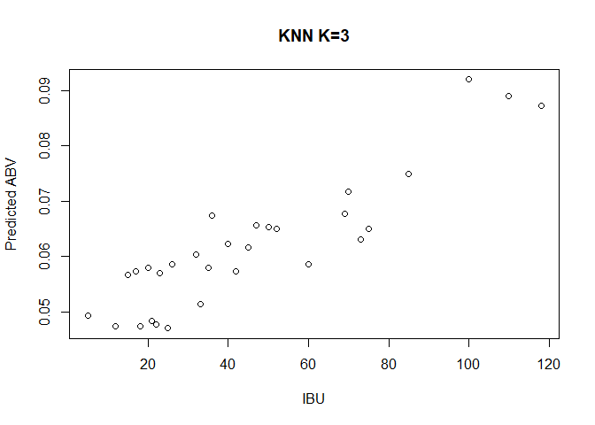
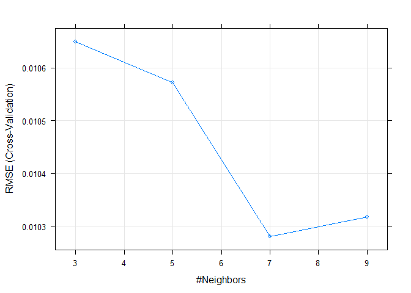

#### MSDS 6306: Doing Data Science

#### Live session Unit 10/11 assignment

#### Monday November 12th at 11:59pm

## Submission

ALL MATERIAL MUST BE KNITTED INTO A SINGLE, LEGIBLE, AND DOCUMENTED HTML DOCUMENT. Use RMarkdown to create this file. Formatting can be basic, but it should be easily human-readable. Unless otherwise stated, please enable {r, echo=TRUE} so your code is visible. 

## Questions

**Background:** Brewmeisters in Colorado and Texas have teamed up to analyze the relationship between ABV and IBU in each of their states.  Use the data sets from the project to help them in their analysis.  There three main questions of interest are 1) Is there a significant linear relationship between ABV (response) and IBU (explanatory), 2) Is this relationship different between beers in Colorado and Texas and 3) Is there a significant quadratic component in this relationship for either Colorado or Texas or both?


```r
#R libraries used in the report
#load libraries
list.of.packages <- c("plyr", "dplyr", "ggplot2", "pastecs", "reshape2", "kableExtra", "sjPlot", "ggpubr", "caTools", "MLmetrics", "caret", "mnormt", "Metrics")
new.packages <- list.of.packages[!(list.of.packages %in% installed.packages()[,"Package"])]
if(length(new.packages)) install.packages(new.packages, repos = "http://cran.us.r-project.org")

library(plyr)
library(sjPlot)
library(dplyr)
library(caret)
library(caTools)
library(ggplot2)
library(pastecs)
library(reshape2)
library(ggpubr)
library(kableExtra)
library(MLmetrics)
library(mnormt)
library(mlr)
library(FNN)
library(magrittr)
library(Metrics)
```

### I. KNN Regression versus Linear Regression
## A. Clean an prepare the data:

    1. Create column for brewery ID that is common to both datasets similar to what you did in the project. So we can merge!


```r
#function to trim white space
trim <- function (x) gsub("^\\s+|\\s+$", "", x)
```


```r
#read in the two datasets
breweries <- read.csv("Data/Breweries.csv")
#States has a leading space, removing it
breweries$State <- trim(breweries$State)
beers <- read.csv("Data/Beers.csv")
```

    2. Merge the beer and brewery data into a single dataframe.


```r
#rename Brew_ID to Brewery_id to merge data
colnames(breweries)[1] <- "Brewery_id"
#both have a "Name" two for different groups
#rename Name to Brewery_Name
colnames(breweries)[2] <- "Brewery_Name"
#rename Name to Beer_Name
colnames(beers)[1] <- "Beer_Name"
#merge both data sets
brew_beer <- merge.data.frame(beers, breweries, by = "Brewery_id")
```

    3. Clean the State Column … get rid of extraneous white space.

    4. Create One Dataset that has only Colorado and Texas beers and no IBU NAs … name it “beerCOTX”


```r
#create beerCOTX with only TX and CO, removing NAs from IBU
beerCOTX <- filter(brew_beer,!is.na(IBU), State == "CO" | State == "TX")
```

    5. Order beerCOTX by IBU (ascending) ... this will be important later in graphing

```r
beerCOTX <- beerCOTX[order(beerCOTX$IBU),]
```

## C. Compare two competing models: External Cross Validation

    8. For this assignment we will concentrate only on the Texas data! Create a training and test set from the data (60%/40% split respectively). Print a summary of each new data frame… there should be two: TrainingTX, TestTX.
    

```r
#create the beerTX data set
beerTX <- filter(beerCOTX, State == "TX")
# Splitting the beerTX dataset into the Training set and Test set
# install.packages('caTools')
set.seed(7) # Set Seed so that same sample can be reproduced in future also
split = sample.split(beerTX$ABV, SplitRatio = .6)
TrainingTX = subset(beerTX, split == TRUE)
TestTX = subset(beerTX, split == FALSE)
#A summary of the TrainingTX data
summary(TrainingTX)
```

```
##    Brewery_id                    Beer_Name     Beer_ID    
##  Min.   : 30.0   1836                 : 1   Min.   :  44  
##  1st Qu.:126.0   18th Anniversary Gose: 1   1st Qu.:1300  
##  Median :129.0   Barn Burner Saison   : 1   Median :2040  
##  Mean   :162.3   Bat Outta Helles     : 1   Mean   :1762  
##  3rd Qu.:215.2   Battle LIne          : 1   3rd Qu.:2216  
##  Max.   :427.0   BLAKKR               : 1   Max.   :2588  
##                  (Other)              :50                 
##       ABV               IBU                                    Style   
##  Min.   :0.04000   Min.   :  5.00   American Blonde Ale           : 7  
##  1st Qu.:0.05075   1st Qu.: 21.00   American IPA                  : 6  
##  Median :0.05550   Median : 32.50   American Double / Imperial IPA: 5  
##  Mean   :0.06075   Mean   : 41.25   American Pale Ale (APA)       : 4  
##  3rd Qu.:0.06925   3rd Qu.: 50.50   Saison / Farmhouse Ale        : 4  
##  Max.   :0.09900   Max.   :118.00   American Amber / Red Ale      : 2  
##                                     (Other)                       :28  
##      Ounces                             Brewery_Name       City   
##  Min.   :12.00   Real Ale Brewing Company     : 7    Blanco  : 7  
##  1st Qu.:12.00   Southern Star Brewing Company: 7    Conroe  : 7  
##  Median :12.00   Karbach Brewing Company      : 5    Dallas  : 7  
##  Mean   :12.86   Deep Ellum Brewing Company   : 4    Houston : 7  
##  3rd Qu.:12.00   Texian Brewing Co.           : 4    Austin  : 6  
##  Max.   :16.00   Cedar Creek Brewery          : 3    Richmond: 4  
##                  (Other)                      :26    (Other) :18  
##     State          
##  Length:56         
##  Class :character  
##  Mode  :character  
##                    
##                    
##                    
## 
```

```r
#A summary of the TestTX data
summary(TestTX)
```

```
##    Brewery_id               Beer_Name     Beer_ID          ABV         
##  Min.   : 30.0   Alteration      : 1   Min.   :  45   Min.   :0.04200  
##  1st Qu.:119.0   Bombshell Blonde: 1   1st Qu.:1011   1st Qu.:0.05000  
##  Median :126.0   Chupahopra      : 1   Median :2042   Median :0.05500  
##  Mean   :155.2   Deep Ellum IPA  : 1   Mean   :1685   Mean   :0.05961  
##  3rd Qu.:185.0   Evil Owl        : 1   3rd Qu.:2212   3rd Qu.:0.06500  
##  Max.   :427.0   Gone A-Rye      : 1   Max.   :2600   Max.   :0.09900  
##                  (Other)         :27                                   
##       IBU                                    Style        Ounces     
##  Min.   :  5.00   American Pale Ale (APA)       : 5   Min.   :12.00  
##  1st Qu.: 20.00   American Double / Imperial IPA: 3   1st Qu.:12.00  
##  Median : 35.00   American IPA                  : 3   Median :12.00  
##  Mean   : 38.94   Witbier                       : 3   Mean   :12.73  
##  3rd Qu.: 45.00   American Amber / Red Ale      : 2   3rd Qu.:12.00  
##  Max.   :110.00   American Blonde Ale           : 2   Max.   :16.00  
##                   (Other)                       :15                  
##                         Brewery_Name               City  
##  Karbach Brewing Company      : 5    Austin          :7  
##  Southern Star Brewing Company: 5    Houston         :6  
##  Freetail Brewing Company     : 4    Conroe          :5  
##  Oasis Texas Brewing Company  : 3    San Antonio     :5  
##  Cedar Creek Brewery          : 2    Dripping Springs:2  
##  Hops & Grain Brewery         : 2    Fort Worth      :2  
##  (Other)                      :12    (Other)         :6  
##     State          
##  Length:33         
##  Class :character  
##  Mode  :character  
##                    
##                    
##                    
## 
```

    9. Using the training data, fit a KNN regression model to predict ABV from IBU.  You should use the knnreg function in the caret package. Fit two separate models: one with k = 3 and one with k = 5. (This is 2 models total.)
    

```r
#fit a KNN regression model to predict ABV from IBU, k = 3
Train3TX.knn<- FNN::knn.reg(TrainingTX$IBU, y=TrainingTX$ABV, k=3)
plot(TrainingTX$IBU, Train3TX.knn$pred, xlab="IBU", ylab="Predicted ABV", main = "KNN K=3")
```

<!-- -->

```r
#print fit a KNN regression model to predict ABV from IBU, k = 3
Train3TX.knn
```

```
## PRESS =  0.006254556 
## R2-Predict =  0.4543463
```

```r
#fit a KNN regression model to predict ABV from IBU, k = 5
Train5TX.knn<- knn.reg(TrainingTX$IBU, y=TrainingTX$ABV, k=5)
plot(TrainingTX$IBU, Train5TX.knn$pred, xlab="IBU", ylab="Predicted ABV", main = "KNN K=5")
```

<!-- -->

```r
#Print fit a KNN regression model to predict ABV from IBU, k = 5
Train5TX.knn
```

```
## PRESS =  0.00576672 
## R2-Predict =  0.4969056
```

    10. Use the ASE loss function and external cross validation to provide evidence as to which model (k = 3 or k = 5) is more appropriate.  Remember your answer should be supported with why you feel a certain model is appropriate.  Your analysis should include the average squared error (ASE) for each model from the test set.  Your analysis should also include a clear discussion, using the ASEs, as to which model you feel is more appropriate.
    

```r
# Fit the model on the training set and test out k at 3, 5 and 7
set.seed(123)
TXmodel <- caret::train(
  ABV ~ IBU, data = TrainingTX, method = "knn",
  trControl = trainControl("cv", number = 10),
  preProcess = c("center","scale"),
  tuneGrid = expand.grid(k = c(3, 5, 7, 9)
  ))
# Plot model error RMSE vs different values of k
plot(TXmodel)
```

<!-- -->

```r
# Best tuning parameter k that minimize the RMSE
TXmodel$bestTune
```

```
##   k
## 3 7
```

```r
# Make predictions on the test data
predictions <- TXmodel %>% predict(TestTX)
head(predictions)
```

```
## [1] 0.05171429 0.05171429 0.05291667 0.05462500 0.05110000 0.05110000
```

```r
# Compute the prediction error RMSE
RMSE(predictions, TestTX$ABV)
```

```
## [1] 0.008617931
```

```r
#Lets add the predictions to the test data
TestTX$ABVPredistions <- predictions
head(TestTX)
```

```
##    Brewery_id                          Beer_Name Beer_ID   ABV IBU
## 1          67                 Yo Soy Un Berliner    2520 0.044   5
## 3          67                            Rye Wit    2522 0.042  10
## 7         126                Weisse Versa (2012)    2374 0.052  16
## 11         39                          Twisted X    2212 0.051  19
## 13        119                   Bombshell Blonde     856 0.050  20
## 15        126 Love Street Summer Seasonal (2014)    1235 0.047  20
##                     Style Ounces                  Brewery_Name
## 1      Berliner Weissbier     12      Freetail Brewing Company
## 3                 Witbier     12      Freetail Brewing Company
## 7              Hefeweizen     12       Karbach Brewing Company
## 11 American Adjunct Lager     12     Twisted X Brewing Company
## 13    American Blonde Ale     16 Southern Star Brewing Company
## 15                Kölsch     12       Karbach Brewing Company
##                City State ABVPredistions
## 1       San Antonio    TX     0.05171429
## 3       San Antonio    TX     0.05171429
## 7           Houston    TX     0.05291667
## 11 Dripping Springs    TX     0.05462500
## 13           Conroe    TX     0.05110000
## 15          Houston    TX     0.05110000
```
    From the graph above you can see the best number for R is 7.
    
ASE=  (∑▒(y ̃_i-y_i )^2 )/n  

Here y ̃_i is the predicted ABV for the ith beer, y_iis the actual ABV of the ith beer and n is the sample size.

    11. Now use the ASE loss function and external cross validation to provide evidence as to which model (the linear regression model from last week or the best KNN regression model from this week (from question 10)) is more appropriate.
    
    Looking at the numbers from last week, the best I could do was an RMSE of 0.009727404 with just the IBU data and 0.009718517 with the IBU squared.
   
    12. Use your best KNN regression model to predict the ABV for an IBU of 150, 170 and 190.  What issue do you see with using KNN to extrapolate?
    
### II. KNN Classification

We would like to be able to use ABV and IBU to classify beers between 2 styles: American IPA and American Pale Ale.
   
    13. Filter the beerCOTX dataframe for only beers that are from Texas and are American IPA and American Pale Ale.
    

```r
#create beerTX_AIPA_APA with only TX American IPA and American Pale Ale (APA), removing NAs from IBU
beerTX_AIPA_APA <- filter(beerTX, Style == "American IPA" | Style == "American Pale Ale (APA)")
head(beerTX_AIPA_APA)
```

```
##   Brewery_id                      Beer_Name Beer_ID   ABV IBU
## 1        185                      Slow Ride    2069 0.048  35
## 2        214          Lakefire Rye Pale Ale    2126 0.055  35
## 3         30 Elliott's Phoned Home Pale Ale    1182 0.051  36
## 4        126       Weekend Warrior Pale Ale    1557 0.055  40
## 5        258           Texas Pale Ale (TPA)    1971 0.055  40
## 6        141                  Power & Light    2301 0.055  42
##                     Style Ounces                 Brewery_Name
## 1 American Pale Ale (APA)     12  Oasis Texas Brewing Company
## 2 American Pale Ale (APA)     12      Grapevine Craft Brewery
## 3 American Pale Ale (APA)     16          Cedar Creek Brewery
## 4 American Pale Ale (APA)     12      Karbach Brewing Company
## 5            American IPA     16         South Austin Brewery
## 6 American Pale Ale (APA)     12 Independence Brewing Company
##             City State
## 1         Austin    TX
## 2 Farmers Branch    TX
## 3   Seven Points    TX
## 4        Houston    TX
## 5   South Austin    TX
## 6         Austin    TX
```
    
   
    14. Divide this filtered data set into a training and test set (60/40, training / test split).
    

```r
set.seed(7) # Set Seed so that same sample can be reproduced in future also
split = sample.split(beerTX_AIPA_APA$ABV, SplitRatio = .6)
TrainingTXIPA = subset(beerTX_AIPA_APA, split == TRUE)
TestTXIPA = subset(beerTX_AIPA_APA, split == FALSE)
#A summary of the TrainingTX data
summary(TrainingTXIPA)
```

```
##    Brewery_id                             Beer_Name    Beer_ID    
##  Min.   : 30.0   Chupahopra                    :1   Min.   : 463  
##  1st Qu.: 59.0   Dankosaurus                   :1   1st Qu.:1276  
##  Median :126.0   El Chingon IPA                :1   Median :1922  
##  Mean   :165.5   Elliott's Phoned Home Pale Ale:1   Mean   :1648  
##  3rd Qu.:254.2   Hopadillo India Pale Ale      :1   3rd Qu.:2048  
##  Max.   :396.0   Infamous IPA                  :1   Max.   :2458  
##                  (Other)                       :4                 
##       ABV               IBU                            Style  
##  Min.   :0.05100   Min.   :36.00   American IPA           :6  
##  1st Qu.:0.05625   1st Qu.:41.25   American Pale Ale (APA):4  
##  Median :0.06550   Median :56.50                          :0  
##  Mean   :0.06410   Mean   :56.20   Abbey Single Ale       :0  
##  3rd Qu.:0.06950   3rd Qu.:70.00   Altbier                :0  
##  Max.   :0.07600   Max.   :75.00   American Adjunct Lager :0  
##                                    (Other)                :0  
##      Ounces                           Brewery_Name               City  
##  Min.   :12.0   Cedar Creek Brewery         :2     Austin          :2  
##  1st Qu.:12.0   Karbach Brewing Company     :2     Houston         :2  
##  Median :12.0   Four Corners Brewing Company:1     Seven Points    :2  
##  Mean   :13.2   Hops & Grain Brewery        :1     Conroe          :1  
##  3rd Qu.:15.0   Infamous Brewing Company    :1     Dallas          :1  
##  Max.   :16.0   South Austin Brewery        :1     Dripping Springs:1  
##                 (Other)                     :2     (Other)         :1  
##     State          
##  Length:10         
##  Class :character  
##  Mode  :character  
##                    
##                    
##                    
## 
```

```r
#A summary of the TestTX data
summary(TestTXIPA)
```

```
##    Brewery_id                      Beer_Name    Beer_ID    
##  Min.   : 67.0   Deep Ellum IPA         :1   Min.   :  45  
##  1st Qu.:125.0   Lakefire Rye Pale Ale  :1   1st Qu.:1788  
##  Median :134.5   Pine Belt Pale Ale     :1   Median :2178  
##  Mean   :144.8   Power & Light          :1   Mean   :1826  
##  3rd Qu.:179.0   Pride of Texas Pale Ale:1   3rd Qu.:2319  
##  Max.   :214.0   Slow Ride              :1   Max.   :2521  
##                  (Other)                :2                 
##       ABV               IBU                            Style  
##  Min.   :0.04800   Min.   :35.00   American Pale Ale (APA):5  
##  1st Qu.:0.05500   1st Qu.:40.25   American IPA           :3  
##  Median :0.05850   Median :52.50                          :0  
##  Mean   :0.05875   Mean   :54.00   Abbey Single Ale       :0  
##  3rd Qu.:0.06125   3rd Qu.:70.00   Altbier                :0  
##  Max.   :0.07000   Max.   :75.00   American Adjunct Lager :0  
##                                    (Other)                :0  
##      Ounces                         Brewery_Name             City  
##  Min.   :12   Deep Ellum Brewing Company  :1     Austin        :3  
##  1st Qu.:12   Freetail Brewing Company    :1     Conroe        :1  
##  Median :12   Grapevine Craft Brewery     :1     Dallas        :1  
##  Mean   :13   Independence Brewing Company:1     Farmers Branch:1  
##  3rd Qu.:13   Oasis Texas Brewing Company :1     Fort Worth    :1  
##  Max.   :16   Rahr & Sons Brewing Company :1     San Antonio   :1  
##               (Other)                     :2     (Other)       :0  
##     State          
##  Length:8          
##  Class :character  
##  Mode  :character  
##                    
##                    
##                    
## 
```

    15. Use the class packages knn function to build an KNN classifier with k = 3 that will use ABV and IBU as features (explanatory variables) to classify Texas beers as American IPA or American Pale Ale using the Training data.  Use your test set to create a confusion table to estimate the accuracy, sensitivity and specificity of the model.
    

```r
# Classification using Kmeans clustering and KNN
resultsTXIPA3 = class::knn(TrainingTXIPA[,c(4:5)],TestTXIPA[,c(4:5)],TrainingTXIPA[,6], k = 3)
TestTXIPA$StylePred = resultsTXIPA3
TestTXIPAtable <- table(TestTXIPA$Style,TestTXIPA$StylePred) # function confusion Matrix only for binary classfication.

#Get the confusion matrix to see accuracy value and other parameter values
#confusionMatrix(resultsTXIPA3, TestTXIPA$Style)
```
    
   
    16. Using the same process as in the last question, find the accuracy, sensitivity and specificity of a KNN model with k = 5.  Which is better?  Why?
    

```r
resultsTXIPA5 = class::knn(TrainingTXIPA[,c(4:5)],TestTXIPA[,c(4:5)],TrainingTXIPA[,6], k = 5)
TestTXIPA$StylePred5 = resultsTXIPA5
```
    
    
    BONUS (5 pts total): We did not have a lot data to build and test this classifier.  Check out the class package’s knn.cv function that will perform leave-one-out cross validation.  What is leave-one-out CV (2pts)?  Get the accuracy metric for from this function for both the k = 3 and k = 5 KNN classifiers (2pts).  Which model is suggested by the leave-one-out CV method (1pt)?

Reminder 
To complete this assignment, please submit one RMarkdown and matching HTML file by the deadline. Please submit all files at the same time; only one submission is granted. 
Good luck!
