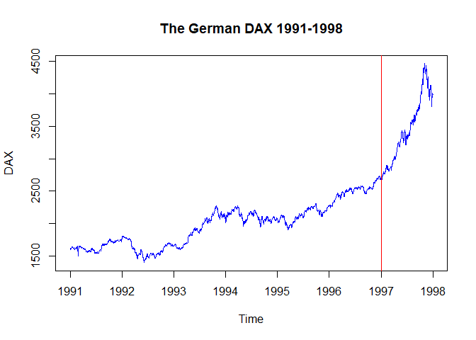
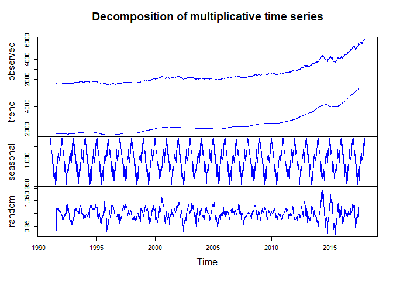
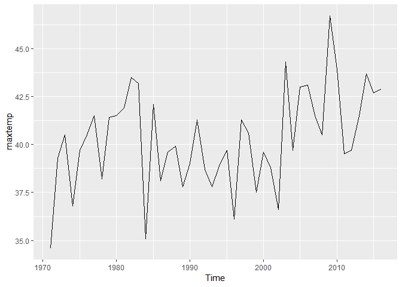
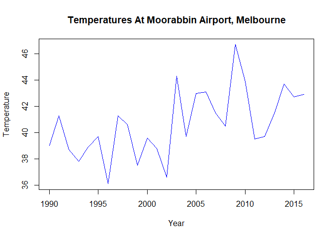
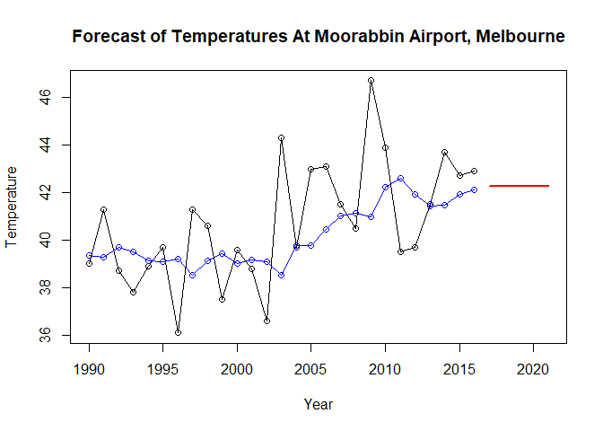

MSDS 6306: Doing Data Science – Time Series
Live session Unit 12 assignment
Due: Monday, November 26th at 11:59pm

#### Submission

ALL MATERIAL MUST BE KNITTED INTO A SINGLE, LEGIBLE, AND DOCUMENTED HTML DOCUMENT. Use RMarkdown to create this file. Formatting can be basic, but it should be easily human-readable. Unless otherwise stated, please enable {r, echo=TRUE} so your code is visible.

#### Questions

#### 1. Warm Up: Brief Financial Data (20%)

    a. Natively in R, you have access to sample data sets of prominent stocks over time.  We’ll be using EuStockMarkets for this question. Type help(EuStockMarkets) to learn more.  From these data, pull specifically the DAX index. For all questions in this assignment, you’re welcome to normalize (or don’t!) how you see fit, but, if you choose to, please document what you’re doing and why for the grader. It’s not necessary for the purpose of this assignment.


```r
#look at the top of EuStockMarkets
head(EuStockMarkets)
```

```
## Time Series:
## Start = c(1991, 130) 
## End = c(1991, 135) 
## Frequency = 260 
##              DAX    SMI    CAC   FTSE
## 1991.496 1628.75 1678.1 1772.8 2443.6
## 1991.500 1613.63 1688.5 1750.5 2460.2
## 1991.504 1606.51 1678.6 1718.0 2448.2
## 1991.508 1621.04 1684.1 1708.1 2470.4
## 1991.512 1618.16 1686.6 1723.1 2484.7
## 1991.515 1610.61 1671.6 1714.3 2466.8
```

```r
#set up EuStockMarkets as a data frame
EuStock <- data.frame(EuStockMarkets)
#pull out just the DAX information
DAX <- EuStock$DAX
#Look at stock data
head(DAX)
```

```
## [1] 1628.75 1613.63 1606.51 1621.04 1618.16 1610.61
```

    b. These are annual European Stock Data from 1990 onward. Create a rudimentary plot of the data.  Make the line blue. Give an informative title. Label the axes accurately. In 1997, an event happened you want to indicate; add a vertical red line to your plot which divides pre-1997 and post-1997 information.


```r
#232 is from 1860obs/8years=232
DaxStocks<-ts(DAX, frequency=232, start=c(1991,1), end=c(1998,1))
#blue line, an informative title and axes labeled accurately
plot(DaxStocks, col="blue", main = "The German DAX 1991-1998", ylab = "DAX")
#vertical red line which divides pre-1997 and post-1997
abline(v=1997, col="red")
```

<!-- -->
    
    c. Decompose the time series into its components (i.e., trend, seasonality, random). Keep in mind that this is a multiplicative model you want. Create a plot of all decomposed components. As before, make all lines blue and have a vertical divider at the year 1997.
    

```r
#Decompose the time series into its components
DaxComp <- decompose(DaxStocks, type="mult")
#all lines blue
plot(DaxComp, col = "blue")
#a vertical divider at the year 1997
abline(v=1997, col="red")
```

<!-- -->

#### 2. Temperature Data (40%)
      
    a. Using the maxtemp dataset granted by loading fpp2, there are maximum annual temperature data in Celsius. For more information, use help(maxtemp). To see what you’re looking at, execute the command in ‘Examples’ in the help document.


```r
#help(maxtemp)
data("maxtemp")
autoplot(maxtemp)
```

<!-- -->

        b.	We are only concerned with information after 1990. Please eliminate unwanted information or subset information we don’t care about.


```r
#We are only concerned with information after 1990
maxtemp1990 <- window(maxtemp, start=1990, end=2016)
head(maxtemp1990)
```

```
## Time Series:
## Start = 1990 
## End = 1995 
## Frequency = 1 
## [1] 39.0 41.3 38.7 37.8 38.9 39.7
```

```r
#blue line, an informative title and axes labeled accurately
plot(maxtemp1990, col="blue", main="Temperatures At Moorabbin Airport, Melbourne" , xlab="Year" ,ylab="Temperature")
```

<!-- -->
        
        c. Utilize SES to predict the next five years of maximum temperatures in Melbourne. Plot this information, including the prior information and the forecast. Add the predicted value line across 1990-present as a separate line, preferably blue.  So, to review, you should have your fit, the predicted value line overlaying it, and a forecast through 2021, all on one axis. Find the AICc and BIC of this fitted model.  You will use that information later.
        

```r
#ses to predict the next five years
predictMA <- ses(maxtemp1990, h=5)
#Plot prior information and the forecast
plot(predictMA, PI = FALSE, ylab="Temperature", xlab="Year", main="Forecast of Temperatures At Moorabbin Airport, Melbourne", fcol="red", type="o")
lines(fitted(predictMA), col="blue",type="o")
```

<!-- -->

```r
#the AICc and BIC of this fitted model
predictMA$model
```

```
## Simple exponential smoothing 
## 
## Call:
##  ses(y = maxtemp1990, h = 5) 
## 
##   Smoothing parameters:
##     alpha = 0.2164 
## 
##   Initial states:
##     l = 39.345 
## 
##   sigma:  2.4135
## 
##      AIC     AICc      BIC 
## 140.4868 141.5302 144.3743
```

        d.	Now use a damped Holt’s linear trend to also predict out five years.  Make sure initial=“optimal.”  As above, create a similar plot to 1C, but use the Holt fit instead.
        e.	Compare the AICc and BIC of the ses() and holt() models.  Which model is better here?
        f. Calculate and compare the ASE from the ses() and holt() models.  Which one performs better with respect to this metric?
#### 3. The Wands Choose the Wizard (40%)
        a. Utilize the dygraphs library. Read in both Unit12TimeSeries_Ollivander and _Gregorovitch.csv as two different data frames. They do not have headers, so make sure you account for that. This is a time series of Wands sold over years.
        b. You don’t have your information in the proper format!  In both data sets, you’ll need to first convert the date-like variable to an actual Date class.
        c. Use the library xts (and the xts() function in it) to make each data frame an xts object (effectively, a time series). You’ll want to order.by the Date variable.
        d. Bind the two xts objects together and create a dygraph from it. Utilize the help() index if you’re stuck.
        • Give an effective title and x/y axes.
        •	Label each Series (via dySeries) to be the appropriate wand-maker.  So, one line should create a label for Ollivander and the other for Gregorovitch.
        •	Stack this graph and modify the two lines to be different colors (and not the default ones!)  Any colors are fine, but make sure they’re visible and that Ollivander is a different color than Gregorovitch.
        •	Activate a range selector and make it big enough to view.
        •	Use dyShading to illuminate approximately when Voldemort was revived and at-large: between 1995 to 1999.
        •	Enable Highlighting on the graph, so mousing over a line bolds it.

####Reminder

    To complete this assignment, please submit one RMarkdown and matching HTML file at least one hour before your live session.  Please submit all files at the same time; only one submission is granted. 

Good luck!
