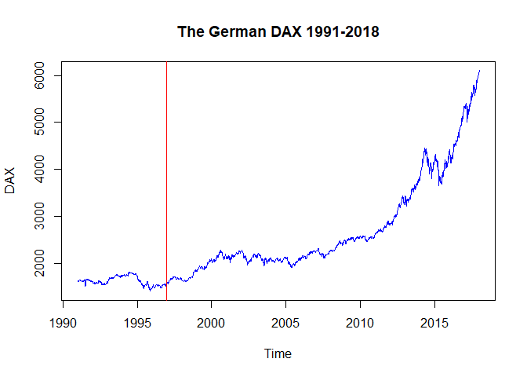
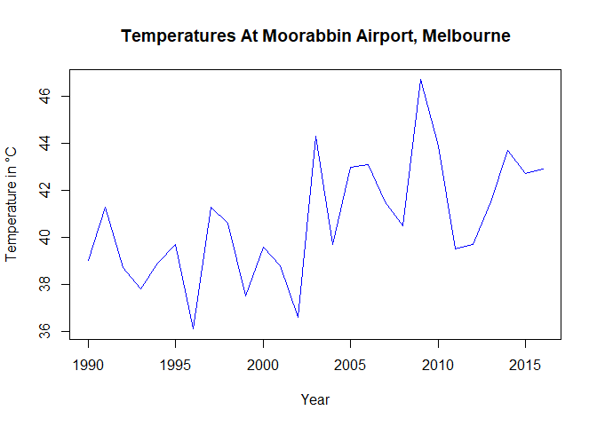
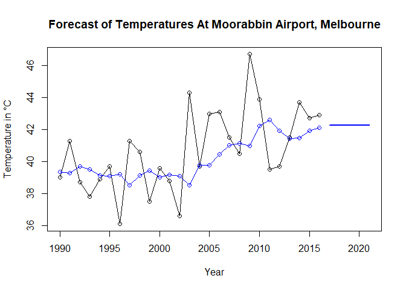

MSDS 6306: Doing Data Science – Time Series
Live session Unit 12 assignment
Due: Monday, November 26th at 11:59pm

#### Submission

ALL MATERIAL MUST BE KNITTED INTO A SINGLE, LEGIBLE, AND DOCUMENTED HTML DOCUMENT.
Use RMarkdown to create this file. Formatting can be basic, but it should be easily human-readable.
Unless otherwise stated, please enable {r, echo=TRUE} so your code is visible.

#### Questions

#### 1. Warm Up: Brief Financial Data (20%)

    a. Natively in R, you have access to sample data sets of prominent stocks over time.
    We’ll be using EuStockMarkets for this question. Type help(EuStockMarkets) to learn more.
    From these data, pull specifically the DAX index. For all questions in this assignment,
    you’re welcome to normalize (or don’t!) how you see fit, but, if you choose to,
    please document what you’re doing and why for the grader.
    It’s not necessary for the purpose of this assignment.


```r
#help(EuStockMarkets)
#look at the top of EuStockMarkets
head(EuStockMarkets)
```

```
## Time Series:
## Start = c(1991, 130) 
## End = c(1991, 135) 
## Frequency = 260 
##              DAX    SMI    CAC   FTSE
## 1991.496 1628.75 1678.1 1772.8 2443.6
## 1991.500 1613.63 1688.5 1750.5 2460.2
## 1991.504 1606.51 1678.6 1718.0 2448.2
## 1991.508 1621.04 1684.1 1708.1 2470.4
## 1991.512 1618.16 1686.6 1723.1 2484.7
## 1991.515 1610.61 1671.6 1714.3 2466.8
```

```r
#set up EuStockMarkets as a data frame
EuStock <- data.frame(EuStockMarkets)
#pull specifically the DAX index
DAX <- EuStock$DAX
#Look at stock data
head(DAX)
```

```
## [1] 1628.75 1613.63 1606.51 1621.04 1618.16 1610.61
```

    b. These are annual European Stock Data from 1990 onward. Create a rudimentary
    plot of the data. Make the line blue. Give an informative title.
    Label the axes accurately. In 1997, an event happened you want to indicate;
    add a vertical red line to your plot which divides pre-1997 and post-1997 information.


```r
#232 is from 1860obs/8years=232
DaxStocks<-ts(DAX, frequency=232, start=c(1991,1), end=c(1998,1))
#a rudimentary plot with a blue line, an informative title and axes labeled accurately
plot(DaxStocks, col="blue", main = "The German DAX 1991-1998", ylab = "DAX")
#vertical red line which divides pre-1997 and post-1997
abline(v=1997, col="red")
```

<!-- -->
    
    c. Decompose the time series into its components (i.e., trend, seasonality, random).
    Keep in mind that this is a multiplicative model you want.
    Create a plot of all decomposed components. As before, make all lines blue
    and have a vertical divider at the year 1997.
    

```r
#Decompose the time series into its components
DaxComp <- decompose(DaxStocks, type="mult")
#a plot of all decomposed components and all lines blue
plot(DaxComp, col = "blue")
#a vertical divider at the year 1997
abline(v=1997, col="red")
```

<!-- -->

#### 2. Temperature Data (40%)
      
    a. Using the maxtemp dataset granted by loading fpp2, there are maximum annual temperature
    data in Celsius. For more information, use help(maxtemp).
    To see what you’re looking at, execute the command in ‘Examples’ in the help document.


```r
#use help
#help(maxtemp)
#load the maxtemp data
data("maxtemp")
#the command in ‘Examples’ in the help document
autoplot(maxtemp)
```

<!-- -->

        b.	We are only concerned with information after 1990. Please eliminate unwanted
        information or subset information we don’t care about.


```r
#We are only concerned with information after 1990
maxtemp1990 <- window(maxtemp, start=1990, end=2016)
head(maxtemp1990)
```

```
## Time Series:
## Start = 1990 
## End = 1995 
## Frequency = 1 
## [1] 39.0 41.3 38.7 37.8 38.9 39.7
```

```r
#blue line, an informative title and axes labeled accurately
plot(maxtemp1990, col="blue", main="Temperatures At Moorabbin Airport, Melbourne" , xlab="Year" ,ylab="Temperature in °C")
```

<!-- -->
        
        c. Utilize SES to predict the next five years of maximum temperatures in Melbourne.
        Plot this information, including the prior information and the forecast.
        Add the predicted value line across 1990-present as a separate line, preferably blue.
        So, to review, you should have your fit, the predicted value line overlaying it,
        and a forecast through 2021, all on one axis. Find the AICc and BIC of this fitted model.
        You will use that information later.


```r
#Simple Exponential Smoothing to predict the next five years
maxtemp1990.ses <- ses(maxtemp1990, h=5, initial="optimal")
#Plot prior information and the forecast
plot(maxtemp1990.ses, PI = FALSE, ylab="Temperature in °C", xlab="Year", main="Forecast of Temperatures At Moorabbin Airport, Melbourne", fcol="blue", type="o")
#Add the predicted value line across 1990-present
lines(fitted(maxtemp1990.ses), col="blue",type="o")
```

<!-- -->

```r
#the AICc and BIC of this fitted model is below
```

        d. Now use a damped Holt’s linear trend to also predict out five years.
        Make sure initial=“optimal.” As above, create a similar plot to 1C,
        but use the Holt fit instead.


```r
#damped Holt to predict out five years with initial set to optimal
maxtemp1990.holt <- holt(maxtemp1990, initial="optimal", h=5, damped=TRUE)
plot(maxtemp1990.holt, ylab="Temperature in °C", xlab= "Year", main="Forecast with Holt Fit")
lines(fitted(maxtemp1990.holt), col="blue", type="o")
```

<!-- -->

        e. Compare the AICc and BIC of the ses() and holt() models. Which model is better here?
        
| Models|    AICc   |   BIC    |
|:-----:|:---------:|:--------:|
| ses() |  141.5302 | 144.3743 |
|holt() |  145.5865 | 149.1615 |

  **From the numbers above we can see that the Simple exponential smoothing has the better fit.**
        

```r
#Compare the AICc and BIC of the "Simple exponential smoothing"
maxtemp1990.ses$model
```

```
## Simple exponential smoothing 
## 
## Call:
##  ses(y = maxtemp1990, h = 5, initial = "optimal") 
## 
##   Smoothing parameters:
##     alpha = 0.2164 
## 
##   Initial states:
##     l = 39.345 
## 
##   sigma:  2.4135
## 
##      AIC     AICc      BIC 
## 140.4868 141.5302 144.3743
```

```r
#and "Damped Holt's method"
maxtemp1990.holt$model
```

```
## Damped Holt's method 
## 
## Call:
##  holt(y = maxtemp1990, h = 5, damped = TRUE, initial = "optimal") 
## 
##   Smoothing parameters:
##     alpha = 1e-04 
##     beta  = 1e-04 
##     phi   = 0.98 
## 
##   Initial states:
##     l = 38.8993 
##     b = 0.1678 
## 
##   sigma:  2.3409
## 
##      AIC     AICc      BIC 
## 141.3865 145.5865 149.1615
```

        f. Calculate and compare the ASE from the ses() and holt() models.
        Which one performs better with respect to this metric?
        

```r
#SSE of maxtemp1990 using the ses method
maxtemp1990.ses.SSE <- sum(residuals(maxtemp1990.ses)^2)
#the number of samples in the maxtemp1990 data (n)
maxtemp1990.ses.n <- length(maxtemp1990.ses$residuals)
#the average squared error (ASE) for the SES method (SSE/n)
maxtemp1990.ses.ASE <- maxtemp1990.ses.SSE / maxtemp1990.ses.n
maxtemp1990.ses.ASE
```

```
## [1] 5.393285
```


```r
#SSE of maxtemp1990 using the holt method
maxtemp1990.holt.SSE <- sum(residuals(maxtemp1990.holt)^2)
# the number of samples in the maxtemp1990 data (n)
maxtemp1990.holt.n <- length(maxtemp1990.holt$residuals)
#the average squared error (ASE)  for the SES method (SSE/n)
maxtemp1990.holt.ASE <- maxtemp1990.holt.SSE / maxtemp1990.holt.n
maxtemp1990.holt.ASE
```

```
## [1] 4.464942
```

**The Holt method has an the average squared error (ASE) of 4.464942 and the ses is 5.393285, just looking at the ASE, Holt has the better fit.**

#### 3. The Wands Choose the Wizard (40%)

        a. Utilize the dygraphs library. Read in both Unit12TimeSeries_Ollivander
        and _Gregorovitch.csv as two different data frames.
        They do not have headers, so make sure you account for that.
        This is a time series of Wands sold over years.
        

```r
#install.packages("dygraphs")
library(dygraphs)
# read in both Unit12TimeSeries_Ollivander and _Gregorovitch.csv as two different data frames
Gregorovitch <- read.csv("Unit12TimeSeries_Gregorovitch.csv", header = FALSE)
Ollivander <- read.csv("Unit12TimeSeries_Ollivander.csv", header = FALSE)
```

        b. You don’t have your information in the proper format!
        In both data sets, you’ll need to first convert the date-like variable
        to an actual Date class.
        

```r
#add titles to the Ollivander data
names(Ollivander)<-c("Date", "OllivanderWands")
#convert the date variable to an actual Date class
Ollivander$Date <- as.Date(Ollivander$Date, "%m/%d/%Y")
#add titles to the Gregorovitch data
names(Gregorovitch)<-c("Date", "GregorovitchWands")
#convert the date variable to an actual Date class
Gregorovitch$Date <- as.Date(Gregorovitch$Date, "%m/%d/%Y")
```

        c. Use the library xts (and the xts() function in it) to make each data frame
        an xts object (effectively, a time series).
        You’ll want to order.by the Date variable.
        

```r
#install.packages("xts")
library(xts)
#make each data frame an extensible time-series object (xts) ordred by the Date variable
Ollivander.xts <- xts(Ollivander[,-1], order.by = Ollivander$Date)
Gregorovitch.xts <- xts(Gregorovitch[,-1], order.by = Gregorovitch$Date)
```

        d. Bind the two xts objects together and create a dygraph from it.
        Utilize the help() index if you’re stuck.
        • Give an effective title and x/y axes.
        •	Label each Series (via dySeries) to be the appropriate wand-maker.
        So, one line should create a label for Ollivander and the other for Gregorovitch.
        •	Stack this graph and modify the two lines to be different colors (and not the default ones!)
        Any colors are fine, but make sure they’re visible and that
        Ollivander is a different color than Gregorovitch.
        •	Activate a range selector and make it big enough to view.
        •	Use dyShading to illuminate approximately when Voldemort was revived and at-large:
        between 1995 to 1999.
        •	Enable Highlighting on the graph, so mousing over a line bolds it.
        

```r
#help(xts)
#help(dygraph)
#bind the two xts objects together
Olli_Greg <- merge(Ollivander.xts,Gregorovitch.xts,all=TRUE)
#create a dygraph from it, title and lable x/y axes
dygraph(Olli_Greg, main = "Wands Sales By Year", xlab = "Year", ylab = "Total Wands Sold") %>%
  #Label each Series (via dySeries) to be the appropriate wand-maker
  dySeries("Ollivander.xts", label = "Ollivander") %>%
  dySeries("Gregorovitch.xts", label = "Gregorovitch") %>%
  #stack the graph and modify the two lines to be different colors
  dyOptions(colors = RColorBrewer::brewer.pal(3, "Set1")) %>%
  #Use dyShading to illuminate approximately when Voldemort was revived
  dyShading(from = "1995-1-1", to = "1999-1-1", color = "#CCEBD6") %>%
  #Enable Highlighting on the graph
  dyHighlight(highlightSeriesOpts = list(strokeWidth = 3)) %>%
  dyRangeSelector(height = 100)
```

<!--html_preserve--><div id="htmlwidget-f2721cfc19fb104ab5f1" style="width:672px;height:480px;" class="dygraphs html-widget"></div>
<script type="application/json" data-for="htmlwidget-f2721cfc19fb104ab5f1">{"x":{"attrs":{"title":"Wands Sales By Year","xlabel":"Year","ylabel":"Total Wands Sold","labels":["year","Ollivander","Gregorovitch"],"legend":"auto","retainDateWindow":false,"axes":{"x":{"pixelsPerLabel":60,"drawAxis":true},"y":{"drawAxis":true}},"series":{"Ollivander":{"axis":"y"},"Gregorovitch":{"axis":"y"}},"stackedGraph":false,"fillGraph":false,"fillAlpha":0.15,"stepPlot":false,"drawPoints":false,"pointSize":1,"drawGapEdgePoints":false,"connectSeparatedPoints":false,"strokeWidth":1,"strokeBorderColor":"white","colors":["#E41A1C","#377EB8","#4DAF4A"],"colorValue":0.5,"colorSaturation":1,"includeZero":false,"drawAxesAtZero":false,"logscale":false,"axisTickSize":3,"axisLineColor":"black","axisLineWidth":0.3,"axisLabelColor":"black","axisLabelFontSize":14,"axisLabelWidth":60,"drawGrid":true,"gridLineWidth":0.3,"rightGap":5,"digitsAfterDecimal":2,"labelsKMB":false,"labelsKMG2":false,"labelsUTC":false,"maxNumberWidth":6,"animatedZooms":false,"mobileDisableYTouch":true,"disableZoom":false,"highlightCircleSize":3,"highlightSeriesBackgroundAlpha":0.5,"highlightSeriesOpts":{"strokeWidth":3},"hideOverlayOnMouseOut":true,"showRangeSelector":true,"rangeSelectorHeight":100,"rangeSelectorPlotFillColor":" #A7B1C4","rangeSelectorPlotStrokeColor":"#808FAB","interactionModel":"Dygraph.Interaction.defaultModel"},"scale":"yearly","annotations":[],"shadings":[{"from":"1995-01-01T00:00:00.000Z","to":"1999-01-01T00:00:00.000Z","color":"#CCEBD6","axis":"x"}],"events":[],"format":"date","data":[["1970-01-01T00:00:00.000Z","1971-01-01T00:00:00.000Z","1972-01-01T00:00:00.000Z","1973-01-01T00:00:00.000Z","1974-01-01T00:00:00.000Z","1975-01-01T00:00:00.000Z","1976-01-01T00:00:00.000Z","1977-01-01T00:00:00.000Z","1978-01-01T00:00:00.000Z","1979-01-01T00:00:00.000Z","1980-01-01T00:00:00.000Z","1981-01-01T00:00:00.000Z","1982-01-01T00:00:00.000Z","1983-01-01T00:00:00.000Z","1984-01-01T00:00:00.000Z","1985-01-01T00:00:00.000Z","1986-01-01T00:00:00.000Z","1987-01-01T00:00:00.000Z","1988-01-01T00:00:00.000Z","1989-01-01T00:00:00.000Z","1990-01-01T00:00:00.000Z","1991-01-01T00:00:00.000Z","1992-01-01T00:00:00.000Z","1993-01-01T00:00:00.000Z","1994-01-01T00:00:00.000Z","1995-01-01T00:00:00.000Z","1996-01-01T00:00:00.000Z","1997-01-01T00:00:00.000Z","1998-01-01T00:00:00.000Z","1999-01-01T00:00:00.000Z","2000-01-01T00:00:00.000Z","2001-01-01T00:00:00.000Z","2002-01-01T00:00:00.000Z","2003-01-01T00:00:00.000Z","2004-01-01T00:00:00.000Z","2005-01-01T00:00:00.000Z","2006-01-01T00:00:00.000Z","2007-01-01T00:00:00.000Z","2008-01-01T00:00:00.000Z","2009-01-01T00:00:00.000Z","2010-01-01T00:00:00.000Z","2011-01-01T00:00:00.000Z","2012-01-01T00:00:00.000Z","2013-01-01T00:00:00.000Z","2014-01-01T00:00:00.000Z","2015-01-01T00:00:00.000Z","2016-01-01T00:00:00.000Z","2017-01-01T00:00:00.000Z"],[1345,1304,1168,1252,1296,1458,1443,1282,1450,1338,1063,1230,1237,1291,1211,1442,1649,1629,1260,1283,1617,1284,1399,1272,1297,1666,1797,1620,450,200,1308,1277,1444,1070,1031,1405,1487,1229,1493,1317,1520,1337,1547,1632,1336,1289,1439,1226],[1268,1295,1349,1298,1493,1432,1431,1291,1247,1403,1188,1555,1512,1552,1023,1190,1197,1120,1119,1319,1692,1452,1494,1346,1519,1580,1623,1863,0,845,858,814,869,864,942,837,838,671,425,634,618,404,758,410,510,103,49,70]],"fixedtz":false,"tzone":"UTC"},"evals":["attrs.interactionModel"],"jsHooks":[]}</script><!--/html_preserve-->

####Reminder

    To complete this assignment, please submit one RMarkdown and matching HTML file
    at least one hour before your live session. Please submit all files at the same time;
    only one submission is granted.

Good luck!
