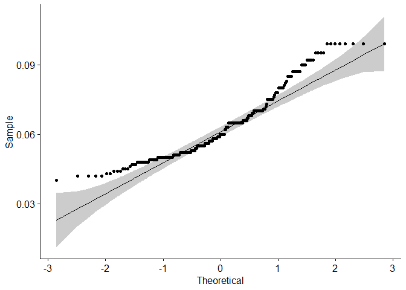

####MSDS 6306: Doing Data Science

####Live session Unit 9 assignment

####Due: Monday October 29th at 11:59pm

##Submission

ALL MATERIAL MUST BE KNITTED INTO A SINGLE, LEGIBLE, AND DOCUMENTED HTML DOCUMENT. Use RMarkdown to create this file. Formatting can be basic, but it should be easily human-readable. Unless otherwise stated, please enable {r, echo=TRUE} so your code is visible. 

##Questions

**Background:** Brewmeisters in Colorado and Texas have teamed up to analyze the relationship between ABV and IBU in each of their states.  Use the data sets from the project to help them in their analysis.  There three main questions of interest are 1) Is there a significant linear relationship between ABV (response) and IBU (explanatory), 2) Is this relationship different between beers in Colorado and Texas and 3) Is there a significant quadratic component in this relationship for either Colorado or Texas or both?  


```r
#R libraries used in the report
#load libraries
list.of.packages <- c("plyr", "dplyr", "ggplot2", "pastecs", "reshape2", "kableExtra", "sjPlot", "ggpubr", "caTools", "MLmetrics", "caret", "mnormt")
new.packages <- list.of.packages[!(list.of.packages %in% installed.packages()[,"Package"])]
if(length(new.packages)) install.packages(new.packages, repos = "http://cran.us.r-project.org")

library(plyr)
library(sjPlot)
library(dplyr)
library(caret)
library(caTools)
library(ggplot2)
library(pastecs)
library(reshape2)
library(ggpubr)
library(kableExtra)
library(MLmetrics)
library(mnormt)
```

##A. Clean an prepare the data:

1. Create column for brewery ID that is common to both datasets similar to what you did in the project. So we can merge!


```r
#function to trim white space
trim <- function (x) gsub("^\\s+|\\s+$", "", x)
```


```r
#read in the two datasets
breweries <- read.csv("Data/Breweries.csv")
#States has a leading space, removing it
breweries$State <- trim(breweries$State)
beers <- read.csv("Data/Beers.csv")
```

2. Merge the beer and brewery data into a single dataframe.


```r
#rename Brew_ID to Brewery_id to merge data
colnames(breweries)[1] <- "Brewery_id"
#both have a "Name" two for different groups
#rename Name to Brewery_Name
colnames(breweries)[2] <- "Brewery_Name"
#rename Name to Beer_Name
colnames(beers)[1] <- "Beer_Name"
#merge both data sets
brew_beer <- merge.data.frame(beers, breweries, by = "Brewery_id")
```

3. Clean the State Column … get rid of extraneous white space.

4. Create One Dataset that has only Colorado and Texas beers and no IBU NAs … name it “beerCOTX”


```r
#create beerCOTX with only TX and CO, removing NAs from IBU
beerCOTX <- filter(brew_beer,!is.na(IBU), State == "CO" | State == "TX")
```

5. Order beerCOTX by IBU (ascending) ... this will be important later in graphing

```r
beerCOTX <- beerCOTX[order(beerCOTX$IBU),]
```

##B. Create an initial plots of the data

6. Plot ABV v. IBU for both Colorado and Texas (two separate plots) … use ggplot and facets.

```r
#ggplot to check for correlation between IBU and ABV in Colorado
beerCO <- filter(beerCOTX, State == "CO")
ggplot(beerCO, aes(x = IBU, y = ABV)) + geom_point(na.rm=TRUE) + geom_smooth(method=lm,se=FALSE, na.rm=TRUE) + ggtitle("ABV V. IBU for Colorado")
```

<!-- -->

```r
#ggplot to check for correlation between IBU and ABV in Texas
beerTX <- filter(beerCOTX, State == "TX")
ggplot(beerTX, aes(x = IBU, y = ABV)) + geom_point(na.rm=TRUE) + geom_smooth(method=lm,se=FALSE, na.rm=TRUE) + ggtitle("ABV V. IBU for Texas")
```

<!-- -->


##C. Model the data

7. For each state, fit a simple linear regression model (Model 1:  ABV= β_0+β_1 IBU) to assess the relationship between ABV and IBU. Use the regular plot function in base R (not ggplot) to create a scatter plot with the regression line superimposed on the plot.  Again, this should be done for each state.

```r
# Fitting Simple Linear Regression to the beerTX data
regressorTX = lm(formula = ABV ~ IBU, data = beerTX)
regressorTX
```

```
## 
## Call:
## lm(formula = ABV ~ IBU, data = beerTX)
## 
## Coefficients:
## (Intercept)          IBU  
##   0.0434737    0.0004172
```

```r
#plot with the regression line superimposed on the Texas data
plot(beerTX$IBU, beerTX$ABV, pch = 16, cex = 1.3, col = "blue", main = "ABV v IBU for Texas", xlab = "IBU", ylab = "ABV", abline(lm(beerTX$ABV ~ beerTX$IBU)))
```

<!-- -->

```r
# Fitting Simple Linear Regression to the beerCO data
regressorCO = lm(formula = ABV ~ IBU, data = beerCO)
regressorCO
```

```
## 
## Call:
## lm(formula = ABV ~ IBU, data = beerCO)
## 
## Coefficients:
## (Intercept)          IBU  
##   0.0474013    0.0003676
```

```r
#plot with the regression line superimposed on the Colorado data
plot(beerCO$IBU, beerCO$ABV, pch = 16, cex = 1.3, col = "red", main = "ABV v IBU for Colorado", xlab = "IBU", ylab = "ABV", abline(lm(beerCO$ABV ~ beerCO$IBU)))
```

<!-- -->

8.  Address the assumptions of the regression model. You may assume the data are independent (even if this is a stretch.):
      
      1. There is a normal distribution of the ABV for fixed values of IBU.
      
      **Looking at the graphs below we see the ABV data from Texas and Colorado are fariley normal. The QQ plot shows data that falls, for the most part, on the line.**


```r
regressor = lm(formula = ABV ~ IBU, data = beerCOTX)

ggdensity(beerCOTX$ABV, 
          main = "Density plot of ABV from both Texas and Colorado",
          xlab = "ABV")
```

<!-- -->

```r
ggqqplot(beerCOTX$ABV)
```

<!-- -->
      
      2. These normal distributions have equal standard deviations.
      
      **The ABV data in the Scale-Location show a good spread of data with just a few outliers. The leverage is getting a bit high so some of the outliers may need to be addressed.**
      
      3. The means of these normal distributions have a linear relationship with IBU.
      
      **The low p value and the coefficients both point to a linear relationship with IBU.**
      

```r
par(mfrow = c(2, 2))
plot(regressor)
```

<!-- -->

```r
summary(regressor)
```

```
## 
## Call:
## lm(formula = ABV ~ IBU, data = beerCOTX)
## 
## Residuals:
##       Min        1Q    Median        3Q       Max 
## -0.018713 -0.006708 -0.002989  0.005212  0.033436 
## 
## Coefficients:
##              Estimate Std. Error t value Pr(>|t|)    
## (Intercept) 4.563e-02  1.313e-03   34.77   <2e-16 ***
## IBU         3.908e-04  2.529e-05   15.45   <2e-16 ***
## ---
## Signif. codes:  0 '***' 0.001 '**' 0.01 '*' 0.05 '.' 0.1 ' ' 1
## 
## Residual standard error: 0.01018 on 233 degrees of freedom
## Multiple R-squared:  0.5061,	Adjusted R-squared:  0.504 
## F-statistic: 238.8 on 1 and 233 DF,  p-value: < 2.2e-16
```
      
      4. Independence ( you may assume this one to be true without defense.)
      
      **We will be assuming independence in the data.**
      
##D. Gain inference from the model

9. Make sure and print the parameter estimate table. Interpret the slope of the regression model. You should have one sentence for each interpretation. In addition, answer the question: Is there evidence that the relationship between ABV and IBU is significantly different for Texas and Colorado beers?  For now, this is a judgement call.


```r
coef(summary(regressorTX))
```

```
##                 Estimate   Std. Error  t value     Pr(>|t|)
## (Intercept) 0.0434736600 1.771617e-03 24.53897 7.272347e-41
## IBU         0.0004172029 3.682609e-05 11.32900 8.273127e-19
```

**We can now tell from the data that in Texas if you move left or right along the x-axis by an amount that represents one unit change in IBU, the ABU rises or falls, on average, by 0.0004. However, these measurements are from one observational study. The relationship is only valid within this data range.**


```r
coef(summary(regressorCO))
```

```
##                 Estimate   Std. Error  t value     Pr(>|t|)
## (Intercept) 0.0474012535 1.856114e-03 25.53790 2.476226e-55
## IBU         0.0003675692 3.432362e-05 10.70893 4.764449e-20
```

**We can now tell from the data that in Colorado if you move left or right along the x-axis by an amount that represents one unit change in IBU, the ABU rises or falls, on average, by 0.0004. However, these measurements are from one observational study. The relationship is only valid within this data range.**


```r
coef(summary(regressor))
```

```
##                 Estimate   Std. Error  t value     Pr(>|t|)
## (Intercept) 0.0456328302 1.312579e-03 34.76578 3.509037e-94
## IBU         0.0003908065 2.529199e-05 15.45179 1.487878e-37
```

**We can now tell from the combination of both Texas and Colorado data if you move left or right along the x-axis by an amount that represents one unit change in IBU, the ABU rises or falls by 0.0004. However, these measurements are from one observational study. The relationship is only valid within this data range.**


```r
tab_model(regressorTX, regressorCO, regressor)
```

<table style="border-collapse:collapse; border:none;">
<tr>
<th style="border-top: double; text-align:center; font-style:normal; font-weight:bold; padding:0.2cm;  text-align:left; ">&nbsp;</th>
<th colspan="3" style="border-top: double; text-align:center; font-style:normal; font-weight:bold; padding:0.2cm; ">ABV</th>
<th colspan="3" style="border-top: double; text-align:center; font-style:normal; font-weight:bold; padding:0.2cm; ">ABV</th>
<th colspan="3" style="border-top: double; text-align:center; font-style:normal; font-weight:bold; padding:0.2cm; ">ABV</th>
</tr>
<tr>
<td style=" text-align:center; border-bottom:1px solid; font-style:italic; font-weight:normal;  text-align:left; ">Predictors</td>
<td style=" text-align:center; border-bottom:1px solid; font-style:italic; font-weight:normal;  ">Estimates</td>
<td style=" text-align:center; border-bottom:1px solid; font-style:italic; font-weight:normal;  ">CI</td>
<td style=" text-align:center; border-bottom:1px solid; font-style:italic; font-weight:normal;  ">p</td>
<td style=" text-align:center; border-bottom:1px solid; font-style:italic; font-weight:normal;  ">Estimates</td>
<td style=" text-align:center; border-bottom:1px solid; font-style:italic; font-weight:normal;  ">CI</td>
<td style=" text-align:center; border-bottom:1px solid; font-style:italic; font-weight:normal;  col7">p</td>
<td style=" text-align:center; border-bottom:1px solid; font-style:italic; font-weight:normal;  col8">Estimates</td>
<td style=" text-align:center; border-bottom:1px solid; font-style:italic; font-weight:normal;  col9">CI</td>
<td style=" text-align:center; border-bottom:1px solid; font-style:italic; font-weight:normal;  0">p</td>
</tr>
<tr>
<td style=" padding:0.2cm; text-align:left; vertical-align:top; text-align:left; ">(Intercept)</td>
<td style=" padding:0.2cm; text-align:left; vertical-align:top; text-align:center;  ">0.04</td>
<td style=" padding:0.2cm; text-align:left; vertical-align:top; text-align:center;  ">0.04&nbsp;&ndash;&nbsp;0.05</td>
<td style=" padding:0.2cm; text-align:left; vertical-align:top; text-align:center;  "><strong>&lt;0.001</td>
<td style=" padding:0.2cm; text-align:left; vertical-align:top; text-align:center;  ">0.05</td>
<td style=" padding:0.2cm; text-align:left; vertical-align:top; text-align:center;  ">0.04&nbsp;&ndash;&nbsp;0.05</td>
<td style=" padding:0.2cm; text-align:left; vertical-align:top; text-align:center;  col7"><strong>&lt;0.001</td>
<td style=" padding:0.2cm; text-align:left; vertical-align:top; text-align:center;  col8">0.05</td>
<td style=" padding:0.2cm; text-align:left; vertical-align:top; text-align:center;  col9">0.04&nbsp;&ndash;&nbsp;0.05</td>
<td style=" padding:0.2cm; text-align:left; vertical-align:top; text-align:center;  0"><strong>&lt;0.001</td>
</tr>
<tr>
<td style=" padding:0.2cm; text-align:left; vertical-align:top; text-align:left; ">IBU</td>
<td style=" padding:0.2cm; text-align:left; vertical-align:top; text-align:center;  ">0.00</td>
<td style=" padding:0.2cm; text-align:left; vertical-align:top; text-align:center;  ">0.00&nbsp;&ndash;&nbsp;0.00</td>
<td style=" padding:0.2cm; text-align:left; vertical-align:top; text-align:center;  "><strong>&lt;0.001</td>
<td style=" padding:0.2cm; text-align:left; vertical-align:top; text-align:center;  ">0.00</td>
<td style=" padding:0.2cm; text-align:left; vertical-align:top; text-align:center;  ">0.00&nbsp;&ndash;&nbsp;0.00</td>
<td style=" padding:0.2cm; text-align:left; vertical-align:top; text-align:center;  col7"><strong>&lt;0.001</td>
<td style=" padding:0.2cm; text-align:left; vertical-align:top; text-align:center;  col8">0.00</td>
<td style=" padding:0.2cm; text-align:left; vertical-align:top; text-align:center;  col9">0.00&nbsp;&ndash;&nbsp;0.00</td>
<td style=" padding:0.2cm; text-align:left; vertical-align:top; text-align:center;  0"><strong>&lt;0.001</td>
</tr>
<tr>
<td style=" padding:0.2cm; text-align:left; vertical-align:top; text-align:left; padding-top:0.1cm; padding-bottom:0.1cm; border-top:1px solid;">Observations</td>
<td style=" padding:0.2cm; text-align:left; vertical-align:top; padding-top:0.1cm; padding-bottom:0.1cm; text-align:left; border-top:1px solid;" colspan="3">89</td>
<td style=" padding:0.2cm; text-align:left; vertical-align:top; padding-top:0.1cm; padding-bottom:0.1cm; text-align:left; border-top:1px solid;" colspan="3">146</td>
<td style=" padding:0.2cm; text-align:left; vertical-align:top; padding-top:0.1cm; padding-bottom:0.1cm; text-align:left; border-top:1px solid;" colspan="3">235</td>
</tr>
<tr>
<td style=" padding:0.2cm; text-align:left; vertical-align:top; text-align:left; padding-top:0.1cm; padding-bottom:0.1cm;">R<sup>2</sup> / adjusted R<sup>2</sup></td>
<td style=" padding:0.2cm; text-align:left; vertical-align:top; padding-top:0.1cm; padding-bottom:0.1cm; text-align:left;" colspan="3">0.596 / 0.591</td>
<td style=" padding:0.2cm; text-align:left; vertical-align:top; padding-top:0.1cm; padding-bottom:0.1cm; text-align:left;" colspan="3">0.443 / 0.439</td>
<td style=" padding:0.2cm; text-align:left; vertical-align:top; padding-top:0.1cm; padding-bottom:0.1cm; text-align:left;" colspan="3">0.506 / 0.504</td>
</tr>

</table>


**The table above shows the break down from each set. Texas having 89 observations, Colorado having 146 and both with a combined total of 235. Showing each state has basicly the same relationship between ABV and IBU.**

10.  Provide a confidence interval for each slope (from each state). Provide a sentence that interprets each slope (for each state) but this time include the confidence interval in your interpretation.  See the Unit 9 6371 slides for an example of how to write the interpretation of the confidence interval.  If you are not in 6371 and have not had it, ask a friend in the class to see the slides and discuss how to move forward.  In short, the confidence interval contains the plausible values of the parameter (the slope in this case) given the data you observed.  Given this new information, answer this question:  Is there significant evidence that he relationship between ABV and IBU is significantly different for Texas and Colorado beers? This question is less subjective now and has a clear answer based on the plausible values for the parameters.


```r
confint(regressorTX)
```

```
##                   2.5 %       97.5 %
## (Intercept) 0.039952379 0.0469949413
## IBU         0.000344007 0.0004903987
```

**For a beer in Texas with no IBU it is predicted that is will have an ABV of 0.043. A 95% confidence interval is (0.040 and 0.047). This has little practical meaning which is to be expected since it is extrapolation.
We are 95% confident that, in the beers from Texas, when the IBU is increased by 1 unit the mean ABV increases between 0.00034 and 0.00049.**


```r
confint(regressorCO)
```

```
##                   2.5 %       97.5 %
## (Intercept) 0.043732505 0.0510700022
## IBU         0.000299726 0.0004354124
```

**For a beer in Colorado with no IBU it is predicted that is will have an ABV of 0.047. A 95% confidence interval is (0.043 and 0.051).This has little practical meaning which is to be expected since it is extrapolation.
We are 95% confident that, in the beers from Colorado, when the IBU is increased by 1 unit the mean ABV increases between 0.0003 and 0.0004.**


```r
confint(regressor)
```

```
##                    2.5 %       97.5 %
## (Intercept) 0.0430467902 0.0482188702
## IBU         0.0003409763 0.0004406368
```

**Looking at beers form both states with no IBU it is predicted that is will have an ABV of 0.0456. A 95% confidence interval is (0.043 and 0.051).This has little practical meaning which is to be expected since it is extrapolation.
We are 95% confident that, in the beers from Colorado, when the IBU is increased by 1 unit the mean ABV increases between 0.0003 and 0.0004.**

**Given this information, there is evidence that the relationship between ABV and IBU is same for Texas and Colorado beers.**

##E. Compare two competing models: External Cross Validation

11.  Using the beerCOTX dataframe, add a column to the data that is the square of the IBU column. Call it IBU2. Print the head of the dataframe with the new column.


```r
#Adding the IBU2 data
beerCOTX <- transform(beerCOTX, IBU2=IBU^2)
#Printing out the first rows
head(beerCOTX)
```

```
##     Brewery_id             Beer_Name Beer_ID   ABV IBU
## 31          67    Yo Soy Un Berliner    2520 0.044   5
## 92         129 18th Anniversary Gose    2370 0.044   5
## 184        392           Agave Wheat    1522 0.042   9
## 8           38          White Rascal     108 0.056  10
## 29          67               Rye Wit    2522 0.042  10
## 143        188             Lobo Lito    2238 0.040  12
##                       Style Ounces               Brewery_Name
## 31       Berliner Weissbier     12   Freetail Brewing Company
## 92                     Gose     12   Real Ale Brewing Company
## 184 American Pale Wheat Ale     12       Breckenridge Brewery
## 8                   Witbier     12      Avery Brewing Company
## 29                  Witbier     12   Freetail Brewing Company
## 143             Light Lager     12 Pedernales Brewing Company
##               City State IBU2
## 31     San Antonio    TX   25
## 92          Blanco    TX   25
## 184         Denver    CO   81
## 8          Boulder    CO  100
## 29     San Antonio    TX  100
## 143 Fredericksburg    TX  144
```

12. For each state, create a training and test set from the data (60%/40% split respectively). Print a summary of each new data frame… there should be four: TrainingCO, TestCO, TrainingTX, TestTX.


```r
# Splitting the Texas dataset into the Training set and Test set
# install.packages('caTools')
set.seed(123)
split = sample.split(beerTX$ABV, SplitRatio = .6)
TrainingTX = subset(beerTX, split == TRUE)
TestTX = subset(beerTX, split == FALSE)
#A summary of the TrainingTX data
summary(TrainingTX)
```

```
##    Brewery_id                        Beer_Name     Beer_ID    
##  Min.   : 30.0   Bombshell Blonde         : 2   Min.   :  44  
##  1st Qu.:124.2   Battle LIne              : 1   1st Qu.:1158  
##  Median :129.0   BLAKKR                   : 1   Median :2006  
##  Mean   :157.7   Block Party Robust Porter: 1   Mean   :1698  
##  3rd Qu.:214.0   Broken Bridge            : 1   3rd Qu.:2231  
##  Max.   :427.0   Brutus                   : 1   Max.   :2600  
##                  (Other)                  :49                 
##       ABV               IBU                                    Style   
##  Min.   :0.04000   Min.   :  5.00   American Pale Ale (APA)       : 7  
##  1st Qu.:0.05075   1st Qu.: 21.00   American Blonde Ale           : 6  
##  Median :0.05550   Median : 34.00   American IPA                  : 6  
##  Mean   :0.06075   Mean   : 39.84   American Double / Imperial IPA: 4  
##  3rd Qu.:0.06925   3rd Qu.: 50.00   Witbier                       : 3  
##  Max.   :0.09900   Max.   :118.00   American Amber / Red Lager    : 2  
##                                     (Other)                       :28  
##      Ounces                             Brewery_Name           City   
##  Min.   :12.00   Karbach Brewing Company      : 6    Austin      : 8  
##  1st Qu.:12.00   Southern Star Brewing Company: 6    Dallas      : 7  
##  Median :12.00   Deep Ellum Brewing Company   : 5    Houston     : 7  
##  Mean   :13.07   Real Ale Brewing Company     : 5    Conroe      : 6  
##  3rd Qu.:16.00   Cedar Creek Brewery          : 4    Blanco      : 5  
##  Max.   :16.00   Freetail Brewing Company     : 3    Seven Points: 4  
##                  (Other)                      :27    (Other)     :19  
##     State          
##  Length:56         
##  Class :character  
##  Mode  :character  
##                    
##                    
##                    
## 
```


```r
#A summary of the TestTX data
summary(TestTX)
```

```
##    Brewery_id                  Beer_Name     Beer_ID          ABV         
##  Min.   : 30   1836                 : 1   Min.   : 502   Min.   :0.04200  
##  1st Qu.:119   18th Anniversary Gose: 1   1st Qu.:1332   1st Qu.:0.05000  
##  Median :129   Alteration           : 1   Median :2042   Median :0.05500  
##  Mean   :163   Barn Burner Saison   : 1   Mean   :1794   Mean   :0.05961  
##  3rd Qu.:215   Bat Outta Helles     : 1   3rd Qu.:2197   3rd Qu.:0.06500  
##  Max.   :427   Chupahopra           : 1   Max.   :2526   Max.   :0.09900  
##                (Other)              :27                                   
##       IBU                                    Style        Ounces     
##  Min.   :  5.00   American Double / Imperial IPA: 4   Min.   :12.00  
##  1st Qu.: 20.00   American Amber / Red Ale      : 3   1st Qu.:12.00  
##  Median : 33.00   American Blonde Ale           : 3   Median :12.00  
##  Mean   : 41.33   American IPA                  : 3   Mean   :12.36  
##  3rd Qu.: 45.00   Saison / Farmhouse Ale        : 3   3rd Qu.:12.00  
##  Max.   :110.00   American Pale Ale (APA)       : 2   Max.   :16.00  
##                   (Other)                       :15                  
##                         Brewery_Name               City  
##  Southern Star Brewing Company: 6    Conroe          :6  
##  Karbach Brewing Company      : 4    Houston         :6  
##  Freetail Brewing Company     : 3    Austin          :5  
##  Buffalo Bayou Brewing Company: 2    San Antonio     :4  
##  Oasis Texas Brewing Company  : 2    Blanco          :2  
##  Real Ale Brewing Company     : 2    Dripping Springs:2  
##  (Other)                      :14    (Other)         :8  
##     State          
##  Length:33         
##  Class :character  
##  Mode  :character  
##                    
##                    
##                    
## 
```


```r
# Splitting the Colorado dataset into the Training set and Test set
# install.packages('caTools')
set.seed(123)
split = sample.split(beerCO$ABV, SplitRatio = .6)
TrainingCO = subset(beerCO, split == TRUE)
TestCO = subset(beerCO, split == FALSE)
#A summary of the TrainingCO data
summary(TrainingCO)
```

```
##    Brewery_id                         Beer_Name     Beer_ID      
##  Min.   :  7.0   Dale's Pale Ale           : 3   Min.   :   1.0  
##  1st Qu.:111.0   Fat Tire Amber Ale        : 2   1st Qu.: 596.5  
##  Median :167.0   Modus Hoperandi           : 2   Median : 808.0  
##  Mean   :259.7   5:00 O'Clock Afternoon Ale: 1   Mean   :1048.2  
##  3rd Qu.:442.0   Agave Wheat               : 1   3rd Qu.:1521.5  
##  Max.   :524.0   American Red Porter       : 1   Max.   :2644.0  
##                  (Other)                   :77                   
##       ABV               IBU                                    Style   
##  Min.   :0.04200   Min.   :  9.00   American Pale Ale (APA)       :15  
##  1st Qu.:0.05300   1st Qu.: 24.50   American IPA                  :14  
##  Median :0.06500   Median : 42.00   American Amber / Red Ale      : 7  
##  Mean   :0.06526   Mean   : 47.87   American Double / Imperial IPA: 6  
##  3rd Qu.:0.07400   3rd Qu.: 66.00   Russian Imperial Stout        : 4  
##  Max.   :0.09900   Max.   :100.00   Czech Pilsener                : 3  
##                                     (Other)                       :38  
##      Ounces                           Brewery_Name           City   
##  Min.   :12.00   Oskar Blues Brewery        :19    Boulder     :12  
##  1st Qu.:12.00   New Belgium Brewing Company: 7    Denver      :12  
##  Median :12.00   Pug Ryan's Brewery         : 5    Fort Collins:10  
##  Mean   :13.16   Renegade Brewing Company   : 5    Longmont    :10  
##  3rd Qu.:14.00   Upslope Brewing Company    : 5    Lyons       : 9  
##  Max.   :19.20   Bonfire Brewing Company    : 4    Dillon      : 5  
##                  (Other)                    :42    (Other)     :29  
##     State          
##  Length:87         
##  Class :character  
##  Mode  :character  
##                    
##                    
##                    
## 
```


```r
#A summary of the TestCO data
summary(TestCO)
```

```
##    Brewery_id                         Beer_Name     Beer_ID      
##  Min.   : 38.0   Firestarter India Pale Ale: 2   Min.   :   5.0  
##  1st Qu.:108.0   Shift                     : 2   1st Qu.: 581.5  
##  Median :167.0   1554 Black Lager          : 1   Median :1006.0  
##  Mean   :229.3   American India Red Ale    : 1   Mean   :1125.2  
##  3rd Qu.:399.0   Avery India Pale Ale      : 1   3rd Qu.:1537.0  
##  Max.   :504.0   Belgorado                 : 1   Max.   :2563.0  
##                  (Other)                   :51                   
##       ABV              IBU                                    Style   
##  Min.   :0.0420   Min.   : 14.00   American Pale Ale (APA)       :10  
##  1st Qu.:0.0530   1st Qu.: 24.50   American IPA                  : 9  
##  Median :0.0650   Median : 38.00   American Double / Imperial IPA: 5  
##  Mean   :0.0642   Mean   : 46.78   American Amber / Red Ale      : 3  
##  3rd Qu.:0.0700   3rd Qu.: 66.50   American Pale Lager           : 3  
##  Max.   :0.0990   Max.   :104.00   Kölsch                       : 3  
##                                    (Other)                       :26  
##      Ounces                           Brewery_Name           City   
##  Min.   :12.00   Oskar Blues Brewery        :13    Boulder     :14  
##  1st Qu.:12.00   New Belgium Brewing Company: 5    Longmont    :10  
##  Median :12.00   Bonfire Brewing Company    : 4    Fort Collins: 7  
##  Mean   :13.13   Fate Brewing Company       : 4    Denver      : 5  
##  3rd Qu.:14.00   Steamworks Brewing Company : 3    Durango     : 5  
##  Max.   :19.20   Upslope Brewing Company    : 3    Eagle       : 4  
##                  (Other)                    :27    (Other)     :14  
##     State          
##  Length:59         
##  Class :character  
##  Mode  :character  
##                    
##                    
##                    
## 
```

13. Brewmeisters are curious if the relationship between ABV and IBU is purely linear or if there is evidence of a quadratic component as well. To test this we would like to compare two models:

Model 1:ABV= β_0+β_1 IBU


```r
# Fitting Model 1 to the Texas Training set
regressorTX1train = lm(formula = ABV ~ IBU, data = TrainingTX)
```


```r
# Fitting Model 1 to the Colorado Training set
regressorCO1train = lm(formula = ABV ~ IBU, data = TrainingCO)
```

Model 2:ABV= β_0+β_1 IBU+β_2 (IBU)^2


```r
#add IBU2 to the sets
TrainingTX <- transform(TrainingTX, IBU2=IBU^2)
TestTX <- transform(TestTX, IBU2=IBU^2)
TrainingCO <- transform(TrainingCO, IBU2=IBU^2)
TestCO <- transform(TestCO, IBU2=IBU^2)
# Fitting Model 2 to the Texas Training set
regressorTX2train = lm(ABV ~ poly(IBU, 2) ,data = TrainingTX)

# Fitting Model 2 to the Colorado Training set
regressorCO2train = lm(ABV ~ poly(IBU, 2) ,data = TrainingCO)

#Compair the Texas models
summary(regressorTX1train)
```

```
## 
## Call:
## lm(formula = ABV ~ IBU, data = TrainingTX)
## 
## Residuals:
##       Min        1Q    Median        3Q       Max 
## -0.015535 -0.006279 -0.002226  0.002734  0.027490 
## 
## Coefficients:
##              Estimate Std. Error t value Pr(>|t|)    
## (Intercept) 4.400e-02  2.494e-03  17.641  < 2e-16 ***
## IBU         4.205e-04  5.306e-05   7.925  1.3e-10 ***
## ---
## Signif. codes:  0 '***' 0.001 '**' 0.01 '*' 0.05 '.' 0.1 ' ' 1
## 
## Residual standard error: 0.009906 on 54 degrees of freedom
## Multiple R-squared:  0.5377,	Adjusted R-squared:  0.5292 
## F-statistic: 62.81 on 1 and 54 DF,  p-value: 1.301e-10
```

```r
summary(regressorTX2train)
```

```
## 
## Call:
## lm(formula = ABV ~ poly(IBU, 2), data = TrainingTX)
## 
## Residuals:
##       Min        1Q    Median        3Q       Max 
## -0.015345 -0.006336 -0.002435  0.002584  0.027491 
## 
## Coefficients:
##               Estimate Std. Error t value Pr(>|t|)    
## (Intercept)   0.060750   0.001335  45.508  < 2e-16 ***
## poly(IBU, 2)1 0.078509   0.009990   7.859 1.88e-10 ***
## poly(IBU, 2)2 0.003111   0.009990   0.311    0.757    
## ---
## Signif. codes:  0 '***' 0.001 '**' 0.01 '*' 0.05 '.' 0.1 ' ' 1
## 
## Residual standard error: 0.00999 on 53 degrees of freedom
## Multiple R-squared:  0.5386,	Adjusted R-squared:  0.5212 
## F-statistic: 30.93 on 2 and 53 DF,  p-value: 1.256e-09
```


```r
#Compair the Colorado models
summary(regressorCO1train)
```

```
## 
## Call:
## lm(formula = ABV ~ IBU, data = TrainingCO)
## 
## Residuals:
##       Min        1Q    Median        3Q       Max 
## -0.017528 -0.007872 -0.003216  0.006904  0.032649 
## 
## Coefficients:
##              Estimate Std. Error t value Pr(>|t|)    
## (Intercept) 4.863e-02  2.561e-03   18.99  < 2e-16 ***
## IBU         3.475e-04  4.677e-05    7.43 7.82e-11 ***
## ---
## Signif. codes:  0 '***' 0.001 '**' 0.01 '*' 0.05 '.' 0.1 ' ' 1
## 
## Residual standard error: 0.01159 on 85 degrees of freedom
## Multiple R-squared:  0.3938,	Adjusted R-squared:  0.3866 
## F-statistic: 55.21 on 1 and 85 DF,  p-value: 7.817e-11
```

```r
summary(regressorCO2train)
```

```
## 
## Call:
## lm(formula = ABV ~ poly(IBU, 2), data = TrainingCO)
## 
## Residuals:
##       Min        1Q    Median        3Q       Max 
## -0.018417 -0.007562 -0.003256  0.007032  0.033177 
## 
## Coefficients:
##               Estimate Std. Error t value Pr(>|t|)    
## (Intercept)   0.065264   0.001249  52.257  < 2e-16 ***
## poly(IBU, 2)1 0.086115   0.011649   7.393 9.83e-11 ***
## poly(IBU, 2)2 0.004288   0.011649   0.368    0.714    
## ---
## Signif. codes:  0 '***' 0.001 '**' 0.01 '*' 0.05 '.' 0.1 ' ' 1
## 
## Residual standard error: 0.01165 on 84 degrees of freedom
## Multiple R-squared:  0.3947,	Adjusted R-squared:  0.3803 
## F-statistic: 27.39 on 2 and 84 DF,  p-value: 6.94e-10
```
**Looking at the above information you can see for both Texas and Colorado Model 1 is slightly better. In Model 1 the Adjusted R-squared is slightly higher and the IBU had a significant correlation. When adding the IBU2 the model performed less than not adding it.**

**This has not been covered in class or any of the reading so I have no point to even start at. I am just guessing at any of the answers. When grading this I am asking that you take this in consideration. Even "Googling" how to figure the ASE in R gave results all over the map.**

Use the MSE loss function and external cross validation to provide evidence as to which model is more appropriate. Your analysis should include the average squared error (ASE) for the test set from Colorado and Texas. Your analysis should also include a clear discussion, using the MSEs, as to which model you feel is more appropriate.


```r
MSE(y_pred = exp(regressorTX1train$fitted.values), y_true = TrainingTX$ABV)
```

```
## [1] 1.003983
```

```r
MSE(y_pred = exp(regressorTX2train$fitted.values), y_true = TrainingTX$ABV)
```

```
## [1] 1.003983
```

```r
MSE(y_pred = exp(regressorCO1train$fitted.values), y_true = TrainingCO$ABV)
```

```
## [1] 1.004581
```

```r
MSE(y_pred = exp(regressorCO2train$fitted.values), y_true = TrainingCO$ABV)
```

```
## [1] 1.004581
```
**Looking at the MSE we can see no difference in either model.**


ASE=(∑(y ̃_i-y_i )^2 )/n


Here y ̃_i is the predicted ABV for the ith beer, y_i is the actual ABV of the ith beer and n is the sample size.


BONUS: Is there another method that you know of that will provide inference as to the significance of the squared IBU term? Please describe your thoughts and provide relevant statistics. Does this inference agree with the result of your cross validation?


Reminder 
To complete this assignment, please submit one RMarkdown and matching HTML file by the deadline. Please submit all files at the same time; only one submission is granted. 
Good luck!
